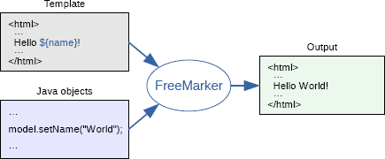

# Day13 Freemarker-网页静态化解决方案

---

## 1. 网页静态化技术FreeMarker
### 1.1. 为什么要使用网页静态化技术

网页静态化解决方案在实际开发中运用比较多，例如新闻网站，门户网站中的新闻频道或者是文章类的频道。

对于电商网站的商品详细页来说，至少几百万个商品，每个商品又有大量的信息，这样的情况同样也适用于使用网页静态化来解决。

网页静态化技术和缓存技术的共同点都是为了减轻数据库的访问压力，但是具体的应用场景不同，缓存比较适合小规模的数据，而网页静态化比较适合大规模且相对变化不太频繁的数据。另外网页静态化还有利于SEO。

另外我们如果将网页以纯静态化的形式展现，就可以使用Nginx这样的高性能的web服务器来部署。Nginx可以承载5万的并发，而Tomcat只有几百。

### 1.2. 什么是Freemarker

FreeMarker是一个用Java语言编写的模板引擎，它基于模板来生成文本输出。FreeMarker与Web容器无关，即在Web运行时，它并不知道Servlet或HTTP。它不仅可以用作表现层的实现技术，而且还可以用于生成XML，JSP或Java等。

官网网址：https://freemarker.apache.org/



### 1.3. FreeMarker入门示例

创建freemarker-test工程，选择jar类型。

#### 1.3.1. 引入依赖

```xml
<dependencies>
    <!-- 引入freemarker依赖 Released on 2018-04-04 -->
    <dependency>
        <groupId>org.freemarker</groupId>
        <artifactId>freemarker</artifactId>
        <version>2.3.28</version>
    </dependency>
</dependencies>
```

教程使用的版本是2.3.26

```xml
<dependency>
    <groupId>org.freemarker</groupId>
    <artifactId>freemarker</artifactId>
    <version>2.3.26-incubating</version>
</dependency>
```

#### 1.3.2. 创建模板文件

模板文件中四种元素：

1. 文本：直接输出的部分
2. 注释：即`<#--...-->`格式不会输出
3. 插值：即`${..}`部分,将使用数据模型中的部分替代输出
4. FTL指令：FreeMarker指令，和HTML标记类似，名字前加`#`予以区分，不会输出。

现在就创建一个简单的创建模板文件hello.ftl：

```html
<!DOCTYPE html>
<html lang="zh-cn">
<head>
    <meta charset="UTF-8">
    <title>FreeMarker示例</title>
    <meta name="Copyright" content="All Rights Reserved"/>
</head>
<body>
    <#--我只是一个注释，我不会有任何输出  -->
    <h1>${name},你好。${message}!</h1>
</body>
</html>
```

> *说明：这里有文本、插值和注释*

#### 1.3.3. 生成文件步骤

使用步骤：

- 第一步：创建一个Configuration对象，直接new一个对象，构造方法的参数就是freemarker的版本号。
- 第二步：设置模板文件加载的基础路径。
- 第三步：设置模板文件使用的字符集。(一般就是UTF-8)
- 第四步：加载一个模板文件产生模板对象。
- 第五步：创建一个模板使用的数据模型，可以是pojo也可以是map，一般是Map。
- 第六步：调用模板对象的process方法填充模版，输出文件。

```java
@Test
public void test1() throws IOException, TemplateException {
    // 1. 创建一个Configuration对象，直接new一个对象，构造方法的参数就是freemarker的版本号
    Configuration configuration = new Configuration(Configuration.VERSION_2_3_28);

    // 2. 设置模板文件加载的基础路径
    configuration.setClassForTemplateLoading(FreeMarkerTest.class, "/ftl");
    // 3. 设置模板文件使用的字符集。(一般是UTF-8)
    configuration.setDefaultEncoding("UTF-8");

    // 4. 根据一个模板文件创建模板对象
    Template template = configuration.getTemplate("hello.ftl");

    // 5. 创建一个模板使用的数据模型，可以是pojo也可以是map，一般是Map。
    Map<String, Object> dataModel = new HashMap<String, Object>();
    dataModel.put("name", "月の哀傷");
    dataModel.put("message", "明天的你一定会感谢今天努力的你！");

    // 6. 调用模板对象的process方法填充模版，输出文件。
    template.process(dataModel, new FileWriter("E:\\Downloads\\hello.html"));
}
```

> 执行后，生成E:\Downloads\hello.html文件

### 1.4. freemarker API
#### 1.4.1. Configuration 类

`public class Configuration extends Configurable implements Cloneable, ParserConfiguration`

构造方法：

- `public Configuration(Version incompatibleImprovements)`
    - 构造函数，入参为当前freemarker版本号

常用方法：

- `public void setClassForTemplateLoading(Class resourceLoaderClass, String basePackagePath)`
    - 设置模板文件加载的基础路径
        - 参数resourceLoaderClass：需要加载模板的类的class字节码对象
        - 参数basePackagePath：模版所在的基础包路径
- `public void setDefaultEncoding(String encoding)`
    - 设置模版文件的默认编码，入参encoding为编码名称
- `public Template getTemplate(String name) throws TemplateNotFoundException, MalformedTemplateNameException, ParseException, IOException`
    - 根据一个模版文件，创建模版对象，入参name是需要加载的模版名称

#### 1.4.2. Template 类

`public class Template extends Configurable`

常用方法：

- `public void process(Object dataModel, Writer out) throws TemplateException, IOException`
    - 填充模版数据，输出生成的文件
        - 参数dataModel：模板使用的数据模型，可以是pojo也可以是map，一般是Map。
        - 参数out：文件输出流

### 1.5. FTL指令
#### 1.5.1. assign变量指令

语法：`<#assign 变量名="xxx"/>` 或 `<#assign 变量名={属性1:值1, 属性2:值2, ...}/>`

说明：此指令用于在模版页面上定义一个变量

- 定义简单类型

```html
<#-- 定义变量 -->
<#assign linkman="周先生"/>
<#assign age=20/>
联系人: ${linkman} --> ${age}
```

- 定义对象类型

```html
<#-- 定义变量: 对象类型 -->
<#assign user={"name":"傷月","sex":"男","age":18}/>
${user.name} --> ${user.sex} --> ${user.age}
```

#### 1.5.2. include包含指令

语法：`<#include "模版文件.ftl"/>`

说明：此指令用于包含模板文件

- 创建模板文件header.ftl：

```
<h1>我是模板header.ftl头部文件</h1>
```

- 修改hello.ftl，在模板文件中使用include指令包含header.ftl模板

```html
<#-- 包含头部 -->
<#include "header.ftl"/>
```

#### 1.5.3. if条件指令

语法：

```html
<#if 变量名(条件)>
    当变量名(条件)为true时输出
<#else>
    当变量名(条件)为false时输出
</#if>
```

说明：根据条件输出不同的内容

- 在模板文件上添加

```html
<#-- 条件指令1 -->
<#if success>
    通过认证
<#else>
    没通过认证
</#if>

<#-- 条件指令2 -->
<#assign age=32/>
<#if age gt 40 >
    大于40
<#elseif age gt 30>
    大于30
<#else>
    小于等于30
</#if>
```

- 在代码中对success变量赋值

```java
dataModel.put("success", true);
```

#### 1.5.4. list迭代指令

语法：`<#list 集合 as 变量名>`

说明：用于迭代集合元素

- 需求，实现用户信息列表，代码中对变量users赋值

```java
List<Map<String, Object>> users = new ArrayList<>();
Map<String, Object> map1 = new HashMap<>();
map1.put("name", "敌法师");
map1.put("age", 30);

Map<String, Object> map2 = new HashMap<>();
map2.put("name", "剑圣");
map2.put("age", 25);

Map<String, Object> map3 = new HashMap<>();
map3.put("name", "凌月");
map3.put("age", 20);
users.add(map1);
users.add(map2);
users.add(map3);

dataModel.put("users", users);
```

- 在模板文件上添加

```html
<#-- 迭代指令 -->
<table border="1" width="300px">
    <tr>
        <th>编号</th>
        <td>姓名</td>
        <td>年龄</td>
    </tr>
    <#list users as u>
        <tr>
            <td>${u_index + 1}</td>
            <td>${u.name}</td>
            <td>${u.age}</td>
        </tr>
    </#list>
</table>
```

<font color="red">***说明：如果想在循环中得到索引，使用"循环变量_index"就可以得到。***</font>

### 1.6. 内建函数

内建函数语法格式：`变量?函数名称`

#### 1.6.1. size函数：获取集合大小

通常要得到某个集合的大小，可以使用size函数来实现

```html
<#-- 迭代指令 -->
<table border="1" width="300px">
    <tr>
        <th>编号</th>
        <td>姓名</td>
        <td>年龄</td>
    </tr>
    <#list users as u>
        <tr>
            <td>${u_index + 1}</td>
            <td>${u.name}</td>
            <td>${u.age}</td>
        </tr>
    </#list>
</table>
共有${users?size}条记录！
```

#### 1.6.2. eval函数：转换JSON字符串为对象

将json字符串转换为对象

```html
<#-- 把json字符串转化成对象 -->
<#assign text="{'bank':'工商银行','account':'10101920201920212'}"/>
<#assign data=text?eval/>
${data.bank} --> ${data.account}
```

#### 1.6.3. date、time、datetime、string函数：日期格式化

- 在java代码中对变量赋值：

```java
dataModel.put("today", new Date());
```

- 在模板文件中加入

```html
<#-- 日期格式化函数 -->
当前日期：${today?date} <br/>
当前时间：${today?time} <br/>
当前日期+时间：${today?datetime} <br/>
日期格式化：  ${today?string("yyyy年MM月dd日 HH:mm:ss")}
```

#### 1.6.4. c函数：数字转换为字符串

说明：当需要将数字按原样输出，即不带“,”号

- 代码中对变量赋值：

```java
dataModel.put("point", 102920122);
```

- 修改模板

```html
累计积分：${point}
```

页面显示结果：`1,092,902,200`

数字会以每三位一个分隔符显示，有些时候不需要这个分隔符，就需要将数字转换为字符串，使用内建函数c

```html
累计积分：${point?c}
```

页面显示结果：`1092902200`

### 1.7. 空值处理运算符

如果在模板中使用了变量但是在代码中没有对变量赋值，那么运行生成时会抛出异常。但是有些时候，有的变量确实是null，怎么解决这个问题呢？

#### 1.7.1. `??`：判断某变量是否存在

语法格式：`variable??`；如果该变量`variable`存在，返回true否则返回false

```html
<#if aaa??>
    aaa变量存在
<#else>
    aaa变量不存在
</#if>
```

#### 1.7.2. `!`：缺失变量默认值

语法格式：`变量名!默认值`；除了可以判断是否为空值，也可以使用`!`对null值做转换处理

在模板文件中加入：

```html
${aaa!'默认值'}
```

在代码中不对aaa赋值，也不会报错了，当aaa为null则返回`!`后边的内容"默认值"

### 1.8. 运算符
#### 1.8.1. 算数运算符

FreeMarker支持的算术运算符包括：`+、 -、 *、/、%`

#### 1.8.2. 逻辑运算符

- `&&`：逻辑与
- `||`：逻辑或：
- `!`：逻辑非：

#### 1.8.3. 比较运算符

- `==`：判断两个值是否相等
- `!=`：判断两个值是否不等
- `>或者gt`：判断左边值是否大于右边值
- `>=或者gte`：判断左边值是否大于等于右边值
- `<或者lt`：判断左边值是否小于右边值
- `<=或者lte`：判断左边值是否小于等于右边值

<font color="red">**注意:**</font> `==`和`!=`可以用于字符串，数值和日期来比较是否相等，但`==`和`!=`两边必须是相同类型的值，否则会产生错误，而且FreeMarker是精确比较，"x","x ","X"是不等的。其它的运行符可以作用于数字和日期，但不能作用于字符串，大部分的时候，使用gt等字母运算符代替`>`会有更好的效果，因为FreeMarker会把`>`解释成FTL标签的结束字符，当然，也可以使用括号来避免这种情况，如:`<#if (x>y)>`。

例：

```html
<#-- 运算符 -->
${20 + 20 - 10  /10 %2} <br/>
<#-- 输出：39 -->
${(!(10 gt 10))?string('true','false')}
<#-- 输出：true -->
```

---

## 2. 商品详情页-数据显示
### 2.1. 需求分析

运用Freemarker技术来实现商品详细页动态展示。通过地址栏输入某地址，如下形式

`http://item.moon.com/149187842867997.html`

访问路径：`http://item.moon.com/SPU商品goodsId.html`

### 2.2. 搭建商品详情web工程
#### 2.2.1. 工程配置

- 创建maven项目pinyougou-item-web，选项war类型。配置pom.xml引入相关依赖

```xml
<?xml version="1.0" encoding="UTF-8"?>
<project xmlns="http://maven.apache.org/POM/4.0.0"
         xmlns:xsi="http://www.w3.org/2001/XMLSchema-instance"
         xsi:schemaLocation="http://maven.apache.org/POM/4.0.0
         http://maven.apache.org/xsd/maven-4.0.0.xsd">
    <parent>
        <artifactId>pinyougou-parent</artifactId>
        <groupId>com.moon</groupId>
        <version>1.0-SNAPSHOT</version>
    </parent>
    <modelVersion>4.0.0</modelVersion>
    <artifactId>pinyougou-item-web</artifactId>
    <packaging>pom</packaging>
    <name>pinyougou-item-web</name>

    <!-- 配置依赖关系 -->
    <dependencies>
        <!-- 日志 -->
        <dependency>
            <groupId>org.slf4j</groupId>
            <artifactId>slf4j-log4j12</artifactId>
        </dependency>
        <!-- spring4 -->
        <dependency>
            <groupId>org.springframework</groupId>
            <artifactId>spring-webmvc</artifactId>
        </dependency>
        <!-- freemarker -->
        <dependency>
            <groupId>org.freemarker</groupId>
            <artifactId>freemarker</artifactId>
        </dependency>
        <dependency>
            <groupId>org.springframework</groupId>
            <artifactId>spring-context-support</artifactId>
        </dependency>
        <!-- dubbo -->
        <dependency>
            <groupId>com.alibaba</groupId>
            <artifactId>dubbo</artifactId>
        </dependency>
        <!-- zookeeper分布式协调服务 -->
        <dependency>
            <groupId>org.apache.zookeeper</groupId>
            <artifactId>zookeeper</artifactId>
        </dependency>
        <!-- zkclient(zookeeper客户端) -->
        <dependency>
            <groupId>com.github.sgroschupf</groupId>
            <artifactId>zkclient</artifactId>
        </dependency>
        <!-- pinyougou-sellergoods-interface -->
        <dependency>
            <groupId>com.moon</groupId>
            <artifactId>pinyougou-sellergoods-interface</artifactId>
            <version>${project.version}</version>
        </dependency>
    </dependencies>

    <!-- 构建部分 -->
    <build>
        <plugins>
            <!-- 配置tomcat插件 -->
            <plugin>
                <groupId>org.apache.tomcat.maven</groupId>
                <artifactId>tomcat7-maven-plugin</artifactId>
                <configuration>
                    <port>9105</port>
                    <path>/</path>
                </configuration>
            </plugin>
        </plugins>
    </build>

</project>
```

- 配置web.xml，配置spring mvc前端控制器拦截`*.html`，因为需要做成伪静态，请求地址必须以`.html`结尾。实际后端没有这个html页面，实际只是一个请求url

```xml
<?xml version="1.0" encoding="UTF-8"?>
<web-app xmlns:xsi="http://www.w3.org/2001/XMLSchema-instance"
         xmlns="http://java.sun.com/xml/ns/javaee"
         xsi:schemaLocation="http://java.sun.com/xml/ns/javaee
         http://java.sun.com/xml/ns/javaee/web-app_3_0.xsd" version="3.0">

    <!-- 配置Spring MVC前端控制器(核心控制器) -->
    <servlet>
        <servlet-name>pinyougou-item-web</servlet-name>
        <servlet-class>org.springframework.web.servlet.DispatcherServlet</servlet-class>
        <init-param>
            <param-name>contextConfigLocation</param-name>
            <param-value>classpath:pinyougou-item-web-servlet.xml</param-value>
        </init-param>
        <load-on-startup>1</load-on-startup>
    </servlet>
    <servlet-mapping>
        <servlet-name>pinyougou-item-web</servlet-name>
        <url-pattern>*.html</url-pattern>
    </servlet-mapping>

    <!-- 配置全局编码过滤器 -->
    <filter>
        <filter-name>characterEncodingFilter</filter-name>
        <filter-class>org.springframework.web.filter.CharacterEncodingFilter</filter-class>
        <init-param>
            <param-name>encoding</param-name>
            <param-value>UTF-8</param-value>
        </init-param>
    </filter>
    <filter-mapping>
        <filter-name>characterEncodingFilter</filter-name>
        <url-pattern>/*</url-pattern>
    </filter-mapping>

    <!-- 欢迎列表 -->
    <welcome-file-list>
        <welcome-file>index.html</welcome-file>
    </welcome-file-list>
</web-app>
```

- 创建spring配置文件pinyougou-item-web-servlet.xml，删除不需要配置mvc消息转换，因为现在返回的不是json格式数据，而是视图模型

```xml
<?xml version="1.0" encoding="utf-8"?>
<beans xmlns="http://www.springframework.org/schema/beans"
       xmlns:xsi="http://www.w3.org/2001/XMLSchema-instance"
       xmlns:mvc="http://www.springframework.org/schema/mvc"
       xmlns:dubbo="http://code.alibabatech.com/schema/dubbo"
       xsi:schemaLocation="http://www.springframework.org/schema/beans
                  http://www.springframework.org/schema/beans/spring-beans.xsd
                  http://www.springframework.org/schema/mvc
                  http://www.springframework.org/schema/mvc/spring-mvc.xsd
                  http://code.alibabatech.com/schema/dubbo
                  http://code.alibabatech.com/schema/dubbo/dubbo.xsd">

    <!-- 开启MVC注解驱动 -->
    <mvc:annotation-driven/>

    <!-- 配置静态资源用WEB容器默认的servlet来处理 -->
    <mvc:default-servlet-handler/>

    <!-- 配置FreeMarkerConfigurer -->
    <bean id="freeMarkerConfigurer"
          class="org.springframework.web.servlet.view.freemarker.FreeMarkerConfigurer">
        <!-- 设置模版文件加载的基础路径 -->
        <property name="templateLoaderPath" value="/WEB-INF/ftl"/>
        <!-- 设置模版页面的编码 -->
        <property name="defaultEncoding" value="UTF-8"/>
    </bean>
    <!-- 配置FreeMarker视图解析器 -->
    <bean class="org.springframework.web.servlet.view.freemarker.FreeMarkerViewResolver">
        <!-- 设置输出的内容类型 -->
        <property name="contentType" value="text/html;charset=UTF-8"/>
        <!-- 设置后缀名 -->
        <property name="suffix" value=".ftl"/>
    </bean>

    <!-- ############## 配置dubbo服务消费者 ############## -->
    <!-- 配置当前应用的名称 -->
    <dubbo:application name="pinyougou-item-web"/>
    <!-- 配置zookeeper作为注册中心，发现服务地址 -->
    <dubbo:registry address="zookeeper://192.168.12.131:2181"/>
    <!-- 配置采用包扫描来引用服务，产生服务接口的代理对象 -->
    <dubbo:annotation package="com.pinyougou.item.controller"/>

</beans>
```

- 创建log4j.properties
- 配置域名访问
    - 修改Hosts：`127.0.0.1  item.moon.com`
    - 修改nginx.conf配置反向代理

    ```conf
    server {
		listen       80;
		server_name  item.moon.com;

		proxy_set_header X-Forwarded-Host $host;
		proxy_set_header X-Forwarded-Server $host;

		location / {
			   proxy_pass http://127.0.0.1:9105;
			   proxy_connect_timeout 600;
			   proxy_read_timeout 600;
		}
	}
    ```

#### 2.2.2. 商家服务工程(pinyougou-sellergoods)

在pinyougou-sellergoods商家服务工程，GoodsService服务与GoodsServiceImpl实现类，增加获取商品

```java
/**
 * 根据SPU的id查询商品信息(SPU数据、商品描述、SKU数据)
 *
 * @param goodsId SPU商品的id
 * @return 商品模版数据模型
 */
Map<String, Object> getGoods(Long goodsId);

@Override
public Map<String, Object> getGoods(Long goodsId) {
    try {
        /* 定义商品模版的数据模型 */
        Map<String, Object> dataModel = new HashMap<String, Object>();

        // 查询SPU商品表数据
        Goods goods = goodsMapper.selectByPrimaryKey(goodsId);
        dataModel.put("goods", goods);

        // 查询商品描述信息数据
        GoodsDesc goodsDesc = goodsDescMapper.selectByPrimaryKey(goodsId);
        dataModel.put("goodsDesc", goodsDesc);

        return dataModel;

    } catch (Exception e) {
        e.printStackTrace();
        throw new RuntimeException(e);
    }
}
```

#### 2.2.3. 商品详情工程控制层(pinyougou-item-web)

- 修改pinyougou-item-web工程中的ItemController，增加根据id查询商品信息的方法

```java
/**
 * 商品详情控制器
 */
@Controller
public class ItemController {

    /* 注入商品服务接口 */
    @Reference(timeout = 30000)
    private GoodsService goodsService;

    /**
     * 使用Restful风格根据商品id查询相应的商品
     * http://item.moon.com/5089275.html
     *
     * @param goodsId 商品id
     * @param model
     * @return 返回视图字符串
     */
    @GetMapping("/{goodsId}")
    public String getGoods(@PathVariable("goodsId") Long goodsId, Model model) {
        // 根据主键id查询商品数据
        Map<String, Object> dataModel = goodsService.getGoods(goodsId);

        // 设置响应的模型数据
        model.addAllAttributes(dataModel);

        // 返回字符串，设置响应视图
        return "item";
    }
}
```

- 将【资料\商品静态资源】目录下的css、js、img、plugins文件夹拷贝至src/main/webapp目录下。
- 将【资料\商品静态资源\item.html】拷贝至WEB-INF/ftl下，修改扩展名为ftl，将商品名称用插值代替(170行)：

```html
<div class="sku-name">
   <h4>${goods.goodsName}</h4>
</div>
```

*测试访问路径：http://item.moon.com/149187842867997.html*

---

### 2.3. 商品详情页模板构建
#### 2.3.1. 模板模块化引入

此时item.ftl内容较多，当编辑时不容易快速找到编辑的位置，所以将头部分拆分到header.ftl，将尾部拆分到footer.ftl，用include指令在item.ftl中引入。(静态页面参考：【资料\商品静态资源\static\三个html页面】)


在item.ftl页面包含header.ftl与footer.ftl

```html
<#-- 包含header.ftl -->
<#include "header.ftl"/>
......
<#-- 包含footer.ftl -->
<#include "footer.ftl"/>
```

#### 2.3.2. 生成基本数据

- 在模板中找到相应的位置，用插值替换静态文本item.ftl(66行)

```html
<div class="sku-name">
	<h4>${goods.goodsName}</h4>
</div>
<div class="news"><span>${goods.caption}</span></div>
```

- item.ftl(76行)

```html
<div class="fl price">
	<i>¥</i>
	<em>${goods.price}</em>
	<span>降价通知</span>
</div>
```

- item.ftl(422行)

```html
<div class="intro-detail">
    ${goodsDesc.introduction}
</div>
```

- item.ftl(426行)

```html
<div id="two" class="tab-pane">
	<p>${goodsDesc.packageList}</p>
</div>
<div id="three" class="tab-pane">
	<p>${goodsDesc.saleService}</p>
</div>
```

- 运行控制层代码，测试效果：
    - http://item.moon.com/149187842867997.html

#### 2.3.3. 生成图片列表

- 编辑模板文件item.ftl(40行)，使用eval函数，将数据库返回的json字符串转成json对象

```html
<#-- 图片列表，把itemItemgs的json字符串转化json数组 -->
<#assign imageList=goodsDesc.itemImages?eval/>
```

- 图片显示部分，以json集合第一张为大图显示，其他的迭代生成缩略图

```html
<!--放大镜效果-->
<div class="zoom">
	<!--默认第一个预览-->
	<div id="preview" class="spec-preview">
		<span class="jqzoom">
            <#if imageList?size gt 0>
                
            </#if>
        </span>
	</div>
	<!--下方的缩略图-->
	<div class="spec-scroll">
		<a class="prev">&lt;</a>
		<!--左右按钮-->
		<div class="items">
            <ul>
                <#list imageList as image>
                    <li>
                        
                    </li>
                </#list>
			</ul>
		</div>
		<a class="next">&gt;</a>
	</div>
</div>
```

#### 2.3.4. 生成扩展属性列表

- 修改模板，首先进行json转换(item.ftl 408行)

```html
<#-- 定义扩展属性 -->
<#assign customAttributeList=goodsDesc.customAttributeItems?eval/>
```

- 显示扩展属性数据，如果扩展属性为空则不显示此条数据(410行)：

```html
<#-- 定义扩展属性 -->
<#assign customAttributeList=goodsDesc.customAttributeItems?eval/>
<ul class="goods-intro unstyled">
    <#list customAttributeList as item>
        <#if item.value??>
            <li>${item.text}:${item.value}</li>
        </#if>
    </#list>
</ul>
```

#### 2.3.5. 生成规格列表

- 修改模板，转换规格列表为JSON对象(116行)

```html
<#-- 定义规格选项数据 -->
<#assign specificationList=goodsDesc.specificationItems?eval/>
```

- 需要使用嵌套循环(120行)

```html
<div id="specification" class="summary-wrap clearfix">
    <#-- 定义规格选项数据 -->
    <#assign specificationList=goodsDesc.specificationItems?eval/>
    <#list specificationList as s>
        <dl>
            <dt>
                <div class="fl title">
                    <i>${s.attributeName}</i>
                </div>
            </dt>
            <#list s.attributeValue as item>
                <dd><a href="javascript:;">${item}</a></dd>
            </#list>
        </dl>
    </#list>
</div>
```

#### 2.3.6. 生成商品类型面包屑

- 修改服务层GoodsServiceImpl的getGoods()方法，读取三级商品分类名称，加入到数据模型中

```java
@Override
public Map<String, Object> getGoods(Long goodsId) {
    try {
        ......
        // 查询商品描述信息数据
        ......

        // 查询商品三级分类
        if (goods != null & goods.getCategory3Id() != null) {
            // 查询1级分类
            String itemCat1 = itemCatMapper
                    .selectByPrimaryKey(goods.getCategory1Id()).getName();
            // 查询2级分类
            String itemCat2 = itemCatMapper
                    .selectByPrimaryKey(goods.getCategory2Id()).getName();
            // 查询3级分类
            String itemCat3 = itemCatMapper
                    .selectByPrimaryKey(goods.getCategory3Id()).getName();
            // 放到数据模型中
            dataModel.put("itemCat1", itemCat1);
            dataModel.put("itemCat2", itemCat2);
            dataModel.put("itemCat3", itemCat3);
        }

        return dataModel;
        ......
}
```

- 修改模板，展示商品分类面包屑(23行)

```html
<ul class="sui-breadcrumb">
	<li>
		<a href="#">${itemCat1}</a>
	</li>
	<li>
		<a href="#">${itemCat2}</a>
	</li>
	<li>
		<a href="#">${itemCat3}</a>
	</li>
	<li class="active">iphone 6S系类</li>
</ul>
```

---

## 3. 商品详情页-前端逻辑
### 3.1. 购买数量加减操作
#### 3.1.1. 前端控制层

在js目录下创建controller文件夹，创建itemController.js。增加数量加减的方法

```js
/* 定义商品详情控制器 */
app.controller('itemController', function ($scope) {

    /* 定义购买数量操作方法 */
    $scope.addNum = function (x) {
        $scope.num += x;
        // 判断num小于1时，不能再减
        if ($scope.num <= 1) {
            $scope.num = 1;
        }
    };

});
```

*说明：在方法中控制数量不能小于1*

#### 3.1.2. 商品详情模板

- item.ftl中引入相关js、控制层js

```html
<#-- 引入js -->
<script type="text/javascript" src="plugins/angularjs/angular.min.js"></script>
<script src="js/base.js"></script>
<script src="js/controller/itemConroller.js"></script>
```

- 初始化指令

```html
<body ng-app="pinyougou" ng-controller="itemController"
      ng-init="num=1">
```

- 调用操作数量的方法(140行)

```html
<div class="controls">
	<input autocomplete="off" type="text"
           value="{{ num }}" minnum="1" class="itxt" />
	<a href="javascript:void(0)" class="increment plus"
       ng-click="addNum(1);">+</a>
	<a href="javascript:void(0)" class="increment mins"
       ng-click="addNum(-1);">-</a>
</div>
```

### 3.2. 规格选择

最终需要实现的效果:


#### 3.2.1. 前端控制层

修改itemController.js，定义选择规格方法

```js
/* 定义变量记录用户选择的规格选项 */
$scope.specItems = {};
/* 定义用户选择的规格选项的方法 */
$scope.selectedSpec = function (name, value) {
    /*
     * 如果需要取消选择，则执行以下逻辑，但本次规格是默认都要选中，
     *      所以不做取消选择的功能
     */
    // 判断如果再次点击，则将删除的值，即取消选择
    if ($scope.specItems[name] == value) {
        delete $scope.specItems[name];
        return;
    }
    // 点击后将值绑定到定义的选择对象中
    $scope.specItems[name] = value;
};

/* 判断用户是否选中该规格选项 */
$scope.isSelected = function (name, value) {
    return $scope.specItems[name] == value;
};
```

#### 3.2.2. 商品详情模版

页面调用控制器的方法(128行)

```html
<#list s.attributeValue as item>
    <dd>
        <a href="javascript:;"
           class="{{ isSelected('${s.attributeName}', '${item}') ? 'selected' : ''}}"
           ng-click="selectedSpec('${s.attributeName}', '${item}')">
            ${item}<span title="点击取消选择">&nbsp;</span>
        </a>
    </dd>
</#list>
```

---

## 4. 商品详情页-读取SKU信息

需求：当选择规格后，应该在页面上更新商品名称为SKU的商品标题，价格也应该为SKU的商品价格。

### 4.1. 页面生成SKU列表变量
#### 4.1.1. 后端服务层

修改pinyougou-sellergoods-service的GoodsServiceImpl的getGoods()方法，增加条件查询sku商品的数据

```java
@Override
public Map<String, Object> getGoods(Long goodsId) {
        ......
        // 查询商品三级分类
        ......

        /* 查询SKU表中的商品数据 */
        Example example = new Example(Item.class);
        // 创建查询条件对象
        Example.Criteria criteria = example.createCriteria();
        // 设置查询条件
        criteria.andEqualTo("goodsId", goods.getId());
        criteria.andEqualTo("status", "1");
        // 排序 (默认的排在最前面)
        example.orderBy("isDefault").desc();

        List<Item> itemList = itemMapper.selectByExample(example);
        // 设置到数据模型中（转成字符串返回前端）
        dataModel.put("itemList", JSON.toJSONString(itemList));

        return dataModel;
        ......
}
```

#### 4.1.2. 模板页面

修改模板item.ftl，初始化sku商品数据

```html
<script type="text/javascript">
    // 定义SKU列表数据
    var skuList = ${itemList};
</script>
```

### 4.2. 显示SKU标题和价格
#### 4.2.1. 加载默认SKU信息

- 修改itemController.js，增加加载默认的sku商品数据

```js
/* 加载默认的一个SKU商品数据 */
$scope.loadSku = function () {
    // 取第一个SKU具体商品
    $scope.sku = skuList[0];
    // 取SKU商品中的规格选项
    $scope.specItems = JSON.parse($scope.sku.spec);
};
```

- 修改模板item.ftl，初始化调用方法

```html
<body ng-app="pinyougou" ng-controller="itemController"
      ng-init="num=1;loadSku();">
```

- 修改模板，显示标题

```html
<div class="sku-name">
	<h4>{{ sku.title }}</h4>
</div>
```

- 显示价格

```html
<div class="fl price">
	<i>¥</i>
	<em>{{ sku.price }}</em>
	<span>降价通知</span>
</div>
```

#### 4.2.2. 选择规格更新SKU

- 修改itemController.js, 查询当前用户选择的SKU

```js
/* 根据用户选中的规格选项，查找对应的SKU商品 */
$scope.searchSku = function () {
    // 循环所有sku商品
    for (let i = 0; i < skuList.length; i++) {
        // 偷懒，直接转成字符串去比较，不严谨，如果属性的位置不一样，就不能成功判断了
        if (skuList[i].spec == JSON.stringify($scope.specItems)) {
            // 将比较相等的值赋给sku变量
            $scope.sku = skuList[i];
            break;
        }
    }
};
```

- 修改原有的selectSpec函数，在用户选择规格后触发，读取用户选择sku商品数据方法

```html
$scope.selectedSpec = function (name, value) {
    // 点击后将值绑定到定义的选择对象中
    $scope.specItems[name] = value;
    // 查找对应的SKU商品
    $scope.searchSku();
};
```

### 4.3. 添加商品到购物车

修改itemController.js，增加添加到购物车方法

```js
/* 定义添加商品到购物车方法 */
$scope.addToCart = function () {
    // 模拟，校验是否可以获取用户选择的sku商品数据，现暂无实现该功能
    alert("用户选择了sku商品id是：" + $scope.sku.id + "；购买数量：" + $scope.num);
};
```

修改模板，页面展示(161行)：

```html
<ul class="btn-choose unstyled">
	<li>
		<a href="#" target="_blank"
           ng-click="addToCart();"
           class="sui-btn  btn-danger addshopcar">加入购物车</a>
	</li>
</ul>
```

---

## 5. 系统模块对接
### 5.1. 搜索系统与商品详细页对接

修改pinyougou-search-web工程的search.html，修改点击图片的链接为`http://item.pinyougou.com/{{item.goodsId}}.html`(330行)

```html
<div class="p-img">
	<a href="http://item.moon.com/{{ item.goodsId }}.html"
       target="_blank"></a>
</div>
```
