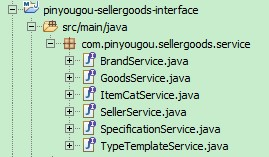
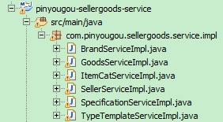
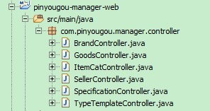
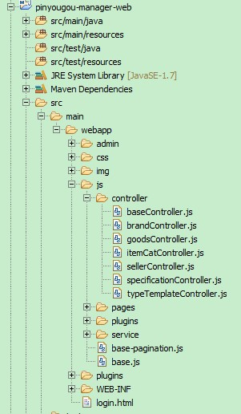
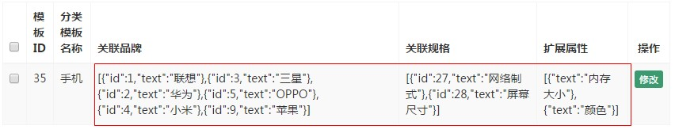
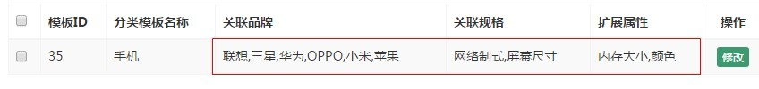
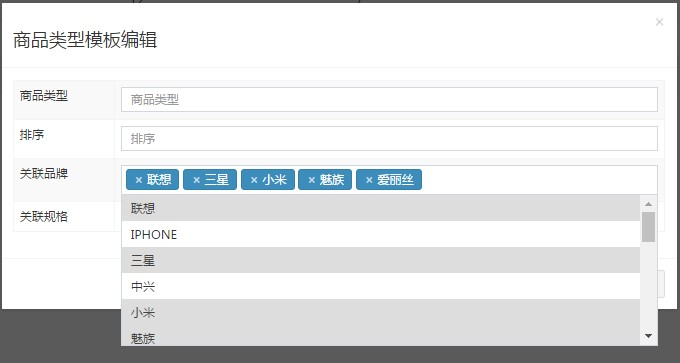
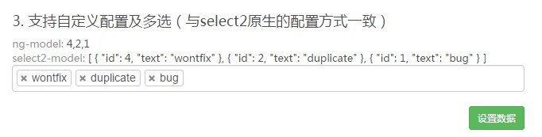
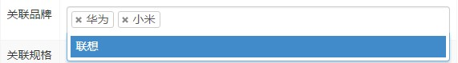

# Day04 Angular前端分层 & 规格及模板管理

---

## 1. 前端分层开发
### 1.1. 分层开发需求分析

前端页面的JS和html都放在一起，并不利于后期的维护。可以在前端代码中也运用MVC的设计模式，将代码进行分离，提高程序的可维护性。

### 1.2. 前端页面mvc分层
#### 1.2.1. 前端基础层

- 在pinyougou-manager-web工程js目录下创建base.js

```js
/* 定义基础模块（不带分布模块） */
var app = angular.module('pinyougou', []);
```

- 再创建base-pagination.js

```js
/* 定义基础模块(带分页模块) */
var app = angular.module('pinyougou', ['pagination']);
```

- 说明：一个用于不需要分页功能的页面，一个用于需要分页功能的页面

#### 1.2.2. 前端服务层

- 在pinyougou-manager-web工程js文件夹下创建service文件夹，创建baseService.js

```js
/* 定义基础服务层,公用的js代码 */
app.service('baseService', function ($http) {
    /* 定义发送get请求方法(带请求参数或不带请求参数) */
    this.sendGet = function (url, data) {
        /* 判断传入的数据是否有效 */
        if (data) {
            url = url + "?" + data;
        }

        /* 返回发送get请求 */
        return $http.get(url);
    };

    /* 定义发送post请求方法(带请求参数或不带请求参数) */
    this.sendPost = function (url, data) {
        /* 判断传入的数据是否有效 */
        if (data) {
            /* 带请求参数 */
            return $http.post(url, data);
        } else {
            /* 不带请求参数 */
            return $http.post(url);
        }
    };

    /* 定义根据id查询方法 */
    this.findOne = function (url, id) {
        return this.sendGet(url, "id=" + id);
    };

    /* 分页查询(带查询条件或不带查询条件) */
    this.findByPage = function (url, page, row, data) {
        /* 定义分页url */
        url += "?page=" + page + "&rows=" + row;

        /* 判断是否有查询条件 */
        if (data && JSON.stringify(data) !== "{}") {
            // 使用get发送查询请求
            return $http({
                method: 'get',
                url: url,
                params: data
            });
        } else {
            // 无查询条件
            return this.sendGet(url);
        }
    };

    /* 定义删除或者批量删除的方法 */
    this.deleteById = function (url, ids) {
        /* 判断ids是否为数组 */
        if (ids instanceof Array) {
            return this.sendGet(url, "ids=" + ids);
        } else {
            return this.sendGet(url, "id=" + ids);
        }
    };
});
```

- 创建品牌服务层brandService.js，用于封装处理品牌的专用js方法（如果有的话）

```js
/* 定义品牌服务层，用于封装处理品牌的专用js方法 */
app.service('brandService', function ($http) {});
```

### 1.3. 控制器继承

- 有些功能是每个页面都有可能用到的，比如分页，复选等等，如果再开发另一个功能，还需要重复编写。通过继承的方式来实现让这些通用的功能只写一次。
- 语法格式：`$controller("baseController",{$scope:$scope});`
- <font color="red">说明：$controller也是angular提供的一个服务，可以实现伪继承，实际上就是与BaseController共享$scope</font>

#### 1.3.1. 前端控制层-创建父控制器

- 在pinyougou-manager-web的js/controller目录下建立baseController.js。
- 将定义分页配置信息对象、reload()方法、定义ids数组封装删除的id放到父控制器中

```js
/* 定义基础的控制器层 */
app.controller('baseController', function ($scope) {

    // 定义初始化分页组件需要的配置信息对象（对象对应传递tm-pagination组件的conf属性）
    $scope.paginationConf = {
        currentPage : 1,    // 当前页码
        totalItems : 0,     // 总记录数
        itemsPerPage : 10,  // 每页显示的记录数
        perPageOptions : [10, 20 ,30], // 页码下拉列表框
        onChange : function(){ // 当页码改变监听事件
            /** 重新加载数据 */
            $scope.reload();
        }
    };

    /* 定义监听页码改变后事件，重新加载数据的方法 */
    $scope.reload = function () {
        // 传入当前页码与每页大小，重新调用分页查询方法即可
        $scope.search($scope.paginationConf.currentPage,
            $scope.paginationConf.itemsPerPage);
    };

    /* 定义选中的id数组 */
    $scope.ids = new Array();
    /* 定义checkbox点击事件方法，获取选取id数组 */
    $scope.updateSelection = function ($event, id) {
        // 判断当前checkbox是否选中
        if ($event.target.checked) {
            // 选中复选框，将id添加到数组中
            $scope.ids.push(id);
        } else {
            // 取消选择，则根据id的值获取对应数组中的索引
            var index = $scope.ids.indexOf(id);

            // 根据元素的索引号从数组中移除
            $scope.ids.splice(index, 1);
        }

        /* 判断全选是否选中 */
        $scope.ck_all = $scope.ids.length == $scope.dataList.length;

        // 测试使用(待删)
        console.log("选中的id===" + JSON.stringify($scope.ids));
    };

    /* 为全选checkbox绑定点击事件 */
    $scope.checkAll = function() {
        // 判断全选checkbox是选中还中没选中
        if ($scope.ck) {
            // 注意，如果之前有选中的话，要选将数组清空，再增加，不然会出现重复的id
            $scope.ids = [];
            // 循环请求后端返回的数据集合dataList
            for (var i = 0; i < $scope.dataList.length; i++) {
                $scope.ids.push($scope.dataList[i].id);
            }
        } else {
            // 全选复选框没有选中，则将选择的id数组清空
            $scope.ids = [];
        }
        alert("点击全选====" + $scope.ids);
    };

});
```

#### 1.3.2. 前端控制器层（例：品牌模块）

修改brandController.js，指定继承baseController.js

```js
/* 定义品牌控制器层 */
app.controller('brandController', function ($scope, $controller, baseService) {

    /* 指定继承的baseController，将baseController的scope赋值给此controller的scope */
    $controller('baseController', {$scope: $scope});


    // 获取所有品牌数据（不分页查询，可删）
    $scope.findAll = function () {
        // 调用服务层，发送异步get请求查询后台
        baseService.sendGet('/brand/findAll').then(function (response) {
            $scope.dataList = response.data;
        }, function (response) {
            alert("获取品牌列表数据失败！");
        })
    };

    /* 定义封装查询条件对象 */
    $scope.searchEntity = {};
    /* 定义分页查询的方法 */
    $scope.search = function (page, rows) {
        /* 调用服务层，送异步请求分页查询品牌数据 */
        baseService.findByPage('/brand/findByPage', page, rows, $scope.searchEntity)
            .then(function (response) {
            // 请求成功回调函数.获取响应数据，赋值给dataList
            $scope.dataList = response.data.rows;
            // 更新分页组件中的总记录数
            $scope.paginationConf.totalItems = response.data.total;
        }, function (response) {
            alert("获取品牌列表分页数据失败！");
        });
    };

    /* 定义添加或修改的方法 */
    $scope.saveOrUpdate = function () {
        // 定义默认url
        var url = 'save';

        // 判断是新增还是修改
        if ($scope.entity.id) {
            // 如果发送到后端的对象id属性不为空，则是修改操作
            url = 'update';
        }

        // 调用服务层，使用post方法发送异步请求发送对象到后台
        baseService.sendPost('/brand/' + url, $scope.entity)
            .then(function (response) {
                // 判断返回的结果，后端返回的是boolean
                if (response.data) {
                    // 成功新增后，重新刷新页面
                    $scope.reload();
                } else {
                    alert("操作失败")
                }
            })
    };

    /* 定义点击修改按钮显示对象数据的方法 */
    $scope.show = function (entity) {
        // 把entity对象解析成一个新的对象，否则修改此对象就是修改列表的该数据
        $scope.entity = JSON.parse(JSON.stringify(entity));
    };

    /* 定义批量删除品牌的方法 */
    $scope.delete = function () {
        // 判断是否有选中复选框
        if ($scope.ids.length > 0) {
            // 调用业务层删除方法，发送get异步请求
            baseService.deleteById('/brand/delete', $scope.ids)
                .then(function (response) {
                    if (response.data) {
                        // 删除成功，重新加载页面
                        $scope.reload();
                    } else {
                        alert("操作失败");
                    }
                });
            // 删除操作后，无论成功与否，都清空id数组
            $scope.ids = [];
            // 使用所有复选框不选中
            $scope.ck = false;
            $scope.ck_all = false;
        } else {
            // 提示至少选择1个品牌
            alert("请至少选择1个要删除的品牌！");
        }
    };
});
```

### 1.4. 修改原来brand.html页面

将brand.html原来js代码删除，直接导入所有相关的js文件即可

```html
<!-- 导入angular框架mvc分层后的js文件start -->
<script src="/js/base-pagination.js"></script>
<script src="/js/service/baseService.js"></script>
<script src="/js/controller/baseController.js"></script>
<script src="/js/controller/brandController.js"></script>
<!-- 导入angular框架mvc分层后的js文件end -->
```

## 2. 规格管理模块功能

将商家商品服务相关代码【资料\准备代码】拷贝到工程

1. 拷贝服务接口



2. 拷贝服务实现类



3. 拷贝控制器



4. 拷贝JS



### 2.1. 需求及表格构分析

实现规格管理功能

tb_specification 规格表

|     字段      |   类型   | 长度 |   含义    |
| :------------: | :---------: | :-: | :--------: |
|      id       |  bigint  |     |   主键    |
| spec_name | varchar | 255  | 规格名称 |

tb_specification_option 规格选项表

|       字段       |   类型   | 长度 |      含义      |
| :---------------: | :---------: | :-: | :-------------: |
|        id        |  bigint  |     |      主键      |
| option_name | varchar | 200  | 规格选项名称 |
|    spec_id    |  bigint  |  30  |    规格ID     |
|     orders     |    int    |  11  |      排序      |

### 2.2. 规格列表显示-前端

- 修改pinyougou-manager-web工程的specification.html，引入js，复制品牌管理模块html修改代码

```html
<!-- 导入angular前端框架 -->
<script src="/plugins/angularjs/angular.min.js"></script>
<!-- 导入分页组件start -->
<script src="/plugins/angularjs/pagination.js"></script>
<link rel="stylesheet" href="/plugins/angularjs/pagination.css"/>
<!-- 导入分页组件end -->
<!-- 导入angular框架mvc分层后的js文件start -->
<script src="/js/base-pagination.js"></script>
<script src="/js/service/baseService.js"></script>
<script src="/js/controller/baseController.js"></script>
<script src="/js/controller/specificationController.js"></script>
<!-- 导入angular框架mvc分层后的js文件end -->
```

- 在table后面放置分页组件

```html
<!-- 分页组件 -->
<tm-pagination conf="paginationConf"></tm-pagination>
```

- 在body元素指定模块名和控制器名

```html
<body class="hold-transition skin-red sidebar-mini"
        ng-app="pinyougou" ng-controller="specificationController">
```

- 循环获取表格行数据

```html
<tbody>
	<tr ng-repeat="entity in dataList">
		<td><input type="checkbox"
                   ng-checked="ck"
                   ng-click="updateSelection($event, entity.id);"></td>
		<td>{{ entity.id }}</td>
		<td>{{ entity.specName }}</td>
		<td class="text-center">
			<button type="button" class="btn bg-olive btn-xs"
				data-toggle="modal" data-target="#editModal">修改</button>
		</td>
	</tr>
</tbody>
```

- 修改全选按钮，用于全选删除

```html
<thead>
	<tr>
		<th class="" style="padding-right: 0px">
            <input id="selall" type="checkbox" class="icheckbox_square-blue"
                   ng-model="ck" ng-checked="ck_all" ng-click="checkAll();">
        </th>
		<th class="sorting_asc">规格ID</th>
		<th class="sorting">规格名称</th>
		<th class="text-center">操作</th>
	</tr>
</thead>
```

- 查询条件，添加点击事件和绑定参数

```html
<div class="has-feedback">
	规格名称：<input ng-model="searchEntity.specName">
	<button class="btn btn-default" ng-click="reload();">查询</button>
</div>
```

### 2.3. 规格列表显示-后端

- 根据品牌后台代码修改，规格管理控制层SpecificationController

```java
/**
 * 分页查询规格
 *
 * @param specification 规格查询条件
 * @param page          当前页记录
 * @param rows          每页显示大小
 * @return 封装分页数据
 */
@GetMapping("/findByPage")
public PageResult<Specification> findByPage(Specification specification,
                                            @RequestParam("page") Integer page,
                                            @RequestParam("rows") Integer rows) {
    try {
        // 调用服务接口分页查询方法
        PageResult<Specification> pageResult = specificationService
                .findByPage(specification, page, rows);
        return pageResult;
    } catch (Exception e) {
        e.printStackTrace();
        return null;
    }
}
```

- 规格管理服务类接口SpecificationService与实现类SpecificationServiceImpl

```java
/**
 * 分页条件查询规格
 *
 * @param specification 规格查询条件
 * @param page          当前页记录
 * @param rows          每页显示大小
 * @return 封装分页数据
 */
PageResult<Specification> findByPage(Specification specification, Integer page, Integer rows);
```

```java
/**
 * 注入数据访问层代理对象
 */
@Autowired
private SpecificationMapper specificationMapper;
@Autowired
private SpecificationOptionMapper specificationOptionMapper;

/**
 * 分页条件查询规格
 *
 * @param specification 规格查询条件
 * @param page          当前页记录
 * @param rows          每页显示大小
 * @return 封装分页数据
 */
@Override
public PageResult<Specification> findByPage(Specification specification, Integer page, Integer rows) {
    try {
        // 使用分页助手开启分页，获取pageInfo对象
        PageInfo<Specification> pageInfo = PageHelper.startPage(page, rows)
                .doSelectPageInfo(new ISelect() {
                    @Override
                    public void doSelect() {
                        // 使用自定义动态条件查询方法
                        specificationMapper.findByWhere(specification);
                    }
                });

        // 创建PageResult对象
        PageResult<Specification> pageResult = new PageResult<Specification>();

        pageResult.setTotal(pageInfo.getTotal());
        pageResult.setRows(pageInfo.getList());

        return pageResult;

    } catch (Exception e) {
        throw new RuntimeException(e);
    }
}
```

- mapper接口与映射文件

```java
/**
 * 分页条件查询规格数据
 *
 * @param specification 规格条件查询对象
 * @return 返回规格对象集合
 */
List<Specification> findByWhere(@Param("specification") Specification specification);
```

```xml
<!-- 动态sql多条件查询规格 -->
<select id="findByWhere" resultType="Specification">
    select * from tb_specification
    <where>
        <!-- 先判断输入的对象是否为空 -->
        <if test="specification != null">
            <!-- 判断查询名称的条件 -->
            <if test="specification.specName != null and specification.specName != ''">
                <!-- 使用concat函数拼接字符 -->
                `spec_name` like concat('%', #{specification.specName} ,'%')
            </if>
        </if>
    </where>
    order by id asc
</select>
```

### 2.4. 新增规格
#### 2.4.1. 增加页面，新增行实现

- 给specification.html “新增规格选项” 按钮增加点击事件

```html
<!-- 规格选项 -->
<div class="btn-group">
  <button type="button" class="btn btn-default" title="新建"
          ng-click="addTableRow();">
      <i class="fa fa-file-o"></i> 新增规格选项</button>
</div>
```

- 在循环列表行，绑定表格内的编辑框的值

```html
<tbody>
  <tr ng-repeat="specificationOption in entity.specificationOptions">
        <td>
        	<input ng-model="specificationOption.optionName" class="form-control" placeholder="规格选项">
        </td>
        <td>
        	<input ng-model="specificationOption.orders" class="form-control" placeholder="排序">
        </td>
		<td>
			<button type="button" class="btn btn-default" title="删除" ><i class="fa fa-trash-o"></i> 删除</button>
		</td>
  </tr>
</tbody>
```

- 修改specificationController.js 新增点击新增行方法

```js
/* 为新增规格选项按钮绑定事件(新增一行) */
$scope.addTableRow = function () {
    /* 点击后给对象中specificationOptions属性增加一个空对象 */
    $scope.entity.specificationOptions.push({});
};
```

- 修改specification.html “新建”按钮

```html
<button type="button" class="btn btn-default" title="新建"
	    data-toggle="modal" data-target="#editModal"
        ng-click="entity = {'specificationOptions':[]}">
	<i class="fa fa-file-o"></i> 新建
</button>
```

**注意**：要修改specification.html “新建”按钮，弹出窗口时对entity进行初始化，否则向集合添加数据时会报错！

#### 2.4.2. 增加页面，删除行实现

- 实现思路：在每一行将索引值传递给集合，在集合中删除。
- <font color="red">*注意：$index 用于获取ng-repeat指令循环中的索引。*</font>
- 修改specification.html每行的删除按钮，增加点击事件

```html
<td>
    <button type="button" class="btn btn-default" title="删除"
            ng-click="deleteTableRow($index);">
    <i class="fa fa-trash-o"></i> 删除</button>
</td>
```

- 修改specificationController.js 新增删除方法

```js
/* 根据传入的索引，删除行 */
$scope.deleteTableRow = function (index) {
    $scope.entity.specificationOptions.splice(index, 1);
}
```

#### 2.4.3. 增加页面，提交保存

实现思路：将规格和规格选项数据合并成一个对象来传递，在业务逻辑中，得到对象中的规格和规格选项列表，插入规格返回规格ID，然后循环插入规格选项

- 绑定规格名称

```html
<tr>
	<td>规格名称</td>
	<td><input  ng-model="entity.specName"
                class="form-control" placeholder="规格名称"></td>
</tr>
```

- 点击保存事件

```js
<button ng-click="saveOrUpdate();" class="btn btn-success"
        data-dismiss="modal" aria-hidden="true">保存</button>
```

#### 2.4.4. 保存后台实现

- 修改pinyougou-pojo工程中Specification.java类，增加specificationOptions的List集合属性

```java
/** 规格属性集合 */
@Transient
private List<SpecificationOption> specificationOptions;
```

- 修改控制层SpecificationController

```java
/**
 * 添加规格
 *
 * @param specification 规格实体
 * @return 添加成功/失败标识符
 */
@PostMapping("/save")
public boolean save(@RequestBody Specification specification) {
    try {
        // 调用服务层新增方法
        specificationService.saveSpecification(specification);
        return true;
    } catch (Exception e) {
        e.printStackTrace();
    }
    // 出现异常，更新失败
    return false;
}
```

- 修改SpecificationService、SpecificationServiceImpl，增加添加规格的方法

```java
/**
 * 新增规格
 *
 * @param specification 规格数据实体类
 */
void saveSpecification(Specification specification);

/**
 * 新增规格
 *
 * @param specification 规格数据实体类
 */
@Override
public void saveSpecification(Specification specification) {
    try {
        // 1.调用规格数据访问层保存规格
        specificationMapper.insertSelective(specification);
        // 2.调用规格选项数据访问层保存对应的规格选项
        if (specification.getSpecificationOptions() != null
                && specification.getSpecificationOptions().size() > 0) {
            // 当有规格选项才去新增
            specificationOptionMapper.save(specification);
        }
    } catch (Exception e) {
        e.printStackTrace();
        throw new RuntimeException(e);
    }
}

```

- 修改SpecificationOptionMapper与映射文件，新增`void save(Specification specification);`方法

```xml
<!-- 新增规格选项 -->
<insert id="save">
    insert into tb_specification_option(option_name, spec_id, orders)
    values
    <foreach collection="specificationOptions" item="so" separator=",">
        (#{so.optionName}, #{id}, #{so.orders})
    </foreach>
</insert>
```

### 2.5. 修改规格（不完善，修改时是批量删除所有规格再新增本次数据）
#### 2.5.1. 前端页面

- 修改specification.html，给修改按钮绑定点击事件

```html
<td class="text-center">
    <button type="button" class="btn bg-olive btn-xs"
            data-toggle="modal" data-target="#editModal"
            ng-click="show(entity)">修改</button>
</td>
```

- 修改specificationController.js，调用服务层根据id查询对象的js方法，查询规格下包含的所有规格选项数据

```js
/** 显示修改 */
$scope.show = function(entity){
    // 把entity对象解析成一个新的对象
    $scope.entity = JSON.parse(JSON.stringify(entity));

    // 用服务层根据id查询规格选项的数据
    baseService.findOne("/specification/findOne", entity.id)
        .then(function (response) {
            $scope.entity.specificationOptions = response.data;
    });
};
```

#### 2.5.2. 后端-获取规格数据

- 实现思路：通过规格ID，到后端查询规格选项列表，然后返回结果
- 控制层SpecificationController添加根据id查询规格，返回当前规格下的所有规格选项集合

```java
/**
 * 根据规格id查询规格选项
 *
 * @param id 规格id
 * @return List<SpecificationOption> 返回当前规格下的所有规格选项集合
 */
@GetMapping("/findOne")
public List<SpecificationOption> findOne(@RequestParam("id") Long id) {
    // 调用服务层根据规格id查询方法
    return specificationService.findOne(id);
}
```

- 实现层SpecificationServiceImpl添加根据id查询规格包含的所有规格选项

```java
/**
 * 根据规格id查询规格选项
 *
 * @param id 规格id
 * @return 返回当前规格下的所有规格选项集合
 */
List<SpecificationOption> findOne(Long id);

/**
 * 根据规格id查询规格选项
 *
 * @param id 规格id
 * @return 返回当前规格下的所有规格选项集合
 */
@Override
public List<SpecificationOption> findOne(Long id) {
    try {
        // 调用规格选项数据访问层根据规格id查询所有规格选项
        return specificationOptionMapper.findBySpecId(id);
    } catch (Exception e) {
        e.printStackTrace();
        throw new RuntimeException(e);
    }
}
```

- SpecificationOptionMapper接口，使用注解方式写sql语句(尝试不同的写法)

```java
/**
 * 根据规格id查询规格选项
 *
 * @param id 规格id
 * @return 返回当前规格下的所有规格选项集合
 */
// 使用注解方式写sql语句（配置mapper.xml也能实现）
@Select("select * from tb_specification_option where spec_id = #{id} order by orders asc")
List<SpecificationOption> findBySpecId(Long id);
```

#### 2.5.3. 保存修改后的规格数据

- 控制层SpecificationController添加保存修改的方法

```java
/**
 * 修改规格
 *
 * @param specification 规格实体类
 * @return 成功/失败标识
 */
@PostMapping("/update")
public boolean update(@RequestBody Specification specification) {
    try {
        // 调用服务层修改方法
        specificationService.updateSpecification(specification);
        return true;
    } catch (Exception e) {
        e.printStackTrace();
    }
    return false;
}
```

- 服务层SpecificationService修改方法

```java
/**
 * 修改规格
 *
 * @param specification 规格实体类
 */
void updateSpecification(Specification specification);


/**
 * 修改规格
 *
 * @param specification 规格实体类
 */
@Override
public void updateSpecification(Specification specification) {
    try {
        // 1.调用规格数据访问层修改规格，根据主键更新属性不为null的值
        specificationMapper.updateByPrimaryKeySelective(specification);

        // 2.使用暴力方式实现功能，将规格下所有选项删除，再新增本次所有修改内容（有时间再优化）
        // 2.1调用规格选项mapper根据规格id删除所有（为了不多写方法，直接使用删除多个规格选项时使用的sql）
        Long[] ids = {specification.getId()};
        specificationOptionMapper.deleteBySpecIds(ids);

        // 2.2调用规格选项数据访问层批量新增方法
        if (specification.getSpecificationOptions() != null
                && specification.getSpecificationOptions().size() > 0) {
            // 当有规格选项才去新增
            specificationOptionMapper.save(specification);
        }
    } catch (Exception e) {
        // 更新出现异常
        e.printStackTrace();
        throw new RuntimeException(e);
    }
}
```

- SpecificationOptionMapper接口与映射文件增加根据规格id批量删除的方法

```java
/**
 * 根据规格id批量删除规格选项
 *
 * @param ids 规格id数组
 */
void deleteBySpecIds(@Param("ids") Long[] ids);
```

```xml
<!-- 根据规格id批量删除规格选项 -->
<delete id="deleteBySpecIds">
    delete from tb_specification_option where spec_id in
    <foreach collection="ids" item="id" open="(" separator="," close=")">
        #{id}
    </foreach>
</delete>
```

注：为了兼容后面批量删除的功能，定义入参为id数组

### 2.6. 删除规格

实现思路：要删除规格的同时，还要记得将关联的规格选项删除掉

#### 2.6.1. 后端部分

- 控制层SpecificationController添加批量删除方法

```java
/**
 * 批量删除规格
 *
 * @param ids 规格id数组
 * @return 成功/失败标识
 */
@GetMapping("/delete")
public boolean delete(Long[] ids) {
    try {
        // 调用服务层批量删除方法
        specificationService.deleteSpecification(ids);
        return true;
    } catch (Exception e) {
        e.printStackTrace();
    }
    return false;
}
```

- 服务端SpecificationService接口与现实类编写批量删除方法

```java
/**
 * 批量删除规格
 *
 * @param ids 规格id数组
 */
void deleteSpecification(Long[] ids);

/**
 * 批量删除规格
 *
 * @param ids 规格id数组
 */
@Override
public void deleteSpecification(Long[] ids) {
    try {
        // 使用自定义sql删除，注意先删除从表
        specificationOptionMapper.deleteBySpecIds(ids);
        specificationMapper.deleteSpecification(ids);
    } catch (Exception e) {
        e.printStackTrace();
        throw new RuntimeException(e);
    }
}
```

- 规格mapper接口与映射文件

```java
/**
 * 批量删除规格
 *
 * @param ids 规格id数组
 */
void deleteSpecification(@Param("ids") Long[] ids);
```

```xml
<!-- 根据id批量删除规格 -->
<delete id="deleteSpecification">
    delete from tb_specification where id in
    <foreach collection="ids" item="id" open="(" separator="," close=")">
        #{id}
    </foreach>
</delete>
```

- 规格选项mapper接口与映射文件（在修改规格时已编写好）

#### 2.6.2. 前端页面

- 修改pinyougou-manager-web的specification.html，列表的复选框

```html
<td><input type="checkbox"
           ng-checked="ck"
           ng-click="updateSelection($event, entity.id);"></td>
```

- 删除按钮点击事件

```html
<button type="button" class="btn btn-default" title="删除"
        ng-click="delete();">
	<i class="fa fa-trash-o"></i> 删除
</button>
```

## 3. 模版管理模块功能
### 3.1. 需求及表结构分析

需要理解模板的作用。模板主要有两个：

1. 是用于关联品牌与规格
2. 定义扩充属性

tb_type_template 模板表

|               字段               |   类型   | 长度  |           含义            |
| :-------------------------------: | :---------: | :----: | :------------------------: |
|                id                |  bigint  |        |           主键            |
|              name               | varchar |  80  |         模板名称         |
|           spec_ids            | varchar | 1000 | 关联规格（json格式） |
|           brand_ids           | varchar | 1000 | 关联品牌（json格式） |
| custom_attribute_items | varchar | 2000 | 扩展属性（json格式） |

### 3.2. 模板列表显示

引入模板列表与规格模块代码一致

#### 3.2.1. 模板列表查询显示-前端

- type_template.html引入select2的JS与angular、controller

```html
<!-- 导入angular前端框架 -->
<script src="/plugins/angularjs/angular.min.js"></script>
<!-- 导入分页组件start -->
<script src="/plugins/angularjs/pagination.js"></script>
<link rel="stylesheet" href="/plugins/angularjs/pagination.css"/>
<!-- 导入分页组件end -->
<!-- 导入angular框架mvc分层后的js文件start -->
<script src="/js/base-pagination.js"></script>
<script src="/js/service/baseService.js"></script>
<script src="/js/controller/baseController.js"></script>
<script src="/js/controller/typeTemplateController.js"></script>
<!-- 导入angular框架mvc分层后的js文件end -->
```

- 放置分页组件、初始化指令与页面元素

```html
<!-- 分页组件 -->
<tm-pagination conf="paginationConf"></tm-pagination>
```

```html
<body class="hold-transition skin-red sidebar-mini"
      ng-app="pinyougou" ng-controller="typeTemplateController">
```

```html
<tbody>
    <tr ng-repeat="entity in dataList">
    	<td><input type="checkbox"></td>
    	<td>{{ entity.id }}</td>
    	<td>{{ entity.name }}</td>
    	<td>{{ entity.brandIds }}</td>
    	<td>{{ entity.specIds }}</td>
    	<td>{{ entity.customAttributeItems }}</td>
    	<td class="text-center">
    		<button type="button" class="btn bg-olive btn-xs"
    			data-toggle="modal" data-target="#editModal">修改</button>
    	</td>
    </tr>
</tbody>
```

- 修改typeTemplateController.js与type_template.html，增加条件查询代码

```js
/** 定义搜索对象 */
$scope.searchEntity = {};
/** 分页查询 */
$scope.search = function(page, rows){
    baseService.findByPage("/typeTemplate/findByPage", page,
		rows, $scope.searchEntity)
        .then(function(response){
            $scope.dataList = response.data.rows;
            /** 更新总记录数 */
            $scope.paginationConf.totalItems = response.data.total;
        });
};
```

```html
<div class="has-feedback">
	分类模板名称：<input type="text" ng-model="searchEntity.name"
	                   placeholder="分类模板名称">
	<button class="btn btn-default" ng-click="reload();">查询</button>
</div>
```

#### 3.2.2. 模板列表查询-后端

- 修改TypeTemplateController，增加条件分页查询方法

```java
/**
 * 分页查询类型模版
 *
 * @param typeTemplate  模板查询条件typeTemplate
 * @param page          当前页记录
 * @param rows          每页显示大小
 * @return 封装分页数据
 */
@GetMapping("/findByPage")
public PageResult<TypeTemplate> findByPage(TypeTemplate typeTemplate,
                                            @RequestParam("page") Integer page,
                                            @RequestParam("rows") Integer rows) {
    try {
        // 调用服务接口分页查询方法
        PageResult<TypeTemplate> pageResult = typeTemplateService
                .findByPage(typeTemplate, page, rows);
        return pageResult;
    } catch (Exception e) {
        e.printStackTrace();
        return null;
    }
}
```

- 修改模板接口TypeTemplateService与实现类TypeTemplateServiceImpl，增加查询方法

```java
/**
 * 分页查询类型模版
 *
 * @param typeTemplate 模板查询条件typeTemplate
 * @param page         当前页记录
 * @param rows         每页显示大小
 * @return 封装分页数据
 */
PageResult<TypeTemplate> findByPage(TypeTemplate typeTemplate, Integer page, Integer rows);

/**
 * 分页查询类型模版
 *
 * @param typeTemplate 模板查询条件typeTemplate
 * @param page         当前页记录
 * @param rows         每页显示大小
 * @return 封装分页数据
 */
@Override
public PageResult<TypeTemplate> findByPage(TypeTemplate typeTemplate, Integer page, Integer rows) {

    try {
        // 使用分页助手开启分页，获取pageInfo对象
        PageInfo<TypeTemplate> pageInfo = PageHelper.startPage(page, rows)
                .doSelectPageInfo(new ISelect() {
                    @Override
                    public void doSelect() {
                        // 使用自定义动态条件查询方法
                        typeTemplateMapper.findByWhere(typeTemplate);
                    }
                });

        // 创建PageResult对象
        PageResult<TypeTemplate> pageResult = new PageResult<TypeTemplate>();

        pageResult.setTotal(pageInfo.getTotal());
        pageResult.setRows(pageInfo.getList());

        return pageResult;

    } catch (Exception e) {
        throw new RuntimeException(e);
    }
}


```

- 修改TypeTemplateMapper接口与配置文件，增加动态条件查询方法

```java
/**
 * 分页条件查询模版数据
 *
 * @param typeTemplate 模板条件查询对象
 * @return 返回模版对象集合
 */
List<TypeTemplate> findByWhere(@Param("typeTemplate") TypeTemplate typeTemplate);
```

```xml
<!-- 动态sql多条件查询规格 -->
<select id="findByWhere" resultType="TypeTemplate">
    select * from tb_type_template
    <where>
        <!-- 先判断输入的对象是否为空 -->
        <if test="typeTemplate != null">
            <!-- 判断查询名称的条件 -->
            <if test="typeTemplate.name != null and typeTemplate.name != ''">
                <!-- 使用concat函数拼接字符 -->
                `name` like concat('%', #{typeTemplate.name} ,'%')
            </if>
        </if>
    </where>
    order by id asc
</select>
```

### 3.3. 优化模板列表的显示

- 现在完成的列表中都是以JSON格式显示的，不利于用户的查询。需要将信息以更友好的方式展现出来





- 将一个json字符串中某个属性的值提取出来，用逗号拼接成一个新的字符串。这样的功能比较常用，所以我们将方法写到baseController.js

```js
/** 提取数组中json某个属性，返回拼接字符串，以逗号分隔(使用箭头函数) */
$scope.json2String = (jsonStr, key) => {
    // 将json字符串转换为json对象(或者json数组)
    var json = JSON.parse(jsonStr);
    var resultArray = new Array();

    // 循环数组
    for (let i = 0; i < json.length; i++) {
        // 从数组中取一个元素(json对象)
        resultArray.push(json[i][key]);
    }

    return resultArray.join(", ");
};
```

- 在type_template.html页面上使用该函数进行转换

```html
<tr ng-repeat="entity in dataList">
	<td><input type="checkbox"></td>
	<td>{{ entity.id }}</td>
	<td>{{ entity.name }}</td>
	<td>{{ json2String(entity.brandIds, 'text') }}</td>
	<td>{{ json2String(entity.specIds, 'text') }}</td>
	<td>{{ json2String(entity.customAttributeItems, 'text') }}</td>
	<td class="text-center">
		<button type="button" class="btn bg-olive btn-xs"
			data-toggle="modal" data-target="#editModal">修改</button>
	</td>
</tr>
```

### 3.4. 新增模板-品牌下拉列表

在弹出窗口中有个品牌下拉列表，要求品牌是可以选择多个，这与之前的单选的下拉列表是不同的。实现这个功能，需要使用<font color="red">**select2组件**</font>来完成



#### 3.4.1. select2 组件使用相关配置

- select2需要的数据格式



- 相关属性
    - multiple：表示可多选
    - config：用于配置数据来源
    - select2-model：用于指定用户选择后提交的变量

- type_template.html加入显示品牌下拉列表（静态）：
    - 修改 type_template.html引入JS

    ```html
    <!-- select2组件 start -->
    <link rel="stylesheet" href="/plugins/select2/select2.css" />
    <link rel="stylesheet" href="/plugins/select2/select2-bootstrap.css" />
    <script src="/plugins/select2/select2.min.js"></script>
    <script src="/plugins/select2/angular-select2.js"></script>
    <!-- select2组件 end -->
    ```

     - <font color="red">**注：select2组件js文件必须放在最后，如果放在angular分层之后，组件将读取不到数据。因为html文件是从上往下顺序解析**</font>
     - 修改typeTemplateController.js，定义品牌列表数据

    ```js
    /** 品牌列表 */
    $scope.brandList = {data:[{id:1,text:'联想'},{id:2,text:'华为'},{id:3,text:'小米'}]};
    ```

    - 在type_template.html 用select2组件实现多选下拉框

    ```html
    <input  select2  select2-model="entity.brandIds"
            config="brandList" multiple placeholder="选择品牌（可多选）"
            class="form-control" type="text"/>
    ```

- 最终实现效果如下：



#### 3.4.2. 显示品牌下拉列表-后端返回数据
##### 3.4.2.1. 查询品牌下拉数据-后端代码

- 让下拉列表的数据从数据库中提取，修改后端pinyougou-manager-web工程的BrandController中增加查询所有品牌的方法

```java
/**
 * 查询所有品牌（用于页面下拉框）
 *
 * @return 所有品牌的id与name
 */
@GetMapping("/selectBrandList")
public List<Map<String, Object>> selectBrandList() {
    try {
        // 调用服务层查询方法
        return brandService.findAllByIdAnName();
    } catch (Exception e) {
        e.printStackTrace();
    }
    return null;
}
```

- 修改pinyougou-sellergoods-interface 的BrandService与pinyougou-sellergoods-service的BrandServiceImpl，增加查询方法

```java
/**
 * 查询所有品牌（用于页面下拉框）
 *
 * @return 所有品牌的id与name
 */
List<Map<String, Object>> findAllByIdAnName();


/**
 * 查询所有品牌（用于页面下拉框）
 *
 * @return 所有品牌的id与name
 */
@Override
public List<Map<String, Object>> findAllByIdAnName() {
    try {
        // 调用数据访问层查询方法
        return brandMapper.findAllByIdAnName();
    } catch (Exception e) {
        e.printStackTrace();
        throw new RuntimeException(e);
    }
}
```

- 在pinyougou-mapper工程，在BrandMapper中添加查询方法

```java
/**
 * 查询所有品牌（用于页面下拉框）
 *
 * @return 所有品牌的id与name
 */
@Select("SELECT t.id,t.`name` AS 'text' FROM tb_brand t ORDER BY t.id ASC")
List<Map<String, Object>> findAllByIdAnName();
```

##### 3.4.2.2. 查询品牌下拉数据-前端代码

- 修改pinyougou-manager-web的typeTemplateController.js，增加查询品牌请求方法

```js
/** 定义查询品牌方法 */
$scope.findBrandList = function () {
    // 响应部分使用箭头函数，当函数参数只有一个时，可以省略()
    baseService.sendGet("/brand/selectBrandList").then(response => {
        // 组装成select2组件需要的格式
        $scope.brandList = {data : response.data};
    })
};
```

- 修改type_template.html ，添加初始化查询品牌方法

```html
<body class="hold-transition skin-red sidebar-mini"
      ng-app="pinyougou" ng-controller="typeTemplateController"
      ng-init="findBrandList();">
```

#### 3.4.3. 规格下拉列表

参照品牌下拉列表的实现步骤

##### 3.4.3.1. 查询规格下拉列表-前端代码

```js
/** 定义查询规格方法 */
$scope.findSpecList = function () {
    baseService.sendGet("/specification/selectSpecList").then(response => {
        $scope.specList = {data : response.data};
    })
};
```

```html
<body class="hold-transition skin-red sidebar-mini"
      ng-app="pinyougou" ng-controller="typeTemplateController"
      ng-init="findBrandList();findSpecList();">

<td>关联规格</td>
<td>
<input select2  select2-model="entity.specIds"
       config="specList" multiple placeholder="选择规格（可多选）"
       class="form-control" type="text"/>
</td>
```

##### 3.4.3.2. 查询规格下拉列表-后端代码

```java
/**
 * 查询所有规格（用于页面下拉框）
 *
 * @return 所有规格的id与name
 */
@GetMapping("/selectSpecList")
public List<Map<String, Object>> selectSpecList() {
    try {
        // 调用服务层查询方法
        return specificationService.findAllByIdAnName();
    } catch (Exception e) {
        e.printStackTrace();
    }
    return null;
}
```

```java
/**
 * 查询所有规格（用于页面下拉框）
 *
 * @return 所有规格的id与name
 */
List<Map<String, Object>> findAllByIdAnName();

/**
 * 查询所有规格（用于页面下拉框）
 *
 * @return 所有规格的id与name
 */
@Override
public List<Map<String, Object>> findAllByIdAnName() {
    try {
        // 调用数据访问层查询方法
        return specificationMapper.findAllByIdAnName();
    } catch (Exception e) {
        e.printStackTrace();
        throw new RuntimeException(e);
    }
}
```

```java
/**
 * 查询所有规格（用于页面下拉框）
 *
 * @return 所有规格的id与name
 */
@Select("SELECT id,spec_name AS 'text' FROM `tb_specification` ORDER BY id ASC")
List<Map<String, Object>> findAllByIdAnName();
```

### 3.5. 扩展属性
#### 3.5.1. 新增行

- 在typeTemplateController.js中新增addTableRow()方法

```js
/** 新增扩展属性行(使用箭头函数) */
$scope.addTableRow = () => {
    // 给customAttributeItems数组增加一个空的对象
    $scope.entity.customAttributeItems.push({});
};
```

- 在type_template.html中的“新建”按钮，执行实体的初始化操作，给customAttributeItems初始化数组

```html
<button type="button" class="btn btn-default" title="新建"
        data-toggle="modal" data-target="#editModal"
        ng-click="entity = {'customAttributeItems' : []}">
	<i class="fa fa-file-o"></i> 新建
</button>
```

- 修改“新增扩展属性按钮”，绑定点击事件

```html
<button type="button" class="btn btn-default" title="新增扩展属性"
        ng-click="addTableRow();">
    <i class="fa fa-file-o"></i> 新增扩展属性</button>
```

- 循环表格

```html
<tr ng-repeat="item in entity.customAttributeItems">
	<td>
        <input class="form-control" placeholder="属性名称"
               ng-model="item.text">
    </td>
	<td>
        <button type="button" class="btn btn-default" title="删除">
            <i class="fa fa-trash-o"></i> 删除</button>
    </td>
</tr>
```

#### 3.5.2. 删除行

- 实现思路：在每一行将索引值传递给集合，在集合中删除。
- 修改typeTemplateController.js新增删除行的方法

```js
/* 根据传入的索引，删除扩展属性行 */
$scope.deleteTableRow = index => {
    $scope.entity.customAttributeItems.splice(index, 1);
};
```

- 修改type_template.html每行的删除按钮，绑定点击事件

```html
<tr ng-repeat="item in entity.customAttributeItems">
	<td>
        <input class="form-control" placeholder="属性名称"
               ng-model="item.text">
    </td>
	<td>
        <button type="button" class="btn btn-default" title="删除"
                ng-click="deleteTableRow($index);">
            <i class="fa fa-trash-o"></i> 删除</button>
    </td>
</tr>
```

*说明：$index 用于获取ng-repeat指令循环中的索引。*

### 3.6. 新增模板

- 修改type_template.html，绑定文本框

```html
<tr>
    <td>模版名称</td>
    <td><input  class="form-control"
                placeholder="模版名称"
                ng-model="entity.name"></td>
</tr>
```

- 保存按钮绑定点击事件

```html
<button class="btn btn-success" data-dismiss="modal"
        aria-hidden="true"
        ng-click="saveOrUpdate();">保存</button>
```

- 修改TypeTemplateController，增加save()方法

```java
/**
 * 添加类型模版
 *
 * @param typeTemplate 模版实体类
 * @return 成功/失败标识
 */
@PostMapping("/save")
public boolean save(@RequestBody TypeTemplate typeTemplate) {
    try {
        // 调用服务层保存模版方法
        typeTemplateService.saveTypeTemplate(typeTemplate);
        return true;
    } catch (Exception e) {
        e.printStackTrace();
    }
    return false;
}
```

- 修改TypeTemplateService接口与TypeTemplateServiceImpl现实类，增加saveTypeTemplate()方法

```java
/**
 * 添加类型模版
 *
 * @param typeTemplate 模版实体类
 */
void saveTypeTemplate(TypeTemplate typeTemplate);

/**
 * 添加类型模版
 *
 * @param typeTemplate 模版实体类
 */
@Override
public void saveTypeTemplate(TypeTemplate typeTemplate) {
    try {
        // 调用通用mapper新增方法
        typeTemplateMapper.insertSelective(typeTemplate);
    } catch (Exception e) {
        e.printStackTrace();
        throw new RuntimeException(e);
    }
}
```

### 3.7. 修改模板

- 修改typeTemplateController.js，回显当前行数据

```js
/** 显示修改 */
$scope.show = function(entity){
    // 把entity对象解析成一个新的对象
    $scope.entity = JSON.parse(JSON.stringify(entity));
    // 把品牌json字符串转化成json数组
    $scope.entity.brandIds = JSON.parse($scope.entity.brandIds);
    // 把规格json字符串转化成json数组
    $scope.entity.specIds = JSON.parse($scope.entity.specIds);
    // 把扩展属性json字符串转化成json数组
    $scope.entity.customAttributeItems =
        JSON.parse($scope.entity.customAttributeItems);
};
```

- 修改type_template.html，给修改按钮绑定点击事件

```html
<button type="button" class="btn bg-olive btn-xs"
        data-toggle="modal" data-target="#editModal"
        ng-click="show(entity);">修改</button>
```

- 修改TypeTemplateController，增加update()方法

```java
/**
 * 修改类型模版
 *
 * @param typeTemplate 模版实体类
 * @return 成功/失败标识
 */
@PostMapping("/update")
public boolean update(@RequestBody TypeTemplate typeTemplate) {
    try {
        // 调用服务层修改方法
        typeTemplateService.updateTypeTemplate(typeTemplate);
        return true;
    } catch (Exception e) {
        e.printStackTrace();
    }
    return false;
}
```

- 修改TypeTemplateService接口与TypeTemplateServiceImpl现实类，增加updateTypeTemplate()方法

```java
/**
 * 修改类型模版
 *
 * @param typeTemplate 模版实体类
 */
void updateTypeTemplate(TypeTemplate typeTemplate);

/**
 * 修改类型模版
 *
 * @param typeTemplate 模版实体类
 */
@Override
public void updateTypeTemplate(TypeTemplate typeTemplate) {
    try {
        // 调用通用mapper修改方法
        typeTemplateMapper.updateByPrimaryKeySelective(typeTemplate);
    } catch (Exception e) {
        e.printStackTrace();
        throw new RuntimeException(e);
    }
}
```

### 3.8. 删除模板(全选勾选功能未完成)

- 修改type_template.html，表格中的复选框绑定点击事件

```html
<td><input type="checkbox"
           ng-click="updateSelection($event, entity.id)"></td>
```

- 给删除按钮绑定点击事件

```html
<button type="button" class="btn btn-default"
        title="删除" ng-click="delete();">
	<i class="fa fa-trash-o"></i> 删除
</button>
```

- 修改TypeTemplateController，增加delete()方法

```java
/**
 * 批量删除模版
 *
 * @param ids 模版id数组
 * @return 成功/失败标识
 */
@GetMapping("/delete")
public boolean delete(Long[] ids) {
    try {
        // 调用服务层批量删除方法
        typeTemplateService.deleteTypeTemplate(ids);
        return true;
    } catch (Exception e) {
        e.printStackTrace();
    }
    return false;
}
```

- 修改TypeTemplateService接口与TypeTemplateServiceImpl现实类，增加deleteTypeTemplate()方法

```java
/**
 * 批量删除模版
 *
 * @param ids 模版id数组
 */
void deleteTypeTemplate(Long[] ids);

/**
 * 批量删除模版
 *
 * @param ids 模版id数组
 */
@Override
public void deleteTypeTemplate(Long[] ids) {
    try {
        // 调用mapper自定义批量删除方法
        typeTemplateMapper.deleteAll(ids);
    } catch (Exception e) {
        e.printStackTrace();
        throw new RuntimeException(e);
    }
}
```

- 修改TypeTemplateMapper与配置文件，增加批量删除模版方法与sql

```java
/**
 * 批量删除模版
 *
 * @param ids 模版id数组
 */
void deleteAll(@Param("ids") Long[] ids);
```

```xml
<!-- 批量删除模版 -->
<delete id="deleteAll">
    delete from tb_type_template where id in
    <foreach collection="ids" item="id" open="(" separator="," close=")">
        #{id}
    </foreach>
</delete>
```