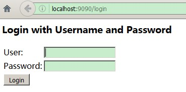
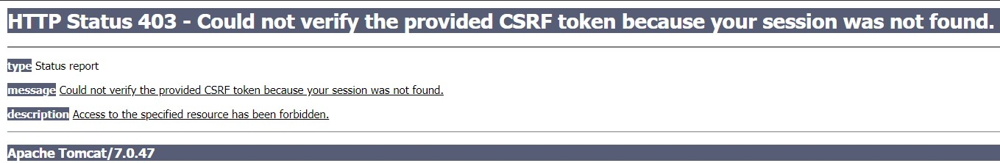
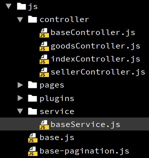
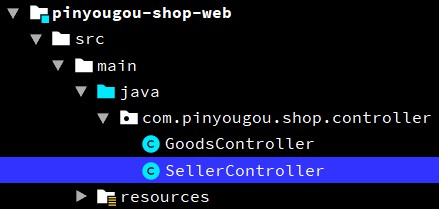

# Day05 Spring Security安全框架与商家入驻审核功能

---

## 1. Spring Security 安全框架入门
### 1.1. Spring Security 简介

Spring Security是一个能够为基于Spring的企业应用系统提供声明式的安全访问控制解决方案的安全框架。它提供了一组可以在Spring应用上下文中配置的Bean，充分利用了Spring IoC，DI（控制反转Inversion of Control ,DI:Dependency Injection 依赖注入）和AOP（面向切面编程）功能，为应用系统提供声明式的安全访问控制功能，减少了为企业系统安全控制编写大量重复代码的工作

### 1.2. Spring Security Demo

- 创建maven war项目，配置pom.xml文件相关依赖

```xml
<!-- 配置依赖关系  -->
<dependencies>
    <!-- servlet-api、jsp-api、el-api -->
    <dependency>
        <groupId>org.apache.tomcat.embed</groupId>
        <artifactId>tomcat-embed-jasper</artifactId>
        <version>8.5.16</version>
        <scope>provided</scope>
    </dependency>
    <!-- jstl -->
    <dependency>
        <groupId>jstl</groupId>
        <artifactId>jstl</artifactId>
        <version>1.2</version>
    </dependency>
    <!-- Spring -->
    <dependency>
        <groupId>org.springframework</groupId>
        <artifactId>spring-webmvc</artifactId>
        <version>4.3.10.RELEASE</version>
    </dependency>
    <!-- Spring-Security 核心依赖start -->
    <dependency>
        <groupId>org.springframework.security</groupId>
        <artifactId>spring-security-web</artifactId>
        <version>4.2.3.RELEASE</version>
    </dependency>
    <dependency>
        <groupId>org.springframework.security</groupId>
        <artifactId>spring-security-config</artifactId>
        <version>4.2.3.RELEASE</version>
    </dependency>
    <!-- Spring-Security 核心依赖end -->
</dependencies>
<!-- 项目构建部分 -->
<build>
    <plugins>
        <plugin>
            <groupId>org.apache.tomcat.maven</groupId>
            <artifactId>tomcat7-maven-plugin</artifactId>
            <configuration>
                <!-- 指定端口 -->
                <port>9090</port>
                <!-- 请求路径 -->
                <path>/</path>
            </configuration>
        </plugin>
    </plugins>
</build>
```

- 配置web.xml
    1. 加载spring配置文件contextConfigLocation
    2. 配置Spring的核心监听器ContextLoaderListener
    3. 配置SpringSecurity委派过滤器

```xml
<!-- 配置Spring加载文件 -->
<context-param>
    <param-name>contextConfigLocation</param-name>
    <param-value>classpath:applicationContext*.xml</param-value>
</context-param>
<!-- 配置Spring的核心监听器 -->
<listener>
    <listener-class>org.springframework.web.context.ContextLoaderListener</listener-class>
</listener>

<!-- 配置SpringSecurity委派过滤器 -->
<filter>
    <filter-name>springSecurityFilterChain</filter-name>
    <filter-class>org.springframework.web.filter.DelegatingFilterProxy</filter-class>
</filter>
<filter-mapping>
    <filter-name>springSecurityFilterChain</filter-name>
    <url-pattern>/*</url-pattern>
</filter-mapping>
```

- 创建SpringSecurity配置文件applicationContext-security.xml

```xml
<?xml version="1.0" encoding="utf-8"?>
<beans xmlns="http://www.springframework.org/schema/beans"
       xmlns:xsi="http://www.w3.org/2001/XMLSchema-instance"
       xmlns:security="http://www.springframework.org/schema/security"
       xsi:schemaLocation="http://www.springframework.org/schema/beans
       http://www.springframework.org/schema/beans/spring-beans.xsd
       http://www.springframework.org/schema/security
       http://www.springframework.org/schema/security/spring-security.xsd">

    <!--########### 配置请求URL拦截规则 ##########-->
    <!-- 1.配置不拦截的url-->
    <security:http pattern="/login.html" security="none"/>
    <security:http pattern="/login_error.html" security="none"/>

    <!-- 2.配置拦截的url，
        use-expressions:是否使用使用 Spring 表达式语言（SpEL），默认为true
     -->
    <security:http use-expressions="false">
        <!-- 配置拦截的请求url，通过什么角色或权限访问 -->
        <security:intercept-url pattern="/**" access="ROLE_USER"/>
        <!-- 配置开启表单登录(用spring security默认的登录页面)
             login-page: 配置自己的登录页面
             authentication-success-forward-url: 认证成功需要跳转的URL
             authentication-failure-url: 认证失败需要跳转的URL
             password-parameter: 密码请求参数名称
             username-parameter: 用户名请求参数名称
         -->
        <security:form-login
                login-page="/login.html"
                authentication-success-forward-url="/login_success.html"
                authentication-failure-url="/login_error.html"
                username-parameter="username"
                password-parameter="password"/>
        <!-- 关闭跨站请求伪造 CSRF -->
        <security:csrf disabled="true"/>
    </security:http>

    <!--########### 配置认证管理器 ##########-->
    <!-- 3.配置认证管理器 -->
    <security:authentication-manager>
        <!-- 配置认证提供者 -->
        <security:authentication-provider>
            <!-- 配置用户服务认证 -->
            <security:user-service>
                <!-- 配置用户：指定用户名、密码、角色或权限（一般不会直接在配置文件中配置） -->
                <security:user name="admin" password="123456" authorities="ROLE_USER"/>
            </security:user-service>
        </security:authentication-provider>
    </security:authentication-manager>
</beans>
```

### 1.3. Spring Security 配置说明

1. 	`<security-http use-expressions="false">`：是否使用使用 Spring 表达式语言（SpEL），默认为true，如果开启，则拦截的配置应该写成以下形式：

    ```xml
    <security:intercept-url pattern="/**" access="hasRole('ROLE_USER')"/>
    ```

2. `<security:intercept-url pattern="/**" />`：表示拦截的地址
    - `/*`：表示的是该目录下的资源，只包括本级目录不包括下级目录
    - `/**`：表示的是该目录以及该目录下所有级别子目录的资源
    - 如果加上`security="none"`属性，：设置此资源不被拦截。如果没有设置登录页`security="none"`，将会出现以下错误
    
3. `<security:form-login>`： 开启表单登录
    - 如果没有`<security:form-login />`如果没有配置相关属性，会使用了<font color="red">系统自动生成的登录页面</font>
    
    - 说明：因为登录页面会被反复重定向。
    - `<security:form-login>` 标签的相关属性说明
        - `login-page`：指定登录页面。
        - `authentication-failure-url`：指定了身份验证失败时跳转到的页面。
        - `authentication-success-forward-url`：指定身份验证成功时跳转到的页面。
        - `default-target-url`：指定了成功进行身份验证和授权后默认呈现给用户的页面。
        - `password-parameter`: 密码请求参数名称
        - `username-parameter`: 用户名请求参数名称
4. `csrf disabled="true"` 关闭csrf ,如果不加会出现错误
    

    - 说明：CSRF（Cross-site request forgery）跨站请求伪造，也被称为“One Click Attack”或者Session Riding，通常缩写为CSRF或者XSRF，是一种对网站的恶意利用。

### 1.4. Spring Security 基本使用步骤与配置

<font color="red">**配置拦截url与编写验证控制器。注意：只能接收post请求**</font>

#### 1.4.1. Spring Security 依赖

配置pom.xml文件，增加spring security核心依赖

```xml
<!-- Spring-Security 核心依赖start -->
<dependency>
    <groupId>org.springframework.security</groupId>
    <artifactId>spring-security-web</artifactId>
    <version>4.2.3.RELEASE</version>
</dependency>
<dependency>
    <groupId>org.springframework.security</groupId>
    <artifactId>spring-security-config</artifactId>
    <version>4.2.3.RELEASE</version>
</dependency>
<!-- Spring-Security 核心依赖end -->
```

#### 1.4.2. web.xml 配置SpringSecurity委派过滤器

```xml
<!-- 配置SpringSecurity委派过滤器 -->
<filter>
    <filter-name>springSecurityFilterChain</filter-name>
    <filter-class>org.springframework.web.filter.DelegatingFilterProxy</filter-class>
</filter>
<filter-mapping>
    <filter-name>springSecurityFilterChain</filter-name>
    <url-pattern>/*</url-pattern>
</filter-mapping>
```

- <font color="red">*注：配置SpringSecurity委派过滤器时*</font>
    - <font color="red">*filter-name必须是【springSecurityFilterChain】*</font>

#### 1.4.3. applicationContext-security.xml 配置步骤

1. 导入约束与命名空间

    ```xml
    <?xml version="1.0" encoding="utf-8"?>
    <beans xmlns="http://www.springframework.org/schema/beans"
           xmlns:xsi="http://www.w3.org/2001/XMLSchema-instance"
           xmlns:security="http://www.springframework.org/schema/security"
           xsi:schemaLocation="http://www.springframework.org/schema/beans
           http://www.springframework.org/schema/beans/spring-beans.xsd
           http://www.springframework.org/schema/security
           http://www.springframework.org/schema/security/spring-security.xsd">
    </beans>
    ```

2. 配置拦截规则-配置不需要拦截url
3. 配置拦截规则-配置需要拦截url`<security:http>`
	- `<security-http use-expressions="false">`：是否使用使用 Spring 表达式语言（SpEL），默认为true，如果开启，则拦截的配置应该写成以下形式：

    ```xml
	<security:intercept-url pattern="/**" access="hasRole('ROLE_USER')"/>
    ```

4. 配置认证管理器`<security:authentication-manager>`

#### 1.4.4. Spring Security 配置文件标签说明

- 【标签】`<security:http>`
    - 【属性】`pattern`：配置拦截的url
    - 【属性】`security`：配置是否拦截请求url，取值"none"，表示不拦截
        - eg.`<security:http pattern="/login.html" security="none" />`
    - 【属性】`use-expressions`：配置是否使用SpEL表达式，默认是true，启动表达式。
    - 【标签】`<security:intercept-url>`：配置拦截的请求URL,通过什么角色或权限访问
        - 【属性】`pattern`：配置拦截的url
        - 【属性】`access`：配置角色或权限名
    - 【标签】`<security:form-login>`：配置开启表单登录。（不配置属性的话，用spring security默认的登录页面）
        - 【属性】`login-page`: 配置自己的登录页面
        - 【属性】`authentication-success-forward-url`: 认证成功需要跳转的URL
        - 【属性】`authentication-failure-url`: 认证失败需要跳转的URL
        - 【属性】`password-parameter`: 密码请求参数名称
        - 【属性】`username-parameter`: 用户名请求参数名称
        - 【属性】`always-use-default-target`: 总是用默认的目标,默认是false
        - 【属性】`default-target-url`: 默认登录成功需要跳转的URL (重定向)
    - 【标签】`<security:csrf>`：关闭跨站请求伪造 CSRF
        - 【属性】`disabled`：是否关闭，默认是false，开启
    - 【标签】`<security:headers>`：配置头部分
        - 【标签】`<security:frame-options>`：指定框架页策略(iframe子窗口也可以访问)
            - 【属性】`policy`：指定框架页策略(iframe子窗口也可以访问)，取值SAMEORIGIN
    - 【标签】`<security:logout>`：配置登出
        - 【属性】`logout-url`：退出的地址，会自动生成
        - 【属性】`logout-success-url`：退出后跳转的地址
- 【标签】`<security:authentication-manager>`：配置认证管理器
    - 【标签】`<security:authentication-provider>`：配置认证提供者
        - 【属性】`user-service-ref`：配置自定义认证服务，关联自定义实现类id
        - 【标签】`<security:password-encoder>`：配置密码加密部分，与录入数据库时使用的加密方式一致。相当于登陆时解密数据库的密码
            - 【属性】`ref`：关联密码加密的bean的id
        - 【标签】`<security:user>`：配置用户服务认证（写死的用户名与密码）
            - 【属性】`name`：用户名
            - 【属性】`password`：密码
            - 【属性】`authorities`：角色或权限

---

## 2. 运营商系统登录与安全控制
### 2.1. 需求分析

完成运营商登录功能：http://manager.moon.com/login.html

### 2.2. 登陆功能

#### 2.2.1. 配置pinyougou-manager-web工程的pom.xml文件，添加依赖

参考前面demo，Spring Security的基本使用，注意不需要配置版本

```xml
<dependency>
    <groupId>org.springframework.security</groupId>
    <artifactId>spring-security-web</artifactId>
</dependency>
<dependency>
    <groupId>org.springframework.security</groupId>
    <artifactId>spring-security-config</artifactId>
</dependency>
```

#### 2.2.2. 配置web.xml文件

配置核心监听器加载spring文件，配置SpringSecurity委派过滤器（参考前面demo）

```xml
<!-- 配置Spring加载文件 -->
<context-param>
    <param-name>contextConfigLocation</param-name>
    <param-value>classpath:applicationContext*.xml</param-value>
</context-param>
<!-- 配置Spring的核心监听器 -->
<listener>
    <listener-class>org.springframework.web.context.ContextLoaderListener</listener-class>
</listener>

<!-- 配置SpringSecurity委派过滤器 -->
<filter>
    <filter-name>springSecurityFilterChain</filter-name>
    <filter-class>org.springframework.web.filter.DelegatingFilterProxy</filter-class>
</filter>
<filter-mapping>
    <filter-name>springSecurityFilterChain</filter-name>
    <url-pattern>/*</url-pattern>
</filter-mapping>
```

#### 2.2.3. 配置 applicationContext-security

- pinyougou-manager-web下添加配置文件applicationContext-security.xml

```xml
<?xml version="1.0" encoding="utf-8"?>
<beans xmlns="http://www.springframework.org/schema/beans"
       xmlns:xsi="http://www.w3.org/2001/XMLSchema-instance"
       xmlns:security="http://www.springframework.org/schema/security"
       xsi:schemaLocation="http://www.springframework.org/schema/beans
       http://www.springframework.org/schema/beans/spring-beans.xsd
       http://www.springframework.org/schema/security
       http://www.springframework.org/schema/security/spring-security.xsd">

    <!--########### 配置请求URL拦截规则 ##########-->
    <!-- 1.配置不拦截的url-->
    <!-- 不需要拦截登陆页面 -->
    <security:http pattern="/login.html" security="none"/>
    <!-- 不需要拦截静态资源、js文件 -->
    <security:http pattern="/css/**" security="none"/>
    <security:http pattern="/img/**" security="none"/>
    <security:http pattern="/js/**" security="none"/>
    <security:http pattern="/plugins/**" security="none"/>

    <!-- 2.配置拦截的url，
        use-expressions:是否使用使用 Spring 表达式语言（SpEL），默认为true
     -->
    <security:http use-expressions="false">
        <!-- 配置拦截的请求url，通过什么角色或权限访问 -->
        <security:intercept-url pattern="/**" access="ROLE_ADMIN"/>
        <!-- 配置开启表单登录(用spring security默认的登录页面)
             login-page: 配置自己的登录页面
             authentication-success-forward-url: 认证成功需要跳转的URL
             authentication-failure-url: 认证失败需要跳转的URL
             password-parameter: 密码请求参数名称
             username-parameter: 用户名请求参数名称
             default-target-url: 默认登录成功需要跳转的URL (重定向)
             always-use-default-target : 总是用默认的目标
         -->
        <security:form-login
                login-page="/login.html"
                default-target-url="/admin/index.html"
                always-use-default-target="true"
                authentication-failure-url="/login.html"
                username-parameter="username"
                password-parameter="password" />
        <!-- 关闭跨站请求伪造 CSRF -->
        <security:csrf disabled="true" />
        <!-- 此项目需要，配置头部分，指定框架页策略(iframe子窗口也可以访问) -->
        <security:headers>
            <security:frame-options policy="SAMEORIGIN" />
        </security:headers>
    </security:http>

    <!--########### 配置认证管理器 ##########-->
    <!-- 3.配置认证管理器 -->
    <security:authentication-manager>
        <!-- 配置认证提供者 -->
        <security:authentication-provider>
            <!-- 配置用户服务认证 -->
            <security:user-service>
                <!-- 配置用户：指定用户名、密码、角色或权限（一般不会直接在配置文件中配置） -->
                <security:user name="admin" password="123456" authorities="ROLE_ADMIN"/>
            </security:user-service>
        </security:authentication-provider>
    </security:authentication-manager>

</beans>
```

- 配置说明：
    - always-use-default-target：配置是否总是用默认的目标
    - 如果在系统中使用了框架页，需要设置框架页的策略为SAMEORIGIN

    ```xml
    <security:headers>
        <security:frame-options policy="SAMEORIGIN"/>
    </security:headers>
    ```

#### 2.2.4. 修改登陆页面

修改pinyougou-manager-web的login.html，配置用户名与密码的name属性，提交表单需要设置post方式

```html
<form class="sui-form" id="loginForm" action="/login" method="post">
    <div class="input-prepend">
    	<span class="add-on loginname"></span>
    	<input id="prependedInput" type="text" name="username"
    	placeholder="邮箱/用户名/手机号" class="span2 input-xfat"/>
    </div>
    <div class="input-prepend">
    	<span class="add-on loginpwd"></span>
    	<input id="prependedInput" type="password" name="password"
    	placeholder="请输入密码" class="span2 input-xfat"/>
    </div>

    ......

    <div class="logined">
    	<a class="sui-btn btn-block btn-xlarge btn-danger"
           onclick="document:loginForm.submit()">登&nbsp;&nbsp;录</a>
    </div>
</form>
```

### 2.3. 主界面显示登录用户名
#### 2.3.1. 后端代码

在pinyougou-manager-web新建LoginController，返回用户数据

```java
@RestController
public class LoginController {

    /**
     * 获取登录用户名
     *
     * @return 返回用户名的map集合（JSON格式）
     */
    @GetMapping("/login/username")
    public Map<String, String> loginName() {
        // 1.获取Spring Security框架上下文SecurityContext对象
        SecurityContext securityContext = SecurityContextHolder.getContext();

        // 2.通过SecurityContext对象获取登陆的用户名
        String username = securityContext.getAuthentication().getName();

        // 3.封装返回数据
        Map<String, String> dataMap = new HashMap<String, String>(1);
        dataMap.put("loginName", username);
        return dataMap;
    }
}
```

#### 2.3.2. 前端代码

- 创建前端的控制器indexController.js，定义请求获取登陆数据的方法

```js
/* 定义控制器(尝试将function部分替换使用箭头函数) */
app.controller('indexController', ($scope, baseService) => {

    /* 获取登陆用户名 */
    $scope.showLoginName = () => {
        baseService.sendGet('/login/username').then(response => {
            $scope.loginName = response.data.loginName;
        });
    }

});
```

- 在index.xml页面引入相关的js，注意js文件引入顺序，定义初始化方法发送请求获取登陆用户名，将页面上的“测试用户”替换成`{{loginName}}`

```html
<!-- 引入angularjs框架 -->
<script src="/plugins/angularjs/angular.min.js"></script>
<!-- 导入angular框架mvc分层后的js文件start -->
<script src="/js/base.js"></script>
<script src="/js/service/baseService.js"></script>
<script src="/js/controller/indexController.js"></script>
<!-- 导入angular框架mvc分层后的js文件end -->

......

<body class="hold-transition skin-green sidebar-mini"
      ng-app="pinyougou" ng-controller="indexController"
      ng-init="showLoginName();">
```

### 2.4. 退出登陆

- 在pinyougou-manager-web的applicationContext-security.xml添加配置

```xml
<!-- 配置退出登录 -->
<security:logout logout-url="/logout"/>
```

- 加此配置后，会自动的产生退出登录的地址/logout，如果不想用这个地址，也可以定义生成的退出地址以及跳转的页面，配置如下：
    - `<security:logout logout-url="" logout-success-url=""/>`
        - logout-url：退出的地址，会自动生成
        - logout-success-url：退出后跳转的地址
- 在index.html页面修改注销的链接：

```html
<div class="pull-right">
    <a href="/logout" class="btn btn-default btn-flat">注销</a>
</div>
```

---

## 3. 商家申请入驻功能模块
### 3.1. 需求分析

商家申请入驻，需要填写商家相关的信息。待运营商平台审核通过后即可使用。

1. 拷贝资源：将“资料\商家管理后台静态资源”下的页面拷贝到pinyougou-shop-web工程
2. 配置域名访问：shop.moon.com
    - 第一步：修改hosts增加`127.0.0.1  shop.moon.com`
    - 第二步：修改nginx.conf增加反向代理

    ```conf
    server {
        listen       80;
        server_name  shop.moon.com;

		proxy_set_header X-Forwarded-Host $host;
        proxy_set_header X-Forwarded-Server $host;

		location / {
		       proxy_pass http://127.0.0.1:9102;
		       proxy_connect_timeout 600;
		       proxy_read_timeout 600;
        }
    }
    ```

    - 第三步：访问地址`http://shop.moon.com/admin/index.html`
3. 参照“运营商后台”构建js




4. 拷贝后端控制层代码



### 3.2. 注册功能-前端代码

- 修改pinyougou-shop-web工程register.html引入相关js文件，加入初始化模块指令

```html
<!-- 引入angularjs框架 -->
<script src="/plugins/angularjs/angular.min.js"></script>
<!-- 导入angular框架mvc分层后的js文件start -->
<script src="/js/base.js"></script>
<script src="/js/service/baseService.js"></script>
<script src="/js/controller/baseController.js"></script>
<script src="/js/controller/sellerController.js"></script>
<!-- 导入angular框架mvc分层后的js文件end -->

......

<body ng-app="pinyougou" ng-controller="sellerController">
```

- 使用ng-model绑定表单所有的参数(部分代码)，绑定“申请入驻”按钮点击事件

```html
<div class="control-group">
	<label class="control-label">登录名（不可修改）：</label>
	<div class="controls">
		<input type="text" placeholder="登录名"
               ng-model="seller.sellerId" class="input-xfat input-xlarge">
	</div>
</div>

<div class="control-group">
	<label class="control-label">登录密码：</label>
	<div class="controls">
		<input type="password" placeholder="登陆密码"
               ng-model="seller.password" class="input-xfat input-xlarge">
	</div>
</div>

<div class="control-group">
	<label class="control-label">店铺名称：</label>
	<div class="controls">
		<input type="text" placeholder="店铺名称"
               ng-model="seller.nickName" class="input-xfat input-xlarge">
	</div>
</div>

<div class="control-group">
	<label class="control-label">公司名称：</label>
	<div class="controls">
		<input type="text" placeholder="公司名称"
               ng-model="seller.name" class="input-xfat input-xlarge">
	</div>
</div>

......

<div class="control-group">
	<label class="control-label"></label>
	<div class="controls btn-reg">
        <!-- href="home.html" -->
		<a class="sui-btn btn-block btn-xlarge btn-danger"
           ng-click="save();" target="_blank">申请入驻</a>
	</div>
</div>
```

- 修改sellerController.js在保存成功后跳转到登录页面

```js
/** 添加商家 */
$scope.save = function(){
    /** 发送post请求 */
    baseService.sendPost("/seller/save", $scope.seller)
        .then(function(response){
            if (response.data){
                /** 成功响应，跳转页面 */
                location.href="/shoplogin.html";
            }else{
                alert("操作失败！");
            }
        });
};
```

### 3.3. 保存注册信息-后端代码

- pinyougou-shop-web工程，控制层SellerController新增save()保存方法

```java
/**
 * 添加商家
 *
 * @param seller 商家信息实体类
 * @return 成功/失败标识
 */
@PostMapping("/save")
public boolean save(@RequestBody Seller seller) {
    try {
        // 调用服务层保存方法
        sellerService.saveSeller(seller);
        return true;
    } catch (Exception e) {
        e.printStackTrace();
    }
    return false;
}
```

- 服务层SellerService与SellerServiceImpl增加保存方法

```java
/**
 * 添加商家
 *
 * @param seller 商家信息实体类
 */
void saveSeller(Seller seller);

/**
 * 添加商家
 *
 * @param seller 商家信息实体类
 */
@Override
public void saveSeller(Seller seller) {
    try {
        // 1.补全录入数据库数据
        seller.setStatus("0");
        seller.setCreateTime(new Date());

        // 2.调用通用mapper保存方法
        sellerMapper.insertSelective(seller);
    } catch (Exception e) {
        e.printStackTrace();
        throw new RuntimeException(e);
    }
}
```

- 测试访问地址：http://shop.moon.com/register.html

---

## 4. 商家审核功能模块
### 4.1. 需求分析

- 商家申请入驻后，需要网站运营人员在运营商后台pinyougou-manager-web中进行审核，审核后商家才可以登录系统。
- 状态值：`0：未审核  1：已审核  2：审核未通过  3：关闭`

### 4.2. 审核功能-商家待审核列表
#### 4.2.1. 商家待审核列表-前端部分

- 修改pinyougou-manager-web 模块中的 seller_check.html
- 参考其他功能的页面，引入angular前端框架、导入分页组件、angular框架mvc分层后的js文件；初始化指令

```html
<!-- 引入angularjs框架 -->
<script src="/plugins/angularjs/angular.min.js"></script>
<!-- 导入分页组件start  -->
<script src="/plugins/angularjs/pagination.js"></script>
<link rel="stylesheet" href="/plugins/angularjs/pagination.css" />
<!-- 导入分页组件end  -->
<!-- 导入angular框架mvc分层后的js文件start -->
<script src="/js/base-pagination.js"></script>
<script src="/js/service/baseService.js"></script>
<script src="/js/controller/baseController.js"></script>
<script src="/js/controller/sellerController.js"></script>
<!-- 导入angular框架mvc分层后的js文件end -->

......

<!-- 分页组件 -->
<tm-pagination conf="paginationConf"></tm-pagination>
```

- 参考其他模块编写sellerController.js，加入分页组件与查询查询方法

```js
/** 定义搜索对象 */
$scope.searchEntity = {};
/** 分页查询 */
$scope.search = function(page, rows){
    baseService.findByPage("/seller/findByPage", page,
		rows, $scope.searchEntity)
        .then(function(response){
            $scope.dataList = response.data.rows;
            /** 更新总记录数 */
            $scope.paginationConf.totalItems = response.data.total;
        });
};
```

- 导入控制器模块，并初始化查询对象

```html
<!-- 初始化搜索对象，状态值为0（未审核） -->
<body class="hold-transition skin-red sidebar-mini"
        ng-app="pinyougou" ng-controller="sellerController"
        ng-init="searchEntity = {status : '0'}">
```

- 循环迭代显示列表

```html
<tbody>
	<tr ng-repeat="entity in dataList">
		<td><input type="checkbox"></td>
		<td>{{ entity.sellerId }}</td>
		<td>{{ entity.name }}</td>
		<td>{{ entity.nickName }}</td>
		<td>{{ entity.linkmanName }}</td>
		<td>{{ entity.telephone }}</td>
	</tr>
</tbody>
```

- 绑定查询条件

```html
<div class="has-feedback">
	公司名称：<input type="text" ng-model="searchEntity.name">
    店铺名称：<input type="text" ng-model="searchEntity.nickName">
	<button class="btn btn-default"
            ng-click="reload();">查询</button>
</div>
```

#### 4.2.2. 商家待审核列表-后端部分

- 在pinyougou-manager-web工程的控制层SellerController增加条件+分页查询方法

```java
/**
 * 分页查询待审核的商家
 *
 * @return 商家分页结果封装实体
 */
@GetMapping("/findByPage")
public PageResult<Seller> findByPage(Seller seller,
                                     @RequestParam("page") Integer page,
                                     @RequestParam("rows") Integer rows) {
    try {
        // 调用服务接口分页查询方法
        PageResult<Seller> pageResult = sellerService.findByPage(seller, page, rows);
        return pageResult;
    } catch (Exception e) {
        e.printStackTrace();
        return null;
    }
}
```

- 服务层SellerService接口与SellerServiceImpl实现方法

```java
/**
 * 分页查询商家列表
 *
 * @param seller 商家实体
 * @param page   当前页码
 * @param rows   每页显示的记录数
 * @return 商家实体集合
 */
PageResult<Seller> findByPage(Seller seller, Integer page, Integer rows);

/**
 * 分页查询商家列表
 *
 * @param seller 商家实体
 * @param page   当前页码
 * @param rows   每页显示的记录数
 * @return 商家实体集合
 */
@Override
public PageResult<Seller> findByPage(Seller seller, Integer page, Integer rows) {

    try {
        // 使用分页助手开启分页，获取pageInfo对象
        PageInfo<Seller> pageInfo = PageHelper.startPage(page, rows)
                .doSelectPageInfo(new ISelect() {
                    @Override
                    public void doSelect() {
                        // 使用自定义动态条件查询方法
                        SellerMapper.findAll(seller);
                    }
                });

        // 创建PageResult对象
        PageResult<Seller> pageResult = new PageResult<Seller>();

        pageResult.setTotal(pageInfo.getTotal());
        pageResult.setRows(pageInfo.getList());

        return pageResult;

    } catch (Exception e) {
        throw new RuntimeException(e);
    }
}
```

- SellerMapper接口添加方法，修改SellerMapper.xml增加动态sql查询

```java
/**
 * 多条件查询所有的商家
 *
 * @param seller 商家条件查询实体类
 */
List<Seller> findAll(@Param("seller") Seller seller);
```

```xml
<!-- 多条件查询商家 -->
<select id="findAll" resultType="Seller">
    SELECT * FROM `tb_seller`
    <where>
        <!-- 先判断输入的对象是否为空 -->
        <if test="seller != null">
            <!-- 判断商家状态查询条件 -->
            <if test="seller.status != null and seller.status != ''">
                AND `status` = #{seller.status}
            </if>
            <!-- 判断名称的查询条件 -->
            <if test="seller.name != null and seller.name != ''">
                AND `name` LIKE CONCAT('%', #{seller.name}, '%')
            </if>
            <!-- 判断店名的查询条件 -->
            <if test="seller.nickName != null and seller.nickName != ''">
                AND `nick_name` LIKE CONCAT('%', #{seller.nickName}, '%')
            </if>
        </if>
    </where>
</select>
```

#### 4.2.3. 商家详情（点击详细，查询商品信息）

1. 找到页面弹出窗口部分，绑定对象

```html
<!-- 选项卡开始 -->
<div id="myTabContent" class="tab-content">
	<div class="tab-pane active in" id="home">
		<br/>
		<table class="table table-bordered table-striped" width="800px">
			<tr>
				<td>公司名称</td>
				<td>{{entity.name}}</td>
			</tr>
			<tr>
				<td>公司手机</td>
				<td>{{entity.mobile}}</td>
			</tr>
			<tr>
				<td>公司电话</td>
				<td>{{entity.telephone}}</td>
			</tr>
			<tr>
				<td>公司详细地址</td>
				<td>{{entity.addressDetail}}</td>
			</tr>
		</table>
	</div>
	<div class="tab-pane fade" id="linkman">
		<br/>
		<table class="table table-bordered table-striped">
			<tr>
				<td>联系人姓名</td>
				<td>{{entity.linkmanName}}</td>
			</tr>
			<tr>
				<td>联系人QQ</td>
				<td>{{entity.linkmanQq}}</td>
			</tr>
			<tr>
				<td>联系人手机</td>
				<td>{{entity.linkmanMobile}}</td>
			</tr>
			<tr>
				<td>联系人E-Mail</td>
				<td>{{entity.linkmanEmail}}</td>
			</tr>
		</table>
	</div>
	<div class="tab-pane fade" id="certificate">
		<br>
		<table class="table table-bordered table-striped">
			<tr>
				<td>营业执照号</td>
				<td>{{entity.licenseNumber}}</td>
			</tr>
			<tr>
				<td>税务登记证号</td>
				<td>{{entity.taxNumber}}</td>
			</tr>
			<tr>
				<td>组织机构代码证号</td>
				<td>{{entity.orgNumber}}</td>
			</tr>
		</table>
	</div>
	<div class="tab-pane fade" id="ceo">
		<br>
		<table class="table table-bordered table-striped">
			<tr>
				<td>法定代表人</td>
				<td>{{entity.legalPerson}}</td>
			</tr>
			<tr>
				<td>法定代表人身份证号</td>
				<td>{{entity.legalPersonCardId}}</td>
			</tr>
		</table>
	</div>
	<div class="tab-pane fade" id="bank">
		<br>
		<table class="table table-bordered table-striped">
			<tr>
				<td>开户行名称</td>
				<td>{{entity.bankName}}</td>
			</tr>
			<tr>
				<td>开户行支行</td>
				<td>{{entity.bankUser}}</td>
			</tr>
			<tr>
				<td>银行账号</td>
				<td>{{entity.brief}}</td>
			</tr>
		</table>
	</div>
</div>
<!-- 选项卡结束 -->
```

2. 给“详细按钮”绑定点击事件

```html
<button type="button" class="btn bg-olive btn-xs"
        data-toggle="modal" data-target="#sellerModal"
        ng-click="show(entity);">详情</button>
```

### 4.3. 商家审核功能（与教材不一样，个人实践使用post请求实现）
#### 4.3.1. 商家审核-前端部分

- 修改seller_check.html的审核按钮，调用更新方法

```html
<div class="modal-footer">
	<button class="btn btn-success" data-dismiss="modal"
            ng-click="updateStatus(entity.sellerId, '1')"
            aria-hidden="true">审核通过</button>
	<button class="btn btn-danger" data-dismiss="modal"
            ng-click="updateStatus(entity.sellerId, '2')"
            aria-hidden="true">审核未通过</button>
	<button class="btn btn-danger" data-dismiss="modal"
            ng-click="updateStatus(entity.sellerId, '3')"
            aria-hidden="true">关闭商家</button>
	<button class="btn btn-default" data-dismiss="modal"
            aria-hidden="true">关闭</button>
</div>
```

- 修改pinyougou-manager-web的sellerController.js中的修改商家状态方法

```js
/** 修改商家的状态 */
$scope.updateStatus = function (sellerId, status) {
    // 封装请求参数
    var requestData = {
        sellerId: sellerId,
        status: status
    }
    baseService.sendPost('/seller/updateStatus', requestData).then(function (response) {
        if (response.data) {
            /** 请求成功，重新加载列表 */
            $scope.reload();
        } else {
            alert("审批失败！");
        }
    });
};
```

*注：sellerController只需要保留分页查询search方法与显示详情的show方法，其他多余方法可删掉*

#### 4.3.2. 商家审核-后端部分

- sellerController修改状态的方法，接收参数可以是商家实体类，也可以是map集合

```java
/**
 * 审批商家
 *
 * @param seller 请求参数，封装到商家实体类中
 * @return 成功/失败标识
 */
@PostMapping("/updateStatus")
public boolean updateStatus(@RequestBody Seller seller) {

    try {
        // 1.获取与校验请求参数
        String sellerId = seller.getSellerId();
        String status = seller.getStatus();

        // 上传的商家id为空
        if (StringUtils.isBlank(sellerId)) {
            return false;
        }

        // 定义商家数据字典集合（1：已审核 2：审核未通过 3：关闭）
        List<String> dic = Arrays.asList("1", "2", "3");
        // 上传的审核状态为空，或者不符合数字字典的规定
        if (StringUtils.isBlank(status) || !dic.contains(status)) {
            return false;
        }

        // 2. 调用服务层修改的方法
        sellerService.updateStatus(seller);
        return true;
    } catch (Exception e) {
        e.printStackTrace();
    }
    return false;
}
```

- 修改服务层SellerService与SellerServiceImpl实现类，增加更改商家状态的方法

```java
/**
 * 修改商家状态
 *
 * @param seller 封装了商家主键sellerId与状态码status
 */
void updateStatus(Seller seller);

/**
 * 修改商家状态
 *
 * @param seller 封装了商家主键sellerId与状态码status
 */
@Override
public void updateStatus(Seller seller) {
    try {
        // 调用通用mapper根据主键更新属性不为null的值的方法
        sellerMapper.updateByPrimaryKeySelective(seller);
    } catch (Exception e) {
        e.printStackTrace();
        throw new RuntimeException(e);
    }
}
```

---

## 5. 商家系统登录与安全控制
### 5.1. 需求分析

完成商家系统登录与安全控制，商家账号来自数据库，并实现密码加密

### 5.2. 自定义认证类

1. pom.xml、web.xml、shoplogin.html 等配置，参照运营商管理后台
    - 配置spring-security依赖jar包、过滤器、页面表单。
2. 在pinyougou-shop-web下创建applicationContext-security.xml，配置认证提供者为自定义认证类

```xml
<beans xmlns="http://www.springframework.org/schema/beans"
       xmlns:xsi="http://www.w3.org/2001/XMLSchema-instance"
       xmlns:security="http://www.springframework.org/schema/security"
       xmlns:dubbo="http://code.alibabatech.com/schema/dubbo"
       xsi:schemaLocation="http://www.springframework.org/schema/beans
       http://www.springframework.org/schema/beans/spring-beans.xsd
       http://www.springframework.org/schema/security
       http://www.springframework.org/schema/security/spring-security.xsd
       http://code.alibabatech.com/schema/dubbo
       http://code.alibabatech.com/schema/dubbo/dubbo.xsd">

    <!--########### 配置请求URL拦截规则 ##########-->
    <!-- 1.配置不拦截的url-->
    <!-- 不需要拦截项目最外层注册、登陆等页面 -->
    <security:http pattern="/*.html" security="none"/>
    <!-- 不需要拦截静态资源、js文件 -->
    <security:http pattern="/css/**" security="none"/>
    <security:http pattern="/img/**" security="none"/>
    <security:http pattern="/js/**" security="none"/>
    <security:http pattern="/plugins/**" security="none"/>
    <!-- 不拦截商家注册的请求url -->
    <security:http pattern="/seller/save" security="none"/>

    <!-- 2.配置拦截的url，
        use-expressions:是否使用使用 Spring 表达式语言（SpEL），默认为true
     -->
    <security:http use-expressions="false">
        <!-- 配置拦截的请求url，通过什么角色或权限访问 -->
        <security:intercept-url pattern="/**" access="ROLE_SELLER"/>
        <!-- 配置开启表单登录(用spring security默认的登录页面)
             login-page: 配置自己的登录页面
             authentication-success-forward-url: 认证成功需要跳转的URL
             authentication-failure-url: 认证失败需要跳转的URL
             password-parameter: 密码请求参数名称
             username-parameter: 用户名请求参数名称
             default-target-url: 默认登录成功需要跳转的URL (重定向)
             always-use-default-target : 总是用默认的目标
         -->
        <security:form-login
                login-page="/shoplogin.html"
                authentication-failure-url="/shoplogin.html"
                default-target-url="/admin/index.html"
                always-use-default-target="true"
                username-parameter="username"
                password-parameter="password"/>
        <!-- 关闭跨站请求伪造 CSRF -->
        <security:csrf disabled="true"/>
        <!-- 此项目需要，配置头部分，指定框架页策略(iframe子窗口也可以访问) -->
        <security:headers>
            <security:frame-options policy="SAMEORIGIN"/>
        </security:headers>

        <!-- 配置退出登录 -->
        <security:logout logout-url="/logout"/>
    </security:http>

    <!--########### 配置认证管理器 ##########-->
    <!-- 3.配置认证管理器 -->
    <security:authentication-manager>
        <!-- 配置认证提供者
            user-service-ref：配置自定义认证服务，关联自定义实现类id
         -->
        <security:authentication-provider user-service-ref="userDetailsService">
        </security:authentication-provider>
    </security:authentication-manager>

    <!-- 配置自定义的用户认证服务 -->
    <bean id="userDetailsService" class="com.pinyougou.shop.service.UserDetailsServiceImpl"/>

</beans>
```

*注：dubbo的命名空间，在后面自定义认证类需要调用服务时需要使用，现在先设置*

3. 在pinyougou-shop-web创建com.pinyougou.shop.service包下，创建自定义认证类UserDetailsServiceImpl.java实现<font color="red">**UserDetailsService**</font>接口

```java
/**
 * 用户认证服务类
 */
public class UserDetailsServiceImpl implements UserDetailsService {

    @Override
    public UserDetails loadUserByUsername(String username) throws UsernameNotFoundException {

        // 1. 创建List集合封装角色或权限(GrantedAuthority)
        List<GrantedAuthority> authorities = new ArrayList<GrantedAuthority>();

        // 2. 添加角色或者权限(与applicationContext-security.xml配置access属性一致)
        authorities.add(new SimpleGrantedAuthority("ROLE_SELLER"));

        // 3. 返回Spring Security 框架的User对象，传入用户名、密码、角色权限
        User user = new User(username, "123456", authorities);
        return user;
    }
}
```

<font color="red">*说明：经过上述配置，用户在输入密码123456时就会通过（用户名随意）*</font>

### 5.3. 认证类调用服务方法

- 修改UserDetailsServiceImpl，调用商家服务层

```java
/* 注入商家服务接口代理对象 */
private SellerService sellerService;

/* 需要使用set方法注入，使用注解方式注解不成功 */
public void setSellerService(SellerService sellerService) {
    System.out.println("测试什么时候创建：" + sellerService);
    this.sellerService = sellerService;
}

@Override
public UserDetails loadUserByUsername(String username) throws UsernameNotFoundException {

    // 1. 创建List集合封装角色或权限(GrantedAuthority)
    List<GrantedAuthority> authorities = new ArrayList<GrantedAuthority>();

    // 2. 添加角色或者权限(与applicationContext-security.xml配置access属性一致)
    authorities.add(new SimpleGrantedAuthority("ROLE_SELLER"));

    // 3. 调用服务类，根据id查询商家
    Seller seller = sellerService.findOne(username);

    // 判断查询的商家不为空，并状态为1审核通过的商家
    if (seller != null && "1".equals(seller.getStatus())) {
        // 4. 返回Spring Security 框架的User对象，传入用户名、密码、角色权限
        User user = new User(username, seller.getPassword(), authorities);
        return user;
    }
    return null;
}
```

- 修改applicationContext-security.xml，配置dubbo服务消费者，增加dubbo约束头文件

```xml
xmlns:dubbo="http://code.alibabatech.com/schema/dubbo"
http://code.alibabatech.com/schema/dubbo
http://code.alibabatech.com/schema/dubbo/dubbo.xsd"

......

<!-- ########### 配置dubbo服务消费者 ########### -->
<!-- 配置当前应用名称 -->
<dubbo:application name="pinyougou-shop-web"/>
<!-- 配置服务注册中心，发现服务 -->
<dubbo:registry protocol="zookeeper" address="192.168.12.131:2181"/>
<!-- 配置引用服务，产生服务代理对象 -->
<dubbo:reference id="sellerService"
                 interface="com.pinyougou.sellergoods.service.SellerService"/>

<!-- 配置自定义的用户认证服务 -->
<bean id="userDetailsService" class="com.pinyougou.shop.service.UserDetailsServiceImpl">
    <!-- 使用属性注入 -->
    <property name="sellerService" ref="sellerService"/>
</bean>
```

- 服务层SellerService接口与实现类SellerServiceImpl增加根据用户id查询方法

```java
/**
 * 根据id查询商家
 *
 * @param username 商家主键sellerId
 * @return 商家实体类
 */
Seller findOne(String username);

/**
 * 根据id查询商家
 *
 * @param username 商家主键sellerId
 * @return 商家实体类
 */
@Override
public Seller findOne(String username) {
    try {
        // 调用通知mapper根据id查询的方法
        return sellerMapper.selectByPrimaryKey(username);
    } catch (Exception e) {
        e.printStackTrace();
        throw new RuntimeException(e);
    }
}
```

<font color="red">*说明：经过上述修改后，在登录页面输入用户名和密码与数据库一致即可登录。(即无进行密码加密)*</font>

### 5.4. 密码加密

#### 5.4.1. BCrypt加密算法

- 用户表的密码通常使用MD5等不可逆算法加密后存储，为防止彩虹表破解更会先使用一个特定的字符串（如域名）加密，然后再使用一个随机的salt（盐值）加密。
- 特定字符串是程序代码中固定的，salt是每个密码单独随机，一般给用户表加一个字段单独存储，比较麻烦。
- BCrypt算法将salt随机并混入最终加密后的密码，验证时也无需单独提供之前的salt，从而无需单独处理salt问题。

#### 5.4.2. 商家入驻模块使用密码加密

- 商家申请入驻的密码要使用BCrypt算法进行加密存储。修改pinyougou-shop-web工程，SellerController的save方法，增加加密部分

```java
/**
 * 添加商家
 *
 * @param seller 商家信息实体类
 * @return 成功/失败标识
 */
@PostMapping("/save")
public boolean save(@RequestBody Seller seller) {
    try {
        // 1.使用BCrypt算法对密码进行加密存储
        BCryptPasswordEncoder passwordEncoder = new BCryptPasswordEncoder();
        String password = passwordEncoder.encode(seller.getPassword());
        seller.setPassword(password);

        // 2.调用服务层保存方法
        sellerService.saveSeller(seller);
        return true;
    } catch (Exception e) {
        e.printStackTrace();
    }
    return false;
}
```

- applicationContext-security.xml配置加密部分

```xml
<!--########### 配置认证管理器 ##########-->
<!-- 3.配置认证管理器 -->
<security:authentication-manager>
    <!-- 配置认证提供者
        user-service-ref：配置自定义认证服务，关联自定义实现类id
     -->
    <security:authentication-provider user-service-ref="userDetailsService">
        <!-- 密码加密 -->
        <security:password-encoder ref="passwordEncoder"/>
    </security:authentication-provider>
</security:authentication-manager>

<!-- 配置密码加密的bean -->
<bean id="passwordEncoder"
      class="org.springframework.security.crypto.bcrypt.BCryptPasswordEncoder"/>
```

### 5.5. 显示登录名与退出登录
#### 5.5.1. 显示登录名

- 参照运营商后台
- 复制运营商后台的indexController.js与LoginController
- 修改pinyougou-shop-web\src\main\webapp\admin\index.html，引入相关的js文件与初始化指令，把页面 chendahai 替换成 `{{loginName}}`

#### 5.5.2. 退出登录

- 参照运营商后台

```xml
index.html页面：
<div class="pull-right">
    <a href="/logout" class="btn btn-default btn-flat">注销</a>
</div>

applicationContext-security.xml：
<!-- 配置退出登录 -->
<security:logout logout-url="/logout"/>
```


