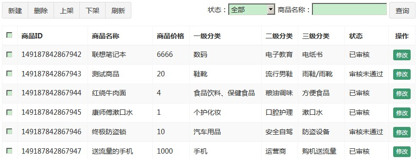
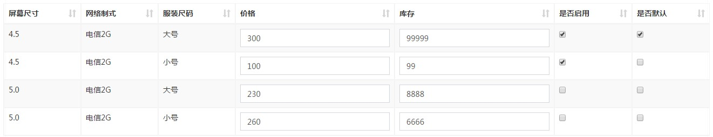

# Day08 商品修改与审核&注解式事务配置&Nginx静态资源服务器

## 1. 商家后台-商品管理【商品列表】
### 1.1. 需求分析

在商家后台，显示该商家的商品列表信息



### 1.2. 查询商家商品列表-后端

功能代码参考之前【运营商后台-商品分类功能】

注意：因为页面需要显示一级、二级、三级分类名称，需要查询分类表，返回分页的对象`PageResult<map<String, Object>>`

- 修改pinyougou-shop-web工程控制GoodsController，增加分页查询的search方法

```java
/**
 * 多条件分页查询SPU商品表中的数据
 *
 * @param goods 商品查询条件对象
 * @param page  当前页记录
 * @param rows  每页显示大小
 * @return 封装分页数据
 */
@GetMapping("/search")
public PageResult findByPage(Goods goods,
                             @RequestParam("page") Integer page,
                             @RequestParam("rows") Integer rows) {
    try {
        // 获取当前登录商家的id
        String sellerId = SecurityContextHolder.getContext().getAuthentication().getName();
        // 查询条件封装在goods对象中，还需要封装当前用户，只查询当前用户商品
        goods.setSellerId(sellerId);
        // 调用服务多条件分页查询方法
        return goodsService.findGoodsByPage(goods, page, rows);
    } catch (Exception e) {
        e.printStackTrace();
        return null;
    }
}
```

- 服务层实现类

```java
/**
 * 多条件分页查询SPU商品表中的数据
 *
 * @param goods 商品查询条件对象
 * @param page  当前页记录
 * @param rows  每页显示大小
 * @return 封装分页数据
 */
PageResult findGoodsByPage(Goods goods, Integer page, Integer rows);

@Override
public PageResult findGoodsByPage(Goods goods, Integer page, Integer rows) {
    try {
        // 使用分页助手开启分页，获取pageInfo对象
        PageInfo<Map<String, Object>> pageInfo = PageHelper.startPage(page, rows)
                .doSelectPageInfo(new ISelect() {
                    @Override
                    public void doSelect() {
                        // 使用自定义动态条件查询方法
                        goodsMapper.findByWhere(goods);
                    }
                });

        // 获取查询的结果集合
        List<Map<String, Object>> resultList = pageInfo.getList();
        // 迭代遍历分页信息对象的map集合，将1~3分类名称封装到map集合中
        for (Map<String, Object> map : resultList) {
            // 查询商品的分类的名称(一级分类名称)，设置到map集合中
            ItemCat itemCat1 = itemCatMapper.selectByPrimaryKey(map.get("category1Id"));
            map.put("category1Name", itemCat1 != null ? itemCat1.getName() : "");
            // 查询商品的分类的名称(二级分类名称)，设置到map集合中
            ItemCat itemCat2 = itemCatMapper.selectByPrimaryKey(map.get("category2Id"));
            map.put("category2Name", itemCat2 != null ? itemCat2.getName() : "");
            // 查询商品的分类的名称(三级分类名称)，设置到map集合中
            ItemCat itemCat3 = itemCatMapper.selectByPrimaryKey(map.get("category3Id"));
            map.put("category3Name", itemCat3 != null ? itemCat3.getName() : "");
        }

        // 返回分页结果
        return new PageResult(pageInfo.getTotal(), resultList);
    } catch (Exception e) {
        e.printStackTrace();
        throw new RuntimeException(e);
    }
}
```

- 商品GoodsMapper接口与映射文件，查询条件注意要包含是否被删除（`is_delete`字段），只需要查询页面需要显示的字段即可

```java
/**
 * 多条件查询SPU商品表中的数据
 *
 * @param goods 商品查询条件对象
 * @return map格式的结果集合
 */
List<Map<String, Object>> findByWhere(@Param("goods") Goods goods);
```

```xml
<!-- 多条件查询SPU商品表中的数据 -->
<select id="findByWhere" resultType="map">
    SELECT
        id,price,
        goods_name as goodsName,
        category1_id as category1Id,
        category2_id as category2Id,
        category3_id as category3Id,
        audit_status as auditStatus
    FROM
        `tb_goods`
    <where>
        is_delete is null
        <if test="goods != null">
            <!-- 商家的id -->
            <if test="goods.sellerId != null and goods.sellerId != ''">
                and seller_id = #{goods.sellerId}
            </if>
            <!-- 商品名称 -->
            <if test="goods.goodsName != null and goods.goodsName != ''">
                and goods_name like CONCAT('%', #{goods.goodsName}, '%')
            </if>
            <!-- 审核状态 -->
            <if test="goods.auditStatus != null and goods.auditStatus != ''">
                and audit_status = #{goods.auditStatus}
            </if>
        </if>
    </where>
    ORDER BY id DESC
</select>
```

### 1.3. 查询商家商品列表-前端

- 参考其他模块引入相关的js文件，添加引入指令，导入分页组件。
- 修改pinyougou-shop-web工程goodsController层，定义分页搜索的方法；定义状态码数组，用于页面转换数据字典

```js
/* 定义封装查询条件对象 */
$scope.searchEntity = {};
/* 定义分页查询的方法 */
$scope.search = function (page, rows) {
    /* 调用服务层，送异步请求查询分页数据 */
    baseService.findByPage('/goods/search', page, rows, $scope.searchEntity)
        .then(function (response) {
            // 请求成功回调函数.获取响应数据，赋值给dataList
            $scope.dataList = response.data.rows;
            // 更新分页组件中的总记录数
            $scope.paginationConf.totalItems = response.data.total;
        }, function (response) {
            alert("获取商品列表数据失败！");
        });
};

/* 定义状态码数组 */
$scope.status = ['未审核', '已审核', '审核未通过', '关闭'];
```

- goods.html循环显示商品列表

```html
<tr ng-repeat="entity in dataList">
	<td><input type="checkbox"></td>
	<td>{{ entity.id }}</td>
	<td>{{ entity.goodsName }}</td>
	<td>{{ entity.price }}</td>
	<td>{{ entity.category1Name }}</td>
	<td>{{ entity.category2Name }}</td>
	<td>{{ entity.category3Name }}</td>
	<td>{{ status[entity.auditStatus] }}</td>
	<td class="text-center">
		<button type="button" class="btn bg-olive btn-xs">修改</button>
	</td>
</tr>
```

- 绑定查询条件输入框，按钮绑定点击事件

```html
<div class="has-feedback">
	状态：<select ng-model="searchEntity.auditStatus">
		<option value="">全部</option>
		<option value="0">未申请</option>
		<option value="1">申请中</option>
		<option value="2">审核通过</option>
		<option value="3">已驳回</option>
	</select>
    商品名称：<input type="text" ng-model="searchEntity.goodsName">
	<button class="btn btn-default" ng-click="reload();">查询</button>
</div>
```

---

## 2. 商家后台-商品管理【商品修改】
### 2.1. 需求分析

在商品列表页面点击修改，进入商品编辑页面，并传递参数商品ID，商品编辑页面接受该参数后从数据库中读取商品信息，用户修改后保存信息。

### 2.2. 基本信息读取

首选读取商品分类、商品名称、品牌，副标题，价格等信息

#### 2.2.1. 查询单个商品信息-后端部分

- 修改pinyougou-shop-web工程控制层GoodsController，增加根据id查询商品方法

```java
/**
 * 根据goods表的主键id查询商品数据
 *
 * @param id 商品id
 * @return 商品对象
 */
@GetMapping("/findOne")
public Goods findOne(@RequestParam("id") Long id) {
    try {
        // 调用服务层根据id查询的方法
        return goodsService.findOne(id);
    } catch (Exception e) {
        e.printStackTrace();
        return null;
    }
}
```

- 商品服务层GoodsService与GoodsServiceImpl增加根据id查询商品的方法

```java
/**
 * 根据goods表的主键id查询商品数据
 *
 * @param id 商品id
 * @return 商品对象
 */
Goods findOne(Long id);

@Override
public Goods findOne(Long id) {
    try {
        // 1.调用商品数据访问层根据id查询
        Goods goods = goodsMapper.selectByPrimaryKey(id);

        // 2.根据商品id，调用商品描述数据访问层查询商品描述数据
        goods.setGoodsDesc(goodsDescMapper.selectByPrimaryKey(id));
        
        return goods;
    } catch (Exception e) {
        e.printStackTrace();
        throw new RuntimeException(e);
    }
}
```

#### 2.2.2. 查询单个商品信息-前端部分

- 修改goods_edit.html页面加入base标签与配置位置提供者

```html
// 在<head>标签中引入
<!-- 加入base标签  -->
<base href="/"/>

// ==============================

<script type="text/javascript">
    /* 配置位置提供者 */
    app.config(function ($locationProvider) {
        $locationProvider.html5Mode(true);
    });
    ......
</script>
```

- 在goodsController中引入`$location`服务。并新增查询单个商品的方法

```js
/** 定义控制器层 */
app.controller('goodsController', function ($scope, $controller,
        $location, baseService, uploadService) {
    ......

    /* 根据主键id查询单个商品 */
    $scope.findOne = function () {
        // 通过location服务获取请求参数
        var id = $location.search().id;

        if (id == null) {
            return;
        }

        // 调用业务层查询方法
        baseService.findOne('/goods/findOne', id).then(function (response) {
            $scope.goods = response.data;
        });
    };
}
```

- goods_edit.html页面上添加初始化指令

```html
<body class="hold-transition skin-red sidebar-mini"
      ng-app="pinyougou" ng-controller="goodsController"
      ng-init="findItemCatByParentId(0, 'itemCatList1');findOne();">
```

*地址栏输入(测试)：http://shop.moon.com/admin/goods_edit.html?id=149187842868008*

### 2.3. 读取商品介绍（富文本编辑器）

因为数据库保存的富文本字符串，需要将字符串设置到富文本编辑器的html元素。修改goodsController中findOne方法增加富文本处理

```js
$scope.findOne = function () {
    // 通过location服务获取请求参数
    var id = $location.search().id;

    if (id == null) {
        return;
    }

    // 调用业务层查询方法
    baseService.findOne('/goods/findOne', id).then(function (response) {
        $scope.goods = response.data;
        // 富文本编辑器添加商品介绍
        editor.html($scope.goods.goodsDesc.introduction);
    });
};
```

### 2.4. 显示商品图片列表

修改goodsController，在findOne方法添加代码，将图片列表由字符串转换为json集合对象。

```js
baseService.findOne('/goods/findOne', id).then(function (response) {
    ......

    // 把商品图片json格式的字符串转化成json数组
    $scope.goods.goodsDesc.itemImages =
        JSON.parse($scope.goods.goodsDesc.itemImages);
});
```

### 2.5. 读取商品扩展属性

- 修改goodsController.js中的findOne方法，添加扩展属性json转换

```js
baseService.findOne('/goods/findOne', id).then(function (response) {
    ......

    // 把扩展属性json格式的字符串转化成json数组
    $scope.goods.goodsDesc.customAttributeItems =
        JSON.parse($scope.goods.goodsDesc.customAttributeItems);
});
```

- 经过测试，发现扩展属性值并没有读取出来，这是因为与下列代码发生冲突

```js
/* 用$watch监听 goods.typeTemplateId 变量发生改变(查询类型模版对象) */
$scope.$watch('goods.typeTemplateId', function (newVal, oldVal) {
    ......

    // 当改变的新值不为空时
    if (newVal) {
        /* 根据类型模版主键id查询一个类型模版对象 */
        baseService.findOne('/typeTemplate/findOne', newVal).then(function (response) {
            if (response.data) {
                ......
                // 把类型模版对象中的扩展属性json格式字符串转化成json数组
                $scope.goods.goodsDesc.customAttributeItems =
                    JSON.parse($scope.typeTemplate.customAttributeItems);
            }
        });
        ......
    }
});
```

- 读取出来的值被覆盖了，需要改写代码，添加判断，当用户没有传递id参数时再执行此逻辑；还有之前做商品分类改变后，会清空扩展属性的操作，此部分也加上判断是否传递id

```js
/* 用$watch监听 goods.typeTemplateId 变量发生改变(查询类型模版对象) */
$scope.$watch('goods.typeTemplateId', function (newVal, oldVal) {
    /* 判断是否是修改商品，判断id是否为空，空则为false */
    if (!$location.search().id) {
        // 1. 如果模版id变化，初始化模版对象与清空绑定到goods对象的brandId
        $scope.typeTemplate = {};
        $scope.goods.brandId = null;
        // 2. 清空扩展属性和绑定的值
        $scope.goods.goodsDesc.customAttributeItems = null;
        // 3. 清空规格选项数据与绑定勾选的规格选项
        $scope.specList = {};
        $scope.goods.goodsDesc.specificationItems = [];
        // 4. 清空已经生成SKU商品信息数组
        $scope.goods.items = null;
    }

    // 当改变的新值不为空时
    if (newVal) {
        /* 根据类型模版主键id查询一个类型模版对象 */
        baseService.findOne('/typeTemplate/findOne', newVal).then(function (response) {
            if (response.data) {
                ......
               /* 判断是否是修改商品，判断id是否为空，空则为false */
                if (!$location.search().id) {
                    // 把类型模版对象中的扩展属性json格式字符串转化成json数组
                    $scope.goods.goodsDesc.customAttributeItems =
                        JSON.parse($scope.typeTemplate.customAttributeItems);
                }
            }
        });
        ......
    }
});
```

### 2.6. 读取商品规格属性

- 修改goodsController，添加规格属性json转换

```js
baseService.findOne('/goods/findOne', id).then(function (response) {
    ......

    // 把规格选项json格式的字符串转化成json数组
    $scope.goods.goodsDesc.specificationItems =
        JSON.parse($scope.goods.goodsDesc.specificationItems);
});
```

- 增加根据规格名称和选项名称返回是否被勾选的方法

```js
/* 根据规格名称和选项名称返回是否被勾选 */
$scope.checkAttributeValue = function (specName, optionName) {
    /*
     * 返回的数据格式：
     *  [{"attributeValue":["移动4G","联通4G","电信4G"],"attributeName":"网络"},
     *      {"attributeValue":["128G","64G"],"attributeName":"机身内存"}]
     */
    // 定义规格选项数组
    var specItems = $scope.goods.goodsDesc.specificationItems;
    /*
     * 调用工具方法，根据key从规格选项json数组中搜索一个json对象
     *  格式：{"attributeValue":["移动4G","联通4G","电信4G"],"attributeName":"网络"}
     */
    var obj = $scope.searchJsonByKey(specItems, 'attributeName', specName);

    if (obj) {
        // 判断attributeValue数组是否包含optionName
        return (obj.attributeValue.indexOf(optionName) >= 0);
    }
    // 返回对象为空
    return false;
};
```

- 修改页面上规格面板的复选框,运用`ng-checked`指令控制复选框的勾选状态

```html
<div ng-repeat="spec in specList">
	<div class="col-md-2 title">{{ spec.text }}</div>
	<div class="col-md-10 data">
		<span ng-repeat="option in spec.options">
            <input type="checkbox"
                   ng-click="updateSpecAttr($event, spec.text, option.optionName);createItems();"
                   ng-checked="checkAttributeValue(spec.text, option.optionName);">
            {{ option.optionName }}
		</span>
	</div>
</div>
```

### 2.7. 读取SKU数据

显示SKU商品列表，并自动读取价格、库存等数据加载到列表中



#### 2.7.1. 读取SKU数据-后端部分

修改GoodsServiceImpl的findOne方法中增加查询SKU商品数据

```java
@Override
public Goods findOne(Long id) {
    try {
        // 1.调用商品数据访问层根据id查询
        Goods goods = goodsMapper.selectByPrimaryKey(id);

        // 2.根据商品id，调用商品描述数据访问层查询商品描述数据
        goods.setGoodsDesc(goodsDescMapper.selectByPrimaryKey(id));

        // 3.调用SKU数据访问层，根据SPU的id查询SKU具体的商品数据
        Item item = new Item();
        // 封装查询的条件
        item.setGoodsId(id);
        goods.setItems(itemMapper.select(item));
        return goods;
    } catch (Exception e) {
        e.printStackTrace();
        throw new RuntimeException(e);
    }
}
```

#### 2.7.2. 读取SKU数据-前端部分

修改控制层goodsController的findOne方法，增加SKU列表规格json字符串转换对象

```js
baseService.findOne('/goods/findOne', id).then(function (response) {
    ......

    // SKU列表规格json字符串转换对象
    for (let i = 0; i < $scope.goods.items.length; i++) {
        $scope.goods.items[i].spec =
            JSON.parse($scope.goods.items[i].spec);
    }
});
```

### 2.8. 保存数据
#### 2.8.1. 商品修改保存数据-后端部分

- 在pinyougou-shop-web工程的控制层GoodsController增加修改商品的方法

```java
/**
 * 修改商品数据
 *
 * @param goods 商品对象
 * @return 成功/失败标识
 */
@PostMapping("/update")
public boolean update(@RequestBody Goods goods) {
    try {
        // 调用服务层修改方法
        goodsService.updateGoods(goods);
        return true;
    } catch (Exception e) {
        e.printStackTrace();
    }
    return false;
}
```

- 服务层GoodsService增加修改方法

```java
/**
 * 修改商品数据
 *
 * @param goods 商品对象
 */
void updateGoods(Goods goods);
```

- 修改GoodsServiceImpl实现类，将之前保存商品方法中的SKU列表插入的代码提取出来，封装到私有方法

```java
/**
 * 保存SKU具体商品表中的数据
 *
 * @param goods 商品对象
 */
private void saveItems(Goods goods) {
    // 判断是否开启规格
    if ("1".equals(goods.getIsEnableSpec())) {
        // 5 迭代所有的SKU具体商品集合，往SKU表商品表（tb_item）表添加数据
        for (Item item : goods.getItems()) {
            ......
            // 5.3 调用item数据访问层接口保存商品
            itemMapper.insertSelective(item);
        }
    } else {
        ......
        // 调用item数据访问层接口保存商品
        itemMapper.insertSelective(item);
    }
}
```

- 在saveGoods方法中调用此方法，修改如下

```java
@Override
public void saveGoods(Goods goods) {
    try {
        // 1.设置审核状态(未审核)
        goods.setAuditStatus("0");
        // 2.调用商品mapper保存方法，往SPU表（tb_goods）添加数据
        goodsMapper.insertSelective(goods);

        // 3.设置商品描述id,与商品的id一对一。**因为是持久态，goods保存后已经有id**
        goods.getGoodsDesc().setGoodsId(goods.getId());
        // 4.调用商品描述mapper保存，往商品描述表（tb_goods_desc）添加数据
        goodsDescMapper.insertSelective(goods.getGoodsDesc());

        // 保存SKU具体商品表中的数据
        saveItems(goods);

    } catch (Exception e) {
        e.printStackTrace();
        throw new RuntimeException(e);
    }
}
```

- 在updateGoods方法中实现修改

```java
@Override
public void updateGoods(Goods goods) {
    // 设置商品审批状态：未审核状态
    goods.setAuditStatus("0");
    // 1. 调用通用mapper方法，修改SPU表(tb_goods)中的数据
    goodsMapper.updateByPrimaryKeySelective(goods);

    // 2. 修改商品描述表(tb_goods_desc)中的数据
    goodsDescMapper.updateByPrimaryKeySelective(goods.getGoodsDesc());

    // 修改SKU表(tb_item)中的数据(先删除SKU表中的数据、重新添加新的SKU数据)
    Item item = new Item();
    item.setGoodsId(goods.getId());
    // 3.1 调用通用mapper，根据条件删除SKU表中的数据(删除条件goodsId)
    itemMapper.delete(item);

    // 3.2 调用抽取方法，重新添加新的SKU数据
    saveItems(goods);
}
```

#### 2.8.2. 商品修改保存数据-前端部分

修改前端控制器goodsController，在saveOrUpdate方法中增加url请求的判断

```js
/** 添加商品 */
$scope.saveOrUpdate = function () {
    // 定义默认url
    var url = 'save';

    // 判断是新增还是修改
    if ($scope.goods.id) {
        // 如果发送到后端的对象id属性不为空，则是修改操作
        url = 'update';
    }

    // 获取kindeditor富文本编辑器的内容
    $scope.goods.goodsDesc.introduction = editor.html();

    /** 发送post请求 */
    baseService.sendPost("/goods/" + url, $scope.goods).then(function (response) {
        if (response.data) {
            alert("添加成功！");
            /** 成功增加后清空表单goods对象 */
            $scope.goods = {};
            // 清空富文本编辑器内容
            editor.html('');
            // 清空后台返回的规格选项数据
            $scope.specList = {};
        } else {
            alert("添加失败！");
        }
    });
};
```

### 2.9. 页面跳转

1. 由商品列表页跳转到商品编辑页，修改goods.html表格行的修改按钮

```html
<a href="/admin/goods_edit.html?id={{entity.id}}"
   class="btn bg-olive btn-xs">修改</a>
```

2. 由商品编辑页跳转到商品列表，修改goods_edit.html的返回列表按钮

```html
<a href="javascript:location.href='/admin/goods.html'"
   class="btn btn-default">返回列表</a>
```

3. 保存成功后返回列表页面。修改控制器goodsController，在saveOrUpdate方法中

```js
$scope.saveOrUpdate = function () {
    ......
    /** 发送post请求 */
    baseService.sendPost("/goods/" + url, $scope.goods).then(function (response) {
        if (response.data) {
            ......
            /* 跳转到商品列表页 */
            location.href = "/admin/goods.html";
        } else {
            alert("添加失败！");
        }
    });
};
```

---

## 3. 运营商后台-商品管理【商品审核】
### 3.1. 待审核商品列表

需求：参照商家后台显示商品列表的代码

- 在pinyougou-manager-web的前端控制器goodsController添加查询列表的方法

```js
/* 定义状态码数组 */
$scope.status = ['未审核', '已审核', '审核未通过', '关闭'];

/* 定义封装查询条件对象 */
$scope.searchEntity = {};
/* 定义分页查询的方法 */
$scope.search = function (page, rows) {
    /* 调用服务层，送异步请求查询分页数据 */
    baseService.findByPage('/goods/search', page, rows, $scope.searchEntity)
        .then(function (response) {
            // 请求成功回调函数.获取响应数据，赋值给dataList
            $scope.dataList = response.data.rows;
            // 更新分页组件中的总记录数
            $scope.paginationConf.totalItems = response.data.total;
        }, function (response) {
            alert("获取商品列表数据失败！");
        });
};
```

- 在pinyougou-manager-web的控制层GoodsController添加查询后端列表的方法

```java
@RestController
@RequestMapping("/goods")
public class GoodsController {

    @Reference
    private GoodsService goodsService;

    /**
     * 多条件分页查询SPU商品表中的数据
     *
     * @param goods 商品查询条件对象
     * @param page  当前页记录
     * @param rows  每页显示大小
     * @return 封装分页数据
     */
    @GetMapping("/search")
    public PageResult findByPage(Goods goods,
                                 @RequestParam("page") Integer page,
                                 @RequestParam("rows") Integer rows) {
        try {
            // 运营商只需要显示待审核的商品，设置审状态码
            goods.setAuditStatus("0");
            // 调用服务多条件分页查询方法
            return goodsService.findGoodsByPage(goods, page, rows);
        } catch (Exception e) {
            e.printStackTrace();
            return null;
        }
    }
}
```

- 修改pinyougou-manager-web工程的goods.html引入js

```html
<script src="/plugins/angularjs/angular.min.js"></script>

<script src="/plugins/angularjs/pagination.js"></script>
<link rel="stylesheet" href="/plugins/angularjs/pagination.css" />

<script src="/js/base-pagination.js"></script>
<script src="/js/service/baseService.js"></script>
<script src="/js/controller/baseController.js"></script>
<script src="/js/controller/goodsController.js"></script>
```

- 指令，完成初始化

```html
<body class="hold-transition skin-red sidebar-mini"
      ng-app="pinyougou" ng-controller="goodsController">
```

- 分页控件

```html
<!-- 分页组件 -->
<tm-pagination conf="paginationConf"></tm-pagination>
```

- 循环列表

```html
<tr ng-repeat="entity in dataList">
    <td><input type="checkbox"></td>
    <td>{{ entity.id }}</td>
    <td>{{ entity.goodsName }}</td>
    <td>{{ entity.price }}</td>
    <td>{{ entity.category1Name }}</td>
    <td>{{ entity.category2Name }}</td>
    <td>{{ entity.category3Name }}</td>
    <td>{{ status[entity.auditStatus] }}</td>
</tr>
```

- 绑定分页查询条件

```html
<div class="has-feedback">
	商品名称：<input type="text" ng-model="searchEntity.goodsName">
	<button class="btn btn-default"
            ng-click="reload();">查询</button>
</div>
```

### 3.2. 商品审核与驳回
#### 3.2.1. 需求分析

商品审核的状态值为1，驳回的状态值为2，用户在列表中选中ID后，点击审核或驳回，修改商品状态，并刷新列表。

#### 3.2.2. 商品审核-后端部分

- pinyougou-manager-web的控制层GoodsController，新增更新商品审核状态方法

```java
/**
 * 商品审核(批量修改SPU商品的状态)
 *
 * @param ids    商品id数组
 * @param status 审核状态码
 * @return 成功/失败标识
 */
@GetMapping("/updateStatus")
public boolean updateStatus(@RequestParam("ids") Long[] ids,
                            @RequestParam("status") String status) {
    try {
        // 调用服务层批量修改方法
        goodsService.updateStatus(ids, status);
        return true;
    } catch (Exception e) {
        e.printStackTrace();
    }
    return false;
}
```

- 服务层GoodsService与GoodsServiceImpl实现批量审核方法

```java
/**
 * 商品审核(批量修改SPU商品的状态)
 *
 * @param ids    商品id数组
 * @param status 审核状态码
 */
void updateStatus(Long[] ids, String status);

@Override
public void updateStatus(Long[] ids, String status) {
    try {
        // 调用mapper批量修改状态的方法
        goodsMapper.updateStatus(ids, status);
    } catch (Exception e) {
        e.printStackTrace();
        throw new RuntimeException(e);
    }
}
```

- GoodsMapper接口与配置文件增加修改的方法

```java
/**
 * 批量修改SPU商品的状态
 *
 * @param ids    商品id数组
 * @param status 修改的商品状态码
 */
void updateStatus(@Param("ids") Long[] ids, @Param("status") String status);
```

```xml
<!-- 修改SPU商品的状态 -->
<update id="updateStatus">
    UPDATE `tb_goods` SET audit_status = #{status} WHERE `id` in
    <foreach collection="ids" item="id" open="(" separator="," close=")">
        #{id}
    </foreach>
</update>
```

#### 3.2.3. 商品审核-前端部分

- 修改pinyougou-manager-web的控制器goodsController增加更新商品状态的方法

```js
/* 定义商品审核方法 */
$scope.updateStatus = function (status) {
    // 判断是否有勾选
    if ($scope.ids.length > 0) {
        baseService.sendGet('/goods/updateStatus', 'ids=' + $scope.ids + '&status=' + status)
            .then(function (response) {
                if (response.data) {
                    // 成功响应后，重新加载数据
                    $scope.reload();
                    // 清空勾选的id
                    $scope.ids = [];
                } else {
                    alert("操作失败！");
                }
            });
    } else {
        alert("请选择要审核的商品！");
    }
}
```


- pinyougou-manager-web的goods.html页面，为复选框绑定事件指令

```html
<td><input type="checkbox"
           ng-click="updateSelection($event, entity.id);"/>
</td>
```

- 修改页面上的审核通过和驳回按钮，绑定点击状态值

```html
<button type="button" class="btn btn-default"
        title="审核通过" ng-click="updateStatus('1')">
	<i class="fa fa-check"></i> 审核通过
</button>
<button type="button" class="btn btn-default"
        title="驳回" ng-click="updateStatus('2')">
	<i class="fa fa-ban"></i> 驳回
</button>
```

## 4. 运营商后台-商品管理【商品删除】
### 4.1. 需求分析

为商品管理提供商品删除功能，用户选中部分商品，点击删除按钮即可实现商品删除。注意，这里的删除并非是物理删除，而是修改`tb_goods`表的`is_delete`字段为1 ，称之为“逻辑删除”。

### 4.2. 逻辑删除-后端部分

- 修改pinyougou-manager-web的控制层GoodsController，增加批量删除商品方法

```java
/**
 * 批量删除商品(修改SPU商品的删除状态)
 *
 * @param ids 商品id数组
 * @return 成功/失败标识
 */
@GetMapping("/delete")
public boolean deleteGoods(@RequestParam("ids") Long[] ids) {
    try {
        // 调用服务层批量删除方法
        goodsService.deleteGoods(ids);
        return true;
    } catch (Exception e) {
        e.printStackTrace();
    }
    return false;
}
```

- 修改服务层GoodsService与GoodsServiceImpl，增加批量删除方法

```java
/**
 * 批量删除商品(修改SPU商品的删除状态)
 *
 * @param ids 商品id数组
 */
void deleteGoods(Long[] ids);

@Override
public void deleteGoods(Long[] ids) {
    try {
        // 调用mapper批量修改SPU商品的删除状态方法
        goodsMapper.updateDeleteStatus(ids, "1");
    } catch (Exception e) {
        e.printStackTrace();
        throw new RuntimeException(e);
    }
}
```

- 修改GoodsMapper与配置文件，增加删除的sql语句

```java
/**
 * 批量修改商品的删除状态
 *
 * @param ids      商品id数组
 * @param isDelete 删除的状态码
 */
void updateDeleteStatus(@Param("ids") Long[] ids, @Param("isDelete") String isDelete);
```

```xml
<!-- 修改SPU商品的删除状态 -->
<update id="updateDeleteStatus">
    UPDATE `tb_goods` SET is_delete = #{isDelete} WHERE `id` IN
    <foreach collection="ids" item="id" open="(" separator="," close=")">
        #{id}
    </foreach>
</update>
```

### 4.3. 逻辑删除-前端部分

- 修改pinyougou-manager-web前端控制器goodsController，增加批量删除商品方法

```java
/** 批量删除(修改商品的删除状态) */
$scope.delete = function () {
    if ($scope.ids.length > 0) {
        baseService.deleteById("/goods/delete", $scope.ids)
            .then(function (response) {
                if (response.data) {
                    // 清空勾选的id
                    $scope.ids = [];
                    // 成功响应后，重新加载数据
                    $scope.reload();
                } else {
                    alert("删除失败！");
                }
            });
    }
};
```

- 修改pinyougou-manager-web的goods.html页面上的删除按钮，绑定点击事件

```html
<button type="button" class="btn btn-default"
        title="删除" ng-click="delete();">
	<i class="fa fa-trash-o"></i> 删除
</button>
```

### 4.4. 商品显示列表排除已删除记录

修改（检查）GoodsMapper.xml的`findByWhere`查询语句，是否有查询条件`is_delete is null`

---

## 5. 商家后台-【商品上下架】
### 5.1. 需求分析

什么是商品上下架？其实上下架也是商品的一个状态，但是不同于审核状态。审核状态的控制权在运营商手中，而上下架的控制权在商户手中。商户可以随时将一个已审核状态的商品上架或下架。上架表示正常销售，而下架则表示暂停销售。

实现逻辑：商品的上下架就是对上下架状态的修改。字段为tb_goods表的is_marketable字段。1表示上架、0表示下架。

### 5.2. 商品上下架状态修改-后端部分

- 修改pinyougou-shop-web工程的控制层GoodsController，增加批量修改上下架状态方法

```java
/**
 * 修改商品的上下架状态
 *
 * @param ids    商品id数组
 * @param status 商品上下架状态码
 * @return 成功/失败标识
 */
@GetMapping("/updateStatus")
public boolean updateStatus(@RequestParam("ids") Long[] ids,
                            @RequestParam("status") String status) {
    try {
        // 调用服务层批量修改方法
        goodsService.updateMarketableStatus(ids, status);
        return true;
    } catch (Exception e) {
        e.printStackTrace();
    }
    return false;
}
```

- 修改服务层GoodsService与GoodsServiceImpl，增加批量修改状态方法

```java
/**
 * 修改商品上下架状态
 *
 * @param ids    商品id数组
 * @param status 商品上下架状态码
 */
void updateMarketableStatus(Long[] ids, String status);

@Override
public void updateMarketableStatus(Long[] ids, String status) {
    try {
        // 调用mapper批量修改上下架状态的方法
        goodsMapper.updateMarketableStatus(ids, status);
    } catch (Exception e) {
        e.printStackTrace();
        throw new RuntimeException(e);
    }
}
```

- 修改GoodsMapper与配置文件，增加修改上下架状态（is_marketable字段）的sql语句

```java
/**
 * 批量修改商品上下架状态
 *
 * @param ids    商品id数组
 * @param status 上下架的状态码
 */
void updateMarketableStatus(@Param("ids") Long[] ids, @Param("status") String status);
```

```xml
<!-- 修改SPU商品的上下架状态 -->
<update id="updateMarketableStatus">
    UPDATE `tb_goods` SET is_marketable = #{status} WHERE `id` in
    <foreach collection="ids" item="id" open="(" separator="," close=")">
        #{id}
    </foreach>
</update>
```

### 5.3. 商品上下架状态修改-前端部分

- 修改pinyougou-shop-web前端控制器goodsController，增加批量修改商品上下架状态方法

```js
/* 批量修改商品上下架状态 */
$scope.updateMarketableStatus = function (status) {
    var tip = status === '0' ? '你确认要下架吗？' : '你确认要上架吗？';
    // 提示框
    if (!confirm(tip)) {
        // 取消不请求后端
        return;
    }

    // 判断是否有勾选
    if ($scope.ids.length > 0) {
        baseService.sendGet('/goods/updateStatus', 'ids=' + $scope.ids + '&status=' + status)
            .then(function (response) {
                if (response.data) {
                    alert("操作成功！");
                    // 清空勾选的id
                    $scope.ids = [];
                    // 成功响应后，重新加载数据
                    $scope.reload();
                } else {
                    alert("操作失败！");
                }
            });
    } else {
        alert("请选择要处理的商品！");
    }
}
```

- 修改pinyougou-shop-web的goods.html页面的复选框，绑定勾选事件指令

```html
<td><input type="checkbox"
           ng-click="updateSelection($event, entity.id);">
</td>
```

- 修改goods.html页面上的上架和下架按钮，绑定点击状态值

```html
<button type="button" class="btn btn-default"
        title="上架" ng-click="updateMarketableStatus('1')">
	<i class="fa fa-check"></i> 上架
</button>
<button type="button" class="btn btn-default"
        title="下架" ng-click="updateMarketableStatus('0')">
	<i class="fa fa-ban"></i> 下架
</button>
```

---

## 6. 注解式事务配置
### 6.1. 事务异常测试

修改服务层GoodsServiceImpl的saveGoods方法，在里面增加异常

```java
@Override
public void saveGoods(Goods goods) {
    try {
        // 1.设置审核状态(未审核)
        goods.setAuditStatus("0");
        // 2.调用商品mapper保存方法，往SPU表（tb_goods）添加数据
        goodsMapper.insertSelective(goods);

        // 制造异常
        System.out.println(1 / 0);

        // 3.设置商品描述id,与商品的id一对一。**因为是持久态，goods保存后已经有id**
        goods.getGoodsDesc().setGoodsId(goods.getId());
        // 4.调用商品描述mapper保存，往商品描述表（tb_goods_desc）添加数据
        goodsDescMapper.insertSelective(goods.getGoodsDesc());

        // 保存SKU具体商品表中的数据
        saveItems(goods);

    } catch (Exception e) {
        e.printStackTrace();
        throw new RuntimeException(e);
    }
}
```

> 在插入商品表后，人为制造一个异常。运行程序后，新增商品数据，观察运行结果。
>
> 通过观察发现，程序发生异常，商品表仍然会存储记录，这是不符合我们要求的。这是因为我们目前的系统还没有配置事务。

### 6.2. 注解式事务解决方案
#### 6.2.1. 配置文件

修改pinyougou-mapper工程的applicationContext-mapper.xml

```xml
<!-- 配置数据源事务管理器(DataSourceTransactionManager) -->
<bean id="transactionManager" class="org.springframework.jdbc.datasource.DataSourceTransactionManager">
    <property name="dataSource" ref="dataSource"/>
</bean>

<!-- 配置开启事务注解驱动，由于dubbo用@service注解暴露服务，
    业务层需要加事务会产生代理对象，需设置proxy-target-class为true采用cglib产生代理 -->
<tx:annotation-driven transaction-manager="transactionManager"
                      proxy-target-class="true"/>
```

#### 6.2.2. 在类上添加注解

```java
@Service(interfaceName = "com.pinyougou.sellergoods.service.GoodsService")
@Transactional(readOnly = false, rollbackFor = RuntimeException.class)
public class GoodsServiceImpl implements GoodsService {
    ......
}
```

> 说明：经过测试，我们发现，系统发生异常，商品表不会新增记录，事务配置成功。

- `readOnly=false`：该服务类中所有方法CRUD都可以做
- `readOnly=true`：该服务类中所有方法只能做查询
- `rollbackFor=RuntimeException.class`：该服务类中所有方法出现RuntimeException异常时事务才有效

---

## 7. Nginx静态资源服务器

- 存在问题：商品图片访问不了

> http://image.pinyougou.com/jd/wKgMg1qzyiiAIACHAAN_6S46sOo724.jpg

- Nginx静态资源服务器，项目中所有的静态资源(css、js、images、html)，不需要经过tomcat服务器，用Nginx直接进行正向处理：
- 操作步骤：
	1. 拷贝【资料\商品图片.zip】到E盘并解压
	2. 访问域名：http://image.pinyougou.com
	3. 配置hosts：127.0.0.1  image.pinyougou.com
	4. 配置Nginx反向代理：

```conf
server {
    listen       80;
    server_name  image.pinyougou.com;

    proxy_set_header X-Forwarded-Host $host;
    proxy_set_header X-Forwarded-Server $host;
    proxy_set_header Host $host;

    location / {
        root E:\pyg;
    }
}
```