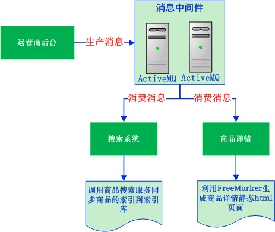
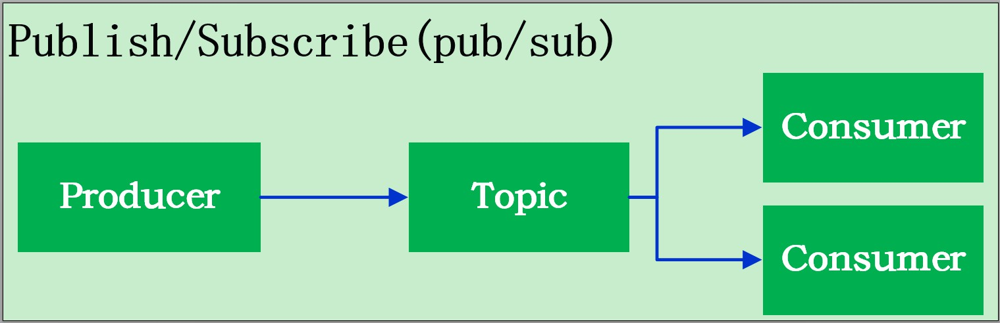
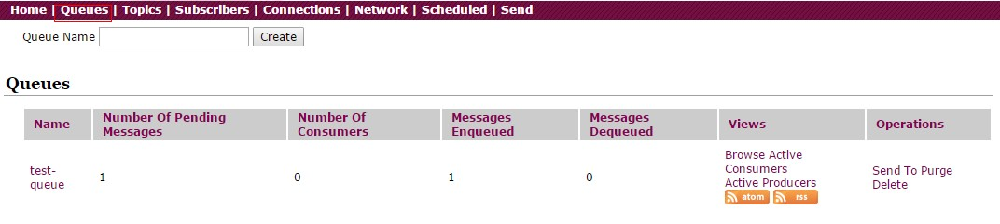
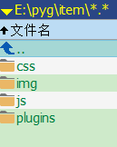
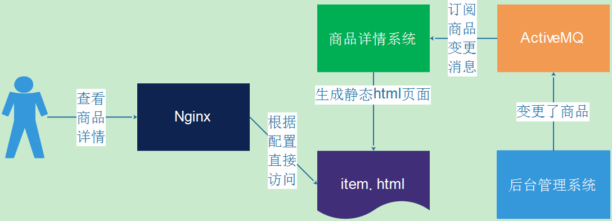
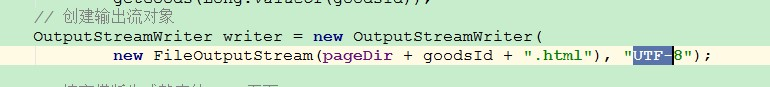

# Day14 JMS-消息中间件解决方案&FreeMarker静态化

## 1. JMS介绍
### 1.1. 消息中间件
#### 1.1.1. 品优购系统模块

目前已经完成了5个web模块和3个服务模块。其中运营商后台的调用关系最多，用到了商家商品服务、内容服务、搜索服务。这种模块之间的依赖也称之为耦合。而耦合越多，之后的维护工作就越困难。那么如何改善系统模块调用关系、<font color="red">***减少模块之间的耦合、提高系统的吐吞量***</font>？接下来就介绍一种解决方案----消息中间件。

#### 1.1.2. 什么是消息中间件

消息中间件利用高效可靠的消息传递机制进行平台无关的数据交流，并基于数据通信来进行分布式系统的集成。通过提供消息传递和消息排队模型，它可以在分布式环境下扩展进程间的通信。对于消息中间件，常见的角色大致也就有Producer（生产者）、Consumer（消费者）

常见的消息中间件产品:

1. <font color="red">**ActiveMQ**</font>
    - ActiveMQ是Apache出品，最流行的，能力强劲的开源消息总线。ActiveMQ是一个完全支持JMS1.1和J2EE 1.4规范的JMS Provider实现。本项目中使用 ActiveMQ作为消息中间件。【5W/s吞吐量】
2. RabbitMQ
	- AMQP协议的领导实现，支持多种场景。淘宝的MySQL集群内部有使用它进行通讯，OpenStack开源云平台的通信组件，最先在金融行业得到运用。【5W/s吞吐量】
3. RocketMQ
    - 阿里开源分布式消息队列系统 【10W/s吞吐量】
3. Kafka
    - Apache下的一个子项目 。特点：高吞吐，在一台普通的服务器上既可以达到16W/s的吞吐量；完全的分布式系统。适合处理海量数据。（没有处理事务）

<font color="red">**扩展**</font>

- 目前还没有很好的方案处理分布式事务。企业一般在分布式系统都会使用ActiveMQ消息中件间来处理不同服务之间的事务；
- 另一种处理事务的方案是，将不同的服务做成一个服务，当成本地事务处理即可。


#### 1.1.3. 改造系统模块调用关系



通过引入消息中间件ActiveMQ，使得运营商后台系统与搜索系统、商品详情系统解除了耦合，提高运营商后台系统的吞吐量

### 1.2. JMS简介
#### 1.2.1. 什么是JMS

JMS（Java Messaging Service）是Java平台上有关面向消息中间件的技术规范，它便于消息系统中的Java应用程序进行消息交换,并且通过提供标准的产生、发送、接收消息的接口简化企业应用的开发。

JMS本身只定义了一系列的接口规范，是一种与厂商无关的 API，用来访问消息收发系统。它类似于 JDBC(java Database Connectivity)：这里，JDBC 是可以用来访问许多不同关系数据库的 API，而 JMS 则提供同样与厂商无关的访问方法，以访问消息收发服务。许多厂商目前都支持 JMS，包括 IBM 的 MQSeries、BEA的 Weblogic JMS service和 Progress 的 SonicMQ，这只是几个例子。 JMS 使您能够通过消息收发服务（有时称为消息中介程序或路由器）从一个 JMS 客户机向另一个 JML 客户机发送消息。消息是 JMS 中的一种类型对象，由两部分组成：报头和消息主体。报头由路由信息以及有关该消息的元数据组成。消息主体则携带着应用程序的数据或有效负载。

JMS 定义了五种不同的消息正文格式，以及调用的消息类型，允许你发送并接收以一些不同形式的数据，提供现有消息格式的一些级别的兼容性。

- `TextMessage` -- 一个字符串对象（比较常用）
- `MapMessage` -- 一套名称-值对（比较常用）
- `ObjectMessage` -- 一个序列化的 Java 对象（比较常用）
- `BytesMessage` -- 一个字节的数据流
- `StreamMessage` -- Java 原始值的数据流

#### 1.2.2. JMS消息传递类型

对于消息的传递有两种类型：

- 一种是点对点的，即一个生产者和一个消费者一一对应


- 另一种是发布/ 订阅模式，即一个生产者产生消息并进行发送后，可以由多个消费者进行接收



### 1.3. ActiveMQ下载与安装
#### 1.3.1. 下载

官方网站下载：http://activemq.apache.org/

#### 1.3.2. 安装（Linux）

参考：【\Java编程工具资料\Java源代码\Apache ActiveMQ【消息中间件】\ActiveMQ资料（项目2）\Linux安装ActiveMQ.docx】

ActiveMQ是一个java语言开发的MQ服务器。在安装之前必须安装jdk。使用jdk1.8以上版本。

```shell
# 上传
cd /usr/local/

# 使用rz 上传“apache-activemq-5.14.5-bin.tar.gz”

# 解压文件
tar -xzvf apache-activemq-5.14.5-bin.tar.gz
# 重命名
mv apache-activemq-5.14.5 activemq
# 删除压缩包
rm -rf apache-activemq-5.14.5-bin.tar.gz
```

#### 1.3.3. 启动

```shell
# 进入解压后的文件夹的bin/linux-x86-64/目录
cd activemq/bin/linux-x86-64/

# 启动ActiveMQ；重启restart,查看状态status
./activemq start

# *******或者如下：**********
# 启动
/usr/local/activemq/bin/linux-x86-64/activemq start
# 停止
/usr/local/activemq/bin/linux-x86-64/activemq stop
# 重启
/usr/local/activemq/bin/linux-x86-64/activemq restart
# 查看状态
/usr/local/activemq/bin/linux-x86-64/activemq status
```

#### 1.3.4. 关闭防火墙

```shell
# 停止防火墙
systemctl stop firewalld.service

# 禁止防火墙开机启动
systemctl disable firewalld.service
```

#### 1.3.5. 访问

- 打开浏览器访问：`http://192.168.12.131:8161/admin/`
    - 账号：admin
    - 密码：admin
- 说明：ActiveMQ中间件，采用jetty作为内嵌Web服务器，它实际上也是一个Web应用。
- 备注：
    1. 修改端口号：打开activemq\conf\jetty.xml文件，修改110行：`<property name="port" value="8161"/>`
    2. 修改用户名与密码：打开`activemq\conf\users.properties`文件进行修改
    3. 修改连接端口：打开activemq\conf\activemq.xml文件，修改113行：`tcp://0.0.0.0:61616`

#### 1.3.6. 点对点消息列表界面介绍：



- `Number Of Pending Messages`：等待消费的消息 -- 这个是当前未出队列的数量。
- `Number Of Consumers`：消费者 -- 这个是消费者端的消费者数量
- `Messages Enqueued`：进入队列的消息 -- 进入队列的总数量，包括出队列的。
- `Messages Dequeued`：出了队列的消息 -- 可以理解为是消费这消费掉的数量。

*注：消息队列是先进先出，消费是按顺序的，如何使用队列消息（点对点），不会出来重复消费的问题。*

---

## 2. JMS入门示例

jms的具体的使用步骤与API在项目1时已经使用，可以参考结合项目1 day15的内容。下面只有案例，没有详细步骤

### 2.1. 创建项目

在pyg-test项目中，创建maven工程activemq-test，选择jar类型，引入依赖

```xml
<?xml version="1.0" encoding="UTF-8"?>
<project xmlns="http://maven.apache.org/POM/4.0.0"
         xmlns:xsi="http://www.w3.org/2001/XMLSchema-instance"
         xsi:schemaLocation="http://maven.apache.org/POM/4.0.0
         http://maven.apache.org/xsd/maven-4.0.0.xsd">
    <parent>
        <artifactId>pyg-test</artifactId>
        <groupId>com.moon</groupId>
        <version>1.0-SNAPSHOT</version>
    </parent>
    <modelVersion>4.0.0</modelVersion>
    <artifactId>activemq-test</artifactId>
    <packaging>jar</packaging>
    <name>activemq-test</name>

    <!-- 配置依赖关系 -->
    <dependencies>
        <!-- 配置activemq-client客户端依赖 -->
        <dependency>
            <groupId>org.apache.activemq</groupId>
            <artifactId>activemq-client</artifactId>
            <version>5.14.5</version>
        </dependency>
    </dependencies>

</project>
```

### 2.2. 点对点模式

点对点的模式主要建立在一个队列上面，当连接一个列队的时候，发送端不需要知道接收端是否正在接收，可以直接向ActiveMQ发送消息，发送的消息，将会先进入队列中，如果有接收端在监听，则会发向接收端，如果没有接收端接收，则会保存在activemq服务器，直到接收端接收消息，点对点的消息模式可以有多个发送端，多个接收端，但是一条消息，只会被一个接收端给接收到，哪个接收端先连上ActiveMQ，则会先接收到，而后来的接收端则接收不到那条消息。


#### 2.2.1. 消息生产者

创建ProducerTest.java，配置消息生产者(点对点)

```java
/**
 * 消息生产者(点对点)
 */
public class ProducerTest {

    public static void main(String[] args) throws Exception {
        // 定义连接消息中间件的地址(使用tcp协议)
        String brokerURL = "tcp://192.168.12.131:61616";

        // 1. 创建连接工厂
        ConnectionFactory connectionFactory = new ActiveMQConnectionFactory(brokerURL);
        // 2. 创建连接对象
        Connection connection = connectionFactory.createConnection();
        // 3. 开启连接
        connection.start();

        /*
         * 4. 创建会话对象
         *      第一个参数transacted: 是否开启事务 true开启 false不开启
         *      第二个参数acknowledgeMode：应答模式
         *      Session.AUTO_ACKNOWLEDGE: 自动应答
         *      Session.CLIENT_ACKNOWLEDGE: 客户端应答
         *      Session.DUPS_OK_ACKNOWLEDGE: 重复确认应答
         *      Session.SESSION_TRANSACTED: 会话事务
         */
        Session session = connection.createSession(false, Session.AUTO_ACKNOWLEDGE);

        // 5. 创建消息的模式：队列，指定队列的名称
        Queue queue = session.createQueue("test-queue");
        // 6. 创建消息生产者
        MessageProducer producer = session.createProducer(queue);

        // 7. 创建消息体对象
        TextMessage textMessage = session.createTextMessage();
        // 设置内容
        textMessage.setText("JMS, queue test!!");

        // 8. 发送消息到消息中间件
        producer.send(textMessage);
        System.out.println("===【Queue生产者】成功发送消息===");

        // 9. 关闭消息生产者、会话、连接
        producer.close();
        session.close();
        connection.close();
    }
}
```

上述代码中创建session的两个参数：

- 第1个参数 是否使用事务
- 第2个参数 消息的应答模式
    - AUTO_ACKNOWLEDGE = 1    自动应答
    - CLIENT_ACKNOWLEDGE = 2    客户端应答
    - DUPS_OK_ACKNOWLEDGE = 3   重复确定应答
    - SESSION_TRANSACTED = 0    会话事务

#### 2.2.2. 消息消费者

创建ConsumerTest类，循环监听，消费消息

```java
/**
 * 消息消费者（点对点）
 */
public class ConsumerTest {

    public static void main(String[] args) throws Exception {
        // 定义连接消息中间件的地址(使用tcp协议)
        String brokerURL = "tcp://192.168.12.131:61616";

        // 1. 创建连接工厂
        ConnectionFactory connectionFactory = new ActiveMQConnectionFactory(brokerURL);
        // 2. 创建连接对象
        Connection connection = connectionFactory.createConnection();
        // 3. 开启连接
        connection.start();

        /*
         * 4. 创建会话对象
         *      第一个参数transacted: 是否开启事务 true开启 false不开启
         *      第二个参数acknowledgeMode：应答模式
         *      Session.AUTO_ACKNOWLEDGE: 自动应答
         *      Session.CLIENT_ACKNOWLEDGE: 客户端应答
         *      Session.DUPS_OK_ACKNOWLEDGE: 重复确认应答
         *      Session.SESSION_TRANSACTED: 会话事务
         */
        Session session = connection.createSession(false, Session.AUTO_ACKNOWLEDGE);

        // 5. 创建消息的模式：队列，指定队列的名称(消费的队列名称)
        Queue queue = session.createQueue("test-queue");
        // 6. 创建消息消费者
        MessageConsumer consumer = session.createConsumer(queue);

        // 循环一直监听
        while (true) {
            // 7. 设置消息监听器
            consumer.setMessageListener(new MessageListener() {
                @Override
                public void onMessage(Message message) {
                    // 判断消息对象的类型
                    if (message instanceof TextMessage) {
                        // 强制转换
                        TextMessage textMessage = (TextMessage) message;
                        // 获取消息内容
                        try {
                            System.out.println("===【Queue消费者】接收到消息===" + textMessage.getText());
                        } catch (JMSException e) {
                            e.printStackTrace();
                        }
                    }
                }
            });
        }
    }
}
```

#### 2.2.3. 运行测试

同时开启2个以上的消费者，再次运行生产者，观察每个消费者控制台的输出，会发现<font color="red">**只有一个消费者会接收到消息**</font>。

### 2.3. 发布/订阅模式
#### 2.3.1. 消息生产者

创建ProducerTest类，配置消息生产者(主题)

```java
/**
 * 消息生产者(发布与订阅)
 */
public class ProducerTest {

    public static void main(String[] args) throws Exception {
        // 定义连接消息中间件的地址(使用tcp协议)
        String brokerURL = "tcp://192.168.12.131:61616";

        // 1. 创建连接工厂
        ConnectionFactory connectionFactory = new ActiveMQConnectionFactory(brokerURL);
        // 2. 创建连接对象
        Connection connection = connectionFactory.createConnection();
        // 3. 开启连接
        connection.start();

        // 4. 创建会话对象
        Session session = connection.createSession(false, Session.AUTO_ACKNOWLEDGE);

        // 5. 创建消息的模式：主题，指定主题的名称
        Topic topic = session.createTopic("test-topic");
        // 6. 创建消息生产者
        MessageProducer producer = session.createProducer(topic);

        // 7. 创建消息体对象
        TextMessage textMessage = session.createTextMessage();
        // 设置内容
        textMessage.setText("JMS, queue test2!!");

        // 8. 发送消息到消息中间件
        producer.send(textMessage);
        System.out.println("===【Topic生产者】成功发送消息===");

        // 9. 关闭消息生产者、会话、连接
        producer.close();
        session.close();
        connection.close();
    }
}
```

#### 2.3.2. 消息消费者

创建ConsumerTest类，监听消息

```java
/**
 * 消息消费者（发布与订阅）
 */
public class ConsumerTest {

    public static void main(String[] args) throws Exception {
        // 定义连接消息中间件的地址(使用tcp协议)
        String brokerURL = "tcp://192.168.12.131:61616";

        // 1. 创建连接工厂
        ConnectionFactory connectionFactory = new ActiveMQConnectionFactory(brokerURL);
        // 2. 创建连接对象
        Connection connection = connectionFactory.createConnection();
        // 3. 开启连接
        connection.start();

        // 4. 创建会话对象
        Session session = connection.createSession(false, Session.AUTO_ACKNOWLEDGE);

        // 5. 创建消息的模式：主题，指定队列的名称(消费的队列名称)
        Topic topic = session.createTopic("test-topic");
        // 6. 创建消息消费者
        MessageConsumer consumer = session.createConsumer(topic);

        // 循环一直监听
        while (true) {
            // 7. 设置消息监听器
            consumer.setMessageListener(new MessageListener() {
                @Override
                public void onMessage(Message message) {
                    // 判断消息对象的类型
                    if (message instanceof TextMessage) {
                        // 强制转换
                        TextMessage textMessage = (TextMessage) message;
                        // 获取消息内容
                        try {
                            System.out.println("===【Topic消费者】接收到消息===" + textMessage.getText());
                        } catch (JMSException e) {
                            e.printStackTrace();
                        }
                    }
                }
            });
        }
    }
}
```

#### 2.3.3. 运行测试

同时开启2个以上的消费者，再次运行生产者，观察每个消费者控制台的输出，会发现<font color="red">**每个消费者会接收到消息**</font>。

---

## 3. Spring 整合 JMS
### 3.1. 配置依赖

```java
<!-- spring-jms -->
<dependency>
    <groupId>org.springframework</groupId>
    <artifactId>spring-jms</artifactId>
    <version>4.3.10.RELEASE</version>
</dependency>
```

### 3.2. 点对点模式
#### 3.2.1. spring 配置

在src/main/resources下创建applicationContext-queue.xml

```xml
<?xml version="1.0" encoding="utf-8"?>
<beans xmlns="http://www.springframework.org/schema/beans"
       xmlns:xsi="http://www.w3.org/2001/XMLSchema-instance"
       xmlns:jms="http://www.springframework.org/schema/jms"
       xsi:schemaLocation="http://www.springframework.org/schema/beans
                  http://www.springframework.org/schema/beans/spring-beans.xsd
                  http://www.springframework.org/schema/jms
                  http://www.springframework.org/schema/jms/spring-jms.xsd">

    <!--########### 通用配置 #############-->
    <bean id="activeMQConnectionFactory"
          class="org.apache.activemq.ActiveMQConnectionFactory">
        <!-- 设置brokerURL(连接消息中间件的地址) -->
        <property name="brokerURL" value="tcp://192.168.12.131:61616"/>
    </bean>
    <!-- 配置Spring-JMS的单例连接工厂 -->
    <bean id="connectionFactory"
          class="org.springframework.jms.connection.SingleConnectionFactory">
        <!-- 设置ActiveMQ的连接工厂交由它管理-->
        <property name="targetConnectionFactory" ref="activeMQConnectionFactory"/>
    </bean>

    <!--########### 消息生产者配置 #############-->
    <!-- 配置JmsTemplate模版对象发送消息 -->
    <bean id="jmsTemplate" class="org.springframework.jms.core.JmsTemplate">
        <!-- 设置连接工厂 -->
        <property name="connectionFactory" ref="connectionFactory"/>
        <!-- 设置默认的目标 -->
        <property name="defaultDestination" ref="queue"/>
    </bean>
    <!-- 配置消息的目标(点对点) -->
    <bean id="queue" class="org.apache.activemq.command.ActiveMQQueue">
        <!-- 设置队列名称 -->
        <constructor-arg value="spring-queue"/>
    </bean>

    <!--########### 消息消费者配置 #############-->
    <!--
        配置监听器容器
        connection-factory: 连接工厂
        destination-type: 目标类型
    -->
    <jms:listener-container connection-factory="connectionFactory"
                            destination-type="queue">
        <!-- 配置监听器 destination: 队列名称 ref: 引用消息监听器Bean -->
        <jms:listener destination="spring-queue" ref="queueMessageListener"/>
    </jms:listener-container>
    <!-- 配置消息监听器Bean -->
    <bean id="queueMessageListener"
          class="com.moon.activemq.spring.listener.QueueMessageListener"/>

</beans>
```

#### 3.2.2. 消息生产者与消费者

- com.moon.activemq.spring包下创建QueueTest消息生产者

```java
/**
 * 队列消息生产者
 */
public class QueueTest {

    public static void main(String[] args) {
        // 获取Spring容器
        ApplicationContext ac = new ClassPathXmlApplicationContext("applicationContext-queue.xml");
        // 获取JmsTemplate模版对象
        JmsTemplate jmsTemplate = ac.getBean(JmsTemplate.class);
        // 发送消息
        jmsTemplate.send(new MessageCreator() {
            @Override
            public Message createMessage(Session session) throws JMSException {
                TextMessage textMessage = session.createTextMessage();
                textMessage.setText("Spring JMS!");
                return textMessage;
            }
        });
    }
}
```

- com.moon.activemq.spring.listener包下创建QueueMessageListener消息消费者监听器

```java
/**
 * 队列消息监听器
 */
public class QueueMessageListener implements SessionAwareMessageListener<TextMessage> {

    @Override
    public void onMessage(TextMessage textMessage, Session session) throws JMSException {
        System.out.println("=========QueueMessageListener=======");
        System.out.println("消息内容：" + textMessage.getText());
    }
}
```

### 3.3. 发布/订阅模式
#### 3.3.1. spring 配置

在src/main/resources下创建spring文件applicationContext-topic.xml

```xml
<?xml version="1.0" encoding="utf-8"?>
<beans xmlns="http://www.springframework.org/schema/beans"
       xmlns:xsi="http://www.w3.org/2001/XMLSchema-instance"
       xmlns:jms="http://www.springframework.org/schema/jms"
       xsi:schemaLocation="http://www.springframework.org/schema/beans
                  http://www.springframework.org/schema/beans/spring-beans.xsd
                  http://www.springframework.org/schema/jms
                  http://www.springframework.org/schema/jms/spring-jms.xsd">

    <!--########### 通用配置 #############-->
    <bean id="activeMQConnectionFactory"
          class="org.apache.activemq.ActiveMQConnectionFactory">
        <!-- 设置brokerURL(连接消息中间件的地址) -->
        <property name="brokerURL" value="tcp://192.168.12.131:61616"/>
    </bean>
    <!-- 配置Spring-JMS的单例连接工厂 -->
    <bean id="connectionFactory"
          class="org.springframework.jms.connection.SingleConnectionFactory">
        <!-- 设置ActiveMQ的连接工厂交由它管理-->
        <property name="targetConnectionFactory" ref="activeMQConnectionFactory"/>
    </bean>

    <!--########### 消息生产者配置 #############-->
    <!-- 配置JmsTemplate模版对象发送消息 -->
    <bean id="jmsTemplate" class="org.springframework.jms.core.JmsTemplate">
        <!-- 设置连接工厂 -->
        <property name="connectionFactory" ref="connectionFactory"/>
        <!-- 设置默认的目标 -->
        <property name="defaultDestination" ref="topic"/>
    </bean>
    <!-- 配置消息的目标(主题) -->
    <bean id="topic" class="org.apache.activemq.command.ActiveMQTopic">
        <!-- 设置队列名称 -->
        <constructor-arg value="spring-topic"/>
    </bean>

    <!--########### 消息消费者配置 #############-->
    <!--
        配置监听器容器
        connection-factory: 连接工厂
        destination-type: 目标类型
    -->
    <jms:listener-container connection-factory="connectionFactory"
                            destination-type="topic">
        <!-- 配置监听器 destination: 队列名称 ref: 引用消息监听器Bean -->
        <jms:listener destination="spring-topic" ref="topicMessageListener"/>
    </jms:listener-container>
    <!-- 配置消息监听器Bean -->
    <bean id="topicMessageListener"
          class="com.moon.activemq.spring.listener.TopicMessageListener"/>

</beans>
```

#### 3.3.2. 消息生产者与消费者

- com.moon.activemq.spring包下创建TopicTest消息生产者

```java
/**
 * 主题消息生产者
 */
public class TopicTest {

    public static void main(String[] args) {
        // 获取Spring容器
        ApplicationContext ac = new ClassPathXmlApplicationContext("applicationContext-topic.xml");
        // 获取JmsTemplate模版对象
        JmsTemplate jmsTemplate = ac.getBean(JmsTemplate.class);
        // 发送消息
        jmsTemplate.send(new MessageCreator() {
            @Override
            public Message createMessage(Session session) throws JMSException {
                MapMessage mapMessage = session.createMapMessage();
                mapMessage.setLong("id", 1L);
                mapMessage.setString("name", "月の哀傷");
                mapMessage.setInt("age", 20);
                return mapMessage;
            }
        });
    }
}
```

- com.moon.activemq.spring.listener包下创建TopicMessageListener消息消费者监听器

```java
/**
 * 主题消息监听器
 */
public class TopicMessageListener implements SessionAwareMessageListener<MapMessage> {

    @Override
    public void onMessage(MapMessage mapMessage, Session session) throws JMSException {
        System.out.println("=========TopicMessageListener=======");
        System.out.println("id: " + mapMessage.getLong("id"));
        System.out.println("name: " + mapMessage.getString("name"));
        System.out.println("age: " + mapMessage.getInt("age"));
    }
}
```

---

## 4. 商品审核-导入Solr索引库
### 4.1. 需求分析

运用消息中间件ActiveMQ实现运营商后台与搜索系统的零耦合。运营商执行商品审核后，向ActiveMQ发送消息（goodsIds与status），搜索服务从ActiveMQ接收到消息查询审批通的SKU数据并导入到solr索引库。

### 4.2. 消息生产者【运营商后台】
#### 4.2.1. 解除耦合

- 修改pinyougou-manager-web的pom.xml，~~删除搜索服务接口依赖~~

```xml
<!-- 依赖pinyougou-search-interface模块 -->
<!-- <dependency>
    <groupId>com.moon</groupId>
    <artifactId>pinyougou-search-interface</artifactId>
    <version>${project.version}</version>
</dependency> -->
```

- GoodsController.java中~~删除调用搜索服务接口的相关代码~~

```java
/* 注入搜索服务 */
/*@Reference(timeout = 30000)
private ItemSearchService itemSearchService;*/

@GetMapping("/updateStatus")
public boolean updateStatus(@RequestParam("ids") Long[] ids,
                            @RequestParam("status") String status) {
    ......
    // 判断状态码，是否审核通过
    if ("1".equals(status)) {
        /*// 根据SPU商品的id与审核状态查询SKU具体商品的数据
        List<Item> itemList = goodsService.findItemByGoodsIdAndStatus(ids, status);

        // 判断查询结果
        if (itemList != null && itemList.size() > 0) {
            List<SolrItem> solrItems = new ArrayList<SolrItem>();

            // 遍历sku商品集合，循环把List<Item> 转化成 List<SolrItem>
            for (Item item : itemList) {
                SolrItem solrItem = new SolrItem();
                // 使用spring框架提供的BeanUtils工具类，复制实体对象
                BeanUtils.copyProperties(item, solrItem);
                *//*
                 * 把spec规格选项的json字符串转化成Map集合
                 *      {"网络":"联通4G","机身内存":"64G"}
                 *//*
                Map<String, String> specMap = JSON.parseObject(item.getSpec(), Map.class);
                // 设置规格选项动态域数据到solrItem中
                solrItem.setSpecMap(specMap);
                // 将封装索引库对象添加到集合中
                solrItems.add(solrItem);
            }

            // 同步更新SKU具体商品数据到Solr索引库
            itemSearchService.saveOrUpdate(solrItems);
        }*/
    }
    ......
}


public boolean deleteGoods(@RequestParam("ids") Long[] ids) {
    ......
        // 2. 调用搜索服务，删除索引库数据
        // itemSearchService.delete(Arrays.asList(ids));
    ......
}
```

#### 4.2.2. 引入与配置activemq与spring jms依赖

- pinyougou-manager-web工程的pom.xml，引入依赖

```xml
<!-- activemq-client -->
<dependency>
    <groupId>org.apache.activemq</groupId>
    <artifactId>activemq-client</artifactId>
</dependency>
<!-- spring-jms -->
<dependency>
    <groupId>org.springframework</groupId>
    <artifactId>spring-jms</artifactId>
</dependency>
```

- pinyougou-manager-web工程在resources添加applicationContext-jms.xml

```xml
<?xml version="1.0" encoding="utf-8"?>
<beans xmlns="http://www.springframework.org/schema/beans"
       xmlns:xsi="http://www.w3.org/2001/XMLSchema-instance"
       xmlns:context="http://www.springframework.org/schema/context"
       xsi:schemaLocation="http://www.springframework.org/schema/beans
           http://www.springframework.org/schema/beans/spring-beans.xsd
           http://www.springframework.org/schema/context
           http://www.springframework.org/schema/context/spring-context.xsd">

    <!-- 配置加载属性文件 -->
    <context:property-placeholder location="classpath:jms.properties"/>

    <!--########### 通用配置 #############-->
    <bean id="activeMQConnectionFactory"
          class="org.apache.activemq.ActiveMQConnectionFactory">
        <!-- 设置brokerURL(连接消息中间件的地址) -->
        <property name="brokerURL" value="${brokerURL}"/>
    </bean>
    <!-- 配置Spring-JMS的单例连接工厂 -->
    <bean id="singleConnectionFactory" class="org.springframework.jms.connection.SingleConnectionFactory">
        <!-- 设置ActiveMQ的连接工厂交由它管理-->
        <property name="targetConnectionFactory" ref="activeMQConnectionFactory"/>
    </bean>

    <!--########### 消息生产者配置 #############-->
    <!-- 配置JmsTemplate模版对象发送消息 -->
    <bean id="jmsTemplate" class="org.springframework.jms.core.JmsTemplate">
        <!-- 设置连接工厂 -->
        <property name="connectionFactory" ref="singleConnectionFactory"/>
    </bean>
    <!-- 配置消息的目标(点对点)，更新索引库的消息队列 -->
    <bean id="solrQueue" class="org.apache.activemq.command.ActiveMQQueue">
        <!-- 设置队列名称 -->
        <constructor-arg value="solr.queue"/>
    </bean>

</beans>
```

- 创建jms.properties，配置消息中间件连接地址

```properties
# 配置连接消息中间件的URL
brokerURL=tcp://192.168.12.131:61616
```

#### 4.2.3. 修改运营商后台审核商品

修改pinyougou-manager-web工程的GoodsController.java的updateStatus()方法，商品审核通过后发送队列消息

```java
/* 注入spring jms模版操作对象 */
@Autowired
private JmsTemplate jmsTemplate;
/* 注入队列目标对象 */
@Autowired
private Destination solrQueue;

@GetMapping("/updateStatus")
public boolean updateStatus(@RequestParam("ids") Long[] ids,
                            @RequestParam("status") String status) {
    try {
        // 调用服务层批量修改方法
        goodsService.updateStatus(ids, status);

        // 判断状态码，是否审核通过
        if ("1".equals(status)) {
            // 发送消息(同步SKU商品的索引)
            jmsTemplate.send(solrQueue, new MessageCreator() {
                @Override
                public Message createMessage(Session session) throws JMSException {
                    // 发送ActiveMQMapMessage Map集合消息体
                    MapMessage mapMessage = session.createMapMessage();
                    // 设置审核的商品id
                    mapMessage.setObject("ids", Arrays.asList(ids));
                    // 设置商品的审核状态码
                    mapMessage.setString("status", status);
                    return mapMessage;
                }
            });
        }
        return true;
    } catch (Exception e) {
        e.printStackTrace();
    }
    return false;
}
```

### 4.3. 消息消费者【搜索系统】
#### 4.3.1. 引入ActiveMQ消息中间件依赖与相关配置

- 修改pinyougou-search-web工程，在pom.xml中添加依赖

```xml
<!-- activemq-client -->
<dependency>
    <groupId>org.apache.activemq</groupId>
    <artifactId>activemq-client</artifactId>
</dependency>
<!-- spring-jms -->
<dependency>
    <groupId>org.springframework</groupId>
    <artifactId>spring-jms</artifactId>
</dependency>
<!-- 依赖商家服务pinyougou-sellergoods-interface -->
<dependency>
    <groupId>com.moon</groupId>
    <artifactId>pinyougou-sellergoods-interface</artifactId>
    <version>${project.version}</version>
</dependency>
```

- 添加spring配置文件applicationContext-jms.xml，配置消息消费者

```xml
<?xml version="1.0" encoding="utf-8"?>
<beans xmlns="http://www.springframework.org/schema/beans"
       xmlns:xsi="http://www.w3.org/2001/XMLSchema-instance"
       xmlns:context="http://www.springframework.org/schema/context"
       xmlns:jms="http://www.springframework.org/schema/jms"
       xsi:schemaLocation="http://www.springframework.org/schema/beans
            http://www.springframework.org/schema/beans/spring-beans.xsd
            http://www.springframework.org/schema/context
            http://www.springframework.org/schema/context/spring-context.xsd
            http://www.springframework.org/schema/jms
            http://www.springframework.org/schema/jms/spring-jms.xsd">

    <!-- 配置加载属性文件 -->
    <context:property-placeholder location="classpath:jms.properties"/>

    <!--########### 通用配置 #############-->
    <bean id="activeMQConnectionFactory"
          class="org.apache.activemq.ActiveMQConnectionFactory">
        <!-- 设置brokerURL(连接消息中间件的地址) -->
        <property name="brokerURL" value="${brokerURL}"/>
    </bean>
    <!-- 配置Spring-JMS的单例连接工厂 -->
    <bean id="singleConnectionFactory" class="org.springframework.jms.connection.SingleConnectionFactory">
        <!-- 设置ActiveMQ的连接工厂交由它管理-->
        <property name="targetConnectionFactory" ref="activeMQConnectionFactory"/>
    </bean>

    <!--########### 消息消费者配置 #############-->
    <!--
        配置监听器容器
        connection-factory: 连接工厂
        destination-type: 目标类型
    -->
    <jms:listener-container connection-factory="singleConnectionFactory" destination-type="queue">
        <!-- 配置监听器 destination: 队列名称 ref: 引用消息监听器Bean -->
        <jms:listener destination="solr.queue" ref="itemMessageListener"/>
    </jms:listener-container>
    <!-- 配置消息监听器Bean -->
    <bean id="itemMessageListener" class="com.pinyougou.search.listener.ItemMessageListener"/>

</beans>
```

- 新增jms.properties

```properties
# 配置连接消息中间件的URL
brokerURL=tcp://192.168.12.131:61616
```

- 修改pinyougou-search-web-servlet.xml配置文件，增加dubbo构架扫描com.pinyougou.search.listener包，引用服务

```xml
<!-- 配置引用服务，产生服务接口的代理对象(采用包扫描)-->
<dubbo:annotation package="com.pinyougou.search.controller,com.pinyougou.search.listener"/>
```

- 修改web.xml文件，配置加载applicationContext-jms.xml配置文件

```xml
<!-- 配置Spring MVC前端控制器(核心控制器) -->
<servlet>
    <servlet-name>pinyougou-search-web</servlet-name>
    <servlet-class>org.springframework.web.servlet.DispatcherServlet</servlet-class>
    <init-param>
        <param-name>contextConfigLocation</param-name>
        <param-value>
            classpath:pinyougou-search-web-servlet.xml,
            classpath:applicationContext-jms.xml
        </param-value>
    </init-param>
    <load-on-startup>1</load-on-startup>
</servlet>
<servlet-mapping>
    <servlet-name>pinyougou-search-web</servlet-name>
    <url-pattern>/</url-pattern>
</servlet-mapping>
```

#### 4.3.2. 创建消息消费者监听类

在pinyougou-search-web的com.pinyougou.search.listener新增监听类

```java
/**
 * 队列消息监听器(同步SKU商品索引)
 */
public class ItemMessageListener implements SessionAwareMessageListener<MapMessage> {

    /* 引用商品服务 */
    @Reference(timeout = 30000)
    private GoodsService goodsService;
    /* 引用搜索服务 */
    @Reference(timeout = 30000)
    private ItemSearchService itemSearchService;

    @Override
    public void onMessage(MapMessage mapMessage, Session session) throws JMSException {
        System.out.println("=======ItemMessageListener开始消费消息======");

        // 获取消息的内容
        List<Long> ids = (List<Long>) mapMessage.getObject("ids");
        String status = mapMessage.getString("status");
        System.out.println("获取消息的内容ids:" + ids);
        System.out.println("获取消息的内容status:" + status);

        /*
         * 根据SPU商品的id与审核状态查询SKU具体商品的数据
         *      注：因为findItemByGoodsIdAndStatus方法原来的id入参是Long[]，而不是List
         */
        Long[] idArr = ids.toArray(new Long[ids.size()]);
        List<Item> itemList = goodsService.findItemByGoodsIdAndStatus(idArr, status);

        // 判断查询结果
        if (itemList != null && itemList.size() > 0) {
            List<SolrItem> solrItems = new ArrayList<SolrItem>();

            // 遍历sku商品集合，循环把List<Item> 转化成 List<SolrItem>
            for (Item item : itemList) {
                SolrItem solrItem = new SolrItem();
                // 使用spring框架提供的BeanUtils工具类，复制实体对象
                BeanUtils.copyProperties(item, solrItem);
                /*
                 * 把spec规格选项的json字符串转化成Map集合
                 *      {"网络":"联通4G","机身内存":"64G"}
                 */
                Map<String, String> specMap = JSON.parseObject(item.getSpec(), Map.class);
                // 设置规格选项动态域数据到solrItem中
                solrItem.setSpecMap(specMap);
                // 将封装索引库对象添加到集合中
                solrItems.add(solrItem);
            }

            // 同步更新SKU具体商品数据到Solr索引库
            itemSearchService.saveOrUpdate(solrItems);
        }
    }
}
```

<font color="red">***注意：以上的代码因为ActiveMQMapMessage Map集合消息体的setObject()是不能设置数组，所以上面的代码才会出现转成集合发送消息，接收消息后又将集合转回数组***</font>

---

## 5. 商品删除-移除Solr索引库记录
### 5.1. 需求分析

- 运营商删除商品时，发送消息通知搜索系统删除索引库该SPU对应SKU商品的所有索引。
- 商家修改商品时，发送消息通知搜索系统删除索引库该SPU对应SKU商品的所有索引。

### 5.2. 消息生产者（运营商后台）
#### 5.2.1. 配置文件（applicationContext-jms.xml）

修改pinyougou-manager-web工程的applicationContext-jms.xml，增加队列目标bean配置

```xml
<!-- 配置消息的目标(点对点)，删除索引库的消息队列 -->
<bean id="solrDeleteQueue" class="org.apache.activemq.command.ActiveMQQueue">
    <!-- 设置队列名称 -->
    <constructor-arg value="solr.delete.queue"/>
</bean>
```

#### 5.2.2. 修改运营商后台删除商品方法

修改pinyougou-manager-web工程GoodsController原有删除方法deleteGoods()，发送删除的队列消息

```java
/* 注入队列目标对象(删除索引) */
@Autowired
private Destination solrDeleteQueue;

@GetMapping("/delete")
public boolean deleteGoods(@RequestParam("ids") Long[] ids) {
    try {
        // 1. 调用服务层批量删除方法
        goodsService.deleteGoods(ids);
        // 2. 发送消息(删除索引库数据)
        jmsTemplate.send(solrDeleteQueue, new MessageCreator() {
            @Override
            public Message createMessage(Session session) throws JMSException {
                // 发送ActiveMQObjectMessage 对象消息体，内容为删除的商品ids数组
                return session.createObjectMessage(ids);
            }
        });

        return true;
    } catch (Exception e) {
        e.printStackTrace();
    }
    return false;
}
```

### 5.3. 消息生产者（商家后台）
#### 5.3.1. 配置文件

- pinyougou-shop-web工程pom.xml添加activeMQ与spring jms依赖

```xml
<!-- activemq-client -->
<dependency>
    <groupId>org.apache.activemq</groupId>
    <artifactId>activemq-client</artifactId>
</dependency>
<!-- spring-jms -->
<dependency>
    <groupId>org.springframework</groupId>
    <artifactId>spring-jms</artifactId>
</dependency>
```

- 在pinyougou-shop-web工程中添加applicationContext-jms.xml，配置消息生产者

```xml
<?xml version="1.0" encoding="utf-8"?>
<beans xmlns="http://www.springframework.org/schema/beans"
       xmlns:xsi="http://www.w3.org/2001/XMLSchema-instance"
       xmlns:context="http://www.springframework.org/schema/context"
       xsi:schemaLocation="http://www.springframework.org/schema/beans
           http://www.springframework.org/schema/beans/spring-beans.xsd
           http://www.springframework.org/schema/context
           http://www.springframework.org/schema/context/spring-context.xsd">

    <!-- 配置加载属性文件 -->
    <context:property-placeholder location="classpath:jms.properties"/>

    <!--########### 通用配置 #############-->
    <bean id="activeMQConnectionFactory"
          class="org.apache.activemq.ActiveMQConnectionFactory">
        <!-- 设置brokerURL(连接消息中间件的地址) -->
        <property name="brokerURL" value="${brokerURL}"/>
    </bean>
    <!-- 配置Spring-JMS的单例连接工厂 -->
    <bean id="singleConnectionFactory" class="org.springframework.jms.connection.SingleConnectionFactory">
        <!-- 设置ActiveMQ的连接工厂交由它管理-->
        <property name="targetConnectionFactory" ref="activeMQConnectionFactory"/>
    </bean>

    <!--########### 消息生产者配置 #############-->
    <!-- 配置JmsTemplate模版对象发送消息 -->
    <bean id="jmsTemplate" class="org.springframework.jms.core.JmsTemplate">
        <!-- 设置连接工厂 -->
        <property name="connectionFactory" ref="singleConnectionFactory"/>
    </bean>
    <!-- 配置消息的目标(点对点)，删除索引库的消息队列 -->
    <bean id="solrDeleteQueue" class="org.apache.activemq.command.ActiveMQQueue">
        <!-- 设置队列名称 -->
        <constructor-arg value="solr.delete.queue"/>
    </bean>

</beans>
```

- 创建jms.properties，配置中间件请求url

```properties
# 配置消息中间件服务地址
brokerURL=tcp://192.168.12.131:61616
```

#### 5.3.2. 修改商家后台控制层-更新商品方法

修改pinyougou-shop-web工程的GoodsController.java原有update()方法，在修改商品信息后发送删除索引库的队列消息

```java
@PostMapping("/update")
public boolean update(@RequestBody Goods goods) {
    try {
        // 1. 调用服务层修改方法
        goodsService.updateGoods(goods);

        // 2. 发送队列消息(删除Solr索引库中SKU商品的索引)
        jmsTemplate.send(solrDeleteQueue, new MessageCreator() {
            @Override
            public Message createMessage(Session session) throws JMSException {
                // 发送ActiveMQObjectMessage 对象消息体，内容为删除的商品ids数组
                Long[] ids = {goods.getId()};
                return session.createObjectMessage(ids);
            }
        });

        return true;
    } catch (Exception e) {
        e.printStackTrace();
    }
    return false;
}
```

### 5.4. 消息消费者（搜索系统）
#### 5.4.1. 配置文件（applicationContext-jms.xml）

修改pinyougou-search-web工程的applicationContext-jms.xml，添加删除索引的监听类配置

```xml
<!--########### 消息消费者配置 #############-->
<jms:listener-container connection-factory="singleConnectionFactory" destination-type="queue">
    <!-- 配置监听器 destination: 队列名称 ref: 引用消息监听器Bean -->
    <jms:listener destination="solr.queue" ref="itemMessageListener"/>
    <jms:listener destination="solr.delete.queue" ref="deleteMessageListener"/>
</jms:listener-container>
<!-- 配置消息监听器Bean -->
<bean id="itemMessageListener" class="com.pinyougou.search.listener.ItemMessageListener"/>
<!-- 配置消息监听器Bean（删除索引） -->
<bean id="deleteMessageListener" class="com.pinyougou.search.listener.DeleteMessageListener"/>
```

#### 5.4.2. 创建消息消费者监听类（删除索引）

在pinyougou-search-web的com.pinyougou.search.listener新增监听类

```java
/**
 * 队列消息监听器(删除Solr中的索引)
 */
public class DeleteMessageListener implements SessionAwareMessageListener<ObjectMessage> {

    /* 引入搜索服务 */
    @Reference(timeout = 30000)
    private ItemSearchService itemSearchService;

    @Override
    public void onMessage(ObjectMessage objectMessage, Session session) throws JMSException {
        System.out.println("=======DeleteMessageListener开始消费消息======");

        // 获取消息的内容
        Long[] ids = (Long[]) objectMessage.getObject();
        System.out.println("获取的ids:" + Arrays.toString(ids));

        itemSearchService.delete(Arrays.asList(ids));
    }
}
```

---

## 6. Nginx静态资源服务器
### 6.1. 添加资源到html存储路径

- 复制/pinyougou-item-web/src/main/webapp路径下的css、js、img、plugins文件夹到生成html的路径下。



- /pinyougou-item-web/src/main/resources/application.properties文件中配置如下：

```properties
# 配置生成商品静态html页面存储路径
page.dir=E:/pyg/item/
```

### 6.2. 配置nginx.conf

在nginx的配置文件nginx.conf中添加如下配置信息

```conf
server {
	listen       80;
	server_name  item.moon.com;

	proxy_set_header X-Forwarded-Host $host;
	proxy_set_header X-Forwarded-Server $host;
	proxy_set_header Host $host;

	location / {
			root E:/pyg/item;
			proxy_connect_timeout 600;
			proxy_read_timeout 600;
			# 如果当前请求的文件路径不存在，
			# 则跳转到tomcat服务器9105 exists
			if (!-e $request_filename){
				proxy_pass  http://127.0.0.1:9105;
			}
	}
}
```

### 6.3. 注意

<font color="red">***说明：商品详细页是静态页，在开发阶段我们可以使用tomcat来进行测试。部署在生产环境是部署在Nginx中。***</font>

---

## 7. 商品审核-执行网页静态化
### 7.1. 为什么需要静态化

商品详情页是消费者了解商品的主要途径，访问的频率非常高。所以需要对商品详情页进行优化，提高访问的速度。

优化方案：

- A.使用redis添加缓存
    - redis的访问速度快，能够较大的提升查询数据的速度，减轻MySQL数据库的访问压力。
- B.使用静态化
    - 静态化：把动态页面（jsp，php，asp等)，转变成静态页面（html）
    - 优点：
        1. 访问静态页面不需要经过程序处理，可以提高速度
        2. 稳定性高
        3. 静态页面相对于动态页面更容易被搜索引擎收录（SEO）

### 7.2. 静态化访问流程



### 7.3. 需求分析

运用消息中间件ActiveMQ实现运营商后台系统与商品详情系统零耦合。运营商执行商品审核后，向ActiveMQ发送消息（商品ID），商品详情系统从ActiveMQ接收到消息后执行网页生成操作。

<font color="red">***注：此处网页静态化使用主题订阅而不使用消息队列的原因是：后面需要对商品详情页面做集群。多个tomcat都需要更新详情页面***</font>

### 7.4. 消息生产者（运营商后台）
#### 7.4.1. 配置文件（applicationContext-jms.xml）

修改配置文件applicationContext-jms.xml，添加配置发送更新详情静态页面的主题消息

```xml
<!-- 配置消息的目标(发布与订阅)，更新商品详情页面 -->
<bean id="pageTopic" class="org.apache.activemq.command.ActiveMQTopic">
    <!-- 设置队列名称 -->
    <constructor-arg value="page.topic"/>
</bean>
```

#### 7.4.2. 修改运营商后台审核商品

修改pinyougou-manager-web的GoodsController.java原有updateStatus()方法，发送审核的商品id主题消息

```java
@GetMapping("/updateStatus")
public boolean updateStatus(@RequestParam("ids") Long[] ids,
                            @RequestParam("status") String status) {
    try {
        // 调用服务层批量修改方法
        goodsService.updateStatus(ids, status);

        // 判断状态码，是否审核通过
        if ("1".equals(status)) {
            // 发送消息(同步SKU商品的索引)
            jmsTemplate.send(solrQueue, new MessageCreator() {
                @Override
                public Message createMessage(Session session) throws JMSException {
                    // 发送ActiveMQMapMessage Map集合消息体
                    MapMessage mapMessage = session.createMapMessage();
                    // 设置审核的商品id
                    mapMessage.setObject("ids", Arrays.asList(ids));
                    // 设置商品的审核状态码
                    mapMessage.setString("status", status);
                    return mapMessage;
                }
            });

            // 发送主题消息，生成(更新)商品详情静态html页面
            for (Long goodsId : ids) {
                jmsTemplate.send(pageTopic, new MessageCreator() {
                    @Override
                    public Message createMessage(Session session) throws JMSException {
                        // 发送ActiveMQTextMessage 文本消息体，内容为每个商品的id
                        return session.createTextMessage(goodsId.toString());
                    }
                });
            }
        }
        return true;
    } catch (Exception e) {
        e.printStackTrace();
    }
    return false;
}
```

<font color="red">***注：此处因为使用MapMessage消息体，其中setObject()的方法，不能放数组，所以只能比较麻烦地先将数组转成集合，消费时再才集合转回数组***</font>

### 7.5. 消息消费者（商品详情）
#### 7.5.1. 工程配置

- 在pinyougou-item-web工程pom.xml中引入依赖

```xml
<!-- activemq-client -->
<dependency>
    <groupId>org.apache.activemq</groupId>
    <artifactId>activemq-client</artifactId>
</dependency>
<!-- spring-jms -->
<dependency>
    <groupId>org.springframework</groupId>
    <artifactId>spring-jms</artifactId>
</dependency>
```

- 添加配置文件applicationContext-jms.xml，配置消息监听器

```xml
<?xml version="1.0" encoding="utf-8"?>
<beans xmlns="http://www.springframework.org/schema/beans"
       xmlns:xsi="http://www.w3.org/2001/XMLSchema-instance"
       xmlns:context="http://www.springframework.org/schema/context"
       xmlns:jms="http://www.springframework.org/schema/jms"
       xsi:schemaLocation="http://www.springframework.org/schema/beans
            http://www.springframework.org/schema/beans/spring-beans.xsd
            http://www.springframework.org/schema/context
            http://www.springframework.org/schema/context/spring-context.xsd
            http://www.springframework.org/schema/jms
            http://www.springframework.org/schema/jms/spring-jms.xsd">

    <!-- 配置加载属性文件 -->
    <context:property-placeholder location="classpath:application.properties"/>

    <!--########### 通用配置 #############-->
    <bean id="activeMQConnectionFactory"
          class="org.apache.activemq.ActiveMQConnectionFactory">
        <!-- 设置brokerURL(连接消息中间件的地址) -->
        <property name="brokerURL" value="${brokerURL}"/>
    </bean>
    <!-- 配置Spring-JMS的单例连接工厂 -->
    <bean id="singleConnectionFactory" class="org.springframework.jms.connection.SingleConnectionFactory">
        <!-- 设置ActiveMQ的连接工厂交由它管理-->
        <property name="targetConnectionFactory" ref="activeMQConnectionFactory"/>
    </bean>

    <!--########### 消息消费者配置 #############-->
    <!-- 配置监听器容器 connection-factory: 连接工厂 destination-type: 目标类型 -->
    <jms:listener-container connection-factory="singleConnectionFactory" destination-type="topic">
        <!-- 配置监听器 destination: 队列名称 ref: 引用消息监听器Bean -->
        <jms:listener destination="page.topic" ref="pageMessageListener"/>
    </jms:listener-container>
    <!-- 配置消息监听器Bean -->
    <bean id="pageMessageListener" class="com.pinyougou.item.listener.PageMessageListener"/>

</beans>
```

- 修改pinyougou-item-web-servlet.xml文件，增加dubbo框架扫描监听器所在的包

```xml
<!-- 配置采用包扫描来引用服务，产生服务接口的代理对象 -->
<dubbo:annotation package="com.pinyougou.item.controller,com.pinyougou.item.listener"/>
```

- 新增application.properties，配置消息中间件的连接地址与生成商品静态html页面的存储路径

```properties
# 配置连接消息中间件的URL
brokerURL=tcp://192.168.12.131:61616
# 配置生成商品静态html页面存储路径
page.dir=E:/pyg/item/
```

- 修改web.xml文件，配置增加spring mvc加载applicationContext-jms.xml文件

```xml
<!-- 配置Spring MVC前端控制器(核心控制器) -->
<servlet>
    <servlet-name>pinyougou-item-web</servlet-name>
    <servlet-class>org.springframework.web.servlet.DispatcherServlet</servlet-class>
    <init-param>
        <param-name>contextConfigLocation</param-name>
        <param-value>
            classpath:pinyougou-item-web-servlet.xml,
            classpath:applicationContext-jms.xml
        </param-value>
    </init-param>
    <load-on-startup>1</load-on-startup>
</servlet>
<servlet-mapping>
    <servlet-name>pinyougou-item-web</servlet-name>
    <url-pattern>*.html</url-pattern>
</servlet-mapping>
```

#### 7.5.2. 商品详情工程创建消息监听器

- com.pinyougou.Item.listener创建消息监听器PageMessageListener

```java
/**
 * 主题消息监听器(生成静态html页面)
 */
public class PageMessageListener implements SessionAwareMessageListener<TextMessage> {

    /* 读取配置文件，获取html页面存储路径 */
    @Value("${page.dir}")
    private String pageDir;
    /* 注入FreeMarker配置对象 */
    @Autowired
    private FreeMarkerConfigurer freeMarkerConfigurer;
    /* 引用商家服务-商品服务接口 */
    @Reference(timeout = 30000)
    private GoodsService goodsService;

    @Override
    public void onMessage(TextMessage textMessage, Session session) throws JMSException {
        try {
            System.out.println("=====PageMessageListener开始消费page.topic======");

            // 1. 获取主题消息内容
            String goodsId = textMessage.getText();
            System.out.println("获取的goodsId是：" + goodsId);

            // 2. 根据模板文件创建模板对象
            Template template = freeMarkerConfigurer
                    .getConfiguration().getTemplate("item.ftl");

            // 3. 调用商品服务接口，根据id查询商品数据，封装到Map类型的数据模型
            Map<String, Object> dataModel = goodsService.getGoods(Long.parseLong(goodsId));

            // 创建文件输出对象
            FileWriter fileWriter = new FileWriter(pageDir + goodsId + ".html");
            // 调用模板对象的process方法填充模版，输出文件
            template.process(dataModel, fileWriter);

            // 关闭文件输出流
            fileWriter.close();

        } catch (Exception e) {
            e.printStackTrace();
            throw new RuntimeException(e);
        }
    }
}
```

- <font color="red">**注：如果生成的静态页面有出现乱码的情况，则需要修改以下的地方**</font>



---

## 8. 商品删除-删除商品详细页
### 8.1. 需求分析

- 运营商执行商品删除后，同时删除商品详情系统的商品详细静态html页面
- 商家执行商品修改后，同时删除商品详情系统的商品详细静态html页面

### 8.2. 消息生产者（运营商后台）
#### 8.2.1. 配置文件（applicationContext-jms.xml）

修改pinyougou-manager-web的applicationContext-jms.xml，增加删除的主题消息目标

```xml
<!-- 配置消息的目标(发布与订阅)，删除商品详情页面 -->
<bean id="pageDeleteTopic" class="org.apache.activemq.command.ActiveMQTopic">
    <!-- 设置队列名称 -->
    <constructor-arg value="page.delete.topic"/>
</bean>
```

#### 8.2.2. 运营商后台控制层-删除商品方法

修改pinyougou-manager-web的GoodsController.java原有deleteGoods()方法，增加发送主题消息

```java
/* 注入主题目标对象（删除商品详情页面） */
@Autowired
private Destination pageDeleteTopic;

@GetMapping("/updateStatus")
public boolean updateStatus(@RequestParam("ids") Long[] ids,
                            @RequestParam("status") String status) {
    try {
        // 调用服务层批量修改方法
        goodsService.updateStatus(ids, status);

        // 判断状态码，是否审核通过
        if ("1".equals(status)) {
            // 发送消息(同步SKU商品的索引)
            jmsTemplate.send(solrQueue, new MessageCreator() {
                @Override
                public Message createMessage(Session session) throws JMSException {
                    // 发送ActiveMQMapMessage Map集合消息体
                    MapMessage mapMessage = session.createMapMessage();
                    // 设置审核的商品id
                    mapMessage.setObject("ids", Arrays.asList(ids));
                    // 设置商品的审核状态码
                    mapMessage.setString("status", status);
                    return mapMessage;
                }
            });

            // 发送主题消息，生成(更新)商品详情静态html页面
            for (Long goodsId : ids) {
                jmsTemplate.send(pageTopic, new MessageCreator() {
                    @Override
                    public Message createMessage(Session session) throws JMSException {
                        // 发送ActiveMQTextMessage 文本消息体，内容为每个商品的id
                        return session.createTextMessage(goodsId.toString());
                    }
                });
            }
        }
        return true;
    } catch (Exception e) {
        e.printStackTrace();
    }
    return false;
}
```

### 8.3. 消息生产者（商家后台）
#### 8.3.1. 配置文件（applicationContext-jms.xml）

修改pinyougou-shop-web的applicationContext-jms.xml，增加删除主题消息目标

```xml
<!-- 配置消息的目标((发布与订阅)，删除商品详情静态页面的主题消息 -->
<bean id="pageDeleteTopic" class="org.apache.activemq.command.ActiveMQTopic">
    <!-- 设置队列名称 -->
    <constructor-arg value="page.delete.topic"/>
</bean>
```

#### 8.3.2. 商家后台控制层-修改商品的方法

修改pinyougou-shop-web的GoodsController.java原有的update方法，增加在修改商品后发送主题消息删除商品详情页面

```java
/* 注入主题目标对象（删除商品详情页面） */
@Autowired
private Destination pageDeleteTopic;

@PostMapping("/update")
public boolean update(@RequestBody Goods goods) {
    try {
        // 1. 调用服务层修改方法
        goodsService.updateGoods(goods);

        // 2. 发送队列消息(删除Solr索引库中SKU商品的索引)
        jmsTemplate.send(solrDeleteQueue, new MessageCreator() {
            @Override
            public Message createMessage(Session session) throws JMSException {
                // 发送ActiveMQObjectMessage 对象消息体，内容为删除的商品ids数组
                Long[] ids = {goods.getId()};
                return session.createObjectMessage(ids);
            }
        });

        // 3. 发送主题消息(删除商品详情静态html页面)
        jmsTemplate.send(pageDeleteTopic, new MessageCreator() {
            @Override
            public Message createMessage(Session session) throws JMSException {
                // 发送ActiveMQObjectMessage 对象消息体，内容为删除的商品ids数组
                Long[] ids = {goods.getId()};
                return session.createObjectMessage(ids);
            }
        });

        return true;
    } catch (Exception e) {
        e.printStackTrace();
    }
    return false;
}
```

### 8.4. 消息消费者（商品详情）
#### 8.4.1. 配置文件（applicationContext-jms.xml）

修改pinyougou-item-web的applicationContext-jms.xml，增加删除商品详情的监听器

```xml
<!--########### 消息消费者配置 #############-->
<!-- 配置监听器容器 connection-factory: 连接工厂 destination-type: 目标类型 -->
<jms:listener-container connection-factory="singleConnectionFactory" destination-type="topic">
    <!-- 配置监听器 destination: 队列名称 ref: 引用消息监听器Bean -->
    <jms:listener destination="page.topic" ref="pageMessageListener"/>
    <jms:listener destination="page.delete.topic" ref="deleteMessageListener"/>
</jms:listener-container>
<!-- 配置消息监听器Bean -->
<bean id="pageMessageListener" class="com.pinyougou.item.listener.PageMessageListener"/>
<!-- 配置消息监听器Bean(删除商品详情监听器) -->
<bean id="deleteMessageListener" class="com.pinyougou.item.listener.DeleteMessageListener"/>
```

#### 8.4.2. 商品详情工程创建主题消息监听器

在pinyougou-item-web工程com.pinyougou.page.listener包下创建监听器DeleteMessageListener，删除商品详情静态html页面

```java
/**
 * 主题消息监听器(删除商品的html页面)
 */
public class DeleteMessageListener implements SessionAwareMessageListener<ObjectMessage> {

    /* 读取配置文件，获取html页面存储路径 */
    @Value("${page.dir}")
    private String pageDir;

    @Override
    public void onMessage(ObjectMessage objectMessage, Session session) throws JMSException {
        try {
            // 获取主题消息的内容
            Long[] goodsIds = (Long[]) objectMessage.getObject();
            System.out.println("=========DeleteMessageListener消费主题消息========");
            System.out.println("获取的ids数组：" + Arrays.toString(goodsIds));

            // 循环删除html文件
            for (Long goodsId : goodsIds) {
                // 获取文件对象
                File file = new File(pageDir + goodsId + ".html");

                // 判断文件是否存在
                if (file.exists()) {
                    // 删除文件
                    file.delete();
                }
            }
        } catch (Exception e) {
            e.printStackTrace();
            throw new RuntimeException(e);
        }
    }
}
```
