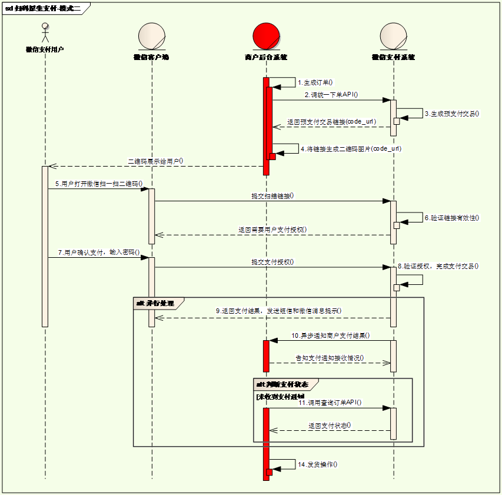
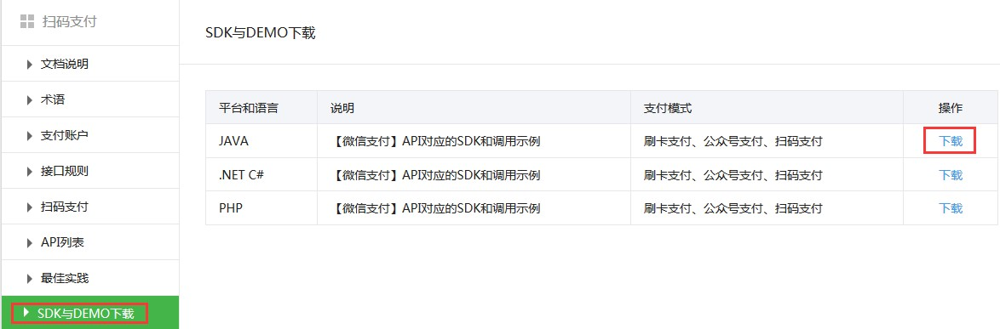

# Day19 生成二维码&微信扫码支付&支付日志

---

## 1. 二维码
### 1.1. 什么是二维码

二维码又称QR Code，QR全称Quick Response，是一个近几年来移动设备上超流行的一种编码方式，它比传统的Bar Code条形码能存更多的信息，也能表示更多的数据类型。

二维条码/二维码（2-dimensional bar code）是用某种特定的几何图形按一定规律在平面（二维方向上）分布的黑白相间的图形记录数据符号信息的；在代码编制上巧妙地利用构成计算机内部逻辑基础的“0”、“1”比特流的概念，使用若干个与二进制相对应的几何形体来表示文字数值信息，通过图象输入设备或光电扫描设备自动识读以实现信息自动处理：它具有条码技术的一些共性：每种码制有其特定的字符集；每个字符占有一定的宽度；具有一定的校验功能等。同时还具有对不同行的信息自动识别功能、及处理图形旋转变化点。

### 1.2. 二维码优势

- 信息容量大, 可以容纳多达1850个大写字母或2710个数字或500多个汉字
- 应用范围广, 支持文字,声音,图片,指纹等等...
- 容错能力强, 即使图片出现部分破损也能使用
- 成本低, 容易制作

### 1.3. 二维码容错级别

- L级（低） 7％的码字可以被恢复。
- M级（中） 的码字的15％可以被恢复。
- Q级（四分）的码字的25％可以被恢复。
- H级（高） 的码字的30％可以被恢复。

### 1.4. 二维码生成插件qrious

- qrious是一款基于HTML5 Canvas的纯JS二维码生成插件。通过qrious.js可以快速生成各种二维码，你可以控制二维码的尺寸颜色，还可以将生成的二维码进行Base64编码。
- <font color="red">**缺点：不支持IE9以下版本的浏览器**</font>
- qrious.js二维码插件的可用配置参数如下

|  **参数**  | **类型** | **默认值**  |             **描述**             |
| :--------: | :------: | :---------: | :------------------------------: |
| background |  String  |   "white"   |         二维码的背景颜色         |
| foreground |  String  |   "black"   |         二维码的前景颜色         |
|   level    |  String  |     "L"     | 二维码的误差校正级别(L, M, Q, H) |
|    mime    |  String  | "image/png" |   二维码输出为图片时的MIME类型   |
|    size    |  Number  |     100     |      二维码的尺寸，单位像素      |
|   value    |  String  |  "请求URL"  |       需要编码为二维码的值       |

在html页面引入js文件【资料\生成二维码\qrious框架\qrious.min.js】，下面的代码即可生成一张二维码

```html
<html>
 <head>
   <title> 二维码 </title>
   <meta http-equiv="Content-Type" content="text/html;charset=UTF-8"/>
   <script src="/js/qrious.min.js"></script>
 </head>
 <body>
   
   <script type="text/javascript">
      var qr = new QRious({
         element : document.getElementById("qrious"),
         size : 200,
         level : 'H',
         value : 'https://moonkira.github.io'
      });
   </script>
 </body>
</html>
```

*注：baidu.com无法跳转，只能使用baidu.cn才能跳转。应该是百度内部有做其他的跳转处理*

### 1.5. 二维码生成-Zxing框架

- 参考资料【\资料\生成二维码\zxing框架\】
- 如果使用的浏览器不支持qrious，可以使用此框架，此框架可以支持所有浏览器

#### 1.5.1. 生成效果

利用zxing框架生成特色的二维码（参考代码在pyg-test项目的qrcode-test工程中），效果如下：


#### 1.5.2. 开发步骤

- 配置依赖jar包

```xml
<!-- 配置二维码生成的框架 -->
<dependency>
    <groupId>com.google.zxing</groupId>
    <artifactId>javase</artifactId>
    <version>3.1.0</version>
</dependency>
```

- 开发BarCodeController控制器

```java
/**
 * 生成二维码控制器
 */
@Controller
public class BarCodeController {
    /**
     * 定义二维码图片的宽度
     */
    private static final int WIDTH = 200;
    /**
     * 定义二维码图片的高度
     */
    private static final int HEIGHT = 200;

    /**
     * 定义LOGO图片的宽度
     */
    private static final int LOGO_WIDTH = 50;
    /**
     * 定义LOGO图片的高度
     */
    private static final int LOGO_HEIGHT = 50;

    /**
     * 生成二维码的方法
     */
    @GetMapping("/barcode")
    public void execute(@RequestParam(value = "url", required = false) String url,
                        HttpServletResponse response) throws Exception {
        /* 判断二维码中URL */
        if (url == null || "".equals(url)) {
            url = "https://moonkira.github.io";
        }

        /* 定义Map集合封装二维码配置信息 */
        Map<EncodeHintType, Object> hints = new HashMap<>();
        /* 设置二维码图片的内容编码 */
        hints.put(EncodeHintType.CHARACTER_SET, "utf-8");
        /* 设置二维码图片的上、下、左、右间隙 */
        hints.put(EncodeHintType.MARGIN, 1);
        /* 设置二维码的纠错级别 */
        hints.put(EncodeHintType.ERROR_CORRECTION,
                ErrorCorrectionLevel.H);
        /*
         * 创建二维码字节转换对象
         * 第一个参数：二维码图片中的内容
         * 第二个参数：二维码格式器
         * 第三个参数：生成二维码图片的宽度
         * 第四个参数：生成二维码图片的高度
         * 第五个参数：生成二维码需要配置信息
         *  */
        BitMatrix matrix = new
                MultiFormatWriter().encode(url,
                BarcodeFormat.QR_CODE, WIDTH, HEIGHT, hints);

        /* 获取二维码图片真正的宽度  */
        int matrix_width = matrix.getWidth();
        /* 获取二维码图片真正的高度  */
        int matrix_height = matrix.getHeight();
        /* 定义一张空白的缓冲流图片 */
        BufferedImage image = new
                BufferedImage(matrix_width, matrix_height,
                BufferedImage.TYPE_INT_RGB);
        /* 把二维码字节转换对象 转化 到缓冲流图片上 */
        for (int x = 0; x < matrix_width; x++) {
            for (int y = 0; y < matrix_height; y++) {
                /* 通过x、y坐标获取一点的颜色 true: 黑色  false: 白色 */
                int rgb = matrix.get(x, y) ? 0xFF1493 : 0xFFFFFF;
                image.setRGB(x, y, rgb);
            }
        }

        /* 获取公司logo图片 */
        BufferedImage logo = ImageIO.read(new File(
                this.getClass().getResource("/FaceQ1427267545553.png").getPath()));
        /* 获取缓冲流图片的画笔 */
        Graphics2D g = (Graphics2D) image.getGraphics();
        /* 在二维码图片中间绘制公司logo */
        g.drawImage(logo, (matrix_width - LOGO_WIDTH) / 2,
                (matrix_height - LOGO_HEIGHT) / 2,
                LOGO_WIDTH, LOGO_HEIGHT, null);

        /* 设置画笔的颜色 */
        g.setColor(Color.WHITE);
        /* 设置画笔的粗细 */
        g.setStroke(new BasicStroke(5.0f));
        /* 设置消除锯齿 */
        g.setRenderingHint(RenderingHints
                .KEY_ANTIALIASING, RenderingHints.VALUE_ANTIALIAS_ON);
        /* 绘制圆角矩形 */
        g.drawRoundRect((matrix_width - LOGO_WIDTH) / 2,
                (matrix_height - LOGO_HEIGHT) / 2,
                LOGO_WIDTH, LOGO_HEIGHT, 10, 10);

        /* 向浏览器输出二维码 */
        ImageIO.write(image, "png",
                response.getOutputStream());
    }
}
```

- 提供html页面

```html
<!DOCTYPE html>
<html>
<head>
    <title>二维码</title>
    <meta charset="UTF-8"/>
    <meta http-equiv="pragma" content="no-cache"/>
    <style type="text/css">
        body {
            background-color: black;
        }
    </style>
</head>
<body>

</body>
</html>
```

---

## 2. 微信扫码支付简介
### 2.1. 微信扫码支付申请（了解）

- 微信扫码支付是商户系统按微信支付协议生成支付二维码，用户再用微信“扫一扫”完成支付的模式。该模式适用于PC网站支付、实体店单品或订单支付、媒体广告支付等场景。
- 申请步骤：（了解）
    - **第一步：注册公众号（类型须为：服务号）**
        - 请根据营业执照类型选择以下主体注册：个体工商户| 企业/公司| 政府| 媒体| 其他类型。
    - **第二步：认证公众号**
        - 公众号认证后才可申请微信支付，认证费：300元/次。
    - **第三步：提交资料申请微信支付**
        - 登录公众平台，点击左侧菜单【微信支付】，开始填写资料等待审核，审核时间为1-5个工作日内。
    - **第四步：开户成功，登录商户平台进行验证**
        - 资料审核通过后，请登录联系人邮箱查收商户号和密码，并登录商户平台填写财付通备付金打的小额资金数额，完成账户验证。
    - **第五步：在线签署协议**
        - 本协议为线上电子协议，签署后方可进行交易及资金结算，签署完立即生效。

### 2.2. 开发文档

微信支付接口调用的整体思路：

按API要求组装参数，以XML方式发送（POST）给微信支付接口（URL）,微信支付接口也是以XML方式给予响应。程序根据返回的结果（其中包括支付URL）生成二维码或判断订单状态。



- 在线微信支付开发文档：
    - `https://pay.weixin.qq.com/wiki/doc/api/index.html`
    - `https://pay.weixin.qq.com/wiki/doc/api/native_sl.php?chapter=6_5&index=4`
- 查阅讲义配套资源（资源\配套软件\微信扫码支付\开发文档）
- 本项目中会用到“统一下单”和“查询订单”两组API
    1.	appid：微信公众账号或开放平台APP的唯一标识
    2.	mch_id：商户号  (配置文件中的partner)
    3.	partnerkey：商户密钥
    4.	sign: 数字签名，根据微信官方提供的密钥和一套算法生成的一个加密信息，就是为了保证交易的安全性

### 2.3. 微信支付SDK

微信支付提供了SDK，下载后打开源码，install到本地仓库



【资料\微信扫码支付】WxPayAPI_JAVA_v3.zip压缩包，解压后进入资料\微信扫码支付\java-sdk-v3目录，在该目录进行cmd，输入出以下安装命令：`mvn install -Dmaven.test.skip=true`

说明：课程配套的本地仓库已经提供jar包，所以安装SDK步骤可跳过。

使用微信支付SDK，在maven工程中引入依赖

```xml
<dependency>
    <groupId>com.github.wxpay</groupId>
    <artifactId>wxpay-sdk</artifactId>
    <version>0.0.3</version>
</dependency>
```

- 用到微信支付SDK主要是以下工具类的方法：
    1. 获取随机字符串：`WXPayUtil.generateNonceStr()`
    2. MAP转换为XML字符串（自动添加签名）：`WXPayUtil.generateSignedXml(param, partnerkey)`
    3. XML字符串转换为MAP：`WXPayUtil.xmlToMap(result)`

### 2.4. HttpClientUtils工具类

- <font color="red">**HttpClient**</font>是Apache Jakarta Common下的子项目，用来提供高效的、最新的、功能丰富的<font color="red">**支持HTTP协议的客户端编程工具包**</font>，并且它支持HTTP协议最新的版本和建议。HttpClient已经应用在很多的项目中，比如Apache Jakarta上很著名的另外两个开源项目Cactus和HTMLUnit都使用了HttpClient。
- HttpClient通俗的讲就是模拟了浏览器的行为，如果需要在后端向某一地址提交数据获取结果，就可以使用HttpClient
- 关于HttpClient（原生）具体的使用暂时不了解，这里为了简化HttpClient的使用，提供了工具类HttpClient（对原生HttpClient进行了封装）

HttpClientUtils工具类使用的步骤:

```java
/* 创建HttpClientUtils工具对象，构造器中的参数：true: https协议   false: http协议 */
HttpClientUtils httpClientUtils = new HttpClientUtils(true);
/* 发送post请求，得到响应数据 */
String content = httpClientUtils.sendPost("请求URL", "xml格式参数");
```

### 2.5. 工程搭建与准备工作

- 创建pinyougou-pay支付服务聚合模块（pom类型），修改pom.xml文件配置tomcat插件，端口9008

```xml
<build>
    <plugins>
        <!-- 配置tomcat插件 -->
        <plugin>
            <groupId>org.apache.tomcat.maven</groupId>
            <artifactId>tomcat7-maven-plugin</artifactId>
            <configuration>
                <path>/</path>
                <port>9008</port>
            </configuration>
        </plugin>
    </plugins>
</build>
```

- 创建pinyougou-pay-interface支付服务接口模块（jar类型）
- 创建pinyougou-pay-service支付服务实现模块（war类型）。pom.xml文件中配置依赖pinyougou-pay-interface、pinyougou-common、spring、dubbo相关依赖、微信SDK (不需要连接数据库所以不用引用mapper工程)

```xml
<dependencies>
    <!-- 日志 -->
    <dependency>
        <groupId>org.slf4j</groupId>
        <artifactId>slf4j-log4j12</artifactId>
    </dependency>
    <!-- spring -->
    <dependency>
        <groupId>org.springframework</groupId>
        <artifactId>spring-web</artifactId>
    </dependency>
    <!-- dubbo相关 -->
    <dependency>
        <groupId>com.alibaba</groupId>
        <artifactId>dubbo</artifactId>
    </dependency>
    <dependency>
        <groupId>org.apache.zookeeper</groupId>
        <artifactId>zookeeper</artifactId>
    </dependency>
    <dependency>
        <groupId>com.github.sgroschupf</groupId>
        <artifactId>zkclient</artifactId>
    </dependency>
    <!-- pinyougou-pay-interface -->
    <dependency>
        <groupId>com.moon</groupId>
        <artifactId>pinyougou-pay-interface</artifactId>
        <version>${project.version}</version>
    </dependency>
    <!-- pinyougou-common -->
    <dependency>
        <groupId>com.moon</groupId>
        <artifactId>pinyougou-common</artifactId>
        <version>${project.version}</version>
    </dependency>
    <!-- wxpay-sdk -->
    <dependency>
        <groupId>com.github.wxpay</groupId>
        <artifactId>wxpay-sdk</artifactId>
        <version>0.0.3</version>
    </dependency>
</dependencies>
```

- web.xml，配置Spring核心监听器与加载spring配置文件

```xml
<?xml version="1.0" encoding="UTF-8"?>
<web-app xmlns:xsi="http://www.w3.org/2001/XMLSchema-instance"
         xmlns="http://java.sun.com/xml/ns/javaee"
         xsi:schemaLocation="http://java.sun.com/xml/ns/javaee
         http://java.sun.com/xml/ns/javaee/web-app_3_0.xsd" version="3.0">

    <!-- 配置Spring加载文件 -->
    <context-param>
        <param-name>contextConfigLocation</param-name>
        <param-value>classpath:applicationContext*.xml</param-value>
    </context-param>
    <!-- 配置Spring的核心监听器 -->
    <listener>
        <listener-class>org.springframework.web.context.ContextLoaderListener</listener-class>
    </listener>

</web-app>
```

- applicationContext-service.xml文件，配置dubbo暴露服务，端口号20886，加载properties与redis配置文件

```xml
<?xml version="1.0" encoding="utf-8"?>
<beans xmlns="http://www.springframework.org/schema/beans"
       xmlns:xsi="http://www.w3.org/2001/XMLSchema-instance"
       xmlns:dubbo="http://code.alibabatech.com/schema/dubbo"
       xmlns:content="http://www.springframework.org/schema/context"
       xsi:schemaLocation="http://www.springframework.org/schema/beans
                  http://www.springframework.org/schema/beans/spring-beans.xsd
                  http://www.springframework.org/schema/context
                  http://www.springframework.org/schema/context/spring-context.xsd
                  http://code.alibabatech.com/schema/dubbo
                  http://code.alibabatech.com/schema/dubbo/dubbo.xsd">

    <!-- 配置加载属性文件 -->
    <content:property-placeholder location="classpath*:props/*.properties"/>
    <!-- 配置导入common模块中的Redis配置文件 -->
    <import resource="classpath:applicationContext-redis.xml"/>

    <!--####### 配置dubbo服务提供者 #######-->
    <!-- 配置当前应用的名称 -->
    <dubbo:application name="pinyougou-pay-service"/>
    <!-- 配置zookeeper作为注册中心，注册服务地址 -->
    <dubbo:registry protocol="zookeeper" address="192.168.12.131:2181"/>
    <!-- 用dubbo协议在20886端口暴露服务  -->
    <dubbo:protocol name="dubbo" port="20886"/>
    <!-- 配置采用包扫描来暴露服务 -->
    <dubbo:annotation package="com.pinyougou.pay.service.impl"/>

</beans>
```

- 创建log4j.properties
- 拷贝【资料\微信扫码支付】下的HttpClientUtils.java工具类到pinyougou-common工程中com.pinyougou.common.util包下，并修改pom.xml文件添加依赖

```xml
<!-- httpclient -->
<dependency>
    <groupId>org.apache.httpcomponents</groupId>
    <artifactId>httpclient</artifactId>
</dependency>
```

- pinyougou-pay-service添加属性文件props/weixinpay.properties，配置微信相关参数

```properties
# 微信公众账号或开放平台APP的唯一标识
appid=wx8397f8696b538317
# 商户账号
partner=1473426802
# 商户密钥
partnerkey=8A627A4578ACE384017C997F12D68B23

# 统一下单请求地址
unifiedorder=https://api.mch.weixin.qq.com/pay/unifiedorder
# 订单查询请求地址
orderquery=https://api.mch.weixin.qq.com/pay/orderquery
```

> appid： 微信公众账号或开放平台APP的唯一标识  
> partner：商户账号  
> partnerkey：商户密钥  
> unifiedorder：统一下单请求地址  
> orderquery：订单查询请求地址

- pinyougou-cart-web工具配置pom.xml，依赖pinyougou-pay-interface

```xml
<!-- 配置依赖支付服务接口pinyougou-pay-interface -->
<dependency>
    <groupId>com.moon</groupId>
    <artifactId>pinyougou-pay-interface</artifactId>
    <version>${project.version}</version>
</dependency>
```

拷贝资料\生成二维码\qrious框架\qrious.min.js 到pinyougou-cart-web的src/main/webapp/js目录中

---

## 3. 微信支付二维码生成（商家的签名已过期，无法实现）
### 3.1. 需求分析与实现思路
#### 3.1.1. 需求分析

在支付页面上生成支付二维码，并显示订单号和金额。用户拿出手机，打开微信扫描页面上的二维码，然后在微信中完成支付

#### 3.1.2. 实现思路

- 通过HttpClientUtils工具类实现对远程支付接口的调用。
- 接口链接：https://api.mch.weixin.qq.com/pay/unifiedorder
- 具体参数参见“统一下单”API, 构建参数发送给统一下单的url，返回的信息中有支付url，根据url生成二维码，显示的订单号和金额也在返回的信息中。

### 3.2. 后端部分
#### 3.2.1. 订单服务-接口层与实现层

- pinyougou-pay-interface创建com.pinyougou.pay.service包，创建接口WeixinPayService
- pinyougou-pay-service创建com.pinyougou.pay.service.impl包，创建类WeixinPayServiceImpl，实现调用微信支付接口

```java
/**
 * 微信支付服务接口
 */
public interface WeixinPayService {
    /**
     * 生成微信支付二维码
     *
     * @param outTradeNo 订单交易号
     * @param totalFee   金额（单位：分）
     * @return 调用微信支付返回信息
     */
    Map<String, String> generatorNativePay(String outTradeNo, String totalFee);
}

/**
 * 微信支付服务实现类
 */
@Service
public class WeixinPayServiceImpl implements WeixinPayService {

    /* 微信公众账号或开放平台APP的唯一标识 */
    @Value("${appid}")
    private String appid;
    /* 商户账号 */
    @Value("${partner}")
    private String partner;
    /* 商户密钥 */
    @Value("${partnerkey}")
    private String partnerkey;

    /* 统一下单请求地址 */
    @Value("${unifiedorder}")
    private String unifiedorder;

    /**
     * 生成微信支付二维码(调用微信统一下单接口)
     *
     * @param outTradeNo 订单交易号
     * @param totalFee   金额（单位：分）
     * @return 调用微信支付返回信息
     */
    @Override
    public Map<String, String> generatorNativePay(String outTradeNo, String totalFee) {
        try {
            /* 创建Map集合封装请求参数 */
            Map<String, String> param = new HashMap<String, String>();

            // 公众账号ID
            param.put("appid", appid);
            // 商户号 mch_id
            param.put("mch_id", partner);
            // 随机字符串 nonce_str
            param.put("nonce_str", WXPayUtil.generateNonceStr());
            // 商品描述 body
            param.put("body", "品优购");
            // 商户订单号 out_trade_no
            param.put("out_trade_no", outTradeNo);
            // 标价金额 total_fee
            param.put("total_fee", totalFee);
            // 终端IP spbill_create_ip
            param.put("spbill_create_ip", "127.0.0.1");
            // 通知地址 notify_url
            param.put("notify_url", "http://cart.moon.com");
            // 交易类型 	trade_type
            param.put("trade_type", "NATIVE");

            /* 根据商户密钥签名生成XML格式请求参数 */
            String xmlParam = WXPayUtil.generateSignedXml(param, partnerkey);
            System.out.println("请求参数：" + xmlParam);
            /* 创建HttpClientUtils对象发送请求 */
            HttpClientUtils client = new HttpClientUtils(true);
            /* 发送请求，得到响应数据 */
            String result = client.sendPost(unifiedorder, xmlParam);
            System.out.println("响应数据：" + result);

            /* 将响应数据XML格式转化成Map集合 */
            Map<String, String> resultMap = WXPayUtil.xmlToMap(result);
            /* 创建Map集合封装返回数据 */
            Map<String, String> data = new HashMap<>();
            /* 支付地址(二维码中的URL) */
            data.put("codeUrl", resultMap.get("code_url"));
            /* 总金额 */
            data.put("totalFee", totalFee);
            /* 支付交易号 */
            data.put("outTradeNo", outTradeNo);
            return data;

        } catch (Exception e) {
            e.printStackTrace();
            throw new RuntimeException(e);
        }
    }
}
```

#### 3.2.2. 购物车系统-控制层

修改pinyougou-cart-web的OrderController.java，增加生成微信支付二维码的方法

```java
/* 注入微信支付服务接口 */
@Reference(timeout = 30000)
private WeixinPayService weixinPayService;

/**
 * 生成微信支付二维码
 *
 * @return 支付信息
 */
@GetMapping("/genPayCode")
public Map<String, String> genPayCode() {
    // 创建分布式id生成器
    IdWorker idWorker = new IdWorker();
    return weixinPayService.generatorNativePay(
            String.valueOf(idWorker.nextId()), "1");
}
```

订单号通过分布式ID生成器生成，金额暂时写死，后续开发再对接业务系统得到订单号和金额。

浏览器测试：http://127.0.0.1:9108/order/genPayCode

### 3.3. 前端部分
#### 3.3.1. 购物车系统-前端控制层

修改pinyougou-cart-web的orderController.js，定义获取微信支付二维码的方法

```js
/* 生成微信支付二维码 */
$scope.genPayCode = () => {
    // 发送get请求获取二维码信息
    baseService.sendGet('/order/genPayCode').then(response => {
        // 获取支付金额
        $scope.money = (response.data.totalFee / 100).toFixed(2);
        // 获取订单交易号
        $scope.outTradeNo = response.data.outTradeNo;

        // 生成微信支付二维码
        var qr = new QRious({
            element: document.getElementById("qrious"),
            size: 250,
            level: 'H',
            value: response.data.codeUrl
        });
    });
};
```

#### 3.3.2. 购物车系统-前端页面

- 修改pay.html，引入js

```html
<script src="/plugins/angularjs/angular.min.js"></script>
<script src="/js/base.js"></script>
<script src="/js/service/baseService.js"></script>
<script src="/js/controller/baseController.js"></script>
<script src="/js/controller/cartController.js"></script>
<script src="/js/controller/orderController.js"></script>
<script src="/js/qrious.min.js"></script>
```

- 初始化指令

```html
<body ng-app="pinyougou" ng-controller="orderController"
      ng-init="genPayCode();">
```

- 设置二维码图片的ID(64行)

```html
<div class="fl code">
    
    <div class="saosao">
        <p>请使用微信扫一扫</p>
        <p>扫描二维码支付</p>
    </div>
</div>
```

- 显示支付交易号与金额(55行)

```html
<div class="checkout-tit">
	<h4 class="fl tit-txt"><span class="success-icon"></span>
        <span  class="success-info">订单提交成功，请您及时付款！订单号：{{ outTradeNo }}</span>
    </h4>
    <span class="fr"><em class="sui-lead">
        应付金额：</em><em  class="orange money">￥{{ money }}</em>元
    </span>
	<div class="clearfix"></div>
</div>
```

---

## 4. 检测支付状态
### 4.1. 需求分析及实现思路
#### 4.1.1. 需求分析

当用户支付成功后跳转到成功页面(paysuccess.html)，当返回异常时跳转到错误页面(payfail.html)。

#### 4.1.2. 实现思路

- 通过HttpClientUtils工具类实现对远程支付接口的调用。
- 接口链接：https://api.mch.weixin.qq.com/pay/orderquery
- 具体参数参见“查询订单”API, 我们在前端页面采用js定时器间隔3秒发送请求查询订单，当后台返回状态为success时，前端自动跳转到支付成功页面。

### 4.2. 检测支付状态-后端代码
#### 4.2.1. 支付服务-接口层与实现层

- pinyougou-pay-interface的WeixinPayService.java中新增queryPayStatus查询订单状态方法
- pinyougou-pay-service的WeixinPayServiceImpl.java中实现方法

```java
/**
 * 查询支付状态
 *
 * @param outTradeNo 订单交易号
 * @return 支付状态返回信息
 */
Map<String, String> queryPayStatus(String outTradeNo);

---实现类---

/* 订单查询请求地址 */
@Value("${orderquery}")
private String orderquery;

@Override
public Map<String, String> queryPayStatus(String outTradeNo) {
    try {
        // 封装请求参数
        Map<String, String> param = new HashMap<>();
        // 公众账号ID
        param.put("appid", appid);
        // 商户号 mch_id
        param.put("mch_id", partner);
        // 商户订单号 out_trade_no
        param.put("out_trade_no", outTradeNo);
        // 随机字符串 nonce_str
        param.put("nonce_str", WXPayUtil.generateNonceStr());

        // 根据商户密钥签名生成XML格式请求参数，并把map集合转化成XML格式
        String xmlParam = WXPayUtil.generateSignedXml(param, partnerkey);
        System.out.println("请求参数：" + xmlParam);

        // 创建HttpClientUtils对象，发送post请求
        HttpClientUtils httpClientUtils = new HttpClientUtils(true);
        // 发送请求，得到响应数据
        String content = httpClientUtils.sendPost(orderquery, xmlParam);
        System.out.println("响应数据：" + content);

        // 把XML格式的响应数据转化成Map集合
        return WXPayUtil.xmlToMap(content);
    } catch (Exception e) {
        e.printStackTrace();
        throw new RuntimeException(e);
    }
}
```

#### 4.2.2. 购物车系统-控制层

pinyougou-cart-web的OrderController.java新增查询支付状态方法

```java
/**
 * 查询支付状态
 *
 * @param outTradeNo 支付订单号
 * @return 返回支付信息
 */
@GetMapping("/queryPayStatus")
public Map<String, Integer> queryPayStatus(String outTradeNo) {
    // 定义Map集合封装返回数据
    Map<String, Integer> data = new HashMap<>(1);
    data.put("status", 3);
    try {
        // 调用微信支服务接口查询支付状态
        Map<String, String> map = weixinPayService.queryPayStatus(outTradeNo);
        // 判断是否支付状态
        if (map != null && map.size() > 0) {
            if ("SUCCESS".equals(map.get("trade_state"))) {
                // 支付成功
                data.put("status", 1);
            } else {
                // 未支付
                data.put("status", 2);
            }
        }
    } catch (Exception e) {
        e.printStackTrace();
    }
    return data;
}
```

### 4.3. 检测支付状态-前端代码
#### 4.3.1. 购物车系统-前端控制层

修改orderController.js的genPayCode方法，引入$interval服务，定时发送查询支付状态请求

```js
$scope.genPayCode = () => {
    // 发送get请求获取二维码信息
    baseService.sendGet('/order/genPayCode').then(response => {
        ......
        /*
         * 开启定时器(间隔3秒发送一次请求，用来检查用户是否支付成功)
         * 第一个参数：调用的函数
         * 第二个参数：间隔3秒--因为后端没有做真正的支付，将验证间隔时间延长
         * 第三个参数：调用的总次数60次(3分钟)
         */
        var timer = $interval(() => {
            // 发送get请求，查询支付状态
            baseService.sendGet('/order/queryPayStatus',
                'outTradeNo=' + $scope.outTradeNo).then(response => {
                    // 校验支付状态
                    if (response.data.status === 1) {
                        // 支付成功，取消定时器
                        $interval.cancel(timer);
                        // 跳转到支付成功的页面
                        location.href = '/order/paysuccess.html';
                    } else if (response.data.status === 3) {
                        // 支付失败，取消定时器
                        $interval.cancel(timer);
                        // 跳转到支付失败的页面
                        location.href = '/order/payfail.html';
                    }
            });
        }, 10000, 6);

        /* 执行60次(3分钟)之后需要回调的函数，重置二维码 */
        timer.then(() => {
            alert("二维码已失效！");
            // 重新生成支付二维码
            $scope.genPayCode();
        });

    });
};
```

### 4.4. 支付成功页面显示金额
#### 4.4.1. 问题分析

现在支付成功页面显示的是固定的值，怎么显示真正的支付金额呢？这里可以使用angularJS的页面传参来解决。

#### 4.4.2. 购物车系统-前端部分

- 修改orderController.js的genPayCode方法，定时器查询支付状态成功跳转页面传递金额参数

```js
$scope.genPayCode = () => {
    // 发送get请求获取二维码信息
    baseService.sendGet('/order/genPayCode').then(response => {
        ......
        var timer = $interval(() => {
            // 发送get请求，查询支付状态
            baseService.sendGet('/order/queryPayStatus',
                'outTradeNo=' + $scope.outTradeNo).then(response => {
                    // 校验支付状态
                    if (response.data.status === 1) {
                        // 支付成功，取消定时器
                        $interval.cancel(timer);
                        // 跳转到支付成功的页面
                        location.href = '/order/paysuccess.html?money=' + $scope.money;
                    } else if (response.data.status === 3) {
                        // 支付失败，取消定时器
                        $interval.cancel(timer);
                        // 跳转到支付失败的页面
                        location.href = '/order/payfail.html';
                    }
            });
        }, 10000, 6);
        ......
    });
};
```

- orderController.js中引入$location服务，新增跳转后获取金额的方法

```js
app.controller('orderController', function ($scope, $controller,
                                            $interval, $location, baseService) {
    ......
    /* 跳转页面获取金额的方法 */
    $scope.getMoney = () => {
        return $location.search().money;
    };
});
```

- 修改paysuccess.html页面，引入JS (与pay.html相同)，body添加指令，用表达式显示金额(64行)

```html
<script src="/plugins/angularjs/angular.min.js"></script>
<script src="/js/base.js"></script>
<script src="/js/service/baseService.js"></script>
<script src="/js/controller/baseController.js"></script>
<script src="/js/controller/cartController.js"></script>
<script src="/js/controller/orderController.js"></script>
<!-- 加入base标签  -->
<base href="/"/>
<script type="text/javascript">
    /* 配置位置提供者 */
    app.config(function ($locationProvider) {
        $locationProvider.html5Mode(true);
    });
</script>

......

<body ng-app="pinyougou" ng-controller="orderController">

......

<p>支付金额：￥{{ getMoney() }}元</p>
```

---

## 5. 支付日志
### 5.1. 需求分析

- 现在系统还有两个问题需要解决：
    1. 系统中无法查询到支付记录
    2. 支付后订单状态没有改变
- 实现思路：
    1. 在用户下订单时，判断如果为微信支付，就往支付日志表添加一条记录，信息包括支付总金额、订单ID（多个）、用户ID 、下单时间等信息，支付状态为0（未支付）
    2. 生成的支付日志对象放入redis中，以用户ID作为key，这样在生成支付二维码时就可以从redis中提取支付日志对象中的金额和订单号。
    3. 当用户支付成功后，修改支付日志的支付状态为1（已支付），并记录微信支付传递给我们的交易流水号。根据订单ID（多个）修改订单的状态为2（已付款）。

### 5.2. 表结构分析

tb_paylog 支付日志表

|      字段      |   类型   | 长度 | 含义                             |
| :------------: | :------: | :--: | -------------------------------- |
|  out_trade_no  | varchar  |  30  | 支付订单号                       |
|  create_time   | datatime |      | 创建时间                         |
|    pay_time    | datatime |      | 支付完成时间                     |
|   total_fee    |  bigint  |      | 支付金额（分）                   |
| transaction_id | varchar  |  30  | 交易流水号                       |
|  trade_state   | varchar  |  1   | 交易状态                         |
|    pay_type    | varchar  |  1   | 支付类型：1:微信 2:支付宝 3:网银 |
|   order_list   | varchar  | 200  | 订单表ID串，用逗号分隔           |

### 5.3. 插入日志记录（新增订单记录时）

修改pinyougou-order-service工程OrderServiceImpl.java的saveOrder方法。<font color="red">**判断如果支付方式为微信支付，向数据库插入支付日志记录，并放入redis存储**</font>

```java
@Autowired
private PayLogMapper payLogMapper;

@Override
public void saveOrder(Order order) {
    try {
        ......
        if (cartList != null && cartList.size() > 0) {
            // 定义List集合封装多个订单id（用于记录支付日志）
            List<Long> orderIds = new ArrayList<>();
            // 定义总金额（用于记录支付日志）
            double totalMoney = 0;

            for (Cart cart : cartList) {
                ......
                // 保存订单数据到订单表
                orderMapper.insertSelective(orderInsert);

                // 添加订单id，一个商家一个订单（用于记录支付日志）
                orderIds.add(orderId);
                // 累计多个订单的金额（用于记录支付日志）
                totalMoney += money;
            }

            // 如果是微信扫码支付(往支付日志表中插入数据)
            if ("1".equals(order.getPaymentType())) {
                // 创建支付日志对象
                PayLog payLog = new PayLog();
                // 订单交易号
                payLog.setOutTradeNo(String.valueOf(idWorker.nextId()));
                // 创建时间
                payLog.setCreateTime(new Date());
                // 支付的总金额(多个商家的订单总计，单位：分)
                payLog.setTotalFee((long)(totalMoney * 100));
                // 设置用户编号
                payLog.setUserId(order.getUserId());
                // 交易状态(未支付)
                payLog.setTradeState("0");
                // 设置订单id(多个订单id，使用逗号分隔)
                payLog.setOrderList(orderIds.toString().replace("[","")
                        .replace("]","").replace(" ", ""));

                // 设置支付类型
                payLog.setPayType("1");
                payLogMapper.insertSelective(payLog);
                // 把支付日志对象存入Redis
                redisTemplate.boundValueOps("payLog_" + order.getUserId()).set(payLog);
            }

            // 删除该用户购物车数据
            redisTemplate.delete(userCartName);
        }
    } catch (Exception e) {
        e.printStackTrace();
        throw new RuntimeException(e);
    }
}
```

### 5.4. 读取支付日志
#### 5.4.1. 订单服务接口与实现层

- pinyougou-order-interface工程的OrderService.java新增查询支付日志的方法
- pinyougou-order-service工程的OrderServiceImpl.java实现方法

```java
/**
 * 从Redis查询支付日志
 *
 * @param userId 用户id
 * @return 日志实体类对象
 */
PayLog findPayLogFromRedis(String userId);

/* 实现类 */
@Override
public PayLog findPayLogFromRedis(String userId) {
    try {
        return (PayLog) redisTemplate.boundValueOps("payLog_" + userId).get();
    } catch (Exception e) {
        e.printStackTrace();
        throw new RuntimeException(e);
    }
}
```

#### 5.4.2. 购物车系统-控制层

修改pinyougou-cart-web工程OrderController.java的genPayCode方法。实现思路：调用获取支付日志对象的方法，得到订单号和金额

```java
@GetMapping("/genPayCode")
public Map<String, String> genPayCode(HttpServletRequest request) {
    try {
        // 获取登录用户名
        String userId = request.getRemoteUser();

        // 调用订单服务，从Redis查询支付日志
        PayLog payLog = orderService.findPayLogFromRedis(userId);

        // 判断查询的支付日志是否为空
        if (payLog != null) {
            return weixinPayService.generatorNativePay(
                    payLog.getOutTradeNo(), payLog.getTotalFee().toString());
        }
    } catch (Exception e) {
        e.printStackTrace();
    }
    return null;
}
```

### 5.5. 修改订单状态
#### 5.5.1. 订单服务接口与实现层

- pinyougou-order-interface的OrderService.java新增修改订单状态的方法
- 在pinyougou-order-service工程OrderServiceImpl.java实现该方法，此方法需要完成三件事
    1. 修改支付日志状态
    2. 修改关联的订单的状态
    3. 清除缓存中的支付日志对象

```java
/**
 * 修改订单状态
 *
 * @param outTradeNo    订单交易号
 * @param transactionId 微信交易流水号
 */
void updateOrderStatus(String outTradeNo, String transactionId);

/* 实现类 */
@Override
public void updateOrderStatus(String outTradeNo, String transactionId) {
    try {
        // 根据订单交易号查询支付日志
        PayLog payLog = payLogMapper.selectByPrimaryKey(outTradeNo);
        // 设置支付状态(0为未支付，1为已支付)
        payLog.setTradeState("1");
        // 设置微信交易流水号
        payLog.setTransactionId(transactionId);
        // 设置交易时间
        payLog.setPayTime(new Date());
        // 更新支付日志状态
        payLogMapper.updateByPrimaryKeySelective(payLog);

        // 获取订单号列表
        String[] orderIds = payLog.getOrderList().split(",");
        // 循环订单号数组，修改相应的订单状态
        for (String orderId : orderIds) {
            // 创建订单对象
            Order order = new Order();
            order.setOrderId(Long.valueOf(orderId));
            // 设置支付时间
            order.setPaymentTime(new Date());
            // 修改支付状态
            order.setStatus("2");
            // 更新订单数据
            orderMapper.updateByPrimaryKeySelective(order);
        }

        // 清空当前用户支付日志缓存数据
        redisTemplate.delete("payLog_" + payLog.getUserId());
    } catch (Exception e) {
        e.printStackTrace();
        throw new RuntimeException(e);
    }
}
```

#### 5.5.2. 购物车系统-控制层

修改pinyougou-cart-web的OrderController.java的queryPayStatus查询支付状态方法。在微信支付接口成功返回状态时，调用修改订单状态的方法

```java
@GetMapping("/queryPayStatus")
public Map<String, Integer> queryPayStatus(String outTradeNo) {
    ......
    try {
        ......
        // 判断是否支付状态
        if (map != null && map.size() > 0) {
            if ("SUCCESS".equals(map.get("trade_state"))) {
                // 支付成功
                data.put("status", 1);
                // 调用订单服务接口，更新订单与支付日志状态
                orderService.updateOrderStatus(outTradeNo, map.get("transaction_id"));
            } else {
                // 未支付
                data.put("status", 2);
            }
        }
    } catch (Exception e) {
        e.printStackTrace();
    }
    return data;
}
```

### 5.6. 登录用户信息

- 修改购物车系统前端页面pay.html

```html
<body ng-app="pinyougou" ng-controller="orderController"
      ng-init="genPayCode();loadUsername();">
......

<ul class="fl">
    <li class="f-item">{{ loginName }}, 品优购欢迎您！</li>
    <li class="f-item">
        <a href="http://sso.moon.com/logout?service={{redirectUrl}}">退出</a>
    </li>
</ul>
```

- 修改paysuccess.html

```html
<body ng-app="pinyougou" ng-controller="orderController"
      ng-init="loadUsername();">
......

<ul class="fl">
    <li class="f-item">{{ loginName }}, 品优购欢迎您！</li>
    <li class="f-item">
        <a href="http://sso.moon.com/logout?service={{redirectUrl}}">退出</a>
    </li>
</ul>
```

- 修改payfail.html

```html
<script src="/plugins/angularjs/angular.min.js"></script>
<script src="/js/base.js"></script>
<script src="/js/service/baseService.js"></script>
<script src="/js/controller/baseController.js"></script>

......
<body ng-app="pinyougou" ng-controller="baseController"
      ng-init="loadUsername();">

......

<ul class="fl">
    <li class="f-item">{{ loginName }}, 品优购欢迎您！</li>
    <li class="f-item">
        <a href="http://sso.moon.com/logout?service={{redirectUrl}}">退出</a>
    </li>
</ul>
```

### 5.7. 支付日志显示（待实现！）

需求：在运营商后台中，显示支付日志列表，实现按日期、状态、用户进行查询。
