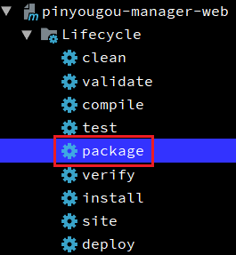
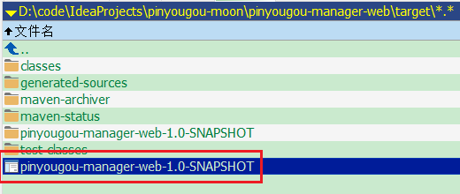
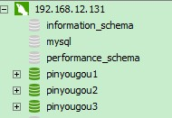
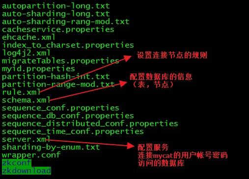
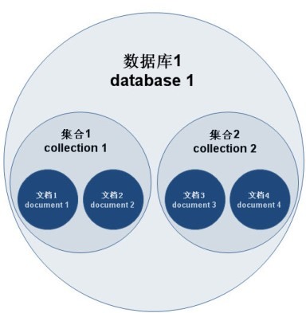

# Day21 SpringTask任务调度 & Nginx负载均衡 & MyCat分库分表

## 1. 任务调度SpringTask
### 1.1. 什么是任务调度

在企业级应用中，经常会制定一些“计划任务”，即在某个时间点做某件事情，核心是以时间为关注点，即在一个特定的时间点，系统执行指定的一个操作。常见的任务调度框架有**Quartz**和**SpringTask**等

### 1.2. SpringTask整合配置

1. 在spring的配置文件中，开启任务注解驱动`<task:annotation-driven/>`、配置任务调度方式`<task:scheduler id="scheduler"/>`
2. 创建任务调度类，使用注解`@Component`让spring管理，在调度的方法上配置注解`@Scheduled(cron = "* * * * * ?")`，cron配置时间表达式。

### 1.3. 搭建任务服务模块

- 创建pinyougou-task-service模块(war类型)，修改pom.xml文件，配置相关的依赖，端口9010

```xml
<dependencies>
    <!-- 日志 -->
    <dependency>
        <groupId>org.slf4j</groupId>
        <artifactId>slf4j-log4j12</artifactId>
    </dependency>
    <!-- spring -->
    <dependency>
        <groupId>org.springframework</groupId>
        <artifactId>spring-web</artifactId>
    </dependency>
    <dependency>
        <groupId>org.springframework</groupId>
        <artifactId>spring-jdbc</artifactId>
    </dependency>
    <!-- pinyougou-mapper -->
    <dependency>
        <groupId>com.moon</groupId>
        <artifactId>pinyougou-mapper</artifactId>
        <version>${project.version}</version>
    </dependency>
    <!-- pinyougou-common -->
    <dependency>
        <groupId>com.moon</groupId>
        <artifactId>pinyougou-common</artifactId>
        <version>${project.version}</version>
    </dependency>
</dependencies>
<build>
    <plugins>
        <!-- 配置tomcat插件 -->
        <plugin>
            <groupId>org.apache.tomcat.maven</groupId>
            <artifactId>tomcat7-maven-plugin</artifactId>
            <configuration>
                <path>/</path>
                <port>9010</port>
            </configuration>
        </plugin>
    </plugins>
</build>
```

- 修改web.xml文件，配置spring核心监听器

```xml
<?xml version="1.0" encoding="UTF-8"?>
<web-app xmlns:xsi="http://www.w3.org/2001/XMLSchema-instance"
         xmlns="http://java.sun.com/xml/ns/javaee"
         xsi:schemaLocation="http://java.sun.com/xml/ns/javaee
         http://java.sun.com/xml/ns/javaee/web-app_3_0.xsd" version="3.0">

    <!-- 配置Spring加载文件 -->
    <context-param>
        <param-name>contextConfigLocation</param-name>
        <param-value>classpath:applicationContext*.xml</param-value>
    </context-param>
    <!-- 配置Spring的核心监听器 -->
    <listener>
        <listener-class>org.springframework.web.context.ContextLoaderListener</listener-class>
    </listener>

</web-app>
```

- 在resources目录下创建applicationContext-task.xml文件，开启任务注解驱动与配置任务调度

```xml
<?xml version="1.0" encoding="utf-8"?>
<beans xmlns="http://www.springframework.org/schema/beans"
       xmlns:xsi="http://www.w3.org/2001/XMLSchema-instance"
       xmlns:task="http://www.springframework.org/schema/task"
       xmlns:context="http://www.springframework.org/schema/context"
       xsi:schemaLocation="http://www.springframework.org/schema/beans
                  http://www.springframework.org/schema/beans/spring-beans.xsd
                  http://www.springframework.org/schema/task
                  http://www.springframework.org/schema/task/spring-task.xsd
                  http://www.springframework.org/schema/context
                  http://www.springframework.org/schema/context/spring-context.xsd">

    <!-- 导入数据访问的Spring配置文件 -->
    <import resource="classpath:applicationContext-mapper.xml"/>
    <!-- 配置导入common模块中的Redis配置文件 -->
    <import resource="classpath:applicationContext-redis.xml"/>

    <!-- 开启组件扫描 -->
    <context:component-scan base-package="com.pinyougou.task"/>

    <!-- 为了不一直在后台调用，所以在需要使用时放开以下配置  -->
    <!-- 开启任务注解驱动 -->
    <task:annotation-driven/>
    <!-- 配置任务调度 -->
    <task:scheduler id="scheduler"/>

</beans>
```

- 创建log4j.properties文件
- 创建com.pinyougou.task包，编写SeckillTaskService类

```java
/**
 * 秒杀任务调度服务类
 */
@Component
public class SeckillTaskService {
    /*
     * 定时关闭订单任务 (每隔2秒调用一次)
     *      使用spring框架的任务调度注解@Scheduled
     *      cron属性：任务执行表达式
     */
    @Scheduled(cron = "0/2 * * * * ?")
    public void closeOrderTask() {
        System.out.println("执行了任务调度: " + new Date());
    }
}
```

*注：执行后会看到控制台每两秒都输出了当前时间，其中cron设置的为表达式，是执行的时间规则*

### 1.4. Cron表达式
#### 1.4.1. Cron表达式格式

Cron表达式是一个字符串，字符串分7个域，每一个域代表一个含义，Cron有如下两种语法格式：

```
Seconds Minutes Hours DayofMonth Month DayofWeek Year
Seconds Minutes Hours DayofMonth Month DayofWeek
【秒】   【分】   【小时】  【日】   【月】  【周】    【年】
```

每一个域可出现的字符如下：

- `Seconds`：可出现`", - * /"`四个字符，有效范围为0-59的整数
- `Minutes`：可出现`", - * /"`四个字符，有效范围为0-59的整数
- `Hours`：可出现`", - * /"`四个字符，有效范围为0-23的整数
- `DayofMonth`：可出现`", - * / ? L W C"`八个字符，有效范围为1-31的整数
- `Month`：可出现`", - * /"`四个字符，有效范围为1-12的整数或JAN-DEc
- `DayofWeek`：可出现`", - * / ? L C #"`八个字符，有效范围为1-7的整数或SUN-SAT两个范围。1表示星期天，2表示星期一， 依次类推
- `Year`：可出现`", - * /"`四个字符，有效范围为1970-2099年

每一个域都使用数字，但还可以出现如下特殊字符，它们的含义是：

- `*`：表示匹配该域的任意值，假如在Minutes域使用`*`, 即表示每分钟都会触发事件。
- `?`：只能用在DayofMonth(日)和DayofWeek(周)两个域。它也匹配域的任意值
- `-`：表示范围，例如在Minutes域使用5-20，表示从5分到20分钟每分钟触发一次
- `/`： 表示起始时间开始触发，然后每隔固定时间触发一次，例如在Minutes域使用5/20,则意味着5分钟触发一次，而25，45等分别触发一次。
- `,`：表示列出枚举值。例如：在Minutes域使用5,20，则意味着在5和20分每分钟触发一次。
- `L`: 表示最后，只能出现在DayofWeek(周)和DayofMonth(日)，如果在DayofWeek域使用5L,意味着在最后的一个星期四触发。
- `W`: 表示有效工作日(周一到周五),只能出现在DayofMonth(日)，系统将在离指定日期的最近的有效工作日触发事件。例如：在 DayofMonth使用5W，如果5日是星期六，则将在最近的工作日：星期五，即4日触发。如果5日是星期天，则在6日(周一)触发；如果5日在星期一 到星期五中的一天，则就在5日触发。另外一点，W的最近寻找不会跨过月份
- `LW`: 这两个字符可以连用，表示在某个月最后一个工作日，即最后一个星期五。
- `#`: 用于确定每个月第几个星期几，只能出现在DayofMonth域。例如在4#2，表示某月的第二个星期三。

#### 1.4.2. Cron表达式例子

- `"0 0 10,14,16 * * ?"`： 每天上午10点，下午2点，4点
- `"0 0/30 9-17 * * ?"`： 朝九晚五工作时间内每半小时
- `"0 0 12 ? * WED"`：表示每个星期三中午12点
- `"0 0 12 * * ?"`：每天中午12点触发
- `"0 15 10 ? * *"`：每天上午10:15触发
- `"0 15 10 * * ?"`：每天上午10:15触发
- `"0 15 10 * * ? *"`：每天上午10:15触发
- `"0 15 10 * * ? 2005"`：2005年的每天上午10:15触发
- `"0 * 14 * * ?"`：在每天下午2点到下午2:59期间的每1分钟触发
- `"0 0/5 14 * * ?"`： 在每天下午2点到下午2:55期间的每5分钟触发
- `"0 0/5 14,18 * * ?"`： 在每天下午2点到2:55期间和下午6点到6:55期间的每5分钟触发
- `"0 0-5 14 * * ?"`： 在每天下午2点到下午2:05期间的每1分钟触发
- `"0 10,44 14 ? 3 WED"`： 每年三月的星期三的下午2:10和2:44触发
- `"0 15 10 ? * MON-FRI"`： 周一至周五的上午10:15触发
- `"0 15 10 15 * ?"`： 每月15日上午10:15触发
- `"0 15 10 L * ?"`： 每月最后一日的上午10:15触发
- `"0 15 10 ? * 6L"`： 每月的最后一个星期五上午10:15触发
- `"0 15 10 ? * 6L 2002-2005"`：2002年至2005年的每月的最后一个星期五上午10:15触发
- `"0 15 10 ? * 6#3"`： 每月的第三个星期五上午10:15触发

### 1.5. 秒杀商品列表的增量更新

每分钟执行查询秒杀商品表，将符合条件的记录并且缓存中不存在的秒杀商品存入缓存

```java
/* 注入缓存操作对象 */
@Autowired
private RedisTemplate<String, Object> redisTemplate;
/* 注入秒杀商品数据访问层接口 */
@Autowired
private SeckillGoodsMapper seckillGoodsMapper;

/*
 * 定时任务-查询新增的秒杀商品 (每隔1分钟调用一次)
 *      使用spring框架的任务调度注解@Scheduled
 *      cron属性：任务执行表达式
 */
@Scheduled(cron = "0 0/1 * * * ?")
public void refreshSeckillGoods() {

    System.err.println("执行了查询新增的秒杀商品任务调度: " + new Date());
    // 查询Redis中所有秒杀的商品，得到秒杀商品id集合
    Set seckillIds = redisTemplate.boundHashOps("seckillGoodsList").keys();

    // 创建示范对象
    Example example = new Example(SeckillGoods.class);
    // 查询条件对象
    Example.Criteria criteria = example.createCriteria();
    // 通过查询条件对象，添加查询条件。审核通过的秒杀商品
    criteria.andEqualTo("status", "1");
    // 剩余库存数据大于零
    criteria.andGreaterThan("stockCount", 0);
    // 秒杀开始时间小于等于当前时间
    criteria.andLessThanOrEqualTo("startTime", new Date());
    // 秒杀结束时间大于等于当前时间
    criteria.andGreaterThanOrEqualTo("endTime", new Date());
    // 排除Redis中已存储的秒杀商品
    criteria.andNotIn("id", seckillIds);

    // 查询新增秒杀商品集合
    List<SeckillGoods> seckillGoodsList = seckillGoodsMapper.selectByExample(example);

    // 循环新增的秒杀商品集合
    for (SeckillGoods seckillGoods : seckillGoodsList) {
        // 存入Redis缓存中
        redisTemplate.boundHashOps("seckillGoodsList")
                .put(seckillGoods.getId(), seckillGoods);
    }
    System.err.println("将" + seckillGoodsList.size() + "条商品存入缓存！");
}
```


### 1.6. 过期秒杀商品的移除

每秒中从Redis中查询过期的秒杀商品，发现过期同步到数据库，并在缓存中移除该秒杀商品

```java
/**
 * 从Redis中移除过期的秒杀商品（每20秒执行一次）
 */
@Scheduled(cron = "0/20 * * * * ?")
public void removeSeckillGoods() {

    System.err.println("移除秒杀商品任务正在执行...");
    // 查询Redis中所有秒杀的商品对象集合
    List<Object> seckillGoodsList = redisTemplate
            .boundHashOps("seckillGoodsList").values();

    // 迭代秒杀商品集合，判断是否已经过期
    for (Object obj : seckillGoodsList) {
        // 强转类型
        SeckillGoods seckillGoods = (SeckillGoods) obj;

        // 如果秒杀商品的结束时间小于当前时间，代表过期
        if (seckillGoods.getEndTime().getTime() < new Date().getTime()) {
            // 把秒杀商品同步到数据库(可能有被抢购，更新库存)
            seckillGoodsMapper.updateByPrimaryKeySelective(seckillGoods);

            // 将Redis中删除过期的秒杀商品
            redisTemplate.boundHashOps("seckillGoodsList")
                    .delete(seckillGoods.getId());
            System.err.println("移除的秒杀商品：" + seckillGoods.getId());
        }
    }
    System.err.println("移除秒杀商品任务结束...");
}
```

## 2. Maven Profile
### 2.1. 什么是MavenProfile

在平常的java开发中，会经常使用到很多配置文件（xxx.properties，xxx.xml），而当在本地开发（dev），测试环境测试（test），线上生产使用（product）时，需要不停的去修改这些配制文件，次数一多，相当麻烦。现在，利用maven的filter和profile功能，可实现在编译阶段简单的指定一个参数就能切换配制，提高效率，还不容易出错.

profile可以定义一系列的配置信息，然后指定其激活条件。这样就可以定义多个profile，然后每个profile对应不同的激活条件和配置信息，从而达到不同环境使用不同配置信息的效果。

### 2.2. Maven Profile入门

- 修改pinyougou-task-service的pom.xml

```xml
<!-- 配置全局属性 -->
<properties>
    <port>9010</port>
</properties>

<build>
    <plugins>
        <!-- 配置tomcat插件 -->
        <plugin>
            <groupId>org.apache.tomcat.maven</groupId>
            <artifactId>tomcat7-maven-plugin</artifactId>
            <configuration>
                <path>/</path>
                <port>${port}</port>
            </configuration>
        </plugin>
    </plugins>
</build>
```

- 运行`tomcat7:run`，发现运行结果是一样的，因为port是变量，而变量值是定义为9010。这其实就是我们之前学习的maven的变量。
- 如果这个端口在开发时使用9010，如果在生产环境（或其他环境）为9110呢？如何解决值的动态切换呢？
- 修改pom.xml，增加profile配置

```xml
<!-- 配置全局属性 -->
<properties>
    <port>9010</port>
</properties>

<profiles>
    <!-- 开发环境 -->
    <profile>
        <!-- id用于区别不同的环境配置，随便定义 -->
        <id>dev</id>
        <properties>
            <port>9090</port>
        </properties>
    </profile>
    <!-- 生产环境 -->
    <profile>
        <id>pro</id>
        <properties>
            <port>9110</port>
        </properties>
    </profile>
</profiles>

<build>
    <plugins>
        <!-- 配置tomcat插件 -->
        <plugin>
            <groupId>org.apache.tomcat.maven</groupId>
            <artifactId>tomcat7-maven-plugin</artifactId>
            <configuration>
                <path>/</path>
                <port>${port}</port>
            </configuration>
        </plugin>
    </plugins>
</build>
```

- **执行命令：`tomcat7:run -P dev` 发现以9090端口启动**
- **执行命令：`tomcat7:run -P pro` 发现以9110端口启动**
- 注：
    - 参数`-P`，其中`P`必须是大写
    - `-P`后边跟的是相应profile的id
    - 如果只执行命令`tomcat7:run`，也是以9010启动，因为一开始定义的变量值就是9010，就是在不指定profile的id时的默认值。

### 2.3. 切换数据库连接配置
#### 2.3.1. 编写不同环境的配置文件

- pinyougou-mapper工程中src/main/resources下创建filter文件夹。（*注：文件夹名称无特殊规定，随意定义*）
- 在filter文件夹下创建`db_dev.properties`文件（*注：文件名称无特殊规定，随意定义*）

```properties
env.jdbc.driver=com.mysql.jdbc.Driver
env.jdbc.url=jdbc:mysql://localhost:3306/pinyougou_db?characterEncoding=utf-8
env.jdbc.username=root
env.jdbc.password=123456
env.jdbc.maxActive=10
env.jdbc.minIdle=5
```

- 在filter文件夹下创建`db_pro.properties`文件

```properties
env.jdbc.driver=com.mysql.jdbc.Driver
env.jdbc.url=jdbc:mysql://localhost:3306/pinyougou_pro?characterEncoding=utf-8
env.jdbc.username=root
env.jdbc.password=123456
env.jdbc.maxActive=10
env.jdbc.minIdle=5
```

- 修改properties下的`db.properties`文件

```properties
jdbc.driver=${env.jdbc.driver}
jdbc.url=${env.jdbc.url}
jdbc.username=${env.jdbc.username}
jdbc.password=${env.jdbc.password}
jdbc.maxActive=${env.jdbc.maxActive}
jdbc.minIdle=${env.jdbc.minIdle}
```

#### 2.3.2. 定义Profile

修改pinyougou-mapper工程的pom.xml文件，定义profile变量

```xml
<!-- 配置全局属性，如果在package或install时不指定-P的参数，则默认为些全局配置 -->
<properties>
    <env>dev</env>
</properties>

<!-- 定义Profile -->
<profiles>
    <!-- 开发环境 -->
    <profile>
        <id>dev</id>
        <properties>
            <env>dev</env>
        </properties>
    </profile>
    <!-- 生产环境 -->
    <profile>
        <id>pro</id>
        <properties>
            <env>pro</env>
        </properties>
    </profile>
</profiles>
```

*说明：这里定义了2个profile，分别是开发环境和生产环境*

#### 2.3.3. 资源过滤与变量替换

修改pinyougou-mapper工程的pom.xml，在build节点中添加如下配置

```xml
<build>
    <!-- 定义过滤 -->
    <filters>
        <filter>src/main/resources/filter/db_${env}.properties</filter>
    </filters>
    <!-- 配置开启资源文件过滤 -->
    <resources>
        <resource>
            <directory>src/main/resources/</directory>
            <filtering>true</filtering>
        </resource>
    </resources>
    <plugins>
        <plugin>
            <groupId>org.apache.maven.plugins</groupId>
            <artifactId>maven-resources-plugin</artifactId>
            <configuration>
                <encoding>UTF-8</encoding>
            </configuration>
        </plugin>
    </plugins>
</build>
```

- 注：
    - 这里利用filter实现对资源文件(resouces)过滤，`maven filter`可利用指定的xxx.properties中对应的`key=value`对资源文件中的`${key}`进行替换，最终把资源文件中的`username=${key}`替换成`username=value`
    - 在开启了资源文件过滤后，配置文件的编码就发生改变，打包（或安装）后的资源文件会出现中文乱码，此时需要再配置插件，指定编码即可

### 2.4. 打包

- pinyougou-mapper工程 执行命令：`package -P pro`, 解压生成的jar包，观察db.properties配置文件内容，已经替换为生产环境的值。
- pinyougou-sellergoods-service工程 执行命令`pageage`，解压生成的war包里的pinyougou-dao的jar包，发现也是生成环境的值。

### 2.5. 测试运行

- 连接生产数据库：
    - 在pinyougou-mapper工程执行命令：`install -P pro`
    - 在pinyougou-sellergoods-service执行命令：`tomcat7:run`
    - 在pinyougou-shop-web执行命令：`tomcat7:run`
- 连接开发数据库：
    - 在pinyougou-mapper工程执行命令：`install -P dev` (或`install`)
    - 在pinyougou-sellergoods-service执行命令：`tomcat7:run`
    - 在pinyougou-shop-web执行命令：`tomcat7:run`

## 3. 项目集群
### 3.1. 什么是集群
#### 3.1.1. 集群概念

集群是一种计算机系统，它通过一组松散集成的计算机软件和/或硬件连接起来高度紧密地协作完成计算工作。在某种意义上，他们可以被看作是一台计算机。集群系统中的单个计算机通常称为**节点**，**通常通过局域网连接**，但也有其它的可能连接方式。集群计算机通常用来改进单个计算机的计算速度和/或可靠性。一般情况下集群计算机比单个计算机，比如工作站或超级计算机性能价格比要高得多。

**总结：集群是，多台服务器组成的一组计算机，作为一个整体存在，向用户提供一组网络资源，这些单个的服务器就是集群的节点。**

#### 3.1.2. 集群的两个特点

- **可扩展性**：集群的性能不限制于单一的服务实体，新的服务实体可以动态的添加到集群，从而增强集群的性能。
- **高可用性**：集群当其中一个节点发生故障时，这台节点上面所运行的应用程序将在另一台节点被自动接管，*消除单点故障*对于增强数据可用性、可达性和可靠性是非常重要的。

#### 3.1.3. 集群的两大能力

- 负载均衡：负载均衡把任务比较均匀的分布到集群环境下的计算和网络资源，以提高数据吞吐量。
- 错误恢复：如果集群中的某一台服务器由于故障或者维护需要无法使用，资源和应用程序将转移到可用的集群节点上。这种由于某个节点的资源不能工作，另一个可用节点中的资源能够透明的接管并继续完成任务的过程，叫做错误恢复。

*负载均衡和错误恢复要求各服务实体中有执行同一任务的资源存在，而且对于同一任务的各个资源来说，执行任务所需的信息视图必须是相同的。*

### 3.2. 集群和分布式的区别

#### 3.2.1. 集群和分布式-相同点

分布式和集群都是需要有很多节点服务器通过网络协同工作完成整体的任务目标。

#### 3.2.2. 集群和分布式-不同点

分布式是指将业务系统进行拆分，即分布式的每一个节点都是实现不同的功能。而集群每个节点做的是同一件事情。

#### 3.2.3. 分布式与集群的联系和区别

1. 分布式是指将不同的业务分布到不同的地方。
2. 而集群是指将几台服务器集中在一起，实在同一个业务。
3. 分布式的每一个节点，都可以用来做集群。而集群不一定就是分布式了

例如：互联网上访问的人多了，就可以做一个集群，前面放一个响应服务器，后面几台服务器完成同一业务，如果有业务访问的时候，响应服务器看哪台服务器的负载不是很重，就将任务交给哪台去完成。

而分布式，从狭义上理解，也与集群差不多，但是它的组织比较松散，不像集群，有一定组织性，一台服务器挂了，其他的服务器可以顶上来。分布式的每一个节点，都完成不同的业务，一个节点挂了，这个业务就不可访问了。

### 3.3. Linux系统安装Nginx

参考【\Java编程工具资料\Nginx-反向代理服务器\nginx（项目2参考资料）\】：Linux安装Nginx.docx

#### 3.3.1. 安装gcc

Nginx是C语言开发，建议在linux上运行，以下案例是使用Centos6.5作为安装环境。安装Nginx需要先将官网下载的源码进行编译，编译依赖gcc环境；所以需要安装gcc。

```shell
yum -y install gcc-c++
```

#### 3.3.2. 安装nginx

```shell
# 安装依赖环境
yum -y install pcre pcre-devel
yum -y install zlib zlib-devel
yum -y install openssl openssl-devel

# 进入root目录
cd /root
# 上传nginx压缩包。使用rz命令上传“nginx-1.11.13.tar.gz”

# 解压
tar -xzvf nginx-1.11.13.tar.gz
# 删除压缩包
rm -rf nginx-1.11.13.tar.gz
# 进入nginx文件夹
cd nginx-1.11.13

# 设置安装路径
./configure --prefix=/usr/local/nginx

# 编译(在/root/nginx-1.11.13路径下执行)
make
# 安装(在/root/nginx-1.11.13路径下执行，执行后的安装目录是/usr/local/nginx，上面指定的路径)
make install
```

#### 3.3.3. 启动nginx

```shell
cd /usr/local/nginx/sbin

# sbin目录下启动
./nginx

# sbin目录下停止
./nginx -s stop

# sbin目录下重新加载
./nginx -s reload

# 关闭防火墙
systemctl stop firewalld.service

# 查看线程是否存在
ps -ef | grep nginx
```

#### 3.3.4. 测试

浏览器访问测试：http://192.168.12.132

### 3.4. 部署运营商后台系统集群
#### 3.4.1. 准备运营商系统war包

- 到pinyougou-manager-web工程中，执行`package`命令生成war包。



- 生成的war包位置在pinyougou-manager-web工程目录下的target文件夹中



#### 3.4.2. 部署2台运营商系统

- 部署第一台tomcat

```shell
# 创建文件夹并进入
mkdir /usr/local/web && cd /usr/local/web

# 使用 rz 命令，上传apache-tomcat-8.5.28.tar.gz

# 解压 tomcat
tar -xzvf apache-tomcat-8.5.28.tar.gz

# 重命名
mv apache-tomcat-8.5.28 tomcat-pyg-manager-web1

# 进入webapps文件夹，删除所有内容
cd tomcat-pyg-manager-web1/webapps/
rm -rf *

# 创建ROOT目录
mkdir ROOT && cd ROOT

# 使用 rz 命令，上传秒杀系统pinyougou-manager-web-1.0-SNAPSHOT.war包

# 解压pinyougou-manager-web-1.0-SNAPSHOT.war，访问系统不需要带路径
jar -xvf pinyougou-manager-web-1.0-SNAPSHOT.war

# 删除pinyougou-manager-web-1.0-SNAPSHOT.war
rm -rf *.war

# 修改第2台tomcat配置的conf/server.xml中的三个端口：
# server port  8016     (22行)
# http port 8081        (69行)
# connector port 8010  (116行)
vi tomcat-pyg-manager-web1/conf/server.xml
```

- 部署第二台tomcat

```shell
# 复制第一台门户服务器的所有内容
cd /usr/local/web
cp -r tomcat-pyg-manager-web1/ tomcat-pyg-manager-web2

# 修改第2台tomcat配置的conf/server.xml中的三个端口：
# server port  8026     (22行)
# http port 8082        (69行)
# connector port 8020  (116行)
vi tomcat-pyg-manager-web2/conf/server.xml
```

- 启动：

```shell
# 启动tomcat
cd /usr/local/web
tomcat-pyg-manager-web1/bin/startup.sh
tomcat-pyg-manager-web2/bin/startup.sh
# 注意要在windows中启动pinyougou-sellergoods与pinyougou-content服务和开启注册中心
```

**【注意】pinyougou-sellergoods-service与pinyougou-content-service服务是在windows上启动的，如果部署在linux系统的运营商项目无法访问前面那两个服务，需要将windows的对专用和对外的防火墙关闭。**

- 修改hosts（不配置host则直接使用ip地址访问）: `192.168.12.132  manager.moon.com`
- 测试：
    - http://manager.moon.com:8081/
    - http://manager.moon.com:8082/

#### 3.4.3. 配置运营商系统nginx集群

- 修改nginx的nginx.conf文件。配置集群节点，**注意节点的名称对应`location`的`proxy_pass`属性的值**。如果没有修改hosts文件的映射，则`server_name`的值`manager.moon.com`改为ip地址，即`192.168.12.132`

```shell
# 进入nginx安装目录，修改nginx.conf文件
cd /usr/local/nginx/conf
vi nginx.conf
```

```conf
# 在http节点内添加：
# 配置集群节点
upstream pinyougou-manager-web {
    ip_hash;
    server 192.168.12.132:8081;
    server 192.168.12.132:8082;
}

server {
    listen       80;
    server_name  manager.moon.com;

    proxy_set_header X-Forwarded-Host $host;
    proxy_set_header X-Forwarded-Server $host;
    proxy_set_header Host $host;

    location / {
        proxy_pass http://pinyougou-manager-web;
        proxy_connect_timeout 600;
        proxy_read_timeout 600;
    }
}
```

- 重启nginx

```shell
# 进入nginx的安装目录下的sbin文件夹
cd ../sbin
./nginx -s reload
```

- 测试：可以在192.168.12.132的linux服务器上关闭对应的两台tomcat来验证系统的集群。只要还有一台服务器在运行系统就是可使用的；除非两台服务器全部关闭才不能访问系统。

### 3.5. Nginx负载均衡调度算法
#### 3.5.1. 轮询(默认)

每个请求按时间顺序逐一分配到不同的服务器，如果当前服务器down掉，则会跳转到下一台服务器。**此配置存在的问题是session不能共享**。如果用户登陆时是第1台tomcat，再次访问时跳到第2台tomcat，当前session在第2台不存在，此时就需要用户再次登陆。如果使用这种配置需要解决session的问题，如其中一种方案就是将session存放到redis中

```conf
upstream pinyougou-manager-web {
    server 192.168.12.132:8081;
    server 192.168.12.132:8082;
}
```

#### 3.5.2. weight(权重)

指定在轮询的基础上加上权重，weight和访问比率成正比，即用于表明服务器的性能好坏，若服务器性能较好则可将大部分请求分配给它，已实现其力所能及。如下配置，即每两个请求分配到8081的tomcat中，一个请求分配到8082的tomcat中

```conf
upstream pinyougou-manager-web {
    server 192.168.12.132:8081 weight=2;
    server 192.168.12.132:8082 weight=1;
}
```

#### 3.5.3. ip_hash(ip哈希值)

每个请求按访问ip的hash结果分配，当新的请求到达时，先将其客户端IP通过哈希算法进行哈希出一个值，在随后的请求客户端IP的哈希值只要相同，就会被分配至同一个后端服务器，**该调度算法可以解决session的问题**。

```conf
upstream pinyougou-manager-web {
    ip_hash;
    server 192.168.12.132:8081;
    server 192.168.12.132:8082;
}
```

### 3.6. nginx服务器和tomcat服务器的处理能力

- 1个nginx服务的处理并发量大概是5万
- 1台tomcat并发量：1秒处理200-300个请求
    - 对于商城的项目，大概1秒处理1000~2000个请求
- 如果并发量在5万以内，则考虑tomcat的集群；如果并发量在5万以上，则需要对nginx也做集群

## 4. Mycat数据库分库分表中间件

- 详细资料见：\Java编程工具资料\数据库\MySQL\资料（项目2）\
    - 【mycat-分库分表中间件】：mycat笔记、安装包、配置文件
    - 【mysql-安装包与安装说明-linux系统】：CentOS 7.4 安装与配置MySql 5.7.21

### 4.1. Mycat介绍
#### 4.1.1. 什么是Mycat

- 一个彻底开源的，面向企业应用开发的大数据库集群
- 支持事务、ACID【原子性（Atomicity）、一致性（Consistency）、隔离性（Isolation）、持久性（Durability）】、可以替代MySQL的加强版数据库
- 一个可以视为MySQL集群的企业级数据库，用来替代昂贵的Oracle集群
- 一个融合内存缓存技术、NoSQL技术、HDFS大数据的新型SQL Server
- 结合传统数据库和新型分布式数据仓库的新一代企业级数据库产品
- 一个新颖的数据库中间件产品

**目标**：低成本的将现有的单机数据库和应用平滑迁移到“云”端，解决数据存储和业务规模迅速增长情况下的数据瓶颈问题。

#### 4.1.2. 一些关键特性

- 支持SQL92标准
- 支持MySQL、Oracle、DB2、SQL Server、PostgreSQL等DB的常见SQL语法
- 遵守Mysql原生协议，跨语言，跨平台，跨数据库的通用中间件代理。
- 基于心跳的自动故障切换，支持读写分离，支持MySQL主从，以及galera cluster集群。
- 支持Galera for MySQL集群，Percona Cluster或者MariaDB cluster
- 基于Nio实现，有效管理线程，解决高并发问题。
- 支持数据的多片自动路由与聚合，支持sum,count,max等常用的聚合函数,支持跨库分页。
- 支持单库内部任意join，支持跨库2表join，甚至基于caltlet的多表join。
- 支持通过全局表，ER关系的分片策略，实现了高效的多表join查询。
- 支持分布式事务（弱xa）。
- 支持XA分布式事务（1.6.5）。
- 支持全局序列号，解决分布式下的主键生成问题。
- 分片规则丰富，插件化开发，易于扩展。
- 强大的web，命令行监控。
- 支持前端作为MySQL通用代理，后端JDBC方式支持Oracle、DB2、SQL Server 、 mongodb 、巨杉。支持密码加密
- 支持SQL黑名单、sql注入攻击拦截
- 支持prepare预编译指令（1.6）支持非堆内存(Direct Memory)聚合计算（1.6）
- 支持PostgreSQL的native协议（1.6）
- 支持mysql和oracle存储过程，out参数、多结果集返回（1.6）
- 支持zookeeper协调主从切换、zk序列、配置zk化（1.6）
- 持库内分表（1.6）
- 集群基于ZooKeeper管理，在线升级，扩容，智能优化，大数据处理（2.0开发版）。

#### 4.1.3. MyCat架构


#### 4.1.4. 官方网站

http://mycat.io/

### 4.2. Mycat安装与使用
#### 4.2.1. 环境准备

- 在Linux上安装一个MySQL数据库服务器进行模拟，再其上创建三个数据库，作为集群中的库进行使用。
- Linux安装MySQL在“\Java编程工具资料\数据库\MySQL\资料（项目2）\mysql-安装包与安装说明-linux系统\”文件夹中参考文档：《CentOS 7.4 安装与配置MySql 5.7.21.docx》；或参考自己的《【13】Linux笔记.doc》的【5、CentOS 7.4 安装与配置 MySQL 5.7.21】

安装好mysql后，创建3个数据库




#### 4.2.2. 安装

```shell
cd /usr/local

# 使用 rz 命令上传“Mycat-server-1.6-RELEASE-20161028204710-linux.tar.gz”
#解压
tar -xzvf Mycat-server-1.6-RELEASE-20161028204710-linux.tar.gz
```

#### 4.2.3. 配置

```shell
cd mycat/conf
```

conf文件夹相关文件的作用说明



##### 4.2.3.1. 配置服务参数server.xml

修改第82、97行的数据库名称为pinyougou*（此名称对应schema.xml文件中的`<schema>`的name属性）*；文件中的用户为连接mycat的帐号和密码

```shell
vi server.xml
```

```xml
<user name="root">
	<property name="password">123456</property>
	<property name="schemas">pinyougou</property>

	<!-- 表级 DML 权限设置 -->
	<!--
	<privileges check="false">
		<schema name="TESTDB" dml="0110" >
			<table name="tb01" dml="0000"></table>
			<table name="tb02" dml="1111"></table>
		</schema>
	</privileges>
	 -->
</user>

<user name="user">
	<property name="password">user</property>
	<property name="schemas">pinyougou</property>
	<property name="readOnly">true</property>
</user>
```

##### 4.2.3.2. 配置逻辑库约束schema.xml

此配置文件主要是逻辑数据库（虚拟的）与实际的集群物理数据库的关系，编辑`schema.xml`文件，修改内容如下（删除多余的table节点）

```shell
vi schema.xml
```

```xml
<?xml version="1.0" encoding="utf-8"?>
<!DOCTYPE mycat:schema SYSTEM "schema.dtd">
<mycat:schema xmlns:mycat="http://io.mycat/">

	<!-- schema: 配置逻辑数据库 -->
	<schema name="pinyougou" checkSQLschema="false" sqlMaxLimit="100">
		<!--
		  table: 配置逻辑数据库表
		  dataNode:数据分片节点
		  rule: 分片规则名称
		-->
		<table name="tb_item" dataNode="dn1,dn2,dn3" rule="auto-sharding-item-id" />
	</schema>

	<!-- 配置数据节点(配置物理数据库) -->
	<dataNode name="dn1" dataHost="localhost1" database="pinyougou1" />
	<dataNode name="dn2" dataHost="localhost1" database="pinyougou2" />
	<dataNode name="dn3" dataHost="localhost1" database="pinyougou3" />

	<!-- 配置数据主机 -->
	<dataHost name="localhost1" maxCon="1000" minCon="10" balance="0"
			  writeType="0" dbType="mysql" dbDriver="native" switchType="1"  slaveThreshold="100">
		<!-- 检查心跳 -->
		<heartbeat>select user()</heartbeat>
		<!-- 配置读写主机-->
		<writeHost host="hostS1" url="localhost:3306" user="root"
				   password="Root_123" />
	</dataHost>

</mycat:schema>
```

##### 4.2.3.3. 配置表分片规则rule.xml

- 配置rule.xml文件

```shell
vi rule.xml
```

- 修改 rule1 的内容
    - 把`name="rule1"`修改为`name="auto-sharding-item-id"`；
    - `<algorithm>func1</algorithm>` 改为`<algorithm>func-item-id</algorithm>`

```xml
<!--
    配置表的分片规则
	name 为schema.xml 中table 标签中对应的 rule="auto-sharding-item-id"
-->
<tableRule name="auto-sharding-item-id">
	<rule>
		<!-- 表的切分字段 -->
		<columns>id</columns>
		<!--  切分规则：映射到function 的name -->
		<algorithm>func-item-id</algorithm>
	</rule>
</tableRule>
```

- 配置分片算法；继续在文件的倒数第二行添加如下内容

```xml
<!--
    分片算法函数
	name 为切分规则的名称，需要与tableRule中匹配
	class 是切分规则对应的切分类(表达式切分类)
	property 标签是切分规则对应的不同属性，不同的切分规则配置不同
-->
<function name="func-item-id" class="io.mycat.route.function.PartitionByPattern">
		<!-- 表达式的值: 切分字段id % 512 = 0-511  -->
		<property name="patternValue">512</property>
		<!-- mapFile：指定切分结果怎样存储到不同数据库 -->
		<property name="mapFile">partition-item-id.txt</property>
</function>
```

##### 4.2.3.4. 添加并编辑配置文件

- 添加并编辑配置文件，用于配置分配到不同的数据库

```shell
vim partition-item-id.txt
```

```txt
0-127=0
128-255=1
256-511=2
```

#### 4.2.4. 启动

```shell
cd /usr/local/mycat/bin/
./mycat start

# 查看启动日志：
cat ../logs/wrapper.log

# 如果报Jvm的堆内存大小异常Invalid maximum heap size: -Xmx4G；可以如下：
vim ../conf/wrapper.conf     # 修改36行的4G可以修改为1G

# 如果日志中出现：JVM did not exit on request, terminated
# 可以打开配置文件
vim ../conf/wrapper.conf

# 添加如下内容(启动超时)：
wrapper.startup.timeout=7200

# ********* 如果出现以下错误： ********* #
FATAL  | wrapper  | 2017/02/07 05:47:00 |   There may be a configuration problem: please check the logs.
STATUS | wrapper  | 2017/02/07 05:47:00 | <-- Wrapper Stopped
STATUS | wrapper  | 2017/02/07 05:47:56 | --> Wrapper Started as Daemon
STATUS | wrapper  | 2017/02/07 05:47:57 | Launching a JVM...
ERROR  | wrapper  | 2017/02/07 05:47:57 | JVM exited while loading the application.
INFO   | jvm 1    | 2017/02/07 05:47:57 | 错误: 代理抛出异常错误: java.net.MalformedURLException: Local host name unknown: java.net.UnknownHostException: itcast: itcast: 未知的名称或服务
# **************************************** #

# 则可以在hosts文件中添加如下内容：
vim /etc/hosts

# 添加如下：
127.0.0.1 itcast
```

#### 4.2.5. 测试

- 连接MyCat：
    - 连接MyCat和连接MySQL是一样的，区别是，MyCat的端口号是8066
    - MyCat的账号密码在server.xml中进行配置
- 测试MyCat：
    - 在Mysql中三个库都创建tb_item表
    - 在MyCat中插入数据，发现按照规则给三个数据库分别插入了数据
- 程序测试MyCat

```java
/** 加载驱动类 */
Class.forName("com.mysql.jdbc.Driver");
/** 配置连接URL */
String url = "jdbc:mysql://192.168.12.131:8066/pinyougou";
/** 获取数据库连接 */
Connection conn = DriverManager.getConnection(url, "root", "123456");
/** 执行查询得到结果集 */
ResultSet rs = conn.prepareStatement("select * from tb_item").executeQuery();
while(rs.next()){
	System.out.println(rs.getLong(1) + "\t" + rs.getString(2) );
}
conn.close();
```

**说明：程序操作MyCat实际上操作得是mysql，CRUD完全一样，需要改变得是应用程序连接得是MyCat。更改连接URL、用户名、密码即可，其它代码不需要改变。**

## 5. MongoDB简介

详细教程资料：G:\Java编程工具资料\数据库\MongoDB

### 5.1. 什么是MongoDB

MongoDB 是一个跨平台的，面向文档的数据库，是当前 NoSQL 数据库产品中最热门的一种。它介于关系数据库和非关系数据库之间，是非关系数据库当中功能最丰富，最像关系数据库的产品。它支持的数据结构非常松散，是类似JSON的BSON格式，因此可以存储比较复杂的数据类型。

MongoDB 的官方网站地址是：http://www.mongodb.org/

### 5.2. MongoDB特点

MongoDB 最大的特点是他支持的查询语言非常强大，其语法有点类似于面向对象的查询语言，几乎可以实现类似关系数据库单表查询的绝大部分功能，而且还支持对数据建立索引。它是一个面向集合的，模式自由的文档型数据库。

具体特点总结如下：

- 面向集合存储，易于存储对象类型的数据
- 模式自由
- 支持动态查询
- 支持完全索引，包含内部对象
- 支持复制和故障恢复
- 使用高效的二进制数据存储，包括大型对象（如视频等）
- 自动处理碎片，以支持云计算层次的扩展性
- 支持 Python，PHP，Ruby，Java，C，C#，Javascript，Perl 及 C++语言的驱动程序，社区中也提供了对 Erlang 及.NET 等平台的驱动程序
- 文件存储格式为 BSON（一种 JSON 的扩展）

### 5.3. MongoDB体系结构

- MongoDB的逻辑结构是一种层次结构。主要由：文档(document)、集合(collection)、数据库(database)这三部分组成的。
- 逻辑结构是面向用户的，用户使用 MongoDB 开发应用程序使用的就是逻辑结构。
    - MongoDB 的文档（document），相当于关系数据库中的一行记录。
    - 多个文档组成一个集合（collection），相当于关系数据库的表。
    - 多个集合（collection），逻辑上组织在一起，就是数据库（database）。
    - 一个 MongoDB 实例支持多个数据库（database）
- 文档(document)、集合(collection)、数据库(database)的层次结构如下图



下表是MongoDB与MySQL数据库逻辑结构概念的对比

|      MongoDb      | 关系型数据库Mysql |
| :---------------: | :---------------: |
| 数据库(databases) | 数据库(databases) |
| 集合(collections) |     表(table)     |
|  文档(document)   |      行(row)      |

### 5.4. MongoDB在品优购中的应用

品优购的评价系统、收藏系统采用等信息存储在MongoDB

---

## 6. 品优购-其它业务功能分析

详见day21 笔记
