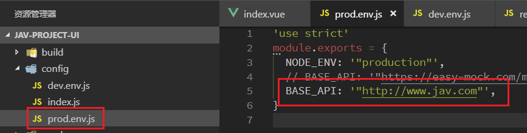
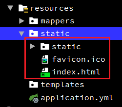
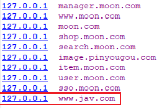
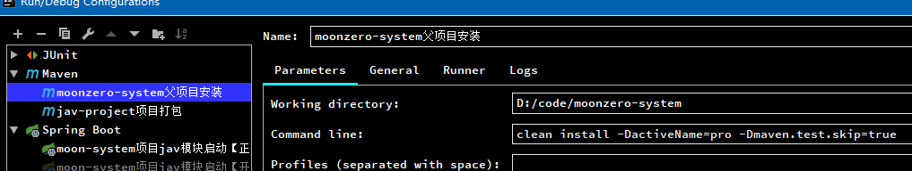
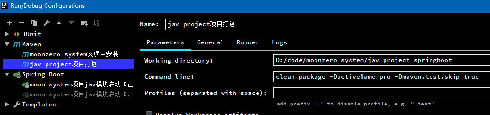

# moonzero-system 项目记录

MoonZero个人管理系统项目（包括jav-project、将来计划的个人财产管理系统，或者以后增加更多的想法）

## 1. 版本分支

- master分支：版本主分支
- develop分支：开发主分支

## 2. 项目架构

- 前端页面：使用开源项目vue-element-admin（vue-element-admin 是一个后台集成解决方案，它基于 vue 和 element。它使用了最新的前端技术栈，内置了 i18 国际化解决方案，动态路由，权限验证，提炼了典型的业务模型，提供了丰富的功能组件，它可以帮助你快速搭建企业级中后台产品原型。）
    - 项目创建使用vue-admin-template（这是一个 极简的 vue admin 管理后台 它只包含了 Element UI & axios & iconfont & permission control & lint，这些搭建后台必要的东西。）开发
- 后端技术：spring boot + spring cloud，spring + springMVC + Mybatis(MyBatis-plus)
- 数据库：MySQL

### 2.1. 后端项目目录结构

```
moonzero-system
|-- mz-service-jav       # Jav服务模块。开发端口：8080，生产端口：38080
|-- mz-service-mail      # 邮件服务模块。开发与生产端口：38090
|-- mz-system-common     # 系统公共模块。
|-- mz-system-model      # 系统实体类模块
|-- mz-system-utils      # 系统公共工具模块
|-- mz-system-api        # 系统接口统一管理模块
|-- mz-govern-eureka     # eureka注册中心服务。开发与生产端口：51001和51002(如果做高可用)
|-- mz-govern-gateway    # zuul网关管理服务。开发与生产端口：51101
|-- mz-sdk							 # 项目sdk包，抽取一些功能做成直接运行的jar包
|-- project-resources    # 项目相关的资源
```

> - 端口规则：
> - 38xxx：后端服务应用端口，最后一位预留来做集群
> - 51xxx：后端公共应用，如：注册中心、网关等，最后一位预留来做集群

### 2.2. 前端框架结构

@表示src路径

- @/mock：存放模拟数据
- @/page：页面主要界面vue文件，如：登陆、登陆后主界面、锁屏页面等
- @/views：视图vue文件，路由控制
- @/const：存放项目的常量与数据字典数据

### 2.3. 涉及技术

|   技术框架    |     版本      |       说明       |
| ------------ | ------------- | ---------------- |
| Spring Boot  | 2.1.7.RELEASE | 容器+MVC框架      |
| Spring Cloud | Greenwich.SR2 | 微服务全套解决方案 |
| Swagger-UI   | 2.7.0         | 接口文档生成工具   |
| Lombok       | 1.18.8        | 简化对象封装工具   |
| MyBatis      | 3.1.2         | ORM框架          |
| mybatis-plus | 3.1.2         | MyBatis增强插件   |

## 3. 项目开发
### 3.1. 邮件服务批量上传邮件测试命令

- 使用idea编写启动的脚本，在VM options中增加定义环境变量的脚本

```bash
-DMAIL_HOST=smtp.139.com -DMAIL_USERNAME=xxx@xxx.com -DMAIL_PWD=xxxx -DMAIL_SEND_TO=xxx@xxx.com
```

> 注: 各邮箱服务地址：
>
> - 139邮箱：smtp.139.com
> - 126邮箱：smtp.126.com
> - 163邮箱：smtp.163.com

## 4. 数据库信息

- 数据库(正式)：jav_db
    - jav_actress
    - jav_category
    - jav_main
    - jav_storage
- 测试数据库：jav_db_test
    - jav_actress
    - jav_category
    - jav_main
    - jav_storage

## 5. 项目部署

### 5.1. 前面vue项目与后端Spring boot项目整合部署
#### 5.1.1. 方式一：spring boot+vue部署（无使用thymleaf）

1. 配置前端vue项目的config/prod.env.js文件。修改生产环境的请求`BASE_API`，这里配置为域名是为了后面使用nginx反向代理，不必因为后端部署到不同的服务器或者不同的端口而每次都要重新打包



2. 使用命令`npm run build`构建vue项目.会打包到dist文件夹，里面生成一个static文件夹和一个index.html文件。直接将vue构建后的文件直接全部放置到resources/static目录下。这样整合后index.html也是作为一个静态资源出现的。



3. 修改host文件，增加配置域名映射



4. 修改nginx配置文件`\conf\nginx.conf`，增加后端项目部署的地址。配置好之后，前端请求`www.jav.com`时由nginx转向请求`http://127.0.0.1:8080`。这样后端项目使用IDE运行或者打包到tomcat部署时，只需要修改nginx.cof文件即可，前端不需要重新编译打包

```conf
server {
	listen       80;
	server_name  www.jav.com;

	proxy_set_header X-Forwarded-Host $host;
	proxy_set_header X-Forwarded-Server $host;
	proxy_set_header Host $host;

	location / {
		   proxy_pass http://127.0.0.1:8080;
		   proxy_connect_timeout 600;
		   proxy_read_timeout 600;
	}
}
```

#### 5.1.2. 方式二：spring boot+thymeleaf+vue部署（待整理，测试使用）

参考资料：https://blog.csdn.net/u014098584/article/details/78912378

#### 5.1.3. 方式三（使用）：前后端分离部署

1. 将前端页面工程使用`npm run build:prod`命令，编译打包部署到nginx中，作为静态资源，

```java
server {
	listen       80;
	server_name  www.jav.com;

	proxy_set_header X-Forwarded-Host $host;
	proxy_set_header X-Forwarded-Server $host;
	proxy_set_header Host $host;

	# 配置jav模块打包后静态资源
	location / {
		   root D:\deployment-environment\moon-system-jav;
	}

	# 配置部署生产环境前端请求后端的服务接口地址
	location ^~ /moon-system-api/ {
		   # 配置后，请求http://www.jav.com/moon-system-api/jav/main 相当于请求http://127.0.0.1:8888/jav/main
		   proxy_pass http://jav_server_pool/;
		   proxy_connect_timeout 600;
		   proxy_read_timeout 600;
	}
}
```

### 5.2. 服务部署相关的脚本与端口
#### 5.2.1. 前端项目编译&启动

```bash
# Install dependencies安装依赖
npm install

# 构建测试环境（Serve with hot reload at localhost:9528）
npm run dev

# 构建生产环境（Build for production with minification）
npm run build:prod

# 构建生产并查看捆绑分析器报告（Build for production and view the bundle analyzer report）
npm run build --report
```

#### 5.2.2. 项目开发启动命令

- 因为配置开发与正式版本的两套配置文件，所以开发时运行需要修改`Environment`的`VM options`的参数为：`-DactiveName=dev`，切换到开发环境的配置，再运行main方法启动
    - **注意：此方式只适用于`${}`占位符情况，如果使用`@@`，则不能使用**
- 为了兼容项目打包，配置文件是使用`@@`作为占位符，所以启动需要使用命令`spring-boot:run`
- 如果使用`${}`，若项目使用了 spring-boot-starter-parent 做项目版本管理，需要在`<properties>`标签中替换resource.delimiter属性为`<resource.delimiter>${}</resource.delimiter>`

```bash
# 以开发环境配置启动
spring-boot:run -DactiveName=dev -Dmaven.test.skip=true

# 以正式环境配置启动
spring-boot:run -DactiveName=pro -Dmaven.test.skip=true
```

#### 5.2.3. 项目打包命令

- 需要将依赖的公共包安装到本地仓库，到时需要依赖打包到war包中
- 项目打包：参考5.1将前端部署后，因为配置了开发环境与正式版本环境的两套配置文件，使用maven命令打包时，需要输入配置文件的参数，进行打包即可，完成后将war包放到tomcat运行部署

```bash
# 项目安装（更新安装所有依赖的公共模块）
mvn clean install -DactiveName=pro -Dmaven.test.skip=true

# 项目打包（相应的模块）
mvn clean package -DactiveName=pro -Dmaven.test.skip=true
```





#### 5.2.4. 开发环境

- JAV模块前端页面：127.0.0.1:9528

```bash
npm run dev
```

- JAV模块服务地址：127.0.0.1:8080
    - 开发swagger文档：http://127.0.0.1:8080/jav/swagger-ui.html

```bash
# 设置VM options（Eureka集群）
-DACTIVE_NAME=dev -DSERVER_PORT=8080 -DEUREKA_SERVER=http://localhost:51001/eureka/,http://localhost:51002/eureka/ -DIP_ADDRESS=127.0.0.1 -Dmaven.test.skip=true

# 设置VM options（单Eureka）
-DACTIVE_NAME=dev -DSERVER_PORT=8080 -DEUREKA_SERVER=http://localhost:51001/eureka/ -DIP_ADDRESS=127.0.0.1 -Dmaven.test.skip=true
```

- Eureka注册中心地址：127.0.0.1:51001 和 127.0.0.1:51002。（使用idea启动需要配置以下参数）

```bash
# -------- 高可用配置 --------
# eureka01设置VM options
-DACTIVE_NAME=dev -DSERVER_PORT=51001 -DEUREKA_SERVER=http://eureka02:51002/eureka/ -DEUREKA_DOMAIN=eureka01
# eureka02设置VM options
-DACTIVE_NAME=dev -DSERVER_PORT=51002 -DEUREKA_SERVER=http://eureka01:51001/eureka/ -DEUREKA_DOMAIN=eureka02

# -------- 单机配置 --------
-DACTIVE_NAME=dev -DSERVER_PORT=51001 -DEUREKA_SERVER=http://127.0.0.1:51001/eureka/
```

- Gateway网关服务地址：127.0.0.1:51101/moon-system-api

```bash
# gateway设置VM options启动参数（eureka高可用版）
-DACTIVE_NAME=dev -DSERVER_PORT=51101 -DEUREKA_SERVER=http://localhost:51001/eureka/,http://localhost:51002/eureka/ -DIP_ADDRESS=127.0.0.1 -Dmaven.test.skip=true

# gateway设置VM options启动参数（eureka单机版）
-DACTIVE_NAME=dev -DSERVER_PORT=51101 -DEUREKA_SERVER=http://localhost:51001/eureka/ -DIP_ADDRESS=127.0.0.1 -Dmaven.test.skip=true
```

- mail邮件模块服务地址：127.0.0.1:38090

```bash
# mail邮件模块服务开发启动脚本，设置VM options（eureka高可用版）
-DACTIVE_NAME=dev -DSERVER_PORT=38090 -DEUREKA_SERVER=http://localhost:51001/eureka/,http://localhost:51002/eureka/ -DIP_ADDRESS=127.0.0.1 -Dmaven.test.skip=true

# mail邮件模块服务开发启动脚本，设置VM options（eureka单机版）
-DACTIVE_NAME=dev -DSERVER_PORT=38090 -DEUREKA_SERVER=http://localhost:51001/eureka/ -DIP_ADDRESS=127.0.0.1 -DMAIL_HOST=smtp.139.com -DMAIL_USERNAME=xxx@xxx.com -DMAIL_PWD=xxx -Dmaven.test.skip=true
```

#### 5.2.5. 生产环境

- JAV模块：部署到ngnix，映射域名www.jav.com，监控80端口

```bash
npm run build:prod
```

- JAV模块服务部署地址：127.0.0.1:38080

```bash
# 先安装父目录，保证依赖的公共模块是最新的
clean install -DACTIVE_NAME=pro -Dmaven.test.skip=true

# 打包JAV模块（eureka高可用版）
clean package -DACTIVE_NAME=pro -DSERVER_PORT=38080 -DEUREKA_SERVER=http://localhost:51001/eureka/,http://localhost:51002/eureka/ -DIP_ADDRESS=127.0.0.1 -Dmaven.test.skip=true

# 打包JAV模块（eureka单机版）
clean package -DACTIVE_NAME=pro -DSERVER_PORT=38080 -DEUREKA_SERVER=http://localhost:51001/eureka/ -DIP_ADDRESS=127.0.0.1 -Dmaven.test.skip=true
```

> 因为定义了该项目的根目录是/jav。而且不是直接使用spring boot打包成jar包，是单独部署到tomcat的，所以需要将tomcat的根目录修改为/jav，并指向项目war解压后所在的路径
>
> 修改tomcat目录的\conf\server.xml，在`<host>`标签内增加`<Context>`标签，指定web项目的根路径与源代码所在目录

```xml
<Host name="localhost"  appBase="webapps"
        unpackWARs="true" autoDeploy="true">

    <!-- SingleSignOn valve, share authentication between web applications
         Documentation at: /docs/config/valve.html -->
    <!--
    <Valve className="org.apache.catalina.authenticator.SingleSignOn" />
    -->

    <!-- Access log processes all example.
         Documentation at: /docs/config/valve.html
         Note: The pattern used is equivalent to using pattern="common" -->
    <Valve className="org.apache.catalina.valves.AccessLogValve" directory="logs"
           prefix="localhost_access_log" suffix=".txt"
           pattern="%h %l %u %t &quot;%r&quot; %s %b" />
           <!-- 指定tomcat访问的根据目录
                path是说明虚拟目录的名字，如果要只输入ip地址直接显示主页，则该键值留为空；
                docBase是虚拟目录的路径，它默认的是$tomcat/webapps/ROOT目录，现在在webapps目录下建了一个jav目录，让该目录作为默认目录。
                debug和reloadable一般都分别设置成0和true。
            -->
    	<Context path="/jav" docBase="D:\deployment-environment\tomcat-9.0.5-javProject-port38080\webapps\jav\"
                 debug="0" reloadable="true" />
</Host>
```

- Eureka注册中心部署地址：127.0.0.1:51001 和 127.0.0.1:51002

```bash
# eureka01打包
clean package -DACTIVE_NAME=pro -DSERVER_PORTT=51001 -DEUREKA_SERVER=http://eureka02:51002/eureka/ -DEUREKA_DOMAIN=eureka01
# eureka02打包
clean package -DACTIVE_NAME=pro -DSERVER_PORT=51002 -DEUREKA_SERVER=http://eureka01:51001/eureka/ -DEUREKA_DOMAIN=eureka02

# -------- 单机配置 --------
# eureka打包
clean package -DACTIVE_NAME=pro -DSERVER_PORT=51001 -DEUREKA_SERVER=http://127.0.0.1:51001/eureka/
```

- Gateway网关服务地址：127.0.0.1:51101/moon-system-api

```bash
# gateway服务打包（eureka高可用版）
clean package -DACTIVE_NAME=pro -DSERVER_PORT=51101 -DEUREKA_SERVER=http://localhost:51001/eureka/,http://localhost:51002/eureka/ -DIP_ADDRESS=127.0.0.1 -Dmaven.test.skip=true

# gateway服务打包（eureka单机版）
clean package -DACTIVE_NAME=pro -DSERVER_PORT=51101 -DEUREKA_SERVER=http://localhost:51001/eureka/ -DIP_ADDRESS=127.0.0.1 -Dmaven.test.skip=true
```

## 6. 项目版本修改记录
### 6.1. ver2.0.0(待启动)

- 后端工程
    - [ ] 规范代码分层，service层只能调用自己相应的dao层，其他dao只能通过其他的service进行访问
    - [ ] 引入消息中间件（RabbitMQ或者activeMQ）服务。如：更新分类与存储位置后，删除redis中缓存数据；修改资源存储为本地存储后，更新主资源表是否保存的字段值等等。
    - [ ] 引入Spring task，JAV模块增加定时任务，定时扫描统计更新出演者的作品总记录数
    - [ ] 增加用户登陆授权模块
    - [ ] 增加统计图

### 6.2. ver1.0.1(开发中)

- 后端工程
- 数据库
    - [x] 修改jav_main表，增加出演者身高字段
- 前端工程
    - [x] 出演者模块增加身高字段的数据
    - [x] 前端统一增、删、改的提示信息弹出框处理，减少页面的重复代码
    - [x] 增加按钮提交后置灰功能，防止重复提交的问题
    - [x] 前端主资源录入时增加转大写按钮，并在点击转大写按钮后将输入框的内容复制到剪切板中

### 6.3. ver1.0.0

- 后端工程
    - 后端架构改成spring cloud微服务架构，使用nginx实现前后端分离
    - 增加eureka注册中心
    - 增加zuul网关服务，统一管理请求
    - 增加出演者管理、资源分类管理、资源存储位置管理等三个模块
    - 引入redis缓存分类与存储位置等字典数据
    - 修改数据库表结构
        - 资源存储位置jav_storage表增加是否为本地存储is_local字段；
        - 出演者jav_actor表将是否删除is_delete字段修改为状态status字段；
        - 主资源表jav_main表增加评分grade字段
- 前端工程
    - 增加出演者管理、资源分类管理、资源存储位置管理等三个模块
    - 优化页面样式与逻辑
    - 增加主资源管理模块中，资源分类与资源存储位置动态查询后端数据库

### 6.4. ver0.2.0

- 后端工程
    - 修改日志中文乱码的问题
    - 修复jav服务main模块的请求url
- 前端工程
    - 优化jav模块main列表查询页面
    - 更新请求main模块请求的url
    - 更新main模块列表页面，增加图片显示功能，和更新图片列表与文字列表显示切换的功能。

### 6.5. ver0.1.0

- 后端工程
    - 更新JavMain主资源表中storage_ids字段保存格式，改成只存储位置id，使用“,”分隔
    - 优化后端项目的逻辑，优化统一返回结果对象，增加全局的异常处理
    - 使用Restful风格请求
    - 使用java8 新特性 stream 流去做逻辑处理
    - 将原来使用通用mapper为持久层操作工具，换成使用mybatis-plus为持久层操作框架
    - 升级faseJson版本至1.2.56，在1.2.48及以下版本，无需Autotype开启，攻击者即可通过构造的请求包在使用fasejson的服务器上进行远程代码执行
    - 优化新增出演者字符串使用流转换；在更新主资源数据时，对出演者与原记录的出演者字符串进行比较判断，如果原来记录为空，则直接转换，如果原有记录有值，则判断只去转换新增部分
- 前端工程
    - 优化数据字典数据，优化修改与详情中的存储位置显示逻辑
    - 修复更新数据成功，列表不自动刷新，导致再次更新数据时显示上一次数据
    - 使用Restful风格请求
    - 修复前端选择每页大小后，不能使用当前每页大小去查询，需要点击翻页或者查询后，第二次请求才生效

### 6.6. ver0.0.1

- 完成JavMain主资源表的新增、修改、删除、多条件查询功能

### 6.7. 项目待处理
#### 6.7.1. 存在问题

- 图片列表显示的位置需要优化，有时一行只显示一张图片
- 修改前端页面的数据字典读取后端数据库
- 修改主资源表数据时，无论新增还是更新，都是重新去查询出演者列表，生成json字符串数据。需要优化成，当修改的时候，如果与数据库原来的出演者数据一致，就不需要去调用转换出演者字符串方法。


