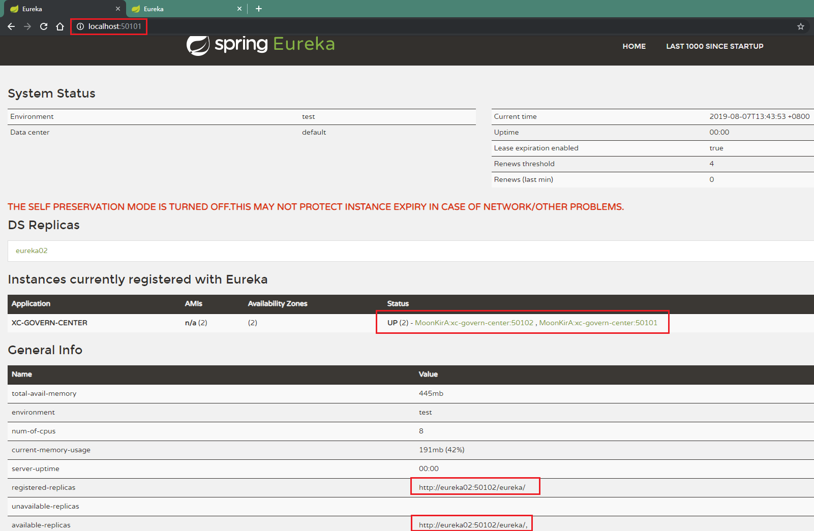
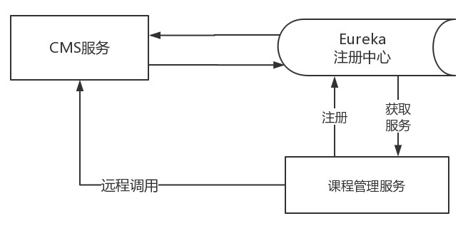
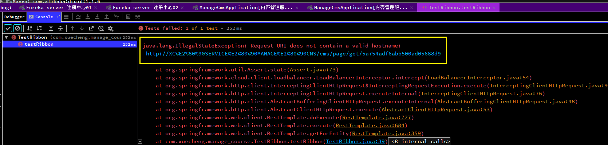
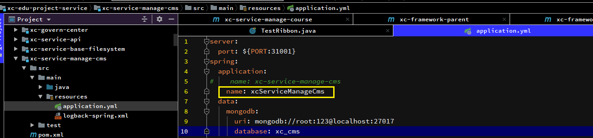
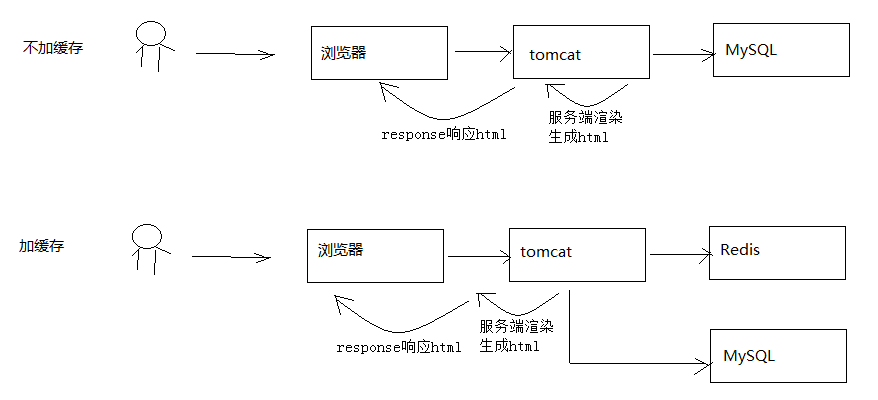

# Day09 课程预览 & Eureka、Feign、Ribbon使用

## 1. Eureka 注册中心
### 1.1. 需求分析

- 在前后端分离架构中，服务层被拆分成了很多的微服务，微服务的信息如何管理？Spring Cloud中提供服务注册中心来管理微服务信息
- 注册中心的作用
    1. 微服务数量众多，要进行远程调用就需要知道服务端的ip地址和端口，注册中心帮助我们管理这些服务的ip和端口
    2. 微服务会实时上报自己的状态，注册中心统一管理这些微服务的状态，将存在问题的服务踢出服务列表，客户端获取到可用的服务进行调用

### 1.2. Eureka 介绍

Spring Cloud Eureka 是对Netflix公司的Eureka的二次封装，它实现了服务治理的功能，Spring Cloud Eureka提供服务端与客户端，服务端即是Eureka服务注册中心，客户端完成微服务向Eureka服务的注册与发现。服务端和客户端均采用Java语言编写。下图显示了Eureka Server与Eureka Client的关系


1. Eureka Server是服务端，负责管理各各微服务结点的信息和状态
2. 在微服务上部署Eureka Client程序，远程访问Eureka Server将自己注册在Eureka Server
3. 微服务需要调用另一个微服务时从Eureka Server中获取服务调用地址，进行远程调用

### 1.3. Eureka Server 搭建
#### 1.3.1. 单机环境搭建

1. 创建xc-govern-center工程
    - 包结构：`com.xuecheng.govern.center`
2. 添加依赖
- 在父工程pom.xml配置文件添加：（有了则不用重复添加）

```xml
<dependency>
    <groupId>org.springframework.cloud</groupId>
    <artifactId>spring-cloud-dependencies</artifactId>
    <version>Finchley.SR1</version>
    <type>pom</type>
    <scope>import</scope>
</dependency>
```

- 在Eureka Server工程pom.xml配置文件添加Eureka服务的依赖

```xml
<?xml version="1.0" encoding="UTF-8"?>
<project xmlns="http://maven.apache.org/POM/4.0.0"
         xmlns:xsi="http://www.w3.org/2001/XMLSchema-instance"
         xsi:schemaLocation="http://maven.apache.org/POM/4.0.0
         http://maven.apache.org/xsd/maven-4.0.0.xsd">
    <parent>
        <artifactId>xc-framework-parent</artifactId>
        <groupId>com.xuecheng</groupId>
        <version>1.0-SNAPSHOT</version>
        <relativePath>../xc-framework-parent/pom.xml</relativePath>
    </parent>
    <modelVersion>4.0.0</modelVersion>
    <artifactId>xc-govern-center</artifactId>
    <name>xc-govern-center</name>
    <description>Eureka Server工程</description>

    <dependencies>
        <!-- 导入Eureka服务的依赖 -->
        <dependency>
            <groupId>org.springframework.cloud</groupId>
            <artifactId>spring-cloud-starter-netflix-eureka-server</artifactId>
        </dependency>
    </dependencies>

</project>
```

3. 启动类

```java
package com.xuecheng.govern.center;

import org.springframework.boot.SpringApplication;
import org.springframework.boot.autoconfigure.SpringBootApplication;
import org.springframework.cloud.netflix.eureka.server.EnableEurekaServer;

/**
 * 注册中心服务启动类
 */
@EnableEurekaServer // 标识此工程是一个EurekaServer
@SpringBootApplication
public class GovernCenterApplication {
    public static void main(String[] args) {
        SpringApplication.run(GovernCenterApplication.class, args);
    }
}
```

4. 需要在启动类上用`@EnableEurekaServer`标识此服务为Eureka服务
5. 从其它服务拷贝application.yml和logback-spring.xml，其中application.yml的配置内容如下：

```yml
server:
  port: 50101 # 服务端口

spring:
  application:
    name: xc-govern-center # 指定服务名

eureka:
  client:
    register-with-eureka: false # 服务注册，是否将自己注册到Eureka服务中（注：也可以写成驼峰命名registerWithEureka）
    fetch-registry: false # 服务发现，是否从Eureka中获取注册信息
    service-url:  # Eureka客户端与Eureka服务端的交互地址，高可用状态配置对方的地址，单机状态配置自己（如果不配置则默认本机8761端口）
      defaultZone: http://localhost:50101/eureka
  server:
    enable-self-preservation: false # 是否开启自我保护模式
    eviction-interval-timer-in-ms: 60000  # 服务注册表清理间隔（单位毫秒，默认是60 * 1000）
```

- `registerWithEureka`：被其它服务调用时需向Eureka注册
- `fetchRegistry`：需要从Eureka中查找要调用的目标服务时需要设置为true
- `serviceUrl.defaultZone`：配置上报Eureka服务地址高可用状态配置对方的地址，单机状态配置自己
- `enable-self-preservation`：自保护设置，下边有介绍
- `eviction-interval-timer-in-ms`：清理失效结点的间隔，在这个时间段内如果没有收到该结点的上报则将结点从服务列表中剔除

6. 启动Eureka Server，使用浏览器访问50101端口


- 说明：
    > - 上图红色提示信息：THE SELF PRESERVATION MODE IS TURNED OFF.THIS MAY NOT PROTECT INSTANCE EXPIRY IN CASE OF NETWORK/OTHER PROBLEMS.
    > - 自我保护模式被关闭。在网络或其他问题的情况下可能不会保护实例失效
- Eureka Server有一种自我保护模式，当微服务不再向Eureka Server上报状态，Eureka Server会从服务列表将此服务删除，如果出现网络异常情况（微服务正常），此时Eureka server进入自保护模式，不再将微服务从服务列表删除
- 在*开发阶段建议关闭自保护模式，生产环境下将`enable-self-preservation`设置为true*

#### 1.3.2. 高可用环境搭建

Eureka Server 高可用环境需要部署两个Eureka server，它们互相向对方注册。如果在本机启动两个Eureka需要注意两个Eureka Server的端口要设置不一样，这里部署一个Eureka Server工程，将端口可配置，制作两个Eureka Server启动脚本，启动不同的端口，如下图


1. 在实际使用时Eureka Server至少部署两台服务器，实现高可用
2. 两台Eureka Server互相注册
3. 微服务需要连接两台Eureka Server注册，当其中一台Eureka死掉也不会影响服务的注册与发现
4. 微服务会定时向Eureka server发送心跳，报告自己的状态
5. 微服务从注册中心获取服务地址以RESTful方式发起远程调用。

配置如下

1. 修改端口可配置

```yml
server:
  port: ${PORT:50101} # 服务端口，默认值为50101
```

2. Eureka服务端的交互地址可配置

```yml
eureka:
  client:
    register-with-eureka: true # 服务注册，是否将自己注册到Eureka服务中（注：也可以写成驼峰命名registerWithEureka）
    fetch-registry: true # 服务发现，是否从Eureka中获取注册信息
    service-url:  # Eureka客户端与Eureka服务端的交互地址，高可用状态配置对方的地址，单机状态配置自己（如果不配置则默认本机8761端口）
      defaultZone: ${EUREKA_SERVER:http://eureka02:50102/eureka/}
```

3. 配置hostname。Eureka 组成高可用，两个Eureka互相向对方注册，这里需要通过域名或主机名访问，这里设置两个Eureka服务的主机名分别为 eureka01、eureka02

```yml
eureka:
  client:
    register-with-eureka: true # 服务注册，是否将自己注册到Eureka服务中（注：也可以写成驼峰命名registerWithEureka）
    fetch-registry: true # 服务发现，是否从Eureka中获取注册信息
    service-url:  # Eureka客户端与Eureka服务端的交互地址，高可用状态配置对方的地址，单机状态配置自己（如果不配置则默认本机8761端口）
      defaultZone: ${EUREKA_SERVER:http://eureka02:50102/eureka/} # 必须使用域名或主机名，则需要配置本地host文件映射，如：127.0.0.1 eureka02
  server:
    enable-self-preservation: false # 是否开启自我保护模式
    eviction-interval-timer-in-ms: 60000  # 服务注册表清理间隔（单位毫秒，默认是60 * 1000）
  instance:
    hostname: ${EUREKA_DOMAIN:eureka01} # 如果指定EUREKA_DOMAIN的值则使用，如果不指定，则默认为eureka01，需要配置本地host文件映射，如：127.0.0.1 eureka01
```

4. 在IDEA中制作启动脚本

- 打开【Run/Debug Configurations】，设置Environment的相关的环境参数
- eureka server 1：
    - VM options：`-DPORT=50101 -DEUREKA_SERVER=http://eureka02:50102/eureka/ -DEUREKA_DOMAIN=eureka01`
- eureka server 2:
    - VM options：`-DPORT=50102 -DEUREKA_SERVER=http://eureka01:50101/eureka/ -DEUREKA_DOMAIN=eureka02`


5. 运行两个启动脚本，分别浏览：
    - http://localhost:50101/
    - http://localhost:50102/




### 1.4. 服务注册
#### 1.4.1. 将 cms 服务注册到 Eureka Server

1. 在 xc-service-manage-cms 服务工程中 pom.xml 文件添加依赖

```xml
<!-- 导入Eureka客户端的依赖 -->
<dependency>
    <groupId>org.springframework.cloud</groupId>
    <artifactId>spring-cloud-starter-netflix-eureka-client</artifactId>
</dependency>
```

2. 修改application.yml配置，增加eureka配置

```yml
# Eureka 客户端配置
eureka:
  client:
    register-with-eureka: true  # 服务注册开关
    fetch-registry: true  # 服务发现开关
    service-url:  # Eureka客户端与Eureka服务端进行交互的地址，多个中间用逗号分隔
      defaultZone: ${EUREKA_SERVER:http://localhost:50101/eureka/,http://localhost:50102/eureka/}
  instance:
    prefer-ip-address: true # 将自己的ip地址注册到Eureka服务中
    ip-address: ${IP_ADDRESS:127.0.0.1}
    instance-id: ${spring.application.name}:${server.port}  # 指定实例id
```

3. 在启动类上添加注解 `@EnableDiscoveryClient` ，表示它是一个Eureka的客户端

```java
@EnableDiscoveryClient  // 一个EurekaClient从EurekaServer发现服务
@SpringBootApplication
@EntityScan("com.xuecheng.framework.domain.cms") // 扫描实体类所在包
@ComponentScan(basePackages = {"com.xuecheng.api", "com.xuecheng.framework"}) // 扫描接口，common工程所在包
@ComponentScan(basePackages = {"com.xuecheng.manage_cms"}) // 扫描本项目下的所有类（其实不写好像也是可以扫描的）
public class ManageCmsApplication {
    ......
}
```

4. 刷新Eureka Server查看注册情况


#### 1.4.2. 将 manage-course 服务注册到 Eureka Server

服务注册的方法同上

1. 在 xc-service-manage-course 工程中 pom.xml 文件添加 spring-cloud-starter-eureka 依赖
2. 在application.yml配置eureka
3. 在启动类上添加注解 `@EnableDiscoveryClient`

## 2. Feign 远程调用

在前后端分离架构中，服务层被拆分成了很多的微服务，服务与服务之间难免发生交互，比如：课程发布需要调用CMS服务生成课程静态化页面，需要研究微服务远程调用所使用的技术

课程管理服务远程调用CMS服务的流程图：



工作流程

1. cms服务将自己注册到注册中心
2. 课程管理服务从注册中心获取cms服务的地址
3. 课程管理服务远程调用cms服务

### 2.1. Ribbon
#### 2.1.1. Ribbon介绍

Ribbon是Netflix公司开源的一个负载均衡的项目（官网：https://github.com/Netflix/ribbon），它是一个基于 HTTP、TCP的客户端负载均衡器

#### 2.1.2. 负载均衡

负载均衡是微服务架构中必须使用的技术，通过负载均衡来实现系统的高可用、集群扩容等功能。负载均衡可通过硬件设备及软件来实现，硬件比如：F5、Array等，软件比如：LVS、Nginx等


用户请求先到达负载均衡器（也相当于一个服务），负载均衡器根据负载均衡算法将请求转发到微服务。负载均衡算法有：轮训、随机、加权轮训、加权随机、地址哈希等方法，负载均衡器维护一份服务列表，根据负载均衡算法将请求转发到相应的微服务上，所以负载均衡可以为微服务集群分担请求，降低系统的压力

#### 2.1.3. 客户端负载均衡

上图是服务端负载均衡，客户端负载均衡与服务端负载均衡的区别在于客户端要维护一份服务列表，Ribbon从Eureka Server获取服务列表，Ribbon根据负载均衡算法直接请求到具体的微服务，中间省去了负载均衡服务


1. 在消费微服务中使用Ribbon实现负载均衡，Ribbon先从EurekaServer中获取服务列表
2. Ribbon根据负载均衡的算法去调用微服务

#### 2.1.4. Ribbon 引入依赖与配置

Spring Cloud 引入 Ribbon 配合 restTemplate 实现客户端负载均衡。Java中远程调用的技术有很多，如：webservice、socket、rmi、Apache HttpClient、OkHttp等，互联网项目使用基于http的客户端较多，本项目使用OkHttp

1. 在课程管理服务 xc-service-manage-course 的 pom.xml 配置Ribbon依赖

```xml
<!-- 配置spring cloud Finchley.SR1 版本对应的ribbon依赖 -->
<dependency>
    <groupId>org.springframework.cloud</groupId>
    <artifactId>spring-cloud-starter-netflix-ribbon</artifactId>
</dependency>
<!-- OkHttp依赖 -->
<dependency>
    <groupId>com.squareup.okhttp3</groupId>
    <artifactId>okhttp</artifactId>
</dependency>
```

> 由于依赖了spring-cloud-starter-eureka，会自动添加spring-cloud-starter-ribbon依赖

2. 在课程管理服务 xc-service-manage-course 的 application.yml 中配置ribbon参数

```yml
# 配置Ribbon参数
ribbon:
  MaxAutoRetries: 2 # 最大重试次数，当Eureka中可以找到服务，但是服务连不上时将会重试
  MaxAutoRetriesNextServer: 3 # 切换实例的重试次数
  OkToRetryOnAllOperations: false  # 对所有操作请求都进行重试，如果是get则可以，如果是post，put等操作没有实现幂等的情况下是很危险的,所以设置为false
  ConnectTimeout: 5000  # 请求连接的超时时间
  ReadTimeout: 6000 # 请求处理的超时时间
```

#### 2.1.5. 负载均衡测试

1. 启动两个cms服务，注意端口要不一致。启动完成观察Eureka Server的服务列表

将application.yml配置文件的端口号修改为可配置

```yml
server:
  port: ${PORT:31001}
```

使用idea运行时配置参数：`-DPORT=31002`，端口31001可以不用配置，有默认值

2. 在课程管理服务（xc-service-manage-course）的启动类中定义RestTemplate，使用@LoadBalanced注解开启客户端负载均衡

```java
@EnableDiscoveryClient
@SpringBootApplication
@EntityScan("com.xuecheng.framework.domain.course")//扫描实体类
@ComponentScan(basePackages = {"com.xuecheng.api"})//扫描接口
@ComponentScan(basePackages = {"com.xuecheng.manage_course"})
@ComponentScan(basePackages = {"com.xuecheng.framework"})//扫描common下的所有类
public class ManageCourseApplication {

    public static void main(String[] args) throws Exception {
        SpringApplication.run(ManageCourseApplication.class, args);
    }

    @Bean
    @LoadBalanced   // 此注解代表开启客户端负载均衡
    public RestTemplate restTemplate() {
        return new RestTemplate(new OkHttp3ClientHttpRequestFactory());
    }
}
```

3. 使用junit测试。在课程管理服务工程创建单元测试代码，远程调用cms的查询页面接口

```java
package com.xuecheng.manage_course;

import com.xuecheng.framework.domain.cms.CmsPage;
import org.junit.Test;
import org.junit.runner.RunWith;
import org.springframework.beans.factory.annotation.Autowired;
import org.springframework.boot.test.context.SpringBootTest;
import org.springframework.http.ResponseEntity;
import org.springframework.test.context.junit4.SpringRunner;
import org.springframework.web.client.RestTemplate;

/**
 * Ribbon 测试
 */
@SpringBootTest
@RunWith(SpringRunner.class)
public class TestRibbon {
    @Autowired
    private RestTemplate restTemplate;
    /**
     * 负载均衡调用测试
     */
    @Test
    public void testRibbon() {
        // 使用XcServiceList公共模块内容类获取的服务名，循环调用
        for (int i = 0; i < 10; i++) {
            // ribbon客户端从eurekaServer中获取服务列表，根据服务名获取服务列表，然后通过服务id调用
            ResponseEntity<CmsPage> responseEntity = restTemplate
                    .getForEntity(String.format("http://%s/cms/page/get/5a754adf6abb500ad05688d9", XcServiceList.XC_SERVICE_MANAGE_CMS), CmsPage.class);
            CmsPage cmsPage = responseEntity.getBody();
            System.out.println(cmsPage);
        }
    }
}
```

4. 负载均衡测试

添加 `@LoadBalanced` 注解后，restTemplate 会走 LoadBalancerInterceptor 拦截器，此拦截器中会通过 RibbonLoadBalancerClient 查询服务地址，可以在此类打断点观察每次调用的服务地址和端口，两个cms服务会轮流被调用


#### 2.1.6. 本实践项目遇到的问题（已解决，后来发现是文档中“-”的问题）

> 一个在本项目使用ribbon实现负载均衡注意问题，服务名称不能用下划线或者中划线，如果需要对服务名称进行分隔，则使用驼峰命名，否则会报`java.lang.IllegalStateException: Request URI does not contain a valid hostname`




修改使用驼峰命名可以解决问题




网上查询资料，说源码进行了跟踪调试，发现了originalURi.getHost()无法获取带有下划线的名称

```java
public ClientHttpResponse intercept(final HttpRequest request, final byte[] body, final ClientHttpRequestExecution execution) throws IOException {
    URI originalUri = request.getURI();
    //对于价下划线的服务名称无法进行解析出具体的URL
    String serviceName = originalUri.getHost();
    Assert.state(serviceName != null, "Request URI does not contain a valid hostname: " + originalUri);
    return (ClientHttpResponse)this.loadBalancer.execute(serviceName, this.requestFactory.createRequest(request, body, execution));
}
```

### 2.2. Feign
#### 2.2.1. Feign介绍

Feign是Netflix公司开源的轻量级rest客户端，使用Feign可以非常方便的实现Http 客户端。Spring Cloud 引入 Feign 并且集成了 Ribbon 实现客户端负载均衡调用 和 Hystrix 熔断器的依赖

#### 2.2.2. Feign测试

1. 在客户端课程管理服务xc-service-manage-course，添加依赖

```xml
<!-- 配置feign依赖，因为feign是用作http远程调用，已经包含ribbon的依赖 -->
<dependency>
    <groupId>org.springframework.cloud</groupId>
    <artifactId>spring-cloud-starter-openfeign</artifactId>
</dependency>
<!-- feign集成okhttp，但本次项目暂时没有使用 -->
<dependency>
    <groupId>com.netflix.feign</groupId>
    <artifactId>feign‐okhttp</artifactId>
</dependency>
```

2. 定义FeignClient接口
    - 参考Swagger文档定义FeignClient，注意接口的Url、请求参数类型、返回值类型与Swagger接口一致
    - 在课程管理服务xc-service-manage-course中创建client包，定义查询cms页面的客户端使用的接口

```java
package com.xuecheng.manage_course.client;

import com.xuecheng.framework.domain.cms.CmsPage;
import org.springframework.cloud.openfeign.FeignClient;
import org.springframework.web.bind.annotation.GetMapping;
import org.springframework.web.bind.annotation.PathVariable;

/**
 * CmsPage服务客户端接口
 */
// 使用@FeignClient注解，并指定远程调用的服务名，项目启动后feign会扫描到有该注解的接口，生成代理对象并放到spring容器中
@FeignClient(value = "XC-SERVICE-MANAGE-CMS")
public interface CmsPageClient {
    /**
     * 根据页面id查询页面信息，远程调用cms请求数据
     *
     * @return CmsPage
     */
    // 用GetMapping标识远程调用的http的方法类型
    @GetMapping("/cms/page/get/{id}")
    public CmsPage findCmsPageById(@PathVariable("id") String id);
}
```

3. 在课程管理服务xc-service-manage-course的启动类添加`@EnableFeignClients`注解

```java
package com.xuecheng.manage_course;

import org.springframework.boot.SpringApplication;
import org.springframework.boot.autoconfigure.SpringBootApplication;
import org.springframework.boot.autoconfigure.domain.EntityScan;
import org.springframework.cloud.client.discovery.EnableDiscoveryClient;
import org.springframework.cloud.client.loadbalancer.LoadBalanced;
import org.springframework.cloud.openfeign.EnableFeignClients;
import org.springframework.context.annotation.Bean;
import org.springframework.context.annotation.ComponentScan;
import org.springframework.http.client.OkHttp3ClientHttpRequestFactory;
import org.springframework.web.client.RestTemplate;

@EnableFeignClients // 开启feignClient，会扫描标识@FeignClient注解的接口
@EnableDiscoveryClient
@SpringBootApplication
@EntityScan("com.xuecheng.framework.domain.course")//扫描实体类
@ComponentScan(basePackages = {"com.xuecheng.api"})//扫描接口
@ComponentScan(basePackages = {"com.xuecheng.manage_course"})
@ComponentScan(basePackages = {"com.xuecheng.framework"})//扫描common下的所有类
public class ManageCourseApplication {

    public static void main(String[] args) throws Exception {
        SpringApplication.run(ManageCourseApplication.class, args);
    }

    @Bean
    @LoadBalanced   // 此注解代表开启客户端负载均衡
    public RestTemplate restTemplate() {
        return new RestTemplate(new OkHttp3ClientHttpRequestFactory());
    }
}
```

4. 使用junit进行测试

```java
/**
 * Feign 测试
 */
@SpringBootTest
@RunWith(SpringRunner.class)
public class TestFeign {
    /* 注入需要调用的接口，由Feign生成代理对象 */
    @Autowired
    private CmsPageClient cmsPageClient;
    /**
     * 通过服务id调用cms的查询页面接口
     */
    @Test
    public void testFeign() {
        // 发起远程调用，feign会通过该接口对应方法上的“服务名+请求url”，会自动找到cms服务对应的接口进行调用
        CmsPage cmsPage = cmsPageClient.findCmsPageById("5a754adf6abb500ad05688d9");
        System.out.println(cmsPage);
    }
}
```

> 注：同样存在使用ribbon时的问题，如果cms服务名为“XC-SERVICE-MANAGE-CMS”，会出现调用报错，也是因为解析带中划线的url报错。检查服务名的“-”是否有问题

#### 2.2.3. Feign 工作原理

1. 启动类添加`@EnableFeignClients`注解，Spring会扫描标记了`@FeignClient`注解的接口，并生成此接口的代理对象
2. `@FeignClient(value = XcServiceList.XC_SERVICE_MANAGE_CMS)`即指定了cms的服务名称xc-service-manage-cms，Feign会从注册中心获取cms服务列表，并通过负载均衡算法进行服务调用
3. 在接口方法 中使用注解@GetMapping("/cms/page/get/{id}")，指定调用的url，Feign将根据url进行远程调用

#### 2.2.4. Feign 注意点

- SpringCloud 对 Feign 进行了增强兼容了 SpringMVC 的注解 ，在使用SpringMVC的注解时需要注意
    1. feignClient 接口有参数时，必须在参数加`@PathVariable("XXX")`和`@RequestParam("XXX")`注解，并且必须要指定对应的参数值（原来SpringMVC是可以省略）
    2. feignClient 返回值为复杂对象时，其对象类型必须有无参构造函数

## 3. 课程预览技术方案
### 3.1. 需求分析

课程预览是为了保证课程发布后的正确性，通过课程预览可以直观的通过课程详情页面看到课程的信息是否正确，通过课程预览看到的页面内容和课程发布后的页面内容是一致的

### 3.2. 课程详情页面技术方案

课程预览所浏览到的页面就是课程详情页面，需要先确定课程详情页面的技术方案后方可确定课程预览的技术方案

#### 3.2.1. 技术需求

1. 课程详情页面是向用户展示课程信息的窗口，课程相当于电商网站的商品，本页面的访问量会非常大。此页面的内容设计不仅要展示出课程核心重要的内容而且用户访问页面的速度要有保证，有统计显示打开一个页面超过4秒用户就走掉了，所以本页面的性能要求是本页面的重要需求
2. 本页面另一个需求就是SEO，要非常有利于爬虫抓取页面上信息，并且生成页面快照，利于用户通过搜索引擎搜索课程信息

#### 3.2.2. 解决方案

如何在保证SEO的前提下提高页面的访问速度

##### 3.2.2.1. 方案1

对于信息获取类的需求，要想提高页面速度就要使用缓存来减少或避免对数据库的访问，从而提高页面的访问速度。下图是使用缓存与不使用缓存的区别



此页面为动态页面，会根据课程的不同而不同，方案一采用传统的JavaEE Servlet/jsp的方式在Tomcat完成页面渲染，相比不加缓存速度会有提升

- 优点：使用redis作为缓存，速度有提升
- 缺点：采用Servlet/jsp动态页面渲染技术，服务器使用Tomcat，面对高并发量的访问存在性能瓶颈

##### 3.2.2.2. 方案2

对于不会频繁改变的信息可以采用页面静态化的技术，提前让页面生成html静态页面存储在nginx服务器，用户直接访问nginx即可，对于一些动态信息可以访问服务端获取json数据在页面渲染


- 优点：使用Nginx作为web服务器，并且直接访问html页面，性能出色
- 缺点：需要维护大量的静态页面，增加了维护的难度

> 选择方案2作为课程详情页面的技术解决方案，将课程详情页面生成Html静态化页面，并发布到Nginx上

### 3.3. 课程预览技术方案

根据要求：课程详情页面采用静态化技术生成Html页面，课程预览的效果要与最终静态化的Html页面内容一致

所以，课程预览功能也采用静态化技术生成Html页面，课程预览使用的模板与课程详情页面模板一致，这样就可以保证课程预览的效果与最终课程详情页面的效果一致

操作流程：

1. 制作课程详情页面模板
2. 开发课程详情页面数据模型的查询接口（为静态化提供数据）
3. 调用cms课程预览接口通过浏览器浏览静态文件


