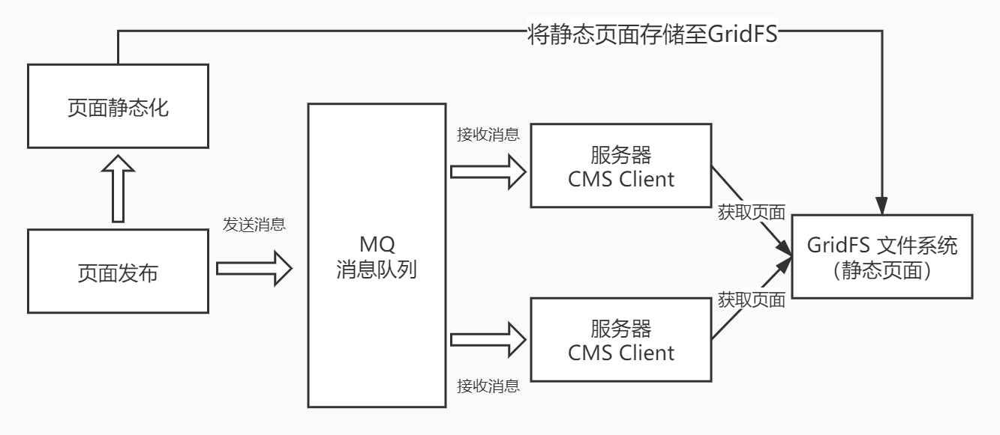

# Day05 消息中间件 RabbitMQ

## 1. 页面发布
### 1.1. 需求分析

业务流程如下

1. 管理员进入管理界面点击“页面发布”，前端请求cms页面发布接口。
2. cms页面发布接口执行页面静态化，并将静态化页面(html文件)存储至GridFS中。
3. 静态化成功后，向消息队列发送页面发布的消息。
    - 页面发布的最终目标是将页面发布到服务器
    - 通过消息队列将页面发布的消息发送给各各服务器
4. 消息队列负责将消息发送给各各服务器上部署的Cms Client(Cms客户端)
    - 在服务器上部署Cms Client(Cms客户端)，客户端接收消息队列的通知
5. 每个接收到页面发布消息的Cms Client从GridFS获取Html页面文件，并将Html文件存储在本地服务器
    - CmsClient根据页面发布消息的内容请求GridFS获取页面文件，存储在本地服务器

## 2. RabbitMQ 研究

要实现上边页面发布的功能，有一个重要的环节就是由消息队列将页面发布的消息通知给各各服务器。

1. 理解MQ的应用场景
2. 理解MQ常用的工作模式

详细参考 “学成在线-RabbitMQ研究v1.1.pdf”。或自己整理的笔记`code-learning-note\07-分布式架构&微服务架构\03-分布式消息中件间\03-RabbitMQ.md`

