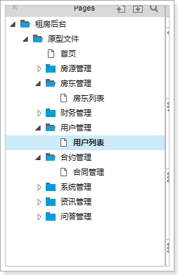
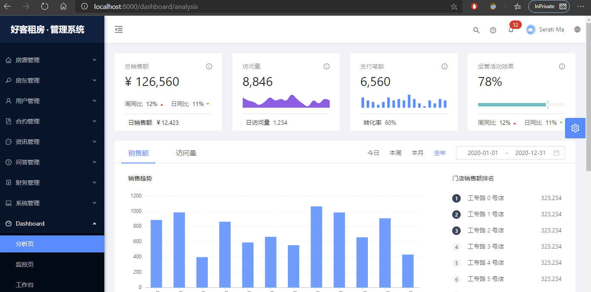
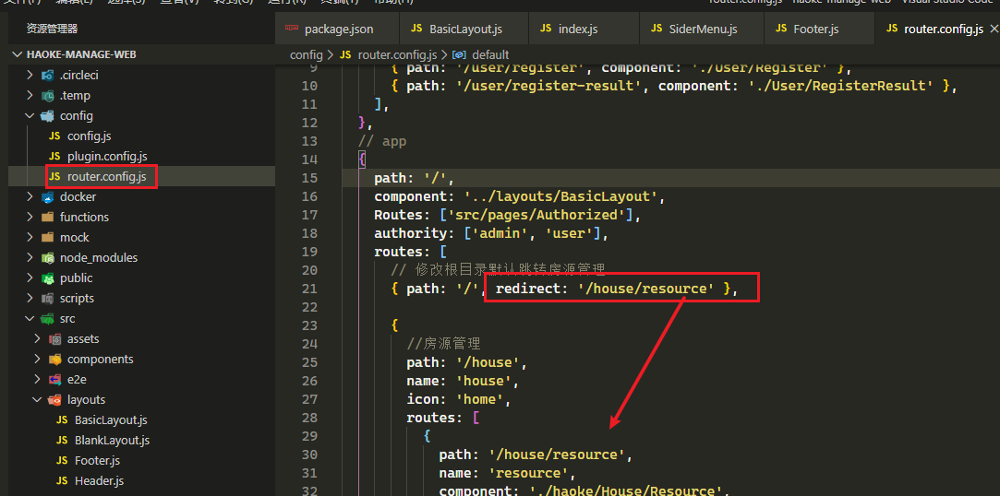
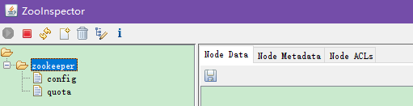
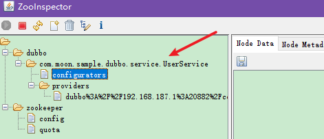
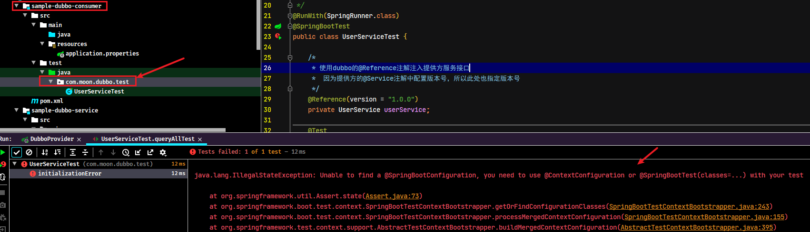
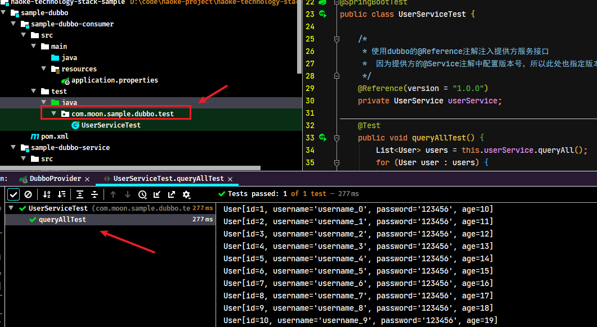

# Day03-项目介绍以及开发后台系统

## 1. 好客租房

### 1.1. 项目背景

详情查看项目资料

### 1.2. 项目介绍

详情查看项目资料

### 1.3. 技术架构

- 后端架构：SpringBoot + StringMVC + Dubbo + Mybatis + ELK + 区块链
- 前端架构：React.js + html5 + 百度地图 + 微信小程序

### 1.4. 系统架构图


## 2. 后台系统搭建

后台系统采用的是前后端分离开发模式，前端使用Ant Design Pro系统作为模板进行改造，后端采用的是SpringBoot+StringMVC+Dubbo+Mybatis的架构进行开发。

### 2.1. 前端搭建

根据前面的Ant Design Pro的入门知识，参考《好客租房 PRD 文档 V1.0.0beat.docx》、《好客租房后台V1.0.0.rp》，将系统的菜单、页面等做改造。



#### 2.1.1. 创建工程

- 第一步，将资料文件中的haoke-manage-web.zip解压项目开发的目录
- 第二步，导入到开发IDE中，本项目使用vsCode开发
- 第三步，到前端项目的目录下，执行命令导入相关的依赖

```bash
npm install # 安装依赖
npm start # 启动项目

# 如果安装了tyarn，也可以使用以下命令
#tyarn install #安装相关依赖
#tyarn start #启动服务
```



#### 2.1.2. 关于此工程提交git报错问题的解决方法

> ps: 如果提交到git的时候报错如下
>
> `husky > pre-commit hook failed (add --no-verify to bypass)`
>
> 这个问题是因为当你在终端输入git commit -m "XXX",提交代码的时候,pre-commit(客户端)钩子，它会在Git键入提交信息前运行做代码风格检查。如果代码不符合相应规则，则报错，而它的检测规则就是根据.git/hooks/pre-commit文件里面的相关定义。
>
> 解决方案有三种(推荐使用第3种方式，不需要删除package.json的依赖)：
>
> 1. 卸载husky。只要把项目的package.json文件中devDependencies节点下的husky库删掉，然后重新npm i 一次即可。或者直接在项目根目录下执行`npm uninstall husky --save`也可以，再次提交，自动化测试功能就屏蔽掉
> 2. 进入项目的.git文件夹(文件夹默认隐藏，可先设置显示或者命令ls查找)，再进入hooks文件夹，删除pre-commit文件，重新`git commit -m 'xxx' git push`即可。
> 3. 将`git commit -m "XXX"` 改为 `git commit --no-verify -m "XXX"`

第3种方案的简易操作是：使用git图形化操作客户端sourcetree，点选


#### 2.1.3. 示例操作 - 修改logo以及版权信息

- 全局的布局文件


- 查看代码，左侧的菜单是自定义组件：

```jsx
// 这里是导入侧边栏组件
import SiderMenu from '@/components/SiderMenu';

{/* 项目的侧边栏是一个自定义组件 */}
{isTop && !isMobile ? null : (
  <SiderMenu
    logo={logo}
    Authorized={Authorized}
    theme={navTheme}
    onCollapse={this.handleMenuCollapse}
    menuData={menuData}
    isMobile={isMobile}
    {...this.props}
  />
)}
```

- 查看/components/SiderMenu文件，找到logo的位置


- 使用同样的方式找到定义底部信息的位置，在Footer.js文件中修改版权信息

```jsx
import React, { Fragment } from 'react';
import { Layout, Icon } from 'antd';
import GlobalFooter from '@/components/GlobalFooter';

const { Footer } = Layout;
const FooterView = () => (
  <Footer style={{ padding: 0 }}>
    <GlobalFooter
      copyright={
        <Fragment>
          Copyright <Icon type="copyright" /> 2020 MooNkirA 实践项目
        </Fragment>
      }
    />
  </Footer>
);
export default FooterView;
```

#### 2.1.4. 编写左侧菜单

- 根据需求文档，修改左侧的菜单。（参考项目代码：\haoke-project-ui\haoke-manage-web\config\router.config.js）
- 在src/pages目录下创建haoke文件夹，项目中的页面代码均放在此目录中


- 修改，进入系统后，默认打开房源管理页面



### 2.2. 新增房源

#### 2.2.1. 数据结构

参考资料中的《前后端开发接口文档.md》文档

#### 2.2.2. 编写页面

根据需求文档以及数据结构，找到对应的页面（src\pages\haoke\House\AddResource.js）进行编码，此部分主要认识一下表单组件的多种示例使用

##### 2.2.2.1. form组件

开发时可以参考form组件官方文档：https://ant.design/components/form-cn/

- 在页面中，通过`Form.create()`对页面进行了包装，包装之后，会在this.props中增加form对象，该对象将包含有很多API方法（*详见官方文档*）
- 在from表单中，需要通过getFieldDecorator（表单数据双向绑定）方法进行包装注册，才能获取到其值。（*用法参考官方文档*）

> 被设置了 `name` 属性的 `Form.Item` 包装的控件，表单控件会自动添加 `value`（或 `valuePropName` 指定的其他属性） `onChange`（或 `trigger` 指定的其他属性），数据同步将被 `Form` 接管，这会导致以下结果：
>
> 1. 你不再需要也不应该用 `onChange` 来做数据收集同步（你可以使用 Form 的 `onValuesChange`），但还是可以继续监听 `onChange` 事件。
> 2. 你不能用控件的 `value` 或 `defaultValue` 等属性来设置表单域的值，默认值可以用 Form 里的 `initialValues` 来设置。注意 `initialValues` 不能被 `setState` 动态更新，你需要用 `setFieldsValue` 来更新。
> 3. 你不应该用 `setState`，可以使用 `form.setFieldsValue` 来动态改变表单值。

- from表单输入项校验：在getFieldDecorator的参数中可以增加校验规则

##### 2.2.2.2. 表单提交

- 表单的提交通过submit按钮完成，通过onSubmit方法进行拦截处理
- 通过`form.validateFieldsAndScroll()`对表单进行校验，通过`values`获取表单中输入的值。通过`dispatch()`调用model中定义的方法

##### 2.2.2.3. 自动完成

- 功能实现参考官方文档：https://ant.design/components/auto-complete-cn/

##### 2.2.2.4. 图片上传

- 图片上传通过自定义组件PicturesWall完成，在PicturesWall中，通过Upload组件实现。
- 在代码实现中，需要解决的问题是：父组件如何获取子组件中的数据。
- 解决思路：父组件通过属性的方式进行引用子组件，在bind方法中改变this的引用为父组件，在子组件中，通过this.props获取传入的函数，进行调用，即可把数据传递到父组件中。

父组件引用子组件，绑定属性handleFileList相应的方法


当子组件中的handleChange方法执行时，就调用到props中父组件通过属性传入的handleFileList方法


父组件中的handleFileList方法，获取子组件传递的数据

```js
handleFileList = obj => {
    console.log(obj, '图片列表');
};
```

## 3. 后台系统服务

前端系统已经搭建完成，需要后台系统为其提供接口服务。如：新增房源、房源列表、房东列表等。

### 3.1. 架构


说明：在后台服务的架构中，采用了RPC+微服务的架构思想，RPC采用dubbo框架作为服务治理框架，对外接口采用RESTful和GraphQL接口方式。

### 3.2. dubbo框架介绍

#### 3.2.1. 什么是dubbo?

- Apache Dubbo™ (incubating)是一款高性能Java RPC框架。官网：http://dubbo.apache.org/zh-cn/index.html
- dubbo是由阿里团队开发的一款优秀的RPC框架，目前由Apache管理的框架

早期的相关介绍

> DUBBO是一个分布式服务框架，致力于提供高性能和透明化的RPC远程服务调用方案，是阿里巴巴SOA服务化治理方案的核心框架，每天为2,000+个服务提供3,000,000,000+次访问量支持，并被广泛应用于阿里巴巴集团的各成员站点。
>
> Dubbo是Alibaba开源的分布式服务框架，它最大的特点是按照分层的方式来架构，使用这种方式可以使各个层之间解耦合（或者最大限度地松耦合）。从服务模型的角度来看，Dubbo采用的是一种非常简单的模型，要么是提供方提供服务，要么是消费方消费服务，所以基于这一点可以抽象出服务提供方（Provider）和服务消费方（Consumer）两个角色。关于注册中心、协议支持、服务监控等内容。

什么是RPC？


#### 3.2.2. 框架说明
##### 3.2.2.1. 背景

随着互联网的发展，网站应用的规模不断扩大，常规的垂直应用架构已无法应对，分布式服务架构以及流动计算架构势在必行，亟需一个治理系统确保架构有条不紊的演进。


- 单一应用架构

当网站流量很小时，只需一个应用，将所有功能都部署在一起，以减少部署节点和成本。此时，用于简化增删改查工作量的数据访问框架(ORM)是关键。

- 垂直应用架构

当访问量逐渐增大，单一应用增加机器带来的加速度越来越小，将应用拆成互不相干的几个应用，以提升效率。此时，用于加速前端页面开发的Web框架(MVC)是关键。

- 分布式服务架构

当垂直应用越来越多，应用之间交互不可避免，将核心业务抽取出来，作为独立的服务，逐渐形成稳定的服务中心，使前端应用能更快速的响应多变的市场需求。此时，用于提高业务复用及整合的分布式服务框架(RPC)是关键。

- 流动计算架构

当服务越来越多，容量的评估，小服务资源的浪费等问题逐渐显现，此时需增加一个调度中心基于访问压力实时管理集群容量，提高集群利用率。此时，用于提高机器利用率的资源调度和治理中心(SOA)是关键。

##### 3.2.2.2. 需求


在大规模服务化之前，应用可能只是通过 RMI 或 Hessian 等工具，简单的暴露和引用远程服务，通过配置服务的URL地址进行调用，通过 F5 等硬件进行负载均衡。

**当服务越来越多时，服务 URL 配置管理变得非常困难，F5 硬件负载均衡器的单点压力也越来越大**。 此时需要一个服务注册中心，动态的注册和发现服务，使服务的位置透明。并通过在消费方获取服务提供方地址列表，实现软负载均衡和 Failover，降低对 F5 硬件负载均衡器的依赖，也能减少部分成本。

**当进一步发展，服务间依赖关系变得错踪复杂，甚至分不清哪个应用要在哪个应用之前启动，架构师都不能完整的描述应用的架构关系**。这时，需要自动画出应用间的依赖关系图，以帮助架构师理清理关系。

**接着，服务的调用量越来越大，服务的容量问题就暴露出来，这个服务需要多少机器支撑？什么时候该加机器？**为了解决这些问题，第一步，要将服务现在每天的调用量，响应时间，都统计出来，作为容量规划的参考指标。其次，要可以动态调整权重，在线上，将某台机器的权重一直加大，并在加大的过程中记录响应时间的变化，直到响应时间到达阈值，记录此时的访问量，再以此访问量乘以机器数反推总容量。

以上是 Dubbo 最基本的几个需求

##### 3.2.2.3. Dubbo的架构


**节点角色说明**

| 节点      | 角色说明                               |
| --------- | -------------------------------------- |
| Provider  | 暴露服务的服务提供方                   |
| Consumer  | 调用远程服务的服务消费方               |
| Registry  | 服务注册与发现的注册中心               |
| Monitor   | 统计服务的调用次数和调用时间的监控中心 |
| Container | 服务运行容器                           |

**调用关系说明**

1. 服务容器负责启动，加载，运行服务提供者。
2. 服务提供者在启动时，向注册中心注册自己提供的服务。
3. 服务消费者在启动时，向注册中心订阅自己所需的服务。
4. 注册中心返回服务提供者地址列表给消费者，如果有变更，注册中心将基于长连接推送变更数据给消费者。
5. 服务消费者，从提供者地址列表中，基于软负载均衡算法，选一台提供者进行调用，如果调用失败，再选另一台调用。
6. 服务消费者和提供者，在内存中累计调用次数和调用时间，定时每分钟发送一次统计数据到监控中心

Dubbo 架构具有以下几个特点，分别是连通性、健壮性、伸缩性、以及向未来架构的升级性。更多介绍参见：http://dubbo.apache.org/zh-cn/docs/user/preface/architecture.html

#### 3.2.3. 注册中心

dubbo支持多种注册中心，推荐使用ZooKeeper。参考文档：http://dubbo.apache.org/zh-cn/docs/user/references/registry/introduction.html

Zookeeper 是 Apacahe Hadoop 的子项目，是一个树型的目录服务，支持变更推送，适合作为 Dubbo 服务的注册中心，工业强度较高，可用于生产环境，并推荐使用。


流程说明：

- 服务提供者启动时: 向 `/dubbo/com.foo.BarService/providers` 目录下写入自己的 URL 地址
- 服务消费者启动时: 订阅 `/dubbo/com.foo.BarService/providers` 目录下的提供者 URL 地址。并向 `/dubbo/com.foo.BarService/consumers` 目录下写入自己的 URL 地址
- 监控中心启动时: 订阅 `/dubbo/com.foo.BarService` 目录下的所有提供者和消费者 URL 地址。

支持以下功能：

- 当提供者出现断电等异常停机时，注册中心能自动删除提供者信息
- 当注册中心重启时，能自动恢复注册数据，以及订阅请求
- 当会话过期时，能自动恢复注册数据，以及订阅请求
- 当设置 `<dubbo:registry check="false" />` 时，记录失败注册和订阅请求，后台定时重试
- 可通过 `<dubbo:registry username="admin" password="1234" />` 设置 zookeeper 登录信息
- 可通过 `<dubbo:registry group="dubbo" />` 设置 zookeeper 的根节点，不配置将使用默认的根节点。
- 支持 `*` 号通配符 `<dubbo:reference group="*" version="*" />`，可订阅服务的所有分组和所有版本的提供者

##### 3.2.3.1. 部署 ZooKeeper

本项目使用docker容器化技术进行部署ZooKeeper。之所以采用docker部署的形式，是考虑到微服务节点的部署，以及后续的集群扩展的便捷性。

> 项目资料使用的环境：ubuntu-16.04.3 + docker 17.03.2-ce
>
> 参考资料中的《VMware Workstation 中安装 Ubuntu16.04 虚拟机.docx》文档进行安装，统一环境。

##### 3.2.3.2. docker安装zookeeper的相关命令

```shell
# 拉取zk镜像
docker pull zookeeper:3.5

# 创建容器
docker create --name zk -p 2181:2181 zookeeper:3.5

# 启动容器
docker start zk
```

使用ZooInspector图形化客户端软件测试是否部署成功（软件的位置07-编程工具资料\03-Java相关框架+源代码\zookeeper-注册中心\Zookeeper图形化客户端\ZooInspector）



### 3.3. dubbo快速入门示例

#### 3.3.1. 聚合项目

##### 3.3.1.1. 创建工程，配置依赖

创建pom聚合项目sample-dubbo，修改pom.xml文件引用示例项目公共依赖

```xml
<?xml version="1.0" encoding="UTF-8"?>

<project xmlns="http://maven.apache.org/POM/4.0.0" xmlns:xsi="http://www.w3.org/2001/XMLSchema-instance"
         xsi:schemaLocation="http://maven.apache.org/POM/4.0.0 http://maven.apache.org/xsd/maven-4.0.0.xsd">
    <parent>
        <artifactId>haoke-technology-stack-sample</artifactId>
        <groupId>com.moon</groupId>
        <version>1.0-SNAPSHOT</version>
    </parent>

    <modelVersion>4.0.0</modelVersion>
    <artifactId>sample-dubbo</artifactId>
    <name>${project.artifactId}</name>
    <packaging>pom</packaging>
    <description>技术栈示例 - dubbo</description>

    <!-- 版本号 -->
    <properties>
        <dubbo-starter.version>0.2.0</dubbo-starter.version>
        <dubbo.version>2.6.4</dubbo.version>
        <zookeeper.version>3.4.13</zookeeper.version>
        <zkclient.version>0.1</zkclient.version>

        <!-- 本项目的版本号 -->
        <project.version>1.0-SNAPSHOT</project.version>
    </properties>

    <!-- 版本控制 -->
    <dependencyManagement>
        <dependencies>
            <!-- dubbo的springboot依赖(这也包含了dubbo的依赖，下面单独指定可使用更新的版本) -->
            <dependency>
                <groupId>com.alibaba.boot</groupId>
                <artifactId>dubbo-spring-boot-starter</artifactId>
                <version>${dubbo-starter.version}</version>
            </dependency>

            <!-- dubbo依赖 -->
            <dependency>
                <groupId>com.alibaba</groupId>
                <artifactId>dubbo</artifactId>
                <version>${dubbo.version}</version>
            </dependency>

            <!-- zookeeper -->
            <dependency>
                <groupId>org.apache.zookeeper</groupId>
                <artifactId>zookeeper</artifactId>
                <version>${zookeeper.version}</version>
            </dependency>
            <!-- zookeeper客户端依赖 -->
            <dependency>
                <groupId>com.github.sgroschupf</groupId>
                <artifactId>zkclient</artifactId>
                <version>${zkclient.version}</version>
            </dependency>
        </dependencies>
    </dependencyManagement>

    <!-- 项目公共依赖部分 -->
    <dependencies>
        <!-- dubbo的springboot依赖 -->
        <dependency>
            <groupId>com.alibaba.boot</groupId>
            <artifactId>dubbo-spring-boot-starter</artifactId>
        </dependency>

        <!-- dubbo依赖 -->
        <dependency>
            <groupId>com.alibaba</groupId>
            <artifactId>dubbo</artifactId>
        </dependency>

        <!-- zookeeper注册中心的依赖 -->
        <dependency>
            <groupId>org.apache.zookeeper</groupId>
            <artifactId>zookeeper</artifactId>
        </dependency>
        <!-- zookeeper客户端依赖 -->
        <dependency>
            <groupId>com.github.sgroschupf</groupId>
            <artifactId>zkclient</artifactId>
        </dependency>

        <!-- SpringBoot测试 -->
        <dependency>
            <groupId>org.springframework.boot</groupId>
            <artifactId>spring-boot-starter-test</artifactId>
            <scope>test</scope>
        </dependency>
    </dependencies>

    <!-- 项目构造部分 -->
    <build>
        <plugins>
            <!-- 添加springboot的maven插件 -->
            <plugin>
                <groupId>org.springframework.boot</groupId>
                <artifactId>spring-boot-maven-plugin</artifactId>
            </plugin>
        </plugins>
    </build>
</project>
```

> 注：这里的haoke-technology-stack-sample项目是整个好客租房技术栈示例项目的聚合工程，里面引入了`spring-boot-starter-parent`的依赖，版本为`2.1.0.RELEASE`

#### 3.3.2. 服务提供方工程

##### 3.3.2.1. 创建项目，配置依赖

创建`sample-dubbo-service`项目，打包方式选jar类型。修改maven项目pom.xml文件添加依赖

```xml
<?xml version="1.0" encoding="UTF-8"?>
<project xmlns="http://maven.apache.org/POM/4.0.0"
         xmlns:xsi="http://www.w3.org/2001/XMLSchema-instance"
         xsi:schemaLocation="http://maven.apache.org/POM/4.0.0 http://maven.apache.org/xsd/maven-4.0.0.xsd">
    <parent>
        <groupId>com.moon</groupId>
        <artifactId>sample-dubbo</artifactId>
        <version>1.0-SNAPSHOT</version>
    </parent>

    <modelVersion>4.0.0</modelVersion>
    <artifactId>sample-dubbo-service</artifactId>
    <name>${project.artifactId}</name>
    <packaging>jar</packaging>
    <description>dubbo服务提供方示例工程</description>

    <!-- 引入依赖 -->
    <dependencies>
        <!-- springboot依赖，非web项目 -->
        <dependency>
            <groupId>org.springframework.boot</groupId>
            <artifactId>spring-boot-starter</artifactId>
        </dependency>
    </dependencies>

</project>
```

> *注： 此示例为了简化重复依赖配置，将dubbo与zookeeper的依赖都配置在聚合工程中。实际项目会有很多其他模块、公共的工程，此时就不能将这些dubbo与zookeeper的依赖都配置在聚合工程中*

##### 3.3.2.2. 创建实体对象

创建用于测试dubbo调用接口时传输的封装的实体类。<font color=red>**注：dubbo框架接口调用用来传输数据的对象必须实现序列化接口`java.io.Serializable`**</font>

```java
// 注：使用dubbo传输的对象要求必须实现序列化接口
public class User implements Serializable {
    private static final long serialVersionUID = -7786052938617694652L;
    private Long id;
    private String username;
    private String password;
    private Integer age;
    // 省略setter/getter....
}
```

##### 3.3.2.3. 创建提供服务的接口与实现类

- 创建UserService（接口）提供查询服务

```java
public interface UserService {
    /**
     * 查询所有的用户数据
     */
    List<User> queryAll();

}
```

- 创建UserServiceImpl实现类

```java
/*
 * 声明这是一个dubbo服务实现。
 *   注：此@Service注解是dubbo框架的，非spring框架
 *   此version属性用来标识接口实现的版本号，一个接口有多个不同版本的实现，
 *   方便消费者调用不同的版本的实现
 */
@Service(version = "${dubbo.service.version}")
public class UserServiceImpl implements UserService {
    /**
     * 实现查询，这里做模拟实现，不做具体的数据库查询
     */
    @Override
    public List<User> queryAll() {
        List<User> list = new ArrayList<>();
        for (int i = 0; i < 10; i++) {
            User user = new User();
            user.setAge(10 + i);
            user.setId(Long.valueOf(i + 1));
            user.setPassword("123456");
            user.setUsername("username_" + i);
            list.add(user);
        }
        System.out.println("---------UserServiceImpl.queryAll()方法执行------------");
        return list;
    }
}
```

##### 3.3.2.4. 编写项目配置文件

编写SpringBoot项目的`application.properties`配置文件

```properties
# Spring boot application
spring.application.name=sample-dubbo-service
server.port=9090
# dubbo服务接口版本号
dubbo.service.version=1.0.0
# 服务的扫描包
dubbo.scan.basePackages=com.moon.sample.dubbo.service
# dubbo应用名称
dubbo.application.name=dubbo-provider-demo
# dubbo的协议以及端口
dubbo.protocol.name=dubbo
dubbo.protocol.port=20882
# zk注册中心
dubbo.registry.address=zookeeper://192.168.12.134:2181
dubbo.registry.client=zkclient
```

##### 3.3.2.5. 编写启动类

```java
@SpringBootApplication
public class DubboProvider {
    public static void main(String[] args) {
        new SpringApplicationBuilder(DubboProvider.class)
                .web(WebApplicationType.NONE) // 配置非web应用
                .run(args);
    }
}
```

运行启动类，启动项目后查看zk客户端中相关信息：UserService服务已经注册到zk中了




#### 3.3.3. 服务消费方工程

##### 3.3.3.1. 创建工程，配置依赖

创建`sample-dubbo-consumer`项目，打包方式选jar类型。修改maven项目pom.xml文件添加依赖

```xml
<?xml version="1.0" encoding="UTF-8"?>
<project xmlns="http://maven.apache.org/POM/4.0.0"
         xmlns:xsi="http://www.w3.org/2001/XMLSchema-instance"
         xsi:schemaLocation="http://maven.apache.org/POM/4.0.0 http://maven.apache.org/xsd/maven-4.0.0.xsd">
    <parent>
        <groupId>com.moon</groupId>
        <artifactId>sample-dubbo</artifactId>
        <version>1.0-SNAPSHOT</version>
    </parent>

    <modelVersion>4.0.0</modelVersion>
    <artifactId>sample-dubbo-consumer</artifactId>
    <name>${project.artifactId}</name>
    <packaging>jar</packaging>
    <description>dubbo服务消费方示例工程</description>

    <dependencies>
        <!-- springboot依赖，非web项目 -->
        <dependency>
            <groupId>org.springframework.boot</groupId>
            <artifactId>spring-boot-starter</artifactId>
        </dependency>
        <!-- 引入提供者工程的依赖（注：这里只是为了引入其接口，非实现类） -->
        <dependency>
            <groupId>com.moon</groupId>
            <artifactId>sample-dubbo-service</artifactId>
            <version>${project.version}</version>
        </dependency>
    </dependencies>

</project>
```

##### 3.3.3.2. 编写项目配置文件

编写SpringBoot项目的`application.properties`配置文件，增加项目与dubbo相关配置

```properties
# Spring boot application
spring.application.name=sample-dubbo-consumer
server.port=9091
# dubbo应用名称
dubbo.application.name=dubbo-consumer-demo
# zk注册中心配置信息
dubbo.registry.address=zookeeper://192.168.12.134:2181
dubbo.registry.client=zkclient
```

##### 3.3.3.3. 编写测试用例

```java
@RunWith(SpringRunner.class)
@SpringBootTest
public class UserServiceTest {
    /*
     * 使用dubbo的@Reference注解注入提供方服务接口
     *  因为提供方的@Service注解中配置版本号，所以此处也指定版本号
     */
    @Reference(version = "1.0.0")
    private UserService userService;

    @Test
    public void queryAllTest() {
        List<User> users = this.userService.queryAll();
        for (User user : users) {
            System.out.println(user);
        }
    }
}
```

运行测试，可以获取到数据，说明已经成功调用了service中提供的接口

##### 3.3.3.4. 写代码时遇到的小坑

因为消费者工程里只写了测试用例，没有编写启动类与配置类，但工程依赖了提供者工程，而提供者工程是有springboot的启动类，那里会默认扫描启动类所在包及其子包。

所以当时在做这个示例的时候，消费者的测试用例类的包路径与提供者工程的启动类所在包路径不一样，导致了运行测试用例时，会报 `Unable to find a @SpringBootConfiguration, you need to use @ContextConfiguration or @SpringBootTest(classes=...) with your test`的报错。



修改包路径后，测试成功



### 3.4. Dubbo Admin

Dubbo Admin 是 Dubbo 提供了可视化的界面管理工具，方便对服务进行管理

