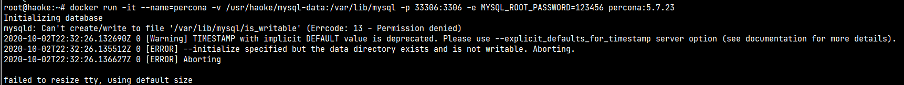

# Day04-后台服务的搭建与实现以及MybatisPlus的入门

## 1. 使用Docker安装MySQL

好客租房项目的底层数据库采用MySQL，而MySQL采用衍生版本Percona，并且采用docker容器化的方式进行部署

### 1.1. 什么是percona？

Percona 为 MySQL 数据库服务器进行了改进，在功能和性能上较 MySQL 有着很显著的提升。该版本提升了在高负载情况下的 InnoDB 的性能、为 DBA 提供一些非常有用的性能诊断工具；另外有更多的参数和命令来控制服务器行为。

Percona Server 只包含 MySQL 的服务器版，并没有提供相应对 MySQL 的 Connector 和 GUI 工具进行改进。

Percona Server 使用了一些 google-mysql-tools, Proven Scaling, Open Query 对 MySQL 进行改造。

官网：https://www.percona.com/software/mysql-database

### 1.2. 安装部署

#### 1.2.1. 拉取镜像

```bash
#镜像地址：https://hub.docker.com/_/percona/
docker pull percona:5.7.23
```

#### 1.2.2. 创建容器

```bash
docker create --name percona -v /usr/haoke/mysql-data:/var/lib/mysql -p 3306:3306 -e MYSQL_ROOT_PASSWORD=123456 percona:5.7.23
```

参数解释：

- `--name percona`：指定是容器的名称
- `-v /usr/haoke/mysql-data:/var/lib/mysql`：将主机目录`/usr/haoke/mysql-data`挂载到容器的`/var/lib/mysql`上
- `-p 3306:3306`：设置端口映射，主机端口是33306，容器内部端口3306
- `-e MYSQL_ROOT_PASSWORD=123456`：设置容器参数，这里是设置mysql的root用户的密码为123456
- `percona:5.7.23`：镜像名:版本号

#### 1.2.3. 启动容器

```bash
docker start percona
# 查看docker的运行情况
docker ps -a
```

使用数据库的图形化客户端测试是否成功连接

#### 1.2.4. 另一种方式：守护式容器（后台运行。使用exit退出时，容器不会停止）

```bash
docker run -it --name=percona -v /usr/haoke/mysql-data:/var/lib/mysql --privileged=true -p 33306:3306 -e MYSQL_ROOT_PASSWORD=123456 percona:5.7.23
```

#### 1.2.5. 部署遇到的问题

创建容器时的报错信息，容器是创建成功，但是无法运行



从网上查询资料后，应该是因为 docker 容器在宿主机的 `$PWD/data` 里没有写权限。所以直接给挂载的目录改变权限。

```bash
chmod 777 /usr/haoke/mysql-data/
```

## 2. MybatisPlus入门

在后台系统服务的开发过程中，必然要和数据库进行交互，在本项目中，ORM这一层的技术选型采用Mybatis框架作为持久层框架。为了提升开发的效率，所以选用MybatisPlus作为mybatis的插件

> MybatisPlus快速入门示例与基本使用的笔记，详见《》


