# Day05-阿里云OSS以及GraphQL入门

## 1. 图片存储解决方案

在新增房源功能中，需要上传图片，其实在整个项目中有很多功能模块需要上传图片，所以，需要开发一个上传图片的服务。

开发一个图片上传服务，需要有存储的支持，解决方案将以下几种：

1. 直接将图片保存到服务的硬盘
    - 优点：开发便捷，成本低
    - 缺点：扩容困难
2. 使用分布式文件系统进行存储
    - 优点：容易实现扩容
    - 缺点：开发复杂度稍大（尤其是开发复杂的功能）
3. 使用nfs做存储
    - 优点：开发较为便捷
    - 缺点：需要有一定的运维知识进行部署和维护
4. 使用第三方的存储服务
    - 优点：开发简单，拥有强大功能，免维护
    - 缺点：付费

本项目采用第1、4种解决方案，第三方服务选用阿里云的OSS服务

## 2. 阿里云OSS存储

### 2.1. OSS服务简介

> 海量、安全、低成本、高可靠的云存储服务，提供99.9999999999%(12个9)的数据持久性。使用RESTful API 可以在互联网任何位置存储和访问，容量和处理能力弹性扩展，多种存储类型供选择全面优化存储成本。

服务地址：https://www.aliyun.com/product/oss?spm=a2c4g.11186623.cloudEssentials.19.60f81c62VrnDMR

### 2.2. 购买服务

说明：OSS的上行流量是免费的，但是下行流量是需要购买的

### 2.3. OSS基础使用

#### 2.3.1. 创建Bucket

使用OSS，首先需要创建Bucket。登陆阿里云后进入控制台，https://oss.console.aliyun.com/overview

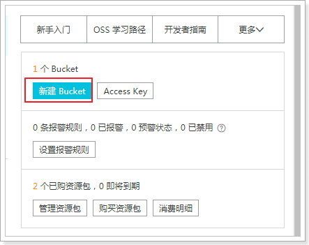

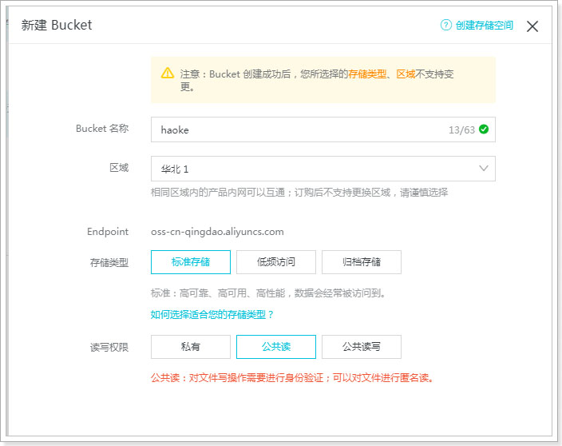

创建完成后，在左侧可以看到已经创建好的Bucket：

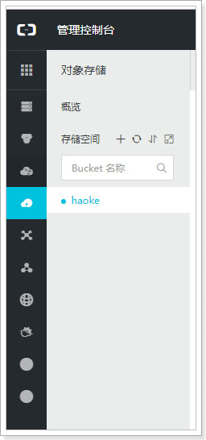

选择Bucket后，即可看到对应的信息，如：url、消耗流量等

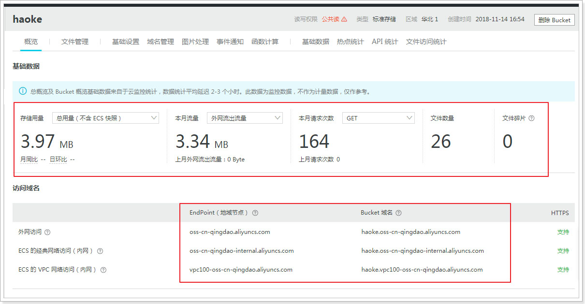

#### 2.3.2. 管理文件

可以通过在线的方式进行管理文件：

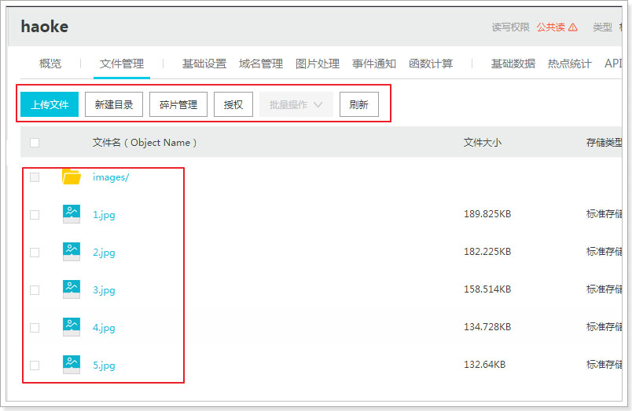

### 2.4. 代码实现图片上传到OSS（代码为示例，不能实现真实功能）

在`haoke-manage-api-server`工程中实现图片上传功能，以供其他服务使用

#### 2.4.1. 导入oss的sdk依赖

修改`haoke-manage-api-server`工程有pom.xml文件，引入依赖

```xml
<!-- 阿里云oss sdk包依赖 -->
<dependency>
    <groupId>com.aliyun.oss</groupId>
    <artifactId>aliyun-sdk-oss</artifactId>
    <version>2.8.3</version>
</dependency>
<dependency>
    <groupId>org.projectlombok</groupId>
    <artifactId>lombok</artifactId>
    <version>1.18.4</version>
</dependency>
<dependency>
    <groupId>joda-time</groupId>
    <artifactId>joda-time</artifactId>
    <version>2.9.9</version>
</dependency>
```

#### 2.4.2. 编写aliyun.properties配置文件

> `accessKeyId`以及`accessKeySecret`获取参考官方文档：https://help.aliyun.com/knowledge_detail/48699.html

```properties
aliyun.endpoint=http://oss-cn-qingdao.aliyuncs.com
aliyun.accessKeyId=LTAIfC7fUsPj7Rfq
aliyun.accessKeySecret=c2Vo3q1AmivtY8lxFnfsCfkO2c2HCk
aliyun.bucketName=haoke
aliyun.urlPrefix=http://haoke.oss-cn-qingdao.aliyuncs.com/
```

#### 2.4.3. 编写oss的配置类

```java
package com.moon.haoke.dubbo.api.config;

import com.aliyun.oss.OSSClient;
import org.springframework.beans.factory.annotation.Value;
import org.springframework.context.annotation.Bean;
import org.springframework.context.annotation.Configuration;
import org.springframework.context.annotation.PropertySource;

/**
 * 阿里云oss服务的相关配置类
 */
@Configuration
@PropertySource("classpath:aliyun.properties")
/*
 * 读取配置文件注入属性方式二：
 *  使用@ConfigurationProperties注解，定义属性prefix为读取的配置文件中的Key的前缀
 *  这种方式不需要再使用@Value注解注入值，但要求需要注入的属性必须提供setter方法
 */
// @ConfigurationProperties(prefix = "aliyun")
public class AliyunConfig {
    @Value("${aliyun.endpoint}")
    private String endpoint;
    @Value("${aliyun.accessKeyId}")
    private String accessKeyId;
    @Value("${aliyun.accessKeySecret}")
    private String accessKeySecret;
    @Value("${aliyun.bucketName}")
    private String bucketName;
    @Value("${aliyun.urlPrefix}")
    private String urlPrefix;

    // 创建oSSClint
    @Bean
    public OSSClient oSSClient() {
        return new OSSClient(endpoint, accessKeyId, accessKeySecret);
    }

    public String getBucketName() {
        return bucketName;
    }
    public String getUrlPrefix() {
        return urlPrefix;
    }
}
```

#### 2.4.4. 编写上传文件的响应实体类

创建`PicUploadResult`类，用于返回给前端的数据结构定义

```java
package com.moon.haoke.dubbo.api.vo;

import lombok.Data;

/**
 * 图片上传响应结果
 */
@Data
public class PicUploadResult {
    // 文件唯一标识
    private String uid;
    // 文件名
    private String name;
    // 状态有：uploading done error removed
    private String status;
    // 服务端响应内容，如：'{"status": "success"}'
    private String response;
}
```

#### 2.4.5. 编写图片上传的业务类

创建`PicUploadOSSService`类，具体的上传逻辑实现，在该类中调用了OSS客户端的API

```java
package com.moon.haoke.dubbo.api.service;

import com.aliyun.oss.OSSClient;
import com.moon.haoke.dubbo.api.config.AliyunConfig;
import com.moon.haoke.dubbo.api.vo.PicUploadResult;
import org.apache.commons.lang3.RandomUtils;
import org.apache.commons.lang3.StringUtils;
import org.joda.time.DateTime;
import org.springframework.beans.factory.annotation.Autowired;
import org.springframework.stereotype.Service;
import org.springframework.web.multipart.MultipartFile;

import java.io.ByteArrayInputStream;

/**
 * 上传图片到阿里云OSS服务的业务处理类
 */
@Service
public class PicUploadOSSService {
    // 允许上传的格式
    private static final String[] IMAGE_TYPE = new String[]{".bmp", ".jpg", ".jpeg", ".gif", ".png"};

    @Autowired
    private OSSClient ossClient;

    @Autowired
    private AliyunConfig aliyunConfig;

    // 上传文件处理
    public PicUploadResult upload(MultipartFile uploadFile) {
        // 封装Result对象，并且将文件的byte数组放置到result对象中
        PicUploadResult fileUploadResult = new PicUploadResult();

        // 图片做校验，对后缀名
        boolean isLegal = false;
        for (String type : IMAGE_TYPE) {
            if (StringUtils.endsWithIgnoreCase(uploadFile.getOriginalFilename(), type)) {
                isLegal = true;
                break;
            }
        }

        if (!isLegal) {
            fileUploadResult.setStatus("error");
            return fileUploadResult;
        }

        // 文件新路径
        String fileName = uploadFile.getOriginalFilename();
        String filePath = getFilePath(fileName);

        try {
            // 上传到阿里云，目录结构：images/2020/12/29/xxxx.jpg
            ossClient.putObject(aliyunConfig.getBucketName(), filePath,
                    new ByteArrayInputStream(uploadFile.getBytes()));
        } catch (Exception e) {
            e.printStackTrace();
            // 上传失败
            fileUploadResult.setStatus("error");
            return fileUploadResult;
        }

        // 上传成功
        fileUploadResult.setStatus("done");
        fileUploadResult.setName(this.aliyunConfig.getUrlPrefix() + filePath);
        fileUploadResult.setUid(String.valueOf(System.currentTimeMillis()));

        return fileUploadResult;
    }

    private String getFilePath(String sourceFileName) {
        DateTime dateTime = new DateTime();
        return "images/" + dateTime.toString("yyyy")
                + "/" + dateTime.toString("MM") + "/"
                + dateTime.toString("dd") + "/" + System.currentTimeMillis() +
                RandomUtils.nextInt(100, 9999) + "." +
                StringUtils.substringAfterLast(sourceFileName, ".");
    }
}
```

#### 2.4.6. 编写文件上传的控制类

```java
package com.moon.haoke.dubbo.api.controller;

import com.moon.haoke.dubbo.api.service.PicUploadOSSService;
import com.moon.haoke.dubbo.api.vo.PicUploadResult;
import org.springframework.beans.factory.annotation.Autowired;
import org.springframework.web.bind.annotation.PostMapping;
import org.springframework.web.bind.annotation.RequestMapping;
import org.springframework.web.bind.annotation.RequestParam;
import org.springframework.web.bind.annotation.RestController;
import org.springframework.web.multipart.MultipartFile;

/**
 * 图片文件上传控制器
 */
@RestController
@RequestMapping("pic/upload")
public class PicUploadController {
    // 注入上传阿里云oss服务业务处理类
    @Autowired
    private PicUploadOSSService picUploadOSSService;

    /**
     * 上传到阿里云oss服务
     *
     * @param multipartFile
     * @return
     */
    @PostMapping("aliyun")
    public PicUploadResult upload(@RequestParam("file") MultipartFile multipartFile) {
        return this.picUploadOSSService.upload(multipartFile);
    }
}
```

### 2.5. 上传图片测试

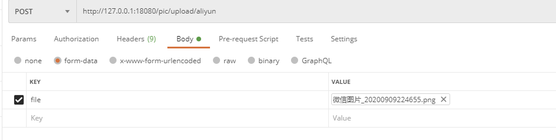

上传成功，可查看OSS中的图片信息：


### 2.6. 阿里云OSS服务 - 添加水印功能

OSS提供了在线添加水印功能：

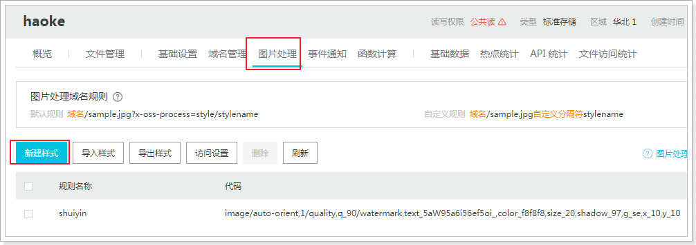

自定义规则：

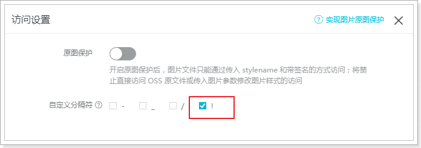

访问地址(示例)：`https://haoke.oss-cn-abc.aliyuncs.com/images/2020/12/30/15423895180629907.jpg!shuiyin`

## 3. 本地文件系统存储

### 3.1. 编写本地文件存储业务类

在`haoke-manage-api-server`工程创建`PicUploadFileSystemService`类，用于处理存储上传文件到本地文件系统的逻辑。*逻辑与上传到阿里云oss处理大部一样，只是将调用sdk上传部分改成io写图片到硬盘中*

```java
package com.moon.haoke.dubbo.api.service;

import com.moon.haoke.dubbo.api.vo.PicUploadResult;
import org.apache.commons.lang3.RandomUtils;
import org.apache.commons.lang3.StringUtils;
import org.joda.time.DateTime;
import org.springframework.stereotype.Service;
import org.springframework.web.multipart.MultipartFile;

import java.io.File;
import java.io.IOException;
import java.util.Date;

/**
 * 本地文件系统存储业务类
 */
@Service
public class PicUploadFileSystemService {
    // 允许上传的格式
    private static final String[] IMAGE_TYPE = new String[]{".bmp", ".jpg", ".jpeg", ".gif", ".png"};

    public PicUploadResult upload(MultipartFile uploadFile) {
        // 校验图片格式
        boolean isLegal = false;
        for (String type : IMAGE_TYPE) {
            if (StringUtils.endsWithIgnoreCase(uploadFile.getOriginalFilename(), type)) {
                isLegal = true;
                break;
            }
        }

        // 定义请求响应结果对象
        PicUploadResult fileUploadResult = new PicUploadResult();
        if (!isLegal) {
            fileUploadResult.setStatus("error");
            return fileUploadResult;
        }

        String fileName = uploadFile.getOriginalFilename();
        String filePath = getFilePath(fileName);
        // 生成图片的绝对引用地址
        String picUrl = StringUtils.replace(StringUtils.substringAfter(filePath,
                "E:\deployment-environment\file-server"),
                "\\", "/");
        fileUploadResult.setName("http://image.haoke.com" + picUrl);
        File newFile = new File(filePath);

        try {
            // 写文件到磁盘
            uploadFile.transferTo(newFile);
        } catch (IOException e) {
            e.printStackTrace();
            //上传失败
            fileUploadResult.setStatus("error");
            return fileUploadResult;
        }
        fileUploadResult.setStatus("done");
        fileUploadResult.setUid(String.valueOf(System.currentTimeMillis()));
        return fileUploadResult;
    }

    private String getFilePath(String sourceFileName) {
        String baseFolder = "E:\deployment-environment\file-server\haoke-upload" + File.separator + "images";
        Date nowDate = new Date();
        // yyyy/MM/dd
        String fileFolder = baseFolder + File.separator + new DateTime(nowDate).toString("yyyy")
                + File.separator + new DateTime(nowDate).toString("MM")
                + File.separator + new DateTime(nowDate).toString("dd");
        File file = new File(fileFolder);
        if (!file.isDirectory()) {
            // 如果目录不存在，则创建目录
            file.mkdirs();
        }
        // 生成新的文件名
        String fileName = new DateTime(nowDate).toString("yyyyMMddhhmmssSSSS")
                + RandomUtils.nextInt(100, 9999) + "." +
                StringUtils.substringAfterLast(sourceFileName, ".");
        return fileFolder + File.separator + fileName;
    }
}
```

### 3.2. 编写上传图片到本地存储的控制类

修改`PicUploadController`类，增加上传到本地文件存储系统的请求方法

```java
@RestController
@RequestMapping("pic/upload")
public class PicUploadController {
    // 注入上传本地文件存储系统业务处理类
    @Autowired
    private PicUploadFileSystemService picUploadFileSystemService;

    /**
     * 上传到本地文件存储系统
     *
     * @param multipartFile
     * @return
     */
    @PostMapping
    public PicUploadResult uploadToLocal(@RequestParam("file") MultipartFile multipartFile) {
        return this.picUploadFileSystemService.upload(multipartFile);
    }
}
```

### 3.3. 配置nginx访问图片目录

- 安装nginx（已安装则路过），修改配置文件，域名转发到图片文件目录，启动nginx

```
# ======================== 本机图片服务 配置模块 ===============================
server {
	listen       80;
	server_name  image.haoke.com;

	proxy_set_header X-Forwarded-Host $host;
	proxy_set_header X-Forwarded-Server $host;
	proxy_set_header Host $host;

	location / {
		   root E:\deployment-environment\file-server;
	}
}
```

> 遇到的坑：在配置nginx反向代理静态资源文件目录时，使用了带下划线的文件夹，结果无法访问静态资源

- 修改本机hosts文件，配置域名映射

```
# 好客租房项目配置域名
127.0.0.1  manage.haoke.com
127.0.0.1  image.haoke.com
```

### 3.4. 测试上传图片与域名访问

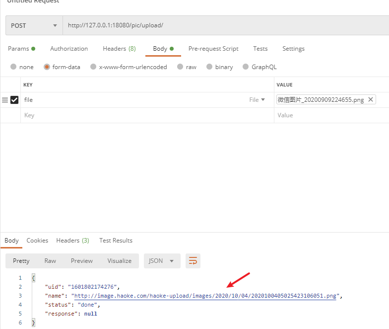

访问响应的对象中的name（url），可以访问图片

## 4. 整合新增房源前端实现图片上传

### 4.1. 修改页面上传地址

修改`haoke-manage-web`工程的`PicturesWall.js`文件中的图片上传的请求路径

```jsx
<Upload
  action="/haoke/pic/upload"
  listType="picture-card"
  fileList={fileList}
  onPreview={this.handlePreview}
  onChange={this.handleChange}
>
  {fileList.length >= 5 ? null : uploadButton}
</Upload>
```

### 4.2. 修改新增房源的页面

- 修改AddResource.js中图片上传完成的变更方法

```jsx
handleFileList = obj => {
  // 定义set集合，用于过滤重复的图片地址
  let pics = new Set();
  // 循环所有上传成功的图片
  obj.forEach((v, k) => {
    const { response } = v;
    if (response) {
      pics.add(response.name);
    }
  });
  // 更新图片地址集合
  this.setState({ pics });
};

constructor(props) {
  super(props);
  this.state = {
    estateDataSource: [],
    estateAddress: '',
    estateId: '',
    pics: [], // 图片地址数组
  };
}
```

- 修改表单提交逻辑中的图片数据的处理：

```jsx
handleSubmit = e => {
  const { dispatch, form } = this.props;
  e.preventDefault();
  form.validateFieldsAndScroll((err, values) => {
      // 省略代码....
      // 楼盘id
      values.estateId = this.state.estateId;
      // 处理图片
      values.pic = [...this.state.pics].join(',');
      dispatch({
        type: 'house/submitHouseForm',
        payload: values,
      });
    }
  });
```

### 4.3. 新增房源的测试

上传图片效果

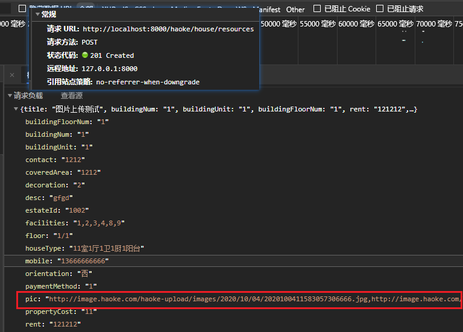

数据库生成数据

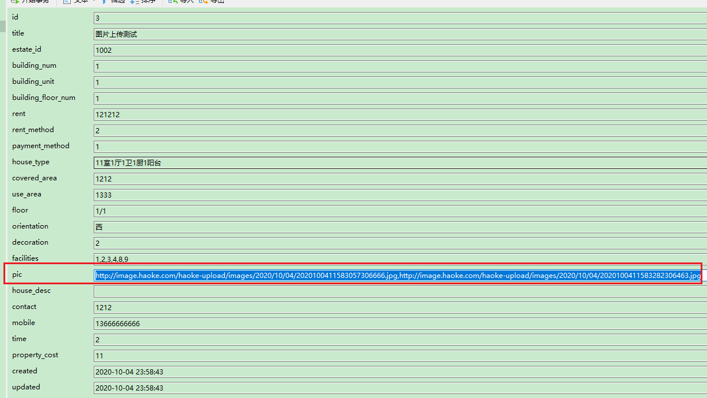

## 5. 房源列表服务

### 5.1. 定义房源列表查询服务

在`haoke-manage-server-house-resources-interface`工程中，定义用于返回的分页结果的`PageInfo`对象

```java
package com.moon.haoke.dubbo.server.vo;

import lombok.AllArgsConstructor;
import lombok.Data;

import java.util.Collections;
import java.util.List;

/**
 * 分页列表结果对象
 */
@Data
public class PageInfo<T> implements java.io.Serializable {

    private static final long serialVersionUID = -3263793888384196557L;

    /**
     * 总记录数
     */
    private Integer total;

    /**
     * 当前页
     */
    private Integer pageNum;

    /**
     * 一页显示的大小
     */
    private Integer pageSize;

    /**
     * 数据列表
     */
    private List<T> records = Collections.emptyList();
}
```

在`ApiHouseResourcesService`接口中，增加分页查询房源列表的服务接口

```java
/**
 * 分页查询房源列表
 *
 * @param page           当前页
 * @param pageSize       每页大小
 * @param queryCondition 查询条件
 * @return 数据查询分布结果
 */
PageInfo<HouseResources> queryHouseResourcesList(int page, int pageSize, HouseResources queryCondition);
```

### 5.2. 配置MyBatis-plus分页插件

修改`haoke-manage-server-house-resources-service`工程的`MybatisConfig`配置类，创建MP的分页插件注册到ioc容器中

```java
/**
 * MyBatis-puls分页插件，注册到ioc容器中
 */
@Bean
public PaginationInterceptor paginationInterceptor() {
    return new PaginationInterceptor();
}
```

### 5.3. 实现房源列表查询业务逻辑

在`haoke-manage-server-house-resources-service`工程的`ApiHouseResourcesServiceImpl`，实现新增的列表查询接口方法

```java
@Override
public PageInfo<HouseResources> queryHouseResourcesList(int page, int pageSize, HouseResources queryCondition) {
    return this.houseResourcesService.queryHouseResourcesList(page, pageSize, queryCondition);
}
```

在`BaseService`中新增`queryPageList`条件分页查询方法

```java
/**
 * 根据条件分页查询数据列表
 *
 * @param queryWrapper
 * @param page
 * @param rows
 * @return
 */
public IPage<T> queryPageList(QueryWrapper<T> queryWrapper, Integer page, Integer rows) {
    // 获取分页数据
    return this.mapper.selectPage(new Page<T>(page, rows), queryWrapper);
}
```

业务层具体查询实现

```java
/* HouseResourcesService */
PageInfo<HouseResources> queryHouseResourcesList(int page, int pageSize, HouseResources queryCondition);

/* HouseResourcesServiceImpl */
@Override
public PageInfo<HouseResources> queryHouseResourcesList(int page, int pageSize, HouseResources queryCondition) {
    // 创建条件查询器
    QueryWrapper<HouseResources> queryWrapper = new QueryWrapper<>();
    // 设置根据数据的更新时间倒序排序
    queryWrapper.orderByDesc("updated");

    // 调用条件分页查询方法
    IPage<HouseResources> iPage = super.queryPageList(queryWrapper, page, pageSize);

    // 创建返回分页结果对象
    PageInfo<HouseResources> pageInfo = new PageInfo<>();
    pageInfo.setPageNum(page);
    pageInfo.setPageSize(pageSize);
    pageInfo.setRecords(iPage.getRecords());
    pageInfo.setTotal(Integer.parseInt(String.valueOf(iPage.getTotal())));

    return pageInfo;
}
```

### 5.4. 启动服务

启动房源服务，观察是否注册成功

### 5.5. 实现查询服务的RESTful接口

- 在`haoke-manage-api-server`工程，创建查询列表返回结果实体类`TableResult`与`Pagination`

```java
package com.moon.haoke.dubbo.api.vo;

import lombok.Data;

import java.util.List;

/**
 * 列表查询结果对象
 */
@Data
public class TableResult<T> {
    /**
     * 数据列表
     */
    private List<T> list;

    /**
     * 分页信息
     */
    private Pagination pagination;
}
```

```java
package com.moon.haoke.dubbo.api.vo;

import lombok.Data;

/**
 * 分页信息实体类
 */
@Data
public class Pagination {
    /**
     * 当前页
     */
    private Integer current;

    /**
     * 每页大小
     */
    private Integer pageSize;

    /**
     * 总记录数
     */
    private Integer total;
}
```

- `HouseResourcesController`控制类中增加查询分页列表的方法

```java
/**
 * 查询房源分页列表
 *
 * @param houseResources 查询条件
 * @param currentPage    当前页
 * @param pageSize       每页大小
 * @return 查询列表结果
 */
@GetMapping
public ResponseEntity<TableResult> queryList(HouseResources houseResources,
                                             @RequestParam(name = "currentPage", defaultValue = "1") Integer currentPage,
                                             @RequestParam(name = "pageSize", defaultValue = "10") Integer pageSize) {
    TableResult<HouseResources> tableResult = this.houseResourcesService
            .queryList(houseResources, currentPage, pageSize);
    return ResponseEntity.ok(tableResult);
}
```

- 修改`HouseResourcesService`业务类，增加分页查询的方法

```java
public TableResult<HouseResources> queryList(HouseResources houseResources, Integer currentPage, Integer pageSize) {
    // 调用房源dubbo服务提供的接口，查询分页列表数据
    PageInfo<HouseResources> pageInfo = this.apiHouseResourcesService.queryHouseResourcesList(currentPage, pageSize, houseResources);

    // 创建分页信息对象
    Pagination pagination = new Pagination();
    pagination.setCurrent(currentPage);
    pagination.setPageSize(pageSize);
    pagination.setTotal(pageInfo.getTotal());

    // 创建返回列表对象
    TableResult<HouseResources> tableResult = new TableResult<>();
    tableResult.setList(pageInfo.getRecords());
    tableResult.setPagination(pagination);

    return tableResult;
}
```

- 启动服务，请求接口测试

### 5.6. 整合前端房源列表查询

#### 5.6.1. 修改请求数据地址

修改sevices包下的`houseResource.js`，定义列表查询的方法

```js
import request from '@/utils/request';
import { stringify } from 'qs';

export async function queryResource(params) {
  const queryParams = params ? `?${stringify(params)}` : '';
  return request(`/haoke/house/resources${queryParams}`);
}
```

#### 5.6.2. 修改房源列表页面显示的字段结构

修改pages/haoke/House包下的`Resource.js`，修改表格列的字段结构与格式化内容

```js
const payType = new Map([
  [1, '付一押一'],
  [2, '付三押一'],
  [3, '付六押一'],
  [4, '年付押一'],
  [5, '其它'],
]);

columns = [
  {
    title: '房源编号',
    dataIndex: 'id',
  },
  {
    title: '房源信息',
    dataIndex: 'title',
  },
  {
    title: '图',
    dataIndex: 'pic',
    render: (text, record, index) => <ShowPics pics={text} />,
  },
  {
    title: '楼栋',
    render: (text, record, index) => {
      const { buildingFloorNum, buildingNum, buildingUnit } = record;
      return `${buildingFloorNum}栋${buildingNum}单元${buildingUnit}号`;
    },
  },
  {
    title: '支付方式',
    render: (text, record, index) => payType.get(record.paymentMethod),
  },
  {
    title: '户型',
    dataIndex: 'houseType',
  },
  {
    title: '面积',
    dataIndex: 'useArea',
    render: (text, record, index) => `${text}平方`,
  },
  {
    title: '楼层',
    dataIndex: 'floor',
  },
  {
    title: '操作',
    render: (text, record) => (
      <Fragment>
        <a onClick={() => this.handleUpdateModalVisible(true, record)}>查看</a>
        <Divider type="vertical" />
        <a href="">删除</a>
      </Fragment>
    ),
  },
];
```

#### 5.6.3. 图片显示

此图片显示做成组件`ShowPics.js`。使用Antd的走马灯组件来实现效果

```jsx
import React from 'react';
import { Modal, Button, Carousel } from 'antd';
/* 房源图片走马灯 */
class ShowPics extends React.Component {
  info = () => {
    Modal.info({
      title: '',
      iconType: 'false',
      width: '800px',
      okText: 'ok',
      content: (
        <div style={{ width: 650, height: 400, lineHeight: 400, textAlign: 'center' }}>
          <Carousel autoplay={true}>
            {this.props.pics.split(',').map((value, index) => {
              return (
                <div>
                  
                </div>
              );
            })}
          </Carousel>
        </div>
      ),
      onOk() {},
    });
  };

  constructor(props) {
    super(props);
    this.state = {
      btnDisabled: this.props.pics ? false : true,
    };
  }

  render() {
    return (
      <div>
        <Button
          disabled={this.state.btnDisabled}
          icon="picture"
          shape="circle"
          onClick={this.info}
        />
      </div>
    );
  }
}

export default ShowPics;
```

## 6. GraphQL 入门

### 6.1. GraphQL 简介

GraphQL 是由 Facebook 创造的用于描述复杂数据模型的一种查询语言。这里查询语言所指的并不是常规意义上的类似 sql 语句的查询语言，而是一种用于前后端数据查询方式的规范。

- 官网（中文）：https://graphql.cn/
- 规范地址：http://spec.graphql.cn/

### 6.2. 分析RESTful存在的问题

RESTful是一套api通信的规范

```
GET http://127.0.0.1/user/1 #查询
POST http://127.0.0.1/user #新增
PUT http://127.0.0.1/user #更新
DELETE http://127.0.0.1/user #删除
```

- 场景1：查询请求，实际只需要部分属性，但请求返回的多余没有用的属性
- 场景2：如果一次请求不能满足需求，则需要有多次请求才能完成

```
#查询用户信息
GET http://127.0.0.1/user/1001

#响应：
{
    id : 1001,
    name : "石原里美",
    age : 20,
    address : "北京市",
    ....
}

#查询用户的身份证信息
GET http://127.0.0.1/card/8888

#响应：
{
    id : 8888,
    name : "石原里美",
    cardNumber : "999999999999999",
    address : "北京市",
    ....
}
```

### 6.3. GraphQL 的用处

GraphQL很好的解决了RESTful在使用过程中的不足

#### 6.3.1. 按需索取数据，避免浪费

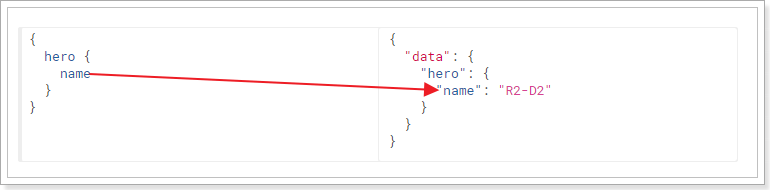

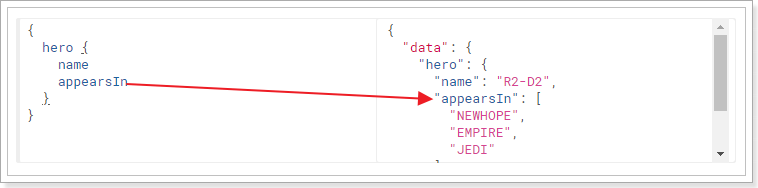

当请求中只有name属性时，响应结果中只包含name属性，如果请求中添加appearsIn属性，那么结果中就会返回appearsIn的值。

> 示例地址：http://graphql.cn/learn/schema/#type-system

#### 6.3.2. 一次查询多个数据

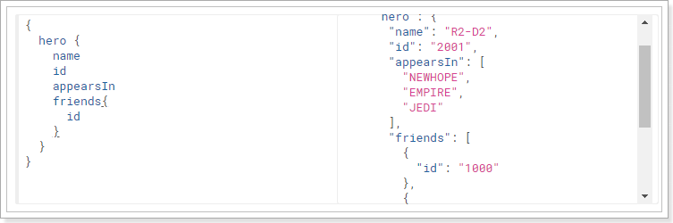

一次请求，不仅查询到了hero数据，而且还查询到了friends数据。节省了网络请求次数。

#### 6.3.3. API的演进无需划分版本

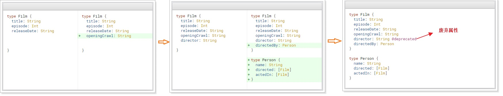

当API进行升级时，客户端可以不进行升级，可以等到后期一起升级，这样就大大减少了客户端和服务端的耦合度

## 7. GraphQL 的使用规范

GraphQL定义了一套规范，用来描述语法定义

> **说明：仅仅是规范，并不是具体实现，需要各种语言进行实现。**

### 7.1. GraphQL 查询的规范

更多的规范查看：http://graphql.cn/learn/queries/

#### 7.1.1. 字段（Fields）

在GraphQL的查询中，请求结构中包含了所预期结果的结构，这个就是字段。并且响应的结构和请求结构基本一致，这是GraphQL的一个特性，这样就可以让请求发起者很清楚的知道自己想要什么

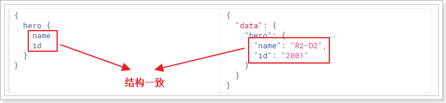

#### 7.1.2. 参数（Arguments）

在查询数据时，离不开传递参数，在GraphQL的查询中，也是可以传递参数的，语法：`(参数名:参数值)`

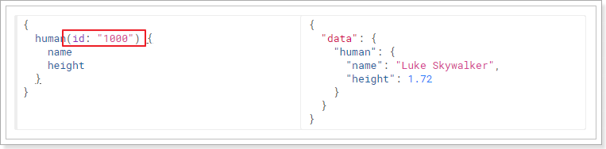

#### 7.1.3. 别名（Aliases）

如果一次查询多个相同对象，但是值不同，这个时候就需要起别名了，否则json的语法就不能通过

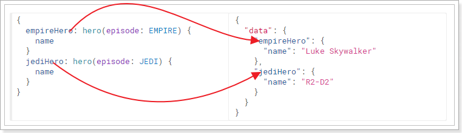

#### 7.1.4. 片段（Fragments）

查询对的属相如果相同，可以采用片段的方式进行简化定义

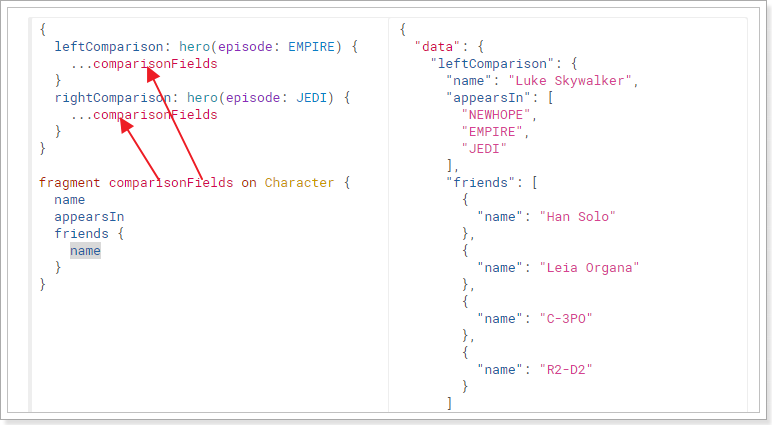

### 7.2. GraphQL 的 Schema 和类型规范

Schema 是用于定义数据结构的，比如说，User对象中有哪些属性，对象与对象之间是什么关系等。详细参考官网文档：http://graphql.cn/learn/schema/

#### 7.2.1. Schema 定义结构

```
schema { #定义查询
    query: UserQuery
}
type UserQuery { #定义查询的类型
    user(id:ID): User #指定对象以及参数类型
}
type User { #定义对象
    id: ID! # !表示该属性是非空项
    name: String
    age: Int
}
```

#### 7.2.2. 标量类型（Scalar Types）

GraphQL规范中，默认定义了5种类型：

- `Int`：有符号 32 位整数
- `Float`：有符号双精度浮点值
- `String`：UTF‐8 字符序列
- `Boolean`：true 或者 false
- `ID`：ID 标量类型表示一个唯一标识符，通常用以重新获取对象或者作为缓存中的键。

规范中定义的这5种类型，显然是不能满足需求的，所以在各种语言实现中，都有对类型进行了扩充，也就是GraphQL支持自定义类型，比如在graphql-java实现中增加了：Long、Byte等。

#### 7.2.3. 枚举类型

枚举类型是一种特殊的标量，它限制在一个特殊的可选值集合内

```
enum Episode { #定义枚举
    NEWHOPE
    EMPIRE
    JEDI
}
type Human {
    id: ID!
    name: String!
    appearsIn: [Episode]! #使用枚举类型
    homePlanet: String
}
```

#### 7.2.4. 接口（interface）

跟许多类型系统一样，GraphQL 支持接口。一个接口是一个抽象类型，它包含某些字段，而对象类型必须包含这些字段，才能算实现了这个接口。

```
interface Character { # 定义接口
id: ID!
    name: String!
    friends: [Character]
    appearsIn: [Episode]!
}
# 实现接口
type Human implements Character {
    id: ID!
    name: String!
    friends: [Character]
    appearsIn: [Episode]!
    starships: [Starship]
    totalCredits: Int
}
type Droid implements Character {
    id: ID!
    name: String!
    friends: [Character]
    appearsIn: [Episode]!
    primaryFunction: String
}
```

## 8. GraphQL的Java实现

GraphQL只是定义了规范并没有做实现，就需要有第三方来进行实现。关于GraphQL的java实现有几种，我们选择使用官方推荐的实现：`graphql-java`，通过该实现就可以编写
GraphQL的服务端了。

- 官网：https://www.graphql-java.com/
- github：https://github.com/graphql-java/graphql-java

### 8.1. 创建工程

#### 8.1.1. 引入依赖

创建jar类型工程`sample-graphql-java`。修改项目pom.xml文件，引入GraphQL的依赖

```xml
<dependencies>
    <!-- GraphQL的java第三实现依赖 -->
    <dependency>
        <groupId>com.graphql-java</groupId>
        <artifactId>graphql-java</artifactId>
        <version>11.0</version>
    </dependency>

    <!-- 文件io工具包 -->
    <dependency>
        <groupId>commons-io</groupId>
        <artifactId>commons-io</artifactId>
        <version>2.6</version>
    </dependency>
</dependencies>
```

> 特别说明：graphql-java包并没有发布到maven中央仓库，需要配置第三方仓库才能使用

如果本地仓库没有graphql-java包并且拉取不了的时候，配置maven的`settings.xml`文件，增加私服的配置

```xml
<profile>
    <id>bintray</id>
    <repositories>
        <repository>
            <id>bintray</id>
            <url>http://dl.bintray.com/andimarek/graphql-java</url>
            <releases>
                <enabled>true</enabled>
            </releases>
            <snapshots>
                <enabled>false</enabled>
            </snapshots>
        </repository>
    </repositories>
    <pluginRepositories>
        <pluginRepository>
            <id>bintray</id>
            <url>http://dl.bintray.com/andimarek/graphql-java</url>
            <releases>
                <enabled>true</enabled>
            </releases>
            <snapshots>
                <enabled>false</enabled>
            </snapshots>
        </pluginRepository>
    </pluginRepositories>
</profile>
....
<activeProfiles>
    ....
    <activeProfile>bintray</activeProfile>
</activeProfiles>
```

#### 8.1.2. 创建实体类

```java
public class User {
    private Long id;
    private String name;
    private Integer age;
    // 省略无参、全参、getter/setter
}
```

### 8.2. 使用 Java 纯 API 实现

#### 8.2.1. 查询对象实现

本示例 GraphQL 的 Schema 定义

```
# 对应的User定义如下
schema { # 定义查询
    query: UserQuery
}

type UserQuery { # 定义查询的类型
    user: User # 指定对象以及参数类型
}

type User { # 定义对象
    id: Long! # !表示该属性是非空项
    name: String
    age: Int
}
```

代码实现

```java
package com.moon.sample.graphql.demo;

import com.moon.sample.graphql.vo.User;
import graphql.ExecutionResult;
import graphql.GraphQL;
import graphql.schema.GraphQLFieldDefinition;
import graphql.schema.GraphQLObjectType;
import graphql.schema.GraphQLSchema;
import graphql.schema.StaticDataFetcher;

import static graphql.Scalars.GraphQLInt;
import static graphql.Scalars.GraphQLLong;
import static graphql.Scalars.GraphQLString;
import static graphql.schema.GraphQLFieldDefinition.newFieldDefinition;
import static graphql.schema.GraphQLObjectType.newObject;

/**
 * GraphQL API 编程式实现示例
 */
public class GraphQLDemo {
    public static void main(String[] args) {
        // 定义对象类型 type User
        GraphQLObjectType userObjectType = createUserObjectType();

        // 定义查询的类型 type UserQuery
        GraphQLObjectType userQueryObjectType = createUserQueryObjectType(userObjectType);

        // 定义Schema
        GraphQLSchema graphQLSchema = createGraphqlSchema(userQueryObjectType);

        // 创建GraphQL对象实例
        GraphQL graphQL = GraphQL.newGraphQL(graphQLSchema).build();

        // 定义查询的数据结构
        String query = "{user{id,name}}";
        System.out.println("query:" + query);
        // 执行查询
        ExecutionResult result = graphQL.execute(query);

        // 打印错误
        System.out.println("错误：" + result.getErrors());
        // 打印数据
        System.out.println("结果：" + result.getData());
        // 调用toSpecification方法输出标准数据结构
        System.out.println("toSpecification 输出标准数据结构：" + result.toSpecification());
    }

    /*
     * 定义查询的类型。相当于 Schema 定义数据的结构中
     *  schema { # 定义查询
     *      query: UserQuery
     *  }
     * 返回值查询的类型是 type UserQuery
     */
    private static GraphQLSchema createGraphqlSchema(GraphQLObjectType userQueryObjectType) {
        return GraphQLSchema
                .newSchema()
                .query(userQueryObjectType)
                .build();
    }

    /*
     * 定义查询的类型。相当于 Schema 定义数据的结构中
     *  type UserQuery { # 定义查询的类型
     *      user: User # 指定对象以及参数类型
     *  }
     * 返回值查询的类型是 type UserQuery
     */
    private static GraphQLObjectType createUserQueryObjectType(GraphQLObjectType userObjectType) {
        // 定义查询类型中的对象以及参数类型
        GraphQLFieldDefinition userFieldDefinition = createUserFieldDefinition(userObjectType);
        return newObject()
                .name("UserQuery")
                .field(userFieldDefinition)
                .build();
    }

    /*
     * 定义查询的类型。相当于 Schema 定义数据的结构中
     *  type UserQuery { # 定义查询的类型
     *      user: User # 指定对象以及参数类型
     *  }
     * 返回值是查询类型中的参数 user: User
     */
    private static GraphQLFieldDefinition createUserFieldDefinition(GraphQLObjectType userObjectType) {
        return newFieldDefinition()
                .name("user")
                .type(userObjectType)
                // TODO: 使用静态数据，实际会查询数据库获取数据
                .dataFetcher(new StaticDataFetcher(new User(1L, "石原里美", 30)))
                .build();
    }

    /*
     * 定义User对象类型。相当于 Schema 定义数据的结构中
     *  type User { # 定义对象
     *      id: Long! # !表示该属性是非空项
     *      name: String
     *      age: Int
     *  }
     * 返回值是对象为类型 type User
     */
    private static GraphQLObjectType createUserObjectType() {
        return newObject()
                .name("User")
                .field(newFieldDefinition().name("id").type(GraphQLLong))
                .field(newFieldDefinition().name("name").type(GraphQLString))
                .field(newFieldDefinition().name("age").type(GraphQLInt))
                .build();
    }
}
```

运行结果：

```
query:{user{id,name}}
错误：[]
结果：{user={id=1, name=石原里美}}
toSpecification 输出标准数据结构：{data={user={id=1, name=石原里美}}}
---------------------------------------------
query:{user{id,name,age}}
错误：[]
结果：{user={id=1, name=石原里美, age=30}}
toSpecification 输出标准数据结构：{data={user={id=1, name=石原里美, age=30}}}
```

#### 8.2.2. 设置查询参数

修改`createUserDefinition()`方法，增加查询参数的设置

```java
private static GraphQLFieldDefinition createUserFieldDefinition(GraphQLObjectType userObjectType) {
    return newFieldDefinition()
            .name("user")
            .type(userObjectType)
            // TODO: 使用静态数据，实际会查询数据库获取数据
            // .dataFetcher(new StaticDataFetcher(new User(1L, "石原里美", 30)))
            // 设置查询参数
            .argument(newArgument().name("id").type(GraphQLLong).build())
            .dataFetcher(environment -> {
                // 获取查询语句中的id参数值
                Long id = environment.getArgument("id");
                // TODO: 使用静态数据，实际会根据id查询数据库获取数据
                return new User(id, "新垣结衣的id:" + id, 20 + id.intValue());
            })
            .build();
}
```

运行结果：

```
query:{user(id:1){id,name}}
错误：[]
结果：{user={id=1, name=新垣结衣的id:1}}
toSpecification 输出标准数据结构：{data={user={id=1, name=新垣结衣的id:1}}}
---------------------------------------------
query:{user(id:3){id,name,age}}
错误：[]
结果：{user={id=3, name=新垣结衣的id:3, age=23}}
toSpecification 输出标准数据结构：{data={user={id=3, name=新垣结衣的id:3, age=23}}}
```

### 8.3. 使用SDL构建schema

graphql-java 提供了两种不同的方式来定义模式：以编程方式作为Java代码或通过特殊的graphql dsl（称为SDL）

> 官方推荐使用：SDL方法

#### 8.3.1. 创建graphqls文件

在`resources`目录下创建`user.graphqls`文件：

```
schema {
    query: UserQuery
}
type UserQuery {
    user(id:Long): User
}
type User {
    id: Long!
    name: String
    age: Int
}
```

使用idea可以安装GraphQL插件，可以高亮显示`.graphqls`文件的内容

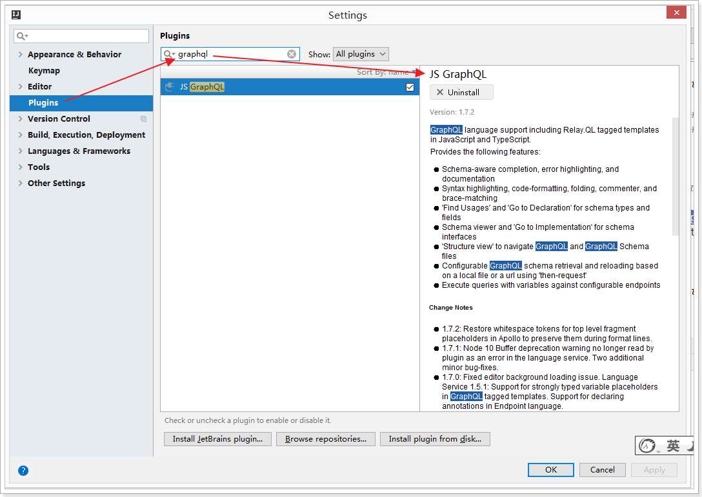

#### 8.3.2. 构建schema

```java
package com.moon.sample.graphql.demo;

import com.moon.sample.graphql.vo.User;
import graphql.ExecutionResult;
import graphql.GraphQL;
import graphql.schema.GraphQLSchema;
import graphql.schema.idl.RuntimeWiring;
import graphql.schema.idl.SchemaGenerator;
import graphql.schema.idl.SchemaParser;
import graphql.schema.idl.TypeDefinitionRegistry;
import org.apache.commons.io.IOUtils;

import java.io.IOException;

/**
 * GraphQL 基于 SDL 方式实现示例
 */
public class GraphQLSDLDemo {
    // GraphQL文件名
    private static final String FILE_NAME = "user.graphqls";

    public static void main(String[] args) throws IOException {
        // 读取GraphQL文件，进行解析
        String fileContent = readFileToString();

        // 定义类型的注册器
        TypeDefinitionRegistry typeRegistry = createTypeDefinitionRegistry(fileContent);

        // 定义数据的查询
        RuntimeWiring wiring = createRuntimeWiring();

        // 定义Schema
        GraphQLSchema graphQLSchema = createGraphqlSchema(typeRegistry, wiring);

        // 创建GraphQL对象实例
        GraphQL graphQL = GraphQL.newGraphQL(graphQLSchema).build();

        // 注意：查询语句中的user是小写，要和user.graphqls文件中的属性名一致
        String query = "{user(id:3){id,name,age}}";
        System.out.println("query:" + query);
        // 执行查询
        ExecutionResult result = graphQL.execute(query);

        // 打印错误
        System.out.println("错误：" + result.getErrors());
        // 打印数据
        System.out.println("结果：" + result.getData());
        // 调用toSpecification方法输出标准数据结构
        System.out.println("toSpecification 输出标准数据结构：" + result.toSpecification());
    }

    /*
     * 数据的查询
     */
    private static RuntimeWiring createRuntimeWiring() {
        return RuntimeWiring.newRuntimeWiring()
                .type("UserQuery", builder ->
                        builder.dataFetcher("user", environment -> {
                            Long id = environment.getArgument("id");
                            return new User(id, "新垣结衣的id:" + id, 20 + id.intValue());
                        })
                )
                .build();
    }

    /*
     * 定义类型的注册器
     */
    private static TypeDefinitionRegistry createTypeDefinitionRegistry(String fileContent) {
        return new SchemaParser().parse(fileContent);
    }

    /*
     * 读取文件内容
     */
    private static String readFileToString() throws IOException {
        return IOUtils.toString(GraphQLSDLDemo.class.getClassLoader().getResource(FILE_NAME), "UTF-8");
    }

    /*
     * 定义查询的类型。相当于 Schema 定义数据的结构中
     *  schema { # 定义查询
     *      query: UserQuery
     *  }
     * 返回值查询的类型是 type UserQuery
     */
    private static GraphQLSchema createGraphqlSchema(TypeDefinitionRegistry typeRegistry, RuntimeWiring wiring) {
        return new SchemaGenerator().makeExecutableSchema(typeRegistry, wiring);
    }
}
```

运行结果：

```
query:{user(id:2){id,name}}
错误：[]
结果：{user={id=2, name=新垣结衣的id:2}}
toSpecification 输出标准数据结构：{data={user={id=2, name=新垣结衣的id:2}}}
---------------------------------------------
query:{user(id:3){id,name,age}}
错误：[]
结果：{user={id=3, name=新垣结衣的id:3, age=23}}
toSpecification 输出标准数据结构：{data={user={id=3, name=新垣结衣的id:3, age=23}}}
```

#### 8.3.3. 对象嵌套

创建一个Card对象，User和Card对象为一对一的关系。在`User`类中添加`Card`属性

```java
public class Card {
    private String cardNumber;
    private Long userId;
    // 省略无参、全参、getter/setter
}
```

修改`user.graphqls`文件

```
schema {
    query: UserQuery
}
type UserQuery {
    user(id:Long): User
}
type User {
    id: Long!
    name: String
    age: Int
    card: Card
}
type Card {
    cardNumber: String
    userId: Long
}
```

修改GraphQLSDLDemo类的逻辑，增加嵌套对象的处理

```java
private static RuntimeWiring createRuntimeWiring() {
    return RuntimeWiring.newRuntimeWiring()
            .type("UserQuery", builder ->
                    builder.dataFetcher("user", environment -> {
                        Long id = environment.getArgument("id");
                        Card card = new Card("123456789", id);
                        return new User(id, "新垣结衣的id:" + id, 20 + id.intValue(), card);
                    })
            )
            .build();
}
```

> 说明：GraphQL并不实现关联查询，需要自己实现。

运行结果：

```
query:{user(id:2){id,name}}
错误：[]
结果：{user={id=2, name=新垣结衣的id:2}}
toSpecification 输出标准数据结构：{data={user={id=2, name=新垣结衣的id:2}}}
---------------------------------------------
query:{user(id:10){id,name,age,card{cardNumber}}}
错误：[]
结果：{user={id=10, name=新垣结衣的id:10, age=30, card={cardNumber=123456789}}}
toSpecification 输出标准数据结构：{data={user={id=10, name=新垣结衣的id:10, age=30, card={cardNumber=123456789}}}}
---------------------------------------------
query:{user(id:10){id,name,age,card{cardNumber,userId}}}
错误：[]
结果：{user={id=10, name=新垣结衣的id:10, age=30, card={cardNumber=123456789, userId=10}}}
toSpecification 输出标准数据结构：{data={user={id=10, name=新垣结衣的id:10, age=30, card={cardNumber=123456789, userId=10}}}}
```
