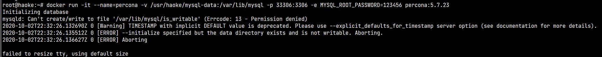
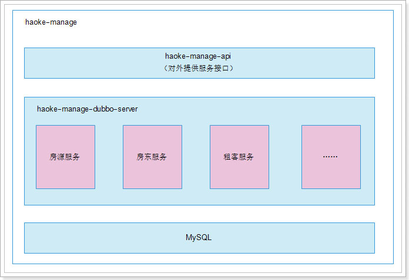
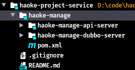
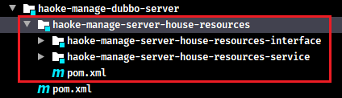
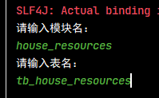
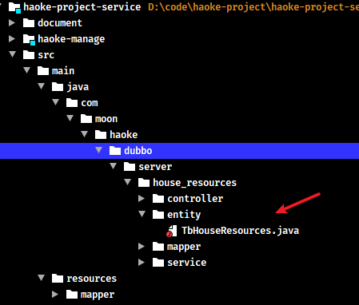
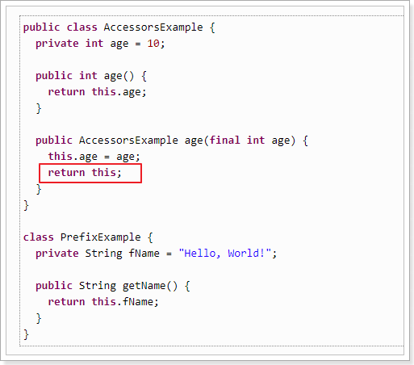
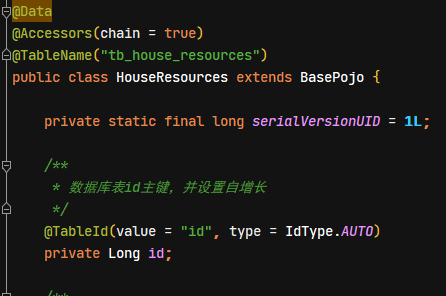
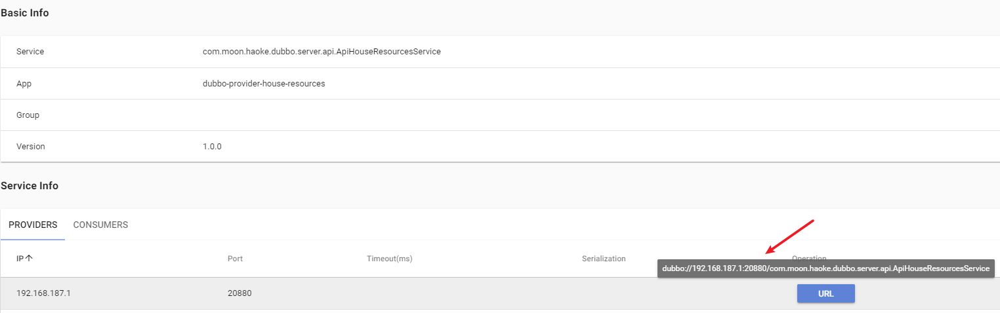

# Day04-后台服务的搭建与实现以及 MybatisPlus 的入门

## 1. 使用 Docker 安装 MySQL

好客租房项目的底层数据库采用 MySQL，而 MySQL 采用衍生版本 Percona，并且采用 docker 容器化的方式进行部署

### 1.1. 什么是 percona？

Percona 为 MySQL 数据库服务器进行了改进，在功能和性能上较 MySQL 有着很显著的提升。该版本提升了在高负载情况下的 InnoDB 的性能、为 DBA 提供一些非常有用的性能诊断工具；另外有更多的参数和命令来控制服务器行为。

Percona Server 只包含 MySQL 的服务器版，并没有提供相应对 MySQL 的 Connector 和 GUI 工具进行改进。

Percona Server 使用了一些 google-mysql-tools, Proven Scaling, Open Query 对 MySQL 进行改造。

官网：https://www.percona.com/software/mysql-database

### 1.2. 安装部署

#### 1.2.1. 拉取镜像

```bash
#镜像地址：https://hub.docker.com/_/percona/
docker pull percona:5.7.23
```

#### 1.2.2. 创建容器

```bash
docker create --name percona -v /usr/haoke/mysql-data:/var/lib/mysql -p 3306:3306 -e MYSQL_ROOT_PASSWORD=123456 percona:5.7.23
```

参数解释：

- `--name percona`：指定是容器的名称
- `-v /usr/haoke/mysql-data:/var/lib/mysql`：将主机目录`/usr/haoke/mysql-data`挂载到容器的`/var/lib/mysql`上
- `-p 3306:3306`：设置端口映射，主机端口是 33306，容器内部端口 3306
- `-e MYSQL_ROOT_PASSWORD=123456`：设置容器参数，这里是设置 mysql 的 root 用户的密码为 123456
- `percona:5.7.23`：镜像名:版本号

#### 1.2.3. 启动容器

```bash
docker start percona
# 查看docker的运行情况
docker ps -a
```

使用数据库的图形化客户端测试是否成功连接

#### 1.2.4. 另一种方式：守护式容器（后台运行。使用 exit 退出时，容器不会停止）

```bash
docker run -it --name=percona -v /usr/haoke/mysql-data:/var/lib/mysql --privileged=true -p 33306:3306 -e MYSQL_ROOT_PASSWORD=123456 percona:5.7.23
```

#### 1.2.5. 部署遇到的问题

创建容器时的报错信息，容器是创建成功，但是无法运行



从网上查询资料后，应该是因为 docker 容器在宿主机的 `$PWD/data` 里没有写权限。所以直接给挂载的目录改变权限。

```bash
chmod 777 /usr/haoke/mysql-data/
```

## 2. MybatisPlus 入门

在后台系统服务的开发过程中，必然要和数据库进行交互，在本项目中，ORM 这一层的技术选型采用 Mybatis 框架作为持久层框架。为了提升开发的效率，所以选用 MybatisPlus 作为 mybatis 的插件

> MybatisPlus 快速入门示例与基本使用的笔记，详见[《MyBatis-Plus 基础笔记》](/02-后端框架/02-MyBatis/04-MyBatisPlus)

## 3. Lombok 工具包

本项目引入此实体类工具包，具体使用详见[《Lombok 实体类工具插件》笔记](/02-后端框架/99-工具框架/07-Lombok)

## 4. 后台服务系统搭建

后台服务系统采用 SOA 的架构思想，使用 dubbo 作为服务治理框架进行搭建

### 4.1. 后台服务系统架构图与工程目录结构

后台服务系统架构：



工程结构：



### 4.2. 创建 haoke-manage 工程

创建 pom 聚合工程，修改 pom.xml 文件添加公共的依赖

```xml
<?xml version="1.0" encoding="UTF-8"?>
<project xmlns="http://maven.apache.org/POM/4.0.0"
         xmlns:xsi="http://www.w3.org/2001/XMLSchema-instance"
         xsi:schemaLocation="http://maven.apache.org/POM/4.0.0 http://maven.apache.org/xsd/maven-4.0.0.xsd">

    <!-- 添加spring boot的父依赖 -->
    <parent>
        <groupId>org.springframework.boot</groupId>
        <artifactId>spring-boot-starter-parent</artifactId>
        <version>2.1.0.RELEASE</version>
    </parent>

    <modelVersion>4.0.0</modelVersion>
    <groupId>com.moon</groupId>
    <artifactId>haoke-manage</artifactId>
    <version>1.0-SNAPSHOT</version>
    <packaging>pom</packaging>
    <description>好客租房系统后台服务聚合工程</description>

    <!-- 子模块 -->
    <modules>
        <module>haoke-manage-api-server</module>
        <module>haoke-manage-dubbo-server</module>
    </modules>

    <!-- 版本号管理 -->
    <properties>
        <dubbo-starter.version>0.2.0</dubbo-starter.version>
        <dubbo.version>2.6.4</dubbo.version>
        <zookeeper.version>3.4.13</zookeeper.version>
        <zkclient.version>0.1</zkclient.version>
        <commons-lang3.version>3.7</commons-lang3.version>
    </properties>

    <!-- 版本控制 -->
    <dependencyManagement>
        <dependencies>
            <!-- dubbo的springboot支持 -->
            <dependency>
                <groupId>com.alibaba.boot</groupId>
                <artifactId>dubbo-spring-boot-starter</artifactId>
                <version>${dubbo-starter.version}</version>
            </dependency>
            <!-- dubbo框架 -->
            <dependency>
                <groupId>com.alibaba</groupId>
                <artifactId>dubbo</artifactId>
                <version>${dubbo.version}</version>
            </dependency>

            <!-- zookeeper依赖-->
            <dependency>
                <groupId>org.apache.zookeeper</groupId>
                <artifactId>zookeeper</artifactId>
                <version>${zookeeper.version}</version>
            </dependency>
            <dependency>
                <groupId>com.github.sgroschupf</groupId>
                <artifactId>zkclient</artifactId>
                <version>${zkclient.version}</version>
            </dependency>

            <!-- apache commons 工具类库 -->
            <dependency>
                <groupId>org.apache.commons</groupId>
                <artifactId>commons-lang3</artifactId>
                <version>${commons-lang3.version}</version>
            </dependency>

            <!-- 项目各个模块的版本控制 -->
        </dependencies>
    </dependencyManagement>

    <!-- 项目公共的依赖部分 -->
    <dependencies>
        <!--springboot 测试支持-->
        <dependency>
            <groupId>org.springframework.boot</groupId>
            <artifactId>spring-boot-starter-test</artifactId>
            <scope>test</scope>
        </dependency>

        <!-- dubbo的springboot支持 -->
        <dependency>
            <groupId>com.alibaba.boot</groupId>
            <artifactId>dubbo-spring-boot-starter</artifactId>
        </dependency>
        <!-- dubbo框架 -->
        <dependency>
            <groupId>com.alibaba</groupId>
            <artifactId>dubbo</artifactId>
        </dependency>

        <!-- zookeeper依赖-->
        <dependency>
            <groupId>org.apache.zookeeper</groupId>
            <artifactId>zookeeper</artifactId>
        </dependency>
        <dependency>
            <groupId>com.github.sgroschupf</groupId>
            <artifactId>zkclient</artifactId>
        </dependency>

        <!-- apache commons 工具类库 -->
        <dependency>
            <groupId>org.apache.commons</groupId>
            <artifactId>commons-lang3</artifactId>
        </dependency>
    </dependencies>

    <!-- 项目构建 -->
    <build>
        <plugins>
            <plugin>
                <groupId>org.springframework.boot</groupId>
                <artifactId>spring-boot-maven-plugin</artifactId>
            </plugin>
        </plugins>
    </build>
</project>
```

### 4.3. 创建 haoke-manage-api-server 工程

创建 jar 类型项目，添加 pom.xml 配置文件相关依赖

```xml
<?xml version="1.0" encoding="UTF-8"?>
<project xmlns="http://maven.apache.org/POM/4.0.0"
         xmlns:xsi="http://www.w3.org/2001/XMLSchema-instance"
         xsi:schemaLocation="http://maven.apache.org/POM/4.0.0 http://maven.apache.org/xsd/maven-4.0.0.xsd">
    <parent>
        <artifactId>haoke-manage</artifactId>
        <groupId>com.moon</groupId>
        <version>1.0-SNAPSHOT</version>
    </parent>

    <modelVersion>4.0.0</modelVersion>
    <artifactId>haoke-manage-api-server</artifactId>
    <name>${project.artifactId}</name>
    <packaging>jar</packaging>
    <description>好客租房后台api服务</description>

    <dependencies>
        <!-- springboot 的 web 项目支持 -->
        <dependency>
            <groupId>org.springframework.boot</groupId>
            <artifactId>spring-boot-starter-web</artifactId>
        </dependency>
    </dependencies>
</project>
```

### 4.4. 创建 haoke-manage-dubbo-server 工程

创建 jar 类型项目，添加 pom.xml 配置文件相关依赖

```xml
<?xml version="1.0" encoding="UTF-8"?>
<project xmlns="http://maven.apache.org/POM/4.0.0"
         xmlns:xsi="http://www.w3.org/2001/XMLSchema-instance"
         xsi:schemaLocation="http://maven.apache.org/POM/4.0.0 http://maven.apache.org/xsd/maven-4.0.0.xsd">
    <parent>
        <artifactId>haoke-manage</artifactId>
        <groupId>com.moon</groupId>
        <version>1.0-SNAPSHOT</version>
    </parent>

    <modelVersion>4.0.0</modelVersion>
    <artifactId>haoke-manage-dubbo-server</artifactId>
    <name>${project.artifactId}</name>
    <packaging>pom</packaging>
    <description>好客租房后台服务聚合工程</description>

    <dependencies>
        <!-- 添加 spring boot 的支持 -->
        <dependency>
            <groupId>org.springframework.boot</groupId>
            <artifactId>spring-boot-starter</artifactId>
        </dependency>
    </dependencies>

</project>
```

## 5. 新增房源服务

### 5.1. 创建数据库表

tb_estate（楼盘表）：

```sql
CREATE TABLE `tb_estate` (
  `id` bigint(20) NOT NULL AUTO_INCREMENT,
  `name` varchar(100) DEFAULT NULL COMMENT '楼盘名称',
  `province` varchar(10) DEFAULT NULL COMMENT '所在省',
  `city` varchar(10) DEFAULT NULL COMMENT '所在市',
  `area` varchar(10) DEFAULT NULL COMMENT '所在区',
  `address` varchar(100) DEFAULT NULL COMMENT '具体地址',
  `year` varchar(10) DEFAULT NULL COMMENT '建筑年代',
  `type` varchar(10) DEFAULT NULL COMMENT '建筑类型',
  `property_cost` varchar(10) DEFAULT NULL COMMENT '物业费',
  `property_company` varchar(20) DEFAULT NULL COMMENT '物业公司',
  `developers` varchar(20) DEFAULT NULL COMMENT '开发商',
  `created` datetime DEFAULT NULL COMMENT '创建时间',
  `updated` datetime DEFAULT NULL COMMENT '更新时间',
  PRIMARY KEY (`id`)
) ENGINE=InnoDB AUTO_INCREMENT=1006 DEFAULT CHARSET=utf8 COMMENT='楼盘表';

-- 初始数据
INSERT INTO `tb_estate` (`id`, `name`, `province`, `city`, `area`, `address`, `year`, `type`, `property_cost`, `property_company`, `developers`, `created`, `updated`) VALUES ('1001', '中远两湾城', '上海市', '上海市', '普陀区', '远景路97弄', '2001', '塔楼/板楼', '1.5', '上海中远物业管理发展有限公司', '上海万业企业股份有限公司', '2018-11-06 23:00:20', '2018-11-06 23:00:23');
INSERT INTO `tb_estate` (`id`, `name`, `province`, `city`, `area`, `address`, `year`, `type`, `property_cost`, `property_company`, `developers`, `created`, `updated`) VALUES ('1002', '上海康城', '上海市', '上海市', '闵行区', '莘松路958弄', '2001', '塔楼/板楼', '1.5', '盛孚物业', '闵行房地产', '2018-11-06 23:02:30', '2018-11-27 23:02:33');
INSERT INTO `tb_estate` (`id`, `name`, `province`, `city`, `area`, `address`, `year`, `type`, `property_cost`, `property_company`, `developers`, `created`, `updated`) VALUES ('1003', '保利西子湾', '上海市', '上海市', '松江区', '广富林路1188弄', '2008', '塔楼/板楼', '1.75', '上海保利物业管理', '上海城乾房地产开发有限公司', '2018-11-06 23:04:22', '2018-11-06 23:04:25');
INSERT INTO `tb_estate` (`id`, `name`, `province`, `city`, `area`, `address`, `year`, `type`, `property_cost`, `property_company`, `developers`, `created`, `updated`) VALUES ('1004', '万科城市花园', '上海市', '上海市', '松江区', '广富林路1188弄', '2002', '塔楼/板楼', '1.5', '上海保利物业管理', '上海城乾房地产开发有限公司', '2018-11-13 16:43:40', '2018-11-13 16:43:42');
INSERT INTO `tb_estate` (`id`, `name`, `province`, `city`, `area`, `address`, `year`, `type`, `property_cost`, `property_company`, `developers`, `created`, `updated`) VALUES ('1005', '上海阳城', '上海市', '上海市', '闵行区', '罗锦路888弄', '2002', '塔楼/板楼', '1.5', '上海莲阳物业管理有限公司', '上海莲城房地产开发有限公司', '2018-11-06 23:23:52', '2018-11-06 23:23:55');
```

tb_house_resources（房源表）：

```sql
CREATE TABLE `tb_house_resources` (
  `id` bigint(20) NOT NULL AUTO_INCREMENT,
  `title` varchar(100) DEFAULT NULL COMMENT '房源标题',
  `estate_id` bigint(20) DEFAULT NULL COMMENT '楼盘id',
  `building_num` varchar(5) DEFAULT NULL COMMENT '楼号（栋）',
  `building_unit` varchar(5) DEFAULT NULL COMMENT '单元号',
  `building_floor_num` varchar(5) DEFAULT NULL COMMENT '门牌号',
  `rent` int(10) DEFAULT NULL COMMENT '租金',
  `rent_method` tinyint(1) DEFAULT NULL COMMENT '租赁方式，1-整租，2-合租',
  `payment_method` tinyint(1) DEFAULT NULL COMMENT '支付方式，1-付一押一，2-付三押一，3-付六押一，4-年付押一，5-其它',
  `house_type` varchar(255) DEFAULT NULL COMMENT '户型，如：2室1厅1卫',
  `covered_area` varchar(10) DEFAULT NULL COMMENT '建筑面积',
  `use_area` varchar(10) DEFAULT NULL COMMENT '使用面积',
  `floor` varchar(10) DEFAULT NULL COMMENT '楼层，如：8/26',
  `orientation` varchar(2) DEFAULT NULL COMMENT '朝向：东、南、西、北',
  `decoration` tinyint(1) DEFAULT NULL COMMENT '装修，1-精装，2-简装，3-毛坯',
  `facilities` varchar(50) DEFAULT NULL COMMENT '配套设施， 如：1,2,3',
  `pic` varchar(200) DEFAULT NULL COMMENT '图片，最多5张',
  `house_desc` varchar(200) DEFAULT NULL COMMENT '描述',
  `contact` varchar(10) DEFAULT NULL COMMENT '联系人',
  `mobile` varchar(11) DEFAULT NULL COMMENT '手机号',
  `time` tinyint(1) DEFAULT NULL COMMENT '看房时间，1-上午，2-中午，3-下午，4-晚上，5-全天',
  `property_cost` varchar(10) DEFAULT NULL COMMENT '物业费',
  `created` datetime DEFAULT NULL,
  `updated` datetime DEFAULT NULL,
  PRIMARY KEY (`id`)
) ENGINE=InnoDB AUTO_INCREMENT=1 DEFAULT CHARSET=utf8 COMMENT='房源表';
```

### 5.2. 创建房源服务聚合工程

创建 pom 类型聚合项目`haoke-manage-server-house-resources`，在此聚合项目中创建两个子工程，其作用如下：

- `haoke-manage-server-house-resources-interface`：作为对外提供的 sdk 包，只提供 pojo 实体以及接口，不提供实现类
- `haoke-manage-server-house-resources-service`：对外暴露的接口的具体实现，但不会对外暴露



pom.xml 文件配置：

```xml
<?xml version="1.0" encoding="UTF-8"?>
<project xmlns="http://maven.apache.org/POM/4.0.0"
         xmlns:xsi="http://www.w3.org/2001/XMLSchema-instance"
         xsi:schemaLocation="http://maven.apache.org/POM/4.0.0 http://maven.apache.org/xsd/maven-4.0.0.xsd">
    <parent>
        <artifactId>haoke-manage-dubbo-server</artifactId>
        <groupId>com.moon</groupId>
        <version>1.0-SNAPSHOT</version>
    </parent>

    <modelVersion>4.0.0</modelVersion>
    <artifactId>haoke-manage-server-house-resources</artifactId>
    <name>${project.artifactId}</name>
    <packaging>pom</packaging>
    <description>好客租房后台服务 - 房源服务聚合工程</description>

    <!-- 子模块 -->
    <modules>
        <module>haoke-manage-server-house-resources-interface</module>
        <module>haoke-manage-server-house-resources-service</module>
    </modules>

    <!-- 定义公共依赖 -->
    <dependencies>
        <!-- lombok实体工具插件，在MyBatis-plus包中依赖，不需要单独引用 -->
        <dependency>
            <groupId>org.projectlombok</groupId>
            <artifactId>lombok</artifactId>
            <!-- 需要注意：optional表示传递依赖中，如果需要使用，再显示引入 -->
            <optional>true</optional>
        </dependency>
        <!-- MyBatis-Plus 插件的依赖 -->
        <dependency>
            <groupId>com.baomidou</groupId>
            <artifactId>mybatis-plus-boot-starter</artifactId>
            <optional>true</optional>
        </dependency>
        <!-- mysql数据库连接驱动 -->
        <dependency>
            <groupId>mysql</groupId>
            <artifactId>mysql-connector-java</artifactId>
            <optional>true</optional>
        </dependency>
    </dependencies>

</project>
```

### 5.3. 创建房源服务的子工程

#### 5.3.1. 房源服务的子工程 - 服务接口

创建 jar 类型的服务接口工程，用于对外暴露接口与实体类。配置`pom.xml`依赖

```xml
<?xml version="1.0" encoding="UTF-8"?>
<project xmlns="http://maven.apache.org/POM/4.0.0"
         xmlns:xsi="http://www.w3.org/2001/XMLSchema-instance"
         xsi:schemaLocation="http://maven.apache.org/POM/4.0.0 http://maven.apache.org/xsd/maven-4.0.0.xsd">
    <parent>
        <artifactId>haoke-manage-server-house-resources</artifactId>
        <groupId>com.moon</groupId>
        <version>1.0-SNAPSHOT</version>
    </parent>

    <modelVersion>4.0.0</modelVersion>
    <artifactId>haoke-manage-server-house-resources-interface</artifactId>
    <name>${project.artifactId}</name>
    <packaging>jar</packaging>
    <description>好客租房后台服务 - 房源服务 - 接口工程</description>

</project>
```

#### 5.3.2. 房源服务的子工程 - 服务实现

创建 jar 类型的服务接口具体实现工程，不会对外暴露。配置`pom.xml`依赖

```xml
<?xml version="1.0" encoding="UTF-8"?>
<project xmlns="http://maven.apache.org/POM/4.0.0"
         xmlns:xsi="http://www.w3.org/2001/XMLSchema-instance"
         xsi:schemaLocation="http://maven.apache.org/POM/4.0.0 http://maven.apache.org/xsd/maven-4.0.0.xsd">
    <parent>
        <artifactId>haoke-manage-server-house-resources</artifactId>
        <groupId>com.moon</groupId>
        <version>1.0-SNAPSHOT</version>
    </parent>

    <modelVersion>4.0.0</modelVersion>
    <artifactId>haoke-manage-server-house-resources-service</artifactId>
    <name>${project.artifactId}</name>
    <packaging>jar</packaging>
    <description>好客租房后台服务 - 房源服务 - 接口具体实现工程</description>

    <dependencies>
        <!-- spring boot jdbc 的支持 -->
        <dependency>
            <groupId>org.springframework.boot</groupId>
            <artifactId>spring-boot-starter-jdbc</artifactId>
        </dependency>
        <!-- 依赖接口工程 -->
        <dependency>
            <groupId>com.moon</groupId>
            <artifactId>haoke-manage-server-house-resources-interface</artifactId>
        </dependency>
    </dependencies>

</project>
```

### 5.4. 创建服务公共部分

#### 5.4.1. 创建 BasePojo 实体类

编写`BasePojo`类，抽取公共部分的属性。当前工程所有的 pojo 类都要继承该类，在该类中定义了 created、updated 字段，表明在每一个表中都需要有这 2 个字段。

```java
package com.moon.haoke.dubbo.server.pojo;

import lombok.Data;

import java.util.Date;

/**
 * 基础Pojo实体，用于抽取实体类公共属性 */
@Data
public class BasePojo implements java.io.Serializable {
    private Date created; // 数据的创建时间
    private Date updated; // 数据的修改时间
}
```

### 5.5. 使用 MybatisPlus 的 AutoGenerator 插件生成代码文件

`AutoGenerator` 是 MyBatis-Plus 的代码生成器，通过 `AutoGenerator` 可以快速生成 Entity、Mapper、Mapper XML、Service、Controller 等各个模块的代码

#### 5.5.1. 创建代码生成服务工程

创建 jar 类型的代码生成服务工程`haoke-manage-server-generator`，修改`pom.xml`配置相关依赖

```xml
<?xml version="1.0" encoding="UTF-8"?>
<project xmlns="http://maven.apache.org/POM/4.0.0"
         xmlns:xsi="http://www.w3.org/2001/XMLSchema-instance"
         xsi:schemaLocation="http://maven.apache.org/POM/4.0.0 http://maven.apache.org/xsd/maven-4.0.0.xsd">
    <parent>
        <artifactId>haoke-manage-dubbo-server</artifactId>
        <groupId>com.moon</groupId>
        <version>1.0-SNAPSHOT</version>
    </parent>

    <modelVersion>4.0.0</modelVersion>
    <artifactId>haoke-manage-server-generator</artifactId>
    <name>${project.artifactId}</name>
    <packaging>jar</packaging>
    <description>Mybatis-Plus工具包的AutoGenerator插件实现生成持久层代码</description>

    <dependencies>
        <!--
            freemarker 模板引擎（AutoGenerator插件生成代码需要依赖）
            MyBatis-Plus 从 3.0.3 之后移除了代码生成器与模板引擎的默认依赖，需要手动添加相关依赖
         -->
        <dependency>
            <groupId>org.freemarker</groupId>
            <artifactId>freemarker</artifactId>
            <version>2.3.28</version>
        </dependency>
        <!-- 添加代码生成器依赖 -->
        <dependency>
            <groupId>com.baomidou</groupId>
            <artifactId>mybatis-plus-generator</artifactId>
            <version>${mybatis-plus.version}</version>
        </dependency>
        <!-- mysql数据库连接驱动 -->
        <dependency>
            <groupId>mysql</groupId>
            <artifactId>mysql-connector-java</artifactId>
            <optional>true</optional>
        </dependency>
    </dependencies>

</project>
```

#### 5.5.2. 编写 CodeGenerator

代码参考官方提供代码实现，修改相关的内容即可

```java
package com.moon.haoke.generator;

import com.baomidou.mybatisplus.core.exceptions.MybatisPlusException;
import com.baomidou.mybatisplus.core.toolkit.StringPool;
import com.baomidou.mybatisplus.generator.AutoGenerator;
import com.baomidou.mybatisplus.generator.InjectionConfig;
import com.baomidou.mybatisplus.generator.config.DataSourceConfig;
import com.baomidou.mybatisplus.generator.config.FileOutConfig;
import com.baomidou.mybatisplus.generator.config.GlobalConfig;
import com.baomidou.mybatisplus.generator.config.PackageConfig;
import com.baomidou.mybatisplus.generator.config.StrategyConfig;
import com.baomidou.mybatisplus.generator.config.TemplateConfig;
import com.baomidou.mybatisplus.generator.config.po.TableInfo;
import com.baomidou.mybatisplus.generator.config.rules.NamingStrategy;
import com.baomidou.mybatisplus.generator.engine.FreemarkerTemplateEngine;
import org.apache.commons.lang3.StringUtils;

import java.util.ArrayList;
import java.util.List;
import java.util.Scanner;

/**
 * MyBatis-Plus 的代码生成器
 */
public class CodeGenerator {

    /**
     * <p>
     * 读取控制台内容
     * </p>
     */
    public static String scanner(String tip) {
        Scanner scanner = new Scanner(System.in);
        StringBuilder help = new StringBuilder();
        help.append("请输入" + tip + "：");
        System.out.println(help.toString());
        if (scanner.hasNext()) {
            String ipt = scanner.next();
            if (StringUtils.isNotEmpty(ipt)) {
                return ipt;
            }
        }
        throw new MybatisPlusException("请输入正确的" + tip + "！");
    }

    public static void main(String[] args) {
        // 代码生成器
        AutoGenerator mpg = new AutoGenerator();
        // 全局配置
        GlobalConfig gc = new GlobalConfig();
        String projectPath = System.getProperty("user.dir");
        gc.setOutputDir(projectPath + "/src/main/java");
        gc.setAuthor("MooNkirA");
        gc.setOpen(false);
        mpg.setGlobalConfig(gc);
        // 数据源配置
        DataSourceConfig dsc = new DataSourceConfig();
        dsc.setUrl("jdbc:mysql://192.168.12.134:3306/haoke?useUnicode=true&characterEncoding=utf8&autoReconnect=true&allowMultiQueries=true");
        // dsc.setSchemaName("public");
        dsc.setDriverName("com.mysql.jdbc.Driver");
        dsc.setUsername("root");
        dsc.setPassword("123456");
        mpg.setDataSource(dsc);
        // 包配置
        PackageConfig pc = new PackageConfig();
        pc.setModuleName(scanner("模块名"));
        pc.setParent("com.moon.haoke.dubbo.server");
        mpg.setPackageInfo(pc);
        // 自定义配置
        InjectionConfig cfg = new InjectionConfig() {
            @Override
            public void initMap() {
                // to do nothing
            }
        };
        List<FileOutConfig> focList = new ArrayList<>();
        focList.add(new FileOutConfig("/templates/mapper.xml.ftl") {
            @Override
            public String outputFile(TableInfo tableInfo) {
                // 自定义输入文件名称
                return projectPath + "/src/main/resources/mapper/" +
                        pc.getModuleName()
                        + "/" + tableInfo.getEntityName() + "Mapper" +
                        StringPool.DOT_XML;
            }
        });
        cfg.setFileOutConfigList(focList);
        mpg.setCfg(cfg);
        mpg.setTemplate(new TemplateConfig().setXml(null));
        // 策略配置
        StrategyConfig strategy = new StrategyConfig();
        strategy.setNaming(NamingStrategy.underline_to_camel);
        strategy.setColumnNaming(NamingStrategy.underline_to_camel);
        strategy.setSuperEntityClass("com.moon.haoke.dubbo.server.pojo.BasePojo");
        strategy.setEntityLombokModel(true);
        strategy.setRestControllerStyle(true);
        //
        strategy.setSuperControllerClass("com.baomidou.ant.common.BaseController");
        strategy.setInclude(scanner("表名"));
        strategy.setSuperEntityColumns("id");
        strategy.setControllerMappingHyphenStyle(true);
        strategy.setTablePrefix(pc.getModuleName() + "_");
        mpg.setStrategy(strategy);
        mpg.setTemplateEngine(new FreemarkerTemplateEngine());
        mpg.execute();
    }
}
```

#### 5.5.3. 运行代码



自动生成了 controller、entity、mapper、service 等内容，位置在项目的根目录。一般只需要 entity 实体类即可。



#### 5.5.4. 生成的实体类

```java
@Data
@EqualsAndHashCode(callSuper = true)
@Accessors(chain = true)
public class TbHouseResources extends BasePojo {
    ....
}
```

- `@EqualsAndHashCode(callSuper = true)`：这个是自动生成 equals 和 hashCode 方法，一般都不需要，所以将该注解去掉
- `@Accessors(chain = true)`：这个是表示生成的 set 方法将采用链式编程方式，建议保留。



#### 5.5.5. 将整理到 pojo 文件并且拷贝到工程

将整理的 pojo 文件拷贝到`haoke-manage-server-house-resources-interface`工程中

1. 将生成的实体类中`@EqualsAndHashCode(callSuper = true)`删除
2. 增加`@TableName("tb_house_resources")`注解，标识当前实体类与数据库表的映射关系
3. 修改实体类名称，删除开头的 TB 字母
4. 增加 id 主键属性，并设置策略为主增长
5. 删除继承基础实体类的属性



### 5.6. 定义新增房源的 dubbo 服务

在`haoke-manage-server-house-resources-interface`工程中，创建新增房源的 dubbo 服务接口

```java
public interface ApiHouseResourcesService {
    /**
     * 新增房源
     *
     * @param houseResources 房源对象
     * @return -1:输入的参数不符合要求，0：数据插入数据库失败，1：成功
     */
    int saveHouseResources(HouseResources houseResources);
}
```

### 5.7. 实现新增房源服务

#### 5.7.1. 编写配置文件

编写`haoke-manage-server-house-resources-service`工程 springboot 的`application.properties`配置文件，修改数据库连接、dubbo 等配置

```properties
# Spring boot application
spring.application.name=haoke-manage-server-house-resources
# 数据库配置信息
spring.datasource.driver-class-name=com.mysql.jdbc.Driver
spring.datasource.url=jdbc:mysql://192.168.12.134:3306/haoke?useUnicode=true&characterEncoding=utf8&autoReconnect=true&allowMultiQueries=true&useSSL=false
spring.datasource.username=root
spring.datasource.password=123456
# dubbo服务的扫描包
dubbo.scan.basePackages=com.moon.haoke.dubbo.server.api
# 注册到应用名称
dubbo.application.name=dubbo-provider-house-resources
# dubbo协议以及端口
dubbo.protocol.name=dubbo
dubbo.protocol.port=20880
# zk注册中心
dubbo.registry.address=zookeeper://192.168.12.134:2181
dubbo.registry.client=zkclient
```

#### 5.7.2. 编写房源的 Mapper 接口

创建房源持久层 mapper 接口，继承 MyBatis-Plus 的`BaseMapper`接口

```java
public interface HouseResourcesMapper extends BaseMapper<HouseResources> {}
```

#### 5.7.3. 编写 MybatisPlus 配置类

创建 Mybatis-plus 独立的配置类`MybatisConfig`

```java
package com.moon.haoke.dubbo.server.config;

import org.mybatis.spring.annotation.MapperScan;
import org.springframework.context.annotation.Configuration;

/**
 * Mybatis 的配置类
 */
// 配置扫描mapper接口
@MapperScan("com.moon.haoke.dubbo.server.mapper")
@Configuration
public class MybatisConfig {
}
```

#### 5.7.4. 创建 BaseService 公共实现类

BaseService 公共实现类是对常用的业务逻辑进行封装

```java
package com.moon.haoke.dubbo.server.service.impl;

import com.baomidou.mybatisplus.core.conditions.query.QueryWrapper;
import com.baomidou.mybatisplus.core.mapper.BaseMapper;
import com.baomidou.mybatisplus.core.metadata.IPage;
import com.baomidou.mybatisplus.extension.plugins.pagination.Page;
import com.moon.haoke.dubbo.server.pojo.BasePojo;
import org.springframework.beans.factory.annotation.Autowired;

import java.util.Date;
import java.util.List;

/**
 * 基础业务实现 - 抽取公共的业务方法
 */
public abstract class BaseServiceImpl<T extends BasePojo> {

    // 注入MyBatis-Plus的基础mapper
    @Autowired
    private BaseMapper<T> mapper;

    /**
     * 根据id查询数据
     *
     * @param id
     * @return
     */
    public T queryById(Long id) {
        return this.mapper.selectById(id);
    }

    /**
     * 查询所有数据
     *
     * @return
     */
    public List<T> queryAll() {
        return this.mapper.selectList(null);
    }

    /**
     * 根据条件查询一条数据
     *
     * @param record
     * @return
     */
    public T queryOne(T record) {
        return this.mapper.selectOne(new QueryWrapper<>(record));
    }

    /**
     * 根据条件查询数据列表
     *
     * @param record
     * @return
     */
    public List<T> queryListByWhere(T record) {
        return this.mapper.selectList(new QueryWrapper<>(record));
    }

    /**
     * 根据条件分页查询数据列表
     *
     * @param record
     * @param page
     * @param rows
     * @return
     */
    public IPage<T> queryPageListByWhere(T record, Integer page, Integer rows) {
        // 获取分页数据
        return this.mapper.selectPage(new Page<T>(page, rows), new QueryWrapper<>(record));
    }

    /**
     * 保存数据
     *
     * @param record
     * @return
     */
    public Integer save(T record) {
        record.setCreated(new Date());
        record.setUpdated(record.getCreated());
        return this.mapper.insert(record);
    }

    /**
     * 更新数据
     *
     * @param record
     * @return
     */
    public Integer update(T record) {
        record.setUpdated(new Date());
        return this.mapper.updateById(record);
    }

    /**
     * 根据id删除数据
     *
     * @param id
     * @return
     */
    public Integer deleteById(Long id) {
        return this.mapper.deleteById(id);
    }

    /**
     * 根据ids批量删除数据
     *
     * @param ids
     * @return
     */
    public Integer deleteByIds(List<Long> ids) {
        return this.mapper.deleteBatchIds(ids);
    }

    /**
     * 根据条件删除数据
     *
     * @param record
     * @return
     */
    public Integer deleteByWhere(T record) {
        return this.mapper.delete(new QueryWrapper<>(record));
    }
}
```

#### 5.7.5. 编写业务层 service

<font color=red>**注意：此处的 Service 层是基于 Spring 框架的 service，不是 dubbo 服务，因为需要控制事务以及一些逻辑。**</font>

- 定义业务接口

```java
package com.moon.haoke.dubbo.server.service;

import com.moon.haoke.dubbo.server.pojo.HouseResources;

/**
 * 房源业务层接口
 */
public interface HouseResourcesService {
    /**
     * 新增房源
     *
     * @param houseResources
     * @return -1:输入的参数不符合要求，0：数据插入数据库失败，1：成功
     */
    int saveHouseResources(HouseResources houseResources);
}
```

- 编写业务实现类，继承`BaseService`业务公共实现类，实现`HouseResourcesService`业务接口

```java
package com.moon.haoke.dubbo.server.service.impl;

import com.moon.haoke.dubbo.server.pojo.HouseResources;
import com.moon.haoke.dubbo.server.service.HouseResourcesService;
import org.apache.commons.lang3.StringUtils;

/**
 * 房源业务层实现
 */
@Service // 注意：此@Service注解为spring框架的，此类由本工程的spring容器管理
@Transactional // 开启事务
public class HouseResourcesServiceImpl extends BaseServiceImpl<HouseResources> implements HouseResourcesService {
    /**
     * 新增房源
     *
     * @param houseResources
     * @return -1:输入的参数不符合要求，0：数据插入数据库失败，1：成功
     */
    @Override
    public int saveHouseResources(HouseResources houseResources) {
        // 此处模拟一些业务逻辑校验，校验不通过，则返回-1
        if (StringUtils.isBlank(houseResources.getTitle())) {
            return -1;
        }
        // 其他的业务逻辑处理....

        // 调用基础业务类BaseServiceImpl中定义的方法，保存数据，并返回
        return super.save(houseResources);
    }
}
```

#### 5.7.6. 编写 dubbo 服务接口

在`haoke-manage-server-house-resources-service`工程中编写对外暴露的接口的具体实现

```java
package com.moon.haoke.dubbo.server.api;

import com.alibaba.dubbo.config.annotation.Service;
import com.moon.haoke.dubbo.server.pojo.HouseResources;
import com.moon.haoke.dubbo.server.service.HouseResourcesService;
import org.springframework.beans.factory.annotation.Autowired;

/**
 * 房源的dubbo服务接口具体实现类
 */
// 此@Service注解为dubbo框架提供的，标识此类这是dubbo服务，对外进行暴露的具体实现
@Service(version = "1.0.0")
public class ApiHouseResourcesServiceImpl implements ApiHouseResourcesService {

    // 注入本工程的spring容器的管理的房源业务接口
    @Autowired
    private HouseResourcesService houseResourcesService;

    /**
     * 新增房源
     *
     * @param houseResources 房源对象
     * @return 操作结果标识
     */
    @Override
    public int saveHouseResources(HouseResources houseResources) {
        return houseResourcesService.saveHouseResources(houseResources);
    }
}
```

### 5.8. 编写启动类

编写`haoke-manage-server-house-resources-service`工程的启动类，以非 web 项目方式启动

```java
package com.moon.haoke.dubbo.server;

import org.springframework.boot.WebApplicationType;
import org.springframework.boot.autoconfigure.SpringBootApplication;
import org.springframework.boot.builder.SpringApplicationBuilder;

/**
 * 房源服务工程启动类
 */
@SpringBootApplication
public class HouseResourcesDubboProvider {
    public static void main(String[] args) {
        new SpringApplicationBuilder(HouseResourcesDubboProvider.class)
                .web(WebApplicationType.NONE) // 配置非web项目
                .run();
    }
}
```

### 5.9. 测试

启动工程与 Dubbo Admin 工程，观察是否成功测试到 zk 注册中心



## 6. 编写 RESTful 接口，调用房源服务

`haoke-manage-api-server`工程是为前端系统提供接口服务，是 dubbo 服务的消费方。

### 6.1. 项目依赖

修改项目的`pom.xml`配置文件，添加依赖。因为是 dubbo 的服务方，需要添加 dubbo 提供方提供的接口、pojo 的依赖。

```xml
<!-- dubbo服务接口的依赖 -->
<dependency>
    <groupId>com.moon</groupId>
    <artifactId>haoke-manage-server-house-resources-interface</artifactId>
</dependency>
```

### 6.2. 编写 service 业务层

编写业务层`HouseResourcesService`用于调用 dubbo 服务

```java
package com.moon.haoke.dubbo.api.service;

import com.alibaba.dubbo.config.annotation.Reference;
import com.moon.haoke.dubbo.server.api.ApiHouseResourcesService;
import com.moon.haoke.dubbo.server.pojo.HouseResources;
import org.springframework.stereotype.Service;

/**
 * 房源业务逻辑类
 */
@Service // 注：此@Service注解为spring框架，将此类由本程spring容器管理
public class HouseResourcesService {
    // 使用dubbo注解，引入远程服务接口
    @Reference(version = "1.0.0")
    private ApiHouseResourcesService apiHouseResourcesService;

    /**
     * 调用新增房源接口
     *
     * @param houseResources
     * @return
     */
    public boolean save(HouseResources houseResources) {
        int result = this.apiHouseResourcesService.saveHouseResources(houseResources);
        return result == 1;
    }
}
```

### 6.3. 编写 controller 控制器

此`Controller`用于提供给前端系统请求调用

```java
package com.moon.haoke.dubbo.api.controller;

import com.moon.haoke.dubbo.api.service.HouseResourcesService;
import com.moon.haoke.dubbo.server.pojo.HouseResources;
import org.springframework.beans.factory.annotation.Autowired;
import org.springframework.http.HttpStatus;
import org.springframework.http.ResponseEntity;
import org.springframework.web.bind.annotation.PostMapping;
import org.springframework.web.bind.annotation.RequestBody;
import org.springframework.web.bind.annotation.RequestMapping;
import org.springframework.web.bind.annotation.RestController;

/**
 * 房源Restful接口
 */
@RestController
@RequestMapping("house/resources")
public class HouseResourcesController {
    // 注入业务层
    @Autowired
    private HouseResourcesService houseResourcesService;

    /**
     * 新增房源
     *
     * @param houseResources
     * @return
     */
    @PostMapping
    public ResponseEntity<Void> save(@RequestBody HouseResources houseResources) {
        try {
            boolean bool = this.houseResourcesService.save(houseResources);
            if (bool) {
                // 返回spring框架提供的ResponseEntity请求响应工具类
                return ResponseEntity.status(HttpStatus.CREATED).build();
            }
        } catch (Exception e) {
            e.printStackTrace();
        }
        return ResponseEntity.status(HttpStatus.INTERNAL_SERVER_ERROR).build();
    }
}
```

### 6.4. 编写项目配置文件

编写 springboot 项目的 application.properties 配置文件

```properties
# Spring boot application
spring.application.name=haoke-manage-api-server
server.port=18080
#logging.level.root=DEBUG
# 应用名称
dubbo.application.name=dubbo-consumer-haoke-manage
# zk注册中心
dubbo.registry.address=zookeeper://192.168.12.134:2181
dubbo.registry.client=zkclient
```

### 6.5. 编写启动类并运行项目

```java
package com.moon.haoke.dubbo.api;

import org.springframework.boot.SpringApplication;
import org.springframework.boot.autoconfigure.SpringBootApplication;

/**
 * 好客租房后台api服务启动类
 */
@SpringBootApplication
public class DubboApiApplication {
    public static void main(String[] args) {
        SpringApplication.run(DubboApiApplication.class, args);
    }
}
```

使用 idea 的 http client 或者 postman 等其他 http 请求工具测试接口，测试数据如下

```
### 新增房源接口测试
POST http://127.0.0.1:18080/house/resources
Content-Type: application/json

{
  "title": "东方曼哈顿 3室2厅 16000元",
  "buildingNum": "2",
  "buildingUnit": "1",
  "buildingFloorNum": "1",
  "rent": "1111",
  "paymentMethod": "1",
  "rentMethod": "1",
  "coveredArea": "2",
  "useArea": "2",
  "orientation": "南",
  "decoration": "1",
  "facilities": "1,2,3,8,9",
  "houseDesc": "这个经纪人很懒，没写核心卖点",
  "contact": "张三",
  "mobile": "11111111111",
  "time": "1",
  "propertyCost": "11",
  "floor": "1/2",
  "houseType": "1室1厅1卫1厨1阳台",
  "estateId": "1005"
}
```

## 7. 整合前端系统

### 7.1. 修改新增房源页面

修改前端工程中的`haoke-manage-web`的`AddResource.js`，补全缺少的标题一项

```jsx
<FormItem {...formItemLayout} label='房源标题'>
  {getFieldDecorator('title', { rules: [{ required: true, message: '此项为必填项' }] })(
    <Input style={{ width: '100%' }} />
  )}
</FormItem>
```

### 7.2. 增加请求的 services

创建`services`包下创建`haoke.js`，增加提交房源的方法

```js
import request from '@/utils/request'

export async function addHouseResource(params) {
  return request('/haoke/house/resources', {
    method: 'POST',
    body: params,
  })
}
```

### 7.3. 增加 modal

创建`house\models`包下创建`house.js`，增加提交房源的方法

```js
import { message } from 'antd'
import { addHouseResource } from '@/services/haoke'

export default {
  namespace: 'house',

  state: {},

  effects: {
    // 提交房源
    *submitHouseForm({ payload }, { call }) {
      yield call(addHouseResource, payload)
      message.success('提交成功')
    },
  },

  reducers: {},
}
```

### 7.4. 修改新增房源提交逻辑

修改`AddResource.js`方法，

```jsx
@connect(({ loading }) => ({
  submitting: loading.effects['house/submitHouseForm'],
}))
@Form.create()
class AddResource extends PureComponent {
    handleSubmit = e => {
    const { dispatch, form } = this.props;
    e.preventDefault();
    console.log(this.state.fileList);
    form.validateFieldsAndScroll((err, values) => {
      if (!err) {
        if (values.facilities) {
          values.facilities = values.facilities.join(',');
        }
        if (values.floor_1 && values.floor_2) {
          values.floor = values.floor_1 + '/' + values.floor_2;
        }

        values.houseType =
          values.houseType_1 +
          '室' +
          values.houseType_2 +
          '厅' +
          values.houseType_3 +
          '卫' +
          values.houseType_4 +
          '厨' +
          values.houseType_2 +
          '阳台';
        delete values.floor_1;
        delete values.floor_2;
        delete values.houseType_1;
        delete values.houseType_2;
        delete values.houseType_3;
        delete values.houseType_4;
        delete values.houseType_5;

        dispatch({
          type: 'house/submitHouseForm',
          payload: values,
        });
      }
    });
  };
  .....
}
```

### 7.5. 前端项目的反向代理解决跨域问题

由于前端系统和后台服务系统的端口不同，会导致跨域问题，可以通过 umi 提供的反向代理功能解决这个问题

> 相关配置参考地址：https://umijs.org/zh/config/#proxy

在`config.js`中进行配置 proxy：

```js
proxy: {
  '/haoke/': {
    target: 'http://127.0.0.1:18080',
    changeOrigin: true,
    pathRewrite: { '^/haoke/': '' },
  },
},
```

配置代理后，以`/haoke`开头的请求，就会被代理。代理效果如下：

- 请求：`http://localhost:8000/haoke/house/resource`
- 实际：`http://127.0.0.1:18080/house/resources`

### 7.6. 测试

启动前端工程，访问：http://localhost:8000/house/addResource，通过新增房源页面请求后端增加数据。
