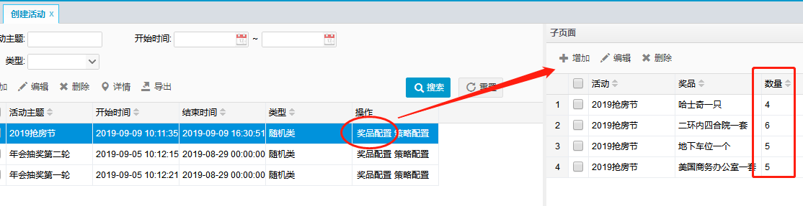
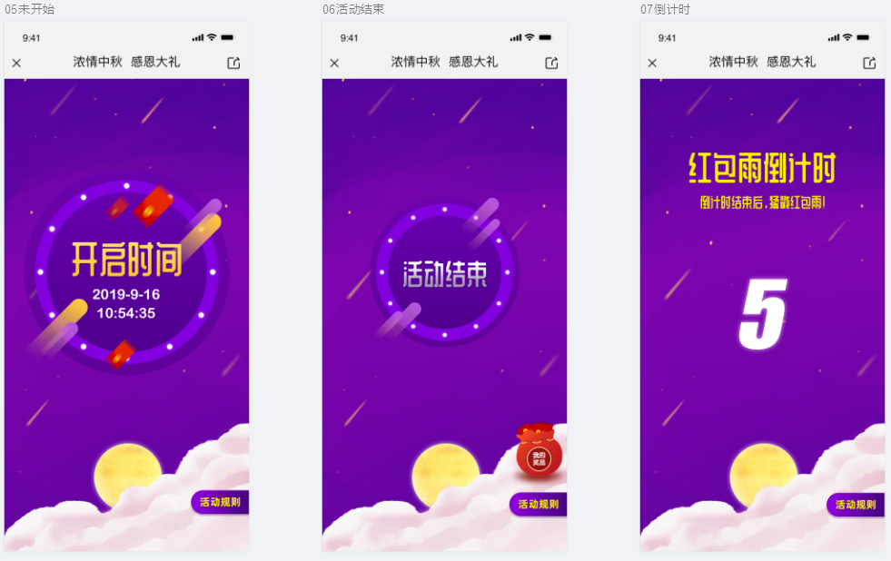

# 项目概述与技术简介

此部分内容主要是了解系统的功能、背景、场景及项目要求。在架构角度思考系统可能面临的问题以及解决方案，还有了解本项目所涉及一些中间件的基础知识。

## 1. 项目概述

### 1.1. 概述

本项目实现了一个完整的红包雨模式抽奖系统，包括管理后台与前端界面。

由管理后台配置相关活动和奖品等信息，前端用户通过参与活动，完成抽奖。

### 1.2. 项目背景

- **电商活动**

互联网的发展中，电商是典型的应用场景。各种促销、活动已成为电商公司必备的业务模块，尤其C端业务，面向普通大众用户。在所有活动中，抽奖是最典型的一种。

- **红包雨**

红包雨活动，是以实现随机派发红包的形式完成宣传与促销。也可以理解为抽奖的一种特殊形式，奖品即红包。

- **企业年会**

公司年会中的抽奖环节更是必不可少。尤其互联网公司，线上抽奖基本成为大家约定俗成的形式。打开手机，参与抽奖。正是本项目所涉及的现实应用场景。

### 1.3. 系统要求

- **并发性**

抽奖系统比如涉及到访问量大的问题。系统涉及所面临的第一关，即活动开始的瞬间，大批用户点击的涌入。怎样设计系统以达到如此高并发情况下的及时响应是本项目的重中之重。

- **库存控制**

抽奖面临的必然是奖品。数量控制是必须要做到精准吻合。不允许出现设置了5个奖品，最终6人中奖这种类似的问题出现。其中的本质是奖品库存的控制。

- **投放策略**

投放策略是指：在活动时间段内，管理员设置好的一堆奖品如何投放？红包何时出现？年会奖品什么时候可以被抽中？

本项目中会给使用最常见的一种策略，即在活动时间内，奖品随机出现。最后还会给出引申，如何灵活扩展实现其他的投放算法。

- **边界控制**

活动的边界是指，活动何时开始，何时结束，倒计时如何控制等问题。开始前要提防用户提前进入抽奖。结束后要即使反馈结果给用户，告知活动已结束。

- **活动自由配置**

活动的配置由后台管理员完成，可以自由配置活动的开始结束时间，主题、活动简介、有哪些奖品、不同等级的用户中奖的策略。这就要求系统必须具备足够的业务灵活度。

- **中奖策略**

每个用户参与抽奖后，要遵从后台管理员所设定的中奖策略，典型的场景是针对用户设置最大中奖数。一旦用户中奖后，要进入计数，达到最大中奖数后，即使活动未结束，用户继续参与，也不能再让其中奖。而是将奖品机会倾向于其他参与者。

## 2. 项目功能展示

### 2.1. 管理后台

#### 2.1.1. 会员管理模块

功能：用户查询、用户新增、删除、修改密码

用户管理为管理员提供基本的用户录入。本项目以企业年会为背景，可参与抽奖的用户由管理员后台直接录入，不允许私自注册其他非法账号。已录入的账号可以在抽奖前端页面中登录，参与抽奖。

在电商面向 C 端用户的情况下，新增一个注册接口，允许用户自行注册参与抽奖。

#### 2.1.2. 会员等级模块

功能：等级新增、删除、编辑

不同等级的会员有不同的中奖策略设置。比如高级别的会员中奖次数更多。详细会涉及下面介绍的活动配置中的策略配置

#### 2.1.3. 活动管理

##### 2.1.3.1. 基础信息配置

功能：新增活动，修改活动，删除活动，配置活动基本信息（开始结束时间，标题，说明）。活动的基本信息管理功能

##### 2.1.3.2. 策略配置

功能：新增，修改，删除策略

策略涉及到用户的中奖次数，可以为不同等级的用户设置不同的最大中奖机会。不设置或者设置为 0 表示次数不限。

##### 2.1.3.3. 奖品配置

功能：添加，删除，编辑奖品

为活动配置响应的奖品，可以添加多个不同的奖品，并为每个奖品设置单独的数量。

#### 2.1.4. 奖品管理

功能：奖品增加，编辑，删除

录入奖品的基本信息，可以供多个活动引用。

#### 2.1.5. 信息管理

##### 2.1.5.1. 中奖统计

功能：只有按条件查询，不涉及其他操作

统计每个活动的奖品总数，以及被抽走的数量。该功能只涉及数据的统计，不涉及新增修改删除，属于只读操作。

##### 2.1.5.2. 中奖列表

功能：基于各种条件查询中奖详情

可以根据所需条件，查询到相关的中奖信息，中奖人信息，奖品信息，中奖时间等。该功能只涉及数据的统计，不涉及新增修改删除，属于只读操作。

#### 2.1.6. 系统管理

##### 2.1.6.1. 操作日志

功能：查询管理员的操作日志

该功能用于记录管理员的操作。可以根据 IP，操作时间内容，以及操作人查询到在后台中的行为。只涉及数据的统计，不涉及新增修改删除，属于只读操作。

### 2.2. 用户前台

#### 2.2.1. 活动列表

#### 2.2.2. 活动详情

#### 2.2.3. 抽奖展示

#### 2.2.4. 个人中心

## 3. 涉及中间件介绍

此部分主要介绍项目中涉及的一些中间件，各个中间件的详细介绍与使用详见各个学习笔记

### 3.1. Redis

### 3.2. Zookeeper

### 3.3. RabbitMQ

### 3.4. Nginx

