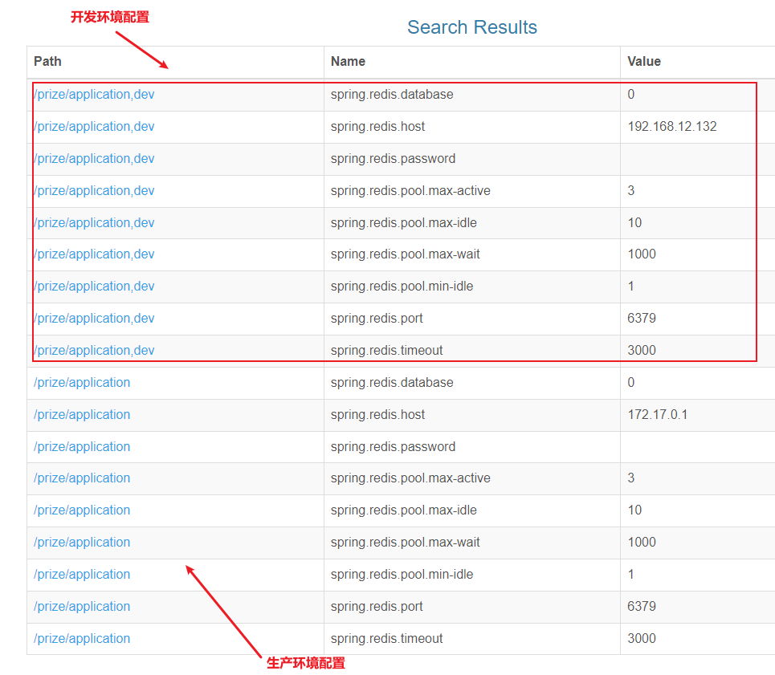

# 系统设计

此部分针对整个项目的系统设计，包含整个系统的架构设计，数据库表设计；系统交互时序；缓存体系设计

## 1. 建模

### 1.1. ER图


### 1.2. 数据表

#### 1.2.1. 奖品表（card_product）

|  字段  |       类型        |   备注   |
| :---: | ---------------- | -------- |
|  id   | int(10) unsigned |          |
| name  | varchar(255)     | 奖品名称 |
|  pic  | varchar(255)     | 图片     |
| info  | varchar(1000)    | 简介     |
| price | decimal(10,2)    | 市场价   |

#### 1.2.2. 活动表（card_game）

|    字段    |       类型        |           备注           |
| :-------: | ---------------- | ------------------------ |
|    id     | int(10) unsigned |                          |
|   title   | varchar(255)     | 活动主题                  |
|   info    | varchar(1000)    | 活动简介                  |
| starttime | datetime         | 开始时间                  |
|  endtime  | datetime         | 结束时间                  |
|   type    | tinyint(2)       | 类型（1=概率类，2=随机类） |
|  status   | tinyint(1)       | 状态（0=新建，1=已加载）   |

#### 1.2.3. 会员表（card_user）

|    字段     |       类型        |   备注   |
| :--------: | ---------------- | -------- |
|     id     | int(11) unsigned |          |
|   uname    | varchar(20)      | 用户名   |
|   passwd   | varchar(50)      | 密码     |
|  realname  | varchar(10)      | 姓名     |
|   idcard   | varchar(18)      | 身份证号 |
|   phone    | varchar(15)      | 手机号码 |
|   level    | smallint(6)      | 等级     |
| createtime | datetime         | 注册时间 |
| updatetime | datetime         | 更新时间 |

#### 1.2.4. 策略表（card_game_rules）

|     字段     |       类型        |         备注          |
| :---------: | ---------------- | --------------------- |
|     id      | int(11) unsigned |                       |
|   gameid    | int(11) unsigned | 活动id                |
|  userlevel  | smallint(6)      | 会员等级               |
| enter_times | smallint(6)      | 可抽奖次数（0为不限）   |
| goal_times  | smallint(6)      | 最大中奖次数（0为不限） |

#### 1.2.5. 中奖纪录（card_user_hit）

|    字段    |       类型        |   备注   |
| :-------: | ---------------- | -------- |
|    id     | int(10) unsigned |          |
|  gameid   | int(10) unsigned | 活动id   |
|  userid   | int(10) unsigned | 用户     |
| productid | int(10) unsigned | 奖品     |
|  hittime  | datetime         | 中奖时间 |

#### 1.2.6. 奖品活动关联关系（card_game_product）

|    字段    |       类型        |  备注  |
| :-------: | ---------------- | ------ |
|    id     | int(10) unsigned |        |
|  gameid   | int(11) unsigned | 活动id |
| productid | int(11) unsigned | 奖品id |
|  amount   | smallint(6)      | 数量   |

### 1.3. 视图

#### 1.3.1. 中奖信息（view_card_user_hit）

|    字段    |       类型        |     备注      |
| :-------: | ---------------- | ------------- |
|    id     | int(10) unsigned |               |
|   title   | varchar(255)     | 活动主题       |
|   type    | varchar(100)     | 类型（值）     |
|   uname   | varchar(20)      | 用户名         |
| realname  | varchar(10)      | 姓名          |
|  idcard   | varchar(18)      | 身份证号       |
|   phone   | varchar(15)      | 手机号码       |
|   level   | varchar(100)     | 会员等级（值） |
|   name    | varchar(255)     | 奖品名称       |
|   price   | decimal(10,2)    | 市场价         |
|  gameid   | int(10) unsigned | 活动          |
|  userid   | int(10) unsigned | 用户          |
| productid | int(10) unsigned | 奖品          |
|  hittime  | datetime         | 中奖时间       |

#### 1.3.2. 奖品数统计（view_game_curinfo）

|    字段    |       类型        |    备注    |
| :-------: | ---------------- | --------- |
|    id     | int(10) unsigned |           |
|   title   | varchar(255)     | 活动主题   |
|   type    | varchar(100)     | 类型（值） |
| starttime | datetime         | 开始时间   |
|  endtime  | datetime         | 结束时间   |
|   type    | varchar(100)     | 类型（值） |
|   total   | decimal(27,0)    |           |
|    hit    | bigint(21)       |           |

## 2. 概要设计

### 2.1. 业务系统架构拓扑图


### 2.2. 软件系统架构拓扑图


### 2.3. 设计原则

#### 2.3.1. 动静分离

- 静态文件分离，nginx直接响应，不要再绕后台应用机器

#### 2.3.2. 微服务化

- 将模块细粒度拆分，微服务化
- 借助 docker swarm 的容器管理功能，实现不同服务的副本部署，滚动更新
- 在本项目中，api 模块就部署了3份，以适应前端的高并发

#### 2.3.3. 负载均衡

- 多个实例之间通过 nginx 做负载均衡，提升并发性能
- 本项目模块均部署在1台节点。生产环境涉及多台机器，用通过 `upstream` 配置实现。

#### 2.3.4. 异步消息

- 中奖后，中奖人及奖品信息要持久化到数据库。引入 rabbitmq，将抽奖操作与数据库操作异步隔离。
- 抽奖中奖后，只需要将中奖信息放入 rabbitmq，并立即返回中奖信息给前端用户。
- 后端 msg 模块消费 rabbitmq 消息，缓慢处理。

#### 2.3.5. 缓存预热

- 每隔 1 分钟扫描一次活动表，查询未来 1 分钟内将要开始的活动。
- 将扫到的活动加载进 redis，包括活动详细信息，中奖策略信息，奖品信息，抽奖令牌。
- 活动正式开始后，基于 redis 数据做查询，不必再与数据库打交道。

### 2.4. 交互序列图


### 2.5. 缓存体系

缓存体系概览图：


#### 2.5.1. 活动基本信息

k-v形式存储，以活动 id 为 key，活动对象为 value，永不超时。示例代码如下：

```java
redisUtil.set(RedisKeys.INFO + game.getId(), game, ‐1);
```

#### 2.5.2. 活动策略信息

hash类型存储，以 `活动 id` 为 key，用户等级为 hashkey，策略值为 value。示例代码如下：

```java
redisUtil.hset(RedisKeys.MAXGOAL + game.getId(), r.getUserlevel() + "", r.getGoalTimes());
redisUtil.hset(RedisKeys.MAXENTER + game.getId(), r.getUserlevel() + "", r.getEnterTimes());
```

#### 2.5.3. 抽奖令牌桶

使用双端队列，即 list 类型存储，以 `活动 id` 为 key，在活动时间段内，随机生成时间戳做令牌，有多少个奖品就生成多少个令牌。令牌即奖品发放的时间点。从小到大排序后从右侧入队。示例代码如下：

```java
redisUtil.rightPushAll(RedisKeys.TOKENS + game.getId(), tokenList);
```

#### 2.5.4. 奖品映射信息

k-v形式存储 , 以 `活动id_令牌` 为 key，奖品信息为 value，会员获取到令牌后，如果令牌有效，则用令牌 token 值，来这里获取奖品详细信息。示例代码如下：

```java
redisUtil.set(RedisKeys.TOKEN + game.getId() + "_" + token, productMap.get(cgp.getProductid()), expire);
```

#### 2.5.5. 令牌设计技巧

假设活动时间间隔太短，奖品数量太多。那么极有可能产生的时间戳发生重复。

解决技巧：额外再附加一个随机因子。将 `(时间戳 * 1000 + 3位随机数)`作为令牌。抽奖时，将抽中的`令牌/1000`，还原真实的时间戳。示例代码如下：

```java
// 活动持续时间（ms）
long duration = end ‐ start;
long rnd = start + new Random().nextInt((int) duration);
// 为什么乘1000，再额外加一个随机数呢？ ‐ 防止时间段奖品多时重复
long token = rnd * 1000 + new Random().nextInt(999);
```

#### 2.5.6. 中奖计数

k-v形式存储，以 `活动id_用户id` 作为 key，中奖数为 value，利用 redis 原子性，中奖后使用 `incr` 命令增加计数。示例代码如下：

```java
redisUtil.incr(RedisKeys.USERHIT + gameid + "_" + user.getId(), 1);
```

#### 2.5.7. 中奖逻辑判断

抽奖时，从令牌桶左侧出队和当前时间比较，如果令牌时间戳小于等于当前时间，令牌有效，表示中奖。大于当前时间，则令牌无效，将令牌还回，从左侧压入队列。

## 3. 管理后台框架选型

此管理后台直接借助开源zcurd开发平台，完成后台基本的增删改查。

> zcurd 项目地址：https://gitee.com/515097842/zcurd

### 3.1. 项目初始化

【backend】 :  管理后台源码。是maven工程

1. 导入到 IDE。修改相关的配置文件
2. 创建名称为 prize 的数据库（*可修改为其他名称，但需要相应修改工程的连接数据库的相应配置文件*），导入工程 `resources/sql` 目录下的数据库脚本，初始化相关表与数据

### 3.2. 项目启动

使用 maven 命令启动项目即可

```shell
tomcat7:run
```

- 管理后台访问地址：localhost:8888 
- 账号/密码：admin/123456、zcurd/123456

## 4. 部署中间件

在 linux 系统中启动项目所需要的中间件，分别是：Redis、Zookeeper、RabbitMQ、Nginx。此项目所有中间件均使用 docker 进行部署

> 注：以下以均已下载 docker 镜像为前提，再执行的部署脚本，相关的启动脚本的存放位置如下：
>
> - 实战项目 `\prize-event-project\document\scripts\`
> - 测试的linux系统(192.168.12.132) `/usr/local/script`

### 4.1. Redis 启动（port: 6379）

```shell
# 下载镜像
docker pull redis

# 运行容器
docker run -id --name=redis -p 6379:6379 redis
```

### 4.2. Zookeeper（port: 32181）

```shell
# 下载镜像
docker pull zookeeper

# 运行容器
docker run -id --name=zookeeper -v /opt/data/zksingle:/data -p 2181:2181 -e ZOO_LOG4J_PROP="INFO,ROLLINGFILE" zookeeper
```

### 4.3. RabbitMQ（port: 5672、15672）

```shell
# 下载镜像
docker pull rabbitmq

# 运行容器
docker run -d -p 15672:15672  -p 5672:5672  --name rabbitmq --hostname=my-rabbitmq rabbitmq:management
```

### 4.4. Nginx（port: 80）

```shell
# 下载镜像
docker pull nginx

# 运行容器
docker rm -f nginx
docker run --name nginx -v /opt/data/nginx/html:/usr/share/nginx/html:ro -v /opt/app/back/upload:/usr/share/nginx/upload:ro -v /opt/data/nginx/nginx.conf:/etc/nginx/nginx.conf:ro -p 80:80 --privileged=true -d nginx
```

创建容器时可能会报错：


提示 `Check if the specified host path exists and is the expected type`。意思是docker 在挂载时当成目录，所以需要进入挂载的目录，将生成的目录删除（*示例是nginx.conf*），再创建相应名称的文本文件即可

```bash
cd /opt/data/nginx/
rm -rf nginx.conf/
# 创建文件
touch nginx.conf
```

启动 nginx 前，需要修改 `nginx.conf` 配置文件

### 4.5. MySQL（port: 3306）

```shell
# 搜索镜像
docker search mysql
# 拉取镜像
docker pull mysql:5.7
# 创建守护式容器
docker run -id --name=mysql3306 -v /opt/data/mysql:/var/lib/mysql -p3306:3306 -e MYSQL_ROOT_PASSWORD=123456 mysql:5.7.4
# 防火墙中打开3306端口
firewall-cmd --zone=public --add-port=3306/tcp --permanent
```

## 5. 前台工程各模块介绍

【frontend】工程是接口微服务源码，项目基于springcloud构建微服务体系


### 5.1. 聚合工程（frontend）

此工程是所有项目共用的依赖及版本定义。继承自 springboot 2.1.7.RELEASE，依赖 spring cloud Greenwich.SR2。以下是部分依赖片段：

```xml
<parent>
    <groupId>org.springframework.boot</groupId>
    <artifactId>spring-boot-starter-parent</artifactId>
    <version>2.1.7.RELEASE</version>
</parent>

....

<dependencyManagement>
    <dependencies>
        <dependency>
            <groupId>org.springframework.cloud</groupId>
            <artifactId>spring-cloud-dependencies</artifactId>
            <version>Greenwich.SR2</version>
            <scope>import</scope>
            <type>pom</type>
        </dependency>
        ....
    </dependencies>
</dependencyManagement>
```

### 5.2. 公共模块（commons）

分页、密码、统一结果dto等工具类，mybatis生成的实体，mapper，redis及rabbit的配置bean

### 5.3. 注册中心（eureka）

cloud 官方推荐的微服务注册中心，所有的服务模块都在 eureka 中注册。

### 5.4. 调度模块（job）

集成当当网开源的 elastic-job，活动的调度扫描预热等定时任务在该模块中。

### 5.5. 消息模块（msg）

RabbitMQ 消息消费端，用户中奖后将中奖信息发送到 RabbitMQ，msg模块将消费消息，将中奖信息写入db。

### 5.6. 接口模块（api）

提供给前端页面的 rest 接口模块，如：抽奖接口，活动查询接口，中奖信息接口等

## 6. 微服务框架集成

### 6.1. 集成 zookeeper 配置中心

spring cloud 配置中心使用 zookeeper，以 api 工程为例

#### 6.1.1. 引入 zookeeper 配置中心依赖

此依赖已经在父级聚合工程中引入：

```xml
<!-- 配置中心 zookeeper -->
<dependency>
    <groupId>org.springframework.cloud</groupId>
    <artifactId>spring-cloud-starter-zookeeper-config</artifactId>
</dependency>
```

#### 6.1.2. 创建 bootstrap.properties 配置文件

在 api 项目的 resources 目录下创建 bootstrap.properties 配置文件（此配置文件的优先最高）。此文件核心的配置内容是 zookeeper 配置中心的连接地址。具体配置内容如下：

```properties
## 配置应用名称
spring.application.name=api
## 配置zookeeper地址
spring.cloud.zookeeper.connect-string=192.168.12.132:2181
spring.cloud.zookeeper.config.root=prize
spring.profiles.active=dev
```

#### 6.1.3. 配置查找的优先级

使用 zookeeper 配置中心的加载优先级是：

```
本地配置 ->  `模块,环境` 节点 -> `模块` 节点 -> `application,环境` 公共节点 -> `application` 公共节点
```

以 api 工程为例，会先加载本地配置文件 bootstrap.properties，再根据当前配置的 `profiles.active` 属性，加载 `api,dev` 节点，再加载 `api` 节点，再加载公共的 `application,dev`，最后加载公共的 `application` 节点


### 6.2. 6.2.集成 Redis

#### 6.2.1. 引入 Spring Data Redis 依赖

本项目使用 Spring Data Redis，因为可能会有多个模块用到缓存，所以在 `commons` 工程引入 redis 客户端的依赖，其他工程需要时再依赖 `commons` 模块即可：

```xml
<!-- Spring Data Redis 依赖 -->
<dependency>
    <groupId>org.springframework.boot</groupId>
    <artifactId>spring-boot-starter-data-redis</artifactId>
    <!--<scope>require</scope>-->
</dependency>
```

#### 6.2.2. Redis 相关配置

在 zookeeper 配置中心中修改 Redis 的配置。此部分为公共配置，所以在 `/prize/application` 节点中定义。*如开发时有不一样的配置，在`application,dev`节点下设置相同配置即可覆盖*

```properties
/prize/application=spring.redis.database=0
/prize/application=spring.redis.host=172.17.0.1
/prize/application=spring.redis.password=
/prize/application=spring.redis.pool.max-active=3
/prize/application=spring.redis.pool.max-idle=10
/prize/application=spring.redis.pool.max-wait=1000
/prize/application=spring.redis.pool.min-idle=1
/prize/application=spring.redis.port=6379
/prize/application=spring.redis.timeout=3000
```



### 6.3. 集成 elastic-job 定时任务

#### 6.3.1. 引入 elastic-job 依赖

定时调度只有 `job` 模块会使用，所只在 `job` 模块工程中引入 elastic-job 的依赖

> 注意：curator版本会报冲突，排除后，手动引入版本

```xml
<properties>
    ....
    <job.version>2.1.5</job.version>
    <curator.version>2.10.0</curator.version>
</properties>

<dependencies>
    <!-- elastic-job 框架核心jar包 -->
    <dependency>
        <groupId>com.dangdang</groupId>
        <artifactId>elastic-job-lite-core</artifactId>
        <version>${job.version}</version>
        <exclusions>
            <exclusion>
                <artifactId>curator-client</artifactId>
                <groupId>org.apache.curator</groupId>
            </exclusion>
            <exclusion>
                <artifactId>curator-framework</artifactId>
                <groupId>org.apache.curator</groupId>
            </exclusion>
            <exclusion>
                <artifactId>curator-recipes</artifactId>
                <groupId>org.apache.curator</groupId>
            </exclusion>
        </exclusions>
    </dependency>
    <!-- 手动引入 curator 依赖，指定不会冲突的版本 -->
    <dependency>
        <groupId>org.apache.curator</groupId>
        <artifactId>curator-framework</artifactId>
        <version>${curator.version}</version>
    </dependency>
    <dependency>
        <groupId>org.apache.curator</groupId>
        <artifactId>curator-client</artifactId>
        <version>${curator.version}</version>
    </dependency>
    <dependency>
        <groupId>org.apache.curator</groupId>
        <artifactId>curator-recipes</artifactId>
        <version>${curator.version}</version>
    </dependency>

    <dependency>
        <groupId>com.dangdang</groupId>
        <artifactId>elastic-job-lite-spring</artifactId>
        <version>${job.version}</version>
    </dependency>

    <!--添加数据相关的驱动主要是为了记录任务相关的一些数据，日志-->
    <dependency>
        <groupId>com.alibaba</groupId>
        <artifactId>druid-spring-boot-starter</artifactId>
    </dependency>
    <dependency>
        <groupId>org.springframework.boot</groupId>
        <artifactId>spring-boot-autoconfigure</artifactId>
    </dependency>
    <dependency>
        <groupId>mysql</groupId>
        <artifactId>mysql-connector-java</artifactId>
    </dependency>

    <dependency>
        <groupId>org.springframework.boot</groupId>
        <artifactId>spring-boot-starter-jdbc</artifactId>
    </dependency>

    <dependency>
        <groupId>com.moon.prize</groupId>
        <artifactId>commons</artifactId>
        <version>0.0.1-SNAPSHOT</version>
    </dependency>
</dependencies>
```

#### 6.3.2. elastic-job 相关配置

以下是 elastic-job 相关配置，保存到 txt 文档，通过 zkui 导入到 zookeeper 即可。

```properties
/prize/job,dev=elaticjob.zookeeper.session-timeout-milliseconds=5000
/prize/job,dev=spring.datasource.druid.joblog.driver-class-name=com.mysql.jdbc.Driver
/prize/job,dev=spring.datasource.druid.joblog.password=root
/prize/job,dev=spring.datasource.druid.joblog.url=jdbc:mysql://192.168.12.132:3306/event_log
/prize/job,dev=spring.datasource.druid.joblog.username=root
/prize/job,dev=spring.jpa.database=mysql
/prize/job,dev=spring.jpa.hibernate.ddl-auto=update
/prize/job,dev=spring.jpa.show-sql=true
/prize/job=elaticjob.zookeeper.session-timeout-milliseconds=5000
/prize/job=spring.datasource.druid.joblog.driver-class-name=com.mysql.jdbc.Driver
/prize/job=spring.datasource.druid.joblog.password=root
/prize/job=spring.datasource.druid.joblog.url=jdbc:mysql://172.17.0.1:3306/event_log
/prize/job=spring.datasource.druid.joblog.username=root
/prize/job=spring.jpa.database=mysql
/prize/job=spring.jpa.hibernate.ddl-auto=update
/prize/job=spring.jpa.show-sql=true
```

### 6.4. 集成 RabbitMQ

#### 6.4.1. 引入 RabbitMQ 依赖

因为可能会有多个需要发送与消费消息，所以在 `commons` 工程引入 RabbitMQ 的依赖，其他工程需要时再依赖 `commons` 模块即可：

```xml
<!-- rabbitmq -->
<dependency>
    <groupId>org.springframework.boot</groupId>
    <artifactId>spring-boot-starter-amqp</artifactId>
</dependency>
```

#### 6.4.2. RabbitMQ 相关配置

以下是 RabbitMQ 相关配置，保存到 txt 文档，通过 zkui 导入到 zookeeper 即可。

```properties
/prize/application,dev=spring.rabbitmq.host=192.168.12.132
/prize/application,dev=spring.rabbitmq.password=guest
/prize/application,dev=spring.rabbitmq.port=5672
/prize/application,dev=spring.rabbitmq.publisher-confirms=true
/prize/application,dev=spring.rabbitmq.username=guest
/prize/application,dev=spring.rabbitmq.virtual-host=/
/prize/application=spring.rabbitmq.host=172.17.0.1
/prize/application=spring.rabbitmq.password=guest
/prize/application=spring.rabbitmq.port=5672
/prize/application=spring.rabbitmq.publisher-confirms=true
/prize/application=spring.rabbitmq.username=guest
/prize/application=spring.rabbitmq.virtual-host=/
```

### 6.5. 集成 MySQL 数据源 druid

#### 6.5.1. 引入数据源相关依赖

在父级聚合项目中 `<dependencyManagement>` 进行版本控制，各自模块自行依赖即可：

```xml
<!-- 数据源 -->
<dependency>
    <groupId>mysql</groupId>
    <artifactId>mysql-connector-java</artifactId>
    <version>5.1.31</version>
</dependency>
<dependency>
    <groupId>com.alibaba</groupId>
    <artifactId>druid-spring-boot-starter</artifactId>
    <version>1.1.10</version>
</dependency>
```

#### 6.5.2. 数据源相关配置

```properties
/prize/application=spring.datasource.connectionProperties=druid.stat.mergeSql=true;druid.stat.slowSqlMillis=5000
/prize/application=spring.datasource.driver-class-name=com.mysql.jdbc.Driver
/prize/application=spring.datasource.filters=stat,wall,log4j
/prize/application=spring.datasource.initialSize=5
/prize/application=spring.datasource.maxActive=20
/prize/application=spring.datasource.maxPoolPreparedStatementPerConnectionSize=20
/prize/application=spring.datasource.maxWait=60000
/prize/application=spring.datasource.minEvictableIdleTimeMillis=300000
/prize/application=spring.datasource.minIdle=5
/prize/application=spring.datasource.password=root
/prize/application=spring.datasource.poolPreparedStatements=true
/prize/application=spring.datasource.testOnBorrow=false
/prize/application=spring.datasource.testOnReturn=false
/prize/application=spring.datasource.testWhileIdle=true
/prize/application=spring.datasource.timeBetweenEvictionRunsMillis=60000
/prize/application=spring.datasource.type=com.alibaba.druid.pool.DruidDataSource
/prize/application=spring.datasource.url=jdbc:mysql://172.17.0.1/prize?useUnicode=true&characterEncoding=utf-8
/prize/application=spring.datasource.useGlobalDataSourceStat=true
/prize/application=spring.datasource.username=root
/prize/application=spring.datasource.validationQuery=SELECT 'x'
/prize/job,dev=spring.datasource.druid.joblog.driver-class-name=com.mysql.jdbc.Driver
/prize/job,dev=spring.datasource.druid.joblog.password=root
/prize/job,dev=spring.datasource.druid.joblog.url=jdbc:mysql://192.168.12.132:3306/event_log
/prize/job,dev=spring.datasource.druid.joblog.username=root
/prize/job=spring.datasource.druid.joblog.driver-class-name=com.mysql.jdbc.Driver
/prize/job=spring.datasource.druid.joblog.password=root
/prize/job=spring.datasource.druid.joblog.url=jdbc:mysql://192.168.12.132:3306/event_log
/prize/job=spring.datasource.druid.joblog.username=root
```

### 6.6. 集成 mybatis

#### 6.6.1. 引入 mybatis 依赖

在父级聚合项目中 `<dependencyManagement>` 进行版本控制，各自模块自行依赖即可：

```xml
<!-- mybatis -->
<dependency>
    <groupId>org.mybatis.spring.boot</groupId>
    <artifactId>mybatis-spring-boot-starter</artifactId>
    <version>1.3.2</version>
</dependency>
```

#### 6.6.2. mybatis 相关配置

通过 zkui 服务直接修改配置即可

```properties
/prize/application,dev=mybatis.mapper-locations=classpath:mapper/*.xml
/prize/application=mybatis.mapper-locations=classpath:mapper/*.xml
```

### 6.7. 集成 redis session

#### 6.7.1. 引入 session 依赖

在 `commons` 工程引入 spring-session-data-redis 客户端的依赖，其他工程需要时再依赖 `commons` 模块即可：

```xml
<!-- redis 处理 session -->
<dependency>
    <groupId>org.springframework.session</groupId>
    <artifactId>spring-session-data-redis</artifactId>
</dependency>
```

#### 6.7.2. 相关配置

通过 zkui 服务直接修改配置即可

```properties
/prize/application,dev=spring.session.store-type=redis
/prize/application=spring.session.store-type=redis
```

## 7. 项目相关工具框架

### 7.1. zkui

zkui 是 zookeeper 的一个管理工具，具有登录界面，及zk中节点和值的 crud 操作入口，支持导入导出功能。

#### 7.1.1. 配置文件

在【frontend】目录中的 config.cfg 文件，是 zkui 的项目配置文件

```properties
#Server Port
serverPort=9090
#Comma seperated list of all the zookeeper servers
zkServer=192.168.12.132:2181
#Http path of the repository. Ignore if you dont intent to upload files from repository.
scmRepo=http://myserver.com/@rev1=
#Path appended to the repo url. Ignore if you dont intent to upload files from repository.
scmRepoPath=//appconfig.txt
#if set to true then userSet is used for authentication, else ldap authentication is used.
ldapAuth=false
ldapDomain=mycompany,mydomain
#ldap authentication url. Ignore if using file based authentication.
ldapUrl=ldap://<ldap_host>:<ldap_port>/dc=mycom,dc=com
#Specific roles for ldap authenticated users. Ignore if using file based authentication.
ldapRoleSet={"users": [{ "username":"domain\\user1" , "role": "ADMIN" }]}
userSet = {"users": [{ "username":"admin" , "password":"admin","role": "ADMIN" },{ "username":"appconfig" , "password":"appconfig","role": "USER" }]}
#Set to prod in production and dev in local. Setting to dev will clear history each time.
env=prod
jdbcClass=org.h2.Driver
jdbcUrl=jdbc:h2:zkui
jdbcUser=root
jdbcPwd=manager
#If you want to use mysql db to store history then comment the h2 db section.
#jdbcClass=com.mysql.jdbc.Driver
#jdbcUrl=jdbc:mysql://localhost:3306/zkui
#jdbcUser=root
#jdbcPwd=manager
loginMessage=Please login using admin/manager or appconfig/appconfig.
#session timeout 5 mins/300 secs.
sessionTimeout=60000
#Default 5 seconds to keep short lived zk sessions. If you have large data then the read will take more than 30 seconds so increase this accordingly. 
#A bigger zkSessionTimeout means the connection will be held longer and resource consumption will be high.
zkSessionTimeout=50
#Block PWD exposure over rest call.
blockPwdOverRest=false
#ignore rest of the props below if https=false.
https=false
keystoreFile=/home/user/keystore.jks
keystorePwd=password
keystoreManagerPwd=password
# The default ACL to use for all creation of nodes. If left blank, then all nodes will be universally accessible
# Permissions are based on single character flags: c (Create), r (read), w (write), d (delete), a (admin), * (all)
# For example defaultAcl={"acls": [{"scheme":"ip", "id":"192.168.1.192", "perms":"*"}, {"scheme":"ip", id":"192.168.1.0/24", "perms":"r"}]
defaultAcl=
# Set X-Forwarded-For to true if zkui is behind a proxy
X-Forwarded-For=false
```

#### 7.1.2. 启动项目

修改 config.cfg 配置文件后，可以使用以下命令来更新 zkui.jar 中的配置文件。

```bash
jar uvf zkui.jar config.cfg
```

启动

```bash
java -jar zkui.jar
```

#### 7.1.3. 导入 zookeeper 数据

项目的  `\prize-event-project\document\zk\zkui.txt` 文件是微服务配置项。启动 zkui 后，使用 admin/admin登陆，通过 zkui 导入到 zookeeper 作为配置
