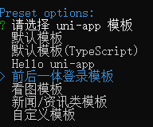
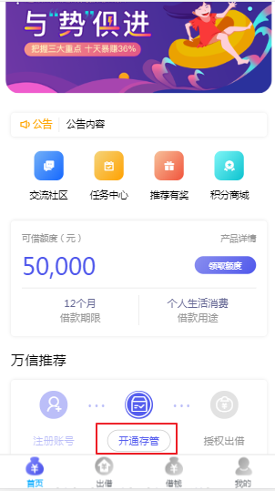

# 前端环境搭建与用户注册开户功能

## 1. 前端环境搭建

前端工程使用了 uni-app 框架， uni-app 是一个使用 Vue.js 开发跨平台应用的前端框架，开发者编写一套代码，可编译到 iOS、 Android、 H5、小程序等多个平台上运行。

> 本项目不涉及前端开发的知识，只需要初始化前端环境，导入前端项目成品代码即可。

### 1.1. 前端开发工具推荐

目前比较流行的前端开发工具有很多，如：VSCode、webstorm、HBuilder X。本示例项目使用是 VSCode

### 1.2. 初始化工程项目

#### 1.2.1. 环境安装

- 全局安装 vue-cli

```bash
npm install -g @vue/cli
```

#### 1.2.2. 创建 uni-app

> 可以使用 的 HBuilderX 直接创建，HBuilderX内置相关环境，开箱即用，无需配置node.js。因为本人是使用 vsCode，所以需要使用安装 node.js 与使用命令行初始化项目

创建正式版 uni-app

```bash
vue create -p dcloudio/uni-preset-vue wanxinp2p-frontend
```



## 2. 前后端开发步骤与编码规范

本项目是基于前后端分离的架构进行开发，前后端分离架构总体上包括前端和服务端，通常是多人或多团队协作并行开发，开发步骤如下：

1. 需求分析：梳理用户的需求，分析业务流程
2. 接口定义：根据需求分析定义接口
3. 服务端和前端并行开发
    - 前后端开发人员依据接口进行开发。
    - 服务端开发人员根据接口实现业务功能，每个功能开发完毕后，需要通过 Swagger 或 Postman 进行功能测试。前端开发人员制作用户操作界面，然后请求服务端接口完成业务处理。
4. 前后端集成测试：服务端业务功能开发完毕后，一般会先通过 Swagger 或 Postman 等工具进行测试，然后再和前端进行集成测试。

> 每个公司都有自己的编码规范，仿照阿里巴巴的《Java开发手册》，针对P2P项目也制定了一个编码规范，请查阅资料文件夹中的“万信金融p2p项目开发规范.pdf”

## 3. 需求概述

### 3.1. 项目中的开户概述

开户是指借款用户和投资用户在交易前都需要在银行存管系统开通个人存管账户，在开户前借款用户和投资用户还需要在万信金融平台注册为平台的用户。

在开户流程中银行存管系统是一个很重要的系统，它是当前P2P平台最常见的一种模式，为了保证资金不流向P2P平台，由银行存管系统去管理借款用户和投资用户的资金，P2P平台与银行存管系统进行接口交互为借款用户和投资用户搭建交易的桥梁，它们之间的关系如下：


### 3.2. 业务流程梳理

#### 3.2.1. 用户注册与登录

注册与登录流程如下：


1. 用户打开客户端界面


2. 输入手机号，点击“点击发送”按钮 ，系统向手机发送验证码
3. 手机收到验证码，输入验证码
4. 点击登录
    - 如果你是没有注册过的用户，则先自动注册用户并登录成功
    - 如果你是已经注册过的用户，则直接进行登录

#### 3.2.2. 用户开户

用户开户流程如下：


1. 进入开户界面
    - 借款人或投资人在平台交易前平台会校验是否开户，如果未开户自动进入开户界面；
    - 借款人或投资人也可以在首页点击“开通存管”



2. 在开户界面填写开户信息


3. 填写信息完成后点击“确认协议并注册 ”，确认开户信息是否正确，同时需要设置交易密码。


4. 开户成功


## 4. 用户注册功能开发

### 4.1. 需求分析

用户注册功能交互流程如下：


用户注册功能具体是在网关服务、用户中心服务、统一账户服务、验证码服务几个微服务之间进行交互，各个微服务介绍如下：

- 网关服务：前端发送的所有请求都必须经过网关服务，才能到达后端微服务，网关是一个无处不在的服务，用来保护后端微服务，只有经过它过滤、认证和鉴权才能访问后端微服务。
- 用户中心服务：为借款人和投资人提供用户信息管理服务，包括：注册、开户、充值、提现等。
- 统一账户服务：对借款人和投资人的登录平台账号进行管理，包括：注册账号、账号权限管理等。
- 验证码服务：提供短信、邮件、图片等各种验证码的生成的校验服务。

用户注册功能的具体交互流程：

1. 前端请求统一账户服务获取短信验证码
2. 前端校验手机号是否存在，校验验证码是否正确，如果不存在则说明未注册
3. 前端发起注册请求，请求用户中心服务
4. 用户中心服务请求统一账户服务保存注册信息
5. 用户中心服务保存用户信息
6. 注册成功

### 4.2. 搭建统一账户服务


