# 第 02 章 前端环境搭建与短信校验注册功能

## 1. 前端环境搭建

前端工程使用了 uni-app 框架， uni-app 是一个使用 Vue.js 开发跨平台应用的前端框架，开发者编写一套代码，可编译到 iOS、 Android、 H5、小程序等多个平台上运行。

> 本项目不涉及前端开发的知识，只需要初始化前端环境，导入前端项目成品代码即可。

### 1.1. 前端开发工具推荐

目前比较流行的前端开发工具有很多，如：VSCode、webstorm、HBuilder X。本示例项目使用是 VSCode

### 1.2. 初始化工程项目

#### 1.2.1. 环境安装

全局安装 vue-cli

```bash
npm install -g @vue/cli
```

#### 1.2.2. 创建 uni-app

> 可以使用 的 HBuilderX 直接创建，HBuilderX 内置相关环境，开箱即用，无需配置 node.js。因为本人是使用 vsCode，所以需要使用安装 node.js 与使用命令行初始化项目

创建正式版 uni-app

```bash
vue create -p dcloudio/uni-preset-vue wanxinp2p-frontend
```

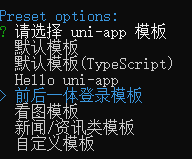

#### 1.2.3. 项目启动

使用已经提供好的前端项目，代替新建的项目的 src 文件内容即可。最后项目根目录，执行以下命令启动项目：

```bash
npm run dev:h5
```

> 注：如果启动提示 `Syntax Error: Error: Cannot find module 'node-sass'` 的错误，则执行 `npm i -D sass` 安装 node-sass 即可

启动访问地址：http://localhost:8081/

## 2. 前后端开发步骤与编码规范

本项目是基于前后端分离的架构进行开发，前后端分离架构总体上包括前端和服务端，通常是多人或多团队协作并行开发，开发步骤如下：

1. 需求分析：梳理用户的需求，分析业务流程
2. 接口定义：根据需求分析定义接口
3. 服务端和前端并行开发
   - 前后端开发人员依据接口进行开发。
   - 服务端开发人员根据接口实现业务功能，每个功能开发完毕后，需要通过 Swagger 或 Postman 进行功能测试。前端开发人员制作用户操作界面，然后请求服务端接口完成业务处理。
4. 前后端集成测试：服务端业务功能开发完毕后，一般会先通过 Swagger 或 Postman 等工具进行测试，然后再和前端进行集成测试。

> 每个公司都有自己的编码规范，仿照阿里巴巴的《Java 开发手册》，针对 P2P 项目也制定了一个编码规范，请查阅资料文件夹中的“万信金融 p2p 项目开发规范.pdf”

## 3. 需求概述

### 3.1. 项目中的开户概述

开户是指借款用户和投资用户在交易前都需要在银行存管系统开通个人存管账户，在开户前借款用户和投资用户还需要在万信金融平台注册为平台的用户。

在开户流程中银行存管系统是一个很重要的系统，它是当前 P2P 平台最常见的一种模式，为了保证资金不流向 P2P 平台，由银行存管系统去管理借款用户和投资用户的资金，P2P 平台与银行存管系统进行接口交互为借款用户和投资用户搭建交易的桥梁，它们之间的关系如下：


### 3.2. 业务流程梳理

#### 3.2.1. 用户注册与登录

注册与登录流程如下：

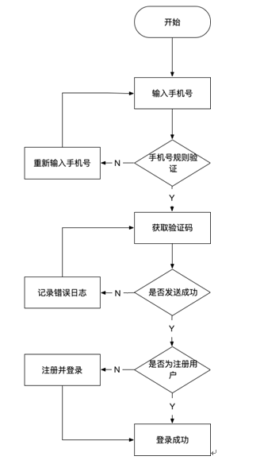

1. 用户打开客户端界面

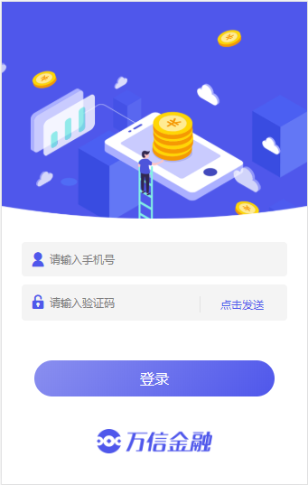

2. 输入手机号，点击“点击发送”按钮 ，系统向手机发送验证码
3. 手机收到验证码，输入验证码
4. 点击登录
   - 如果你是没有注册过的用户，则先自动注册用户并登录成功
   - 如果你是已经注册过的用户，则直接进行登录

#### 3.2.2. 用户开户

用户开户流程如下：

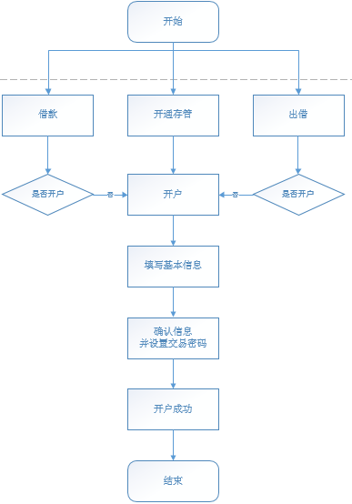

1. 进入开户界面
   - 借款人或投资人在平台交易前平台会校验是否开户，如果未开户自动进入开户界面；
   - 借款人或投资人也可以在首页点击“开通存管”


2. 在开户界面填写开户信息

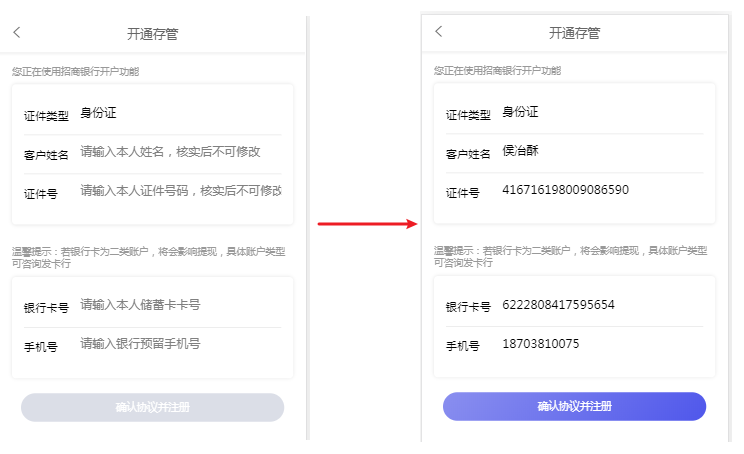

3. 填写信息完成后点击“确认协议并注册 ”，确认开户信息是否正确，同时需要设置交易密码。

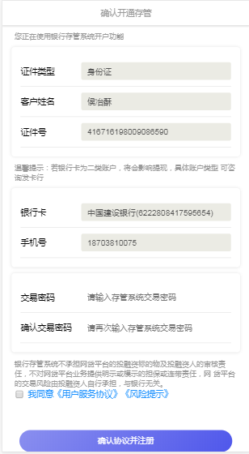

4. 开户成功

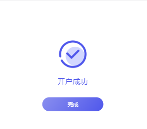

## 4. 用户注册业务功能

### 4.1. 持久层增强框架 Mybatis-Plus 入门

用户注册功能涉及到操作数据库，本项目的数据访问层采用的是 Mybatis-Plus 框架。入门与基础使用详见[《MyBatis-Plus 基础笔记》](/02-后端框架/02-MyBatis/04-MyBatisPlus)

### 4.2. 注册登录流程图分析

用户注册功能交互流程如下：

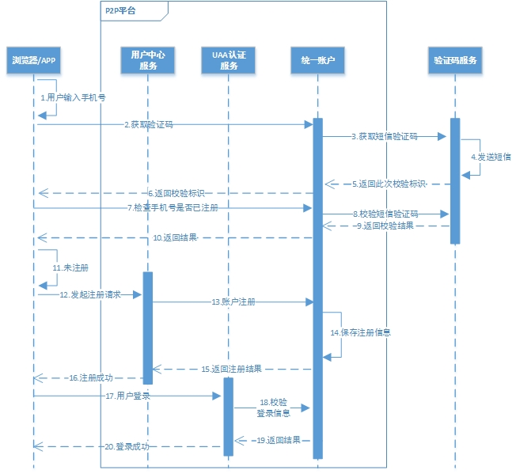

用户注册功能具体是在网关服务、用户中心服务、统一账户服务、验证码服务几个微服务之间进行交互，各个微服务介绍如下：

- 网关服务：前端发送的所有请求都必须经过网关服务，才能到达后端微服务，网关是一个无处不在的服务，用来保护后端微服务，只有经过它过滤、认证和鉴权才能访问后端微服务。
- 用户中心服务：为借款人和投资人提供用户信息管理服务，包括：注册、开户、充值、提现等。
- 统一账户服务：对借款人和投资人的登录平台账号进行管理，包括：注册账号、账号权限管理等。
- 验证码服务：提供短信、邮件、图片等各种验证码的生成的校验服务。

用户注册功能的具体交互流程：

1. 前端请求统一账户服务获取短信验证码
2. 前端校验手机号是否存在，校验验证码是否正确，如果不存在则说明未注册
3. 前端发起注册请求，请求用户中心服务
4. 用户中心服务请求统一账户服务保存注册信息
5. 用户中心服务保存用户信息
6. 注册成功

### 4.3. 搭建统一账户服务

搭建统一账户服务 wanxinp2p-account-service 并编码实现账号校验、注册等功能

#### 4.3.1. 项目依赖

创建 wanxinp2p-account-service（_参考基础工程 wanxinp2p-consumer-service_），添加如下依赖：

```xml
<?xml version="1.0" encoding="UTF-8"?>
<project xmlns="http://maven.apache.org/POM/4.0.0"
         xmlns:xsi="http://www.w3.org/2001/XMLSchema-instance"
         xsi:schemaLocation="http://maven.apache.org/POM/4.0.0 http://maven.apache.org/xsd/maven-4.0.0.xsd">
    <parent>
        <artifactId>wanxinp2p</artifactId>
        <groupId>com.moon.wanxinp2p</groupId>
        <version>1.0-SNAPSHOT</version>
    </parent>

    <modelVersion>4.0.0</modelVersion>
    <artifactId>wanxinp2p-account-service</artifactId>

    <dependencies>
        <dependency>
            <groupId>com.moon.wanxinp2p</groupId>
            <artifactId>wanxinp2p-api</artifactId>
            <version>1.0-SNAPSHOT</version>
        </dependency>

        <dependency>
            <groupId>org.springframework.cloud</groupId>
            <artifactId>spring-cloud-starter-netflix-eureka-client</artifactId>
        </dependency>

        <dependency>
            <groupId>org.springframework.retry</groupId>
            <artifactId>spring-retry</artifactId>
        </dependency>

        <dependency>
            <groupId>org.springframework.boot</groupId>
            <artifactId>spring-boot-starter-test</artifactId>
            <scope>test</scope>
        </dependency>

        <dependency>
            <groupId>org.springframework.boot</groupId>
            <artifactId>spring-boot-starter-actuator</artifactId>
        </dependency>

        <dependency>
            <groupId>org.springframework.boot</groupId>
            <artifactId>spring-boot-starter-web</artifactId>
        </dependency>

        <dependency>
            <groupId>org.springframework.boot</groupId>
            <artifactId>spring-boot-starter</artifactId>
            <exclusions>
                <exclusion>
                    <groupId>org.springframework.boot</groupId>
                    <artifactId>spring-boot-starter-logging</artifactId>
                </exclusion>
            </exclusions>
        </dependency>

        <dependency>
            <groupId>org.springframework.boot</groupId>
            <artifactId>spring-boot-starter-log4j2</artifactId>
        </dependency>

        <dependency>
            <groupId>org.springframework.boot</groupId>
            <artifactId>spring-boot-configuration-processor</artifactId>
            <optional>true</optional>
        </dependency>

        <dependency>
            <groupId>javax.interceptor</groupId>
            <artifactId>javax.interceptor-api</artifactId>
        </dependency>

        <dependency>
            <groupId>com.google.guava</groupId>
            <artifactId>guava</artifactId>
        </dependency>

        <dependency>
            <groupId>com.google.code.gson</groupId>
            <artifactId>gson</artifactId>
        </dependency>

        <dependency>
            <groupId>com.ctrip.framework.apollo</groupId>
            <artifactId>apollo-client</artifactId>
        </dependency>

        <dependency>
            <groupId>org.springframework.boot</groupId>
            <artifactId>spring-boot-starter-data-redis</artifactId>
        </dependency>

        <dependency>
            <groupId>org.apache.commons</groupId>
            <artifactId>commons-pool2</artifactId>
        </dependency>

        <dependency>
            <groupId>org.apache.rocketmq</groupId>
            <artifactId>rocketmq-spring-boot-starter</artifactId>
        </dependency>

        <dependency>
            <groupId>com.squareup.okhttp3</groupId>
            <artifactId>okhttp</artifactId>
        </dependency>

        <dependency>
            <groupId>org.jetbrains</groupId>
            <artifactId>annotations</artifactId>
            <version>RELEASE</version>
            <scope>compile</scope>
        </dependency>

        <dependency>
            <groupId>com.esotericsoftware</groupId>
            <artifactId>kryo</artifactId>
            <version>4.0.2</version>
        </dependency>

        <dependency>
            <groupId>com.baomidou</groupId>
            <artifactId>mybatis-plus-boot-starter</artifactId>
        </dependency>
        <dependency>
            <groupId>org.mybatis</groupId>
            <artifactId>mybatis-typehandlers-jsr310</artifactId>
        </dependency>
        <dependency>
            <groupId>com.alibaba</groupId>
            <artifactId>druid-spring-boot-starter</artifactId>
        </dependency>
        <dependency>
            <groupId>mysql</groupId>
            <artifactId>mysql-connector-java</artifactId>
        </dependency>
    </dependencies>

    <build>
        <plugins>
            <plugin>
                <groupId>org.springframework.boot</groupId>
                <artifactId>spring-boot-maven-plugin</artifactId>
            </plugin>
        </plugins>
    </build>

</project>
```

#### 4.3.2. 基础项目配置

创建启动类、相关的配置类、配置文件与基础的包。_参考基础工程 wanxinp2p-consumer-service_

- 启动类

```java
@SpringBootApplication
@EnableDiscoveryClient
public class AccountServiceApp {
    public static void main(String[] args) {
        SpringApplication.run(AccountServiceApp.class, args);
    }
}
```

- 创建 swagger 配置类 `com.moon.wanxinp2p.account.config.SwaggerConfiguration`

```java
@Configuration
@ConditionalOnProperty(prefix = "swagger", value = {"enable"}, havingValue = "true")
@EnableSwagger2  // 开启 swagger 注解支持
public class SwaggerConfiguration {

    @Bean
    public Docket buildDocket() {
        return new Docket(DocumentationType.SWAGGER_2)
                .apiInfo(buildApiInfo())
                .select()
                // 要扫描的API(Controller)基础包
                .apis(RequestHandlerSelectors.basePackage("com.moon.wanxinp2p"))
                .paths(PathSelectors.any())
                .build();
    }

    private ApiInfo buildApiInfo() {
        Contact contact = new Contact("MooNkirA", "", "");
        return new ApiInfoBuilder()
                .title("万信金融P2P平台-统一账户服务API文档")
                .description("包含统一账户管理api")
                .contact(contact)
                .version("1.0.0").build();
    }
}
```

- 在 resources 目录创建本地配置 _参考基础工程 wanxinp2p-consumer-service_

```yml
# application.yml
app:
  id: account-service # apollo 项目的 AppId 配置
apollo:
  bootstrap:
    # 开启 apollo.bootstrap，用于集成 springboot
    enabled: true
    # 指定 namespaces，多个使用逗号分隔
    namespaces: application,micro_service.spring-boot-druid,micro_service.spring-boot-http,micro_service.spring-eureka,micro_service.spring-hystrix,micro_service.spring-ribbon,micro_service.spring-boot-redis,micro_service.mybatis-plus,micro_service.spring-rocketmq

spring:
  application:
    name: account-service

logging:
  config: classpath:log4j2-dev.xml
```

```properties
# apollo-env.properties
# 开发环境
dev.meta=http://localhost:8080
# 生产环境
pro.meta=http://www.moon.com
```

#### 4.3.3. Apollo 配置统一账户服务

在 Apollo 配置中心为统一账户服务新建一个配置项目 `account-service`

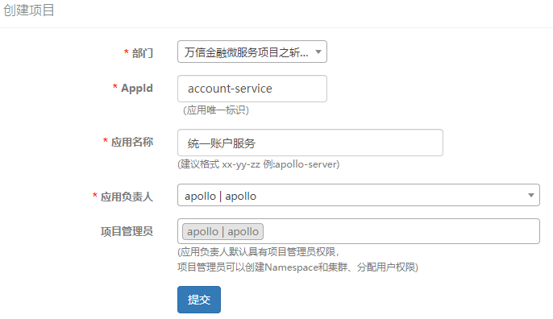

添加工程原有的配置

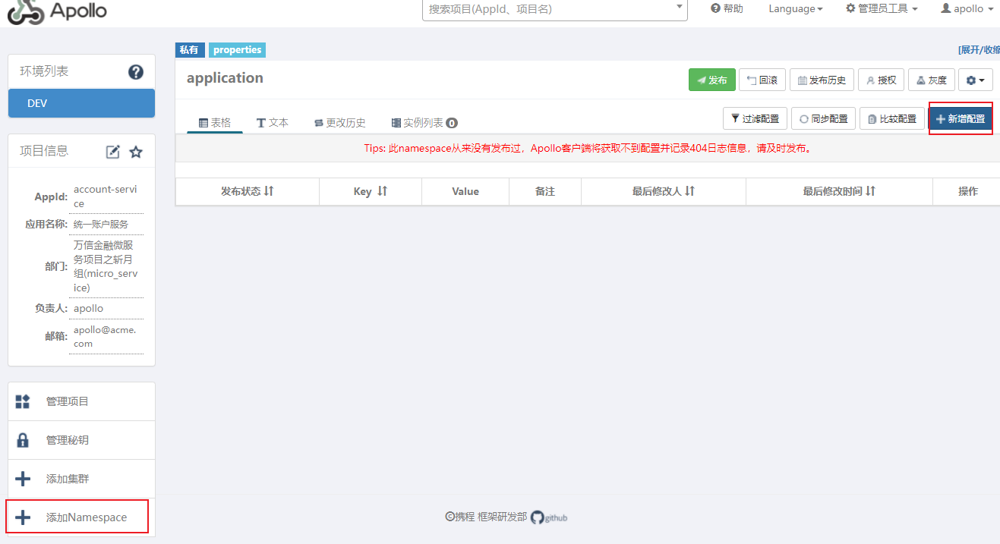

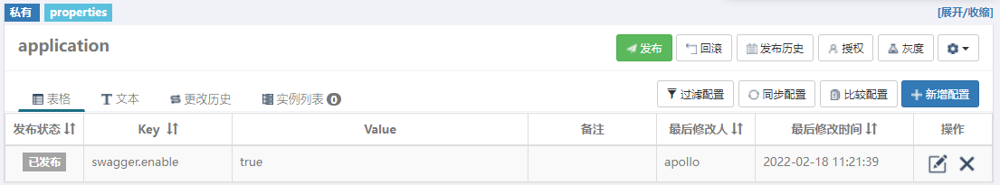

关联公共的 Namespace _参考 consumer-service 的配置_

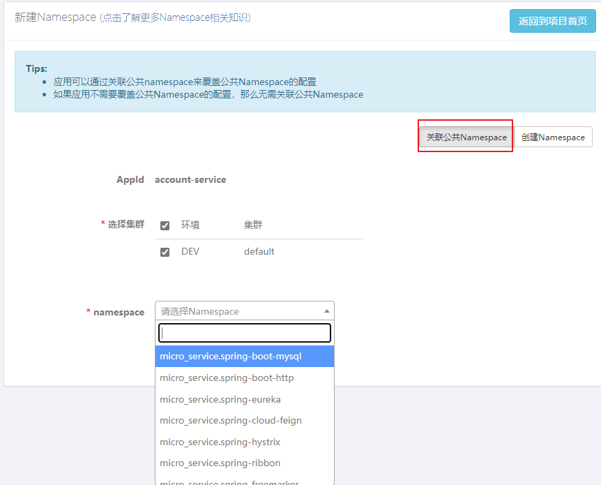

最终关联 Namespace 的有 micro_service.spring-boot-http、micro_service.spring-eureka、micro_service.spring-hystrix、micro_service.spring-ribbon、micro_service.spring-boot-redis、micro_service.mybatis-plus、micro_service.spring-boot-druid、micro_service.spring-rocketmq，其中需要覆盖的内容如下：

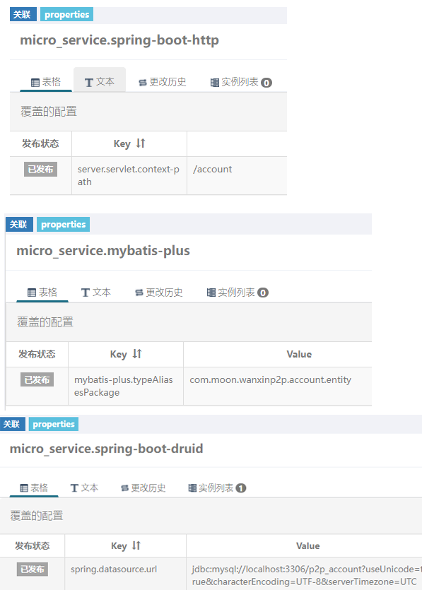

#### 4.3.4. 修改网关配置

如果需要通过网关访问路由到统一账户服务，需要修改 apollo 上的 gateway-server 网关配置

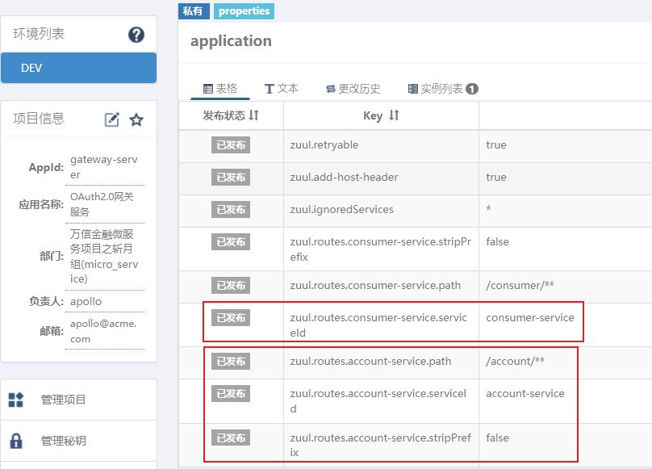

> 初始化工程时的配置是统一转发，所以修改时记得对不同的服务增加上 `serviceId` 属性

#### 4.3.5. 测试

经过以上配置后，创建 `AccountController` 控制类，编写测试请求方法，配置以下 VM options 参数，启动服务，进行测试

```bash
# wanxinp2p-account-service
-Denv=dev -Dapollo.cluster=DEFAULT -Dserver.port=53030
```

### 4.4. 验证码微服务

> 此服务 jar 是来源于网络上的资源，发送短信验证码的功能已经实现，直接运行脚本即可使用

#### 4.4.1. 基础环境

开发/功能环境需要 Java 1.8+

#### 4.4.2. 安装 Redis

该服务使用 Redis 存储生成的短信验证码信息，所以需要先在本机安装 Redis（请确认 6379 端口未被占用）。_这里使用了 windows 版本_。运行脚本如下：

```bash
cd /d %Redis 目录%
start call redis-server redis.windows.conf
```

> <font color=violet>**注意：为了使用方便，这里把 redis 的验证密码取消了，请确保 redis 配置(redis.windows.conf)中的 requirepass 是注释状态**</font>

#### 4.4.3. 部署短信验证码服务

短信验证码服务是基于腾讯云实现的一个开源项目 sailing，发送短信验证码的功能已经实现，直接运行脚本即可使用，无需进行其他操作，该服务会占用 56085 端口。

jar 包与脚本的存放位置是在源码工程的 `wanxinp2p-project\wanxinp2p\sms-server` 目录中，其中 jar 说明如下：

- 运行 runSms.bat 脚本会启动 sailing.jar，该服务会把短信验证码发送到手机上（有使用次数限制，建议用于体验。_短信套餐包已余量不足^\_^!_）
- 运行 runSms-console.bat 脚本会启动 sailing-console.jar，该服务会把短信验证码发送到控制台上，不会发到手机上（没有使用次数限制，建议开发过程中使用）

> 注：此示例只提供 jar 包和运行脚本，如果对源码感兴趣，可以自行去 github 上下载：

```bash
git clone https://github.com/fightingape/sailing.git
```

### 4.5. 接入短信验证码服务

统一账户微服务 (wanxinp2p-account-service) 需要使用短信验证码功能，只需在 Apollo 配置中心进行相关配置即可使用 sailing 服务。

#### 4.5.1. 服务配置

1. 登录 Apollo 后台，找到 account-service 项目
2. 修改 application 命名空间的配置项，增加验证码服务参数

```properties
# 短信验证码服务地址
sms.url = http://localhost:56085/sailing/
# 开启短信验证码功能
sms.enable = true
```

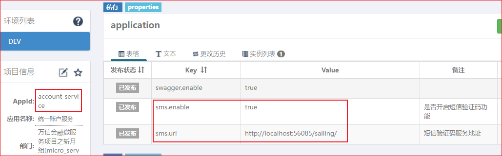

3. 运行 runSms-console.bat 启动 sailing-console.jar (短信验证码服务)。
4. 启动 wanxinp2p-account-service，即可正常获取验证码

> <font color=violet>**注意：在后续开发过程中，每次都需要启动 sailing.jar。如果开发其他功能时，不关注登陆验证这块内容，可以把短信验证码功能关掉（配置 `sms.enable=false`），此时会开启密码登录模式（登录密码就是验证码），直接使用手机号作为验证码即可登录，因为在注册功能中，默认会把手机号作为登录密码保存到数据库中**</font>

#### 4.5.2. 短信验证码 API 接口

**发送并获取短信验证码**

- POST 请求：http://localhost:56085/sailing/generate?effectiveTime=300&name=sms
- JSON 参数：`{"mobile":"13800000000"}`

**校验短信验证码**

- POST 请求：http://localhost:56085/sailing/verify?name=sms&verificationKey=xxx&verificationCode=xxx
- 参数说明：
  - verificationKey：表示校验标识
  - verificationCode：标识验证码

## 5. 功能 1：实现发送短信验证码

### 5.1. 接口定义

获取验证码接口方法处理逻辑如下：

1. 获取手机号
2. 向验证码服务请求发送验证码并得到响应
3. 响应前端验证码发送结果（成功或失败）

在 `wanxinp2p-common` 公共模块中，定义通用响应实体类 `com.moon.wanxinp2p.common.domain.RestResponse`。用于统一接口规范

```java
package com.moon.wanxinp2p.common.domain;

import com.fasterxml.jackson.annotation.JsonIgnore;
import com.fasterxml.jackson.annotation.JsonInclude;
import com.fasterxml.jackson.annotation.JsonInclude.Include;
import io.swagger.annotations.ApiModel;
import io.swagger.annotations.ApiModelProperty;
import lombok.Getter;
import lombok.Setter;
import lombok.ToString;

@Getter
@Setter
@ToString
@JsonInclude(Include.NON_NULL)
@ApiModel(value = "RestResponse<T>", description = "响应通用参数包装")
public class RestResponse<T> {

    @ApiModelProperty("响应错误编码,0为正常")
    private int code;

    @ApiModelProperty("响应错误信息")
    private String msg;

    @ApiModelProperty("响应内容")
    private T result;

    public static <T> RestResponse<T> success() {
        return new RestResponse<>();
    }

    public static <T> RestResponse<T> success(T result) {
        RestResponse<T> response = new RestResponse<>();
        response.setResult(result);
        return response;
    }

    public static <T> RestResponse<T> validfail(String msg) {
        RestResponse<T> response = new RestResponse<>();
        response.setCode(-2);
        response.setMsg(msg);
        return response;
    }

    public RestResponse() {
        this(0, "");
    }

    public RestResponse(int code, String msg) {
        this.code = code;
        this.msg = msg;
    }

    @JsonIgnore
    public Boolean isSuccessful() {
        return this.code == 0;
    }
}
```

在 wanxinp2p-api 工程中创建 `AccountAPI` 接口，在该接口中定义 `getSMSCode` 获取验证码方法：

```java
public interface AccountAPI {
    /**
     * 获取短信验证码
     *
     * @param mobile 手机号
     * @return
     */
    RestResponse<Object> getSMSCode(String mobile);
}
```

### 5.2. 业务功能接口与实现

在 wanxinp2p-account-service 工程中创建 `SmsService` 业务接口，并定义 `getSmsCode` 获取验证码方法

```java
public interface SmsService {
    RestResponse<Object> getSMSCode(String mobile);
}
```

在 wanxinp2p-common 工程中引入 okhttp 依赖

```xml
<dependency>
    <groupId>com.squareup.okhttp3</groupId>
    <artifactId>okhttp</artifactId>
</dependency>
```

创建 `OkHttpClient` 工具类，用于发送 http 请求

```java
public class OkHttpUtil {

    private static final OkHttpClient okHttpClient = new OkHttpClient().newBuilder()
            .retryOnConnectionFailure(true)
            .connectTimeout(10, TimeUnit.SECONDS)
            .readTimeout(10, TimeUnit.SECONDS)
            .writeTimeout(10, TimeUnit.SECONDS).build();

    private static final MediaType JSON_TYPE = MediaType.parse("application/json; charset=utf-8");

    /**
     * 发送post请求
     *
     * @param url
     * @param json
     * @return
     */
    public static RestResponse<Object> post(String url, String json) {
        okhttp3.RequestBody body = okhttp3.RequestBody.create(JSON_TYPE, json);
        Request request = new Request.Builder().url(url).post(body).build();
        try (Response response = okHttpClient.newCall(request).execute()) {
            okhttp3.ResponseBody responseBody = response.body();
            if (responseBody != null) {
                return JSON.parseObject(responseBody.string(), RestResponse.class);
            }
        } catch (IOException e) {
            e.printStackTrace();
        }
        return RestResponse.validfail(CommonErrorCode.E_100106.getDesc());
    }
}
```

创建接口实现类 `SmsServiceImpl`，调用验证码服务发送验证码。

```java
@Service
public class SmsServiceImpl implements SmsService {

    /* 读取配置中心短信相关的配置 */
    @Value("${sms.url}")
    private String smsURL;

    @Value("${sms.enable}")
    private Boolean smsEnable;

    /**
     * 获取短信验证码
     *
     * @param mobile 手机号
     * @return
     */
    @Override
    public RestResponse<Object> getSMSCode(String mobile) {
        // 判断是否开启短信验证
        if (smsEnable) {
            return OkHttpUtil.post(smsURL + "/generate?effectiveTime=300&name=sms", "{\"mobile\":" + mobile + "}");
        }
        // 不开启则默认成功
        return RestResponse.success();
    }
}
```

在 wanxinp2p-account-service 工程中新建 `AccountService` 接口，定义获取短信验证码 `getSMSCode` 方法

```java
public interface AccountService {
    RestResponse<Object> getSMSCode(String mobile);
}
```

定义该接口的实现类 `AccountServiceImpl`，注入 `SmsService` 接口并实现获取短信验证码的功能：

```java
@Service
public class AccountServiceImpl implements AccountService {

    @Autowired
    private SmsService smsService;

    /**
     * 获取验证码
     */
    @Override
    public RestResponse<Object> getSMSCode(String mobile) {
        return smsService.getSMSCode(mobile);
    }
}
```

### 5.3. 接口实现控制类

在 wanxinp2p-account-service 工程中新建 `AccountController` 统一账户控制类，并实现 `AccountAPI` 接口。注入 `AccountService` 接口，调用获取短信验证码

```java
@RestController
@Api(value = "统一账号服务", tags = "Account")
public class AccountController implements AccountAPI {

    @Autowired
    private AccountService accountService;

    /**
     * 获取短信验证码
     *
     * @param mobile 手机号
     * @return
     */
    @Override
    @ApiOperation("获取手机验证码")
    @ApiImplicitParam(name = "mobile", value = "手机号", dataType = "String")
    @GetMapping("/sms/{mobile}")
    public RestResponse<Object> getSMSCode(@PathVariable String mobile) {
        return accountService.getSMSCode(mobile);
    }
}
```

### 5.4. 功能测试

分别启动 apollo 配置中心、redis、短信服务、eureka 注册中心、wanxinp2p-account-service 微服务，使用 Swagger 或 Postman 进行功能测试

## 6. 功能 2：校验手机号和验证码

### 6.1. 接口定义

在统一账号服务中定义校验手机号接口，具体业务逻辑如下：

1. 校验验证码是否正确
2. 如果验证码正确则校验手机号是否存在

在 wanxinp2p-api 工程中的 `AccountAPI` 接口里面定义 `checkMobile` 校验方法：

```java
/**
 * 校验手机号和验证码
 *
 * @param mobile 手机号
 * @param key    校验标识
 * @param code   验证码
 * @return
 */
RestResponse<Integer> checkMobile(String mobile, String key, String code);
```

### 6.2. MyBatis-plus 环境准备

- 此部分业务需要操作数据库，所以修改 wanxinp2p-account-service 工程，引入 MP 相关的依赖

```xml
<dependency>
    <groupId>com.baomidou</groupId>
    <artifactId>mybatis-plus-boot-starter</artifactId>
</dependency>
<dependency>
    <groupId>org.mybatis</groupId>
    <artifactId>mybatis-typehandlers-jsr310</artifactId>
</dependency>
<dependency>
    <groupId>com.alibaba</groupId>
    <artifactId>druid-spring-boot-starter</artifactId>
</dependency>
<dependency>
    <groupId>mysql</groupId>
    <artifactId>mysql-connector-java</artifactId>
</dependency>
```

- 在 apollo 中增加关于 MP 的相关配置

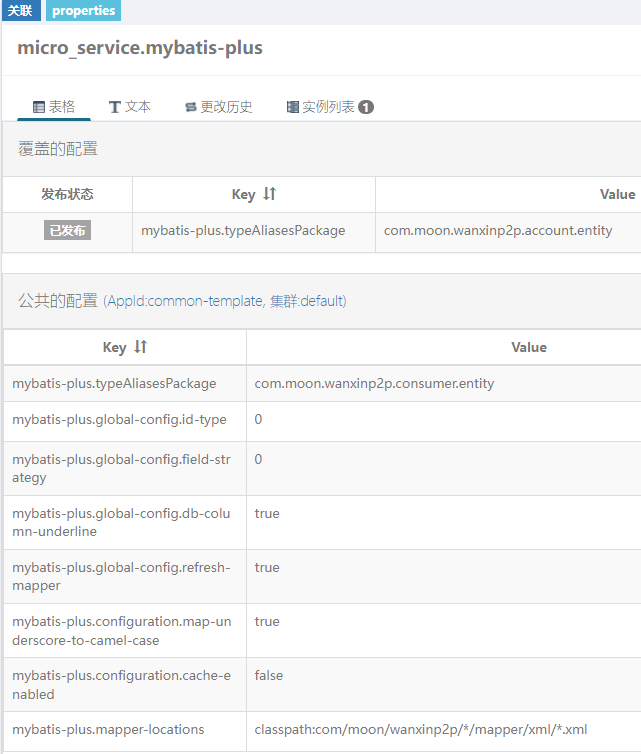

- 在工程的 config 包中创建 MyBatis-plus 的配置类，设置 mapper 接口中的包扫描

```java
@Configuration
@MapperScan("com.moon.wanxinp2p.account.mapper")
public class MybatisPlusConfig {
}
```

- 创建实体类 `Account`

```java
@Data
@TableName("account")
public class Account implements Serializable {
    private static final long serialVersionUID = 118689251780731883L;

    /* 主键 */
    @TableId("ID")
    private Long id;
    /* 用户名 */
    @TableField("USERNAME")
    private String username;
    /* 手机号 */
    @TableField("MOBILE")
    private String mobile;
    /* 密码 */
    @TableField("PASSWORD")
    private String password;
    /* 加密盐 */
    @TableField("SALT")
    private String salt;
    /* 账号状态 */
    @TableField("STATUS")
    private Integer status;
    /* 域(c：c端用户；b：b端用户) */
    @TableField("DOMAIN")
    private String domain;
}
```

- 创建 Mapper 接口，继承 Mybatis-Plus 的 `BaseMapper` 接口

```java
public interface AccountMapper extends BaseMapper<Account> {
}
```

- 在 mapper 包下新建 xml 目录，创建 Mapper 的映射文件。（_根据配置中心上的 `mybatis-plus.mapper-locations` 配置值来创建_）

```xml
<?xml version="1.0" encoding="UTF-8" ?>
<!DOCTYPE mapper PUBLIC "-//mybatis.org//DTD Mapper 3.0//EN" "http://mybatis.org/dtd/mybatis-3-mapper.dtd">
<mapper namespace="com.moon.wanxinp2p.account.mapper.AccountMapper">
</mapper>
```

### 6.3. 业务功能接口与实现

#### 6.3.1. 定义短信校验方法

修改 `wanxinp2p-account-service` 工程的 `SmsService` 接口中定义 `verifySmsCode` 方法，调用验证码服务实现校验功能：

```java
/**
 * 校验验证码
 *
 * @param key  校验标识 redis中的键
 * @param code 短信验证码
 */
void verifySmsCode(String key, String code);
```

```java
@Override
public void verifySmsCode(String key, String code) {
    if (smsEnable) {
        // 拼接请求 url
        StringBuilder params = new StringBuilder("/verify?name=sms");
        params.append("&verificationKey=").append(key).append("&verificationCode=").append(code);
        // 发送 post 请求
        RestResponse smsResponse = OkHttpUtil.post(smsURL + params, "");
        if (smsResponse.getCode() != CommonErrorCode.SUCCESS.getCode() || smsResponse.getResult().toString().equalsIgnoreCase("false")) {
            // 校验不通过，抛出异常
            throw new BusinessException(AccountErrorCode.E_140152);
        }
    }
}
```

#### 6.3.2. 创建账户验证码校验方法

> 注：此部分业务使用继承 MP 的通用业务层封装方式开发

修改 `wanxinp2p-account-service` 工程的 `AccountService` 接口，定义 `checkMobile` 方法，**并修改该接口去继承 Mybatis-Plus 的 `IService` 接口**

```java
public interface AccountService extends IService<Account> {
    // 省略....
    Integer checkMobile(String mobile, String key, String code);
}
```

在 `AccountServiceImpl` 类中实现 `checkMobile` 方法，**并继承 Mybatis-Plus 的 `ServiceImpl` 实现类**

```java
@Service
public class AccountServiceImpl extends ServiceImpl<AccountMapper, Account> implements AccountService {

    @Autowired
    private SmsService smsService;

    // 省略....

    /**
     * 校验短信验证码
     *
     * @param mobile 手机号码
     * @param key    校验标识 redis中的键
     * @param code   验证码
     * @return
     */
    @Override
    public Integer checkMobile(String mobile, String key, String code) {
        // 调用短信服务校验方法，如果校验不通过，方法会抛出 BusinessException
        smsService.verifySmsCode(key, code);

        // 查询数据库，手机号是否存在 count() 是 mp 封装的通用业务层方法
        int count = this.count(new QueryWrapper<Account>()
                .lambda()
                .eq(Account::getMobile, mobile));
        // 存在返回 1，不存在返回 0
        return count > 0 ? 1 : 0;
    }
}
```

#### 6.3.3. 控制层接口调用校验验证码

修改 `wanxinp2p-account-service` 工程的 `AccountController` 类，实现 `checkMobile` 方法，在方法中调用 `AccountService` 实现校验功能

```java
public class AccountController implements AccountAPI {
    // 省略....
    /**
     * 校验手机号和验证码
     *
     * @param mobile 手机号
     * @param key    校验标识
     * @param code   验证码
     * @return
     */
    @ApiOperation("校验手机号和验证码")
    @ApiImplicitParams({
            @ApiImplicitParam(name = "mobile", value = "手机号", required = true, dataType = "String"),
            @ApiImplicitParam(name = "key", value = "校验标识", required = true, dataType = "String"),
            @ApiImplicitParam(name = "code", value = "验证码", required = true, dataType = "String")
    })
    @Override
    @GetMapping("/mobiles/{mobile}/key/{key}/code/{code}")
    public RestResponse<Integer> checkMobile(@PathVariable String mobile,
                                             @PathVariable String key,
                                             @PathVariable String code) {
        return RestResponse.success(accountService.checkMobile(mobile, key, code));
    }
}
```

### 6.4. 功能测试

#### 6.4.1. 启动服务

分别启动 apollo 配置中心、redis、短信服务、eureka 注册中心、wanxinp2p-account-service 微服务，使用 Swagger 或 Postman 进行功能测试。测试 url 如下：

1. 先请求获取短信验证码：`http://127.0.0.1:53010/account/sms/13800000000`
2. 再请求校验验证码：`http://127.0.0.1:53010/account/mobiles/手机号/key/短信标识/code/验证码`

#### 6.4.2. 测试时可能出现的问题

如果在测试过程中，较新的 jdbc 驱动可能会报出：`java.sql.SQLException: The server time zone value '乱码' is unrecognized or represents more than one time zone`。

需要修改 mysql 的时区，找到安装目录中的 my.ini 文件，在 `mysqld` 节点下添加 `default-time_zone = '+8:00'`。保存后重启 mysql 即可

## 7. 功能 3：保存账号信息

### 7.1. 功能需求说明

如果手机号是不存在的，证明这是新用户，接下来需要保存用户账号相关信息，从而最终实现注册功能。这里有两个微服务都需要进行账号信息保存，一个是 Consumer 微服务(用户中心)，一个是 Account 微服务(统一账户)，Consumer 微服务会把数据保存到 `p2p_consumer` 数据库的 consumer 表中，而 Account 微服务会把数据保存到 `p2p_account` 数据库的 account 表中。

此处采用了用户、账号分离设计，这样设计的好处是，当用户的业务信息发生变化时，不会影响到认证、授权等系统机制的运行，但是缺点就是需要做用户和账号的数据同步工作。

前端页面发起的请求会先到达 Consumer 微服务，然后远程调用 Account 微服务，从而分别实现各自的信息保存，详情请参考前面章节中的“注册登录流程图”。

### 7.2. 统一账号服务实现保存账号功能

统一账号服务保存账号接口描述如下：

1. 在统一账号服务实现账户信息保存

#### 7.2.1. 接口定义

- 在 wanxinp2p-api 工程的 `com.moon.wanxinp2p.api.account.model` 包，创建用于接收请求与返回的传输实体类

```java
@Data
@ApiModel(value = "AccountRegisterDTO", description = "账户注册信息")
public class AccountRegisterDTO {
    @ApiModelProperty("用户名")
    private String username;
    @ApiModelProperty("手机号")
    private String mobile;
    @ApiModelProperty("密码")
    private String password;
}
```

```java
@Data
@ApiModel(value = "AccountDTO", description = "账户信息")
public class AccountDTO {
    @ApiModelProperty("标识")
    private Long id;
    @ApiModelProperty("用户名")
    private String username;
    @ApiModelProperty("手机号")
    private String mobile;
    @ApiModelProperty("账号状态")
    private Integer status;
    @ApiModelProperty("域(c：c端用户；b：b端用户)")
    private String domain;
}
```

- 在 wanxinp2p-api 工程中的 `AccountAPI` 接口里面定义 `register` 注册方法：

```java
/**
 * 注册并保存信息
 */
RestResponse<AccountDTO> register(AccountRegisterDTO accountRegisterDTO);
```

#### 7.2.2. 业务功能接口与实现

- 在 `AccountService` 接口中定义 `register` 注册方法：

```java
AccountDTO register(AccountRegisterDTO accountRegisterDTO);
```

- 在 `AccountServiceImpl` 类中实现 `register` 方法，通过 Mybatis-Plus API 保存到数据库表中

```java
@Service
public class AccountServiceImpl extends ServiceImpl<AccountMapper, Account> implements AccountService {

    // 注入是否开启短信校验标识
    @Value("${sms.enable}")
    private Boolean smsEnable;

    // 省略....

    /**
     * 统一账户注册
     *
     * @param accountRegisterDTO 账户注册的信息
     * @return
     */
    @Override
    public AccountDTO register(AccountRegisterDTO accountRegisterDTO) {
        // mybatis-plus 操作数据是建立映射的实体类，所以这里 dto 转 Account
        Account account = new Account();
        account.setUsername(accountRegisterDTO.getUsername());
        account.setMobile(accountRegisterDTO.getMobile());

        /*
         * 密码需要加密。这里需要特别注意：
         *   当初需求设计是，如果当短信验证码功能关闭时，用户是直接使用手机号做为密码来登陆
         *   所以这里注册时，就判断是否开启短信验证，如果开启，则设置手机号做为密码
         */
        account.setPassword(PasswordUtil.generate(smsEnable ? accountRegisterDTO.getMobile() : accountRegisterDTO.getPassword()));
        // 补充一些常量
        account.setDomain(Account.DomainEnum.C.getCode());
        account.setStatus(StatusCode.STATUS_OUT.getCode());

        // 新增数据
        this.save(account);

        AccountDTO dto = new AccountDTO();
        BeanUtils.copyProperties(account, dto);
        return dto;
    }
}
```

#### 7.2.3. 控制层接口调用注册业务功能

修改 `wanxinp2p-account-service` 工程的 `AccountController` 类，实现 `register` 注册方法，在方法中调用 `AccountService` 实现注册功能

```java
/**
 * 注册并保存信息
 */
@ApiOperation("用户注册")
@ApiImplicitParam(name = "accountRegisterDTO", value = "账户注册信息",
        required = true, dataType = "AccountRegisterDTO", paramType = "body")
@PostMapping(value = "/l/accounts")
@Override
public RestResponse<AccountDTO> register(@RequestBody AccountRegisterDTO accountRegisterDTO) {
    return RestResponse.success(accountService.register(accountRegisterDTO));
}
```

> 由于在注册功能中，Account 服务会被 Consumer 服务调用，所以等 Consumer 服务代码编写完毕后统一进行测试

### 7.3. 用户中心服务实现保存账号功能

#### 7.3.1. 接口定义

接口描述如下：

1. 在用户中心保存用户信息
2. 请求统一账号服务实现账户信息保存

- 在 wanxinp2p-api 工程的 `com.moon.wanxinp2p.api.account.model` 包，创建用于接收请求与返回的传输实体类

```java
@Data
@ApiModel(value = "ConsumerRegisterDTO", description = "用户注册信息")
public class ConsumerRegisterDTO {
    @ApiModelProperty("用户名")
    private String username;
    @ApiModelProperty("手机号")
    private String mobile;
    @ApiModelProperty("密码")
    private String password;
    @ApiModelProperty("用户角色。B-借款人；I-投资人")
    private String role;
    @ApiModelProperty("验证码key")
    private String key;
}
```

```java
@Data
@ApiModel(value = "ConsumerDTO", description = "平台c端用户信息")
public class ConsumerDTO {
    @ApiModelProperty("用户id")
    private Long id;
    @ApiModelProperty("用户名")
    private String username;
    @ApiModelProperty("真实姓名")
    private String fullname;
    @ApiModelProperty("身份证号")
    private String idNumber;
    @ApiModelProperty("用户编码，用户在存管系统标识，不允许重复")
    private String userNo;
    @ApiModelProperty("手机号")
    private String mobile;
    @ApiModelProperty("用户类型,个人or企业，预留")
    private String userType;
    @ApiModelProperty("角色")
    private String role;
    @ApiModelProperty("存管授权列表")
    private String authList;
    @ApiModelProperty("是否已绑定银行卡")
    private Integer isBindCard;
    @ApiModelProperty("启用状态")
    private Integer status;
    @ApiModelProperty("可贷额度")
    private BigDecimal loanAmount;
}
```

- 在 wanxinp2p-api 工程的 `com.moon.wanxinp2p.api.consumer` 中新建 `ConsumerApi` 接口，在该接口中定义 `register` 方法

```java
public interface ConsumerApi {
    /**
     * 用户注册  保存用户信息
     *
     * @param consumerRegisterDTO
     * @return
     */
    RestResponse register(ConsumerRegisterDTO consumerRegisterDTO);
}
```

#### 7.3.2. MyBatis-plus 环境准备

由于此部分业务涉及到 Consumer 微服务中操作数据库，所以需要在 `wanxinp2p-consumer-service` 服务把引入 MyBatis-plus ，详情步骤参考《功能 2：校验手机号和验证码》章节内容

- 在工程的 config 包中创建 MyBatis-plus 的配置类，设置 mapper 接口中的包扫描

```java
@Configuration
@MapperScan("com.moon.wanxinp2p.consumer.mapper")
public class MybatisPlusConfig {
}
```

- 创建实体类 `Consumer`

```java
@Data
@TableName("consumer")
public class Consumer implements Serializable {
    private static final long serialVersionUID = 1353127615959266186L;
    /* 主键 */
    @TableId(value = "ID", type = IdType.AUTO)
    private Long id;
    /* 用户名 */
    @TableField("USERNAME")
    private String username;
    /* 真实姓名 */
    @TableField("FULLNAME")
    private String fullname;
    /* 身份证号 */
    @TableField("ID_NUMBER")
    private String idNumber;
    /* 用户编码,生成唯一,用户在存管系统标识 */
    @TableField("USER_NO")
    private String userNo;
    /* 平台预留手机号 */
    @TableField("MOBILE")
    private String mobile;
    /* 用户类型,个人or企业，预留 */
    @TableField("USER_TYPE")
    private String userType;
    /* 用户角色.借款人or投资人 */
    @TableField("ROLE")
    private String role;
    /* 存管授权列表 */
    @TableField("AUTH_LIST")
    private String authList;
    /* 是否已绑定银行卡 */
    @TableField("IS_BIND_CARD")
    private Integer isBindCard;
    /* 可用状态 */
    @TableField("STATUS")
    private Integer status;
    /* 可贷额度 */
    @TableField("LOAN_AMOUNT")
    private BigDecimal loanAmount;
    /* 请求流水号 */
    @TableField("REQUEST_NO")
    private String requestNo;
}
```

- 创建 Mapper 接口，继承 Mybatis-Plus 的 `BaseMapper` 接口

```java
public interface ConsumerMapper extends BaseMapper<Account> {
}
```

- 在 mapper 包下新建 xml 目录，创建 Mapper 的映射文件。（_根据配置中心上的 `mybatis-plus.mapper-locations` 配置值来创建_）

```xml
<?xml version="1.0" encoding="UTF-8" ?>
<!DOCTYPE mapper PUBLIC "-//mybatis.org//DTD Mapper 3.0//EN" "http://mybatis.org/dtd/mybatis-3-mapper.dtd">
<mapper namespace="com.moon.wanxinp2p.consumer.mapper.ConsumerMapper">
</mapper>
```

#### 7.3.3. 业务功能接口与实现

- 在 wanxinp2p-consumer-service 工程，创建 `ConsumerService` 接口，并定义 `checkMobile` 和 `register` 方法。_注：继承 MP 框架的 `IService` 接口_

```java
public interface ConsumerService extends IService<Consumer> {
    /**
     * 检测用户是否存在
     *
     * @param mobile
     * @return
     */
    Integer checkMobile(String mobile);

    /**
     * 用户注册
     *
     * @param consumerRegisterDTO
     * @return
     */
    void register(ConsumerRegisterDTO consumerRegisterDTO);
}
```

- 创建用户服务专用的响应码枚举

```java
@Getter
public enum ConsumerErrorCode implements ErrorCode {

    E_140101(140101, "不存在的用户信息"),
    E_140102(140102, "请求失败"),
    E_140105(140105, "用户已开户"),
    E_140106(140106, "注册失败"),
    E_140107(140107, "用户已存在"),
    E_140108(140108, "身份信息不一致"),
    E_140131(140131, "用户充值失败"),
    E_140132(140132, "用户存管账户未开通成功"),
    E_140141(140141, "用户提现失败"),
    E_140151(140151, "银行卡已被绑定");

    private final int code;
    private final String desc;

    ConsumerErrorCode(int code, String desc) {
        this.code = code;
        this.desc = desc;
    }

    public static ConsumerErrorCode getErrorCode(int code) {
        for (ConsumerErrorCode errorCode : ConsumerErrorCode.values()) {
            if (errorCode.getCode() == code) {
                return errorCode;
            }
        }
        return null;
    }
}
```

- 创建 `ConsumerServiceImpl` 类，实现 `ConsumerService` 接口，实现该接口的 `checkMobile` 和 `register` 方法，通过 Mybatis-Plus API 保存到数据库表中。_注：继承 MP 框架的 `ServiceImpl` 实现类_

```java
@Service
public class ConsumerServiceImpl extends ServiceImpl<ConsumerMapper, Consumer> implements ConsumerService {

    /**
     * 检测用户是否存在
     *
     * @param mobile
     * @return
     */
    @Override
    public Integer checkMobile(String mobile) {
        return getByMobile(mobile) == null ? 0 : 1;
    }

    /**
     * 用户注册
     *
     * @param consumerRegisterDTO
     * @return
     */
    @Override
    public void register(ConsumerRegisterDTO consumerRegisterDTO) {
        // 判断用户是否已注册
        if (checkMobile(consumerRegisterDTO.getMobile()) == 1) {
            // 已注册则抛出业务异常
            throw new BusinessException(ConsumerErrorCode.E_140107);
        }

        Consumer consumer = new Consumer();
        BeanUtils.copyProperties(consumerRegisterDTO, consumer);
        consumer.setUsername(CodeNoUtil.getNo(CodePrefixCode.CODE_NO_PREFIX));
        consumerRegisterDTO.setUsername(consumer.getUsername());
        consumer.setUserNo(CodeNoUtil.getNo(CodePrefixCode.CODE_REQUEST_PREFIX));
        consumer.setIsBindCard(0);

        // 保存用户
        save(consumer);
    }

    /**
     * 根据手机号获取用户信息
     *
     * @param mobile 手机号
     * @return
     */
    private ConsumerDTO getByMobile(String mobile) {
        // 根据手机号查询
        Consumer consumer = this.getOne(new QueryWrapper<Consumer>().lambda().eq(Consumer::getMobile, mobile));

        if (consumer != null) {
            // 转 dto
            ConsumerDTO dto = new ConsumerDTO();
            BeanUtils.copyProperties(consumer, dto);
            return dto;
        }
        return null;
    }
}
```

#### 7.3.4. 远程调用统一账户中心微服务

本项目的远程调用是使用 Spring Cloud OpenFeign 进行模板化 HTTP 请求，具体 Feign 使用详见[《Spring Cloud OpenFeign 服务调用》](/07-分布式架构&微服务架构/02-SpringCloud/04-Spring-Cloud-OpenFeign)

- 在 wanxinp2p-api 工程已引入 Spring Cloud OpenFeign 依赖

```xml
<dependency>
    <groupId>org.springframework.cloud</groupId>
    <artifactId>spring-cloud-starter-openfeign</artifactId>
</dependency>
```

- 在 wanxinp2p-consumer-service 工程启动类（或配置类）上，通过 `@EnableFeignClients` 注解开启 Spring Cloud Feign 的支持功能，并指定 feign 扫描的包

```java
@SpringBootApplication
@EnableDiscoveryClient
/*
 * @EnableFeignClients 注解用于开启 Spring Cloud Feign 的支持功能
 * basePackages 属性：指定扫描的包路径
 */
@EnableFeignClients(basePackages = {"com.moon.wanxinp2p.consumer.agent"})
@ComponentScan(basePackages = {"com.moon.wanxinp2p.common", "com.moon.wanxinp2p.consumer"}) // 扫描接口，common工程所在包
public class ConsumerService {
    ....
}
```

- 在 agent 包中创建 feign 代理接口 `AccountApiAgent`

```java
/*
 * @FeignClient 注解，用于标识当前接口为Feign调用微服务的核心接口
 *  value/name属性：指定需要调用的服务提供者的名称
 */
@FeignClient("account-service")
public interface AccountApiAgent {
    /*
     * 创建需要调用的微服务接口方法，SpringCloud 对 Feign 进行了增强兼容了 SpringMVC 的注解
     *  使用的两个注意点：
     *  1. FeignClient 接口有参数时，必须在参数加@PathVariable("XXX")和@RequestParam("XXX")注解，并且必须要指定对应的参数值（原来SpringMVC是可以省略）
     *  2. feignClient 返回值为复杂对象时，其对象类型必须有无参构造函数
     *  3. 方法的名称不需要与被调用的服务接口名称一致
     */
    @PostMapping(value = "/account/l/accounts")
    RestResponse<AccountDTO> register(@RequestBody AccountRegisterDTO accountRegisterDTO);
}
```

- 在 `ConsumerServiceImpl` 的 `register` 方法中保存用户信息后，通过 feign 调用统一认证服务的注册方法

```java
// 注入 feign 服务调用接口
@Autowired
private AccountApiAgent accountApiAgent;

@Override
public void register(ConsumerRegisterDTO consumerRegisterDTO) {
    // 判断用户是否已注册
    if (checkMobile(consumerRegisterDTO.getMobile()) == 1) {
        // 已注册则抛出业务异常
        throw new BusinessException(ConsumerErrorCode.E_140107);
    }

    Consumer consumer = new Consumer();
    BeanUtils.copyProperties(consumerRegisterDTO, consumer);
    consumer.setUsername(CodeNoUtil.getNo(CodePrefixCode.CODE_NO_PREFIX));
    consumerRegisterDTO.setUsername(consumer.getUsername());
    consumer.setUserNo(CodeNoUtil.getNo(CodePrefixCode.CODE_REQUEST_PREFIX));
    consumer.setIsBindCard(0);

    // 保存用户
    save(consumer);

    // 创建统一认证服务的调用参数
    AccountRegisterDTO dto = new AccountRegisterDTO();
    BeanUtils.copyProperties(consumerRegisterDTO, dto);
    // 远程调用
    RestResponse<AccountDTO> result = accountApiAgent.register(new AccountRegisterDTO());
    if (CommonErrorCode.SUCCESS.getCode() != result.getCode()) {
        // 调用失败，抛出业务异常
        throw new BusinessException(ConsumerErrorCode.E_140106);
    }
}
```

#### 7.3.5. 控制层接口调用注册业务功能

修改 `wanxinp2p-consumer-service` 工程的 `ConsumerController` 类，实现 `ConsumerApi` 接口的 `register` 注册方法，在方法中调用 `ConsumerService` 实现注册功能

```java
@RestController
@Api(value = "用户服务的Controller", tags = "Consumer", description = "用户服务API")
public class ConsumerController implements ConsumerApi {

    @Autowired
    private ConsumerService consumerService;

    /**
     * 用户注册  保存用户信息
     */
    @ApiOperation("用户注册")
    @ApiImplicitParam(name = "consumerRegisterDTO", value = "注册信息",
            required = true, dataType = "AccountRegisterDTO", paramType = "body")
    @PostMapping(value = "/consumers")
    @Override
    public RestResponse<Nullable> register(@RequestBody ConsumerRegisterDTO consumerRegisterDTO) {
        // 调用业务接口注册
        consumerService.register(consumerRegisterDTO);
        // 无异常，代表注册成功
        return RestResponse.success();
    }
}
```

### 7.4. 前后端功能集成测试

1. 在 Apollo 中对网关服务增加路由配置
2. 启动前端工程
3. 启动 Apollo 服务
4. 后端需要启动：
   - wanxinp2p-discover-server 微服务
   - wanxinp2p-gateway-server 微服务
   - wanxinp2p-account-service 微服务
   - wanxinp2p-consumer-service 微服务
   - 短信验证码服务（依赖 redis）
5. 在浏览器中访问登录页面

观察 account 与 consumer 数据库是否各自新增用户记录

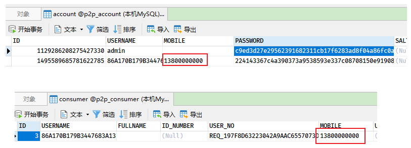

## 8. 异常处理机制

### 8.1. 概述

在程序开发过程中一定是要处理异常的，传统异常处理方式存在一些问题：

1. 项目中会有很多地方都要进行异常处理，编码麻烦，代码冗余，不易维护
2. 异常处理的方式不统一
3. 错误提示信息不统一，不友好

### 8.2. 统一的异常处理机制

为了解决上述问题，在 P2P 项目中设计了一套统一的异常处理机制：

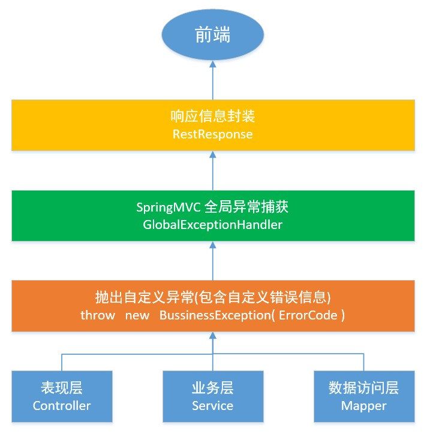

1. 自定义异常类，自定义错误代码和提示信息（统一且友好）
2. 各层只抛异常（建议在业务层），不做异常处理
3. 异常捕获和处理统一交给 SpringMVC 的全局异常捕获类
4. 响应给前端的错误提示信息进行统一封装

### 8.3. 异常处理整体设计

#### 8.3.1. 项目依赖改造

因为全局异常处理所有 web 微服务都会使用，所以将 Spring MVC 的依赖调整到 `wanxinp2p-common` 中，移除依赖 common 的相关服务中 Spring MVC 依赖

```xml
<dependency>
    <groupId>org.springframework.boot</groupId>
    <artifactId>spring-boot-starter-web</artifactId>
</dependency>
```

#### 8.3.2. 自定义错误代码和提示信息

- 在 `wanxinp2p-common` 工程创建自定义错误接口

```java
public interface ErrorCode {

    int getCode();

    String getDesc();
}
```

- 创建公共响应码枚举 `CommonErrorCode.java`，用于提供通用错误编码和提示信息

```java
/**
 * 成功响应码：0成功；
 * 异常响应码：-1熔断、 -2 标准参数校验不通过 -3会话超时
 * 前两位:服务标识；中间两位:模块标识；后两位:异常标识
 */
@Getter
public enum CommonErrorCode implements ErrorCode {

    /*++++++++++++++++ 公用响应码 +++++++++++++++++++*/
    SUCCESS(0, "成功"),
    FUSE(-1, "网关调用熔断"),

    /**
     * 传入参数与接口不匹配
     */
    E_100101(100101, "传入参数与接口不匹配"),
    /**
     * 验证码错误
     */
    E_100102(100102, "验证码错误"),
    /**
     * 验证码为空
     */
    E_100103(100103, "验证码为空"),
    /**
     * 查询结果为空
     */
    E_100104(100104, "查询结果为空"),
    /**
     * ID格式不正确或超出Long存储范围
     */
    E_100105(100105, "ID格式不正确或超出Long存储范围"),

    E_100106(100106, "请求失败"),

    E_999990(999990, "调用微服务-交易中心 被熔断"),
    E_999991(999991, "调用微服务-授权服务 被熔断"),
    E_999992(999992, "调用微服务-用户服务 被熔断"),
    E_999993(999993, "调用微服务-资源服务 被熔断"),
    E_999994(999994, "调用微服务-同步服务 被熔断"),
    E_999995(999995, "调用微服务-统一账户服务 被熔断"),
    E_999996(999996, "调用微服务-存管代理服务 被熔断"),
    /**
     * 调用微服务-还款服务 被熔断
     */
    E_999997(999997, "调用微服务-还款服务 被熔断"),
    CUSTOM(999998, "自定义异常"),
    /**
     * 未知错误
     */
    UNKOWN(999999, "未知错误");

    private int code;
    private String desc;

    CommonErrorCode(int code, String desc) {
        this.code = code;
        this.desc = desc;
    }

    public static CommonErrorCode getErrorCode(int code) {
        for (CommonErrorCode errorCode : CommonErrorCode.values()) {
            if (errorCode.getCode() == code) {
                return errorCode;
            }
        }
        return null;
    }
}
```

- 各个微服务可以根据自身业务提供错误编码和提示信息类，例如：统一账户微服务的 `AccountErrorCode.java` 枚举类（_注：因为只是各个微服务自己使用，所以在各个微服务中定义_）

```java
package com.moon.wanxinp2p.account.common.enums;

import com.moon.wanxinp2p.common.domain.ErrorCode;
import lombok.Getter;

/**
 * 统一账户服务响应枚举
 * 统一账号服务异常编码 以13开始
 */
@Getter
public enum AccountErrorCode implements ErrorCode {
    E_130101(130101, "用户名已存在"),
    E_130104(130104, "用户未注册"),
    E_130105(130105, "用户名或密码错误"),
    E_140141(140141, "注册失败"),

    E_140151(140151, "获取短信验证码失败"),
    E_140152(140152, "验证码错误");

    private final int code;
    private final String desc;

    AccountErrorCode(int code, String desc) {
        this.code = code;
        this.desc = desc;
    }

    public static AccountErrorCode getErrorCode(int code) {
        for (AccountErrorCode errorCode : AccountErrorCode.values()) {
            if (errorCode.getCode() == code) {
                return errorCode;
            }
        }
        return null;
    }
}
```

#### 8.3.3. 自定义异常类

在 `wanxinp2p-common` 工程中，创建业务异常类 `BusinessException`，用于封装一些功能业务上的异常

```java
public class BusinessException extends RuntimeException {

    private ErrorCode errorCode;

    public BusinessException(ErrorCode errorCode) {
        super();
        this.errorCode = errorCode;
    }

    public BusinessException() {
        super();
    }

    public ErrorCode getErrorCode() {
        return errorCode;
    }

}
```

#### 8.3.4. 全局异常捕获类

在 `wanxinp2p-common` 工程中，创建 Spring MVC 全局异常捕获类 `GlobalExceptionHandler`

```java
@RestControllerAdvice
public class GlobalExceptionHandler {

    /* 日志对象 */
    private static final Logger LOGGER = LoggerFactory.getLogger(GlobalExceptionHandler.class);

    // 使用EXCEPTIONS存放异常类型和错误代码的映射，ImmutableMap的特点的一旦创建不可改变，并且线程安全
    private static ImmutableMap<Class<? extends Exception>, Function<Exception, RestResponse<Nullable>>> EXCEPTIONS;

    // 定义map的builder对象，使用builder来构建一个异常类型和错误代码的异常
    protected static ImmutableMap.Builder<Class<? extends Exception>, Function<Exception, RestResponse<Nullable>>> builder = ImmutableMap.builder();

    /* 定义加入一些基础的异常类型判断，返回相应的响应对象 */
    static {
        // BusinessException 处理
        builder.put(BusinessException.class, e -> {
            BusinessException be = (BusinessException) e;

            if (CommonErrorCode.CUSTOM.equals(be.getErrorCode())) {
                return new RestResponse<>(be.getErrorCode().getCode(), be.getMessage());
            } else {
                return new RestResponse<>(be.getErrorCode().getCode(), be.getErrorCode().getDesc());
            }
        });
        // NoHandlerFoundException 处理
        builder.put(NoHandlerFoundException.class, e -> new RestResponse<>(404, "找不到资源"));
        builder.put(HttpRequestMethodNotSupportedException.class, e -> new RestResponse<>(405, "method 方法不支持"));
        builder.put(HttpMediaTypeNotSupportedException.class, e -> new RestResponse<>(415, "不支持媒体类型"));
    }

    /**
     * 异常后的处理方法，value指定需要捕获的异常的类型，通常一种异常类型定义一个方法处理。
     * 这里懒，所以一个方法全部处理
     *
     * @param request
     * @param response
     * @param e
     * @return
     */
    @ExceptionHandler(Exception.class)
    public RestResponse<Nullable> exceptionGet(HttpServletRequest request, HttpServletResponse response, Exception e) {
        // 判断ImmutableMap对像是否已经构建
        if (EXCEPTIONS == null) {
            EXCEPTIONS = builder.build();
        }

        // 从 ImmutableMap 中找异常类型所对应的响应对象，如果找到直接响应给用户，如果找不到给用户响应99999异常
        Function<Exception, RestResponse<Nullable>> function = EXCEPTIONS.get(e.getClass());
        if (function != null) {
            return function.apply(e);
        } else {
            // 记录其他未知异常日志
            LOGGER.error("【系统异常】{}", e.getMessage());
            // 其他未知异常，统一返回99999异常
            return new RestResponse<>(CommonErrorCode.UNKOWN.getCode(), CommonErrorCode.UNKOWN.getDesc());
        }
    }
}
```

#### 8.3.5. 设置 common 工程的包扫描

因为 wanxinp2p-common 工程的包不在微服务所在的同级或者子包下，所以需要在调用的微服务启动类中配置 common 工程的包扫描，才能将全局异常处理类实例加入 Spring 容器中。

```java
@SpringBootApplication
@EnableDiscoveryClient
@ComponentScan(basePackages = {"com.moon.wanxinp2p.common", "com.moon.wanxinp2p.account"}) // 扫描接口，common工程所在包
// 或者 @ComponentScan({"com.moon.wanxinp2p"})
// 或者 @SpringBootApplication(scanBasePackages = {"com.moon.wanxinp2p.common", "com.moon.wanxinp2p.consumer"})
public class AccountServiceApp {
}
```

> <font color=red>**特别注意：这里如果使用 `@ComponentScan` 注解只配置扫描 common 工程的包路径，将导致无法扫描原 `@SpringBootApplication` 注解默认扫描的包路径（即无法扫描 `com.moon.wanxinp2p.account`）！！**</font>

#### 8.3.6. 设置 404 异常处理（暂时无效，原因待分析）

Spring MVC 在处理 404 异常时，会自动返回如下内容：

```json
{
  "timestamp": "2022-02-19T01:01:10.907+0000",
  "status": 404,
  "error": "Not Found",
  "message": "No message available",
  "path": "/account/sms1/13800000000"
}
```

因为万信项目需要统一处理异常，所以 Spring MVC 在处理 404 时不是直接返回，而是抛出异常。

在 spring boot 中配置 `spring.mvc.throw-exception-if-no-handler-found` 为 `true`，Spring MVC 在 404 时就会抛出 `DispatcherServlet` 中的 `throwExceptionIfNoHandlerFound`。此时可以在全局异常处理中利用 `@ExceptionHandler` 注解捕获 `NoHandlerFoundException` 异常，再做自定义处理即可

在 apollo 配置中心相应的服务增加如下配置：

```properties
spring.mvc.throw-exception-if-no-handler-found = true
```

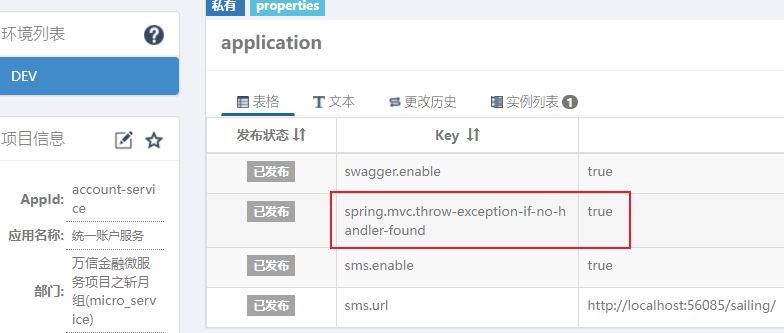
