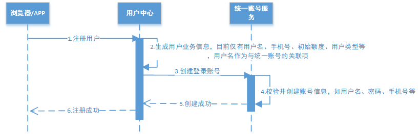
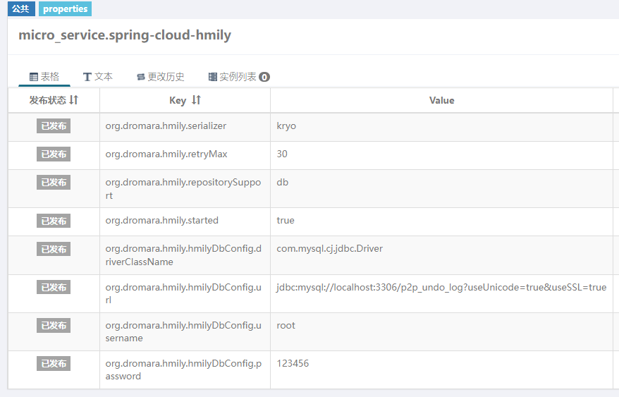
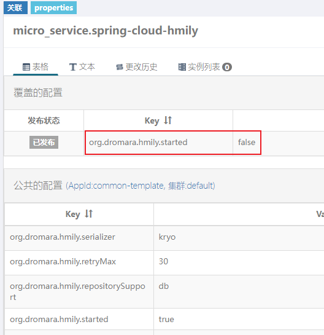

# 第04章 分布式事务解决方案-Hmily

在项目的用户注册流程中，一次注册请求需要由用户中心服务和统一账号服务协调共同完成，由于种种原因，当其中一个服务操作失败时会导致两个服务之间数据不一致，这样就产生了分布式事务问题。

本项目计划使用 TCC 的分布式事务解决方案 Hmily 框架来解决用户注册功能中的事务问题。

## 1. 分布式事务基础理论

分布式事务基础理论内容，详见[《分布式事务基础理论》笔记](/07-分布式架构&微服务架构/09-分布式事务控制解决方案/01-分布式事务基础理论)

## 2. TCC 补偿事务框架 Hmily

Hmily 是一个高性能分布式事务 tcc 开源框架。基于 java 语言来开发（JDK1.8），支持 dubbo，springcloud，motan 等 rpc 框架进行分布式事务。

Hmily 的快速入门详见[《Hmily-TCC分布式事务解决方案》笔记] (/07-分布式架构&微服务架构/09-分布式事务控制解决方案/03-Hmily-TCC分布式事务解决方案)

## 3. Hmily 解决注册功能的事务问题

### 3.1. 注册功能业务回顾



用户向用户中心发起注册请求，用户中心保存用户业务信息，然后远程调用统一账号服务保存该用户所对应的账号信息，该业务存在分布式事务问题。

针对注册业务，如果用户与账号信息不一致，则会导致严重问题，因此该业务对一致性要求较为严格，且属于执行时间较短的业务。TCC 方案的软状态时间很短，一致性较强，因此在此业务，选用TCC型分布式事务解决方案。

### 3.2. Hmily 环境搭建

#### 3.2.1. 数据库环境

新建数据库 p2p_undo_log，此库用来存储 hmily 事务日志，空库即可，由hmily自动建表。

```sql
CREATE DATABASE `p2p_undo_log` CHARACTER SET 'utf8' COLLATE 'utf8_general_ci';
```

#### 3.2.2. 项目依赖

- 修改聚合工程 pom 的版本控制

```xml
<dependencyManagement>
    <dependencies>
        <!-- 分布式事务 -->
        <dependency>
            <groupId>org.dromara</groupId>
            <artifactId>hmily-springcloud</artifactId>
            <version>2.0.4-RELEASE</version>
            <exclusions>
                <exclusion>
                    <artifactId>spring-boot-starter</artifactId>
                    <groupId>org.springframework.boot</groupId>
                </exclusion>
                <exclusion>
                    <groupId>org.springframework.boot</groupId>
                    <artifactId>spring-boot-starter-test</artifactId>
                </exclusion>
                <exclusion>
                    <artifactId>logback-core</artifactId>
                    <groupId>ch.qos.logback</groupId>
                </exclusion>
                <exclusion>
                    <artifactId>slf4j-api</artifactId>
                    <groupId>org.slf4j</groupId>
                </exclusion>
                <exclusion>
                    <artifactId>logback-classic</artifactId>
                    <groupId>ch.qos.logback</groupId>
                </exclusion>
            </exclusions>
        </dependency>
        <dependency>
            <groupId>com.esotericsoftware</groupId>
            <artifactId>kryo</artifactId>
            <version>4.0.2</version>
        </dependency>
        ....
    </dependencies>
</dependencyManagement>
```

- 分别修改 wanxinp2p-consumer-service 与 wanxinp2p-account-service 工程，确认引入 hmily 的依赖

```xml
<!-- hmily 分布式事务框架 -->
<dependency>
    <groupId>org.dromara</groupId>
    <artifactId>hmily-springcloud</artifactId>
</dependency>
<dependency>
    <groupId>com.esotericsoftware</groupId>
    <artifactId>kryo</artifactId>
</dependency>
<dependency>
    <groupId>org.springframework.retry</groupId>
    <artifactId>spring-retry</artifactId>
</dependency>
```

### 3.3. 事务发起方：consumer-service

#### 3.3.1. 项目配置

- 在 Apollo 配置中心，为 common-template 项目新建公共 namespace，命名为 `micro_service.spring-cloud-hmily`，新增如下配置项：

```properties
org.dromara.hmily.serializer = kryo
org.dromara.hmily.retryMax = 30
org.dromara.hmily.repositorySupport = db
org.dromara.hmily.started = true
org.dromara.hmily.hmilyDbConfig.driverClassName = com.mysql.cj.jdbc.Driver
org.dromara.hmily.hmilyDbConfig.url = jdbc:mysql://localhost:3306/p2p_undo_log?useUnicode=true&useSSL=true
org.dromara.hmily.hmilyDbConfig.username = root
org.dromara.hmily.hmilyDbConfig.password = 123456
```



- 在 apollo 中，修改 consumer-service 项目中，关联新建的 `micro_service.spring-cloud-hmily` 公共 namespace
- 在 application.yml 文件中，修改 `apollo.bootstrap.namespaces` 配置增加 `micro_service.spring-cloud-hmily`

#### 3.3.2. Hmily 配置类

- 在工程的 config 包下创建 Hmily 配置类 `HmilyConfig`，创建 `HmilyTransactionBootstrap` 实例，设置配置文件中相关内容

```java
@Configuration
@EnableAspectJAutoProxy(proxyTargetClass = true)
public class HmilyConfig {

    @Autowired
    private Environment env;

    @Bean
    public HmilyTransactionBootstrap hmilyTransactionBootstrap(HmilyInitService hmilyInitService) {
        HmilyTransactionBootstrap hmilyTransactionBootstrap = new HmilyTransactionBootstrap(hmilyInitService);
        hmilyTransactionBootstrap.setSerializer(env.getProperty("org.dromara.hmily.serializer"));
        hmilyTransactionBootstrap.setRetryMax(Integer.parseInt(env.getProperty("org.dromara.hmily.retryMax")));
        hmilyTransactionBootstrap.setRepositorySupport(env.getProperty("org.dromara.hmily.repositorySupport"));
        hmilyTransactionBootstrap.setStarted(Boolean.parseBoolean(env.getProperty("org.dromara.hmily.started")));
        HmilyDbConfig hmilyDbConfig = new HmilyDbConfig();
        hmilyDbConfig.setDriverClassName(env.getProperty("org.dromara.hmily.hmilyDbConfig.driverClassName"));
        hmilyDbConfig.setUrl(env.getProperty("org.dromara.hmily.hmilyDbConfig.url"));
        hmilyDbConfig.setUsername(env.getProperty("org.dromara.hmily.hmilyDbConfig.username"));
        hmilyDbConfig.setPassword(env.getProperty("org.dromara.hmily.hmilyDbConfig.password"));
        hmilyTransactionBootstrap.setHmilyDbConfig(hmilyDbConfig);
        return hmilyTransactionBootstrap;
    }
}
```

#### 3.3.3. 设置 Hmily 包扫描

修改项目启动类，增加配置扫描 hmily 的包路径

```java
@SpringBootApplication(
        exclude = MongoAutoConfiguration.class,
        scanBasePackages = {"org.dromara.hmily", "com.moon.wanxinp2p.common", "com.moon.wanxinp2p.consumer"}
)
@EnableDiscoveryClient
@EnableFeignClients(basePackages = {"com.moon.wanxinp2p.consumer.agent"})
public class ConsumerService {
    ....
}
```

#### 3.3.4. 修改 feign 远程调用接口

修改 Feign 远程代理接口 `AccountApiAgent`，在方法上增加 `@Hmily` 注解，该注解为 hmily 分布式事务接口标识，表示该接口参与hmily分布式事务

```java
@FeignClient("account-service")
public interface AccountApiAgent {
    @PostMapping(value = "/account/l/accounts")
    @Hmily
    RestResponse<AccountDTO> register(@RequestBody AccountRegisterDTO accountRegisterDTO);
}
```

#### 3.3.5. 业务代码增加 Try、Confirm、Cancel 操作

修改 `ConsumerServiceImpl` 注册业务代码，增加 Try、Confirm、Cancel 相应操作。try 操作为原来的 `register` 注册业务方法，在该方法上标识 `@Hmily` 注解，并指定 Confirm、Cancel 相应的方法

```java
@Override
// 在此方法上需要标识 @Hmily 注解，指定成功提交与失败回滚的方法
@Hmily(confirmMethod = "confirmRegister", cancelMethod = "cancelRegister")
public void register(ConsumerRegisterDTO consumerRegisterDTO) {
    ....
}

/**
 * 成功确认方法，在 try 阶段成功后执行。
 * 注意：Try、Confirm、Cancel 的方法参数必须保持一致。
 */
public void confirmRegister(ConsumerRegisterDTO consumerRegisterDTO) {
    log.info("execute confirmRegister");
}

/**
 * 失败回滚方法，在 try 阶段出现异常后执行。
 */
public void cancelRegister(ConsumerRegisterDTO consumerRegisterDTO) {
    log.info("execute cancelRegister");
    // 异常回滚，删除原来新增的记录即可
    remove(Wrappers.<Consumer>lambdaQuery().eq(Consumer::getMobile, consumerRegisterDTO.getMobile()));
}
```

### 3.4. 事务参与方：account-service

#### 3.4.1. 项目配置

- 在 apollo 中，修改 account-service 项目中，关联新建的 `micro_service.spring-cloud-hmily` 公共 namespace。<font color=violet>注意：因为账户服务不是事务发起方，所以需要覆盖 `org.dromara.hmily.started=false`</font>



- 在 application.yml 文件中，修改 `apollo.bootstrap.namespaces` 配置增加 `micro_service.spring-cloud-hmily`

#### 3.4.2. Hmily 配置类

与 wanxinp2p-consumer-service 工程一样。在 config 包下创建 Hmily 配置类 `HmilyConfig`，创建 `HmilyTransactionBootstrap` 实例，设置配置文件中相关内容。*代码参考 wanxinp2p-consumer-service 工程*

#### 3.4.3. 设置 Hmily 包扫描

修改项目启动类，增加配置扫描 hmily 的包路径

```java
@SpringBootApplication(
        exclude = MongoAutoConfiguration.class,
        // 因为本工程的扫描的包路径不包含全局的异常处理类所在的包，所以这里需要增加包扫描的路径范围，扫描接口common工程所在包
        // 再增加扫描 hmily 的包路径
        scanBasePackages = {"org.dromara.hmily", "com.moon.wanxinp2p"}
)
@EnableDiscoveryClient
public class AccountServiceApp {
    ....
}
```

#### 3.4.4. 业务代码增加 Try、Confirm、Cancel 操作

修改 `AccountServiceImpl` 注册业务代码，增加 Try、Confirm、Cancel 相应操作。try 操作为原来的 `register` 注册业务方法，在该方法上标识 `@Hmily` 注解，并指定 Confirm、Cancel 相应的方法

```java
@Override
@Transactional  // 本地事务，hmily 只会回滚远程调用时发现异常的事务。这里还是要处理本地事务
// 在此方法上需要标识 @Hmily 注解，指定成功提交与失败回滚的方法
@Hmily(confirmMethod = "confirmRegister", cancelMethod = "cancelRegister")
public AccountDTO register(AccountRegisterDTO accountRegisterDTO) {
    ....
    // 新增数据
    this.save(account);
    
    // 人为模拟出现异常
    if (accountRegisterDTO.getMobile().equals("12345678910")) {
        throw new RuntimeException("模拟异常");
    }
    ....
}

/**
 * 成功确认方法，在 try 阶段成功后执行。
 * 注意：Try、Confirm、Cancel 的方法参数必须保持一致。
 */
public void confirmRegister(AccountRegisterDTO registerDTO) {
    log.info("execute confirmRegister");
}

/**
 * 失败回滚方法，在 try 阶段出现异常后执行。
 */
public void cancelRegister(AccountRegisterDTO registerDTO) {
    log.info("execute cancelRegister");
    // 异常回滚，删除原来新增的记录即可
    remove(Wrappers.<Account>lambdaQuery().eq(Account::getUsername, registerDTO.getUsername()));
}
```

### 3.5. 功能测试

1. 启动 Apollo 服务
2. 后端需要启动：
    - wanxinp2p-discover-server 微服务
    - wanxinp2p-account-service 微服务
    - wanxinp2p-consumer-service 微服务

使用 postman 进行以下测试，请求url: 

```json
POST http://127.0.0.1:53050/consumer/consumers

请求参数

{
    "mobile":"12345678910",
    "key":"123"
}
```

- 测试场景1：用户中心服务和统一账户服务都执行成功。
- 测试场景2：统一账户服务执行失败，用户中心服务回滚成功。
