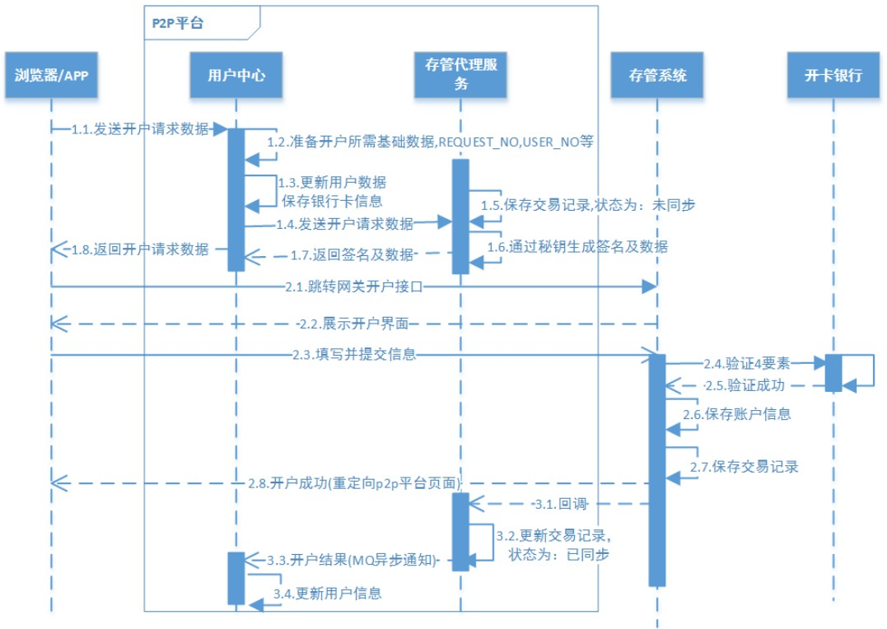
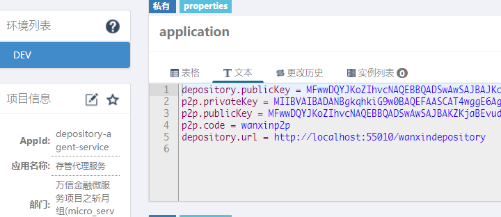

# 第05章 用户开户

## 1. 功能需求分析

开户是指借款用户和投资用户在注册后、交易前都需要在银行存管系统开通个人存管账户，在开户流程中银行存管系统是一个很重要的系统，它是当前P2P平台最常见的一种模式，为了保证资金不流向 P2P 平台，由银行存管系统去管理借款用户和投资用户的资金，P2P 平台与银行存管系统进行接口交互为借款用户和投资用户搭建交易的桥梁，它们之间的关系如下：


借款人和投资人需要开通两个账户，一个是P2P平台的，一个是银行存管系统的。两者的账户数据需要进行同步。

### 1.1. 开户业务流程图



上图可以将开户流程分成三个阶段，分别是：生成开户数据、请求开户、开户结果通知。每个阶段详细说明详见上图与下面阶段开发章节

### 1.2. 相关涉及系统介绍

- **存管系统**：不属于 P2P 平台，属于银行系统，专门负责对接 P2P 账户及交易，此系统在银行部署，P2P 平台的交易主要与存管系统交互。*由于存管系统属于银行，无需开发，直接提供源码工程。*
- **存管代理服务**：属于 P2P 平台，为了使 P2P 平台与银行存管系统松耦合，专门设立存管代理服务与存管系统对接，P2P 平台的各个服务都通过存管代理服务与银行存管系统交互。
- **开卡银行**：不属于 P2P 平台，属于银行系统，是银行用于管理储蓄卡信息的系统。为了使用方便，把该系统合并到了存管系统中。

## 2. 银行存管系统

由于银行存管系统不属于P2P平台，无需开发，直接提供了一个该系统源码，只需要在本地部署该系统，并熟悉它的接口信息。

### 2.1. 银行存管系统部署指南

#### 2.1.1. 数据库初始化

执行 `wanxinp2p-project\document\sql\wanxindepository-init.sql` 的脚本，初始化银行存管系统的数据库与表

#### 2.1.2. 导入项目

银行存管系统工程已有现成的源码工程，导入 maven 工程即可。位置：`wanxinp2p-project\wanxinp2p\wanxindepository\`


#### 2.1.3. 设置启动参数

配置以下 VM options 参数，启动服务，服务的端口是 55010

```bash
-Denv=dev -Dapollo.cluster=DEFAULT -Dserver.port=55010
```

#### 2.1.4. apollo 配置

启动 apollo 配置中心，修改银行存管系统相关的配置（*在项目初始化脚本中已经配置*）


#### 2.1.5. 项目运行测试

运行 test 包中的 BankCardServiceTest.java，进行测试

### 2.2. 银行存管系统接口说明

接口说明详见[《银行存管系统接口说明.pdf》文档](/00-项目资料/07-万信金融/attachments-万信金融/银行存管系统接口说明.pdf)

## 3. 存管代理服务工程

此服务是 P2P 项目的工程，用于对接银行存管系统。

### 3.1. 导入工程

导入P2P存管代理微服务基础源码工程 (wanxinp2p-depository-agent-service)

### 3.2. apollo 配置

- 在 apollo 配置中心新增相应的 `depository-agent-service` 项目，修改 application 命名空间增加以下配置：

```properties
depository.publicKey = MFwwDQYJKoZIhvcNAQEBBQADSwAwSAJBAJKcP4TjCb9+OKf0uvHkDO6njI8b9KKlu3ZdCkom4SONf8KkZ1jVl6A7XWnJ33gBLnbTGVUm5I+XvFEG5bSWVbkCAwEAAQ==
p2p.privateKey = MIIBVAIBADANBgkqhkiG9w0BAQEFAASCAT4wggE6AgEAAkEApkqNoES+508OiULK5UIEuZ9WxIUG7fB92V0vEi1FyNJgzMc2gi5hy8eGcyYyLWJdEt5h1vC8jclCgEcMY3lp3QIDAQABAkAUhQia6UDBXEEH8QUGazIYEbBsSZoETHPLGbOQQ6Pj1tb6CVC57kioBjwtNBnY2jBDWi5K815LnOBcJSSjJPwhAiEA2eO6VZMTkdjQAkpB5dhy/0C3i8zs0c0M1rPoTA/RpkUCIQDDYHJPqHLkQyd//7sEeYcm8cMBTvDKBXyiuGk8eLRauQIgQo6IlalGmg+Dgp+SP5Z9kjD/oCmp0XB0UoVEGS/f140CIQCsG9YXHgi31ACD3T9eHcBVKjvidyveix7UKSdrQdl+4QIgNCtRVLV+783e7PX5hRXD+knsWTQxDEMEsHi1KsAWtPk=
p2p.publicKey = MFwwDQYJKoZIhvcNAQEBBQADSwAwSAJBAKZKjaBEvudPDolCyuVCBLmfVsSFBu3wfdldLxItRcjSYMzHNoIuYcvHhnMmMi1iXRLeYdbwvI3JQoBHDGN5ad0CAwEAAQ==
p2p.code = wanxinp2p
depository.url = http://localhost:55010/wanxindepository
```



- `depository-agent-service` 项目关联相关公共的命名空间，分别是：`micro_service.spring-boot-druid`, `micro_service.spring-boot-http`, `micro_service.spring-eureka`, `micro_service.spring-hystrix`, `micro_service.spring-cloud-feign`, `micro_service.spring-ribbon`, `micro_service.mybatis-plus`, `micro_service.spring-rocketmq`, `micro_service.spring-boot-redis`，并做以下相应项目的配置修改
    - `micro_service.spring-boot-druid` 命名空间：`spring.datasource.url = jdbc:mysql://localhost:3306/p2p_depository_agent?useUnicode=true&useSSL=false`
    - `micro_service.spring-boot-http` 命名空间：`server.servlet.context-path = /depository-agent`
    - `micro_service.mybatis-plus` 命名空间：`mybatis-plus.typeAliasesPackage = com.moon.wanxinp2p.depository.entity`

### 3.3. 项目启动参数配置

配置以下 VM options 参数，启动服务，服务的端口是 53070

```bash
-Denv=dev -Dapollo.cluster=DEFAULT -Dserver.port=53070
```

## 4. 第一阶段：生成开户数据

### 4.1. 需求分析

**第一阶段：生成开户数据(开户业务流程图中 1.1-1.8)**

1. 前端填写开户信息。前端会先查询开户信息，如果曾经填写了开户信息则在界面直接显示，用户可以修改；如果曾经没有填写开户信息则用户在界面填写开户信息
2. 前端请求用户中心服务开户
3. 用户中心服务准备开户数据，并把开户信息保存到用户中心
4. 用户中心服务请求存管代理服务生成交易记录（未同步），并对开户数据进行签名
5. 存管代理服务将签名后的开户数据返回给用户中心
6. 用户中心将开户数据返回给前端

涉及银行存管系统的接口信息详见《银行存管系统接口说明.pdf》文档中的“个人绑卡开户”章节

### 4.2. 接口定义

#### 4.2.1. 相关实体类定义

- 在 wanxinp2p-api 工程中，创建 `depository` 包，定义封装与银行存管系统对接使用的签名请求数据实体 `GatewayRequest`

```java
@Data
@ApiModel(value = "GatewayRequest", description = "与银行存管系统对接使用的签名请求数据")
public class GatewayRequest {
    @ApiModelProperty("请求的存管接口名")
    private String serviceName;
    @ApiModelProperty("平台编号，平台与存管系统签约时获取")
    private String platformNo;
    @ApiModelProperty("业务数据报文，json格式")
    private String reqData;
    @ApiModelProperty("对reqData参数的签名")
    private String signature;
    @ApiModelProperty("银行存管系统地址")
    private String depositoryUrl;
}
```

- 在 `consumer` 模块，创建 `ConsumerRequest` 实体类，用于封装平台c端用户开户信息请求

```java
@Data
@ApiModel(value = "ConsumerRequest", description = "平台c端用户开户信息")
public class ConsumerRequest {
    @ApiModelProperty("id")
    private Long id;
    @ApiModelProperty("用户名")
    private String username;
    @ApiModelProperty("真实姓名")
    private String fullname;
    @ApiModelProperty("身份证号")
    private String idNumber;
    @ApiModelProperty("银行编码")
    private String bankCode;
    @ApiModelProperty("银行卡号")
    private String cardNumber;
    @ApiModelProperty("手机号")
    private String mobile;
    @ApiModelProperty("角色")
    private String role;
    @ApiModelProperty("请求流水号")
    private String requestNo;
    @ApiModelProperty("用户编号")
    private String userNo;
    @ApiModelProperty("页面回跳 URL")
    private String callbackUrl;
}
```

#### 4.2.2. 用户中心生成开户数据接口

修改 wanxinp2p-api 工程中 `ConsumerAPI` 接口，新增 `createConsumer` 生成开户数据方法：

```java
/**
 * 生成开户请求数据
 */
RestResponse<GatewayRequest> createConsumer(ConsumerRequest consumerRequest);
```

#### 4.2.3. 存管代理生成开户数据接口

在 wanxinp2p-api 工程中 `depository` 包中，新建一个 `DepositoryAgentApi` 的接口，然后定义 `createConsumer` 开通存管账户方法：

```java
public interface DepositoryAgentApi {
    /**
     * 开通存管账户
     *
     * @param consumerRequest 开户信息
     * @return
     */
    RestResponse<GatewayRequest> createConsumer(ConsumerRequest consumerRequest);
}
```

### 4.3. 用户中心生成开户数据功能实现

> 以下是 wanxinp2p-consumer-service 工程功能实现

#### 4.3.1. 数据访问层接口

- 创建 p2p_consumer 数据库的 bank_card 表相应的实体类 `BankCard`

```java
@Data
@TableName("bank_card")
public class BankCard implements Serializable {
    /** 主键 */
    @TableId(value = "ID", type = IdType.AUTO)
    private Long id;
    /** 用户标识 */
    @TableField("CONSUMER_ID")
    private Long consumerId;
    /** 银行编码 */
    @TableField("BANK_CODE")
    private String bankCode;
    /** 银行名称 */
    @TableField("BANK_NAME")
    private String bankName;
    /** 银行卡号 */
    @TableField("CARD_NUMBER")
    private String cardNumber;
    /** 银行预留手机号 */
    @TableField("MOBILE")
    private String mobile;
    /** 可用状态 */
    @TableField("STATUS")
    private Integer status;
}
```

- 单独抽取出来一个处理银行卡业务的接口，在 mapper 包中新建 `BankCardMapper` 接口，继承 MP 的 `BaseMapper`：

```java
public interface BankCardMapper extends BaseMapper<BankCard> {
}
```

- 在 `mapper.xml` 包下创建 mapper 映射文件

```xml
<?xml version="1.0" encoding="UTF-8" ?>
<!DOCTYPE mapper PUBLIC "-//mybatis.org//DTD Mapper 3.0//EN" "http://mybatis.org/dtd/mybatis-3-mapper.dtd">
<mapper namespace="com.moon.wanxinp2p.consumer.mapper.BankCardMapper">
</mapper>
```

#### 4.3.2. 远程调用代理

在 agent 包中新建一个远程调用存管代理服务的 Feign 代理接口 `DepositoryAgentApiAgent`

```java
@FeignClient("depository-agent-service") // 服务 id
public interface DepositoryAgentApiAgent {
    /**
     * 生成开户数据
     */
    @PostMapping("/depository-agent/l/consumers")
    RestResponse<GatewayRequest> createConsumer(@RequestBody ConsumerRequest consumerRequest);
}
```

#### 4.3.3. 功能业务层接口与实现

- 在 wanxinp2p-api 工程的 consumer 模块中，创建业务接口返回的银行信息传输实体类 `BankCardDTO`

```java
@Data
@ApiModel(value = "BankCardDTO", description = "银行卡信息")
public class BankCardDTO {
    @ApiModelProperty("标识")
    private Long id;
    @ApiModelProperty("用户标识")
    private Long consumerId;
    @ApiModelProperty("用户实名")
    private String fullName;
    @ApiModelProperty("银行编码")
    private String bankCode;
    @ApiModelProperty("银行名称")
    private String bankName;
    @ApiModelProperty("银行卡号")
    private String cardNumber;
    @ApiModelProperty("银行预留手机号")
    private String mobile;
    @ApiModelProperty("可用状态")
    private Integer status;
}
```

- 创建 `BankCardService` 接口，继承 MP 的 `IService` 接口。在接口中定义以下方法：

```java
public interface BankCardService extends IService<BankCard> {
    /**
     * 根据用户ID获取银行卡信息
     *
     * @param consumerId 用户id
     * @return
     */
    BankCardDTO getByConsumerId(Long consumerId);

    /**
     * 根据用户卡号获取银行卡信息
     *
     * @param cardNumber 卡号
     * @return
     */
    BankCardDTO getByCardNumber(String cardNumber);
}
```

- 创建  `BankCardService` 接口现实类 `BankCardServiceImpl`，继承 MP 的 `ServiceImpl` 类

```java
@Service
public class BankCardServiceImpl extends ServiceImpl<BankCardMapper, BankCard> implements BankCardService {

    /**
     * 获取银行卡信息
     */
    @Override
    public BankCardDTO getByConsumerId(Long consumerId) {
        BankCard bankCard = this.getOne(new QueryWrapper<BankCard>().lambda().eq(BankCard::getConsumerId, consumerId));
        return convertEntityToDTO(bankCard);
    }

    /**
     * 获取银行卡信息
     */
    @Override
    public BankCardDTO getByCardNumber(String cardNumber) {
        BankCard bankCard = this.getOne(new QueryWrapper<BankCard>().lambda().eq(BankCard::getCardNumber, cardNumber));
        return convertEntityToDTO(bankCard);
    }

    private BankCardDTO convertEntityToDTO(BankCard bankCard) {
        if (bankCard == null) {
            return null;
        }
        BankCardDTO bankCardDTO = new BankCardDTO();
        BeanUtils.copyProperties(bankCard, bankCardDTO);
        return bankCardDTO;
    }
}
```

- 在 `ConsumerService` 接口中新增 `createConsumer` 方法

```java
/**
 * 生成开户数据
 */
RestResponse<GatewayRequest> createConsumer(ConsumerRequest consumerRequest);
```

- 在 `ConsumerServiceImpl` 类中实现 `ConsumerService` 接口的 `createConsumer` 方法

```java
@Autowired
private BankCardService bankCardService;
// 注入 feign 存管代理服务接口
@Autowired
private DepositoryAgentApiAgent depositoryAgentApiAgent;

@Override
@Transactional
public RestResponse<GatewayRequest> createConsumer(ConsumerRequest consumerRequest) {
    // 1.判断当前用户是否已经开户，根据用户手机号查询用户表
    ConsumerDTO consumerDTO = getByMobile(consumerRequest.getMobile());

    if (consumerDTO == null) {
        // 用户不存在
        throw new BusinessException(ConsumerErrorCode.E_140101);
    }

    // 判断 isBindCard（是否绑定银行卡）是否为1
    if (consumerDTO.getIsBindCard() == 1) {
        // 已经绑卡
        throw new BusinessException(ConsumerErrorCode.E_140105);
    }

    // 2.判断提交过来的银行卡是否已被绑定
    BankCardDTO bankCardDTO = bankCardService.getByCardNumber(consumerRequest.getCardNumber());
    if (bankCardDTO != null && StatusCode.STATUS_IN.getCode().compareTo(bankCardDTO.getStatus()) == 0) {
        throw new BusinessException(ConsumerErrorCode.E_140151);
    }

    // 3.更新用户的信息
    consumerRequest.setId(consumerDTO.getId());
    //产生请求流水号和用户编号
    consumerRequest.setUserNo(CodeNoUtil.getNo(CodePrefixCode.CODE_CONSUMER_PREFIX));
    consumerRequest.setRequestNo(CodeNoUtil.getNo(CodePrefixCode.CODE_REQUEST_PREFIX));
    //设置查询条件和需要更新的数据
    UpdateWrapper<Consumer> updateWrapper = new UpdateWrapper<>();
    updateWrapper.lambda().eq(Consumer::getMobile, consumerDTO.getMobile());
    updateWrapper.lambda().set(Consumer::getUserNo, consumerRequest.getUserNo());
    updateWrapper.lambda().set(Consumer::getRequestNo, consumerRequest.getRequestNo());
    updateWrapper.lambda().set(Consumer::getFullname, consumerRequest.getFullname());
    updateWrapper.lambda().set(Consumer::getIdNumber, consumerRequest.getIdNumber());
    updateWrapper.lambda().set(Consumer::getAuthList, "ALL");
    update(updateWrapper);

    // 4.保存银行卡信息
    BankCard bankCard = new BankCard();
    bankCard.setConsumerId(consumerDTO.getId());
    bankCard.setBankCode(consumerRequest.getBankCode());
    bankCard.setCardNumber(consumerRequest.getCardNumber());
    bankCard.setMobile(consumerRequest.getMobile());
    bankCard.setStatus(StatusCode.STATUS_OUT.getCode());
    // 根据用户id查询银行卡信息
    BankCardDTO existBankCard = bankCardService.getByConsumerId(bankCard.getConsumerId());
    if (existBankCard != null) {
        bankCard.setId(existBankCard.getId());
    }
    // 新增或更新银行卡信息
    bankCardService.saveOrUpdate(bankCard);

    // 5.准备数据，发起远程调用，把数据发到存管代理服务
    return depositoryAgentApiAgent.createConsumer(consumerRequest);
}
```

#### 4.3.4. 请求控制类

- 因为需要获取登陆用户的手机号，之前自定义的 Spring MVC 拦截器 `TokenInterceptor` 已经将从网关服务转发时上送的用户 json 字符串转成 `LoginUser` 实例，并存入请求域中的 `jsonToken` 字段。所以定义以下工具类，用于获取用户信息

```java
public class SecurityUtil {
    /**
     * 获取当前登录用户
     */
    public static LoginUser getUser() {
        ServletRequestAttributes servletRequestAttributes = (ServletRequestAttributes) RequestContextHolder
                .getRequestAttributes();

        if (servletRequestAttributes != null) {
            HttpServletRequest request = servletRequestAttributes.getRequest();

            Object jwt = request.getAttribute("jsonToken");
            if (jwt instanceof LoginUser) {
                return (LoginUser) jwt;
            }
        }

        return new LoginUser();
    }
}
```

- 修改 `ConsumerController` 类，实现`ConsumerAPI` 接口的 `createConsumer` 生成开户数据方法，因为前端上送的开户信息中，没有当前用户的手机号，所以需要通过工具类获取

```java
@ApiOperation("生成开户请求数据")
@ApiImplicitParam(name = "consumerRequest", value = "开户信息", required = true, dataType = "ConsumerRequest", paramType = "body")
@PostMapping("/my/consumers")
@Override
public RestResponse<GatewayRequest> createConsumer(ConsumerRequest consumerRequest) {
    // 从 gateway 转发请求时设置的用户信息数据中，获取用户的手机号
    LoginUser user = SecurityUtil.getUser();
    consumerRequest.setMobile(user.getMobile());
    return consumerService.createConsumer(consumerRequest);
}
```

### 4.4. 存管代理生成开户数据功能实现

> 以下是 wanxinp2p-depository-agent-service 工程功能实现

#### 4.4.1. 数据访问层接口

- 创建 p2p_depository_agent 数据库的 depository_record 表相应的实体类 `DepositoryRecord`

```java
@Data
@AllArgsConstructor
@NoArgsConstructor
@EqualsAndHashCode(callSuper = false)
@Accessors(chain = true)
public class DepositoryRecord implements Serializable {

    /**
     * 主键
     */
    @TableId("ID")
    private Long id;

    /**
     * 请求流水号
     */
    @TableField("REQUEST_NO")
    private String requestNo;

    /**
     * 请求类型:1.用户信息(新增、编辑)、2.绑卡信息
     */
    @TableField("REQUEST_TYPE")
    private String requestType;

    /**
     * 业务实体类型
     */
    @TableField("OBJECT_TYPE")
    private String objectType;

    /**
     * 关联业务实体标识
     */
    @TableField("OBJECT_ID")
    private Long objectId;

    /**
     * 请求时间
     */
    @TableField("CREATE_DATE")
    private LocalDateTime createDate;

    /**
     * 是否是同步调用
     */
    @TableField("IS_SYN")
    private Integer isSyn;

    /**
     * 数据同步状态
     */
    @TableField("REQUEST_STATUS")
    private Integer requestStatus;

    /**
     * 消息确认时间
     */
    @TableField("CONFIRM_DATE")
    private LocalDateTime confirmDate;

    /**
     * 返回数据
     */
    @TableField("RESPONSE_DATA")
    private String responseData;
}
```

- 在 mapper 包中新建 `DepositoryRecordMapper` 接口，继承 MP 的 `BaseMapper`：

```java
public interface DepositoryRecordMapper extends BaseMapper<DepositoryRecord> {
}
```

-  在 `mapper.xml` 包下创建 mapper 映射文件

```xml
<?xml version="1.0" encoding="UTF-8"?>
<!DOCTYPE mapper PUBLIC "-//mybatis.org//DTD Mapper 3.0//EN" "http://mybatis.org/dtd/mybatis-3-mapper.dtd">
<mapper namespace="com.moon.wanxinp2p.depository.mapper.DepositoryRecordMapper">
</mapper>
```

#### 4.4.2. 功能业务层接口与实现

- 新建 `DepositoryRecordService` 接口，并定义 `createConsumer` 开通存管账户方法

```java
public interface DepositoryRecordService extends IService<DepositoryRecord> {

    /**
     * 开通存管账户
     *
     * @param consumerRequest 开户信息
     * @return
     */
    GatewayRequest createConsumer(ConsumerRequest consumerRequest);
}
```

- 创建接口实现类 `DepositoryRecordServiceImpl`


## 5. 第二阶段：请求开户

### 5.1. 需求分析

**第二阶段：请求开户(开户业务流程图中 2.1-2.8)**

1. 前端携带开户信息请求银行存管系统
2. 银行存管系统向前端返回开户信息确定页面
3. 前端确认完成提交开户请求到银行存管系统
4. 银行存管系统接收开户数据并进行校验，校验银行卡信息，信息无误则将开户信息保存至存管系统（校验过程中存管系统会请求开户银行校验银行卡信息）


## 6. 第三阶段：开户结果通知

### 6.1. 需求分析

**第三阶段：开户结果通知(开户业务流程图中 3.1-3.4)**

1. 开户成功后，银行存管系统异步通知存管代理服务
2. 存管代理服务接收到开户成功通知后更新交易状态为同步
3. 存管代理服务通知用户中心服务
4. 用户中心服务接收到开户成功的消息保存开户信息


