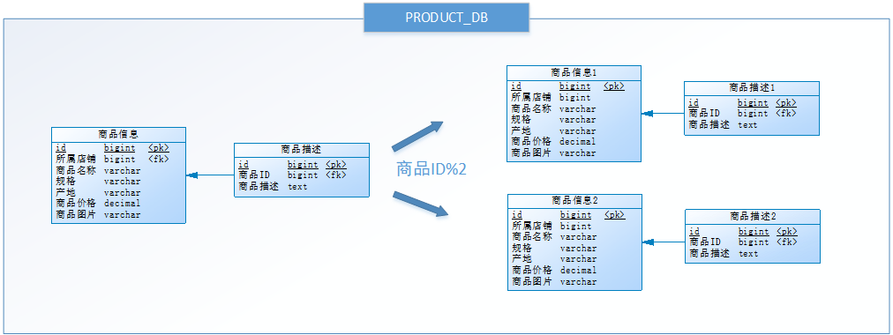

# 第06章 分库分表解决方案 Sharding-JDBC

## 1. 项目分库分表的原因

​在P2P平台中，标的信息和投标信息做为平台基础业务数据存在。随着平台的发展，这些数据可能会越来越多，甚至达到亿级。以MySQL为例，单库数据量在5000万以内性能比较好，超过阈值后性能会随着数据量的增大而明显降低。单表的数据量超过1000w，性能也会下降严重。这就会导致查询一次所花的时间变长，并发操作达到一定量时可能会卡死，甚至把系统给拖垮，因此 P2P 平台需要解决这个性能瓶颈问题。

那么是否可以通过提升服务器硬件能力来提高数据处理能力？这种方案是可以得到一定提升，但是成本很贵，并且提高硬件也是有上限的。**此时就引入数据库分库分表技术，即把数据分散在不同的数据库中，使得单一数据库和表的数据量变小，从而达到提升数据库操作性能的目的** 

​分库分表就是把较大的数据库和数据表按照某种策略进行拆分。目的在于：降低每个库、每张表的数据量，减小数据库的负担，提高数据库的效率，缩短查询时间。另外，因为分库分表这种改造是可控的，底层还是基于RDBMS，因此整个数据库的运维体系以及相关基础设施都是可重用的。

## 2. 分库分表的方式

### 2.1. 垂直分表

用户在电商平台流览商品时，首先看到的是商品的基本信息，如果对该商品感兴趣时才会继续查看该商品的详细描述。因此，商品基本信息的访问频次要高于商品详细描述信息，商品基本信息的访问效率要高于商品详细描述信息(大字段)。由于这两种数据的特性不一样，因此考虑将商品信息表进行**垂直分表**，拆分结果如下：

**垂直分表定义：将一个表的字段分散到多个表中，每个表存储其中一部分字段**。

**垂直分表的好处**：

1. 减少IO争抢，减少锁表的几率，查看商品详情的与商品概述互不影响
2. 充分发挥高频数据的操作效率，对商品概述数据操作的高效率不会被操作商品详情数据的低效率所拖累。

**垂直拆分常用原则**：

一般来说，某业务实体中的各个数据项的访问频次是不一样的，部分数据项可能是占用存储空间比较大的BLOB或是TEXT，例如上例中的<u>商品描述字段</u>。所以，当数据量很大时，可以**将表按字段拆分，将热门字段、冷门字段分开放置在不同表中**。垂直切分带来的性能提升，主要集中在热门数据的操作效率上，而且磁盘争用情况减少。

- 把不常用的字段单独放在一张表
- 把text，blob等大字段拆分出来单独放在一张表
- 经常组合查询的字段单独放在一张表中

### 2.2. 垂直分库 

通过垂直分表，数据库性能得到了一定程度的提升，但是还没有达到要求，并且磁盘空间也快不够了，因为数据还是始终存放在一台服务器。库内垂直分表只解决了单一表数据量过大的问题，但没有将表分布到不同机器的库上，因此对于减轻数据库的压力来说，作用有限，所有请求还是竞争同一个物理机的CPU、内存、网络IO、磁盘。

以电商平台为例，可以把原有的 SELLER_DB (卖家库)，拆分为 PRODUCT_DB (商品库)和 STORE_DB (店铺库)，并把这两个库分散到不同服务器上。由于**商品信息**与**商品描述**业务耦合度较高，因此一起被存放在PRODUCT_DB(商品库)；而**店铺信息**相对独立，因此单独被存放在STORE_DB(店铺库)，这就叫**垂直分库**。如下图所示：

**垂直分库定义：指按照业务将表进行分类，分布到不同的数据库上面，每个库可以放在不同的服务器上，从而达到多个服务器共同分摊压力的效果**。垂直分库的好处是：

- 解决业务层面的耦合，业务清晰
- 能对不同业务的数据进行分级管理、维护、监控、扩展等
- 高并发场景下，垂直分库在一定程度上可以提升IO、数据库连接数、单机硬件资源的性能

### 2.3. 水平分库

经过**垂直分表和垂直分库**后，数据库性能问题并没有完全解决。假设某电商平台发展迅猛，PRODUCT_DB (商品库)单库存储数据已经超出预估。假设目前该平台有8万个店铺，每个店铺平均有150个不同规格的商品，再算上增长，那商品数量就会达到 1500w+ 级别，并且 PRODUCT_DB (商品库)属于访问非常频繁的资源，性能瓶颈再次出现。

从业务角度分析，目前已经无法再次进行垂直拆分。于是可以尝试一种办法，判断商品ID是奇数还是偶数，然后把商品信息分别存放到两个数据库中。也就是说，要操作某条数据，先分析这条数据的商品ID，如果商品ID为奇数，将此操作映射至 RRODUCT_DB1(商品库1)；如果商品ID为偶数，将操作映射至 RRODUCT_DB2(商品库2)，这就叫**水平分库**。

**水平分库定义：把同一个表的数据按一定规则拆分到不同的数据库中，每个库可以放在不同的服务器上**。水平分库的好处是：

- 解决了单库大数据，高并发的性能瓶颈。
- 按照合理拆分规则拆分，join操作基本避免跨库。*例子中商品信息、商品描述表都使用商品ID字段拆库，可避免跨库join*
- 提高了系统的稳定性及可用性。*稳定性体现在IO冲突减少，锁定减少，可用性指某个库出问题，部分可用*

当一个应用难以再细粒度的垂直切分，或切分后数据量行数仍然巨大，存在单库读写、存储性能瓶颈，这时候就需要进行**水平分库**了，经过水平切分的优化，往往能解决单库存储量及性能瓶颈。但由于同一个表被分配在不同的数据库，需要额外进行数据操作的路由工作，因此大大增加了系统复杂度。

### 2.4. 水平分表

数据库能水平拆分，数据表也可以水平拆分。尝试把某 PRODUCT_DB (商品库)内的表，进行了一次水平拆分。与水平分库的思路类似，不过这次拆分的目标是表，商品信息及商品描述被分成了两套表。如果商品ID为奇数，将此操作映射至商品信息1表；如果商品ID为偶数，将操作映射至商品信息2表，这就叫**水平分表**。

**水平分表定义：在同一个数据库内，把同一个表的数据按一定规则拆分到多个表中**。水平分表的好处是：

- 优化单一表数据量过大而产生的性能问题
- 避免IO争抢并减少锁表的几率

库内的水平分表，解决了单一表数据量过大的问题，分出来的小表中只包含一部分数据，从而使得单个表的数据量变小，提高检索性能。但由于同一个表的数据被拆分为多张表，也需要额外进行数据操作的路由工作，因此增加了系统复杂度。

### 2.5. 小结

- 垂直分表：可以把一个宽表的字段按访问频次、业务耦合松紧、是否是大字段的原则拆分为多个表，这样既能使业务清晰，还能提升部分性能。拆分后，尽量从业务角度避免联查，否则性能方面将得不偿失。
- 垂直分库：可以把多个表按业务耦合松紧归类，分别存放在不同的库，这些库可以分布在不同服务器，从而使访问压力被多服务器负载，大大提升性能，同时能提高整体架构的业务清晰度，不同的业务库可根据自身情况定制优化方案。但是它需要解决跨库带来的所有复杂问题。
- 水平分库：可以把一个表的数据（按数据行）分到多个不同的库，每个库只有这个表的部分数据，这些库可以分布在不同服务器，从而使访问压力被多服务器负载，大大提升性能。它不仅需要解决跨库带来的所有复杂问题，还要解决数据路由的问题。
- 水平分表：可以把一个表的数据（按数据行）分到多个同一个数据库的多张表中，每个表只有这个表的部分数据，这样做能小幅提升性能，它仅仅作为水平分库的一个补充优化。

一般来说，在系统设计阶段就应该根据业务耦合松紧来确定垂直分库，垂直分表方案，在数据量及访问压力不是特别大的情况，首先考虑缓存、读写分离、索引技术等方案。若数据量极大，且持续增长，再考虑水平分库分表方案。

## 3. Sharding-JDBC

> 官网地址：https://shardingsphere.apache.org/document/legacy/4.x/document/cn/manual/sharding-jdbc/

