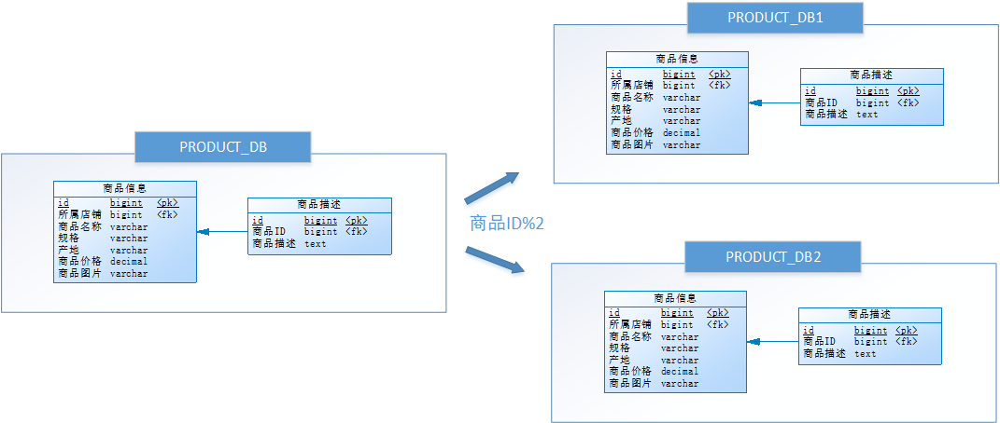

# 第06章 分库分表解决方案 Sharding-JDBC

## 1. 项目分库分表的原因

​在P2P平台中，标的信息和投标信息做为平台基础业务数据存在。随着平台的发展，这些数据可能会越来越多，甚至达到亿级。以MySQL为例，单库数据量在5000万以内性能比较好，超过阈值后性能会随着数据量的增大而明显降低。单表的数据量超过1000w，性能也会下降严重。这就会导致查询一次所花的时间变长，并发操作达到一定量时可能会卡死，甚至把系统给拖垮，因此 P2P 平台需要解决这个性能瓶颈问题。

那么是否可以通过提升服务器硬件能力来提高数据处理能力？这种方案是可以得到一定提升，但是成本很贵，并且提高硬件也是有上限的。**此时就引入数据库分库分表技术，即把数据分散在不同的数据库中，使得单一数据库和表的数据量变小，从而达到提升数据库操作性能的目的** 

​分库分表就是把较大的数据库和数据表按照某种策略进行拆分。目的在于：降低每个库、每张表的数据量，减小数据库的负担，提高数据库的效率，缩短查询时间。另外，因为分库分表这种改造是可控的，底层还是基于RDBMS，因此整个数据库的运维体系以及相关基础设施都是可重用的。

## 2. 分库分表的方式

### 2.1. 垂直分表

用户在电商平台流览商品时，首先看到的是商品的基本信息，如果对该商品感兴趣时才会继续查看该商品的详细描述。因此，商品基本信息的访问频次要高于商品详细描述信息，商品基本信息的访问效率要高于商品详细描述信息(大字段)。由于这两种数据的特性不一样，因此考虑将商品信息表进行**垂直分表**，拆分结果如下：


<font color=red>**垂直分表定义：将一个表的字段分散到多个表中，每个表存储其中一部分字段**</font>。

**垂直分表的好处**：

1. 减少IO争抢，减少锁表的几率，查看商品详情的与商品概述互不影响
2. 充分发挥高频数据的操作效率，对商品概述数据操作的高效率不会被操作商品详情数据的低效率所拖累。

**垂直拆分常用原则**：

一般来说，某业务实体中的各个数据项的访问频次是不一样的，部分数据项可能是占用存储空间比较大的BLOB或是TEXT，例如上例中的<u>商品描述字段</u>。所以，当数据量很大时，可以**将表按字段拆分，将热门字段、冷门字段分开放置在不同表中**。垂直切分带来的性能提升，主要集中在热门数据的操作效率上，而且磁盘争用情况减少。

- 把不常用的字段单独放在一张表
- 把text，blob等大字段拆分出来单独放在一张表
- 经常组合查询的字段单独放在一张表中

### 2.2. 垂直分库 

通过垂直分表，数据库性能得到了一定程度的提升，但是还没有达到要求，并且磁盘空间也快不够了，因为数据还是始终存放在一台服务器。库内垂直分表只解决了单一表数据量过大的问题，但没有将表分布到不同机器的库上，因此对于减轻数据库的压力来说，作用有限，所有请求还是竞争同一个物理机的CPU、内存、网络IO、磁盘。

以电商平台为例，可以把原有的 SELLER_DB (卖家库)，拆分为 PRODUCT_DB (商品库)和 STORE_DB (店铺库)，并把这两个库分散到不同服务器上。由于**商品信息**与**商品描述**业务耦合度较高，因此一起被存放在PRODUCT_DB(商品库)；而**店铺信息**相对独立，因此单独被存放在STORE_DB(店铺库)，这就叫**垂直分库**。如下图所示：


<font color=red>**垂直分库定义：指按照业务将表进行分类，分布到不同的数据库上面，每个库可以放在不同的服务器上，从而达到多个服务器共同分摊压力的效果**</font>。垂直分库的好处是：

- 解决业务层面的耦合，业务清晰
- 能对不同业务的数据进行分级管理、维护、监控、扩展等
- 高并发场景下，垂直分库在一定程度上可以提升IO、数据库连接数、单机硬件资源的性能

### 2.3. 水平分库

经过**垂直分表和垂直分库**后，数据库性能问题并没有完全解决。假设某电商平台发展迅猛，PRODUCT_DB (商品库)单库存储数据已经超出预估。假设目前该平台有8万个店铺，每个店铺平均有150个不同规格的商品，再算上增长，那商品数量就会达到 1500w+ 级别，并且 PRODUCT_DB (商品库)属于访问非常频繁的资源，性能瓶颈再次出现。

从业务角度分析，目前已经无法再次进行垂直拆分。于是可以尝试一种办法，判断商品ID是奇数还是偶数，然后把商品信息分别存放到两个数据库中。也就是说，要操作某条数据，先分析这条数据的商品ID，如果商品ID为奇数，将此操作映射至 RRODUCT_DB1(商品库1)；如果商品ID为偶数，将操作映射至 RRODUCT_DB2(商品库2)，这就叫**水平分库**。



<font color=red>**水平分库定义：把同一个表的数据按一定规则拆分到不同的数据库中，每个库可以放在不同的服务器上**</font>。水平分库的好处是：

- 解决了单库大数据，高并发的性能瓶颈。
- 按照合理拆分规则拆分，join操作基本避免跨库。*例子中商品信息、商品描述表都使用商品ID字段拆库，可避免跨库join*
- 提高了系统的稳定性及可用性。*稳定性体现在IO冲突减少，锁定减少，可用性指某个库出问题，部分可用*

当一个应用难以再细粒度的垂直切分，或切分后数据量行数仍然巨大，存在单库读写、存储性能瓶颈，这时候就需要进行**水平分库**了，经过水平切分的优化，往往能解决单库存储量及性能瓶颈。但由于同一个表被分配在不同的数据库，需要额外进行数据操作的路由工作，因此大大增加了系统复杂度。

### 2.4. 水平分表

数据库能水平拆分，数据表也可以水平拆分。尝试把某 PRODUCT_DB (商品库)内的表，进行了一次水平拆分。与水平分库的思路类似，不过这次拆分的目标是表，商品信息及商品描述被分成了两套表。如果商品ID为奇数，将此操作映射至商品信息1表；如果商品ID为偶数，将操作映射至商品信息2表，这就叫**水平分表**。


<font color=red>**水平分表定义：在同一个数据库内，把同一个表的数据按一定规则拆分到多个表中**</font>。水平分表的好处是：

- 优化单一表数据量过大而产生的性能问题
- 避免IO争抢并减少锁表的几率

库内的水平分表，解决了单一表数据量过大的问题，分出来的小表中只包含一部分数据，从而使得单个表的数据量变小，提高检索性能。但由于同一个表的数据被拆分为多张表，也需要额外进行数据操作的路由工作，因此增加了系统复杂度。

### 2.5. 小结

- 垂直分表：可以把一个宽表的字段按访问频次、业务耦合松紧、是否是大字段的原则拆分为多个表，这样既能使业务清晰，还能提升部分性能。拆分后，尽量从业务角度避免联查，否则性能方面将得不偿失。
- 垂直分库：可以把多个表按业务耦合松紧归类，分别存放在不同的库，这些库可以分布在不同服务器，从而使访问压力被多服务器负载，大大提升性能，同时能提高整体架构的业务清晰度，不同的业务库可根据自身情况定制优化方案。但是它需要解决跨库带来的所有复杂问题。
- 水平分库：可以把一个表的数据（按数据行）分到多个不同的库，每个库只有这个表的部分数据，这些库可以分布在不同服务器，从而使访问压力被多服务器负载，大大提升性能。它不仅需要解决跨库带来的所有复杂问题，还要解决数据路由的问题。
- 水平分表：可以把一个表的数据（按数据行）分到多个同一个数据库的多张表中，每个表只有这个表的部分数据，这样做能小幅提升性能，它仅仅作为水平分库的一个补充优化。

一般来说，在系统设计阶段就应该根据业务耦合松紧来确定垂直分库，垂直分表方案，在数据量及访问压力不是特别大的情况，首先考虑缓存、读写分离、索引技术等方案。若数据量极大，且持续增长，再考虑水平分库分表方案。

## 3. 分库分表存在问题

分库分表有效的缓解了大数据、高并发带来的性能和压力，也能突破网络IO、硬件资源、连接数的瓶颈，但同时也带来了一些问题。


### 3.1. 事务一致性问题

由于分库分表把数据分布在不同库甚至不同服务器，不可避免会带来**分布式事务**问题，需要额外编程解决该问题。

### 3.2. 跨节点 join

在没有进行分库分表前，检索商品时可以通过以下 SQL 对店铺信息进行关联查询：

```sql
SELECT
	p.*,s.[店铺名称],s.[信誉] 
FROM
	[商品信息表] p
	LEFT JOIN [店铺信息表] s ON p.id = s.[所属店铺] 
WHERE
	...
ORDER BY
	...
LIMIT...
```

但经过分库分表后，<u>商品信息表</u>和<u>店铺信息表</u>不在一个数据库或一个表中，甚至不在一台服务器上，无法通过 sql 语句进行关联查询，需要额外编程解决该问题。

### 3.3. 跨节点分页、排序和聚合函数

跨节点多库进行查询时，`limit` 分页、`order by` 排序以及聚合函数等问题，就变得比较复杂了。需要先在不同的分片节点中将数据进行排序并返回，然后将不同分片返回的结果集进行汇总和再次排序。例如，进行水平分库后的商品库，按 ID 倒序排序分页，取第一页：


以上流程是取第一页的数据，性能影响不大，但由于商品信息的分布在各数据库的数据可能是随机的，如果是取第 N 页，需要将所有节点前 N 页数据都取出来合并，再进行整体的排序，操作效率可想而知，所以请求页数越大，系统的性能也会越差。

在使用 `Max`、`Min`、`Sum`、`Count` 之类的函数进行计算的时候，与排序分页同理，也需要先在每个分片上执行相应的函数，然后将各个分片的结果集进行汇总和再次计算，最终将结果返回。

### 3.4. 主键避重

在分库分表环境中，由于表中数据同时存在不同数据库中，主键值无法使用自增长，某个分区数据库生成的ID无法保证全局唯一。因此需要单独设计全局主键，以避免跨库主键重复问题。


由于分库分表之后，数据被分散在不同的服务器、数据库和表中。因此，对数据的操作也就无法通过常规方式完成，并且它还带来了一系列的问题。在开发过程中需要通过一些中间件解决这些问题，市面上有很多中间件可供选择，其中 Sharding-JDBC 较为流行。

## 4. Sharding-JDBC

> 官网地址：https://shardingsphere.apache.org/document/legacy/4.x/document/cn/manual/sharding-jdbc/

### 4.1. 概述

**Sharding-JDBC**是当当网研发的开源分布式数据库中间件。从 3.0 开始，Sharding-JDBC 更名为 Sharding-Sphere，之后该项目进入 Apache 孵化器，4.0 之后的版本为 Apache 版本。

**ShardingSphere**是一套开源的分布式数据库中间件解决方案组成的生态圈，它由 Sharding-JDBC、Sharding-Proxy 和 Sharding-Sidecar（计划中）这3款相互独立的产品组成。 它们均提供标准化的数据分片、分布式事务和数据库治理功能，可适用于 Java 同构、异构语言、容器、云原生等各种多样化的应用场景。

目前只需关注 Sharding-JDBC，它定位为轻量级Java框架，在 Java 的 JDBC 层提供额外服务。 它使用客户端直连数据库，以jar包形式提供服务，无需额外部署和依赖，可理解为增强版的 JDBC 驱动，完全兼容 JDBC 和各种 ORM 框架。

- 适用于任何基于 Java 的 ORM 框架，如：JPA, Hibernate, Mybatis, Spring JDBC Template 或直接使用 JDBC。
- 适用于任何第三方的数据库连接池，如：DBCP, C3P0, BoneCP, Druid, HikariCP 等。
- 适用于任意支持 JDBC 规范的数据库，如：MySQL，Oracle，SQLServer 和 PostgreSQL。


### 4.2. 功能介绍

Sharding-JDBC 可以进行分库分表，同时又可以解决分库分表带来的问题，它的核心功能是：**数据分片**和**读写分离**。

#### 4.2.1. 数据分片

**数据分片**是 Sharding-JDBC 核心功能，它是指<u>按照某个维度将存放在单一数据库中的数据分散存放至多个数据库或表中</u>，以达到提升性能瓶颈以及可用性的效果。 数据分片的有效手段是对关系型数据库进行分库和分表。在使用 Sharding-JDBC 进行数据分片前，需要了解以下概念：

- **逻辑表**

水平拆分的数据库（表）的相同逻辑和数据结构表的总称。例：订单数据根据主键尾数拆分为10张表，分别是`t_order_0`到`t_order_9`，他们的逻辑表名为`t_order`。

- **真实表**

在分片的数据库中真实存在的物理表。即上个示例中的`t_order_0`到`t_order_9`。

- **数据节点**

数据分片的最小单元。由数据源名称和数据表组成，例：`ds_0.t_order_0`。

- **分片键**

用于分片的数据库字段，是将数据库(表)水平拆分的关键字段。例：将订单表中的订单主键的尾数取模分片，则订单主键为分片字段。 SQL 中如果无分片字段，将执行全路由，性能较差。 除了对单分片字段的支持，ShardingSphere 也支持根据多个字段进行分片。

- **自增主键生成策略**

通过在客户端生成自增主键替换以数据库原生自增主键的方式，做到分布式全局主键无重复。

- **绑定表**


指分片规则一致的主表和子表。例如：`商品信息表`表和`商品描述`表，均按照`商品id`分片，则此两张表互为绑定表关系。绑定表之间的多表关联查询不会出现笛卡尔积，关联查询效率将大大提升。以上图为例，如果SQL为：

```sql
select p1.*,p2.商品描述 from 商品信息 p1 inner join 商品描述  p2 on  p1.id=p2.商品id；
```

在不配置绑定表关系时，那么最终执行的 SQL 应该为 4 条，它们呈现为笛卡尔积：

```sql
select p1.*,p2.商品描述 from 商品信息1 p1 inner join 商品描述1  p2 on  p1.id=p2.商品id;
select p1.*,p2.商品描述 from 商品信息2 p1 inner join 商品描述2  p2 on  p1.id=p2.商品id;
select p1.*,p2.商品描述 from 商品信息1 p1 inner join 商品描述2  p2 on  p1.id=p2.商品id;
select p1.*,p2.商品描述 from 商品信息2 p1 inner join 商品描述1  p2 on  p1.id=p2.商品id; 
```

在配置绑定表关系后，最终执行的 SQL 应该为 2 条：

```sql
select p1.*,p2.商品描述 from 商品信息1 p1 inner join 商品描述1  p2 on  p1.id=p2.商品id;
select p1.*,p2.商品描述 from 商品信息2 p1 inner join 商品描述2  p2 on  p1.id=p2.商品id;
```

> 注意：绑定表之间的分片键要完全相同。

#### 4.2.2. 读写分离

面对日益增加的系统访问量以及高并发的情况，数据库的性能面临着巨大瓶颈。 数据库的“写”操作是比较耗时的(例如：写10000条数据到oracle可能要3分钟)，而数据库的“读”操作相对较快(例如：从oracle读10000条数据可能只要5秒钟)。在高并发的情况下，写操作会严重拖累读操作，这是单纯分库分表无法解决的。

可以将数据库拆分为主库和从库，主库只负责处理增删改操作，从库只负责处理查询操作，这就是读写分离。它能够有效的避免由数据更新导致的行锁，使得整个系统的查询性能得到极大的改善。


还可以搞一主多从，这样就可以将查询请求均匀的分散到多个从库，能够进一步的提升系统的处理能力。 使用多主多从的方式，不但能够提升系统的吞吐量，还能够提升系统的可用性，可以达到在任何一个数据库宕机，甚至磁盘物理损坏的情况下仍然不影响系统的正常运行。


读写分离的数据节点中的数据内容是一致的，所以在采用读写分离时，要注意解决主从数据同步的问题。**Sharding-JDBC读写分离则是根据SQL语义的分析，将读操作和写操作分别路由至主库与从库**。它提供透明化读写分离，让使用方尽量像使用一个数据库一样进行读写分离操作。Sharding-JDBC 不提供主从数据库的数据同步功能，需要采用其他机制支持。


## 5. Sharding-JDBC 入门案例

### 5.1. 案例需求描述

使用 Sharding-JDBC 实现电商平台的商品列表展示，每个列表项中除了包含商品基本信息、商品描述信息之外，还包括了商品所属的店铺信息，如下所示：


### 5.2. 开发环境

- 数据库：MySQL-5.7.25
- JDK：1.8.0_201
- 应用框架：spring-boot-2.1.3.RELEASE，Mybatis 3.5.0
- Sharding-JDBC：sharding-jdbc-spring-boot-starter-4.0.0-RC1

### 5.3. 案例数据库设计

此案例主体是商品表，按以下原则先做**垂直拆分**：


- 商品与店铺信息之间进行了**垂直分库**，拆分为了 PRODUCT_DB (商品库)和 STORE_DB (店铺库)
- 商品信息还进行了**垂直分表**，拆分为了商品基本信息 (store_info) 和商品描述信息 (product_info)

考虑到商品信息的数据增长性，针对商品模块再进行**水平拆分**，最终数据库设计如下图所示：


- 对 PRODUCT_DB (商品库)进行了**水平分库**，**分片键**使用店铺id，**分片策略**为`店铺ID%2 + 1`
- 对每个 PRODUCT_DB (商品库) 的商品基本信息(product_info)和商品描述信息(product_descript)进行**水平分表**，**分片键**使用商品id，**分片策略**为`商品ID%2 + 1`，并将这两个表设置为**绑定表**。

为避免主键冲突，ID生成策略采用雪花算法来生成全局唯一ID，雪花算法类似于UUID，但是它能生成有序的ID，有利于提高数据库性能。

### 5.4. MySQL 主从数据库搭建（windows）

本示例使用 MySQL 数据库，并在 windows 环境中搭建主从架构。

#### 5.4.1. MySQL 配置主从同步配置

因为个人本地安装了 5.7.25 版本的 MySQL，如果搭建第二个 MySQL 数据库，可以复制原来本地的 mysql 到其它目录，也可以使用免安装版本的压缩包的方式，现在选择使用免安装的方式

- 主库：`D:\development\MySQL\MySQL Server 5.7\`
- 从库：`D:\development\MySQL\mysql-5.7.25-winx64\` 

> 注意：
>
> - **如果配置了MySQL的环境变量，可能会影响安装第二个MySQL，所以建议暂时移除MySQL的环境变量**
> - my.ini 配置文件不一定在安装目录中，可能会在系统用户目录中

分别修改主、从数据库的配置文件 my.ini。

主库 my.ini 配置：

```properties
[mysqld]
# 开启日志
log-bin=mysql-bin
# 设置服务id，主从不能相同即可
server-id=1
# 设置需要同步的数据库
binlog-do-db=store_db
binlog-do-db=product_db_1
binlog-do-db=product_db_2
# 屏蔽系统库同步
binlog-ignore-db=mysql
binlog-ignore-db=information_schema 
binlog-ignore-db=performance_schema
```

从库 my.ini 配置（*免安装版本没有my.ini文件，复制安装版的即可*）：

```properties
[mysqld]
# 设置3307端口
port=3307
basedir="D:/development/MySQL/mysql-5.7.25-winx64/"
# 设置mysql数据库的数据的存放目录(该目录不一定在mysql安装目录下)
datadir=D:/development/MySQL/mysql-5.7.25-winx64/Data
# 开启日志
log-bin=mysql-bin
# 设置服务id，主从不能相同即可
server-id=2
# 设置需要同步的数据库
replicate_wild_do_table=store_db.%
replicate_wild_do_table=product_db_1.%
replicate_wild_do_table=product_db_2.%
# 屏蔽系统库同步
replicate_wild_ignore_table=mysql.%
replicate_wild_ignore_table=information_schema.%
replicate_wild_ignore_table=performance_schema.%
```

#### 5.4.2. 安装 mysql 服务

进入从库所在位置的 bin 目录， 以<font color=red>**管理员身份**</font>运行命令行窗口，执行以下命令将从库安装为 windows 服务，<font color=red>**注意配置文件位置**</font>：

```bash
# 初始化
mysqld --initialize --user=mysql --console
# 安装服务
mysqld install mysqls --defaults-file="D:\development\MySQL\mysql-5.7.25-winx64\my.ini"
```

安装成功后在【服务】中可以看到


> 注意：当时搭建的时候遇到一个小坑，就是复制本地安装版本的配置文件 my.ini 到免安装版的根目录下，因为此配置中有配置 `secure-file-priv`，然后所配置的目录原本是不存在，导致一直服务都无法启动，需要手动创建目录才能正常启动。

在 bin 目录，输入命令登录mysql，修改root用户密码。*这里需要使用之前生成的临时密码。如果窗口关了没有记录临时密码，可以将mysql目录下的data目录删除，然后再进行初始化*

```bash
# 登陆
mysql -uroot –p

# 修改root用户密码
ALTER USER 'root'@'localhost' IDENTIFIED WITH mysql_native_password BY '123456';
```

> <font color=red>**请注意，如果使用复制的方式来搭建从库数据，在 data 目录下有个文件 auto.cnf，也要与主库不一样，建议直接删除掉，重启服务后将会重新生成。由于从库是从主库复制过来的，因此里面的数据完全一致，可使用原来的账号、密码登录。最后重启主库和从库即可使用**</font>

#### 5.4.3. 授权主从复制专用账号

```bash
# 切换至主库bin目录，登录主库
mysql -h localhost -uroot -p123456
# 授权主从复制专用账号
GRANT REPLICATION SLAVE ON *.* TO 'db_sync'@'%' IDENTIFIED BY 'db_sync';
# 刷新权限
FLUSH PRIVILEGES;
# 确认位点 记录下文件名以及位点
show master status;
```


> 注意：此文件名与位点每套环境安装部署都不一样，上图仅供参考。

#### 5.4.4. 从库同步主库数据

切换至从库bin目录，登录从库

```bash
mysql -h localhost -P3307 -uroot -p123456
```

<font color=purple>**注意：如果之前此从库已有主库指向，需要先执行以下命令清空**</font>

```bash
STOP SLAVE IO_THREAD FOR CHANNEL '';
STOP SLAVE SQL_THREAD FOR CHANNEL '';
reset slave all;
```

设置从库向主库同步数据、并检查链路

```bash
# 修改从库指向到主库，注意：master_log_file 与 master_log_pos 的值是分别使用上一步记录的文件名以及位点
CHANGE MASTER TO 
 master_host = 'localhost',
 master_user = 'db_sync',
 master_password = 'db_sync',
 master_log_file = 'mysql-bin.000008',
 master_log_pos = 592;
```

重启主库和从库服务，然后执行以下命令。（<font color=red>**一定要先重启主从数据库**</font>）

```bash
show slave status\G
```

执行该命令后，确认 `Slave_IO_Runing` 以及 `Slave_SQL_Runing` 两个状态位是否为 “Yes”，如果不为 Yes，请检查 error_log，然后排查相关异常。或者执行 `START SLAVE;` 命令


切换到主库，输入 `show slave hosts;` 命令，可以查询从库的连接情况：

```bash
mysql> show slave hosts;
+-----------+------+------+-----------+--------------------------------------+
| Server_id | Host | Port | Master_id | Slave_UUID                           |
+-----------+------+------+-----------+--------------------------------------+
|         2 |      | 3307 |         1 | dff98aa4-9b5d-11ec-a778-3c7c3f5a58c8 |
+-----------+------+------+-----------+--------------------------------------+
1 row in set (0.03 sec)
```

> *注：通过以上配置后可能会发现从库比没有同步，主从同步的原理是从库开启一个线程去读取主库的bin-log 日志，此时因为要同步的数据库表没有发生变化，所以没有写入到 bin-log 日志中，所以从库没有进行同步。只需要让待同步的数据库发生变化即可，如：重新建库建表*

#### 5.4.5. 初始化数据库

登录并连接主库，然后执行如下脚本：

1. 执行 store_db.sql 创建 store 数据库和 store_info 表

```sql
DROP DATABASE IF EXISTS `store_db`;
CREATE DATABASE `store_db` CHARACTER SET 'utf8' COLLATE 'utf8_general_ci';
USE `store_db`;

DROP TABLE IF EXISTS `store_info`;
CREATE TABLE `store_info` (
    `id` BIGINT(20) NOT NULL COMMENT 'id',
    `store_name` VARCHAR(100) CHARACTER SET utf8 COLLATE utf8_general_ci NULL DEFAULT NULL COMMENT '店铺名称',
    `reputation` INT(11) NULL DEFAULT NULL COMMENT '信誉等级',
    `region_code` VARCHAR(50) CHARACTER SET utf8 COLLATE utf8_general_ci NULL DEFAULT NULL COMMENT '店铺所在地',
    PRIMARY KEY (`id`) USING BTREE
) ENGINE = INNODB CHARACTER SET = utf8 COLLATE = utf8_general_ci ROW_FORMAT = DYNAMIC;

INSERT INTO `store_info` VALUES (1, '斩月铺子', 4, '110100');
INSERT INTO `store_info` VALUES (2, '斩月超市', 3, '410100');
```

2. 执行 product_db_1.sql 创建 product_db_1 数据库和其中的四张表

```sql
DROP DATABASE IF EXISTS `product_db_1`;
CREATE DATABASE `product_db_1` CHARACTER SET 'utf8' COLLATE 'utf8_general_ci';
USE `product_db_1`;

DROP TABLE IF EXISTS `product_descript_1`;
CREATE TABLE `product_descript_1` (
	`id` BIGINT(20) NOT NULL COMMENT 'id',
	`product_info_id` BIGINT(20) NULL DEFAULT NULL COMMENT '所属商品id',
	`descript` LONGTEXT CHARACTER SET utf8 COLLATE utf8_general_ci NULL COMMENT '商品描述',
	`store_info_id` BIGINT(20) NULL DEFAULT NULL COMMENT '所属店铺id',
	PRIMARY KEY (`id`) USING BTREE,
	INDEX `FK_Reference_2`(`product_info_id`) USING BTREE
) ENGINE = INNODB CHARACTER SET = utf8 COLLATE = utf8_general_ci ROW_FORMAT = DYNAMIC;

DROP TABLE IF EXISTS `product_descript_2`;
CREATE TABLE `product_descript_2` (
	`id` BIGINT(20) NOT NULL COMMENT 'id',
	`product_info_id` BIGINT(20) NULL DEFAULT NULL COMMENT '所属商品id',
	`descript` LONGTEXT CHARACTER SET utf8 COLLATE utf8_general_ci NULL COMMENT '商品描述',
	`store_info_id` BIGINT(20) NULL DEFAULT NULL COMMENT '所属店铺id',
	INDEX `FK_Reference_2`(`product_info_id`) USING BTREE
) ENGINE = INNODB CHARACTER SET = utf8 COLLATE = utf8_general_ci ROW_FORMAT = DYNAMIC;

DROP TABLE IF EXISTS `product_info_1`;
CREATE TABLE `product_info_1` (
	`product_info_id` BIGINT(20) NOT NULL COMMENT 'id',
	`store_info_id` BIGINT(20) NULL DEFAULT NULL COMMENT '所属店铺id',
	`product_name` VARCHAR(100) CHARACTER SET utf8 COLLATE utf8_general_ci NULL DEFAULT NULL COMMENT '商品名称',
	`spec` VARCHAR(50) CHARACTER SET utf8 COLLATE utf8_general_ci NULL DEFAULT NULL COMMENT '规格',
	`region_code` VARCHAR(50) CHARACTER SET utf8 COLLATE utf8_general_ci NULL DEFAULT NULL COMMENT '产地',
	`price` DECIMAL(10, 0) NULL DEFAULT NULL COMMENT '商品价格',
	`image_url` VARCHAR(100) CHARACTER SET utf8 COLLATE utf8_general_ci NULL DEFAULT NULL COMMENT '商品图片',
	PRIMARY KEY (`product_info_id`) USING BTREE,
	INDEX `FK_Reference_1`(`store_info_id`) USING BTREE
) ENGINE = INNODB CHARACTER SET = utf8 COLLATE = utf8_general_ci ROW_FORMAT = DYNAMIC;

DROP TABLE IF EXISTS `product_info_2`;
CREATE TABLE `product_info_2` (
	`product_info_id` BIGINT(20) NOT NULL COMMENT 'id',
	`store_info_id` BIGINT(20) NULL DEFAULT NULL COMMENT '所属店铺id',
	`product_name` VARCHAR(100) CHARACTER SET utf8 COLLATE utf8_general_ci NULL DEFAULT NULL COMMENT '商品名称',
	`spec` VARCHAR(50) CHARACTER SET utf8 COLLATE utf8_general_ci NULL DEFAULT NULL COMMENT '规格',
	`region_code` VARCHAR(50) CHARACTER SET utf8 COLLATE utf8_general_ci NULL DEFAULT NULL COMMENT '产地',
	`price` DECIMAL(10, 0) NULL DEFAULT NULL COMMENT '商品价格',
	`image_url` VARCHAR(100) CHARACTER SET utf8 COLLATE utf8_general_ci NULL DEFAULT NULL COMMENT '商品图片',
	PRIMARY KEY (`product_info_id`) USING BTREE,
	INDEX `FK_Reference_1`(`store_info_id`) USING BTREE
) ENGINE = INNODB CHARACTER SET = utf8 COLLATE = utf8_general_ci ROW_FORMAT = DYNAMIC;
```

3. 执行 product_db_2.sql 创建 product_db_2 数据库和其中的四张表

```sql
DROP DATABASE IF EXISTS `product_db_2`;
CREATE DATABASE `product_db_2` CHARACTER SET 'utf8' COLLATE 'utf8_general_ci';
USE `product_db_2`;

DROP TABLE IF EXISTS `product_descript_1`;
CREATE TABLE `product_descript_1` (
	`id` BIGINT(20) NOT NULL COMMENT 'id',
	`product_info_id` BIGINT(20) NULL DEFAULT NULL COMMENT '所属商品id',
	`descript` LONGTEXT CHARACTER SET utf8 COLLATE utf8_general_ci NULL COMMENT '商品描述',
	`store_info_id` BIGINT(20) NULL DEFAULT NULL COMMENT '所属店铺id',
	PRIMARY KEY (`id`) USING BTREE,
	INDEX `FK_Reference_2`(`product_info_id`) USING BTREE
) ENGINE = INNODB CHARACTER SET = utf8 COLLATE = utf8_general_ci ROW_FORMAT = DYNAMIC;

DROP TABLE IF EXISTS `product_descript_2`;
CREATE TABLE `product_descript_2` (
	`id` BIGINT(20) NOT NULL COMMENT 'id',
	`product_info_id` BIGINT(20) NULL DEFAULT NULL COMMENT '所属商品id',
	`descript` LONGTEXT CHARACTER SET utf8 COLLATE utf8_general_ci NULL COMMENT '商品描述',
	`store_info_id` BIGINT(20) NULL DEFAULT NULL COMMENT '所属店铺id',
	INDEX `FK_Reference_2`(`product_info_id`) USING BTREE
) ENGINE = INNODB CHARACTER SET = utf8 COLLATE = utf8_general_ci ROW_FORMAT = DYNAMIC;

DROP TABLE IF EXISTS `product_info_1`;
CREATE TABLE `product_info_1` (
	`product_info_id` BIGINT(20) NOT NULL COMMENT 'id',
	`store_info_id` BIGINT(20) NULL DEFAULT NULL COMMENT '所属店铺id',
	`product_name` VARCHAR(100) CHARACTER SET utf8 COLLATE utf8_general_ci NULL DEFAULT NULL COMMENT '商品名称',
	`spec` VARCHAR(50) CHARACTER SET utf8 COLLATE utf8_general_ci NULL DEFAULT NULL COMMENT '规格',
	`region_code` VARCHAR(50) CHARACTER SET utf8 COLLATE utf8_general_ci NULL DEFAULT NULL COMMENT '产地',
	`price` DECIMAL(10, 0) NULL DEFAULT NULL COMMENT '商品价格',
	`image_url` VARCHAR(100) CHARACTER SET utf8 COLLATE utf8_general_ci NULL DEFAULT NULL COMMENT '商品图片',
	PRIMARY KEY (`product_info_id`) USING BTREE,
	INDEX `FK_Reference_1`(`store_info_id`) USING BTREE
) ENGINE = INNODB CHARACTER SET = utf8 COLLATE = utf8_general_ci ROW_FORMAT = DYNAMIC;

DROP TABLE IF EXISTS `product_info_2`;
CREATE TABLE `product_info_2` (
	`product_info_id` BIGINT(20) NOT NULL COMMENT 'id',
	`store_info_id` BIGINT(20) NULL DEFAULT NULL COMMENT '所属店铺id',
	`product_name` VARCHAR(100) CHARACTER SET utf8 COLLATE utf8_general_ci NULL DEFAULT NULL COMMENT '商品名称',
	`spec` VARCHAR(50) CHARACTER SET utf8 COLLATE utf8_general_ci NULL DEFAULT NULL COMMENT '规格',
	`region_code` VARCHAR(50) CHARACTER SET utf8 COLLATE utf8_general_ci NULL DEFAULT NULL COMMENT '产地',
	`price` DECIMAL(10, 0) NULL DEFAULT NULL COMMENT '商品价格',
	`image_url` VARCHAR(100) CHARACTER SET utf8 COLLATE utf8_general_ci NULL DEFAULT NULL COMMENT '商品图片',
	PRIMARY KEY (`product_info_id`) USING BTREE,
	INDEX `FK_Reference_1`(`store_info_id`) USING BTREE
) ENGINE = INNODB CHARACTER SET = utf8 COLLATE = utf8_general_ci ROW_FORMAT = DYNAMIC;
```

此时观察从库，会发现从库中已经存在上述数据库和表，说明主从数据同步已经发挥了作用。


### 5.5. 分库分表功能实现

#### 5.5.1. 工程依赖

创建 maven 工程 sharding-jdbc-demo，在 pom 中引入相关依赖：

```xml
<dependencyManagement>
    <dependencies>
        <dependency>
            <groupId>org.springframework.boot</groupId>
            <artifactId>spring-boot-dependencies</artifactId>
            <version>2.2.4.RELEASE</version>
            <type>pom</type>
            <scope>import</scope>
        </dependency>
    </dependencies>
</dependencyManagement>

<dependencies>
    <dependency>
        <groupId>org.springframework.boot</groupId>
        <artifactId>spring-boot-starter-web</artifactId>
    </dependency>

    <dependency>
        <groupId>org.springframework.boot</groupId>
        <artifactId>spring-boot-starter-actuator</artifactId>
    </dependency>

    <dependency>
        <groupId>org.springframework.boot</groupId>
        <artifactId>spring-boot-configuration-processor</artifactId>
        <optional>true</optional>
    </dependency>

    <dependency>
        <groupId>javax.interceptor</groupId>
        <artifactId>javax.interceptor-api</artifactId>
        <version>1.2</version>
    </dependency>

    <dependency>
        <groupId>mysql</groupId>
        <artifactId>mysql-connector-java</artifactId>
        <version>5.1.48</version>
    </dependency>

    <dependency>
        <groupId>org.mybatis.spring.boot</groupId>
        <artifactId>mybatis-spring-boot-starter</artifactId>
        <version>2.0.0</version>
    </dependency>

    <dependency>
        <groupId>com.alibaba</groupId>
        <artifactId>druid-spring-boot-starter</artifactId>
        <version>1.1.16</version>
    </dependency>

    <!-- sharding-jdbc 依赖 -->
    <dependency>
        <groupId>org.apache.shardingsphere</groupId>
        <artifactId>sharding-jdbc-spring-boot-starter</artifactId>
        <version>4.0.0-RC1</version>
    </dependency>

    <dependency>
        <groupId>org.projectlombok</groupId>
        <artifactId>lombok</artifactId>
        <version>1.18.0</version>
    </dependency>
</dependencies>

<build>
    <finalName>${project.name}</finalName>
    <resources>
        <resource>
            <directory>src/main/resources</directory>
            <filtering>true</filtering>
            <includes>
                <include>**/*</include>
            </includes>
        </resource>
        <resource>
            <directory>src/main/java</directory>
            <includes>
                <include>**/*.xml</include>
            </includes>
        </resource>
    </resources>
    <plugins>
        <plugin>
            <groupId>org.springframework.boot</groupId>
            <artifactId>spring-boot-maven-plugin</artifactId>
        </plugin>

        <plugin>
            <groupId>org.apache.maven.plugins</groupId>
            <artifactId>maven-compiler-plugin</artifactId>
            <configuration>
                <source>1.8</source>
                <target>1.8</target>
            </configuration>
        </plugin>

        <plugin>
            <artifactId>maven-resources-plugin</artifactId>
            <configuration>
                <encoding>utf-8</encoding>
                <useDefaultDelimiters>true</useDefaultDelimiters>
            </configuration>
        </plugin>
    </plugins>
</build>
```

#### 5.5.2. 项目配置

在 resources 目录创建 application.properties 配置文件，配置内容如下：

- 基础配置部分

```properties
server.port=56081
spring.application.name=sharding-jdbc-demo
server.servlet.context-path=/sharding-jdbc-demo
spring.http.encoding.enabled=true
spring.http.encoding.charset=UTF-8
spring.http.encoding.force=true

# 同名bean允许覆盖
spring.main.allow-bean-definition-overriding=true

# 将带有下划线的表字段映射为驼峰格式的实体类属性
mybatis.configuration.map-underscore-to-camel-case=true
```

- sharding-jdbc 配置部分。sharding-jdbc 的使用主要是配置，代码的逻辑跟以往的数据库操作一样

```properties
# 真实数据源定义（本示例共6个库），指定涉及的数据库名称（名称自定）
spring.shardingsphere.datasource.names=m0,m1,m2,s0,s1,s2
# 指定名称相关的数据库信息
spring.shardingsphere.datasource.m0.type=com.alibaba.druid.pool.DruidDataSource
spring.shardingsphere.datasource.m0.driver-class-name=com.mysql.jdbc.Driver
spring.shardingsphere.datasource.m0.url=jdbc:mysql://localhost:3306/store_db?useUnicode=true&useSSL=false&characterEncoding=utf8
spring.shardingsphere.datasource.m0.username=root
spring.shardingsphere.datasource.m0.password=123456
spring.shardingsphere.datasource.m1.type=com.alibaba.druid.pool.DruidDataSource
spring.shardingsphere.datasource.m1.driver-class-name=com.mysql.jdbc.Driver
spring.shardingsphere.datasource.m1.url=jdbc:mysql://localhost:3306/product_db_1?useUnicode=true&useSSL=false&characterEncoding=utf8
spring.shardingsphere.datasource.m1.username=root
spring.shardingsphere.datasource.m1.password=123456
spring.shardingsphere.datasource.m2.type=com.alibaba.druid.pool.DruidDataSource
spring.shardingsphere.datasource.m2.driver-class-name=com.mysql.jdbc.Driver
spring.shardingsphere.datasource.m2.url=jdbc:mysql://localhost:3306/product_db_2?useUnicode=true&useSSL=false&characterEncoding=utf8
spring.shardingsphere.datasource.m2.username=root
spring.shardingsphere.datasource.m2.password=123456
spring.shardingsphere.datasource.s0.type=com.alibaba.druid.pool.DruidDataSource
spring.shardingsphere.datasource.s0.driver-class-name=com.mysql.jdbc.Driver
spring.shardingsphere.datasource.s0.url=jdbc:mysql://localhost:3307/store_db?useUnicode=true&useSSL=false&characterEncoding=utf8
spring.shardingsphere.datasource.s0.username=root
spring.shardingsphere.datasource.s0.password=123456
spring.shardingsphere.datasource.s1.type=com.alibaba.druid.pool.DruidDataSource
spring.shardingsphere.datasource.s1.driver-class-name=com.mysql.jdbc.Driver
spring.shardingsphere.datasource.s1.url=jdbc:mysql://localhost:3307/product_db_1?useUnicode=true&useSSL=false&characterEncoding=utf8
spring.shardingsphere.datasource.s1.username=root
spring.shardingsphere.datasource.s1.password=123456
spring.shardingsphere.datasource.s2.type=com.alibaba.druid.pool.DruidDataSource
spring.shardingsphere.datasource.s2.driver-class-name=com.mysql.jdbc.Driver
spring.shardingsphere.datasource.s2.url=jdbc:mysql://localhost:3307/product_db_2?useUnicode=true&useSSL=false&characterEncoding=utf8
spring.shardingsphere.datasource.s2.username=root
spring.shardingsphere.datasource.s2.password=123456

# =============================================
# 定义逻辑数据源(主从对应关系)
# =============================================
# 以下的配置含义是：ds0 数据源的主库是 m0，从库是 s0；ds1 数据源的主库是 m1，从库是 s1；...
spring.shardingsphere.sharding.master-slave-rules.ds0.master-data-source-name=m0
spring.shardingsphere.sharding.master-slave-rules.ds0.slave-data-source-names=s0
spring.shardingsphere.sharding.master-slave-rules.ds1.master-data-source-name=m1
spring.shardingsphere.sharding.master-slave-rules.ds1.slave-data-source-names=s1
spring.shardingsphere.sharding.master-slave-rules.ds2.master-data-source-name=m2
spring.shardingsphere.sharding.master-slave-rules.ds2.slave-data-source-names=s2

# =============================================
# 定义分库策略
# 即插入数据时按什么逻辑策略去决定具体保存到哪个数据库。此示例的分库策略是按“店铺id”字段奇偶数来决定，奇数时保存到 product_db_1；偶数时保存到 product_db_2。配置如下：
# =============================================
# 分片键
spring.shardingsphere.sharding.default-database-strategy.inline.sharding-column=store_info_id
# 分片策略（算法行表达式，需符合groovy语法）
spring.shardingsphere.sharding.default-database-strategy.inline.algorithm-expression=ds$->{store_info_id % 2+1}

# =============================================
# 定义分表策略。示例共有3张表需要拆分
# =============================================
# store_info 分表配置
# 指定真实的数据节点。由数据源名 + 表名组成，以小数点分隔。多个表以逗号分隔，支持inline表达式。
spring.shardingsphere.sharding.tables.store_info.actual-data-nodes=ds$->{0}.store_info
# 分片键
spring.shardingsphere.sharding.tables.store_info.table-strategy.inline.sharding-column=id
# 分片策略为固定分配至 ds0 的 store_info 真实表
spring.shardingsphere.sharding.tables.store_info.table-strategy.inline.algorithm-expression=store_info

# product_info 分表配置
# 指定真实的数据节点（由数据源名 + 表名组成，以小数点分隔。多个表以逗号分隔，支持inline表达式）。分布在 ds1,ds2 的 product_info_1 和 product_info_2 表
spring.shardingsphere.sharding.tables.product_info.actual-data-nodes=ds$->{1..2}.product_info_$->{1..2}
# 分片键
spring.shardingsphere.sharding.tables.product_info.table-strategy.inline.sharding-column=product_info_id
# 分片策略为 product_info_id % 2+1
spring.shardingsphere.sharding.tables.product_info.table-strategy.inline.algorithm-expression=product_info_$->{product_info_id % 2+1}
# 自增列名称，缺省表示不使用自增主键生成器
spring.shardingsphere.sharding.tables.product_info.key-generator.column=product_info_id
# 自增列 product_info_id 采用雪花算法
spring.shardingsphere.sharding.tables.product_info.key-generator.type=SNOWFLAKE

# product_descript 分表配置
# 指定真实的数据节点。分布在 ds1,ds2 的 product_descript_1 和 product_descript_2 表
spring.shardingsphere.sharding.tables.product_descript.actual-data-nodes=ds$->{1..2}.product_descript_$->{1..2}
# 分片键
spring.shardingsphere.sharding.tables.product_descript.table-strategy.inline.sharding-column=product_info_id
# 分片策略为 product_info_id % 2+1
spring.shardingsphere.sharding.tables.product_descript.table-strategy.inline.algorithm-expression=product_descript_$->{product_info_id %2+1}
# 自增列名称，缺省表示不使用自增主键生成器
spring.shardingsphere.sharding.tables.product_descript.key-generator.column=id
# 自增列 id 采用雪花算法
spring.shardingsphere.sharding.tables.product_descript.key-generator.type=SNOWFLAKE

# 设置绑定表规则，商品表与商品描述表，配置值是逻辑表（简单理解是表名没有尾数的）
spring.shardingsphere.sharding.binding-tables=product_info,product_descript

# 是否开启SQL输出日志显示，默认值: false
spring.shardingsphere.props.sql.show=true
```

以上配置相应梳理，如下图所示：


#### 5.5.3. 持久层接口与业务功能

此部分代码与平常的单数据库单表操作一样。具体代码详见：`wanxinp2p-project\wanxinp2p\technology-stack-demo\sharding-jdbc-demo\`。


以下是 mapper 接口部分代码

```java
@Mapper
public interface ProductMapper {

    @Insert("insert into product_info(store_info_id,product_name,spec,region_code,price,image_url) value (#{storeInfoId},#{productName},#{spec},#{regionCode},#{price},#{imageUrl})")
    @Options(useGeneratedKeys = true, keyProperty = "id", keyColumn = "product_info_id")
    int insertProductInfo(ProductInfo productInfo);

    @Insert("insert into product_descript(product_info_id,descript,store_info_id) value (#{productInfoId},#{descript},#{storeInfoId})")
    @Options(useGeneratedKeys = true, keyProperty = "id", keyColumn = "id")
    int insertProductDescript(ProductDescript productDescript);

    @Select("select i.*, d.descript from product_info i inner join product_descript d on i.product_info_id = d.product_info_id")
    List<ProductInfo> selectProductList();
}
```

> 值得注意的是：在编号SQL语句时，<font color=red>**表名均为<u>逻辑表</u>的名称**</font>，非数据库真实存在的表，此处就是通过sql操作逻辑表，由 Sharding-JDBC 根据配置来决定具体操作哪些库、哪些真实表

### 5.6. 功能测试

启动两个 MySQL 服务，启动 sharding-jdbc-demo 工程，通过 postman 请求进行测试

- 通过**创建商品接口**新增商品进行分库验证，`store_info_id` 为奇数的数据在 product_db_1，为偶数的数据在 product_db_2
- 通过**创建商品接口**新增商品进行分表验证，`product_id` 为奇数的数据在 product_info_1、product_descript_1，为偶数的数据在 product_info_2、product_descript_2

```
POST http://localhost:56081/sharding-jdbc-demo/products
```

请求参数，注：通过 `storeInfoId` 改变来测试数据是否保存到正确的数据库中，其取值要根据 store_db 库的 store_info 表

```json
{
    "descript": "商品描述",
    "imageUrl": "商品图片",
    "price": 3,
    "productName": "可乐饮料",
    "regionCode": 410100,
    "spec": "500ml",
    "storeInfoId": 2
}
```

- 主从数据同步验证，观察数据是否同步到从库即可
- 通过**商品查询接口**进行商品数据查询，验证读写分离

```
GET http://localhost:56081/sharding-jdbc-demo/products
```

