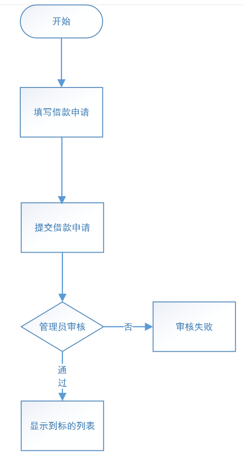
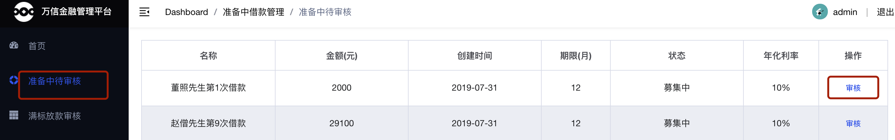

# 第07章 用户发标与标的检索

## 1. 用户发标需求分析

### 1.1. 什么是发标

P2P行业习惯把平台里某个投资项目称为“标的”，简称“标”。一个标的一般至少包含：描述、借款用途、借款总额、还款方式、借款利率、借款期限等基本信息。通俗来讲：

- “标的”就是：借款人在P2P平台发起的借款项目。
- “发标”就是：借款人在P2P平台申请借款。


### 1.2. 业务流程图

发标流程如下：



### 1.3. 业务功能相关页面展示

填写借款信息页面


申请成功，等待审核页面


P2P 平台管理员审核借款信息页面


审核通过后，就可在H5前端的出借列表中看到标的信息


### 1.4. 业务功能交互流程

“发标”即是借款人在 P2P 平台申请借款，具体交互流程如下：


1. 用户在前端填写借款信息
2. 前端请求交易中心保存标的信息
3. 管理员审核标的信息
4. 交易中心请求存管代理服务生成交易记录（未同步），并对标的数据进行签名
5. 存管代理服务携带标的签名数据请求银行存管系统
6. 银行存管系统保存标的信息，返回同步成功给存管代理服务
7. 存管代理服务更新交易记录，返回同步成功给交易中心
8. 交易中心确认同步成功，更新标的信息

## 2. P2P 项目分库分表

### 2.1. 问题分析

在 P2P 平台中，标的信息和投标信息做为平台基础业务数据存在。随着平台的发展，这些数据可能会越来越多，甚至达到亿级。以 MySQL 为例，单库数据量在 5000 万以内性能比较好，超过阈值后性能会随着数据量的增大而明显降低。单表的数据量超过1000 万，性能也会下降严重。这就会导致查询一次所花的时间变长，并发操作达到一定量时可能会卡死，甚至把系统给拖垮，因此需要对 P2P 平台的数据库进行分库分表提升性能，并使用 Sharding-JDBC 进行数据库操作。

### 2.2. 数据库设计

1. 项目单独创建 p2p_transaction 数据库(交易中心)存储和标的相关的数据，例如：标的信息、投标信息等。首先对该数据库进行分库，相同发标人的数据最好不要分散，否则查询相关信息要跨库，因此以**发标人ID**作为分片键，分片策略采取 `发标人ID % 2`。


2. 然后再对 p2p_transaction 库内的标的信息和投标信息进行分表，根据需求此两个表会以**标的ID**作为关联键联合查询，因此以**标的ID**作为分片键，分片策略采取 `标的ID % 2`，并将标的信息和投标信息设置为**绑定表**，最终形成如下数据库设计：


3. p2p_transaction 数据库和表的初始化在项目开始时已经使用脚本创建了。位置：`wanxinp2p-project\document\sql\wanxinp2p-init.sql`

### 2.3. 环境搭建

#### 2.3.1. 配置本地主从架构和数据同步

> MySQL 主从数据库搭建过程详见 [《第06章 分库分表解决方案 Sharding-JDBC》](/00-项目资料/07-万信金融/06-分库分表解决方案-Sharding-JDBC)

基于之前已经搭建好的两个 MySQL 服务，分别修改两个服务的配置文件 my.ini，增加需要同步的数据库

主库 my.ini 配置：

```properties
[mysqld]
# 设置需要同步的数据库
binlog-do-db=p2p_transaction_0
binlog-do-db=p2p_transaction_1
```

从库 my.ini 配置（*免安装版本没有my.ini文件，复制安装版的即可*）：

```properties
[mysqld]
# 设置需要同步的数据库
replicate_wild_do_table=p2p_transaction_0.%
replicate_wild_do_table=p2p_transaction_1.%
```

#### 2.3.2. 基础工程搭建

导入 wanxinp2p-transaction-service 基础工程。p2p 项目中所有交易相关的都在此微服务中处理。

#### 2.3.3. Apollo 配置

- 在 Apollo 中创建 transaction-service 项目，并关联相关公共的命名空间，并对部分项目的配置进行修改覆盖，关联清单如下：
    - micro_service.spring-boot-http 命名空间需修改，修改项如下：
        - 项目根路径：`server.servlet.context-path = /transaction`
    - micro_service.spring-eureka
    - micro_service.spring-cloud-feign
    - micro_service.spring-ribbon
    - micro_service.mybatis-plus 命名空间需修改，修改项如下：
        - mp 包扫描路径：`mybatis-plus.typeAliasesPackage = com.moon.wanxinp2p.transaction.entity`
    - micro_service.spring-rocketmq
- 修改 application 命名空间，主要新增 sharding-jdbc 相关配置，具体如下：

```properties
swagger.enable = true
spring.mvc.throw-exception-if-no-handler-found = true

spring.shardingsphere.datasource.names = ds0,ds1

spring.shardingsphere.datasource.ds0.type = com.alibaba.druid.pool.DruidDataSource
spring.shardingsphere.datasource.ds0.driver-class-name = com.mysql.cj.jdbc.Driver
spring.shardingsphere.datasource.ds0.url = jdbc:mysql://localhost:3306/p2p_transaction_0?useUnicode=true&useSSL=false&characterEncoding=utf8
spring.shardingsphere.datasource.ds0.username = root
spring.shardingsphere.datasource.ds0.password = 123456

spring.shardingsphere.datasource.ds1.type = com.alibaba.druid.pool.DruidDataSource
spring.shardingsphere.datasource.ds1.driver-class-name = com.mysql.cj.jdbc.Driver
spring.shardingsphere.datasource.ds1.url = jdbc:mysql://localhost:3306/p2p_transaction_1?useUnicode=true&useSSL=false&characterEncoding=utf8
spring.shardingsphere.datasource.ds1.username = root
spring.shardingsphere.datasource.ds1.password = 123456

spring.shardingsphere.sharding.default-database-strategy.inline.sharding-column = CONSUMER_ID
spring.shardingsphere.sharding.default-database-strategy.inline.algorithm-expression = ds$->{CONSUMER_ID % 2}

spring.shardingsphere.sharding.tables.project.actual-data-nodes = ds$->{0..1}.project_$->{0..1}
spring.shardingsphere.sharding.tables.project.table-strategy.inline.sharding-column = ID
spring.shardingsphere.sharding.tables.project.table-strategy.inline.algorithm-expression = project_$->{ID % 2}

spring.shardingsphere.sharding.tables.tender.actual-data-nodes = ds$->{0..1}.tender_$->{0..1}
spring.shardingsphere.sharding.tables.tender.table-strategy.inline.sharding-column = PROJECT_ID
spring.shardingsphere.sharding.tables.tender.table-strategy.inline.algorithm-expression = tender_$->{PROJECT_ID % 2}

spring.shardingsphere.sharding.binding-tables = project,tender

spring.shardingsphere.props.sql.show = true
```

- 修改 gateway-server 项目，增加交易中心服务（wanxinp2p-transaction-service）的路由配置，具体如下：

```properties
zuul.routes.transaction-service.path = /transaction/**
zuul.routes.transaction-service.serviceId = transaction-service
zuul.routes.transaction-service.stripPrefix = false
```

- 工程本地配置文件 application.yml

```yml
app:
  id: transaction-service
apollo:
  bootstrap:
    enabled: true
    namespaces: application,micro_service.spring-boot-http,micro_service.spring-eureka,micro_service.spring-cloud-feign,micro_service.spring-ribbon,micro_service.mybatis-plus,micro_service.spring-rocketmq

spring:
  application:
    name: transaction-service
  main:
    allow-bean-definition-overriding: true

logging:
  config: classpath:log4j2-dev.xml
```

#### 2.3.4. 项目启动参数配置

配置以下 VM options 参数，启动服务，服务的端口是 53060

```bash
-Denv=dev -Dapollo.cluster=DEFAULT -Dserver.port=53060
```

完成以上配置后，测试启动项目

## 3. 交易中心服务保存标的信息功能

### 3.1. 需求分析

此功能定义在 wanxinp2p-transaction-service 交易服务工程中，保存借款人发出的标的信息到数据库中

### 3.2. 接口定义

#### 3.2.1. 相关实体类定义

- 定义接口封装新增标的请求参数的实体类

```java
@Data
public class ProjectDTO {

    /** 主键 */
    @JsonSerialize(using = ToStringSerializer.class)
    private Long id;

    /** 发标人用户标识 */
    private Long consumerId;

    /** 发标人用户编码 */
    private String userNo;

    /** 标的编码 */
    private String projectNo;

    /** 标的名称 */
    private String name;

    /** 标的描述 */
    private String description;

    /** 标的类型 */
    private String type;

    /** 标的期限(单位:天) */
    private Integer period;

    /** 年化利率(投资人视图) */
    private BigDecimal annualRate;

    /** 年化利率(借款人视图) */
    private BigDecimal borrowerAnnualRate;

    /** 年化利率(平台佣金，利差) */
    private BigDecimal commissionAnnualRate;

    /** 还款方式 */
    private String repaymentWay;

    /** 募集金额 */
    private BigDecimal amount;

    /** 标的状态 */
    private String projectStatus;

    /** 创建时间 */
    private LocalDateTime createDate;

    /** 可用状态 */
    private Integer status;

    /** 是否是债权出让标 */
    private Integer isAssignment;

    /** 请求流水号 */
    private String requestNo;

    /** 剩余额度 */
    private BigDecimal remainingAmount;

    /** 风险等级, 目前默认B */
    private String risk = "B";

    /** 出借人数*/
    private Integer tenderCount;
}
```

- 定义接口封装查询条件参数的实体类

```java
@Data
@ApiModel(value = "ProjectQueryDTO", description = "标的信息查询对象")
public class ProjectQueryDTO {

    @ApiModelProperty("标的类型")
    private String type;

    @ApiModelProperty("名称")
    private String name;

    @ApiModelProperty("起止标的期限(单位:天)")
    private Integer startPeriod;

    @ApiModelProperty("起止标的期限(单位:天)")
    private Integer endPeriod;

    @ApiModelProperty("起止年化利率(投资人视图)")
    private BigDecimal startAnnualRate;

    @ApiModelProperty("起止年化利率(投资人视图)")
    private BigDecimal endAnnualRate;

    @ApiModelProperty("年化利率(借款人视图)")
    private BigDecimal borrowerAnnualRate;

    @ApiModelProperty("还款方式")
    private String repaymentWay;

    @ApiModelProperty("标的状态")
    private String projectStatus;
}
```

#### 3.2.2. 交易中心服务 API 接口

在 wanxinp2p-api 工程中新建 transaction 包，在该包中定义 `TransactionApi` 交易接口，在该接口中定义发标（借款人新增标的）的方法

```java
public interface TransactionApi {
    /**
     * 借款人发标（新增标的）
     *
     * @param projectDTO
     * @return
     */
    RestResponse<ProjectDTO> createProject(ProjectDTO projectDTO);
}
```

### 3.3. 获取登录用户信息功能实现

由于保存标的时，需要用到当前登录用户的一些信息，因此交易中心需要远程访问用户中心。

#### 3.3.1. 定义请求接口与实现

- 在 wanxinp2p-api 工程中的 `ConsumerAPI` 接口中新增获得当前登录用户的方法

```java
/**
 * 根据手机号获得当前登录用户
 *
 * @param mobile
 * @return
 */
RestResponse<ConsumerDTO> getCurrConsumer(String mobile);
```

> 值得注意的是，本来此接口中可以通过工具类的方法 `SecurityUtil.getUser().getMobile()` 获取到当前登陆用户的手机号，但因为是请求交易中心服务（transaction-service），然后再通过 feign 远程请求用户服务（consumer-service），此时如果通过此方式是无法获取到当前登陆用户，这是因为登陆用户的数据是通过 gateway 的过滤器从请求携带的token中解析出来，放到请求域，然后转到微服务中，所以用户新增标的是请求交易中心服务（transaction-service）是可以在请求域中获取到用户，而用户服务（consumer-service）请求域中没有数据。所以这里定义接口是通过形参的方式将用户手机号传递到用户服务（consumer-service）

- 在 `wanxinp2p-consumer-service` 工程的 `ConsumerController` 实现方法

```java
@ApiOperation("获取登录用户信息")
@GetMapping("/l/currConsumer/{mobile}")
@Override
public RestResponse<ConsumerDTO> getCurrConsumer(@PathVariable("mobile") String mobile) {
    // 调用业务层根据手机号查询方法
    return RestResponse.success(consumerService.getByMobile(mobile));
}
```

> 注：原业务层接口实现中已经有根据用户手机号查询用户的方法 `getByMobile`，但原来是 `private` 方法，这些将方法修改为 `public`，然后在 `ConsumerService` 接口中增加该方法的定义

#### 3.3.2. 定义远程调用代理接口

在交易中心微服务工程 transaction-service 的 agent 包中，创建 Feign 代理接口 `ConsumerApiAgent`，远程请求用户服务接口

```java
@FeignClient("consumer-service") // 服务 id
public interface ConsumerApiAgent {
    /**
     * 根据手机号获得当前登录用户
     */
    @GetMapping("/consumer/l/currConsumer/{mobile}")
    RestResponse<ConsumerDTO> getCurrConsumer(@PathVariable("mobile") String mobile);
}
```

### 3.4. 新增标的功能实现

#### 3.4.1. 持久层接口定义

- 创建 p2p_transaction_0（p2p_transaction_1） 数据库的 project_0（project_1） 标的信息表相应的实体类 `Project`

```java
@Data
@EqualsAndHashCode(callSuper = false)
@Accessors(chain = true)
public class Project implements Serializable {

    private static final long serialVersionUID = 1L;

    /**
     * 主键
     */
    @TableId("ID")
    private Long id;

    /**
     * 发标人用户标识
     */
    @TableField("CONSUMER_ID")
    private Long consumerId;

    /**
     * 发标人用户编码
     */
    @TableField("USER_NO")
    private String userNo;

    /**
     * 标的编码
     */
    @TableField("PROJECT_NO")
    private String projectNo;

    /**
     * 标的名称
     */
    @TableField("NAME")
    private String name;

    /**
     * 标的描述
     */
    @TableField("DESCRIPTION")
    private String description;

    /**
     * 标的类型
     */
    @TableField("TYPE")
    private String type;

    /**
     * 标的期限(单位:天)
     */
    @TableField("PERIOD")
    private Integer period;

    /**
     * 年化利率(投资人视图)
     */
    @TableField("ANNUAL_RATE")
    private BigDecimal annualRate;

    /**
     * 年化利率(借款人视图)
     */
    @TableField("BORROWER_ANNUAL_RATE")
    private BigDecimal borrowerAnnualRate;

    /**
     * 年化利率(平台佣金，利差)
     */
    @TableField("COMMISSION_ANNUAL_RATE")
    private BigDecimal commissionAnnualRate;

    /**
     * 还款方式
     */
    @TableField("REPAYMENT_WAY")
    private String repaymentWay;

    /**
     * 募集金额
     */
    @TableField("AMOUNT")
    private BigDecimal amount;

    /**
     * 标的状态
     */
    @TableField("PROJECT_STATUS")
    private String projectStatus;

    /**
     * 创建时间
     */
    @TableField("CREATE_DATE")
    private LocalDateTime createDate;

    /**
     * 修改时间
     */
    @TableField("MODIFY_DATE")
    private LocalDateTime modifyDate;

    /**
     * 可用状态
     */
    @TableField("STATUS")
    private Integer status;

    /**
     * 是否是债权出让标
     */
    @TableField("IS_ASSIGNMENT")
    private Integer isAssignment;
}
```

- 在 mapper 包中新建标的信息 `ProjectMapper` 接口，继承 MP 的 `BaseMapper`：

```java
public interface ProjectMapper extends BaseMapper<Project> {
}
```

-  在 `mapper.xml` 包下创建 mapper 映射文件

```xml
<?xml version="1.0" encoding="UTF-8" ?>
<!DOCTYPE mapper PUBLIC "-//mybatis.org//DTD Mapper 3.0//EN" "http://mybatis.org/dtd/mybatis-3-mapper.dtd">
<mapper namespace="com.moon.wanxinp2p.transaction.mapper.ProjectMapper">
</mapper>
```

#### 3.4.2. 功能业务层接口与实现

业务层主要的处理逻辑是补充标的信息，保存到数据库中。值得注意的是，标的部分字段的值是管理员在 apollo 配置的（<u>*个人觉得这部分设计不合理，毕竟开发后的项目交给客户使用，一般业务人员都是只会使用后台管理平台，不要去搞项目配置中心，万一业务人员胡乱修改一些配置，就会影响整个项目*</u>），如：流标时间、年化利率、最小投标金额等。

- 在 service 包中创建 `ConfigService` 类，使用 `@EnableApolloConfig` 开启读取 Apollo 配置，并通过 `@ApolloConfig` 注解注入 apollo 配置实例，方便读取配置中心上相关配置值。

```java
@Service
@EnableApolloConfig
public class ConfigService {

    @ApolloConfig
    private Config config;

    /**
     * 获取流标时间, 单位天
     */
    public Integer getMiscarryDays() {
        return Integer.parseInt(config.getProperty("miscarry.days", "15"));
    }

    /**
     * 借款人给平台的利率 ( 借款人让利 )
     */
    public BigDecimal getCommissionBorrowerAnnualRate() {
        return new BigDecimal(config.getProperty("commission.borrower.annual.rate", null));
    }


    /**
     * 投资人让出利率 ( 投资人让利 )
     */
    public BigDecimal getCommissionInvestorAnnualRate() {
        return new BigDecimal(config.getProperty("commission.investor.annual.rate", null));
    }


    /**
     * 年化利率(平台佣金，利差)
     *
     * @return
     */
    public BigDecimal getCommissionAnnualRate() {
        return getCommissionBorrowerAnnualRate().add(getCommissionInvestorAnnualRate());
    }

    /**
     * 年化利率(借款人视图)
     *
     * @return
     */
    public BigDecimal getBorrowerAnnualRate() {
        return new BigDecimal(config.getProperty("borrower.annual.rate", null));
    }

    /**
     * 年化利率(投资人视图) = 借款人利率 - ( 平台佣金 = 借款人佣金  +  投资人佣金 )
     *
     * @return
     */
    public BigDecimal getAnnualRate() {
        return getBorrowerAnnualRate().subtract(getCommissionAnnualRate());
    }

    /**
     * 最小投标金额
     *
     * @return
     */
    public BigDecimal getMiniInvestmentAmount() {
        // 如果配置文件中没有获取到, 这里使用默认值: 100.0, 有则使用配置文件中的
        return new BigDecimal(config.getProperty("mini.investment.amount", "100.0"));
    }
}
```

- 在 service 包中新建 `ProjectService` 接口，并定义 `createProject` 保存标的信息方法

```java
public interface ProjectService {
    /** 创建标的 */
    ProjectDTO createProject(ProjectDTO projectDTO);
}
```

- 创建接口实现类 `ProjectServiceImpl`，继承 MP 的 `ServiceImpl` 类。实现 `createProject` 方法

```java
@Service
@Slf4j
public class ProjectServiceImpl extends ServiceImpl<ProjectMapper, Project> implements ProjectService {

    @Autowired
    private ConsumerApiAgent consumerApiAgent;

    @Autowired
    private ConfigService configService;

    /**
     * 创建标的
     *
     * @param projectDTO
     * @return ProjectDTO
     */
    @Override
    public ProjectDTO createProject(ProjectDTO projectDTO) {
        // 通过 Spring Security 工具类，获取网关转发请求域中的用户实例
        LoginUser user = SecurityUtil.getUser();
        // 远程调用用户服务，根据手机号获取完整的用户信息
        RestResponse<ConsumerDTO> response = consumerApiAgent.getCurrConsumer(user.getMobile());
        ConsumerDTO consumer = response.getResult();
        if (consumer == null) {
            // 用户不存在
            throw new BusinessException(CommonErrorCode.E_140101);
        }

        // 创建标的实例
        Project project = new Project();
        // 设置标的相关字段
        project.setConsumerId(consumer.getId());
        project.setUserNo(consumer.getUserNo());
        // 生成标的编码
        project.setProjectNo(CodeNoUtil.getNo(CodePrefixCode.CODE_PROJECT_PREFIX));
        // 标的状态修改
        project.setProjectStatus(ProjectCode.COLLECTING.getCode());
        // 标的可用状态修改, 未同步
        project.setStatus(StatusCode.STATUS_OUT.getCode());
        // 设置标的创建时间
        project.setCreateDate(LocalDateTime.now());
        // 设置还款方式
        project.setRepaymentWay(RepaymentWayCode.FIXED_REPAYMENT.getCode());
        // 设置标的类型
        project.setType(ProjectTypeCode.TYPE_CODE_NEW.getCode());
        // 年化利率(借款人视图)，在 apollo 中配置
        project.setBorrowerAnnualRate(configService.getBorrowerAnnualRate());
        // 年化利率(投资人视图)，在 apollo 中配置
        project.setAnnualRate(configService.getAnnualRate());
        // 年化利率(平台佣金，利差)，在 apollo 中配置
        project.setCommissionAnnualRate(configService.getCommissionAnnualRate());
        // 债权转让
        project.setIsAssignment(0);
        // 判断男女
        String sex = Integer.parseInt(consumer.getIdNumber().substring(16, 17)) % 2 == 0 ? "女士" : "先生";
        // 构造借款次数查询条件
        QueryWrapper<Project> queryWrapper = new QueryWrapper<>();
        queryWrapper.lambda().eq(Project::getConsumerId, consumer.getId());
        // 设置标的名字, 姓名+性别+第N次借款（已借款次数+1）
        project.setName(consumer.getFullname() + sex + "第" + (count(queryWrapper) + 1) + "次借款");

        // 保存
        save(project);
        // 复制响应
        BeanUtils.copyProperties(project, projectDTO);
        return projectDTO;
    }
}
```

#### 3.4.3. 请求控制类

创建 `TransactionController` 控制类，调用 `ProjectService` 业务接口

```java
@Api(value = "交易中心服务", tags = "transaction")
@RestController
public class TransactionController implements TransactionApi {

    @Autowired
    private ProjectService projectService;

    /**
     * 借款人发标（新增标的）
     *
     * @param projectDTO
     * @return
     */
    @ApiOperation("借款人发标")
    @ApiImplicitParam(name = "project", value = "标的信息",
            required = true, dataType = "Project", paramType = "body")
    @PostMapping("/my/projects")
    @Override
    public RestResponse<ProjectDTO> createProject(ProjectDTO projectDTO) {
        return RestResponse.success(projectService.createProject(projectDTO));
    }

}
```

### 3.5. 登陆用户信息查询接口

用户登录成功后，可以直接进行发标，但是根据业务需求，只有在已开户的情况下才可以发标。因此在发标时，前端需要判断当前登录用户是否已经开户(绑定银行卡)，如果未开，就跳转到开户界面，如果已开就继续发标。同时，还要判断用户申请的借款金额是否超标，如果超标就不允许发标。要想知道当前登录用户是否开户以及可贷额度，就必须获取当前登录用户的相关信息，并返回给前端使用。

- 在 wanxinp2p-api 工程中的 `ConsumerAPI` 接口中新增获取当前登录用户的方法 `getMyConsumer`

```java
/**
 * 获取当前登录用户
 */
RestResponse<ConsumerDTO> getMyConsumer();
```

- 在 `ConsumerController` 类中实现该方法

```java
/**
 * 获取当前登录用户（用于前端直接请求用户服务）
 */
@ApiOperation("获取登录用户信息")
@GetMapping("/my/consumers")
@Override
public RestResponse<ConsumerDTO> getMyConsumer() {
    // 使用工具类，从请求域中获取到用户手机号
    ConsumerDTO dto = consumerService.getByMobile(SecurityUtil.getUser().getMobile());
    return RestResponse.success(dto);
}
```

consumerDTO 中的 `loanAmount` 属性表示可贷额度，`isBindCard` 属性表示是否开户，前端发标页面会自动访问该方法，获得这些数据后会自动进行业务处理。

注意：每个借款人的可贷额度都不相同，这个跟借款人自身的综合情况(信用、月收入、工作性质等)有关，可贷额度由P2P平台根据借款人自身的综合情况进行评估并设置，这里暂时简化处理，由我们自己直接去表里设置值即可(不能低于2000)。

### 3.6. 前后端集成测试

#### 3.6.1. 启动服务

1. 启动 Apollo 服务
2. 后端需要启动：
    - wanxinp2p-discover-server 微服务
    - wanxinp2p-gateway-server 微服务
    - wanxinp2p-uaa-service 微服务
    - wanxinp2p-account-service 微服务
    - wanxinp2p-consumer-service 微服务
    - wanxinp2p-transaction-service 微服务
3. 启动前端 wanxinp2p-web-app 项目

#### 3.6.2. 测试步骤

1. 使用未开户的用户登陆，点击借款，
2. 使用已经开户的用户登陆


## 4. 部署 P2P 后台管理平台前端工程

交易中心保存完标的信息后，P2P 公司管理员就需要登录万信金融管理平台对该标的进行审核，该功能同样放在 wanxinp2p-transaction-service 工程中实现，但是该功能需要一个独立的前端(管理平台)作为审核的入口。



### 4.1. 后台管理平台前端工程

p2p 后台管理平台前端工程地址：`wanxinp2p-project\wanxinp2p-frontend\wanxinp2p-web-manager\`

wanxinp2p-web-manager 是万信金融管理平台的前端工程，使用前端代码编辑器打开即可（如：VSCode）。该前端工程使用 vue-element-admin 集成方案，具体采用了 vue [2.6.10] + element-ui[2.7.0] + axios 技术栈。该前端工程直接使用现成，功能无需编码。


### 4.2. 搭建运行环境

- 使用 vscode 打开 wanxinp2p-web-manager  前端工程，在项目的根目录中运行命令安装项目相关依赖，在终端控制台会看到日志输出，等待联网下载依赖库

```bash
npm install
```

- 执行以下命令，启动该前端工程。项目的端口号是：8079。可以通过修改 vue.config.js 文件中的 `const port = xxx` 来指定端口号

```bash
npm run dev
```

- 该前端工程会使用 ESlint 进行语法检查，开发环境下启动会经常因为语法格式不正确而报错，为了方便，暂时将 ESlint 停用。具体的配置在 vue.config.js 文件中：

```js
module.exports = {
    ...
    lintOnSave: false,
    ...
}
```

- 在浏览器中访问 `http://localhost:8079/#/` 登录页面，账号和密码都是 admin。要想登录成功，后端需要启动 Apollo 以及 wanxinp2p-discover-server、wanxinp2p-account-service、wanxinp2p-consumer-service、wanxinp2p-gateway-server、wanxinp2p-uaa-service 等微服务。


