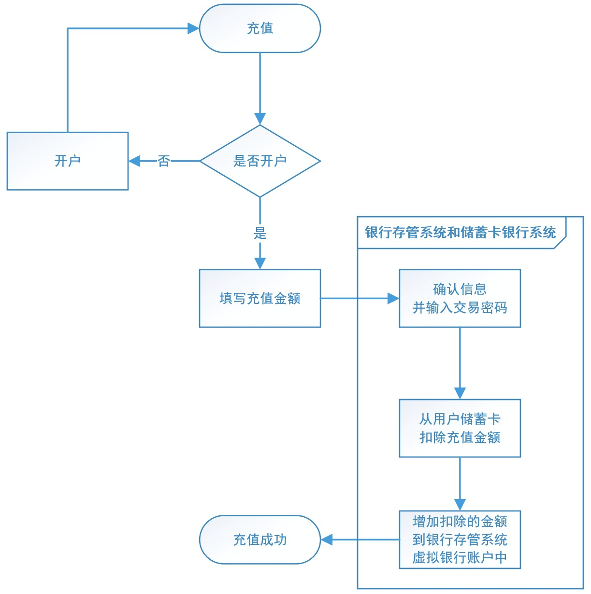
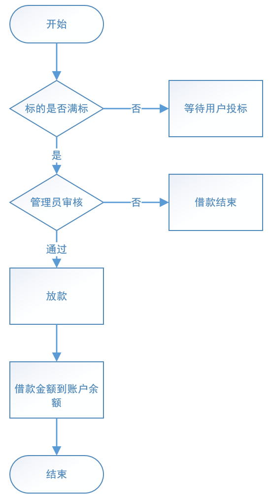
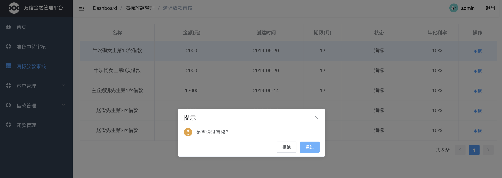
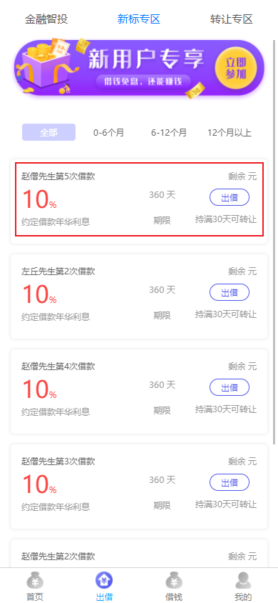
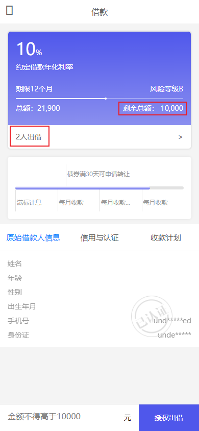

# 第09章 投标放款

## 1. 业务概述

回顾 P2P 平台整个业务流程图


### 1.1. 充值业务

用户在平台开户后会在银行存管系统中有一个虚拟银行账号，用户通过万信金融把储蓄卡中的金额转入到银行存管系统的虚拟银行账户中，即为充值。例如：用户把银行卡中的金额转入到支付宝或微信中一样。充值流程如下：



1. 用户在'我的'页面点击'账户余额'


2. 点击充值（如果用户尚未开户，会被自动跳转到开户界面），填写充值金额


3. 确认信息并输入开户时设置的交易密码


4. 充值成功


5. 目前暂时通过直接修改数据库的方式进行充值（*后续再进行此功能开发*）。用户的账户余额具体设置在 p2p_bank_depository 数据库的 balance_details 表中的 `BALANCE` 字段


### 1.2. 投标

借款人发标并通过审核后，投资人就可以在P2P平台看到这些标的信息(可投资项目)，投资人对这个项目进行投资(出借)就叫做投标。用户投标流程如下：


1. 用户浏览借款列表(标的)


2. 选择标的，输入投标金额


3. 确认出借，支付金额


4. 投标成功，显示预期收益


### 1.3. 放款

当一个标的已经筹集到了所借的全部资金，即为“满标”。此时P2P平台管理员会进行审核，审核通过后，P2P平台会把投资人的出借资金打入借款人在平台的账户中，这就叫“放款”，此时借款人贷款成功。平台放款流程如下：



1. 管理员审核满标标的


2. 确认审核结果



3. 审核通过，放款成功

## 2. 用户投标需求分析

借款人发标并通过审核后，投资人就可以在P2P平台看到这些标的信息(可投资项目)，投资人对这个项目进行投资(出借)就叫做投标。投资人在投标前需要先开户并充值。

### 2.1. 流程图


### 2.2. 业务流程简述

**第一阶段：投标预览(图中1.1-1.6)**

1. 用户在前端选择要投资的标的
2. 请求交易中心获取标的基本信息和已投标记录
3. 交易中心请求用户服务获取借款人基本信息
4. 交易中心返回投标预览信息给前端
5. 前端显示投标预览信息，用户填写出借金额

**第二阶段：用户投标(图中2.1-2.13)**

1. 用户在前端确认投标信息，并请求交易中心保存投标信息
2. 交易中心保存用户投标信息(未发布)
3. 交易中心请求存管代理服务对投标数据进行签名，并生成交易记录(未同步)
4. 存管代理服务携带签名后的投标数据请求银行存管系统
5. 银行存管系统保存投标信息，并冻结投资人用户余额
6. 银行存管系统返回处理结果给存管代理服务
7. 存管代理服务更新交易记录(已同步)，并返回投标成功结果给交易中心
8. 交易中心更新投标结果后返回给前端
9. 前端展示投标结果给用户

## 3. 投标预览

参考前面的流程图，投资人浏览标的列表时，可以点击某个标的进去预览相关信息，例如：标的信息，已投标信息，借款人信息等，这些都是投标前必须给投资人预览的信息。

### 3.1. 接口定义

> 此部分接口定义全部都在 wanxinp2p-api 工程中

#### 3.1.1. 交易中心查询标的信息接口

修改 `TransactionApi` 接口，创建 `queryProjectsIds` 查询标的信息方法

```java
/**
 * 通过ids获取多个标的
 *
 * @param ids 多个标的id，使用逗号分隔的字符串
 * @return
 */
RestResponse<List<ProjectDTO>> queryProjectsIds(String ids);
```

#### 3.1.2. 交易中心查询投标记录接口

创建接口返回的投标信息预览传输类

```java
@Data
@ApiModel(value = "TenderOverviewDTO", description = "投标信息预览")
public class TenderOverviewDTO {
    @JsonSerialize(using = ToStringSerializer.class)
    @ApiModelProperty("主键")
    private Long id;

    @ApiModelProperty("投标人用户标识")
    private Long consumerId;

    @ApiModelProperty("投标人用户名")
    private String consumerUsername;

    @ApiModelProperty("投标冻结金额")
    private BigDecimal amount;

    @ApiModelProperty("投标方式")
    private String tenderWay = "手动出借";

    @ApiModelProperty("创建时间")
    private LocalDateTime createDate;
}
```

修改 `TransactionApi` 接口，创建 `queryTendersByProjectId` 查询投标记录的方法

```java
/**
 * 根据标的id查询投标记录
 *
 * @param id 标的id
 * @return
 */
RestResponse<List<TenderOverviewDTO>> queryTendersByProjectId(Long id);
```

#### 3.1.3. 用户中心获取借款人信息接口

创建接口响应的借款人信息传输类

```java
@Data
@ApiModel(value = "BorrowerDTO", description = "借款人用户信息")
public class BorrowerDTO {
    @ApiModelProperty("用户id")
    private Long id;

    @ApiModelProperty("用户名")
    private String username;

    @ApiModelProperty("真实姓名")
    private String fullname;

    @ApiModelProperty("身份证号")
    private String idNumber;

    @ApiModelProperty("手机号")
    private String mobile;

    @ApiModelProperty("年龄")
    private Integer age;

    @ApiModelProperty("生日")
    private String birthday;

    @ApiModelProperty("性别")
    private String gender;
}
```

在 `ConsumerApi` 接口中新增 `getBorrower` 获取借款人信息方法：

```java
/**
 * 获取借款人用户信息
 *
 * @param id 用户id
 * @return
 */
RestResponse<BorrowerDTO> getBorrower(Long id);
```

### 3.2. 交易中心查询标的信息功能

交易中心查询标的信息接口主要实现业务如下：

1. 根据标的id查询标的信息
2. 获取标的剩余可投额度
3. 获取标的已投记录数

#### 3.2.1. 数据访问层

在 mapper 包中新增一个 `TenderMapper` 接口，用来操作投标数据。并定义 `selectAmountInvestedByProjectId` 抽象方法，用于获取标的已投金额

```java
public interface TenderMapper extends BaseMapper<Tender> {
    /**
     * 根据标的id, 获取标的已投金额, 如果未投返回 0.0
     */
    List<BigDecimal> selectAmountInvestedByProjectId(Long id);
}
```

新建一个映射配置文件 TenderMapper.xml，并定义 `selectAmountInvestedByProjectId` 方法的映射 sql

```xml
<?xml version="1.0" encoding="UTF-8" ?>
<!DOCTYPE mapper PUBLIC "-//mybatis.org//DTD Mapper 3.0//EN" "http://mybatis.org/dtd/mybatis-3-mapper.dtd">
<mapper namespace="com.moon.wanxinp2p.transaction.mapper.TenderMapper">

    <select id="selectAmountInvestedByProjectId" resultType="java.math.BigDecimal">
        SELECT IFNULL(SUM(AMOUNT), 0.0)
        FROM tender
        WHERE PROJECT_ID = #{id}
          AND STATUS = 1
    </select>

</mapper>
```

#### 3.2.2. 业务层

在 `ProjectService` 接口中新增一个 `queryProjectsIds` 方法

```java
/**
 * 通过ids获取多个标的
 *
 * @param ids 多个标的id字符串，不同id之间使用逗号分隔
 * @return
 */
List<ProjectDTO> queryProjectsIds(String ids);
```

在 `ProjectServiceImpl` 类中实现该方法

```java
@Override
public List<ProjectDTO> queryProjectsIds(String ids) {
    // 查询标的信息
    QueryWrapper<Project> queryWrapper = new QueryWrapper<>();
    // 将多个标的id字符串转成集合
    List<Long> list = Arrays.stream(ids.split(",")).map(Long::parseLong).collect(Collectors.toList());
    // 组装 id范围查询条件 ... where id in (1,2,3,...)
    queryWrapper.lambda().in(Project::getId, list);
    // 查询
    List<Project> projects = this.list(queryWrapper);

    // 循环转成dto类型
    return projects.stream().map(p -> {
        ProjectDTO dto = new ProjectDTO();
        BeanUtils.copyProperties(p, dto);

        // 获取剩余额度
        dto.setRemainingAmount(this.getProjectRemainingAmount(p));

        // 查询已出借人数
        Integer tenderCount = tenderMapper.selectCount(Wrappers.<Tender>lambdaQuery().eq(Tender::getProjectId, p.getId()));
        dto.setTenderCount(tenderCount);
        return dto;
    }).collect(Collectors.toList());
}

/**
 * 获取标的剩余可投额度
 */
private BigDecimal getProjectRemainingAmount(Project project) {
    // 根据标的id在投标表查询已投金额
    List<BigDecimal> decimalList = tenderMapper.selectAmountInvestedByProjectId(project.getId());
    // 求和结果集
    BigDecimal amountInvested = decimalList.stream().reduce(new BigDecimal("0.0"), BigDecimal::add);
    // 得到剩余额度
    return project.getAmount().subtract(amountInvested);
}
```

#### 3.2.3. 控制层

修改 `TransactionController` 控制类，实现查询标的方法

```java
@ApiOperation("通过ids获取多个标的")
@GetMapping("/projects/{ids}")
@Override
public RestResponse<List<ProjectDTO>> queryProjectsIds(@PathVariable String ids) {
    return RestResponse.success(projectService.queryProjectsIds(ids));
}
```

#### 3.2.4. 功能测试

由于目前尚未实现投标功能，所以表中没有数据可用。暂时需要造点测试数据，这里需要注意：前面对 p2p_transaction 进行了分库分表，所以造测试数据时要依据分库分表策略进行，否则会影响测试效果。

- 分库策略：`发标人ID % 2`
- 分表策略：`标的ID % 2`

运行以下脚本：

```sql
INSERT INTO `p2p_transaction_1`.`tender_0`(`ID`, `CONSUMER_ID`, `CONSUMER_USERNAME`, `USER_NO`, `PROJECT_ID`, `PROJECT_NO`, `AMOUNT`, `TENDER_STATUS`, `CREATE_DATE`, `REQUEST_NO`, `STATUS`, `PROJECT_NAME`, `PROJECT_PERIOD`, `PROJECT_ANNUAL_RATE`) VALUES (1, 1, '13888888888', '1', 2144527401414811650, '1', 11000, '1', '2022-03-12 23:02:21', '1', 1, '1', 1, 1.00);
INSERT INTO `p2p_transaction_1`.`tender_0`(`ID`, `CONSUMER_ID`, `CONSUMER_USERNAME`, `USER_NO`, `PROJECT_ID`, `PROJECT_NO`, `AMOUNT`, `TENDER_STATUS`, `CREATE_DATE`, `REQUEST_NO`, `STATUS`, `PROJECT_NAME`, `PROJECT_PERIOD`, `PROJECT_ANNUAL_RATE`) VALUES (2, 2, '13800000000', '2', 2144527401414811650, '2', 900, '1', '2022-03-12 23:03:08', '1', 1, '1', 1, 1.00);

INSERT INTO `p2p_consumer`.`consumer`(`ID`, `USERNAME`, `FULLNAME`, `ID_NUMBER`, `USER_NO`, `MOBILE`, `USER_TYPE`, `ROLE`, `AUTH_LIST`, `IS_BIND_CARD`, `LOAN_AMOUNT`, `STATUS`, `REQUEST_NO`) VALUES (19, '15315176089', '赵僧', '658182198109222913', 'USR_2E81A1C0BE4443A5829578BCBD4FDE4B', '15315176089', NULL, NULL, 'ALL', 1, NULL, 1, NULL);
```

为了不增加垃圾数据，测试完成后执行以下脚本，删除测试数据：

```sql
DELETE FROM p2p_transaction_1.tender_0 WHERE id = 1;
DELETE FROM p2p_transaction_1.tender_0 WHERE id = 2;

DELETE FROM `p2p_consumer`.`consumer` WHERE id = 19;
```

启动以下服务

1. 启动 Apollo 服务
2. 启动 es 服务与 Logstash 服务
3. 后端需要启动：
    - wanxinp2p-discover-server 微服务
    - wanxinp2p-gateway-server 微服务
    - wanxinp2p-uaa-service 微服务
    - wanxinp2p-account-service 微服务
    - wanxinp2p-consumer-service 微服务
    - wanxinp2p-transaction-service 微服务
    - wanxinp2p-content-search-service 微服务
4. 启动前端 wanxinp2p-web-app 项目

点击“出借”选项，选择相应的标的



点击“出借”按钮后，跳转到“借款”页面，查看借款的信息、剩余总额、出借人数是否正确



### 3.3. 交易中心查询投标记录接口

接口主要实现业务如下：

1. 根据标的id查询所有投标记录
2. 封装投标记录列表返回

#### 3.3.1. 业务层

在 `ProjectService` 接口，新增 根据标的id查询投标记录方法 `queryTendersByProjectId`

```java
/**
 * 根据标的id查询投标记录
 *
 * @param id 标的id
 * @return
 */
List<TenderOverviewDTO> queryTendersByProjectId(Long id);
```

在 `ProjectServiceImpl` 类中实现该方法

```java
@Override
public List<TenderOverviewDTO> queryTendersByProjectId(Long id) {
    // 使用 mp 业务方法，根据标的id查询 tender_0/tender_1 表
    List<Tender> tenderList = tenderMapper.selectList(Wrappers.<Tender>lambdaQuery().eq(Tender::getProjectId, id));

    // 转换成 dto 类型，并返回
    return tenderList.stream().map(t -> {
        TenderOverviewDTO dto = new TenderOverviewDTO();
        BeanUtils.copyProperties(t, dto);
        // 使用工具类对用户的手机号进行隐藏保护
        dto.setConsumerUsername(CommonUtil.hiddenMobile(t.getConsumerUsername()));
        return dto;
    }).collect(Collectors.toList());
}
```

#### 3.3.2. 控制层

修改 `TransactionController` 控制层，实现查询投标记录方法

```java
@ApiOperation("根据标的id查询投标记录")
@GetMapping("/tenders/projects/{id}")
@Override
public RestResponse<List<TenderOverviewDTO>> queryTendersByProjectId(@PathVariable Long id) {
    return RestResponse.success(projectService.queryTendersByProjectId(id));
}
```

#### 3.3.3. 功能测试

> 因为最后会进行整个流程前后端集成测试，所以这里只使用 postman 直接测试即可

启动 apollo 服务与交易中心服务即可，请求 url 如下：

```json
GET http://127.0.0.1:53060/transaction/tenders/projects/2144527401414811650
```

测试结果：


### 3.4. 用户中心获取借款人信息接口

接口主要实现业务如下：

1. 根据借款人id获取个人信息
2. 返回借款人详细信息

#### 3.4.1. 业务层

修改 `ConsumerService` 接口，新增 `getBorrower` 查询借款人信息方法

```java
/**
 * 获取借款人基本信息
 *
 * @param id 用户id
 * @return
 */
BorrowerDTO getBorrower(Long id);
```

在 `ConsumerServiceImpl` 类中实现该方法

```java
@Override
public BorrowerDTO getBorrower(Long id) {
    // 根据id查询用户表
    Consumer consumer = this.getById(id);
    if (consumer == null) {
        log.info("id为{}的用户信息不存在", id);
        throw new BusinessException(CommonErrorCode.E_140101);
    }

    // 转换成 dto 类型
    BorrowerDTO dto = new BorrowerDTO();
    BeanUtils.copyProperties(consumer, dto);
    // 使用项目中的工具类，从用户的身份证中获取年龄、生日、性别等信息
    Map<String, String> info = IDCardUtil.getInfo(dto.getIdNumber());
    dto.setAge(Integer.valueOf(info.get("age")));
    dto.setGender(info.get("gender"));
    dto.setBirthday(info.get("birthday"));

    return dto;
}
```

#### 3.4.2. 控制层

修改 `ConsumerController` 控制层，实现查询借款人信息方法

```java
@ApiOperation("获取借款人用户信息")
@ApiImplicitParam(name = "id", value = "用户标识", required = true, dataType = "Long", paramType = "path")
@GetMapping("/my/borrowers/{id}")
@Override
public RestResponse<BorrowerDTO> getBorrower(Long id) {
    return RestResponse.success(consumerService.getBorrower(id));
}
```

#### 3.4.3. 功能测试

> 因为最后会进行整个流程前后端集成测试，所以这里只使用 postman 直接测试即可

启动 apollo 服务与用户服务即可，请求 url 如下：

```json
GET http://127.0.0.1:53050/consumer/my/borrowers/3
```

测试结果：


### 3.5. 前后端集成测试

#### 3.5.1. 启动服务

1. 启动 Apollo 服务
2. 启动 es 服务与 Logstash 服务
3. 后端需要启动：
    - wanxinp2p-discover-server 微服务
    - wanxinp2p-gateway-server 微服务
    - wanxinp2p-uaa-service 微服务
    - wanxinp2p-account-service 微服务
    - wanxinp2p-consumer-service 微服务
    - wanxinp2p-transaction-service 微服务
    - wanxinp2p-content-search-service 微服务
4. 启动前端 wanxinp2p-web-app 项目

#### 3.5.2. 测试步骤

1. 启动相关服务后，h5登陆
2. 选择“出借”标签页，选择一个记录，点击“出借”按钮，跳转投标预览页
3. 检查相关的数据是显示是否正确


4. 点击“x人出借”行，跳转投标记录，检查数据是否正常


## 4. 用户投标

参考前面的流程图，该业务涉及到交易中心，存管代理和银行存管系统。交易中心需要保存投标信息，存管代理需要签名数据并保存交易记录，银行存管系统需要保存标的信息并扣除投资人余额。


