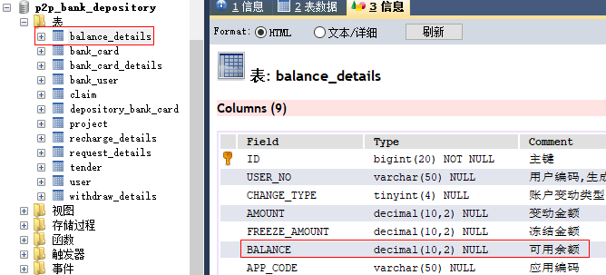
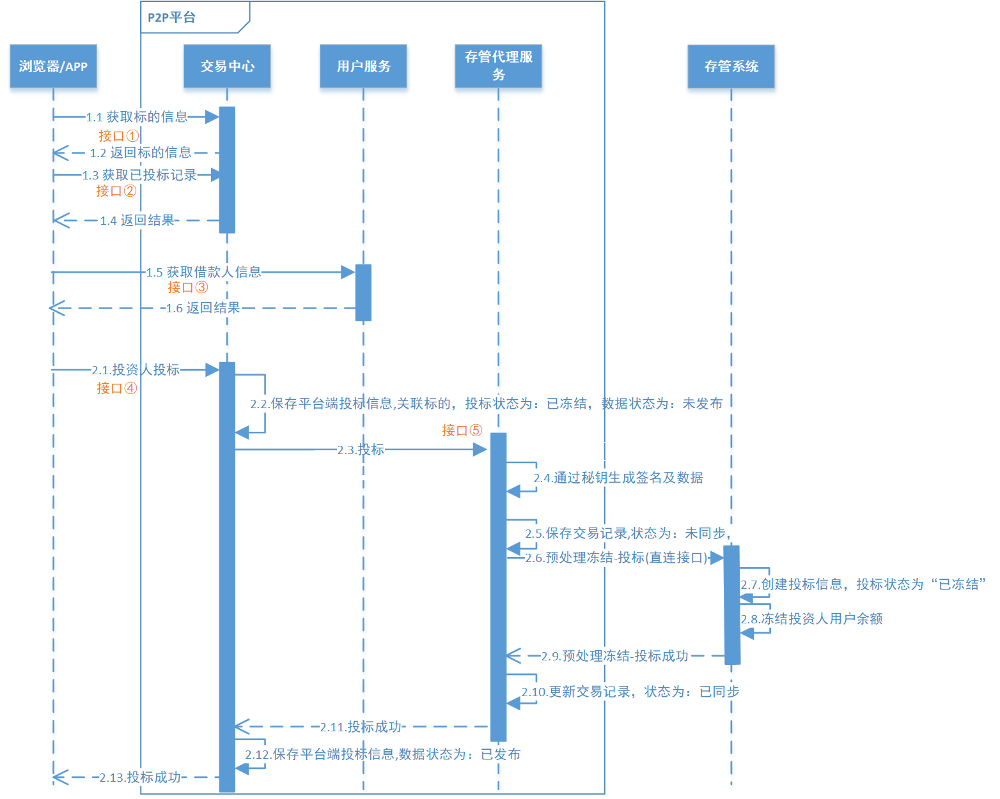

# 第09章 投标放款

## 1. 业务概述

回顾 P2P 平台整个业务流程图


### 1.1. 充值业务

用户在平台开户后会在银行存管系统中有一个虚拟银行账号，用户通过万信金融把储蓄卡中的金额转入到银行存管系统的虚拟银行账户中，即为充值。例如：用户把银行卡中的金额转入到支付宝或微信中一样。充值流程如下：


1. 用户在'我的'页面点击'账户余额'


2. 点击充值（如果用户尚未开户，会被自动跳转到开户界面），填写充值金额


3. 确认信息并输入开户时设置的交易密码


4. 充值成功


5. 目前暂时通过直接修改数据库的方式进行充值（*后续再进行此功能开发*）。用户的账户余额具体设置在 p2p_bank_depository 数据库的 balance_details 表中的 `BALANCE` 字段



### 1.2. 投标

借款人发标并通过审核后，投资人就可以在P2P平台看到这些标的信息(可投资项目)，投资人对这个项目进行投资(出借)就叫做投标。用户投标流程如下：


1. 用户浏览借款列表(标的)


2. 选择标的，输入投标金额


3. 确认出借，支付金额


4. 投标成功，显示预期收益


### 1.3. 放款

当一个标的已经筹集到了所借的全部资金，即为“满标”。此时P2P平台管理员会进行审核，审核通过后，P2P平台会把投资人的出借资金打入借款人在平台的账户中，这就叫“放款”，此时借款人贷款成功。平台放款流程如下：


1. 管理员审核满标标的


2. 确认审核结果


3. 审核通过，放款成功

## 2. 用户投标需求分析

借款人发标并通过审核后，投资人就可以在P2P平台看到这些标的信息(可投资项目)，投资人对这个项目进行投资(出借)就叫做投标。投资人在投标前需要先开户并充值。

### 2.1. 流程图



### 2.2. 业务流程简述

**第一阶段：投标预览(图中1.1-1.6)**

1. 用户在前端选择要投资的标的
2. 请求交易中心获取标的基本信息和已投标记录
3. 交易中心请求用户服务获取借款人基本信息
4. 交易中心返回投标预览信息给前端
5. 前端显示投标预览信息，用户填写出借金额

**第二阶段：用户投标(图中2.1-2.13)**

1. 用户在前端确认投标信息，并请求交易中心保存投标信息
2. 交易中心保存用户投标信息(未发布)
3. 交易中心请求存管代理服务对投标数据进行签名，并生成交易记录(未同步)
4. 存管代理服务携带签名后的投标数据请求银行存管系统
5. 银行存管系统保存投标信息，并冻结投资人用户余额
6. 银行存管系统返回处理结果给存管代理服务
7. 存管代理服务更新交易记录(已同步)，并返回投标成功结果给交易中心
8. 交易中心更新投标结果后返回给前端
9. 前端展示投标结果给用户

## 3. 投标预览

参考前面的流程图，投资人浏览标的列表时，可以点击某个标的进去预览相关信息，例如：标的信息，已投标信息，借款人信息等，这些都是投标前必须给投资人预览的信息。

### 3.1. 接口定义

> 此部分接口定义全部都在 wanxinp2p-api 工程中

#### 3.1.1. 交易中心查询标的信息接口

修改 `TransactionApi` 接口，创建 `queryProjectsIds` 查询标的信息方法

```java
/**
 * 通过ids获取多个标的
 *
 * @param ids 多个标的id，使用逗号分隔的字符串
 * @return
 */
RestResponse<List<ProjectDTO>> queryProjectsIds(String ids);
```

#### 3.1.2. 交易中心查询投标记录接口

接口主要实现业务如下：

1. 根据标的id查询所有投标记录
2. 封装投标记录列表返回

创建接口返回的投标信息预览传输类

```java
@Data
@ApiModel(value = "TenderOverviewDTO", description = "投标信息预览")
public class TenderOverviewDTO {
    @JsonSerialize(using = ToStringSerializer.class)
    @ApiModelProperty("主键")
    private Long id;

    @ApiModelProperty("投标人用户标识")
    private Long consumerId;

    @ApiModelProperty("投标人用户名")
    private String consumerUsername;

    @ApiModelProperty("投标冻结金额")
    private BigDecimal amount;

    @ApiModelProperty("投标方式")
    private String tenderWay = "手动出借";

    @ApiModelProperty("创建时间")
    private LocalDateTime createDate;
}
```

修改 `TransactionApi` 接口，创建 `queryTendersByProjectId` 查询投标记录的方法

```java
/**
 * 根据标的id查询投标记录
 *
 * @param id 标的id
 * @return
 */
RestResponse<List<TenderOverviewDTO>> queryTendersByProjectId(Long id);
```

#### 3.1.3. 用户中心获取借款人信息接口

接口主要实现业务如下：

1. 根据借款人id获取个人信息
2. 返回借款人详细信息

创建接口响应的借款人信息传输类

```java
@Data
@ApiModel(value = "BorrowerDTO", description = "借款人用户信息")
public class BorrowerDTO {
    @ApiModelProperty("用户id")
    private Long id;

    @ApiModelProperty("用户名")
    private String username;

    @ApiModelProperty("真实姓名")
    private String fullname;

    @ApiModelProperty("身份证号")
    private String idNumber;

    @ApiModelProperty("手机号")
    private String mobile;

    @ApiModelProperty("年龄")
    private Integer age;

    @ApiModelProperty("生日")
    private String birthday;

    @ApiModelProperty("性别")
    private String gender;
}
```

在 `ConsumerApi` 接口中新增 `getBorrower` 获取借款人信息方法：

```java
/**
 * 获取借款人用户信息
 *
 * @param id 用户id
 * @return
 */
RestResponse<BorrowerDTO> getBorrower(Long id);
```

### 3.2. 交易中心查询标的信息功能

交易中心查询标的信息接口主要实现业务如下：

1. 根据标的id查询标的信息
2. 获取标的剩余可投额度
3. 获取标的已投记录数

> 此部分功能在 wanxinp2p-transaction-service 工程实现

#### 3.2.1. 数据访问层

在 mapper 包中新增一个 `TenderMapper` 接口，用来操作投标数据。并定义 `selectAmountInvestedByProjectId` 抽象方法，用于获取标的已投金额

```java
public interface TenderMapper {
    /**
     * 根据标的id, 获取标的已投金额, 如果未投返回 0.0
     */
    List<BigDecimal> selectAmountInvestedByProjectId(Long id);
}
```

新建一个映射配置文件 TenderMapper.xml，并定义 `selectAmountInvestedByProjectId` 方法的映射 sql

```xml
<?xml version="1.0" encoding="UTF-8" ?>
<!DOCTYPE mapper PUBLIC "-//mybatis.org//DTD Mapper 3.0//EN" "http://mybatis.org/dtd/mybatis-3-mapper.dtd">
<mapper namespace="com.moon.wanxinp2p.transaction.mapper.TenderMapper">

    <select id="selectAmountInvestedByProjectId" resultType="java.math.BigDecimal">
        SELECT IFNULL(SUM(AMOUNT), 0.0)
        FROM tender
        WHERE PROJECT_ID = #{id}
          AND STATUS = 1
    </select>

</mapper>
```

#### 3.2.2. 业务层

在 `ProjectService` 接口中新增一个 `queryProjectsIds` 方法

```java
/**
 * 通过ids获取多个标的
 *
 * @param ids 多个标的id字符串，不同id之间使用逗号分隔
 * @return
 */
List<ProjectDTO> queryProjectsIds(String ids);
```

在 `ProjectServiceImpl` 类中实现该方法

```java

```

#### 3.2.3. 控制层


