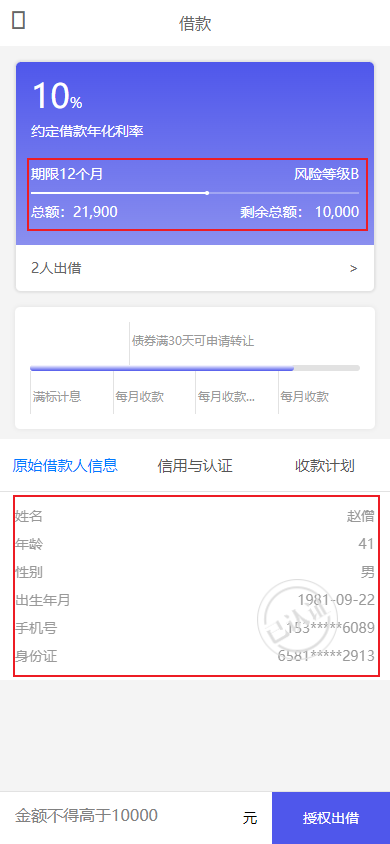

# 第09章 投标放款

## 1. 业务概述

回顾 P2P 平台整个业务流程图


### 1.1. 充值业务

用户在平台开户后会在银行存管系统中有一个虚拟银行账号，用户通过万信金融把储蓄卡中的金额转入到银行存管系统的虚拟银行账户中，即为充值。例如：用户把银行卡中的金额转入到支付宝或微信中一样。充值流程如下：


1. 用户在'我的'页面点击'账户余额'


2. 点击充值（如果用户尚未开户，会被自动跳转到开户界面），填写充值金额


3. 确认信息并输入开户时设置的交易密码


4. 充值成功


5. 目前暂时通过直接修改数据库的方式进行充值（*后续再进行此功能开发*）。用户的账户余额具体设置在 p2p_bank_depository 数据库的 balance_details 表中的 `BALANCE` 字段


### 1.2. 投标

借款人发标并通过审核后，投资人就可以在P2P平台看到这些标的信息(可投资项目)，投资人对这个项目进行投资(出借)就叫做投标。用户投标流程如下：


1. 用户浏览借款列表(标的)


2. 选择标的，输入投标金额


3. 确认出借，支付金额


4. 投标成功，显示预期收益


## 2. 用户投标需求分析

借款人发标并通过审核后，投资人就可以在P2P平台看到这些标的信息(可投资项目)，投资人对这个项目进行投资(出借)就叫做投标。投资人在投标前需要先开户并充值。

### 2.1. 流程图


### 2.2. 业务流程简述

**第一阶段：投标预览(图中1.1-1.6)**

1. 用户在前端选择要投资的标的
2. 请求交易中心获取标的基本信息和已投标记录
3. 交易中心请求用户服务获取借款人基本信息
4. 交易中心返回投标预览信息给前端
5. 前端显示投标预览信息，用户填写出借金额

**第二阶段：用户投标(图中2.1-2.13)**

1. 用户在前端确认投标信息，并请求交易中心保存投标信息
2. 交易中心保存用户投标信息(未发布)
3. 交易中心请求存管代理服务对投标数据进行签名，并生成交易记录(未同步)
4. 存管代理服务携带签名后的投标数据请求银行存管系统
5. 银行存管系统保存投标信息，并冻结投资人用户余额
6. 银行存管系统返回处理结果给存管代理服务
7. 存管代理服务更新交易记录(已同步)，并返回投标成功结果给交易中心
8. 交易中心更新投标结果后返回给前端
9. 前端展示投标结果给用户

## 3. 投标预览

参考前面的流程图，投资人浏览标的列表时，可以点击某个标的进去预览相关信息，例如：标的信息，已投标信息，借款人信息等，这些都是投标前必须给投资人预览的信息。

### 3.1. 接口定义

> 此部分接口定义全部都在 wanxinp2p-api 工程中

#### 3.1.1. 交易中心查询标的信息接口

修改 `TransactionApi` 接口，创建 `queryProjectsIds` 查询标的信息方法

```java
/**
 * 通过ids获取多个标的
 *
 * @param ids 多个标的id，使用逗号分隔的字符串
 * @return
 */
RestResponse<List<ProjectDTO>> queryProjectsIds(String ids);
```

#### 3.1.2. 交易中心查询投标记录接口

创建接口返回的投标信息预览传输类

```java
@Data
@ApiModel(value = "TenderOverviewDTO", description = "投标信息预览")
public class TenderOverviewDTO {
    @JsonSerialize(using = ToStringSerializer.class)
    @ApiModelProperty("主键")
    private Long id;

    @ApiModelProperty("投标人用户标识")
    private Long consumerId;

    @ApiModelProperty("投标人用户名")
    private String consumerUsername;

    @ApiModelProperty("投标冻结金额")
    private BigDecimal amount;

    @ApiModelProperty("投标方式")
    private String tenderWay = "手动出借";

    @ApiModelProperty("创建时间")
    private LocalDateTime createDate;
}
```

修改 `TransactionApi` 接口，创建 `queryTendersByProjectId` 查询投标记录的方法

```java
/**
 * 根据标的id查询投标记录
 *
 * @param id 标的id
 * @return
 */
RestResponse<List<TenderOverviewDTO>> queryTendersByProjectId(Long id);
```

#### 3.1.3. 用户中心获取借款人信息接口

创建接口响应的借款人信息传输类

```java
@Data
@ApiModel(value = "BorrowerDTO", description = "借款人用户信息")
public class BorrowerDTO {
    @ApiModelProperty("用户id")
    private Long id;

    @ApiModelProperty("用户名")
    private String username;

    @ApiModelProperty("真实姓名")
    private String fullname;

    @ApiModelProperty("身份证号")
    private String idNumber;

    @ApiModelProperty("手机号")
    private String mobile;

    @ApiModelProperty("年龄")
    private Integer age;

    @ApiModelProperty("生日")
    private String birthday;

    @ApiModelProperty("性别")
    private String gender;
}
```

在 `ConsumerApi` 接口中新增 `getBorrower` 获取借款人信息方法：

```java
/**
 * 获取借款人用户信息
 *
 * @param id 用户id
 * @return
 */
RestResponse<BorrowerDTO> getBorrower(Long id);
```

### 3.2. 交易中心查询标的信息功能

交易中心查询标的信息接口主要实现业务如下：

1. 根据标的id查询标的信息
2. 获取标的剩余可投额度
3. 获取标的已投记录数

#### 3.2.1. 数据访问层

在 mapper 包中新增一个 `TenderMapper` 接口，用来操作投标数据。并定义 `selectAmountInvestedByProjectId` 抽象方法，用于获取标的已投金额

```java
public interface TenderMapper extends BaseMapper<Tender> {
    /**
     * 根据标的id, 获取标的已投金额, 如果未投返回 0.0
     */
    List<BigDecimal> selectAmountInvestedByProjectId(Long id);
}
```

新建一个映射配置文件 TenderMapper.xml，并定义 `selectAmountInvestedByProjectId` 方法的映射 sql

```xml
<?xml version="1.0" encoding="UTF-8" ?>
<!DOCTYPE mapper PUBLIC "-//mybatis.org//DTD Mapper 3.0//EN" "http://mybatis.org/dtd/mybatis-3-mapper.dtd">
<mapper namespace="com.moon.wanxinp2p.transaction.mapper.TenderMapper">

    <select id="selectAmountInvestedByProjectId" resultType="java.math.BigDecimal">
        SELECT IFNULL(SUM(AMOUNT), 0.0)
        FROM tender
        WHERE PROJECT_ID = #{id}
          AND STATUS = 1
    </select>

</mapper>
```

#### 3.2.2. 业务层

在 `ProjectService` 接口中新增一个 `queryProjectsIds` 方法

```java
/**
 * 通过ids获取多个标的
 *
 * @param ids 多个标的id字符串，不同id之间使用逗号分隔
 * @return
 */
List<ProjectDTO> queryProjectsIds(String ids);
```

在 `ProjectServiceImpl` 类中实现该方法

```java
@Override
public List<ProjectDTO> queryProjectsIds(String ids) {
    // 查询标的信息
    QueryWrapper<Project> queryWrapper = new QueryWrapper<>();
    // 将多个标的id字符串转成集合
    List<Long> list = Arrays.stream(ids.split(",")).map(Long::parseLong).collect(Collectors.toList());
    // 组装 id范围查询条件 ... where id in (1,2,3,...)
    queryWrapper.lambda().in(Project::getId, list);
    // 查询
    List<Project> projects = this.list(queryWrapper);

    // 循环转成dto类型
    return projects.stream().map(p -> {
        ProjectDTO dto = new ProjectDTO();
        BeanUtils.copyProperties(p, dto);

        // 获取剩余额度
        dto.setRemainingAmount(this.getProjectRemainingAmount(p));

        // 查询已出借人数
        Integer tenderCount = tenderMapper.selectCount(Wrappers.<Tender>lambdaQuery().eq(Tender::getProjectId, p.getId()));
        dto.setTenderCount(tenderCount);
        return dto;
    }).collect(Collectors.toList());
}

/**
 * 获取标的剩余可投额度
 */
private BigDecimal getProjectRemainingAmount(Project project) {
    // 根据标的id在投标表查询已投金额
    List<BigDecimal> decimalList = tenderMapper.selectAmountInvestedByProjectId(project.getId());
    // 求和结果集
    BigDecimal amountInvested = decimalList.stream().reduce(new BigDecimal("0.0"), BigDecimal::add);
    // 得到剩余额度
    return project.getAmount().subtract(amountInvested);
}
```

#### 3.2.3. 控制层

修改 `TransactionController` 控制类，实现查询标的方法

```java
@ApiOperation("通过ids获取多个标的")
@GetMapping("/projects/{ids}")
@Override
public RestResponse<List<ProjectDTO>> queryProjectsIds(@PathVariable String ids) {
    return RestResponse.success(projectService.queryProjectsIds(ids));
}
```

#### 3.2.4. 功能测试

由于目前尚未实现投标功能，所以表中没有数据可用。暂时需要造点测试数据，这里需要注意：前面对 p2p_transaction 进行了分库分表，所以造测试数据时要依据分库分表策略进行，否则会影响测试效果。

- 分库策略：`发标人ID % 2`
- 分表策略：`标的ID % 2`

运行以下脚本：

```sql
INSERT INTO `p2p_transaction_1`.`tender_0`(`ID`, `CONSUMER_ID`, `CONSUMER_USERNAME`, `USER_NO`, `PROJECT_ID`, `PROJECT_NO`, `AMOUNT`, `TENDER_STATUS`, `CREATE_DATE`, `REQUEST_NO`, `STATUS`, `PROJECT_NAME`, `PROJECT_PERIOD`, `PROJECT_ANNUAL_RATE`) VALUES (1, 1, '13888888888', '1', 2144527401414811650, '1', 11000, '1', '2022-03-12 23:02:21', '1', 1, '1', 1, 1.00);
INSERT INTO `p2p_transaction_1`.`tender_0`(`ID`, `CONSUMER_ID`, `CONSUMER_USERNAME`, `USER_NO`, `PROJECT_ID`, `PROJECT_NO`, `AMOUNT`, `TENDER_STATUS`, `CREATE_DATE`, `REQUEST_NO`, `STATUS`, `PROJECT_NAME`, `PROJECT_PERIOD`, `PROJECT_ANNUAL_RATE`) VALUES (2, 2, '13800000000', '2', 2144527401414811650, '2', 900, '1', '2022-03-12 23:03:08', '1', 1, '1', 1, 1.00);

INSERT INTO `p2p_consumer`.`consumer`(`ID`, `USERNAME`, `FULLNAME`, `ID_NUMBER`, `USER_NO`, `MOBILE`, `USER_TYPE`, `ROLE`, `AUTH_LIST`, `IS_BIND_CARD`, `LOAN_AMOUNT`, `STATUS`, `REQUEST_NO`) VALUES (19, '15315176089', '赵僧', '658182198109222913', 'USR_2E81A1C0BE4443A5829578BCBD4FDE4B', '15315176089', NULL, NULL, 'ALL', 1, NULL, 1, NULL);
```

为了不增加垃圾数据，测试完成后执行以下脚本，删除测试数据：

```sql
DELETE FROM p2p_transaction_1.tender_0 WHERE id = 1;
DELETE FROM p2p_transaction_1.tender_0 WHERE id = 2;

DELETE FROM `p2p_consumer`.`consumer` WHERE id = 19;
```

启动以下服务

1. 启动 Apollo 服务
2. 启动 es 服务与 Logstash 服务
3. 后端需要启动：
    - wanxinp2p-discover-server 微服务
    - wanxinp2p-gateway-server 微服务
    - wanxinp2p-uaa-service 微服务
    - wanxinp2p-account-service 微服务
    - wanxinp2p-consumer-service 微服务
    - wanxinp2p-transaction-service 微服务
    - wanxinp2p-content-search-service 微服务
4. 启动前端 wanxinp2p-web-app 项目

点击“出借”选项，选择相应的标的


点击“出借”按钮后，跳转到“借款”页面，查看借款的信息、剩余总额、出借人数是否正确


### 3.3. 交易中心查询投标记录功能

接口主要实现业务如下：

1. 根据标的id查询所有投标记录
2. 封装投标记录列表返回

#### 3.3.1. 业务层

在 `ProjectService` 接口，新增 根据标的id查询投标记录方法 `queryTendersByProjectId`

```java
/**
 * 根据标的id查询投标记录
 *
 * @param id 标的id
 * @return
 */
List<TenderOverviewDTO> queryTendersByProjectId(Long id);
```

在 `ProjectServiceImpl` 类中实现该方法

```java
@Override
public List<TenderOverviewDTO> queryTendersByProjectId(Long id) {
    // 使用 mp 业务方法，根据标的id查询 tender_0/tender_1 表
    List<Tender> tenderList = tenderMapper.selectList(Wrappers.<Tender>lambdaQuery().eq(Tender::getProjectId, id));

    // 转换成 dto 类型，并返回
    return tenderList.stream().map(t -> {
        TenderOverviewDTO dto = new TenderOverviewDTO();
        BeanUtils.copyProperties(t, dto);
        // 使用工具类对用户的手机号进行隐藏保护
        dto.setConsumerUsername(CommonUtil.hiddenMobile(t.getConsumerUsername()));
        return dto;
    }).collect(Collectors.toList());
}
```

#### 3.3.2. 控制层

修改 `TransactionController` 控制层，实现查询投标记录方法

```java
@ApiOperation("根据标的id查询投标记录")
@GetMapping("/tenders/projects/{id}")
@Override
public RestResponse<List<TenderOverviewDTO>> queryTendersByProjectId(@PathVariable Long id) {
    return RestResponse.success(projectService.queryTendersByProjectId(id));
}
```

#### 3.3.3. 功能测试

> 因为最后会进行整个流程前后端集成测试，所以这里只使用 postman 直接测试即可

启动 apollo 服务与交易中心服务即可，请求 url 如下：

```json
GET http://127.0.0.1:53060/transaction/tenders/projects/2144527401414811650
```

测试结果：


### 3.4. 用户中心获取借款人信息功能

接口主要实现业务如下：

1. 根据借款人id获取个人信息
2. 返回借款人详细信息

#### 3.4.1. 业务层

修改 `ConsumerService` 接口，新增 `getBorrower` 查询借款人信息方法

```java
/**
 * 获取借款人基本信息
 *
 * @param id 用户id
 * @return
 */
BorrowerDTO getBorrower(Long id);
```

在 `ConsumerServiceImpl` 类中实现该方法

```java
@Override
public BorrowerDTO getBorrower(Long id) {
    // 根据id查询用户表
    Consumer consumer = this.getById(id);
    if (consumer == null) {
        log.info("id为{}的用户信息不存在", id);
        throw new BusinessException(CommonErrorCode.E_140101);
    }

    // 转换成 dto 类型
    BorrowerDTO dto = new BorrowerDTO();
    BeanUtils.copyProperties(consumer, dto);
    // 使用项目中的工具类，从用户的身份证中获取年龄、生日、性别等信息
    Map<String, String> info = IDCardUtil.getInfo(dto.getIdNumber());
    dto.setAge(Integer.valueOf(info.get("age")));
    dto.setGender(info.get("gender"));
    dto.setBirthday(info.get("birthday"));

    return dto;
}
```

#### 3.4.2. 控制层

修改 `ConsumerController` 控制层，实现查询借款人信息方法

```java
@ApiOperation("获取借款人用户信息")
@ApiImplicitParam(name = "id", value = "用户标识", required = true, dataType = "Long", paramType = "path")
@GetMapping("/my/borrowers/{id}")
@Override
public RestResponse<BorrowerDTO> getBorrower(Long id) {
    return RestResponse.success(consumerService.getBorrower(id));
}
```

#### 3.4.3. 功能测试

> 因为最后会进行整个流程前后端集成测试，所以这里只使用 postman 直接测试即可

启动 apollo 服务与用户服务即可，请求 url 如下：

```json
GET http://127.0.0.1:53050/consumer/my/borrowers/3
```

测试结果：


### 3.5. 前后端集成测试

#### 3.5.1. 启动服务

1. 启动 Apollo 服务
2. 启动 es 服务与 Logstash 服务
3. 后端需要启动：
    - wanxinp2p-discover-server 微服务
    - wanxinp2p-gateway-server 微服务
    - wanxinp2p-uaa-service 微服务
    - wanxinp2p-account-service 微服务
    - wanxinp2p-consumer-service 微服务
    - wanxinp2p-transaction-service 微服务
    - wanxinp2p-content-search-service 微服务
4. 启动前端 wanxinp2p-web-app 项目

#### 3.5.2. 测试步骤

1. 启动相关服务后，h5登陆
2. 选择“出借”标签页，选择一个记录，点击“出借”按钮，跳转投标预览页
3. 检查相关的数据是显示是否正确



4. 点击“x人出借”行，跳转投标记录，检查数据是否正常


## 4. 用户投标

参考前面的流程图，该业务涉及到交易中心，存管代理和银行存管系统。交易中心需要保存投标信息，存管代理需要签名数据并保存交易记录，银行存管系统需要保存标的信息并扣除投资人余额。

### 4.1. 接口定义

在 wanxinp2p-api 工程定义以下投标涉及的接口

#### 4.1.1. 交易中心保存投标信息接口

在 transaction 模块的 model 包中创建接口请求与响应相应的实体类

```java
@Data
@ApiModel(value = "ProjectInvestDTO", description = "用户投标信息")
public class ProjectInvestDTO {

    @ApiModelProperty("标的标识")
    private Long id;

    @ApiModelProperty("投标金额")
    private String amount;
}
```

```java
@Data
public class TenderDTO {

    /**
     * 主键
     */
    @JsonSerialize(using = ToStringSerializer.class)
    private Long id;

    /**
     * 投标人用户标识
     */
    private Long consumerId;

    /**
     * 投标人用户名
     */
    private String consumerUsername;

    /**
     * 投标人用户编码
     */
    private String userNo;

    /**
     * 标的标识
     */
    private Long projectId;

    /**
     * 标的编码
     */
    private String projectNo;

    /**
     * 投标冻结金额
     */
    private BigDecimal amount;

    /**
     * 投标状态
     */
    private String tenderStatus;

    /**
     * 创建时间
     */
    private LocalDateTime createDate;

    /**
     * 投标/债权转让 请求流水号
     */
    private String requestNo;

    /**
     * 可用状态
     */
    private Integer status;

    /**
     * 标的名称
     */
    private String projectName;

    /**
     * 标的期限(单位:天) -- 冗余字段
     */
    private Integer projectPeriod;

    /**
     * 年化利率(投资人视图) -- 冗余字段
     */
    private BigDecimal projectAnnualRate;

    /**
     * 标的信息
     */
    private ProjectDTO project;

    /**
     * 预期收益
     */
    private BigDecimal expectedIncome;
}
```

在 `TransactionApi` 接口中新增 `createTender` 创建投标信息方法

```java
/**
 * 用户投标
 *
 * @param projectInvestDTO 投标信息
 * @return
 */
RestResponse<TenderDTO> createTender(ProjectInvestDTO projectInvestDTO);
```

#### 4.1.2. 存管代理服务预处理冻结接口

在 `DepositoryAgentApi` 接口中新增 `userAutoPreTransaction` 方法

```java
/**
 * 预授权处理
 *
 * @param userAutoPreTransactionRequest 预授权处理信息
 * @return
 */
RestResponse<String> userAutoPreTransaction(UserAutoPreTransactionRequest userAutoPreTransactionRequest);
```

### 4.2. 交易中心用户投标功能

在交易中心定义保存投标信息接口，功能描述如下：

1. 接受用户填写的投标信息
2. 交易中心校验投资金额是否符合平台允许最小投资金额
3. 校验用户余额是否大于投资金额
4. 校验投资金额是否小于等于标的可投金额
5. 校验此次投标后的剩余金额是否满足最小投资金额
6. 保存投标信息
7. 请求存管代理服务进行投标预处理冻结
8. 存管代理服务返回处理结果给交易中心，交易中心计算此次投标预期收益
9. 返回预期收益给前端

> 由于业务比较复杂，所以下面拆分成若干部分逐一实现

#### 4.2.1. 业务接口

在 `ProjectService` 接口中新增 `createTender` 方法

```java
/**
 * 用户投标
 *
 * @param projectInvestDTO
 * @return
 */
TenderDTO createTender(ProjectInvestDTO projectInvestDTO);
```

#### 4.2.2. 查询用户账户余额

在用户投标之前，需要查询当前用户账户的余额。此处如按上述流程图，是用户服务直接调用银行存管系统。**但考虑到业务的划分，还是定义由存管代理服务调用银行存管系统进行查询**

- 在 wanxinp2p-api 工程的 depository 模块中，定义账户余额传输实体类

```java
@Data
@ApiModel(value = "BalanceChangeDTO", description = "用户余额信息")
public class BalanceDetailsDTO implements Serializable {

    @ApiModelProperty(value = "用户标识")
    private Long consumerId;

    @ApiModelProperty(value = "用户编码,生成唯一,用户在存管系统标识")
    private String userNo;

    @ApiModelProperty(value = "账户变动类型.1.增加.2.减少.3.冻结.4解冻")
    private Integer changeType;

    @ApiModelProperty(value = "冻结金额")
    private BigDecimal freezeAmount;

    @ApiModelProperty(value = "可用余额")
    private BigDecimal balance;

    @ApiModelProperty(value = "应用编码")
    private String appCode;

    @ApiModelProperty(value = "账户变动时间")
    private LocalDateTime createDate;
}
```

- 在 `DepositoryAgentApi` 接口中，新增查询当前账户余额方法，提供给交易中心（或者其他服务）远程查询当前余额

```java
/**
 * 获取当前登录用户余额信息
 *
 * @param userNo 用户编码
 * @return
 */
RestResponse<BalanceDetailsDTO> getBalance(String userNo);
```

- 在 wanxinp2p-depository-agent-service 工程，创建用户相关的业务接口 `BankConsumerService`

```java
public interface BankConsumerService {
    /**
     * 远程调用存管系统获取用户余额信息
     *
     * @param userNo 用户编码
     * @return
     */
    BalanceDetailsDTO getBalance(String userNo);
}
```

- 创建 `BankConsumerServiceImpl` 实现获取用户余额方法

```java
@Service
@Slf4j
public class BankConsumerServiceImpl implements BankConsumerService {

    // 注入配置读取工具类
    @Autowired
    private ConfigService configService;

    @Autowired
    private OkHttpService okHttpService;

    /**
     * 远程调用存管系统获取用户余额信息
     *
     * @param userNo 用户编码
     * @return
     */
    @Override
    public BalanceDetailsDTO getBalance(String userNo) {
        // 拼接远程调用url
        String url = configService.getDepositoryUrl() + "/balance-details/" + userNo;
        // 发送get请求
        String responseBody = okHttpService.doGet(url);
        if (StringUtils.hasText(responseBody)) {
            return JSON.parseObject(responseBody, BalanceDetailsDTO.class);
        } else {
            log.warn("调用存管系统{}获取余额失败", url);
            throw new BusinessException(CommonErrorCode.E_100106);
        }
    }
}
```

在原有的 `OkHttpService` 工具类增加没有请求前置拦截的请求方法

```java
public String doGet(String url) {
    String responseBody = "";
    OkHttpClient okHttpClient = new OkHttpClient().newBuilder().build();
    Request request = new Request.Builder().url(url).build();

    try (Response response = okHttpClient.newCall(request).execute()) {
        if (response.isSuccessful() && response.body() != null) {
            responseBody = response.body().string();
        }
    } catch (IOException e) {
        log.warn("请求出现异常: ", e);
    }

    return responseBody;
}
```

- 修改控制层 `DepositoryAgentController` 调用查询余额的业务方法

```java
@Autowired
private BankConsumerService bankConsumerService;

@ApiOperation("获取用户可用余额")
@ApiImplicitParam(name = "userNo", value = "用户编码", required = true, dataType = "String")
@GetMapping("/l/balances/{userNo}")
@Override
public RestResponse<BalanceDetailsDTO> getBalance(@PathVariable String userNo) {
    return RestResponse.success(bankConsumerService.getBalance(userNo));
}
```

#### 4.2.3. 番外：用户微服务增加余额查询

考虑到前端也需要获取账户余额，所有顺手在用户中心微服务增加查询当前用户的功能

- 在 wanxinp2p-api 工程 `ConsumerAPI` 接口中，增加查询当前用户余额的方法

```java
/**
 * 获取当前登录用户余额信息
 *
 * @return
 */
RestResponse<BalanceDetailsDTO> getMyBalance();
```

- 修改用户服务中 `ConsumerService` 接口，增加查询余额方法 `getBalanceFromDepository`

```java
/**
 * 远程调用存管系统获取用户余额信息
 *
 * @param userNo
 * @return
 */
RestResponse<BalanceDetailsDTO> getBalanceFromDepository(String userNo);
```

- 修改 `DepositoryAgentApiAgent` 接口，增加feign远程调用方法

```java
@GetMapping("/depository-agent/l/balances/{userNo}")
RestResponse<BalanceDetailsDTO> getBalance(@PathVariable("userNo") String userNo);
```

- 修改 `ConsumerServiceImpl` 类，实现业务方法

```java
@Override
public RestResponse<BalanceDetailsDTO> getBalanceFromDepository(String userNo) {
    return depositoryAgentApiAgent.getBalance(userNo);
}
```

- 修改 `ConsumerController` 控制层，调用业务方法


```java
@ApiOperation("获取用户可用余额")
@GetMapping("/my/balances")
@Override
public RestResponse<BalanceDetailsDTO> getMyBalance() {
    // 使用工具类，从请求域中获取到用户手机号，再根据手机查询到用户数据
    ConsumerDTO dto = consumerService.getByMobile(SecurityUtil.getUser().getMobile());
    return consumerService.getBalanceFromDepository(dto.getUserNo());
}
```

#### 4.2.4. 业务接口实现前置校验

在 `ProjectServiceImpl` 实现投标的方法中，首先完成前置条件判断准备工作

- 检查 Apollo 上 transaction-service 项目是否配置最小投标金额 `mini.investment.amount`


- 在 `DepositoryAgentApiAgent` 接口中，定义 feign 远程查询用户余额方法

```java
@GetMapping("/depository-agent/l/balances/{userNo}")
RestResponse<BalanceDetailsDTO> getBalance(@PathVariable("userNo") String userNo);
```

- 修改 `ProjectServiceImpl` 类，在业务方法中完成前置条件判断(投标金额是否大于最小投标金额、账户余额是否足够、投标金额是否超出所剩可投金额、是否满标等)

```java
@Override
public TenderDTO createTender(ProjectInvestDTO projectInvestDTO) {
    /* 用户投标前置条件判断 */
    // 1. 判断投标金额是否大于最小投标金额
    BigDecimal amount = new BigDecimal(projectInvestDTO.getAmount());
    // 配置的最小投标金额
    BigDecimal miniInvestment = configService.getMiniInvestmentAmount();
    if (amount.compareTo(miniInvestment) < 0) {
        throw new BusinessException(TransactionErrorCode.E_150109);
    }

    // 2. 判断用户账户余额是否小于投标金额
    LoginUser user = SecurityUtil.getUser();
    // 调用用户中心根据用户手机查询用户
    RestResponse<ConsumerDTO> consumerResponse = consumerApiAgent.getCurrConsumer(user.getMobile());
    ConsumerDTO consumer = consumerResponse.getResult();
    // 调用存管代理服务接口查询用户余额
    RestResponse<BalanceDetailsDTO> balanceResponse = depositoryAgentApiAgent.getBalance(consumer.getUserNo());
    // 获取用户余额
    BigDecimal balance = balanceResponse.getResult().getBalance();
    if (balance.compareTo(amount) < 0) {
        throw new BusinessException(TransactionErrorCode.E_150112);
    }

    // 3. 判断标的是否满标，标的状态为FULLY就表示满标
    Long projectId = projectInvestDTO.getId();
    // 根据id查询标的信息
    Project project = getById(projectId);
    // 判断满标标识
    if (ProjectCode.FULLY.getCode().equalsIgnoreCase(project.getProjectStatus())) {
        throw new BusinessException(TransactionErrorCode.E_150114);
    }

    // 4. 判断投标金额是否超过剩余未投金额
    BigDecimal remainingAmount = getProjectRemainingAmount(project);
    if (amount.compareTo(remainingAmount) > 0) {
        // 本次投标资金额超出标的剩余未投资金
        throw new BusinessException(TransactionErrorCode.E_150110);
    }

    // 5. 判断此次投标后，剩余未投金额是否满足最小投标金额
    // 此次投标后的剩余未投金额 = 目前剩余未投金额 - 本次投标金额
    BigDecimal afterAmount = remainingAmount.subtract(amount);
    if (afterAmount.compareTo(BigDecimal.ZERO) > 0 && afterAmount.compareTo(miniInvestment) < 0) {
        // 投标后剩余金额小于设置的最小投标金额
        throw new BusinessException(TransactionErrorCode.E_150111);
    }
    // 未完...
}
```

#### 4.2.5. 保存投标信息并发送给存管代理服务

根据业务流程图，此部分业务中的会通过存管代理服务来调用银行存管系统的授权预处理接口（*接口说明详见《银行存管系统接口说明.pdf》文档*）

- 在 wanxinp2p-api 工程的 depository 模块中，创建授权预处理的接口参数实体类

```java
@Data
@ApiModel(value = "UserAutoPreTransactionRequest", description = "预授权处理请求信息")
public class UserAutoPreTransactionRequest {

    @ApiModelProperty("冻结金额")
    private BigDecimal amount;

    @ApiModelProperty("请求流水号")
    private String requestNo;

    @ApiModelProperty("投资人用户编码")
    private String userNo;

    @ApiModelProperty("预处理业务类型")
    private String bizType;

    @ApiModelProperty("红包金额")
    private BigDecimal preMarketingAmount;

    @ApiModelProperty("备注")
    private String remark;

    @ApiModelProperty("标的号")
    private String projectNo;

    @ApiModelProperty("债权出让流水号，购买债权时需填此参数")
    private String creditsaleRequestNo;

    @ApiModelProperty("预处理业务ID")
    private Long id;
}
```

- 在交易服务的 `DepositoryAgentApiAgent` 接口中新增 `userAutoPreTransaction` 授权预处理方法


```java
@PostMapping("/depository-agent/l/user-auto-pre-transaction")
RestResponse<String> userAutoPreTransaction(@RequestBody UserAutoPreTransactionRequest userAutoPreTransactionRequest);
```

- `ProjectServiceImpl.createTender` 方法此部分处理逻辑

```java
// 6. 保存投标信息
// 创建投标信息实例
final Tender tender = new Tender();
// 投资人投标金额( 投标冻结金额 )
tender.setAmount(amount);
// 投标人用户标识
tender.setConsumerId(consumer.getId());
tender.setConsumerUsername(consumer.getUsername());
// 投标人用户编码
tender.setUserNo(consumer.getUserNo());
// 标的标识
tender.setProjectId(projectId);
// 标的编码
tender.setProjectNo(project.getProjectNo());
// 投标状态
tender.setTenderStatus(TradingCode.FROZEN.getCode());
// 创建时间
tender.setCreateDate(LocalDateTime.now());
// 请求流水号
tender.setRequestNo(CodeNoUtil.getNo(CodePrefixCode.CODE_REQUEST_PREFIX));
// 可用状态
tender.setStatus(0);
tender.setProjectName(project.getName());
// 标的期限(单位:天)
tender.setProjectPeriod(project.getPeriod());
// 年化利率(投资人视图)
tender.setProjectAnnualRate(project.getAnnualRate());
// 保存到数据库
tenderMapper.insert(tender);

// 7. 发送投标数据给存管代理服务
// 构造请求数据
UserAutoPreTransactionRequest transactionRequest = new UserAutoPreTransactionRequest();
// 冻结金额
transactionRequest.setAmount(amount);
// 预处理业务类型
transactionRequest.setBizType(PreprocessBusinessTypeCode.TENDER.getCode());
// 标的号
transactionRequest.setProjectNo(project.getProjectNo());
// 请求流水号
transactionRequest.setRequestNo(tender.getRequestNo());
// 投资人用户编码
transactionRequest.setUserNo(consumer.getUserNo());
// 设置关联业务实体标识
transactionRequest.setId(tender.getId());
// 远程调用存管代理服务
RestResponse<String> response = depositoryAgentApiAgent.userAutoPreTransaction(transactionRequest);
```

#### 4.2.6. 根据结果修改投标状态

最后需要根据系统存管系统响应的内容去修改投标的状态，`ProjectServiceImpl.createTender` 方法此部分处理逻辑如下：

```java
// 8. 判断银行存管系统响应结果
if (!DepositoryReturnCode.RETURN_CODE_00000.getCode().equals(response.getResult())) {
    // 抛出一个业务异常
    log.warn("投标失败 ! 标的ID为: {}, 存管代理服务返回的状态为: {}", projectId, response.getResult());
    throw new BusinessException(TransactionErrorCode.E_150113);
}

// 响应结果成功，修改投标记录状态为：已同步
tender.setStatus(1);
tenderMapper.updateById(tender);
// 判断当前标的是否满标
BigDecimal finalRemainAmont = getProjectRemainingAmount(project);
if (finalRemainAmont.compareTo(BigDecimal.ZERO) == 0) {
    // 如果满标，更新标的状态
    project.setProjectStatus(ProjectCode.FULLY.getCode());
    updateById(project);
}

// 9. 转换为DTO对象，并封装相关数据
TenderDTO tenderDTO = new TenderDTO();
BeanUtils.copyProperties(tender, tenderDTO);
// 设置标的信息
project.setRepaymentWay(RepaymentWayCode.FIXED_REPAYMENT.getCode()); // 设置还款方式
ProjectDTO projectDTO = new ProjectDTO();
BeanUtils.copyProperties(project, projectDTO);
tenderDTO.setProject(projectDTO);

// 根据标的期限计算还款月数
int month = Double.valueOf(Math.ceil(project.getPeriod() / 30.0)).intValue();
// 设置预期收益
tenderDTO.setExpectedIncome(IncomeCalcUtil.getIncomeTotalInterest(amount, configService.getAnnualRate(), month));

return tenderDTO;
```

#### 4.2.7. 控制层

修改 `TransactionController` 类中的代码

```java
@ApiOperation("用户投标")
@ApiImplicitParam(name = "projectInvestDTO", value = "投标信息", required = true,
        dataType = "ProjectInvestDTO", paramType = "body")
@PostMapping("/my/tenders")
@Override
public RestResponse<TenderDTO> createTender(@RequestBody ProjectInvestDTO projectInvestDTO) {
    return RestResponse.success(projectService.createTender(projectInvestDTO));
}
```

#### 4.2.8. 功能测试

因为投标业务中存在很多数据的检验，所以直接使用 postman 去测试比较方便。

1. 启动 Apollo 服务
2. 后端需要启动：
    - wanxinp2p-discover-server 微服务
    - wanxinp2p-gateway-server 微服务
    - wanxinp2p-uaa-service 微服务
    - wanxinp2p-account-service 微服务
    - wanxinp2p-consumer-service 微服务
    - wanxinp2p-transaction-service 微服务
    - wanxinp2p-depository-agent-service 微服务
    - wanxindepository 银行微服务

先选择用户登陆

```json
POST http://localhost:53010/uaa/oauth/token

grant_type:password
client_id:wanxin-p2p-web-h5
client_secret:wanxin-h5
username:13800000000
password:13800000000
domain:c
authenticationType:password
```

测试请求url与请求参数，根据业务逻辑，手动修改数据库与请求参数值，测试是否覆盖所有分支

```json
POST http://127.0.0.1:53010/transaction/my/tenders

{
    "id": 2138640149714886657,
    "amount": "50"
}
```

> 注：此部分只需要测试前面数据校验的部分，后面因为存管代理服务有接口还没有实现，所以保存投标记录那部分暂时不作测试

### 4.3. 存管代理服务预处理冻结接口

在存管代理服务中创建预处理冻结接口，功能描述如下：

1. 保存交易记录
2. 请求银行存管系统进行预处理冻结
3. 返回处理结果给交易中心

#### 4.3.1. 银行存管系统接口说明

根据业务流程图，此部分业务中存管代理服务会调用银行存管系统的授权预处理接口（*接口说明详见《银行存管系统接口说明.pdf》文档*）

#### 4.3.2. 业务功能实现

- 在 wanxinp2p-depository-agent-service 工程，修改 `DepositoryRecordService` 接口，新增 `userAutoPreTransaction` 用户方法

```java
/**
 * 投标预处理
 *
 * @param userAutoPreTransactionRequest
 * @return
 */
DepositoryResponseDTO<DepositoryBaseResponse> userAutoPreTransaction(UserAutoPreTransactionRequest userAutoPreTransactionRequest);
```

- 修改 `DepositoryRecordServiceImpl` 类实现方法

```java
@Override
public DepositoryResponseDTO<DepositoryBaseResponse> userAutoPreTransaction(UserAutoPreTransactionRequest userAutoPreTransactionRequest) {
    // 创建 DepositoryRecord 记录对象，设置必要的属性
    String requestNo = userAutoPreTransactionRequest.getRequestNo();
    DepositoryRecord depositoryRecord = new DepositoryRecord()
            .setRequestNo(requestNo) // 设置请求流水号
            .setRequestType(userAutoPreTransactionRequest.getBizType()) // 设置请求类型
            .setObjectType("UserAutoPreTransactionRequest") // 设置关联业务实体类型
            .setObjectId(userAutoPreTransactionRequest.getId()); // 设置关联业务实体标识

    // 保存交易记录（实现幂等性）
    DepositoryResponseDTO<DepositoryBaseResponse> responseDTO = handleIdempotent(depositoryRecord);
    if (responseDTO != null) {
        return responseDTO;
    }

    // 重新查询交易记录
    depositoryRecord = getEntityByRequestNo(requestNo);

    // 对请求数据进行签名
    String jsonString = JSON.toJSONString(userAutoPreTransactionRequest);
    String reqData = EncryptUtil.encodeUTF8StringBase64(jsonString);

    // 使用 OKHttpClient 发送 Http 请求向银行存管系统发送数据(投标信息)，根据结果修改状态并返回结果
    String url = configService.getDepositoryUrl() + "/service";
    return sendHttpGet("USER_AUTO_PRE_TRANSACTION", url, reqData, depositoryRecord);
}
```

- 修改控制类 `DepositoryAgentController`，实现预授权方法

```java
@ApiOperation(value = "预授权处理")
@ApiImplicitParam(name = "userAutoPreTransactionRequest", value = "平台向存管系统发送标的信息",
        required = true, dataType = "UserAutoPreTransactionRequest", paramType = "body")
@PostMapping("/l/user-auto-pre-transaction")
@Override
public RestResponse<String> userAutoPreTransaction(@RequestBody UserAutoPreTransactionRequest userAutoPreTransactionRequest) {
    return getRestResponse(depositoryRecordService.userAutoPreTransaction(userAutoPreTransactionRequest));
}

/**
 * 统一处理响应信息
 *
 * @param depositoryResponse
 * @return
 */
private RestResponse<String> getRestResponse(DepositoryResponseDTO<DepositoryBaseResponse> depositoryResponse) {
    // 获取响应数据
    DepositoryBaseResponse respData = depositoryResponse.getRespData();
    // 设置响应结果和响应信息
    final RestResponse<String> restResponse = new RestResponse<>();
    restResponse.setResult(respData.getRespCode());
    restResponse.setMsg(respData.getRespMsg());
    return restResponse;
}
```

### 4.4. 前后端集成测试

#### 4.4.1. 启动服务

1. 启动 Apollo 服务
2. 启动 es 服务与 Logstash 服务
3. redis 服务
4. 后端需要启动：
    - wanxinp2p-discover-server 微服务
    - wanxinp2p-gateway-server 微服务
    - wanxinp2p-uaa-service 微服务
    - wanxinp2p-account-service 微服务
    - wanxinp2p-consumer-service 微服务
    - wanxinp2p-transaction-service 微服务
    - wanxinp2p-content-search-service 微服务
    - wanxinp2p-depository-agent-service 微服务
    - wanxindepository 银行微服务
5. 启动前端 wanxinp2p-web-app 项目

#### 4.4.2. 测试步骤

1. 挑选已经开户的账户登录，并充值。挑选一个测试数据规范的新标进行投资
2. 投标相关检验测试

- 投标金额不能小于最小投标金额


- 投标金额超过账户余额


- 投标金额超过剩余可投金额，*此部分前端页面已做限制，之前已经使用postman进行测试*


- 此次投标后的剩余未投金额是否满足最小投标金额


3. 交易中心保存投标信息
4. 存管代理服务保存交易记录


5. 投标成功后的状态修改、是否满标、预期收益等


