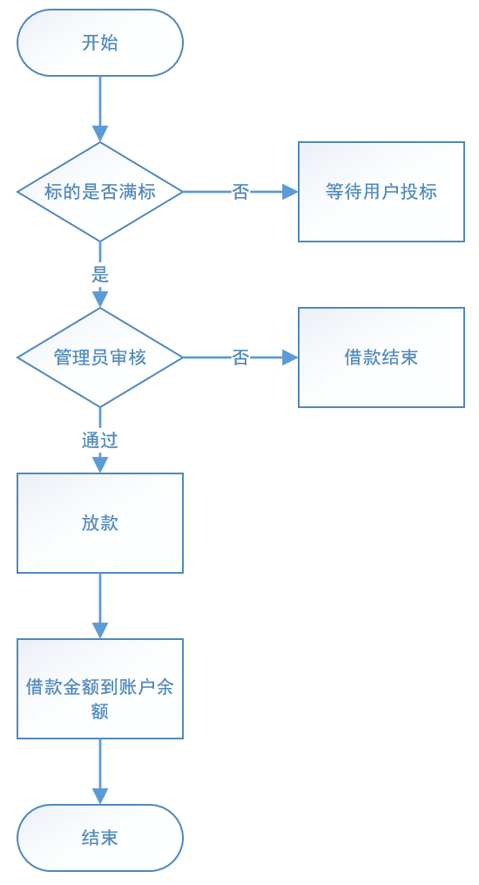
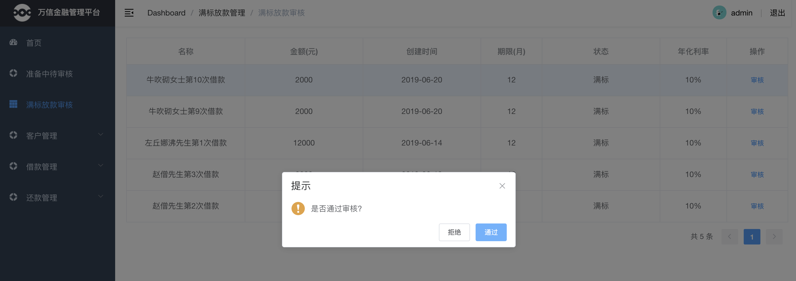
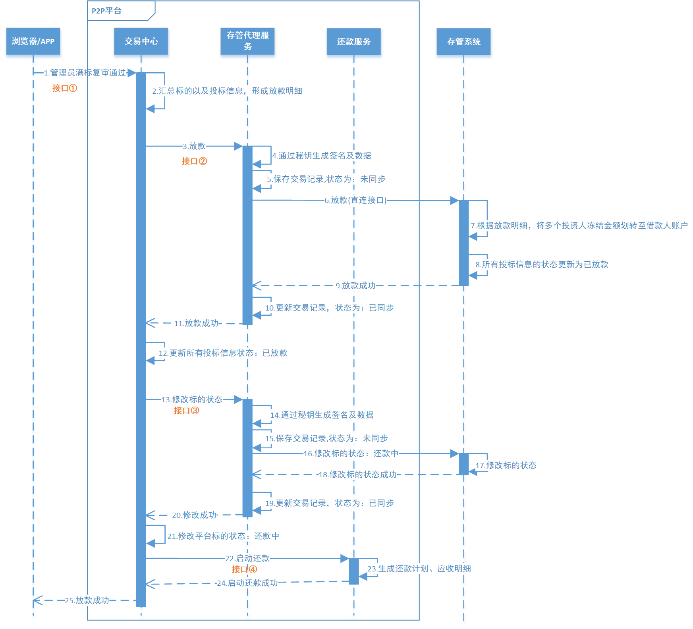

# 第10章 投标放款

## 1. 放款业务概述

当一个标的已经筹集到了所借的全部资金，即为“满标”。此时P2P平台管理员会进行审核，审核通过后，P2P平台会把投资人的出借资金打入借款人在平台的账户中，这就叫“放款”，此时借款人贷款成功。平台放款流程如下：

1. 管理员审核满标标的

2. 确认审核结果

3. 审核通过，放款成功

## 2. 投标放款需求分析

当一个标的已经筹集到了所借的全部资金，即为“满标”。此时 P2P 平台管理员会进行审核，审核通过后，P2P 平台会把投资人的出借资金打入借款人在平台的账户中，这就叫“放款”，此时就表示借款人贷款成功。

### 2.1. 系统交互流程图

系统交互流程如下图所示：

在该业务中会新增一个还款微服务：为平台提供还款计划的生成、执行、记录与归档等功能。

### 2.2. 业务流程简述

**第一阶段：生成放款明细(图中1-2)**

1. 前端向交易中心发起满标复审通过请求
2. 交易中心汇总标的以及投标信息，形成放款明细

**第二阶段：放款(图中3-12)**

1. 交易中心请求存管代理服务进行放款操作
2. 存管代理服务对放款明细进行签名，并保存交易记录为未同步
3. 存管代理服务请求存管系统进行放款
4. 存管系统根据放款明细，将多个投资人冻结余额划至借款人账户，并更新投标信息状态为已放款
5. 返回放款结果给存管代理服务
6. 存管代理服务更新交易记录为已同步，并返回放款结果给交易中心
7. 交易中心更新所有投标信息结果为：已放款

**第三阶段：修改标的业务状态(图中13-21)**

1. 交易中心请求存管代理服务修改标的状态
2. 存管代理服务对数据进行签名，并保存交易记录为：未同步
3. 存管代理服务请求存管系统修改标的状态
4. 存管系统修改标的为状态为：已放款，并返回结果给存管代理服务
5. 存管代理服务更新交易记录为：已同步，返回修改成功给交易中心
6. 交易中心收到返回结果，修改标的状态为：还款中

**第四阶段：启动还款(图中22-25)**

1. 交易中心请求还款服务启动还款
2. 还款服务收到请求后生成还款计划和应收明细，并返回启动还款成功给交易中心
3. 交易中心返回放款成功给前端

## 3. 满标放款

### 3.1. 接口定义

### 3.2. 交易中心满标放款

接口功能描述

1. 接受前端满标放款信息
2. 交易中心根据标的信息生成还款明细
3. 交易中心请求存管代理服务进行满标放款
4. 交易中心收到放款成功结果后，更新投标信息状态为：已放款
5. 交易中心请求存管代理服务修改标的状态
6. 交易中心请求还款服务启动放款

### 3.3. 存管代理服务确认放款

接口功能描述

1. 接受确认放款数据
2. 保存请求记录
3. 生成签名数据
4. 请求存管系统进行确认放款

### 3.4. 存管代理服务修改标的状态

接口功能描述

1. 接受修改标的状态数据
2. 保存请求记录
3. 生成签名数据
4. 请求存管系统修改标的状态

### 3.5. 还款服务启动还款

接口功能描述

1. 接受交易中心的还款信息
2. 生成借款人还款计划，保存到数据库
3. 生成投资人应收明细，保存到数据库

### 3.6. 前后端集成测试

## 4. 分布式事务

满标放款功能涉及到分布式事务问题，需要使用 RocketMQ 事务消息实现最终一致性事务。

