# 第11章 用户还款

## 1. 需求概述

满标放款审核通过后，就意味着交易已经达成。借款人以后就需要按照借款时约定的还款方式，在还款日当天将应还本息通过平台归还给投资人，此业务叫用户还款。借款人应该在临近还款日时，把应还的金额充值到平台账户中，平台在还款日当天会自动进行扣款。业务流程如下所示：

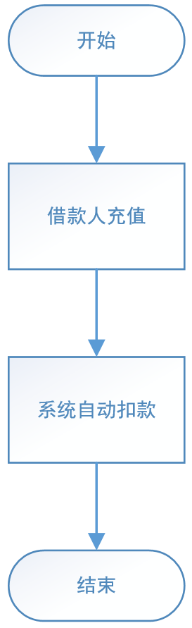

## 2. 需求分析

用户还款一共涉及到三个服务：还款服务、存管代理服务和银行存管系统。其中银行存管系统还是像之前一样不用开发，直接使用即可。用户还款业务跟前端没有关系，由定时任务驱动业务执行，到期自动还款。

### 2.1. 业务流程图

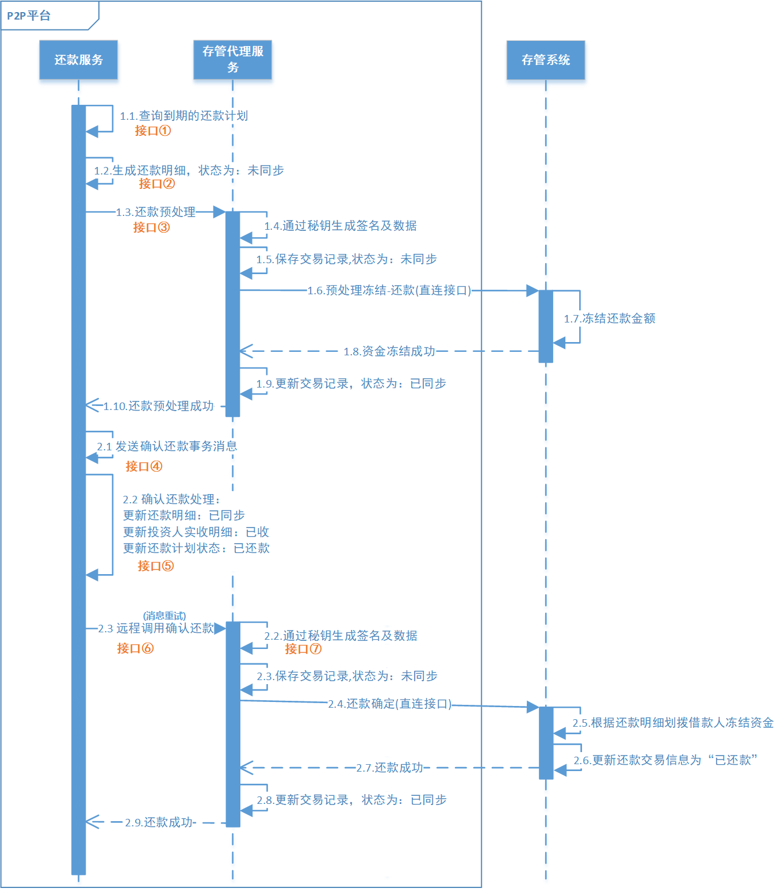

### 2.2. 业务流程简述

**第一阶段：生成还款明细（图中1.1-1.2）**

1. 还款服务每天定时查询到期的还款计划
2. 根据还款计划生成还款明细，状态为：未同步

**第二阶段：还款预处理（图中1.3-1.10）**

1. 还款服务通过 feign 请求存管代理服务进行还款预处理
2. 存管代理服务生成签名及数据，并保存交易记录(未同步)
3. 存管代理服务请求银行存管系统进行资金冻结
4. 银行存管系统返回预处理冻结结果给存管代理服务
5. 存管代理服务更新交易记录为：已同步，返回预处理结果给还款服务

**第三阶段：确认还款（图中2.1-2.2）**

1. 还款服务发送确认还款事务消息(半消息)
2. 还款服务执行处理本地事务：
    - 更新还款明细为：已同步
    - 更新投资人实收明细为：已收
    - 更新还款计划状态为：已还款
3. 还款服务根据本地事务执行结果发生 commit 或 rollback

**第四阶段：还款成功（图中2.3-2.9）**

1. 还款服务消费消息，并通过 feign 请求存管代理服务进行确认还款
2. 存管代理服务生成签名及数据，并保存交易记录（未同步）
3. 请求银行存管系统进行还款确定
4. 银行存管系统返回还款成功
5. 存管代理服务更新交易记录为：已同步，并返回结果给还款服务
6. 如果这个阶段处理失败，还款服务会重试消费

## 3. 第一阶段：还款服务生成还款明细

> 此部分为还款服务的功能

### 3.1. 接口定义

> 此部分接口方法全部定义在 wanxinp2p-repayment-service 还款微服务工程中

#### 3.1.1. 还款服务查询到期还款计划接口

在 `RepaymentService` 接口中新增 `selectDueRepayment` 查询所有到期的还款计划方法

```java
/**
 * 查询所有到期的还款计划
 *
 * @param date 格式：yyyy-MM-dd
 * @return
 */
List<RepaymentPlan> selectDueRepayment(String date);
```

#### 3.1.2. 还款服务生成还款明细接口

在 `RepaymentService` 接口中新增 `saveRepaymentDetail` 根据还款计划生成还款明细并保存方法

```java
/**
 * 根据还款计划生成还款明细并保存
 *
 * @param repaymentPlan 还款计划
 * @return
 */
RepaymentDetail saveRepaymentDetail(RepaymentPlan repaymentPlan);
```

### 3.2. 还款服务查询到期还款计划

接口功能描述：根据日期查询所有到期的还款计划

#### 3.2.1. 数据访问层

在 `PlanMapper` 接口中定义 `selectDueRepayment` 方法

```java
/**
 * 根据日期查询所有还款计划
 *
 * @param date
 * @return
 */
List<RepaymentPlan> selectDueRepayment(@Param("date") String date);
```

修改 PlanMapper.xml 映射文件，增加相应的 sql 语句

```xml
<select id="selectDueRepayment" resultType="com.moon.wanxinp2p.repayment.entity.RepaymentPlan">
    SELECT
        *
    FROM
        repayment_plan
    WHERE
        DATE_FORMAT( SHOULD_REPAYMENT_DATE, '%Y-%m-%d' ) = #{date}
      AND REPAYMENT_STATUS = '0';
</select>
```

#### 3.2.2. 业务层

在 `RepaymentServiceImpl` 类中实现方法，调用 mapper 接口方法

```java
@Override
public List<RepaymentPlan> selectDueRepayment(String date) {
    return planMapper.selectDueRepayment(date);
}
```

### 3.3. 还款服务生成还款明细

接口功能描述：

1. 根据还款计划 id 查询是否已存在记录
2. 根据查询结果判断是否生成还款明细

#### 3.3.1. 数据访问层

创建操作 repayment_detail 表的 `RepaymentDetailMapper` 接口，继承 mp 的 `BaseMapper` 接口

```java
public interface RepaymentDetailMapper extends BaseMapper<RepaymentDetail> {
}
```

创建 `RepaymentDetailMapper` 的映射文件 RepaymentDetailMapper.xml

```xml
<?xml version="1.0" encoding="UTF-8" ?>
<!DOCTYPE mapper PUBLIC "-//mybatis.org//DTD Mapper 3.0//EN" "http://mybatis.org/dtd/mybatis-3-mapper.dtd">
<mapper namespace="com.moon.wanxinp2p.repayment.mapper.RepaymentDetailMapper">
</mapper>
```

#### 3.3.2. 业务层

修改业务层 `RepaymentServiceImpl` 类中实现生成还款明细功能方法

```java
@Override
public RepaymentDetail saveRepaymentDetail(RepaymentPlan repaymentPlan) {
    // 根据还款计划查询还款明细
    RepaymentDetail repaymentDetail = repaymentDetailMapper.selectOne(
            Wrappers.<RepaymentDetail>lambdaQuery()
                    .eq(RepaymentDetail::getRepaymentPlanId, repaymentPlan.getId())
    );

    // 如果数据库不存在记录，则新增一条还款明细并返回
    return Optional.ofNullable(repaymentDetail).orElseGet(() -> {
        RepaymentDetail detail = new RepaymentDetail();
        // 还款计划项标识
        detail.setRepaymentPlanId(repaymentPlan.getId());
        // 实还本息
        detail.setAmount(repaymentPlan.getAmount());
        // 实际还款时间
        detail.setRepaymentDate(LocalDateTime.now());
        // 请求流水号
        detail.setRequestNo(CodeNoUtil.getNo(CodePrefixCode.CODE_REQUEST_PREFIX));
        // 未同步
        detail.setStatus(StatusCode.STATUS_OUT.getCode());
        // 保存数据
        repaymentDetailMapper.insert(detail);
        return detail;
    });
}
```

### 3.4. 业务触发入口

#### 3.4.1. 业务层入口方法

由于需要调用业务层实现用户还款功能，所以需要在业务层 `RepaymentService` 接口中定义统一入口方法，将来在此方法中调用整个还款业务流程的所有业务方法

```java
/**
 * 执行还款
 *
 * @param date 还款日期
 */
void executeRepayment(String date);
```

在业务层实现类 `RepaymentServiceImpl` 中实现该方法：

```java
@Override
public void executeRepayment(String date) {
    // 查询到期的还款计划
    List<RepaymentPlan> repaymentPlanList = selectDueRepayment(date);

    // 循环生成还款明细
    repaymentPlanList.forEach(repaymentPlan -> {
        RepaymentDetail repaymentDetail = saveRepaymentDetail(repaymentPlan);
        // TODO: 待补充还款流程
    });
    // TODO: 待补充还款流程
}
```

#### 3.4.2. 入口控制层接口

将来用户还款功能会由定时任务触发，但是目前定时任务尚未开发，为了测试方便，在 `RepaymentController` 类中定义一个 `executeRepayment` 方法，后面也可以通过发请求去手动触发用户还款功能的执行。

```java
/**
 * 手动触发用户还款
 *
 * @param date
 */
@ApiOperation("手动触发用户还款")
@GetMapping("/execute-repayment/{date}")
public void executeRepayment(@PathVariable String date) {
    repaymentService.executeRepayment(date);
}
```

### 3.5. 功能测试

启动 apollo 服务与还款微服务，使用 postman 请求还款功能入口

```json
GET http://127.0.0.1:53080/repayment/execute-repayment/2022-04-26
```

测试是否新增还款明细记录

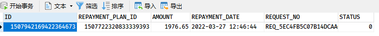

## 4. 第二阶段：还款预处理

> 此部分接口方法全部定义在 wanxinp2p-repayment-service 还款微服务工程中

### 4.1. 接口定义

#### 4.1.1. 远程调用存管代理服务 Feign 代理接口

创建远程调用存管代理服务的 Feign 代理接口。此接口是远程调用 wanxinp2p-depository-agent-service 工程的 `DepositoryAgentController.userAutoPreTransaction` 方法，*该方法在之前用户投标的功能中已经实现，现在直接调用即可*

```java
@FeignClient(name = "depository-agent-service", path = "/depository-agent")
public interface DepositoryAgentApiAgent {
    /**
     * 银行存管预处理
     *
     * @param userAutoPreTransactionRequest
     * @return
     */
    @PostMapping("/l/user-auto-pre-transaction")
    RestResponse<String> userAutoPreTransaction(@RequestBody UserAutoPreTransactionRequest userAutoPreTransactionRequest);
}
```

#### 4.1.2. 还款预处理接口

在 `RepaymentService` 接口中新增 `preRepayment` 还款预处理方法

```java
/**
 * 还款预处理：冻结借款人应还金额
 *
 * @param repaymentPlan 还款计划
 * @param preRequestNo  请求流水号
 * @return
 */
boolean preRepayment(RepaymentPlan repaymentPlan, String preRequestNo);
```

### 4.2. 功能实现

修改 `RepaymentServiceImpl` 类，实现 `preRepayment` 方法

```java
@Autowired
private DepositoryAgentApiAgent depositoryAgentApiAgent;

@Override
public boolean preRepayment(RepaymentPlan repaymentPlan, String preRequestNo) {
    // 1. 构造还款预处理请求数据
    UserAutoPreTransactionRequest userAutoPreTransactionRequest = new UserAutoPreTransactionRequest();
    // 冻结金额
    userAutoPreTransactionRequest.setAmount(repaymentPlan.getAmount());
    // 预处理业务类型
    userAutoPreTransactionRequest.setBizType(PreprocessBusinessTypeCode.REPAYMENT.getCode());
    // 标的号
    userAutoPreTransactionRequest.setProjectNo(repaymentPlan.getProjectNo());
    // 请求流水号
    userAutoPreTransactionRequest.setRequestNo(preRequestNo);
    // 标的用户编码
    userAutoPreTransactionRequest.setUserNo(repaymentPlan.getUserNo());
    // 关联业务实体标识
    userAutoPreTransactionRequest.setId(repaymentPlan.getId());

    // 2. 远程请求存管代理服务
    RestResponse<String> restResponse = depositoryAgentApiAgent.userAutoPreTransaction(userAutoPreTransactionRequest);

    // 3. 返回结果
    return DepositoryReturnCode.RETURN_CODE_00000.getCode().equals(restResponse.getResult());
}
```

在 `RepaymentServiceImpl.executeRepayment` 业务触发入口方法中，增加调用 `preRepayment` 方法执行还款预处理

```java
@Override
public void executeRepayment(String date) {
    // 查询到期的还款计划
    List<RepaymentPlan> repaymentPlanList = selectDueRepayment(date);

    // 循环生成还款明细
    repaymentPlanList.forEach(repaymentPlan -> {
        RepaymentDetail repaymentDetail = saveRepaymentDetail(repaymentPlan);

        // 向存管代理发起还款预处理
        String requestNo = repaymentDetail.getRequestNo();
        boolean result = preRepayment(repaymentPlan, requestNo);
        if (result) {
            log.info("executeRepayment 发起还款预处理成功，请求流水号：{}", requestNo);
            // TODO: 待补充还款流程
        }
    });
    // TODO: 待补充还款流程
}
```

### 4.3. 功能测试

#### 4.3.1. 启动服务

1. 启动 Apollo 服务
2. 后端需要启动：
    - wanxinp2p-discover-server 微服务
    - wanxinp2p-depository-agent-service 微服务
    - wanxinp2p-repayment-service 微服务
    - wanxindepository 银行微服务

#### 4.3.2. 测试步骤

使用 postman 请求还款功能入口

```json
GET http://127.0.0.1:53080/repayment/execute-repayment/2022-04-26
```

请求测试后，查看以下数据库表是否有新增相应的数据

- 还款服务 p2p_repayment 数据库的 repayment_detail 表，是否新增还款明细记录

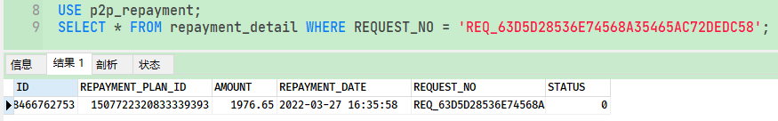

- 存管代理服务 p2p_depository_agent 数据库的 depository_record 表，是否新增预处理记录

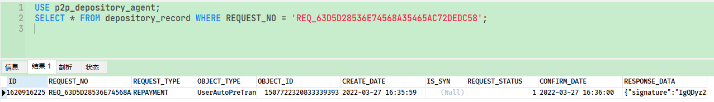

- p2p_bank_depository 数据库的 request_details、balance_details 是否新增数据

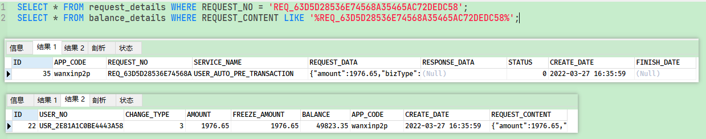

## 5. 第三阶段：确认还款

第三阶段和第四阶段的业务存在分布式事务问题，即：第三阶段业务执行成功，那么第四阶段业务也必须成功，这里通过 RocketMQ 可靠消息最终一致性来解决事务问题，具体如下图所示：

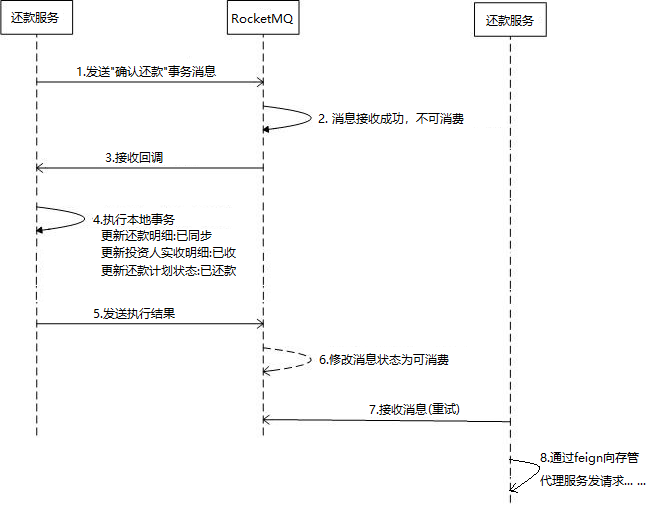

<font color=red>**值得注意的是，在此业务中，还款服务既是消息的生产者，也是消息的消费者**</font>

### 5.1. 确认还款事务消息生产接口

#### 5.1.1. 还款信息实体类

在 wanxinp2p-api 工程的 repayment 模块中创建还款请求信息与还款明细请求信息

```java
@Data
@ApiModel(value = "RepaymentRequest", description = "还款请求信息")
public class RepaymentRequest {
    @ApiModelProperty("请求流水号")
    private String requestNo;
    @ApiModelProperty("预处理业务流水号")
    private String preRequestNo;
    @ApiModelProperty("标的编码")
    private String projectNo;
    @ApiModelProperty("平台佣金 -- 具体金额")
    private BigDecimal commission;
    @ApiModelProperty("放款明细")
    private List<RepaymentDetailRequest> details;
    @ApiModelProperty("业务id")
    private Long id;
    @ApiModelProperty("还款总额")
    private BigDecimal amount;
}
```

```java
@Data
@ApiModel(value = "RepaymentDetailRequest", description = "还款明细请求信息")
public class RepaymentDetailRequest {
    @ApiModelProperty("投资人用户编码")
    private String userNo;
    @ApiModelProperty("向投资人收取的佣金")
    private BigDecimal commission;
    @ApiModelProperty("派息")
    private BigDecimal dividend;
    @ApiModelProperty("投资人应得本金")
    private BigDecimal amount;
    @ApiModelProperty("投资人应得利息")
    private BigDecimal interest;
}
```

#### 5.1.2. 消息生产者

在 `P2PMqConstants` 类中新增确认还款的消息主题与生产者分组的常量

```java
/**
 * 确认还款消息主题
 */
public final static String TOPIC_CONFIRM_REPAYMENT = "TP_CONFIRM_REPAYMENT";
/**
 * 确认还款事务生产者分组
 */
public final static String TX_PRODUCER_GROUP_CONFIRM_REPAYMENT = "PID_CONFIRM_REPAYMENT";
```

在 wanxinp2p-repayment-service 工程的 message 包中新建 `RepaymentProducer` 类，实现发送“确认还款”事务消息

```java
@Component
public class RepaymentProducer {

    @Autowired
    private RocketMQTemplate rocketMQTemplate;

    public void confirmRepayment(RepaymentPlan repaymentPlan, RepaymentRequest repaymentRequest) {
        // 1.构造消息
        JSONObject jsonObject = new JSONObject();
        jsonObject.put("repaymentPlan", repaymentPlan);
        jsonObject.put("repaymentRequest", repaymentRequest);

        Message<String> msg = MessageBuilder.withPayload(jsonObject.toJSONString()).build();

        // 2.发送消息
        rocketMQTemplate.sendMessageInTransaction(P2PMqConstants.TX_PRODUCER_GROUP_CONFIRM_REPAYMENT,
                P2PMqConstants.TOPIC_CONFIRM_REPAYMENT, msg, null);
    }
}
```

### 5.2. 确认还款处理接口

接口描述：

1. 更新还款明细为：已同步
2. 更新应收明细状态为：已收
3. 更新还款计划状态：已还款

#### 5.2.1. 数据访问层

因为该功能中需要操作 receivable_detail 表，所以需要定义操作该表的数据访问层接口

在 wanxinp2p-repayment-service 工程中创建操作 receivable_detail 表的 `ReceivableDetailMapper` 接口，继承 mp 的 `BaseMapper` 接口

```java
public interface ReceivableDetailMapper extends BaseMapper<ReceivableDetail> {
}
```

创建 `ReceivableDetailMapper` 的映射文件 ReceivableDetailMapper.xml

```xml
<?xml version="1.0" encoding="UTF-8" ?>
<!DOCTYPE mapper PUBLIC "-//mybatis.org//DTD Mapper 3.0//EN" "http://mybatis.org/dtd/mybatis-3-mapper.dtd">
<mapper namespace="com.moon.wanxinp2p.repayment.mapper.ReceivableDetailMapper">
</mapper>
```

#### 5.2.2. 业务层

在 `RepaymentService` 接口中，新增 `confirmRepayment` 确认还款方法：

```java
/**
 * 确认还款处理
 *
 * @param repaymentPlan
 * @param repaymentRequest
 * @return
 */
boolean confirmRepayment(RepaymentPlan repaymentPlan, RepaymentRequest repaymentRequest);
```

修改 `RepaymentServiceImpl` 类，实现 `confirmRepayment` 方法

```java
@Autowired
private ReceivableDetailMapper receivableDetailMapper;

@Override
@Transactional // 涉及多个表更新，需要本地事务控制
public boolean confirmRepayment(RepaymentPlan repaymentPlan, RepaymentRequest repaymentRequest) {
    // 注意，这里取预处理的请求流水号，因为生成还款明细记录是在请求预处理之前
    String requestNo = repaymentRequest.getPreRequestNo();
    // 1. 更新还款明细（repayment_detail 表的 STATUS 字段）为：已同步
    repaymentDetailMapper.update(null,
            Wrappers.<RepaymentDetail>lambdaUpdate()
                    .set(RepaymentDetail::getStatus, StatusCode.STATUS_IN.getCode())
                    .eq(RepaymentDetail::getRequestNo, requestNo)
    );

    // 根据还款计划id，查询应收计划
    List<ReceivablePlan> rereceivablePlanList = receivablePlanMapper.selectList(
            Wrappers.<ReceivablePlan>lambdaQuery().eq(ReceivablePlan::getRepaymentId, repaymentPlan.getId())
    );
    rereceivablePlanList.forEach(receivablePlan -> {
        // 2.1 更新应收计划状态（receivable_plan 表的 RECEIVABLE_STATUS 字段）为：已收
        receivablePlan.setReceivableStatus(1);
        receivablePlanMapper.updateById(receivablePlan);

        // 2.2 保存应收明细到 receivable_detail
        // 构造应收明细
        ReceivableDetail receivableDetail = new ReceivableDetail();
        // 应收项标识
        receivableDetail.setReceivableId(receivablePlan.getId());
        // 实收本息
        receivableDetail.setAmount(receivablePlan.getAmount());
        // 实收时间
        receivableDetail.setReceivableDate(DateUtil.now());
        // 保存投资人应收明细
        receivableDetailMapper.insert(receivableDetail);
    });

    // 3. 更新还款计划状态（repayment_plan 表的 REPAYMENT_STATUS 字段）：已还款
    repaymentPlan.setRepaymentStatus("1");
    return planMapper.updateById(repaymentPlan) > 0;
}
```

### 5.3. 确认还款事务消息监听类

在 message 包中创建 RocketMQ 事务消息监听器 `ConfirmRepaymentTransactionListener`。分别实现实现调用本地事务和进行事务回查。

```java
@Component
@RocketMQTransactionListener(txProducerGroup = P2PMqConstants.TX_PRODUCER_GROUP_CONFIRM_REPAYMENT)
@Log4j2
public class ConfirmRepaymentTransactionListener implements RocketMQLocalTransactionListener {

    @Autowired
    private RepaymentService repaymentService;
    @Autowired
    private PlanMapper planMapper;

    /**
     * 执行本地事务，即修改还款计划、还款明细、应收明细等状态
     *
     * @param msg
     * @param arg
     * @return
     */
    @Override
    public RocketMQLocalTransactionState executeLocalTransaction(Message msg, Object arg) {
        log.info("确认还款执行本地事务");
        // 1. 解析消息
        JSONObject jsonObject = JSON.parseObject(new String((byte[]) msg.getPayload()));
        RepaymentPlan repaymentPlan = JSONObject.parseObject(jsonObject.getString("repaymentPlan"), RepaymentPlan.class);
        RepaymentRequest repaymentRequest = JSONObject.parseObject(jsonObject.getString("repaymentRequest"), RepaymentRequest.class);
        // 2. 执行本地事务，并返回结果
        return repaymentService.confirmRepayment(repaymentPlan, repaymentRequest) ?
                RocketMQLocalTransactionState.COMMIT : RocketMQLocalTransactionState.ROLLBACK;
    }

    /**
     * 执行事务回查
     *
     * @param msg
     * @return
     */
    @Override
    public RocketMQLocalTransactionState checkLocalTransaction(Message msg) {
        log.info("确认还款执行事务回查");
        // 1.解析消息
        JSONObject jsonObject = JSON.parseObject(new String((byte[]) msg.getPayload()));
        RepaymentPlan repaymentPlan = JSONObject.parseObject(jsonObject.getString("repaymentPlan"), RepaymentPlan.class);

        // 2.回查事务状态，
        RepaymentPlan repaymentPlanDb = planMapper.selectById(repaymentPlan.getId());

        // 3.返回结果，根据查询出来的还款计划的状态来来判断是否新增成功
        if (repaymentPlanDb != null && "1".equals(repaymentPlanDb.getRepaymentStatus())) {
            return RocketMQLocalTransactionState.COMMIT;
        } else {
            return RocketMQLocalTransactionState.ROLLBACK;
        }
    }
}
```

> 注：其中 `@RocketMQTransactionListener` 注解 `txProducerGroup` 属性是用于指定监听的消息分组名称，与 `RepaymentProducer` 消息发送类中发送消息的分组名称一致

### 5.4. 业务触发入口发送确认还款消息

在 `RepaymentServiceImpl.executeRepayment` 业务入口方法中，调用 `RepaymentProducer` 发送确认还款的事务消息：

```java
@Autowired
private RepaymentProducer repaymentProducer;

@Override
public void executeRepayment(String date) {
    // 查询到期的还款计划
    List<RepaymentPlan> repaymentPlanList = selectDueRepayment(date);

    // 循环生成还款明细
    repaymentPlanList.forEach(repaymentPlan -> {
        RepaymentDetail repaymentDetail = saveRepaymentDetail(repaymentPlan);

        // 向存管代理发起还款预处理
        String preRequestNo = repaymentDetail.getRequestNo(); // 预处理请求流水号
        boolean result = preRepayment(repaymentPlan, preRequestNo);
        if (result) {
            log.info("executeRepayment 发起还款预处理成功，请求流水号：{}", preRequestNo);
            // 构造还款信息请求数据（用于本地事务和发送给存管代理）
            RepaymentRequest repaymentRequest = generateRepaymentRequest(repaymentPlan, preRequestNo);
            // 发送确认还款事务消息
            repaymentProducer.confirmRepayment(repaymentPlan, repaymentRequest);
            // TODO: 待补充还款流程
        }
    });
    // TODO: 待补充还款流程
}

/**
 * 构造还款信息请求数据
 */
private RepaymentRequest generateRepaymentRequest(RepaymentPlan repaymentPlan, String preRequestNo) {
    // 根据还款计划id，查询应收计划
    List<ReceivablePlan> receivablePlanList = receivablePlanMapper.selectList(
            Wrappers.<ReceivablePlan>lambdaQuery().eq(ReceivablePlan::getRepaymentId, repaymentPlan.getId())
    );

    RepaymentRequest repaymentRequest = new RepaymentRequest();
    // 还款总额
    repaymentRequest.setAmount(repaymentPlan.getAmount());
    // 业务实体id
    repaymentRequest.setId(repaymentPlan.getId());
    // 向借款人收取的佣金
    repaymentRequest.setCommission(repaymentPlan.getCommission());
    // 标的编码
    repaymentRequest.setProjectNo(repaymentPlan.getProjectNo());
    // 请求流水号
    repaymentRequest.setRequestNo(CodeNoUtil.getNo(CodePrefixCode.CODE_REQUEST_PREFIX));
    // 预处理业务流水号
    repaymentRequest.setPreRequestNo(preRequestNo);

    // 创建还款明细请求数据
    List<RepaymentDetailRequest> repaymentDetailRequestList = receivablePlanList.stream()
            .map(receivablePlan -> {
                RepaymentDetailRequest repaymentDetailRequest = new RepaymentDetailRequest();
                // 投资人用户编码
                repaymentDetailRequest.setUserNo(receivablePlan.getUserNo());
                // 向投资人收取的佣金
                repaymentDetailRequest.setCommission(receivablePlan.getCommission());
                // 投资人应得本金
                repaymentDetailRequest.setAmount(receivablePlan.getPrincipal());
                // 投资人应得利息
                repaymentDetailRequest.setInterest(receivablePlan.getInterest());
                return repaymentDetailRequest;
            }).collect(Collectors.toList());
    // 设置还款明细列表
    repaymentRequest.setDetails(repaymentDetailRequestList);

    return repaymentRequest;
}
```

## 6. 第四阶段：还款成功

### 6.1. 存管代理确认还款接口定义

在 wanxinp2p-api 工程的 `DepositoryAgentApi` 接口中，新增 `confirmRepayment` 确认还款方法：

```java
/**
 * 还款确认
 *
 * @param repaymentRequest 还款信息
 * @return
 */
RestResponse<String> confirmRepayment(RepaymentRequest repaymentRequest);
```

### 6.2. 存管代理服务确认还款业务实现

接口描述：

1. 请求存管系统进行确认还款
2. 返回结果给还款服务

#### 6.2.1. 业务层

修改存管代理服务中的 `DepositoryRecordService` 接口，新增 `confirmRepayment` 确认还款方法

```java
/**
 * 确认还款
 *
 * @param repaymentRequest
 * @return
 */
DepositoryResponseDTO<DepositoryBaseResponse> confirmRepayment(RepaymentRequest repaymentRequest);
```

修改 `DepositoryRecordServiceImpl` 类实现该方法

```java
@Override
public DepositoryResponseDTO<DepositoryBaseResponse> confirmRepayment(RepaymentRequest repaymentRequest) {
    // 创建 DepositoryRecord 记录对象，设置必要的属性
    String requestNo = repaymentRequest.getRequestNo();
    DepositoryRecord depositoryRecord = new DepositoryRecord()
            .setRequestNo(requestNo) // 设置请求流水号
            .setRequestType(PreprocessBusinessTypeCode.REPAYMENT.getCode()) // 设置请求类型
            .setObjectType("Repayment") // 设置关联业务实体类型
            .setObjectId(repaymentRequest.getId()); // 设置关联业务实体标识

    // 保存交易记录（实现幂等性）
    DepositoryResponseDTO<DepositoryBaseResponse> responseDTO = handleIdempotent(depositoryRecord);
    if (responseDTO != null) {
        return responseDTO;
    }

    // 重新查询交易记录
    depositoryRecord = getEntityByRequestNo(requestNo);

    // 对请求业务数据报文进行 base64 处理
    String jsonString = JSON.toJSONString(repaymentRequest);
    String reqData = EncryptUtil.encodeUTF8StringBase64(jsonString);

    // 使用 OKHttpClient 发送 Http 请求向银行存管系统发送数据(确认还款)，根据结果修改状态并返回结果
    return sendHttpGet("CONFIRM_REPAYMENT", reqData, depositoryRecord);
}
```

#### 6.2.2. 控制层

修改 `DepositoryAgentController` 类，指定请求 url 与调用业务层方法

```java
@ApiOperation(value = "确认还款")
@ApiImplicitParam(name = "repaymentRequest", value = "还款信息", required = true,
        dataType = "RepaymentRequest", paramType = "body")
@PostMapping("l/confirm-repayment")
@Override
public RestResponse<String> confirmRepayment(@RequestBody RepaymentRequest repaymentRequest) {
    return getRestResponse(depositoryRecordService.confirmRepayment(repaymentRequest));
}
```

### 6.3. 还款服务调用存管代理确认还款业务接口

在还款微服务中新增业务方法，接口描述：

1. 请求存管代理服务进行确认还款
2. 根据返回结果处理后续流程

#### 6.3.1. 存管代理 feign 代理

在 wanxinp2p-repayment-service 服务 `DepositoryAgentApiAgent` 接口中，新增 `confirmRepayment` 方法，用于向存管代理服务发请求

```java
/**
 * 银行存管确认还款
 *
 * @param repaymentRequest
 * @return
 */
@PostMapping("/l/confirm-repayment")
RestResponse<String> confirmRepayment(@RequestBody RepaymentRequest repaymentRequest);
```

#### 6.3.2. 业务层

修改 `RepaymentService` 接口，新增 `invokeConfirmRepayment` 调用存管代理确认还款方法。

```java
/**
 * 远程调用确认还款接口
 *
 * @param repaymentPlan
 * @param repaymentRequest
 */
void invokeConfirmRepayment(RepaymentPlan repaymentPlan, RepaymentRequest repaymentRequest);
```

修改 `RepaymentServiceImpl` 类实现方法

```java
@Override
public void invokeConfirmRepayment(RepaymentPlan repaymentPlan, RepaymentRequest repaymentRequest) {
    // 远程调用存管代理服务确认还款方法
    RestResponse<String> restResponse = depositoryAgentApiAgent.confirmRepayment(repaymentRequest);
    if (!DepositoryReturnCode.RETURN_CODE_00000.getCode().equals(restResponse.getResult())) {
        // 根据响应码判断是否成功，失败抛出业务异常
        throw new BusinessException(RepaymentErrorCode.E_170105);
    }
}
```

### 6.4. 还款服务消费消息监听类

在 wanxinp2p-repayment-service 工程的 message 包中定义 `ConfirmRepaymentConsumer` 类，用于接收消息，并向存管代理服务发起确认还款请求。该类需要实现 `org.apache.rocketmq.spring.core.RocketMQListener` 接口，并标识 `@RocketMQMessageListener` 注解，其中 `topic` 属性用于指定消息的主题，需要与确认还款时发送的主题一致。

```java
@Component
@RocketMQMessageListener(topic = P2PMqConstants.TOPIC_CONFIRM_REPAYMENT, consumerGroup = "CID_CONFIRM_REPAYMENT")
@Log4j2
public class ConfirmRepaymentConsumer implements RocketMQListener<String> {

    @Autowired
    private RepaymentService repaymentService;

    @Override
    public void onMessage(String message) {
        log.info("确认还款消息监听器开始执行....");
        // 1.解析消息
        JSONObject jsonObject = JSON.parseObject(message);
        RepaymentPlan repaymentPlan = JSONObject.parseObject(jsonObject.getString("repaymentPlan"), RepaymentPlan.class);
        RepaymentRequest repaymentRequest = JSONObject.parseObject(jsonObject.getString("repaymentRequest"), RepaymentRequest.class);

        // 2.执行本地业务，身存管代理发送确认还款请求
        repaymentService.invokeConfirmRepayment(repaymentPlan, repaymentRequest);
    }
}
```

### 6.5. 全流程功能测试

#### 6.5.1. 启动服务

1. 启动 Apollo 服务
2. 启动 RocketMQ 服务
3. 后端需要启动：
    - wanxinp2p-discover-server 微服务
    - wanxinp2p-depository-agent-service 微服务
    - wanxinp2p-repayment-service 微服务
    - wanxindepository 银行微服务

#### 6.5.2. 测试步骤

使用 postman 请求还款功能入口

```json
GET http://127.0.0.1:53080/repayment/execute-repayment/2022-04-26
```

1. 发起请求后，查询 p2p_repayment 的 repayment_detail 表是否生成还款明细

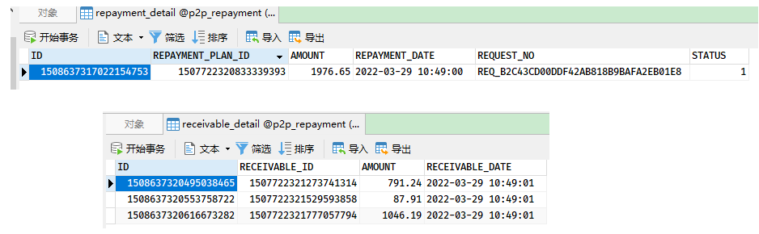

2. 存管代理服务 p2p_depository_agent 的 depository_record 是否生成预处理的交易记录


3. 还款微服务 p2p_repayment 相应的还款明细、计划、应收计划等状态是否修改

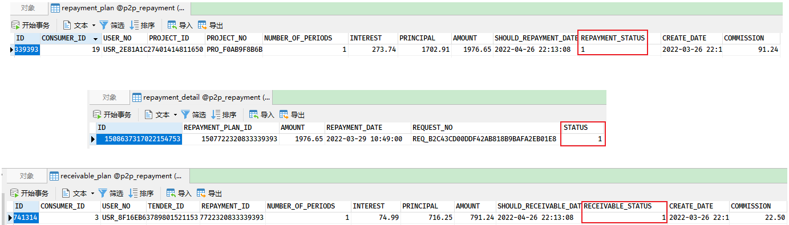

4. 存管代理服务 p2p_depository_agent 的 depository_record 是否生成确认收款的交易记录

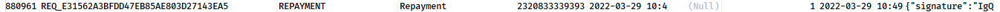

观察事务消息的处理

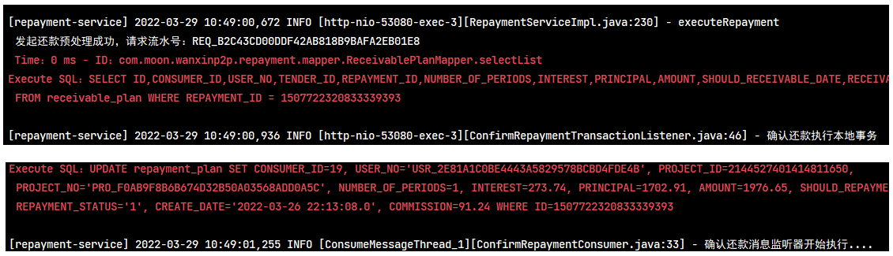

## 7. 定时还款任务

### 7.1. 分布式任务调度 Elastic-job

Elastic-job 基础使用详见[《Elastic-Job 分布式调度解决方案》笔记](/07-分布式架构&微服务架构/10-分布式任务调度/02-ElasticJob)


