# 第12章 投标充值

## 1. 充值业务概述

用户在平台开户后会在银行存管系统中有一个虚拟银行账号，用户通过万信金融把储蓄卡中的金额转入到银行存管系统的虚拟银行账户中，即为充值。就好比你把银行卡中的金额转入到支付宝或微信中是一个道理。投资人在投标前需要先充值。


### 1.1. 充值流程图


### 1.2. 操作流程图

1. 用户在'我的'页面点击'账户余额'


2. 点击充值(如果用户尚未开户，会被自动跳转到开户界面)，填写充值金额


3. 确认信息并输入开户时设置的交易密码


4. 充值成功


## 2. 需求分析

### 2.1. 业务流程时序图


### 2.2. 业务流程简述

**第一阶段：生成充值数据(图中1.1-1.7)**

1. 前端填写充值信息(如果用户尚未开户，会被自动跳转到开户界面)
2. 前端请求用户中心服务充值
3. 用户中心服务准备充值数据
4. 用户中心服务请求存管代理服务生成交易记录（未同步），并对充值数据进行签名
5. 存管代理服务将签名后的充值数据返回给用户中心
6. 用户中心将充值数据返回给前端

**第二阶段：请求充值(图中2.1-2.8)**

7. 前端携带充值信息请求银行存管系统
8. 银行存管系统向前端返回充值信息确定页面
9. 前端确认完成提交充值请求到银行存管系统
10. 银行存管系统接收充值数据并进行校验，校验交易密码，无误后则将银行卡余额进行扣减

**第三阶段：充值结果通知(图中3.1-3.4)**

11. 充值成功后银行存管系统异步通知存管代理服务
12. 存管代理服务接收到充值成功通知更新交易状态为同步
13. 存管代理服务通知用户中心服务
14. 用户中心服务接收到充值成功的消息后保存充值信息


## 3. 第一阶段：生成充值数据

### 3.1. 需求分析

- 参考前面的“充值业务流程图(图中1.1-1.7）”，熟悉该阶段的具体需求和业务流程
- 查阅《银行存管系统接口说明.pdf》中的“充值”接口说明，熟悉接口接收参数和返回值

### 3.2. 接口定义

> 以下接口定义均在 wanxinp2p-api 工程中

#### 3.2.1. 用户中心生成充值数据接口

在 `ConsumerApi` 接口中新增 `createRechargeRecord` 生成充值数据方法

```java
/**
 * 生成充值请求数据
 *
 * @param amount      充值金额
 * @param callbackUrl 回调地址
 * @return
 */
RestResponse<GatewayRequest> createRechargeRecord(String amount, String callbackUrl);
```

#### 3.2.2. 存管代理生成充值数据接口

在 depository 模块中创建生成充值请求实体类 `RechargeRequest`

```java
@Data
@Accessors(chain = true)
@ApiModel("用户充值请求信息")
public class RechargeRequest {
    @ApiModelProperty("标识")
    private Long id;
    @ApiModelProperty("用户编号")
    private String userNo;
    @ApiModelProperty("请求流水号")
    private String requestNo;
    @ApiModelProperty("充值金额")
    private BigDecimal amount;
    @ApiModelProperty("页面回调URL")
    private String callbackUrl;
}
```

在 `DepositoryAgentApi` 接口中新增 `createRechargeRecord` 生成充值请求数据方法：

```java
/**
 * 用户充值
 *
 * @param rechargeRequest 用户充值请求数据
 * @return
 */
RestResponse<GatewayRequest> createRechargeRecord(RechargeRequest rechargeRequest);
```

### 3.3. 用户中心生成充值功能实现

在 wanxinp2p-consumer-service 工程中实现接口，逻辑描述：

1. 接收用户填写的充值数据
2. 用户中心保存充值信息
3. 请求存管代理生成签名数据
4. 将签名数据返回给前端

#### 3.3.1. 数据访问层接口

- 在 entity 包中创建 p2p_consumer 数据库的 recharge_record 表的实体类 `RechargeRecord`

```java
@Data
@TableName("recharge_record")
public class RechargeRecord implements Serializable {
    private static final long serialVersionUID = 5679317419567789297L;
    /**
     * 主键
     */
    @TableId(value = "ID", type = IdType.AUTO)
    private Long id;
    /**
     * 用户标识
     */
    @TableField("CONSUMER_ID")
    private Long consumerId;
    /**
     * 用户编码,生成唯一,用户在存管系统标识
     */
    @TableField("USER_NO")
    private String userNo;
    /**
     * 金额
     */
    @TableField("AMOUNT")
    private BigDecimal amount;
    /**
     * 触发时间
     */
    @TableField("CREATE_DATE")
    private LocalDateTime createDate;
    /**
     * 请求流水号
     */
    @TableField("REQUEST_NO")
    private String requestNo;
    /**
     * 回调状态
     */
    @TableField("CALLBACK_STATUS")
    private Integer callbackStatus;
}
```

- 在 mapper 包中新建 `RechargeRecordMapper` 接口，继承 MP 的 `BaseMapper`：

```java
public interface RechargeRecordMapper extends BaseMapper<RechargeRecord> {
}
```

- 在 `mapper.xml` 包下创建 mapper 映射文件

```xml
<?xml version="1.0" encoding="UTF-8" ?>
<!DOCTYPE mapper PUBLIC "-//mybatis.org//DTD Mapper 3.0//EN" "http://mybatis.org/dtd/mybatis-3-mapper.dtd">
<mapper namespace="com.moon.wanxinp2p.consumer.mapper.RechargeRecordMapper">
</mapper>
```

#### 3.3.2. 存管代理服务远程调用代理

在存管代理 Feign 远程调用代理接口 `DepositoryAgentApiAgent` 中，增加调用生成充值数据的方法

```java
/**
 * 用户充值
 *
 * @param rechargeRequest 用户充值请求数据
 * @return
 */
@PostMapping("/depository-agent/l/recharges")
RestResponse<GatewayRequest> createRechargeRecord(@RequestBody RechargeRequest rechargeRequest);
```

#### 3.3.3. 业务层接口与实现

- 创建 `RechargeRecordService` 接口，继承 MP 的 `IService` 接口。在接口中定义生成充值数据方法

```java
public interface RechargeRecordService extends IService<RechargeRecord> {
    /**
     * 生成充值请求数据
     *
     * @param amount      充值金额
     * @param callbackURL 回调地址
     * @return
     */
    RestResponse<GatewayRequest> createRechargeRecord(String amount, String callbackURL);
}
```

- 创建 `RechargeRecordServiceImpl` 类，继承 MP 的 `ServiceImpl` 类。实现 `createRechargeRecord` 方法

```java
@Service
public class RechargeRecordServiceImpl extends ServiceImpl<RechargeRecordMapper, RechargeRecord> implements RechargeRecordService {

    @Autowired
    private ConsumerService consumerService;

    @Autowired
    private DepositoryAgentApiAgent depositoryAgentApiAgent;

    /**
     * 生成充值请求数据
     *
     * @param amount      充值金额
     * @param callbackURL 回调地址
     * @return
     */
    @Transactional
    @Override
    public RestResponse<GatewayRequest> createRechargeRecord(String amount, String callbackURL) {
        // 1. 使用工具类，从请求域中获取到用户手机号
        ConsumerDTO consumer = consumerService.getByMobile(SecurityUtil.getUser().getMobile());
        // 判断当前用户是否已经开户，根据用户手机号查询用户表
        if (consumer == null) {
            // 用户不存在
            throw new BusinessException(CommonErrorCode.E_140101);
        }
        // 判断 isBindCard（是否绑定银行卡）是否为1
        if (consumer.getIsBindCard() != 1) {
            // 已经绑卡
            throw new BusinessException(ConsumerErrorCode.E_140152);
        }

        // TODO: 目前只对金额做简单的校验，不够全面
        if (StringUtils.isEmpty(amount) || new BigDecimal(amount).compareTo(BigDecimal.ZERO) <= 0) {
            throw new BusinessException(ConsumerErrorCode.E_140133);
        }

        // 2. 接收用户填写的充值数据
        RechargeRecord rechargeRecord = new RechargeRecord();
        rechargeRecord.setConsumerId(consumer.getId());
        rechargeRecord.setUserNo(consumer.getUserNo());
        rechargeRecord.setAmount(new BigDecimal(amount));
        rechargeRecord.setCreateDate(LocalDateTime.now());
        // 生成请求流程方法
        String requestNo = CodeNoUtil.getNo(CodePrefixCode.CODE_REQUEST_PREFIX);
        rechargeRecord.setRequestNo(requestNo);
        // 设置状态为 2-未同步
        rechargeRecord.setCallbackStatus(StatusCode.STATUS_OUT.getCode());

        // 2. 用户中心保存充值信息
        save(rechargeRecord);

        // 3. 准备数据，发起远程调用，请求存管代理生成签名数据
        RechargeRequest rechargeRequest = new RechargeRequest();
        BeanUtils.copyProperties(rechargeRecord, rechargeRequest);
        rechargeRequest.setCallbackUrl(callbackURL); // 设置回调地址

        // 4. 将签名数据返回给前端
        return depositoryAgentApiAgent.createRechargeRecord(rechargeRequest);
    }
}
```

#### 3.3.4. 请求控制层

在 `ConsumerController` 类中实现生成充值记录方法

```java
@Autowired
private RechargeRecordService rechargeRecordService;

@ApiOperation("生成充值请求数据")
@ApiImplicitParams({
        @ApiImplicitParam(name = "amount", value = "金额", required = true, dataType = "String", paramType = "query"),
        @ApiImplicitParam(name = "callbackUrl", value = "通知结果回调Url", required = true, dataType = "String", paramType = "query")})
@GetMapping("/my/recharge-records")
@Override
public RestResponse<GatewayRequest> createRechargeRecord(@RequestParam String amount, @RequestParam String callbackUrl) {
    return rechargeRecordService.createRechargeRecord(amount, callbackUrl);
}
```

### 3.4. 存管代理生成充值功能实现

在 wanxinp2p-depository-agent-service 工程中实现接口，接口逻辑描述：

1. 接收用户中心发来的充值请求数据
2. 保存交易记录
3. 生成签名数据 

#### 3.4.1. 业务层接口与实现

在 wanxinp2p-common 工程的 `ServiceNameConstants` 类中，增加银行存管系统用户充值接口名称常量

```java
/* 存管接口名 - 用户充值接口 */
public final static String NAME_RECHARGE = "RECHARGE";
```

在 `DepositoryRecordService` 接口，并定义 `createRechargeRecord` 保存充值记录方法

```java
/**
 * 保存用户充值记录
 *
 * @param rechargeRequest 充值请求数据
 * @return
 */
GatewayRequest createRechargeRecord(RechargeRequest rechargeRequest);
```

在 `DepositoryRecordServiceImpl` 类中实现该方法，主要实现的业务逻辑是保存充值请求记录与返回数据进行签名加密处理

```java
@Override
public GatewayRequest createRechargeRecord(RechargeRequest rechargeRequest) {
    /* 1.保存充值信息 */
    DepositoryRecord record = new DepositoryRecord();
    // 请求流水号
    record.setRequestNo(rechargeRequest.getRequestNo());
    // 请求类型
    record.setRequestType(DepositoryRequestTypeCode.RECHARGE.getCode());
    // 业务实体类型
    record.setObjectType(CommonConstants.OBJECT_TYPE_CONSUMER);
    // 关联业务实体标识
    record.setObjectId(rechargeRequest.getId());
    // 请求时间
    record.setCreateDate(LocalDateTime.now());
    // 数据同步状态（未）
    record.setRequestStatus(StatusCode.STATUS_OUT.getCode());
    this.save(record); // MP 提供的保存方法

    /* 2.封装返回数据，并进行签名 */
    // 将充值的数据转成json字符串
    String reqData = JSON.toJSONString(rechargeRequest);
    // 调用工具类方法，使用私钥对 json 字符串签名
    String sign = RSAUtil.sign(reqData, configService.getP2pPrivateKey(), CommonConstants.UTF8);

    // 创建接口返回实体
    GatewayRequest gatewayRequest = new GatewayRequest();
    // 请求的存管接口名，详见《银行存管接口说明.pdf》
    gatewayRequest.setServiceName(ServiceNameConstants.NAME_RECHARGE);
    // 平台编号，平台与存管系统签约时获取。配置在apollo上
    gatewayRequest.setPlatformNo(configService.getP2pCode());
    // 业务数据报文，json格式。进行转码
    gatewayRequest.setReqData(EncryptUtil.encodeURL(EncryptUtil.encodeUTF8StringBase64(reqData)));
    // 签名
    gatewayRequest.setSignature(EncryptUtil.encodeURL(sign));
    // 银行存管系统地址。配置在apollo上
    gatewayRequest.setDepositoryUrl(configService.getDepositoryUrl() + "/gateway");
    return gatewayRequest;
}
```

#### 3.4.2. 请求控制层

在 `DepositoryAgentController` 类中实现生成充值记录方法：

```java
@ApiOperation("生成充值请求数据")
@ApiImplicitParam(name = "rechargeRequest", value = "充值信息", required = true,
        dataType = "RechargeRequest", paramType = "body")
@PostMapping("/l/recharges")
@Override
public RestResponse<GatewayRequest> createRechargeRecord(@RequestBody RechargeRequest rechargeRequest) {
    return RestResponse.success(depositoryRecordService.createRechargeRecord(rechargeRequest));
}
```

### 3.5. 功能测试

#### 3.5.1. 启动服务

1. 启动 Apollo 服务
2. 后端需要启动：
    - wanxinp2p-discover-server 微服务
    - wanxinp2p-gateway-server 微服务
    - wanxinp2p-uaa-service 微服务
    - wanxinp2p-consumer-service 微服务
    - wanxinp2p-account-service 微服务
    - wanxinp2p-depository-agent-service 微服务

#### 3.5.2. 测试步骤

1. 使用 postman 进行登陆

- 请求url：

```
POST http://localhost:53010/uaa/oauth/token
```

- 请求参数：

```json
grant_type:password
client_id:wanxin-p2p-web-h5
client_secret:wanxin-h5
username:13800000000
password:13800000000
domain:c
authenticationType:password
```

2. 登陆成功后，使用 postman 测试用户充值功能

- 请求url: 

```json
GET http://127.0.0.1:53010/consumer/my/recharge-records?amount=8989&callbackUrl=http://127.0.0.1:8181/abc
```

- 复制登陆后返回的 token，在请求的 header 中增加授权校验的参数 `Authorization`。*注意：token 字符串前端需要标识 token_type，都在返回的令牌内容中*
- 请求成功后，返回存管代理服务生成的与银行存管系统对接使用签名加密后相关的请求数据

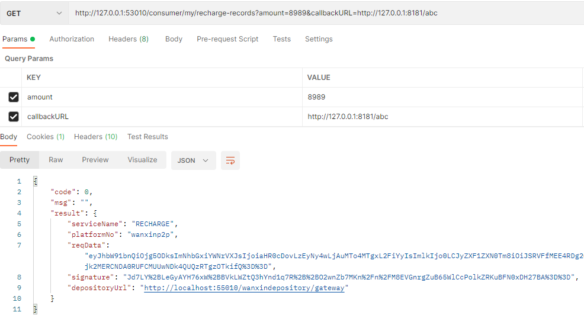

- 数据库表新增未同步状态的记录

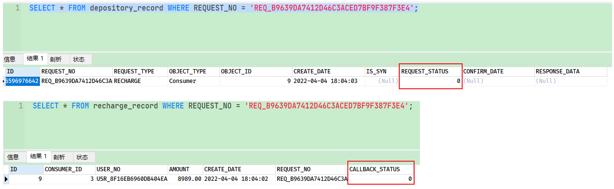

## 4. 第二阶段：请求充值

### 4.1. 需求分析

参考前面的“充值业务流程图(图中2.1-2.8)”，该阶段涉及到前端和银行存管系统，后端服务不需要开发，直接进行测试即可

### 4.2. 功能测试

#### 4.2.1. 注意事项

1. 为了测试方便，可以考虑关闭短信验证码功能。具体配置位置在 apollo 中的 account-service 项目
2. 测试时一定要从数据库中挑选C端，并且已经开户的用户进行登录

#### 4.2.2. 启动服务

1. 启动 Apollo 服务
2. 后端需要启动：
    - wanxinp2p-discover-server 微服务
    - wanxinp2p-gateway-server 微服务
    - wanxinp2p-uaa-service 微服务
    - wanxinp2p-account-service 微服务
    - wanxinp2p-consumer-service 微服务
    - wanxinp2p-depository-agent-service 微服务
    - wanxindepository 银行存管系统
3. 启动前端H5

#### 4.2.3. 测试步骤

1. 使用数据库表中的c端用户，如果关闭了短信验证码登陆的话，直接输入密码码处直接输入手机号即可
2. 登陆成功后跳转，点击页面中的“我的”选项，跳转个人中心页面，再选择“账户余额”，跳转账户余额页面

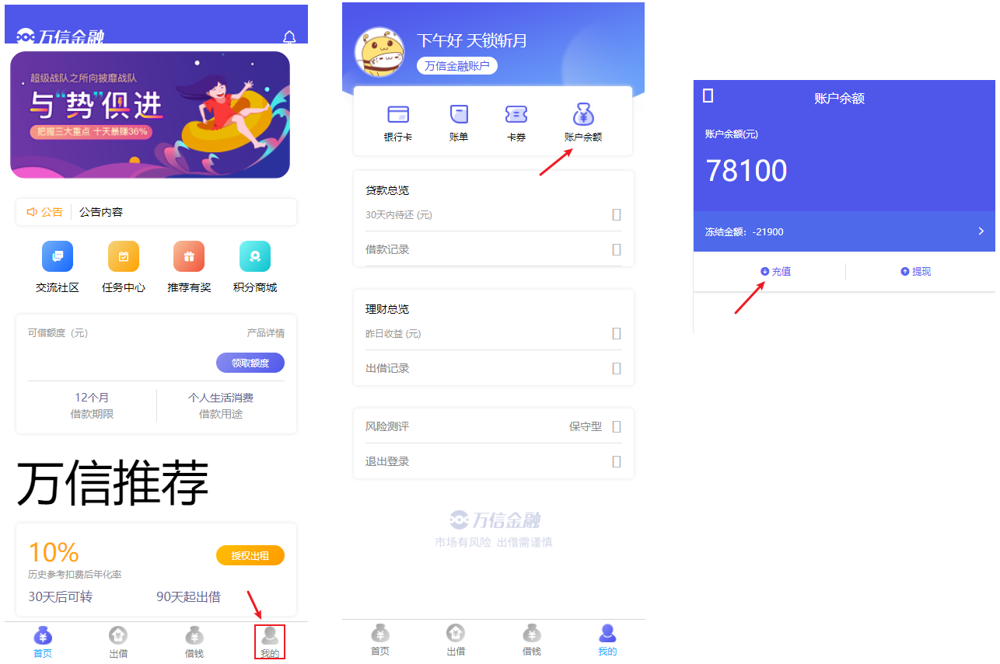

3. 点击“充值”按钮，跳转充值页面，输入充值金额后点击“充值”

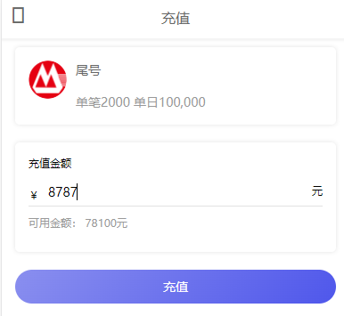

4. 输入交易密码。

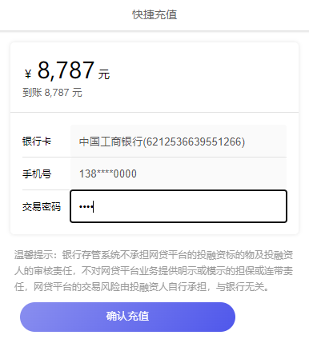

> 此密码存在 p2p_bank_depository 数据库的 bank_card 表中的 `PASSWORD` 字段，点击提交

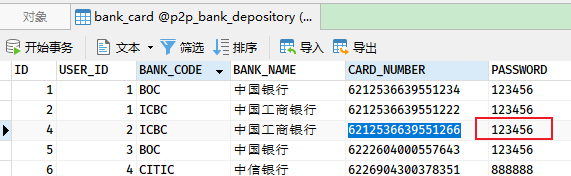

注：测试时，将 p2p_bank_depository 数据库中 bank_card_details 表修改用户的银行卡余额，保证余额大于充值输入的金额即可，否则报错“充值失败，银行卡余额不足”

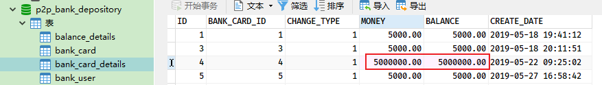

5. 提交后，银行存管系统进行数据校验与数据记录，成功会回去重定向到 p2p 项目的“充值成功”提示页面

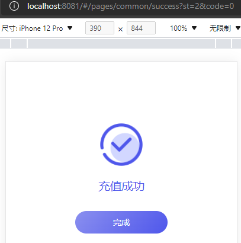

6. 检查相关表数据变化
    - p2p_consumer 数据库的 recharge_record 表新增充值记录，并 `CALLBACK_STATUS` 字段为“0-未同步”
    - p2p_depository_agent 数据库的 depository_record 表新增交易记录，并 `REQUEST_STATUS` 字段为 “0-未同步”
    - p2p_bank_depository 数据库的 balance_details、bank_card_details、recharge_details 表新增相应的记录

## 5. 第三阶段：充值结果通知

### 5.1. 需求分析

参考前面的“充值业务流程图(图中3.1-3.4)”，熟悉该阶段的具体需求和业务流程

### 5.2. 存管代理服务接收通知功能实现

银行存管系统充值成功会通知 P2P 存管代理服务，该服务需要更新交易状态。

接口功能描述：

1. 接收银行存管系统通知
2. 更新交易状态
3. 向用户中心服务通知：向消息队列发送消息

#### 5.2.1. 定义充值结果响应实体类

在 wanxinp2p-api 工程的 depository 模块中，定义给用户中心发送充值返回参数信息实体类 `DepositoryRechargeResponse`

```java
@Data
public class DepositoryRechargeResponse extends DepositoryBaseResponse {
    private static final long serialVersionUID = 7325259215434818667L;
    
    @ApiModelProperty("交易状态")
    private String transactionStatus;
}
```

#### 5.2.2. 定义消息主题常量

修改 wanxinp2p-common 工程的 `P2PMqConstants` 常量类，增加存管代理服务充值结果通知主题常量

```java
/**
 * 存管代理服务充值结果通知主题
 */
public final static String TOPIC_GATEWAY_NOTIFY_RECHARGE = "TP_GATEWAY_NOTIFY_AGENT:RECHARGE";
```

#### 5.2.3. 定义充值结果消息发送方法

修改消息生产者 `GatewayMessageProducer`，增加充值结果异步发送消息到 RocketMQ 的方法

```java
/**
 * 充值结果异步消息发送
 */
public void recharge(DepositoryRechargeResponse response) {
    rocketMQTemplate.convertAndSend(P2PMqConstants.TOPIC_GATEWAY_NOTIFY_RECHARGE, response);
}
```

#### 5.2.4. 充值结果回调通知接口

在 wanxinp2p-depository-agent-service 工程中的 `DepositoryNotifyController` 类中新增 `receiveDepositoryRechargeResult` 方法，用来接收银行存管系统的充值结果回调通知。

```java
@ApiOperation("接受银行存管系统充值返回结果")
@ApiImplicitParams({
        @ApiImplicitParam(name = "serviceName", value = "请求的银行存管接口名", required = true, dataType = "String", paramType = "query"),
        @ApiImplicitParam(name = "platformNo", value = "平台编号，平台与存管系统签约时获取", required = true, dataType = "String", paramType = "query"),
        @ApiImplicitParam(name = "signature", value = "对reqData参数的签名", required = true, dataType = "String", paramType = "query"),
        @ApiImplicitParam(name = "reqData", value = "业务数据报文，json格式", required = true, dataType = "String", paramType = "query"),})
@GetMapping(value = "/gateway", params = "serviceName=" + ServiceNameConstants.NAME_RECHARGE)
public String receiveDepositoryRechargeResult(@RequestParam("serviceName") String serviceName,
                                              @RequestParam("platformNo") String platformNo,
                                              @RequestParam("signature") String signature,
                                              @RequestParam("reqData") String reqData) {
    // 获取银行存管系统返回的响应字符串，需要Base64解码后，再封装成 DepositoryConsumerResponse 实体
    DepositoryRechargeResponse rechargeResponse = JSON.parseObject(EncryptUtil.decodeUTF8StringBase64(reqData), DepositoryRechargeResponse.class);
    // 1.更新请求记录的状态
    depositoryRecordService.modifyRequestStatus(rechargeResponse.getRequestNo(), rechargeResponse.getStatus());
    log.info("更新充值返回结果请求记录状态为 {} , 交易状态为 {}", rechargeResponse.getStatus(), rechargeResponse.getTransactionStatus());

    // 2.发送异步消息给用户中心服务
    gatewayMessageProducer.recharge(rechargeResponse);

    // 3.返回结果
    return "OK";
}
```

### 5.3. 用户中心服务接收通知功能实现

银行存管系统充值成功会通知存管代理服务，存管代理服务会通知用户中心服务，用户中心收到通知后需要保存充值记录，并更新余额。这里并不是严格意义上的接口，而是一个消息消费者 `GatewayNotifyConsumer` 类（*在开户时已经使用过实现接收存管代理服务发来的通知，并更新数据*）

#### 5.3.1. 更新充值状态

- 在 `RechargeRecordService` 接口中新增 `modifyResult` 更新结果状态的方法

```java
/**
 * 更新充值结果
 *
 * @param response
 * @return
 */
Boolean modifyResult(DepositoryRechargeResponse response);
```

- 在 `ConsumerServiceImpl` 类中实现 `modifyResult` 方法，更新 recharge_record 表的 `CALLBACK_STATUS` 结果

```java
@Override
public Boolean modifyResult(DepositoryRechargeResponse response) {
    // 根据响应码来判断状态 成功时 status=1；失败时 status=2
    int status = DepositoryReturnCode.RETURN_CODE_00000.getCode().equals(response.getRespCode())
            ? StatusCode.STATUS_IN.getCode() : StatusCode.STATUS_FAIL.getCode();

    // 根据请求号（requestNo）查询充值数据
    RechargeRecord rechargeRecord = getOne(Wrappers.<RechargeRecord>lambdaQuery().eq(RechargeRecord::getRequestNo, response.getRequestNo()));

    if (rechargeRecord != null) {
        // 更新充值记录 CALLBACK_STATUS 字段状态
        rechargeRecord.setCallbackStatus(status);
        return updateById(rechargeRecord);
    }

    return false;
}
```

#### 5.3.2. 定义消息监听者

修改 `GatewayNotifyConsumer` 类，在原来创建消息监听器的方法中，增加充值消息的判断分支

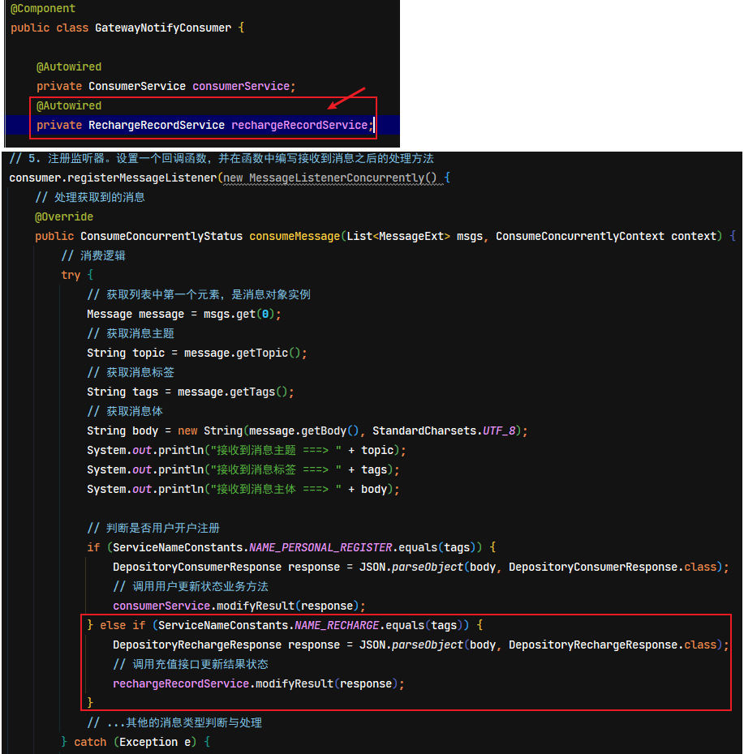

### 5.4. 功能测试

#### 5.4.1. 注意事项

> 注意：在对该阶段进行功能测试时，需要在银行存管系统中找到 `RechargeDetailsServiceImpl` 类，把其中两行代码的注释去掉，如下图所示：


#### 5.4.2. 启动服务

1. 启动 Apollo 服务
2. 启动 RocketMQ 服务和 rocketmq-console-ng-1.0.0.jar 后台管理服务
3. 后端需要启动：
    - wanxinp2p-discover-server 微服务
    - wanxinp2p-gateway-server 微服务
    - wanxinp2p-uaa-service 微服务
    - wanxinp2p-account-service 微服务
    - wanxinp2p-consumer-service 微服务
    - wanxinp2p-depository-agent-service 微服务
    - wanxindepository  银行存管系统
4. 启动前端H5

#### 5.4.3. 测试步骤

按第二阶段的功能测试步骤即可，一直到充值成功的提示页面。查看控制台输出消息的相关内容，与检查数据库的状态是否被修改。

depository-agent-service 银行存管代理服务回调接口执行了，更新请求记录状态

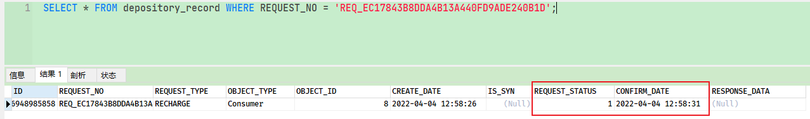

观察 consumer-service 用户服务监听到存管代理服务的 RocketMQ 消息，执行充值状态的更新

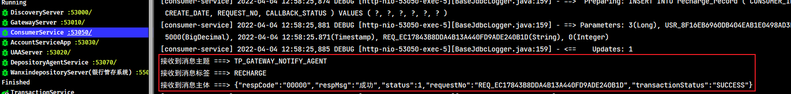

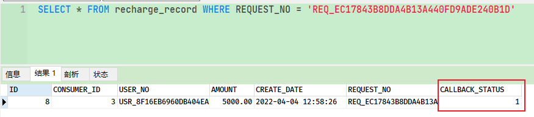
