# 第13章 还款提现

## 1. 提现业务概述

提现指的是：投资人在收到借款人的还款后，将余额从银行存管系统的虚拟账户中提取到自己绑定的储蓄卡。

### 1.1. 提交业务流程图


### 1.2. 操作流程图

1. 用户在'我的'页面点击'账户余额'

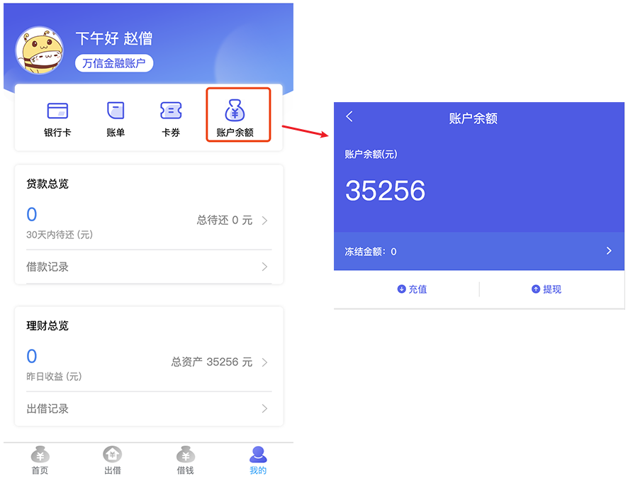

2. 点击提现，填写提现金额

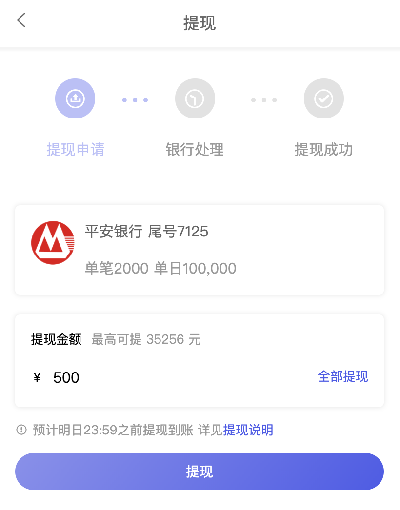

3. 确认提现信息并输入开户时设置的交易密码

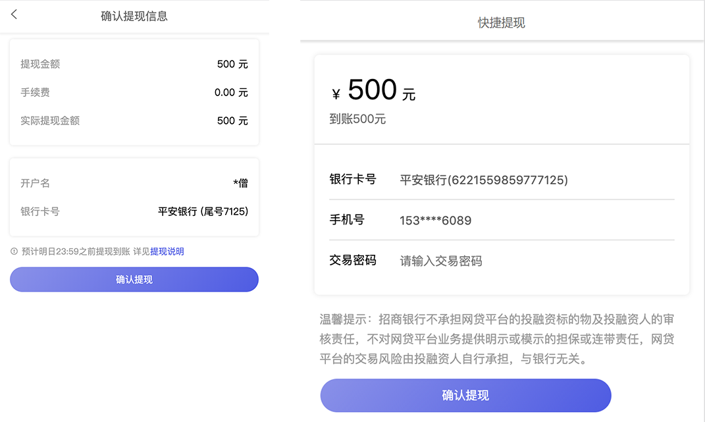

4. 提现成功

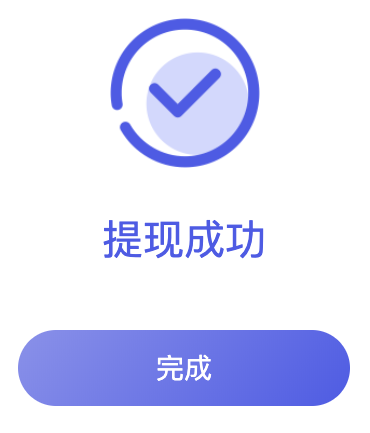

## 2. 需求分析

### 2.1. 业务流程时序图

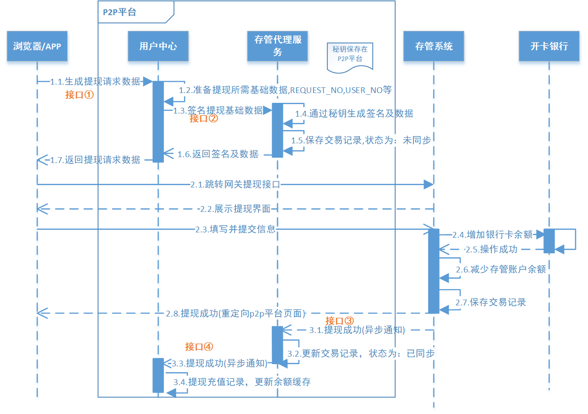

### 2.2. 业务流程简述

**第一阶段：生成请求数据(图中1.1-1.7)**

1. 前端填写提现信息
2. 前端请求用户中心服务提现
3. 用户中心服务准备提现数据
4. 用户中心服务请求存管代理服务生成交易记录（未同步），并对提现数据进行签名
5. 存管代理服务将签名后的提现数据返回给用户中心
6. 用户中心将提现数据返回给前端

**第二阶段：请求提现(图中2.1-2.8)**

1. 前端携带提现信息请求银行存管系统
2. 银行存管系统向前端返回提现信息确定页面
3. 前端确认完成提交提现请求到银行存管系统
4. 银行存管系统接收提现数据并进行校验，校验交易密码，无误后则将银行卡余额进行扣减

**第三阶段：提现结果通知(图中3.1-3.4)**

1. 提现成功后银行存管系统异步通知存管代理服务
2. 存管代理服务接收到提现成功通知更新交易状态为同步
3. 存管代理服务通知用户中心服务
4. 用户中心服务接收到提现成功的消息保存提现信息到用户中心服务

## 3. 第一阶段：生成提现数据

### 3.1. 需求分析

1. 参考前面的“提现业务流程图(图中1.1-1.7）”，熟悉该阶段的具体需求和业务流程
2. 查阅银行存管系统接口说明.pdf中的“提现”接口说明，熟悉接口接收参数和返回值

### 3.2. 接口定义

#### 3.2.1. 用户中心生成提现数据接口

在 `ConsumerApi` 接口中新增 `createWithdrawRecord` 生成提现数据方法

```java
/**
 * 生成用户提现数据
 *
 * @param amount      提现金额
 * @param callbackUrl 回调地址
 * @return
 */
RestResponse<GatewayRequest> createWithdrawRecord(String amount, String callbackUrl);
```

#### 3.2.2. 存管代理生成提现数据接口

在 depository 模块中创建生成提现请求实体类 `WithdrawRequest`

```java
@Data
@Accessors(chain = true)
@ApiModel("用户提现请求信息")
public class WithdrawRequest {
    @ApiModelProperty("标识")
    private Long id;
    @ApiModelProperty("用户编号")
    private String userNo;
    @ApiModelProperty("请求流水号")
    private String requestNo;
    @ApiModelProperty("提现金额")
    private BigDecimal amount;
    @ApiModelProperty("平台佣金")
    private BigDecimal commission;
    @ApiModelProperty("页面回调URL")
    private String callbackURL;
    @ApiModelProperty("银行卡号")
    private String cardNumber;
    @ApiModelProperty("银行预留手机号")
    private String mobile;
}
```

在 `DepositoryAgentApi` 接口中新增 `createWithdrawRecord` 生成提现请求数据方法：

```java
/**
 * 用户提现
 *
 * @param withdrawRequest 用户提现请求数据
 * @return
 */
RestResponse<GatewayRequest> createWithdrawRecord(WithdrawRequest withdrawRequest);
```

### 3.3. 用户中心生成提现数据功能实现

在 wanxinp2p-consumer-service 工程中实现接口，业务功能接口描述

1. 接收用户填写的提现数据
2. 用户中心保存提现信息
3. 请求存管代理生成签名数据
4. 将签名数据返回给前端

#### 3.3.1. 数据访问层接口

- 在 entity 包中创建 p2p_consumer 数据库的 withdraw_record 表的实体类 `WithdrawRecord`

```java
@Data
@TableName("withdraw_record")
public class WithdrawRecord implements Serializable {
    private static final long serialVersionUID = 3897130651803018968L;
    /**
     * 主键
     */
    @TableId(value = "ID", type = IdType.AUTO)
    private Long id;
    /**
     * 用户标识
     */
    @TableField("CONSUMER_ID")
    private Long consumerId;
    /**
     * 用户编码,生成唯一,用户在存管系统标识
     */
    @TableField("USER_NO")
    private String userNo;
    /**
     * 金额
     */
    @TableField("AMOUNT")
    private BigDecimal amount;
    /**
     * 平台佣金
     */
    @TableField("COMMISSION")
    private BigDecimal commission;
    /**
     * 触发时间
     */
    @TableField("CREATE_DATE")
    private LocalDateTime createDate;
    /**
     * 请求流水号
     */
    @TableField("REQUEST_NO")
    private String requestNo;
    /**
     * 回调状态
     */
    @TableField("CALLBACK_STATUS")
    private Integer callbackStatus;
}
```

- 在 mapper 包中新建 `WithdrawRecordMapper` 接口，继承 MP 的 `BaseMapper`：

```java
public interface WithdrawRecordMapper extends BaseMapper<WithdrawRecord> {
}
```

- 在 `mapper.xml` 包下创建 mapper 映射文件

```xml
<?xml version="1.0" encoding="UTF-8" ?>
<!DOCTYPE mapper PUBLIC "-//mybatis.org//DTD Mapper 3.0//EN" "http://mybatis.org/dtd/mybatis-3-mapper.dtd">
<mapper namespace="com.moon.wanxinp2p.consumer.mapper.WithdrawRecordMapper">
</mapper>
```

#### 3.3.2. 存管代理服务远程调用代理

在存管代理 Feign 远程调用代理接口 `DepositoryAgentApiAgent` 中，增加调用生成提现数据的方法

```java
/**
 * 用户提现
 *
 * @param withdrawRequest 用户提现请求数据
 * @return
 */
@PostMapping("/depository-agent/l/withdraw")
RestResponse<GatewayRequest> createWithdrawRecord(@RequestBody WithdrawRequest withdrawRequest);
```

#### 3.3.3. 业务层接口与实现

- 创建 `WithdrawRecordService` 接口，继承 MP 的 `IService` 接口。在接口中定义生成充值数据方法

```java
public interface WithdrawRecordService extends IService<WithdrawRecord> {
    /**
     * 生成提现请求数据
     *
     * @param amount      提现金额
     * @param callbackUrl 回调地址
     * @return
     */
    RestResponse<GatewayRequest> createWithdrawRecord(@RequestParam String amount, @RequestParam String callbackUrl);
}
```

- 创建 `WithdrawRecordServiceImpl` 类，继承 MP 的 `ServiceImpl` 类。实现 `createWithdrawRecord` 方法

```java
@Service
public class WithdrawRecordServiceImpl extends ServiceImpl<WithdrawRecordMapper, WithdrawRecord> implements WithdrawRecordService {

    @Autowired
    private ConsumerService consumerService;

    @Autowired
    private BankCardService bankCardService;

    @Autowired
    private DepositoryAgentApiAgent depositoryAgentApiAgent;

    /**
     * 生成提现请求数据
     *
     * @param amount      提现金额
     * @param callbackUrl 回调地址
     * @return
     */
    @Override
    public RestResponse<GatewayRequest> createWithdrawRecord(String amount, String callbackUrl) {
        // 1. 使用工具类，从请求域中获取到用户手机号
        ConsumerDTO consumer = consumerService.getByMobile(SecurityUtil.getUser().getMobile());
        // 判断当前用户是否已经开户，根据用户手机号查询用户表
        if (consumer == null) {
            // 用户不存在
            throw new BusinessException(CommonErrorCode.E_140101);
        }
        // 判断 isBindCard（是否绑定银行卡）是否为1
        if (consumer.getIsBindCard() != 1) {
            // 已经绑卡
            throw new BusinessException(ConsumerErrorCode.E_140152);
        }

        // TODO: 目前只对金额做简单的校验，不够全面
        if (StringUtils.isEmpty(amount) || new BigDecimal(amount).compareTo(BigDecimal.ZERO) <= 0) {
            throw new BusinessException(ConsumerErrorCode.E_140134);
        }

        // 2. 接收用户填写的提现数据
        WithdrawRecord withdrawRecord = new WithdrawRecord();
        withdrawRecord.setConsumerId(consumer.getId());
        withdrawRecord.setUserNo(consumer.getUserNo());
        withdrawRecord.setAmount(new BigDecimal(amount));
        withdrawRecord.setCreateDate(LocalDateTime.now());
        // TODO: 平台佣金，暂时为了方便，硬编码数值，后面需要修改为读取apollo配置，或者从交易服务中提供一个相应的查询接口。
        withdrawRecord.setCommission(new BigDecimal("0.15"));
        // 生成请求流程方法
        String requestNo = CodeNoUtil.getNo(CodePrefixCode.CODE_REQUEST_PREFIX);
        withdrawRecord.setRequestNo(requestNo);
        // 设置状态为 2-未同步
        withdrawRecord.setCallbackStatus(StatusCode.STATUS_OUT.getCode());

        // 3. 用户中心保存提现信息
        save(withdrawRecord);

        // 4. 请求存管代理生成签名数据
        WithdrawRequest withdrawRequest = new WithdrawRequest();
        BeanUtils.copyProperties(withdrawRecord, withdrawRequest);
        // 查询银行卡信息
        BankCardDTO bankCardDTO = bankCardService.getByConsumerId(consumer.getId());
        withdrawRequest.setCardNumber(bankCardDTO.getCardNumber());
        withdrawRequest.setMobile(bankCardDTO.getMobile());
        // 设置回调地址
        withdrawRequest.setCallbackURL(callbackUrl);

        // 5. 将签名数据返回给前端
        return depositoryAgentApiAgent.createWithdrawRecord(withdrawRequest);
    }
}
```

#### 3.3.4. 请求控制层

在 `ConsumerController` 类中实现生成提现记录方法

```java
@Autowired
private WithdrawRecordService withdrawRecordService;

@ApiOperation("生成用户提现数据")
@ApiImplicitParams({
        @ApiImplicitParam(name = "amount", value = "金额", required = true, dataType = "String", paramType = "query"),
        @ApiImplicitParam(name = "callbackUrl", value = "通知结果回调Url", required = true, dataType = "String", paramType = "query")})
@GetMapping("/my/withdraw-records")
@Override
public RestResponse<GatewayRequest> createWithdrawRecord(@RequestParam String amount, @RequestParam String callbackUrl) {
    return withdrawRecordService.createWithdrawRecord(amount, callbackUrl);
}
```

### 3.4. 存管代理生成提现数据功能实现

在 wanxinp2p-depository-agent-service 工程中实现接口，业务功能接口描述

1. 接受用户中心发来的提现请求数据
2. 保存请求记录
3. 生成签名数据

#### 3.4.1. 业务层接口与实现

在 wanxinp2p-common 工程的 `ServiceNameConstants` 类中，增加银行存管系统用户提现接口名称常量

```java
/* 存管接口名 - 用户提现接口 */
public final static String NAME_WITHDRAW = "WITHDRAW";
```

在 `DepositoryRecordService` 接口，并定义 `createWithdrawRecord` 保存提现记录方法

```java
/**
 * 保存用户提现记录
 *
 * @param withdrawRequest 提现请求数据
 * @return
 */
GatewayRequest createWithdrawRecord(WithdrawRequest withdrawRequest);
```

在 `DepositoryRecordServiceImpl` 类中实现该方法，主要实现的业务逻辑是保存提现请求记录与返回数据进行签名加密处理

```java
@Override
public GatewayRequest createWithdrawRecord(WithdrawRequest withdrawRequest) {
    /* 1.保存充值信息 */
    DepositoryRecord record = new DepositoryRecord();
    // 请求流水号
    record.setRequestNo(withdrawRequest.getRequestNo());
    // 请求类型
    record.setRequestType(DepositoryRequestTypeCode.WITHDRAW.getCode());
    // 业务实体类型
    record.setObjectType(CommonConstants.OBJECT_TYPE_CONSUMER);
    // 关联业务实体标识
    record.setObjectId(withdrawRequest.getId());
    // 请求时间
    record.setCreateDate(LocalDateTime.now());
    // 数据同步状态（未同步）
    record.setRequestStatus(StatusCode.STATUS_OUT.getCode());
    this.save(record); // MP 提供的保存方法

    /* 2.封装返回数据，并进行签名 */
    // 将充值的数据转成json字符串
    String reqData = JSON.toJSONString(withdrawRequest);
    // 调用工具类方法，使用私钥对 json 字符串签名
    String sign = RSAUtil.sign(reqData, configService.getP2pPrivateKey(), CommonConstants.UTF8);

    // 创建接口返回实体
    GatewayRequest gatewayRequest = new GatewayRequest();
    // 请求的存管接口名，详见《银行存管接口说明.pdf》
    gatewayRequest.setServiceName(ServiceNameConstants.NAME_WITHDRAW);
    // 平台编号，平台与存管系统签约时获取。配置在apollo上
    gatewayRequest.setPlatformNo(configService.getP2pCode());
    // 业务数据报文，json格式。进行转码
    gatewayRequest.setReqData(EncryptUtil.encodeURL(EncryptUtil.encodeUTF8StringBase64(reqData)));
    // 签名
    gatewayRequest.setSignature(EncryptUtil.encodeURL(sign));
    // 银行存管系统地址。配置在apollo上
    gatewayRequest.setDepositoryUrl(configService.getDepositoryUrl() + "/gateway");
    return gatewayRequest;
}
```

#### 3.4.2. 请求控制层

在 `DepositoryAgentController` 类中实现生成提现记录方法：

```java
@ApiOperation("生成提现请求数据")
@ApiImplicitParam(name = "withdrawRequest", value = "提现信息", required = true,
        dataType = "WithdrawRequest", paramType = "body")
@PostMapping("/l/withdraw")
@Override
public RestResponse<GatewayRequest> createWithdrawRecord(@RequestBody WithdrawRequest withdrawRequest) {
    return RestResponse.success(depositoryRecordService.createWithdrawRecord(withdrawRequest));
}
```

### 3.5. 功能测试

#### 3.5.1. 启动服务

1. 启动 Apollo 服务
2. 后端需要启动：
    - wanxinp2p-discover-server 微服务
    - wanxinp2p-gateway-server 微服务
    - wanxinp2p-uaa-service 微服务
    - wanxinp2p-consumer-service 微服务
    - wanxinp2p-account-service 微服务
    - wanxinp2p-depository-agent-service 微服务

#### 3.5.2. 测试步骤

1. 使用 postman 进行登陆

- 请求url：

```
POST http://localhost:53010/uaa/oauth/token
```

- 请求参数：

```json
grant_type:password
client_id:wanxin-p2p-web-h5
client_secret:wanxin-h5
username:13800000000
password:13800000000
domain:c
authenticationType:password
```

2. 登陆成功后，使用 postman 测试用户充值功能

- 请求url: 

```json
GET http://127.0.0.1:53010/consumer/my/withdraw-records?amount=8989&callbackUrl=http://127.0.0.1:8181/abc
```

- 复制登陆后返回的 token，在请求的 header 中增加授权校验的参数 `Authorization`。*注意：token 字符串前端需要标识 token_type，都在返回的令牌内容中*
- 请求成功后，返回存管代理服务生成的与银行存管系统对接使用签名加密后相关的请求数据

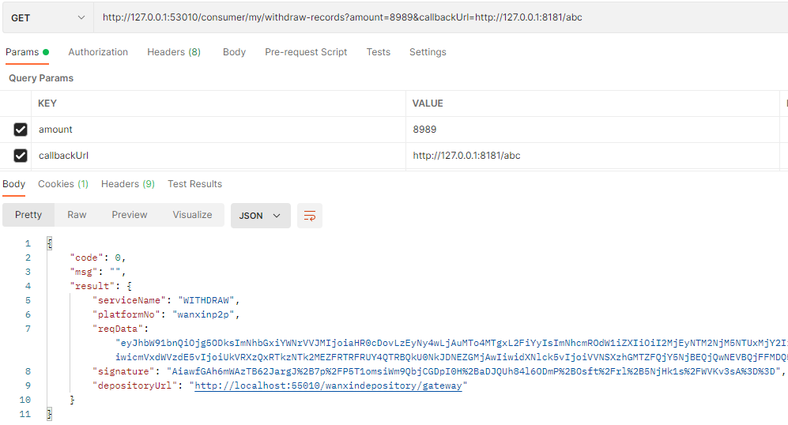

- 数据库表新增未同步状态的记录

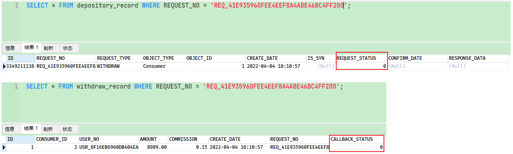

## 4. 第二阶段：请求提现

### 4.1. 需求分析

参考前面的“提现业务流程图(图中2.1-2.8)”，该阶段涉及到前端和银行存管系统，后端服务不需要开发，直接进行测试即可

#### 4.1.1. 启动服务

1. 启动 Apollo 服务
2. 后端需要启动：
    - wanxinp2p-discover-server 微服务
    - wanxinp2p-gateway-server 微服务
    - wanxinp2p-uaa-service 微服务
    - wanxinp2p-account-service 微服务
    - wanxinp2p-consumer-service 微服务
    - wanxinp2p-depository-agent-service 微服务
    - wanxindepository 银行存管系统
3. 启动前端H5

#### 4.1.2. 测试步骤

1. 使用数据库表中的c端用户，如果关闭了短信验证码登陆的话，直接输入密码码处直接输入手机号即可
2. 登陆成功后跳转，点击页面中的“我的”选项，跳转个人中心页面，再选择“账户余额”，跳转账户余额页面

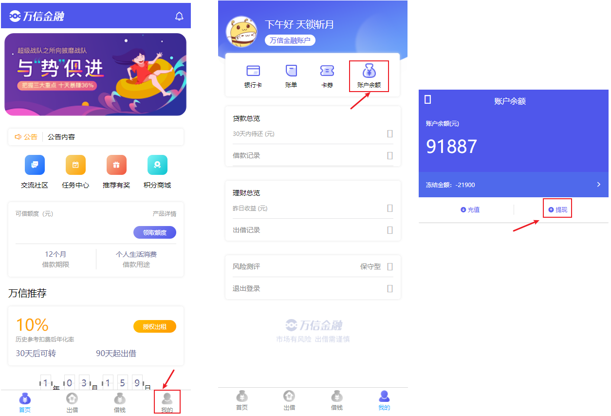

3. 点击“提现”按钮，跳转提现页面，输入提现金额后点击“提现”，跳转确认页面，再点击确认后，跳转最终提现页面

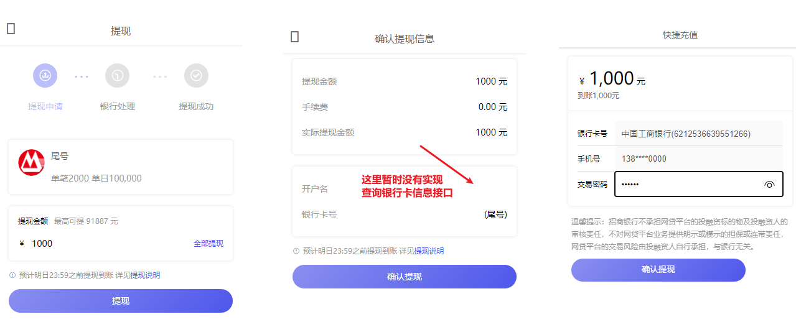

4. 输入交易密码。此密码存在 p2p_bank_depository 数据库的 bank_card 表中的 `PASSWORD` 字段，点击提交

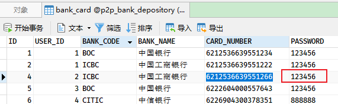

> 注：测试时，确认 p2p_bank_depository 数据库中 balance_details 表中账户余额 `BALANCE` 字段大于提现输入的金额即可，否则报错“提现失败，账户余额不足”

5. 提交后，银行存管系统进行数据校验与数据记录，成功会回去重定向到 p2p 项目的“提现成功”提示页面

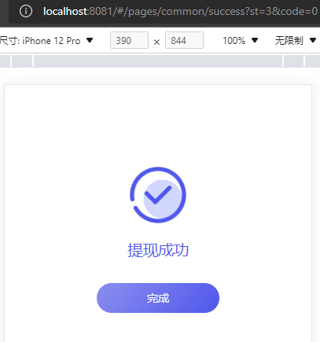

6. 检查相关表数据变化
    - p2p_consumer 数据库的 withdraw_record 表新增提现记录，并 `CALLBACK_STATUS` 字段为“0-未同步”
    - p2p_depository_agent 数据库的 depository_record 表新增交易记录，并 `REQUEST_STATUS` 字段为 “0-未同步”
    - p2p_bank_depository 数据库的 balance_details、bank_card_details、withdraw_details 表新增相应的记录

## 5. 第三阶段：提现结果通知

### 5.1. 需求分析

参考前面的“提现业务流程图(图中3.1-3.4)”，熟悉该阶段的具体需求和业务流程

### 5.2. 存管代理服务接收通知功能实现

银行存管系统提现成功会通知存管代理服务，该服务要更新数据。接口功能描述：

1. 接收银行存管系统通知
2. 更新交易状态
3. 向用户中心服务通知：向消息队列发送消息

#### 5.2.1. 定义提现结果响应实体类

在 wanxinp2p-api 工程的 depository 模块中，定义给用户中心发送提现返回参数信息实体类 `DepositoryWithdrawResponse`

```java
@Data
public class DepositoryWithdrawResponse extends DepositoryBaseResponse {
    private static final long serialVersionUID = -843089688089364212L;

    @ApiModelProperty("交易状态")
    private String transactionStatus;
}
```

#### 5.2.2. 定义消息主题常量

修改 wanxinp2p-common 工程的 `P2PMqConstants` 常量类，增加存管代理服务提现结果通知主题常量

```java
/**
 * 存管代理服务提现结果通知主题
 */
public final static String TOPIC_GATEWAY_NOTIFY_WITHDRAW = "TP_GATEWAY_NOTIFY_AGENT:WITHDRAW";
```

#### 5.2.3. 定义提现结果消息发送方法

修改消息生产者 `GatewayMessageProducer`，增加提现结果异步发送消息到 RocketMQ 的方法

```java
/**
 * 提现结果异步消息发送
 */
public void withdraw(DepositoryWithdrawResponse response) {
    rocketMQTemplate.convertAndSend(P2PMqConstants.TOPIC_GATEWAY_NOTIFY_WITHDRAW, response);
}
```

#### 5.2.4. 充值结果回调通知接口

在 wanxinp2p-depository-agent-service 工程中的 `DepositoryNotifyController` 类中新增 `receiveDepositoryWithdrawResult` 方法，用来接收银行存管系统的提现结果回调通知。

```java
@ApiOperation("接受银行存管系统提现返回结果")
@ApiImplicitParams({
        @ApiImplicitParam(name = "serviceName", value = "请求的存管接口名", required = true, dataType = "String", paramType = "query"),
        @ApiImplicitParam(name = "platformNo", value = "平台编号，平台与存管系统签约时获取", required = true, dataType = "String", paramType = "query"),
        @ApiImplicitParam(name = "signature", value = "对reqData参数的签名", required = true, dataType = "String", paramType = "query"),
        @ApiImplicitParam(name = "reqData", value = "业务数据报文，json格式", required = true, dataType = "String", paramType = "query"),})
@GetMapping(value = "/gateway", params = "serviceName=" + ServiceNameConstants.NAME_WITHDRAW)
public String receiveDepositoryWithdrawResult(@RequestParam("serviceName") String serviceName,
                                              @RequestParam("platformNo") String platformNo,
                                              @RequestParam("signature") String signature,
                                              @RequestParam("reqData") String reqData) {
    // 获取银行存管系统返回的响应字符串，需要Base64解码后，再封装成 DepositoryConsumerResponse 实体
    DepositoryWithdrawResponse withdrawResponse = JSON.parseObject(EncryptUtil.decodeUTF8StringBase64(reqData), DepositoryWithdrawResponse.class);
    // 1.更新请求记录的状态
    depositoryRecordService.modifyRequestStatus(withdrawResponse.getRequestNo(), withdrawResponse.getStatus());
    log.info("更新提现返回结果请求记录状态为 {} , 交易状态为 {}", withdrawResponse.getStatus(), withdrawResponse.getTransactionStatus());

    // 2.发送异步消息给用户中心服务
    gatewayMessageProducer.withdraw(withdrawResponse);

    // 3.返回结果
    return "OK";
}
```

### 5.3. 用户中心服务接收通知功能实现

银行存管系统提现成功会通知存管代理服务，存管代理服务会通知用户中心服务，用户中心收到通知后需要保存提现记录，并更新余额。这里并不是严格意义上的接口，而是一个消息消费者 `GatewayNotifyConsumer` 类（*在开户时已经使用过实现接收存管代理服务发来的通知，并更新数据*）

#### 5.3.1. 更新提现状态

- 在 `WithdrawRecordService` 接口中新增 `modifyResult` 更新结果状态的方法

```java
/**
 * 更新提现结果
 *
 * @param response
 * @return
 */
Boolean modifyResult(DepositoryWithdrawResponse response);
```

- 在 `ConsumerServiceImpl` 类中实现 `modifyResult` 方法，更新 withdraw_record 表的 `CALLBACK_STATUS` 结果

```java
@Override
public Boolean modifyResult(DepositoryWithdrawResponse response) {
    // 根据请求号（requestNo）查询充值数据
    WithdrawRecord withdrawRecord = getOne(Wrappers.<WithdrawRecord>lambdaQuery()
            .eq(WithdrawRecord::getRequestNo, response.getRequestNo()));

    if (withdrawRecord != null) {
        // 根据响应码来判断状态 成功时 status=1；失败时 status=2
        int status = DepositoryReturnCode.RETURN_CODE_00000.getCode().equals(response.getRespCode())
                ? StatusCode.STATUS_IN.getCode() : StatusCode.STATUS_FAIL.getCode();
        // 更新充值记录 CALLBACK_STATUS 字段状态
        withdrawRecord.setCallbackStatus(status);
        return updateById(withdrawRecord);
    }

    return false;
}
```

#### 5.3.2. 定义消息监听者

修改 `GatewayNotifyConsumer` 类，在原来创建消息监听器的方法中，增加提现消息的判断分支

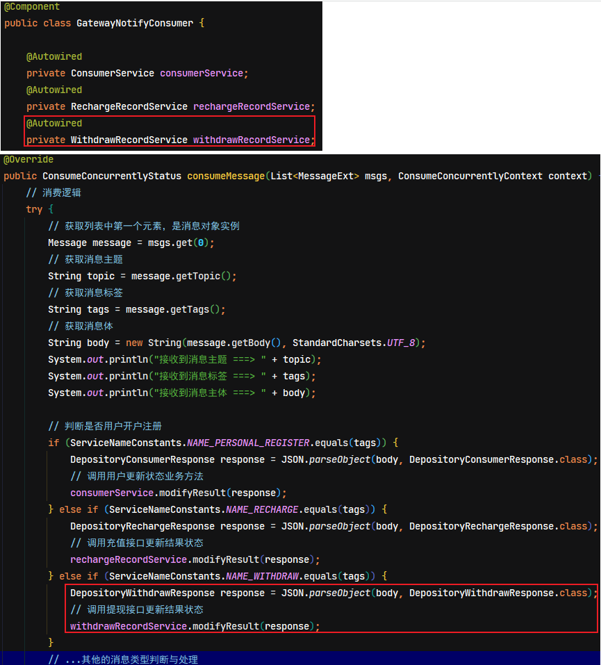

### 5.4. 功能测试

#### 5.4.1. 注意事项

> 注意：在对该阶段进行功能测试时，需要在银行存管系统中找到 `WithdrawDetailsServiceImpl` 类，把其中两行代码的注释去掉，如下图所示：

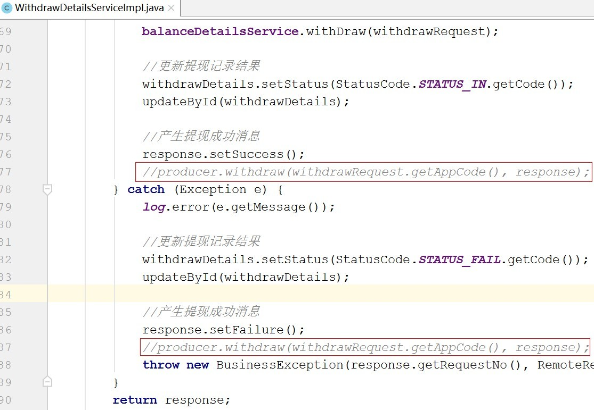

#### 5.4.2. 启动服务

1. 启动 Apollo 服务
2. 启动 RocketMQ 服务和 rocketmq-console-ng-1.0.0.jar 后台管理服务
3. 后端需要启动：
    - wanxinp2p-discover-server 微服务
    - wanxinp2p-gateway-server 微服务
    - wanxinp2p-uaa-service 微服务
    - wanxinp2p-account-service 微服务
    - wanxinp2p-consumer-service 微服务
    - wanxinp2p-depository-agent-service 微服务
    - wanxindepository  银行存管系统
4. 启动前端H5

#### 5.4.3. 测试步骤

按第二阶段的功能测试步骤即可，一直到提现成功的提示页面。查看控制台输出消息的相关内容，与检查数据库的状态是否被修改。

depository-agent-service 银行存管代理服务回调接口执行了，更新请求记录状态

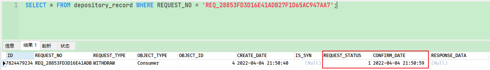

观察 consumer-service 用户服务监听到存管代理服务的 RocketMQ 消息，执行提现状态的更新

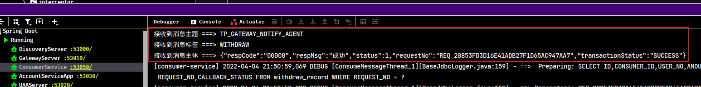

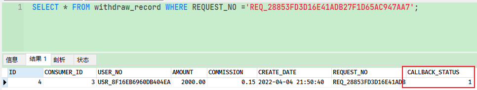
