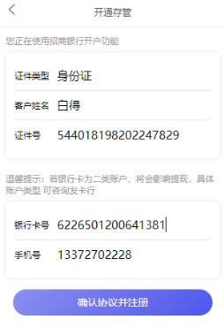
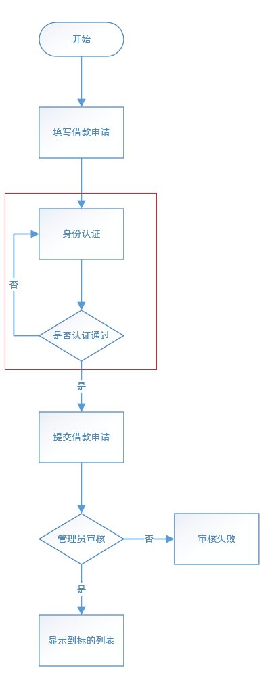
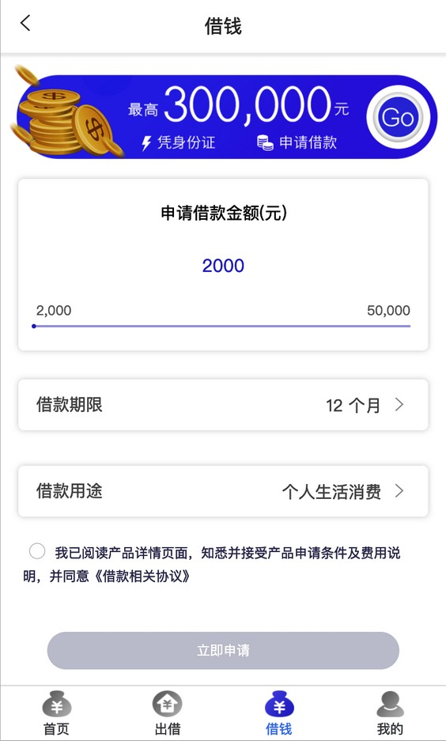
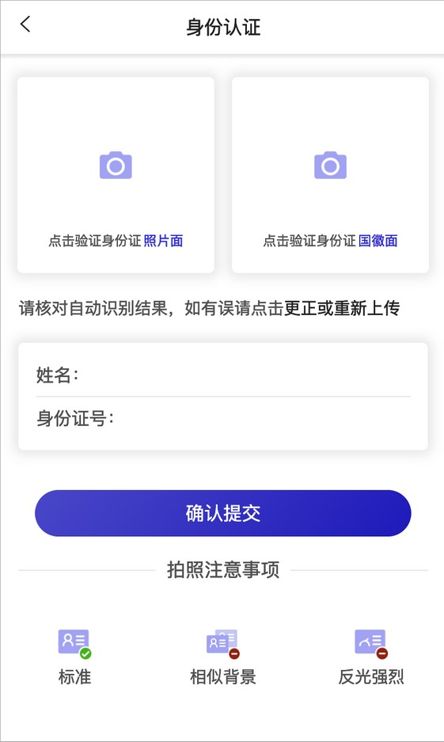
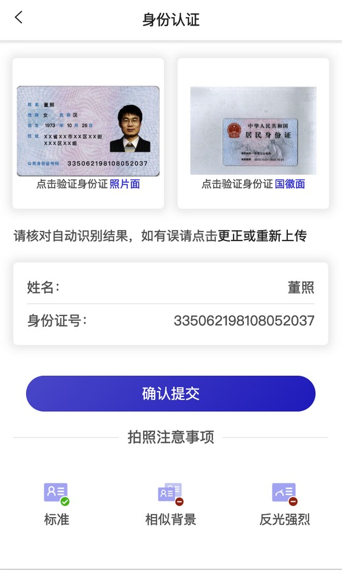
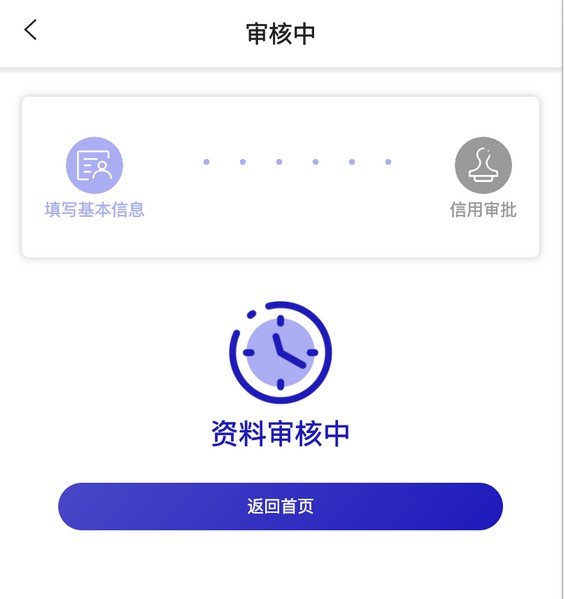
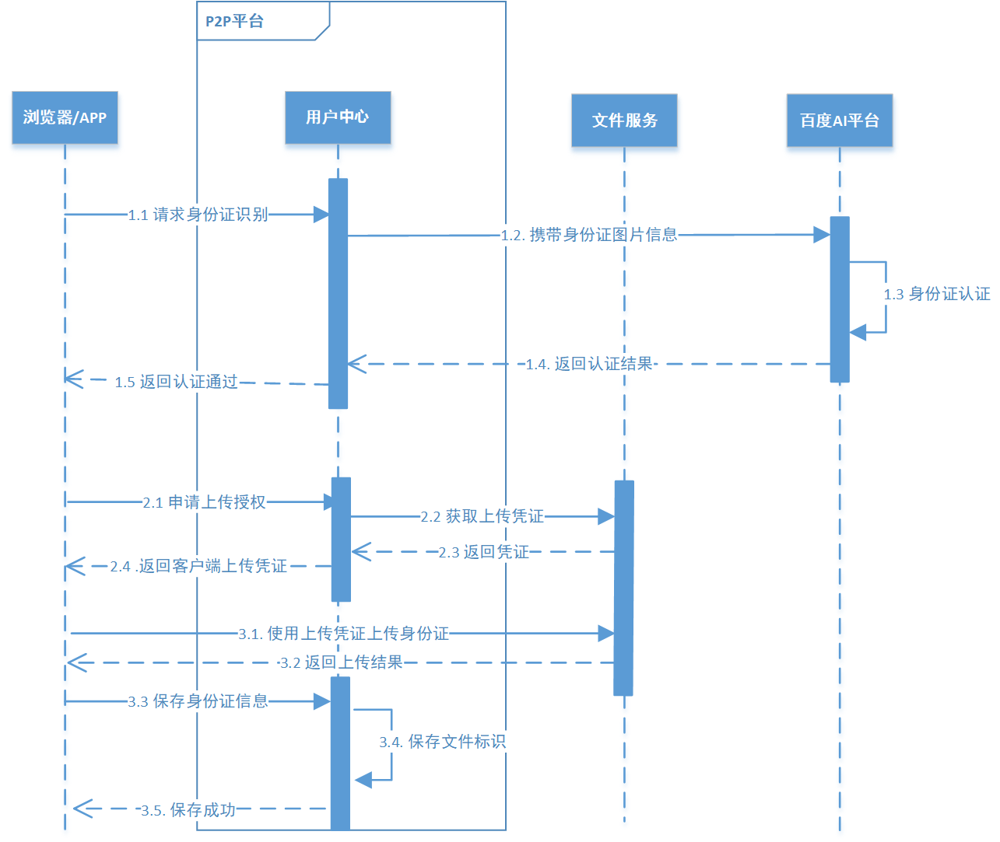

# 第14章 用户身份认证

## 1. 业务概述

之前实现开户业务时，系统只是要求用户填写了个人姓名和身份证信息，并没有进行身份认证和校验。这里面就存在着各种风险，例如：假名，盗用他人身份证等等。

特别是对于借款人来说，系统必须对其身份进行认证和校验，否则会对后续交易产生较大风险。系统进行身份认证和校验的时机，一个是在开户时进行，另一个在发标(交易的第1步)时进行，但考虑到有些用户即使开户也不一定会进行交易(例如：发标)，所以把身份认证和校验放在发标时实现。

### 1.1. 更新后的发标流程

### 1.2. 操作流程图

1. 填写借款申请

2. 用户上传身份证照片

3. 提交身份证信息

4. 申请完毕，等待审核

## 2. 需求分析

### 2.1. 业务流程时序图

- 文件服务是专门用于处理文件上传、下载的微服务，可以为万信金融P2P项目的各个业务模块提供文件服务。
- 百度AI是一个第三方开发平台，能够提供各种智能技术，例如：语音识别，图像识别，文字识别等等。

### 2.2. 业务流程简述

**第一阶段：识别身份证(图中1.1-1.5)**

1. 前端携带身份证图片信息请求用户中心
2. 用户中心请求百度AI平台进行识别
3. 返回识别结果给前端

**第二阶段：获取上传凭证(图中2.1-2.4)**

1. 前端请求用户中心获取上传授权
2. 用户中心生成上传授权并返回

**第三阶段：上传身份证(图中3.1-3.2)**

1. 前端携带上传凭证和照片请求文件服务，文件服务保存照片到七牛云上
2. 返回上传结果给前端

**第四阶段：保存身份证信息(图中3.3-3.5)**

1. 前端请求用户中心保存身份证信息
2. 用户中心保存身份证照片标识等
3. 返回前端保存成功

## 3. 部署文件服务

文件服务是抽取出来的专门用于处理文件上传、下载的微服务，可以为万信金融 P2P 项目的各个业务模块提供文件服务。该服务默认采用七牛云作为文件存储源，将来也会和百度云、阿里云做对接，成为一个通用的、独立的文件微服务。

