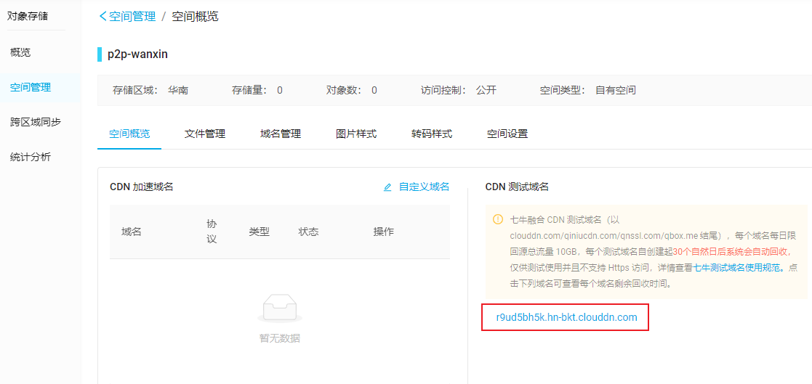

# 第14章 用户身份认证

## 1. 业务概述

之前实现开户业务时，系统只是要求用户填写了个人姓名和身份证信息，并没有进行身份认证和校验。这里面就存在着各种风险，例如：假名，盗用他人身份证等等。


特别是对于借款人来说，系统必须对其身份进行认证和校验，否则会对后续交易产生较大风险。系统进行身份认证和校验的时机，一个是在开户时进行，另一个在发标(交易的第1步)时进行，但考虑到有些用户即使开户也不一定会进行交易(例如：发标)，所以把身份认证和校验放在发标时实现。

### 1.1. 更新后的发标流程


### 1.2. 操作流程图

1. 填写借款申请


2. 用户上传身份证照片


3. 提交身份证信息


4. 申请完毕，等待审核


## 2. 需求分析

### 2.1. 业务流程时序图

- 文件服务是专门用于处理文件上传、下载的微服务，可以为万信金融P2P项目的各个业务模块提供文件服务。
- 百度AI是一个第三方开发平台，能够提供各种智能技术，例如：语音识别，图像识别，文字识别等等。


### 2.2. 业务流程简述

**第一阶段：识别身份证(图中1.1-1.5)**

1. 前端携带身份证图片信息请求用户中心
2. 用户中心请求百度AI平台进行识别
3. 返回识别结果给前端

**第二阶段：获取上传凭证(图中2.1-2.4)**

1. 前端请求用户中心获取上传授权
2. 用户中心生成上传授权并返回

**第三阶段：上传身份证(图中3.1-3.2)**

1. 前端携带上传凭证和照片请求文件服务，文件服务保存照片到七牛云上
2. 返回上传结果给前端

**第四阶段：保存身份证信息(图中3.3-3.5)**

1. 前端请求用户中心保存身份证信息
2. 用户中心保存身份证照片标识等
3. 返回前端保存成功

## 3. 部署文件服务

文件服务是抽取出来的专门用于处理文件上传、下载的微服务，可以为万信金融 P2P 项目的各个业务模块提供文件服务。该服务默认采用七牛云作为文件存储源，将来也会和百度云、阿里云做对接，成为一个通用的、独立的文件微服务。

### 3.1. 项目搭建与环境准备

Java 1.8+、MySQL 5.6.5+

#### 3.1.1. 初始化数据库

初始化 sql 脚本：

```sql
SET NAMES utf8mb4;
SET FOREIGN_KEY_CHECKS = 0;

CREATE DATABASE `p2p_file` CHARACTER SET 'utf8' COLLATE 'utf8_general_ci';

USE p2p_file;

DROP TABLE IF	EXISTS `fileobject`;
CREATE TABLE `fileobject` (
	`ID` BIGINT ( 20 ) NOT NULL AUTO_INCREMENT COMMENT '主键',
	`fileName` VARCHAR ( 50 ) DEFAULT NULL COMMENT '原文件名',
	`origin` VARCHAR ( 20 ) NOT NULL COMMENT '存储源',
	`resourceKey` VARCHAR ( 100 ) NOT NULL COMMENT '文件key',
	`flag` VARCHAR ( 10 ) NOT NULL COMMENT '正反面',
	`downloadUrl` VARCHAR ( 200 ) DEFAULT NULL COMMENT '文件下载地址',
	`isProtect` TINYINT ( 1 ) NOT NULL COMMENT '公有还是私有',
	`uploaddate` datetime NOT NULL COMMENT '上传日期',
	PRIMARY KEY ( `ID` ) 
) ENGINE = INNODB DEFAULT CHARSET = utf8;

SET FOREIGN_KEY_CHECKS = 1;
```

#### 3.1.2. IDE 导入工程

使用 IDEA 或者其他的 IDE 工具导入 wanxinp2p-file-service 工程


#### 3.1.3. 修改配置(数据库)

由于在上传文件时，需要把文件信息保存到 p2p_file 数据库的 fileobject 表中，因此需要修改 application.yml 文件中数据库相关配置。

```yml
...
  datasource:
    url: jdbc:mysql://localhost:3306/p2p_file?useUnicode=true&useSSL=false
    driver-class-name: com.mysql.cj.jdbc.Driver
    username: root
    password: 123456
...
```

### 3.2. 文件存储服务

#### 3.2.1. 注册七牛云对象存储服务

本项目默认使用七牛云(对象存储服务)来存储文件，需要自行注册并登录：https://www.qiniu.com/products/kodo。

- 登录到个人控制台后，需要点击左侧菜单中的“对象存储”中的【空间管理】，新增存储空间。


> 注：创建空间前需要进行实名认证

- 创建成功，获取融合 CDN 测试域名



- 获取七牛云服务秘钥，在编码过程中需要使用


#### 3.2.2. 修改配置(文件存储)

wanxinp2p-file-service 工程的功能均已实现，只需要修改项目中的 application.yml 配置文件，替换AK、SK、域名即可

```yml
...
my:
  file:
    qiniu:
      secretKey: key
      accessKey: accessKey
      domainOfBucket: http://测试域名
...
```

### 3.3. 用户服务配置使用文件服务

在上传文件之前，需要申请上传凭证，Java 代码中需要知道存储源和存储空间名字。登录 Apollo，找到 consumer-service 项目，关联名称空间：`micro_service.files`（如没有，则创建即可），并进行如下配置：

```properties
# 固定写法
my.file.origin = qiniu
# 与具体个人七牛云中某存储空间名称保持一致
my.file.bucket = p2p-wanxin
```

后面实现文件上传功能后，在内容管理中可以上传的文件，如下图所示。红框中的文件名是每个文件的唯一标识，会返回给用户中心服务，并保存到 p2p_consumer 数据库的 consumer_details 表中。


### 3.4. 接口说明

wanxinp2p-file-service 项目作为独立的文件服务，已经实现了文件上传和下载，不需要再做功能实现，直接使用即可。要了解相关接口，启动服务后访问：http://localhost:56082/farming/swagger-ui.html，也可以直接查看项目源码。

## 4. 百度 AI 服务

### 4.1. 注册并登录百度AI

访问 https://login.bce.baidu.com，自行注册并登录(可以尝试短信验证码快捷登录)

### 4.2. 文字识别配置

- 选择【产品服务】 -> 【人工智能】 -> 【文字识别】


- 创建应用


- 填写应用名称和类型，提交请求


- 获取 AppID, API Key 和 Secret Key


### 4.3. 使用百度 AI

#### 4.3.1. 引入依赖

在用户中心服务(consumer-service)的 pom.xml 文件中引入百度 AI 的依赖

```xml
<!-- 百度 AI -->
<dependency>
    <groupId>com.baidu.aip</groupId>
    <artifactId>java-sdk</artifactId>
    <version>4.8.0</version>
</dependency>
```

#### 4.3.2. apollo 配置

登录 Apollo，对 consumer-service 项目中的 micro_service.files 中增加以下配置项（具体配置值根据实际情况配置）：

```properties
my.file.baidu.appid = 12345678
my.file.baidu.ak = mie83nKu3i8fn
my.file.baidu.sk = Ikkiw8cvIe389fjifkdnvbioidki
```
## 5. 第一阶段：识别身份证

此阶段，用户中心请求百度 AI 识别身份证，在用户中心定义识别身份证照片接口，接口描述如下

1. 前端提交身份证照片到用户中心
2. 用户中心请求百度 AI 进行身份证识别
3. 百度 AI 返回识别结果给用户中心
4. 用户中心响应前端返回识别结果

> 百度识别功能实现：请参考[百度 AI 官方文档](https://ai.baidu.com/ai-doc/OCR/Ek3h7xypm)、[身份证识别文档](https://ai.baidu.com/ai-doc/OCR/rk3h7xzck)

### 5.1. 识别身份证接口定义

在 wanxinp2p-api 工程的 `ConsumerApi` 接口中，定义 `imageRecognition` 识别身份证方法：

```java
/**
 * 提交身份证图片给百度AI进行识别
 *
 * @param file 被上传的文件
 * @param flag 身份证正反面  取值front 或 back
 * @return Map集合 识别成功后把身份证上的姓名和身份证号存到map中返回
 */
RestResponse<Map<String, String>> imageRecognition(MultipartFile file, String flag);
```

### 5.2. 功能实现（待完成！）

#### 5.2.1. 业务层

- 修改 `ConsumerService` 接口，增加图片识别方法 `imageRecognition`

```java
/**
 * 提交身份证图片给百度AI进行识别
 *
 * @param file 被上传的文件
 * @param flag 身份证正反面  取值front 或 back
 * @return Map集合 识别成功后把身份证上的姓名和身份证号存到map中返回
 */
Map<String, String> imageRecognition(MultipartFile file, String flag);
```

- 在 `ConsumerServiceImpl` 类中实现该方法

```java

```

#### 5.2.2. 请求控制层


## 6. 第二阶段：获取上传凭证（待完成！）

要想通过文件服务上传文件，必须获得上传凭证。在用户中心定义获取上传凭证接口，接口描述如下

1. 向文件服务请求获取上传凭证
2. 响应前端返回凭证

接口定义如下

在ConsumerApi接口中，定义applyUploadCertificate方法：

```java
/**
 * 申请获得上传凭证
 * @return
 */
RestResponse<String> applyUploadCertificate();
```

在ConsumerController类中实现该方法：

```java
@Override
@ApiOperation("申请获得上传凭证")
@GetMapping("/my/applyUploadCertificate")
public RestResponse<String> applyUploadCertificate(){
    return null;
}
```

> 功能实现：请参考文件服务farming中的TokenController，需要通过RestTemplate或OkHttpClient往这里发请求。


## 7. 第三阶段：上传身份证

前端携带之前获得的上传凭证，请求文件服务上传身份证照片，由于上传功能已经在文件服务中实现，所以这里只需要对前端做出调整(开启身份认证界面)即可。找到 wanxinp2p-web-app 工程的 borrow.vue 文件，然后将下图的注释去掉即可。


## 8. 第四阶段：保存身份证信息（待完成！）

文件上传成功后，前端会接收到文件服务返回的结果和文件标识，然后前端携带这些数据请求用户中心保存身份证信息。

在用户中心定义保存身份证信息接口：

1、接口描述

1. 接受前端提交的身份证信息
2. 用户中心校验身份证信息是否和之前开户信息一致
3. 用户中心保存身份证照片标识
4. 返回结果给前端

2、接口定义

在ConsumerApi接口中，定义saveConsumerDetails方法：

```java
/**
 * 保存用户详细信息(主要存储身份证文件标识)
 * @param consumerDetailsDTO 封装用户详情信息
 * @return
 */
RestResponse<String> saveConsumerDetails(ConsumerDetailsDTO consumerDetailsDTO);
```

在ConsumerController类中实现该方法：

```java
@Override
@ApiOperation(value="保存用户详细信息", notes="主要存储身份证文件标识")
@ApiImplicitParams({
        @ApiImplicitParam(name = "consumerDetailsDTO", value = "用户详细信息", dataType = "ConsumerDetailsDTO", paramType = "body")})
@PostMapping("/my/saveConsumerDetails")
public RestResponse<String> saveConsumerDetails(@RequestBody ConsumerDetailsDTO consumerDetailsDTO){
    //... ...
    return RestResponse.success("保存成功");
}
```

> 该阶段涉及到新的类有：ConsumerDetailsDTO、ConsumerDetails、ConsumerDetailsService、ConsumerDetailsServiceImpl、ConsumerDetailsMapper
