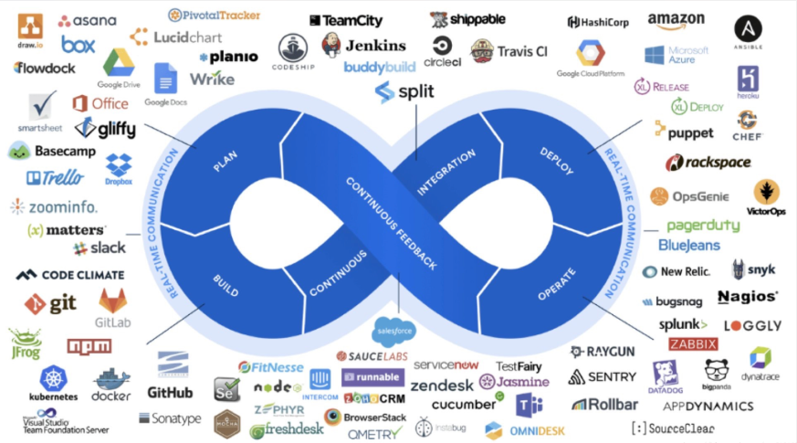
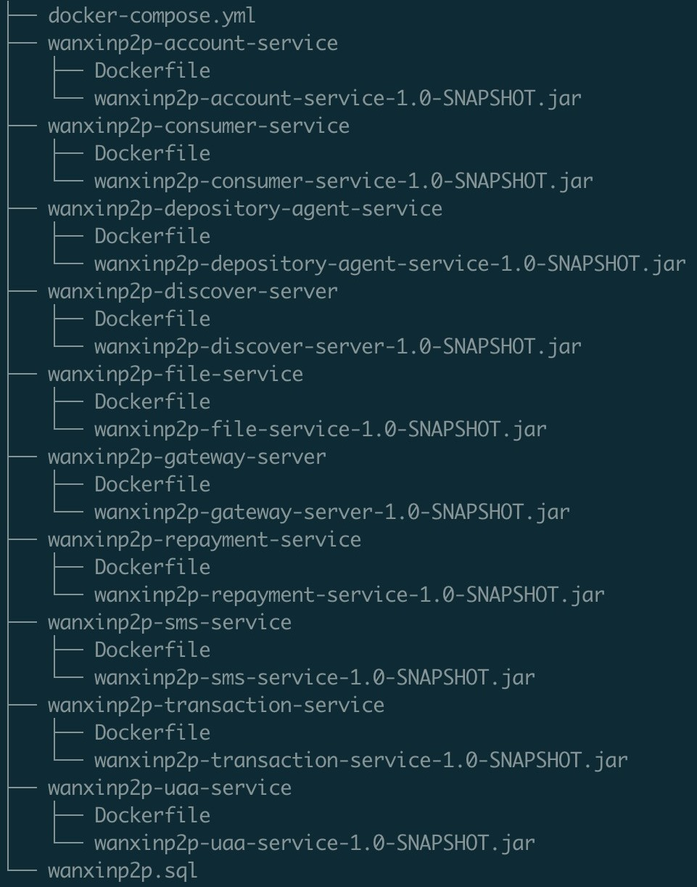

# 第15章 项目部署

> 以下是万信金融项目最终部署和上线的介绍说明

# DevOps 介绍

## 1. 什么是DevOps

DevOps 是 Development 和 Operations 两个词的缩写，引用百度百科的定义：

> DevOps（Development 和 Operations 的组合词）是一组过程、方法与系统的统称，用于促进开发（应用程序/软件工程）、技术运营和质量保障（QA）部门之间的沟通、协作与整合。
>
> 它是一种重视“软件开发人员（Dev）”和“IT运维技术人员（Ops）”之间沟通合作的文化、运动或惯例。透过自动化“软件交付”和“架构变更”的流程，来使得构建、测试、发布软件能够更加地快捷、频繁和可靠。
>
> 它的出现是由于软件行业日益清晰地认识到：为了按时交付软件产品和服务，开发和运维工作必须紧密合作。

DevOps 是一种方法或理念，它涵盖开发、测试、运维的整个过程。DevOps 是提高软件开发、测试、运维、运营等各部门的沟通与协作质量的方法和过程，DevOps 强调软件开发人员与软件测试、软件运维、质量保障（QA） 部门之间有效的沟通与协作，强调通过自动化的方法去管理软件变更、软件集成，使软件从构建到测试、发布更加快捷、可靠，最终按时交付软件。


## 2. DevOps 工具链

DevOps 兴起于2009年，近年来由于云计算、互联网的发展，促进了 DevOps 的基础设施及工具链的发展，涌现了一大批优秀的工具，这些工具包括开发、测试、运维的各各领域，例如：GitHub、Git/SVN、Docker、Jenkins、Hudson、Ant/Maven/Gradle、Selenium、QUnit、JMeter 等。下图是 DevOps 相关的工具集：



之前使用过的 Docker、Git、Node、npm，包括本次介绍的 Jenkins 和 Gogs 都属于 DevOps 工具链。

# Docker Compose 部署项目

> Docker Compose 部署的环境是 Linux 系统，以下部署中文件目录、端口、配置都可以根据实际情况做修改

## 1. 部署总览

### 1.1. 数据架构图


### 1.2. 服务部署图


## 2. 服务总览

|              服务名称               | 服务目录                             |       端口       |                 服务数据映射目录                 |
| ---------------------------------- | :----------------------------------- | --------------- | ----------------------------------------------- |
| mysql                              | ./mysql                              | 3306            | 数据库文件：./db<br/>初始化脚本：./init/init.sql |
| apollo-configservice               | ./apollo/apollo-configservice        | 8080            | 日志：./logs/100003171                          |
| apollo-adminservice                | ./apollo/apollo-adminservice         | 8090            | 日志：./logs/100003172                          |
| apollo-portal                      | ./apollo/apollo-portal               | 8070            | 日志：./logs/100003173                          |
| rmqnamesrv                         | ./rmq                                | 9876            | 数据：./data/store<br/>日志：./data/logs         |
| rmqbroker                          | ./rmq                                | 10909<br/>10911 | 配置：./data/brokerconf/broker.conf             |
| rmqconsole                         | ./rmq                                | 60000           |                                                 |
| elastic-search                     | ./es                                 | 9200<br/>9300   | 配置：./elasticsearch.yml<br/>数据：./data       |
| es-head                            | ./es                                 | 9100            |                                                 |
| logstash                           | ./logstash                           |                 |                                                 |
| zookeeper                          | ./zk                                 | 21811           |                                                 |
| redis                              | ./redis                              | 6379            | 数据：./data                                    |
| wanxindepository                   | ./wanxindepository                   | 55010           | 日志：./logs                                    |
| wanxinp2p-discover-server          | ./wanxinp2p-discover-server          | 53000           | 日志：./logs                                    |
| wanxinp2p-gateway-server           | ./wanxinp2p-gateway-server           | 53010           | 日志：./logs                                    |
| wanxinp2p-uaa-service              | ./wanxinp2p-uaa-service              | 53020           | 日志：./logs                                    |
| wanxinp2p-account-service          | ./wanxinp2p-account-service          | 53030           | 日志：./logs                                    |
| wanxinp2p-consumer-service         | ./wanxinp2p-consumer-service         | 53050           | 日志：./logs                                    |
| wanxinp2p-transaction-service      | ./wanxinp2p-transaction-service      | 53060           | 日志：./logs                                    |
| wanxinp2p-depository-agent-service | ./wanxinp2p-depository-agent-service | 53070           | 日志：./logs                                    |
| wanxinp2p-repayment-service        | ./wanxinp2p-repayment-service        | 53080           | 日志：./logs                                    |
| sailing                            | ./sailing                            | 56085           | 日志：./logs                                    |
| wanxinp2p-web                      | ./web                                | 8081            |                                                 |
| wanxinp2p-admin                    | ./admin                              | 8079            |                                                 |

## 3. 部署流程说明

### 3.1. 安装 Docker

使用版本：Docker version 18.09.7

#### 3.1.1. 卸载旧版本(可选)

1. 执行如下命令，检查是否安装了旧版本：

```bash
[root@node2-vm03 ~]# docker -v
Docker version 1.13.1, build b2f74b2/1.13.1
```

2. 卸载 docker

```bash
sudo yum remove docker \
                docker-client \
                docker-client-latest \
                docker-common \
                docker-latest \
                docker-latest-logrotate \
                docker-logrotate \
                docker-selinux \
                docker-engine-selinux \
                docker-engine
```

3. 删除 docker 数据文件

```bash
sudo rm -rf /var/lib/docker
```

#### 3.1.2. 安装启动

1. 安装

```shell
sudo yum install -y docker-ce-selinux-17.03.2.ce-1.el7.centos.noarch.rpm
sudo yum install -y containerd.io-1.2.2-3.el7.x86_64.rpm
sudo yum install -y docker-ce-cli-18.09.7-3.el7.x86_64.rpm
sudo yum install -y docker-ce-18.09.7-3.el7.x86_64.rpm
```

2. 启动

```shell
# 启动
sudo systemctl start docker
# 检查
docker -v 
```

### 3.2. 安装 Docker Compose

使用版本：docker-compose version 1.22.0。*自己下载安装包并上传到 linux 系统中*

```shell
# 移动
sudo mv docker-compose-Linux-x86_64 /usr/local/bin/docker-compose

# 添加执行权限
sudo chmod +x /usr/local/bin/docker-compose

# 查看版本信息
docker-compose -v
# docker-compose version 1.22.0, build f46880fe
```

### 3.3. 新建各服务目录

使用 `mkdir` 命令新建一系列目录：

1. 总目录：p2p
2. 添加子目录：mysql
3. 添加子目录：apollo
4. 添加子目录：rmq 
5. 添加子目录：zk
6. 添加子目录：redis
7. 添加子目录：es
8. 添加子目录：logstash
9. 添加子目录：wanxinp2p
10. 添加子目录：wanxindepository
11. 添加子目录：web
12. 添加子目录：admin

### 3.4. 安装 JDK1.8

```bash
docker load -i jdk.tar
```

### 3.5. 安装 MySQL

1. 在 mysql 目录下新建 init 文件夹，创建 init.sql 文件，并复制到以下内容

```sql
-- init.sql 修改允许远程登录
use mysql;
GRANT ALL ON *.* TO 'root'@'%';
ALTER USER 'root'@'%' IDENTIFIED WITH mysql_native_password BY '123456';
```

2. 在 mysql 目录下编写 docker-compose.yml 文件

```yaml
version: '3'
services:
  mysql:
    container_name: "mysql"
    image: "docker.io/mysql:5.7.21"
    restart: always
    network_mode: "host"
    hostname: mysql
    environment:
      MYSQL_ROOT_PASSWORD: "123456"
      TZ: Asia/Shanghai
    command:
      --character-set-server=utf8mb4
      --collation-server=utf8mb4_general_ci
      --explicit_defaults_for_timestamp=true
    volumes:
      - "./db:/var/lib/mysql"
      - "./init:/docker-entrypoint-initdb.d/"
    ports:
      - "3306:3306"
```

相关参数说明：

- `MYSQL_ROOT_PASSWORD` 为 root 用户的密码
- image 为拉取镜像的地址和版本
- volumes 里面的参数为映射本地和 docker 容器里面的文件夹和目录
    - `./db` 用来存放了数据库表文件
    - `./init` 存放初始化的脚本

3. 导入 mysql 镜像：

```shell
docker load -i mysql.tar
# 或者
docker-compose pull
```

4. 在存放 docker-compose.yml 的文件夹下执行以下命令

```shell
# 启动
docker-compose up
```

5. 把本地 p2p 数据库中的所有数据导出为 sql 脚本，然后用 SQLYog/navicat 等客户端连接上边安装的 mysql 数据库，并执行 sql 脚本

### 3.6. 安装 Apollo

1. 初始化 Apollo 数据库，把本地 apollo 数据库中的所有数据导出为 sql 脚本，然后用 SQLYog/navicat 等客户端连接上边安装的 mysql 数据库并执行脚本
2. 在 apollo 目录下编写 docker-compose.yml

```yml
version: "3"

services:
  apollo-configservice: # 容器服务名
    container_name: apollo-configservice # 容器名
    build: apollo-configservice/ # Dockerfile路径
    image: apollo-configservice:1.6.0 # 镜像名
    network_mode: "host"
    ports:
      - "8080:8080"
    restart: always
    volumes:
      - "./logs/100003171:/opt/logs/100003171"    # 将/opt/logs/100003171目录挂载到宿主机的./logs/100003171方便在宿主机上查看日志
    environment:
      spring_datasource_url: "jdbc:mysql://127.0.0.1:3306/ApolloConfigDB?characterEncoding=utf8"
      spring_datasource_username: "root"
      spring_datasource_password: "123456"
      JAVA_OPTS: "-Xms512m -Xmx512m -Xmn256m"

  apollo-adminservice:
    container_name: apollo-adminservice
    build: apollo-adminservice/
    image: apollo-adminservice:1.6.0
    network_mode: "host"
    ports:
      - "8090:8090"
    restart: always
    depends_on:
      - apollo-configservice
    volumes:
      - "./logs/100003172:/opt/logs/100003172"
    environment:
      spring_datasource_url: "jdbc:mysql://127.0.0.1:3306/ApolloConfigDB?characterEncoding=utf8"
      spring_datasource_username: "root"
      spring_datasource_password: "123456"
      JAVA_OPTS: "-Xms512m -Xmx512m -Xmn256m"

  apollo-portal:
    container_name: apollo-portal
    build: apollo-portal/
    image: apollo-portal:1.6.0
    network_mode: "host"
    ports:
      - "8070:8070"
    restart: always
    depends_on:
      - apollo-adminservice
    volumes:
      - "./logs/100003173:/opt/logs/100003173"
    environment:
      spring_datasource_url: "jdbc:mysql://127.0.0.1:3306/ApolloPortalDB?characterEncoding=utf8"
      spring_datasource_username: "root"
      spring_datasource_password: "123456"
      JAVA_OPTS: "-Xms512m -Xmx512m -Xmn256m -Ddev_meta=http://127.0.0.1:8080"
```

3. 在 apollo 目录下新建 apollo-adminservice 目录，从示例项目中拷贝相关文件进来(jar+zip+Dockerfile)
4. 在 apollo 目录下新建 apollo-configservice 目录，从示例项目中拷贝相关文件进来(jar+zip+Dockerfile)
5. 在 apollo 目录下新建 apollo-portal 目录，从示例项目中拷贝相关文件进来(jar+zip+Dockerfile)
    - > 注意：需要挨个检查并修改 Dockerfile 文件中的 ip 地址、账号、密码等数据
6. 安装 Apollo

```bash
docker-compose up
```

7. 访问管理页面：http://ip地址:8070

> 相关的文件位置：wanxinp2p-project\docker\apollo\

### 3.7. 安装 RocketMQ

1. 在 rmq 目录下新建 data/brokerconf 子目录，并在该目录下编写 broker.conf 文件

```properties
brokerClusterName = P2PCluster
brokerName = broker-p2p1
brokerId = 0
deleteWhen = 04
fileReservedTime = 48
brokerRole = ASYNC_MASTER
flushDiskType = ASYNC_FLUSH
```

2. 在 rmq 目录下编写 docker-compose.yml

```yaml
version: '3.5'
services:
  rmqnamesrv:
    image: foxiswho/rocketmq:server
    container_name: rmqnamesrv
    ports:
      - 9876:9876
    restart: always
    volumes:
      - ./data/logs:/opt/logs
      - ./data/store:/opt/store
    networks:
      rmq:
        aliases:
          - rmqnamesrv

  rmqbroker:
    image: foxiswho/rocketmq:broker
    container_name: rmqbroker
    ports:
      - 10909:10909
      - 10911:10911
    restart: always
    volumes:
      - ./data/logs:/opt/logs
      - ./data/store:/opt/store
      - ./data/brokerconf/broker.conf:/etc/rocketmq/broker.conf
    environment:
      NAMESRV_ADDR: "rmqnamesrv:9876"
      JAVA_OPTS: " -Duser.home=/opt"
      JAVA_OPT_EXT: "-server -Xms1g -Xmx1g -Xmn512m"
    command: mqbroker -c /etc/rocketmq/broker.conf
    depends_on:
      - rmqnamesrv
    networks:
      rmq:
        aliases:
          - rmqbroker

  rmqconsole:
    image: styletang/rocketmq-console-ng
    container_name: rmqconsole
    ports:
      - 60000:60000
    restart: always
    environment:
      JAVA_OPTS: "-Dserver.port=60000 -Xms512m -Xmx512m -Xmn256m -Drocketmq.namesrv.addr=rmqnamesrv:9876 -Dcom.rocketmq.sendMessageWithVIPChannel=false"
    depends_on:
      - rmqnamesrv
    networks:
      rmq:
        aliases:
          - rmqconsole
  networks:
    rmq:
      name: rmq
      driver: bridge
```

3. 导入镜像

```shell
docker load -i rmq.tar
# 或者
docker-compose pull 
```

4. 启动 RocketMQ 

```bash
docker-compose up -d
```

5. 访问管理端：http://ip地址:60000

### 3.8. 安装 Zookeeper

1. 在 zk 目录下编写 docker-compose.yml

```yml
version: '3'
services:
  zookeeper:
    container_name: zookeeper
    image: zookeeper:3.4.14
    restart: always
    ports:
      - 21811:2181
    logging:
      driver: "json-file"
      options:
        max-size: "10k"
        max-file: "10"
```

2. 导入镜像

```shell
docker load -i zk.tar
# 或者
docker-compose pull
```

3. 启动 Zookeeper

```bash
docker-compose up
```

### 3.9. 安装 ElasticSearch 和 Logstash

#### 3.9.1. 安装 ElasticSearch

1. 在 es 目录下编写 elasticsearch.yml

```yml
bootstrap:
    memory_lock: true
cluster:
    name: wanxinp2p
discovery:
    type: single-node
    zen:
        minimum_master_nodes: 1
http:
    cors:
        allow-origin: '"*"'
        enabled: true
network:
    host: 0.0.0.0
node:
    name: wanxinp2p_node
xpack:
    monitoring:
        enabled: false
    security:
        enabled: false
    watcher:
        enabled: false
```
   
2. 在 es 目录下编写 docker-compose.yml

```yml
version: '3'
services:
  elastic:
    container_name: "elastic"
    image: bachue/elasticsearch-ik:6.2.4
    network_mode: "host"
    restart: "always"
    environment:
      - TZ='Asia/Shanghai'
      - "ES_JAVA_OPTS=-Xms512m -Xmx512m"
    ulimits:
      memlock:
        soft: -1
        hard: -1
    volumes:
      - "./elasticsearch.yml:/usr/share/elasticsearch/config/elasticsearch.yml"
      - "./data:/usr/share/elasticsearch/data"
    ports:
      - "9200:9200"
      - "9300:9300"
  elasticsearch-head:
    image: wallbase/elasticsearch-head:6-alpine
    network_mode: "host"
    container_name: "elasticsearch-head"
    environment:
      TZ: Asia/Shanghai
    ports:
      - '9100:9100'
```

3. 在 es 目录下新建 data 文件夹，并设置权限：

```shell
chmod 777 p2p/es/data
```

4. 导入镜像

```shell
docker load -i es.tar
# 或者
docker-compose pull
```

5. 启动

```bash
docker-compose up
```

6. 访问es-head：http://localhost:9100

#### 3.9.2. 安装 Logstash

1. 在 logstash 目录下新建 config 和 sql 文件夹
2. 从示例项目中找到 logstash.yml、mysql-ef.conf，wanxinp2p_project_template.json，并复制到 config 目录下
    - > 注意：需要检查上述文件的内容是否需要修改，例如ip地址、端口号、账号、密码等等
3. 从示例项目中找到 wanxinp2p-project_0.sql、wanxinp2p-project_1.sql，并复制到 sql 目录下
4. 在 logstash 目录下编写 docker-compose.yml

```yml
version: '3'
services:
  logstash:
    container_name: logstash
    build: ./
    image: docker.elastic.co/logstash/logstash:6.2.4
    volumes:
      - './config/logstash.yml:/usr/share/logstash/config/logstash.yml'
      - './pipeline:/usr/share/logstash/pipeline'
      - './config/wanxinp2p_project_template.json:/usr/share/logstash/config/wanxinp2p_project_template.json'
      - './sql:/usr/share/logstash/sql'
      - './logstash_metadata:/usr/share/logstash/config/logstash_metadata'
    network_mode: "host"
    restart: "always"
    environment:
      LS_JAVA_OPTS: "-Xmx256m -Xms256m"
      TZ: "Asia/Shanghai"
```

5. 导入镜像

```shell
docker load -i logstash.tar
# 或者
docker-compose pull
```

6. 启动：

```bash
docker-compose up
```

### 3.10. 安装 Redis

1. 在 redis 目录下编写 docker-compose.yml

```yml
version: '3.0'
services:
  redis:
    image: redis:5.0.5
    container_name: redis
    restart: always
    network_mode: "host"
    ports:
      - "6379:6379"
    volumes:
      - ./data:/data
    command: redis-server
    tty: true
```

2. 导入镜像

```shell
docker load -i redis.tar
# 或者
docker-compose pull
```

3. 启动 Redis

```bash
docker-compose up
```

### 3.11. 部署验证码服务

1. 在 sailing 目录下编写 docker-compose.yml

```yml
version: "3"

services:
  sailing:
    container_name: sailing
    build: .
    image: sailing:1.0-SNAPSHOT
    network_mode: "host"
    ports:
      - "56085:56085"
    restart: always
    volumes:
      - "./logs:/logs"
    environment:
      JAVA_OPTS: "-Xms256m -Xmx256m -Xmn128m"
```

2. 构建镜像

```bash
docker-compose up
```

3. 启动服务

```bash
docker-compose up -d
```
   
4. 测试：http://127.0.0.1:56085/sailing/swagger-ui.html

### 3.12. 部署银行存管系统

1. 初始化数据库。从本地数据库中把银行存管系统数据导出为 sql 脚本，然后用 SQLYog 连接前面的 MySQL 数据并执行脚本
2. 在 IDEA 中打包银行存管系统，并把 jar 文件复制到 wanxindepository 目录下
3. 在 wanxindepository 目录下编写 dockerFile 文件

```
FROM openjdk:8-jre-alpine

ENV VERSION 1.0-SNAPSHOT

RUN echo "http://mirrors.aliyun.com/alpine/v3.8/main" > /etc/apk/repositories \
    && echo "http://mirrors.aliyun.com/alpine/v3.8/community" >> /etc/apk/repositories \
    && apk update upgrade \
    && apk add --no-cache procps curl bash tzdata \
    && ln -sf /usr/share/zoneinfo/Asia/Shanghai /etc/localtime \
    && echo "Asia/Shanghai" > /etc/timezone

ADD wanxindepository-${VERSION}.jar wanxindepository.jar
RUN bash -c 'touch /wanxindepository.jar'

EXPOSE 55010

ENV JAVA_OPTS=""
ENTRYPOINT ["bash", "-c", "java $JAVA_OPTS -jar /wanxindepository.jar"]
```

4. 在 wanxindepository 目录下编写 docker-compose.yml

```yaml
version: "3"

services:
  wanxindepository:
    container_name: wanxindepository
    build: .
    image: wanxindepository:1.0-SNAPSHOT
    network_mode: "host"
    ports:
      - "55010:55010"
    restart: always
    volumes:
      - "./data/apollo:/config-cache"
      - "./logs:/logs"
    environment:
      JAVA_OPTS: "-Dserver.port=55010 -Denv=dev -Dapollo.cluster=DEFAULT"
```

5. 构建镜像

```bsh
docker-compose up
```

6. 启动 wanxindepository

```bash
docker-compose up -d
```

### 3.13. 部署万信金融平台

1. 在wanxinp2p目录下添加对应微服务的子目录：
    - wanxinp2p-discover-server
    - wanxinp2p-gateway-server
    - wanxinp2p-uaa-service
    - wanxinp2p-account-service
    - wanxinp2p-consumer-service
    - wanxinp2p-transaction-service
    - wanxinp2p-depository-agent-service
    - wanxinp2p-repayment-service
2. 在 IDEA 中打包各个微服务，并复制 jar 文件到对应的目录



3. 自己编写或从示例目录中找到 Dockerfile 文件并像上图一样复制到对应目录中
4. 在 wanxinp2p 目录下编写 docker-compose.yml

```yml
version: "3"

services:
  wanxinp2p-discover-server:
    container_name: wanxinp2p-discover-server
    build: wanxinp2p-discover-server/
    image: wanxinp2p-discover-server:1.0-SNAPSHOT
    network_mode: "host"
    ports:
      - "53000:53000"
    restart: always
    volumes:
      - "./logs:/logs"
    environment:
      SERVER_PORT: "53000"
      JAVA_OPTS: "-Xms512m -Xmx512m -Xmn256m"

  wanxinp2p-gateway-server:
    container_name: wanxinp2p-gateway-server
    build: wanxinp2p-gateway-server/
    image: wanxinp2p-gateway-server:1.0-SNAPSHOT
    network_mode: "host"
    ports:
      - "9876:9876"
    depends_on:
      - wanxinp2p-discover-server
    restart: always
    volumes:
      - "./logs:/logs"
    environment:
      SERVER_PORT: "9876"
      JAVA_OPTS: "-Xms512m -Xmx512m -Xmn256m -Dserver.port=9876 -Denv=dev -Dapollo.cluster=DEFAULT"

  wanxinp2p-uaa-service:
    container_name: wanxinp2p-uaa-service
    build: wanxinp2p-uaa-service/
    image: wanxinp2p-uaa-service:1.0-SNAPSHOT
    network_mode: "host"
    ports:
      - "53020:53020"
    depends_on:
      - wanxinp2p-discover-server
    restart: always
    volumes:
      - "./logs:/logs"
    environment:
      SERVER_PORT: "53020"
      JAVA_OPTS: "-Xms512m -Xmx512m -Xmn256m -Dserver.port=53020 -Denv=dev -Dapollo.cluster=DEFAULT"

  wanxinp2p-account-service:
    container_name: wanxinp2p-account-service
    build: wanxinp2p-account-service/
    image: wanxinp2p-account-service:1.0-SNAPSHOT
    network_mode: "host"
    ports:
      - "53030:53030"
    depends_on:
      - wanxinp2p-discover-server
    restart: always
    volumes:
      - "./logs:/logs"
    environment:
      SERVER_PORT: "53030"
      JAVA_OPTS: "-Xms512m -Xmx512m -Xmn256m -Dserver.port=53030 -Denv=dev -Dapollo.cluster=DEFAULT"

  wanxinp2p-consumer-service:
    container_name: wanxinp2p-consumer-service
    build: wanxinp2p-consumer-service/
    image: wanxinp2p-consumer-service:1.0-SNAPSHOT
    network_mode: "host"
    ports:
      - "53050:53050"
    depends_on:
      - wanxinp2p-discover-server
    restart: always
    volumes:
      - "./logs:/logs"
    environment:
      SERVER_PORT: "53050"
      JAVA_OPTS: "-Xms512m -Xmx512m -Xmn256m -Dserver.port=53050 -Denv=dev -Dapollo.cluster=DEFAULT"

  wanxinp2p-transaction-service:
    container_name: wanxinp2p-transaction-service
    build: wanxinp2p-transaction-service/
    image: wanxinp2p-transaction-service:1.0-SNAPSHOT
    network_mode: "host"
    ports:
      - "53060:53060"
    depends_on:
      - wanxinp2p-discover-server
    restart: always
    volumes:
      - "./logs:/logs"
    environment:
      SERVER_PORT: "53060"
      JAVA_OPTS: "-Xms512m -Xmx512m -Xmn256m -Dserver.port=53060 -Denv=dev -Dapollo.cluster=DEFAULT"

  wanxinp2p-depository-agent-service:
    container_name: wanxinp2p-depository-agent-service
    build: wanxinp2p-depository-agent-service/
    image: wanxinp2p-depository-agent-service:1.0-SNAPSHOT
    network_mode: "host"
    ports:
      - "53070:53070"
    depends_on:
      - wanxinp2p-discover-server
    restart: always
    volumes:
      - "./logs:/logs"
    environment:
      SERVER_PORT: "53070"
      JAVA_OPTS: "-Xms512m -Xmx512m -Xmn256m -Dserver.port=53070 -Denv=dev -Dapollo.cluster=DEFAULT"

  wanxinp2p-repayment-service:
    container_name: wanxinp2p-repayment-service
    build: wanxinp2p-repayment-service/
    image: wanxinp2p-repayment-service:1.0-SNAPSHOT
    network_mode: "host"
    ports:
      - "53080:53080"
    depends_on:
      - wanxinp2p-discover-server
    restart: always
    volumes:
      - "./logs:/logs"
    environment:
      SERVER_PORT: "53080"
      JAVA_OPTS: "-Xms512m -Xmx512m -Xmn256m -Dserver.port=53080 -Denv=dev -Dapollo.cluster=DEFAULT"
```

5. 构建镜像

```bash
docker-compose up
```

6. 启动 wanxinp2p 服务

```bash
docker-compose up -d
```

### 3.14. 部署万信金融平台前端

1. 找到示例目录中提供的前端工程(不要用之前开发阶段的 wanxinp2p_front 工程)，复制到 web 目录下
2. 修改后端地址和文件服务地址：src/utils/request.js

```js
const BaseUrl = 'http://127.0.0.1:53010/'
const FileServiceUrl = 'http://127.0.0.1:56082/farming/'
```

3. 编写 docker-compose.yml

```
version: '3'
services:
  wanxinp2p-web:
    container_name: wanxinp2p-web
    image: ebiven/vue-cli
    command:
      - /bin/sh
      - -c
      - |
        #npm install sass-loader -D
        #npm install node-sass --save-dev
        npm run dev:h5
    volumes:
      - ./my-project:/code
    network_mode: "host"
    restart: always
    ports:
      - "8081:8081"
```

4. 启动前端

```bash
docker-compose up -d
```

# 4 测试

通过浏览器访问：http://localhost:8081/ 并进行登录

> 注意：有些服务该文档并未提供部署说明，需要自行完成部署

# 持续集成

> 持续集成工具 Jenkins 更多内容详见[《Jenkins 持续集成工具》笔记](/05-DevOps工具/04-持续集成工具/01-Jenkins)

## 1. 概述

### 1.1. 问题描述

传统的软件开发流程如下：

1. 项目经理分配模块给开发人员
2. 每个模块的开发人员并行开发，并进行单元测试
3. 开发完毕，将代码集成部署到测试服务器，测试人员进行测试。
4. 测试人员发现 bug，提交 bug、开发人员修改 bug
5. bug 修改完毕再次集成、测试。

问题描述：

1. 模块之间依赖关系复杂，在集成时发现大量 bug
2. 测试人员等待测试时间过长
3. 集成部署耗时耗力，软件交付无法保障

解决上述问题的思考：

1. 能否把集成测试提前进行？能否放在平时每隔几天甚至每天都进行？
2. 人工集成部署耗时耗力，能否使用自动化工具代替人工集成部署的过程？

### 1.2. 什么是持续集成

持续集成，即 Continuous Integration，简称 CI，随着软件开发复杂度的不断提高，团队开发成员间如何更快更好的协同工作以确保软件开发的质量已经成为一个不可回避的问题。尤其是近年来如何能在不断变化的需求中快速适应和保证软件的质量显得尤其的重要，持续集成就是针对此类问题的一种软件协同实践。它倡导团队开发成员必须经常集成他们的工作，甚至每天都可能发生多次集成，而每次的集成都是通过自动化的构建来实现的，包括自动获取仓库代码、自动编译、自动发布和测试，从而尽可能早的发现问题，让团队能更快的开发高质量的软件。 

持续集成的好处：

1. 自动化集成部署，提高了集成效率。
2. 更快的修复问题。
3. 更快的进行交付。
4. 提高了产品质量。


### 1.3. P2P 项目持续集成流程


## 2. 搭建持续集成环境


