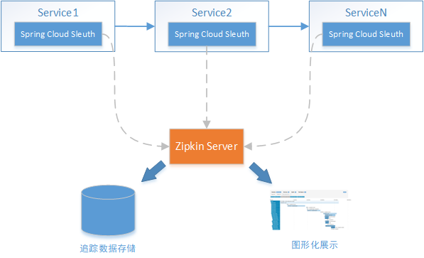

# 第16章 服务调用链路追踪

> 注：此章节使用了 Spring Cloud Sleuth + Zipkin 的解决方案。更多内容详见[《Spring Cloud Sleuth》笔记](/07-分布式架构&微服务架构/02-SpringCloud/07-Spring-Cloud-Sleuth)

## 1. 链路追踪概述

### 1.1. 问题分析

随着分布式服务架构的流行，特别是**微服务**等设计理念在系统中的应用，每个服务变得越来越简单、纯粹，而复杂度被转移到了多个服务间协作的整体架构层面，各微服务间的调用关系也变得越来越复杂。通常一个由客户端发起的请求在后端系统中会经过多个不同的微服务调用来协同产生最后的请求结果，<font color=red>**这个过程就产生了一个服务调用链路**</font>。


左图展示的是单体应用，在同一个进程中不同业务模块的相互调用；右图展示的是微服务架构，微服务间通过 rest 调用协作实现业务流程。随着业务的不断扩张，服务之间互相调用会越来越复杂

即使作为分布式系统的设计者、开发者，也很难清楚的说出某个服务的调用链路，况且服务调用链路还是动态变化的。在复杂的微服务架构系统中，几乎每一个前端请求都会形成一个复杂的分布式服务调用链路，一次请求少则经过三四次服务调用完成，多则跨越几十个甚至是上百个服务节点。

在这样的前提下，每条链路中任何一个依赖服务出现延迟过高或者错误都有可能引起请求最后的失败。并且当整个请求变慢或不可用时，开发人员是无法得知该请求是由某个或某些后端服务引起的。

### 1.2. 解决方案

#### 1.2.1. 错误分析的关键信息

在复杂微服务调用情况中发生错误时，至少需要得到以下信息用于分析并得出最优的解决方案：

1. **服务调用依赖图**，用于了解本次请求需要经过哪些服务才能顺利完成，可进行梳理服务依赖关系以及优化，如下图：


2. **服务调用链路错误信息**，若请求出现**错误**，快速定位哪个环节出现问题，各个调用环节的可用性分析，并优化，如下图：


3. **服务调用链路中各阶段的耗时信息**，若请求出现**延迟**，可进行性能分析，并优化，如下图：


因此获取以上三点信息至关重要。可以在合适的位置(例如：微服务调用的前后)记录日志，然后对日志进行汇总、分析，即可获得以上三点信息，但是日志数据是纯文本，不便于观察，如果对日志进行汇总、分析时能支持图形化输出展示就更好了，于是业界慢慢形成了一个成熟完善的服务调用链路追踪系统。简单来说，服务调用链路追踪系统就是用来在生产环境跟踪、记录问题的，可以直观的看出每个 service 之间的调用关系和消耗的时间。下面以追踪日志举例：

| 请求追踪编号 | 服务  |   方法   |    执行前时间     |   执行完成时间    |
| ------------ | ----- | ------- | ---------------- | ---------------- |
| 1201         | 服务A | send    | 1458702548786000 | 1458702548886000 |
| 1201         | 服务B | receive | 1458702548926000 | 1458702549526000 |

追踪日志必须要有一个<font color=red>**请求追踪编号**</font>来表示多条日志为一个请求触发的多个服务调用，并记录执行的服务、方法执行前时间戳、执行完成时间戳等信息。以上追踪日志表示：编号为 1201 的这次请求经历了服务A.send方法、服务B.receive方法来完成整个请求链路。

#### 1.2.2. Spring Cloud Sleuth + Zipkin

Spring Cloud Sleuth + Zipkin 是 Java 开源体系中成熟的服务调用链路追踪方案，其中 Spring Cloud Sleuth 以 jar 包的形式嵌入在应用程序中，完成对追踪日志的采集并上报至 Zipkin，Zipkin 对所有服务上报来的日志进行汇总，分析，最终以图形化的形式展示给用户。



## 2. Spring Cloud Sleuth

Spring Cloud Sleuth 实现了一种分布式的服务链路跟踪解决方案，通过使用 Sleuth 可以让我们快速定位某个服务的问题。简单来说，Sleuth 相当于调用链监控工具的客户端，集成在各个微服务上，负责产生调用链监控数据。Spring Cloud Sleuth 可以结合 Zipkin，将信息发送到 Zipkin Server，利用 Zipkin 来存储和展示数据(详见前面章节的图示)

### 2.1. 基础使用

要在项目中使用 Spring Cloud Sleuth，只需要两步即可：

- 修改项目 pom.xml 文件，引入 sleuth 依赖

```xml
<dependencyManagement>
    <dependencies>
        <dependency>
            <groupId>org.springframework.cloud</groupId>
            <artifactId>spring-cloud-dependencies</artifactId>
            <version>${release.train.version}</version>
            <type>pom</type>
            <scope>import</scope>
        </dependency>
    </dependencies>
</dependencyManagement>

<dependencies>
    <dependency>
        <groupId>org.springframework.cloud</groupId>
        <artifactId>spring-cloud-starter-sleuth</artifactId>
    </dependency>
</dependencies>
```

- 修改 spring boot 配置

```properties
# 是否开启sleuth
spring.sleuth.enabled=true

# 添加日志级别（可选）
logging.level.org.springframework.web.servlet.DispatcherServlet=DEBUG
```

### 2.2. 入门案例简介

入门案例会创建两个微服务，并通过 RestTemplate 实现服务之间的调用，形成如下调用链：


### 2.3. 功能实现

#### 2.3.1. 聚合父工程

创建 maven 聚合工程，引入依赖

```xml
<?xml version="1.0" encoding="UTF-8"?>
<project xmlns="http://maven.apache.org/POM/4.0.0"
         xmlns:xsi="http://www.w3.org/2001/XMLSchema-instance"
         xsi:schemaLocation="http://maven.apache.org/POM/4.0.0 http://maven.apache.org/xsd/maven-4.0.0.xsd">

    <parent>
        <groupId>org.springframework.boot</groupId>
        <artifactId>spring-boot-starter-parent</artifactId>
        <version>2.2.4.RELEASE</version>
        <relativePath/>
    </parent>

    <modelVersion>4.0.0</modelVersion>
    <groupId>com.moon</groupId>
    <artifactId>spring-cloud-sleuth-demo</artifactId>
    <version>1.0-SNAPSHOT</version>
    <packaging>pom</packaging>
    <description>
        Spring Cloud Sleuth 基础入门示例
    </description>

    <modules>
        <module>sleuth-demo1</module>
        <module>sleuth-demo2</module>
    </modules>

    <dependencyManagement>
        <dependencies>
            <dependency>
                <groupId>org.springframework.cloud</groupId>
                <artifactId>spring-cloud-dependencies</artifactId>
                <version>Greenwich.RELEASE</version>
                <type>pom</type>
                <scope>import</scope>
            </dependency>
        </dependencies>
    </dependencyManagement>

    <build>
        <finalName>${project.name}</finalName>
        <resources>
            <resource>
                <directory>src/main/resources</directory>
                <filtering>true</filtering>
                <includes>
                    <include>**/*</include>
                </includes>
            </resource>
            <resource>
                <directory>src/main/java</directory>
                <includes>
                    <include>**/*.xml</include>
                </includes>
            </resource>
        </resources>
        <plugins>
            <plugin>
                <groupId>org.springframework.boot</groupId>
                <artifactId>spring-boot-maven-plugin</artifactId>
            </plugin>

            <plugin>
                <groupId>org.apache.maven.plugins</groupId>
                <artifactId>maven-compiler-plugin</artifactId>
                <configuration>
                    <source>1.8</source>
                    <target>1.8</target>
                </configuration>
            </plugin>

            <plugin>
                <artifactId>maven-resources-plugin</artifactId>
                <configuration>
                    <encoding>utf-8</encoding>
                    <useDefaultDelimiters>true</useDefaultDelimiters>
                </configuration>
            </plugin>
        </plugins>
    </build>
</project>
```

#### 2.3.2. 微服务A

- 新建 Maven 子工程 sleuth-demo1，引入依赖

```xml
<dependencies>
    <dependency>
        <groupId>org.springframework.boot</groupId>
        <artifactId>spring-boot-starter-web</artifactId>
    </dependency>
    <dependency>
        <groupId>org.springframework.cloud</groupId>
        <artifactId>spring-cloud-starter-sleuth</artifactId>
    </dependency>
    <dependency>
        <groupId>org.projectlombok</groupId>
        <artifactId>lombok</artifactId>
    </dependency>
</dependencies>
```

- spring boot 配置

#### 2.3.3. 微服务B

### 2.4. 功能测试
