# 第18章 Hystrix 服务熔断

## 1. 服务熔断概述

在微服务架构的应用系统中，为了完成一次业务请求，往往需要多个服务协作完成，每次调用都会产生一个调用链。而且微服务之间进行 rpc 或者 http 调用时，此时一般都会设置**调用超时**，**失败重试**等机制来确保服务的成功执行。但实际上还是会存在问题

### 1.1. 问题分析

假设有两个访问量比较大的服务A和B，这两个服务分别依赖C和D，C和D服务都依赖E，如下图所示：

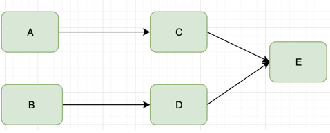

A和B不断的调用C,D处理客户请求和返回需要的数据。当E不能供服务的时候，C和D的**超时和重试机制会被执行**，如下图所示：

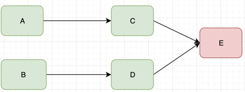

由于新的调用不断的产生，会导致C和D对E服务的调用大量的积压，产生大量的调用等待和重试调用，慢慢会耗尽C和D的资源，比如内存或CPU，然后挂掉，如下图所示：

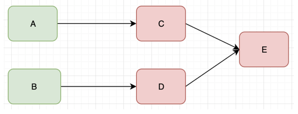

接下来A和B服务会重复C和D的操作，资源耗尽，然后挂掉，最终一堆服务都不可访问，如下图所示：

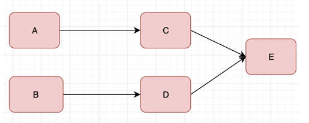

像上面这种调用链路的连锁故障，叫做<font color=red>**雪崩**</font>。万信金融P2P项目也会碰到类似场景，例如：开户业务，满标放款业务等(可以查看业务流程图)。

### 1.2. 解决方案

在分布式架构中，可以为每个微服务加装“保险丝”，即：熔断器，也叫断路器。当发现依赖的服务在一段时间内持续出现错误，熔断器就会自动断开，后续的请求不会再真正访问依赖的服务，而是快速返回错误或缓存的数据，从而避免程序不断的尝试执行可能失败的操作，降低资源消耗。

熔断这一概念来源于电子工程中的断路器（Circuit Breaker）。在互联网系统中，当下游服务因访问压力过大而响应变慢或失败，上游服务为了保护系统整体的可用性，可以暂时切断对下游服务的调用。这种牺牲局部，保全整体的措施就叫做<font color=red>**服务熔断**</font>。

当进入<font color=red>熔断状态</font>后，服务消费方将不会发出远程调用，直接返回失败。这样的情况用户体验显然不好，针对这种情况，服务消费方可以在本地准备一个备用的降级方法进行用户体验改善处理。比如，查询接口可准备默认值或缓存；秒杀业务可提示用户稍后再试。这种因服务处理能力退化而优雅返回错误的能力，叫做<font color=red>**服务降级**</font>。熔断器是系统稳定性的最后一重保障。

## 2. Hystrix

### 2.1. 简介

Spring Cloud 中的断路器组件就是 Hystrix，它也是 Netflix 套件的一部分。此组件用于服务熔断的功能

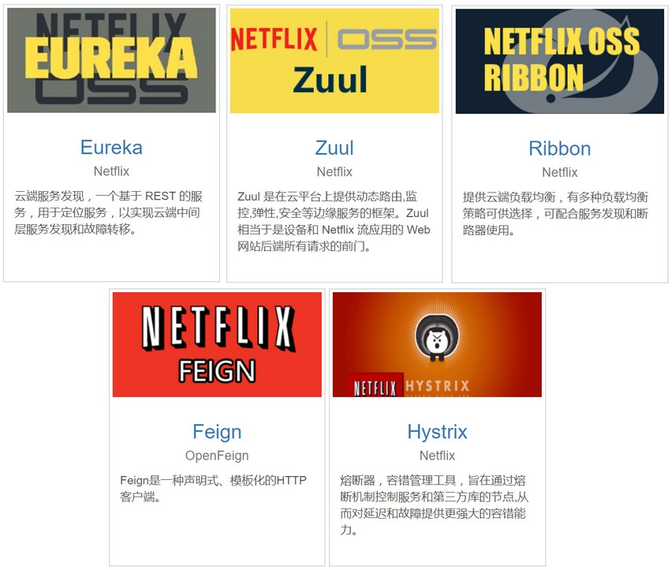

### 2.2. 工作原理

当对某个服务的调用在一定的时间内(默认10s)，有超过一定次数(默认20次)并且失败率超过一定值(默认50%)，Hystrix断路器会切换到开路状态(Open)，这时所有请求会直接失败而不会发送到后端服务，断路器保持开路状态一段时间后(默认5秒), 自动切换到半开路状态(HALF-OPEN)，这时会判断下一次请求的返回情况，如果请求成功，断路器切回闭路状态(CLOSED)，否则重新切换到开路状态(OPEN)，也就是说断路器有自我检测并恢复的能力。

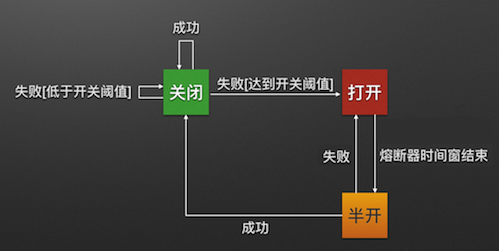

### 2.3. 降级回退

降级回退指的是某些服务熔断后，执行备用逻辑从故障服务中快速失败或快速返回，以保障主体业务不受影响。Hystrix 提供的降级主要是为了容错，保证当前服务不受依赖服务故障的影响，从而提高服务的健壮性。fallback 的方式包括：

- 返回空值
- 返回默认值
- 访问缓存
- 执行某些逻辑

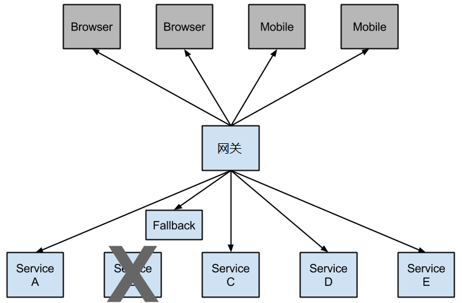

## 3. Feign 与 Hystrix 整合入门

Feign 和 Hystrix 都属于 SpringCloud 的组件，它们两个经常会一起使用。在通过 Feign 组件发起远程调用时，可以通过 Hystrix 对此次调用实施熔断、降级处理。

### 3.1. 聚合父工程

创建 feign-hystrix-demo 的 maven 聚合父工程，添加以下依赖：

```xml
<?xml version="1.0" encoding="UTF-8"?>
<project xmlns="http://maven.apache.org/POM/4.0.0"
         xmlns:xsi="http://www.w3.org/2001/XMLSchema-instance"
         xsi:schemaLocation="http://maven.apache.org/POM/4.0.0 http://maven.apache.org/xsd/maven-4.0.0.xsd">

    <parent>
        <groupId>org.springframework.boot</groupId>
        <artifactId>spring-boot-starter-parent</artifactId>
        <version>2.1.13.RELEASE</version>
    </parent>

    <modelVersion>4.0.0</modelVersion>
    <groupId>com.moon</groupId>
    <artifactId>feign-hystrix-demo</artifactId>
    <version>1.0-SNAPSHOT</version>
    <packaging>pom</packaging>
    <description>Spring Cloud feign 与 hystrix 整合基础使用示例</description>

    <properties>
        <maven.compiler.source>8</maven.compiler.source>
        <maven.compiler.target>8</maven.compiler.target>
    </properties>

    <dependencyManagement>
        <dependencies>
            <dependency>
                <groupId>org.springframework.cloud</groupId>
                <artifactId>spring-cloud-dependencies</artifactId>
                <version>Greenwich.RELEASE</version>
                <type>pom</type>
                <scope>import</scope>
            </dependency>
        </dependencies>
    </dependencyManagement>

</project>
```

### 3.2. Eureka 注册中心服务

- 创建注册中心服务 hystrix-discovery-server，引用以下依赖：

```xml
<dependencies>
    <dependency>
        <groupId>org.springframework.cloud</groupId>
        <artifactId>spring-cloud-starter-netflix-eureka-server</artifactId>
    </dependency>
</dependencies>
```

- 创建 application.yml 配置文件

```yml
server:
  port: 59020
spring:
  application:
    name: hystrix-discovery-server
eureka:
  client:
    serviceUrl:
      defaultZone: http://${eureka.instance.hostname}:${server.port}/eureka/
  instance:
    hostname: localhost
```

- 项目启动类，开启服务 eureka

```java
@SpringBootApplication
@EnableEurekaServer
public class DiscoveryServer {
    public static void main(String[] args) {
        SpringApplication.run(DiscoveryServer.class, args);
    }
}
```

### 3.3. 微服务B（被调用方）

- 创建 hystrix-service-b 项目，将来被服务A通过 Feign 进行远程调用。引入相关依赖

```xml
<dependencies>
    <dependency>
        <groupId>org.springframework.boot</groupId>
        <artifactId>spring-boot-starter-web</artifactId>
    </dependency>
    <dependency>
        <groupId>org.springframework.cloud</groupId>
        <artifactId>spring-cloud-starter-netflix-eureka-client</artifactId>
    </dependency>
    <dependency>
        <groupId>org.springframework.cloud</groupId>
        <artifactId>spring-cloud-starter-openfeign</artifactId>
    </dependency>
    <dependency>
        <groupId>org.springframework.cloud</groupId>
        <artifactId>spring-cloud-starter-netflix-hystrix</artifactId>
    </dependency>
</dependencies>
```

- 创建 application.yml 配置文件

```yml
server:
  port: 59022
  servlet:
    context-path: /service-b
spring:
  application:
    name: feign-hystrix-service-b
eureka:
  client:
    serviceUrl:
      defaultZone: http://localhost:59020/eureka/
```

- 创建项目启动类，
- 创建请求层，用于被调用

```java
@RestController
public class ServiceBController {

    @GetMapping("service")
    public String service() {
        return "Service B is running";
    }
}
```


### 3.4. 微服务A（调用方）

- 创建 hystrix-service-a 项目，引入与服务B一样的依赖，需要多引入 feign 与 hystrix 的依赖：

```xml
<dependency>
    <groupId>org.springframework.cloud</groupId>
    <artifactId>spring-cloud-starter-openfeign</artifactId>
</dependency>
<dependency>
    <groupId>org.springframework.cloud</groupId>
    <artifactId>spring-cloud-starter-netflix-hystrix</artifactId>
</dependency>
<dependency>
    <groupId>org.springframework.boot</groupId>
    <artifactId>spring-boot-starter-actuator</artifactId>
</dependency>
```

- 创建 application.yml 配置文件

```yml
server:
  port: 59021
  servlet:
    context-path: /service-a
spring:
  application:
    name: feign-hystrix-service-a
eureka:
  client:
    serviceUrl:
      defaultZone: http://localhost:59020/eureka/
# 开启 hystrix
feign:
  hystrix:
    enabled: true
```

- 创建项目启动类，在类上标识 `@EnableFeignClients` 注解开启 feign 支持
- 创建服务B 的 feign 代理接口，并在 `@FeignClient` 注解中的 `fallbackFactory` 属性指定对应降级处理工厂实现类

```java
@FeignClient(name = "feign-hystrix-service-b", fallbackFactory = ServiceBAgentHystrix.class)
public interface ServiceBAgent {

    @GetMapping("/service-b/service")
    String service();
}
```

- 创建降级处理工厂实现类 `ServiceBAgentHystrix`，实现 `feign.hystrix.FallbackFactory` 接口，接口的泛型为需要保护的 feign 代理接口类型。其中 `create()` 方法用于创建一个降级实现对象。而降级实现对象恰恰实现了 Feign 远程代理接口，这样，实际的远程调用与本地降级方法的参数与返回就保持一致了。

```java
@Component
public class ServiceBAgentHystrix implements FallbackFactory<ServiceBAgent> {
    /**
     * 服务降级时调用的方法
     */
    @Override
    public ServiceBAgent create(Throwable cause) {
        return new ServiceBAgent() {
            @Override
            public String service() {
                System.out.println(cause.getMessage()); // 记录日志
                // 实际项目中，此处应该是一堆业务逻辑
                return "service-b 熔断...";
            }
        };
    }
}
```

- 请求层

```java
@RestController
public class ServiceAController {

    @Autowired
    private ServiceBAgent serviceBAgent;

    @GetMapping("service")
    public String service(){
        return serviceBAgent.service();
    }
}
```

### 3.5. 功能测试

启动所有微服务，通过浏览器访问 http://localhost:59021/service-a/service，效果如下所示：

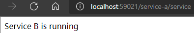

故意把微服务 B 关掉，再次访问，效果如下所示：

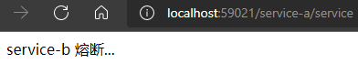

## 4. 万信金融项目实现服务熔断

在万信金融P2P项目中，会有很多地方都需要通过 Hystrix 加入熔断机制，以下只以登录功能为例进行改造

### 4.1. 服务熔断功能改造

#### 4.1.1. 引入依赖

在 wanxinp2p-uaa-service 微服务中引入 Hystrix 依赖

```xml
<dependency>
    <groupId>org.springframework.cloud</groupId>
    <artifactId>spring-cloud-starter-netflix-hystrix</artifactId>
</dependency>
```

#### 4.1.2. 项目配置

- 在 Apollo 配置中心的 common-template 项目中新建 `micro_service.feign-hystrix` 名称空间，并增加如下配置：

```properties
feign.hystrix.enabled = true
```

- 在 Apollo 的其他需要开启 Hystrix 的项目中(例如：account-service、uaa-service...)，关联 `micro_service.feign-hystrix` 名称空间（示例只修改了 uaa-service 项目）
- 修改相关微服务的 application.yml，引入 `micro_service.feign-hystrix` 名称空间（示例只修改了 wanxinp2p-uaa-service 微服务）

#### 4.1.3. 服务降级实现

- 在 wanxinp2p-uaa-service 微服务工程的 agent 包中创建 `AccountFallbackFactory` 降级处理实现类，实现 `feign.hystrix.FallbackFactory` 接口，接口泛型为 feign 代理接口 `AccountApiAgent`

```java
@Component
@Log4j2
public class AccountFallbackFactory implements FallbackFactory<AccountApiAgent> {

    /**
     * 服务降级时调用的方法
     *
     * @param cause
     * @return
     */
    @Override
    public AccountApiAgent create(Throwable cause) {
        return new AccountApiAgent() {
            @Override
            public RestResponse<AccountDTO> login(AccountLoginDTO accountLoginDTO) {
                // 记录异常日志
                log.error("AccountApiAgent fallback; reason was: {}", cause.getMessage(), cause);
                // 返回降级处理
                return RestResponse.result(CommonErrorCode.E_999995);
            }
        };
    }
}
```

- 修改原 Feign 代理接口 `AccountApiAgent`，在 `@FeignClient` 注解中的 `fallbackFactory` 属性指定对应降级处理工厂实现类 `AccountFallbackFactory`

```java
@FeignClient(name = "account-service", fallbackFactory = AccountFallbackFactory.class)
public interface AccountApiAgent {
    // ....省略
}
```

### 4.2. 功能测试

以登录功能为例进行测试

#### 4.2.1. 启动服务

1. 启动 Apollo 服务
2. 后端需要启动：
    - wanxinp2p-discover-server 微服务
    - wanxinp2p-gateway-server 微服务
    - wanxinp2p-uaa-service 微服务
    - wanxinp2p-account-service 微服务
    - wanxinp2p-consumer-service 微服务
3. 启动H5前端

#### 4.2.2. 测试步骤

- 第一次测试成功登陆
- 第二次测试，在 wanxinp2p-account-service 微服务的 `AccountController` 类以下位置增加断点，模拟服务器请求超时故障

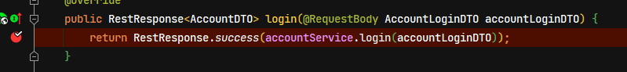

- 在 `IntegrationUserDetailsAuthenticationHandler.authentication` 的方法以下位置增加断点，并观察熔断时返回的数据

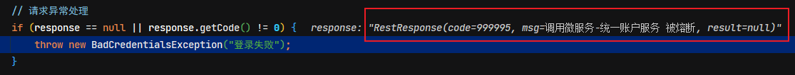
