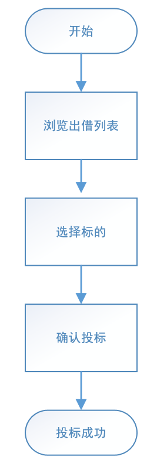
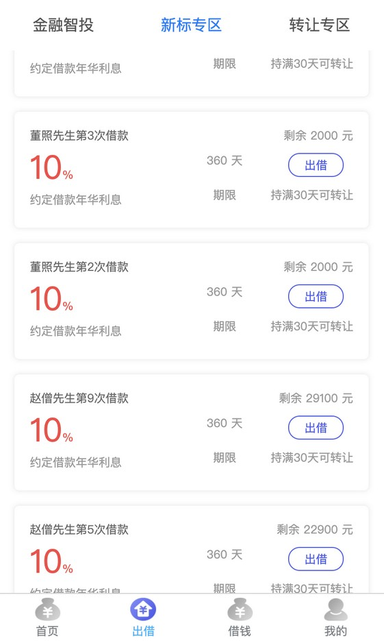
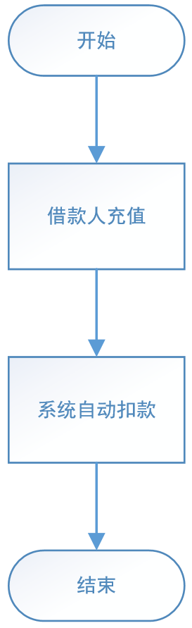
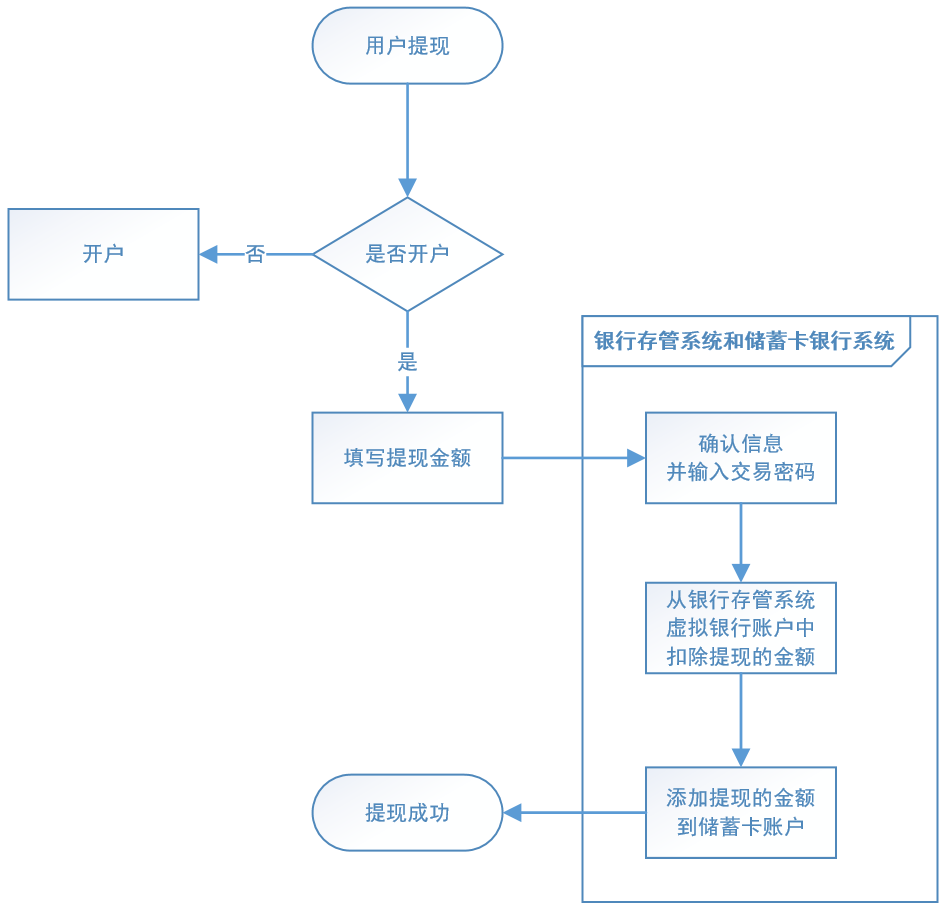

# 第19章 项目总结

> 此章节是全面所有章节的总结与回顾，部分内容有重复

## 1. 项目介绍

### 1.1. 行业简介

P2P 金融又叫 P2P 信贷。其中，P2P是 peer-to-peer 或 person-to-person 的简写，意思是：个人对个人。P2P金融指个人与个人间的小额借贷交易，一般需要借助电子商务专业网络平台帮助借贷双方确立借贷关系并完成相关交易手续。借款者可自行发布借款信息，包括金额、利息、还款方式和时间，实现自助式借款；借出者根据借款人发布的信息，自行决定借出金额，实现自助式借贷。

目前，国家对 P2P 行业的监控与规范性控制越来越严格，出台了很多政策来对其专项整治。主张采用“银行存管模式”来规避 P2P 平台挪用借投人资金的风险，通过银行开发的“银行存管系统”管理投资者的资金，每位 P2P 平台用户在银行的存管系统内都会有一个独立账号，平台来管理交易，做到资金和交易分开，让 P2P 平台不能接触到资金，就可以一定程度避免资金被挪用的风险。

### 1.2. 项目概述

万信金融是一款面向互联网大众提供的理财服务和个人消费信贷服务的金融平台，依托大数据风控技术，为用户提供方便、快捷、安心的P2P金融服务。本项目包括**交易平台**和**业务支撑**两个部分

- 交易平台主要实现理财服务，包括：借钱、出借等模块
- 业务支撑包括：标的管理、对账管理、风控管理等模块

项目采用先进的互联网技术进行研发，保证了 P2P 双方交易的安全性、快捷性及稳定性。

## 2. 系统整体说明

### 2.1. 系统涉及的用户角色

|   系统角色   |                 角色描述                  |
| ------------ | ---------------------------------------- |
| 借款人       | 在平台进行网络借款的用户                  |
| 投资人       | 对平台发布的借款债券进行购买的用户         |
| 平台运营人员 | 审核平台借款人和借款信息，负责平台日常运营 |

### 2.2. 功能架构

万信金融包括万信交易平台和业务支撑系统两个核心子系统，各个子系统又分为六个模块：

| 功能模块名称 |                                                     功能说明                                                     |
| :---------: | ---------------------------------------------------------------------------------------------------------------- |
|     首页     | 用于快速进入理财服务的入口。                                                                                      |
|     借钱     | 借款人通过借钱模块完成发标操作，首先借款人需要进行身份认证、开户并填写借款金额，发布标的后需要审核通过后完成借钱业务。 |
|     出借     | 出借人作为投资人从平台上选择要投资的标的进行投资，经过满标复审最终出借成功。                                         |
|     发现     | 专为会员提供优质服务，比如积分商城等。                                                                             |
|     我的     | 为借款人和投资人提供个人中心，可快捷查询标的、债权等。                                                              |
|   债权转让   | 债权人通过债权转让功能转让自己的债权。                                                                             |
|   用户管理   | 统一管理B端用户的信息、权限等。                                                                                    |
|   对账管理   | 核对p2p平台和银行存管之间的账单是否一致。                                                                          |
|   标的管理   | 对所有标的进行初审、复审等管理操作。                                                                               |
|   风控管理   | 统一管理借款人的认证信息、信用信息等。                                                                             |
|   会员管理   | 统一管理C端用户，包括：会员 信息、积分等。                                                                         |
|   统计分析   | 通过大数据技术对借款、还款、逾期进行统计分析。                                                                     |

### 2.3. 技术架构

万信金融采用当前流行的前后端分离架构开发，由用户层、UI 层、微服务层、数据层等部分组成，为 PC、App、H5 等客户端用户提供服务。下图是系统的技术架构图：

### 2.4. 技术解决方案

1. 微服务技术应用于 P2P 金融业务解决方案
2. 微服务架构采用 Spring Cloud 开发
3. 接口规范 SpringBoot + Swagger
4. 持久层框架采用 MyBatisPlus
5. 分布式系统配置中心 Apollo
6. UAA 认证采用 Spring Security Oauth2 + JWT + ZUUL
7. 分布式事务多种解决方案共用（TCC、可靠消息最终一致性、最大努力通知）
8. 分库分表采用 Sharding-jdbc
9. 分布式任务调度采用 Elastic-job
10. 安全交易采用 HTTPS + SHA1withRSA
11. 采用 redis 实现消息幂等性
12. 采用 Elastic-search 实现标的检索
13. 短信验证系统采用短信验证服务+第三方短信平台（腾讯）
14. 使用百度AI人工智能服务平台实现实名认证
15. 采用 spring-cloud-zuul-ratelimit 和 Sentinel 限流机制
16. 服务链路追踪采用 Spring Cloud Sleuth + Zipkin
17. 平台部署采用 Docker Compose

## 3. 业务描述

### 3.1. 整体业务描述

借款人在平台注册成功后，先要进行绑卡和实名认证来完成开户，然后平台会对借款人进行基础信用审核，审核通过后即可发起借款申请；平台运营人员会审核借款信息，通过后投资人可以在平台进行充值投资，待标的满标之后，平台进行满标复审后进行放款，借款人就可以拿到借款的款项，在到期还款日当天平台会自动从借款人的账户中将应还本息划拨到投资人账户。

### 3.2. 关键业务描述

#### 3.2.1. 开户业务流程

开户是指借款用户和投资用户在注册后、交易前都需要在银行存管系统开通个人存管账户，在开户流程中银行存管系统是一个很重要的系统，它是当前 P2P 平台最常见的一种模式，为了保证资金不流向 P2P 平台，由银行存管系统去管理借款用户和投资用户的资金，P2P 平台与银行存管系统进行接口交互为借款用户和投资用户搭建交易的桥梁。

1. 进入开户界面。借款人或投资人在平台交易前平台会校验是否开户，如果未开户自动进入开户界面；借款人或投资人也可以在首页点击“开通存管”

2. 在开户界面填写开户信息

3. 填写信息完成后点击“确认协议并注册”，确认开户是否正确，同时需要设置交易密码。

4. 开户成功

#### 3.2.2. 发标业务流程

P2P 行业习惯把平台里某个投资项目称为“标的”，简称“标”。一个标的一般至少包含：描述、借款用途、借款总额、还款方式、借款利率、借款期限等基本信息。通俗来讲“标的”就是：借款人在P2P平台发起的借款项目。“发标”就是：借款人在P2P平台申请借款。发标流程如下：

1. 填写借款信息

2. 申请成功，等待审核

3. P2P 平台管理员审核借款信息

4. 审核通过后，就可在H5前端的出借列表中看到标的信息

#### 3.2.3. 充值业务流程

用户通过银行存管系统把银行卡中的金额转入到万信金融 P2P 平台余额中，即为充值。投资人在投标前需要先充值，就好比你把银行卡中的金额转入到支付宝或微信中是一个道理。充值流程如下：

1. 用户在'我的'页面点击'账户余额'

2. 点击充值(如果用户尚未开户，会被自动跳转到开户界面)，填写充值金额

3. 确认信息并输入开户时设置的交易密码

4. 充值成功

#### 3.2.4. 投标业务流程

在 P2P 平台投资整个环节当中，借款人把自己需要借款的信息发布在平台上，这个需求就是一个借款项目，也是一个标的，投资人对这个借款项目进行投资就叫做投标。

借款人发标并通过审核后，投资人就可以在P2P平台看到这些标的信息(可投资项目)，投资人对这个项目进行投资(出借)就叫做投标。用户投标流程如下：

1. 用户浏览借款列表(标的)

2. 选择标的，输入投标金额

3. 确认出借，支付金额

4. 投标成功，显示预期收益

#### 3.2.5. 满标放款业务流程

当一个借款项目的所有借款金额被投资人投资后，由管理员且审核通过，P2P平台会将把所筹资金打入借款人在平台的账户中。当一个标的已经筹集到了所借的全部资金，即为“满标”。此时P2P平台管理员会进行审核，审核通过后，P2P平台会把投资人的出借资金打入借款人在平台的账户中，这就叫“放款”，此时借款人贷款成功。平台放款流程如下：

1. 管理员审核满标标的

2. 确认审核结果

3. 审核通过，放款成功

#### 3.2.6. 还款业务流程

当按照借款时约定的还款方式，平台会自动在还款日当天将应还本息从借款人账户划拨到投资人账户。满标放款审核通过后，就意味着交易已经达成。借款人以后就需要按照借款时约定的还款方式，在还款日当天将应还本息通过平台归还给投资人，这叫用户还款。借款人应该在临近还款日时，把应还的金额充值到平台账户中，平台在还款日当天会自动进行扣款。业务流程如下所示：

用户还款由系统通过定时任务自动触发，不需要用户手动进行。

#### 3.2.7. 提现业务流程

投资人在收到标的的回款后，将余额从银行存管系统的虚拟账户中提取到自己绑定的储蓄卡。业务流程如下所示：

1. 用户在'我的'页面点击'账户余额'

2. 点击提现，填写提现金额

3. 确认提现信息并输入开户时设置的交易密码

4. 提现成功

## 4. 项目涉及技术答疑

> 此部分内容主要是对项目中涉及技术、设计等各方面解析

### 4.1. 配置中心

#### 4.1.1. 什么是配置中心？为什么要使用它？

传统配置形式(例如：配置文件)存在的问题：

1. 缺少权限控制：由于配置能改变程序的行为，不正确的配置甚至能引起灾难，所以对配置的修改必须有比较完善的权限控制
2. 缺少版本控制：在整个开发过程中，配置会经常发生修改，版本控制非常必要
3. 缺少实时控制：配置发生变化后，需要重启才能生效，费时费力，迫切需要实时生效(热发布)
4. 微服务化和分布式带来的挑战

- 当系统从一个单体应用，被拆分成分布式系统上一个个服务节点后，配置文件也必须跟着迁移（分割），这样配置就变得非常分散，造成使用和管理难度变大。不仅如此，各个节点服务的配置中难免会包含很多冗余代码。
- 同一个应用程序在不同的环境（开发，测试，生产）和不同的集群经常需要有不同的配置，需要能方便得进行动态切换。

配置中心将配置从各个应用中剥离出来，自成一体，对所有的配置进行单独的统一管理，优雅的解决了上述诸多问题。在系统架构中，和安全、日志、监控等非功能需求一样，配置管理也是一种非功能需求。配置中心是整个微服务基础架构体系中的一个组件。**总得来说，配置中心就是一种统一管理各种应用配置的基础服务组件。**

#### 4.1.2. 请简述 Apollo 框架运行原理

Apollo（阿波罗）是携程框架部门研发的分布式配置中心，能够集中化管理应用不同环境、不同集群的配置，配置修改后能够实时推送到应用端，并且具备规范的权限、流程治理等特性，适用于微服务配置管理场景。项目使用Apollo完成集中管理配置，将各微服务的配置从服务中剥离出来，统一管理，优雅的解决了配置的动态变更、持久化和运维成本等问题。

### 4.2. UAA服务

UAA 服务是万信金融平台的统一认证中心，集认证和授权功能于一身，采用 Spring Security 整合 OAuth2.0 实现授权服务器(认证服务器)角色，同时使用 JWT 令牌技术来存储和传递用户信息。

