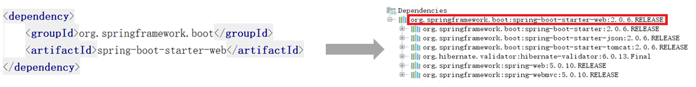

# 第01章 项目概述

## 1. 项目介绍

对于企业中的项目绝大多数都需要进行用户权限管理、认证、鉴权、加密、解密、XSS防跨站攻击等。这些功能整体实现思路基本一致，但是大部分项目都需要实现一次，这无形中就形成了巨大的资源浪费。本项目就是针对这个问题，提供了一套通用的权限解决方案 - 品达通用权限系统。

品达通用权限系统基于SpringCloud(Hoxton.SR12) + SpringBoot(2.3.12.RELEASE) 的微服务框架，具备通用的用户管理、资源权限管理、网关统一鉴权、XSS防跨站攻击等多个模块，支持多业务系统并行开发，支持多服务并行开发，可以作为后端服务的开发脚手架。核心技术采用 SpringBoot、Zuul、Nacos、Fegin、Ribbon、Hystrix、JWT Token、Mybatis Plus 等主要框架和中间件。

本项目具有两个主要功能特性：

- **用户权限管理**：具有用户、部门、岗位、角色、菜单管理，并通过网关进行统一的权限认证
- **微服务开发框架**：本项目同时也是一个微服务开发框架，集成了基础的公共组件，包括数据库、缓存、日志、表单验证、对象转换、防注入和接口文档管理等工具。

### 1.1. 业务架构


### 1.2. 技术架构


### 1.3. 环境要求

- JDK：1.8+ 
- Maven：3.3+ [下载地址](http://maven.apache.org/download.cgi)
- Mysql：5.6.0+ [下载地址](https://downloads.mysql.com/archives/community)
- Redis：4.0+ [下载地址](https://redis.io/download)
- Nacos：1.1.4 [下载地址](https://github.com/alibaba/nacos/releases)
- Node：11.3+（集成npm）[下载地址](https://nodejs.org/en/download)

## 2. Spring Boot starter 介绍

Spring Boot 大大简化了项目初始搭建以及开发过程，而这些都是通过 Spring Boot 提供的 starter 来完成的。品达通用权限系统就是基于 Spring Boot 进行开发，而且一些基础模块其本质就是 starter，所以先对 Spring Boot 的 starter 做全面深入的了解，这是开发品达通用权限系统的必备知识。

### 2.1. starter 介绍

spring boot 在配置上相比 spring 要简单许多，其核心在于 spring-boot-starter，在使用 spring boot 来搭建一个项目时，只需要引入官方提供的 starter，就可以直接使用，免去了各种配置。starter 简单来讲就是引入了一些相关依赖和一些初始化的配置。

Spring 官方提供了很多starter，第三方也可以定义starter。为了加以区分，starter从名称上进行了如下规范：

- Spring Boot 官方提供的 starter 名称格式为：`spring-boot-starter-xxx`。例如 Spring Boot 官方提供的 spring-boot-starter-web
- 第三方提供的 starter 名称格式为：`xxx-spring-boot-starter`。 例如由 mybatis 提供的 mybatis-spring-boot-starter

Spring Boot 之所以能够简化项目的搭建和开发过程，主要是基于它提供的起步依赖和自动配置。

### 2.2. starter 起步依赖原理

起步依赖，其实就是将具备某种功能的坐标打包到一起，可以简化依赖导入的过程。例如，在导入 spring-boot-starter-web 这个 starter，则和 web 开发相关的 jar 包都一起导入到项目中了。如下图所示：



### 2.3. starter 自动配置原理

自动配置，即无须手动配置 xml，会使用默认的配置来自动配置并管理bean，从而简化开发过程。Spring Boot 完成自动配置主要涉及到如下几个关键步骤：

- 基于 Java 代码的 Bean 配置
- 自动配置条件依赖
- Bean 参数获取
- Bean 的发现
- Bean 的加载

下面通过一个实际的例子 mybatis-spring-boot-starter 来说明自动配置的实现过程。

#### 2.3.1. 基于 Java 代码的 Bean 配置

当在项目中导入了 mybatis-spring-boot-starter 这个jar后，可以看到它包括了很多相关的jar包，如下图：


其中在 mybatis-spring-boot-autoconfigure 这个 jar 包中名为 `MybatisAutoConfiguration` 的自动配置类：


该类的关键代码如下：


其中 `@Configuration` 和 `@Bean` 这两个注解配置使用就可以创建一个基于 java 代码的配置类，可以用来替代传统的 xml 配置文件。

- `@Configuration` 注解的类可以看作是能生产让 Spring IoC 容器管理的 Bean 实例的工厂
- `@Bean` 注解的方法返回的对象可以被注册到 Spring 容器中

所以上面的 `MybatisAutoConfiguration` 类，会自动生成了 `SqlSessionFactory` 和 `SqlSessionTemplate` 这两个 Mybatis 的重要实例并交给 Spring 容器管理，从而完成 bean 的自动注册。

#### 2.3.2. 自动配置条件依赖

从 `MybatisAutoConfiguration` 类中使用的注解可以看出，要完成自动配置是有依赖条件的。


所以要完成 Mybatis 的自动配置，需要在类路径中存在 `SqlSessionFactory.class`、`SqlSessionFactoryBean.class` 这两个字节码文件，同时 Spring 容器中需要存在 `DataSource` 这个 bean 且该 bean 完成自动注册。

> Notes: 以上 `@ConditionalXxx` 注解是 Spring Boot 特有的条件依赖注解，具体的介绍与用法详见[《Spring Boot 注解汇总》笔记](/07-分布式架构&微服务架构/01-SpringBoot/02-SpringBoot注解汇总)


#### 2.3.3. Bean 参数获取（配置获取）

要完成 mybatis 的自动配置，需要使用者在配置文件中提供数据源相关的配置参数，例如数据库驱动、连接url、数据库用户名、密码等。Spring Boot 是读取 yml 或者 properties 配置文件的的属性来创建数据源对象的过程如下：

在导入 mybatis-spring-boot-starter 的 jar 包后，其中依赖包含一个 spring-boot-autoconfigure 包，在此包中有一个自动配置类 `DataSourceAutoConfiguration`，如下所示：


该类上标识 `@EnableConfigurationProperties` 注解，跟踪查看 `DataSourceProperties` 类的源码，如下：


可以看到该类上标识了 `@ConfigurationProperties` 注解，该注解的作用就是将 yml 或者 properties 配置文件中的配置参数信息封装到 `ConfigurationProperties` 注解标注的 bean（即`DataSourceProperties` 类）的相应属性上。

其中 `@EnableConfigurationProperties` 注解的作用就是让 `@ConfigurationProperties` 注解生效，并且注册其标识的类实例到 Spring 容器中。

#### 2.3.4. Bean 的发现（自动配置类的发现）

Spring boot 默认扫描启动类所在的包下的主类与子类的所有组件，但并没有包括依赖包中的类，具体依赖包中的 bean 是的发现和加载的实现流程如下：

从 Spring Boot 项目的启动类开始跟踪，在启动类上一般会加入 `@SpringBootApplication` 注解，此注解的源码如下：


其中包含三个重要的注解：

- `@SpringBootConfiguration`：作用就相当于 `@Configuration` 注解，被注解的类将成为一个 bean 配置类
- `@ComponentScan`：作用就是自动扫描并加载符合条件的组件，最终将这些 bean 加载到 spring 容器中
- `@EnableAutoConfiguration`：此注解很重要，借助 `@Import` 的支持，收集和注册依赖包中相关的 bean 定义

跟踪 `@EnableAutoConfiguration` 注解源码如下：


`@EnableAutoConfiguration` 注解又引入了 `@Import` 这个注解，`@Import` 注解作用是导入需要自动配置的组件，此处为 `EnableAutoConfigurationImportSelector` 类

查看 `EnableAutoConfigurationImportSelector` 类源码如下：


`EnableAutoConfigurationImportSelector` 继承了 `AutoConfigurationImportSelector` 类，跟踪查看 `AutoConfigurationImportSelector` 类源码：


`AutoConfigurationImportSelector` 类的 `getCandidateConfigurations` 方法中的调用了 `SpringFactoriesLoader` 类的 `loadFactoryNames` 方法，继续跟踪源码：


`SpringFactoriesLoader` 的 `loadFactoryNames` 静态方法可以从所有的 jar 包中读取 META-INF/spring.factories 文件，而自动配置的类就在这个文件中进行配置：


spring.factories 文件内容如下：


最终 Spring Boot 就可以加载到 `MybatisAutoConfiguration` 配置类了。

#### 2.3.5. Bean 的加载

在 Spring Boot 应用中要让一个普通类交给 Spring 容器管理，通常有以下方法：

1. 使用 `@Configuration` 与 `@Bean` 注解
2. 使用 `@Controller`、`@Service`、`@Repository`、`@Component` 注解标注该类并且使用 `@ComponentScan` 注解启用自动扫描
3. 使用 `@Import` 方法批量导入

其中 Spring Boot 实现自动配置使用的是 `@Import` 注解这种方式，在 `AutoConfigurationImportSelector` 类的 `selectImports` 方法返回一组从 META-INF/spring.factories 文件中读取的 bean 的全类名，这样 Spring Boot 就可以加载到这些 Bean 并完成实例的创建工作。

### 2.4. 自动配置总结

自动配置的关键几步以及相应的注解总结如下：

1. `@Configuration` 与 `@Bean`：基于 Java 代码的 bean 配置
2. `@Conditional`：设置自动配置条件依赖
3. `@EnableConfigurationProperties` 与 `@ConfigurationProperties`：读取配置文件转换为 bean
4. `@EnableAutoConfiguration` 与 `@Import`：实现 bean 发现与加载

### 2.5. 自定义 starter

> 更多自定义 starter 细节详见[《Spring Boot 基础笔记》](/07-分布式架构&微服务架构/01-SpringBoot/01-SpringBoot笔记)的“自定义 starter”章节

#### 2.5.1. 示例一：基础应用

- 第1步：创建 starter 工程 hello-spring-boot-starter 并配置 pom.xml 文件依赖依赖

```xml
<?xml version="1.0" encoding="UTF-8"?>
<project xmlns="http://maven.apache.org/POM/4.0.0"
         xmlns:xsi="http://www.w3.org/2001/XMLSchema-instance"
         xsi:schemaLocation="http://maven.apache.org/POM/4.0.0 
                             http://maven.apache.org/xsd/maven-4.0.0.xsd">
    <parent>
        <groupId>org.springframework.boot</groupId>
        <artifactId>spring-boot-starter-parent</artifactId>
        <version>2.2.2.RELEASE</version>
        <relativePath/>
    </parent>

    <modelVersion>4.0.0</modelVersion>
    <groupId>com.moon</groupId>
    <artifactId>hello-spring-boot-starter</artifactId>
    <version>1.0-SNAPSHOT</version>
    <dependencies>
        <dependency>
            <groupId>org.springframework.boot</groupId>
            <artifactId>spring-boot-starter</artifactId>
        </dependency>
        <dependency>
            <groupId>org.springframework.boot</groupId>
            <artifactId>spring-boot-autoconfigure</artifactId>
        </dependency>
    </dependencies>
</project>
```

- 第2步：创建配置属性类 HelloProperties

```java
/*
 * 读取配置文件，并将属性转换为bean
 */
@ConfigurationProperties(prefix = "hello")
public class HelloProperties {
    private String name;
    private String address;
    // ...省略 getter/setter
}
```

- 第3步：创建服务类 `HelloService`

```java
public class HelloService {
    private String name;
    private String address;

    public HelloService(String name, String address) {
        this.name = name;
        this.address = address;
    }

    public String sayHello(){
        return "你好！我的名字叫 " + name + "，我来自 " + address;
    }
}
```

- 第4步：创建自动配置类 `HelloServiceAutoConfiguration`

```java
/*
 * 配置类，基于Java代码的bean配置
 */
@Configuration
@EnableConfigurationProperties(HelloProperties.class)
public class HelloServiceAutoConfiguration {
    private HelloProperties helloProperties;

    // 通过构造方法注入配置属性对象 HelloProperties
    public HelloServiceAutoConfiguration(HelloProperties helloProperties) {
        this.helloProperties = helloProperties;
    }

    // 实例化HelloService并载入Spring IoC容器
    @Bean
    @ConditionalOnMissingBean
    public HelloService helloService(){
        return new HelloService(helloProperties.getName(), helloProperties.getAddress());
    }
}
```

- 第5步：在 resources 目录下创建 META-INF/spring.factories

```properties
org.springframework.boot.autoconfigure.EnableAutoConfiguration=\
com.moon.config.HelloServiceAutoConfiguration
```

以上 starter 工程已经开发完成了，可以将当前 starter 安装到本地 maven 仓库供其他应用来使用。

- 第6步：创建 maven 工程 myapp 并配置 pom.xml 文件引入自定义的 starter

```xml
<?xml version="1.0" encoding="UTF-8"?>
<project xmlns="http://maven.apache.org/POM/4.0.0"
         xmlns:xsi="http://www.w3.org/2001/XMLSchema-instance"
         xsi:schemaLocation="http://maven.apache.org/POM/4.0.0 http://maven.apache.org/xsd/maven-4.0.0.xsd">

    <parent>
        <groupId>org.springframework.boot</groupId>
        <artifactId>spring-boot-starter-parent</artifactId>
        <version>2.2.2.RELEASE</version>
        <relativePath/>
    </parent>
    
    <modelVersion>4.0.0</modelVersion>
    <groupId>com.moon</groupId>
    <artifactId>myapp</artifactId>
    <version>1.0-SNAPSHOT</version>
    <dependencies>
        <dependency>
            <groupId>org.springframework.boot</groupId>
            <artifactId>spring-boot-starter-web</artifactId>
        </dependency>
        <!-- 导入自定义starter -->
        <dependency>
            <groupId>com.moon</groupId>
            <artifactId>hello-spring-boot-starter</artifactId>
            <version>1.0-SNAPSHOT</version>
        </dependency>
    </dependencies>
</project>
```

- 第7步：创建 application.yml 文件并配置自定义 starter 的相关属性

```yml
server:
  port: 8080
hello:
  name: xiaoming
  address: beijing
```

- 第8步：创建 `HelloController`

```java
@RestController
@RequestMapping("/hello")
public class HelloController {
    // HelloService 在自定义的 starter 中已经完成了自动配置，因此此处可以直接注入
    @Autowired
    private HelloService helloService;

    @GetMapping("/say")
    public String sayHello(){
        return helloService.sayHello();
    }
}
```

- 第9步：使用者工程创建启动类 `HelloApplication`

```java
@SpringBootApplication
public class HelloApplication {
    public static void main(String[] args) {
        SpringApplication.run(HelloApplication.class,args);
    }
}
```

执行启动类 main 方法运行 web 项目，访问地址：http://localhost:8080/hello/say


#### 2.5.2. 示例二：记录日志拦截器

在前面的案例一中通过定义 starter，自动配置了一个 HelloService 实例。本案例需要通过自动配置来创建一个拦截器对象，通过此拦截器对象来实现记录日志功能。

> 可以在案例一的基础上继续开发案例二

- 第1步：在 hello-spring-boot-starter 的 pom.xml 文件中追加 web 项目的依赖

```xml
<dependency>
    <groupId>org.springframework.boot</groupId>
    <artifactId>spring-boot-starter-web</artifactId>
    <optional>true</optional>
</dependency>
<dependency>
    <groupId>org.springframework.boot</groupId>
    <artifactId>spring-boot-configuration-processor</artifactId>
</dependency>
```

- 第2步：自定义 `@MyLog` 注解

```java
@Target(ElementType.METHOD)
@Retention(RetentionPolicy.RUNTIME)
public @interface MyLog {
    /**
     * 方法描述
     */
    String desc() default "";
}
```

- 第3步：自定义日志拦截器 `MyLogInterceptor`

```java
import org.springframework.web.method.HandlerMethod;
import org.springframework.web.servlet.ModelAndView;
import org.springframework.web.servlet.handler.HandlerInterceptorAdapter;
import javax.servlet.http.HttpServletRequest;
import javax.servlet.http.HttpServletResponse;
import java.lang.reflect.Method;

/**
 * 日志拦截器
 */
public class MyLogInterceptor extends HandlerInterceptorAdapter {
    private static final ThreadLocal<Long> startTimeThreadLocal = new ThreadLocal<>();

    public boolean preHandle(HttpServletRequest request, HttpServletResponse response, 
                             Object handler) throws Exception {
        HandlerMethod handlerMethod = (HandlerMethod)handler;
        Method method = handlerMethod.getMethod(); // 获得被拦截的方法对象
        MyLog myLog = method.getAnnotation(MyLog.class); // 获得方法上的注解
        if(myLog != null){
            // 方法上加了MyLog注解，需要进行日志记录
            long startTime = System.currentTimeMillis();
            startTimeThreadLocal.set(startTime);
        }
        return true;
    }

    public void postHandle(HttpServletRequest request, HttpServletResponse response, 
                           Object handler, ModelAndView modelAndView) throws Exception {
        HandlerMethod handlerMethod = (HandlerMethod)handler;
        Method method = handlerMethod.getMethod(); // 获得被拦截的方法对象
        MyLog myLog = method.getAnnotation(MyLog.class); // 获得方法上的注解
        if(myLog != null){
            // 方法上加了MyLog注解，需要进行日志记录
            long endTime = System.currentTimeMillis();
            Long startTime = startTimeThreadLocal.get();
            long optTime = endTime - startTime;

            String requestUri = request.getRequestURI();
            String methodName = method.getDeclaringClass().getName() + "." + method.getName();
            String methodDesc = myLog.desc();

            System.out.println("请求uri：" + requestUri);
            System.out.println("请求方法名：" + methodName);
            System.out.println("方法描述：" + methodDesc);
            System.out.println("方法执行时间：" + optTime + "ms");
        }
    }
}
```

- 第4步：创建自动配置类 `MyLogAutoConfiguration`，用于自动配置拦截器、参数解析器等 web 组件

```java
/**
 * 配置类，用于自动配置拦截器、参数解析器等web组件
 */
@Configuration
public class MyLogAutoConfiguration implements WebMvcConfigurer{
    //注册自定义日志拦截器
    public void addInterceptors(InterceptorRegistry registry) {
        registry.addInterceptor(new MyLogInterceptor());
    }
}
```

- 第5步：在 spring.factories 中追加 `MyLogAutoConfiguration` 配置

```java
org.springframework.boot.autoconfigure.EnableAutoConfiguration=\
com.moon.config.HelloServiceAutoConfiguration,\
com.moon.config.MyLogAutoConfiguration
```

> Tips: 在 hello-spring-boot-starter 中追加了新的内容，需要重新打包安装到 maven 仓库

- 第6步：在 myapp 工程的 Controller 方法上加入 `@MyLog` 注解

```java
@RestController
@RequestMapping("/hello")
public class HelloController {
    // HelloService 在自定义的 starter 中已经完成了自动配置，因此此处可以直接注入
    @Autowired
    private HelloService helloService;

    @MyLog(desc = "sayHello方法") // 日志记录注解
    @GetMapping("/say")
    public String sayHello(){
        return helloService.sayHello();
    }
}
```

- 访问地址：http://localhost:8080/hello/say，查看控制台输出：

```
请求uri：/hello/say
请求方法名：com.moon.controller.HelloController.sayHello
方法描述：sayHello方法
方法执行时间：36ms
```

## 3. lombok 工具类库

Lombok 是一个开源的代码生成库，能以简单的注解形式来简化 Java 类中的大量样板代码，提高开发人员的开发效率。例如开发中经常需要写的 javabean，都需要花时间去添加相应的 getter/setter，也许还要去写构造器、equals 等方法，而且需要维护，当属性多时会出现大量的 getter/setter 方法，这些显得很冗长也没有太多技术含量。

lombok 能通过注解的方式，在编译时自动为属性生成构造器、getter/setter、equals、hashcode、toString 方法，使代码看起来更简洁。

> Lombok 更多使用说明详见[《Lombok 工具插件》笔记](/02-后端框架/99-工具框架/07-Lombok工具插件)
