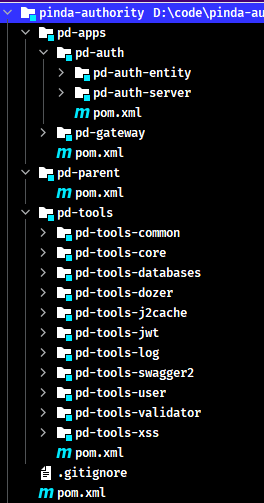
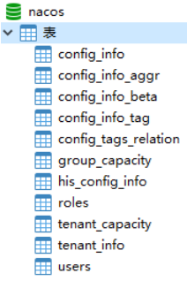

# 第02章 项目搭建

## 1. 导入初始工程

本项目主要是用于学习实现权限校验功能，不需要去一步步创建整体的项目工程，直接使用网上一些开源项目做为初始化工程，直接导入到IDEA即可。导入步骤：

1. 将初始工程 pinda-authority 复制到任意没有中文和空格的目录下
2. 打开 IDEA，选择 Open，选择 pinda-authority 工程目录即可

导入的项目结构如下：



## 2. 项目模块介绍

品达通用权限系统项目整体工程结构和模块功能如下：

```
pinda-authority              # 聚合工程，用于聚合 pd-parent、pd-apps、pd-tools 等模块
├── pd-parent				 # 父工程，nacos 配置及依赖包管理
├── pd-apps					 # 应用目录
|	├── pd-auth				 # 权限服务父工程
|	|	├── pd-auth-entity   # 权限实体
|	|	└── pa-auth-server   # 权限服务
|	└── pd-gateway			 # 网关服务
└── pd-tools				 # 工具工程
	├── pd-tools-common		 # 基础组件：基础配置类、函数、常量、统一异常处理、undertow服务器
	├── pd-tools-core		 # 核心组件：基础实体、返回对象、上下文、异常处理、分布式锁、函数、树
	├── pd-tools-databases	 # 数据源组件：数据源配置、数据权限、查询条件等
	├── pd-tools-dozer		 # 对象转换：dozer配置、工具
	├── pd-tools-j2cache	 # 缓存组件：j2cache、redis缓存
	├── pd-tools-jwt         # JWT组件：配置、属性、工具
	├── pd-tools-log	     # 日志组件：日志实体、事件、拦截器、工具
	├── pd-tools-swagger2	 # 文档组件：knife4j文档
	├── pd-tools-user        # 用户上下文：用户注解、模型和工具，当前登录用户信息注入模块
	├── pd-tools-validator	 # 表单验证： 后台表单规则验证
	└── pd-tools-xss		 # xss防注入组件
```

项目服务目前只有两个：网关服务和权限服务

|      应用       | 端口 |   说明    |             启动命令              |
| -------------- | ---- | -------- | -------------------------------- |
| pd-gateway     | 8760 | 网关服务  | `java -jar pd-gateway.jar &`     |
| pd-auth-server | 8764 | 权限服务  | `java -jar pd-auth-server.jar &` |

> Tips: 
>
> - 以上启动命令用于 linux 部署环境中，如果是本地开发时，直接使用 IDEA 启动即可
> - 由于本系统是基于当前非常流行的前后端分离的方式开发，其中前端部分是由专门的前端开发人员负责，本示例项目中直接使用。

## 3. Nacos 服务注册和配置中心搭建

> 更多 Nacos 内容详见[《Spring Cloud Alibaba (包含Nacos、Sentinel等组件)》笔记](/07-分布式架构&微服务架构/02-SpringCloud/03-Spring-Cloud-Alibaba)的“Spring Cloud Alibaba Nacos Discovery”与“Spring Cloud Alibaba Nacos Config”章节。*或者《Nacos》笔记（目前该笔记未整理）*

本项目使用 Nacos 来作为服务的注册和配置中心。Nacos 是阿里巴巴开源的一款支持服务注册与发现，配置管理以及微服务管理的组件。用来取代以前常用的注册中心（zookeeper、eureka 等等），以及配置中心（spring cloud config、apollo 等等）。Nacos 是同时集成了注册中心和配置中心的功能。

### 3.1. 下载与安装

安装和配置过程如下：

- 第一步：下载 Nacos 安装包（*本示例项目使用 NACOS 2.0.3*），下载地址：https://github.com/alibaba/nacos/releases
- 第二步：将下载的 zip 压缩文件解压到任意没有中文和空格的目录下

### 3.2. 配置数据存储

Nacos 在存储数据时既可以使用内置数据库存储，也可以通过第三方指定的数据库存储。若要指定使用 MySQL 数据库来存储 Nacos 的相关数据，则需要修改 `NACOS_HOME/conf/application.properties`
配置文件，配置使用的 MySQL 数据库的数据源信息，这个可以根据实际的 MySQL 数据库进行相应调整，例如 MySQL 的地址、用户名、密码等。

```properties
spring.datasource.platform=mysql
db.num=1
db.url.0=jdbc:mysql://127.0.0.1:3306/nacos?characterEncoding=utf8&connectTimeout=1000&socketTimeout=3000&autoReconnect=true
db.user=root
db.password=123456
```

创建数据库

```sql
REATE DATABASE `nacos` CHARACTER SET utf8mb4 COLLATE utf8mb4_general_ci;
```

执行 `NACOS_HOME/conf/nacos-mysql.sql` 数据库脚本文件创建 nacos 需要相应表格，完成后可以看到创建了如下表



### 3.3. 启动服务


