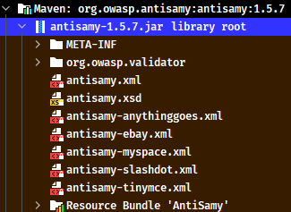
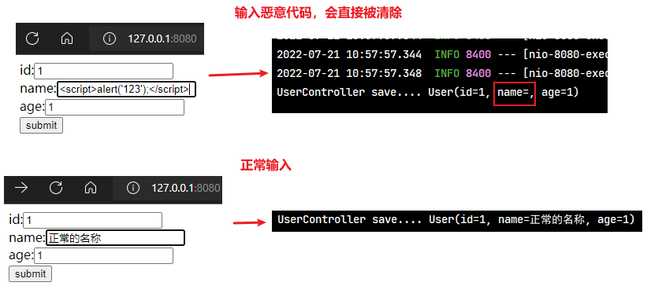
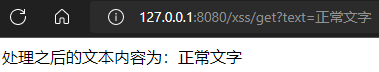
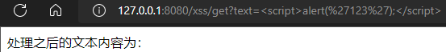

# 第02章 项目搭建与工具模块使用

## 1. 导入初始工程

本项目主要是用于学习实现权限校验功能，不需要去一步步创建整体的项目工程，直接使用网上一些开源项目做为初始化工程，直接导入到IDEA即可。导入步骤：

1. 将初始工程 pinda-authority 复制到任意没有中文和空格的目录下
2. 打开 IDEA，选择 Open，选择 pinda-authority 工程目录即可

导入的项目结构如下：


## 2. 项目模块

### 2.1. 工程结构和模块说明

品达通用权限系统项目整体工程结构和模块功能如下：

```
pinda-authority              # 聚合工程，用于聚合 pd-parent、pd-apps、pd-tools 等模块
├── pd-parent				 # 父工程，nacos 配置及依赖包管理
├── pd-apps					 # 应用目录
|	├── pd-auth				 # 权限服务父工程
|	|	├── pd-auth-entity   # 权限实体
|	|	└── pa-auth-server   # 权限服务
|	└── pd-gateway			 # 网关服务
└── pd-tools				 # 工具工程
|	├── pd-tools-common		 # 基础组件：基础配置类、函数、常量、统一异常处理、undertow服务器
|	├── pd-tools-core		 # 核心组件：基础实体、返回对象、上下文、异常处理、分布式锁、函数、树
|	├── pd-tools-databases	 # 数据源组件：数据源配置、数据权限、查询条件等
|	├── pd-tools-dozer		 # 对象转换：dozer配置、工具
|	├── pd-tools-j2cache	 # 缓存组件：j2cache、redis缓存
|	├── pd-tools-jwt         # JWT组件：配置、属性、工具
|	├── pd-tools-log	     # 日志组件：日志实体、事件、拦截器、工具
|	├── pd-tools-swagger2	 # 文档组件：knife4j文档
|	├── pd-tools-user        # 用户上下文：用户注解、模型和工具，当前登录用户信息注入模块
|	├── pd-tools-validator	 # 表单验证： 后台表单规则验证
|	└── pd-tools-xss		 # xss防注入组件
└── pd-examples              # 本项目涉及相关技术的示例工程
```

项目服务目前只有两个：网关服务和权限服务

|      应用       | 端口 |   说明    |             启动命令              |
| -------------- | ---- | -------- | -------------------------------- |
| pd-gateway     | 8760 | 网关服务  | `java -jar pd-gateway.jar &`     |
| pd-auth-server | 8764 | 权限服务  | `java -jar pd-auth-server.jar &` |

> Tips: 
>
> - 以上启动命令用于 linux 部署环境中，如果是本地开发时，直接使用 IDEA 启动即可
> - 由于本系统是基于当前非常流行的前后端分离的方式开发，其中前端部分是由专门的前端开发人员负责，本示例项目中直接使用。

<font color=red>**特别注意：下面使用 `pd-tools-xxx` 的工具模块的示例，如果是非本项目引入时，需要将其安装到本地仓库**</font>

### 2.2. 项目实战开发计划说明

通过前面导入的初始项目可以看到，pd-tools 工程中的各个子模块功能基本已完成，这些子模块属于项目的基础组件，为后续开发网关服务和权限服务提供支持，而且有一些子模块在其他项目中也可以复用。由于这些子模块会涉及到一些新技术或者框架，所以计划在本项目主要的权限校验功能实现前，先通读 pd-tools 中的相关模块的代码实现，了解这些新技术或者框架的使用方法，从而了解此模块的作用和开发过程。

学习完这些模块之后，再进行开发后面的网关服务和权限服务了。

## 3. Nacos 服务注册和配置中心搭建

> 更多 Nacos 内容详见[《Spring Cloud Alibaba (包含Nacos、Sentinel等组件)》笔记](/07-分布式架构&微服务架构/02-SpringCloud/03-Spring-Cloud-Alibaba)的“Spring Cloud Alibaba Nacos Discovery”与“Spring Cloud Alibaba Nacos Config”章节。*或者《Nacos》笔记（目前该笔记未整理）*

本项目使用 Nacos 来作为服务的注册和配置中心。Nacos 是阿里巴巴开源的一款支持服务注册与发现，配置管理以及微服务管理的组件。用来取代以前常用的注册中心（zookeeper、eureka 等等），以及配置中心（spring cloud config、apollo 等等）。Nacos 是同时集成了注册中心和配置中心的功能。

### 3.1. 下载与安装

安装和配置过程如下：

- 第一步：下载 Nacos 安装包（*本示例项目使用 NACOS 2.0.3*），下载地址：https://github.com/alibaba/nacos/releases
- 第二步：将下载的 zip 压缩文件解压到任意没有中文和空格的目录下

### 3.2. 配置数据存储

Nacos 在存储数据时既可以使用内置数据库存储，也可以通过第三方指定的数据库存储。若要指定使用 MySQL 数据库来存储 Nacos 的相关数据，则需要修改 `NACOS_HOME/conf/application.properties`
配置文件，配置使用的 MySQL 数据库的数据源信息，这个可以根据实际的 MySQL 数据库进行相应调整，例如 MySQL 的地址、用户名、密码等。

```properties
### If use MySQL as datasource:
spring.datasource.platform=mysql

### Count of DB:
db.num=1

### Connect URL of DB:
db.url.0=jdbc:mysql://127.0.0.1:3306/nacos?characterEncoding=utf8&connectTimeout=1000&socketTimeout=3000&autoReconnect=true&useUnicode=true&useSSL=false&serverTimezone=UTC
db.user.0=root
db.password.0=123456
```

创建数据库

```sql
CREATE DATABASE `nacos` CHARACTER SET utf8mb4 COLLATE utf8mb4_general_ci;
```

执行 `NACOS_HOME/conf/nacos-mysql.sql` 数据库脚本文件创建 nacos 需要相应表格，完成后可以看到创建了如下表


### 3.3. 启动服务

进入 nacos 安装目录，双击 `NACOS_HOME/bin/startup.cmd` 即可启动服务。也可通过命令行方式指定参数来启动服务：

```bash
startup.cmd -m standalone
```

### 3.4. 导入项目配置

访问 Nacos 控制台

- 访问地址：http://localhost:8848/nacos
- 默认用户名/密码：nacos/nacos

新建命名空间 pinda-dev


> Notes: 在创建完命名空间后，需要将命名空间的id需要替换到项目文件 pd-parent/pom.xml 中对应的nacos命名空间的id。*创建命名空间时可以手动指定ID，最终保持项目与nacos配置的ID一致即可*


点击【配置管理】->【配置列表】，选择 nacos 配置中心的命名空间，点击【导入配置】按钮导入配置文件：pinda-authority-project/document/nacos/nacos_config_export_20220719094029.zip。导入完成后如下：


## 4. Redis 服务

在项目开发阶段直接使用windows版的Redis，直接点击 REDIS_HOME/64bit/redis-server.exe 启动 Redis 服务即可使用。

## 5. pd-tools-swagger2 模块

pd-tools-swagger2 模块定位为文档组件，前后端开发人员可以查看接口文档，为前后端开发人员的开发统一接口，方便后续的前后端联调对接工作。

### 5.1. swagger 介绍

Swagger 的基础介绍与使用详见[《Swagger 接口文档工具》笔记](/02-后端框架/99-工具框架/10-Swagger)

### 5.2. 入门案例

> Notes: 案例源码都在本项目的 pd-examples 模块中

- swagger 入门案例代码详见：pinda-authority-project\pinda-authority\pd-examples\swagger-demo\
- knife4j 入门案例代码详见：pinda-authority-project\pinda-authority\pd-examples\swagger-knife4j-demo\

### 5.3. pd-tools-swagger2 模块的使用

pd-tools-swagger2 模块整合了 knife4j 的配置，并且按照 Spring boot starter 的规范在 /resources/META-INF 中提供 spring.factories 文件，内容如下：

```properties
org.springframework.boot.autoconfigure.EnableAutoConfiguration=\
    com.moon.pinda.swagger2.SwaggerAutoConfiguration
```

在其他模块（项目）中如果需要使用 swagger 接口文档功能，只需要引入这个 starter 并且在 application.yml 中进行 swagger 的相关配置即可，例如：

```yml
pinda:
  swagger:
    enabled: true #是否启用swagger
    docket:
      user:
        title: xx模块
        base-package: xxx.xxx.xxxx
      menu:
        title: xx模块
        base-package: xxx.xxx.xxxx
```

#### 5.3.1. 项目依赖

创建 maven 工程 pd-tools-swagger2-demo 并配置 pom.xml 文件引入 pd-tools-swagger2 的依赖。

```java
<parent>
    <groupId>org.springframework.boot</groupId>
    <artifactId>spring-boot-starter-parent</artifactId>
    <version>2.2.2.RELEASE</version>
    <relativePath/>
</parent>

<dependencies>
    <!-- 引入自己定义的 swagger 基础模块-->
    <dependency>
        <groupId>com.moon</groupId>
        <artifactId>pd-tools-swagger2</artifactId>
        <version>1.0-SNAPSHOT</version>
    </dependency>
    <dependency>
        <groupId>org.projectlombok</groupId>
        <artifactId>lombok</artifactId>
    </dependency>
</dependencies>
```

#### 5.3.2. 创建接口与实体类

此步骤复用前面的《Swagger 入门案例》章节的代码即可

#### 5.3.3. 项目配置

创建 application.yml，配置 swagger 相关属性，**注意要与 starter 中的定义的属性值一致**

```yml
pinda:
  swagger:
    enabled: true # 是否启用swagger
    title: pd-tools-swagger2 在线文档
    description: pd-tools-swagger2 模块测试生成在线文档
    version: 2.0.0
    basePackage: com.moon.examples.tools
```

创建启动类 ToolsSwaggerApplication

```java
@SpringBootApplication
public class ToolsSwaggerApplication {
    public static void main(String[] args) {
        SpringApplication.run(ToolsSwaggerApplication.class, args);
    }
}
```

执行启动类 main 方法启动项目，访问地址：http://localhost:8080/doc.html


## 6. pd-tools-dozer 模块

pd-tools-dozer 模块功能定位为对象转换，其本质就是一个 Spring Boot starter，其他模块可以直接导入此模块就可以直接使用对象转换功能

### 6.1. dozer 介绍

Dozer 是实现两个 Java Bean 进行复制的映射器，它以递归方式将数据从一个对象复制到另一个对象。dozer 是用来对两个对象之间属性转换的工具，在将一个对象的所有属性值转给另一个对象时，就不需要再去写重复的调用 setter 和 getter 方法了。dozer 其实是 Beanutils 的封装

dozer 的 maven 坐标：

```xml
<dependency>
    <groupId>com.github.dozermapper</groupId>
    <artifactId>dozer-core</artifactId>
    <version>6.5.0</version>
</dependency>
```

为了简化使用方式，dozer 还提供了 starter，其 maven 坐标为：

```xml
<dependency>
    <groupId>com.github.dozermapper</groupId>
    <artifactId>dozer-spring-boot-starter</artifactId>
    <version>6.5.0</version>
</dependency>
```

### 6.2. Dozer 入门案例

#### 6.2.1. 项目依赖

创建 maven 工程 dozer-demo 并配置 pom.xml 文件引入 dozer 的依赖。

```xml
<parent>
    <groupId>org.springframework.boot</groupId>
    <artifactId>spring-boot-starter-parent</artifactId>
    <version>2.2.2.RELEASE</version>
    <relativePath/>
</parent>

<dependencies>
    <dependency>
        <groupId>com.github.dozermapper</groupId>
        <artifactId>dozer-spring-boot-starter</artifactId>
        <version>6.5.0</version>
    </dependency>
    <dependency>
        <groupId>org.springframework.boot</groupId>
        <artifactId>spring-boot-starter-test</artifactId>
        <scope>test</scope>
    </dependency>
    <dependency>
        <groupId>org.projectlombok</groupId>
        <artifactId>lombok</artifactId>
    </dependency>
</dependencies>
```

#### 6.2.2. 创建测试的实体类

- 创建 UserDTO

```java
@Data
public class UserDTO {
    private String userId;
    private String userName;
    private int userAge;
    private String address;
    private String birthday;
}
```

- 创建 UserEntity

```java
@Data
public class UserEntity {
    private String id;
    private String name;
    private int age;
    private String address;
    private Date birthday;
}
```

> Notes: 为了测试属性不同的名称、不同的类型的时的转换，以上有部分的属性与类型不一致

#### 6.2.3. dozer 配置

在 resources/dozer/ 目录下创建 dozer 的全局配置文件 global.dozer.xml

> 注：全局配置文件名称可以任意的

```xml
<?xml version="1.0" encoding="UTF-8"?>
<mappings xmlns:xsi="http://www.w3.org/2001/XMLSchema-instance"
          xmlns="http://dozermapper.github.io/schema/bean-mapping"
          xsi:schemaLocation="http://dozermapper.github.io/schema/bean-mapping
                              http://dozermapper.github.io/schema/bean-mapping.xsd">
    <!-- 全局配置:
        <date-format> 表示日期格式
     -->
    <configuration>
        <date-format>yyyy-MM-dd</date-format>
    </configuration>
</mappings>
```

在 resources/dozer/ 目录下创建 dozer 的映射文件 biz.dozer.xml。此文件针对实体类之间的映射配置

> 注：映射文件名称可以任意

```xml
<?xml version="1.0" encoding="UTF-8"?>
<mappings xmlns:xsi="http://www.w3.org/2001/XMLSchema-instance"
          xmlns="http://dozermapper.github.io/schema/bean-mapping"
          xsi:schemaLocation="http://dozermapper.github.io/schema/bean-mapping
                             http://dozermapper.github.io/schema/bean-mapping.xsd">
    <!-- 描述两个类中属性的对应关系，对于两个类中同名的属性可以不映射 -->
    <mapping date-format="yyyy-MM-dd">
        <class-a>com.moon.examples.dozer.entity.UserEntity</class-a>
        <class-b>com.moon.examples.dozer.dto.UserDTO</class-b>
        <field>
            <a>id</a>
            <b>userId</b>
        </field>
        <field>
            <a>name</a>
            <b>userName</b>
        </field>
        <field>
            <a>age</a>
            <b>userAge</b>
        </field>
    </mapping>

    <!-- 可以使用 map-id 指定映射的标识，在程序中通过此标识来确定使用当前这个映射关系 -->
    <mapping date-format="yyyy-MM-dd" map-id="user">
        <class-a>com.moon.examples.dozer.entity.UserEntity</class-a>
        <class-b>com.moon.examples.dozer.dto.UserDTO</class-b>
        <field>
            <a>id</a>
            <b>userId</b>
        </field>
        <field>
            <a>name</a>
            <b>userName</b>
        </field>
        <field>
            <a>age</a>
            <b>userAge</b>
        </field>
    </mapping>
</mappings>
```

编写 application.yml 项目配置文件，指定 dozer 的配置文件位置

```yml
dozer:
  mapping-files:
    - classpath:dozer/global.dozer.xml
    - classpath:dozer/biz.dozer.xml
```

#### 6.2.4. 功能测试

编写启动类

```java
@SpringBootApplication
public class DozerDemoApplication {
    public static void main(String[] args) {
        SpringApplication.run(DozerDemoApplication.class, args);
    }
}
```

编写测试方法。*注：示例使用 junit 5*

```java
import com.github.dozermapper.core.Mapper;
import com.moon.examples.dozer.DozerDemoApplication;
import com.moon.examples.dozer.dto.UserDTO;
import com.moon.examples.dozer.entity.UserEntity;
import org.junit.jupiter.api.BeforeEach;
import org.junit.jupiter.api.Test;
import org.springframework.beans.factory.annotation.Autowired;
import org.springframework.boot.test.context.SpringBootTest;

/**
 * Dozer 基础测试
 */
@SpringBootTest(classes = DozerDemoApplication.class)
public class DozerTest {

    // 使用 Dozer 提供的 Mapper 对象可以完成两个对象之间属性复制
    @Autowired
    private Mapper mapper;

    private UserDTO userDTO = new UserDTO();

    // 初始化测试使用的源对象值
    @BeforeEach
    public void init() {
        userDTO.setUserId("2828");
        userDTO.setUserName("MooNkirA");
        userDTO.setUserAge(21);
        userDTO.setAddress("GK-China");
        userDTO.setBirthday("2010-08-08");
    }

    // 根据类型 .class 进行复制
    @Test
    public void testDozer1() {
        UserEntity user = mapper.map(userDTO, UserEntity.class);
        System.out.println(user);
    }

    // 两个对象之间复制
    @Test
    public void testDozer2() {
        UserEntity user = new UserEntity();
        user.setId("200");
        System.out.println(user);
        mapper.map(userDTO, user);
        System.out.println(user);
    }

    // 根据配置的映射id 进行复制
    @Test
    public void testDozer3() {
        UserEntity user = new UserEntity();
        System.out.println(user);
        mapper.map(userDTO, user, "user");
        System.out.println(user);
    }
}
```

### 6.3. pd-tools-dozer 模块的使用

在 pd-tools-dozer 模块中为了进一步简化操作，封装了一个工具类 `DozerUtils`，其内部使用的就是 `Mapper` 对象进行的操作。并且按照 Spring Boot starter 的规范编写 /resources/META-INF/spring.factories 文件，内容如下：

```properties
org.springframework.boot.autoconfigure.EnableAutoConfiguration=\
    com.moon.pinda.dozer.DozerAutoConfiguration
```

在配置类 `DozerAutoConfiguration` 中完成 `DozerUtils` 对象的创建，这样其他的程序如果需要使用 dozer 进行对象转换，只需要引入此模块的 maven 坐标并且提供对应的映射文件就可以在程序中直接注入 `DozerUtils` 对象进行操作了。

#### 6.3.1. 项目依赖

创建 maven 工程 pd-tools-dozer-demo 并配置 pom.xml 文件引入 pd-tools-dozer 的依赖。

```xml
<parent>
    <groupId>org.springframework.boot</groupId>
    <artifactId>spring-boot-starter-parent</artifactId>
    <version>2.2.2.RELEASE</version>
    <relativePath/>
</parent>

<dependencies>
    <!-- 引入自定义的 dozer 公共模块-->
    <dependency>
        <groupId>com.moon</groupId>
        <artifactId>pd-tools-dozer</artifactId>
        <version>1.0-SNAPSHOT</version>
    </dependency>
    <dependency>
        <groupId>org.springframework.boot</groupId>
        <artifactId>spring-boot-starter-test</artifactId>
        <scope>test</scope>
    </dependency>
    <dependency>
        <groupId>org.projectlombok</groupId>
        <artifactId>lombok</artifactId>
    </dependency>
</dependencies>
```

#### 6.3.2. 创建测试的实体类

此步骤复用前面的《Dozer 入门案例》章节的代码即可

#### 6.3.3. dozer 配置

此步骤复用前面的《Dozer 入门案例》章节的配置即可

> Notes: 如果创建的 UserEntity 和 UserDTO 中的属性完全一致，可以不提供映射文件，如果这两个类中的属性存在不一致的情况，需要创建映射文件进行映射，并且还需要在 application.yml 中配置映射文件的位置，例如：

```yml
dozer:
  mappingFiles:
    - classpath:dozer/biz.dozer.xml  # 指定dozer的映射文件位置
```

#### 6.3.4. 运行测试

创建启动类

```java
@SpringBootApplication
public class ToolsDozerApplication {
    public static void main(String[] args) {
        SpringApplication.run(ToolsDozerApplication.class, args);
    }
}
```

编写测试方法。*注：示例使用 junit 5*

```java
@SpringBootTest
public class DozerToolsTest {

    // 在 pd-tools-dozer 中已经完成了自动配置，可以直接注入
    @Autowired
    private DozerUtils dozerUtils;

    private UserDTO userDTO = new UserDTO();

    // 初始化测试使用的源对象值
    @BeforeEach
    public void init() {
        userDTO.setUserId("123123");
        userDTO.setUserName("MooNkirA");
        userDTO.setUserAge(22);
        userDTO.setAddress("ABC");
        userDTO.setBirthday("2020-08-08");
    }

    // 根据类型 .class 进行复制
    @Test
    public void testDozerUtils() {
        UserEntity user = dozerUtils.map(userDTO, UserEntity.class);
        System.out.println(user);
    }
}
```

> Tips: 其他不同方式复制方法参考 pd-tools-dozer 源码或者入门案例

## 7. pd-tools-validator 模块

pd-tools-validator 模块功能定位为后端表单数据校验，其他模块可以直接引入 pd-tools-validator 的 maven 坐标就可以使用其提供的表单校验功能。pd-tools-validator 底层基于 hibernate-validator 实现。

### 7.1. hibernate-validator 介绍与入门案例

hibernate-validator 的基础介绍与使用详见[《Spring Boot Validation 参数校验》笔记](/07-分布式架构&微服务架构/01-SpringBoot/13-Spring-Boot-Validation)

### 7.2. pd-tools-validator 模块的使用

pd-tools-validator 的实现和前面的入门案例是一致的，只是没有提供全局异常处理，这是因为不同的系统对于校验结果的处理方式可能不一样，所以需要各个系统自己进行个性化的处理，而 pd-tools-validator只是提供数据校验功能。

#### 7.2.1. 项目依赖

创建 maven 工程 pd-tools-validator-demo 并配置 pom.xml 文件引入 pd-tools-validator 的依赖。

```xml
<parent>
    <groupId>org.springframework.boot</groupId>
    <artifactId>spring-boot-starter-parent</artifactId>
    <version>2.2.2.RELEASE</version>
    <relativePath/>
</parent>

<dependencies>
    <!-- 引入自定义的 dozer 公共模块-->
    <dependency>
        <groupId>com.moon</groupId>
        <artifactId>pd-tools-dozer</artifactId>
        <version>1.0-SNAPSHOT</version>
    </dependency>
    <dependency>
        <groupId>org.springframework.boot</groupId>
        <artifactId>spring-boot-starter-test</artifactId>
        <scope>test</scope>
    </dependency>
    <dependency>
        <groupId>org.projectlombok</groupId>
        <artifactId>lombok</artifactId>
    </dependency>
</dependencies>
```

#### 7.2.2. 创建测试的实体类与控制器

实体类

```java
@Data
public class UserDTO {

    @NotNull(message = "用户id不能为空")
    private Integer id;

    @NotEmpty(message = "用户名不能为空")
    @Length(max = 50, message = "用户名长度不能超过50")
    private String username;

    @Max(value = 80, message = "年龄最大为80")
    @Min(value = 18, message = "年龄最小为18")
    private int age;

    @Pattern(regexp = "[a-zA-Z0-9_-]+@[a-zA-Z0-9_-]+(\\.[a-zA-Z0-9_-]+)+$",
            message = "邮箱格式不正确")
    private String email;
}
```

控制类，标识 `@Validated` 注解开启校验功能

```java
@RestController
@RequestMapping("/user")
@Validated // 开启校验功能
public class UserController {

    // 简单数据类型校验
    @RequestMapping("/delete")
    public String delete(@NotBlank(message = "id不能为空") String id) {
        System.out.println("delete..." + id);
        return "OK";
    }

    // 对象属性校验
    @RequestMapping("/save")
    public String save(@Validated UserDTO user) {
        System.out.println("save..." + user);
        return "OK";
    }
}
```

#### 7.2.3. 运行测试

创建启动类，并标识 `@EnableFormValidator` 注解开启校验快速失败模式

```java
@SpringBootApplication
@EnableFormValidator // 开启校验快速失败模式
public class ToolsValidatorApplication {

    public static void main(String[] args) {
        SpringApplication.run(ToolsValidatorApplication.class, args);
    }

}
```

启动项目，访问地址：http://localhost:8080/user/save，可以看到控制台输出：


注释 `@EnableFormValidator` 注解，关闭校验快速失败模式，再次测试


## 8. pd-tools-xss 模块

pd-tools-xss 模块功能定位为防跨站脚本攻击（XSS），通过对用户在页面输入的 HTML/CSS/JavaScript 等内容进行检验和清理，确保输入内容符合应用规范，保障系统的安全。

### 8.1. XSS 介绍

XSS：跨站脚本攻击(Cross Site Scripting)，为不与 CSS 混淆，故将跨站脚本攻击缩写为`XSS`。XSS 是指恶意攻击者往 Web 页面里插入恶意 Script 代码，当用户浏览该页时，嵌入其中 Web 里面的 Script 代码会被执行，从而达到恶意攻击用户的目的，有点类似于sql注入。

**XSS 攻击原理**：HTML 是一种超文本标记语言，通过将一些字符特殊地对待来区别文本和标记，例如，小于符号（`<`）被看作是HTML标签的开始，`<title>`与`</title>`之间的字符是页面的标题等等。当动态页面中插入的内容含有这些特殊字符时，用户浏览器会将其误认为是插入了 HTML 标签，当这些 HTML 标签引入了一段 JavaScript 脚本时，这些脚本程序就将会在用户浏览器中执行。所以，当这些特殊字符不能被动态页面检查或检查出现失误时，就将会产生 XSS 漏洞。

### 8.2. AntiSamy 介绍

AntiSamy 是 OWASP 的一个开源项目，通过对用户输入的 HTML/CSS/JavaScript 等内容进行检验和清理，确保输入符合应用规范。AntiSamy 被广泛应用于 Web 服务对存储型和反射型 XSS 的防御中。

AntiSamy 的 maven坐标：

```xml
<!-- https://mvnrepository.com/artifact/org.owasp.antisamy/antisamy -->
<dependency>
    <groupId>org.owasp.antisamy</groupId>
    <artifactId>antisamy</artifactId>
    <version>1.6.8</version>
</dependency>
```

### 8.3. AntiSamy 入门案例

#### 8.3.1. 项目依赖

创建 maven 工程 antisamy-demo 并配置 pom.xml 文件引入相关依赖

```xml
<parent>
    <groupId>org.springframework.boot</groupId>
    <artifactId>spring-boot-starter-parent</artifactId>
    <version>2.2.2.RELEASE</version>
    <relativePath/>
</parent>

<dependencies>
    <!-- AntiSamy 核心依赖 -->
    <dependency>
        <groupId>org.owasp.antisamy</groupId>
        <artifactId>antisamy</artifactId>
        <version>1.5.7</version>
    </dependency>

    <dependency>
        <groupId>org.springframework.boot</groupId>
        <artifactId>spring-boot-starter-web</artifactId>
    </dependency>
    <dependency>
        <groupId>org.projectlombok</groupId>
        <artifactId>lombok</artifactId>
    </dependency>
</dependencies>
```

#### 8.3.2. 配置过滤的策略

AntiSamy 对“恶意代码”的过滤依赖于策略文件。策略文件规定了 AntiSamy 对各个标签、属性的处理方法，策略文件定义的严格与否，决定了AntiSamy 对 XSS 漏洞的防御效果。

在 resources 目录，创建 AntiSamy 的策略文件 antisamy-test.xml（*文件名与位置非固定*）。策略文件配置内容可以从 antisamy 的 jar 包中获取，包含了几个常用的策略文件：



#### 8.3.3. 准备测试的资源

创建实体类

```java
@Data
public class User {
    private int id;
    private String name;
    private int age;
}
```

创建请求控制类

```java
@RestController
@RequestMapping("/user")
public class UserController {
    
    @RequestMapping("/save")
    public String save(User user) {
        System.out.println("UserController save.... " + user);
        return user.getName();
    }
}
```

在 resources/static 目录中创建简单的表单页面（注意：Spring Boot 规范静态页面固定放置的路径）

```html
<!DOCTYPE html>
<html lang="en">
<head>
    <meta charset="UTF-8">
    <title>AntiSamy 防止 xss 测试</title>
</head>
<body>
<form method="post" action="/user/save">
    id:<input type="text" name="id"><br>
    name:<input type="text" name="name"><br>
    age:<input type="text" name="age"><br>
    <input type="submit" value="submit">
</form>
</body>
</html>
```

创建启动类

```java
@SpringBootApplication
public class AntiSamyApplication {
    public static void main(String[] args) {
        SpringApplication.run(AntiSamyApplication.class, args);
    }
}
```

以上资源准备后，此时可以启动项目进行访问，但是还没有进行参数的过滤，所以目前如果输入任意参数都可以正常传递到 `UserController` 中，这在实际项目中是非常不安全的。需要通过过滤器来实现对前端输入的数据进行过滤清理。

> Tips: 测试时如果使用 chrome 浏览器，它已经做了 xss 的防范优化，所有可能有部分恶意代码的效果无法展示；使用ie浏览器测试就可以展示相关效果

#### 8.3.4. 过滤器

- 创建过滤器，用于过滤所有提交到服务器的请求参数

```java
import javax.servlet.Filter;
import javax.servlet.FilterChain;
import javax.servlet.ServletException;
import javax.servlet.ServletRequest;
import javax.servlet.ServletResponse;
import javax.servlet.http.HttpServletRequest;
import java.io.IOException;

/**
 * 自定义过滤器，用于过滤所有提交到服务器的请求参数
 */
public class XssFilter implements Filter {

    @Override
    public void doFilter(ServletRequest request, ServletResponse response,
                         FilterChain chain) throws IOException, ServletException {
        HttpServletRequest httpServletRequest = (HttpServletRequest) request;
        /*
         * 调用 FilterChain 对象放行方法。
         * 注意：这里将 ServletRequest 对象包装成自定义的 XssRequestWrapper 对象
         * XssRequestWrapper 继承 HttpServletRequestWrapper 类，而真正的参数校验与过滤在此包装类中完成
         */
        chain.doFilter(new XssRequestWrapper(httpServletRequest), response);
    }
}
```

> Notes: 通过上面的示例代码可知，目前过滤器发现并没有直接进行请求参数的过滤清理，而是直接放行了，其实真正过滤清理的逻辑是放到另外一个类 `XssRequestWrapper` 中进行的，当上面的过滤器放行时需要调用 `filterChain.doFilter()` 方法，此方法需要传入请求 `HttpServletRequest` 对象，此时可以将当前的 request 对象进行包装，而 `XssRequestWrapper` 就是 `HttpServletRequest` 对象的包装类，在过滤器放行时会自动调用包装类中重写的 `getParameterValues` 方法，因此可以在包装类的 `getParameterValues` 方法中进行统一的请求参数过滤清理。

- 创建 `XssRequestWrapper` 包装类，实现请求参数的过滤清理

```java
package com.moon.examples.antisamy.filter;

import org.owasp.validator.html.AntiSamy;
import org.owasp.validator.html.CleanResults;
import org.owasp.validator.html.Policy;
import org.owasp.validator.html.PolicyException;
import org.owasp.validator.html.ScanException;

import javax.servlet.http.HttpServletRequest;
import javax.servlet.http.HttpServletRequestWrapper;

/**
 * HttpServletRequest 包装类，在此类中的进行请求参数的处理
 */
public class XssRequestWrapper extends HttpServletRequestWrapper {

    // 定义 AntiSamy 提供的策略对象 Policy
    private static Policy policy;

    static {
        try {
            // 获得antisamy框架所需的决策文件路径
            String antisayPath = XssRequestWrapper.class.getClassLoader()
                    .getResource("antisamy-test.xml")
                    .getFile();
            // 获取过滤策略对象
            policy = Policy.getInstance(antisayPath);
        } catch (PolicyException e) {
            e.printStackTrace();
        }
    }

    // 通过 AntiSamy 框架过滤请求参数的字符
    public String cleanXss(String text) {
        try {
            AntiSamy antiSamy = new AntiSamy();
            // 扫描字符串，根据策略去清除非法的字符
            CleanResults cleanResults = antiSamy.scan(text, policy);
            // 获取清理后的字符串
            text = cleanResults.getCleanHTML();
        } catch (ScanException | PolicyException e) {
            e.printStackTrace();
        }
        return text;
    }

    /**
     * 构造方法
     *
     * @param request
     */
    public XssRequestWrapper(HttpServletRequest request) {
        super(request);
    }

    /**
     * 此方法的默认行为是在被包装的请求对象上返回 getParameterValues(String name)。
     *
     * @param name
     * @return
     */
    @Override
    public String[] getParameterValues(String name) {
        // 获取原始的请求参数值
        String[] parameterValues = super.getParameterValues(name);
        if (parameterValues == null) {
            return null;
        }

        int length = parameterValues.length;
        // 定义待返回的新的数组
        String[] newArray = new String[length];

        for (int i = 0; i < length; i++) {
            // 获取参数值
            String parameterValue = parameterValues[i];
            // 进行参数处理
            parameterValue = cleanXss(parameterValue);
            // 将处理后的值，放到新的数组中
            newArray[i] = parameterValue;
        }
        return newArray;
    }

    /* **********************************
     * 以下对多种情况进行 xss 攻击处理
     ************************************/

    @Override
    public String getParameter(String paramString) {
        String str = super.getParameter(paramString);
        if (str == null) {
            return null;
        }
        return cleanXss(str);
    }


    @Override
    public String getHeader(String paramString) {
        String str = super.getHeader(paramString);
        if (str == null) {
            return null;
        }
        return cleanXss(str);
    }

    @Override
    public Map<String, String[]> getParameterMap() {
        Map<String, String[]> requestMap = super.getParameterMap();
        for (Map.Entry<String, String[]> me : requestMap.entrySet()) {
            String[] values = me.getValue();
            for (int i = 0; i < values.length; i++) {
                values[i] = cleanXss(values[i]);
            }
        }
        return requestMap;
    }
}
```

> Tips: 当前在进行请求参数过滤时只是在包装类的 `getParameterValues` 方法中进行了处理，真实项目中可能用户提交的数据在请求头中，也可能用户提交的是 json 数据，所以如果考虑所有情况，可以在包装类中的 `getParameter`、`getHeader`、`getParameterMap` 等多个方法中都进行清理处理即可

#### 8.3.5. 创建配置类初始化过滤器

为了使上面定义的过滤器生效，需要创建配置类，用于初始化过滤器对象

```java
@Configuration
public class AntiSamyConfiguration {
    /**
     * 配置跨站攻击过滤器
     */
    @Bean
    public FilterRegistrationBean filterRegistrationBean() {
        FilterRegistrationBean filterRegistration = new FilterRegistrationBean(new XssFilter());
        filterRegistration.addUrlPatterns("/*"); // 设置过滤器拦截的 url 规则
        filterRegistration.setOrder(1); // 设置过滤器优先级
        return filterRegistration;
    }
}
```

#### 8.3.6. 运行测试

启动项目，页面输入非法数据，可以看到非法数据被清理掉了。



### 8.4. pd-tools-xss 模块的使用

pd-tools-xss 的实现和上面的入门案例是几乎一致的，底层也是基于 AntiSamy 对输入参数进行检验和清理，确保输入符合应用规范。为了方便使用，pd-tools-xss 已经定义为了 starter，其他应用只需要导入其 maven 坐标，不需要额外进行任何配置即可使用。使用示例如下：

#### 8.4.1. 项目依赖

创建 maven 工程 pd-tools-xss-demo 并配置 pom.xml 文件引入 pd-tools-xss 的依赖。

```xml
<parent>
    <groupId>org.springframework.boot</groupId>
    <artifactId>spring-boot-starter-parent</artifactId>
    <version>2.2.2.RELEASE</version>
    <relativePath/>
</parent>

<dependencies>
    <dependency>
        <groupId>com.moon</groupId>
        <artifactId>pd-tools-xss</artifactId>
        <version>1.0-SNAPSHOT</version>
    </dependency>
    <dependency>
        <groupId>org.springframework.boot</groupId>
        <artifactId>spring-boot-starter-web</artifactId>
    </dependency>
</dependencies>
```

#### 8.4.2. 测试的资源

简单的创建一个控制器即可

```java
@RestController
@RequestMapping("/xss")
public class XSSController {
    @GetMapping("/get")
    public String get(String text) {
        return "处理之后的文本内容为：" + text;
    }
}
```

#### 8.4.3. 运行测试

创建项目启动类

```java
@SpringBootApplication
public class ToolsXssApplication {
    public static void main(String[] args) {
        SpringApplication.run(ToolsXssApplication.class, args);
    }
}
```

启动项目，分别访问如下地址：

- `http://127.0.0.1:8080/xss/get?text=正常文字`



- `http://127.0.0.1:8080/xss/get?text=<script>alert('123');</script>`



可以看到，如果输入的是普通文本则不做任何处理；如果输入的是特殊标签则被清理掉了。

## 9. pd-tools-log 模块

pd-tools-log 模块功能定位为日志模块，本质也是一个 starter。提供的日志功能主要有两个方面：

1. 通过 logback 框架可以在控制台或者日志文件记录日志信息
2. 拦截用户请求，将操作日志保存到数据库

pd-tools-log 模块涉及到的技术点：

1. 切面 Aspect、切点 PointCut、通知 Advice
2. Spring Event 异步监听事件
3. logback 日志组件
4. 函数式接口
5. ThreadLocal

### 9.1. logback 日志框架简介

logback 的基础介绍与使用详见[《Java日志工具类库》笔记](/02-后端框架/99-工具框架/04-Java-Logging)中的“Logback”与“Spring Boot 的日志使用”章节

### 9.2. Spring Event

#### 9.2.1. 简介

Spring Event 是 Spring 的事件通知机制，可以将相互耦合的代码解耦，从而方便功能的修改与添加。Spring Event 是监听者模式的一个具体实现。

监听者模式包含了监听者 Listener、事件 Event、事件发布者 EventPublish，过程就是 EventPublish 发布一个事件，被监听者捕获到，然后执行事件相应的方法。

Spring Event 的相关 API 在 spring-context 包中。

> 更多 Spring Event 的基础介绍与使用详见[《Spring 笔记-核心功能》](/02-后端框架/03-Spring/01-Spring笔记01)中的“自定义事件”章节

#### 9.2.2. Spring Event 入门案例

- 创建 maven 工程 spring-event-demo 并配置 pom.xml 文件引入相关依赖

```xml
<parent>
    <groupId>org.springframework.boot</groupId>
    <artifactId>spring-boot-starter-parent</artifactId>
    <version>2.2.2.RELEASE</version>
    <relativePath/>
</parent>

dependencies>
<dependency>
    <groupId>org.springframework.boot</groupId>
    <artifactId>spring-boot-starter-web</artifactId>
</dependency>

<dependency>
    <groupId>org.projectlombok</groupId>
    <artifactId>lombok</artifactId>
</dependency>
</dependencies>
```

- 创建 LogDTO 类，用于封装操作日志信息

```java
@Data
public class LogDTO {
    private String requestIp; // 操作IP
    private String type; // 日志类型 LogType{OPT:操作类型;EX:异常类型}
    private String userName; // 操作人
    private String description; // 操作描述
}
```

- 创建事件类 SysLogEvent，需要继承 `org.springframework.context.ApplicationEvent`，在构造方法中接收日志实体对象

```java
public class SysLogEvent extends ApplicationEvent {
    public SysLogEvent(LogDTO source) {
        super(source);
    }
}
```

- 创建事件监听器类 SysLogListener，在类中监听方法上标识 `@EventListener` 注解

```java
@Component
public class SysLogListener {

    @Async // 异步处理
    // @EventListener 标识当前方法为事件监听处理方法，并指定监听的事件类型
    @EventListener(SysLogEvent.class)
    public void saveLog(SysLogEvent event){
        LogDTO logDTO = (LogDTO) event.getSource();
        long id = Thread.currentThread().getId();
        System.out.println("监听到日志操作事件：" + logDTO + " 线程id：" + id);
        // 其它处理逻辑，如将日志信息保存到数据库...
    }
}
```

- 创建 Controller，用于发布事件

```java
@RestController
@RequestMapping("/user")
public class UserController {

    @Autowired
    private ApplicationContext applicationContext;

    @GetMapping("/getUser")
    public String getUser() {
        // 构造操作日志信息
        LogDTO logInfo = new LogDTO();
        logInfo.setRequestIp("127.0.0.1");
        logInfo.setUserName("admin");
        logInfo.setType("OPT");
        logInfo.setDescription("查询用户信息");

        // 构造事件对象
        ApplicationEvent event = new SysLogEvent(logInfo);

        // 发布日志事件
        applicationContext.publishEvent(event);

        long id = Thread.currentThread().getId();
        System.out.println("发布事件,线程id：" + id);
        return "OK";
    }
}
```

- 创建启动类并开启异步处理，启动测试

```java
@SpringBootApplication
@EnableAsync // 启用异步处理
public class SpringEventApplication {
    public static void main(String[] args) {
        SpringApplication.run(SpringEventApplication.class, args);
    }
}
```

控制台输出日志，两种日志是不同的线程分别输出

```
发布事件,线程id：37
监听到日志操作事件：LogDTO(requestIp=127.0.0.1, type=OPT, userName=admin, description=查询用户信息) 线程id：54
```

将监听类中的监听方法上的 `@Async` 注释后，重启项目再测试，日志都是同一个线程输出

```
监听到日志操作事件：LogDTO(requestIp=127.0.0.1, type=OPT, userName=admin, description=查询用户信息) 线程id：33
发布事件,线程id：33
```

### 9.3. pd-tools-log 模块的使用

#### 9.3.1. pd-tools-log 模块开发步骤

1. 定义日志操作事件类 `SysLogEvent`
2. 定义 `@SysLog` 注解，用于在 Controlle 的方法上标注当前方法需要进行操作日志的保存处理
3. 定义切面类 `SysLogAspect`
4. 在切面类 `SysLogAspect` 中定义切点，拦截 Controller 中添加 `@SysLog` 注解的方法
5. 在切面类 `SysLogAspect` 中定义前置通知，在前置通知方法 `recordLog` 中收集操作日志相关信息封装为 `OptLogDTO` 对象并保存到 `ThreadLocal` 中
6. 在切面类 `SysLogAspect` 中定义后置通知，在后置通知方法 `doAfterReturning` 中通过 `ThreadLocal` 获取 `OptLogDTO` 并继续设置其他的操作信息到 `OptLogDTO`
7. 在切面类 `SysLogAspect` 的后置通知方法 `doAfterReturning` 中发布事件 `SysLogEvent`
8. 定义监听器 `SysLogListener`，监听日志发布事件 `SysLogEvent`
9. 定义配置类 `LogAutoConfiguration`，用于自动配置切面 `SysLogAspect` 对象
10. 定义 starter 所需的 META-INF/spring.factories 文件，并配置自动配置类 `LogAutoConfiguration`


