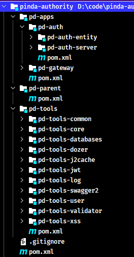
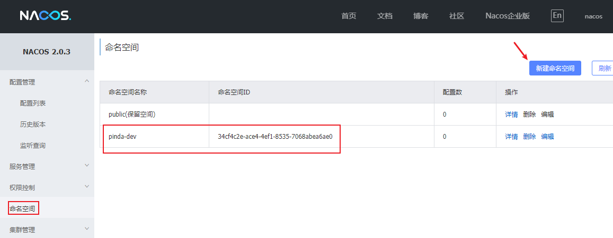
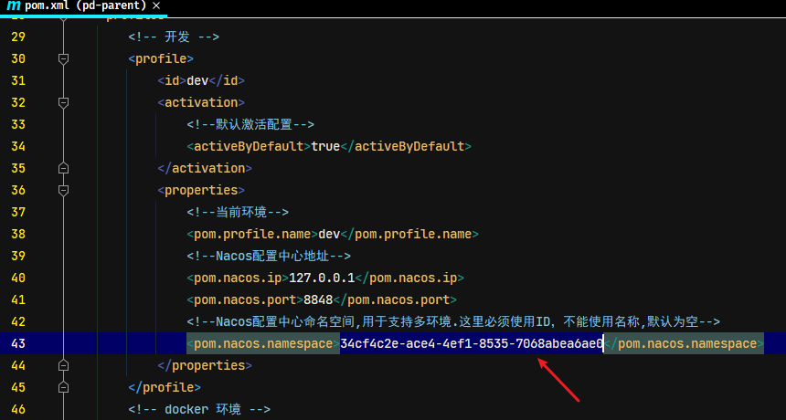

# 第02章 项目搭建与工具模块使用

## 1. 导入初始工程

本项目主要是用于学习实现权限校验功能，不需要去一步步创建整体的项目工程，直接使用网上一些开源项目做为初始化工程，直接导入到IDEA即可。导入步骤：

1. 将初始工程 pinda-authority 复制到任意没有中文和空格的目录下
2. 打开 IDEA，选择 Open，选择 pinda-authority 工程目录即可

导入的项目结构如下：



## 2. 项目模块

### 2.1. 工程结构和模块说明

品达通用权限系统项目整体工程结构和模块功能如下：

```
pinda-authority              # 聚合工程，用于聚合 pd-parent、pd-apps、pd-tools 等模块
├── pd-parent				 # 父工程，nacos 配置及依赖包管理
├── pd-apps					 # 应用目录
|	├── pd-auth				 # 权限服务父工程
|	|	├── pd-auth-entity   # 权限实体
|	|	└── pa-auth-server   # 权限服务
|	└── pd-gateway			 # 网关服务
└── pd-tools				 # 工具工程
|	├── pd-tools-common		 # 基础组件：基础配置类、函数、常量、统一异常处理、undertow服务器
|	├── pd-tools-core		 # 核心组件：基础实体、返回对象、上下文、异常处理、分布式锁、函数、树
|	├── pd-tools-databases	 # 数据源组件：数据源配置、数据权限、查询条件等
|	├── pd-tools-dozer		 # 对象转换：dozer配置、工具
|	├── pd-tools-j2cache	 # 缓存组件：j2cache、redis缓存
|	├── pd-tools-jwt         # JWT组件：配置、属性、工具
|	├── pd-tools-log	     # 日志组件：日志实体、事件、拦截器、工具
|	├── pd-tools-swagger2	 # 文档组件：knife4j文档
|	├── pd-tools-user        # 用户上下文：用户注解、模型和工具，当前登录用户信息注入模块
|	├── pd-tools-validator	 # 表单验证： 后台表单规则验证
|	└── pd-tools-xss		 # xss防注入组件
└── pd-examples              # 本项目涉及相关技术的示例工程
```

项目服务目前只有两个：网关服务和权限服务

|      应用       | 端口 |   说明    |             启动命令              |
| -------------- | ---- | -------- | -------------------------------- |
| pd-gateway     | 8760 | 网关服务  | `java -jar pd-gateway.jar &`     |
| pd-auth-server | 8764 | 权限服务  | `java -jar pd-auth-server.jar &` |

> Tips: 
>
> - 以上启动命令用于 linux 部署环境中，如果是本地开发时，直接使用 IDEA 启动即可
> - 由于本系统是基于当前非常流行的前后端分离的方式开发，其中前端部分是由专门的前端开发人员负责，本示例项目中直接使用。

### 2.2. 项目实战开发计划说明

通过前面导入的初始项目可以看到，pd-tools 工程中的各个子模块功能基本已完成，这些子模块属于项目的基础组件，为后续开发网关服务和权限服务提供支持，而且有一些子模块在其他项目中也可以复用。由于这些子模块会涉及到一些新技术或者框架，所以计划在本项目主要的权限校验功能实现前，先通读 pd-tools 中的相关模块的代码实现，了解这些新技术或者框架的使用方法，从而了解此模块的作用和开发过程。

学习完这些模块之后，再进行开发后面的网关服务和权限服务了。

## 3. Nacos 服务注册和配置中心搭建

> 更多 Nacos 内容详见[《Spring Cloud Alibaba (包含Nacos、Sentinel等组件)》笔记](/07-分布式架构&微服务架构/02-SpringCloud/03-Spring-Cloud-Alibaba)的“Spring Cloud Alibaba Nacos Discovery”与“Spring Cloud Alibaba Nacos Config”章节。*或者《Nacos》笔记（目前该笔记未整理）*

本项目使用 Nacos 来作为服务的注册和配置中心。Nacos 是阿里巴巴开源的一款支持服务注册与发现，配置管理以及微服务管理的组件。用来取代以前常用的注册中心（zookeeper、eureka 等等），以及配置中心（spring cloud config、apollo 等等）。Nacos 是同时集成了注册中心和配置中心的功能。

### 3.1. 下载与安装

安装和配置过程如下：

- 第一步：下载 Nacos 安装包（*本示例项目使用 NACOS 2.0.3*），下载地址：https://github.com/alibaba/nacos/releases
- 第二步：将下载的 zip 压缩文件解压到任意没有中文和空格的目录下

### 3.2. 配置数据存储

Nacos 在存储数据时既可以使用内置数据库存储，也可以通过第三方指定的数据库存储。若要指定使用 MySQL 数据库来存储 Nacos 的相关数据，则需要修改 `NACOS_HOME/conf/application.properties`
配置文件，配置使用的 MySQL 数据库的数据源信息，这个可以根据实际的 MySQL 数据库进行相应调整，例如 MySQL 的地址、用户名、密码等。

```properties
### If use MySQL as datasource:
spring.datasource.platform=mysql

### Count of DB:
db.num=1

### Connect URL of DB:
db.url.0=jdbc:mysql://127.0.0.1:3306/nacos?characterEncoding=utf8&connectTimeout=1000&socketTimeout=3000&autoReconnect=true&useUnicode=true&useSSL=false&serverTimezone=UTC
db.user.0=root
db.password.0=123456
```

创建数据库

```sql
CREATE DATABASE `nacos` CHARACTER SET utf8mb4 COLLATE utf8mb4_general_ci;
```

执行 `NACOS_HOME/conf/nacos-mysql.sql` 数据库脚本文件创建 nacos 需要相应表格，完成后可以看到创建了如下表


### 3.3. 启动服务

进入 nacos 安装目录，双击 `NACOS_HOME/bin/startup.cmd` 即可启动服务。也可通过命令行方式指定参数来启动服务：

```bash
startup.cmd -m standalone
```

### 3.4. 导入项目配置

访问 Nacos 控制台

- 访问地址：http://localhost:8848/nacos
- 默认用户名/密码：nacos/nacos

新建命名空间 pinda-dev



> Notes: 在创建完命名空间后，需要将命名空间的id需要替换到项目文件 pd-parent/pom.xml 中对应的nacos命名空间的id。*创建命名空间时可以手动指定ID，最终保持项目与nacos配置的ID一致即可*



点击【配置管理】->【配置列表】，选择 nacos 配置中心的命名空间，点击【导入配置】按钮导入配置文件：pinda-authority-project/document/nacos/nacos_config_export_20220719094029.zip。导入完成后如下：


## 4. Redis 服务

在项目开发阶段直接使用windows版的Redis，直接点击 REDIS_HOME/64bit/redis-server.exe 启动 Redis 服务即可使用。

## 5. pd-tools-swagger2 模块

pd-tools-swagger2 模块定位为文档组件，前后端开发人员可以查看接口文档，为前后端开发人员的开发统一接口，方便后续的前后端联调对接工作。

### 5.1. swagger 介绍

Swagger 的基础介绍与使用详见[《Swagger 接口文档工具》笔记](/02-后端框架/99-工具框架/10-Swagger)

### 5.2. 入门案例

> Notes: 案例源码都在本项目的 pd-examples 模块中

- swagger 入门案例代码详见：pinda-authority-project\pinda-authority\pd-examples\swagger-demo\
- knife4j 入门案例代码详见：pinda-authority-project\pinda-authority\pd-examples\swagger-knife4j-demo\

### 5.3. pd-tools-swagger2 模块的使用

pd-tools-swagger2 模块整合了 knife4j 的配置，并且按照 Spring boot starter 的规范在 /resources/META-INF 中提供 spring.factories 文件，内容如下：

```properties
org.springframework.boot.autoconfigure.EnableAutoConfiguration=\
    com.moon.pinda.swagger2.SwaggerAutoConfiguration
```

在其他模块（项目）中如果需要使用 swagger 接口文档功能，只需要引入这个 starter 并且在 application.yml 中进行 swagger 的相关配置即可，例如：

```yml
pinda:
  swagger:
    enabled: true #是否启用swagger
    docket:
      user:
        title: xx模块
        base-package: xxx.xxx.xxxx
      menu:
        title: xx模块
        base-package: xxx.xxx.xxxx
```

#### 5.3.1. 项目依赖

创建 maven 工程 pd-tools-swagger2-demo 并配置 pom.xml 文件引入 pd-tools-swagger2 的依赖。<font color=red>**特别注意：如果是非本项目引入时，需要将其安装到本地仓库**</font>

```java
<parent>
    <groupId>org.springframework.boot</groupId>
    <artifactId>spring-boot-starter-parent</artifactId>
    <version>2.2.2.RELEASE</version>
    <relativePath/>
</parent>

<dependencies>
    <!-- 引入自己定义的 swagger 基础模块-->
    <dependency>
        <groupId>com.moon</groupId>
        <artifactId>pd-tools-swagger2</artifactId>
        <version>1.0-SNAPSHOT</version>
    </dependency>
    <dependency>
        <groupId>org.projectlombok</groupId>
        <artifactId>lombok</artifactId>
    </dependency>
</dependencies>
```

#### 5.3.2. 创建接口与实体类

此步骤复用前面的《Swagger 入门案例》章节的代码即可

#### 5.3.3. 项目配置

创建 application.yml，配置 swagger 相关属性，**注意要与 starter 中的定义的属性值一致**

```yml
pinda:
  swagger:
    enabled: true # 是否启用swagger
    title: pd-tools-swagger2 在线文档
    description: pd-tools-swagger2 模块测试生成在线文档
    version: 2.0.0
    basePackage: com.moon.examples.tools
```

创建启动类 ToolsSwaggerApplication

```java
@SpringBootApplication
public class ToolsSwaggerApplication {
    public static void main(String[] args) {
        SpringApplication.run(ToolsSwaggerApplication.class, args);
    }
}
```

执行启动类 main 方法启动项目，访问地址：http://localhost:8080/doc.html


## 6. pd-tools-dozer 模块

pd-tools-dozer 模块功能定位为对象转换，其本质就是一个 Spring Boot starter，其他模块可以直接导入此模块就可以直接使用对象转换功能

### 6.1. dozer 介绍

Dozer 是实现两个 Java Bean 进行复制的映射器，它以递归方式将数据从一个对象复制到另一个对象。dozer 是用来对两个对象之间属性转换的工具，在将一个对象的所有属性值转给另一个对象时，就不需要再去写重复的调用 setter 和 getter 方法了。dozer 其实是 Beanutils 的封装

dozer 的 maven 坐标：

```xml
<dependency>
    <groupId>com.github.dozermapper</groupId>
    <artifactId>dozer-core</artifactId>
    <version>6.5.0</version>
</dependency>
```

为了简化使用方式，dozer 还提供了 starter，其 maven 坐标为：

```xml
<dependency>
    <groupId>com.github.dozermapper</groupId>
    <artifactId>dozer-spring-boot-starter</artifactId>
    <version>6.5.0</version>
</dependency>
```

### 6.2. Dozer 入门案例

#### 6.2.1. 项目依赖

创建 maven 工程 dozer-demo 并配置 pom.xml 文件引入 dozer 的依赖。

```xml
<parent>
    <groupId>org.springframework.boot</groupId>
    <artifactId>spring-boot-starter-parent</artifactId>
    <version>2.2.2.RELEASE</version>
    <relativePath/>
</parent>

<dependencies>
    <dependency>
        <groupId>com.github.dozermapper</groupId>
        <artifactId>dozer-spring-boot-starter</artifactId>
        <version>6.5.0</version>
    </dependency>
    <dependency>
        <groupId>org.springframework.boot</groupId>
        <artifactId>spring-boot-starter-test</artifactId>
        <scope>test</scope>
    </dependency>
    <dependency>
        <groupId>org.projectlombok</groupId>
        <artifactId>lombok</artifactId>
    </dependency>
</dependencies>
```

#### 6.2.2. 创建测试的实体类

- 创建 UserDTO

```java
@Data
public class UserDTO {
    private String userId;
    private String userName;
    private int userAge;
    private String address;
    private String birthday;
}
```

- 创建 UserEntity

```java
@Data
public class UserEntity {
    private String id;
    private String name;
    private int age;
    private String address;
    private Date birthday;
}
```

> Notes: 为了测试属性不同的名称、不同的类型的时的转换，以上有部分的属性与类型不一致

#### 6.2.3. dozer 配置

在 resources/dozer/ 目录下创建 dozer 的全局配置文件 global.dozer.xml

> 注：全局配置文件名称可以任意的

```xml
<?xml version="1.0" encoding="UTF-8"?>
<mappings xmlns:xsi="http://www.w3.org/2001/XMLSchema-instance"
          xmlns="http://dozermapper.github.io/schema/bean-mapping"
          xsi:schemaLocation="http://dozermapper.github.io/schema/bean-mapping
                              http://dozermapper.github.io/schema/bean-mapping.xsd">
    <!-- 全局配置:
        <date-format> 表示日期格式
     -->
    <configuration>
        <date-format>yyyy-MM-dd</date-format>
    </configuration>
</mappings>
```

在 resources/dozer/ 目录下创建 dozer 的映射文件 biz.dozer.xml。此文件针对实体类之间的映射配置

> 注：映射文件名称可以任意

```xml
<?xml version="1.0" encoding="UTF-8"?>
<mappings xmlns:xsi="http://www.w3.org/2001/XMLSchema-instance"
          xmlns="http://dozermapper.github.io/schema/bean-mapping"
          xsi:schemaLocation="http://dozermapper.github.io/schema/bean-mapping
                             http://dozermapper.github.io/schema/bean-mapping.xsd">
    <!-- 描述两个类中属性的对应关系，对于两个类中同名的属性可以不映射 -->
    <mapping date-format="yyyy-MM-dd">
        <class-a>com.moon.examples.dozer.entity.UserEntity</class-a>
        <class-b>com.moon.examples.dozer.dto.UserDTO</class-b>
        <field>
            <a>id</a>
            <b>userId</b>
        </field>
        <field>
            <a>name</a>
            <b>userName</b>
        </field>
        <field>
            <a>age</a>
            <b>userAge</b>
        </field>
    </mapping>

    <!-- 可以使用 map-id 指定映射的标识，在程序中通过此标识来确定使用当前这个映射关系 -->
    <mapping date-format="yyyy-MM-dd" map-id="user">
        <class-a>com.moon.examples.dozer.entity.UserEntity</class-a>
        <class-b>com.moon.examples.dozer.dto.UserDTO</class-b>
        <field>
            <a>id</a>
            <b>userId</b>
        </field>
        <field>
            <a>name</a>
            <b>userName</b>
        </field>
        <field>
            <a>age</a>
            <b>userAge</b>
        </field>
    </mapping>
</mappings>
```

编写 application.yml 项目配置文件，指定 dozer 的配置文件位置

```yml
dozer:
  mapping-files:
    - classpath:dozer/global.dozer.xml
    - classpath:dozer/biz.dozer.xml
```

#### 6.2.4. 功能测试

编写启动类

```java
@SpringBootApplication
public class DozerDemoApplication {
    public static void main(String[] args) {
        SpringApplication.run(DozerDemoApplication.class, args);
    }
}
```

编写测试方法。*注：示例使用 junit 5*

```java
import com.github.dozermapper.core.Mapper;
import com.moon.examples.dozer.DozerDemoApplication;
import com.moon.examples.dozer.dto.UserDTO;
import com.moon.examples.dozer.entity.UserEntity;
import org.junit.jupiter.api.BeforeEach;
import org.junit.jupiter.api.Test;
import org.springframework.beans.factory.annotation.Autowired;
import org.springframework.boot.test.context.SpringBootTest;

/**
 * Dozer 基础测试
 */
@SpringBootTest(classes = DozerDemoApplication.class)
public class DozerTest {

    // 使用 Dozer 提供的 Mapper 对象可以完成两个对象之间属性复制
    @Autowired
    private Mapper mapper;

    private UserDTO userDTO = new UserDTO();

    // 初始化测试使用的源对象值
    @BeforeEach
    public void init() {
        userDTO.setUserId("2828");
        userDTO.setUserName("MooNkirA");
        userDTO.setUserAge(21);
        userDTO.setAddress("GK-China");
        userDTO.setBirthday("2010-08-08");
    }

    // 根据类型 .class 进行复制
    @Test
    public void testDozer1() {
        UserEntity user = mapper.map(userDTO, UserEntity.class);
        System.out.println(user);
    }

    // 两个对象之间复制
    @Test
    public void testDozer2() {
        UserEntity user = new UserEntity();
        user.setId("200");
        System.out.println(user);
        mapper.map(userDTO, user);
        System.out.println(user);
    }

    // 根据配置的映射id 进行复制
    @Test
    public void testDozer3() {
        UserEntity user = new UserEntity();
        System.out.println(user);
        mapper.map(userDTO, user, "user");
        System.out.println(user);
    }
}
```

### 6.3. pd-tools-dozer 模块的使用

在 pd-tools-dozer 模块中为了进一步简化操作，封装了一个工具类 `DozerUtils`，其内部使用的就是 `Mapper` 对象进行的操作。并且按照 Spring Boot starter 的规范编写 /resources/META-INF/spring.factories 文件，内容如下：

```properties
org.springframework.boot.autoconfigure.EnableAutoConfiguration=\
    com.moon.pinda.dozer.DozerAutoConfiguration
```

在配置类 `DozerAutoConfiguration` 中完成 `DozerUtils` 对象的创建，这样其他的程序如果需要使用 dozer 进行对象转换，只需要引入此模块的 maven 坐标并且提供对应的映射文件就可以在程序中直接注入 `DozerUtils` 对象进行操作了。

#### 6.3.1. 项目依赖

创建 maven 工程 pd-tools-dozer-demo 并配置 pom.xml 文件引入 pd-tools-dozer 的依赖。<font color=red>**特别注意：如果是非本项目引入时，需要将其安装到本地仓库**</font>

```xml
<parent>
    <groupId>org.springframework.boot</groupId>
    <artifactId>spring-boot-starter-parent</artifactId>
    <version>2.2.2.RELEASE</version>
    <relativePath/>
</parent>

<dependencies>
    <!-- 引入自定义的 dozer 公共模块-->
    <dependency>
        <groupId>com.moon</groupId>
        <artifactId>pd-tools-dozer</artifactId>
        <version>1.0-SNAPSHOT</version>
    </dependency>
    <dependency>
        <groupId>org.springframework.boot</groupId>
        <artifactId>spring-boot-starter-test</artifactId>
        <scope>test</scope>
    </dependency>
    <dependency>
        <groupId>org.projectlombok</groupId>
        <artifactId>lombok</artifactId>
    </dependency>
</dependencies>
```

#### 6.3.2. 创建测试的实体类

此步骤复用前面的《Dozer 入门案例》章节的代码即可

#### 6.3.3. dozer 配置

此步骤复用前面的《Dozer 入门案例》章节的配置即可

> Notes: 如果创建的 UserEntity 和 UserDTO 中的属性完全一致，可以不提供映射文件，如果这两个类中的属性存在不一致的情况，需要创建映射文件进行映射，并且还需要在 application.yml 中配置映射文件的位置，例如：

```yml
dozer:
  mappingFiles:
    - classpath:dozer/biz.dozer.xml  # 指定dozer的映射文件位置
```

#### 6.3.4. 运行测试

创建启动类

```java
@SpringBootApplication
public class ToolsDozerApplication {
    public static void main(String[] args) {
        SpringApplication.run(ToolsDozerApplication.class, args);
    }
}
```

编写测试方法。*注：示例使用 junit 5*

```java
@SpringBootTest
public class DozerToolsTest {

    // 在 pd-tools-dozer 中已经完成了自动配置，可以直接注入
    @Autowired
    private DozerUtils dozerUtils;

    private UserDTO userDTO = new UserDTO();

    // 初始化测试使用的源对象值
    @BeforeEach
    public void init() {
        userDTO.setUserId("123123");
        userDTO.setUserName("MooNkirA");
        userDTO.setUserAge(22);
        userDTO.setAddress("ABC");
        userDTO.setBirthday("2020-08-08");
    }

    // 根据类型 .class 进行复制
    @Test
    public void testDozerUtils() {
        UserEntity user = dozerUtils.map(userDTO, UserEntity.class);
        System.out.println(user);
    }
}
```

> Tips: 其他不同方式复制方法参考 pd-tools-dozer 源码或者入门案例

## 7. pd-tools-validator 模块

pd-tools-validator 模块功能定位为后端表单数据校验，其他模块可以直接引入 pd-tools-validator 的 maven 坐标就可以使用其提供的表单校验功能。pd-tools-validator 底层基于 hibernate-validator 实现。

### 7.1. hibernate-validator 介绍与入门案例

hibernate-validator 的基础介绍与使用详见[《Spring Boot Validation 参数校验》笔记](/07-分布式架构&微服务架构/01-SpringBoot/13-Spring-Boot-Validation)

### 7.2. pd-tools-validator 模块的使用

pd-tools-validator 的实现和前面的入门案例是一致的，只是没有提供全局异常处理，这是因为不同的系统对于校验结果的处理方式可能不一样，所以需要各个系统自己进行个性化的处理，而 pd-tools-validator只是提供数据校验功能。

#### 7.2.1. 项目依赖

创建 maven 工程 pd-tools-validator-demo 并配置 pom.xml 文件引入 pd-tools-validator 的依赖。<font color=red>**特别注意：如果是非本项目引入时，需要将其安装到本地仓库**</font>

```xml
<parent>
    <groupId>org.springframework.boot</groupId>
    <artifactId>spring-boot-starter-parent</artifactId>
    <version>2.2.2.RELEASE</version>
    <relativePath/>
</parent>

<dependencies>
    <!-- 引入自定义的 dozer 公共模块-->
    <dependency>
        <groupId>com.moon</groupId>
        <artifactId>pd-tools-dozer</artifactId>
        <version>1.0-SNAPSHOT</version>
    </dependency>
    <dependency>
        <groupId>org.springframework.boot</groupId>
        <artifactId>spring-boot-starter-test</artifactId>
        <scope>test</scope>
    </dependency>
    <dependency>
        <groupId>org.projectlombok</groupId>
        <artifactId>lombok</artifactId>
    </dependency>
</dependencies>
```

#### 7.2.2. 创建测试的实体类与控制器

实体类

```java
@Data
public class UserDTO {

    @NotNull(message = "用户id不能为空")
    private Integer id;

    @NotEmpty(message = "用户名不能为空")
    @Length(max = 50, message = "用户名长度不能超过50")
    private String username;

    @Max(value = 80, message = "年龄最大为80")
    @Min(value = 18, message = "年龄最小为18")
    private int age;

    @Pattern(regexp = "[a-zA-Z0-9_-]+@[a-zA-Z0-9_-]+(\\.[a-zA-Z0-9_-]+)+$",
            message = "邮箱格式不正确")
    private String email;
}
```

控制类，标识 `@Validated` 注解开启校验功能

```java
@RestController
@RequestMapping("/user")
@Validated // 开启校验功能
public class UserController {

    // 简单数据类型校验
    @RequestMapping("/delete")
    public String delete(@NotBlank(message = "id不能为空") String id) {
        System.out.println("delete..." + id);
        return "OK";
    }

    // 对象属性校验
    @RequestMapping("/save")
    public String save(@Validated UserDTO user) {
        System.out.println("save..." + user);
        return "OK";
    }
}
```

#### 7.2.3. 运行测试

创建启动类，并标识 `@EnableFormValidator` 注解开启校验快速失败模式

```java
@SpringBootApplication
@EnableFormValidator // 开启校验快速失败模式
public class ToolsValidatorApplication {

    public static void main(String[] args) {
        SpringApplication.run(ToolsValidatorApplication.class, args);
    }

}
```

启动项目，访问地址：http://localhost:8080/user/save，可以看到控制台输出：


注释 `@EnableFormValidator` 注解，关闭校验快速失败模式，再次测试


## 8. pd-tools-xss 模块

pd-tools-xss 模块功能定位为防跨站脚本攻击（XSS），通过对用户在页面输入的 HTML / CSS / JavaScript 等内容进行检验和清理，确保输入内容符合应用规范，保障系统的安全。


