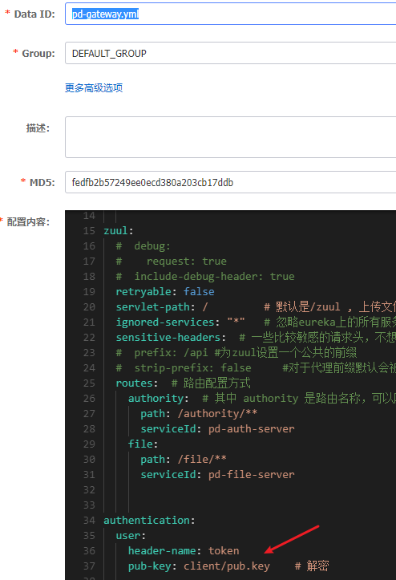
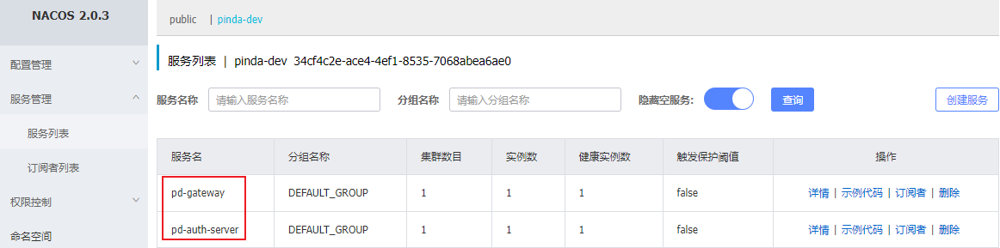
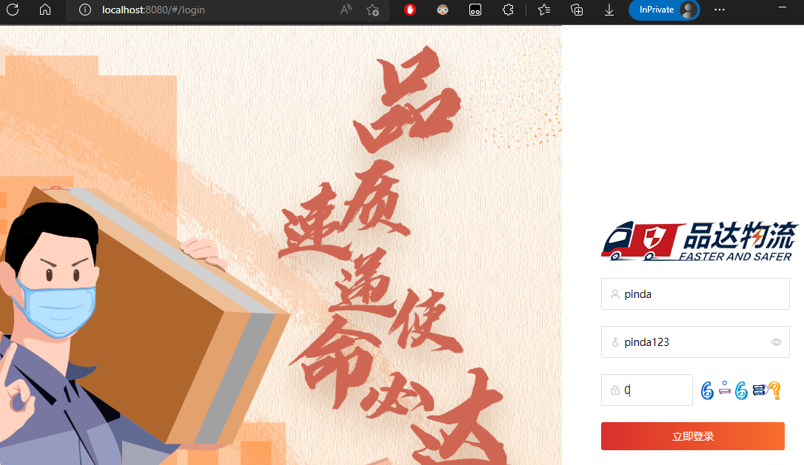

# 第05章 网关服务开发

## 1. 基础环境搭建

pd-gateway 作为通用权限系统的网关服务，前端的 http 请求首先需要经过网关服务处理，再通过网关服务的路由功能转发到权限服务或者其他微服务进行业务处理。因此可以在网关服务进行统一的 jwt 令牌解析、鉴权相关操作。

> Notes: 以下配置与修改均在 pd-gateway 工程中进行

### 1.1. 配置文件

由于当前项目使用的是 Nacos 作为整个项目的配置中心，所以 Spring Boot 的大部分配置文件都在 Nacos 中进行统一配置

#### 1.1.1. bootstrap.yml

在 pd-gateway 工程中只需要按照 Spring Boot 的要求在 resources 目录下提供 bootstrap.yml 配置文件即可，文件内容如下：

```yml
# 注意：@xxx@ 是从 pd-parent 工程的 pom.xml 中取值, 所以 @xx@ 标注的值，都不能从 nacos 配置中心中获取
pinda: # 自定义公共配置
  # docker部署时，需要指定，表示运行该服务的宿主机IP
  local-ip: ${LOCAL_IP:${spring.cloud.client.ip-address}}
  nacos:
    ip: ${NACOS_IP:@pom.nacos.ip@}
    port: ${NACOS_PORT:@pom.nacos.port@}
    namespace: ${NACOS_ID:@pom.nacos.namespace@}

spring:
  main:
    allow-bean-definition-overriding: true
  application:
    name: @project.artifactId@ # pd-gateway
  profiles:
    active: @pom.profile.name@ # dev
  cloud:
    nacos:
      config: # nacos 配置中心相关配置
        server-addr: ${pinda.nacos.ip}:${pinda.nacos.port} # 配置服务器地址
        file-extension: yml # 配置文件类型
        namespace: ${pinda.nacos.namespace} # 命名空间
        shared-dataids: common.yml,redis.yml,mysql.yml
        refreshable-dataids: common.yml # 可刷新的配置
        enabled: true
      discovery: # nacos 服务注册中心相关配置
        server-addr: ${pinda.nacos.ip}:${pinda.nacos.port} # 注册中心服务器地址
        namespace: ${pinda.nacos.namespace} # 命名空间
        metadata: # 元数据，用于权限服务实时获取各个服务的所有接口
          management.context-path: ${server.servlet.context-path:}${spring.mvc.servlet.path:}${management.endpoints.web.base-path:}
          #http://localhost:8760/api/gate/actuator
```

#### 1.1.2. logback-spring.xml

由于 pd-gateway 已经添加了 pd-tools-log 模块的依赖，所以可以在项目中使用 logback 记录日志信息。在 resources 目录下提供 logback-spring.xml 配置文件，Spring Boot 默认就可以加载到，文件内容如下：

```xml
<?xml version="1.0" encoding="UTF-8"?>
<configuration>
    <!-- 引入pd-tools-log模块中提供的日志的基础配置 -->
    <include resource="com/moon/pinda/log/logback/pinda-defaults.xml"/>

    <!-- 设置多个环境使用的配置，分别是 test,docker,prod -->
    <springProfile name="test,docker,prod">
        <logger name="com.moon.pinda.zuul" additivity="true" level="INFO">
            <appender-ref ref="ASYNC_CONTROLLER_APPENDER"/>
        </logger>
    </springProfile>
    <!-- 设置 dev 环境使用的配置 -->
    <springProfile name="dev">
        <logger name="com.moon.pinda.zuul" additivity="true" level="INFO">
            <appender-ref ref="CONTROLLER_APPENDER"/>
        </logger>
    </springProfile>
</configuration>
```

#### 1.1.3. j2cache配置文件

在当前 pd-gateway 项目中会使用到 j2cache 来操作缓存， j2cache 的相关配置已经在 Nacos 配置中心的 redis.yml 中已经配置，因此不需要在本地配置。而 j2cache 缓存使用了 caffeine 并且指定了其配置文件的位置为 /j2cache/caffeine.properties，因此需要在该位置创建相应的配置文件，内容如下：

```properties
#########################################
# Caffeine configuration
# \u6682\u65F6\u6CA1\u7528
# [name] = size, xxxx[s|m|h|d]
#########################################
default=2000, 2h
resource=2000, 1h
```

#### 1.1.4. 密钥文件

本项目中使用 RS256 非对称加密算法进行签名，这就需要使用 RSA 生成一对公钥和私钥。而在当前网关服务中只需要对客户端请求中携带的 jwt token 进行解析，因此只需要公钥即可。此处直接使用 pd-auth-server 项目的 pub.key 公钥，将公私钥文件复制到 pd-gateway 工程的 resources/client 下

> Notes: 此处因为在 Nacos 配置中心的 pd-gateway.yml 中通过配置的形式已经指定了公私钥的位置和名称，如有需要也可以自行修改。



### 1.2. zuul 网关配置类

网关服务的配置只需要继承 pd-tools-common 模块所提供的 `BaseConfig` 基础抽象类即可。在类中增加解决跨域问题的配置

```java
package com.moon.pinda.zuul.config;

import com.moon.pinda.common.config.BaseConfig;
import org.springframework.context.annotation.Bean;
import org.springframework.context.annotation.Configuration;
import org.springframework.web.cors.CorsConfiguration;
import org.springframework.web.cors.UrlBasedCorsConfigurationSource;
import org.springframework.web.filter.CorsFilter;

/**
 * Zuul 配置类
 */
@Configuration
public class ZuulConfiguration extends BaseConfig {

    // 解决跨域问题的配置
    @Bean
    public CorsFilter corsFilter() {
        final UrlBasedCorsConfigurationSource source = new UrlBasedCorsConfigurationSource();
        final CorsConfiguration config = new CorsConfiguration();
        // 允许cookies跨域
        config.setAllowCredentials(true);
        // 允许向该服务器提交请求的URI，* 表示全部允许
        config.addAllowedOrigin("*");
        // 允许访问的头信息, * 表示全部
        config.addAllowedHeader("*");
        // 预检请求的缓存时间（秒），即在这个时间段里，对于相同的跨域请求不会再预检了
        config.setMaxAge(18000L);
        // 允许提交请求的方法，*表示全部允许
        config.addAllowedMethod("OPTIONS");
        config.addAllowedMethod("HEAD");
        // 允许Get的请求类型
        config.addAllowedMethod("GET");
        config.addAllowedMethod("PUT");
        config.addAllowedMethod("POST");
        config.addAllowedMethod("DELETE");
        config.addAllowedMethod("PATCH");
        source.registerCorsConfiguration("/**", config);
        return new CorsFilter(source);
    }
}
```

### 1.3. 启动类

在启动类中，使用相关注解开启配置，如：开启注册中心客户端、开启 feign 客户端、开启授权客户端等

```java
@SpringBootApplication
@EnableDiscoveryClient // 开启注册中心客户端
@EnableFeignClients({"com.moon.pinda"}) // 开启 feign 客户端
@EnableZuulProxy // 开启网关代理
@EnableAuthClient // 开启授权客户端，开启后即可使用 pd-tools-jwt 提供的工具类进行 jwt token 解析了
public class ZuulServerApplication {
    public static void main(String[] args) {
        SpringApplication.run(ZuulServerApplication.class, args);
    }
}
```

运行启动类main方法，启动项目。值得注意的是，项目依赖 nacos 配置中心与 reids，因此需要先启动 nacos 服务与 redis 服务



## 2. Feign 远程代理接口和熔断器

在网关服务中，会通过 Feign 来调用权限服务来获取相关信息，所以需要定义 Feign 的远程调用代理接口和对应的熔断器类

### 2.1. 资源服务代理接口

在 api 包中新建一个远程调用资源代理服务的 Feign 代理接口 `ResourceApi`，通过 `@FeignClient` 注解来指定代理的服务名称与服务熔断处理类

```java
package com.moon.pinda.zuul.api;

import com.moon.pinda.authority.dto.auth.ResourceQueryDTO;
import com.moon.pinda.authority.entity.auth.Resource;
import com.moon.pinda.base.R;
import org.springframework.cloud.openfeign.FeignClient;
import org.springframework.web.bind.annotation.GetMapping;

import java.util.List;

/**
 * 资源服务 feign 远程代理接口
 * @FeignClient 注解，用于标识当前接口为Feign调用微服务的核心接口
 *  value/name属性：指定需要调用的服务提供者的名称，从 nacos 配置中心读取，默认值为 pd-auth-server
 *  fallback 属性：指定服务熔断处理类
 */
@FeignClient(name = "${pinda.feign.authority-server:pd-auth-server}",
        fallback = ResourceApiFallback.class)
public interface ResourceApi {

    //获取所有需要鉴权的资源
    @GetMapping("/resource/list")
    R<List> list();

    //查询当前登录用户拥有的资源权限
    @GetMapping("/resource")
    R<List<Resource>> visible(ResourceQueryDTO resource);
}
```

### 2.2. 服务熔断处理类

创建熔断处理类 `ResourceApiFallback`，目前所有熔断方法没有做任何处理，先直接返回 null

```java
@Component
public class ResourceApiFallback implements ResourceApi {

    @Override
    public R<List> list() {
        return null;
    }

    @Override
    public R<List<Resource>> visible(ResourceQueryDTO resource) {
        return null;
    }
}
```

## 3. 网关服务过滤器

在网关服务中需要通过过滤器来实现**jwt token 解析**和**鉴权**相关处理。

### 3.1. 基础过滤器

创建抽象类 `BaseFilter` 继承 `com.netflix.zuul.ZuulFilter`，作为基础过滤器，统一抽取一些公共属性和方法。

```java
public abstract class BaseFilter extends ZuulFilter {

    // 获取配置的网关服务请求根路径，示例配置是 /api
    @Value("${server.servlet.context-path}")
    protected String zuulPrefix;

    // 判断当前请求uri是否需要忽略（直接放行）
    protected boolean isIgnoreToken() {
        // 动态获取当前请求的uri
        HttpServletRequest request = RequestContext.getCurrentContext().getRequest();
        String uri = request.getRequestURI();
        // 对 uri 进行截取，如 /api/authority/menu/page --> /menu/page
        uri = StrUtil.subSuf(uri, zuulPrefix.length());
        uri = StrUtil.subSuf(uri, uri.indexOf("/", 1));
        // 判断是否包含在忽略url集合中
        return IgnoreTokenConfig.isIgnoreToken(uri);
    }

    // 网关抛异常，不再进行路由，而是直接返回到前端
    protected void errorResponse(String errMsg, int errCode, int httpStatusCode) {
        RequestContext ctx = RequestContext.getCurrentContext();
        // 设置响应状态码
        ctx.setResponseStatusCode(httpStatusCode);
        // 设置响应头信息
        ctx.addZuulResponseHeader("Content-Type", "application/json;charset=utf-8");
        if (ctx.getResponseBody() == null) {
            // 设置响应体
            ctx.setResponseBody(R.fail(errCode, errMsg).toString());
            // 不进行路由，直接返回
            ctx.setSendZuulResponse(false);
        }
    }
}
```

> Notes: `IgnoreTokenConfig` 定义一些忽略 token 校验的 uri 集合，并提供了校验工具方法。（*详见源码*）

### 3.2. Token 解析过滤器

`TokenContextFilter` 过滤器主要作用就是解析请求头中的 JWT token 并将解析出的用户信息放入 zuul 请求上下文的 header 中供后面的程序使用。

```java
@Component
public class TokenContextFilter extends BaseFilter {

    @Autowired
    private AuthClientProperties authClientProperties;
    @Autowired
    private JwtTokenClientUtils jwtTokenClientUtils;

    // 设置过滤器类型
    @Override
    public String filterType() {
        // 前置过滤器 "pre"
        return FilterConstants.PRE_TYPE;
    }

    // 设置过滤器执行顺序，数值越大优先级越低
    @Override
    public int filterOrder() {
        return FilterConstants.PRE_DECORATION_FILTER_ORDER + 1;
    }

    // 是否执行当前过滤器，目前是直接执行
    @Override
    public boolean shouldFilter() {
        return true;
    }

    // 过滤器真正的处理逻辑
    @Override
    public Object run() throws ZuulException {
        if (isIgnoreToken()) {
            // uri 在忽略校验列表中，直接放行
            return null;
        }
        // 获取 zuul 请求的上下文对象
        RequestContext ctx = RequestContext.getCurrentContext();
        // 获取当前请求对象
        HttpServletRequest request = ctx.getRequest();

        // 从请求头中获取前端提交的jwt令牌
        String userToken = request.getHeader(authClientProperties.getUser().getHeaderName());

        try {
            // 通过 pd-tools-jwt 模块的 JwtToken 客户端工具解析 jwt 令牌
            JwtUserInfo userInfo = jwtTokenClientUtils.getUserInfo(userToken);
            // 将解析出来的用户信息放入 header
            if (userInfo != null) {
                addHeader(ctx, BaseContextConstants.JWT_KEY_ACCOUNT, userInfo.getAccount());
                addHeader(ctx, BaseContextConstants.JWT_KEY_USER_ID, userInfo.getUserId());
                addHeader(ctx, BaseContextConstants.JWT_KEY_NAME, userInfo.getName());
                addHeader(ctx, BaseContextConstants.JWT_KEY_ORG_ID, userInfo.getOrgId());
                addHeader(ctx, BaseContextConstants.JWT_KEY_STATION_ID, userInfo.getStationId());
            }
        } catch (BizException e) {
            errorResponse(e.getMessage(), e.getCode(), 200);
        } catch (Exception e) {
            errorResponse("解析jwt令牌出错", R.FAIL_CODE, 200);
        }

        return null;
    }

    // 将指定信息放入 zuul 上下文的 header 中
    private void addHeader(RequestContext ctx, String name, Object value) {
        if (!StringUtils.isEmpty(value)) {
            ctx.addZuulRequestHeader(name, StrHelper.encode(value.toString()));
        }
    }
}
```

### 3.3. 鉴权过滤器

`AccessFilter` 过滤器主要进行的是鉴权相关处理。

#### 3.3.1. 鉴权实现步骤

- 第1步：判断当前请求 uri 是否需要忽略
- 第2步：获取当前请求的请求方式和 uri，拼接成 `GET/user/page` 这种形式，称为**权限标识符**
- 第3步：从缓存中获取所有需要进行鉴权的资源(同样是由资源表的`method字段值 + url字段值`拼接成)，如果没有获取到则通过 Feign 调用权限服务获取并放入缓存中
- 第4步：判断这些资源是否包含当前请求的权限标识符，如果不包含当前请求的权限标识符，则返回未经授权错误提示
- 第5步：如果包含当前的权限标识符，则从 zuul header 中取出用户 id，根据用户 id 取出缓存中的用户拥有的权限，如果没有取到则通过 Feign 调用权限服务获取并放入缓存，判断用户拥有的权限是否包含当前请求的权限标识符
- 第6步：如果用户拥有的权限包含当前请求的权限标识符则说明当前用户拥有权限，直接放行
- 第7步：如果用户拥有的权限不包含当前请求的权限标识符则说明当前用户没有权限，返回未经授权错误提示

#### 3.3.2. 代码实现

```java

```

### 3.4. 前后端联调测试

直接运行网上现有的前端项目，参考工程中的 README.md 文档运行即可。登陆页面效果如下：



> 前端工程地址：pinda-authority-project\pinda-authority-ui

> <font color=red>**TODO: 前端工程还有问题，无法跳转页面，后面再排查与修复**</font>
