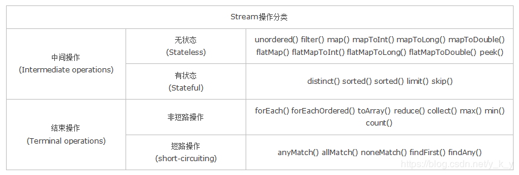

# Java8新特性

## 1. Lambda 表达式
### 1.1. Lambda 表达式定义

- Lambda 表达式，也可称为闭包，它是推动 Java 8 发布的最重要新特性。
- Lambda 允许把函数作为一个方法的参数（函数作为参数传递进方法中）。
- 使用 Lambda 表达式可以使代码变的更加简洁紧凑。

### 1.2. Lambda 表达式语法

- Lambda 表达式的语法格式如下：

```java
// 方式1
(parameters) -> expression

// 方式2
(parameters) -> { statements; }
```

- lambda表达式的重要特征:
    - **可选类型声明**：不需要声明参数类型，编译器可以统一识别参数值。
    - **可选的参数圆括号**：一个参数无需定义圆括号，但多个参数需要定义圆括号。
    - **可选的大括号**：如果主体包含了一个语句，就不需要使用大括号。
    - **可选的返回关键字**：如果主体只有一个表达式返回值则编译器会自动返回值，大括号需要指定明表达式返回了一个数值。
- **使用 Lambda 表达式需要注意以下几点**：
    1. Lambda 表达式主要用来定义行内执行的方法类型接口，例如，一个简单方法接口。在上面例子中，我们使用各种类型的Lambda表达式来定义MathOperation接口的方法。然后我们定义了sayMessage的执行。Lambda 表达式免去了使用匿名方法的麻烦，并且给予Java简单但是强大的函数化的编程能力。
    2. 使用Lambda表达式的接口只能有一个方法，此种接口可以称为函数式接口
    3. 如果一个接口使用注解`@FunctonalInterface`修饰，则该接口称为函数式接口。如果该接口中有多个方法，但除了一个方法外的其它方法都有默认实现（使用`default`关键字修改的方法），则也是可以做为函数式接口
    4. 如果接口里面有Object类下的非默认方法，也是一个函数式接口，可以使用lambda表达式

### 1.3. Lambda 表达式实例
#### 1.3.1. 简单例子

```java
// 1. 不需要参数,返回值为 5
() -> 5

// 2. 接收一个参数(数字类型),返回其2倍的值
x -> 2 * x

// 3. 接受2个参数(数字),并返回他们的差值
(x, y) -> x – y

// 4. 接收2个int型整数,返回他们的和
(int x, int y) -> x + y

// 5. 接受一个 string 对象,并在控制台打印,不返回任何值(看起来像是返回void)
(String s) -> System.out.print(s)
```

#### 1.3.2. 示例2

```java
public class Java8Tester {
    public static void main(String args[]) {
        Java8Tester tester = new Java8Tester();

        // 类型声明
        MathOperation addition = (int a, int b) -> a + b;

        // 不用类型声明
        MathOperation subtraction = (a, b) -> a - b;

        // 大括号中的返回语句
        MathOperation multiplication = (int a, int b) -> {
            return a * b;
        };

        // 没有大括号及返回语句
        MathOperation division = (int a, int b) -> a / b;

        System.out.println("10 + 5 = " + tester.operate(10, 5, addition));
        System.out.println("10 - 5 = " + tester.operate(10, 5, subtraction));
        System.out.println("10 x 5 = " + tester.operate(10, 5, multiplication));
        System.out.println("10 / 5 = " + tester.operate(10, 5, division));

        // 不用括号
        GreetingService greetService1 = message ->
                System.out.println("Hello " + message);

        // 用括号
        GreetingService greetService2 = (message) ->
                System.out.println("Hello " + message);

        greetService1.sayMessage("Runoob");
        greetService2.sayMessage("Google");
    }

    interface MathOperation {
        int operation(int a, int b);
    }

    interface GreetingService {
        void sayMessage(String message);
    }

    private int operate(int a, int b, MathOperation mathOperation) {
        return mathOperation.operation(a, b);
    }
}
```

程序输出结果为：

```shell
$ javac Java8Tester.java
$ java Java8Tester
10 + 5 = 15
10 - 5 = 5
10 x 5 = 50
10 / 5 = 2
Hello Runoob
Hello Google
```

### 1.4. 变量作用域

- lambda 表达式只能引用标记了 final 的外层局部变量，这就是说不能在 lambda 内部修改定义在域外的局部变量，否则会编译错误。

```java
public class Java8Tester {
    final static String salutation = "Hello! ";

    public static void main(String args[]) {
        GreetingService greetService1 = message ->
                System.out.println(salutation + message);
        greetService1.sayMessage("Runoob");
    }

    interface GreetingService {
        void sayMessage(String message);
    }
}
```

程序输出结果

```shell
$ javac Java8Tester.java
$ java Java8Tester
Hello! Runoob
```

- 也可以直接在 lambda 表达式中访问外层的局部变量

```java
public class Java8Tester {
    public static void main(String args[]) {
        final int num = 1;
        Converter<Integer, String> s = (param) -> System.out.println(String.valueOf(param + num));
        s.convert(2);  // 输出结果为 3
    }

    public interface Converter<T1, T2> {
        void convert(int i);
    }
}
```

- lambda 表达式的局部变量可以不用声明为 final，但是必须不可被后面的代码修改（即隐性的具有 final 的语义）

```java
int num = 1;
Converter<Integer, String> s = (param) -> System.out.println(String.valueOf(param + num));
s.convert(2);
num = 5;
// 报错信息：Local variable num defined in an enclosing scope must be final or effectively final
// 把num=5；注释掉就不报错了
```

- 在 Lambda 表达式当中不允许声明一个与局部变量同名的参数或者局部变量

```java
public class Java8Tester {
    public static void main(String args[]) {
        String first = "";  // 把String first = "";注掉就不报错了
        Comparator<String> comparator = (first, second) -> System.out.println(Integer.compare(first.length(), second.length())); // 编译会出错
        comparator.com("aaaaa", "bb");
    }

    public interface Comparator<T> {
        void com(String a, String b);
    }
}
```

## 2. Java 8 函数式接口

- 函数式接口(FunctionalInterface)就是一个有且仅有一个抽象方法的接口，但可以有多个默认方法，静态方法
- 函数式接口可以被隐式转换为 lambda 表达式
- 函数式接口可以现有的函数友好地支持 lambda 表达式

### 2.1. 相关接口

- JDK 1.8之前已有的函数式接口:
    - java.lang.Runnable
    - java.util.concurrent.Callable
    - java.security.PrivilegedAction
    - java.util.Comparator
    - java.io.FileFilter
    - java.nio.file.PathMatcher
    - java.lang.reflect.InvocationHandler
    - java.beans.PropertyChangeListener
    - java.awt.event.ActionListener
    - javax.swing.event.ChangeListener
- JDK 1.8 新增加的函数接口：
    - java.util.function

java.util.function 它包含了很多类，用来支持 Java的函数式编程

### 2.2. 函数式接口实例

- `Predicate <T>` 接口是java.util.function包下的一个函数式接口，它接受一个输入参数`T`，返回一个布尔值结果
- 该接口包含多种默认方法来将Predicate组合成其他复杂的逻辑（比如：与，或，非）
- 该接口用于测试对象是 true 或 false

```java
package com.moon.jav.test;

import java.util.Arrays;
import java.util.List;
import java.util.function.Predicate;

public class Java8Tester {
    public static void main(String args[]) {
        List<Integer> list = Arrays.asList(1, 2, 3, 4, 5, 6, 7, 8, 9);

        /*
         * Predicate<Integer> predicate = n -> true
         *      n 是一个参数传递到 Predicate 接口的 test 方法
         *      n 如果存在则 test 方法返回 true
         */
        System.out.println("输出所有数据:");

        // 传递参数 n
        eval(list, n -> true);

        /*
         * Predicate<Integer> predicate1 = n -> n%2 == 0
         *      n 是一个参数传递到 Predicate 接口的 test 方法
         *      如果 n%2 为 0 test 方法返回 true
         */
        System.out.println("\n输出所有偶数:");
        eval(list, n -> n % 2 == 0);

        /*
         * Predicate<Integer> predicate2 = n -> n > 3
         *      n 是一个参数传递到 Predicate 接口的 test 方法
         *      如果 n 大于 3 test 方法返回 true
         */
        System.out.println("\n输出大于 3 的所有数字:");
        eval(list, n -> n > 3);
    }

    public static void eval(List<Integer> list, Predicate<Integer> predicate) {
        for (Integer n : list) {
            if (predicate.test(n)) {
                System.out.print(n + " ");
            }
        }
    }
}
```

程序运行结果

```console
输出所有数据:
1 2 3 4 5 6 7 8 9
输出所有偶数:
2 4 6 8
输出大于3的所有数字:
4 5 6 7 8 9
```

## 3. 方法引用

方法引用是Lambda表达式的一个简化写法。所引用的方法其实是Lambda表达式的方法体的实现。如果正好有某个方法满足一个lambda表达式的形式，那就可以将这个lambda表达式用方法引用的方式表示，但是如果这个lambda表达式的比较复杂就不能用方法引用进行替换。实际上方法引用是lambda表达式的一种语法糖

- 方法引用通过方法的名字来指向一个方法
- 方法引用可以使语言的构造更紧凑简洁，减少冗余代码
- 方法引用语法是使用一对冒号 `::`

### 3.1. 语法格式

- 主要有四种语法格式
    - `对象::实例方法名`
    - `类::实例方法名`
    - `类::静态方法名`
    - `类::new`
- 注意：Lambda体中调用的方法的参数列表与返回值类型，要与函数式中接口的抽象方法的参数列表和返回值类型一样

### 3.2. 方法引用用法示例

```java
class Car {
    @FunctionalInterface
    public interface Supplier<T> {
        T get();
    }

    // Supplier是jdk1.8的接口，这里和lamda一起使用了
    public static Car create(final Supplier<Car> supplier) {
        return supplier.get();
    }

    public static void collide(final Car car) {
        System.out.println("Collided " + car.toString());
    }

    public void follow(final Car another) {
        System.out.println("Following the " + another.toString());
    }

    public void repair() {
        System.out.println("Repaired " + this.toString());
    }

    public static void main(String[] args) {
        // 构造器引用：它的语法是Class::new，或者更一般的Class<T>::new实例如下：
        Car car = Car.create(Car::new);
        Car car1 = Car.create(Car::new);
        Car car2 = Car.create(Car::new);
        Car car3 = new Car();
        List<Car> cars = Arrays.asList(car, car1, car2, car3);
        System.out.println("===================构造器引用========================");
        // 静态方法引用：它的语法是Class::static_method，实例如下：
        cars.forEach(Car::collide);
        System.out.println("===================静态方法引用========================");
        // 特定类的任意对象的方法引用：它的语法是Class::method实例如下：
        cars.forEach(Car::repair);
        System.out.println("==============特定类的任意对象的方法引用================");
        // 特定对象的方法引用：它的语法是instance::method实例如下：
        final Car police = Car.create(Car::new);
        cars.forEach(police::follow);
        System.out.println("===================特定对象的方法引用===================");
    }
}
```

程序输出程序

```console
===================构造器引用========================
Collided com.xuecheng.manage_course.dao.Car@4f8e5cde
Collided com.xuecheng.manage_course.dao.Car@504bae78
Collided com.xuecheng.manage_course.dao.Car@3b764bce
Collided com.xuecheng.manage_course.dao.Car@759ebb3d
===================静态方法引用========================
Repaired com.xuecheng.manage_course.dao.Car@4f8e5cde
Repaired com.xuecheng.manage_course.dao.Car@504bae78
Repaired com.xuecheng.manage_course.dao.Car@3b764bce
Repaired com.xuecheng.manage_course.dao.Car@759ebb3d
==============特定类的任意对象的方法引用================
Following the com.xuecheng.manage_course.dao.Car@4f8e5cde
Following the com.xuecheng.manage_course.dao.Car@504bae78
Following the com.xuecheng.manage_course.dao.Car@3b764bce
Following the com.xuecheng.manage_course.dao.Car@759ebb3d
===================特定对象的方法引用===================
```

### 3.3. 方法引用实例

```java
public class Java8Tester {
    public static void main(String[] args) {
        List<String> names = new ArrayList<>();
        names.add("Google");
        names.add("Runoob");
        names.add("Taobao");
        names.add("Baidu");
        names.add("Sina");
        names.forEach(System.out::println);
    }
}
```

实例中将`System.out::println`方法作为静态方法来引用

## 4. 默认方法

- Java 8 新增了接口的默认方法。简单说，默认方法就是接口可以有实现方法，而且不需要实现类去实现其方法。
- 只需在方法名前面加个default关键字即可实现默认方法。

为什么要有这个特性？

首先，之前的接口是个双刃剑，好处是面向抽象而不是面向具体编程，缺陷是，当需要修改接口时候，需要修改全部实现该接口的类，目前的java 8之前的集合框架没有foreach方法，通常能想到的解决办法是在JDK里给相关的接口添加新的方法及实现。然而，对于已经发布的版本，是没法在给接口添加新方法的同时不影响已有的实现。所以引进的默认方法。他们的目的是为了解决接口的修改与现有的实现类不兼容的问题。

### 4.1. 语法格式

```java
public interface Java8DefaultMethod {
    default void defaultMethod() {
        // do something...
    }
}
```

### 4.2. 多个默认方法

一个接口有默认方法，考虑这样的情况，一个类实现了多个接口，且这些接口有相同的默认方法，以下实例说明了这种情况的解决方法

```java
// 接口1
public interface Java8DefaultMethod1 {
    default void defaultMethod() {
        // do something...
    }
}

// 接口2
public interface Java8DefaultMethod2 {
    default void defaultMethod() {
        // do another thing...
    }
}
```

1. 第一个解决方案是创建自己的默认方法，来覆盖重写接口的默认方法

```java
public class DefaultMethodImpl implements Java8DefaultMethod1, Java8DefaultMethod2 {
    @Override
    public void defaultMethod() {
        // do something
    }
}
```

2. 第二种解决方案可以使用 super 来调用指定接口的默认方法

```java
public class DefaultMethodImpl implements Java8DefaultMethod1, Java8DefaultMethod2 {
    @Override
    public void defaultMethod() {
        // 调用指定接口的方法
        Java8DefaultMethod1.super.defaultMethod();
    }
}
```

### 4.3. 静态默认方法

Java 8 的另一个特性是接口可以声明（并且可以提供实现）静态方法。

```java
public interface Java8DefaultMethod1 {
    default void defaultMethod() {
        // do something...
    }

    // 静态方法
    static void staticMethod() {
        // do something...
    }
}
```

### 4.4. 默认方法实例

```java
public class Java8Tester {
    public static void main(String args[]) {
        Vehicle vehicle = new Car();
        vehicle.print();
    }
}

interface Vehicle {
    default void print() {
        System.out.println("我是一辆车!");
    }

    static void blowHorn() {
        System.out.println("按喇叭!!!");
    }
}

interface FourWheeler {
    default void print() {
        System.out.println("我是一辆四轮车!");
    }
}

class Car implements Vehicle, FourWheeler {
    public void print() {
        Vehicle.super.print();
        FourWheeler.super.print();
        Vehicle.blowHorn();
        System.out.println("我是一辆汽车!");
    }
}
```

程序输出结果

```console
我是一辆车!
我是一辆四轮车!
按喇叭!!!
我是一辆汽车!
```

## 5. Stream流

- Java 8 API 添加了一个新的抽象称为流Stream，可以让你以一种声明的方式处理数据。
- Stream 使用一种类似用SQL语句从数据库查询数据的直观方式来提供一种对Java集合运算和表达的高阶抽象。
- Stream API 可以极大提高Java程序员的生产力，让程序员写出高效率、干净、简洁的代码。
- 这种风格将要处理的元素集合看作一种流，流在管道中传输，并且可以在管道的节点上进行处理，比如筛选，排序，聚合等。
- 元素流在管道中经过中间操作（intermediate operation）的处理，最后由最终操作(terminal operation)得到前面处理的结果。

### 5.1. 什么是 Stream？


- Stream（流）是一个来自数据源的元素队列并支持聚合操作
    - **元素**：是特定类型的对象，形成一个队列。Java中的Stream并不会存储元素，而是按需计算。
    - **数据源**：流的来源。可以是集合，数组，I/O channel，产生器generator等。
    - **聚合操作**：类似SQL语句一样的操作，比如filter, map, reduce, find, match, sorted等。
- 和以前的Collection操作不同，Stream操作还有两个基础的特征：
    - Pipelining:：中间操作都会返回流对象本身。这样多个操作可以串联成一个管道，如同流式风格（fluent style）。这样做可以对操作进行优化，比如延迟执行(laziness)和短路(short-circuiting)。
    - 内部迭代：以前对集合遍历都是通过Iterator或者For-Each的方式,显式的在集合外部进行迭代，这叫做外部迭代。Stream提供了内部迭代的方式，通过访问者模式(Visitor)实现。

### 5.2. 流的操作特性

1. stream 不是数据结构，不存储数据
2. stream 不改变原来的数据源，它会将操作后的数据保存到另外一个对象中。
3. stream 不可重复使用。每次进行操作后都会产生新的流，原来的流就会关闭，所以可以进行链式编程，就不会出现“流已关闭”的错误
4. 惰性求值，流在中间处理过程中，只是对操作进行了记录，并不会立即执行（*即相当于预告声明，不会马上操作*），需要等到执行终止操作的时候才会进行实际的计算。

### 5.3. 流的分类
#### 5.3.1. 流的操作类型

- stream 所有操作组合在一起即变成了管道，管道中有以下两个操作：
    - **中间操作**（intermediate）：调用中间操作方法会返回一个新的流。通过连续执行多个操作倒便就组成了Stream中的执行管道（pipeline）。需要注意的是这些管道被添加后并不会真正执行，只有等到调用终值操作之后才会执行。
    - **终值操作**（terminal）：在调用该方法之后，将执行之前所有的中间操作，获得返回结果结束对流的使用
- 流的执行顺序说明：其每个元素挨着作为参数去调用中间操作及终值操作，而不是遍历一个方法，再遍历下一个方法

#### 5.3.2. 流的API方法对应分类



- 无状态：指元素的处理不受之前元素的影响；
- 有状态：指该操作只有拿到所有元素之后才能继续下去。
- 非短路操作：指必须处理所有元素才能得到最终结果；
- 短路操作：指遇到某些符合条件的元素就可以得到最终结果，如 `A || B`，只要A为true，则无需判断B的结果。

- Intermediate：
    - map (mapToInt, flatMap 等)、 filter、 distinct、 sorted、 peek、 limit、 skip、 parallel、 sequential、 unordered
- Terminal：
    - forEach、 forEachOrdered、 toArray、 reduce、 collect、 min、 max、 count、 anyMatch、 allMatch、 noneMatch、 findFirst、 findAny、 iterator
- Short-circuiting：
    - anyMatch、 allMatch、 noneMatch、 findFirst、 findAny、 limit

### 5.4. Stream 的使用

#### 5.4.1. 流的常用创建方法
##### 5.4.1.1. Collection 下的 stream() 和 parallelStream() 方法

- 在 Java 8 中，集合接口有两个方法来生成流：
    - `stream()`：为集合创建串行流
    - `parallelStream()`：为集合创建并行流

```java
public static void main(String[] args) {
    List<String> strings = Arrays.asList("abc", "", "bc", "efg", "abcd", "", "jkl");
    List<String> filtered = strings.stream().filter(string -> !string.isEmpty()).collect(Collectors.toList());    // 获取一个串行流
    Stream<String> parallelStream = strings.parallelStream();    // 获取一个并行流
}
```

- 并行（parallel）程序 `parallelStream` 是流并行处理程序的代替方法。以下实例使用 parallelStream 来输出空字符串的数量：

```java
List<String> strings = Arrays.asList("abc", "", "bc", "efg", "abcd", "", "jkl");
// 获取空字符串的数量
int count = (int) strings.parallelStream().filter(string -> string.isEmpty()).count();
System.out.println(count);    // 输出：2
```

这样可以很容易的在顺序运行和并行直接切换

##### 5.4.1.2. Arrays 中的 stream() 方法，将数组转成流

```java
Integer[] nums = new Integer[10];
Stream<Integer> stream = Arrays.stream(nums);
```

##### 5.4.1.3. Stream 中的静态方法：of()、iterate()、generate()

```java
Stream<Integer> stream = Stream.of(1,2,3,4,5,6);

Stream<Integer> stream2 = Stream.iterate(0, (x) -> x + 2).limit(6);
stream2.forEach(System.out::println); // 0 2 4 6 8 10

Stream<Double> stream3 = Stream.generate(Math::random).limit(2);
stream3.forEach(System.out::println);
```

##### 5.4.1.4. BufferedReader.lines() 方法，将每行内容转成流

```java
BufferedReader reader = new BufferedReader(new FileReader("F:\\test_stream.txt"));
Stream<String> lineStream = reader.lines();
lineStream.forEach(System.out::println);
```

##### 5.4.1.5. Pattern.splitAsStream() 方法，将字符串分隔成流

```java
Pattern pattern = Pattern.compile(",");
Stream<String> stringStream = pattern.splitAsStream("a,b,c,d");
stringStream.forEach(System.out::println);
```

#### 5.4.2. 流的中间操作
##### 5.4.2.1. 映射类方法（map/flatMap）

- map：接收一个函数作为参数，该函数会被应用到每个元素上，并将其映射成一个新的元素。

```java
List<Integer> numbers = Arrays.asList(3, 2, 2, 3, 7, 3, 5);
// 获取对应的平方数
List<Integer> squaresList = numbers.stream().map(i -> i * i).distinct().collect(Collectors.toList());
System.out.println(squaresList);    // 输出：[9, 4, 49, 25]
```

- flatMap：接收一个函数作为参数，将流中的每个值都换成另一个流，然后把所有流连接成一个流。

```java
List<String> list = Arrays.asList("a,b,c", "1,2,3");

// 将每个元素转成一个新的且不带逗号的元素
Stream<String> s1 = list.stream().map(s -> s.replaceAll(",", ""));
s1.forEach(System.out::println); // abc  123

Stream<String> s3 = list.stream().flatMap(s -> {
    // 将每个元素转换成一个stream
    String[] split = s.split(",");
    Stream<String> s2 = Arrays.stream(split);
    return s2;
});
s3.forEach(System.out::println); // a b c 1 2 3
```

**理解flapMap的行为**：flapMap是用来将多个Stream对象合并成一个新的流Stream对象，而在方法体中的操作，就是解除不需要的嵌套关系，将包含嵌套关系的Stream流转换成持有目标类型的Stream流对象。

```java
Stream<List<Integer>> inputStream = Stream.of(
	Arrays.asList(1),
	Arrays.asList(2, 3),
	Arrays.asList(4, 5, 6)
);
Stream<Integer> outputStream = inputStream.flatMap((childList) -> childList.stream());
```

原本的inputStream持有的元素中类型为`List<Integer>`，而我们在扁平化后的outputStream只想要持有Integer类型的元素，即去除List这层嵌套关系。因此在flapMap中，对每个`List<Integer>`类型的元素执行`childList.stream()`方法，转换成`Stream<Integer>`类型，然后由flatMap进行合并。

##### 5.4.2.2. 筛选与切片（filter/limit/skip/distinct）

- `filter`：过滤通过设置条件过滤出流中的元素，保留返回true的元素，抛弃返回false的元素

```java
List<String> strings = Arrays.asList("abc", "", "bc", "efg", "abcd", "", "jkl");
// 获取空字符串的数量
int count = (int) strings.stream().filter(string -> string.isEmpty()).count();
System.out.println(count);    // 输出：2
```

- `limit(n)`：获取 Stream 的前面 n 个元素
- `skip(n)`：跳过n元素，配合`limit(n)`可实现分页

```java
// 案例1
Random random = new Random();
random.ints().limit(10).forEach(System.out::println);

// 案例2
public void testLimitAndSkip() {
	List<Person> persons = new ArrayList();
	for (int i = 1; i <= 10000; i++) {
		Person person = new Person(i, "name" + i);
		persons.add(person);
	}
	List<String> personList2 = persons.stream().
	map(Person::getName).limit(10).skip(3).collect(Collectors.toList());
	System.out.println(personList2);
}
private class Person {
	public int no;
	private String name;
	public Person (int no, String name) {
		this.no = no;
		this.name = name;
	}
	public String getName() {
		System.out.println(name);
		return name;
	}
}

结果：
name1
name2
name3
name4
name5
name6
name7
name8
name9
name10
[name4, name5, name6, name7, name8, name9, name10]
```

- `distinct`：通过流中元素的 `hashCode()` 和 `equals()` 去除重复元素，如果对引用对象运行去重，引用对象要实现hashCode和equal方法，否则去重无效

```java
public static void main(String[] args) {
    testDistinct1();
    testDistinct2();
}

/**
 * 集合去重（基本类型）
 */
private static void testDistinct1() {
    //简单字符串的去重
    List<String> list = Arrays.asList("111", "222", "333", "111", "222");
    list.stream().distinct().forEach(System.out::println);
}

/**
 * 集合去重（引用对象）
 */
private static void testDistinct2() {
    //引用对象的去重，引用对象要实现hashCode和equal方法，否则去重无效
    Student s1 = new Student(1L, "肖战", 15, "浙江");
    Student s2 = new Student(2L, "王一博", 15, "湖北");
    Student s3 = new Student(3L, "杨紫", 17, "北京");
    Student s4 = new Student(4L, "李现", 17, "浙江");
    Student s5 = new Student(1L, "肖战", 15, "浙江");
    List<Student> students = new ArrayList<>();
    students.add(s1);
    students.add(s2);
    students.add(s3);
    students.add(s4);
    students.add(s5);
    students.stream().distinct().forEach(System.out::println);
}
```

##### 5.4.2.3. 排序（sorted）

- sorted()：自然排序，流中元素需实现Comparable接口
- sorted(Comparator com)：定制排序，自定义Comparator排序器

```java
// 使用 sorted 方法对输出的 10 个随机数进行排序
Random random = new Random();
random.ints().limit(10).sorted().forEach(System.out::println);

// 案例2
List<String> list = Arrays.asList("aa", "ff", "dd");
// String 类自身已实现Compareable接口
list.stream().sorted().forEach(System.out::println);    // aa dd ff

Student s1 = new Student("aa", 10);
Student s2 = new Student("bb", 20);
Student s3 = new Student("aa", 30);
Student s4 = new Student("dd", 40);
List<Student> studentList = Arrays.asList(s1, s2, s3, s4);

// 自定义排序：先按姓名升序，姓名相同则按年龄升序
studentList.stream().sorted(
    (o1, o2) -> {
        if (o1.getName().equals(o2.getName())) {
            return o1.getAge() - o2.getAge();
        } else {
            return o1.getName().compareTo(o2.getName());
        }
    }
).forEach(System.out::println);
```

##### 5.4.2.4. 消费（peek）

peek：如同于map，能得到流中的每一个元素。但map接收的是一个Function表达式，有返回值；而peek接收的是Consumer表达式，没有返回值

```java
Student s1 = new Student("aa", 10);
Student s2 = new Student("bb", 20);
List<Student> studentList = Arrays.asList(s1, s2);

studentList.stream()
        .peek(o -> o.setAge(100))
        .forEach(System.out::println);

//结果：
Student{name='aa', age=100}
Student{name='bb', age=100}
```

#### 5.4.3. 流的终止操作
##### 5.4.3.1. 匹配、聚合操作

- allMatch：接收一个 Predicate 函数，当流中每个元素都符合该断言时才返回true，否则返回false
- noneMatch：接收一个 Predicate 函数，当流中每个元素都不符合该断言时才返回true，否则返回false
- anyMatch：接收一个 Predicate 函数，只要流中有一个元素满足该断言则返回true，否则返回false
- findFirst：返回流中第一个元素
- findAny：返回流中的任意元素
- count：返回流中元素的总个数
- max：返回流中元素最大值
- min：返回流中元素最小值

```java
List<Integer> list = Arrays.asList(1, 2, 3, 4, 5);

boolean allMatch = list.stream().allMatch(e -> e > 10); //false
boolean noneMatch = list.stream().noneMatch(e -> e > 10); //true
boolean anyMatch = list.stream().anyMatch(e -> e > 4);  //true

Integer findFirst = list.stream().findFirst().get(); //1
Integer findAny = list.stream().findAny().get(); //1

long count = list.stream().count(); //5
Integer max = list.stream().max(Integer::compareTo).get(); //5
Integer min = list.stream().min(Integer::compareTo).get(); //1
```

##### 5.4.3.2. forEach

Stream 提供了新的方法 `forEach` 来迭代流中的每个数据。以下代码片段使用forEach 输出了10个随机数

```java
Random random = new Random();
random.ints().limit(10).forEach(System.out::println);
```

##### 5.4.3.3. 规约操作（reduce）

这个方法的主要作用是把 Stream 元素组合起来。它提供一个起始值（种子），然后依照运算规则（BinaryOperator），和前面 Stream 的第一个、第二个、第 n 个元素组合。从这个意义上说，字符串拼接、数值的 sum、min、max、average 都是特殊的 reduce

例如：Stream 的 sum 就相当于 `Integer sum = integers.reduce(0, (a, b) -> a+b);` 或 `Integer sum = integers.reduce(0, Integer::sum);`；也有没有起始值的情况，这时会把 Stream 的前面两个元素组合起来，返回的是 Optional。

```java
// 字符串连接，concat = "ABCD"
String concat = Stream.of("A", "B", "C", "D").reduce("", String::concat); 
// 求最小值，minValue = -3.0
double minValue = Stream.of(-1.5, 1.0, -3.0, -2.0).reduce(Double.MAX_VALUE, Double::min); 
// 求和，sumValue = 10, 有起始值
int sumValue = Stream.of(1, 2, 3, 4).reduce(0, Integer::sum);
// 求和，sumValue = 10, 无起始值
sumValue = Stream.of(1, 2, 3, 4).reduce(Integer::sum).get();
// 过滤，字符串连接，concat = "ace"
concat = Stream.of("a", "B", "c", "D", "e", "F")
    .filter(x -> x.compareTo("Z") > 0)
    .reduce("", String::concat);
```

###### 5.4.3.3.1. 相关API

```java
Optional<T> reduce(BinaryOperator<T> accumulator)
```

- 第一次执行时，accumulator函数的第一个参数为流中的第一个元素，第二个参数为流中元素的第二个元素；第二次执行时，第一个参数为第一次函数执行的结果，第二个参数为流中的第三个元素；依次类推。

```java
T reduce(T identity, BinaryOperator<T> accumulator)
```

- 流程跟上面一样，只是第一次执行时，accumulator函数的第一个参数为identity，而第二个参数为流中的第一个元素。

```java
<U> U reduce(U identity,BiFunction<U, ? super T, U> accumulator,BinaryOperator<U> combiner)
```

- 在串行流(stream)中，该方法跟第二个方法一样，即第三个参数combiner不会起作用。在并行流(parallelStream)中，我们知道流被fork join出多个线程进行执行，此时每个线程的执行流程就跟第二个方法reduce(identity,accumulator)一样，而第三个参数combiner函数，则是将每个线程的执行结果当成一个新的流，然后使用第一个方法reduce(accumulator)流程进行规约

###### 5.4.3.3.2. 案例

```java
//经过测试，当元素个数小于24时，并行时线程数等于元素个数，当大于等于24时，并行时线程数为16
List<Integer> list = Arrays.asList(1, 2, 3, 4, 5, 6, 7, 8, 9, 10, 11, 12, 13, 14, 15, 16, 17, 18, 19, 20, 21, 22, 23, 24);

Integer v = list.stream().reduce((x1, x2) -> x1 + x2).get();
System.out.println(v);   // 300

Integer v1 = list.stream().reduce(10, (x1, x2) -> x1 + x2);
System.out.println(v1);  //310

Integer v2 = list.stream().reduce(0,
        (x1, x2) -> {
            System.out.println("stream accumulator: x1:" + x1 + "  x2:" + x2);
            return x1 - x2;
        },
        (x1, x2) -> {
            System.out.println("stream combiner: x1:" + x1 + "  x2:" + x2);
            return x1 * x2;
        });
System.out.println(v2); // -300

Integer v3 = list.parallelStream().reduce(0,
        (x1, x2) -> {
            System.out.println("parallelStream accumulator: x1:" + x1 + "  x2:" + x2);
            return x1 - x2;
        },
        (x1, x2) -> {
            System.out.println("parallelStream combiner: x1:" + x1 + "  x2:" + x2);
            return x1 * x2;
        });
System.out.println(v3); //197474048
```


##### 5.4.3.4. 收集操作（Collector）
###### 5.4.3.4.1. Collector 接口

- collect：接收一个Collector实例，将流中元素收集成另外一个数据结构
- Collector<T, A, R> 是一个接口，有以下5个抽象方法

```java
Supplier<A> supplier()
```

- 创建一个结果容器A

```java
BiConsumer<A, T> accumulator()
```

- 消费型接口，第一个参数为容器A，第二个参数为流中元素T。

```java
BinaryOperator<A> combiner()
```

- 函数接口，该参数的作用跟上一个方法(reduce)中的combiner参数一样，将并行流中各个子进程的运行结果(accumulator函数操作后的容器A)进行合并。

```java
Function<A, R> finisher()
```

- 函数式接口，参数为：容器A，返回类型为：collect方法最终想要的结果R。

```java
Set<Characteristics> characteristics()
```

- 返回一个不可变的Set集合，用来表明该Collector的特征。有以下三个特征：
    - CONCURRENT：表示此收集器支持并发。（官方文档还有其他描述，暂时没去探索，故不作过多翻译）
    - UNORDERED：表示该收集操作不会保留流中元素原有的顺序。
    - IDENTITY_FINISH：表示finisher参数只是标识而已，可忽略。

###### 5.4.3.4.2. Collector 工具库：Collectors

- Collectors 类实现了很多归约操作，例如将流转换成集合和聚合元素。Collectors可用于返回列表或字符串：

```java
List<String> strings = Arrays.asList("abc", "", "bc", "efg", "abcd", "", "jkl");
List<String> filtered = strings.stream().filter(string -> !string.isEmpty()).collect(Collectors.toList());
System.out.println("筛选列表: " + filtered);    // 筛选列表: [abc, bc, efg, abcd, jkl]
String mergedString = strings.stream().filter(string -> !string.isEmpty()).collect(Collectors.joining(", "));
System.out.println("合并字符串: " + mergedString);   // 合并字符串: abc, bc, efg, abcd, jkl
```

```java
Student s1 = new Student("aa", 10,1);
Student s2 = new Student("bb", 20,2);
Student s3 = new Student("cc", 10,3);
List<Student> list = Arrays.asList(s1, s2, s3);

// 装成list
List<Integer> ageList = list.stream().map(Student::getAge).collect(Collectors.toList()); // [10, 20, 10]

// 转成set
Set<Integer> ageSet = list.stream().map(Student::getAge).collect(Collectors.toSet()); // [20, 10]

// 转成map,注:key不能相同，否则报错
Map<String, Integer> studentMap = list.stream().collect(Collectors.toMap(Student::getName, Student::getAge)); // {cc=10, bb=20, aa=10}

// 字符串分隔符连接
String joinName = list.stream().map(Student::getName).collect(Collectors.joining(",", "(", ")")); // (aa,bb,cc)

// 聚合操作
// 1.学生总数
Long count = list.stream().collect(Collectors.counting()); // 3
// 2.最大年龄 (最小的minBy同理)
Integer maxAge = list.stream().map(Student::getAge).collect(Collectors.maxBy(Integer::compare)).get(); // 20
// 3.所有人的年龄
Integer sumAge = list.stream().collect(Collectors.summingInt(Student::getAge)); // 40
// 4.平均年龄
Double averageAge = list.stream().collect(Collectors.averagingDouble(Student::getAge)); // 13.333333333333334
// 带上以上所有方法
DoubleSummaryStatistics statistics = list.stream().collect(Collectors.summarizingDouble(Student::getAge));
System.out.println("count:" + statistics.getCount() + ",max:" + statistics.getMax() + ",sum:" + statistics.getSum() + ",average:" + statistics.getAverage());

// 分组
Map<Integer, List<Student>> ageMap = list.stream().collect(Collectors.groupingBy(Student::getAge));
// 多重分组,先根据类型分再根据年龄分
Map<Integer, Map<Integer, List<Student>>> typeAgeMap = list.stream().collect(Collectors.groupingBy(Student::getType, Collectors.groupingBy(Student::getAge)));

// 分区
// 分成两部分，一部分大于10岁，一部分小于等于10岁
Map<Boolean, List<Student>> partMap = list.stream().collect(Collectors.partitioningBy(v -> v.getAge() > 10));

// 规约
Integer allAge = list.stream().map(Student::getAge).collect(Collectors.reducing(Integer::sum)).get(); //40
```

###### 5.4.3.4.3. Collectors.toList() 源码解析（了解）

```java
// Collectors.toList() 源码
public static <T>
Collector<T, ?, List<T>> toList() {
    return new CollectorImpl<>((Supplier<List<T>>) ArrayList::new, List::add,
                               (left, right) -> { left.addAll(right); return left; },
                               CH_ID);
}

// 转化一下源码中的lambda表达式，方便理解
public <T> Collector<T, ?, List<T>> toList() {
    Supplier<List<T>> supplier = () -> new ArrayList();
    BiConsumer<List<T>, T> accumulator = (list, t) -> list.add(t);
    BinaryOperator<List<T>> combiner = (list1, list2) -> {
        list1.addAll(list2);
        return list1;
    };
    Function<List<T>, List<T>> finisher = (list) -> list;
    Set<Collector.Characteristics> characteristics = Collections.unmodifiableSet(EnumSet.of(Collector.Characteristics.IDENTITY_FINISH));

    return new Collector<T, List<T>, List<T>>() {
        @Override
        public Supplier supplier() {
            return supplier;
        }

        @Override
        public BiConsumer accumulator() {
            return accumulator;
        }

        @Override
        public BinaryOperator combiner() {
            return combiner;
        }

        @Override
        public Function finisher() {
            return finisher;
        }

        @Override
        public Set<Characteristics> characteristics() {
            return characteristics;
        }
    };
}
```

#### 5.4.4. 统计

一些产生统计结果的收集器也非常有用。它们主要用于int、double、long等基本类型上，它们可以用来产生类似如下的统计结果。

```java
List<Integer> numbers = Arrays.asList(3, 2, 2, 3, 7, 3, 5);
IntSummaryStatistics stats = numbers.stream().mapToInt((x) -> x).summaryStatistics();
System.out.println("列表中最大的数 : " + stats.getMax());  // 列表中最大的数 : 7
System.out.println("列表中最小的数 : " + stats.getMin());  // 列表中最小的数 : 2
System.out.println("所有数之和 : " + stats.getSum());    // 所有数之和 : 25
System.out.println("平均数 : " + stats.getAverage());  // 平均数 : 3.5714285714285716
```

#### 5.4.5. Optional类型

- 这也是一个模仿 Scala 语言中的概念，作为一个容器，它可能含有某值，或者不包含。使用它的目的是尽可能避免 NullPointerException
- Optional里面只持有一个元素，而Stream可持有多个元素

```java
String strA = " abcd ", strB = null;
print(strA);
print("");
print(strB);
getLength(strA);
getLength("");
getLength(strB);

public static void print(String text) {
	// Java 8
	Optional.ofNullable(text).ifPresent(System.out::println);

	// Pre-Java 8
	if (text != null) {
	System.out.println(text);
	}
}
public static int getLength(String text) {
	// Java 8
	return Optional.ofNullable(text).map(String::length).orElse(-1);

	// Pre-Java 8
	// return if (text != null) ? text.length() : -1;
};

// 还有ifPresentOrElse()方法等
```

在更复杂的 `if (xx != null)` 的情况中，使用 Optional 代码的可读性更好，而且它提供的是编译时检查，能极大的降低 NPE 这种 Runtime Exception 对程序的影响，或者迫使程序员更早的在编码阶段处理空值问题，而不是留到运行时再发现和调试。

Stream 中的 findAny、max/min、reduce 等方法等返回 Optional 值。还有例如 `IntStream.average()` 返回 OptionalDouble 等等

### 5.5. Stream 完整实例

```java
package com.moon.test;

import java.util.ArrayList;
import java.util.Arrays;
import java.util.IntSummaryStatistics;
import java.util.List;
import java.util.Random;
import java.util.stream.Collectors;

public class Java8Tester {
    public static void main(String args[]) {
        System.out.println("使用 Java 7: ");
        // 计算空字符串
        List<String> strings = Arrays.asList("abc", "", "bc", "efg", "abcd", "", "jkl");
        System.out.println("列表: " + strings);
        long count = getCountEmptyStringUsingJava7(strings);
        System.out.println("空字符数量为: " + count);
        count = getCountLength3UsingJava7(strings);
        System.out.println("字符串长度为 3 的数量为: " + count);

        // 删除空字符串
        List<String> filtered = deleteEmptyStringsUsingJava7(strings);
        System.out.println("筛选后的列表: " + filtered);

        // 删除空字符串，并使用逗号把它们合并起来
        String mergedString = getMergedStringUsingJava7(strings, ", ");
        System.out.println("合并字符串: " + mergedString);

        List<Integer> numbers = Arrays.asList(3, 2, 2, 3, 7, 3, 5);
        // 获取列表元素平方数
        List<Integer> squaresList = getSquares(numbers);
        System.out.println("平方数列表: " + squaresList);
        List<Integer> integers = Arrays.asList(1, 2, 13, 4, 15, 6, 17, 8, 19);
        System.out.println("列表: " + integers);
        System.out.println("列表中最大的数 : " + getMax(integers));
        System.out.println("列表中最小的数 : " + getMin(integers));
        System.out.println("所有数之和 : " + getSum(integers));
        System.out.println("平均数 : " + getAverage(integers));
        System.out.println("随机数: ");
        // 输出10个随机数
        Random random = new Random();
        for (int i = 0; i < 10; i++) {
            System.out.println(random.nextInt());
        }

        System.out.println("使用 Java 8: ");
        System.out.println("列表: " + strings);
        count = strings.stream().filter(string -> string.isEmpty()).count();
        System.out.println("空字符串数量为: " + count);
        count = strings.stream().filter(string -> string.length() == 3).count();
        System.out.println("字符串长度为 3 的数量为: " + count);
        filtered = strings.stream().filter(string -> !string.isEmpty()).collect(Collectors.toList());
        System.out.println("筛选后的列表: " + filtered);
        mergedString = strings.stream().filter(string -> !string.isEmpty()).collect(Collectors.joining(", "));
        System.out.println("合并字符串: " + mergedString);
        squaresList = numbers.stream().map(i -> i * i).distinct().collect(Collectors.toList());
        System.out.println("Squares List: " + squaresList);
        System.out.println("列表: " + integers);
        IntSummaryStatistics stats = integers.stream().mapToInt((x) -> x).summaryStatistics();
        System.out.println("列表中最大的数 : " + stats.getMax());
        System.out.println("列表中最小的数 : " + stats.getMin());
        System.out.println("所有数之和 : " + stats.getSum());
        System.out.println("平均数 : " + stats.getAverage());
        System.out.println("随机数: ");
        random.ints().limit(10).sorted().forEach(System.out::println);
        // 并行处理
        count = strings.parallelStream().filter(string -> string.isEmpty()).count();
        System.out.println("空字符串的数量为: " + count);
    }

    private static int getCountEmptyStringUsingJava7(List<String> strings) {
        int count = 0;
        for (String string : strings) {
            if (string.isEmpty()) {
                count++;
            }
        }
        return count;
    }

    private static int getCountLength3UsingJava7(List<String> strings) {
        int count = 0;
        for (String string : strings) {
            if (string.length() == 3) {
                count++;
            }
        }
        return count;
    }

    private static List<String> deleteEmptyStringsUsingJava7(List<String> strings) {
        List<String> filteredList = new ArrayList<String>();
        for (String string : strings) {
            if (!string.isEmpty()) {
                filteredList.add(string);
            }
        }
        return filteredList;
    }

    private static String getMergedStringUsingJava7(List<String> strings, String separator) {
        StringBuilder stringBuilder = new StringBuilder();
        for (String string : strings) {
            if (!string.isEmpty()) {
                stringBuilder.append(string);
                stringBuilder.append(separator);
            }
        }
        String mergedString = stringBuilder.toString();
        return mergedString.substring(0, mergedString.length() - 2);
    }

    private static List<Integer> getSquares(List<Integer> numbers) {
        List<Integer> squaresList = new ArrayList<Integer>();
        for (Integer number : numbers) {
            Integer square = new Integer(number.intValue() * number.intValue());
            if (!squaresList.contains(square)) {
                squaresList.add(square);
            }
        }
        return squaresList;
    }

    private static int getMax(List<Integer> numbers) {
        int max = numbers.get(0);
        for (int i = 1; i < numbers.size(); i++) {
            Integer number = numbers.get(i);
            if (number.intValue() > max) {
                max = number.intValue();
            }
        }
        return max;
    }

    private static int getMin(List<Integer> numbers) {
        int min = numbers.get(0);
        for (int i = 1; i < numbers.size(); i++) {
            Integer number = numbers.get(i);
            if (number.intValue() < min) {
                min = number.intValue();
            }
        }
        return min;
    }

    private static int getSum(List numbers) {
        int sum = (int) (numbers.get(0));
        for (int i = 1; i < numbers.size(); i++) {
            sum += (int) numbers.get(i);
        }
        return sum;
    }

    private static int getAverage(List<Integer> numbers) {
        return getSum(numbers) / numbers.size();
    }
}
```

程序输出结果：

```console
使用 Java 7:
列表: [abc, , bc, efg, abcd, , jkl]
空字符数量为: 2
字符串长度为 3 的数量为: 3
筛选后的列表: [abc, bc, efg, abcd, jkl]
合并字符串: abc, bc, efg, abcd, jkl
平方数列表: [9, 4, 49, 25]
列表: [1, 2, 13, 4, 15, 6, 17, 8, 19]
列表中最大的数 : 19
列表中最小的数 : 1
所有数之和 : 85
平均数 : 9
随机数: 
1940609383
1273448576
-1208033961
-880625237
-655596583
-65568491
-510907885
384715598
1145477696
447794939

使用 Java 8:
列表: [abc, , bc, efg, abcd, , jkl]
空字符串数量为: 2
字符串长度为 3 的数量为: 3
筛选后的列表: [abc, bc, efg, abcd, jkl]
合并字符串: abc, bc, efg, abcd, jkl
Squares List: [9, 4, 49, 25]
列表: [1, 2, 13, 4, 15, 6, 17, 8, 19]
列表中最大的数 : 19
列表中最小的数 : 1
所有数之和 : 85
平均数 : 9.444444444444445
随机数:
-1861468930
-1661597688
-154610776
133616016
776120450
896964313
916562908
1237476550
2074868773
2091065305
空字符串的数量为: 2
```

## 6. StringJoiner 类（字符拼接）
### 6.1. 简介

StringJoiner是java.util包中的一个类，用于构造一个由分隔符分隔的字符序列（可选），并且可以从提供的前缀开始并以提供的后缀结尾

**StringJoiner类共有2个构造函数，5个公有方法。其中最常用的方法就是add方法和toString方法，类似于StringBuilder中的append方法和toString方法**

### 6.2. 构造方法

```java
public StringJoiner(CharSequence delimiter)
```

- 构造一个由分隔符分隔的字符序列，注意：**delimiter其实是分隔符，并不是可变字符串的初始值**

```java
public StringJoiner(CharSequence delimiter, CharSequence prefix, CharSequence suffix)
```

- 构造一个由分隔符分隔的字符序列，prefix参数设置字符拼接的前缀，参数suffix设置后缀

### 6.3. 基础用法

```java
public class StringJoinerTest {
    public static void main(String[] args) {
        StringJoiner sj = new StringJoiner("Moon");
        sj.add("Zero");
        sj.add("kirA");
        /* 输出结果 */
        System.out.println(sj.toString()); // ZeroMoonkirA

        StringJoiner sj1 = new StringJoiner(":", "[", "]");
        sj1.add("Moon").add("Zero").add("kirA");
        /* 输出结果 */
        System.out.println(sj1.toString()); // [Moon,Zero,kirA]
    }
}
```

### 6.4. 实现原理

```java
public StringJoiner add(CharSequence newElement) {
    prepareBuilder().append(newElement);
    return this;
}

private StringBuilder prepareBuilder() {
    if (value != null) {
        value.append(delimiter);
    } else {
        value = new StringBuilder().append(prefix);
    }
    return value;
}
```

通过查询源码，StringJoiner其实是通过StringBuilder实现

还有Java8的流操作中的Collector.joining的实现原理就是使用了StringJoiner，如下

```java
list.stream().collect(Collectors.joining(":"))
```

Collector.joining的源代码如下：

```java
public static Collector<CharSequence, ?, String> joining(CharSequence delimiter,CharSequence prefix,CharSequence suffix) {
    return new CollectorImpl<>(
            () -> new StringJoiner(delimiter, prefix, suffix),
            StringJoiner::add, StringJoiner::merge,
            StringJoiner::toString, CH_NOID);
}
```

### 6.5. 使用场景总结

StringJoiner其实是通过StringBuilder实现的，所以他的性能和StringBuilder差不多，他也是非线程安全的

1. 如果只是简单的字符串拼接，考虑直接使用`"+"`即可。
2. 如果是在for循环中进行字符串拼接，考虑使用StringBuilder和StringBuffer。
3. 如果是通过一个集合（如List）进行字符串拼接，则考虑使用StringJoiner。
4. 如果是对一组数据进行拼接，则可以考虑将其转换成Stream，并使用StringJoiner处理。

## 7. Optional 类

- Optional 类是一个可以为null的容器对象。如果值存在则`isPresent()`方法会返回true，调用`get()`方法会返回该对象。
- Optional 是个容器：它可以保存类型T的值，或者仅仅保存null。Optional提供很多有用的方法，这样我们就不用显式进行空值检测。
- Optional 类的引入很好的解决空指针异常。

> 拓展：google的Guava Optional与Optional有同样的功能。不过需要注意的是，Guava Optional API 与 JDK 存在差异

### 7.1. 类声明

`java.util.Optional<T>`类的声明：`public final class Optional<T> extends Object`

### 7.2. Optional 创建方式

Optional本质是一个容器，需要将对象实例传入该容器中。Optional 的构造方法为 private，无法直接使用 new 构建对象，只能使用 Optional 提供的静态方法创建。Optional 三个创建方法如下：

- `Optional.of(obj)`：如果对象为 null，将会抛出 NPE。
- `Optional.ofNullable(obj)`：如果对象为 null，将会创建不包含值的 empty Optional 对象实例。
- `Optional.empty()`：等同于 `Optional.ofNullable(null)`


> 只有在确定对象不会为 null 的情况使用 `Optional.of()`，否则建议使用 `Optional.ofNullable()` 方法

### 7.3. 类的常用方法
#### 7.3.1. get()与isPresent()方法

```java
public T get() {
    if (value == null) {
        throw new NoSuchElementException("No value present");
    }
    return value;
}
```

- 如果在这个Optional中包含这个值，返回值，否则抛出异常：NoSuchElementException

```java
public boolean isPresent() {
    return value != null;
}
```

- 如果值存在则方法会返回true，否则返回 false。

通常使用方式：对象实例存入 Optional 容器中之后，最后需要从中取出。`Optional.get()` 方法用于取出内部对象实例，不过需要注意的是，如果是 empty Optional 实例，由于容器内没有任何对象实例，使用 `get()` 方法将会抛出 NoSuchElementException 异常。

为了防止异常抛出，可以使用 `Optional.isPresent()`。这个方法将会判断内部是否存在对象实例，若存在则返回 true

```java
/* 示例代码 */
Optional<Company> optCompany = Optional.ofNullable(company);
// 与直接使用空指针判断没有任何区别
if (optCompany.isPresent()) {
    System.out.println(optCompany.get().getName());
}
```

#### 7.3.2. ifPresent()方法

```java
public void ifPresent(Consumer<? super T> consumer) {
    if (value != null)
        consumer.accept(value);
}
```

- 如果值存在则使用该值调用 consumer , 否则不做任何事情。即使用 ifPresent 方法，不用再显示的进行检查

```java
/* 示例代码 */
/* 原处理逻辑 */
Company company = ...;
if (company != null) {
    System.out.println(company);
}
/* 使用Optional的ifPresent的处理逻辑 */
Optional<Company> optCompany = ...;
optCompany.ifPresent(System.out::println);
```

#### 7.3.3. filter()方法

```java
public Optional<T> filter(Predicate<? super T> predicate) {
    Objects.requireNonNull(predicate);
    if (!isPresent())
        return this;
    else
        return predicate.test(value) ? this : empty();
}
```

- 如果值存在，并且这个值匹配给定的 predicate，返回一个Optional用以描述这个值，否则返回一个空的Option Optional

示例：当某些属性满足一定条件，才进行下一步动作

```java
/* 示例代码 */
/* 原处理逻辑 */
if (company != null && "Apple".equals(company.getName())) {
    System.out.println("ok");
}
/* 使用 Optional#filter 结合 Optional#ifPresent 重写上面的代码 */
Optional<Company> companyOpt = ...;
companyOpt.filter(company -> "Apple".equals(company.getName()))
        .ifPresent(company -> System.out.println("ok"));
```

> filter 方法将会判断对象是否符合条件。如果不符合条件，将会返回一个空的 Optional

#### 7.3.4. orElse() 与 orElseThrow() 方法

```java
public T orElse(T other) {
    return value != null ? value : other;
}
```

- 如果存在该值，返回值，否则返回 other。

```java
public <X extends Throwable> T orElseThrow(Supplier<? extends X> exceptionSupplier) throws X {
    if (value != null) {
        return value;
    } else {
        throw exceptionSupplier.get();
    }
}
```

- 如果存在该值，返回包含的值，否则抛出由 Supplier 继承的异常

示例：当一个对象为 null 时，业务上通常可以设置一个默认值，从而使流程继续下去。或者抛出一个内部异常，记录失败原因，快速失败

```java
/* 示例代码 */
/* 原处理逻辑 */
String name = company != null ? company.getName() : "Unknown";
if (company.getName() == null) {
    throw new RuntimeException();
}
/* 使用 Optional 类提供两个方法 orElse 与 orElseThrow ，可以方便完成上面转化 */
// 设置默认值
String name = companyOpt.orElse(new Company("Unknown")).getName();
// 抛出异常，如果 Optional 为空，提供默认值或抛出异常
String name = companyOpt.orElseThrow(RuntimeException::new).getName();
```

#### 7.3.5. map() 与 flatMap() 方法

```java
public<U> Optional<U> map(Function<? super T, ? extends U> mapper) {
    Objects.requireNonNull(mapper);
    if (!isPresent())
        return empty();
    else {
        return Optional.ofNullable(mapper.apply(value));
    }
}
```

- 如果存在该值，提供的映射方法，如果返回非null，返回一个Optional描述结果。

```java
public<U> Optional<U> flatMap(Function<? super T, Optional<U>> mapper) {
    Objects.requireNonNull(mapper);
    if (!isPresent())
        return empty();
    else {
        return Objects.requireNonNull(mapper.apply(value));
    }
}
```

- 如果值存在，返回基于Optional包含的映射方法的值，否则返回一个空的Optional

> 以上两个方法与 Java8 Stream 的相似，`Stream.map()`方法可以将当前对象转化为另外一个对象， `Optional.map()` 方法也与之类似
>
> 示例：map 方法可以将原先 `Optional<Company>` 转变成 `Optional<String>` ，此时 Optional 内部对象变成 String 类型。如果转化之前 Optional 对象为空，则什么也不会发生

```java
/* 示例代码 */
Optional<Company> optCompany = ...;
Optional<String> nameopt = optCompany.map(Company::getName);
```

#### 7.3.6. 其他常用方法

```java
static <T> Optional<T> empty()
```

- 返回空的 Optional 实例。

```java
boolean equals(Object obj)
```

- 判断其他对象是否等于 Optional。

```java
int hashCode()
```

- 返回存在值的哈希码，如果值不存在返回 0。

```java
static <T> Optional<T> of(T value)
```

- 返回一个指定非null值的Optional。

```java
static <T> Optional<T> ofNullable(T value)
```

- 如果为非空，返回 Optional 描述的指定值，否则返回空的 Optional。

```java
T orElseGet(Supplier<? extends T> other)
```

- 如果存在该值，返回值，否则触发 other，并返回 other 调用的结果。

```java
String toString()
```

- 返回一个Optional的非空字符串，用来调试

### 7.4. Optional 使用实例
#### 7.4.1. 示例1

```java
package com.moon.jav.test;

import java.util.Optional;

public class Java8Tester {
    public static void main(String args[]) {
        Java8Tester java8Tester = new Java8Tester();
        Integer value1 = null;
        Integer value2 = new Integer(10);
        // Optional.ofNullable - 允许传递为 null 参数
        Optional<Integer> a = Optional.ofNullable(value1);
        // Optional.of - 如果传递的参数是 null，抛出异常 NullPointerException
        Optional<Integer> b = Optional.of(value2);
        System.out.println(java8Tester.sum(a, b));
    }

    public Integer sum(Optional<Integer> a, Optional<Integer> b) {
        // Optional.isPresent - 判断值是否存在
        System.out.println("第一个参数值存在: " + a.isPresent());
        System.out.println("第二个参数值存在: " + b.isPresent());
        // Optional.orElse - 如果值存在，返回它，否则返回默认值
        Integer value1 = a.orElse(new Integer(0));
        //Optional.get - 获取值，值需要存在
        Integer value2 = b.get();
        return value1 + value2;
    }
}
```

程序输出结果：

```console
第一个参数值存在: false
第二个参数值存在: true
10
```

#### 7.4.2. 示例2

- 未使用Optional之前代码

```java
if (staff != null) {
    Department department = staff.getDepartment();
    if (department != null) {
        Company company = department.getCompany();
        if (company != null) {
            return company.getName();
        }
    }
}
return "Unknown";
```

- 使用Optional重构，将 Staff，Department 修改 getter 方法返回结果类型改成 Optional对象

```java
public class Staff {
    private Department department;
    public Optional<Department> getDepartment() {
        return Optional.ofNullable(department);
    }
    ...
}

public class Department {
    private Company company;
    public Optional<Company> getCompany() {
        return Optional.ofNullable(company);
    }
    ...
}

public class Company {
    private String name;
    public String getName() {
        return name;
    }
    ...
}
```

- 利用 Optional 的 Fluent Interface，以及 lambda 表达式重构代码

```java
Optional<Staff> staffOpt = ...;
staffOpt.flatMap(Staff::getDepartment)
        .flatMap(Department::getCompany)
        .map(Company::getName)
        .orElse("Unknown");
```

## 8. 日期时间 API

- Java 8 通过发布新的Date-Time API (JSR 310)来进一步加强对日期与时间的处理。
- 在旧版的Java 中，日期时间API 存在诸多问题，其中有：
    - 非线程安全 − `java.util.Date` 是非线程安全的，所有的日期类都是可变的，这是Java日期类最大的问题之一。
    - 设计很差 − Java的日期/时间类的定义并不一致，在 `java.util` 和 `java.sql` 的包中都有日期类，此外用于格式化和解析的类在java.text包中定义。`java.util.Date`同时包含日期和时间，而 `java.sql.Date` 仅包含日期，将其纳入 `java.sql` 包并不合理。另外这两个类都有相同的名字，这本身就是一个非常糟糕的设计。
    - 时区处理麻烦 − 日期类并不提供国际化，没有时区支持，因此Java引入了`java.util.Calendar`和`java.util.TimeZone`类，但他们同样存在上述所有的问题。
- Java 8 在 `java.time` 包下提供了很多新的 API。以下为两个比较重要的 API：
    - **Local(本地)** − 简化了日期时间的处理，没有时区的问题。
    - **Zoned(时区)** − 通过制定的时区处理日期时间。

新的java.time包涵盖了所有处理日期，时间，日期/时间，时区，时刻（instants），过程（during）与时钟（clock）的操作。

### 8.1. 本地化日期时间 API

LocalDate/LocalTime 和 LocalDateTime 类可以在处理时区不是必须的情况。

```java
package com.moon.test;

import java.time.LocalDate;
import java.time.LocalDateTime;
import java.time.LocalTime;
import java.time.Month;

public class Java8Tester {
    public static void main(String args[]) {
        Java8Tester java8tester = new Java8Tester();
        java8tester.testLocalDateTime();
    }

    public void testLocalDateTime() {
        // 获取当前的日期时间
        LocalDateTime currentTime = LocalDateTime.now();
        System.out.println("当前时间: " + currentTime);
        LocalDate date1 = currentTime.toLocalDate();
        System.out.println("date1: " + date1);
        Month month = currentTime.getMonth();
        int day = currentTime.getDayOfMonth();
        int seconds = currentTime.getSecond();
        System.out.println("月: " + month + ", 日: " + day + ", 秒: " + seconds);
        LocalDateTime date2 = currentTime.withDayOfMonth(10).withYear(2012);
        System.out.println("date2: " + date2);
        // 12 december 2014
        LocalDate date3 = LocalDate.of(2014, Month.DECEMBER, 12);
        System.out.println("date3: " + date3);
        // 22 小时 15 分钟
        LocalTime date4 = LocalTime.of(22, 15);
        System.out.println("date4: " + date4);
        // 解析字符串
        LocalTime date5 = LocalTime.parse("20:15:30");
        System.out.println("date5: " + date5);
    }
}
```

程序输出结果：

```console
当前时间: 2019-07-22T10:57:38.601
date1: 2019-07-22
月: JULY, 日: 22, 秒: 38
date2: 2012-07-10T10:57:38.601
date3: 2014-12-12
date4: 22:15
date5: 20:15:30
```

### 8.2. 使用时区的日期时间API

需要考虑到时区，就可以使用时区的日期时间API

```java
package com.moon.test;

import java.time.ZoneId;
import java.time.ZonedDateTime;

public class Java8Tester {
    public static void main(String args[]) {
        Java8Tester java8tester = new Java8Tester();
        java8tester.testZonedDateTime();
    }

    public void testZonedDateTime() {
        // 获取当前时间日期
        ZonedDateTime date1 = ZonedDateTime.parse("2015-12-03T10:15:30+05:30[Asia/Shanghai]");
        System.out.println("date1: " + date1);
        ZoneId id = ZoneId.of("Europe/Paris");
        System.out.println("ZoneId: " + id);
        ZoneId currentZone = ZoneId.systemDefault();
        System.out.println("当期时区: " + currentZone);
    }
}
```

程序输出结果：

```console
date1: 2015-12-03T10:15:30+08:00[Asia/Shanghai]
ZoneId: Europe/Paris
当期时区: Asia/Shanghai
```

## 9. Base64

- 在 Java 8 中，Base64 编码已经成为Java类库的标准。内置了 Base64 编码的编码器和解码器。
- Base64 工具类提供了一套静态方法获取下面三种BASE64编解码器：
    - **基本**：输出被映射到一组字符`A-Za-z0-9+/`，编码不添加任何行标，输出的解码仅支持`A-Za-z0-9+/`
    - **URL**：输出映射到一组字符`A-Za-z0-9+_`，输出是URL和文件
    - **MIME**：输出隐射到MIME友好格式。输出每行不超过76字符，并且使用`\r`并跟随`\n`作为分割。编码输出最后没有行分割

### 9.1. 内部类

- `static class Base64.Decoder`
    - 该类实现一个解码器用于，使用 Base64 编码来解码字节数据
- `static class Base64.Encoder`
    - 该类实现一个编码器，使用 Base64 编码来编码字节数据

### 9.2. 相关方法

- `static Base64.Decoder getDecoder()`
    - 返回一个 Base64.Decoder ，解码使用基本型 base64 编码方案
- `static Base64.Encoder getEncoder()`
    - 返回一个 Base64.Encoder ，编码使用基本型 base64 编码方案
- `static Base64.Decoder getMimeDecoder()`
    - 返回一个 Base64.Decoder ，解码使用 MIME 型 base64 编码方案
- `static Base64.Encoder getMimeEncoder()`
    - 返回一个 Base64.Encoder ，编码使用 MIME 型 base64 编码方案
- `static Base64.Encoder getMimeEncoder(int lineLength, byte[] lineSeparator)`
    - 返回一个 Base64.Encoder ，编码使用 MIME 型 base64 编码方案，可以通过参数指定每行的长度及行的分隔符
- `static Base64.Decoder getUrlDecoder()`
    - 返回一个 Base64.Decoder ，解码使用 URL 和文件名安全型 base64 编码方案
- `static Base64.Encoder getUrlEncoder()`
    - 返回一个 Base64.Encoder ，编码使用 URL 和文件名安全型 base64 编码方案。

*注意：Base64 类的很多方法从 `java.lang.Object` 类继承*

### 9.3. Base64 实例

```java
package com.moon.test;

import java.io.UnsupportedEncodingException;
import java.util.Base64;
import java.util.UUID;

public class Java8Tester {
    public static void main(String args[]) {
        try {
            // 使用基本编码
            String base64encodedString = Base64.getEncoder().encodeToString("runoob?java8".getBytes("utf-8"));
            System.out.println("Base64 编码字符串 (基本) :" + base64encodedString);
            // 解码
            byte[] base64decodedBytes = Base64.getDecoder().decode(base64encodedString);
            System.out.println("原始字符串: " + new String(base64decodedBytes, "utf-8"));
            base64encodedString = Base64.getUrlEncoder().encodeToString("TutorialsPoint?java8".getBytes("utf-8"));
            System.out.println("Base64 编码字符串 (URL) :" + base64encodedString);
            StringBuilder stringBuilder = new StringBuilder();
            for (int i = 0; i < 10; ++i) {
                stringBuilder.append(UUID.randomUUID().toString());
            }
            byte[] mimeBytes = stringBuilder.toString().getBytes("utf-8");
            String mimeEncodedString = Base64.getMimeEncoder().encodeToString(mimeBytes);
            System.out.println("Base64 编码字符串 (MIME) :" + mimeEncodedString);
        } catch (UnsupportedEncodingException e) {
            System.out.println("Error :" + e.getMessage());
        }
    }
}
```

程序输出结果：

```console
Base64 编码字符串 (基本) :cnVub29iP2phdmE4
原始字符串: runoob?java8
Base64 编码字符串 (URL) :VHV0b3JpYWxzUG9pbnQ_amF2YTg=
Base64 编码字符串 (MIME) :MmIxYmQ2NTQtZWU4OS00ZWQyLWFkYzctOWJlNDRlZDg2MDc5ZWQxM2FmNmYtYTExNi00OGEyLTlh
NmYtZWE3NzQyZjc0MzA4ODIyN2Q1ODYtODIyYy00MGRkLTgyNWItYTNkN2NmYmZiMTdmYzcxN2U5
ODgtYWMwNi00MDZjLWIyOWUtOTBmZjcyNTVkNDllNzYzYmMzODItYjkwNi00MTVhLTgwYWItYmEz
NDI5YTVjMTFhZjE1MmE2M2UtZjdmNS00MWJlLTkxYTMtMjlhMmFkZGZhYjUwY2E0MTI1MzktMzlk
Zi00NTYyLTllYzMtMWExMzlkODE1Njc3YTk0YzFiNWUtOGVhOC00Yjg1LTg4NTYtYjE0YzA3Mzc5
ZDc3Mjc2MDdjZjUtYjA1ZC00N2U5LTlkODItZDk5YTliMDA1MmRkN2FkZTdjM2EtZTFhOS00Zjgz
LTlkZjgtNWZjYWIyNzhjYjlk
```

