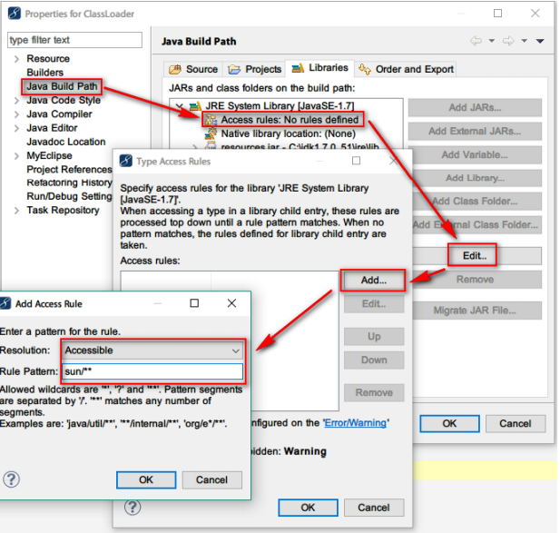
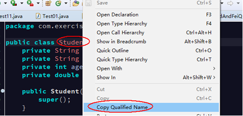

# 类加载器

## 1. 类加载器概述

类加载器是负责加载类的对象，作用是将 class 字节码文件，从硬盘加载到内存中，并且在内存中创建一个Class对象。

## 2. 类加载器的分类

- **三种类加载器**
1. **引导类加载器：BootstrapClassLoader**
    - 最底层的加载器，由 C 和 C++编写，不是 Java 中的类。
    - 负责加载Java核心包的类。如：`D:\development\Java\jdk1.8.0_144\jre\lib\rt.jar`
2. **扩展类加载器：ExtClassLoader**
    - 由 Java 程序编写，是Java类中的一个内部类。
    - 负责加载 JRE 中的扩展包中的类。如：`D:\development\Java\jdk1.8.0_144\jre\lib\ext`

> **注：如果要使用 lib/ext 包中的类，要在 eclipse 中要进行如下设置**  
> 在“Project Properties --> Java Build Path”中的指定 JRE 包的访问规则，Edit 规则  
> Accessible，指定为 `sun/**`，指定可以在 eclipse 中访问 sun 开头的包。
>
> 

3. **应用类加载器：AppClassLoader**
    - 由 Java 程序编写，是一个Java 内部类。
    - 负责加载CLASSPATH指定的jar(包括第三方的库)和bin目录下的自己编写的类。

## 3. ClassLoader 类
#### 3.1.1. 如何得到类加载器对象

```java
public ClassLoader getClassLoader()
```

- Class类中的方法，获得当前类的类加载器对象
- **注：通过类名.class.getClassLoader()获得**
    - *如果获得的类加载器对象是null，则该类是由引导类加载器加载*

### 3.2. ClassLoader的常用方法

```java
public final ClassLoader getParent()
```

- 获得父加载器对象
- 三种类加载器之间没有子父类关系。只是一种叫法。
- 三种加载器的子父关系（上下级关系）：应用类加载器(AppClassLoader) --> 扩展类加载器(ExtClassLoader) --> 引导类加载器(BootstrapClassLoader)

```java
public URL getResource(String name)
```

- 如果资源文件是在src文件夹下，资源文件路径：不需要加“/”，代表从bin目录查找指定名称的资源文件。
- 返回的URL对象(统一资源定位符)

```java
public InputStream getResourceAsStream(String name)
```

-如果资源文件是在src文件夹下，资源文件路径：不需要加“/”，代表从bin目录查找指定名称的资源文件。
返回资源文件关联的字节输入流对象。


## 4. 类加载器的加载机制（双亲委托机制）（理解）

1. 当AppClassLoader加载一个class时，它首先不会自己去尝试加载这个类，而是把类加载请求委派给父类加载器ExtClassLoader去完成。
2. 当ExtClassLoader加载一个class时，它首先也不会自己去尝试加载这个类，而是把类加载请求委派给BootStrapClassLoader去完成。
3. 如果BootStrapClassLoader加载失败（例如在`$JAVA_HOME/jre/lib`里未查找到该class），会使用ExtClassLoader来尝试加载；
4. 若ExtClassLoader也加载失败，则会使用AppClassLoader来加载，如果AppClassLoader也加载失败，则会报出异常ClassNotFoundException。

---

# 反射

## 1. 类加载的概念与加载时机
### 1.1. 类加载的概念

当第一次使用该类时，如果该类的字节码文件(class)还没有加载到内存中，则JVM会将该类的字节文件加载到内存中并在内存中创建一个Class对象(字节码文件对象)

**每一个类只会加载一次，每一个类的Class对象是都是唯一的**(单例)。

**注：静态代码块：当类加载到内存中时会执行该类的静态代码块，而且只会加载一次**

当程序要使用某个类时，如果该类还未被加载到内存中，则系统会通过加载，连接，初始化三步来实现对这个类进行初始化。

- **加载**
    - 就是指将class文件读入内存，并为之创建一个Class对象。
    - 任何类被使用时系统都会建立一个Class对象
- **连接**
    - 验证：是否有正确的内部结构，并和其他类协调一致
    - 准备：负责为类的静态成员分配内存，并设置默认初始化值
    - 解析：将类的二进制数据中的符号引用替换为直接引用
- **初始化**
    - 就是我们以前讲过的初始化步骤

### 1.2. 类加载的时机

1. 创建该类的对象和子类对象
2. 访问类的静态变量，或者为静态变量赋值（**静态常量除外**，因为静态常量在编译时已经存在）
3. 调用类的静态方法
4. 使用反射方式来强制创建某个类或接口对应的java.lang.Class对象
5. 初始化某个类的子类
6. 直接使用java.exe命令来执行含有main方法的类时

### 1.3. Class 类中两个常用方法

```java
public URL getResource(String name);
```

- 如果资源文件是在**src文件夹**下，资源文件路径:**“/文件名”**，代表从bin目录指定名称的资源文件。
- 如果**资源文件和当前类在同一个文件夹下时，资源文件路径可以省略/**，直接给文件名。
- 返回的URL对象（**统一资源定位符，不能包含中文字符，开发时注意**）
- 注：URL类的成员方法
    - `String getPath();` 获得资源文件的绝对路径字符串。

```java
public InputStream getResourceAsStream(String name);
```

- 如果资源文件是在src文件夹下，资源文件路径:“**/文件名**”，代表从bin目录指定名称的资源文件。
- 如果资源文件和当前类在同一个文件夹下时，资源文件路径可以**省略/**，直接给文件名。
- 返回与资源文件关联的字节输入流对象（**返回的对象：BufferedInputStream**）。

## 2. 反射的概述
### 2.1. 什么是反射

反射是一种机制，利用该机制可以在程序运行过程中对类进行解剖并操作类中所有成员。

因为在 Java 中把一切的东西都抽象成对象，所以类本身也可以抽象成一个对象。类中的构造方法、方法、成员变量等也可以抽象成对象。反射就是通过类对象Class，得到类中有哪些**构造方法Constructor**、**成员方法Method**、**成员变量（字段）Field** 等对象。

JAVA反射机制是在**运行状态**中，对于任意一个类，都能够知道这个类的所有属性和方法；对于任意一个对象，都能够调用它的任意一个方法和属性。

### 2.2. 反射的前提条件

获得该类Class对象，就是字节码文件对象。

### 2.3. 反射在实际开发中的应用

- 开发IDE（集成开发环境），比如:Eclipse
- 框架的学习或框架的开发（Struts, Spring, Hibernate）
- **反射中对象的规律**：
    - 有 Declared 的可以得到所有声明的方法，没有Declared 的只能得到公共的方法
- **伪泛型**
    - 在编译时期的进行限制，但利用反射可以在运行时候进行操作。

## 3. Class 类
### 3.1. 获取 Class 对象的三种方式

- **方式一: 通过Object类中的`getClass()`方法**

```java
Person p = new Person();
Class c = p.getClass();
```

- **方式二: 通过 `类名.class` 获取到字节码文件对象**
    - 任意数据类型都具备一个class静态属性，**该类要和当前类在同一个项目中**

```java
Class c2 = Person.class;
```

- **方式三: 通过Class类中的静态方法 `forName(String str)`**
    - 将类名作为字符串传递给Class类中的静态方法forName即可。而类名必须全名：“包名.类名”(**在同一个项目下的类全名，不能跨项目的**)

```java
Class c3 = Class.forName("xx.xxx.Person");
```

**注意：第三种和前两种的区别前两种你必须明确Person类型。后面是指定这种类型的字符串即可，这种扩展更强，我不需要知道你的类，我只提供字符串，按照配置文件加载就可以了**

**注：三种方式得到的类对象，是同一个对象**

IDE中获取类全名的方法：右键类名 --> 选择Copy Qualified Name



### 3.2. Class 类中的方法

```java
public String getName();
```

- 得到类的完全限定类名。如：java.util.Date
- > API文档说明: 以 String 的形式返回此 Class 对象所表示的实体（类、接口、数组类、基本类型或 void）名称。

```java
public String getSimpleName();
```

- 得到类名。 如：Date
- > API文档说明: 返回源代码中给出的底层类的简称。如果底层类是匿名的则返回一个空字符串。

```java
public T newInstance()
```

- 通过无参数构造方法创建对象。之前建议创建类时要提供一个无参构造方法，是为使用反射获取一个无参对象。
- **使用此方法获取一个空参构造的对象前提**：
    1. 被反射的类，必须具有空参数构造方法
    2. 构造方法权限必须是public
- 示例：

```java
Class c = Class.forName(xx.xxx.xxx.类名);    // (xx.xxx.xxx是包全名)
Object obj = c.newInstance();    // 使用Class类方法创建被反射类的对象

// 或使用泛型指定Class的类型：
Class<Student> c = (Class<Student>) Class.forName(xx.Student);
Student s = c.newInstance();
```

- > API文档说明: 创建此 Class 对象所表示的类的一个新实例。如同用一个带有一个空参数列表的 new 表达式实例化该类。如果该类尚未初始化，则初始化这个类。

### 3.3. 综合示例

```java
public class Demo02 {
	public static void main(String[] args) throws IOException {
		// 获得当前类的Class对象
		InputStream in = Demo02.class.getResourceAsStream("a.txt");
		System.out.println(in);

		// 获得资源文件对饮的URL对象
		URL url = Demo02.class.getResource("/a.txt");
		// System.out.println(url.getPath());

		// 创建字节输入流
		FileInputStream fis = new FileInputStream(url.getPath());
		System.out.println(fis.read());
		// 关闭流
		fis.close();
	}
}
```

## 4. 反射获取构造方法(Constructor 类)

- 在反射机制中，把类中的成员（构造方法、成员方法、成员变量）都封装成了对应的类进行表示。其中，构造方法使用类**Constructor**表示。
- 每一个构造方法都是一个Constructor类的对象
- **可通过Class类中提供的方法获取构造方法**

### 4.1. Class 类方法，返回一个构造方法 Constructor 类型

```java
public Constructor<T> getConstructor(Class<?>... parameterTypes);
```

- 获取public修饰，指定参数类型所对应的构造方法

```java
public Constructor<T> getDeclaredConstructor(Class<?>... parameterTypes);
```

- 获取指定参数类型所对应的构造方法(包含私有的)
- 示例：
    - `Constructor<Student> con = c.getConstructor(xxx.class, xxx.class, xxx.class, xxx.class);`
    - 参数列表是**该类的构造方法对应的参数列表的数据类型.class**，个数也要和需要反射得到的构造方法一致。

### 4.2. Class 类方法，返回多个构造方法 Constructor 类型数组

```java
public Constructor<?>[] getConstructors();
```

- 获取所有的public 修饰的构造方法，返回一个 Constructor 类型数组

```java
public Constructor<?>[] getDeclaredConstructors();
```

- 获取所有的构造方法(包含private修饰)，返回一个 Constructor 类型数组

**注：基本类型与引用类型类对象：在Java 中int.class 和 Integer.class 是2 种不同的类型。所以如果参数类型不匹配，也无法得到相应的构造方法，会出现如下异常：`java.lang.NoSuchMethodException`**

### 4.3. Constructor 类 newInstance 方法

**反射方式获取构造方法后，创建对象使用到 Constructor 类的方法**

```java
public T newInstance(Object... initargs);
```

- 指定构造方法的参数值(0~n)，创建一个 T 对象

### 4.4. AccessibleObject 类 setAccessible 方法

**AccessibleObject 类是 Field、Method 和 Constructor 对象的父类。它提供了将反射的对象标记为在使用时取消默认 Java 语言访问控制检查的能力。**

对于公共成员、默认（打包）访问成员、受保护成员和私有成员，在分别使用 Field、Method 或 Constructor 对象来设置或获取字段、调用方法，或者创建和初始化类的新实例的时候，会执行访问检查。常用方法如下：

```java
public void setAccessible(boolean flag) throws SecurityException
```

- 设置是否取消权限检查（**暴力反射**）
- 参数值为 **true** 则指示反射的对象在使用时应该**取消** Java 语言访问检查。参数值为 **false** 则指示反射的对象应该**实施** Java 语言访问检查。
- 示例：
    - `反射出来的对象(Field、Method 和 Constructor).setAccesible(true);`
    - 调用过这方法的私有对象后面才可以进行使用和修改

5、通过反射方式，获取构造方法(私有)，创建对象

- 获取构造方法，创建对象的步骤如下：
	1. 获取到Class对象;
	2. 获取指定的构造方法;
	3. 暴力访问, 通过setAccessible(boolean flag)方法（如果是私有）
	4. 通过构造方法类Constructor中的方法，创建对象;
- **不推荐访问私有，因为破坏了程序的封装性，安全性**

### 4.5. 案例：反射获取构造方法创建对象(包含私有构造方法)

```java
import java.lang.reflect.Constructor;

/*
 *	通过反射方式，获取构造方法(包含私有构造方法)，创建对象
 */
public class MoonZero {
	public static void main(String[] args) throws Exception {
		// 获取Student的Class对象
		// Class<Student> c = (Class<Student>) Class.forName("com.exercise.Student");
		// 或者直接类名.class;
		Class<Student> c = Student.class;

		// 获取Student的空参构造
		Constructor<Student> con1 = c.getConstructor();
		System.out.println(con1);
		// 创建无参对象
		Student s1 = con1.newInstance();
		System.out.println(s1);
		// 获取Student的有参构造
		Constructor<Student> con2 = c.getConstructor(String.class, String.class, int.class, double.class);
		System.out.println(con2);
		// 创建有参对象
		Student s2 = con2.newInstance("001", "凌月", 23, 90);
		System.out.println(s2);

		// 获取Student的private有参构造方法
		Constructor<Student> con3 = c.getDeclaredConstructor(String.class, String.class, int.class);
		System.out.println(con3);

		// 暴力反射
		con3.setAccessible(true);

		// 创建prviate有参构造方法
		Student s3 = con3.newInstance("002", "傷月", 24);
		System.out.println(s3);
	}
}
```

## 5. 反射获取成员变量（Field 类）

在反射机制中，把类中的成员变量使用类**Field**表示。可通过Class类中提供的方法获取成员变量：

### 5.1. Class 类方法，返回一个成员变量

```java
public Field getField(String name);
```

- 获取指定的 public修饰的变量

```java
public Field getDeclaredField(String name);
```

- 获取指定的任意变量

### 5.2. Class 类方法，返回多个成员变量

```java
public Field[] getFields();
```

- 获取所有public 修饰的成员变量

```java
public Field[] getDeclaredFields();
```

- 获取所有的成员变量(包含private修饰)

### 5.3. Field 类 set/get 方法

**反射方式获取成员变量后，创建对象使用到 Field 类的方法**

```java
public void set(Object obj, Object value)
```

- 给指定对象 Obj 的成员变量赋值为指定的值 value

```java
public Object get(Object obj)
```

- 获得指定对象 obj 的当前成员变量的值

**其他常用方法：**

```java
public String getName()
```

- 返回此 Field 对象表示的字段的名称(**即成员变量的变量名称**)

```java
public Class<?> getType()
```

- 返回一个 Class 对象，它标识了此 Field 对象所表示字段的声明类型。

### 5.4. 通过反射，创建对象，获取指定的成员变量，进行赋值与获取值操作

- 获取成员变量，步骤如下：
	1. 获取Class对象
	2. 获取构造方法
	3. 通过构造方法，创建对象
	4. 获取指定的成员变量（私有成员变量，通过setAccessible(boolean flag)方法暴力访问和修改）
	5. 通过方法，给指定对象的指定成员变量赋值或者获取值

### 5.5. 案例：通过反射方式，获取成员变量(私有成员变量)，并修改

```java
import java.lang.reflect.Constructor;
import java.lang.reflect.Field;

/*
 *	通过反射方式，获取成员变量(私有成员变量)，并修改
 */
public class MoonZero {
	public static void main(String[] args) throws Exception {
		// 获取Student的Class对象，直接类名.class;
		Class<Student> c = Student.class;
		// 通过反射方式获取Student的public有参构造
		Constructor<Student> con = c.getConstructor(String.class, String.class, int.class, double.class);
		// 使用Constructor类的方法获取一个Student对象
		Student s = con.newInstance("001", "敌法师", 23, 90);
		// 输出Student对象[id=001, name=敌法师, age=23, score=90.0]
		System.out.println(s);

		// 获取public修饰的成员变量
		Field f1 = c.getField("name");
		// [public java.lang.String com.exercise.Student.name]
		System.out.println(f1);
		// 获取成员变量的值[敌法师]
		System.out.println(f1.get(s));
		// 修改成员变量的值
		f1.set(s, "改改");
		// 获取修改后成员变量的值[改改]
		System.out.println(f1.get(s));
		// [id=001, name=改改, age=23, score=90.0]
		System.out.println(s);

		// 获取private修饰的成员变量
		Field f2 = c.getDeclaredField("id");
		// private java.lang.String com.exercise.Student.id
		System.out.println(f2);

		// 强行反射修改成员变量
		f2.setAccessible(true);
		// 获取私有的成员变量[001]
		System.out.println(f2.get(s));
		// 修改私有的成员变量
		f2.set(s, "00x");

		// [id=00x, name=改改, age=23, score=90.0]
		System.out.println(s);

		// 获取该成员变量的名称,返回String类型，[name]
		System.out.println(f1.getName());
		//获取该成员变量的类型，返回Class类型，[class java.lang.String]
		System.out.println(f1.getType());
	}
}
```

## 6. 反射获取成员方法（Method 类）

**在反射机制中，把类中的成员方法使用类Method表示。可通过Class类中提供的方法获取成员方法：**

### 6.1. Class 类返回获取一个方法

```java
public Method getMethod(String name, Class<?>... parameterTypes);
```

- 获取指定参数 public 修饰的方法

```java
public Method getDeclaredMethod(String name, Class<?>... parameterTypes);
```

- 获取任意指定参数的方法，包含私有的
- 参数1: name 要查找的方法名称；
- 参数2: parameterTypes 该方法的参数类型
- 示例：
    - `Method<Student> met = c.getDeclaredMethod("方法名", xxx.class, xxx.class, xxx.class, xxx.class);`
    - 参数列表是**需要获取的方法名;后面是该类的方法对应的参数列表的数据类型.class**，个数也要和需要反射得到的方法一致。如果该方法没有参数，则只写方法名。

### 6.2. Class 类返回获取多个方法

```java
public Method[] getMethods();
```

获取本类与父类（接口）中所有public 修饰的方法（**包括继承的所有方法**）

```java
public Method[] getDeclaredMethods();
```

获取本类中所有的方法(包含私有的，**但不包括继承的方法**)

### 6.3. Method 类 invoke 方法

```java
public Object invoke(Object obj,  Object... args)
```

- 示例

```java
// 调用对象方法。如果方法是无参，则可以不用写
method对象.invoke(该方法所在类对象, 方法的参数值);

// 调用静态方法。
method对象.invoke(null(或该方法的所在的类对象), 方法的参数值);
```

- 执行指定对象obj中，当前Method对象所代表的方法，方法要传入的参数通过args指定。返回值为当前调用的方法的返回值

### 6.4. 通过反射，创建对象，调用指定的方法（包括private）

- 获取成员方法（包括私有），步骤如下：
	1. 获取Class对象
	2. 获取构造方法
	3. 通过构造方法，创建对象
	4. 获取指定的方法
	5. 开启暴力访问
	6. 执行找到的方法

### 6.5. 案例：通过反射方式，获取成员方法(私有成员变量)，并调用

```java
import java.lang.reflect.Constructor;
import java.lang.reflect.Method;

/*
 *	通过反射方式，获取成员方法(私有成员变量)，并调用
 */
public class MoonZero {
	public static void main(String[] args) throws Exception {
		// 获取Student的Class对象,直接类名.class
		Class<Student> c = Student.class;
		// 通过反射，获取Student公共无参构造方法，直接用Class类的newInstance方法获取
		Student s = c.newInstance();

		// 或者通过Constructor类获取
		Constructor<Student> con = c.getConstructor();
		Student s2 = con.newInstance();

		// 获取公共方法
		Method m1 = c.getMethod("eat");
		// 调用该方法
		m1.invoke(s);

		// 获取私有方法
		Method m2 = c.getDeclaredMethod("sleep");
		// 强制执行
		m2.setAccessible(true);
		// 调用私有方法
		m2.invoke(s);

		// 获取静态方法
		Method m3 = c.getMethod("play");
		m3.invoke(s);
		// 或者
		m3.invoke(null);
	}
}
```

*上面三例使用到的Student类*

```java
public class Student {
	private String id;
	public String name;
	private int age;
	private double score;

	public Student() {
		super();
	}

	public Student(String id, String name, int age, double score) {
		this.id = id;
		this.name = name;
		this.age = age;
		this.score = score;
	}

	@SuppressWarnings("unused")
	private Student(String id, String name, int age) {
		super();
		this.id = id;
		this.name = name;
		this.age = age;
	}

	@Override
	public String toString() {
		return "Student [id=" + id + ", name=" + name + ", age=" + age + ", score=" + score + "]";
	}

	// 私有方法
	@SuppressWarnings("unused")
	private void sleep() {
		System.out.println("正在睡觉");
	}

	// 公共方法
	public void eat() {
		System.out.println("正在吃饭");
	}

	// 静态方法
	public static void play() {
		System.out.println("正在玩耍");
	}
}
```

## 7. Reflections 反射框架(待整理)


## 8. 反射与Properties案例
### 8.1. 案例1

```java
import java.io.File;
import java.io.FileInputStream;
import java.lang.reflect.Field;
import java.util.Properties;
import java.util.Set;

/*
 *	2.1需求
 *	1)有属性内容如下：
 *	注意：文件放在项目根目录下
 *	student.properties
 *	    id=1
 *	    name=Sandy
 *	    gender=\u7537
 *	    score=100
 *	2)有一个 Student 类的属性：Student(String id, String name, String gender, String score)，
 *	这里将所有的属性设置成了 String 类型。
 *	3)通过 Properties 类读取 student.properties 文件
 *	4)使用反射的方式把属性文件中读取的数据赋值给一个实例化好的 Student 对象，
 *	Student 类中的属性名与student.properties 要对应。
 *	5)重写 Student 的 toString()方法，输出对象的属性值 。
 */
public class MoonZero {
	public static void main(String[] args) throws Exception {
		// 创建配置文件的路径对象
		File file = new File("student.properties");
		// 创建字节输入流对象
		FileInputStream fis = new FileInputStream(file);
		// 创建Properties集合并读取配置文件
		Properties props = new Properties();
		props.load(fis);
		// 关闭流资源
		fis.close();

		String className = "com.exercise.Student";
		// 调用方法获取实例化的对象（第一种方法容易出现异常，使用第二种）
		Student s = (Student) createObject(className, props);
		Student s1 = (Student) createObject1(className, props);
		// 输出结果:Student [id=1, name=Sandy, gender=男, score=100]
		System.out.println(s);
		System.out.println(s1);
	}

	/**
	 * 读取Properties配置文件，使用反射实例化一个Student对象
	 * 这种方法有缺陷，如果以集合的键去获取成员变量对象，如果键不与对象的名字一致，
	 * 则会出现java.lang.NoSuchFieldException 找不到字段的异常
	 * @param className
	 *            需要实例化的对象
	 * @param props
	 *            Properties配置文件
	 * @return 实例化的对象
	 * @throws Exception
	 */
	@SuppressWarnings("rawtypes")
	public static Object createObject(String className, Properties props) throws Exception {
		// 获取类的Class对象
		Class c = Class.forName(className);

		// 获取一个无参的Studnet对象
		Object obj = c.newInstance();

		// 获取Properties集合的键Set集合
		Set<String> set = props.stringPropertyNames();
		// 遍历集合，使用反射给对象赋值
		for (String s : set) {
			// 获取成员变量对象
			Field f = c.getDeclaredField(s);
			// 暴力反射给成员变量赋值
			f.setAccessible(true);
			f.set(obj, props.getProperty(s));
		}
		return obj;
	}

	/**
	 * 读取Properties配置文件，使用反射实例化一个Student对象（第2种）
	 *
	 * @param className
	 *            需要实例化的对象
	 * @param props
	 *            Properties配置文件
	 * @return 实例化的对象
	 * @throws Exception
	 */
	@SuppressWarnings("rawtypes")
	public static Object createObject1(String className, Properties props) throws Exception {
		// 获取类的Class对象
		Class c = Class.forName(className);

		// 获取一个无参的Studnet对象
		Object obj = c.newInstance();

		// 获取成员变量对象数组
		Field[] arr = c.getDeclaredFields();
		// 遍历数组使用反射给成员变量赋值
		for (Field f : arr) {
			// 获取成员变量名称
			String key = f.getName();
			// Properties对应的值
			String value = props.getProperty(key);

			// 暴力反射
			f.setAccessible(true);
			f.set(obj, value);
		}

		return obj;
	}
}
```


