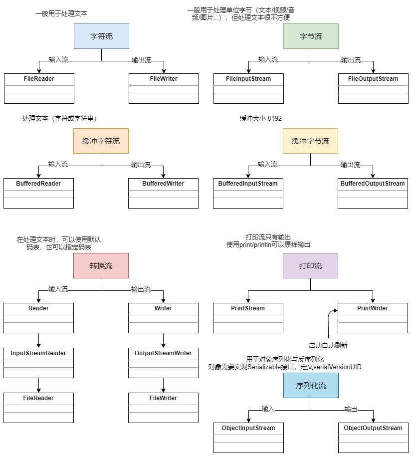

# Java基础-IO编程

## 1. File 类

### 1.1. File 简述

#### 1.1.1. 概念

`File` 类：文件和目录路径名的抽象表示形式。即，Java 中把文件或者目录（文件夹）都封装成 `File` 对象。

可以用来操作硬盘上的文件或文件夹。也就是说如果要去操作硬盘上的文件，或者文件夹只要找到 `File` 这个类即可。

- 文件可以持久化地存储数据
- `File` 的一个对象就代表一个文件或文件夹(自己简单地定义，方便记忆的说法)
- 文档上说明 `File` 类代表文件或文件夹路径，但是我们可以通过路径找到对应的文件或文件夹。
- 可以认为 `File` 类就代表文件或文件夹(通过路径找到)

#### 1.1.2. 相对路径与绝对路径

**绝对路径**

- 以盘符开始到文件的全路径
- 在整个系统中，<font color=red>**具有唯一性**</font>

**相对路径**

- 从某个参照目录开始到指定文件所经过的路径
- 在整个系统中，<font color=red>**不具有唯一性**</font>
- 相对路径一般是在 Eclipse 中的某个项目当中创建一个文件夹(目录)开始。如 a.txt 相对于 myIO 项目根目录经过了 `a/b/a.txt`，则 `a/b/a.txt` 就是该文件的相对路径

### 1.2. File 类的使用

#### 1.2.1. 成员变量

- 与系统有关的路径分隔符，window是“`;`”，mac与lunix是“`:`”

```java
public static final String pathSeparator
```

- 与系统有关的默认名称分隔符(目录分隔符)，跨平台的。window是“`\`”，mac与lunix是“`/`”。应该是需要跨平台，所以不能直接将分隔符写成一种类型。目前JDK版本已经可以自动识别。

```java
public static final String separator
```

> 注：静态成员变量，直接用`file.成员变量名`使用

#### 1.2.2. 构造方法

```java
public File(String pathname)
```

- 根据文件或文件夹路径字符串创建文件对象，通过路径找到对应的文件或文件夹
- > API描述：通过将给定路径名字符串转换为抽象路径名来创建一个新 `File` 实例。如果给定字符串是空字符串，那么结果是空抽象路径名。
- 例：`File f = new File("E:\\documents\\aaa.txt");`

```java
public File(String parent, String child);
```

- parent 指的是父级目录路径字符串，child 指的是子级目录（子级文件）路径字符串。根据父文件夹路径和子文件夹（子文件）路径创建文件对象。
- 例：`File f = new File("E:\\documents\\", "aaa.txt");`

```java
public File(File parent, String child);
```

- parent 为 File 类型，为了使用 `File` 类中的方法
- 例：`File f = new File(new File("E:\\documents\\"), "aaa.txt");`

<font color=red>**注意：File的构造方法不会去判断路径是否存在，需要自己去调用方法处理**</font>

#### 1.2.3. 文件创建

```java
public boolean createNewFile() throws IOException;
```

根据构造方法指定的路径创建文件，如果文件已经存在，则什么不做。如果文件不存在，则创建文件。

<font color=red>**只能用来创建文件，不能创建文件夹**</font>。在创建文件时，如果文件所在的文件夹不存在，则报错系统找不到指定的路径。<font color=red>**创建文件时，必须确保文件夹已经存在**</font>。

#### 1.2.4. 文件夹创建

```java
public boolean mkdir();
```

- 根据路径字符串创建文件夹（<font color=red>**单级目录，下面不能再创建新的目录**</font>）
- 如果文件夹存在，则什么不做；如果文件夹不存在，则创建。创建成功返回`true`，否则返回`false`
- 需要注意：<font color=red>**只能用来创建文件夹，不能创建文件**</font>
- 使用`mkdir`方法创建文件夹时，必须保证其所在文件夹已经存在，否则创建失败(不会报错)

```java
public boolean mkdirs();
```

- 一次性创建多级文件夹（最常用）。如果父文件夹不存在，则会先创建父文件夹。
- 创建成功返回`true`，否则返回`false`
- 需要注意：<font color=red>**只能用来创建文件夹，不能创建文件**</font>

#### 1.2.5. 文件/文件夹删除

```java
public boolean delete();
```

删除此抽象路径名表示的文件或目录。如果删除成功返回`true`；如果不成功则返回`false`。

- `File`对象是文件：直接删除文件(<font color=red>**Java 删除时，不会使用 windows 的回收站**</font>)
- `File`对象是文件夹：只删定义路径中最后一个文件夹且只能删除空文件夹，如果不是空文件夹，即不能删除。

#### 1.2.6. 获取文件/文件夹信息

```java
public long length()
```

- 获得文件大小，单位：字符。<font color=red>**只能是文件，不能是文件夹**</font>。
- > API: 返回由此抽象路径名表示的文件的长度（单位：字符）。如果此路径名表示一个目录，则返回值是不确定的(<font color=red>**垃圾值**</font>)。

```java
public String getName();
```

- 获取文件/文件夹的名称
- > API: 返回由此抽象路径名表示的文件或目录的名称。该名称是路径名名称序列中的最后一个名称。如果路径名名称序列为空，则返回空字符串。

```java
public String getAbsolutePath();
```

- 获取绝对路径字符串，返回此抽象路径名的绝对路径名字符串。

```java
public File getAbsoluteFile()
```

- 获取绝对路径的对象
- > API: 返回此抽象路径名的绝对路径名形式。等同于`new File(this.getAbsolutePath())`。

```java
public String getParent();
```

- 获得上一级文件路径字符串；
- > API: 返回所在文件夹路径(根据创建对象时是否为绝对路径/相对路径)

```java
public File getParentFile()
```

- 获得上一级文件路径对象；（<font color=blue>**应该是用于返回上一级目录再继续进行其他操作**</font>）
- > API: 返回此抽象路径名父目录的抽象路径名；如果此路径名没有指定父目录，则返回 null。

```java
public String getPath();
```

- 获取路径(用什么方式创建的对象,就返回什么方式的路径(绝对路径/相对路径))
- > API: 将此抽象路径名转换为一个路径名字符串。所得字符串使用默认名称分隔符分隔名称序列中的名称。

获取文件/文件夹信息示例代码：

```java
/*
 * 获取 E 盘 aaa 文件夹中 b.txt 文件的文件名，文件大小，文件的绝对路径和父路径等信息，
 * 	并将信息输出在控制台。
 */
@Test
public void testGetFileInfo() {
    // 获取 E 盘 aaa 文件夹中 b.txt对象
    File file = new File("e:\\aaa\\b.txt");
    // 判断对象是否文件
    System.out.println("对象是否为文件：" + file.isFile());
    // 获取文件的大小,单位：字节
    System.out.println("对象文件的大小 ：" + file.length());
    // 获取文件名
    System.out.println("对象文件的名称：" + file.getName());
    // 获取文件的绝对路径
    System.out.println("对象的绝对路径是：" + file.getAbsolutePath());
    // 获取父路径信息
    System.out.println("对象的父路径是：" + file.getParent());
    // 获取路径
    System.out.println("对象的路径是(用什么方式创建的对象,就返回什么方式的路径)：" + file.getPath());

    File file2 = new File("qq.txt");
    // 获取这个相对路径的对象的绝对路径
    System.out.println("相对路径对象的绝对路径是：" + file2.getAbsolutePath());
}
```

输出结果

```
对象是否为文件：true
对象文件的大小 ：44
对象文件的名称：b.txt
对象的绝对路径是：e:\aaa\b.txt
对象的父路径是：e:\aaa
对象的路径是(用什么方式创建的对象,就返回什么方式的路径)：e:\aaa\b.txt
相对路径对象的绝对路径是：D:\code\java-technology-stack\java-basic-api\qq.txt
```

#### 1.2.7. 判断文件/文件夹

此部分的API是用于判断该 `File` 对象是否存在或者判断该 `File` 对象代表一个文件还是代表一个文件夹

```java
public boolean exists();
```

- 判断文件/文件夹是否存在。存在则返回`true`，否则返回`false`

```java
public boolean isDirectory();
```

- 判断`File`对象是否为文件夹，是文件夹则则返回`true`，否则返回`false`

```java
public boolean isFile();
```

- 判断File对象是否为文件，是文件则返回`true`，否则返回`false`

#### 1.2.8. 获取文件/文件夹列表（重点）

需要注意：<font color=red>**File 对象必须是文件夹**</font>

```java
public String[] list()
```

- 获得当前文件夹对象下所有文件（子文件和子文件夹），返回字符串数组。
- > API: 返回一个字符串数组，这些字符串指定此抽象路径名表示的目录中的文件和目录。

```java
public File[] listFiles();
```

- 获得当前文件夹对象下所有文件（子文件和子文件夹），返回 `File` 对象数组。
- > API: 返回一个抽象路径名数组，这些路径名表示此抽象路径名表示的目录中的文件。

<font color=red>**注意：如果是`File`对象是文件，则返回去的数组为`null`。所以在使用List获取方法前，需要判断`File`对象是否是文件夹。**</font>

示例代码：

```java
@Test
public void testGetFileList() {
    // 创建文件夹对象
    File file = new File("E:\\00-Downloads\\test\\");
    String[] list = file.list();
    // 输出该文件夹里的文件列表
    System.out.println(Arrays.toString(list));

    // 创建文件对象（非文件夹）
    File file2 = new File("E:\\00-Downloads\\a.txt");
    String[] list2 = file2.list();
    // 输出null
    System.out.println(Arrays.toString(list2));
}
```

输出结果：

```
[a - 副本 (2).txt, a - 副本 (3).txt, a - 副本 (4).txt, a - 副本 (5).txt, a - 副本.txt, a.txt]
null
```

### 1.3. File 类基础应用案例

#### 1.3.1. 读取指定文件夹下的所有文件（多个文件夹）

```java
import java.io.File;

public class MoonZero {
	public static void main(String[] args) {
		// 创建文件夹对象
		File file = new File("E:\\temp");
		// 调用读取所有文件的方法
		printAllFile(file);
	}

	// 创建读取当前文件夹下的的有文件递归方法
	public static void printAllFile(File file) {
		// 获取当前文件夹下所有文件的list对象数组
		File[] list = file.listFiles();
		// 利用增强for遍历File对象数组
		for (File f : list) {
			// 再判断是否是文件，如果是文件，直接输出（递归的出口）
			if (f.isFile()) {
				// 直接输出对像是绝对路径，是因为File重写了toString方法
				System.out.println(f);
			} else {
				// 不是文件，则就是文件夹，就进行递归，继续执行。
				printAllFile(f);
			}
		}
	}
}
```

#### 1.3.2. 统计指定文件夹所有文件的大小总和（文件夹下有多个文件夹）

```java
package day10;

import java.io.File;
import java.util.ArrayList;
import java.util.Iterator;
import java.util.Scanner;

/*
 * 关卡2训练案例2
 * 	键盘录入一个文件路径，根据文件路径创建文件对象，判断是文件还是文件夹
 * 	如果是文件，则输出文件的大小
 * 	如果是文件夹则计算该文件夹下所有文件大小之和并输出(不包含子文件夹)。
 */
public class Test2_02 {
	public static void main(String[] args) {
		Scanner input = new Scanner(System.in);
		System.out.println("请录入一个文件路径：");
		File file = new File(input.nextLine());
		// 判断是文件还是文件夹
		if (file.isFile()) {
			System.out.println("输入的文件路径是文件！");
			System.out.println("\"" + file.getName() + "\"的大小是：" + file.length());
		} else {
			System.out.println("输入的文件路径是文件夹！");
			System.out.println("输入的文件夹里的所有文件清单：");
			// 增加将子文件夹都算进去，调用递归方法来统计所有文件的大小
			// 创建一个新的集合，用来存放递归所有文件的File对像。
			ArrayList<File> array = new ArrayList<File>();
			findAllFile(file, array);
			// 将递归接收所有的文件的集合再使用迭代器遍历
			Iterator<File> it = array.iterator();
			// 定义一个long变量用来统计所有文件的大小
			long sum = 0;
			while (it.hasNext()) {
				File f = it.next();
				System.out.println(f.getName());
				sum += f.length();
			}
			System.out.println("文件夹中的所有文件的大小之和是：" + sum);
		}
		input.close();
	}

	public static void findAllFile(File file, ArrayList<File> array) {
		// 使用listFiles方法，获取File对象数组。
		File[] fileArr = file.listFiles();
		for (File f : fileArr) {
			// 判断，如果是文件，直接输出统计大小，如果是文件夹，再进行递归遍历
			if (f.isFile()) {
				array.add(f);
			} else {
				findAllFile(f, array);
			}
		}
	}
}
```

#### 1.3.3. 删除指定文件夹下的所有文件（多个文件夹）

```java
package day10;

import java.io.File;
import java.util.Scanner;

/*
 * 关卡3训练案例2
 * 	键盘录入一个文件夹路径，删除该路径下的文件夹。
 * 	要求：文件夹中包含有子文件夹
 */
public class Test3_02 {
	public static void main(String[] args) {
		// 创建键盘录入对象
		Scanner input = new Scanner(System.in);
		System.out.println("请输入一个文件夹路径：");
		File file = new File(input.nextLine());
		// 调用递归方法，对当前文件夹进行删除操作。
		deleteFile(file);
		input.close();
	}

	public static void deleteFile(File file) {
		// 获取file对象数组
		File[] list = file.listFiles();
		// 遍历数组
		for (File f : list) {
			// 进行判断是否为文件，如果文件直接删除
			if (f.isFile()) {
				// 将文件删除后才能将文件夹删除
				f.delete();
			} else {
				// 如果是文件夹，再递归，然后里面的文件都删除。
				deleteFile(f);
			}
		}
		// 再对文件夹进行删除，上一步递归后，已经将里面的文件夹和文件都删除
		file.delete();
	}
}
```

## 2. FileFilter 文件过滤器(难点、重点)

### 2.1. FileFilter 概述

`FileFilter` 过滤器是一个函数式接口，用于抽象路径名的过滤器。使用时候要创建一个接口的实现类。**（通常使用匿名内部类或者lambda表达式来完成，因为一般该接口只适用于本次的过滤需求，没有广泛的适用性。）**

```java
@FunctionalInterface
public interface FileFilter {

    /**
     * Tests whether or not the specified abstract pathname should be
     * included in a pathname list.
     *
     * @param  pathname  The abstract pathname to be tested
     * @return  <code>true</code> if and only if <code>pathname</code>
     *          should be included
     */
    boolean accept(File pathname);
}
```

`FileFilter` 接口的唯一方法`accept`，作用是测试指定抽象路径名是否应该包含在某个路径名列表中。

### 2.2. 接口的调用时机

每当遍历获得一个子文件或子文件夹时，系统内部会创建一个文件对象，然后将该文件对象作为参数调用，文件过滤的`accept`方法，由`accept`的返回值决定该文件是否要过滤。<font color=red>**返回`false`表示过滤该文件，`ture`则不过滤**</font>。

### 2.3. File 类使用过滤器的方法

根据指定文件过滤器获得当前文件夹下的过滤后的所有文件的`File`对象数组

```java
public File[] listFiles(FileFilter filter)
```

> API: 返回抽象路径名数组，这些路径名表示此抽象路径名表示的目录中满足指定过滤器的文件和目录。除了返回数组中的路径名必须满足过滤器外，此方法的行为与 `listFiles()` 方法相同。如果给定 `filter` 为 `null`，则接受所有路径名。否则，当且仅当在路径名上调用过滤器的` FileFilter.accept(java.io.File)` 方法返回 `true` 时，该路径名才满足过滤器。

### 2.4. 文件过滤器的使用步骤与示例

1.	定义一个类实现`FileFilter`接口**（通常使用匿名内部类或者lambda表达式来完成）**
2.	重写`accept`方法,满足条件的返回`true`,不满足条件的返回`false`
3.	创建`FileFilter`接口的实现类对象
4.	`file.listFiles()`方法参数中传入过滤器

使用文件过滤器示例:

```java
import java.io.File;
import java.io.FileFilter;

/*
 * 需求：只输出文件夹中所有的.pptx文件
 */
public class MoonZero {
	public static void main(String[] args) {
		// 创建文件夹对象
		File file = new File("E:\\temp");
		// 调用读取所有文件的方法
		printAllFile(file);
	}

	// 创建读取当前文件夹下的的有文件递归方法
	public static void printAllFile(File file) {
		// 创建FileFilter接口的实现类对象
		FileFilterDemo ff = new FileFilterDemo();
		// 使用File[] listFiles(FileFilter filter)方法，获取过滤后的File对象数组
		File[] list = file.listFiles(ff);
		// 利用增强for遍历File对象数组
		for (File f : list) {
			// 再判断是否是文件，如果是文件，直接输出（递归的出口）
			if (f.isFile()) {
				// 直接输出对像是绝对路径，是因为File重写了toString方法
				System.out.println(f);
			} else {
				// 不是文件，则就是文件夹，就进行递归，继续执行。
				printAllFile(f);
			}
		}
	}
}

// 定义一个类实现FileFilter接口
class FileFilterDemo implements FileFilter {
	// 重写过滤器 FileFilter的accept抽象方法，
	// 根据需求定义过滤的条件
	@Override
	public boolean accept(File pathname) {
		// 要先判断传入的File对象是文件还是文件夹
		// 如果是文件夹则直接不过滤，如果是文件，则进行判断过滤。
		if (pathname.isDirectory()) {
			return true;
		} else {
			return pathname.getName().endsWith(".pptx");
		}
		// 另一种简单写法
		// return (pathname.isDirectory()) || (pathname.getName().endsWith(".pptx"));
	}
}
```

使用文件过滤器示例2:(使用匿名内部类)

```java
import java.io.File;
import java.io.FileFilter;

/*
 * 需求：只输出文件夹中所有的.pptx文件
 */
public class MoonZero {
	public static void main(String[] args) {
		// 创建文件夹对象
		File file = new File("E:\\temp");
		// 调用读取所有文件的方法
		printAllFile(file);
	}

	// 创建读取当前文件夹下的的有文件递归方法
	public static void printAllFile(File file) {
		// 使用File[] listFiles(FileFilter filter)方法，获取过滤后的File对象数组
		File[] list = file.listFiles(new FileFilter() {
			// 创建FileFilter接口的匿名内部类，直接重写accept抽象方法
			@Override
			public boolean accept(File pathname) {
				// 要先判断传入的File对象是文件还是文件夹
				// 如果是文件夹则直接不过滤，如果是文件，则进行判断过滤。
				return (pathname.isDirectory()) || (pathname.getName().endsWith(".pptx"));
			}
		});
		// 利用增强for遍历File对象数组
		for (File f : list) {
			// 再判断是否是文件，如果是文件，直接输出（递归的出口）
			if (f.isFile()) {
				// 直接输出对像是绝对路径，是因为File重写了toString方法
				System.out.println(f);
			} else {
				// 不是文件，则就是文件夹，就进行递归，继续执行。
				printAllFile(f);
			}
		}
	}
}
```

## 3. IO流总结（字符流和字节流）




## 4. BIO 编程

BIO 有的称之为 basic(基本) IO，有的称之为 block(阻塞) IO，主要应用于文件 IO 和网络 IO

### 4.1. BIO 之 网络IO

在 JDK1.4 之前，我们建立网络连接的时候只能采用 BIO，需要先在服务端启动一个ServerSocket，然后在客户端启动 Socket 来对服务端进行通信，默认情况下服务端需要对每个请求建立一个线程等待请求，而客户端发送请求后，先咨询服务端是否有线程响应，如果没有则会一直等待或者遭到拒绝，如果有的话，客户端线程会等待请求结束后才继续执行，这就是阻塞式 IO

### 4.2. 基本用法示例（基于 TCP）

- 编写TCP服务端

```java
package com.moon.system.testmodule.bio;

import java.io.IOException;
import java.io.InputStream;
import java.io.OutputStream;
import java.net.ServerSocket;
import java.net.Socket;

/**
 * BIO 编程测试 - TCP服务器端程序
 */
public class TCPServer {

    public static void main(String[] args) throws IOException {
        // 1. 创建ServerSocket对象，设置端口号为9999
        ServerSocket serverSocket = new ServerSocket(9999);

        while (true) {
            // 2. 监听客户端
            System.out.println("serverSocket.accept()执行前");
            Socket socket = serverSocket.accept();  // 阻塞，等客户端启动
            System.out.println("serverSocket.accept()执行完");

            // 3. 从连接中取出输入流来接收消息
            InputStream inputStream = socket.getInputStream();  // 阻塞，等待接收客户端发出的消息
            byte[] bytes = new byte[1024];
            // 读取数据
            inputStream.read(bytes);

            String clientIP = socket.getInetAddress().getHostAddress();
            System.out.println(String.format("%s说：%s", clientIP, new String(bytes).trim()));

            // 4. 从连接中取出输出流并回话
            OutputStream outputStream = socket.getOutputStream();
            outputStream.write("TCPServer收到消息".getBytes());

            //  5. 关闭socket
            socket.close();
        }
    }
}
```

- 上述代码编写了一个服务器端程序，绑定端口号 9999，accept 方法用来监听客户端连接，如果没有客户端连接，就一直等待，程序会阻塞在`serverSocket.accept()`方法

```java
package com.moon.system.testmodule.bio;

import java.io.InputStream;
import java.io.OutputStream;
import java.net.Socket;
import java.util.Scanner;

/**
 * BIO 编程测试 - TCP客户端程序
 */
public class TCPClient {

    public static void main(String[] args) throws Exception {
        while (true) {
            // 1.创建Socket对象，连接9999端口
            Socket socket = new Socket("127.0.0.1", 9999);

            // 2.从连接中取出输出流并发消息
            OutputStream outputStream = socket.getOutputStream();
            System.out.println("请输入:");
            Scanner sc = new Scanner(System.in);
            String msg = sc.nextLine();
            outputStream.write(msg.getBytes());

            // 3.从连接中取出输入流并接收回话
            InputStream is = socket.getInputStream(); // 阻塞，一直等待服务端的响应
            byte[] bytes = new byte[20];
            is.read(bytes);
            System.out.println("TCPServer回复：" + new String(bytes).trim());

            // 4.关闭
            socket.close();
        }
    }
}
```

- 上述代码编写了一个客户端程序，通过 9999 端口连接服务器端，getInputStream 方法用来等待服务器端返回数据，如果没有返回，就一直等待，程序会阻塞在`socket.getInputStream()`方法

## 5. NIO 编程
### 5.1. 概述

java.nio 全称 java non-blocking IO，是指 JDK 提供的新 API。从 JDK1.4 开始，Java 提供了一系列改进的输入/输出的新特性，被统称为 NIO(即 New IO)。新增了许多用于处理输入输出的类，这些类都被放在 java.nio 包及子包下，并且对原 java.io 包中的很多类进行改写，新增了满足 NIO 的功能


NIO 和 BIO 有着相同的目的和作用，但是它们的实现方式完全不同，BIO 以流的方式处理数据，而 NIO 以块的方式处理数据，块 I/O 的效率比流 I/O 高很多。另外，NIO 是非阻塞式的，这一点跟 BIO 也很不相同，使用它可以提供非阻塞式的高伸缩性网络

**NIO 主要有三大核心部分：Channel(通道)，Buffer(缓冲区), Selector(选择器)**。传统的 BIO基于字节流和字符流进行操作，而 NIO 基于 Channel(通道)和 Buffer(缓冲区)进行操作，数据总是从通道读取到缓冲区中，或者从缓冲区写入到通道中。Selector(选择区)用于监听多个通道的事件（比如：连接请求，数据到达等），因此使用单个线程就可以监听多个客户端通道

### 5.2. 文件 IO

#### 5.2.1. 缓冲区（Buffer）概述

缓冲区（Buffer）：实际上是一个容器，是一个特殊的数组，缓冲区对象内置了一些机制，能够跟踪和记录缓冲区的状态变化情况。Channel 提供从文件、网络读取数据的渠道，但是读取或写入的数据都必须经由 Buffer，如下图所示


#### 5.2.2. 缓冲区（Buffer）核心 API

在 NIO 中，`Buffer` 是一个顶层父类，它是一个抽象类，对于 Java 中的基本数据类型，都有一个 `Buffer` 类型与之相对应，常用的 `Buffer` 子类有

| Buffer 子类  |       作用类型       |
| ------------ | -------------------- |
| ByteBuffer   | 存储字节数据到缓冲区   |
| ShortBuffer  | 存储字符串数据到缓冲区 |
| CharBuffer   | 存储字符数据到缓冲区   |
| IntBuffer    | 存储整数数据到缓冲区   |
| LongBuffer   | 存储长整型数据到缓冲区 |
| DoubleBuffer | 存储小数到缓冲区      |
| FloatBuffer  | 存储小数到缓冲区      |

##### 5.2.2.1. ByteBuffer 常用方法

最常用的自然是ByteBuffer 类（二进制数据），该类的主要方法如下所示

- 存储字节数据到缓冲区

```java
public abstract ByteBuffer put(byte[] b);
```

- 从缓冲区获得字节数据

```java
public abstract byte[] get();
```

- 把缓冲区数据转换成字节数组

```java
public final byte[] array();
```

- 设置缓冲区的初始容量

```java
public static ByteBuffer allocate(int capacity);
```

- 把一个现成的数组放到缓冲区中使用

```java
public static ByteBuffer wrap(byte[] array);
```

- 翻转缓冲区，重置位置到初始位置

```java
public final Buffer flip();
```

#### 5.2.3. 通道（Channel）概述

通道（Channel）：类似于 BIO 中的 stream。例如 `FileInputStream` 对象，用来建立到目标（文件，网络套接字，硬件设备等）的一个连接。

需要注意：**BIO 中的 stream 是单向的**，例如 `FileInputStream` 对象只能进行读取数据的操作。而 **NIO 中的通道(Channel)是双向的**，既可以用来进行读操作，也可以用来进行写操作。

常用的 `Channel` 实现类有：

|    Channel 实现类    |        作用       |
| ------------------- | ----------------- |
| FileChannel         | 用于文件的数据读写  |
| DatagramChannel     | 用于 UDP 的数据读写 |
| ServerSocketChannel | 用于 TCP 的数据读写 |
| SocketChannel       | 用于 TCP 的数据读写 |


##### 5.2.3.1. FileChannel 类常用方法

该类主要用来对本地文件进行 IO 操作，主要方法如下

- 从通道读取数据并放到缓冲区中

```java
public int read(ByteBuffer dst);
```

- 把缓冲区的数据写到通道中

```java
public int write(ByteBuffer src);
```

- 从目标通道中复制数据到当前通道

```java
public long transferFrom(ReadableByteChannel src, long position, long count);
```

- 把数据从当前通道复制给目标通道

```java
public long transferTo(long position, long count, WritableByteChannel target);
```

#### 5.2.4. 文件 NIO 示例

测试使用NIO进行本地文件的读、写和复制操作，和BIO进行对比

##### 5.2.4.1. 往本地文件中写数据

```java
/* 往本地文件中写数据 */
@Test
public void testWrite() throws Exception {
    // 1. 创建输出流
    FileOutputStream fileOutputStream = new FileOutputStream("E:\\00-Downloads\\moon.txt");
    // 2. 从流中得到一个通道
    FileChannel fileChannel = fileOutputStream.getChannel();
    // 3. 提供一个缓冲区
    ByteBuffer buffer = ByteBuffer.allocate(1024);
    // 4. 往缓冲区中存入数据
    String str = "hello,nio";
    buffer.put(str.getBytes());
    // 5. 翻转缓冲区
    buffer.flip();
    // 6. 把缓冲区写到通道中
    fileChannel.write(buffer);
    // 7. 关闭
    fileOutputStream.close();
}
```

> NIO 中的通道是从输出流对象里通过 `getChannel` 方法获取到的，该通道是双向的，既可以读，又可以写。在往通道里写数据之前，必须通过 put 方法把数据存到 `ByteBuffer` 中，然后通过通道的 `write` 方法写数据。在 `write` 之前，需要调用 `flip` 方法翻转缓冲区，把内部重置到初始位置，这样在接下来写数据时才能把所有数据写到通道里

##### 5.2.4.2. 从本地文件中读数据

```java
/* 从本地文件中读取数据 */
@Test
public void test2() throws Exception {
    File file = new File("E:\\00-Downloads\\moon.txt");
    // 1. 创建输入流
    FileInputStream fileInputStream = new FileInputStream(file);
    // 2. 得到一个通道
    FileChannel fileChannel = fileInputStream.getChannel();
    // 3. 准备一个缓冲区
    ByteBuffer buffer = ByteBuffer.allocate((int) file.length());
    // 4. 从通道里读取数据并存到缓冲区中
    fileChannel.read(buffer);
    System.out.println(new String(buffer.array()));
    // 5. 关闭
    fileInputStream.close();
}
```

> 上面示例从输入流中获得一个通道，然后提供 ByteBuffer 缓冲区，该缓冲区的初始容量和文件的大小一样，最后通过通道的 read 方法把数据读取出来并存储到了 ByteBuffer 中

##### 5.2.4.3. 复制本地文件

```java
/* 使用BIO实现文件复制 */
@Test
public void testBioCopy() throws Exception {
    // 1. 创建两个流
    FileInputStream fileInputStream = new FileInputStream("E:\\00-Downloads\\moon.txt");
    FileOutputStream fileOutputStream = new FileOutputStream("E:\\00-Downloads\\moon_copy.txt");
    // 2. 定义字节数组，使用一次读取数组方式复制文件
    byte[] bytes = new byte[1024];
    int len;
    while ((len = fileInputStream.read(bytes)) != -1) {
        fileOutputStream.write(bytes, 0, len);
    }
    // 3. 关闭资源
    fileInputStream.close();
    fileOutputStream.close();
}
```

> 上面示例是通过传统的 BIO 复制一个文件，分别通过输入流和输出流实现了文件的复制

```java
/* 使用NIO实现文件复制 */
@Test
public void testNioCopy() throws Exception {
    // 1. 创建两个流
    FileInputStream fileInputStream = new FileInputStream("E:\\00-Downloads\\moon.txt");
    FileOutputStream fileOutputStream = new FileOutputStream("E:\\00-Downloads\\moon_copy.txt");
    // 2. 得到两个通道
    FileChannel fileInChannel = fileInputStream.getChannel();
    FileChannel fileOutChannel = fileOutputStream.getChannel();
    // 3. 复制
    fileOutChannel.transferFrom(fileInChannel, 0, fileInChannel.size());
    // 4. 关闭
    fileInputStream.close();
    fileOutputStream.close();
}
```

> 上面示例分别从两个流中得到两个通道，sourceCh 负责读数据，destCh 负责写数据，然后直接调用 transferFrom 方法一步到位实现了文件复制

### 5.3. 网络 IO

#### 5.3.1. 概述

Java NIO 中的网络通道是非阻塞 IO 的实现，基于事件驱动，非常适用于服务器需要维持大量连接，但是数据交换量不大的情况，例如一些即时通信的服务等等...

在 Java 中编写 Socket 服务器，通常有以下几种模式

- 一个客户端连接用一个线程，优点：程序编写简单；缺点：如果连接非常多，分配的线程也会非常多，服务器可能会因为资源耗尽而崩溃。
- 把每一个客户端连接交给一个拥有固定数量线程的连接池，优点：程序编写相对简单，可以处理大量的连接。确定：线程的开销非常大，连接如果非常多，排队现象会比较严重。
- 使用 Java 的 NIO，用非阻塞的 IO 方式处理。这种模式可以用一个线程，处理大量的客户端连接

#### 5.3.2. 核心 API

##### 5.3.2.1. Selector(选择器)

`Selector`选择器，能够检测多个注册的通道上是否有事件发生，如果有事件发生，便获取事件然后针对每个事件进行相应的处理。这样就可以只用一个单线程去管理多个通道，也就是管理多个连接。这样使得只有在连接真正有读写事件发生时，才会调用函数来进行读写，就大大地减少了系统开销，并且不必为每个连接都创建一个线程，不用去维护多个线程，并且避免了多线程之间的上下文切换导致的开销。


常用方法如下：

- 得到一个选择器对象

```java
public static Selector open()
```

- 监控所有注册的通道，当其中有 IO 操作可以进行时，将对应的 SelectionKey 加入到内部集合中并返回，参数用来设置超时时间

```java
public int select(long timeout)
```

- 从内部集合中得到所有的 SelectionKey

```java
public Set<SelectionKey> selectedKeys()
```

- 获取所有准备就绪的网络通道

```java
public abstract Set<SelectionKey> keys();
```

##### 5.3.2.2. SelectionKey(网络通道key)

`SelectionKey`，代表了 `Selector` 和网络通道的注册关系，一共四种：

- `int OP_ACCEPT`：有新的网络连接可以 accept，值为 16
- `int OP_CONNECT`：代表连接已经建立，值为 8
- `int OP_READ` 和 `int OP_WRITE`：代表了读、写操作，值为 1 和 4

该类的常用方法如下所示：

- 得到与之关联的 Selector 对象

```java
public abstract Selector selector()
```

- 得到与之关联的通道

```java
public abstract SelectableChannel channel()
```

- 得到与之关联的共享数据

```java
public final Object attachment()
```

- 设置或改变监听事件

```java
public abstract SelectionKey interestOps(int ops)
```

- 是否可以 accept

```java
public final boolean isAcceptable()
```

- 是否可以读

```java
public final boolean isReadable()
```

- 是否可以写

```java
public final boolean isWritable()
```

##### 5.3.2.3. ServerSocketChannel(通道)

ServerSocketChannel，用来在服务器端监听新的客户端 Socket 连接。常用方法如下

- 得到一个 ServerSocketChannel 通道

```java
public static ServerSocketChannel open()
```

- 设置服务器端端口号

```java
public final ServerSocketChannel bind(SocketAddress local)
```

- 设置阻塞或非阻塞模式，取值 false 表示采用非阻塞模式

```java
public final SelectableChannel configureBlocking(boolean block)
```

- 接受一个连接，返回代表这个连接的通道对象

```java
public SocketChannel accept()
```

- 注册一个选择器并设置监听事件

```java
public final SelectionKey register(Selector sel, int ops)
```

##### 5.3.2.4. SocketChannel(网络 IO 通道)

SocketChannel，网络 IO 通道，具体负责进行读写操作。NIO 总是把缓冲区的数据写入通道，或者把通道里的数据读到缓冲区。常用方法如下所示

- 得到一个 SocketChannel 通道

```java
public static SocketChannel open()
```

- 设置阻塞或非阻塞模式，取值 false 表示采用非阻塞模式

```java
public final SelectableChannel configureBlocking(boolean block)
```

- 连接服务器

```java
public boolean connect(SocketAddress remote)
```

- 如果上面的方法连接失败，接下来就要通过该方法完成连接操作

```java
public boolean finishConnect()
```

- 往通道里写数据

```java
public int write(ByteBuffer src)
```

- 从通道里读数据

```java
public int read(ByteBuffer dst)
```

- 注册一个选择器并设置监听事件，最后一个参数可以设置共享数据

```java
public final SelectionKey register(Selector sel, int ops, Object att)
```

- 关闭通道

```java
public final void close()
```


#### 5.3.3. 基础示例

需求分析：实现服务器端和客户端之间的数据通信（非阻塞）


- 网络服务器端程序

```java
package com.moon.system.testmodule.nio.socket;

import java.net.InetSocketAddress;
import java.nio.ByteBuffer;
import java.nio.channels.SelectionKey;
import java.nio.channels.Selector;
import java.nio.channels.ServerSocketChannel;
import java.nio.channels.SocketChannel;
import java.util.Iterator;

/**
 * NIO案例 - 网络服务器端程序
 */
public class NIOServer {
    public static void main(String[] args) throws Exception {
        // 1. 得到一个ServerSocketChannel对象
        ServerSocketChannel serverSocketChannel = ServerSocketChannel.open();
        // 2. 得到一个Selector对象
        Selector selector = Selector.open();
        // 3. 绑定一个端口号
        serverSocketChannel.bind(new InetSocketAddress(9999));
        // 4. 设置非阻塞方式
        serverSocketChannel.configureBlocking(false);
        // 5. 把ServerSocketChannel对象注册给Selector对象
        serverSocketChannel.register(selector, SelectionKey.OP_ACCEPT);
        // 6. 处理逻辑
        while (true) {
            // 6.1 监控客户端
            if (selector.select(2000) == 0) {  // nio非阻塞式的优势
                System.out.println("Server:没有客户端搭理我，我就干点别的事");
                continue;
            }
            // 6.2 得到SelectionKey,判断通道里的事件
            Iterator<SelectionKey> keyIterator = selector.selectedKeys().iterator();
            while (keyIterator.hasNext()) {
                SelectionKey key = keyIterator.next();
                // 客户端连接请求事件
                if (key.isAcceptable()) {
                    System.out.println("OP_ACCEPT");
                    SocketChannel socketChannel = serverSocketChannel.accept();
                    socketChannel.configureBlocking(false);
                    // 将每个新连接的通道注册给Selector对象
                    socketChannel.register(selector, SelectionKey.OP_READ, ByteBuffer.allocate(1024));
                }

                // 读取客户端数据事件
                if (key.isReadable()) {
                    SocketChannel channel = (SocketChannel) key.channel();
                    // 获取客户端发送的附件，读取数据放到缓冲区
                    ByteBuffer buffer = (ByteBuffer) key.attachment();
                    channel.read(buffer);
                    System.out.println("客户端发来数据：" + new String(buffer.array()));
                }
                // 6.3 手动从集合中移除当前key,防止重复处理
                keyIterator.remove();
            }
        }
    }
}
```

> 上面是用 NIO 实现了一个服务器端程序，能不断接受客户端连接并读取客户端发过来的数据

- 网络客户端程序

```java
package com.moon.system.testmodule.nio.socket;

import java.net.InetSocketAddress;
import java.nio.ByteBuffer;
import java.nio.channels.SocketChannel;

/**
 * NIO案例 - 网络客户端程序
 */
public class NIOClient {
    public static void main(String[] args) throws Exception {
        // 1. 得到一个网络通道
        SocketChannel socketChannel = SocketChannel.open();
        // 2. 设置非阻塞方式
        socketChannel.configureBlocking(false);
        // 3. 提供服务器端的IP地址和端口号
        InetSocketAddress address = new InetSocketAddress("127.0.0.1", 9999);
        // 4. 连接服务器端
        if (!socketChannel.connect(address)) {
            while (!socketChannel.finishConnect()) {  // nio作为非阻塞式的优势
                System.out.println("Client:连接服务器端的同时，我还可以干别的一些事情");
            }
        }
        // 5. 得到一个缓冲区并存入数据
        String msg = "hello,Server";
        ByteBuffer byteBuffer = ByteBuffer.wrap(msg.getBytes());
        // 6. 发送数据
        socketChannel.write(byteBuffer);
        System.in.read();   // 为了不让程序停止（因为客户端停止，服务端会抛出异常，暂时不想多做处理），特意设置等待输入，让程序阻塞在此处
    }
}
```

> 上面通过 NIO 实现了一个客户端程序，连接上服务器端后发送了一条数据
>
> 

#### 5.3.4. 网络聊天案例

需求：使用NIO实现多人聊天

- 使用 NIO 编写了一个聊天程序的服务器端，可以接受客户端发来的数据，并能把数据广播给所有客户端

```java
package com.moon.system.testmodule.nio.chat;

import java.io.IOException;
import java.net.InetSocketAddress;
import java.nio.ByteBuffer;
import java.nio.channels.Channel;
import java.nio.channels.SelectionKey;
import java.nio.channels.Selector;
import java.nio.channels.ServerSocketChannel;
import java.nio.channels.SocketChannel;
import java.time.LocalDateTime;
import java.time.format.DateTimeFormatter;
import java.util.Iterator;

/**
 * NIO案例 - 聊天程序服务器端
 */
public class ChatServer {

    /* 定义监听通道 */
    private ServerSocketChannel listenerChannel;
    /* 选择器对象 */
    private Selector selector;
    /* 服务器端口 */
    private static final int PORT = 9999;
    /* 缓冲区字节数组大小 */
    private static final int BYTE_SIZE = 1024;

    // 创建基于JDK1.8的DateTimeFormatter（线程安全）
    private static final DateTimeFormatter DATE_TIME_FORMATTER = DateTimeFormatter.ofPattern("yyyy-MM-dd HH:mm:ss");

    /**
     * 定义构造方法，初始化相关设置
     */
    public ChatServer() {
        try {
            // 1. 得到监听通道
            listenerChannel = ServerSocketChannel.open();
            // 2. 得到选择器
            selector = Selector.open();
            // 3. 绑定端口
            listenerChannel.bind(new InetSocketAddress(PORT));
            // 4. 设置为非阻塞模式
            listenerChannel.configureBlocking(false);
            // 5. 将选择器绑定到监听通道并监听accept事件
            listenerChannel.register(selector, SelectionKey.OP_ACCEPT);
            printInfo("Chat Server is ready.......");
        } catch (IOException e) {
            e.printStackTrace();
        }
    }

    /**
     * 服务端的相关业务逻辑
     *
     * @throws Exception
     */
    public void start() throws Exception {
        try {
            /* 循环不停的监控 */
            while (true) {
                // 判断是否有新的客户端连接
                if (selector.select(2000) == 0) {
                    System.out.println("Server:暂无新客户端连接，可进行其他业务逻辑");
                    continue;
                }

                // 获取所有的网络通道key
                Iterator<SelectionKey> keyIterator = selector.selectedKeys().iterator();
                // 迭代所有网络通道
                while (keyIterator.hasNext()) {
                    SelectionKey selectionKey = keyIterator.next();

                    // 客户端连接请求事件
                    if (selectionKey.isAcceptable()) {
                        // 获取客户端连接通道对象
                        SocketChannel socketChannel = listenerChannel.accept();
                        // 设置非阻塞方式
                        socketChannel.configureBlocking(false);
                        // 将每个新连接的通道注册给Selector对象
                        socketChannel.register(selector, SelectionKey.OP_READ);
                        // 做客户端连接成功后的相关业务逻辑...
                        System.out.println(socketChannel.getRemoteAddress().toString().substring(1) + "上线了...");
                    }

                    // 读取客户端数据事件
                    if (selectionKey.isReadable()) {
                        readMsg(selectionKey);
                    }

                    // 手动从集合中移除当前key,防止重复处理
                    keyIterator.remove();
                }
            }
        } catch (IOException e) {
            e.printStackTrace();
        }
    }

    /**
     * 读取客户端发来的消息并广播出去
     *
     * @param selectionKey 网络通道key
     */
    private void readMsg(SelectionKey selectionKey) throws Exception {
        // 根据key获取客户端连接通道
        SocketChannel channel = (SocketChannel) selectionKey.channel();
        // 创建缓冲区
        ByteBuffer buffer = ByteBuffer.allocate(BYTE_SIZE);
        // 获取客户端发送的附件，读取数据放到缓冲区
        int count = channel.read(buffer);
        // 判断是否读取到客户端消息
        if (count > 0) {
            String msg = new String(buffer.array());
            // 打印消息
            this.printInfo(msg);
            // 将消息发送广播
            broadCast(channel, msg);
        }
    }

    /**
     * 给所有的客户端发广播
     *
     * @param channel 客户端连接通道
     * @param msg     消息字符串
     */
    private void broadCast(SocketChannel channel, String msg) {
        System.out.println("服务器发送了广播...");
        /*
         * 过Selector对象以下方法，获取所有准备就绪的网络，循环所有客户端网络通道key
         *  public abstract Set<SelectionKey> keys();
         */
        this.selector.keys().forEach(key -> {
            // 获取其他客户端的连接通道对象
            Channel targetChannel = key.channel();

            // 判断排除本身以内的其他客户端连接通道
            if (targetChannel instanceof SocketChannel && targetChannel != channel) {
                SocketChannel destChannel = (SocketChannel) targetChannel;
                // 获取缓冲区
                ByteBuffer buffer = ByteBuffer.wrap(msg.getBytes());
                try {
                    // 通过连接通道，发送信息
                    destChannel.write(buffer);
                } catch (IOException e) {
                    e.printStackTrace();
                }
            }
        });
    }

    /**
     * 往控制台打印消息
     *
     * @param str 输入的信息
     */
    private void printInfo(String str) {
        System.out.println("[" + DATE_TIME_FORMATTER.format(LocalDateTime.now()) + "] -> " + str);
    }

    public static void main(String[] args) throws Exception {
        // 测试
        new ChatServer().start();
    }
}
```

- 通过 NIO 编写了一个聊天程序的客户端，可以向服务器端发送数据，并能接收服务器广播的数据

```java
package com.moon.system.testmodule.nio.chat;

import java.net.InetSocketAddress;
import java.nio.ByteBuffer;
import java.nio.channels.SocketChannel;

/**
 * NIO案例 - 聊天程序客户端
 */
public class ChatClient {

    /* 定义服务器地址 */
    private static final String HOST = "127.0.0.1";
    /* 定义服务器端口 */
    private static final int PORT = 9999;
    /* 定义网络通道 */
    private SocketChannel socketChannel;
    /* 聊天用户名 */
    private String userName;

    /* 缓冲区字节数组大小 */
    private static final int BYTE_SIZE = 1024;

    /**
     * 定义构造方法，初始化业务设置
     *
     * @throws Exception
     */
    public ChatClient() throws Exception {
        // 1. 得到一个网络通道
        socketChannel = SocketChannel.open();
        // 2. 设置非阻塞方式
        socketChannel.configureBlocking(false);
        // 3. 提供服务器端的IP地址和端口号
        InetSocketAddress address = new InetSocketAddress(HOST, PORT);
        // 4. 连接服务器端
        if (!socketChannel.connect(address)) {
            while (!socketChannel.finishConnect()) {
                System.out.println("Client:连接服务器端的同时，我还可以干别的一些事情");
            }
        }
        // 5. 得到客户端IP地址和端口信息，作为聊天用户名使用
        userName = socketChannel.getLocalAddress().toString().substring(1);
        System.out.println("---------------Client(" + userName + ") is ready---------------");
    }

    /**
     * 向服务器端发送数据
     *
     * @param msg 消息字符串
     * @throws Exception
     */
    public void sendMsg(String msg) throws Exception {
        // 定义结束聊天的信息
        if (msg.equalsIgnoreCase("bye")) {
            socketChannel.close();
            return;
        }

        // 给服务端发送数据
        msg = userName + "说：" + msg;
        ByteBuffer buffer = ByteBuffer.wrap(msg.getBytes());
        socketChannel.write(buffer);
    }

    /**
     * 从服务器端接收数据
     *
     * @throws Exception
     */
    public void receiveMsg() throws Exception {
        // 获取字节缓冲区
        ByteBuffer buffer = ByteBuffer.allocate(BYTE_SIZE);
        // 读取数据
        int size = socketChannel.read(buffer);
        if (size > 0) {
            // 如果有接收数据，进行相关业务逻辑处理
            String msg = new String(buffer.array());
            System.out.println(msg.trim());
        }
    }
}
```

- 运行了聊天程序的客户端，并在主线程中发送数据，在另一个线程中不断接收服务器端的广播数据，该代码运行一次就是一个聊天客户端，可以同时运行多个聊天客户端

```java
public class TestChat {
    public static void main(String[] args) throws Exception {
        // 启动客户端
        ChatClient chatClient = new ChatClient();

        // 单独开一个线程不断的接收服务器端广播的数据
        new Thread(() -> {
            while (true) {
                try {
                    // 接收服务端发送的数据
                    chatClient.receiveMsg();
                    // 休眠2秒
                    Thread.currentThread().sleep(2000);
                } catch (Exception e) {
                    e.printStackTrace();
                }
            }
        }).start();

        // 模拟客户端输入消息
        Scanner scanner = new Scanner(System.in);
        while (scanner.hasNextLine()) {
            String msg = scanner.nextLine();
            // 向服务端发送消息
            chatClient.sendMsg(msg);
        }
    }
}
```

### 5.4. AIO 编程

JDK 7 引入了 Asynchronous I/O，即 AIO。在进行 I/O 编程中，常用到两种模式：Reactor 和 Proactor。Java 的 NIO 就是 Reactor，当有事件触发时，服务器端得到通知，进行相应的处理

IO 即 NIO2.0，叫做异步不阻塞的 IO。AIO 引入异步通道的概念，采用了 Proactor 模式，简化了程序编写，一个有效的请求才启动一个线程，它的特点是先由操作系统完成后才通知服务端程序启动线程去处理，一般适用于连接数较多且连接时间较长的应用

> *目前 AIO 还没有广泛应用*

## 6. IO 对比总结

- IO 的方式通常分为几种：同步阻塞的 BIO、同步非阻塞的 NIO、异步非阻塞的 AIO。
    - **BIO 方式**适用于连接数目比较小且固定的架构，这种方式对服务器资源要求比较高，并发局限于应用中，JDK1.4 以前的唯一选择，但程序直观简单易理解。
    - **NIO 方式**适用于连接数目多且连接比较短（轻操作）的架构，比如聊天服务器，并发局限于应用中，编程比较复杂，JDK1.4 开始支持。
    - **AIO 方式**使用于连接数目多且连接比较长（重操作）的架构，比如相册服务器，充分调用 OS 参与并发操作，编程比较复杂，JDK7 开始支持。
> - 举个例子再理解一下：
>     - 同步阻塞：你到饭馆点餐，然后在那等着，啥都干不了，饭馆没做好，你就必须等着！
>     - 同步非阻塞：你在饭馆点完餐，就去玩儿了。不过玩一会儿，就回饭馆问一声：好了没啊！
>     - 异步非阻塞：饭馆打电话说，我们知道您的位置，一会给你送过来，安心玩儿就可以了，类似于现在的外卖。

|   对比总结   |  BIO   |        NIO         |   AIO    |
| ---------- | ------ | ------------------ | -------- |
| IO 方式     | 同步阻塞 | 同步非阻塞（多路复用） | 异步非阻塞 |
| API 使用难度 | 简单    | 复杂               | 复杂      |
| 可靠性       | 差      | 好                 | 好       |
| 吞吐量       | 低      | 高                 | 高       |

