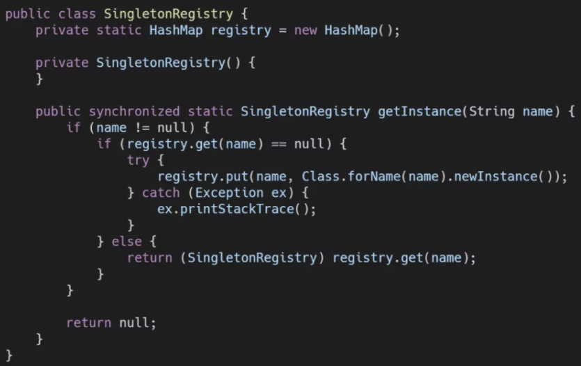

# 设计模式

## 1. 简述

设计模式（Design Pattern）是前辈们对代码开发经验的总结，是解决特定问题的一系列套路。它不是语法规定，而是一套用来提高代码可复用性、可维护性、可读性、稳健性以及安全性的解决方案。

## 2. 网络参考资料

- [设计模式内容聚合](https://mp.weixin.qq.com/s?__biz=MzI4Njc5NjM1NQ==&mid=2247487936&idx=2&sn=02c48b88fa45a32e55b99fa0be610a29&chksm=ebd62eecdca1a7faccf9f26d17bd2108e1b8939421640f71f1ebf5f14b621448ac05ad168a00&mpshare=1&scene=1&srcid=#rd)
- [Java设计模式：23种设计模式全面解析（超级详细）](http://c.biancheng.net/design_pattern/)

# 单例设计模式（Singleten Pattern）

> 框架中会经常出现单例类

## 1. 单例的特点

1. 类在程序的运行过程中只有一个对象(实例)。
2. 私有构造方法，不能让外界创建该类的对象。
3. 类必须提供一个静态公共方法返回该类的对象。

## 2. 单例实现方式（饿汉式）

- 当类加载时，就立即创建该单例对象。
- 饿汉式是线程安全的。
- 实现步骤：
    1. 定义一个静态的对象成员变量
    2. 要私有构造方法，如果不处理，系统会自动提供一个无参的构造方法。外界就可以直接new对象
    3. 定义一个静态的成员方法，用来获取创建好的对象成员，一般命名用 `getInstance()`

```java
/**
 * 单例类，饿汉式：非懒加载。
 * 当类加载时，就立即创建该单例对象。以空间换时间
 */
public class EagerSingleton {

    // 定义一个静态的成员变量，在类加载完成之后都已经完成了初始化赋值的操作。
    private static EagerSingleton instance = new EagerSingleton();

    // 注意：要私有构造方法，如果不处理，系统会自动提供一个无参的构造方法。
    // 保证其他类对象使用时不能直接new一个新的实例
    private EagerSingleton() {
    }

    // 定义一个静态的成员方法，用来获取创建好的成员对象
    public static EagerSingleton getInstance() {
        return instance;
    }
}
```

> 涉及知识点提示：所有的静态成员在类加载完成之后都已经完成了初始化赋值的操作。也就是`EagerSingleton`类的私有构造函数会被调用，实例会被创建。还有就是构造函数要使用`private`修饰，为了防止使用`new`关键字来创建一个新的实例，就会变成“多例”并存的情况。

## 3. 单例实现方式（懒汉式）

- 当外界第一次要使用该类的对象时，如果还没有创建出来，则创建该单例对象。
- 懒汉式是线程不安全的，要处理线程安全问题。从性能上考虑，一般选择同步代码块去处理线程安全问题。
- 实现步骤：
    1. 定义一个静态的对象成员变量
    2. 要私有构造方法，如果不处理，系统会自动提供一个无参的构造方法。外界就可以直接new对象
    3. 定义一个静态的成员方法，用来获取对象成员，一般命名用 `getInstance`
    4. 需要考虑线程安全的问题。
    5. 第一种是使用同步方法，增加 synchronized，在方法内再进行判断对象是否为空，如果为空，就直接创建。
    6. 第二种是使用同步代码块，一开始先判断对象是否为空，为了性能的问题，为了后面的线程不再需要加锁；同步对象写，`LazySingleton.class` 保证锁对象被所有对象共享；

注：同步方法块中的也要做if判断，因为可能在`instance==null`前已经多个线程进来，如果不做判断，当前一个线程创建对象后，其他线程也可以抢到锁再进入创建对象。

```java
package com.moon.design.singleten;

/**
 * 单例类，懒加载
 * 懒汉式：当外界第一次要使用该类的对象时，如果还没有创建出来，则创建该单例对象。
 */
public class LazySingleton {

    // 定义一个静态的对象成员变量
    private static LazySingleton instance;

    // 要私有构造方法，如果不处理，系统会自动提供一个无参的构造方法。
    private LazySingleton() {
    }

    // 定义一个静态的成员方法，用来获取创建好的成员对象(同步代码块)
    public static LazySingleton getInstance1() {
        // 判断如果之前对象不存在就进行创建，再加个判断，为了性能的问题，为了后面的线程不再需要加锁
        if (instance == null) {
            // 为了解决线程安全问题，需要同步代码块，LazySingleton.class保证锁对象被所有对象共享
            // 如果在 instance==null 前已经有多个线程进来，所以同步方法块中的if判断不能省略
            // 在synchronized锁定代码中，需要再次进行是否为null检查。这种方法叫做双重检查锁定（Double-Check Locking）。
            synchronized (LazySingleton.class) {
                if (instance == null) {
                    instance = new LazySingleton();
                }
            }
        }
        return instance;
    }

    // 定义一个静态的成员方法，用来获取创建好的成员对象(同步方法)
    public static synchronized LazySingleton getInstance2() {
        // 判断如果之前对象不存在就进行创建
        if (instance == null) {
            instance = new LazySingleton();
        }
        return instance;
    }
}
```

> 提示：虽然懒汉模式在资源利用率上有一定优势，但是懒汉模式在高并发场景，也就是多线程场景下，遇到的问题也比较多。为了防止多个线程同时调用`getInstance`方法，需要在该方法前面增加关键字`synchronized`进行线程访问锁定。但是这样就引出了新的问题，在高并发场景下，每次调用都进行线程访问锁定判断，会对系统性能产生较大的负面影响。
>
> 上面示例中，为了解决高并发中的线程安全问题，在`synchronized`锁定代码中，需要再次进行是否为null检查。这种方法叫做双重检查锁定（Double-Check Locking）

## 4. 单例实现方式（静态内部类实现式）

> mybatis框架，在创建`VFS`类单例实例使用了此种方式。具体参考框架的`org.apache.ibatis.io.VFS`类

- 静态内部类的实例方式，是利用JVM加载静态类的特性来实现。
- 静态内部类实现式是线程安全的。
- 实现步骤：
    1. 定义一个静态的内部类
    2. 要私有构造方法，如果不处理，系统会自动提供一个无参的构造方法。外界就可以直接new对象
    3. 定义一个静态的成员方法，用来获取对象成员，一般命名用 `getInstance`
    4. 在内部类中定义静态的成员变量，类型是外部类类型，初始化时调用外部类的构造函数，创建外部类的实例，是真正的实例变量。
    5. 在`getInstance`的静态方法中，返回内部类的静态成员变量（*外部类的实例*）

```java
package com.moon.design.singleten;

/**
 * 单例类实现，静态内部类实现式
 */
public class HolderSingleton {

    private HolderSingleton() {
    }

    /*
     * 当getInstance方法第一次被调用的时候，它第一次读取InstanceHolder.INSTANCE时，会触发InstanceHolder类的初始化。
     * 而InstanceHolder类在装载并被初始化的时候，会初始化它的静态成员变量、静态域，从而创建HolderSingleton的实例。
     * 由于是静态的域，因此只会在虚拟机装载类的时候初始化一次，并由虚拟机来保证它的线程安全性。
     * 这个模式的优势在于，getInstance方法并没有做线程同步控制，并且只是执行一个域的访问，因此延迟初始化并没有增加任何访问成本。
     */
    public static HolderSingleton getInstance() {
        return InstanceHolder.INSTANCE;
    }

    /* 内部类前面加static关键字，表示的是类级内部类，类级内部类只有在使用时才会被加载 */
    private static class InstanceHolder {
        // 静态变量的初始化是由JVM保证线程安全的，在类的加载时就完成了静态变量的赋值
        static final HolderSingleton INSTANCE = new HolderSingleton();
    }
}
```

> 涉及知识提示：虽然内部类中的成员变量`INSTANCE`是被`static`修改，但这个是懒加载的，原因是<font color=red>**内部类前面加`static`关键字，表示的是类级内部类，类级内部类只有在使用时才会被加载。**</font>
>
> 具体的执行流程是：当`getInstance`方法第一次被调用的时候，它第一次读取`InstanceHolder.INSTANCE`时，会触发`InstanceHolder`类的初始化。而`InstanceHolder`类在装载并被初始化的时候，会初始化它的静态成员变量、静态域，从而创建`HolderSingleton`的实例。由于是静态的域，因此只会在虚拟机装载类的时候初始化一次，并静态变量的初始化是由虚拟机（JVM）来保证它的线程安全性，在内存只会存在一份，<u>*jvm的初始化时是线程互斥的（待日后理解）*</u>。这个模式的优势在于，`getInstance`方法并没有做线程同步控制，并且只是执行一个域的访问，因此延迟初始化并没有增加任何访问成本。

## 5. 单例实例方式（枚举式）

使用枚举来实现单例模式

```java
public enum EnumSingleton {
    instance;
}
```

首先创建Enum时，编译器会自动生成一个继承自`java.lang.Enum`的类，枚举成员声明中被`static`和`final`所修饰，虚拟机会保证这些静态成员在多线程环境中被正确的加锁和同步，所以是线程安全的。编译后生成的类代码如下：

```java
class EnumSingleton extends Enum {
    public static final EnumSingleton instance;
    ....省略
}
```

`Enum`的构造方法本身就是`private`修饰的，所以也防止了使用`new`关键字创建新实例。从Enum类的声明中也可以看出，Enum是提供了序列化的支持的，在某些需要序列化的场景下，提供了非常大的便利。另一个重要功能就是反序列化仍然可以保证对象在虚拟机范围内是单例的。

## 6. 单例实例方式（单例注册表式）

单例注册表来实现单例模式，Spring框架就是最有代表性的使用者。



其实实现原理很容易理解，以一个`HashMap`（Spring是使用了线程安全的`ConcurrentHashMap`）来存储目前已生成的类的实例，如果可以根据类名找到对象，就返回这个对象，不再创建新对象。如果找不到，就利用反射机制创建一个，并加入到Map中。以上只是一个示意代码，作为Spring核心理念IoC的重要部分，单例注册表在Spring中的源码要复杂的多，也做了很多性能上的优化，具体可以参考Spring中`AbstractBeanFactory`类的源码。

## 7. 会使用到单例类的案例

- 一个类只要一个对象的时候
- 视频播放器，音频播放器
- 数据库的连接
- 设置信息

## 8. 其他小问题

开发中一般使用饿汉式，面试的时候使用懒汉式

# 模板方法设计模式（整理中！）

## 1. 定义与特点

模板方法（Template Method）模式的定义：定义一个操作中的算法骨架，而将算法的一些步骤延迟到子类中，使得子类可以不改变该算法结构的情况下重定义该算法的某些特定步骤。它是一种类行为型模式。

模式的主要优点如下：

1. 它封装了不变部分，扩展可变部分。它把认为是不变部分的算法封装到父类中实现，而把可变部分算法由子类继承实现，便于子类继续扩展。
2. 它在父类中提取了公共的部分代码，便于代码复用。
3. 部分方法是由子类实现的，因此子类可以通过扩展方式增加相应的功能，符合开闭原则。

该模式的主要缺点如下：

1. 对每个不同的实现都需要定义一个子类，这会导致类的个数增加，系统更加庞大，设计也更加抽象，间接地增加了系统实现的复杂度。
2. 父类中的抽象方法由子类实现，子类执行的结果会影响父类的结果，这导致一种反向的控制结构，它提高了代码阅读的难度。
3. 由于继承关系自身的缺点，如果父类添加新的抽象方法，则所有子类都要改一遍。

# 建造者模式（Builder Pattern）（整理中！）

## 1. 定义与特点

建造者（Builder）模式的定义：指将一个复杂对象的构造与它的表示分离，使同样的构建过程可以创建不同的表示，这样的设计模式被称为建造者模式。它是将一个复杂的对象分解为多个简单的对象，然后一步一步构建而成。它将变与不变相分离，即产品的组成部分是不变的，但每一部分是可以灵活选择的。

- 该模式的主要优点如下：
1. 封装性好，构建和表示分离。
2. 扩展性好，各个具体的建造者相互独立，有利于系统的解耦。
3. 客户端不必知道产品内部组成的细节，建造者可以对创建过程逐步细化，而不对其它模块产生任何影响，便于控制细节风险。

- 其缺点如下：
1. 产品的组成部分必须相同，这限制了其使用范围。
2. 如果产品的内部变化复杂，如果产品内部发生变化，则建造者也要同步修改，后期维护成本较大。

建造者（Builder）模式和工厂模式的关注点不同：建造者模式注重零部件的组装过程，而工厂方法模式更注重零部件的创建过程，但两者可以结合使用。

## 2. 结构与实现

<font color=red>**建造者（Builder）模式由产品、抽象建造者、具体建造者、指挥者等 4 个要素构成**</font>

# 策略模式（Strategy Pattern）(整理中！)


# 装饰器模式(整理中！)

## 1. 定义与特点

装饰器（Decorator）模式的定义：指在不改变现有对象结构的情况下，动态地给该对象增加一些职责（即增加其额外功能）的模式，它属于对象结构型模式。

装饰器模式的主要优点有：

- 装饰器是继承的有力补充，比继承灵活，在不改变原有对象的情况下，动态的给一个对象扩展功能，即插即用
- 通过使用不用装饰类及这些装饰类的排列组合，可以实现不同效果
- 装饰器模式完全遵守开闭原则

其主要缺点是：装饰器模式会增加许多子类，过度使用会增加程序得复杂性。


# 责任链模式（职责链模式）(整理中！)

## 1. 定义与特点

责任链（Chain of Responsibility）模式的定义：为了避免请求发送者与多个请求处理者耦合在一起，于是将所有请求的处理者通过前一对象记住其下一个对象的引用而连成一条链；当有请求发生时，可将请求沿着这条链传递，直到有对象处理它为止。

