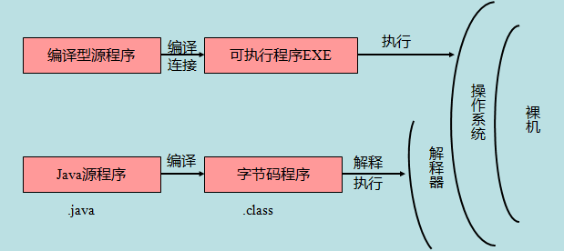

# Java 基础语法

一个 Java 程序可以认为是一系列对象的集合，而这些对象通过调用彼此的方法来协同工作。一个基础的程序涉及如下的概念：

- **对象**：对象是类的一个实例，有状态和行为。例如，一条狗是一个对象，它的状态有：颜色、名字、品种；行为有：摇尾巴、叫、吃等。
- **类**：类是一个模板，它描述一类对象的行为和状态。
- **方法**：方法就是行为，一个类可以有很多方法。逻辑运算、数据修改以及所有动作都是在方法中完成的。
- **实例变量**：每个对象都有独特的实例变量，对象的状态由这些实例变量的值决定。

编写 Java 程序时，应注意以下几点：

- 大小写敏感：Java 是大小写敏感的，这就意味着标识符 `Hello` 与 `hello` 是不同的。
- 类名：对于所有的类来说，类名的首字母应该大写。如果类名由若干单词组成，那么每个单词的首字母应该大写，例如 `MyFirstJavaClass`
- 方法名：所有的方法名都应该以小写字母开头。如果方法名含有若干单词，则后面的每个单词首字母大写。
- 源文件名：源文件名必须和类名相同。当保存文件的时候，你应该使用类名作为文件名保存（切记 Java 是大小写敏感的），文件名的后缀为 `.java`。（如果文件名和类名不相同则会导致编译错误）。
- 主方法入口：所有的 Java 程序由 `public static void main(String[] args)` 方法开始执行。

Java 源程序与编译型运行区别



## 1. Java 关键字

以下是 Java 关键字汇总表。*其中保留字不能用于常量、变量、和任何标识符的名称*。

> 后续在各个知识点中再详细说明

### 1.1. 访问控制

|    关键字    |   说明   |
| :---------: | -------- |
|  `private`  | 私有的   |
| `protected` | 受保护的 |
|  `public`   | 公共的   |
|  `default`  | 默认     |

### 1.2. 类、方法和变量修饰符

|     关键字      |             说明             |
| :------------: | ---------------------------- |
|   `abstract`   | 声明抽象                      |
|    `class`     | 类                           |
|   `extends`    | 扩充，继承                    |
|    `final`     | 最终值，不可改变的             |
|  `implements`  | 实现（接口）                  |
|  `interface`   | 接口                         |
|    `native`    | 本地，原生方法（非 Java 实现） |
|     `new`      | 新，创建                      |
|    `static`    | 静态                         |
|   `strictfp`   | 严格，精准                    |
| `synchronized` | 线程，同步                    |
|  `transient`   | 短暂                         |
|   `volatile`   | 易失                         |

### 1.3. 程序控制语句

|    关键字     |           说明            |
| :----------: | ------------------------ |
|   `break`    | 跳出循环                  |
|  `continue`  | 继续                      |
|  `default`   | 默认                      |
|     `do`     | 运行                      |
|    `else`    | 否则                      |
|    `for`     | 循环                      |
|     `if`     | 如果                      |
| `instanceof` | 实例                      |
|   `return`   | 返回                      |
|   `switch`   | 根据值选择执行             |
|    `case`    | 定义一个值以供 switch 选择 |
|   `while`    | 循环                      |

### 1.4. 错误处理

|   关键字   |         说明         |
| :-------: | -------------------- |
| `assert`  | 断言表达式是否为真     |
|  `catch`  | 捕捉异常              |
| `finally` | 有没有异常都执行       |
|  `throw`  | 抛出一个异常对象       |
| `throws`  | 声明一个异常可能被抛出 |
|   `try`   | 捕获异常              |

### 1.5. 包相关

|   关键字   | 说明 |
| :-------: | ---- |
| `import`  | 引入 |
| `package` | 包   |

### 1.6. 基本类型

|   关键字   |    说明    |
| :-------: | --------- |
| `boolean` | 布尔型     |
|  `byte`   | 字节型     |
|  `char`   | 字符型     |
| `double`  | 双精度浮点 |
|  `float`  | 单精度浮点 |
|   `int`   | 整型       |
|  `long`   | 长整型     |
|  `short`  | 短整型     |

### 1.7. 变量引用

|  关键字  |   说明    |
| :-----: | --------- |
| `super` | 父类，超类 |
| `this`  | 本类      |
| `void`  | 无返回值   |

### 1.8. 保留关键字

|  关键字  |        说明         |
| :-----: | ------------------ |
| `goto`  | 是关键字，但不能使用 |
| `const` | 是关键字，但不能使用 |

## 2. Java 对象和类

### 2.1. 概念

- **类**：是一个模板，它描述一类对象的行为和状态。
- **对象**：是类的一个实例，有状态和行为。

### 2.2. 类的定义

使用 `class` 关键字来定义类。语法如下：

```java
public class 类的名称 {
}
```

#### 2.2.1. 类的内容

一个类可以包含以下类型变量：

- **局部变量**：在方法、构造方法或者语句块中定义的变量被称为局部变量。变量声明和初始化都是在方法中，方法结束后，变量就会自动销毁。
- **成员变量**：成员变量是定义在类中，方法体之外的变量。这种变量在创建对象的时候实例化。成员变量可以被类中方法、构造方法和特定类的语句块访问。
- **类变量**：类变量也声明在类中，方法体之外，但必须声明为 `static` 类型。

一个类可以拥有多个方法，在上面的例子中：`eat()`、`run()`、`sleep()` 都是 Dog 类的方法。

示例：

```java
public class Dog {
    String breed;
    int size;
    static String color;
    int age;
 
    void eat(String food) {
    }
 
    void run() {
    }
 
    void sleep(){
    }
}
```

#### 2.2.2. 构造方法

每个类都有构造方法。如果没有显式地为类定义构造方法，Java 编译器将会为该类提供一个默认无参构造方法。

在创建一个对象的时候，至少要调用一个构造方法。构造方法的名称必须与类同名，一个类可以有多个构造方法。

```java
public class Puppy{
    // 默认无参构造方法
    public Puppy(){
    }
 
    // 这个构造器仅有一个参数：name
    public Puppy(String name){    
    }
}
```

**构造方法的特性**：

- 名字与类名相同
- 没有返回值，也不能使用 void 声明构造函数
- 创建类的对象时自动调用

> Notes: 
>
> 1. 构造方法会在创建对象的时候自动调用
> 2. 在创建的时候，构造方法只会被调用一次。而类的其他方法，可以通过对象来反复调用多次
> 3. 如果在类中手动定义了构造方法后，则**不会再为该类提供默认的无参构造方法**。

### 2.3. 对象

使用一个类，其实就是使用该类的成员(成员变量和成员方法)。而要想使用一个类的成员，就必须首先拥有该类的对象。

#### 2.3.1. 创建对象

对象是根据类创建的。在Java中，使用关键字 new 来创建一个新的对象。创建对象需要以下三步：

- 声明：声明一个对象，包括对象名称和对象类型。
- 实例化：使用关键字 `new` 来创建一个对象。
- 初始化：使用 `new` 创建对象时，会调用构造方法初始化对象。

```java
类名 对象名 = new 类名();
```

#### 2.3.2. 访问实例变量和方法

通过已创建的对象来访问成员变量和成员方法，如下所示：

```java
/* 实例化对象 */
Object referenceVariable = new Constructor();
/* 访问类中的变量 */
referenceVariable.variableName;
/* 访问类中的方法 */
referenceVariable.methodName();
```

> 注：示例的变量与方法均为 `public` 修饰

#### 2.3.3. Java中使用变量，遵循“就近原则”

在使用变量时需要遵循的原则为：**就近原则**。顺序如下：

局部 -> 本类成员 -> 父类成员 -> Object 有就使用，没有就报错。

### 2.4. 成员变量和局部变量的区别

1. 在类中的位置不同
    - 成员变量：类中，方法外
    - 局部变量：方法中或者方法声明上(形式参数)
2. 作用域不同
    - 成员变量：针对整个类有效
    - 局部变量：只在某个范围内有效。(一般指的就是方法块内)
3. 在内存中存储的位置不同
    - 成员变量：存储在堆内存中
    - 局部变量：存储在栈内存中
4. 生命周期不同
    - 成员变量：随着对象的创建而存在，随着对象的消失而消失
    - 局部变量：在方法被调用，或者语句被执行的时候存在；当方法调用完，或者语句结束后，就自动释放
5. 初始化值的问题
    - 成员变量：有默认值(int/byte/short/lnng 默认是 0；char 默认是 `\u0000`；double/float 默认是 0.0；boolean 默认是 false)
    - 局部变量：没有默认值。必须先定义，赋值，才能使用


## 3. 权限修饰符

**权限大小顺序**：`private < 默认 < protected < public`

- public: 任意包下任意类都可以访问；
- protected: 任意包下任意子类都可以访问或同包下的任意类
- 默认(包权限): 同包下的任意类都可以访问
- private: 只能在本类中使用

**修饰符权限列表图**：

|                       | public | protected | 空的（default） | private |
| --------------------- | :----: | :-------: | :-------------: | :-----: |
| 同一类中               |   ✔    |     ✔     |       ✔       |    ✔    |
| 同一包中（子类与无关类） |   ✔    |     ✔     |       ✔       |         |
| 不同包的子类            |   ✔    |     ✔     |                 |         |
| 不同包中的无关类         |   ✔    |           |                 |         |

> 类的成员不写访问修饰时默认为`default`。默认对于同一个包中的其他类相当于公开（`public`），对于不是同一个包中的其他类相当于私有（`private`）。受保护（`protected`）对子类相当于公开，对不是同一包中的没有父子关系的类相当于私有。

- **总结：在日常开发过程中，编写的类、方法、成员变量的访问**
    - 要想仅能在本类中访问使用 private 修饰;
    - 要想本包中的类都可以访问不加修饰符即可;
    - 要想本类与子类可以访问使用 protected 修饰;
    - 要想任意包中的任意类都可以访问使用 public 修饰;
- **注意项总结**：
    - 如果类用 `public` 修饰，则类名必须与文件名相同。一个文件中只能有一个 `public` 修饰的类。
    - Java 中，外部类的修饰符只能是 `public` 或默认 ，类的成员（包括内部类）的修饰符可以是以上四种。

## 4. 类、方法和变量修饰符

实现一些其他的功能，Java 也提供了许多非访问修饰符。

- static 修饰符，用来修饰类方法和类变量。
- final 修饰符，用来修饰类、方法和变量，final 修饰的类不能够被继承，修饰的方法不能被继承类重新定义，修饰的变量为常量，是不可修改的。
- abstract 修饰符，用来创建抽象类和抽象方法。
- synchronized 和 volatile 修饰符，主要用于线程的编程。

### 4.1. static 关键字

#### 4.1.1. 概述

`static` 是一个修饰符。可以用于修饰成员变量，成员方法以及代码块。

<font color=red>**`static` 关键字的主要意义是，在于创建独立于具体对象的域变量或者方法。以致于即使没有创建对象，也能使用属性和调用方法！还有一个比较关键的作用就是，用来形成静态代码块以优化程序性能。**</font>

#### 4.1.2. static 修饰变量

有 static 修饰的变量，称为静态变量（类变量）。没有 static 修饰的变量，称为成员变量（实例变量）。

static 关键字用来声明的静态变量是独立于对象的，静态成员变量是属于类，不再属于某个对象，会被该类的所有对象共享。无论一个类实例化多少对象，它的静态变量只有一份拷贝。若有一个对象修改了静态变量的值，其他对象会受影响。

```java
private static 类型 变量名称 = 值;
```

建议使用类名访问(`类名.xxx`)静态属性，不推荐使用对象访问(`对象名.xxx`)。

> Notes: <font color=red>**static 修饰的成员变量，在类的加载过程中，JVM只为静态变量分配一次内存空间。而初始化的顺序是按照定义顺序来进行**</font>

#### 4.1.3. static 修饰方法

使用 static 修饰的方法，称为静态方法（类方法）。没有 static 修饰的方法，称为成员方法（实例对象方法）。

static 关键字用来声明独立于对象的静态方法。静态方法中不能使用类的非静态变量。静态方法从参数列表得到数据，然后计算这些数据。

```java
public static void foo() {
    // ...
}
```

可以通过类名直接调用静态方法（推荐），即 `类名.静态方法`；也可以使用实例调用（不推荐），即 `对象.静态方法`

#### 4.1.4. static 修饰代码块

被 `static` 修饰的代码块称为“静态代码块”，可以定义在类中的任意位置，并且可以定义多个。在类初次被加载的时候，会按照定义的顺序来执行每个 static 代码块，并且只会执行一次。静态代码块的执行优先级高于非静态的代码块。

```java
// 静态代码块
static {
    // ...
}

// 非静态代码块
{
    // ...
}
```

> Tips: 根据静态代码只会在类加载的时候执行一次的特性。因此最常见的应用场景就是，将一些只需要进行一次的初始化操作都放在 static 代码块中进行。

#### 4.1.5. static 修饰类【只能修饰内部类也就是静态内部类】（待整理）

static 修饰类，只能用于修饰内部类也就是静态内部类

#### 4.1.6. 静态导包（待整理）

TODO: 待整理

#### 4.1.7. 总结

##### 4.1.7.1. 静态成员变量和成员变量的区别

1. 语法区别
	- 静态成员变量：有 static 修饰的;
	- 成员变量：没有 static 修饰的;
2. 数量区别
	- 静态成员变量：在内存中只存在一份，在类的加载过程中，JVM只为静态变量分配一次内存空间并初始化一次，会受每一个对象的影响
	- 成员变量：每创建一个对象，都会为成员变量分配内存。每一个对象都有一份自己的成员变量。互不干扰的。
3. 生命周期区别
	- 静态成员变量：在类加载的时候完成内存分配并初始化。(类只会加载一次)。跟随类的卸载面销毁。
	- 成员变量：在创建对象的时候完成内存分配和初始化。跟随对象的销毁而销毁。
4. 访问方式区别
	- 静态成员变量：可以通过类名访问(`类.xxx`)，也可以通过对象名访问(不推荐);
	- 成员变量：只能通过对象名访问(`对象名.xxx`);

##### 4.1.7.2. 静态方法和成员方法的区别

1. 调用方式
    - 静态方法可以通过类名调用(`类.xxx`)，也可以通过对象名调用(不推荐);
    - 成员方法只能通过对象名调用(`对象名.xxx`);
2. 成员的访问限制
    - 静态方法中不能访问非静态成员(成员变量和成员方法)，只能访问带有 `static` 修饰的静态变量
    - 成员方法则无成员的访问限制。如果在本类中，直接通过成员变量名或方法名来使用，在其他类中，需要(`类名.成员变量名`)或(`类.方法名`)才能使用;

##### 4.1.7.3. static 的注意事项

静态方法中不能使用 `this` 和 `super` 关键字。(因为 `this` 是代表当前对象的引用，如果没有创建对象， `this` 没有任何意义。)

##### 4.1.7.4. static 使用场景

**静态变量**

- 当某个成员变量在值需要在该类的所有对象共享时就可以将该变量定义为静态成员变量

**静态方法**

- 如果方法中没有使用任何非静态成员，就可以将该方法定义为静态方法;(因为静态方法可以直接用类名调用(`类.xxx)`，比较方便)
- 定义工具类时，如果一个类中的所有方法都是静态方法，则该类可以认为是一个工具类

### 4.2. final 关键字

#### 4.2.1. final 概述

final 也是一个修饰符。可以修饰变量、方法、类

#### 4.2.2. final 修饰变量

- 修饰基本数据类型的变量：被它修饰的变量其实是一个常量(常量命名是全部字母大写，多个单词用“_”分隔)，只能赋值一次，不能再修改。
    - 常见格式: `public static final int NUM = 10;`
- 修饰引用数据类型变量：此时该引用变量就不能再指向其他对象，但可以修改已经指向对象的成员变量的值(只要该成员变量不是使用 final 修饰)。(相当于此引用变量的地址值固定，不能改变)

#### 4.2.3. final 修饰方法

- 该方法不能被子类重写。使用final修饰方法有以下两个原因
    - 第一个原因是把方法锁定，以防任何继承类修改它的含义；
    - 第二个原因是效率。在早期的 Java 实现版本中，会将final 方法转为内嵌调用。但是如果方法过于庞大，可能看不到内嵌调用带来的任何性能提升（现在的 Java 版本已经不需要使用 final 方法进行这些优化了）。类中所有的 private 方法都隐式地指定为 final。

```java
// 原代码
public static void test(){
    String s1 = "包夹方法a";
    a();
    String s2 = "包夹方法a";
}

public static final void a(){
    System.out.println("我是方法a中的代码");
    System.out.println("我是方法a中的代码");
}

// 经过编译后
public static void test(){
    String s1 = "包夹方法a";
    System.out.println("我是方法a中的代码");
    System.out.println("我是方法a中的代码");
    String s2 = "包夹方法a";
}
```

#### 4.2.4. final 修饰类

- 使用 final 修饰类的目的简单明确：表明该类不能再被其他类继承。
- 被 final 修饰的类中，所有成员方法都会被隐式地指定为 final 方法。(就不存在方法重写的情况，只能创建对象和调用。)

```java
public final class Xxx{
}
```

#### 4.2.5. final 注意事项

当引用变量使用 final 修饰时，表示其指向的地址值不能发生改变，但指向对象的成员变量值可以改变。

## 5. volatile 关键字

作用：`volatile` 关键字是用于修饰共享变量。每个线程要操作变量时会从主内存中将变量拷贝到本地内存作为副本，当线程操作变量副本并写回主内存后，会通过 CPU 总线嗅探机制告知其他线程该变量副本已经失效，需要重新从主内存中读取。

`volatile` 保证了不同线程对共享变量操作的可见性，也就是说一个线程修改了 `volatile` 修饰的变量，当修改后的变量写回主内存时，其他线程能立即看到最新值。

### 5.1. 总结

- `volatile` 修饰符适用于以下场景：某个属性被多个线程共享，其中有一个线程修改了此属性，其他线程可以立即得到修改后的值；或者作为状态变量，如 `flag = ture`，实现轻量级同步。
- `volatile` 属性的读写操作都是无锁的，它不能替代 `synchronized`，因为它没有提供原子性和互斥性。因为无锁，不需要花费时间在获取锁和释放锁上，所以说它是低成本的。
- `volatile` 只能作用于属性，当使用 `volatile` 修饰属性，这样编译器就不会对这个属性做指令重排序。
- `volatile` 提供了可见性，任何一个线程对其的修改将立马对其他线程可见。`volatile` 属性不会被线程缓存，始终从主存中读取。
- `volatile` 提供了 happens-before 保证，对 `volatile` 变量 V 的写入 happens-before 所有其他线程后续对 V 的读操作。
- `volatile` 可以使纯赋值操作是原子的，如 `boolean flag = true; falg = false;`。
- `volatile` 可以在单例双重检查中实现可见性和禁止指令重排序，从而保证安全性。

## 6. 包 package

### 6.1. 包的概述

- 包就是文件夹。
- 分包管理是组织软件项目结构的基本方式。我们将同类功能放到一个包中，方便管理。并且日常项目的分工也是以包作为边界。
- 包在文件系统中是以文件夹的形式存在的。类中定义的包必须与实际class件所在的文件夹情况相统一，即定义包时类在a包下，则生成的.class 文件必须在a文件夹下，否则找不到类。

### 6.2. 包的作用

- 避免类命名冲突。
- 将功能相似或相关的类和接口组织在同一个文件夹，方便类的查找和使用。

### 6.3. 包的定义格式

- 定义格式：`package com.qq.包名1.xxx...;`
- 规范：一般以公司域名倒着写，最后是功能内容的分类。即 `www.qq.com ===> com.qq.login`
- 多级包使用“.”分割，包名全部小写英文字母，一般不用数字。

### 6.4. 包的注意事项

- 定义包的语句必须是类中第一行语句。
- 如果定义多个类，只能有一个是 public 修饰。且文件名一定要与 public 修饰的类名一致。
- 类和所生成的 class 必须在相同的目录结构下。

### 6.5. 类的访问方式

- 带包类全名访问
  
    - 当在一个类中需要使用两个不同包下同名的类时，只能有一个类被导包，另一个类只能使用类全名方式访问。
- 不带包名访问
    - 被使用的类在java.lang包下。
    - 被使用的类和当前类是在同一个包下。
    - 使用导包方式访问。
- 跨包导包访问
    - 导包格式

    ```java
    import 包名.包名.xxx...类名;
    import java.util.*;	// 将指定包下的所有类导入
    ```

    - 导包位置：**package 的下面，class 的上面**
- 跨包导包访问注意事项
  
    - 如果在一个类中需要使用不同包下相同类名的类，只能有一个被导包，其他只能通过类全名访问。

code demo

```java
package com.moon.packaeg;
import com.moon.statci.Student;

public class Test01 {
    public static void main(String[] args) {
        // 创建Person对象
        // 带包类全名访问:不需要导入
        com.moon.packaeg.Person p = new com.moon.packaeg.Person();

        // 创建学生对象
        Student s = new Student();

        // 在java.lang包下的类：不需要导包
        String str = "nihao";

        com.moon.finla.Student s1 = new com.moon.finla.Student();
        s1.sleep();

        Person p1 = new Person();
    }
}
```


## 7. 可变参数

### 7.1. 可变参数概述

- **JDK1.5的新特性**，方法的参数类型相同，但是个数变化。
- **可变参数可以多个，也可以不传值**。

### 7.2. 可变参数格式

- 使用前提：数据类型明确，参数个数任意。
- 语法定义：`数据类型…` **【注意是3个点(.)】**

```java
修饰符 返回值类型 方法名(数据类型… 变量名) {
}
```

与普通方法相比在参数类型后面添加`…`

### 7.3. 可变参数的本质

可变参数方法本质是数组。所以不可以与数组类型参数重载。

### 7.4. 可变参数注意事项

1. 参数列表中只能有一个可变参数
2. 如果出现不同类型的参数，可变参数必须放在参数列表的最后

## 8. Java类的初始化顺序

Java类的创建，相应的初始化顺序是：`静态变量` -> `静态代码块` -> `成员变量（全局变量）` -> `初始化代码块` -> `构造函数`。测试示例如下：

```java
public class InitSequenceBean {

    private static String staticStr = initStaticMember();
    private String str = initOrdinaryMember();

    static {
        System.out.println("静态代码块执行了....");
    }

    {
        System.out.println("初始化代码块执行了....");
    }

    public InitSequenceBean() {
        System.out.println("无参构造函数执行了....");
    }

    private static String initStaticMember() {
        System.out.println("静态成员变量初始化....");
        return "123";
    }

    private String initOrdinaryMember() {
        System.out.println("普通成员变量初始化....");
        return "abc";
    }
}
```

测试代码与结果

```java
@Test
public void testInitializationSequence() {
    InitSequenceBean bean = new InitSequenceBean();
    System.out.println(bean);
    /*
     * 测试结果：
     *  静态成员变量初始化....
     *  静态代码块执行了....
     *  普通成员变量初始化....
     *  初始化代码块执行了....
     *  无参构造函数执行了....
     *  com.moon.java.basic.InitSequenceBean@ba8a1dc
     */
}
```

## 9. Java 运算符

计算机的最基本用途之一就是执行数学运算，作为一门计算机语言，Java 也提供了一套丰富的运算符来操纵变量。运算符主分成以下几类：

- 算术运算符
- 关系运算符
- 位运算符
- 逻辑运算符
- 赋值运算符
- 其他运算符

### 9.1. 算术运算符

算术运算符用在数学表达式中，它们的作用和在数学中的作用一样。下表列出了所有的算术运算符。

> 表格中的实例假设整数变量A的值为10，变量B的值为20：

| 操作符 |              描述               |          例子          |
| :----: | ------------------------------ | ---------------------- |
|  `+`   | 加法 - 相加运算符两侧的值         | `A + B` 等于 30        |
|  `-`   | 减法 - 左操作数减去右操作数       | `A – B` 等于 -10       |
|  `*`   | 乘法 - 相乘操作符两侧的值         | `A * B` 等于 200       |
|  `/`   | 除法 - 左操作数除以右操作数       | `B / A` 等于 2         |
|  `％`  | 取余 - 左操作数除以右操作数的余数 | `B%A` 等于 0           |
|  `++`  | 自增: 操作数的值增加1            | `B++` 或 `++B` 等于 21 |
|  `--`  | 自减: 操作数的值减少1            | `B--` 或 `--B` 等于 19 |

示例：

```java
public class Test {
    public static void main(String args[]) {
        int a = 10;
        int b = 20;
        int c = 25;
        int d = 25;
        System.out.println("a + b = " + (a + b)); // a + b = 30
        System.out.println("a - b = " + (a - b)); // a - b = -10
        System.out.println("a * b = " + (a * b)); // a * b = 200
        System.out.println("b / a = " + (b / a)); // b / a = 2
        System.out.println("b % a = " + (b % a)); // b % a = 0
        System.out.println("c % a = " + (c % a)); // c % a = 5
        System.out.println("a++   = " + (a++)); // a++ = 10
        System.out.println("a--   = " + (a--)); // a-- = 11
        // 观察 d++ 与 ++d 的不同
        System.out.println("d++   = " + (d++)); // d++ = 25
        System.out.println("++d   = " + (++d)); // ++d = 27
    }
} 
```

#### 9.1.1. 自增自减运算符

自增（`++`）自减（`--`）运算符是一种特殊的算术运算符，在算术运算符中需要两个操作数来进行运算，而自增自减运算符是一个操作数。又分以下两种：

- 前缀自增自减法(`++a`,`--a`)：先进行自增或者自减运算，再进行表达式运算。
- 后缀自增自减法(`a++`,`a--`)：先进行表达式运算，再进行自增或者自减运算

```java
public static void main(String args[]) {
    int a = 5; // 定义一个变量；
    int b = 5;
    int x = 2 * ++a;
    int y = 2 * b++;
    System.out.println("自增运算符前缀运算后a=" + a + ",x=" + x); // a=6,x=12
    System.out.println("自增运算符后缀运算后b=" + b + ",y=" + y); // b=6,y=10
}
```

### 9.2. 关系运算符

算术运算符用在数学表达式中，它们的作用和在数学中的作用一样。下表列出了所有的算术运算符。

> 表格中的实例假设整数变量A的值为10，变量B的值为20：

| 运算符 |                           描述                           |        例子        |
| :----: | -------------------------------------------------------- | ----------------- |
|  `==`  | 检查如果两个操作数的值是否相等，如果相等则条件为真            | `A == B` 为 false |
|  `!=`  | 检查如果两个操作数的值是否相等，如果值不相等则条件为真         | `A != B` 为 true  |
|  `>`   | 检查左操作数的值是否大于右操作数的值，如果是那么条件为真       | `A > B` 为 false  |
|  `<`   | 检查左操作数的值是否小于右操作数的值，如果是那么条件为真       | `A < B` 为 true   |
|  `>=`  | 检查左操作数的值是否大于或等于右操作数的值，如果是那么条件为真 | `A >= B` 为 false |
|  `<=`  | 检查左操作数的值是否小于或等于右操作数的值，如果是那么条件为真 | `A <= B` 为 true  |

示例：

```java
public static void main(String args[]) {
    int a = 10;
    int b = 20;
    System.out.println("a == b = " + (a == b)); // a == b = false
    System.out.println("a != b = " + (a != b)); // a != b = true
    System.out.println("a > b = " + (a > b)); // a > b = false
    System.out.println("a < b = " + (a < b)); // a < b = true
    System.out.println("b >= a = " + (b >= a)); // b >= a = true
    System.out.println("b <= a = " + (b <= a)); // b <= a = false
}
```

### 9.3. 位运算符

Java 定义了位运算符，应用于整数类型(int)，长整型(long)，短整型(short)，字符型(char)，和字节型(byte)等类型。

> 下表列出了位运算符的基本运算，假设整数变量 A 的值为 60 和变量 B 的值为 13：

| 操作符 |                                   描述                                   |              例子              |
| :----: | ------------------------------------------------------------------------ | ------------------------------ |
|  `&`  | 如果相对应位都是1，则结果为1，否则为0                                       | `A & B` 得到12，即0000 1100    |
|  `|`   | 如果相对应位都是0，则结果为0，否则为1                                       | `A | B` 得到61，即 0011 1101   |
|  `^`   | 如果相对应位值相同，则结果为0，否则为1                                       | `A ^ B` 得到49，即 0011 0001   |
|  `〜`  | 按位取反运算符翻转操作数的每一位，即0变成1，1变成0                            | `〜A` 得到-61，即1100 0011     |
|  `<<`  | 按位左移运算符。左操作数按位左移右操作数指定的位数                            | `A << 2` 得到240，即 1111 0000 |
|  `>>`  | 按位右移运算符。左操作数按位右移右操作数指定的位数                            | `A >> 2` 得到15，即 1111       |
| `>>>`  | 按位右移补零操作符。左操作数的值按右操作数指定的位数右移，移动得到的空位以零填充 | `A>>>2` 得到15，即0000 1111    |

位运算符作用在所有的位上，并且按位运算。它们的二进制格式表示将如下：

```
A = 0011 1100
B = 0000 1101
-----------------
A & B = 0000 1100
A | B = 0011 1101
A ^ B = 0011 0001
~A = 1100 0011
```

示例

```java
public static void main(String args[]) {
    int a = 60; /* 60 = 0011 1100 */
    int b = 13; /* 13 = 0000 1101 */
    int c = 0;
    c = a & b;       /* 12 = 0000 1100 */
    System.out.println("a & b = " + c); // a & b = 12

    c = a | b;       /* 61 = 0011 1101 */
    System.out.println("a | b = " + c); // a | b = 61

    c = a ^ b;       /* 49 = 0011 0001 */
    System.out.println("a ^ b = " + c); // a ^ b = 49

    c = ~a;          /*-61 = 1100 0011 */
    System.out.println("~a = " + c); // ~a = -61

    c = a << 2;     /* 240 = 1111 0000 */
    System.out.println("a << 2 = " + c); // a << 2 = 240

    c = a >> 2;     /* 15 = 1111 */
    System.out.println("a >> 2  = " + c); // a >> 2  = 15

    c = a >>> 2;     /* 15 = 0000 1111 */
    System.out.println("a >>> 2 = " + c); // a >>> 2 = 15
}
```

### 9.4. 逻辑运算符

下表列出了逻辑运算符的基本运算，假设布尔变量A为真，变量B为假

| 操作符 |                                     描述                                      |        例子         |
| :----: | ----------------------------------------------------------------------------- | ------------------- |
|  `&&`  | 称为逻辑与运算符。当且仅当两个操作数都为真，条件才为真                              | `A && B` 为 false   |
|  `||`  | 称为逻辑或操作符。如果任何两个操作数任何一个为真，条件为真                          | `A || B` 为 true    |
|  `!`   | 称为逻辑非运算符。用来反转操作数的逻辑状态。如果条件为true，则逻辑非运算符将得到false | `!(A && B)` 为 true |

示例：

```java
public static void main(String args[]) {
    boolean a = true;
    boolean b = false;
    System.out.println("a && b = " + (a && b)); // a && b = false
    System.out.println("a || b = " + (a || b)); // a || b = true
    System.out.println("!(a && b) = " + !(a && b)); // !(a && b) = true
}
```

#### 9.4.1. 短路逻辑运算符

当使用与逻辑运算符时，在两个操作数都为 true 时，结果才为 true，但是当得到第一个操作为 false 时，其结果就必定是 false，这时候就不会再判断第二个操作了。

示例

```java
public static void main(String args[]) {
    int a = 5; // 定义一个变量；
    boolean b = (a < 4) && (a++ < 10);
    System.out.println("使用短路逻辑运算符的结果为" + b); // false
    System.out.println("a的结果为" + a); // 5
}
```

> 解析：该程序使用到了短路逻辑运算符(`&&`)，首先判断 `a<4` 的结果为 `false`，则 b 的结果必定是 `false`，所以不再执行第二个操作 `a++ < 10` 的判断，所以 a 的值为 5

### 9.5. 赋值运算符

下面是Java语言支持的赋值运算符：

| 操作符 |                          描述                          |                   例子                    |
| :----: | ------------------------------------------------------ | ---------------------------------------- |
|  `=`   | 简单的赋值运算符，将右操作数的值赋给左侧操作数              | `C = A + B`将把`A + B`得到的值赋给C        |
|  `+=`  | 加和赋值操作符，它把左操作数和右操作数相加赋值给左操作数     | `C + = A`等价于`C = C + A`                |
|  `-=`  | 减和赋值操作符，它把左操作数和右操作数相减赋值给左操作数     | `C -= A`等价于`C = C - A`                 |
|  `*=`  | 乘和赋值操作符，它把左操作数和右操作数相乘赋值给左操作数     | `C *= A`等价于`C = C * A`                 |
|  `/=`  | 除和赋值操作符，它把左操作数和右操作数相除赋值给左操作数     | `C /= A`，C 与 A 同类型时等价于`C = C / A` |
| `%=`  | 取模和赋值操作符，它把左操作数和右操作数取模后赋值给左操作数 | `C %= A`等价于`C = C%A`                   |
| `<<=`  | 左移位赋值运算符                                         | `C << = 2`等价于`C = C << 2`              |
| `>>=`  | 右移位赋值运算符                                         | `C >> = 2`等价于`C = C >> 2`              |
| `&=`  | 按位与赋值运算符                                         | `C &= 2`等价于`C = C&2`                   |
|  `^=`  | 按位异或赋值操作符                                       | `C ^= 2`等价于`C = C ^ 2`                 |
|  `|=`  | 按位或赋值操作符                                         | `C |= 2`等价于`C = C | 2`                 |

示例：

```java
public static void main(String args[]) {
    int a = 10;
    int b = 20;
    int c = 0;
    c = a + b;
    System.out.println("c = a + b, c = " + c); // 30
    c += a;
    System.out.println("c += a, c = " + c); // 40
    c -= a;
    System.out.println("c -= a, c = " + c); // 30
    c *= a;
    System.out.println("c *= a, c = " + c); // 300
    a = 10;
    c = 15;
    c /= a;
    System.out.println("c /= a, c = " + c); // 1
    a = 10;
    c = 15;
    c %= a;
    System.out.println("c %= a , c = " + c); // 5
    c <<= 2;
    System.out.println("c <<= 2, c = " + c); // 20
    c >>= 2;
    System.out.println("c >>= 2, c = " + c); // 5
    c >>= 2;
    System.out.println("c >>= 2, c = " + c); // 1
    c &= a;
    System.out.println("c &= a, c = " + c); // 0
    c ^= a;
    System.out.println("c ^= a, c = " + c); // 10
    c |= a;
    System.out.println("c |= a, c = " + c); // 10
}
```

### 9.6. 条件运算符（三元运算符）

条件运算符也被称为三元运算符。该运算符有3个操作数，并且需要判断布尔表达式的值。该运算符的主要是决定哪个值应该赋值给变量。

```java
variable x = (expression) ? value if true : value if false
```

示例：

```java
public static void main(String args[]) {
    int a, b;
    a = 10;
    // 如果 a 等于 1 成立，则设置 b 为 20，否则为 30
    b = (a == 1) ? 20 : 30;
    System.out.println("Value of b is : " + b);

    // 如果 a 等于 10 成立，则设置 b 为 20，否则为 30
    b = (a == 10) ? 20 : 30;
    System.out.println("Value of b is : " + b);
}
```

### 9.7. instanceof 运算符

`instanceof` 运算符用于操作对象实例，检查该对象是否是一个特定类型（类类型或接口类型）。即判断父类引用指定的到底是哪一个子类类型的对象。使用格式如下：

```java
// 父类引用对象 instanceof 子类类名或接口名;
( Object reference variable ) instanceof  (class/interface type)
```

如果运算符左侧变量所指的对象，是操作符右侧类或接口(class/interface)的一个对象，那么结果为真。

示例

```java
String name = "James";
boolean result = name instanceof String; // 由于 name 是 String 类型，所以返回真

// public class Car extends Vehicle
Vehicle a = new Car();
boolean result = a instanceof Car; // true
```

#### 9.7.1. 注意事项

毫无关系的两个对象不能进行判断。`instanceof` 关键字前面的对象和后面的类型必须是子父类关系或类实现接口关系

### 9.8. Java 运算符优先级

当多个运算符出现在一个表达式中，就涉及到运算符的优先级别的问题。在一个多运算符的表达式中，运算符优先级不同会导致最后得出的结果差别甚大。

下表中具有最高优先级的运算符在的表的最上面，最低优先级的在表的底部。

| 类别     | 操作符                                                           | 关联性   |
| :------- | :-------------------------------------------------------------- | :------- |
| 后缀     | `()`、`[]`、`.`(点操作符)                                         | 左到右   |
| 一元     | `expr++`、`expr--`                                              | 从左到右 |
| 一元     | `++expr`、`--expr`、`+`、`-`、`～`、`!`                           | 从右到左 |
| 乘性     | `*`、`/`、`%`                                                    | 左到右   |
| 加性     | `+`、`-`                                                        | 左到右   |
| 移位     | `>>`、`>>>`、`<<`                                                | 左到右   |
| 关系     | `>`、`>=`、`<`、`<=`                                             | 左到右   |
| 相等     | `==`、`!=`                                                      | 左到右   |
| 按位与   | `&`                                                             | 左到右   |
| 按位异或 | `^`                                                             | 左到右   |
| 按位或   | `|`                                                             | 左到右   |
| 逻辑与   | `&&`                                                            | 左到右   |
| 逻辑或   | `||`                                                            | 左到右   |
| 条件     | `? :`                                                           | 从右到左 |
| 赋值     | `=`、`+=`、`-=`、`*=`、`/=`、`%=`、`>>=`、`<<=`、`&=`、`^=`、`|=` | 从右到左 |
| 逗号     | `,`                                                             | 左到右   |

# Java 的面向对象

Java 语言提供类、接口和继承等面向对象的特性，为了简单起见，只支持类之间的单继承，但支持接口之间的多继承，并支持类与接口之间的实现机制（关键字为 implements）。Java 语言全面支持动态绑定，而 C++语言只对虚函数使用动态绑定。总之，Java语言是一个纯的面向对象程序设计语言。

## 1. 面向对象概念

### 1.1. 面向对象五大基本原则

- 单一职责原则SRP(Single Responsibility Principle)：类的功能要单一
- 开放封闭原则OCP(Open－Close Principle)：一个模块对于拓展是开放的，对于修改是封闭的
- 里式替换原则LSP(the Liskov Substitution Principle LSP)：子类可以替换父类出现在父类能够出现的任何地方
- 依赖倒置原则DIP(the Dependency Inversion Principle DIP)：高层次的模块不应该依赖于低层次的模块，他们都应该依赖于抽象。抽象不应该依赖于具体实现，具体实现应该依赖于抽象
- 接口分离原则ISP(the Interface Segregation Principle ISP)：设计时采用多个与特定客户类有关的接口比采用一个通用的接口要好

## 2. 组合和继承

**Java中类与类之间常见的关系**

- 组合关系
- 继承关系
- 代理模式关系

### 2.1. 组合

一个类型A中的成员变量的数据类型是类型B时，此时A和B就是组合关系。

即A类中的成员变量的数据类型是B类。例如：Student 类中 String 类型的属性就是组合关系。

### 2.2. 继承

#### 2.2.1. 概念

继承就是子类继承父类的特征和行为，使得子类对象（实例）具有父类的实例域和方法，或子类从父类继承方法，使得子类具有父类相同的行为。

继承是面向对象四大特征(封装、继承、多态、抽象)之一，面向对象重点。是类与类之间关系的一种。从类与类之间设计角度看，子类必须是父类的一种才可能使用继承

> Tips: 继承是实现多态的前提。

#### 2.2.2. 继承的好处

1. 解决代码复用的常用方式
2. 提高了代码的扩展性
3. 为多态提供前提条件

#### 2.2.3. 继承的语法格式 (extends 关键字)

使用 extends 关键字来实现继承，而且所有的类都是继承于 `java.lang.Object`，当一个类没有继承相关的关键字时，则默认继承 Object（这个类在 java.lang 包中，不需要 `import` 导入）祖先类。

```java
public class 子类名 extends 父类名{
}
```

### 2.3. 继承的类型

Java 只<font color=red>**支持单继承，不支持多继承**</font>(即 `extends` 后面不能跟多个父类)。但支持多层继承，例如：

```java
Foo extends Bar;
// 这样 Foo 就是间接继承了父类 SuperBar
Bar extends SuperBar;
```


### 2.4. 继承的特点

1. <font color=red>子类拥有(除构造方法以外)父类的所有成员(成员变量和成员方法)</font>
2. <font color=red>子类能够直接访问父类非 `private` 修饰的成员</font>
3. 子类可以在父类的基础上添加特有属性
4. 子类可以对父类的方法进行功能扩展(方法重写)
5. 子类可以在父类的基础上添加特有的方法
6. 构造方法不能被继承，但是子类可以<font color=red>通过 `super` 关键字间接调用父类的构造方法</font>。实际中一般成员变量都用 `private` 修饰，父类的成员变量要提供相应的 getXxx/setXxx 方法让子类调用来访问

### 2.5. 继承的注意事项

- 每个类都直接或者间接继承 Object 父类。当一个类没有明显继承其他类时，都隐藏一个 `extends Object` 的父类
- Object 类是所有类的父类（超类）
- 子类并不是父类的一个子集。实际上，一个子类通常比它的父类包含更多的信息和方法。一般情况下，最好能为每个类提供一个无参构造方法，以便于对该类进行扩展，同时避免错误。

## 3. 方法重写(Override)与方法重载(Overload)

### 3.1. 方法重写(Override)

重写是子类对父类的允许访问的方法的实现逻辑进行重新编写，**即跟父类的方法声明完全一样，只是方法体核心逻辑不一样！**方法重写有如下要求：

- 方法名相同
- 参数列表相同(类型和顺序要一致)
- 返回值类型相同
- 子类重写的方法权限不能低于父类的方法权限
- 重写方法不能抛出新的检查异常或者比被重写方法申明更加宽泛的异常。
    - > 例如：父类的一个方法申明了一个检查异常 `IOException`，但是在重写这个方法的时候不能抛出 `Exception` 异常，因为 `Exception` 是 `IOException` 的父类，抛出 `IOException` 异常或者 `IOException` 的子类异常。

> Notes: 与方法重载不一样地方是：方法名、参数列表、返回值全部一致

#### 3.1.1. 方法重写的注意事项

- 方法名相同，参数列表相同，返回值类型相同。
- 子类重写父类的方法后，通过子类对象调用的是重写后的方法。
- <font color=red>子类在重写父类方法时，访问权限修饰符要大于等于父类的方法访问权限修饰符</font>。(`private < 默认 < protected < public`)。一般重写方法都修饰符一致即可
- 如果父类的方法用 `private` 修饰，则不能被子类重写，即使子类有声明一样的方法，也不属于重写，属于定义了一个同名的新方法
- 当需要扩展父类方法(父类方法功能不能满足需求时)，就使用方法重写
- 最常用的用法，在重写的方法中用 `super.xxx()`，这样可以保留父类的功能，达到增强功能的效果。

```java
@Override
public void xxx(){
    super.xxx();
    ....
}
```

- 被 `final` 关键字修饰的方法不能被重写
- 构造方法不能被重写
- 如果不能继承一个类，则不能重写该类的方法
- 子类和父类在同一个包中，那么子类可以重写父类中除了声明为 private 和 final 的所有其他方法。
- 子类和父类不在同一个包中，那么子类只能够重写父类的声明为 public 和 protected 的非 final 方法。
- 声明为 `static` 的方法不能被重写，但是能够被再次声明

#### 3.1.2. @Override 注解

`@Override`	注解用来修饰方法，表示该方法是重写父类的方法。如果修饰的方法在父类中没有找到，则编译失败。

```java
class Animal{
    public void move(){
        System.out.println("动物可以移动");
    }
}
 
class Dog extends Animal{
    @Override
    public void move(){
        System.out.println("狗可以跑和走");
    }
}
```

### 3.2. 方法重载(Overload)

方法重载(overloading) 是在一个类里面，定义方法名字相同，而参数不同、返回类型可以相同也可以不同的相关方法

每个重载的方法（或者构造函数）都必须有一个独一无二的参数类型列表。*最常用的地方就是构造器的重载*。

#### 3.2.1. 方法重载的规则

- 被重载的方法必须改变参数列表(参数个数或类型不一样)
- 被重载的方法可以改变返回类型
- 被重载的方法可以改变访问修饰符
- 被重载的方法可以声明新的或更广的检查异常
- 方法能够在同一个类中或者在一个子类中被重载

> Notes: <font color=red>**不能以返回值类型作为重载函数的区分标准**</font>

### 3.3. 重写与重载的区别

|  区别点  |  重载方法  |                  重写方法                  |
| -------- | --------- | ----------------------------------------- |
| 参数列表 | 不能相同   | 必须一致                                   |
| 返回类型 | 可以不相同 | 必须一致                                   |
| 异常     | 可以不相同 | 可以减少或删除，一定不能抛出新的或者更广的异常 |
| 访问权限 | 可以不相同 | 一定不能做更严格的限制（可以降低限制）         |


## 4. 内部类

### 4.1. 概述

- 将一个类定义在另一个类中或另一个类的方法中的类，该类就称为内部类。内部类是一个相对概念。
- 内部类可以直接访问任何外部类的成员，包括 private 修饰的。
- 外部类编译后会出现两个 class 文件。内部类生成的 class 文件的命名：`外部类名$内部类名.class`
- 内部类分为成员内部类与局部内部类。定义时是一个正常定义类的过程，同样包含各种修饰符、继承与实现关系等。
- 在日常的企业级开发中，我们很少会使用到内部类来实现业务逻辑，一般用匿名内部类或成员内部类

### 4.2. 内部类4种类型

- 静态内部类
- 成员内部类
- 局部内部类
- 匿名内部类

### 4.3. 静态内部类（理解）

定义在类内部的静态类，就是静态内部类。

```java
public class Out {
    private static int a;
    private int b;

    public static class Inner {
        public void print() {
            System.out.println(a);
        }
    }
}
```

1. 静态内部类可以访问外部类所有的静态变量和方法，即使是 private 的也一样。
2. 静态内部类和一般类一致，可以定义静态变量、方法，构造方法等。
3. 其它类使用静态内部类需要使用“**外部类.静态内部类**”方式，如下所示：

```java
Out.Inner inner = new Out.Inner();
inner.print();
```

4. **Java集合类HashMap内部就有一个静态内部类Entry**。Entry是HashMap存放元素的抽象，HashMap 内部维护 Entry 数组用了存放元素，但是 Entry 对使用者是透明的。像这种和外部类关系密切的，且不依赖外部类实例的，都可以使用静态内部类。

### 4.4. 成员内部类（理解）

#### 4.4.1. 成员内部类定义

- **定义位置**：定义在成员位置的，与成员变量同级
- **定义格式**：

```java
public class Outer{
    private String a;
    class Inner{
        // 其他代码
        // 成员变量
        // 成员方法
    }
}
```

成员内部类可以访问外部类所有的变量和方法，包括静态和非静态，私有和公有。

- 访问方式1：间接访问；在外部为中提供一个方法，在该方法中创建内部类的对象。
- 访问方式2：直接访问。`外部类.内部类 变量名 = new 外部类().new 内部类();`

```java
Outer.Inner x = new Outer().new Inner();
```

#### 4.4.2. 成员内部类使用场景

- 当一个类只被一个类使用时，就可以该类定义为某一个类的内部类。
- 在描述事物A时，发现事物A中还包含了另一类事物B，而且事物B要使用到事物A的一些成员数据，此时就可以将事物 B定义为事物A的内部类。

#### 4.4.3. 成员内部类使用注意事项

当内部类和外部类出现同名的成员时，默认访问的是内部类的成员，如果要访问外部类的成员，则需要使用以下格式：

```java
外部类.this.成员变量;
外部类.this.成员方法(参数列表);
```

**注：内部类不能定义静态成员变量**

#### 4.4.4. 使用案例

```java
public class TTTT {
    public static void main(String[] args) {
        // 创建汽车对象
        Car c = new Car(true);
        Car.Engine e = c.new Engine();
        // 将创建出来的发动机对象调用work方法
        e.work();
        System.out.println("================");
        // 另一种创建内部类对象的方法
        Car.Engine e1 = new Car(false).new Engine();
        e1.work();
    }
}

// 新建一个发动机类
class Car {
    private boolean status;

    public Car(boolean status) {
        super();
        this.status = status;
    }

    public Car() {
        super();
    }

    // 新建一个发动机内部类
    class Engine {
        // 直接使用car类中的成员变量
        public void work() {
            if (status) {	//	内部类可以直接访问任何外部类的成员，包括 private 修饰的。
                System.out.println("发动机就飞速旋转。");
            } else {
                System.out.println("发动机停止工作。");
            }
        }
    }
}
```

### 4.5. 局部内部类（了解）

- **定义位置**：定义在外部类的某一个成员方法中的类
- **定义格式**：

```java
public class Outer{
    public void method{
        class Inner{
            //其他代码
        }
    }
}
```

定义在实例方法中的局部类可以访问外部类的所有变量和方法；定义在静态方法中的局部类只能访问外部类的静态变量和方法

- **访问格式**：只能在成员方法内部创建该内部类的对象，调用相关方法。
- **使用场景**：如果一个类只在某个方法中使用，则可以考虑使用局部类。
- **注意事项**：
    - 局部内部类不能使用权限修饰符。
    - 局部内部类中如果要访问方法中的局部变量，
        - JDK1.8之前该局部变量需要使用 final 修饰。
        - JDK1.8之后该局部变量可以不用 final 修饰，但也不能修改。

### 4.6. 匿名内部类（重点）

#### 4.6.1. 概述与前提

- 没有明确的类定义语法，直接创建已知的子类对象或接口的实现类对象。
- 匿名内部类我们必须要继承一个父类或者实现一个接口，当然也仅能只继承一个父类或者实现一个接口。同时它也是没有class关键字，这是因为匿名内部类是直接使用new来生成一个对象的引用。
- 匿名内部类是局部内部类的一种。

#### 4.6.2. 匿名内部类格式

- 将定义子类与创建子类对象两个步骤由一个格式一次完成，多使用匿名对象的方式。虽然是两个步骤，但是两个步骤是连在一起的、即时的。
- 匿名内部类如果不定义变量引用，则也是匿名对象。格式如下：

```java
new (父)类或接口(){
    //重写需要重写的方法
};
```

#### 4.6.3. 匿名内部类使用说明

- **过程**：
    - 临时定义一个类型的子类
    - 定义后即刻创建刚刚定义的这个类的对象
- **目的**：
    - 匿名内部类是创建某个类型子类对象的快捷方式。
    - 我们为了临时定义一个类的子类，并创建这个子类的对象而使用匿名内部类。
- **常见问题**：
    - 匿名内部类无法定义构造方法，因为没有类名；
    - 匿名内部类可以定义特有的方法和变量；但是无法去访问。所以一般不会这样添加。
- **特点**：
    1. 匿名内部类编译后也会出现两个 class 文件。匿名内部类生成的 class 文件的命名：外部类名$1.class, 如果第2次创建的话，就是外部类名$2.class，如此类推。例：`Test2_02$1.class`
    2. 创建出来的匿名内部类对象可以直接使用一次。可以用于直接赋值，也可以将地址值赋给父类/接口类型的对象。这样可以多次使用。匿名内部类主要是省了不用创建子类.java。
    3. 匿名内部类必须继承一个抽象类或者实现一个接口
    4. 匿名内部类不能定义任何静态成员和静态方法
    5. 当所在的方法的形参需要被匿名内部类使用时，必须声明为 final
    6. 匿名内部类不能是抽象的，它必须要实现继承的类或者实现的接口的所有抽象方法

```java
public static void main(String[] args) {
    // 定义匿名内部类，调用参加运动会的方法
    Sport s = new Sport() {
        @Override
        public void run() {}
    };
    enter(s);
    System.out.println("===========================");
    // 匿名内部类，其实就是在一个类中直接创建一个匿名的子类对象，可以直接使用。
    // 如果需要多次使用的话，要用一个父类对象或接口对象接收。
    enter(new Sport() {
        @Override
        public void run() {}
    });
}
// 定义一个方法，以接口作为参数，输入参加是否参加运会
public static void enter(Sport s) {
    System.out.println("参加运动会，奔跑吧。");
}
```

### 4.7. 内部类的优点

- 一个内部类对象可以访问创建它的外部类对象的内容，包括私有数据！
- 内部类不为同一包的其他类所见，具有很好的封装性；
- 内部类有效实现了“多重继承”，优化 java 单继承的缺陷。
- 匿名内部类可以很方便的定义回调。


## 5. 抽象类与抽象方法

### 5.1. 抽象方法的概念

使用 `abstract` 修饰，没有方法体的方法就是抽象方法。抽象方法没有定义，方法名后面直接跟一个分号，而不是花括号。
	
**抽象方法定义格式**：

```java
权限修饰符(public) abstract 返回值类型 方法名(参数列表);
```

> Notes: 该方法的具体实现由它的子类确定
	
### 5.2. 抽象类的概念

被 `abstract` 修饰的类就是抽象类，具有抽象方法的类就是必须是一个抽象类。抽象类除了不能实例化对象之外，类的其它功能依然存在，成员变量、成员方法和构造方法的访问方式和普通类一样。

**抽象类的作用**是：用来描述一种类型应该具备的基本特征和行为(功能/方法)，实现这些功能就由子类通过方法重写来完成。

**抽象类的定义格式**：

```java
权限修饰符(public) abstract class 类名{
	// ...
}
```

> Tips: <font color=red>**子类继承抽象类的话，就必须要重写抽象类中的抽象方法**</font>

### 5.3. 抽象类的特点

抽象类和抽象方法必须使用 `abstract` 修饰。

抽象类不能直接创建对象。只能通过子类继承抽象类，进行创建子类对象，调用重写方法等操作。

> 不能直接创建的原因是，如果可以创建对象后，就是说对象可以调用抽象类中的抽象方法，但抽象方法没有什么作用，这样调用就没有意义。为了避免这个不必要的操作，就规定抽象类不能直接创建对象。

### 5.4. 抽象类的常见问题

- 抽象类不能被实例化(初学者很容易犯的错)，如果被实例化，就会报错，编译无法通过。只有抽象类的非抽象子类可以创建对象
- 抽象类中是可以不定义抽象方法(*但一般不会这样操作，在适配器模式会使用到*)，但是有抽象方法的类必定是抽象类
- 构造方法，类方法（用 `static` 修饰的方法）不能声明为抽象方法
- 子类继承了抽象类时必须重写抽象类中的所有抽象方法，否则该子类也要定义为抽象类。
- 抽象类中可以有构造方法，意义是子类可以能过 `super` 调用父类的构造方法给父类的成员变量赋值
- 一个抽象类不作为父类出现，没有任何意义
- 抽象类中可以定义普通方法(非抽象方法)
- 抽象关键字 `abstract` 不能和 `private` 关键字一起使用。<font color=red>因为一般继承了抽象类的子类，要求要重写全部的抽象方法，如果用 `private` 关键字修饰了，就不能重写该方法，就相互矛盾。</font>
- 什么情况下要定义抽象类和抽象方法？当某种功能(方法)无法确定的时候，子类都需要重写该方法的时候，就将方法定义成抽象方法

## 6. this / super 关键字

### 6.1. this 关键字的作用

Java中使用变量，遵循“就近原则”：局部 -> 本类成员 -> 父类成员 -> Object 有就使用，没有就报错。

`this` 关键字可以用来解决局部变量和成员变量重名的问题。如：

- 代表本类当前对象的引用（谁调用，this 就代表谁）
- 调用本类的其他构造方法
- 访问本类的其他成员（成员变量和成员方法）

使用时注意问题：不能在静态方法中使用 `this` 关键字。

### 6.2. this 与 super 的区别

- `super`：它引用当前对象的直接父类中的成员（用来访问直接父类中被隐藏的父类中成员数据或函数，基类与派生类中有相同成员定义时如：`super.变量名`、`super.成员函数据名`（实参）
- `this`：它代表当前对象名（在程序中易产生二义性之处，应使用 this 来指明当前对象；如果函数的形参与类中的成员数据同名，这时需用 this 来指明成员变量名）
- `super()` 和 `this()` 的用法类似，均需放在构造方法内第一行。区别是，`super()` 在子类中调用父类的构造方法，`this()` 在本类内调用本类的其它构造方法。
- `super()` 和 `this()` 不能同时出现在一个构造函数里面，因为 this 必然会调用其它的构造函数，其它的构造函数必然也会有 super 语句的存在，所以在同一个构造函数里面有相同的语句，就失去了语句的意义，编译器也不会通过。
- `this()` 和 `super()` 都指的是对象，所以，均不可以在 `static` 环境中使用。包括：`static` 变量、`static` 方法、`static` 语句块。

尽管可以用this调用一个构造器，但却不能调用两个。从本质上讲，this 是一个指向本对象的指针，然而 super 是一个 Java 关键字。

### 6.3. 构造方法调用注意事项

1. 当通过子类创建对象时，默认会先调用父类的无参数构造方法。子类的每一个构造方法中，如果方法体没有显示指定父类构造方法，都默认首行隐藏 `super();` 语句来调用父类的无参构造方法。
2. 如果需要调用父类的有参构造方法，就在创建子类对象时的有参构造方法体首行中写上 `super(xxx, xxx, ...);` 语句。当通过手动调用父类构造方法时，就不会默认再调用父类无参数构造方法;
3. 通过 `super` 调用父类的构造方法时，该语句必须是第一行有效语句，必须在构造方法中使用
4. 不能在子类的非构造方法中通过 `super` 调用父类的构造方法

<font color=red>**总结：`this` 用于调用本类的构造方法，`super` 用于调用父类的构造方法**</font>

> Tips: 
>
> - 创建子类对象，**不会创建父类对象，默认调用父类的构造方法只是为了给父类的成员变量赋值**。
> - Java 程序在执行子类的构造方法之前，如果该构造方法中没有显示使用 `super()` 来调用父类特定的构造方法，则会默认调用父类中“无参构造方法”。如果父类中只定义了有参数的构造方法，而在子类的构造方法中又没有用 `super()` 来调用父类中特定的构造方法，则编译时将发生错误，因为 Java 程序在父类中找不到无参的构造方法可供执行。因此建议父类里显式加上无参构造方法，从而避免编译错误。


## 7. 接口


## 8. 多态

### 8.1. 多态的概述

同一种事物表现出来的多种形态。是面向对象的三大特征之一。

所谓多态就是指程序中定义的引用变量所指向的具体类型和通过该引用变量具体调用的方法实现在编程时并不确定，而是在程序运行期间才确定，即一个引用变量到底会指向哪个类的实例对象，该引用变量发出的方法调用到底是哪个类中实现的方法，必须在由程序运行期间才能决定。

在 Java 中有两种形式可以实现多态：**继承**（多个子类对同一方法的重写）和**接口**（实现接口并覆盖接口中同一方法）。


#### 8.1.1. 多态的前提

- 必须要子父类关系(继承)或者类实现接口的关系
- 要有方法重写
- 要有父类引用指向子类对象。如：`Parent p = new Child();`

#### 8.1.2. 多态的优缺点

**多态的好处(优点)**

- 提高了代码的维护性
- 提高了代码的扩展性
- 提高了代码的复用性
- 消除类型之间的耦合关系

**多态的弊端(缺点)**

- 多态情况下，不能访问子类特有的成员变量和成员方法。即用父类和接口去作为对象类型时，创建出来的对象不能调用子类特有的方法，因为子类的方法不存在父类和接口中

### 8.2. 多态的定义格式

基础语法定义：

```java
父类名 对象名 = new 子类类名();
接口名 对象名 = new 接口实现类类名();
```

示例：

```java
public class Person{
	method1;
}

public class Student extends Person{
	@Override
	method1;
}

// 创建学生对象
// Student stu = new Student();
Person stu = new Student();	// 多态：父类引用指向子类对象


// 另外一种方法 (接口可以理解为Student的父类)
public interface Play{
	public void playGame();
}

public class Student implements Play{
	@Override
	public void playGame(){
		....
	}
}

// 创建学生对象
Play p = new Student();
```

### 8.3. 接口和抽象类的对比

从设计层面来说，抽象类是对类的抽象，是一种模板设计；接口是行为的抽象，是一种行为的规范。

#### 8.3.1. 相同点

- 接口和抽象类都不能创建对象
- 接口和抽象类都包含抽象方法，其子类都必须覆写这些抽象方法

#### 8.3.2. 不同点

1. 声明的方式
    - 抽象类使用 `abstract` 关键字声明
    - 接口使用 `interface` 关键字声明
2. 子类继承/实现方式
    - 子类使用 `extends` 关键字来继承抽象类。如果子类不是抽象类的话，它需要提供抽象类中所有声明的方法的实现
    - 子类使用 `implements` 关键字来实现接口。它需要提供接口中所有声明的方法的实现
3. 构造方法
    - 抽象类可以有构造方法
    - 接口不能有构造方法
4. 方法访问修饰符
    - 抽象类中的方法可以是任意访问修饰符，但抽象方法不能定义为 `private`
    - 接口方法默认修饰符是 `public`，并且不允许定义为 `private` 或者 `protected`
5. 多继承
    - 一个类最多只能继承一个抽象类
    - 一个类可以实现多个接口
6. 成员变量
    - 抽象类可以定义成员变量(包括常量)
    - 接口不可以定义成员变量，但是可以定义常量。接口的字段默认都是 `static` 和 `final` 修饰的
7. 普通方法
    - 抽象类可以有普通方法
    - 接口在JDK1.8之前只能有抽象方法，JDK1.8之后可以定义默认方法和静态方法。如果有普通方法，普通方法也是可以由现实类重写。
8. 抽象类与接口之间的继承性
    - 抽象类可以实现多个接口。如果抽象类实现接口，则可以把接口中方法映射到抽象类中作为抽象方法而不必实现，而在抽象类的子类中实现接口中方法
    - 接口不可以继承抽象类(但可以继承多个接口)

#### 8.3.3. 如何选择接口和抽象类

明确该方法是否是某种数据类型的共性内容。

- 如果是共性内容，该方法就应该放到该种类型的父类中。然后再考虑该方法父类知不知道如何实现，如果父类不知道如何实现并且要求子类必须重写的，则将该方法定义为抽象方法，该父类就必须定义为抽象类。即当“我是你的一种时”使用继承(抽象类)，父类是通过不断的抽取共性内容而得出来的。
- 如果不是共性内容，该方法就应该定义到接口中，然后需要该功能的类实现接口重写方法即可。当“我应该像你一样具备某种功能时”使用接口，接口是功能的集合，只描述功能具备的方法，由实现类通过方法重写来完成，这个功能不是抽象类都有的功能的时候。

接口和抽象类各有优缺点，在接口和抽象类的选择上，必须遵守这样一个原则：

- 行为模型应该总是通过接口而不是抽象类定义，所以通常是优先选用接口，尽量少用抽象类。
- 选择抽象类的时候通常是如下情况：需要定义子类的行为，又要为子类提供通用的功能。

# 泛型

## 1. 泛型概念与作用

### 1.1. 泛型概念

泛型提供了编译时类型安全检测机制，该机制允许程序员在编译时检测到非法的类型。泛型的本质是参数化类型，也就是说所操作的数据类型被指定为一个参数。比如我们要写一个排序方法，能够对整型数组、字符串数组甚至其他任何类型的数组进行排序，我们就可以使用 Java 泛型。

- 泛型是 JDK1.5 后的新特性。
- 泛型: 指明了集合中存储数据的类型，如：`List<数据类型>`
- **泛型类型必须是引用类型**

### 1.2. 泛型定义的位置

1. 放在类上面
2. 放在方法上面
3. 放在接口上面

### 1.3. 泛型的应用场景

**在定义类（方法、接口）的时候不确定类型，在使用类（方法、接口）的时候才确定类型**

### 1.4. 泛型的总结

1. 泛型用来灵活地将数据类型应用到不同的类、方法、接口当中。将数据类型作为参数传递。
2. 泛型是数据类型的一部分，我们将类名与泛型合并一起看做数据类型

```java
ArrayList<String> array = new ArrayList<String>();
// ArrayList<String> 看作数据类型
```

3. 泛型的定义：定义泛型可以在类中预支地使用未知的类型。
4. 泛型的使用：一般在创建对象时，将未知的类型确定具体的类型。当没有指定泛型时，默认类型为 Object 类型。

```java
ArrayList array = new ArrayList();
array.add("abc");
array.add(1);
// 由于在定义集合时没有指定泛型，add()方法的形参为 Object 类型，所以可以往集合中添加任意任意类型的数据(多态特点)。
```

## 2. 集合中使用泛型-常用案例
### 2.1. 集合中泛型的使用

在创建集合的同时指定集合要存储的对象的数据类型。`集合类<数据类型> 对象名 = new 集合类<数据类型>();`

### 2.2. 集合使用泛型的好处

- 强制只能存储一种数据类型对象，提高程序的安全性
- 将运行时错误转换为编译时错误。(及早发现错误)
- 省去类型强制转换的麻烦。

### 2.3. 集合使用泛型的注意事项

- 在指定泛型变量时，要么指定左边，要么两边都指定，但两边指定的类型一定要一致。
- 泛型中没有多态的概念，要么两边一致，要么指定左边(JDK1.7后可以不指定右边)
- 强烈推荐两边都指定，并且数据类型要一致。

## 3. 泛型变量

- 泛型变量T可以理解为数据类型的占位符。(T是举例)
- 泛型变量T也可以理解为某种数据类型的变量。(T是举例)
- 泛型变量的命名规则：只要是合法的标识符即可，一般使用一个大写字母，比如：K,V,E,T...

## 4. 泛型方法
### 4.1. 泛型方法的概念

- 使用了泛型变量的方法就是泛型方法
- 有没有`<>`是判断的是否是泛型方法的唯一依据。

### 4.2. 泛型方法的格式

```java
修饰符 <泛型变量> 返回值类型 方法名(参数列表) {
    // 方法上的泛型定义在返回值的前面
}
```

code demo：

```java
public <T> T 方法名(T 参数变量名) {
    // 方法上的泛型定义在返回值的前面
}

public <T> void 方法名(T 参数变量名) {
    // 返回值也可以是void
}
```

### 4.3. 泛型使用格式

**使用格式**：**调用方法时，由参数类型确定泛型的类型**

```java
// 例1：API中的ArrayList集合中的方法：
public <T> T[] toArray(T[] a){  }
// 该方法，用来把集合元素存储到指定数据类型的数组中，返回已存储集合元素的数组

// 例2：
ArrayList<String> list = new ArrayList<String>();
String[] arr = new String[100];
String[] result = list.toArray(arr);
// 此时，变量T的值就是String类型。变量T，可以与定义集合的泛型不同
public <String> String[] toArray(String[] a){  }

// 例3：
ArrayList<String> list = new ArrayList<String>();
Integer[] arr = new Integer[100];
Integer[] result = list.toArray(arr);
// 此时，变量T的值就是Integer类型。变量T，可以与定义集合的泛型不同
public <Integer> Integer[] toArray(Integer[] a){  }
```

### 4.4. 泛型方法须知

- 泛型方法上泛型变量的具体数据类型是什么，取决于方法调用时传入的参数。
- 泛型变量具体数据类型**不能是基本数据类型**，如果要使用基本数据类型，要**使用对应的包装类类型**

```java
package day07;
import java.util.Arrays;
public class Test2_04 {
    public static void main(String[] args) {
        // 定义一个数组
        String[] arr = { "a", "b", "c", "d", "e", "A", "B", "C", "D", "E" };
        // 泛型方法必须放基本数据类型对应的包装类型，否则报错。
        Integer[] arrInt = { 1, 2, 3, 4, 5, 6, 7, 8, 9, 0, 11, 12 };
        // 调用方法测试String数组
        swap(arr, 0, 9);
        // 调用方法测试Integer数组
        swap(arrInt, 0, 9);
        // 如果传入错误的索引就输出错误信息
        swap(arr, 0, 19);
    }
    public static <E> void swap(E[] arr, int i, int j) {
        if ((i >= 0 && i < arr.length) && (j >= 0 && j < arr.length)) {
            E temp = arr[i];
            arr[i] = arr[j];
            arr[j] = temp;
            System.out.println(Arrays.toString(arr));
        } else {
            System.out.println("你输入的索引错误！");
        }
    }
}
```

## 5. 泛型类
### 5.1. 泛型类的概念

泛型类的声明和非泛型类的声明类似，除了在类名后面添加了类型参数声明部分。和泛型方法一样，泛型类的类型参数声明部分也包含一个或多个类型参数，参数间用逗号隔开。一个泛型参数，也被称为一个类型变量，是用于指定一个泛型类型名称的标识符。因为他们接受一个或多个参数，这些类被称为参数化的类或参数化的类型。

- 在类定义上使用了泛型变量的类就是泛型类。
- **当创建该类的对象的时候，传入类型，此时类上的泛型被确定。**

### 5.2. 泛型类的格式

```java
public class 类名<E,T,……> {
    // <>中的泛型可以写无数个
    // E,T……能够做为类型在该类内部被使用
}
```

### 5.3. 泛型类使用格式

- 创建泛型类对象时指定泛型变量的具体数据类型。
- `泛型类<数据类型> 对象名 = new 泛型类<数据类型>();`

### 5.4. 泛型类的注意事项

- 泛型类的泛型变量的具体数据类型是在创建对象时确定。
- 如果在创建泛型类对象时没有指定泛型变量的具体数据时，默认是Object类型。**(不推荐)**
- 静态方法中不能使用类定义的泛型变量，如果静态中要使用到泛型变量，则需要将该方法定义成泛型方法。不要使用类上使用的泛型变量。(因为静态方法不需要对象就可以调用。)

## 6. 泛型接口
### 6.1. 泛型接口概念

在接口定义上使用了泛型变量的接口

### 6.2. 泛型接口格式

```java
public interface 接口名 <泛型变量T> {
    // 接口方法
}
```

### 6.3. 泛型实现格式

1. 实现接口的同时指定泛型变量的具体数据类型。

```java
public class BaseDao implements Dao<Student>{
}
```

2. 实现接口的时候不指定泛型变量的具体数据类型，那么该实现类就要定义成泛型类，泛型变量具体数据类型由使用者在创建该类的对象时指定。**(推荐)**

```java
public class BaseDao<T> implements Dao<T>{
}
```

**指定泛型变量时只写接口`<>`处，不指定泛型变量需要类名和接口名两边都写`<>`**

## 7. 泛型通配符“?”

- **泛型通配符**：`?`，代表可以匹配任意类型，一般用来表示泛型的上下限
    - `?`：可以直接使用，不用定义。
    - `?`：不能使用泛型类、泛型方法和泛型接口定义上。
    - `?`：一般不会单独使用，一般会结合泛型上下限使用。
- **定义**：(查看 ArrayList 的构造方法)无法在类中使用
- **使用**：调用方法时可以给予任意类型。参照 Arraylist 的构造方法

### 7.1. 泛型的上限

`<? extends E>`：代表传递 E 类型或 E 的子类，即该通配符所代表的类型是 E 类型的子类

### 7.2. 泛型的下限

`<? super E>`：可以传递 E 类型或 E 的父类，即该通配符所代表的类型是 E 类型的父类。

## 8. 类型擦除

**Java 中的泛型基本上都是在编译器这个层次来实现的。在生成的 Java 字节代码中是不包含泛型中的类型信息的**。使用泛型的时候加上的类型参数，会被编译器在编译的时候去掉。这个过程就称为类型擦除。

如在代码中定义的 `List<Object>` 和 `List<String>` 等类型，在编译之后都会变成 List。JVM 看到的只是 List，而由泛型附加的类型信息对 JVM 来说是不可见的。类型擦除的基本过程也比较简单，首先是找到用来替换类型参数的具体类。这个具体类一般是 Object。如果指定了类型参数的上界的话，则使用这个上界。把代码中的类型参数都替换成具体的类。

# 注解

## 1. 注解概念和作用

### 1.1. 注解概念

- 注解是JDK1.5之后的新特性。
- 注解相当于一个标记，也属于类的组成部分，通过注解可以给带携带一些额外信息。
- 注解可以标记在类、接口、方法、成员变量，构造方法，局部变量等等元素上。
- 注解是给编译器或JVM查看的。编译器或JVM可以根据标记执行对应的功能。
- Annatation(注解)是一个接口，程序可以通过反射来获取指定程序中元素的 Annotation 对象，然后通过该 Annotation 对象来获取注解中的元数据信息。

### 1.2. 注解作用
#### 1.2.1. 注解使用例子

- 编译检查，如`@Override`。
- 生成帮忙文档
- **做为框架的配置方案（重点）**
    - XML配置
    - 注解配置

#### 1.2.2. 扩展：框架的两种配置方案优缺点

注：框架 = 代码 + 配置（个性化）。框架（struts2,hibernate,spring)都提供了两种配置方案

- XML 配置：
    - 优点：配置信息和类分离，降低程序的耦合性（扩展性更好）
    - 缺点：每一个类需要对应一个XML文件，如果类很多，而XML文件也会很多。XML 维护成本高（可读性差）
- 注解配置：
    - 优点：将配置信息和类写在一起，可读性高，开发效率相对较高。
    - 缺点：程序耦合性高

## 2. Java常用内置注解的使用
### 2.1. @Override 注解

该注解只能用于修饰方法声明，表示该方法是限定重写父类方法。该注解只能用于方法

### 2.2. @Deprecated 注解

用于表示某个程序中的元素(类，方法等)已经过时。不建议继续使用，还是可以使用。

### 2.3. @SuppressWarnings 注解

- 抑制编译器警告
- 常用警告名称：
    1. deprecation 忽略过时
    2. rawtypes 忽略类型安全
    3. unused 忽略不使用
    4. unchecked 忽略安全检查
    5. null 忽略空指针
    6. all 忽略所有编译器警告

**注：如果多个警告就使用`{}`将多个警告包括起来，封装成字符串数组**

## 3. 自定义注解

属性的作用：可以给每个注解加上多个不同的属性，用户使用注解的时候，可以传递参数给属性，让注解的功能更加强大

### 3.1. 自定义注解格式

```java
修饰符 @interface 注解名 {

}
```

### 3.2. 注解的属性
#### 3.2.1. 属性定义格式

- 第1种定义方式：`数据类型 属性名();`
- 第2种定义方式：`数据类型 属性名() default 默认值;`
- **注意事项**：
    - **如果注解有定义了属性，且属性没有默认值，则在使用注解的时候，就需要给属性赋值**
    - **如果属性有默认值，则使用注解的时候，这个属性就可以不赋值。也可以重新赋值，覆盖原有的默认值**

#### 3.2.2. 注解支持的数据类型

- 8种数据类型都支持
- String
- Enum
- Class
- Annotation
- 以及上面类型的数组形式

### 3.3. 特殊属性名 value

- 如果注解中只有一个属性且属性名为 `value` 时，在使用注解时可以直接给出属性值而不需要给属性名。(省略 `value=` 部分)
- 无论这个 value 是单个元素还是数组，都可以省略。
- 如果注解中除了 value 属性还有其他属性，且其他属性中至少有一个属性没有默认值时，则 value 属性名不能省略。

```java
public @interface T_T {
    String value(); // 书名
    double price() default 100; // 价格
    String[] authors(); // 作者
}
```


## 4. 元注解
### 4.1. 元注解概念

- 用在编写注解时使用的注解，用来约束注解的功能，称为元注解。
- Java提供的注解。Java所有的内置注解定义都使用了元注解。
- 元注解的分类，共有4种：
    - `@Target`
    - `@Retention`
    - `@Inherited`
    - `@Documented`

### 4.2. @Target 元注解

- **@Target作用**：标识注解使用范围【*Annotation可被用于 packages、types（类、接口、枚举、Annotation 类型）、类型成员（方法、构造方法、成员变量、枚举值）、方法参数和本地变量（如循环变量、catch 参数）*】，如果不写默认是任何地方都可以使用。元注解可选的值来自于ElemetnType枚举类。(写在自定义注解的类上)
- **格式**：`@Target({TYPE, FIELD, METHOD, PARAMETER, CONSTRUCTOR, LOCAL_VARIABLE})`
- **元注解的默认值**：
    - `ElementType.TYPE`: 用在类和接口上
    - `ElementType.FIELD`：用在成员变量上
    - `ElementType.METHOD`: 用在成员方法上
    - `ElementType.PARAMETER`：用在方法参数（形式参数）上
    - `ElementType.CONSTRUCTOR`：用在构造方法上
    - `ElementType.LOCAL_VARIABLE`：用在局部变量上

### 4.3. @Retention 元注解

- **@Retention作用**：用来标识注解的生命周期（有效作用范围），可选取值来自RetentionPolicy枚举类
- **取值类型**：
    - `RetentionPolicy.SOURCE`：注解只存在于 Java 源代码中，编译生成字节码文件和程序运行时就不存在了。（即源文件保留）
    - `RetentionPolicy.CLASS`：注解存在于 Java 源代码、编译以后的字节码文件中，运行的时候内存就不存在，此注解是默认值。（即 class 保留）
    - `RetentionPolicy.RUNTIME`：注解存在于 Java 源代码中、编译以后的字节码文件中、运行时的内存中，程序可以通过反射获取该注解。（即运行时保留）

### 4.4. @Inherited 元注解

**@Inherited作用**：表示该注解可以被子类继承。如果一个使用了 `@Inherited` 修饰的 annotation 类型被用于一个 class，则这个 annotation 将被用于该 class 的子类。

### 4.5. @Documented 元注解

**@Documented作用**：表示该注解会出现在帮忙文档（javadoc）中。描述其它类型的 annotation 应该被作为被标注的程序成员的公共 API，因此可以被例如 javadoc 此类的工具文档化。

## 5. 注解解析
### 5.1. 解析原则

注解作用在哪个成员上，就通过该成员对应的对象获得注解对象。

> 比如，注解作用在成员方法上，则通过成员方法对应的Method对象获得；作用在类上的，则通过Class对象获得

```java
// 得到方法对象
Method method = clazz.getDeclaredMethod("方法名");
// 得到方法上的注解
注解类 xx = (注解类) method.getAnnotation(注解类名.class);
```

### 5.2. Annotation 接口

所有注解类型的公共接口，所有注释都是Annotation的子类，类似Object

### 5.3. AnnotatedElement 接口

该接口中定义了一系列与注解解析相关的方法。

#### 5.3.1. AnnotatedElement 接口常用方法

```java
boolean isAnnotationPresent(Class<T> annotationClass)
    // 判断当前对象是否使用了指定annotationClass的注解。
    // 如果使用了，则返回true，否则返回false

T getAnnotation(Class<T> annotationClass)
    // 根据注解的Class类型获得当前对象上指定的注解对象（注解类的对象)。
    // 需要向下转型成注解的类型，然后才能调用注解里的属性。

Annotation[] getAnnotations()
    // 获得当前对象及其从父类上继承的所有的注解对象数组

Annotation[] getDeclaredAnnotations()
    // 获得类中所有声明的注解，不包括父类的
```

**注：当前对象是指方法调用者**

### 5.4. 注解解析案例

```java
package level02.test02;

import java.lang.annotation.ElementType;
import java.lang.annotation.Retention;
import java.lang.annotation.RetentionPolicy;
import java.lang.annotation.Target;
import java.lang.reflect.Method;
import java.util.Arrays;

/*
 * 关卡2训练案例2
 * 	定义一个注解：Book
        * 包含属性：String value() 书名
        * 包含属性：double price() 价格，默认值为 100
        * 包含属性：String[] authors()  多位作者
    * 1、定义类在成员方法上使用 Book 注解
    * 2、解析获得该成员方法上使用注解的属性值。
*/
public class Day20Test02_02 {
    @SuppressWarnings({ "unchecked", "rawtypes" })
    public static void main(String[] args) throws Exception {
        // 使用反射获取Method对象
        Class clazz = Class.forName("level02.test02.Day20Test02_02");
        Method m = clazz.getDeclaredMethod("method");
        // 获取到的注解的对象，需要向下转型成注解的类型
        Book book = (Book) m.getAnnotation(Book.class);

        // 获取注解的值
        System.out.println(book.value());
        // 使用包装类的toString方法转到字符串再输出（直接输出也可以）
        System.out.println(Double.toString(book.price()));
        System.out.println(book.price());
        // 使用Arrays工具类的toString方法将数组输出
        System.out.println(Arrays.toString(book.authors()));
    }

    @Book(value = "傻的吗", authors = { "真的傻", "还是真的是傻的" })
    public static void method() {
        System.out.println("试试调用我呀");
    }
}

@Retention(RetentionPolicy.RUNTIME)
@Target(ElementType.METHOD)
@interface Book {
    String value();

    double price() default 100;

    String[] authors();
}
```

# 枚举类(Enum)

## 1. 枚举的概述

枚举类型是在JDK1.5后的新特性。<font color=red>**本质就是一个类，所有自定义的枚举类都默认是Enum的子类**</font>

> 关于枚举，阿里巴巴开发手册有这样两条建议：
>
> 1. 枚举类名带上 `Enum` 后缀，枚举成员名称需要全大写，单词间用下划线隔开。
> 2. 如果变量值仅在一个固定范围内变化用 `enum` 类型来定义。

### 1.1. JDK1.5之前实现类似枚举的功能（了解）

JDK1.5之前的解决输入非法成员变量值的方法：重新定义一个成员变量的类，在定义成员变量的时候，使用这个相应的成员变量类。将成员变量的类的构造方法私有，不能让使用者new对象。

<font color=red>**JKD1.5之后的解决方法：定义一个枚举类，解决调用构造方法创建对象时输入非法成员变量的情况。**</font>

### 1.2. Enum 类

```java
public abstract class Enum<E extends Enum<E>> implements Comparable<E>, Serializable
```

这是所有 Java 语言枚举类型的公共基本类

### 1.3. 枚举的作用

1. 提高代码的可读性
2. 控制某一数据类型的值不能乱写，避免产生垃圾值，保证数据有效性

### 1.4. 枚举的使用场景

当数据类型的值只能在给定的范围内进行选择时(数量不能太多的时候)。比如：性别、季节、月份、星期…

## 2. 枚举底层实现

### 2.1. 枚举编译后的代码

创建一个`ColorEnum`的枚举类，通过编译，再反编译看看它发生了哪些变化。

```java
public enum ColorEnum {
    RED,GREEN,BULE;
}
```

使用命令`javac ColorEnum.java`进行编译生成class文件，然后再用命令`javap -p ColorEnum.class`进行反编译。


去掉包名，反编译后的内容如下：

```java
public final class ColorEnum extends Enum{
    public static final ColorEnum GREEN;
    public static final ColorEnum BULE;
    private static final ColorEnum[] $VALUES;
    public static ColorEnum[] values();
    public static ColorEnum valueOf(java.lang.String);
    private ColorEnum();
    static {};
}
```

### 2.2. 枚举的特点

1. 枚举类被`final`修饰，因此枚举类不能被继承；
2. 枚举类默认继承了`Enum`类，java不支持多继承，因此枚举类不能继承其他类；
3. 枚举类的构造器是`private`修饰的，因此其他类不能通过构造器来获取对象；
4. 枚举类的成员变量是`static`修饰的，可以用`类名.变量`来获取对象；
5. `values()`方法是获取所有的枚举实例；
6. `valueOf(java.lang.String)`是根据名称获取对应的实例；

## 3. 枚举的基础使用

### 3.1. 枚举类的定义格式

```java
enum 枚举名称 {
    成员名称1, 成员名称2, 成员名称3
}
```

<font color=red>**枚举的底层实现，枚举的底层是一个类继承了`Enum`**</font>

### 3.2. 枚举的使用步骤

1. 定义枚举类
2. 在成员变量类型上面使用枚举类型
3. 设置枚举值(如`WeekDay.FRI`)，语法即`枚举名称.成员`
4. 可以做枚举比较`e.getResetDay() == WeekDay.STA`

总结：<font color=red>**枚举的作用是用来表示几个固定的值，可以使用枚举中成员**</font>

## 4. 枚举常用方法

```java
public final String name();
```

- 获得枚举名，返回此枚举常量的名称

```java
public static <T extends Enum<T>> T valueOf(Class<T> enumType, String name)
```

- 根据枚举名字符串获得枚举值对象。返回带指定名称的指定枚举类型的枚举常量。名称必须与在此类型中声明枚举常量所用的标识符完全匹配。（不允许使用额外的空白字符。）

```java
public final int ordinal()
```

- 返回此枚举常量的顺序（位置在枚举声明，在初始常数是零分序号）。不推荐使用，它被设计用于复杂的基于枚举的数据结构，比如 `EnumSet` 和 `EnumMap`

```java
public static <T extends Enum<T>> T[] values();
```

- 枚举中的一个特殊方法，可以将枚举类转变为一个该枚举类型的数组

> <font color=red>*此方法虽然在JDK文档中查找不到，但每个枚举类都具有该方法，它遍历枚举类的所有枚举值非常方便*</font>

## 5. 枚举注意事项

- 定义枚举类要用关键字 `enum`
- 所有枚举类都是 `Enum` 的子类（默认是`Enum`的子类，不需要（能）再写`extends Enum`）
- 枚举值必须是枚举类的第一行有效语句。
- 多个枚举值必须要用逗号(`,`)分隔。最后一个枚举项后的分号是可以省略的，但是如果枚举类有其他的东西，这个分号就不能省略。建议不要省略
- 枚举类可以有构造方法，但必须是`private`修饰的，它默认的也是 `private` 的。
- 枚举项的用法比较特殊：可以定义为枚举`(" xxx ")`，但定义构造方法。


## 6. 枚举的应用示例

### 6.1. 枚举使用案例 - 消除if/else

假如要写一套加密接口，分别给小程序、app和web端来使用，但是这三种客户端的加密方式不一样。一般情况下我们会传一个类型type来判断来源，然后调用对应的解密方法即可。代码如下：

```java
if ("WEIXIN".equals(type)) {
    // dosomething
} else if ("APP".equals(type)) {
    // dosomething
} else if ("WEB".equals(type)) {
    // dosomething
}
```

使用枚举来代替if/else。写一个加密用的接口，有加密和解密两个方法。然后用不同的算法去实现这个接口完成加解密。

```java
public interface Util {
    // 解密
    String decrypt();

    // 加密
    String encrypt();
}
```

创建一个枚举类来实现这个接口

```java
public enum UtilEnum implements Util {

    WEIXIN {
        @Override
        public String decrypt() {
            return "微信解密";
        }

        @Override
        public String encrypt() {
            return "微信加密";
        }
    },
    APP {
        @Override
        public String decrypt() {
            return "app解密";
        }

        @Override
        public String encrypt() {
            return "app加密";
        }
    },
    WEB {
        @Override
        public String decrypt() {
            return "web解密";
        }

        @Override
        public String encrypt() {
            return "web加密";
        }
    };
}
```

最后，获取到type后，直接可以根据type调用解密方法即可

```java
String decryptMessage = UtilEnum.valueOf(type).decrypt();
```

## 7. （扩展）枚举创建线程安全的单例模式

```java
public enum  SingletonEnum {

    INSTANCE;

    public void doSomething(){
        // dosomething...
    }
}
```

这样一个单例模式就创建好了，通过`SingletonEnum.INSTANCE`来获取对象就可以了。

### 7.1. 序列化造成单例模式不安全

一个类如果如果实现了序列化接口，则可能破坏单例。每次反序列化一个序列化的一个实例对象都会创建一个新的实例。

枚举序列化是由JVM保证的，每一个枚举类型和定义的枚举变量在JVM中都是唯一的，在枚举类型的序列化和反序列化上，Java做了特殊的规定：在序列化时Java仅仅是将枚举对象的name属性输出到结果中，反序列化的时候则是通过`java.lang.Enum`的`valueOf`方法来根据名字查找枚举对象。同时，编译器是不允许任何对这种序列化机制的定制的并禁用了`writeObject`、`readObject`、`readObjectNoData`、`writeReplace`和`readResolve`等方法，从而保证了枚举实例的唯一性。

### 7.2. 反射造成单例模式不安全

通过反射强行调用私有构造器来生成实例对象，造成单例模式不安全。

```java
Class<?> aClass = Class.forName("xx.xx.xx");
Constructor<?> constructor = aClass.getDeclaredConstructor(String.class);
SingletonEnum singleton = (SingletonEnum) constructor.newInstance("Demo");
```

但是使用枚举创建的单例完全不用考虑这个问题，以下为newInstance的源码

```java
public T newInstance(Object ... initargs)
    throws InstantiationException, IllegalAccessException,
IllegalArgumentException, InvocationTargetException
{
    if (!override) {
        if (!Reflection.quickCheckMemberAccess(clazz, modifiers)) {
            Class<?> caller = Reflection.getCallerClass();
            checkAccess(caller, clazz, null, modifiers);
        }
    }
    // 如果是枚举类型，直接抛出异常，不让创建实例对象！
    if ((clazz.getModifiers() & Modifier.ENUM) != 0)
        throw new IllegalArgumentException("Cannot reflectively create enum objects");
    ConstructorAccessor ca = constructorAccessor;   // read volatile
    if (ca == null) {
        ca = acquireConstructorAccessor();
    }
    @SuppressWarnings("unchecked")
    T inst = (T) ca.newInstance(initargs);
    return inst;
}
```

如果是`enum`类型，则直接抛出异常`Cannot reflectively create enum objects`，无法通过反射创建实例对象！

# 序列化与反序列化

## 1. 对象的序列化与反序列化概述

什么是序列化？对象并不只是存在内存中，还需要传输网络，或者保存起来下次再加载出来用，所以需要Java序列化技术。

Java序列化技术正是将对象转变成一串由二进制字节组成的数组，可以通过将二进制数据保存到磁盘或者传输网络，磁盘或者网络接收者可以在对象的属类的模板上来反序列化类的对象，达到对象持久化的目的。

- <font color=red>**对象序列化：将自定义对象以流的形式保存到文件中的过程**</font>。要实现对象的序列化需要使用的流：`ObjectOutputStream` 继承 `OutputStream`
- <font color=red>**对象反序列化：将文件中的对象以流的形式读取出来的过程**</font>。要实现对象的反序列化需要使用的流：`ObjectInputStream` 继承 `InputStream`

## 2. 对象序列化流 ObjectOutputStream 类

### 2.1. ObjectOutputStream 类作用

对象输出流，将Java的对象保存到文件中

### 2.2. 构造方法

```java
public ObjectOutputStream(OutputStream out);
```

根据指定的字节输出`OutputStream`对象来创建`ObjectOutputStream`。如：

```java
ObjectOutputStream oos = new ObjectOutputStream(new FileOutputStream("stu.txt"));
```

### 2.3. 相关方法

```java
public final void writeObject(Object obj)
```

将对象Obj写出到流关联的目标文件中

### 2.4. 序列化接口(Serializable)

```java
package java.io;

public interface Serializable {
}
```

- `Serializable`接口概述：没有任何方法，该接口属于标记性接口。
- `Serializable`接口作用：能够保证实现了该接口的类的对象可以直接被序列化到文件中

<font color=red>**注：被保存的对象要求实现 `Serializable` 接口，否则不能直接保存到文件中。否则会出现`java.io.NotSerializableException`。**</font>

### 2.5. 序列化步骤

1. 定义类，实现Serializable接口，自定义一个Serializable接口序列号

```java
public class Student implements Serializable {}
```

2. 创建对象
3. 创建对象输出流`ObjectOutputStream`
4. 调用`writeObject`将对象写入文件中
5. 关流

## 3. 对象反序列化流ObjectInputStream

### 3.1. ObjectInputStream作用

将文件中的对象读取到程序中，将对象从文件中读取出来，实现对象的反序列化操作。

### 3.2. 构造方法

```java
ObjectInputStream(InputStream in)
```

通过字节输入`InputStream`对象创建`ObjectInputStream`

### 3.3. 普通方法

```java
public final Object readObject()
```

从流关联的的文件中读取对象

### 3.4. 反序列化步骤

1. 创建对象输入流
2. 调用`readObject()`方法读取对象
3. 关流

## 4. 序列化和反序列化的注意事项

### 4.1. InvalidClassException 异常

`java.io.InvalidClassException`: 无效的类异常。此异常是<font color=red>**序列号冲突**</font>。

- 出错的核心问题：**类改变后，类的序列化号也改变，就和文件中的序列化号不一样**
- 解决方法：**修改类的时候,让序列化号不变，自定义一个序列号，不要系统随机生成序列号。**


### 4.2. 瞬态关键字 transient

序列化对象时，如果不想保存某一个成员变量的值，该如何处理？

#### 4.2.1. 关键字 transient 的作用

`transient`关键字作用是用于指定**序列化对象时不保存某个成员变量的值**

用 `transient` 修饰成员变量，能够保证该成员变量的值不能被序列化到文件中。当对象被反序列化时，被 `transient` 修饰的变量值不会被持久化和恢复

#### 4.2.2. 使用 static 修饰的成员变量（不建议使用）

可以将该成员变量定义为静态的成员变量。因为对象序列化只会保存对象自己的信息，静态成员变量是属于类的信息，所有不会被保存

#### 4.2.3. 注意点

`transient` 只能修饰变量，不能修饰类和方法

### 4.3. 其它要点

- 序列化对象必须实现序列化接口。
- 序列化对象里面的属性是对象的话也要实现序列化接口。
- 类的对象序列化后，类的序列化ID不能轻易修改，不然反序列化会失败。
- 类的对象序列化后，类的属性有增加或者删除不会影响序列化，只是值会丢失。
- 如果父类序列化了，子类会继承父类的序列化，子类无需添加序列化接口。
- 如果父类没有序列化，子类序列化了，子类中的属性能正常序列化，但父类的属性会丢失，不能序列化。
- 用Java序列化的二进制字节数据只能由Java反序列化，不能被其他语言反序列化。如果要进行前后端或者不同语言之间的交互一般需要将对象转变成Json/Xml通用格式的数据，再恢复原来的对象。
- 如果某个字段不想序列化，在该字段前加上`transient`关键字即可

## 5. 序列化对象 - 网上案例

要序列化一个对象，这个对象所在类就必须实现Java序列化的接口：`java.io.Serializable`。

### 5.1. 类添加序列化接口

```java
import java.io.Serializable;

public class User implements Serializable {

    private static final long serialVersionUID = -8475669200846811112L;

    private String username;
    private String address;

    public String getUsername() {
        return username;
    }

    public void setUsername(String username) {
        this.username = username;
    }

    public String getAddress() {
        return address;
    }

    public void setAddress(String address) {
        this.address = address;
    }

    @Override
    public String toString() {
        return "User{" +
                "username='" + username + '\'' +
                ", address='" + address + '\'' +
                '}';
    }
}
```

### 5.2. 序列化/反序列化

可以借助commons-lang3工具包里面的类实现对象的序列化及反序列化，无需自己写

```java
import org.apache.commons.lang3.SerializationUtils;

public class Test {
    public static void main(String[] args) {
        User user = new User();
        user.setUsername("Java");
        user.setAddress("China");
        byte[] bytes = SerializationUtils.serialize(user);

        User u = SerializationUtils.deserialize(bytes);
        System.out.println(u);
    }
}
```

输出结果：

```
User{username='Java', address='China'}
```

上例通过序列化对象字节到内存然后反序列化，当然里面也提供了序列化磁盘然后再反序列化的方法，原理都是一样的，只是目标地不一样。

# 面向网络编程

## 1. 网络编程概述

### 1.1. 网络7层架构

7 层模型主要包括：

1. 物理层：主要定义物理设备标准，如网线的接口类型、光纤的接口类型、各种传输介质的传输速率等。它的主要作用是传输比特流（就是由 1、0 转化为电流强弱来进行传输,到达目的地后在转化为1、0，也就是我们常说的模数转换与数模转换）。这一层的数据叫做比特。
2. 数据链路层：主要将从物理层接收的数据进行 MAC 地址（网卡的地址）的封装与解封装。常把这一层的数据叫做帧。在这一层工作的设备是交换机，数据通过交换机来传输。
3. 网络层：主要将从下层接收到的数据进行 IP 地址（例 192.168.0.1)的封装与解封装。在这一层工作的设备是路由器，常把这一层的数据叫做数据包。
4. 传输层：定义了一些传输数据的协议和端口号（WWW 端口 80 等），如：TCP（传输控制协议，传输效率低，可靠性强，用于传输可靠性要求高，数据量大的数据），UDP（用户数据报协议，与 TCP 特性恰恰相反，用于传输可靠性要求不高，数据量小的数据，如 QQ 聊天数据就是通过这种方式传输的）。主要是将从下层接收的数据进行分段进行传输，到达目的地址后在进行重组。常常把这一层数据叫做段。
5. 会话层：通过传输层（端口号：传输端口与接收端口）建立数据传输的通路。主要在你的系统之间发起会话或或者接受会话请求（设备之间需要互相认识可以是 IP 也可以是 MAC 或者是主机名）
6. 表示层：主要是进行对接收的数据进行解释、加密与解密、压缩与解压缩等（也就是把计算机能够识别的东西转换成人能够能识别的东西（如图片、声音等））
7. 应用层：主要是一些终端的应用，比如说FTP（各种文件下载），WEB（IE浏览），QQ之类的（你就把它理解成我们在电脑屏幕上可以看到的东西．就是终端应用）。


### 1.2. 网络编程的作用

解决计算机与计算机数据传输的问题。

### 1.3. IP地址（网络通讯三要素）

- IP 是每台电脑在互联网上的**唯一标识符**
- 一个IPV4 的地址是由四段0—255 的数字组成：192.168.0.100
- 每一段的取值范围由8位二进制数据组成。
- IPv6使用16个字节表示IP地址，它所拥有的地址容量约是IPv4的8×10<sup>28</sup>倍，达到2<sup>128</sup>个。
- **127.0.0.1 为本地主机地址(本地回环地址)**

### 1.4. 端口号（网络通讯三要素）

- 通过IP地址可以连接到指定计算机，但如果想访问目标计算机中的某个应用程序，还需要指定端口号。
- 端口号是一个十进制整数。
- **进程的唯一标识**。在计算机中，不同的应用程序是通过端口号区分的。
- 端口号是用两个字节（16位的二进制数）表示的，它的取值范围是**0~65535**
- 其中，**0~1023之间的端口号是系统保留使用的**，开发人员需要使用1024以上的端口号，从而避免端口号被另外一个应用或服务所占用。

### 1.5. 通讯协议（网络通讯三要素）

- **通讯协议的作用**：确定数据如何传输
    - TCP/IP协议中的四层分别是应用层、传输层、网络层和链路层，每层分别负责不同的通信功能，接下来针对这四层进行详细地讲解。
- **链路层**：链路层是用于定义物理传输通道，通常是对某些网络连接设备的驱动协议，例如针对光纤、网线提供的驱动。
- **网络层**：网络层是整个TCP/IP协议的核心，它主要用于将传输的数据进行分组，将分组数据发送到目标计算机或者网络。
- **传输层**：主要使网络程序进行通信，在进行网络通信时，可以采用TCP协议，也可以采用UDP协议。
- **应用层**：主要负责应用程序的协议，例如HTTP协议、FTP协议等。

**网络通讯三要素小结：通过IP找主机，通过端口找程序，通过协议确定如何传输数据**

### 1.6. InetAddress 类
#### 1.6.1. InetAddress 类概述

- Java 中可以使用 InetAddress 类表示一个IP 地址
- 一个InetAddress对象就对应一个IP地址。

#### 1.6.2. InetAddress 类常用方法
##### 1.6.2.1. 静态方法

```java
public static InetAddress getLocalHost();
    // 获取本地主机IP地址对象。直接输出：“主机名/ip地址”

public static InetAddress getByName(String host);
    // 依据主机名（IP地址字符串/域名）获取主机IP地址对象。
```

##### 1.6.2.2. 非静态方法

```java
public String getHostName();
    // 获取主机名称
public String getHostAddress();
    // 获取主机字符串形式的IP
```

#### 1.6.3. 其他

- `ipconfig` 用于DOS获取计算机IP设置
- `ping` 用于判断两台计算机连接是否通畅
- 127.0.0.1 与 localhost 类似，均代表本机地址
- xxx.xxx.xxx.255 广播地址，即该网段下所有用户均可以被通知到

#### 1.6.4. InetAddress 类 Code Demo

```java
import java.net.InetAddress;
import java.net.UnknownHostException;

/*
 * 	Inetaddress 类
 */
public class MoonZero {
    public static void main(String[] args) throws UnknownHostException {
        // 获取本机IP地址值对象
        InetAddress inet = InetAddress.getLocalHost();
        // 获取本机名称和IP地址
        System.out.println(inet); // Zero/192.168.83.21
        String name = inet.getHostName();
        System.out.println(name); // Zero
        String ip = inet.getHostAddress();
        System.out.println(ip); // 192.168.83.21

        // 以主机的名称获取其他主机的对象
        InetAddress inetOther = InetAddress.getByName("2011-20120210FQ");
        // 获取其他主机的名称和IP地址
        System.out.println(inetOther); // 2011-20120210FQ/192.168.83.64
    }
}
```

## 2. UDP 通信
### 2.1. UDP协议的概述
#### 2.1.1. UDP协议概述

- UDP是User Datagram Protocol的简称，称为用户数据报协议。传输层的两个重要的高级协议之一。
- 是一个面向无连接的协议，发送数据之前不和对方建立连接。发送端发送数据之前不确定接收端是否存在。
- 在UDP协议中，有一个IP地址称为**广播地址**，只要给广播地址发送消息，那么同一个网段的所有用户都可以接收到消息
    - **IP: 网络号(前3段)+主机号(最后1段)**
    - **如果主机号是255，则该IP地址就是广播地址**

#### 2.1.2. UDP协议的特点

- 面向无连接的协议。即在数据传输时，数据的发送端和接收端不建立逻辑连接。
- 不管对方是否能收到数据。对方收到数据之后也不会给一个反馈给发送端。
- 发送的数据限制在64k以内。
- 基于数据包来传输：将数据以及源和目的地封装到一个数据包中。
- UDP的面向无连接性，不能保证数据的完整性，但效率高。是不可靠的协议。

#### 2.1.3. UDP协议使用场景

- 即时通讯
- 在线视频
- 网络语音电话

### 2.2. DatagramPacket 类（数据报对象）
#### 2.2.1. DatagramPacket 作用

用于在UDP通信中封装发送端的数据或接收端的数据。

#### 2.2.2. DatagramPacket构造方法

- `public DatagramPacket(byte[] buf, int length)`
    - 创建DatagramPacket对象时，指定了封装数据的字节数组和数据的大小，没有指定IP地址和端口号。**<u>只能用于接收端，不能用于发送端</u>**。因为发送端一定要明确指出数据的目的地(ip地址和端口号)，而接收端不需要明确知道数据的来源，只需要接收到数据即可
    - 参数`buf`：要接收的数据数组
    - 参数`length`：发送数据的长度，单位：字节
- `public DatagramPacket(byte[] buf, int length, InetAddress address, int port)`
    - 使用该构造方法在创建DatagramPacket对象时，不仅指定了封装数据的字节数组和数据的大小，还指定了数据包的目标IP地址（addr）和端口号（port）。**<u>该对象通常用于发送端</u>**，因为在**发送数据时必须指定接收端的IP地址和端口号**。
    - 参数`buf`：要发送的数据数组
    - 参数`length`：发送数据的长度，单位：字节
    - 参数`address`：接收端的IP地址对象
    - 参数`port`：接收端的端口号

#### 2.2.3. DatagramPacket 常用方法

```java
public InetAddress getAddress()
    // 返回某台机器的 IP 地址

public int getPort()
    // 返回某台远程主机的端口号

public byte[] getData()
    // 返回数据缓冲区。

public int getLength()
    // 返回将要发送或接收到的数据的长度。
```

### 2.3. DatagramSocket 类（数据发送对象）
#### 2.3.1. DatagramSocket 作用

用来负责发送和接收数据包对象。

#### 2.3.2. DatagramSocket 构造方法

- `public DatagramSocket() throws SocketException`
    - 该构造方法用于**创建发送端的DatagramSocket对象**，在创建DatagramSocket对象时，**并没有指定端口号**，此时，**系统会分配一个没有被其它网络程序所使用的端口号**。
    - API:构造数据报套接字并将其绑定到本地主机上任何可用的端口。套接字将被绑定到通配符地址，IP 地址由内核来选择。
- `public DatagramSocket(int port) throws SocketException`
    - 该构造方法既可用于**创建接收端的DatagramSocket对象**，又**可以创建发送端的DatagramSocket对象**，在**创建接收端的DatagramSocket对象时，必须要指定一个端口号**，这样就可以监听指定的端口。

#### 2.3.3. DatagramSocket 常用方法

```java
public void send(DatagramPacket p) throws IOException
    // 从此套接字发送数据报包。

public void receive(DatagramPacket p) throws IOException
    // 从此套接字接收数据报包。具有线程阻塞效果，运行后等待接收

public void close()
    // 关闭此数据报套接字。
```

### 2.4. UDP网络程序实现步骤
#### 2.4.1. UDP发送端的实现步骤

1. 创建DatagramPacket对象，并封装数据

```java
// 指定端口port
public DatagramPacket(byte[] buf, int length, InetAddress address, int port)
```

2. 创建DatagramSocket对象，使用无参构造即可
3. 发送数据，调用send方法发送数据包
4. 释放流资源（关闭DatagramSocket对象）。*注：如果是抛异常只需抛 IOException 即可*

#### 2.4.2. UDP接收端的实现步骤

1. 创建DatagramPacket对象。接收数据存储到DatagramPacket对象中
	- `public DatagramPacket(byte[] buf, int length)`
	- 创建字节数组，接收发来的数据。
2. 创建DatagramSocket对象，**绑定端口号，要和发送端端口号一致。**s
    - `public DatagramSocket(int port)`
3. 调用DatagramSocket对象receive方法，接收数据，数据放到数据包中
	- `receive(DatagramPacket dp);`
4. 拆包，获取DatagramPacket对象的内容
	- 发送的IP地址对象
	- 接收到字节数组内容
	- 接收到的字节个数
	- 发送方的端口号(**不重要，由系统分配的。**)
5. 释放流资源（关闭DatagramSocket对象）

#### 2.4.3. UDP发送端与接收端代码案例
##### 2.4.3.1. UDP发送端 - code demo

```java
import java.io.IOException;
import java.net.DatagramPacket;
import java.net.DatagramSocket;
import java.net.InetAddress;

/*
 * 	实现UDP发送端（试验发送给自己）
 */
public class MoonZero {
    public static void main(String[] args) throws IOException {
        // 创建字节数组
        byte[] arr = "试试UDP".getBytes();

        // 获取自己的IP地址对象，封装自己的IP地址（使用本地回环地址，目的方便日后修改成其他主机IP）
        InetAddress inet = InetAddress.getByName("127.0.0.1");
        // 创建数据包对象，封装要发送的数据，接收端IP，端口
        // public DatagramPacket(byte[] buf, int length, InetAddress address, int port)
        DatagramPacket dp = new DatagramPacket(arr, arr.length, inet, 6000);

        // 创建DatagramSocket对象，用来发送数据包,只用发送，无参构造即可
        DatagramSocket ds = new DatagramSocket();

        // 调用发送的方法,
        ds.send(dp);

        // 关闭流资源
        ds.close();
    }
}
```

##### 2.4.3.2. UDP接收端 - code demo

```java
import java.io.IOException;
import java.net.DatagramPacket;
import java.net.DatagramSocket;

/*
 * 	实现UDP接收端（试验发送给自己）
 */
public class UDPReceive {
    public static void main(String[] args) throws IOException {
        // 创建DatagramSocket对象，绑定端口号，端口号要一致
        DatagramSocket ds = new DatagramSocket(6000);
        // 创建字节数组
        byte[] arr = new byte[1024];
        // 创建数据包对我，传递字节数据,该构造方法只用接收端
        DatagramPacket dp = new DatagramPacket(arr, arr.length);
        // 调用Socket方法接收传递过来的数据包
        ds.receive(dp);

        // 拆包
        System.out.println("接收到的数据是：" + new String(dp.getData(),0,dp.getLength()));
        System.out.println("接收到的数据长度是：" + dp.getLength());
        System.out.println("发送端的IP地址是：" + dp.getAddress().getHostAddress());
        System.out.println("发送端的名称是：" + dp.getAddress().getHostName());
        System.out.println("发送端的端口号是：" + dp.getPort());

        // 关闭流资源
        ds.close();
    }
}
```

##### 2.4.3.3. 测试效果

先运行接收端：具有线程阻塞效果，会等待发送端的数据


再运行发送端：（注：发送端与接收对象定义的端口不是一样的）


#### 2.4.4. UDP键盘录入发送和接收代码案例

```java
import java.io.IOException;
import java.net.DatagramPacket;
import java.net.DatagramSocket;
import java.net.InetAddress;
import java.util.Scanner;

/*
 * 	实现UDP发送端（试验发送给自己）
 */
public class MoonZero {
    public static void main(String[] args) throws IOException {
        Scanner input = new Scanner(System.in);
        // 获取自己的IP地址对象，封装自己的IP地址（使用本地回环地址，目的方便日后修改成其他主机IP）
        InetAddress inet = InetAddress.getByName("127.0.0.1");
        // 创建DatagramSocket对象，用来发送数据包,只用发送，无参构造即可
        DatagramSocket ds = new DatagramSocket();

        while(true) {
            String s = input.nextLine();
            // 创建字节数组
            byte[] arr = s.getBytes();

            // 创建数据包对象，封装要发送的数据，接收端IP，端口
            DatagramPacket dp = new DatagramPacket(arr, arr.length, inet, 6000);

            // 调用发送的方法,
            ds.send(dp);
        }
    }
}


import java.io.IOException;
import java.net.DatagramPacket;
import java.net.DatagramSocket;

/*
 * 	实现UDP接收端（试验发送给自己）
 */
public class UDPReceive {
    public static void main(String[] args) throws IOException {
        // 创建DatagramSocket对象，绑定端口号，端口号要一致
        DatagramSocket ds = new DatagramSocket(6000);
        // 创建字节数组
        byte[] arr = new byte[1024];
        // 创建数据包对象，传递字节数据,该构造方法只用接收端
        DatagramPacket dp = new DatagramPacket(arr, arr.length);

        while (true) {
            // 调用Socket方法接收传递过来的数据包
            ds.receive(dp);
            // 拆包
            System.out.print("接收到的数据是：" + new String(dp.getData(), 0, dp.getLength()));
            System.out.println("-----" + dp.getAddress().getHostAddress());
        }
    }
}
```

运行结果


## 3. TCP 通信
### 3.1. TCP协议
#### 3.1.1. TCP协议的概述

- TCP是Transmission Control Protocol的简称，称为传输控制协议。传输层的两个重要的高级协议之一。
- TCP协议的面向连接特性，它可以保证传输数据的安全性。
> TCP协议是面向连接的通信协议，即在传输数据前先在发送端和接收端建立逻辑连接，然后再传输数据，它提供了两台计算机之间可靠无差错的数据传输。

#### 3.1.2. TCP协议的特点

- 面向连接的协议
- 通过3次握手建立连接，形成数据传输通道，开始传输。
- 通过4次挥手断开连接。
- 发送的数据没有大小限制
- 基于IO流进行数据传输
- 因为面向连接，效率低，可靠的协议。

#### 3.1.3. TCP协议使用场景

- 文件上传和下载
- 发邮件
- 远程登陆

#### 3.1.4. TCP和UDP协议的区别

- UDP协议是区分发送端和接收端，TCP协议是没有发送端和接收端的概念，分为客户端和服务器端
- TCP协议通讯必须由客户端主动发消息给服务器端。

在JDK中提供了两个类用于实现TCP程序，**一个是ServerSocket类，用于表示服务器端，一个是Socket类，用于表示客户端**

通信时，首先创建代表服务器端的ServerSocket对象，该对象相当于开启一个服务，并等待客户端的连接，然后创建代表客户端的Socket对象向服务器端发出连接请求，服务器端响应请求，两者建立连接开始通信。

### 3.2. TCP 三次握手/四次挥手（网络收集的资料）

TCP 在传输之前会进行三次沟通，一般称为“三次握手”，传完数据断开的时候要进行四次沟通，一般称为“四次挥手”。

#### 3.2.1. 数据包说明

1. 源端口号（ 16 位）：它（连同源主机 IP 地址）标识源主机的一个应用进程。
2. 目的端口号（ 16 位）：它（连同目的主机 IP 地址）标识目的主机的一个应用进程。这两个值加上 IP 报头中的源主机 IP 地址和目的主机 IP 地址唯一确定一个 TCP 连接。
3. 顺序号 seq（ 32 位）：用来标识从 TCP 源端向 TCP 目的端发送的数据字节流，它表示在这个报文段中的第一个数据字节的顺序号。如果将字节流看作在两个应用程序间的单向流动，则 TCP 用顺序号对每个字节进行计数。序号是 32bit 的无符号数，序号到达 2 的 32 次方 － 1 后又从 0 开始。当建立一个新的连接时， SYN 标志变 1 ，顺序号字段包含由这个主机选择的该连接的初始顺序号 ISN （ Initial Sequence Number ）。
4. 确认号 ack（ 32 位）：包含发送确认的一端所期望收到的下一个顺序号。因此，确认序号应当是上次已成功收到数据字节顺序号加 1 。只有 ACK 标志为 1 时确认序号字段才有效。 TCP 为应用层提供全双工服务，这意味数据能在两个方向上独立地进行传输。因此，连接的每一端必须保持每个方向上的传输数据顺序号。
5. TCP 报头长度（ 4 位）：给出报头中 32bit 字的数目，它实际上指明数据从哪里开始。需要这个值是因为任选字段的长度是可变的。这个字段占 4bit ，因此 TCP 最多有 60 字节的首部。然而，没有任选字段，正常的长度是 20 字节。
6. 保留位（ 6 位）：保留给将来使用，目前必须置为 0 。
7. 控制位（ control flags ， 6 位）：在 TCP 报头中有 6 个标志比特，它们中的多个可同时被设置为 1 。依次为：
    - URG ：为 1 表示紧急指针有效，为 0 则忽略紧急指针值。
    - ACK ：为 1 表示确认号有效，为 0 表示报文中不包含确认信息，忽略确认号字段。
    - PSH ：为 1 表示是带有 PUSH 标志的数据，指示接收方应该尽快将这个报文段交给应用层而不用等待缓冲区装满。
    - RST ：用于复位由于主机崩溃或其他原因而出现错误的连接。它还可以用于拒绝非法的报文段和拒绝连接请求。一般情况下，如果收到一个 RST 为 1 的报文，那么一定发生了某些问题。
    - SYN ：同步序号，为 1 表示连接请求，用于建立连接和使顺序号同步（ synchronize ）。
    - FIN ：用于释放连接，为 1 表示发送方已经没有数据发送了，即关闭本方数据流。
8. 窗口大小（ 16 位）：数据字节数，表示从确认号开始，本报文的源方可以接收的字节数，即源方接收窗口大小。窗口大小是一个 16bit 字段，因而窗口大小最大为 65535 字节。
9. 校验和（ 16 位）：此校验和是对整个的 TCP 报文段，包括 TCP 头部和 TCP 数据，以 16 位字进行计算所得。这是一个强制性的字段，一定是由发送端计算和存储，并由接收端进行验证。
10. 紧急指针（ 16 位）：只有当 URG 标志置 1 时紧急指针才有效。TCP 的紧急方式是发送端向另一端发送紧急数据的一种方式。
11. 选项：最常见的可选字段是最长报文大小，又称为 MSS(Maximum Segment Size) 。每个连接方通常都在通信的第一个报文段（为建立连接而设置 SYN 标志的那个段）中指明这个选项，它指明本端所能接收的最大长度的报文段。选项长度不一定是 32 位字的整数倍，所以要加填充位，使得报头长度成为整字数。
12. 数据：TCP 报文段中的数据部分是可选的。在一个连接建立和一个连接终止时，双方交换的报文段仅有 TCP 首部。如果一方没有数据要发送，也使用没有任何数据的首部来确认收到的数据。在处理超时的许多情况中，也会发送不带任何数据的报文段。


#### 3.2.2. 三次握手

- 第一次握手：主机 A 发送位码为 syn＝1,随机产生 seq number=1234567 的数据包到服务器，主机 B 由 SYN=1 知道，A 要求建立联机；
- 第二次握手：主机 B 收到请求后要确认联机 信息，向 A 发 送 ack number=( 主机 A 的 seq+1),syn=1,ack=1,随机产生 seq=7654321 的包
- 第三次握手：主机 A 收到后检查 ack number 是否正确，即第一次发送的 seq number+1,以及位码 ack 是否为 1，若正确，主机 A 会再发送 ack number=(主机 B 的 seq+1),ack=1，主机 B 收到后确认 seq 值与 ack=1 则连接建立成功。


#### 3.2.3. 四次挥手

TCP 建立连接要进行三次握手，而断开连接要进行四次。这是由于 TCP 的半关闭造成的。因为 TCP 连接是全双工的(即数据可在两个方向上同时传递)所以进行关闭时每个方向上都要单独进行关闭。这个单方向的关闭就叫半关闭。当一方完成它的数据发送任务，就发送一个 FIN 来向另一方通告将要终止这个方向的连接。

1. 关闭客户端到服务器的连接：首先客户端 A 发送一个 FIN，用来关闭客户到服务器的数据传送，然后等待服务器的确认。其中终止标志位 FIN=1，序列号 seq=u
2. 服务器收到这个 FIN，它发回一个 ACK，确认号 ack 为收到的序号加 1。
3. 关闭服务器到客户端的连接：也是发送一个 FIN 给客户端。
4. 客户段收到 FIN 后，并发回一个 ACK 报文确认，并将确认序号 seq 设置为收到序号加 1。首先进行关闭的一方将执行主动关闭，而另一方执行被动关闭。


主机 A 发送 FIN 后，进入终止等待状态， 服务器 B 收到主机 A 连接释放报文段后，就立即给主机 A 发送确认，然后服务器 B 就进入 close-wait 状态，此时 TCP 服务器进程就通知高层应用进程，因而从 A 到 B 的连接就释放了。此时是“半关闭”状态。即 A 不可以发送给 B，但是 B 可以发送给 A。此时，若 B 没有数据报要发送给 A 了，其应用进程就通知 TCP 释放连接，然后发送给 A 连接释放报文段，并等待确认。A 发送确认后，进入 time-wait，注意，此时 TCP 连接还没有释放掉，然后经过时间等待计时器设置的 2MSL 后，A 才进入到 close 状态。

### 3.3. ServerSocket 类
#### 3.3.1. ServerSocket 类的构造方法

```java
public ServerSocket(int port) throws IOException
```

- 根据端口号创建服务器端。
> API:创建绑定到特定端口的服务器套接字。

#### 3.3.2. ServerSocket 类的常用方法

```java
public Socket accept() throws IOException
```

- 等待客户端连接并获得客户端的Socket对象。
- **同步方法，一直等待客户端连接，直到连接成功才能执行后续的代码。**
> API:侦听并接受到此套接字的连接。此方法在连接传入之前一直阻塞。

```java
public InetAddress getInetAddress()
```

- 返回此服务器套接字的本地地址

```java
public void close() throws IOException
```

- 关闭此套接字

### 3.4. Socket 类
#### 3.4.1. Scoket 套接字

- Socket 就是为网络编程提供的一种机制，又叫套接字编程
- Socket 需要理解以下几点内容：
    - 通信的两端都有Socket。
    - 网络通信其实就是Socket 间的通信。
    - 数据在两个Socket 间通过IO 传输。

#### 3.4.2. Socket 类的构造方法

```java
public Socket(String host, int port);
```

- 传递服务器字符串的IP地址和端口号
- **注意：构造方法只要运行，就会和服务器进行连接，如果服务器没有开启则抛出异常。**
- 使用该构造方法在创建Socket对象时，会根据参数去连接在指定地址和端口上运行的服务器程序，其中参数host接收的是一个字符串类型的IP地址。

```java
public Socket(InetAddress address, int port);
```

- 参数address用于接收一个InetAddress类型的对象，该对象用于封装一个IP地址
- 创建一个流套接字并将其连接到指定 IP 地址的指定端口号。

#### 3.4.3. Socket 类的常用方法

```java
public int getPort()
```

- 该方法返回一个int类型对象，该对象是Socket对象与服务器端连接的端口号。

```java
public InetAddress getInetAddress()
```

- 获取客户端对象绑定的IP地址，返回套接字连接的地址。

```java
public InetAddress getLocalAddress()
```

- 该方法用于获取Socket对象绑定的本地IP地址，并将IP地址封装成InetAddress类型的对象返回

```java
public void close() throws IOException
```

- 该方法用于关闭Socket连接，结束本次通信。在关闭socket之前，应将与socket相关的所有的输入/输出流全部关闭，这是因为一个良好的程序应该在执行完毕时释放所有的资源

```java
public InputStream getInputStream() throws IOException
```

- 该方法返回一个InputStream类型的字节输入流对象，如果该对象是由服务器端的Socket返回，就用于读取客户端发送的数据，反之，用于读取服务器端发送的数据

```java
public OutputStream getOutputStream() throws IOException
```

- 该方法返回一个OutputStream类型的字节输出流对象，如果该对象是由服务器端的Socket返回，就用于向客户端发送数据，反之，用于向服务器端发送数据

```java
public void shutdownOutput() throws IOException
```

- 向服务器写一个结束标记。禁用此套接字的输出流。

```java
public void shutdownInput() throws IOException
```

- 此套接字的输入流置于“流的末尾”。


### 3.5. TCP网络程序实现步骤

**客户端服务器数据交换，必须使用套接字对象Socket中的获取的IO流，不能使用自己new IO流的对象。**

#### 3.5.1. TCP客户端实现步骤

1. 创建客户端Socket对象，**指定要连接的服务器地址与端口号**
2. 调用socket对象的`getOutputStream()`方法获得字节输出流对象
3. 通过字节输出流对象向服务器发送数据。
4. 调用socket对象的`getInputStream()`方法获得字节输入流对象
5. 通过字节输入流对象读取服务器响应的数据
6. 关闭流资源Socket

#### 3.5.2. TCP服务器端实现步骤

1. 创建服务器ServerSocket对象，**并指定服务器端口号**
2. 调用ServerSocket对象的`accept()`方法等待客户端连接并获得客户端的Socket对象
3. 调用socket对象的`getInputStream()`方法获得字节输入流对象
4. 通过字节输入流对象获得客户端发送的数据
5. 调用socket对象的`getOutputStream()`方法获得字节输出流对象
6. 通过字节输出流对象向客户端发送数据
7. 关闭流资源Socket

#### 3.5.3. TCP模拟客户端与服务器代码案例

客户端上传文件到服务器 code demo

```java
import java.io.File;
import java.io.FileInputStream;
import java.io.IOException;
import java.io.InputStream;
import java.io.OutputStream;
import java.net.Socket;

/*
 * TCP模拟客户端
 */
public class TCPClient {
    public static void main(String[] args) throws IOException {
        // 创建客户端Socket对象
        Socket sock = new Socket("127.0.0.1", 8000);

        // 创建上传的到服务器的字节输出流对象
        OutputStream ops = sock.getOutputStream();

        // 创建读取本地图片的字节输入流对象
        File file = new File("E:\\download\\Java学习路线图1.jpg");
        FileInputStream fis = new FileInputStream(file);

        // 使用一次读取一个数组的方式将文件复制到服务器中
        byte[] arr = new byte[1024];
        int len;
        while ((len = fis.read(arr)) != -1) {
            ops.write(arr, 0, len);
        }

        //给服务器写终止序列
        sock.shutdownOutput();

        // 使用Socket对象获取字节输入流对象
        InputStream ips = sock.getInputStream();
        // 控制台输出接收的结果
        while ((len = ips.read(arr)) != -1) {
            System.out.println(new String(arr, 0, len));
        }

        // 关闭流对象
        sock.close();
        fis.close();
    }
}


import java.io.File;
import java.io.FileOutputStream;
import java.io.IOException;
import java.io.InputStream;
import java.net.ServerSocket;
import java.net.Socket;

/*
 * TCP模拟服务器
 */
public class TCPServer {
    public static void main(String[] args) throws IOException {
        // 创建ServerSocket对象,要与客户端的端口一致
        ServerSocket ss = new ServerSocket(8000);

        // 获取客户端端口
        Socket sock = ss.accept();

        // 使用Socket对象获取字节输入对象
        InputStream ips = sock.getInputStream();

        // 创建服务器复制文件的目标文件路径对象
        File file = new File("e:\\upload");
        // 如果没有该文件夹就创建
        if (!file.exists()) {
            file.mkdirs();
        }

        System.out.println(file.isDirectory());

        // 创建字节输出流对象，输出文件到服务器目标文件路径
        FileOutputStream fos = new FileOutputStream(new File(file, "001.jpg"));

        // 使用一次读取一个字节数组进行复制文件
        byte[] arr = new byte[1024];
        int len;
        while ((len = ips.read(arr)) != -1) {
            fos.write(arr, 0, len);
        }

        // 复制成功后，返回客户端消息“上传成功”
        // 使用Socket对象获取字节输出流对象
        sock.getOutputStream().write("上传成功！".getBytes());

        // 关闭流资源
        ss.close();
        sock.close();
        fos.close();
    }
}
```

#### 3.5.4. TCP服务端案例2

编写一个 TCP 的服务端，可以接受多个客户端的连接，当接收到用户的连接请求以后，就要把一张图片传回给客户端。

增加功能：先判断客户是否要下载图片，选择后服务器端才传给客户端图片。

```java
package day16.test03;

import java.io.BufferedOutputStream;
import java.io.BufferedWriter;
import java.io.File;
import java.io.FileOutputStream;
import java.io.IOException;
import java.io.InputStream;
import java.io.OutputStreamWriter;
import java.net.Socket;
import java.util.Scanner;

/*
 * day16训练案例3
 * 编写一个 TCP 的服务端，可以接受多个客户端的连接，
 * 	当接收到用户的连接请求以后，就要把一张图片传回给客户端。
 * 		增加功能：先判断客户是否要下载图片，选择后服务器端才传给客户端图片。
 */
public class TCPClient {
    public static void main(String[] args) {
        try {
            System.out.println("客户端正在启动中........");

            Thread.sleep(1500);
            // 提示用户登陆成功
            System.out.println("客户端成功启动！");
            // 创建键盘录入对象
            Scanner input = new Scanner(System.in);

            while (true) {
                System.out.println("请选择你要的操作(1:下载资源，2:退出)：");
                String s = input.nextLine();

                // 让客户选择是否下载资源，如果不下载，服务器端不需要开启线程。
                switch (s.trim()) {
                    case "1":
                        // 创建客户端Socket对象
                        Socket socket = new Socket("127.0.0.1", 8000);
                        // 创建字符输出流对象
                        BufferedWriter bw = new BufferedWriter(new OutputStreamWriter(socket.getOutputStream()));
                        bw.write(s);

                        System.out.println("正在下载资源");

                        for (int i = 0; i < 5; i++) {
                            System.out.print(".");
                            Thread.sleep(1000);
                        }

                        // 创建字节输出流，将文件保存在本机
                        File file = new File("e:\\Java学习路线图" + System.currentTimeMillis() + ".jpg");
                        BufferedOutputStream bos = new BufferedOutputStream(new FileOutputStream(file));

                        // 创建字节输入流对象
                        InputStream in = socket.getInputStream();
                        byte[] arr = new byte[1024];
                        int len = -1;
                        while ((len = in.read(arr)) != -1) {
                            bos.write(arr, 0, len);
                        }

                        System.out.println("\n图片下载成功到E盘中！");
                        // 关闭流资源
                        bos.close();
                        socket.close();
                        input.close();
                        System.exit(0);
                    case "2":
                        // 关闭流资源
                        input.close();
                        System.exit(0);
                    default:
                        System.out.println("你输入的信息错误，请重新输入！");
                        break;
                }
            }
        } catch (IOException | InterruptedException e) {
            e.printStackTrace();
        }
    }
}
```

```java
package day16.test03;

import java.io.IOException;
import java.net.ServerSocket;
import java.net.Socket;

/*
 * day16训练案例3
 * 编写一个 TCP 的服务端，可以接受多个客户端的连接，
 * 	当接收到用户的连接请求以后，就要把一张图片传回给客户端。
 * 		增加功能：先判断客户是否要下载图片，选择后服务器端才传给客户端图片。
 */
public class TCPServer {
    public static void main(String[] args) {
        // 创建服务器端对象
        try {
            ServerSocket ss = new ServerSocket(8000);

            // 使用循环接受客户端的连接
            while (true) {
                // 接收客户端Socket对象
                Socket socket = ss.accept();
                // 开启下载线程
                new TCPServerThread(socket).start();
            }
        } catch (IOException e) {
            e.printStackTrace();
        }
    }
}
```

```java
package day16.test03;

import java.io.BufferedInputStream;
import java.io.File;
import java.io.FileInputStream;
import java.io.IOException;
import java.io.OutputStream;
import java.net.Socket;

/*
 * day16训练案例3
 * 编写一个 TCP 的服务端，可以接受多个客户端的连接，
 * 	当接收到用户的连接请求以后，就要把一张图片传回给客户端。
 */
public class TCPServerThread extends Thread {
    // 创建集合存放ip地址
    private static int count = 0;

    private Socket socket;

    public TCPServerThread(Socket socket) {
        this.socket = socket;
    }

    // 服务端线程
    // 重写run方法
    @Override
    public void run() {
        // 创建字节输入流对象读取服务器的文件
        File file = new File("G:\\！黑马培训班\\Java学习路线图1.jpg");
        try {
            BufferedInputStream bis = new BufferedInputStream(new FileInputStream(file));
            // 获取客户端的字节输出流对象，将文件输出到客户端
            OutputStream out = socket.getOutputStream();
            byte[] arr = new byte[1024];
            int len = -1;
            while ((len = bis.read(arr)) != -1) {
                out.write(arr, 0, len);
            }
            // 给客户端写终止序列
            socket.shutdownOutput();

            System.out.println("恭喜 " + socket.getInetAddress().getHostAddress() + " 同学，下载成功！！ 当前下载的人数是：" + ++count);

            // 释放流资源
            bis.close();
            socket.close();
        } catch (IOException e) {
            e.printStackTrace();
        }

    }
}
```

# JDBC（Java数据库连接）

## 1. JDBC 概述

JDBC（Java DataBase Connectivity,java数据库连接）是一种用于执行 SQL 语句的 Java API。JDBC 是 Java访问数据库的标准规范，作用是可以为不同的关系型数据库提供统一访问方式，它由一组用Java语言编写的接口和类组成。具体的实现类由各大数据库厂商来编写。

JDBC需要连接驱动，驱动是两个设备要进行通信，满足一定通信数据格式，数据格式由设备提供商规定，设备提供商为设备提供驱动软件，通过软件可以与该设备进行通信。


## 2. JDBC 开发

### 2.1. JDBC 执行流程


使用 JDBC 连接数据库的四个参数：

- 用户名: xxx
- 密码: xxx
- 连接字符串：jdbc:mysql://localhost:3306/数据库?参数名=参数值
- 数据库驱动类：com.mysql.jdbc.Driver

### 2.2. JDBC 开发步骤

1. 加载并注册数据库驱动，即告知JVM使用的是哪一个数据库的驱动，通常使用反射技术 `Class.forName()` 方法将驱动类加入到内存中。
    ```java
    Class.forName("com.mysql.jdbc.Driver")
    ```
2. 通过 `DriverManager` 连接数据库并获得连接对象 `Connection`
    ```java
    Connection conn = DriverManager.getConnection(url, user, password);
    ```
    - 使用JDBC中的类，完成对MySQL数据库的连接
3. 获得语句执行平台，通过 `Connection` 对象的 `createStatement()` 方法获得 `Statement` 对象
    - `Statement` 对象就是对SQL语句的执行者对象
4. 调用 `Statement` 对象的 `excuteXxx(String sql)` 方法发送要执行的SQL语句，并获得执行后数据库返回结果。
5. 处理结果，通过 `ResultSet` 的 `next()` 和 `getXxx(索引/字段名)` 方法获得数据库返回的结果集。
6. 必须关闭释放数据库资源，使用 `close()` 方法
    - <font color=red>**关闭原则：后开的先关(`ResultSet` -> `Statement` -> `Connection`)**</font>

> <font color=purple>**注：一般开发会使用 `PreparedStatement` 来代替父类 `Statement`，使用效率和安全性都更高。**</font>
>
> <font color=red>JDBC 访问数据库的基础包，在 JavaSE 中的包。导包注意要选择java.sql包</font>

### 2.3. 项目（程序）引入驱动 jar 包（MySQL 的驱动）

- MySQL 相关jar包：mysql-connector-java-x.x.xx-bin.jar
    - MySQL驱动相关文件夹mysql-connector-java-x.x.xx
    - src文件夹是源代码，docs文件夹是API
- MySQL 官方驱动下载地址：https://dev.mysql.com/downloads/connector/j/
- MySQL maven 依赖
    ```xml
    <!-- https://mvnrepository.com/artifact/mysql/mysql-connector-java -->
    <dependency>
        <groupId>mysql</groupId>
        <artifactId>mysql-connector-java</artifactId>
        <version>x.x.xx</version>
    </dependency>
    ```

## 3. JDBC 的核心 API 使用

### 3.1. 核心 API 概述

- `Driver` 接口：数据库驱动的接口，由数据库的厂商实现。
- `DriverManager` 类：用来管理和注册数据库驱动的类
- `Connection` 接口：数据库连接对象。
- `Statement`/`PrepareStatement` 接口：操作数据库 SQL 语句的对象
- `ResultSet` 接口：用来封装数据库返回符合查询条件的结果集

### 3.2. Driver 接口

每个驱动程序都应该提供一个实现 Driver 接口的类。`DriverManager` 会试着加载尽可能多的它可以找到的驱动程序，这意味着用户可以通过调用以下程序加载和注册一个驱动程序类对象。

```java
Class.forName("foo.bah.Driver");
```

### 3.3. DriverManager 类

#### 3.3.1. 类作用

管理和注册驱动一组 JDBC 驱动程序的基本服务。

#### 3.3.2. 注册驱动程序方法

```java
public static void registerDriver(new Driver());
```

注册数据库驱动的静态方法

```java
DriverManager.registerDriver(new com.mysql.jdbc.Driver());
```

使用该方法注册驱动会触发驱动注册两次，一般不推荐使用

<font color=red>**正确的注册驱动使用下面的方式：一般使用 `Class` 类的 `forName("类全名")` 注册驱动，可以解决注册两次的问题**</font>

```java
Class.forName("com.mysql.jdbc.Driver");
```

> <font color=red>**注：从JDK1.6开始，JDBC的版本是4.0版本后，可以不用写注册驱动的代码了，但是为了兼容之前的版本，注册驱动的代码一般都会保留。**</font>

#### 3.3.3. 类常用方法

获取连接对象方式1：通过指定 url（需要连接的数据库地址），用户名和密码得到一个 `Connection` 接口的实现类。用于连接数据库并获得连接对象。

```java
public static Connection getConnection(String url, String user, String password) throws SQLException;
```

参数说明：

- `url`: 连接数据库字符串 url
- `user`: 用户名，比如：root
- `password`: 密码，注册时候的密码。比如：123456

获取连接对象方式2：通过一个属性集和 URL，得到一个数据库的连接。实际开发中比较常用

```java
public static Connection getConnection(String url, Properties info) throws SQLException
```

参数说明：

- `url`: 连接数据库字符串url
- `info`: 属性集合，用来存储用户名和密码

> 一般 properties 属性文件存放在 src 文件夹中，先获取当前类的 `Class` 对象，再使用 `Class` 类的 `getResourceAsStream("/文件名")` 得到输入流对象，再使用 `load()` 读取文件

Code Demo: 使用 `Properties` 属性文件获取 `Connection` 对象

```java
// 创建Properties集合
Properties info = new Properties();
// 加载文件数据到info中
info.load(ConnectionDemo.class.getResourceAsStream("/jdbc.properties"));
// 连接数据库获得连接对象
Connection conn = DriverManager.getConnection("jdbc:mysql://10.211.55.3:3306/tempDb", info);
```

#### 3.3.4. 连接数据库的 URL 地址格式

URL用于标识数据库的位置，程序员通过URL地址告诉JDBC程序连接哪个数据库，URL的写法为：

##### 3.3.4.1. url地址格式

格式：

```
jdbc协议名:子协议://数据库服务器地址或 IP 地址:端口号/数据库名
```

示例：

```java
jdbc:mysql: [] //localhost:3306/test? 参数名:参数值
```

```java
// MySQL写法：
jdbc:mysql://localhost:3306/temp

// 简写格式（前提：数据库服务器地址是本机，端口号默认是3306）
jdbc:mysql:///temp
```

##### 3.3.4.2. 各类数据库连接字符串

JDBC的URL = 协议名 + 子协议名 + 数据源名

- 协议名总是`jdbc`。
- 子协议名由JDBC驱动程序的编写者决定。
- 数据源名也可能包含用户与口令等信息；这些信息也可单独提供。

##### 3.3.4.3. 几种常见的数据库连接

**Oracle**

- 驱动：`oracle.jdbc.driver.OracleDriver`
- URL：`jdbc:oracle:thin:@machine_name:port:dbname`
    - `machine_name`：数据库所在的机器的名称；
    - `port`：端口号，默认是1521

**MySQL**

- 驱动：`com.mysql.jdbc.Driver`
- URL：`jdbc:mysql://machine_name:port/dbname`
    - `machine_name`：数据库所在的机器的名称；
    - `port`：端口号，默认3306

**SQL Server**

- 驱动：`com.microsoft.jdbc.sqlserver.SQLServerDriver`
- URL：`jdbc:microsoft:sqlserver://<machine_name><:port>;DatabaseName=<dbname>`
    - `machine_name`：数据库所在的机器的名称；
    - `port`：端口号，默认是1433

**DB2**

- 驱动：`com.ibm.db2.jdbc.app.DB2Driver`
- URL：`jdbc:db2://<machine_name><:port>/dbname`
    - `machine_name`：数据库所在的机器的名称；
    - `port`：端口号，默认是5000

#### 3.3.5. 解决JDBC无法连接MySQL数据库的问题

MySQL数据连接时只能使用localhost连接，但不能用IP连接问题的解决方案

1. 打开cmd窗口，进入MySQL安装的bin目录
2. 执行命令登录数据库,之后会出现一行要你输入密码的 `mysql -u root -p`
3. 执行以下命令分配新用户：
    ```bash
    # (%) 表示所有ip
    grant all privileges on *.* to 'root'@'%' identified by 'root';
    ```
4. 执行完上述命令后用下面的命令刷新权限
    ```bash
    flush privileges;
    ```
5. 之后关闭mysql服务，然后启动mysql服务，大功告成

#### 3.3.6. mysql 8.0+以上版本驱动连接失败

使用 mysql 8.0+ 版本后，一些项目连接数据会报以下的错误：

```
java.sql.SQLNonTransientConnectionException:Public key Retrieval is not allowed…
```

此时需要修改数据库的连接，增加如下配置：

1. `useSSL=false` MySQL 8.0 以上版本不需要建立 SSL 连接的，需要显示关闭
2. `allowPublicKeyRetrieval=true` 允许客户端从服务器获取公钥。
3. `serverTimezone=UTC` 设置时区，mysql驱动8.0+也要指定时区，不然也会报一些错

```yml
spring:
  datasource:
    url: jdbc:mysql://localhost:3306/test_db?characterEncoding=utf-8&useSSL=false&useUnicode=true&allowPublicKeyRetrieval=true&serverTimezone=UTC
    driverClassName: com.mysql.cj.jdbc.Driver
    username: root
    password: 123456
    type: com.alibaba.druid.pool.DruidDataSource # 设置使用的数据源类型
```

> Notes: 如果使用的 mysql 是 8.0+，建议最好把以上三个参数设置下，避免发生一些莫名错误。

### 3.4. Connection 接口

#### 3.4.1. 接口作用

用来和数据库建立连接，和获取 `Statement` 对象

#### 3.4.2. 常用方法

```java
Statement createStatement() throws SQLException;
```

- 创建一个 `Statement` 接口现实类对象来将 SQL 语句发送到数据库。

```java
PreparedStatement prepareStatement(String sql);
```

- 创建一个 `PreparedStatement` 对象来将参数化的 SQL 语句发送到数据库。
    - `sql`：需要执行的SQL语句，获取 `PreparedStatement` 对象后直接使用方法 `executeUpdate()` 或 `executeQuery()` 进行操作。

```java
void close() throws SQLException
```

- 立即释放此 `Connection` 对象的数据库和 JDBC 资源，建议最好在调用 `close` 方法之前，应用程序显式提交或回滚一个活动事务。

### 3.5. Statement 接口（操作数据库）

#### 3.5.1. 接口概述

用来发送SQL语句给数据库执行，对数据库进行增删改查操作。通过 `Connection` 对象的 `createStatement()` 方法获取 `Statement` 对象。

CRUD(增删改查操作):

- C: `Create`
- R: `Read`
- U: `Update`
- D: `Delete`

#### 3.5.2. 常用方法

```java
int executeUpdate(String sql) throws SQLException;
```

只能执行数据库的SQL语句中的：`insert`、`delete`、`update`、`drop`、`create`用于数据库的增删改的操作。参数如下：

- `sql`：表示语句，返回执行成功的数据表行数。

> - 可以执行数据定义语言：简称DDL(Data Definition Language)。用来创建，修改，删除：数据库，表，列等。`create`，`alter`，`drop`等
>     - **但使用DDL语句不影响行数，即返回值为0**
> - 可以数据操作语言：简称DML(Data Manipulation Language)。用来修改、删除、添加数据。`insert`、`delete`、`update`
>     - **使用DML语句会影响行数，会返回影响行数**
>
> 建议：一般使用操作数据库的语句，先在图形化客户端运行判断是否有错，再写到 IDE

```java
ResultSet executeQuery(String sql) throws SQLException;
```

用于数据库SQL语句中的`select`查询操作，返回一个符合条件的结果集，是 `ResultSet` 接口的现实类。

```java
void close() throws SQLException;
```

立即释放此 `Statement` 对象的数据库和 JDBC 资源，而不是等待该对象自动关闭时发生此操作。一般来说，使用完后立即释放资源是一个好习惯，这样可以避免对数据库资源的占用。

> 注：关闭 `Statement` 对象时，还将同时关闭其当前的 `ResultSet` 对象（如果有）。

#### 3.5.3. 释放资源

1. 需要释放的对象和顺序：`ResultSet` -> `Statement` -> `Connection`
2. `Connection` 对象释放原则：尽可能晚的打开，尽可能早的释放。因为 `Connection` 资源比较占用内存的，而且使用频率高。公共的，稀缺的资源。
3. 放在 `finally` 语句块中

### 3.6. ResultSet 接口（查询/处理结果）

#### 3.6.1. 接口概述

**作用**：

- 用来封装符合查询条件的记录
- 可以将 `ResultSet` 理解成一根指针，默认位置在执行查询记录的第一行之前
- 提供用于从当前行获取列值的方法，可以指定列的索引编号或列的名称。

**如何获取对象**：通过 `Statement` 的 `executeQuery()` 方法获取。

#### 3.6.2. 常用方法

```java
boolean next() throws SQLException;
```

`ResultSet` 光标最初位于第一行之前；第一次调用 `next` 方法使第一行成为当前行；第二次调用使第二行成为当前行，依此类推。如果新的当前行有效，则返回 `true`；如果不存在下一行，则返回 `false`。

```java
Xxx getXxx(列索引号或列字段名称);
```

可以指定列的索引编号或列的名称，XXX 表示数据类型。**列号默认从1开始**。如：`getString(1);`、`getInt("name");`

```java
void close() throws SQLException;
```

即释放此 `ResultSet` 对象的数据库和 JDBC 资源


#### 3.6.3. getXxx 方法注意事项

1. 如果指针在指向结果集第一行前面时调用 `rs.getXX()` 获取列值，会抛出异常：`Before start of result set`
2. 如果指针在指向结果集最后一行后面时，调用 `rs.getXX()` 获取列值，会抛出异常：`After end of result set`
3. 如果查询结果集为空，还调用 `rs.getXX()` 获取列值，会抛出异常：`Illegal operation on empty result set`
4. 使用完毕以后要关闭结果集 `ResultSet`，再关闭 `Statement`，再关闭 `Connection`

#### 3.6.4. 常用数据类型转换表

|         SQL 类型         |     JDBC  对应方法     |      返回类型       |
| ------------------------ | --------------------- | ------------------ |
| BIT(1) bit(n)            | getBoolean getBytes() | Boolean byte[]     |
| TINYINT                  | getByte()             | Byte               |
| SMALLINT                 | getShort()            | Short              |
| Int                      | getInt()              | Int                |
| BIGINT                   | getLong()             | Long               |
| CHAR,VARCHAR,LONGVARCHAR | getString()           | String             |
| Text(clob) Blob          | getClob getBlob()     | Clob Blob          |
| DATE                     | getDate()             | java.sql.Date      |
| TIME                     | getTime()             | java.sql.Time      |
| TIMESTAMP                | getTimestamp()        | java.sql.Timestamp |

**查询乱码的问题**：

如果汉字查询出现乱码，要将数据库的字符集设置成 UTF-8，因为多数 IDE 默认使用 utf-8 的编码

### 3.7. PreparedStatement 接口

#### 3.7.1. 接口概述

用于 SQL 语句的发送，是继承 `Statement` 的子接口，拥有父类所有的功能。可以防止SQL注入的问题，比父类更安全。然后可以使用此对象多次高效地执行该语句。

在使用 `Connection` 的方法得到 `PreparedStatement` 对象时，已经定义数据库操作的语句。

> 实际开发时使用 `PreparedStatement` 比较多

#### 3.7.2. 常用方法

```java
int executeUpdate() throws SQLException;
```

用于增删改的操作，返回影响的行数
在此 PreparedStatement 对象中执行 SQL 语句

```java
ResultSet executeQuery() throws SQLException;
```

用于查询，返回结果集。在此 `PreparedStatement` 对象中执行 SQL 查询，并返回该查询结果集封装成的 `ResultSet` 对象。

```java
void setXxx(int index, Xxx xxx);
```

将指定参数值 `xxx` 赋值给第 `index` 个占位符 `?` 。再将此值发送到数据库时，驱动程序将它转换成一个 SQL Xxx类型值。

#### 3.7.3. SQL注入的概念

用户输入的内容作为了SQL语法的一部分，改变了原有SQL语句的含义。

#### 3.7.4. Statement 和 PreparedStatement 的区别

1. 安全性
    - `PreparedStatement` 可以防止SQL注入问题，安全
    - `Statement` 有SQL注入的隐患问题，不安全
2. 预编译功能
    - `PreparedStatement` 有预编译的功能，在创建对象的时候就提供了 SQL 语句并存储在 `PreparedStatement` 对象中。在真正执行前，才把参数传递给 SQL 语句，并且可以反复执行。
    - `Statement` 没有预编译的功能，创建的时候没有 SQL 语句，执行的时候才提供 SQL 语句
3. 缓存
    - `PreparedStatement` 有缓存功能，使用缓存可以提升运行速度。
    - `Statement` 没有缓存功能
4. 效率
    - `PreparedStatement` 效率高
    - `Statement` 效率低

#### 3.7.5. PreparedStatement 使用步骤

1. 准备要执行的SQL语句，使用 `?` 临时代替真实的参数
2. 调用 `Connection` 对象的 `preparedStatement()` 方法创建 `PreparedStatement` 对象，并传递SQL语句
3. 调用 `PreparedStatement` 对象的 `setXxx(int index, Xxx value)` 给占位符 `?` 使用真实的参数赋值，<font color=red>**`?` 参数序号，从 1 开始**</font>
4. 调用 `PreparedStatement` 对象的 `executeUpdate()`/`executeQuery()` 方法，执行SQL语句，不需要再次传递SQL语句。

<font color=red>**注：要先使用 `setXxx()` 方法给占位符 `?` 赋值后再调用 `executeXxx()` 方法**</font>

### 3.8. API 示例

#### 3.8.1. 使用 executeUpdate 执行 DML 操作数据库练习代码

Code Demo: 给数据库insert、update、delete create、drop等操作

```java
import java.sql.Connection;
import java.sql.DriverManager;
import java.sql.SQLException;
import java.sql.Statement;

/*
 * 3.1 使用 JDBC 的开发步骤：
	 	* 1. 注册并加载数据库驱动 Class.forName()
	 	* 2. 连接数据库，获取连接对象 Connection con = DriverManager.getConnection();
	 	* 3. 创建 Statement对象  Statement stmt = conn.createStatement();
	 	* 4. 使用 Statement对象发送 SQL
	 	* 5. 处理结果
	 	* 6. 关闭连接，后开的先关。
 */
public class MoonZero {
	public static void main(String[] args) throws Exception {
		// 注册数据库驱动
		Class.forName("com.mysql.jdbc.Driver");

		// 准备连接数据库字符串
		String url = "jdbc:mysql://localhost:3306/tempDb";
		String uName = "root";
		String pwd = "123456";

		// 连接数据库，获取Connection对象
		Connection con = DriverManager.getConnection(url, uName, pwd);

		// 获取Statement对象
		Statement sta = con.createStatement();

		// 使用Statement对象进行DDL和DML操作,定义一个sql操作语句字符串
		String sql;
		// 创建表
		// sql = "create table testss(id int primary key,tname varchar(20) not null);";
		// 执行后line=0

		// 删除数据表
		// sql = "drop table testss;";
		// 执行后line=0

		// 进行insert操作
		// sql = "insert into testss values(1,'试试');";
		// 执行后line=1
		// sql = "insert into testss values(2,'再试试'), (3,'最后一插');";
		// 执行后line=2

		// 进行delete操作
		// sql = "delete from testss where id = 1;";
		// 执行后line=1

		// 进行update操作
		sql = "update testss set tname='用eclipse改一下' where id = 3;";
		// 执行后line=1

		operateTable(sta, sql);
		// 关闭资源，先开后关
		sta.close();
		con.close();
	}

	// 测试创建数据表方法
	public static void operateTable(Statement sta, String sql) throws SQLException {
		// 执行后line=0
		int line = sta.executeUpdate(sql);
		System.out.println(line);
	}
}
```

#### 3.8.2. 解析 executeQuery 返回的数据库结果集练习代码

Code Demo: 解析 executeQuery 返回的数据库结果集(执行 DQL 操作)

```java
import java.sql.Connection;
import java.sql.DriverManager;
import java.sql.ResultSet;
import java.sql.Statement;

public class MoonZero {
	public static void main(String[] args) throws Exception {
		// 数据库注册
		Class.forName("com.mysql.jdbc.Driver");

		// 获取数据库Connetion对象
		String url = "jdbc:mysql://localhost:3306/tempDb";
		String user = "root";
		String pwd = "123456";
		Connection conn = DriverManager.getConnection(url, user, pwd);

		// 获得语句执行平台，通过数据库连接对象，获取到SQL语句执行者对象
		Statement stat = conn.createStatement();

		// 准备sql语句
		String sql = "select * from dept";

		// 获取查询返回的select查询结果集
		ResultSet rs = stat.executeQuery(sql);

		// 使用循环解析返回的所有内容
		while (rs.next()) {
			System.out.print(rs.getInt("id") + " ");
			System.out.println(rs.getString("name"));
		}

		// 关闭资源
		rs.close();
		stat.close();
		conn.close();
	}
}
```

#### 3.8.3. 自定义数据库工具类练习

Code Demo: 自定义原生JDBC数据库工具类，用来创建连接和关闭资源，用户名和密码使用读取 properties 属性文件的方式

```java
import java.sql.Connection;
import java.sql.DriverManager;
import java.sql.ResultSet;
import java.sql.SQLException;
import java.sql.Statement;
import java.util.Properties;

/**
 * 获取数据连接、关闭等操作的工具类
 */
public class MooNJDBCUtils {
	// 数据库驱动字符串
	private static final String DRIVER_CLASS = "com.mysql.jdbc.Driver";

	// 使用静态代码块，用来加载类时就运行注册的动作
	static {
		try {
			Class.forName(DRIVER_CLASS);
		} catch (ClassNotFoundException e) {
			e.printStackTrace();
		}
	}

	/**
	 * 获取数据库连接对象
	 *
	 * @param url  需要连接的数据库地址url字符串
	 * @return 连接数据库对象
	 */
	public static Connection getConnection(String url) {
		// 读取jdbc.properties配置文件，获取用户名和密码
		Properties pro = new Properties();

		try {
			pro.load(MooNJDBCUtils.class.getResourceAsStream("/jdbc.properties"));
			Connection conn = DriverManager.getConnection(url, pro);
			return conn;
		} catch (Exception e) {
			throw new RuntimeException(e);
		}
	}

	public static void close(ResultSet rs, Statement stmt, Connection conn) {
		if (rs != null) {
			try {
				rs.close();
			} catch (SQLException e) {
				e.printStackTrace();
			}
		}
		close(stmt, conn);
	}

	/**
	 * 关闭数据库资源方法
	 *
	 * @param stmt  数据库操作对象(子类PreparedStatement也可以关闭)
	 * @param conn  数据库的连接对象
	 */
	public static void close(Statement stmt, Connection conn) {
		if (stmt != null) {
			try {
				stmt.close();
			} catch (SQLException e) {
				e.printStackTrace();
			}
		}
		close(conn);
	}

	/**
	 * 关闭数据库连接对象方法
	 *
	 * @param conn  数据库的连接对象
	 */
	public static void close(Connection conn) {
		if (conn != null) {
			try {
				conn.close();
			} catch (SQLException e) {
				e.printStackTrace();
			}
		}
	}
}
```

保存用户名和密码的 properties 属性文件 jdbc.properties:

```properties
user=root
password=123456
```


## 4. JDBC 连接池

### 4.1. 连接池概述

#### 4.1.1. 什么是连接池

一个用来创建和管理数据连接对象的容器。

<font color=red>**连接池的核心思想：连接复用**</font>

#### 4.1.2. JDBC 中连接数据的问题

获取连接对象需要消耗比较多的资源，而每次操作都要重新获取新的连接对象，执行一次操作就把连接关闭，这样连接对象的使用率低。而数据库创建连接通常需要消耗相对较多的资源，创建时间也较长。

使用连接池技术可以避免频繁创建数据库连接对象和销毁连接对象带来的开销。

#### 4.1.3. 连接池的使用步骤

- 创建：程序启动时创建连接池(容器)并初始化连接对象。放在一块内存中，这块内存称为连接池。
- 获取(使用)：直接从连接池中获得一个已经创建好的连接对象来操作数据库
- 关闭：关闭的时候不是真正关闭连接，而是将连接对象再次放回到连接池中，等待复用。

### 4.2. DataSource 数据库连接池 API

#### 4.2.1. 数据源(连接池)接口

javax.sql.DataSource 接口表示数据源。只要是实现类实现了该接口的类，就是一个连接池类。

#### 4.2.2. 连接池接口常用方法

```java
Connection getConnection() throws SQLException;
```

从数据源（连接池）中获取一个连接对象

#### 4.2.3. 连接池相关参数

1. 初始连接数：一开始连接池中创建多少个连接对象。
2. 最大连接数：连接池中最多可以有多少个连接对象。
3. 最长等待时间：当一个会话要从连接池中得到连接对象的时候，最长等待多久。
4. 最长空闲时间：当一个连接对象在指定时间内没有被使用时，则回收该连接对象。

#### 4.2.4. 常用数据库连接池（第三方工具）

- C3P0连接池
- DBCP连接池

### 4.3. C3P0 连接池技术

#### 4.3.1. C3P0 连接池概述

C3P0是一个开源的JDBC连接池第三方工具，它实现了数据源和JNDI绑定，支持JDBC3规范和JDBC2的标准扩展。目前使用它的开源项目有Hibernate，Spring等。

#### 4.3.2. C3P0 连接池的特点

1. 免费开源的连接池技术
2. 很多主流的第三方框架都是使用该连接池技术。比如：Spring 和 Hibernate 框架，默认推荐使用 C3P0 作为连接池实现

#### 4.3.3. c3p0 与 DBCP 区别

- dbcp 没有自动回收空闲连接的功能
- c3p0 有自动回收空闲连接功能

#### 4.3.4. C3P0 的使用步骤

1. 导入 jar 库 c3p0-0.9.5.2.jar 和 mchange-commons-java-0.2.11.jar。（*注：数据库驱动mysql-connector-java-5.1.37-bin.jar也不能少*）
2. 创建连接池对象 ComboPooledDataSource 对象
    ```java
    ComboPooledDataSource ds = new ComboPooledDataSource();
    ```
3. 设置数据库连接参数（jdbcUrl，user，password，driverClass）
    - 数据库连接url字符串：`ds.setJdbcUrl("jdbc:mysql://localhost:3306/tempDb");`
    - 用户名：`ds.setUser("root");`
    - 密码：`ds.setPassword("123456");`
    - 驱动类全名：`ds.setDriverClass("com.mysql.jdbc.Driver");`
4. 设置连接池参数
    - 初始连接数：一开始获得多少个数据连接对象(默认值：3)，如果设置值少于3，也是默认是3。
    ```java
    setInitialPoolSize(int num)
    ```
    - 最大连接数：连接池中最多有多少个连接对象可以使用(默认值：15)
    ```java
    setMaxPoolSize(int num)
    ```
    - 最大等待时间：当某个纯种要获得连接对象时，如果没有可用的连接对象时需要等待的时间，如果超过时间还没有获得，则抛出异常。(默认值：0，就是无限等待)
    ```java
    setCheckoutTimeout(毫秒值)
    ```
    - 最大空闲回收时间：连接对象空间时长，如果在指定的时长内没有被再次使用，会被真正关闭。(默认值：0，就是无限等待)
    ```java
    setMaxIdleTime(秒值)
    ```
5. 调用 `getConnection()` 方法，获取连接对象。
    ```java
    Connection conn = ds.getConnection();
    ```
6. 关闭连接对象。不是真正关闭，而是将连接对象放回连接池中。

Code Demo: C3P0创建连接池步骤练习

```java
import java.sql.Connection;

import com.mchange.v2.c3p0.ComboPooledDataSource;

public class MoonZero {
	public static void main(String[] args) {
		// 创建连接池对象
		ComboPooledDataSource ds = new ComboPooledDataSource();

		try {
			// 设置连接参数
			ds.setDriverClass("com.mysql.jdbc.Driver");
			ds.setJdbcUrl("jdbc:mysql://localhost:3306/tempDb");
			ds.setUser("root");
			ds.setPassword("123456");

			// 设置连接池参数
			// 初始化连接数
			ds.setInitialPoolSize(5);
			// 最大连接数
			ds.setMaxPoolSize(10);
			// 最大等待时间
			ds.setCheckoutTimeout(3000);
			// 最大空余等待时间
			ds.setMaxIdleTime(3);

			// 获取连接
			for (int i = 1; i <= 11; i++) {
				Connection conn = ds.getConnection();
				System.out.println(conn);
				if (i == 5) {
					// 不是真正关闭，将连接对象放回连接池
					conn.close();
				}
			}
		} catch (Exception e) {
			e.printStackTrace();
		}
	}
}
```

#### 4.3.5. C3P0 连接池(使用 xml 配置文件加载)

##### 4.3.5.1. 使用配置文件的好处

1. 配置信息和操作数据库代码分离，降低了程序的耦合性。
2. 配置信息不是硬编码到 Java 源码中，后期维护更加方便。
3. 可以使用不同的连接池参数。如：`maxPoolSize=10`,`maxPoolSize=8`
4. 可以连接不同的数据库。如：db1,db2
5. 可以连接不同厂商的数据库。如：Oracle 或 MySQL

##### 4.3.5.2. 配置文件的要求

1. 文件名命名要求：`c3p0-config.xml`
2. 位置要求：放在类路径下，源代码即 src 目录下。

##### 4.3.5.3. C3P0 配置文件的使用方式

方式1： 使用默认配置（default-config）

```java
ComboPooledDataSource ds = new ComboPooledDataSource();
```

方式2： 使用命名配置（`named-config：name="配置名"`）

```java
ComboPooledDataSource ds = new ComboPooledDataSource("配置名");
```

<font color=red>**配置文件的各个属性名，都是以设置方法去掉`set`后的名字。**</font>

Code Demo : C3P0 配置文件

```xml
<?xml version="1.0" encoding="UTF-8"?>
<c3p0-config>
	<!-- 默认配置 -->
	<default-config>
		<!-- 数据库连接信息 -->
		<property name="driverClass">com.mysql.jdbc.Driver</property>
		<property name="jdbcUrl">jdbc:mysql://localhost:3306/tempDb</property>
		<property name="user">root</property>
		<property name="password">123456</property>

		<!-- 连接池的配置 -->
		<!-- 连接池初始化连接数 -->
		<property name="initialPoolSize">5</property>
		<!-- 连接池最大连接数 -->
		<property name="maxPoolSize">10</property>
		<!-- 连接池最大等待时间 -->
		<property name="checkoutTimeout">3000</property>
		<!-- 连接池最大空闲时间 -->
		<property name="maxIdleTime">3</property>
	</default-config>

	<!-- 其它的命名配置 -->
	<named-config name="MoonZero-config">
		<!-- 数据库连接信息 -->
		<property name="driverClass">com.mysql.jdbc.Driver</property>
		<property name="jdbcUrl">jdbc:mysql://127.0.0.1:3306/tempDb</property>
		<property name="user">root</property>
		<property name="password">123456</property>

		<!-- 连接池的配置 -->
		<!-- 连接池初始化连接数 -->
		<property name="initialPoolSize">5</property>
		<!-- 连接池最大连接数 -->
		<property name="maxPoolSize">9</property>
		<!-- 连接池最大等待时间 -->
		<property name="checkoutTimeout">3000</property>
		<!-- 连接池最大空闲时间 -->
		<property name="maxIdleTime">3</property>
	</named-config>
</c3p0-config>
```

Code Demo : C3P0 使用配置文件创建连接池

```java
import java.sql.Connection;
import java.sql.SQLException;

import com.mchange.v2.c3p0.ComboPooledDataSource;

/*
 * 关卡1训练案例2
 * 1.C3P0 连接池的使用
 	* 要求：连接池参数和初始化连接数通过配置文件配置。
 * 使用 C3P0连接池获得 10个连接对象。
 	* 要求：分别使用默认配置和命名配置创建连接池对象。再通过连接池对象获得连接对象。
 */
public class MoonZero {
	public static void main(String[] args) {
		// 使用配置文件创建连接池对象(方式1：使用默认配置(default-config))
		// ComboPooledDataSource ds = new ComboPooledDataSource();

		// 使用配置文件创建连接池对象(方式2：使用命名配置(named-config:MoonZero-config))
		ComboPooledDataSource ds = new ComboPooledDataSource("MoonZero-config");

		// 使用循环获取连接对象
		for (int i = 1; i <= 11; i++) {
			try {
				Connection conn = ds.getConnection();
				System.out.println(i + " = " + conn);
				// 测试最大连接数，不是真正的关闭，只是放回去连接池
				if (i == 5 || i == 9) {
					conn.close();
				}
			} catch (SQLException e) {
				e.printStackTrace();
			}
		}
	}
}
```

#### 4.3.6. 自定义 C3P0 连接池工具类

Code Demo: 自定义C3P0工具类

```java
import java.sql.Connection;
import java.sql.SQLException;

import javax.sql.DataSource;

import com.mchange.v2.c3p0.ComboPooledDataSource;

public class C3P0Utils {
	// 创建私有静态数据源(连接池对象)成员变量
	// src文件夹下有xml配置文件，所以不需要进行数据库设置与连接池设置
	private static DataSource ds = new ComboPooledDataSource();

	// 创建公有的得到数据源(连接池对象)的方法
	public static DataSource getDataSource() {
		return ds;
	}

	// 创建共有的得到连接对象的方法
	public static Connection getConnection() {
		try {
			return ds.getConnection();
		} catch (SQLException e) {
			throw new RuntimeException(e);
		}
	}
}
```

### 4.4. DBCP 连接池技术

#### 4.4.1. DBCP 连接池概述

DBCP: DataBase Connection Pool 数据库连接池。

DBCP 是 Apache 旗下组织开发的一款产品，免费开源的，也是 Tomcat 服务器的默认使用连接池

#### 4.4.2. DBCP 使用步骤

1. 导入 dbcp 相关的 jar 包
		目前使用版本
			commons-dbcp-1.4.jar	核心包
			commons-pool-1.6.jar	支持包
		注：DBCP 2 compiles and runs under Java 7 only (JDBC 4.1)
			DBCP 1.4 compiles and runs under Java 6 only (JDBC 4)
2. 创建连接池对象 `BasicDataSource` 对象
    ```java
    BasicDataSource ds = new BasicDataSource();
    ```
3. 设置连接参数（url，username，password，driverClassName）
    - 数据库连接url字符串：`ds.setUrl("jdbc:mysql://localhost:3306/tempDb");`
    - 用户名：`ds.setUsername("root");`
    - 密码：`ds.setPassword("xxx");`
    - 驱动类全名：`ds.setDriverClassName("com.mysql.jdbc.Driver");`
    > **注：与C3P0设置连接参数的方法名有不同**
4. 设置连接池参数（初始连接数，最大连接数，最大等待时间，最大空闲数）
    - 初始化连接数：`setInitialSize(int num)`
    - 最大连接数：`setMaxActive(int num)`
    - 超过最大连接数时，最大等待时间：`setMaxWait(毫秒值)`
    - 最大空闲数：`setMaxIdle(int num)` 连接池中最多只有指定个数的连接对象空闲。
    > **注：与C3P0设置连接池参数的方法名有不同**
5. 调用 `getConnection()` 方法，获取连接对象
    ```java
    Connection conn = ds.getConnection();
    ```
6. 关闭连接对象。不是真正关闭，而是将连接对象放回连接池中

Code Demo: DBCP连接池技术

```java
import java.sql.Connection;

import org.apache.commons.dbcp.BasicDataSource;

public class MoonZero {
	public static void main(String[] args) {
		try {
			// 创建连接池对象
			BasicDataSource ds = new BasicDataSource();
			// 设置连接参数
			ds.setDriverClassName("com.mysql.jdbc.Driver");
			ds.setUrl("jdbc:mysql://localhost:3306/tempDb");
			ds.setUsername("root");
			ds.setPassword("123456");

			// 设置连接池参数
			// 初始化连接数
			ds.setInitialSize(5);
			// 最大连接数
			ds.setMaxActive(10);
			// 超过最大连接数时，最大等待时间
			ds.setMaxWait(3000);
			// 最大空闲连接数
			ds.setMaxIdle(3);

			// 获取连接
			for (int i = 1; i <= 10; i++) {
				Connection conn = ds.getConnection();
				// 因为 DBCP 返回的 Connection 对象已经重写了 toString()方法，
				// 为了看到不同的对象，输出 hashCode()方法。
				System.out.println(i + " : " + conn.hashCode());
				if (i == 5) {
					// 释放连接(不是真正的关闭连接对象，而是把连接对象放回连接池)
					conn.close();
				}
			}
		} catch (Exception e) {
			e.printStackTrace();
		}
	}
}
```

```
输出结果：
1 : 1327763628
2 : 1915503092
3 : 1535128843
4 : 2027961269
5 : 458209687
6 : 458209687
7 : 254413710
8 : 1789447862
9 : 1688376486
10 : 445884362
```

#### 4.4.3. 使用 Properties 配置文件加载 DBCP 连接池

##### 4.4.3.1. DBCP配置文件要求

1. 文件名命名要求：xxx.properties，一般使用 dbcp.properties
2. 位置要求：放在类路径下，源代码即 src 目录下。
3. 键名：配置文件的键与方法名去掉 set 相同，首字母小写。

> 注：写键值对时，在"="左右尽量不要有空格

dbcp.properties : DBCP配置文件示例

```properties
# 数据库的连接信息
url=jdbc:mysql://localhost:3306/tempDb
username=root
password=123456
driverClassName=com.mysql.jdbc.Driver
#连接池的配置信息
initailSize=5
maxActive=10
maxWait=3000
maxIdle=7
```

##### 4.4.3.2. DBCP 使用配置文件加载连接池步骤

1. 创建 `Properties` 属性文件，配置相关参数
2. 通过类对象的 `getResourceAsStream("/dbcp.properties")` 方法，从类路径下加载文件，以字节流的方式加载。
3. 通过 `properties.load(InputStream in)` 加载属性文件
4. 通过 `BasicDataSourceFactory.createDataSource(Properties prop)`，得到 `DataSource` 连接池对象
5. 通过 `DataSource` 类对象调用 `getConnection()` 方法得到连接对象
6. 关闭连接对象

Code Demo: DBCP使用配置文件加载连接池

```java
import java.sql.Connection;
import java.util.Properties;

import org.apache.commons.dbcp.BasicDataSource;
import org.apache.commons.dbcp.BasicDataSourceFactory;

public class MoonZero {
	public static void main(String[] args) {
		try {
			// 创建Properties类对象读取属性文件
			Properties pro = new Properties();
			pro.load(MoonZero.class.getResourceAsStream("/dbcp.properties"));

			// 创建连接池对象
			DataSource ds = BasicDataSourceFactory.createDataSource(pro);

			// 获取连接
			for (int i = 1; i <= 11; i++) {
				Connection conn = ds.getConnection();
				// 因为 DBCP 返回的 Connection 对象已经重写了 toString()方法，
				// 为了看到不同的对象，输出 hashCode()方法。
				System.out.println(i + " : " + conn.hashCode());
				if (i == 5) {
					// 释放连接(不是真正的关闭连接对象，而是把连接对象放回连接池)
					conn.close();
				}
			}
		} catch (Exception e) {
			e.printStackTrace();
		}
	}
}
```

## 5. DBUtils 工具

### 5.1. DbUtils 工具概述

`DbUtils` 是 Apache 组织开发的一个开源 JDBC 工具类库。是一款方便操作数据库的工具。

使用 DBUtils 能简化 JDBC 操作数据库复杂的代码，同时也不会影响程序的性能。使用需要导入 jar 包：

- commons-dbutils-x.x.jar  核心包
- commons-logging-x.x.x.jar  日志记录包

目前使用的是：commons-dbutils-1.7.jar

### 5.2. DbUtils 工具的核心类

#### 5.2.1. DbUtils 类

提供了装载 JDBC 驱动程序、关闭资源和处理事务的相关静态方法

```java
public static void close(…) throws java.sql.SQLException;
```

DbUtils 类提供了三个重载的关闭方法。这些方法检查所提供的参数是不是 `NULL`，如果不是的话，它们就关闭 `Connection`、`Statement` 和 `ResultSet`。

```java
public static void closeQuietly(…);
```

这一类方法不仅能在 `Connection`、`Statement` 和 `ResultSet` 为 `NULL` 情况下避免关闭，还能隐藏一些在程序中抛出的 `SQLException`。

#### 5.2.2. QueryRunner 类

用来对数据库执行CRUD(增删改查)操作

##### 5.2.2.1. QueryRunner 增删改操作方式1：传入数据源对象

**构造方法**

```java
QueryRunner(DataSource ds);
```

根据数据源创建查询器对象，方法参数：

- `ds`: 连接池对象，数据源

**增删改的方法**

```java
int update(String sql);
int update(String sql, Object param);
int update(String sql, Object...params);
```

执行增删改操作，返回影响的行数。

方法参数：

- `sql`：需要执行的sql语句
- `params`：实际参数(真实参数)，给sql语句中的占位符赋值

> 注：以上方法在内部都有释放资源的代码，所以<font color=red>**无需关闭连接**</font>等操作


##### 5.2.2.2. QueryRunner 增删改操作方式2：没有传入任何对象

**构造方法**

```java
QueryRunner();
```

创建查询器对象

**增删改的方法，在方法中指定 `Connection` 对象**

```java
int update(Connection conn, String sql);
int update(Connection conn, String sql, Object...params);
```

参数说明：

- `conn`: 数据库连接对象
- `sql`: 需要执行的sql语句
- `params`: 实际参数(真实参数)，给sql语句中的占位符赋值

> 注：以上方法没有释放资源的代码，<font color=red>**需要操作者手动关闭连接**</font>

##### 5.2.2.3. QueryRunner 查询操作方式1：没有连接对象

构造方法

```java
QueryRunner(DataSource ds);
```

根据数据源创建查询器对象。

参数说明：

- `ds`: 连接池对象，数据源

```java
Object query(String sql, ResultSetHandler rsh)
Object query(String sql, ResultSetHandler rsh, Object... params)
```

> 注：以上方法在内部都有释放资源的代码，所以<font color=red>**无需关闭连接**</font>等操作

##### 5.2.2.4. QueryRunner 查询操作方式2：有连接对象，需要手动关闭资源

构造方法

```java
QueryRunner();
```

创建查询器对象

```java
Object query(Connection conn, String sql, ResultSetHandler rsh)
Object query(Connection conn, String sql, ResultSetHandler rsh, Object... params)
```

> 注：以上方法没有释放资源的代码，<font color=red>**需要操作者手动关闭连接**</font>

##### 5.2.2.5. QureyRunner 的操作多个数据方法

```java
int[] batch(String sql, Object[][] params)
```

用于同一个sql语句进行执行多次的方法。

参数说明：

- `params`：二维数组
    - 一维：sql语句要执行多次
    - 二维：就是每条sql语句中`?`存储的占位符的参数，二维长度是`?`参数的个数

> <font color=red>**注：批量处理，是访问数据库一次，一次性执行重复多个sql语句处理，这样可以减少数据库访问次数的压力(如果使用逐条删除的方式，每次删除都访问数据库一次)。**</font>

示例：

```java
/**
 * 批量删除商品
 *
 * @param pids 商品id数组
 */
public void delProductBatch(String[] pids) {
	// 删除数据的sql语句，只需要将删除单个数据的语句执行多次，每次根据不同的id删除即可
	String sql = "delete from product where pid=?;";

	// DBUtils.runner.batch(sql, params),用于同一个sql语句进行执行多次的方法
	// params 二维数组
	// 一维：sql语句要执行多少次
	// 二维：就是每个sql语句中？存储的占位符的值

	// 创建二维数组,长度是传入数组的长度，每个元素数组长度是1
	Object[][] params = new Object[pids.length][1];
	// 使用循环给二维数组赋值
	for (int i = 0; i < params.length; i++) {
		params[i][0] = pids[i];
	}

	// 使用查询器方法操作多次操作
	try {
		qr.batch(sql, params);
	} catch (SQLException e) {
		e.printStackTrace();
		throw new RuntimeException(e);
	}
}
```


#### 5.2.3. ResultSetHandler 接口

用来定义如何封装查询结果集

##### 5.2.3.1. 接口的方法

```java
Object handle(ResultSet rs);
```

方法调用时机：调用`query(String sql, ResultSetHandler rsh);`方法查询到结果之后会触发结果集处理器对象的该方法，按需要重写方法返回自定义的结果。

方法内如何处理由操作者定义。当`DbUtils`提供的常用实现类不能满足要求的时，再定义匿名内部类重写该方法

Code Demo: 实现 `ResultSetHandler` 接口，重写 `handle` 方法

```java
import java.sql.ResultSet;
import java.sql.SQLException;
import java.util.ArrayList;
import java.util.List;

import javax.sql.DataSource;

import org.apache.commons.dbutils.QueryRunner;
import org.apache.commons.dbutils.ResultSetHandler;

import jdbc.C3P0Utils;

/*
 * 关卡1训练案例10
 	* 查询用户表的所有用户数据，要求如下：
 	* 1.只查询用户名和性别两个字段信息。
 	* 2.查询结果是一个集合，集合中存放所有的用户对象。
	 	* 操作步骤
	 	* 1. 通过 C3P0Utils 工具类获得数据源对象
	 	* 2. 根据数据源对象创建 QueryRunner 对象
	 	* 3. 编写查询的 SQL 语句。
	 	* 4. 调用 QueryRunner 的对象的 query 方法进行查询
	 	* 5. 获得查询结果。
 */
public class QueryRunnerTest {
	public static void main(String[] args) {
		// 使用c3p0工具类获取数据源对象
		DataSource ds = C3P0Utils.getDataSource();

		// 获取QueryRunner对象
		QueryRunner qr = new QueryRunner(ds);

		// 准备sql语句
		String sql = "select name,gender from users;";

		// 调用query文件进行查询，重写handle方法，返回一个对象集合
		try {
			List<User> list = qr.query(sql, new ResultSetHandler<List<User>>() {

				@Override
				public List<User> handle(ResultSet rs) throws SQLException {
					// 创建集合用来存放对象
					List<User> list = new ArrayList<>();
					// 使用循环记取数据库返回的结果集
					while (rs.next()) {
						// 创建用户对象
						User u = new User();
						u.setName(rs.getString("name"));
						u.setGender(rs.getString("gender"));
						list.add(u);
					}
					return list;
				}
			});

			// 遍历集合
			for (User u : list) {
				System.out.println(u);
			}

		} catch (SQLException e) {
			e.printStackTrace();
		}
	}
}
```

#### 5.2.4. 常用的 ResultSetHandler 接口的实现类

##### 5.2.4.1. 封装成 JavaBean (BeanHandler / BeanListHandler)

<font color=red>**前提：表的列名与 JavaBean 属性名要相同**</font>

```java
T BeanHandler<T>(Class clazz);
```

把结果集的一行数据封装成 JavaBean。常用于查询一条记录的情况。如果SQL语句是查询多个记录，则返回查询到的第一行记录。

```java
List<T> BeanListHandler<T>(Class clazz);
```

把结果集的每一行数据封装成 JavaBean，把这个 JavaBean 放入 `List` 中返回

Code Demo:

```java
import java.sql.SQLException;

import org.apache.commons.dbutils.QueryRunner;
import org.apache.commons.dbutils.handlers.BeanHandler;

import day25.level01.User;
import jdbc.DBCPUtils;

/*
 * 关卡2训练案例3
 	* 查询用户表中的第一条用户记录并将该记录封装成一个 JavaBean 对象。
 	* 注意事项：JavaBean 属性名和用户表的列名要相同。
 */
public class Test02_03 {
	public static void main(String[] args) throws SQLException {
		// 使用工具类得到数据源对象,并创建QueryRunner对象
		QueryRunner qr = new QueryRunner(DBCPUtils.getDataSource());

		// 准备sql语句
		String sql = "select * from users";

		// 准备好bean对象，属性名与用户表列相同，调用query方法封装JavaBean对象
		User u = qr.query(sql, new BeanHandler<>(User.class));

		// 输入bean对象
		System.out.println(u);
	}
}

import java.sql.Connection;
import java.sql.SQLException;
import java.util.List;

import org.apache.commons.dbutils.DbUtils;
import org.apache.commons.dbutils.QueryRunner;
import org.apache.commons.dbutils.handlers.BeanListHandler;

import day25.level01.User;
import jdbc.DBCPUtils;

/*
 * 关卡2训练案例4
 	* 1.查询用户表的所有用户记录并将每一条记录封装成 JavaBean 对象存放到集合中。
*/
public class Test02_04 {
	public static void main(String[] args) throws SQLException {
		// 创建无参QueryRunner对象
		QueryRunner qr = new QueryRunner();

		// 准备sql语句 查询用户表全部记录
		String sql = "select * from users;";

		// 使用工具类获取连接对象，创建BeanListHandler对象，执行sql语句
		Connection conn = DBCPUtils.getConnection();
		List<User> list = qr.query(conn, sql, new BeanListHandler<>(User.class));

		// 遍历集合将Bean对象输出
		for (User u : list) {
			System.out.println(u);
		}

		// 使用DbUtils工具类关闭资源
		DbUtils.closeQuietly(conn);
	}
}
```

##### 5.2.4.2. 封装成 Map (MapHandler / MapListHandler)

<font color=red>**可用于表连接查询的时候**</font>

```java
Map<String, Object> MapHandler();
```

将结果集中的第一行数据封装到一个 `Map` 里，`key` 是列名，`value` 就是对应的值。

```java
List<Map<String, Object>> MapListHandler();
```

将结果集中的每一行数据都封装到一个 `Map` 里，然后再存放到 `List`

Code Demo:

```java
import java.sql.Connection;
import java.sql.SQLException;
import java.util.List;
import java.util.Map;
import java.util.Set;

import org.apache.commons.dbutils.DbUtils;
import org.apache.commons.dbutils.QueryRunner;
import org.apache.commons.dbutils.handlers.MapHandler;
import org.apache.commons.dbutils.handlers.MapListHandler;

import jdbc.DBCPUtils;

/*
 * 关卡2训练案例6
 	* 1.定义一个方法：查询用户表获取第一条用户记录并封装成 Map 集合(key 是字段名称，value是字段值)。
 	* 2.定义一个方法：查询用户表获取所有用户记录并返回一个集合，集合中存放的都是 Map 对象，
 		* 一个 Map 对象封装对应一个用户记录。
 */
public class Test02_06 {
	public static void main(String[] args) throws SQLException {
		// 创建无参的QueryRunner对象
		QueryRunner qr = new QueryRunner();

		// 定义执行的sql操作语句
		String sql = "select * from users";

		// 查询用户表第一个用户记录并封装成map集合
		testMapHandler(qr, sql);
		System.out.println("**********************");

		// 查询用户表获取所有用户记录并返回一个集合，集合中存放的都是 Map对象
		testMapListHandler(qr, sql);
	}

	public static void testMapListHandler(QueryRunner qr, String sql) throws SQLException {
		// 使用工具类获取Connection对象
		Connection conn = DBCPUtils.getConnection();
		// 创建MapHandler对象，执行sql语句
		List<Map<String, Object>> list = qr.query(conn, sql, new MapListHandler());

		// 遍历List集合
		for (Map<String, Object> map : list) {
			Set<String> key = map.keySet();
			for (String k : key) {
				System.out.println(k + " = " + map.get(k));
			}
			System.out.println("==========");
		}
		// 使用DbUtils工具类关闭资源
		DbUtils.closeQuietly(conn);
	}

	public static void testMapHandler(QueryRunner qr, String sql) throws SQLException {
		// 使用工具类获取Connection对象
		Connection conn = DBCPUtils.getConnection();
		// 创建MapHandler对象，执行sql语句
		Map<String, Object> map = qr.query(conn, sql, new MapHandler());

		// 遍历Map集合
		Set<String> keySet = map.keySet();
		for (String key : keySet) {
			System.out.println(key + " = " + map.get(key));
		}
		// 使用DbUtils工具类关闭资源
		DbUtils.closeQuietly(conn);
	}
}
```

##### 5.2.4.3. 封装成数组(ArrayHandler / ArrayListHandler)

```java
Object[] ArrayHandler();
```

把结果集的第一行数据封装成对象数组。(常用于只有一条记录的情况)

```java
List<Object[]> ArrayListHandler();
```

把结果集的每一行数据封装对象数组，把这个对象数组放入 `List` 中

Code Demo:

```java
import java.sql.Connection;
import java.sql.SQLException;
import java.util.Arrays;
import java.util.List;

import org.apache.commons.dbutils.DbUtils;
import org.apache.commons.dbutils.QueryRunner;
import org.apache.commons.dbutils.handlers.ArrayHandler;
import org.apache.commons.dbutils.handlers.ArrayListHandler;

import jdbc.DBCPUtils;

/*
 * 关卡2训练案例1
 	* 查询用户表中的第一条数据。并将数据封装成对象数组
 		* 操作步骤
	 	* 1.通过 C3P0Utils 工具类获得数据源对象
	 	* 2.创建 QueryRunner 对象
	 	* 3.编写 SQL 语句
	 	* 4.调用 QueryRunner 对象的 query 方法传入 SQL 语句和 ArrayHandler 对象
	 	* 5.接收方法返回值即对象数组。
 */
public class Test02_01 {
	public static void main(String[] args) throws SQLException {
		// 准备sql语句
		String sql = "select * from users";

		// 使用DBCP工具类获取数据源，并创建QueryRunner对象
		QueryRunner qr = new QueryRunner(DBCPUtils.getDataSource());
		// 使用ArrayHandler获取第一行数据并封装成对象数组
		Object[] arr = qr.query(sql, new ArrayHandler());

		// 直接输出数组
		System.out.println(Arrays.toString(arr));

		System.out.println("================");
		// 使用无参构造方法创建QueryRunner对象
		QueryRunner qr2 = new QueryRunner();
		// 使用工具类获取Connection对象，传入query方法执行sql语句,
		Connection conn = DBCPUtils.getConnection();
		// 使用ArrayListHandler返回一个对象数组集合
		List<Object[]> arr2 = qr2.query(conn, sql, new ArrayListHandler());

		// 使用DbUtils方法关闭资源
		DbUtils.closeQuietly(conn);

		// 遍历对象数组集合
		for (Object[] objs : arr2) {
			System.out.println(Arrays.toString(objs));
		}

	}
}
```

##### 5.2.4.4. 封装单行单列数据 (ScalarHandler)

```java
T ScalarHandler<T>();
```

把结果集的第一行第一列取出。通常用于只有单行单列的聚合函数查询查询结果集。

> <font color=red>*注：用来统计数量是时返回的数据类型是`long`*</font>

Code Demo:

```java
import java.sql.Connection;
import java.sql.SQLException;

import org.apache.commons.dbutils.DbUtils;
import org.apache.commons.dbutils.QueryRunner;
import org.apache.commons.dbutils.handlers.ScalarHandler;

import jdbc.DBCPUtils;

/*
 * 关卡2训练案例4
 	* 查询用户表中用户记录的数量。
 */
public class Test02_04 {
	public static void main(String[] args) throws SQLException {
		// 创建无参QueryRunner对象
		QueryRunner qr = new QueryRunner();

		// 准备sql语句 查询用户表全部记录
		String sql = "select COUNT(*) from users;";

		// 使用工具类获取连接对象，创建ScalarHandler对象统计用户数量，执行sql语句
		Connection conn = DBCPUtils.getConnection();
		long count = qr.query(conn, sql, new ScalarHandler<Long>());
		System.out.println("用户数量是：" + count);
		// 使用DbUtils工具类关闭资源
		DbUtils.closeQuietly(conn);
	}
}
```

##### 5.2.4.5. 封装多行单列数据 (ColumnListHandler)

```java
List<T> ColumnListHandler<T>();
```

只封装一列的时候，将这一列的数据封装成 `List` 集合，集合中的元素类型与列的类型相同。其中 `new ColumnListHandler<String>("列名")`。通常用于多行单列的查询结果集。

如果查询多列的话，只默认返回第一列

Code Demo:

```java
import java.sql.Connection;
import java.sql.SQLException;
import java.util.List;

import org.apache.commons.dbutils.DbUtils;
import org.apache.commons.dbutils.QueryRunner;
import org.apache.commons.dbutils.handlers.ColumnListHandler;

import jdbc.C3P0Utils;

/*
 * 关卡2训练案例5
 	* 1.定义一个方法，查询用户表，获得所有用户的名字存放到集合中。(ColumnListHandler)
*/
public class Test02_05 {
	public static void main(String[] args) throws SQLException {
		// 创建QueryRunner无参对象
		QueryRunner qr = new QueryRunner();

		// 准备sql语句
		// 查询用户表中所有用户名
		String sql = "select name from users;";

		// 使用工具类获取连接对象，创建ColumnListHandler，获取所有用户名集合
		Connection conn = C3P0Utils.getConnection();
		List<String> list = qr.query(conn, sql, new ColumnListHandler<String>());

		// 遍历集合
		for (String s : list) {
			System.out.println(s);
		}

		// 使用DbUtils工具类关闭资源
		DbUtils.closeQuietly(conn);
	}
}
```

##### 5.2.4.6. KeyedHandler

```java
Map<String, Map<String, Object>> KeyedHandler<K>(String s);
```

将多条记录封装成一个 `Map`，取其中的一列做为键，记录本身做为值，这个值是 `Map` 集合，封装这一条记录。即：`Map<某列类型,Map<字段名,字段值>>`，其中 `KeyedHandler` 指定为`<某列的类型>(列名)`。

不指定，默认以第1列的值做为键。一般指定唯一的值的列做为列

示例：

```java
import java.sql.Connection;
import java.sql.SQLException;
import java.util.Map;
import java.util.Set;

import org.apache.commons.dbutils.DbUtils;
import org.apache.commons.dbutils.QueryRunner;
import org.apache.commons.dbutils.handlers.KeyedHandler;

import jdbc.C3P0Utils;

/*
 * 关卡2训练案例5
 	* 2.定义一个方法，查询用户表，获得所有用户的所有信息，返回一个 Map 集合(Map 集合的
 		* key 是用户 id，value 是每一个用户的信息，也是一个 Map 集合。)
 */
public class Test02_05 {
	public static void main(String[] args) throws SQLException {
		// 创建QueryRunner无参对象
		QueryRunner qr = new QueryRunner();

		// 准备sql语句
		// 查询用户表中所有用户,封装成一个Map集合
		String sql = "select * from users;";

		// 使用工具类获取连接对象，创建KeyedHandler，获取所有用户Map集合
		Connection conn = C3P0Utils.getConnection();
		Map<Integer, Map<String, Object>> map = qr.query(conn, sql, new KeyedHandler<Integer>("id"));

		// 遍历Map集合
		Set<Integer> set = map.keySet();
		for (Integer key : set) {
			System.out.println(key + " = " + map.get(key));
		}

		// 使用DbUtils工具类关闭资源
		DbUtils.closeQuietly(conn);
	}
}
```

# 其他综合内容

## 1. JDK 安装

JDK 官网：https://www.oracle.com/java/

### 1.1. windows 系统安装

#### 1.1.1. JDK变量环境配置

最好的配置方式：将位置切割成两段，一段用`JAVA_HOME`保存，一段用\bin保存。如下例：

```
JAVA_HOME = C:\Program Files\Java\jdk1.8.0_91
%JAVA_HOME%\bin  相等于 --> C:\Program Files\Java\jdk1.8.0_91\bin
```


#### 1.1.2. 安装多个 JDK

安装过程都一样。只是配置环境变量时改动一下。分别将多个不同版本的jdk设置一个环境变量，然后最终让`JAVA_HOME`指定当前需要使用的版本的变量即可

```
JAVA_HOME_8 = D:\development\Java\jdk1.8.0_311
JAVA_HOME_11 = D:\development\Java\jdk-11.0.13
JAVA_HOME = %JAVA_HOME_8%
```


#### 1.1.3. JDK 11 手动生成 jre 目录

许多java软件的运行需要依赖jre，但是在安装jdk11后，发现jdk11并没有自动安装jre环境。其实 jdk11 的安装包里是自带 jre 的，只不过没有自动安装，手动安装一下就可以了。

使用cmd命令行窗口进入jdk 安装目录输入以下命令，即可生成 jre 目录：

```bash
bin\jlink.exe --module-path jmods --add-modules java.desktop --output jre
```

#### 1.1.4. 注意事项

如果是安装版，请务必到以下位置删除这几个文件。(二者其一有)

> - C:\Program Files (x86)\Common Files\Oracle\Java\javapath
> - C:\Program Files\Common Files\Oracle\Java\javapath

如果不删除上面这些文件，直接到环境变量PATH，将下面这些引用删除即可：

```
C:\Program Files\Common Files\Oracle\Java\javapath
C:\Program Files (x86)\Common Files\Oracle\Java\javapath
C:\ProgramData\Oracle\Java\javapath
```

### 1.2. Linux 系统安装

详见《Linux》相关的笔记

## 2. Open JDK 与 Open JDK

Oracle JDK是基于Open JDK源代码的商业版本。要学习Java新技术可以去Open JDK 官网学习。

### 2.1. Open JDK 官网介绍

- Open JDK 官网：http://openjdk.java.net/
- JDK Enhancement Proposals(JDK增强建议)。通俗的讲JEP就是JDK的新特性

## 3. 实体类 VO、PO、DO、DTO、BO、QO、DAO、POJO 的概念

- DO（ Data Object）领域对象：与数据库表结构一一对应，通过DAO层向上传输数据源对象。
- PO（persistant object）持久对象：在 o/r 映射的时候出现的概念，如果没有 o/r 映射，没有这个概念存在了。通常对应数据模型 ( 数据库 ), 本身还有部分业务逻辑的处理。可以看成是与数据库中的表相映射的 java 对象。最简单的 PO 就是对应数据库中某个表中的一条记录，多个记录可以用 PO 的集合。 PO 中应该不包含任何对数据库的操作
- DTO（ Data Transfer Object）数据传输对象：Service或Manager向外传输的对象。这个概念来源于J2EE的设计模式，原来的目的是为了EJB的分布式应用提供粗粒度的数据实体，以减少分布式调用的次数，从而提高分布式调用的性能和降低网络负载，但在这里，泛指用于展示层与服务层之间的数据传输对象。
- BO（ Business Object）业务对象：由Service层输出的封装业务逻辑的对象。
- AO（ Application Object）应用对象：在Web层与Service层之间抽象的复用对象模型，极为贴近展示层，复用度不高。
- VO（ View Object）显示层对象：通常是Web向模板渲染引擎层传输的对象。
- POJO（ Plain Ordinary Java Object）：POJO专指只有setter/getter/toString的简单类，包括DO/DTO/BO/VO等。
- Query：数据查询对象，各层接收上层的查询请求。注意超过2个参数的查询封装，禁止使用Map类来传输。

## 4. 递归

### 4.1. 递归概念

递归，指在当前方法内调用自己的这种现象

### 4.2. 递归分类

- **直接递归**：方法A调用方法A。
- **间接递归**：A 方法调用 B 方法，B 方法调用 C 方法，C 方法调用 A 方法。（间接递归实际开发中比较少用。）

### 4.3. 递归注意事项

- 递归一定要有出口；要有结束递归的条件。
- 递归次数不能太多。
- 构造方法中不能使用递归。

递归算法：方法自身调用方法自身，<font color=red>**必须有方法出口(可以结束方法的条件)，递归次数不宜过多，会有 stackoverflow (栈内存溢出错误)。**</font>

### 4.4. 递归扩展知识

**递归是程序控制的另一种形式，实质上就是不用循环控制的重复**

递归会产生相当大的系统开销，它耗费了太多时间并占用了太多的内存。有些本质上有递归特性的问题用其他方法很难解决。如果迭代能解决的方案，就使用迭代。迭代通常比递归效率更高

递归方法是一个直接或间接调用自己的方法。要终止一个递归方法，必须有一个或多个基础情况（程序出口）。

## 5. 分层开发思想

### 5.1. 三层开发结构

什么是分层：开发中，常使用分层思想。不同的层解决不同的问题，层与层之间组成严密的封闭系统，<font color=red>不同层级结构彼此平等。不能出现跨层访问</font>。

- 表示层(View)：直接跟用户打交道，展示数据给用户查看或收集用户输入的信息。
- 业务逻辑层(service)：对数据进行处理，比如筛选数据、判断数据准确性……
- 数据访问层(dao)：直接对数据库进行增删改查操作。

### 5.2. 分层的好处

- 提高代码的复用性：不同层之间进行功能调用时，相同的功能可以重复使用。
- 提高代码的维护性：提高软件的可维护性，对现有的功能进行修改和更新时不会影响原有的功能。
- 提高代码的扩展性：提升软件的可扩展性，添加新的功能的时候不会影响到现有的功能。
- 降低代码的耦合性：降低层与层之间的耦合性。

### 5.3. 如何分层

**不同的层使用不同的包**，例如：

- 表现层：`com.xxx.view`
- 业务逻辑层：`com.xxx.service`
- 数据访问层：`com.xxx.dao`
- 工具包：`com.xxx.utils`。一般用来存放工具类，不属于任何一层，可以被所有层调用
- 测试包：`com.xxx.test`
- 实体包：`com.xxx.entity`、`com.xxx.domain`等。用于存放一些自定义的JavaBean类

### 5.4. 访问顺序

用户 -> 表现层 -> 业务层 -> 数据访问层 -> 数据库

### 5.5. 开发流程

一般从下向上开发：dao 数据访问层 -> service 业务逻辑层 -> view 表示层

## 6. 层污染

### 6.1. 什么是层污染

某一层中使用到了本不应该出现在该层的代码，则称为层污染。如：`Connection` 对象，应该出现在 DAO 层，而不应该出现在业务层。所以想办法把 `Connection` 对象从业务层中移出。

如果调用工具类的方法，不存在层污染，因为工具类属于每个层可以使用的。

### 6.2. 如何解决层污染的问题

以事务处理为例：

1. 数据库工具类添加开启事务，提交事务，回滚事务的方法
2. 提交事务或回滚事务以后，关闭连接，并且从当前线程中删除 `Connection` 对象。
3. 业务层调用工具类中的方法操作事务，如果没有异常则提交事务，出现异常则事务回滚。并且抛出运行时异常给表示层。

## 7. GUI 图形用户界面 (了解)

Graphical User Interface，简称 GUI

```java
JOptionPane.showMessageDialog(null, x);
```
x就是要显示的文本字符串，如："Welcome to Java."	用于弹出消息对话框，需要导包

```java
JOptionPane.showMessageDialog(null, x, y, JOptionPane.INFORMATION_MESSAGE);
```

X是显示的文本字符串，y是表示消息对话框标题的字符串。第四个参数可以是 `JOptionPane.INFORMATION_MESSAGE` (它是为了让消息框能够显示图标(`!`))

如果是 `JOptionPane.QUESTION_MESSAGE` 让消息框能够显示图标(`?`)

从输入对话框获取输入

```java
JOptionPane.showInputDialog("xxx")
```
