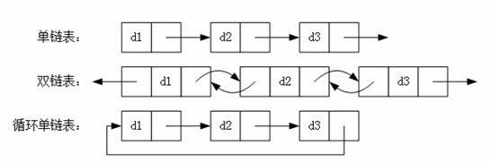

# Java基础-集合

## 1. Collection 集合(单列集合)继承体系与总结
### 1.1. 集合类型

Java集合框架支持三种主要类型的集合：**规则集(Set)、线性表(List)和队列(Queue)**。

- 规则集(Set)的实例用于存储一组不重复的元素。
- 线性表(List)的实例用于存储一个由元素构成的有序集合。
- 队列(Queue)的实例用于存储先进先出方式处理的对象。

这些集合的通用特性都被定义在接口中，而它的实现是在具体类中提供的。

### 1.2. 数据存储结构

数据存储的常用结构有：**堆栈、队列、数组、链表**

#### 1.2.1. 队列结构（queue）

先进先出（即，存进去的元素，要在后它前面的元素依次取出后，才能取出该元素）（First In First Out/FIFO）。

队列的入口、出口各占一侧，就可以达到先进先出的效果。


#### 1.2.2. 堆栈结构（stack）

先进后出（即，存进去的元素，要在后它后面的元素依次取出后，才能取出该元素）(First In Last Out/FILO)。

栈的入口、出口的都是栈的顶端位置

- 压栈：就是存元素。即，把元素存储到栈的顶端位置，栈中已有元素依次向栈底方向移动一个位置。
- 弹栈：就是取元素。即，把栈的顶端位置元素取出，栈中已有元素依次向栈顶方向移动一个位置。


#### 1.2.3. 数组结构

- **查询元素快**：通过索引，可以快速访问指定位置的元素
- **增删元素慢**：
    - 指定索引位置增加元素：需要创建一个新数组，将指定新元素存储在指定索引位置，再把原数组元素根据索引，复制到新数组对应索引的位置。
    - 指定索引位置删除元素：需要创建一个新数组，把原数组元素根据索引，复制到新数组对应索引的位置，原数组中指定索引位置元素不复制到新数组中。

#### 1.2.4. 链表结构（link）

链表结构是多个元素之间，通过地址进行连接。

- **查询元素慢**：想查找某个元素，从链表头或链表尾开始查找，需要通过连接的节点，依次向后一个个遍历查询指定元素。
- **增删元素快**：增删元素不需要移动元素的位置，只需要修改元素记录连接下个元素的地址值即可。



### 1.3. 集合体系图

**单列集合体系图**


- Collection接口：所有单列集合的直接或间接接口，其指定了所有集合应该具备的基本功能。
    - List接口：元素可重复，有序，带索引。
        - ArrayList(重要)：底层是数组结构。ArrayList 的出现替代了 Vector，增删慢,查找快。
        - LinkedList(重要)：底层是链表结构。同时对元素的增删操作效率很高。
    - Set接口： 元素不能重复，无序，没有索引。
        - HashSet(重要)：底层是哈希表结构。在不重复的基础上无序。
        - LinkedHashSet：底层是哈希表结构结合链表结构。在不重复的基础上可预测迭代顺序。

## 2. Collection 集合
### 2.1. Collection 概述

是所有单列集合的父接口（父类）。集合的项层的接口，它的子体系中有重复的，有唯一的，有有序的，有无序的。

Collection 就是没有索引的

### 2.2. Collection集合接口的常用方法

- `Collection<String> c = new ArrayList<>();`
    - Collection是接口，都是静态成员变量与静态方法。

#### 2.2.1. 添加元素

- `boolean add(E e);`
    - 添加一个元素
- `boolean addAll(E e);`
    - 添加一个集合元素

#### 2.2.2. 删除元素

- `boolean remove(Object o);`
    - 删除指定的元素

#### 2.2.3. 获取集合大小

- `int size();`

#### 2.2.4. 清空集合

- `void clear();`
    - 将集合的所有元素清空。

#### 2.2.5. 判断功能

- `boolean isEmpty();`
    - 判断集合是否为空。

**其实之前ArrayList就是实现Collection的这些方法**

#### 2.2.6. Collection Code Demo

```java
package day07;

import java.util.ArrayList;
import java.util.Collection;

/*
 * 关卡1训练案例 1
 * 	Collection 基本用法
 */
public class Test1_01 {
	public static void main(String[] args) {
		// 创建Collection对象，因Collection是接口，只能通过子类去创建对象
		Collection<String> c = new ArrayList<String>();
		// 往集合中添加对象元素
		c.add("a");
		c.add("b");
		c.add("c");
		c.add("d");
		c.add("e");
		// 输出集合[a, b, c, d, e]
		System.out.println(c);
		// 删除元素
		c.remove("c");
		// remove不存在的元素，不报错，没有效果
		c.remove("f");
		//输出集合[a, b, d, e]
		System.out.println(c);
		// 获取集合大小：4
		System.out.println("Collection集合的大小是：" + c.size());
		// 清空集合+判断集合是否是空 输出 false
		System.out.println("Collectiong集合是否为空：" + c.isEmpty());
		c.clear();
		//输出true
		System.out.println("Collectiong集合是否为空：" + c.isEmpty());
		// 输出集合内容 []
		System.out.println(c);
	}
}
```

# ArrayList 集合

**注：本文所有方法和示例基于jdk1.8**

## 1. 简介

> ArrayList是我们开发中非常常用的数据存储容器之一，其底层是数组实现的，我们可以在集合中存储任意类型的数据，ArrayList是线程不安全的，非常适合用于对元素进行查找，效率非常高。

## 2. 线程安全性

对ArrayList的操作一般分为两个步骤，改变位置(size)和操作元素(e)。所以这个过程在多线程的环境下是不能保证具有原子性的，因此ArrayList在多线程的环境下是线程不安全的。

## 3. ArrayList 源码分析

### 3.1. 属性分析

```java
/**
 * 默认初始化容量
 */
private static final int DEFAULT_CAPACITY = 10;

/**
 * 如果自定义容量为0，则会默认用它来初始化ArrayList。或者用于空数组替换。
 */
private static final Object[] EMPTY_ELEMENTDATA = {};

/**
 * 如果没有自定义容量，则会使用它来初始化ArrayList。或者用于空数组比对。
 */
private static final Object[] DEFAULTCAPACITY_EMPTY_ELEMENTDATA = {};

/**
 * 这就是ArrayList底层用到的数组
 * 非私有，以简化嵌套类访问
 * transient 在已经实现序列化的类中，不允许某变量序列化
 */
transient Object[] elementData;

/**
 * 实际ArrayList集合大小
 */
private int size;

/**
 * 可分配的最大容量
 */
private static final int MAX_ARRAY_SIZE = Integer.MAX_VALUE - 8;
```

#### 3.1.1. 扩展：什么是序列化

序列化是指：将对象转换成以字节序列的形式来表示，以便用于持久化和传输。

实现方法：实现Serializable接口。

然后用的时候拿出来进行反序列化即可又变成Java对象。

#### 3.1.2. transient关键字解析

> Java中transient关键字的作用，简单地说，就是让某些被修饰的成员属性变量不被序列化。

有了`transient`关键字声明，则这个变量不会参与序列化操作，即使所在类实现了Serializable接口，反序列化后该变量为空值。

> 那么问题来了：ArrayList中数组声明：`transient Object[] elementData;`，事实上我们使用ArrayList在网络传输用的很正常，并没有出现空值。

原来：`ArrayList`在序列化的时候会调用`writeObject()`方法，将`size`和`element`写入`ObjectOutputStream`；反序列化时调用`readObject()`，从`ObjectInputStream`获取`size`和`element`，再恢复到`elementData`。

> 那为什么不直接用elementData来序列化，而采用上诉的方式来实现序列化呢？

原因在于`elementData`是一个缓存数组，它通常会预留一些容量，等容量不足时再扩充容量，那么有些空间可能就没有实际存储元素，采用上诉的方式来实现序列化时，就可以保证只序列化实际存储的那些元素，而不是整个数组，从而**节省空间和时间**。

### 3.2. 构造方法分析

根据initialCapacity 初始化一个空数组，如果值为0，则初始化一个空数组:

```java
/**
 * 根据initialCapacity 初始化一个空数组
 */
public ArrayList(int initialCapacity) {
    if (initialCapacity > 0) {
        this.elementData = new Object[initialCapacity];
    } else if (initialCapacity == 0) {
        this.elementData = EMPTY_ELEMENTDATA;
    } else {
        throw new IllegalArgumentException("Illegal Capacity: " + initialCapacity);
    }
}
```

不带参数初始化，默认容量为10:

```java
/**
 * 不带参数初始化，默认容量为10
 */
public ArrayList() {
    this.elementData = DEFAULTCAPACITY_EMPTY_ELEMENTDATA;
}
```

通过集合做参数的形式初始化：如果集合为空，则初始化为空数组：

```java
/**
 * 通过集合做参数的形式初始化
 */
public ArrayList(Collection<? extends E> c) {
    elementData = c.toArray();
    if ((size = elementData.length) != 0) {
        // c.toArray might (incorrectly) not return Object[] (see 6260652)
        if (elementData.getClass() != Object[].class)
            elementData = Arrays.copyOf(elementData, size, Object[].class);
    } else {
        // replace with empty array.
        this.elementData = EMPTY_ELEMENTDATA;
    }
}
```

### 3.3. 主干方法

#### 3.3.1. `trimToSize()`方法

> 用来最小化实例存储，将容器大小调整为当前元素所占用的容量大小。

```java
/**
 * 这个方法用来最小化实例存储。
 */
public void trimToSize() {
    modCount++;
    if (size < elementData.length) {
        elementData = (size == 0)
          ? EMPTY_ELEMENTDATA
          : Arrays.copyOf(elementData, size);
    }
}
```

#### 3.3.2. `clone()`方法

> 用来克隆出一个新数组。

```java
public Object clone() {
    try {
        ArrayList<?> v = (ArrayList<?>) super.clone();
        v.elementData = Arrays.copyOf(elementData, size);
        v.modCount = 0;
        return v;
    } catch (CloneNotSupportedException e) {
        // this shouldn't happen, since we are Cloneable
        throw new InternalError(e);
    }
}
```

通过调用`Object`的`clone()`方法来得到一个新的`ArrayList`对象，然后将`elementData`复制给该对象并返回。

#### 3.3.3. `add(E e)`方法

> 在数组末尾添加元素

```java
/**
 * 在数组末尾添加元素
 */
public boolean add(E e) {
    ensureCapacityInternal(size + 1);  // Increments modCount!!
    elementData[size++] = e;
    return true;
}
```

看到它首先调用了`ensureCapacityInternal()`方法.注意参数是size+1,这是个面试考点。

```java
private void ensureCapacityInternal(int minCapacity) {
    ensureExplicitCapacity(calculateCapacity(elementData, minCapacity));
}
```

这个方法里又嵌套调用了两个方法:计算容量+确保容量

计算容量：如果elementData是空，则返回默认容量10和size+1的最大值，否则返回size+1

```java
private static int calculateCapacity(Object[] elementData, int minCapacity) {
    if (elementData == DEFAULTCAPACITY_EMPTY_ELEMENTDATA) {
        return Math.max(DEFAULT_CAPACITY, minCapacity);
    }
    return minCapacity;
}
```

计算完容量后，进行确保容量可用：(modCount不用理它，它用来计算修改次数)

如果`size+1 > elementData.length`证明数组已经放满，则增加容量，调用`grow()`。

```java
private void ensureExplicitCapacity(int minCapacity) {
    modCount++;

    // overflow-conscious code
    if (minCapacity - elementData.length > 0)
        grow(minCapacity);
}
```

增加容量：默认1.5倍扩容。

1. 获取当前数组长度=>oldCapacity
2. oldCapacity>>1 表示将oldCapacity右移一位(位运算)，相当于除2。再加上1，相当于新容量扩容1.5倍。
3. 如果`newCapacity&gt;1=1`,`1&lt;2`所以如果不处理该情况，扩容将不能正确完成。
4. 如果新容量比最大值还要大，则将新容量赋值为VM要求最大值。
5. 将elementData拷贝到一个新的容量中。

```java
private void grow(int minCapacity) {
    // overflow-conscious code
    int oldCapacity = elementData.length;
    int newCapacity = oldCapacity + (oldCapacity >> 1);
    if (newCapacity - minCapacity < 0)
        newCapacity = minCapacity;
    if (newCapacity - MAX_ARRAY_SIZE > 0)
        newCapacity = hugeCapacity(minCapacity);
    // minCapacity is usually close to size, so this is a win:
    elementData = Arrays.copyOf(elementData, newCapacity);
}
```

------

##### 3.3.3.1. size+1的问题

> 好了，那到这里可以说一下为什么要size+1。

size+1代表的含义是：

1. 如果集合添加元素成功后，集合中的实际元素个数。
2. 为了确保扩容不会出现错误。

假如不加一处理，如果默认size是0，则0+0>>1还是0。

如果size是1，则1+1>>1还是1。有人问:不是默认容量大小是10吗?事实上，jdk1.8版本以后，ArrayList的扩容放在add()方法中。之前放在构造方法中。我用的是1.8版本，所以默认`ArrayList arrayList = new ArrayList();`后，size应该是0.所以,size+1对扩容来讲很必要.

```java
public static void main(String[] args) {
    ArrayList arrayList = new ArrayList();
    System.out.println(arrayList.size());
}

输出:0
```

事实上上面的代码是证明不了容量大小的，因为size只会在调用`add()`方法时才会自增。有办法的小伙伴可以在评论区大显神通。

------

#### 3.3.4. `add(int index, E element)`方法

```java
public void add(int index, E element) {
    rangeCheckForAdd(index);

    ensureCapacityInternal(size + 1);  // Increments modCount!!
    System.arraycopy(elementData, index, elementData, index + 1,
                     size - index);
    elementData[index] = element;
    size++;
}
```

rangeCheckForAdd()是越界异常检测方法。`ensureCapacityInternal()`之前有讲，着重说一下`System.arrayCopy`方法：

```java
public static void arraycopy(Object src, int srcPos, Object dest, int destPos, int length)
```

##### 3.3.4.1. 代码解释

- Object src : 原数组
- int srcPos : 从元数据的起始位置开始
- Object dest : 目标数组
- int destPos : 目标数组的开始起始位置
- int length : 要copy的数组的长度

示例：size为6，我们调用`add(2,element)`方法，则会从index=`2+1=3`的位置开始，将数组元素替换为从index起始位置为`index=2`，长度为`6-2=4`的数据。

> 

##### 3.3.4.2. 异常处理

```java
private void rangeCheckForAdd(int index) {
    if (index > size || index < 0)
        throw new IndexOutOfBoundsException(outOfBoundsMsg(index));
}
```

#### 3.3.5. `set(int index, E element)`方法

```java
public E set(int index, E element) {
    rangeCheck(index);

    E oldValue = elementData(index);
    elementData[index] = element;
    return oldValue;
}

E elementData(int index) {
    return (E) elementData[index];
}
```

逻辑很简单，覆盖旧值并返回。

#### 3.3.6. `indexOf(Object o)`方法

> 根据Object对象获取数组中的索引值。

```java
public int indexOf(Object o) {
    if (o == null) {
        for (int i = 0; i < size; i++)
            if (elementData[i]==null)
                return i;
    } else {
        for (int i = 0; i < size; i++)
            if (o.equals(elementData[i]))
                return i;
    }
    return -1;
}
```

如果o为空，则返回数组中第一个为空的索引；不为空也类似。

注意：通过源码可以看到，该方法是允许传空值进来的。

#### 3.3.7. `get(int index)`方法

> 返回指定下标处的元素的值。

```java
public E get(int index) {
    rangeCheck(index);

    return elementData(index);
}
```

`rangeCheck(index)`会检测index值是否合法，如果合法则返回索引对应的值。

#### 3.3.8. `remove(int index)`方法

> 删除指定下标的元素。

```java
public E remove(int index) {
    // 检测index是否合法
    rangeCheck(index);
    // 数据结构修改次数
    modCount++;
    E oldValue = elementData(index);

    // 记住这个算法
    int numMoved = size - index - 1;
    if (numMoved > 0)
        System.arraycopy(elementData, index+1, elementData, index,
                         numMoved);
    elementData[--size] = null; // clear to let GC do its work

    return oldValue;
}
```

这里又碰到了`System.arraycopy()`方法，详情请查阅上文。

大概思路：将该元素后面的元素前移，最后一个元素置空。

## 4. ArrayList优缺点
### 4.1. 优点

1. 因为其底层是数组，所以修改和查询效率高。
2. 可自动扩容(1.5倍)。

### 4.2. 缺点

1. 插入和删除效率不高。
2. 线程不安全。

## 5. 手写ArrayList(网上资料)

那面试手写ArrayList应该就不是问题了。下面网上资料的手写一个简单阉割版的ArrayList：

```java
public class MyArrayList {

    // 非私有，以简化嵌套类访问
    // transient 在已经实现序列化的类中，不允许某变量序列化
    transient Object[] elementData;

    //默认容量
    private static final int DEFAULT_CAPACITY = 10;

    // 用于空实例的 空数组实例
    private static final Object[] EMPTY_ELEMENTDATA = {};

    private static final Object[] DEFAULTCAPACITY_EMPTY_ELEMENTDATA = {};
    // 实际ArrayList集合大小
    private int size;
    /**
     * 构造方法
     */
    public MyArrayList(int initialCapacity) {
        if (initialCapacity > 0) {
            this.elementData = new Object[initialCapacity];
        } else if (initialCapacity == 0) {
            this.elementData = EMPTY_ELEMENTDATA;
        } else {
            throw new IllegalArgumentException("Illegal Capacity: "+
                    initialCapacity);
        }
    }
    public MyArrayList(){
        this(DEFAULT_CAPACITY);
    }

    public void add(Object o){
        //1. 判断数据容量是否大于 elementData
        ensureExplicitCapacity(size+1);
        //2. 使用下标进行赋值
        elementData[size++] = o;
    }
    private void ensureExplicitCapacity(int minCapacity){
        if (size == elementData.length){
            // 需要扩容,扩容1.5倍(ArrayList默认扩容1.5倍)
            // 注意：如果oldCapacity值为1
            int oldCapacity = elementData.length;
            int newCapacity = oldCapacity + (oldCapacity >> 1);
            // 如果新容量 < 最小容量， 则将最小容量赋值给新容量
            // 如果 oldCapacity=1, 则 minCapacity=1+1=2   newCapacity=1+(1>>1)=1
            if (newCapacity - minCapacity < 0){
                newCapacity = minCapacity;
            }
            // 创建新数组
            Object[] objects = new Object[newCapacity];
            // 将数据复制给新数组
            System.arraycopy(elementData, 0, objects, 0, elementData.length);
            // 修改引用
            elementData = objects;
        }
    }
    public Object get(int index) {
        rangeCheck(index);
        return elementData[index];
    }
    private void rangeCheck(int index) {
        if (index >= size)
            throw new IndexOutOfBoundsException("下标越界");
    }

    /**
     * 通过下标删除
     * @param index
     * @return
     */
    public Object remove(int index) {
        rangeCheck(index);

		// modCount++;
        // 先查出元素
        Object oldValue = elementData[index];
        // 找出置换结束位置
        int numMoved = size - index - 1;
        if (numMoved > 0)
            // 从 index+1 开始 将值覆盖为 index-numMoved 的值
            System.arraycopy(elementData, index+1, elementData, index, numMoved);
        elementData[--size] = null; // clear to let GC do its work

        return oldValue;
    }
    public boolean remove(Object o) {
            for (int index = 0; index < size; index++){
                if (o.equals(elementData[index])) {
                    remove(index);
                    return true;
                }
            }
        return false;
    }
}
```

# 集合相关的工具类API

## 1. Collections 工具类

Collection 集合的工具类，提供了大量的方法操作单列集合。里面都是静态方法。直接用`类名.静态方法`使用

**注：Collections是工具类，Collection是接口**

```java
public static <T> boolean addAll(Collection<? super T> c, T... elements)
```

- 将数组中的所有元素添加到指定的集合中。例如：

```java
ArrayList<String> array = new ArrayList<String>();
Collections.addAll(array, "a","b","c","d","e");
```

```java
public static <T> int binarySearch(List<?> list,T key)
```

- 此方法使用二分查找法(折半查找)查找指定元素
- 要求：二分法查询必须要求集合中的元素排好顺序(从小到大排序)
- 在集合List中查找指定的元素key,如果找到返回key在集合中的索引值(位置)
- 如果没找到，则返回= -插入点-1（插入点=-(返回值+1)）

```java
public static void shuffle(List<?> list)
```

- 对集合中的元素进行乱序操作（传入是List，只针对有顺序的集合）。使用默认随机源对指定列表进行置换。所有置换发生的可能性都是大致相等的。

```java
public static <T> void sort(List<T> list)
```

- 对集合元素进行排序，默认是升序排序。
- 有顺序(有序):第一个元素是多少,第二个元素是多少,第几个元素对应的是第几,顺序不变。
- 排序:不管是第几个放的,只要到集合中(以 Integer 集合为例),就按照一定的顺序重新排列了。
- 根据元素的自然顺序 对指定列表按升序进行排序。列表中的所有元素都必须实现 Comparable 接口。

```java
public static void swap(List<?> list, int i, int j);
```

- 将集合中索引i和索引j位置交换。

```java
public static void reverse(List<?> list)
```

- 反转指定列表中元素的顺序。

## 2. Arrays 类

Arrays 类是工具类，里面都是静态方法，需要导包。Arrays是用来操作**数组**中的元素。

```java
public static int binarySearch(Object[] a, Object key)
```

- 使用二分搜索法来搜索指定数组，以获得指定对象。**在进行此调用之前，必须根据元素的自然顺序对数组进行升序排序（通过 sort(Object[]) 方法）**。如果没有对数组进行排序，则结果是不确定的。（如果数组包含不可相互比较的元素（例如，字符串和整数），则无法 根据其元素的自然顺序对数组进行排序，因此结果是不确定的。）如果数组包含多个等于指定对象的元素，则无法保证找到的是哪一个。

```java
public static void sort(Object[] a)
```

- 根据元素的自然顺序对指定对象数组按**升序进行排序**。数组中的所有元素都必须实现 Comparable 接口。此外，数组中的所有元素都必须是可相互比较的

```java
public static String toString(xxx[] a)
```

- **返回指定数组内容的字符串表示形式**。字符串表示形式由数组的元素列表组成，括在方括号（"[]"）中。相邻元素用字符 ", "（逗号加空格）分隔。
- 可以直接打印输出返回的遍历数组的字符串。多个重载的方法，其中数组类型包括：boolean[], float[], double[], Object[], byte[], char[], short[], int[], long[];

```java
public static boolean equals(Object[] a, Object[] a2)
```

- 比较两个数组的元素是否完全相同(**元素个数，对应的内容要一致**)
- 如果两个指定的 Objects 数组彼此相等，则返回 true。如果两个数组包含相同数量的元素，并且两个数组中的所有相应元素对都是相等的，则认为这两个数组是相等的。

```java
public static void fill(Object[] a, Object val)
```

- 将数组中所有元素赋值为指定的值val。
- 将指定的 Object 引用分配给指定 Object 数组的每个元素。

## 3. Array 类

Array 类是工具类，里面都是静态方法。直接用类名.使用，需要导包

```java
public final class Arrayextends Object;
```
Array 类提供了动态创建和访问 Java 数组的方法。

```java
public static Object get(Object array, int index);
```

- 返回指定数组对象中索引组件的值。如果该值是一个基本类型值，则自动将其包装在一个对象中。
- 方法会throws IllegalArgumentException, ArrayIndexOutOfBoundsException;

```java
public static void set(Object array, int index, Object value);
```

- 将指定数组对象中索引组件的值设置为指定的新值。如果数组的类型为基本组件类型，则新值第一个被自动解包。
- 方法会throws IllegalArgumentException, ArrayIndexOutOfBoundsException;

## 4. LinkedList 类(未整理完)

```java
public boolean add(E e)
```

- 将指定元素添加到此列表的结尾

```java
public int size()
```

- 返回此列表的元素数


