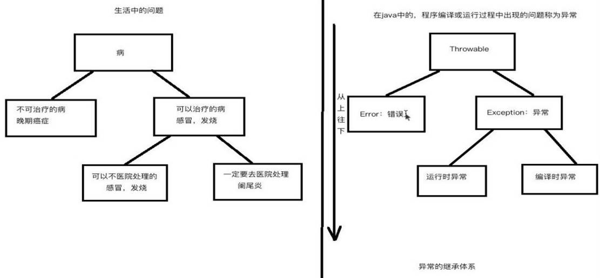

# Java基础-异常

## 1. 异常概述
### 1.1. 什么是异常

Java程序在编译或运行过程中出现的问题就称为异常。

### 1.2. 异常的继承体系

- Throwable
    - Error：错误
        - 错误：一出现就是致命的，服务器宕机，数据库崩溃等
    - Exception：
        - 运行时异常
        - 编译时异常



无论是错误还是异常，它们都有具体的子类体现每一个问题，它们的子类都有一个共性，就是都**以父类名才作为子类的后缀名**

### 1.3. 异常的分类
#### 1.3.1. 运行时异常

RuntimeException（运行时异常）：一般都是程序员犯得错误，需要修改源码的

#### 1.3.2. 编译时异常

编译时异常：在编译时必须进行处理，不处理无法通过编译

#### 1.3.3. 四个常见的运行时异常

- ArithmeticException
- NullPointerException
- ArrayIndexOutOfBoundsException
- StringIndexOutOfBoundsException

### 1.4. 异常与错误的区别

- **异常**
    - 在编译或运行过程中出现的问题就称为异常
    - 可以针对异常进行处理，处理后，后续的代码可以继续运行。如果不处理，否则程序直接崩溃
- **错误**
    - 程序在运行过程中出现的问题。
    - 错误一般是由系统产生并反馈给JVM。
    - 没有具体的处理方式，只能修改错误的代码。否则程序直接崩溃，无法运行

如何判断程序出现的问题是错误还是异常？

- 根据控制台输入的错误信息，判断类名是以Error还是Exceptiong结尾。
- 如果是Error则是错误，否是就是Exception。


## 2. 异常相关的类
### 2.1. Throwable 类与常用方法

Throwable 类是 Java 语言中所有错误或异常的超类。直接已知子类：`Error`, `Exception`

#### 2.1.1. Throwable 常用方法

```java
public String getMessage()
```

- 获得创建 Throwable 异常对象构造方法中指定的消息字符串。

```java
public String toString()
```

- 获得 Throwable 异常信息的类全名和消息字符串。

```java
public void printStackTrace()
```

- 打印异常的栈信息，追溯异常根源。
- 将此 throwable 及其追踪输出至标准错误流。此方法将此 Throwable 对象的堆栈跟踪输出至错误输出流，作为字段 `System.err` 的值。输出的第一行包含此对象的 `toString()` 方法的结果。剩余行表示以前由方法 `fillInStackTrace()` 记录的数据。

```java
public string getLocalizedMessage()
```

- 返回异常对象的本地化信息。使用 Throwable 的子类覆盖这个方法，可以声称本地化信息。如果子类没有覆盖该方法，则该方法返回的信息与 `getMessage()` 返回的结果相同

### 2.2. 自定义异常

- 命名规范：`XxxException`
- 继承关系：继承 `Exception` 或 `RuntimeException`
- 构造方法：提供有参和无参构造方法

1. 定义异常处理时，什么时候定义try，什么时候定义throws呢？
    - 功能内部如果出现异常，如果内部可以处理，就用try；
    - 如果功能内部处理不了，就必须声明出来，让调用者处理。
2. 什么时候使用抛出处理？什么时候使用捕获处理?
    - 如果当前代码是直接跟用户打交道的，则千万不要抛出异常，要捕获处理。
    - 如果需要将异常报告给上一层(方法调用者)则要使用抛出处理。
3. 父类方法没有声明抛出异常，子类覆盖方法时发生了异常，怎么办？
    - 子类重写方法时，可以抛出异常，但是只能抛出运行时异常或其子类。

## 3. 异常处理
### 3.1. 异常的处理方式

- jvm的默认处理方式
    - 将异常的类名，位置，原因等信息输出在控制台。
    - 终止程序的运行。后续的代码没有办法执行。
- 手动处理异常方式
    - 捕获处理
    - 抛出处理

### 3.2. 异常处理之捕获处理 - try catch

- 在开发时，如果定义功能时，发现该功能会出现一些问题，**应该将问题在定义功能时标示出来**，这样调用者就可以在使用这个功能的时候，预先给出处理方式。
- 如何标示呢？通过throws关键字完成，格式：`throws 异常类名,异常类名...`
- 这样标示后，调用者，在使用该功能时，就必须要处理，否则编译失败。

#### 3.2.1. 捕获处理总体格式

```java
try {
    // 需要检测的异常；
} catch(异常类名 变量名) {
    // 异常处理代码
    // 通常我们只使用一个方法：printStackTrace 打印异常信息
} finally {
    // 不管是否有异常发生，都会执行该代码块中的代码。
}
```

#### 3.2.2. 异常捕获处理-单 catch 处理

```java
try{
	// 需要检测的异常；
} catch (异常类名 异常变量名) {
	// 异常处理代码
	// 可以调用异常的方法
	// 通常我们只使用一个方法：printStackTrace 打印异常信息
}
```

- 格式说明
    - try 代码块中存放可能出现异常的代码。
    - catch 代码块中存放处理异常的代码。
- 执行流程
    - 先执行try代码块中的代码，如果try代码块中的代码没有出现异常，则不会执行catch代码块的代码。
    - 如果try代码块中的代码出现异常，则会进入catch代码块执行里面的代码。

#### 3.2.3. 异常捕获处理-多 catch 处理

```java
try {
	// 需要检测的异常；
} catch(异常类名1 异常变量1) {
	// 异常处理代码
	// 可以调用异常的方法
	// 通常我们只使用一个方法：printStackTrace 打印异常信息
} catch(异常类名2 异常变量2) {
	// 异常处理代码
	// 可以调用异常的方法
	// 通常我们只使用一个方法：printStackTrace 打印异常信息
} ……    // 可以有无数个catch
```

- 多 catch 处理注意事项
    - 多个catch 外理异常时，异常类名要有先后顺序。
    - 如果多个异常类之间是平级关系(没有继承关系)，则没有先后顺序要求
    - 如果多个异常类之间是上下级关系(有继承关系)，越高级的父类要写在越下面。
- **特殊情况：try对应多个catch时，如果有父类的catch语句块，一定要放在下面。**

> 在实际开发中是不是只捕获Exception异常吗？因为实际开发中，需要针对不同的异常有不同的处理方式。

#### 3.2.4. finally 代码块

```java
try {
	// 需要检测的异常；
} catch(异常类名1 异常变量1) {
	// 异常处理代码
	// 可以调用异常的方法
	// 通常我们只使用一个方法：printStackTrace 打印异常信息
} catch(异常类名2 异常变量2) {
	// 异常处理代码
	// 可以调用异常的方法
	// 通常我们只使用一个方法：printStackTrace 打印异常信息
} finally {
	// 不管是否有异常发生，都会执行该代码块中的代码。
}
```

- finally 代码块的特点：
    - **只要进入了try的代码块**，不管是否有异常发生，都会执行该代码块中的代码。
- finally 作用：
    - **用来释放资源**，比如关闭IO流或数据库相关资源。

#### 3.2.5. try-catch-finally 的几种结合方式：

|           组合1            |     组合2      |      组合3       |
| ------------------------- | ------------- | --------------- |
| try</br>catch</br>finally | try</br>catch | try</br>finally |


- 这种情况，如果出现异常，并不处理，但是资源一定关闭，所以`try  finally集合只为关闭资源`。
- 记住：finally很有用，主要用户关闭资源。无论是否发生异常，资源都必须进行关闭。
- `System.exit(0);` 此方法是退出jvm，只有这种情况finally不执行。

### 3.3. 异常处理之抛出处理 – throws 和 throw关键字

- 这个体系中的所有类和对象都具备一个独有的特点；就是**可抛性**。
- 可抛性的体现：就是这个体系中的类和对象都可以被throws和throw两个关键字所操作

#### 3.3.1. throws 和 throw的作用

- throws：将异常类名标识出类，报告给方法调用者
- throw：将异常对象抛出，抛给方法的调用者。

#### 3.3.2. throws 和 throw的位置

- throws：使用在方法声明上
- throw：使用在方法体内部

#### 3.3.3. throws 格式

```java
修饰符 返回值类型 方法名 (参数类型 参数名1, 参数类型 参数名2, ……) throws 异常类名1,异常类名2,…… {
	......
}
```

#### 3.3.4. throw 格式

```java
throw new 异常类名(“异常信息”);
```

#### 3.3.5. throws 和 throw注意事项

- `throw` 关键字之后的对象一定是异常对象，不能是其他对象。
- `throws` 后面跟多个异常，使用“,”隔开。

#### 3.3.6. 异常声明抛出处理流程

- 在某个方法的声明上，让它(这个方法)抛出这个产生的异常，自己不处理，谁调用这个方法，谁处理
- 方法声明上加 `throws` 异常类名
    - 如：方法a 中产生了异常，声明抛出
    - 方法b 调用方法a，则该异常由a 转向了b
- 一般情况下，main 方法是不会声明抛出异常的，因为该方法抛出，直接抛出给了JVM，JVM 的默认处理机制是终止程序运行，则这样处理，相当于没有处理！

### 3.4. 方法重写时异常处理（针对编译时异常）

- 父类方法声明上没有使用throws声明抛出异常，子类重写方法时不能声明抛出异常。
- 父类方法声明上使用throws声明一个异常时，子类重写方法时可以声明和父类一样的异常或其异常的子类。
- 父类方法声明上使用throws声明多个异常时，子类重写方法可以声明和父类多个异常的子集异常。

**总结：子类不能声明抛出比父类大的异常。**

- 注意：
    - 如果父类或者接口中的方法没有抛出过异常，那么子类是不可以抛出异常的，**如果子类重写的方法中出现了异常，只能try不能throws**。
    - 如果这个异常子类无法处理，已经影响了子类方法的具体运算，这时可以在子类方法中，通过throw抛出RuntimeException异常或者其子类，这样，子类的方法上是不需要throws声明的。

## 4. 运行时异常和编译时异常(理解)

- **运行时异常**
    - 只要是RuntimeException或其子类异常都是运行时异常。
- **编译时异常**
    - 除了运行时异常以外的所有异常都是编译时异常。
- **运行时异常特点**
    - 方法声明上如果声明的异常是运行时异常，则方法调用者可以处理，也可以不处理。
    - 方法体内部抛出的异常是运行时异常，则方法声明上可以声明，也可以不声明。
- **编译时异常特点**
    - 方法声明上如果声明的异常是编译时异常，则要求方法调用者一定要处理。
    - 方法体内部抛出的异常是编译时异常，则要求对该异常进行处理（捕获处理或者声明抛出处理）。

> 为什么java编译器对运行时异常管理如何松散？因为运行时异常一般通过程序员良好的编程习惯避免。

