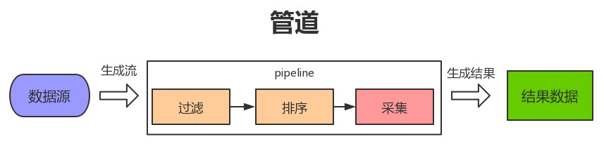
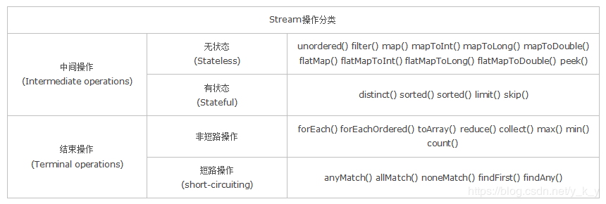
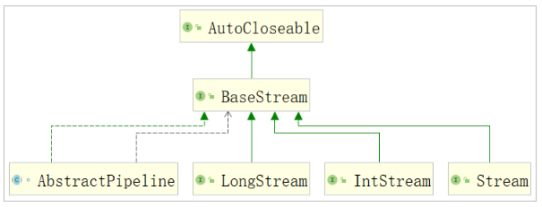
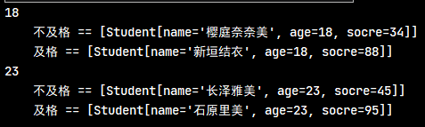
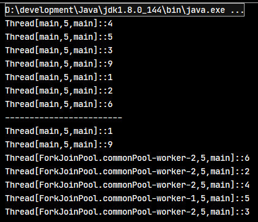
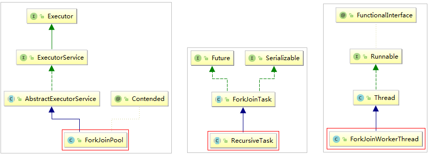
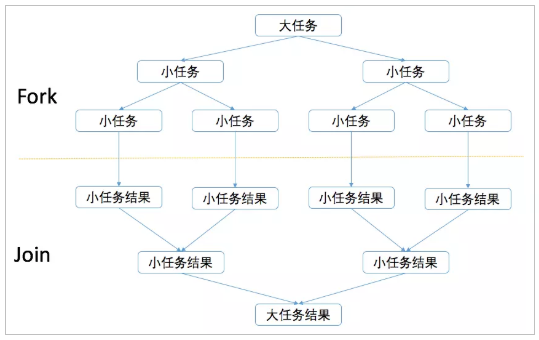
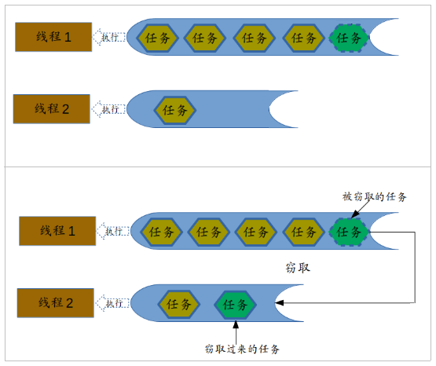
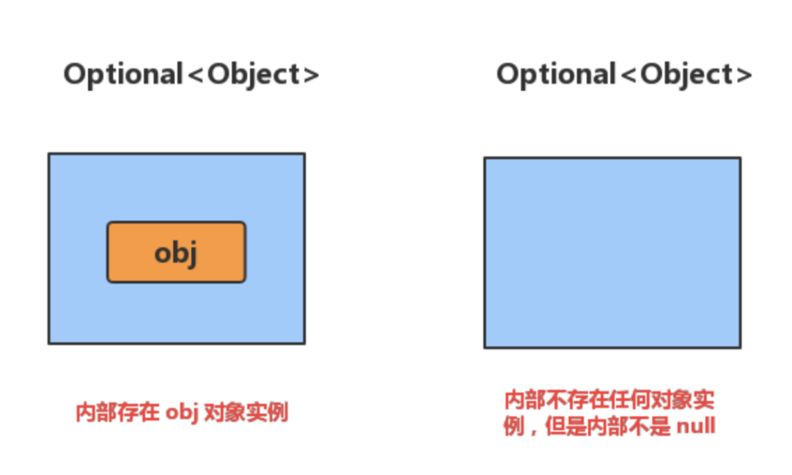

# Java8新特性

## 1. Lambda 表达式

### 1.1. Lambda 表达式定义

- Lambda 表达式，也可称为闭包，它是推动 Java 8 发布的最重要新特性
- Lambda 允许把函数作为一个方法的参数（函数作为参数传递进方法中）
- 使用 Lambda 表达式可以使代码变的更加简洁紧凑
- 在调用方法时，如果参数是函数式接口，就可以考虑使用Lambda表达式，Lambda表达式相当于是对接口中抽象方法的重写

示例：当需要启动一个线程去完成任务时，通常会通过 `Runnable` 接口来定义任务内容，并使用 `Thread` 类来启动该线程。

```java
/* 示例：当需要启动一个线程去完成任务时，通常会通过 `Runnable` 接口来定义任务内容，并使用 `Thread` 类来启动该线程。 */
@Test
public void quickstartTest() {
    /*
     * 传统写法，使用匿名内部类实现
     * 对于 Runnable 的匿名内部类用法，可以分析出几点内容：
     *      1.Thread 类需要 Runnable 接口作为参数，其中的抽象 run 方法是用来指定线程任务内容的核心
     *      2.为了指定 run 的方法体，不得不需要 Runnable 接口的实现类
     *      3.为了省去定义一个 Runnable 实现类的麻烦，不得不使用匿名内部类
     *      4.必须覆盖重写抽象 run 方法，所以方法名称、方法参数、方法返回值不得不再写一遍，且不能写错
     *      5.实际上，似乎只有方法体才是关键所在。
     */
    new Thread(new Runnable() {
        @Override
        public void run() {
            System.out.println("新线程任务执行！");
        }
    }).start();

    /*
     * 使用Lambda表达式实现，Lambda是一个匿名函数
     *       简化匿名内部类的使用，语法更加简单
     */
    new Thread(() -> {
        System.out.println("使用Lambda表达式创建的线程任务执行了！");
    }).start();
}
```

### 1.2. Lambda 表达式语法

#### 1.2.1. Lambda的标准语法格式

- 标准语法格式

```java
(参数类型 参数名称) -> {
    代码体;
}
```

- 其他简化格式

```java
// 方式1
(parameters) -> expression

// 方式2
(parameters) -> { statements; }
```

#### 1.2.2. lambda表达式的重要特征（可省略规则）

- **可选类型声明**：不需要声明参数类型，编译器可以统一识别参数值。
- **可选的参数圆括号**：一个参数无需定义圆括号，但多个参数需要定义圆括号。
- **可选的大括号**：如果主体包含了一个语句，就不需要使用大括号。
- **可选的返回关键字**：如果主体只有一个表达式返回值则编译器会自动返回值，大括号需要指定明表达式返回了一个数值。

#### 1.2.3. 使用 Lambda 表达式前提条件

1. Lambda 表达式主要用来定义行内执行的方法类型接口，例如，一个简单方法接口。在上面例子中，使用各种类型的Lambda表达式来定义MathOperation接口的方法。然后我们定义了sayMessage的执行。Lambda 表达式免去了使用匿名方法的麻烦，并且给予Java简单但是强大的函数化的编程能力。
2. 使用Lambda表达式的接口只能有一个方法，此种接口可以称为函数式接口
3. 如果一个接口使用注解`@FunctonalInterface`修饰，则该接口称为函数式接口。如果该接口中有多个方法，但除了一个方法外的其它方法都有默认实现（使用`default`关键字修改的方法），则也是可以做为函数式接口
4. 如果接口里面有Object类下的非默认方法，也是一个函数式接口，可以使用lambda表达式

### 1.3. Lambda 表达式示例

#### 1.3.1. 基础综合示例1

```java
// 1. 不需要参数,返回值为 5
() -> 5

// 2. 接收一个参数(数字类型),返回其2倍的值
x -> 2 * x

// 3. 接受2个参数(数字),并返回他们的差值
(x, y) -> x – y

// 4. 接收2个int型整数,返回他们的和
(int x, int y) -> x + y

// 5. 接受一个 string 对象,并在控制台打印,不返回任何值(看起来像是返回void)
(String s) -> System.out.print(s)
```

#### 1.3.2. 综合示例2

```java
public class Java8Tester {
    public static void main(String args[]) {
        Java8Tester tester = new Java8Tester();

        // 类型声明
        MathOperation addition = (int a, int b) -> a + b;

        // 不用类型声明
        MathOperation subtraction = (a, b) -> a - b;

        // 大括号中的返回语句
        MathOperation multiplication = (int a, int b) -> {
            return a * b;
        };

        // 没有大括号及返回语句
        MathOperation division = (int a, int b) -> a / b;

        System.out.println("10 + 5 = " + tester.operate(10, 5, addition));
        System.out.println("10 - 5 = " + tester.operate(10, 5, subtraction));
        System.out.println("10 x 5 = " + tester.operate(10, 5, multiplication));
        System.out.println("10 / 5 = " + tester.operate(10, 5, division));

        // 不用括号
        GreetingService greetService1 = message ->
                System.out.println("Hello " + message);

        // 用括号
        GreetingService greetService2 = (message) ->
                System.out.println("Hello " + message);

        greetService1.sayMessage("Runoob");
        greetService2.sayMessage("Google");
    }

    interface MathOperation {
        int operation(int a, int b);
    }

    interface GreetingService {
        void sayMessage(String message);
    }

    private int operate(int a, int b, MathOperation mathOperation) {
        return mathOperation.operation(a, b);
    }
}
```

程序输出结果为：

```shell
$ javac Java8Tester.java
$ java Java8Tester
10 + 5 = 15
10 - 5 = 5
10 x 5 = 50
10 / 5 = 2
Hello Runoob
Hello Google
```

#### 1.3.3. 无参数无返回值的Lambda

- 定义只有一个抽象方法的接口

```java
public interface Sportable {
    void doSport();
}
```

- 使用Lambda表达式

```java
/* 无参数无返回值的Lambda */
@Test
public void lambdaNoParamsTest() {
    // 传统写法：匿名内部类方式实现
    playBasketball(new Sportable() {
        @Override
        public void doSport() {
            System.out.println("使用匿名内部类方式调用playBasketball(Sportable sportable)方法...");
        }
    });
    /*
     * Lambda表达式方式实现
     *  相当于是对接口抽象方法的重写
     */
    playBasketball(() -> System.out.println("使用Lambda表达式方式调用playBasketball(Sportable sportable)方法..."));
}

// 定义方法，入参为Sportable接口，方法体中调用Sportable接口的doSport()方法
private void playBasketball(Sportable sportable) {
    sportable.doSport();
}
```

#### 1.3.4. 有参数有返回值的Lambda

示例：调用 `java.util.Comparator<T>` 接口的使用场景代码，其中的抽象方法定义为：

```java
public abstract int compare(T o1, T o2);
```

当需要对一个对象集合进行排序时，`Collections.sort` 方法需要一个 `Comparator` 接口实例来指定排序的规则

```java
/* 02 有参数有返回值的Lambda */
@Test
public void lambdaHasParamsTest() {
    ArrayList<Person> persons = new ArrayList<>();
    persons.add(new Person("石原里美", 30, 156));
    persons.add(new Person("新垣结衣", 28, 168));
    persons.add(new Person("天锁斩月", 183, 180));
    persons.add(new Person("樱木花道", 18, 189));
    // 传统写法：匿名内部类方式实现
    /*Collections.sort(persons, new Comparator<Person>() {
        @Override
        public int compare(Person o1, Person o2) {
            // 返回对象年龄属性的差值，可以实现按年龄排序
            return o1.getAge() - o2.getAge();
        }
    });*/
    // Lambda表达式方式实现，标准格式
    Collections.sort(persons, (Person o1, Person o2) -> {
        return o1.getAge() - o2.getAge();
    });
    // 输入结果
    for (Person person : persons) {
        System.out.println(person);
    }
}
```

#### 1.3.5. 省略格式的Lambda

```java
/* Lambda表达式省略格式写法示例 */
public static void main(String[] args) {
    ArrayList<Person> persons = new ArrayList<>();
    persons.add(new Person("石原里美", 30, 156));
    persons.add(new Person("新垣结衣", 28, 168));
    persons.add(new Person("天锁斩月", 183, 180));
    persons.add(new Person("樱木花道", 18, 189));
    /*
     * Lambda表达式省略格式写法：多个参数，有返回值
     *  1. 小括号内参数的类型可以省略
     *  2. 小括号内参数是多个，则小括号不可以省略
     *  3. 如果大括号内有且仅有一个语句，可以同时省略大括号、return关键字及语句分号
     */
    Collections.sort(persons, (o1, o2) -> o1.getAge() - o2.getAge());
    /*
     * Lambda表达式省略格式写法：单个参数，无返回值
     *  1. 小括号内参数的类型可以省略
     *  2. 小括号内参数只有一个，则小括号可以省略
     *  3. 如果大括号内有且仅有一个语句，可以同时省略大括号、return关键字及语句分号
     */
    persons.forEach(person -> System.out.println(person));
}
```

### 1.4. Lambda的实现原理（！待整理）

> 参考《2019.10.25-JavaJDK新特性详解-JDK8》笔记

总结：

- 匿名内部类在编译的时候会一个class文件
- Lambda在程序运行的时候形成一个类
    1. 在类中新增一个方法，这个方法的方法体就是Lambda表达式中的代码
    2. 还会生成一个匿名内部类，实现接口，重写抽象方法
    3. 在接口的重写方法中会调用第1点中新生成的方法

### 1.5. 变量作用域

- lambda 表达式只能引用标记了 final 的外层局部变量，这就是说不能在 lambda 内部修改定义在域外的局部变量，否则会编译错误。

```java
public class Java8Tester {
    final static String salutation = "Hello! ";

    public static void main(String args[]) {
        GreetingService greetService1 = message ->
                System.out.println(salutation + message);
        greetService1.sayMessage("Runoob");
    }

    interface GreetingService {
        void sayMessage(String message);
    }
}
```

程序输出结果

```shell
$ javac Java8Tester.java
$ java Java8Tester
Hello! Runoob
```

- 也可以直接在 lambda 表达式中访问外层的局部变量

```java
public class Java8Tester {
    public static void main(String args[]) {
        final int num = 1;
        Converter<Integer, String> s = (param) -> System.out.println(String.valueOf(param + num));
        s.convert(2);  // 输出结果为 3
    }

    public interface Converter<T1, T2> {
        void convert(int i);
    }
}
```

- lambda 表达式的局部变量可以不用声明为 final，但是必须不可被后面的代码修改（即隐性的具有 final 的语义）

```java
int num = 1;
Converter<Integer, String> s = (param) -> System.out.println(String.valueOf(param + num));
s.convert(2);
num = 5;
// 报错信息：Local variable num defined in an enclosing scope must be final or effectively final
// 把num=5；注释掉就不报错了
```

- 在 Lambda 表达式当中不允许声明一个与局部变量同名的参数或者局部变量

```java
public class Java8Tester {
    public static void main(String args[]) {
        String first = "";  // 把String first = "";注掉就不报错了
        Comparator<String> comparator = (first, second) -> System.out.println(Integer.compare(first.length(), second.length())); // 编译会出错
        comparator.com("aaaaa", "bb");
    }

    public interface Comparator<T> {
        void com(String a, String b);
    }
}
```

### 1.6. Lambda和匿名内部类对比总结

1. 所需的类型不一样
    - 匿名内部类需要的类型可以是类，抽象类，接口
    - Lambda表达式需要的类型必须是接口
2. 抽象方法的数量不一样
    - 匿名内部类所需的接口中抽象方法的数量随意
    - Lambda表达式所需的接口只能有一个抽象方法
3. 实现原理不同
    - 匿名内部类是在编译后会形成class
    - Lambda表达式是在程序运行的时候动态生成class

## 2. JDK8 接口的默认方法与静态方法

### 2.1. JDK 8接口增强介绍

JDK 8以前的接口：

```java
public interface 接口名 {
    静态常量;
    抽象方法;
}
```

JDK 8对接口的增强，接口还可以有**默认方法**和**静态方法**

```java
public interface 接口名 {
    静态常量;
    抽象方法;
    默认方法;
    静态方法;
}
```

### 2.2. 默认方法

#### 2.2.1. 接口引入默认方法的背景介绍

- Java 8 新增了接口的默认方法。简单说，默认方法就是接口可以有实现方法，而且不需要实现类去实现其方法。
- 只需在方法名前面加个default关键字即可实现默认方法。

为什么要有这个特性？

首先，之前的接口是个双刃剑，好处是面向抽象而不是面向具体编程，缺陷是，当需要修改接口时候，需要修改全部实现该接口的类，目前的java 8之前的集合框架没有foreach方法，通常能想到的解决办法是在JDK里给相关的接口添加新的方法及实现。然而，对于已经发布的版本，是没法在给接口添加新方法的同时不影响已有的实现。所以引进的默认方法。他们的目的是为了解决接口的修改与现有的实现类不兼容的问题。

#### 2.2.2. 接口默认方法语法格式

语法格式：

```java
public interface 接口名 {
    修饰符 default 返回值类型 方法名() {
        方法体;
    }
}
```

> 注：接口中的默认方法修饰符可省略，默认是public

示例：

```java
public interface Java8DefaultMethod {
    default void defaultMethod() {
        // do something...
    }
}
```

#### 2.2.3. 接口默认方法的使用

- 方式一：实现类直接调用接口默认方法
- 方式二：实现类重写接口默认方法

```java
/**
 * 定义动物接口
 */
interface Animal {
    /**
     * 定义默认方法（方法修饰符可省略，默认是public）
     */
    public default void eat() {
        System.out.println("我是Animal接口的默认方法eat()...");
    }
}

/**
 * 默认方法使用方式一: 实现类可以直接使用
 */
class Cat implements Animal {
}

/**
 * 默认方法使用方式二: 实现类重写接口默认方法，对象进行调用
 */
class Person implements Animal {
    @Override
    public void eat() {
        System.out.println("我是Person实现类重写后的默认方法eat()...");
    }
}

@Test
public void defaultFunctionTest() {
    // 方式一：创建实现类，直接调用默认方法
    Cat cat = new Cat();
    cat.eat();
    System.out.println("--------------------------");
    // 方式二：创建实现类，实现类重写默认方法，再调用
    Person person = new Person();
    person.eat();
}
```

#### 2.2.4. 多个默认方法

一个接口有默认方法，考虑这样的情况，一个类实现了多个接口，且这些接口有相同的默认方法，有以下两种解决的方案

1. 第一个解决方案是创建自己的默认方法，来覆盖重写接口的默认方法
2. 第二种解决方案可以使用 `super` 关键字来调用指定接口的默认方法

```java
/**
 * 定义接口1与同名参数列表相同的方法
 */
interface Java8Interface1 {
    default void defaultMethod() {
        System.out.println("Java8Interface1.defaultMethod()方法执行了....");
    }
}

/**
 * 定义接口2与同名参数列表相同的方法
 */
interface Java8Interface2 {
    default void defaultMethod() {
        System.out.println("Java8Interface2.defaultMethod()方法执行了....");
    }
}

/**
 * 第一个解决方案是创建自己的默认方法，来覆盖重写接口的默认方法
 */
class MultiDefaultMethodImpl1 implements Java8Interface1, Java8Interface2 {
    @Override
    public void defaultMethod() {
        System.out.println("实现两个接口的MultiDefaultMethodImpl1.defaultMethod()方法执行了....");
    }
}

/**
 * 第二种解决方案可以使用 super 关键字来调用指定接口的默认方法
 */
class MultiDefaultMethodImpl2 implements Java8Interface1, Java8Interface2 {
    @Override
    public void defaultMethod() {
        // 调用接口1的方法
        Java8Interface1.super.defaultMethod();
        System.out.println("实现两个接口的MultiDefaultMethodImpl2.defaultMethod()方法执行了....");
        // 调用接口2的方法
        Java8Interface2.super.defaultMethod();
    }
}

// 测试
@Test
public void multiDefaultFunctionTest() {
    // 方式一：实现类，重写两个接口的同名方法
    MultiDefaultMethodImpl1 impl1 = new MultiDefaultMethodImpl1();
    impl1.defaultMethod();
    System.out.println("--------------------------");
    // 方式二：实现类，重写两个接口的同名方法，方法内部使用super关键字调用指定的接口的默认方法
    MultiDefaultMethodImpl2 impl2 = new MultiDefaultMethodImpl2();
    impl2.defaultMethod();
}
```

### 2.3. 静态默认方法

Java 8 的另一个特性是接口可以声明（并且可以提供实现）静态方法。

#### 2.3.1. 接口默认方法语法格式

语法格式：

```java
public interface 接口名 {
    修饰符 static 返回值类型 方法名() {
        方法体;
    }
}
```

> 注：接口中的默认方法修饰符可省略，默认是public

示例：

```java
public interface Java8DefaultMethod1 {
    default void defaultMethod() {
        // do something...
    }

    // 静态方法
    static void staticMethod() {
        // do something...
    }
}
```

#### 2.3.2. 接口静态方法的使用

直接使用接口名调用即可，`接口名.静态方法名();`

```java
/**
 * 定义有静态方法的接口
 */
interface StaticMethodInterface {
    /**
     * 定义静态方法（方法修饰符可省略，默认是public）
     */
    public static void staticMethod() {
        System.out.println("我是StaticMethodInterface接口的静态方法staticMethod()...");
    }
}

/**
 * 接口实现类，静态方法不能被继承与重写
 */
class StaticMethodInterfaceImpl implements StaticMethodInterface {
    // 静态方法不被重写，也不被继承
    /*@Override
    public void staticMethod() {
    }*/
}

// 测试
@Test
public void defaultFunctionTest() {
    // 创建接口实现类
    StaticMethodInterfaceImpl impl = new StaticMethodInterfaceImpl();
    // 报错，说明实现类无法继承接口的静态方法，对象也不能调用
    // impl.staticMethod();
    // 接口静态方法的调用：接口名.静态方法名();
    StaticMethodInterface.staticMethod();
}
```

### 2.4. 接口默认方法和静态方法的区别

1. 默认方法通过实例调用，静态方法通过接口名调用。
2. 默认方法可以被继承，实现类可以直接使用接口默认方法，也可以重写接口默认方法。
3. 静态方法不能被继承，实现类不能重写接口静态方法，只能使用接口名调用。

小结：如果接口某个方法需要被实现类继承或重写，则使用默认方法，如果接口中的方法不需要被继承就使用静态方法

### 2.5. 默认方法与默认方法综合示例

```java
public class Jdk8DefaultAndStaticMethodDemo {
    public static void main(String[] args) {
        Vehicle vehicle = new Car();
        vehicle.print();
    }
}

interface Vehicle {
    default void print() {
        System.out.println("我是一辆车!");
    }

    static void blowHorn() {
        System.out.println("按喇叭!!!");
    }
}

interface FourWheeler {
    default void print() {
        System.out.println("我是一辆四轮车!");
    }
}

class Car implements Vehicle, FourWheeler {
    // 重写两个接口同名默认方法
    @Override
    public void print() {
        Vehicle.super.print();
        FourWheeler.super.print(); // 调用接口的默认方法
        Vehicle.blowHorn(); // 调用接口静态方法
        System.out.println("我是一辆汽车!");
    }
}
```

程序输出结果

```console
我是一辆车!
我是一辆四轮车!
按喇叭!!!
我是一辆汽车!
```

## 3. Java 8 函数式接口

### 3.1. 定义

函数式接口在Java中是指：**有且仅有一个抽象方法的接口**

- 函数式接口(FunctionalInterface)就是一个有且仅有一个抽象方法的接口，但可以有多个默认方法，静态方法
- 函数式接口可以被隐式转换为 lambda 表达式
- 函数式接口可以现有的函数友好地支持 lambda 表达式

### 3.2. @FunctionalInterface 注解

与 `@Override` 注解的作用类似，Java 8中专门为函数式接口引入了一个新的注解：`@FunctionalInterface`。该注解可用于一个接口的定义上：

```java
@FunctionalInterface
public interface 接口名 {
    返回值类型 方法名();
}
```

使用该注解来定义接口，编译器将会强制检查该接口是否确实有且仅有一个抽象方法，否则将会报错。不过，即使不使用该注解，只要满足函数式接口的定义，这仍然是一个函数式接口，使用起来效果一样

```java
public class Demo01FunctionalInterface {
    @Test
    public void functionalInterfaceTest() {
        // 创建待求和数组
        int[] arr = {1, 2, 3, 4};
        // 使用lambda表达式方式，调用方法
        sum(arr, a -> {
            int total = 0;
            for (int n : a) {
                total += n;
            }
            return total;
        });
    }

    // 定义方法，方法形参为自定义的函数式接口作为方法参数
    private void sum(int[] arr, Operator operator) {
        // 1. 调用函数式接口的求和抽象方法
        int sum = operator.getSum(arr);
        // 2. 输入结果
        System.out.println("数组的计算结果是：" + sum);
    }
}

/**
 * 定义函数式接口（只有一个抽象方法，可以有多个默认方法与静态方法）
 */
@FunctionalInterface
interface Operator {
    int getSum(int[] arr);
}
```

### 3.3. 相关Java内置函数式接口接口

- JDK 1.8之前已有的函数式接口:
    - java.lang.Runnable
    - java.util.concurrent.Callable
    - java.security.PrivilegedAction
    - java.util.Comparator
    - java.io.FileFilter
    - java.nio.file.PathMatcher
    - java.lang.reflect.InvocationHandler
    - java.beans.PropertyChangeListener
    - java.awt.event.ActionListener
    - javax.swing.event.ChangeListener
- JDK 1.8 新增加的函数接口：
    - java.util.function 包下

`java.util.function` 它包含了很多类，用来支持 Java的函数式编程，

### 3.4. 常用内置函数式接口

#### 3.4.1. Supplier 接口

```java
@FunctionalInterface
public interface Supplier<T> {
    /**
     * Gets a result.
     */
    T get();
}
```

`java.util.function.Supplier<T>` 接口，它意味着"供给"，对应的Lambda表达式需要“对外提供”一个符合泛型类型的对象数据。供给型接口，通过`Supplier`接口中的`get()`方法可以得到一个值，无参有返回的接口。

示例：使用 `Supplier` 接口作为方法参数类型，通过Lambda表达式求出int数组中的最大值。

```java
public class Demo02Supplier {
    @Test
    public void supplierTest() {
        // 使用Lambda表达式返回数组元素最大值
        printMax(() -> {
            System.out.println("Supplier接口实现get()方法执行开始...");
            int[] arr = {11, 99, 88, 77, 22};
            // Arrays工具类的sort方法默认是升序排序
            Arrays.sort(arr);
            return arr[arr.length - 1];
        });
    }

    private void printMax(Supplier<Integer> supplier) {
        System.out.println("printMax()方法执行开始...");
        // 调用“供给”接口Supplier，获取数组最大值
        Integer max = supplier.get();
        System.out.println("max = " + max);
        System.out.println("printMax()方法执行结束...");
    }
}
```

输出结果

```
printMax()方法执行开始...
Supplier接口实现get()方法执行开始...
max = 99
printMax()方法执行结束...
```

#### 3.4.2. Consumer 接口

##### 3.4.2.1. 基础使用

```java
@FunctionalInterface
public interface Consumer<T> {
    /**
     * Performs this operation on the given argument.
     *
     * @param t the input argument
     */
    void accept(T t);

    default Consumer<T> andThen(Consumer<? super T> after) {
        Objects.requireNonNull(after);
        return (T t) -> { accept(t); after.accept(t); };
    }
}
```

`java.util.function.Consumer<T>` 接口则正好与`Supplier`相反，它不是生产一个数据，而是消费一个数据，其数据类型由泛型参数决定。`Consumer`消费型接口，可以拿到`accept(T t)`方法参数传递过来的数据进行处理, 有参无返回的接口。

示例：将一个字符串转成全大写的字符串

```java
public class Demo03Consumer {
    @Test
    public void consumerTest() {
        System.out.println("程序开始!");
        // 使用Lambda表达式将一个字符串转成大写的字符串
        printString(str -> System.out.println(str.toUpperCase()));
        System.out.println("程序结束!!");
    }
    private void printString(Consumer<String> consumer) {
        System.out.println("printString()方法执行开始...");
        // 调用“消费型”接口Consumer，处理传入的字符串
        consumer.accept("Hello Consumer");
        System.out.println("printString()方法执行结束...");
    }
}

// 输出结果
程序开始!
printString()方法执行开始...
HELLO CONSUMER
printString()方法执行结束...
程序结束!!
```

##### 3.4.2.2. 默认方法：andThen()

如果一个方法的参数和返回值全都是 `Consumer` 类型，那么就可以实现效果：消费一个数据的时候，首先做一个操作，然后再做一个操作，实现组合。而这个方法就是 `Consumer` 接口中的default方法 `andThen()`

```java
default Consumer<T> andThen(Consumer<? super T> after) {
    Objects.requireNonNull(after);
    return (T t) -> { accept(t); after.accept(t); };
}
```

> 备注： `java.util.Objects` 的 `requireNonNull` 静态方法将会在参数为null时主动抛出 `NullPointerException` 异常。这省去了重复编写if语句和抛出空指针异常的麻烦

示例：将一个字符串先转成全小写的字符串，再转成全大写的字符串

```java
public class Demo04ConsumerAndThen {
    @Test
    public void consumerTest() {
        System.out.println("程序开始!");
        /* 使用Lambda表达式先将一个字符串转成小写的字符串,再转成大写 */
        printString(str -> System.out.println(str.toLowerCase()),
                str -> System.out.println(str.toUpperCase()));
        System.out.println("程序结束!!");
    }

    private void printString(Consumer<String> c1, Consumer<String> c2) {
        System.out.println("printString()方法执行开始...");
        // 待处理字符串
        String str = "Hello Consumer";
        // 实现方式一：先后调用两个“消费型”接口Consumer，处理不同的逻辑
        // c1.accept(str);
        // c2.accept(str);

        // 实现方式二：使用Consumer接口的andThen方法，实现先后执行不同的Consumer接口实现
        c1.andThen(c2).accept(str);
        System.out.println("printString()方法执行结束...");
    }
}

// 输出结果
程序开始!
printString()方法执行开始...
hello consumer
HELLO CONSUMER
printString()方法执行结束...
程序结束!!
```

#### 3.4.3. Function 接口

##### 3.4.3.1. 基础使用

```java
@FunctionalInterface
public interface Function<T, R> {

    /**
     * Applies this function to the given argument.
     *
     * @param t the function argument
     * @return the function result
     */
    R apply(T t);

    default <V> Function<V, R> compose(Function<? super V, ? extends T> before) {
        Objects.requireNonNull(before);
        return (V v) -> apply(before.apply(v));
    }

    default <V> Function<T, V> andThen(Function<? super R, ? extends V> after) {
        Objects.requireNonNull(after);
        return (T t) -> after.apply(apply(t));
    }

    static <T> Function<T, T> identity() {
        return t -> t;
    }
}
```

`java.util.function.Function<T,R>` 接口用来根据一个类型的数据得到另一个类型的数据，前者称为前置条件，后者称为后置条件。`Function`转换型接口，对`apply`方法传入的`T`类型数据进行处理，返回`R`类型的结果，有参有返回的接口。

> <font color=red>**请注意，Function的前置条件泛型和后置条件泛型可以相同。**</font>

示例：将 String 类型转换为 Integer 类型

```java
public class Demo05Function {
    @Test
    public void functionTest() {
        System.out.println("程序开始!");
        // 使用Lambda表达式将字符串转成数字
        stringToInteger(str -> Integer.parseInt(str));
        System.out.println("程序结束!!");
    }

    private void stringToInteger(Function<String, Integer> function) {
        System.out.println("stringToInteger()方法执行开始...");
        // 调用“转换型”接口Function，处理传入的字符串转成数字类型
        Integer num = function.apply("8");
        System.out.println("字符串转数字类型结果：" + num);
        System.out.println("stringToInteger()方法执行结束...");
    }
}

// 输出结果
程序开始!
stringToInteger()方法执行开始...
字符串转数字类型结果：8
stringToInteger()方法执行结束...
程序结束!!
```

##### 3.4.3.2. 默认方法：andThen()

```java
default <V> Function<T, V> andThen(Function<? super R, ? extends V> after) {
    Objects.requireNonNull(after);
    return (T t) -> after.apply(apply(t));
}
```

`Function` 接口中有一个默认的 `andThen` 方法，用来进行组合操作。

示例：先将字符串解析成为int数字，再操作数字乘以10

```java
public class Demo06FunctionAndThen {
    @Test
    public void functionTest() {
        System.out.println("程序开始!");
        // 使用Lambda表达式先将字符串解析成为int数字，再操作数字乘以10
        stringToInteger(str -> Integer.parseInt(str), i -> i * 10);
        System.out.println("程序结束!!");
    }

    private void stringToInteger(Function<String, Integer> f1, Function<Integer, Integer> f2) {
        System.out.println("stringToInteger()方法执行开始...");
        // 实现方式一：选择调用“转换型”接口Function，先后处理不同的转换逻辑
        // Integer num = f1.apply("8");
        // Integer result = f2.apply(num);

        // 实现方式二：使用Function接口的andThen方法，实现先后执行不同的Function接口实现
        Integer result = f1.andThen(f2).apply("8");

        System.out.println("字符串转数字类型再乘10后结果：" + result);
        System.out.println("stringToInteger()方法执行结束...");
    }
}

// 输入结果
程序开始!
stringToInteger()方法执行开始...
字符串转数字类型再乘10后结果：80
stringToInteger()方法执行结束...
程序结束!!
```

#### 3.4.4. Predicate 接口

##### 3.4.4.1. 基础使用

```java
@FunctionalInterface
public interface Predicate<T> {
    /**
     * Evaluates this predicate on the given argument.
     *
     * @param t the input argument
     * @return {@code true} if the input argument matches the predicate,
     * otherwise {@code false}
     */
    boolean test(T t);

    default Predicate<T> and(Predicate<? super T> other) {
        Objects.requireNonNull(other);
        return (t) -> test(t) && other.test(t);
    }

    default Predicate<T> negate() {
        return (t) -> !test(t);
    }

    default Predicate<T> or(Predicate<? super T> other) {
        Objects.requireNonNull(other);
        return (t) -> test(t) || other.test(t);
    }

    static <T> Predicate<T> isEqual(Object targetRef) {
        return (null == targetRef)
                ? Objects::isNull
                : object -> targetRef.equals(object);
    }
}
```

- `java.util.function.Predicate<T>` 接口是一个函数式接口，它接受一个输入参数`T`，返回一个布尔值结果
- 该接口包含多种默认方法来将Predicate组合成其他复杂的逻辑（比如：与，或，非）
- 该接口用于测试对象是 true 或 false

示例1：判断一个人名如果超过3个字就认为是很长的名字

```java
public class Demo07Predicate {
    @Test
    public void predicateTest() {
        System.out.println("程序开始!");
        // 使用Lambda判断一个人名如果超过3个字就认为是很长的名字
        isLongName("石原里美", str -> str.length() > 3);
        System.out.println("程序结束!!");
    }

    private void isLongName(String name, Predicate<String> predicate) {
        System.out.println("isLongName()方法执行开始...");
        // 调用“判断型”接口Predicate，进行相应的逻辑处理
        boolean isLong = predicate.test(name);
        System.out.println("名字是否过长：" + isLong);
        System.out.println("isLongName()方法执行结束...");
    }
}

// 输出结果
程序开始!
isLongName()方法执行开始...
名字是否过长：true
isLongName()方法执行结束...
程序结束!!
```

示例2：

```java
package com.moon.jav.test;

import java.util.Arrays;
import java.util.List;
import java.util.function.Predicate;

public class Java8Tester {
    public static void main(String args[]) {
        List<Integer> list = Arrays.asList(1, 2, 3, 4, 5, 6, 7, 8, 9);

        /*
         * Predicate<Integer> predicate = n -> true
         *      n 是一个参数传递到 Predicate 接口的 test 方法
         *      n 如果存在则 test 方法返回 true
         */
        System.out.println("输出所有数据:");

        // 传递参数 n
        eval(list, n -> true);

        /*
         * Predicate<Integer> predicate1 = n -> n%2 == 0
         *      n 是一个参数传递到 Predicate 接口的 test 方法
         *      如果 n%2 为 0 test 方法返回 true
         */
        System.out.println("\n输出所有偶数:");
        eval(list, n -> n % 2 == 0);

        /*
         * Predicate<Integer> predicate2 = n -> n > 3
         *      n 是一个参数传递到 Predicate 接口的 test 方法
         *      如果 n 大于 3 test 方法返回 true
         */
        System.out.println("\n输出大于 3 的所有数字:");
        eval(list, n -> n > 3);
    }

    public static void eval(List<Integer> list, Predicate<Integer> predicate) {
        for (Integer n : list) {
            if (predicate.test(n)) {
                System.out.print(n + " ");
            }
        }
    }
}

// 输出结果
输出所有数据:
1 2 3 4 5 6 7 8 9
输出所有偶数:
2 4 6 8
输出大于3的所有数字:
4 5 6 7 8 9
```

##### 3.4.4.2. 默认方法：and、or、negate

```java
default Predicate<T> and(Predicate<? super T> other) {
    Objects.requireNonNull(other);
    return (t) -> test(t) && other.test(t);
}

default Predicate<T> negate() {
    return (t) -> !test(t);
}

default Predicate<T> or(Predicate<? super T> other) {
    Objects.requireNonNull(other);
    return (t) -> test(t) || other.test(t);
}
```

- 默认方法`and()`：将两个 `Predicate` 条件使用“`&&`”逻辑连接起来实现“并且”的效果
- 默认方法`or()`：将两个 `Predicate` 条件使用“`||`”逻辑连接起来实现“或者”的效果
- 默认方法`negate()`：将 `Predicate` 条件使用“`!`”逻辑实现“非”（“取反”）的效果

示例：

```java
public class Demo08PredicateAndOrNegate {
    @Test
    public void predicateTest() {
        System.out.println("程序开始!");
        test("Hello World", str -> str.contains("W"), str -> str.contains("H"));
        System.out.println("程序结束!!");
    }

    private void test(String str, Predicate<String> p1, Predicate<String> p2) {
        System.out.println("test()方法执行开始...");
        // 使用Lambda表达式判断一个字符串中既包含W,也包含H
        // and方法，相当于 p1.test(str) && p2.test(str)
        boolean b1 = p1.and(p2).test(str);
        if (b1) {
            System.out.println("既包含W,也包含H");
        }

        // 使用Lambda表达式判断一个字符串中包含W或者包含H
        // or方法，相当于 p1.test(str) || p2.test(str)
        boolean b2 = p1.or(p2).test(str);
        if (b2) {
            System.out.println("包含W或者包含H");
        }

        // 使用Lambda表达式判断一个字符串中不包含W
        // negate相当于取反 相当于 !p1.test(str)
        boolean b3 = p1.negate().test(str);
        if (b3) {
            System.out.println("不包含W");
        }
        System.out.println("test()方法执行结束...");
    }
}
```

### 3.5. 函数式接口应用示例

#### 3.5.1. 实现对象通用 Builder 链式设置属性值

1. 创建测试实体类

```java
public class User {

    private String userName;
    private int age;
    // ...更多其他的属性
    // ...省略 setter/getter
}
```

2. 利用 `Supplier` 与 `Consumer` 函数式接口特性，实现通用对象 Builder

```java
public class CommonBuilder<T> {

    private final Supplier<T> instantiator;
    private List<Consumer<T>> modifiers = new ArrayList<>();

    public CommonBuilder(Supplier<T> instantiator) {
        this.instantiator = instantiator;
    }

    public static <T> CommonBuilder<T> of(Supplier<T> instantiator) {
        return new CommonBuilder<>(instantiator);
    }

    public <V> CommonBuilder<T> with(ValueConsumer<T, V> consumer, V v) {
        Consumer<T> c = instance -> consumer.accept(instance, v);
        modifiers.add(c);
        return this;
    }

    public T build() {
        // 获取创建的对象
        T value = instantiator.get();
        // 循环所有消费方法，设置对象属性值
        modifiers.forEach(modifier -> modifier.accept(value));
        modifiers.clear();
        return value;
    }

    // 自定义消费函数式接口
    @FunctionalInterface
    public interface ValueConsumer<T, V> {
        void accept(T t, V v);
    }
}
```

> Tips: 可以参考示例自定义的函数式接口，按需求支持多个参数的设置属性方法。

3. 测试

```java
@Test
public void test() {
    CommonBuilder<User> builder = CommonBuilder.of(User::new);
    User user = builder
            .with(User::setUserName, "MooN")
            .with(User::setAge, 28)
            .build();

    System.out.println(user);
}
```

## 4. 方法引用

方法引用是Lambda表达式的一个简化写法。所引用的方法其实是Lambda表达式的方法体的实现。如果正好有某个方法满足一个lambda表达式的形式，那就可以将这个lambda表达式用方法引用的方式表示，但是如果这个lambda表达式的比较复杂就不能用方法引用进行替换。实际上方法引用是lambda表达式的一种语法糖

- 方法引用通过方法的名字来指向一个方法
- 方法引用可以使语言的构造更紧凑简洁，减少冗余代码
- 方法引用语法是使用一对冒号 `::`

**应用场景**：如果Lambda所要实现的方案，已经有其他方法存在相同方案，那么则可以使用方法引用

**方法引用的注意事项**

1. 被引用的方法，参数要和接口中抽象方法的参数一样
2. 当接口抽象方法有返回值时，被引用的方法也必须有返回值

> <font color=red>**注意的是方法引用只能"引用"已经存在的方法**</font>

### 4.1. 方法引用语法格式

- **方法引用语法符号**：`::`
- **方法引用符号说明**：双冒号为方法引用运算符，而它所在的表达式被称为方法引用。

### 4.2. 常见引用方式

主要有5种语法格式：

- `instanceName::methodName`(`对象::实例方法名`)：调用类的普通方法
- `ClassName::staticMethodName`(`类::实例方法名`)：调用类的普通方法
- `ClassName::methodName`(`类::静态方法名`)：调用类的静态方法
- `ClassName::new`(`类::new`)：调用类的构造函数
- `TypeName[]::new`(`数据类型[]::new`)：调用数组的构造器

> <font color=red>**注意：Lambda体中调用的方法的参数列表与返回值类型，要与函数式中接口的抽象方法的参数列表和返回值类型一样**</font>

#### 4.2.1. 对象名::引用成员方法

最常见的一种用法，如果一个类中已经存在了一个成员方法，则可以通过对象名引用成员方法

```java
/*
 * 对象::实例方法 - 方法引用示例
 */
@Test
public void methodReftest01() {
    Date now = new Date();
    // Lambda表达式实现函数式接口
    // Supplier<Long> supplier = () -> now.getTime();
    // 使用方法引用对象实例方法，实现函数式接口
    Supplier<Long> supplier = now::getTime;
    Long time = supplier.get();
    System.out.println("time: " + time);
}
```

#### 4.2.2. 类名::引用静态方法

```java
@Test
public void test02() {
    // Lambda表达式实现函数式接口
    // Supplier<Long> supplier = () -> System.currentTimeMillis();
    // 使用方法引用类静态方法，实现函数式接口
    Supplier<Long> supplier = System::currentTimeMillis;
    Long time = supplier.get();
    System.out.println("time = " + time);
}
```

#### 4.2.3. 类名::引用实例方法

Java面向对象中，类名只能调用静态方法，<font color=red>**类名引用实例方法是有前提的，实际上是拿第一个参数作为方法的调用者**</font>

```java
@Test
public void test03() {
    // Lambda表达式实现函数式接口(一个参数)
    // Function<String, Integer> f1 = str -> str.length();
    // 使用方法引用类实例方法，实现函数式接口(注意:类名::实例方法实际上会将第一个参数作为方法的调用者)
    Function<String, Integer> f1 = String::length;
    int length = f1.apply("hello");
    System.out.println("length = " + length);
    // Lambda表达式实现函数式接口(两个参数)
    // BiFunction<String, Integer, String> f2 = (String str, Integer index) -> str.substring(index);
    // 使用方法引用类实例方法，实现函数式接口
    BiFunction<String, Integer, String> f2 = String::substring;
    String str2 = f2.apply("helloworld", 3);
    System.out.println("str2 = " + str2);
}
```

#### 4.2.4. 类名::new引用构造器

由于构造器的名称与类名完全一样。所以构造器引用使用` 类名称::new` 的格式表示。

```java
public class Person {
    private String name;
    private int age;
    private int height;
    public Person() {
        System.out.println("执行Person类无参构造");
    }
    public Person(String name, int age) {
        String temp = new StringJoiner(", ", "执行Person类有参构造" + "[", "]")
                .add("name='" + name + "'")
                .add("age=" + age)
                .toString();
        System.out.println(temp);
        this.name = name;
        this.age = age;
    }
    // 省略其他代码
}
```

```java
@Test
public void test04() {
    // Lambda表达式实现函数式接口
    // Supplier<Person> supplier1 = () -> new Person();
    // 使用方法引用类构造器方法，实现函数式接口
    Supplier<Person> supplier1 = Person::new;
    Person person = supplier1.get();
    System.out.println("person = " + person);
    // Lambda表达式实现函数式接口
    // BiFunction<String, Integer, Person> bif = (String name, Integer age) -> new Person(name, age);
    // 使用方法引用类构造器方法（有参构造），实现函数式接口。方法引用时，会根据参数列表的个数，引用相应的构造方法
    BiFunction<String, Integer, Person> bif = Person::new;
    Person person2 = bif.apply("新垣结衣", 18);
    System.out.println("person2 = " + person2);
}
```

#### 4.2.5. 数组::new 引用数组构造器

数组也是 `Object` 的子类对象，所以同样具有构造器

```java
@Test
public void test05() {
    // Lambda表达式实现函数式接口
    // Function<Integer, int[]> f = (Integer length) -> new int[length];
    // 使用方法引用数组构造器方法
    Function<Integer, int[]> f = int[]::new;
    int[] arr = f.apply(10);
    System.out.println(Arrays.toString(arr));
}
```

### 4.3. 方法引用用法综合示例

```java
public class Demo02MethodRefComprehensive {

    public static void main(String[] args) {
        // 构造器引用：它的语法是Class::new，或者更一般的Class<T>::new实例如下：
        Car car = Car.create(Car::new);
        Car car1 = Car.create(Car::new);
        Car car2 = Car.create(Car::new);
        Car car3 = new Car();
        List<Car> cars = Arrays.asList(car, car1, car2, car3);
        System.out.println("===================构造器引用========================");
        // 静态方法引用：它的语法是Class::static_method，实例如下：
        cars.forEach(Car::collide);
        System.out.println("===================静态方法引用========================");
        // 特定类的任意对象的方法引用：它的语法是Class::method实例如下：
        cars.forEach(Car::repair);
        System.out.println("==============特定类的任意对象的方法引用================");
        // 特定对象的方法引用：它的语法是instance::method实例如下：
        final Car police = Car.create(Car::new);
        cars.forEach(police::follow);
        System.out.println("===================特定对象的方法引用===================");
    }

}

class Car {
    // Supplier是jdk1.8的接口，这里和lamda一起使用了
    public static Car create(final Supplier<Car> supplier) {
        return supplier.get();
    }

    public static void collide(final Car car) {
        System.out.println("Collided " + car.toString());
    }

    public void follow(final Car another) {
        System.out.println("Following the " + another.toString());
    }

    public void repair() {
        System.out.println("Repaired " + this.toString());
    }
}
```

程序输出程序

```console
===================构造器引用========================
Collided com.moon.java.jdk8methodref.Car@3b9a45b3
Collided com.moon.java.jdk8methodref.Car@7699a589
Collided com.moon.java.jdk8methodref.Car@58372a00
Collided com.moon.java.jdk8methodref.Car@4dd8dc3
===================静态方法引用========================
Repaired com.moon.java.jdk8methodref.Car@3b9a45b3
Repaired com.moon.java.jdk8methodref.Car@7699a589
Repaired com.moon.java.jdk8methodref.Car@58372a00
Repaired com.moon.java.jdk8methodref.Car@4dd8dc3
==============特定类的任意对象的方法引用================
Following the com.moon.java.jdk8methodref.Car@3b9a45b3
Following the com.moon.java.jdk8methodref.Car@7699a589
Following the com.moon.java.jdk8methodref.Car@58372a00
Following the com.moon.java.jdk8methodref.Car@4dd8dc3
===================特定对象的方法引用===================
```

## 5. Stream流

- Java 8 API 添加了一个新的抽象称为流Stream，可以让你以一种声明的方式处理数据。
- Stream 使用一种类似用SQL语句从数据库查询数据的直观方式来提供一种对Java集合运算和表达的高阶抽象。
- Stream API 可以极大提高Java程序员的生产力，让程序员写出高效率、干净、简洁的代码。
- 这种风格将要处理的元素集合看作一种流，流在管道中传输，并且可以在管道的节点上进行处理，比如筛选，排序，聚合等。
- 元素流在管道中经过中间操作（intermediate operation）的处理，最后由最终操作(terminal operation)得到前面处理的结果。

Stream流式思想类似于工厂车间的“生产流水线”，Stream流不是一种数据结构，不保存数据，而是对数据进行加工处理处理

### 5.1. 什么是 Stream？



- Stream（流）是一个来自数据源的元素队列并支持聚合操作
    - **元素**：是特定类型的对象，形成一个队列。Java中的Stream并不会存储元素，而是按需计算。
    - **数据源**：流的来源。可以是集合，数组，I/O channel，产生器generator等。
    - **聚合操作**：类似SQL语句一样的操作，比如filter, map, reduce, find, match, sorted等。
- 和以前的Collection操作不同，Stream操作还有两个基础的特征：
    - Pipelining:：中间操作都会返回流对象本身。这样多个操作可以串联成一个管道，如同流式风格（fluent style）。这样做可以对操作进行优化，比如延迟执行(laziness)和短路(short-circuiting)。
    - 内部迭代：以前对集合遍历都是通过Iterator或者For-Each的方式,显式的在集合外部进行迭代，这叫做外部迭代。Stream提供了内部迭代的方式，通过访问者模式(Visitor)实现。

### 5.2. 流的操作特性（重要）

1. stream 不是数据结构，不存储数据
2. stream 不改变原来的数据源，它会将操作后的数据保存到另外一个对象中。
3. stream 不可重复使用。每次进行操作后都会产生新的流，原来的流就会关闭，所以可以进行链式编程，就不会出现“流已关闭”的错误
4. 惰性求值，流在中间处理过程中，只是对操作进行了记录，并不会立即执行（*即相当于预告声明，不会马上操作*），需要等到执行终止操作的时候才会进行实际的计算。（即Stream不调用终结方法时，中间的操作不会执行）

### 5.3. 流的分类

#### 5.3.1. 流的操作类型

stream 所有操作组合在一起即变成了管道，管道中有以下两个操作：

- **中间操作**（intermediate）：调用中间操作方法会返回一个新的流。通过连续执行多个操作倒便就组成了Stream中的执行管道（pipeline）。需要注意的是这些管道被添加后并不会真正执行，只有等到调用终值操作之后才会执行。
- **终值操作**（terminal）：在调用该方法之后，将执行之前所有的中间操作，获得返回结果结束对流的使用

流的执行顺序说明：其每个元素挨着作为参数去调用中间操作及终值操作，而不是遍历一个方法，再遍历下一个方法

#### 5.3.2. 流的API方法对应分类



- 无状态：指元素的处理不受之前元素的影响；
- 有状态：指该操作只有拿到所有元素之后才能继续下去。
- 非短路操作：指必须处理所有元素才能得到最终结果；
- 短路操作：指遇到某些符合条件的元素就可以得到最终结果，如 `A || B`，只要A为true，则无需判断B的结果。

- Intermediate：
    - map (mapToInt, flatMap 等)、 filter、 distinct、 sorted、 peek、 limit、 skip、 parallel、 sequential、 unordered
- Terminal：
    - forEach、 forEachOrdered、 toArray、 reduce、 collect、 min、 max、 count、 anyMatch、 allMatch、 noneMatch、 findFirst、 findAny、 iterator
- Short-circuiting：
    - anyMatch、 allMatch、 noneMatch、 findFirst、 findAny、 limit

### 5.4. 流的常用创建方法

#### 5.4.1. Collection 下的 stream() 方法

在 Java 8 中，所有的 `Collection` 集合接口都有`stream()`为集合创建串行流。<font color=red>**串行的流，就是在一个线程上执行**</font>

```java
public static void main(String[] args) {
    List<String> strings = Arrays.asList("abc", "", "bc", "efg", "abcd", "", "jkl");
    List<String> filtered = strings.stream().filter(string -> !string.isEmpty()).collect(Collectors.toList());    // 获取一个串行流
    Stream<String> parallelStream = strings.parallelStream();    // 获取一个并行流
}
```

#### 5.4.2. Stream 中的静态方法：of()、iterate()、generate()

由于数组对象不可能添加默认方法，所以 `Stream` 接口中提供了静态方法 `of`

```java
Stream<Integer> stream = Stream.of(1,2,3,4,5,6);

Stream<Integer> stream2 = Stream.iterate(0, (x) -> x + 2).limit(6);
stream2.forEach(System.out::println); // 0 2 4 6 8 10

Stream<Double> stream3 = Stream.generate(Math::random).limit(2);
stream3.forEach(System.out::println);
```

> 备注： `Stream.of()` 方法的参数其实是一个可变参数，所以支持数组。

#### 5.4.3. Arrays.stream()

`Arrays` 中的 `stream()` 静态方法，将数组转成流

```java
Integer[] nums = new Integer[10];
Stream<Integer> stream = Arrays.stream(nums);
```

#### 5.4.4. BufferedReader.lines()

`BufferedReader.lines()` 方法，将每行内容转成流

```java
BufferedReader reader = new BufferedReader(new FileReader("F:\\test_stream.txt"));
Stream<String> lineStream = reader.lines();
lineStream.forEach(System.out::println);
```

#### 5.4.5. Pattern.splitAsStream()

`Pattern.splitAsStream()` 方法，将字符串分隔成流

```java
Pattern pattern = Pattern.compile(",");
Stream<String> stringStream = pattern.splitAsStream("a,b,c,d");
stringStream.forEach(System.out::println);
```

### 5.5. 流的中间操作

#### 5.5.1. Stream流的 map 方法

```java
<R> Stream<R> map(Function<? super T, ? extends R> mapper);
```

Stream流的`map`方法流中的元素映射到另一个流中，该接口需要一个 `Function` 函数式接口参数，该函数会被应用到每个元素上，可以将当前流中的`T`类型数据转换为另一种`R`类型新元素的流。示例如下：

```java
@Test
public void mapTest() {
    Stream<String> original = Stream.of("11", "22", "33");
    // 获取流，调用Stream流的map将一种类型的流转换成另一种类型的流
    /*
     * 示例1：将Stream流中的字符串转成Integer
     *  map 方法的参数通过方法引用，将字符串类型转换成为了int类型（并自动装箱为 Integer 类对象）。
     */
    /*Stream<Integer> stream = original.map((String s) -> {
        return Integer.parseInt(s);
    });*/
    // 简化lambda表达式
    // original.map(s -> Integer.parseInt(s)).forEach(System.out::println)
    // 使用方法引用
    original.map(Integer::parseInt).forEach(System.out::println);
    // 示例2：获取数组元素的平方数
    List<Integer> numbers = Arrays.asList(3, 2, 2, 3, 7, 3, 5);
    List<Integer> squaresList = numbers.stream()
            .map(i -> i * i)
            .distinct()
            .collect(Collectors.toList());
    System.out.println(squaresList);    // 输出：[9, 4, 49, 25]
}
```

#### 5.5.2. Stream流的 flatMap 方法

```java
<R> Stream<R> flatMap(Function<? super T, ? extends Stream<? extends R>> mapper);
```

Stream流的`flatMap`方法流中的元素映射到另一个流中，接收一个函数作为参数，将流中的每个值都换成另一个流，然后把所有流连接成一个流。。示例如下：

```java
List<String> list = Arrays.asList("a,b,c", "1,2,3");

// 将每个元素转成一个新的且不带逗号的元素
Stream<String> s1 = list.stream().map(s -> s.replaceAll(",", ""));
s1.forEach(System.out::println); // abc  123

Stream<String> s3 = list.stream().flatMap(s -> {
    // 将每个元素转换成一个stream
    String[] split = s.split(",");
    Stream<String> s2 = Arrays.stream(split);
    return s2;
});
s3.forEach(System.out::println); // a b c 1 2 3
```

**理解flapMap的行为**：flapMap是用来将多个Stream对象合并成一个新的流Stream对象，而在方法体中的操作，就是解除不需要的嵌套关系，将包含嵌套关系的Stream流转换成持有目标类型的Stream流对象。

```java
Stream<List<Integer>> inputStream = Stream.of(
	Arrays.asList(1),
	Arrays.asList(2, 3),
	Arrays.asList(4, 5, 6)
);
Stream<Integer> outputStream = inputStream.flatMap((childList) -> childList.stream());
```

原本的inputStream持有的元素中类型为`List<Integer>`，而在扁平化后的outputStream只想要持有Integer类型的元素，即去除List这层嵌套关系。因此在flapMap中，对每个`List<Integer>`类型的元素执行`childList.stream()`方法，转换成`Stream<Integer>`类型，然后由flatMap进行合并。

#### 5.5.3. Stream流的 filter 方法

```java
Stream<T> filter(Predicate<? super T> predicate);
```

Stream流的 `filter` 方法用于过滤数据，返回符合过滤条件的数据，保留返回true的元素，抛弃返回false的元素。可以通过 `filter` 方法将一个流转换成另一个子集流。

该接口接收一个 `Predicate` 函数式接口参数（可以是一个Lambda或方法引用）作为筛选条件。示例如下：

```java
@Test
public void filterTest() {
    List<String> nameList = new ArrayList<>();
    Collections.addAll(nameList, "天锁斩月", "剑圣", "石原里美", "樱木花道", "敌法师", "新垣结衣");
    // 示例1：获取流，调用Stream流的filter过滤名字长度为4个字的人
    /*nameList.stream().filter((String s) -> {
        return s.length() == 4;
    }).forEach((String n) -> {
        System.out.println(n);
    });*/
    // 简化lambda表达式与使用方法引用
    nameList.stream().filter(s -> s.length() == 4).forEach(System.out::println);
    // 示例2：获取空字符串的数量
    List<String> strings = Arrays.asList("abc", "", "bc", "efg", "abcd", "", "jkl");
    int count = (int) strings.stream().filter(String::isEmpty).count();
    System.out.println("空字符串的数量: " + count); // 空字符串的数量: 2
}
```

#### 5.5.4. Stream流的 limit 方法

```java
Stream<T> limit(long maxSize);
```

Stream流的 `limit` 方法可以对流进行截取，只取用前的`maxSize`个数据。参数是一个long型，<font color=red>**如果集合当前长度大于参数则进行截取。否则不进行操作**</font>。示例如下：

```java
@Test
public void limitTest() {
    List<String> nameList = new ArrayList<>();
    Collections.addAll(nameList, "天锁斩月", "剑圣", "石原里美", "樱木花道", "敌法师", "新垣结衣");
    // 示例1：获取流，调用Stream流的limit获取前3个名字
    nameList.stream()
            .limit(3)
            .forEach(System.out::println);
    // 示例2：获取10个随机数
    new Random().ints().limit(10).forEach(System.out::println);
}
```

#### 5.5.5. Stream流的 skip 方法

```java
Stream<T> skip(long n);
```

Stream流的 `skip` 方法可以跳过前几个元素，并获取一个截取之后的新流。<font color=red>**如果流的当前长度大于n，则跳过前n个；否则将会得到一个长度为0的空流**</font>。示例如下：

```java
@Test
public void skipTest() {
    List<String> nameList = new ArrayList<>();
    Collections.addAll(nameList, "天锁斩月", "剑圣", "石原里美", "樱木花道", "敌法师", "新垣结衣");
    // 示例1：获取流，调用Stream流的skip跳过前面2个数据
    nameList.stream().skip(2).forEach(System.out::println);
}
```

> 注：Stream流的`skip(n)`方法配合`limit(n)`方法，可以实现分页的效果

#### 5.5.6. Stream流的 distinct 方法

```java
Stream<T> distinct();
```

Stream流的 `distinct` 方法用于去除重复数据。通过流中元素的 `hashCode()` 和 `equals()` 去除重复元素，如果对引用对象运行去重，引用对象要实现hashCode和equal方法，否则去重无效。

```java
@Test
public void distinctTest() {
    // 示例1：基本类型集合去重
    List<Integer> integerList = Stream.of(22, 33, 22, 11, 33).distinct().collect(Collectors.toList());
    System.out.println(integerList);
    List<String> stringList = Stream.of("aa", "bb", "aa", "bb", "cc").distinct().collect(Collectors.toList());
    System.out.println(stringList);

    // 示例2：对象集合去重。引用对象必须要重写hashCode和equal方法，否则去重无效。
    List<Person> persons = Stream.of(
            new Person("新垣结衣", 18),
            new Person("石原里美", 30),
            new Person("夜神月", 16),
            new Person("新垣结衣", 18),
            new Person("石原里美", 30),
            new Person("L", 17)
    ).distinct().collect(Collectors.toList());
    System.out.println(persons);
}
```

#### 5.5.7. Stream流的 sorted 方法

```java
Stream<T> sorted();
Stream<T> sorted(Comparator<? super T> comparator);
```

Stream流的`sorted`方法是用于排序，可以根据元素的自然顺序排序，也可以指定比较器排序。

- `sorted()`：自然排序，流中元素需实现Comparable接口
- `sorted(Comparator comparator)`：定制排序，自定义`Comparator`排序器

```java
@Test
public void sortedTest() {
    /*
     * 示例1：
     *   sorted(): 根据元素的自然顺序排序
     *   sorted(Comparator<? super T> comparator): 根据比较器指定的规则排序
     */
    Stream<Integer> stream = Stream.of(33, 22, 11, 55);
    // 对元素自然顺序排序
    // stream.sorted().forEach(System.out::println);
    // 使用比较器排序
    /*stream.sorted((Integer i1, Integer i2) -> {
        return i2 - i1;
    }).forEach(System.out::println);*/
    // 使用lambda表达与方法引用
    stream.sorted((i1, i2) -> i2 - i1).forEach(System.out::println);

    // 示例2：使用 sorted 方法对输出的 10 个随机数进行排序
    new Random().ints().limit(10).sorted().forEach(System.out::println);

    // 示例3：字符串排序。String 类自身已实现Compareable接口
    List<String> strList = Arrays.asList("dd", "ff", "aa")
            .stream()
            .sorted()
            .collect(Collectors.toList());
    System.out.println(strList);

    // 示例4：对象自定义排序：先按姓名升序，姓名相同则按年龄升序
    Person p1 = new Person("石原里美", 31);
    Person p2 = new Person("新垣结衣", 28);
    Person p3 = new Person("敌法师", 180);
    Person p4 = new Person("新月", 18);
    List<Person> persons = Arrays.asList(p1, p2, p3, p4).stream().sorted((o1, o2) -> {
        if (o1.getName().startsWith(o2.getName().substring(0, 1))) {
            return o1.getAge() - o2.getAge();
        } else {
            return o1.getName().compareTo(o2.getName());
        }
    }).collect(Collectors.toList());
    System.out.println(persons);
}
```

#### 5.5.8. Stream流的 peek 方法

```java
Stream<T> peek(Consumer<? super T> action);
```

Stream流的`peek`方法如同于map，能得到流中的每一个元素。但map接收的是一个`Function`表达式，有返回值；而peek接收的是`Consumer`表达式，没有返回值

```java
Student s1 = new Student("aa", 10);
Student s2 = new Student("bb", 20);
List<Student> studentList = Arrays.asList(s1, s2);

studentList.stream()
        .peek(o -> o.setAge(100))
        .forEach(System.out::println);

//结果：
Student{name='aa', age=100}
Student{name='bb', age=100}
```

### 5.6. 流的终止操作

#### 5.6.1. Stream流的 forEach 方法

```java
void forEach(Consumer<? super T> action);
```

Stream 提供的方法 `forEach` 来迭代流中的每个数据。该方法接收一个 `Consumer` 接口函数，会将每一个流元素交给该函数进行处理。示例如下：

```java
@Test
public void forEachTest() {
    List<String> nameList = new ArrayList<>();
    Collections.addAll(nameList, "天锁斩月", "剑圣", "石原里美", "樱木花道", "敌法师", "新垣结衣");
    // 示例1：遍历名称字符串集合
    // 获取流，调用Stream流的forEach方法遍历集合
    nameList.stream().forEach((String str) -> {
        System.out.println(str);
    });
    // 简化Lambda表达式
    nameList.stream().forEach(str -> System.out.println(str));
    // 使用方法引用替换Lambda表达式
    nameList.stream().forEach(System.out::println);
    // 示例2：输出了10个随机数
    Random random = new Random();
    // Random类的ints()方法获取IntStream流对象，可以使用
    random.ints().limit(10).forEach(System.out::println);
}
```

#### 5.6.2. Stream流的 count 方法

```java
long count();
```

Stream流提供 `count` 方法来统计其中的元素个数。该方法返回一个`long`值代表元素个数。示例如下：

```java
@Test
public void countTest() {
    List<String> nameList = new ArrayList<>();
    Collections.addAll(nameList, "天锁斩月", "剑圣", "石原里美", "樱木花道", "敌法师", "新垣结衣");
    // 获取流，调用Stream流的count获取集合的个数
    long count = nameList.stream().count();
    System.out.println("count: " + count);
}
```

#### 5.6.3. Stream流的 match 相关方法

```java
boolean anyMatch(Predicate<? super T> predicate);
boolean allMatch(Predicate<? super T> predicate);
boolean noneMatch(Predicate<? super T> predicate);
```

Stream流的 `anyMatch`、`allMatch`、`noneMatch` 方法用于判断数据是否匹配指定的条件

- `anyMatch`：接收一个 `Predicate` 函数，只要流中有一个元素满足该断言则返回true，否则返回false
- `allMatch`：接收一个 `Predicate` 函数，当流中每个元素都符合该断言时才返回true，否则返回false
- `noneMatch`：接收一个 `Predicate` 函数，当流中每个元素都不符合该断言时才返回true，否则返回false

```java
@Test
public void matchTest() {
    // 定义集合
    List<Integer> list = Arrays.asList(5, 3, 6, 1);

    // allMatch: 匹配所有元素，所有元素都需要满足条件
    boolean allMatch = list.stream().allMatch(i -> i > 2);
    System.out.println(allMatch);
    // anyMatch: 匹配某个元素，只要有其中一个元素满足条件即可
    boolean anyMatch = list.stream().anyMatch(i -> i > 5);
    System.out.println(anyMatch);
    // noneMatch: 匹配所有元素，所有元素都不满足条件
    boolean noneMatch = list.stream().noneMatch(i -> i < 0);
    System.out.println(noneMatch);
}
```

#### 5.6.4. Stream流的 find 相关方法

```java
Optional<T> findFirst();
Optional<T> findAny();
```

Stream流的 `findFirst`、`findAny` 方法用于查找数据，都是返回流中的第一元素

#### 5.6.5. Stream流的 max 和 min 方法

```java
Optional<T> min(Comparator<? super T> comparator);
Optional<T> max(Comparator<? super T> comparator);
```

Stream流的 `max` 和 `min` 方法是用于获取最大值和最小值

- `max`：返回流中元素最大值
- `min`：返回流中元素最小值

```java
@Test
public void maxAndMinTest() {
    // 定义集合
    List<Integer> list = Arrays.asList(5, 3, 6, 1);
    // 获取最大值
    Optional<Integer> max = list.stream().max((o1, o2) -> o1 - o2);
    System.out.println("最大值: " + max.get());
    // 获取最小值
    Optional<Integer> min = list.stream().min(Integer::compareTo);
    System.out.println("最小值: " + min.get());
}
```

#### 5.6.6. Stream流的 reduce 方法

##### 5.6.6.1. 功能介绍

这个方法的主要作用是把 Stream 元素组合起来。它提供一个起始值（种子），然后依照运算规则（BinaryOperator），和前面 Stream 的第一个、第二个、第 n 个元素组合。从这个意义上说，字符串拼接、数值的 sum、min、max、average 都是特殊的 `reduce`

例如：Stream 的 sum 就相当于 `Integer sum = integers.reduce(0, (a, b) -> a+b);` 或 `Integer sum = integers.reduce(0, Integer::sum);`；也有没有起始值的情况，这时会把 Stream 的前面两个元素组合起来，返回的是 Optional。

##### 5.6.6.2. 源码相关API

```java
Optional<T> reduce(BinaryOperator<T> accumulator);
```

- 第一次执行时，accumulator函数的第一个参数为流中的第一个元素，第二个参数为流中元素的第二个元素；第二次执行时，第一个参数为第一次函数执行的结果，第二个参数为流中的第三个元素；依次类推。

```java
T reduce(T identity, BinaryOperator<T> accumulator);
```

- 流程跟上面一样，只是第一次执行时，`accumulator`函数的第一个参数为identity，而第二个参数为流中的第一个元素。

```java
<U> U reduce(U identity, BiFunction<U, ? super T, U> accumulator, BinaryOperator<U> combiner);
```

- 在串行流(stream)中，该方法跟第二个方法一样，即第三个参数combiner不会起作用。在并行流(parallelStream)中，我们知道流被fork join出多个线程进行执行，此时每个线程的执行流程就跟第二个方法reduce(identity,accumulator)一样，而第三个参数combiner函数，则是将每个线程的执行结果当成一个新的流，然后使用第一个方法reduce(accumulator)流程进行规约

##### 5.6.6.3. 基础使用示例

```java
@Test
public void reduceTest() {
    // 定义集合
    List<Integer> list = Arrays.asList(4, 5, 3, 9);

    /*
     * T reduce(T identity, BinaryOperator<T> accumulator);
     *  第1个参数identity：方法执行时初始值，首次执行的时候，会赋值给accumulator参数函数的第一个入参
     *  第2个参数accumulator：流每次处理数据的逻辑
     *
     * 示例中reduce方法的执行流程：
     *  第一次, 将默认值赋值给x, 取出集合第一元素赋值给y
     *  第二次, 将上一次返回的结果赋值x, 取出集合第二元素赋值给y
     *  第三次, 将上一次返回的结果赋值x, 取出集合第三元素赋值给y
     *  第四次, 将上一次返回的结果赋值x, 取出集合第四元素赋值给y
     */
    // 使用reduce方法求和
    int result = list.stream().reduce(0, (x, y) -> {
        System.out.println("x = " + x + ", y = " + y);
        return x + y;
    });
    System.out.println("result = " + result); // 21

    // 使用reduce方法获取最大值
    Integer max = list.stream().reduce(0, (x, y) -> x > y ? x : y);
    System.out.println("max = " + max);

    // 字符串连接，concat = "ABCD"
    String concatString = Stream.of("A", "B", "C", "D").reduce("", String::concat);
    System.out.println("concatString = " + concatString);

    // 求最小值，minValue = -3.0
    double minValue = Stream.of(-1.5, 1.0, -3.0, -2.0).reduce(Double.MAX_VALUE, Double::min);
    System.out.println("minValue = " + minValue);

    // 求和，sumValue = 11, 有起始值
    int sumValue = Stream.of(1, 2, 3, 4).reduce(1, Integer::sum);
    System.out.println("sumValue = " + sumValue);

    // 求和，sumValue = 10, 无起始值
    sumValue = Stream.of(1, 2, 3, 4).reduce(Integer::sum).get();
    System.out.println("sumValue = " + sumValue);

    // 过滤，字符串连接，concatString = "ace"
    concatString = Stream.of("a", "B", "c", "D", "e", "F")
            .filter(x -> x.compareTo("Z") > 0)
            .reduce("", String::concat);
    System.out.println("concatString = " + concatString);

    //经过测试，当元素个数小于24时，并行时线程数等于元素个数，当大于等于24时，并行时线程数为16
    List<Integer> testList = Arrays.asList(1, 2, 3, 4, 5, 6, 7, 8, 9, 10, 11, 12, 13, 14, 15, 16, 17, 18, 19, 20, 21, 22, 23, 24);

    Integer v = testList.stream().reduce((x1, x2) -> x1 + x2).get();
    System.out.println(v);   // 300

    // 可以使用方法引用简化lambda表达式。Integer类的static int sum(int a, int b)静态方法等价于(x1, x2) -> x1 + x2
    Integer v1 = testList.stream().reduce(10, Integer::sum);
    System.out.println(v1);  // 310

    Integer v2 = testList.stream().reduce(0,
            (x1, x2) -> {
                System.out.println("stream accumulator: x1:" + x1 + "  x2:" + x2);
                return x1 - x2;
            },
            (x1, x2) -> {
                System.out.println("stream combiner: x1:" + x1 + "  x2:" + x2);
                return x1 * x2;
            });
    System.out.println(v2); // -300

    Integer v3 = testList.parallelStream().reduce(0,
            (x1, x2) -> {
                System.out.println("parallelStream accumulator: x1:" + x1 + "  x2:" + x2);
                return x1 - x2;
            },
            (x1, x2) -> {
                System.out.println("parallelStream combiner: x1:" + x1 + "  x2:" + x2);
                return x1 * x2;
            });
    System.out.println(v3); // -775946240
}
```

##### 5.6.6.4. 配合map方法使用示例

```java
@Test
public void mapAndReduceTest() {
    // 准备测试的集合数据
    List<Person> persons = Arrays.asList(
            new Person("新垣结衣", 18),
            new Person("夜神月", 16),
            new Person("石原里美", 30),
            new Person("L", 17)
    );

    /*
     * 示例1：求出所有年龄的总和
     *   1.得到所有的年龄
     *   2.让年龄相加
     */
    Integer totalAge = persons.stream()
            .map(p -> p.getAge())
            .reduce(0, Integer::sum); // Integer类有sum方法，相当于(x, y) -> x + y
    System.out.println("totalAge = " + totalAge);

    /*
     * 示例2：求出最大年龄
     *  1.得到所有的年龄
     *  2.获取最大的年龄
     */
    Integer maxAge = persons.stream()
            .map(Person::getAge) // 使用方法引用简化lambda表达式，类名::引用成员方法 相当于 p -> p.getAge()
            .reduce(0, Math::max); // Math类有max方法，相当于(a, b) -> (a >= b) ? a : b
    System.out.println("maxAge = " + maxAge);

    // 示例3：统计a出现的次数。实现思路：将要统计的元素转成数值1，其他元素转成0，然后将所有1相加即为元素出现的次数
    //                         1    0    0    1    0    1
    Integer count = Stream.of("a", "c", "b", "a", "b", "a")
            .map(s -> {
                if ("a".equalsIgnoreCase(s)) {
                    return 1;
                } else {
                    return 0;
                }
            })
            .reduce(0, Integer::sum);
    System.out.println("count = " + count);
}
```

#### 5.6.7. Stream流的 mapToInt、mapToLong、mapToDouble 方法

```java
IntStream mapToInt(ToIntFunction<? super T> mapper);
LongStream mapToLong(ToLongFunction<? super T> mapper);
DoubleStream mapToDouble(ToDoubleFunction<? super T> mapper);
```

Stream流转换后的数据都默认生成对象类型或者基本包装类型，如果结果只需要一些基本类型，此时就就会出现问题。因为包装类型占用的内存比基本类型多，在Stream流操作中还会自动装箱和拆箱，这样的操作会影响程序的执行效率。

如果需要将Stream中的Integer类型数据转成int类型，可以使用 `mapToInt` 方法。同理于`mapToLong`、`mapToDouble`方法




```java
@Test
public void mapToIntTest() {
    List<Integer> list = Arrays.asList(1, 2, 3, 4, 5);

    // 示例：把大于3的打印出来
    // Integer占用的内存比int多,在Stream流操作中会自动装箱和拆箱
    list.stream().filter(n -> n > 3).forEach(System.out::println);

    /*
     * IntStream mapToInt(ToIntFunction<? super T> mapper);
     *  IntStream：内部操作的是int类型的数据，可以节省内存，减少自动装箱和拆箱的操作
     */
    // IntStream intStream = list.stream().mapToInt((Integer n) -> n.intValue());
    IntStream intStream = list.stream().mapToInt(Integer::intValue); // 使用方法引用简化代码
    intStream.filter(n -> n > 3).forEach(System.out::println);
}
```

#### 5.6.8. Stream流的 concat 方法

```java
public static <T> Stream<T> concat(Stream<? extends T> a, Stream<? extends T> b)
```

Stream流的 `concat` 方法用于将两个流合并成一个流

> 特别注意：
>
> 1. 这是一个静态方法，与 `java.lang.String` 当中的 `concat` 方法是不同的
> 2. 如果使用`concat`方法将两个流合并后，此前的两个流都已关闭，如果再次操作会出现异常

```java
@Test
public void concatTest() {
    Stream<String> streamA = Stream.of("夜神月", "L", "斩月");
    Stream<String> streamB = Stream.of("石原里美", "新垣结衣");

    // 合并成一个流
    Stream<String> newStream = Stream.concat(streamA, streamB);
    // 注意：合并流之后，之前的流都已关闭，如果再次操作会出现异常
    // streamA.forEach(System.out::println);

    newStream.forEach(System.out::println);
}
```

### 5.7. Stream流数据的收集操作

#### 5.7.1. Stream流的 collect 方法

Stream流提供 `collect` 方法，用于将流中元素收集成另外一个数据结构，其参数需要一个 `java.util.stream.Collector<T,A, R>` 接口对象来指定收集到哪种集合中。`java.util.stream.Collectors` 类提供一些方法，可以作为`Collector`接口的实例

```java
<R, A> R collect(Collector<? super T, A, R> collector);

<R> R collect(Supplier<R> supplier,
              BiConsumer<R, ? super T> accumulator,
              BiConsumer<R, R> combiner);
```

#### 5.7.2. Collector 接口

`Collector<T, A, R>` 是一个接口，有以下5个抽象方法

```java
Supplier<A> supplier()
```

- 创建一个结果容器A

```java
BiConsumer<A, T> accumulator()
```

- 消费型接口，第一个参数为容器A，第二个参数为流中元素T。

```java
BinaryOperator<A> combiner()
```

- 函数接口，该参数的作用跟上一个方法(reduce)中的combiner参数一样，将并行流中各个子进程的运行结果(accumulator函数操作后的容器A)进行合并。

```java
Function<A, R> finisher()
```

- 函数式接口，参数为：容器A，返回类型为：collect方法最终想要的结果R。

```java
Set<Characteristics> characteristics()
```

- 返回一个不可变的Set集合，用来表明该Collector的特征。有以下三个特征：
    - CONCURRENT：表示此收集器支持并发。（官方文档还有其他描述，暂时没去探索，故不作过多翻译）
    - UNORDERED：表示该收集操作不会保留流中元素原有的顺序。
    - IDENTITY_FINISH：表示finisher参数只是标识而已，可忽略。

#### 5.7.3. Collector 工具库：Collectors

`Collectors` 工具类实现了很多归约操作，例如将流转换成集合和聚合元素。Collectors可用于返回列表或字符串。

> *具体常用的API参考以下各个操作的说明与示例*

#### 5.7.4. 收集Stream流中的结果到集合中

```java
public final class Collectors {
    public static <T> Collector<T, ?, List<T>> toList()
    public static <T> Collector<T, ?, Set<T>> toSet()
    public static <T, C extends Collection<T>> Collector<T, ?, C> toCollection(Supplier<C> collectionFactory)
}
```

使用`Collectors`工具类中的转成`Collection`相关类型的方法。使用示例如下：

```java
@Test
public void streamToCollectionTest() {
    List<String> LIST = new ArrayList<>();
    Collections.addAll(LIST, "天锁斩月", "L", "夜神月", "樱木花道", "宇智波鼬", "金田一一", "乌尔奇奥拉·西法", "L");
    // 将流中的数据收集到List集合
    List<String> list = LIST.stream().collect(Collectors.toList());
    System.out.println("list: " + list);

    // 将流中的数据收集到Set集合
    Set<String> set = LIST.stream().collect(Collectors.toSet());
    System.out.println("set: " + set);

    // 将流中的数据收集到指定的ArrayList类型中
    ArrayList<String> arrayList = LIST.stream()
            .collect(Collectors.toCollection(ArrayList::new));
    System.out.println("arrayList: " + arrayList);

    // 将流中的数据收集到指定的ArrayList类型中
    HashSet<String> hashSet = LIST.stream().collect(Collectors.toCollection(HashSet::new));
    System.out.println("hashSet: " + hashSet);
}
```

#### 5.7.5. 收集Stream流中的结果到数组中

```java
public interface Stream<T> extends BaseStream<T, Stream<T>> {
    public Object[] toArray()
    public <T> T[] toArray(T[] a)
}
```

`Stream`接口提供 `toArray` 方法来将结果放到一个数组中，返回值类型是`Object[]`的数组。还能指定返回数组的类型`T[]`，示例如下：

```java
@Test
public void streamToArrayTest() {
    List<String> LIST = new ArrayList<>();
    Collections.addAll(LIST, "天锁斩月", "L", "夜神月", "樱木花道", "宇智波鼬", "金田一一", "乌尔奇奥拉·西法", "L");
    // 将流中的数据收集到数组中，默认收到到Object类型的数组中
    Object[] objects = LIST.stream().toArray();
    for (Object object : objects) {
        System.out.println("objectArray element: " + object);
    }

    // 将流中的数据收集到指定类型的数组中
    String[] strArray = LIST.stream().toArray(String[]::new);
    for (String str : strArray) {
        System.out.println("strArray element: " + str + ", string length: " + str.length());
    }
}
```

#### 5.7.6. 对流中数据进行聚合、统计计算

```java
public final class Collectors {
    // 获取最大值
    public static <T> Collector<T, ?, Optional<T>> maxBy(Comparator<? super T> comparator)
    // 获取最小值
    public static <T> Collector<T, ?, Optional<T>> minBy(Comparator<? super T> comparator)
    // 求和
    public static <T> Collector<T, ?, Integer> summingInt(ToIntFunction<? super T> mapper)
    public static <T> Collector<T, ?, Long> summingLong(ToLongFunction<? super T> mapper)
    public static <T> Collector<T, ?, Double> summingDouble(ToDoubleFunction<? super T> mapper)
    // 获取平均值
    public static <T> Collector<T, ?, Double> averagingInt(ToIntFunction<? super T> mapper)
    public static <T> Collector<T, ?, Double> averagingLong(ToLongFunction<? super T> mapper)
    public static <T> Collector<T, ?, Double> averagingDouble(ToDoubleFunction<? super T> mapper)
    // 统计数量
    public static <T> Collector<T, ?, Long> counting()

    // 聚合统计操作，可以实现以上所有操作。它们主要用于int、double、long等基本类型上
    public static <T> Collector<T, ?, IntSummaryStatistics> summarizingInt(ToIntFunction<? super T> mapper)
    public static <T> Collector<T, ?, LongSummaryStatistics> summarizingLong(ToLongFunction<? super T> mapper)
    public static <T> Collector<T, ?, DoubleSummaryStatistics> summarizingDouble(ToDoubleFunction<? super T> mapper)
}
```

`Collectors`工具类提供相关用于`Stream.collect()`时的聚合处理的方法，当使用Stream流处理数据后，可以像数据库的聚合函数一样对某个字段进行操作。比如获取最大值，获取最小值，求总和，平均值，统计数量。示例如下：

```java
@Test
public void streamToPolymerizationTest() {
    List<Student> STUDENTS = new ArrayList<>();
    Collections.addAll(STUDENTS,
            new Student("石原里美", 23, 95),
            new Student("樱庭奈奈美", 18, 34),
            new Student("长泽雅美", 23, 45),
            new Student("新垣结衣", 18, 88)
    );

    // 使用Collectors.maxBy()方法在收集流数据时获取最大值，获取学生分数的最大值
    Optional<Student> max = STUDENTS.stream()
            .collect(Collectors.maxBy((o1, o2) -> o1.getSocre() - o2.getSocre()));
    System.out.println("分数Socre最大值: " + max.orElseThrow(NullPointerException::new));

    // 使用Collectors.minBy()方法在收集流数据时获取最小值，获取学生分数最小值
    Optional<Student> min = STUDENTS.stream()
            .collect(Collectors.minBy((o1, o2) -> o1.getSocre() - o2.getSocre()));
    System.out.println("分数Socre最小值: " + min.orElseThrow(NullPointerException::new));

    // 使用Collectors.summingInt()方法在收集流数据时获取总和，获取学生年龄的总和
    Integer sum = STUDENTS.stream()
            // .collect(Collectors.summingInt(o -> o.getAge()));
            .collect(Collectors.summingInt(Student::getAge)); // 使用方法引用优化
    System.out.println("年龄总和: " + sum);

    // 使用Collectors.averagingInt()方法在收集流数据时获取平均值，获取学生分数的平均值
    Double avg = STUDENTS.stream()
            .collect(Collectors.averagingInt(Student::getSocre));
    System.out.println("分数平均值: " + avg);

    // 使用Collectors.counting()方法在收集流数据时获取数量，获取学生人数统计数量
    Long count = STUDENTS.stream().collect(Collectors.counting());
    System.out.println("统计学生数量: " + count);

    // Collectors.summarizingInt()聚合操作汇总的方法，可以实现以上所有操作
    IntSummaryStatistics statistics = STUDENTS.stream()
            .collect(Collectors.summarizingInt(Student::getSocre));
    System.out.println(
            String.format("max: %d, min: %d, sum: %d, avg: %s, count: %d",
                    statistics.getMax(),
                    statistics.getMin(),
                    statistics.getSum(),
                    statistics.getAverage(),
                    statistics.getCount()
            )
    );
}
```

#### 5.7.7. 对流中数据进行分组

```java
public final class Collectors {
    public static <T, K> Collector<T, ?, Map<K, List<T>>> groupingBy(Function<? super T, ? extends K> classifier)

    public static <T, K, A, D> Collector<T, ?, Map<K, D>> groupingBy(Function<? super T, ? extends K> classifier, Collector<? super T, A, D> downstream)

    public static <T, K, D, A, M extends Map<K, D>>
        Collector<T, ?, M> groupingBy(Function<? super T, ? extends K> classifier,
                                      Supplier<M> mapFactory,
                                      Collector<? super T, A, D> downstream)
}
```

##### 5.7.7.1. 单个分组

`Collectors`工具类提供`groupingBy()`方法，用于在数据收集操作时根据某个属性将数据分组的方法，示例如下：

```java
@Test
public void streamToGroupingByTest() {
    List<Student> STUDENTS = new ArrayList<>();
    Collections.addAll(STUDENTS,
            new Student("石原里美", 23, 95),
            new Student("樱庭奈奈美", 18, 34),
            new Student("长泽雅美", 23, 45),
            new Student("新垣结衣", 18, 88)
    );

    // 示例1：根据学生的年龄分组
    Map<Integer, List<Student>> ageGroupMap = STUDENTS.stream()
            .collect(Collectors.groupingBy(Student::getAge));
    /*
     * 在JDK8，Map提供一个新的API，用于Map数据的遍历
     *   default void forEach(BiConsumer<? super K, ? super V> action)
     */
    ageGroupMap.forEach((k, v) -> System.out.println(k + "::" + v));

    // 示例2：根据分数分组。将分数大于60的分为一组。小于60分成另一组
    Map<String, List<Student>> socreGroupMap = STUDENTS.stream().collect(Collectors.groupingBy(s -> {
        if (s.getSocre() > 60) {
            return "及格";
        } else {
            return "不及格";
        }
    }));
    socreGroupMap.forEach((k, v) -> System.out.println(k + "::" + v));
}
```

##### 5.7.7.2. 多级分组

`Collectors`工具类提供`groupingBy()`方法，还可以在收集数据时进行多级的分组，示例如下：

```java
@Test
public void streamToMultiGroupingByTest() {
    List<Student> STUDENTS = new ArrayList<>();
    Collections.addAll(STUDENTS,
            new Student("石原里美", 23, 95),
            new Student("樱庭奈奈美", 18, 34),
            new Student("长泽雅美", 23, 45),
            new Student("新垣结衣", 18, 88)
    );

    /*
     * 示例1：根据学生的年龄分组后，再根据分数分组
     *  使用到Collectors工具类的groupingBy重载方法
     *  public static <T, K, A, D> Collector<T, ?, Map<K, D>> groupingBy(Function<? super T, ? extends K> classifier,
     *                                 Collector<? super T, A, D> downstream)
     */
    Map<Integer, Map<String, List<Student>>> map = STUDENTS.stream()
            .collect(Collectors.groupingBy(Student::getAge, Collectors.groupingBy(s -> {
                if (s.getSocre() > 60) {
                    return "及格";
                } else {
                    return "不及格";
                }
            })));

    // 遍历多级map
    map.forEach((k, v) -> {
        // 输出第一次分组的key
        System.out.println(k);
        // 遍历第二层map
        v.forEach((k2, v2) -> System.out.println("\t" + k2 + " == " + v2));
    });
}
```

输出结果



#### 5.7.8. 对流中数据进行分区

```java
public final class Collectors {
    public static <T> Collector<T, ?, Map<Boolean, List<T>>> partitioningBy(Predicate<? super T> predicate)
    public static <T, D, A> Collector<T, ?, Map<Boolean, D>> partitioningBy(Predicate<? super T> predicate,
                                                                            Collector<? super T, A, D> downstream)
}
```

`Collectors`工具类提供`partitioningBy()`方法，用于在数据收集操作时根据指定的处理逻辑，返回值是否为true，把集合分割为两个列表，一个true列表，一个false列表。示例如下：

> 注：分区与分组实质差不多，区别在于分组可以根据某个属性进去分组，结果可以将数据分成多个不同的组别；但分区只能分成两个区域，并且区域的key为`true`与`false`

```java
@Test
public void partitioningByTest() {
    List<Student> STUDENTS = new ArrayList<>();
    Collections.addAll(STUDENTS,
            new Student("石原里美", 23, 95),
            new Student("樱庭奈奈美", 18, 34),
            new Student("长泽雅美", 23, 45),
            new Student("新垣结衣", 18, 88)
    );

    // 示例1：根据学生的分数进行分区
    // partitioningBy会根据值是否为true，把集合分割为两个列表，一个true列表，一个false列表。
    Map<Boolean, List<Student>> map = STUDENTS.stream()
            .collect(Collectors.partitioningBy(s -> s.getSocre() > 60));
    // 遍历map
    map.forEach((k, v) -> System.out.println(k + " :: " + v));
}
```

#### 5.7.9. 对流中数据进行拼接

```java
public final class Collectors {
    // 直接将字符串元素拼接
    public static Collector<CharSequence, ?, String> joining()
    // 指定连接符delimiter，将每个字符串元素与连接符拼接
    public static Collector<CharSequence, ?, String> joining(CharSequence delimiter)
    // 指定连接符delimiter、前缀prefix、后缀suffix，将每个字符串元素与连接符拼接并加上前后缀
    public static Collector<CharSequence, ?, String> joining(CharSequence delimiter,
                                                             CharSequence prefix,
                                                             CharSequence suffix)
}
```

`Collectors`工具类提供`joining()`方法，用于将所有元素拼接成一个字符串。可以指定拼接时的连接符与前、后缀。示例如下：

```java
@Test
public void joiningTest() {
    // 示例1：将学生的姓名进去拼接
    // 1. 直接将所有元素进行拼接
    String names1 = STUDENTS.stream().map(Student::getName)
            .collect(Collectors.joining());
    System.out.println("字符直接拼接：" + names1);

    // 2. 指定连接符，将每个元素之间连接符拼接
    String names2 = STUDENTS.stream().map(Student::getName)
            .collect(Collectors.joining("_"));
    System.out.println("字符与连接符拼接：" + names2);

    // 3. 指定连接符、前缀、后缀，将每个元素之间连接符拼接再加上前后缀
    String names3 = STUDENTS.stream().map(Student::getName)
            .collect(Collectors.joining("_", "[", "]"));
    System.out.println("字符与连接符、前后缀拼接：" + names3);
}
```

#### 5.7.10. Collectors.toList() 源码解析（了解）

```java
// Collectors.toList() 源码
public static <T>
Collector<T, ?, List<T>> toList() {
    return new CollectorImpl<>((Supplier<List<T>>) ArrayList::new, List::add,
                               (left, right) -> { left.addAll(right); return left; },
                               CH_ID);
}

// 转化一下源码中的lambda表达式，方便理解
public <T> Collector<T, ?, List<T>> toList() {
    Supplier<List<T>> supplier = () -> new ArrayList();
    BiConsumer<List<T>, T> accumulator = (list, t) -> list.add(t);
    BinaryOperator<List<T>> combiner = (list1, list2) -> {
        list1.addAll(list2);
        return list1;
    };
    Function<List<T>, List<T>> finisher = (list) -> list;
    Set<Collector.Characteristics> characteristics = Collections.unmodifiableSet(EnumSet.of(Collector.Characteristics.IDENTITY_FINISH));

    return new Collector<T, List<T>, List<T>>() {
        @Override
        public Supplier supplier() {
            return supplier;
        }

        @Override
        public BiConsumer accumulator() {
            return accumulator;
        }

        @Override
        public BinaryOperator combiner() {
            return combiner;
        }

        @Override
        public Function finisher() {
            return finisher;
        }

        @Override
        public Set<Characteristics> characteristics() {
            return characteristics;
        }
    };
}
```

### 5.8. 并行的Stream流

#### 5.8.1. 创建方式

1. 直接获取并行的流。在 Java 8 中，所有的 `Collection` 集合，都可以使用接口的`parallelStream()`方法为集合创建并行流
2. 将串行流转成并行流。创建串行的Stream流后，调用`Stream`接口的`parallel()`方法，将流转成并行流

```java
@Test
public void parallelStreamCreateTest() {
    // 定义集合
    List<Integer> list = Arrays.asList(4, 5, 3, 9, 1, 2, 6);

    // 方式一：直接使用Collection接口的 parallelStream() 方法创建并行流
    Stream<Integer> parallelStream1 = list.parallelStream();
    // 调用Stream接口的isParallel()来判断当前是否为并行流
    System.out.println("parallelStream1是否为并行流: " + parallelStream1.isParallel());

    // 方式二：将串行流转成并行流，调用Stream接口的 parallel() 方法，转成并行流
    Stream<Integer> parallelStream2 = list.stream().parallel();
    System.out.println("parallelStream2是否为并行流: " + parallelStream2.isParallel());
}
```

#### 5.8.2. 并行Stream流定义

以上学习使用的Stream流是串行的，就是在一个线程上执行。

而`parallelStream`其实就是一个并行执行的流。它通过默认的`ForkJoinPool`，可能提高多线程任务的速度

```java
@Test
public void serialAndParallelStreamTest() {
    // 创建串行流，输出执行时线程的名称
    LIST.stream().filter(s -> {
        System.out.println(Thread.currentThread() + "::" + s);
        return s > 3;
    }).count();
    System.out.println("------------------------");

    // 创建串行流，输出执行时线程的名称
    LIST.parallelStream().filter(s -> {
        System.out.println(Thread.currentThread() + "::" + s);
        return s > 3;
    }).count();
}
```



#### 5.8.3. 串行与并行流的效率对比

需求：使用for循环，串行Stream流，并行Stream流来对5亿个数字求和。看消耗的时间。

```java
// 定义循环的次数
private static final int times = 500000000;
// 定义开始时间
private long startTime;

@Before
public void init() {
    startTime = System.currentTimeMillis();
}

@After
public void destory() {
    long endTime = System.currentTimeMillis();
    System.out.println("消耗时间: " + (endTime - startTime));
}

/* for循环对5亿个数字求和的执行效率测试  消耗时间：166 */
@Test
public void forEachEfficiencyTest() {
    int sum = 0;
    for (int i = 0; i < times; i++) {
        sum += i;
    }
}

/* 串行Stream流对5亿个数字求和的执行效率测试  消耗时间：390 */
@Test
public void serialStreamTest() {
    // LongStream类的rangeClosed静态方法用于创建一个指定执行次数的流
    LongStream.rangeClosed(0, times).reduce(0, Long::sum);
}

/* 并行Stream流对5亿个数字求和的执行效率测试  消耗时间：186 */
@Test
public void parallelStreamTest() {
    // LongStream类的rangeClosed静态方法用于创建一个指定执行次数的流
    LongStream.rangeClosed(0, times)
            .parallel() // 转成并行流
            .reduce(0, Long::sum);
}
```

示例正常来说，应该是`parallelStream`的执行效率是最高的（*不知道为什么，本机测试居然比for循环还要慢*）

Stream并行处理的过程会分而治之，也就是将一个大任务切分成多个小任务，这表示每个任务都是一个操作。

#### 5.8.4. parallelStream线程安全问题

并行流`parallelStream`是多线程操作，所以就会出现线程安全的问题。线程安全问题示例：

```java
@Test
public void threadSafetyTest() {
    // 定义待测试的集合
    List<Integer> list = new ArrayList<>();

    /*
     * 创建并行流，往集合插入数据，会出现线程安全问题
     *  实现插入数据数量比指定的数次少
     */
    IntStream.rangeClosed(1, 1000)
            .parallel()
            // .forEach(i -> list.add(i));
            .forEach(list::add); // 使用方法引用简化lambda表达式
    System.out.println("list = " + list.size());

    /* 解决parallelStream线程安全问题方案一: 使用同步代码块 */
    list.clear(); // 演示线程安全，重复使用集合，需要先清空
    Object o = new Object(); // 定义锁对象
    IntStream.rangeClosed(1, 1000)
            .parallel()
            .forEach(i -> {
                synchronized (o) {
                    list.add(i);
                }
            });
    System.out.println("list = " + list.size());

    /* 解决parallelStream线程安全问题方案二: 使用线程安全的集合 */
    // 线程安全的集合1：Vector
    Vector<Integer> vector = new Vector();
    IntStream.rangeClosed(1, 1000)
            .parallel()
            .forEach(vector::add);
    System.out.println("vector = " + vector.size());

    // 线程安全的集合2：Collections工具类提供的synchronizedList方法，将非线程安全的list转成线程安全
    list.clear(); // 演示线程安全，重复使用集合，需要先清空
    List<Integer> synchronizedList = Collections.synchronizedList(list);
    IntStream.rangeClosed(1, 1000)
            .parallel()
            .forEach(synchronizedList::add);
    System.out.println("synchronizedList = " + synchronizedList.size());


    /* 解决parallelStream线程安全问题方案三: 调用Stream流的collect/toArray */
    List<Integer> collectList = IntStream.rangeClosed(1, 1000)
            .parallel()
            .boxed() // 转成stream流
            .collect(Collectors.toList());
    System.out.println("collectList = " + collectList.size());
}

// 输出结果
list = 985
list = 1000
vector = 1000
synchronizedList = 1000
collectList = 1000
```

总结parallelStream线程安全的解决方案有：

1. 在操作出现线程安全部分的代码时，使用同步代码块
2. 使用线程安全的集合，如：`Vector`、`Collections`工具类提供的`synchronizedList`方法将集合转换成线程安全的
3. 调用Stream流的`collect`、`toArray`去操作集合

#### 5.8.5. parallelStream底层实现原理

> 注：parallelStream底层实现是使用Fork/Join框架，此框架的详细学习笔记详见《08-并发编程》中的相关笔记

##### 5.8.5.1. Fork/Join框架介绍

parallelStream使用的是Fork/Join框架。Fork/Join框架自JDK 7引入。Fork/Join框架可以将一个大任务拆分为很多小任务来异步执行。 Fork/Join框架主要包含三个模块：

1. 线程池：`ForkJoinPool`
2. 任务对象：`ForkJoinTask`
3. 执行任务的线程：`ForkJoinWorkerThread`



##### 5.8.5.2. Fork/Join原理-分治法

ForkJoinPool主要用来使用分治法(Divide-and-Conquer Algorithm)来解决问题。ForkJoinPool需要使用相对少的线程来处理大量的任务。比如要对1000万个数据进行排序，那么会将这个任务分割成两个500万的排序任务和一个针对这两组500万数据的合并任务。以此类推，对于500万的数据也会做出同样的分割处理，到最后会设置一个阈值来规定当数据规模到多少时，停止这样的分割处理。



##### 5.8.5.3. Fork/Join原理-工作窃取算法

Fork/Join最核心的地方就是如何利用多核的处理器。工作窃取（work-stealing）算法就是整个Fork/Join框架的核心理念。Fork/Join工作窃取（work-stealing）算法是指某个线程从其他队列里窃取任务来执行



假如我们需要做一个比较大的任务，我们可以把这个任务分割为若干互不依赖的子任务，为了减少线程间的竞争，于是把这些子任务分别放到不同的队列里，并为每个队列创建一个单独的线程来执行队列里的任务，线程和队列一一对应，比如A线程负责处理A队列里的任务。但是有的线程会先把自己队列里的任务干完，而其他线程对应的队列里还有任务等待处理。干完活的线程与其等着，不如去帮其他线程干活，于是它就去其他线程的队列里窃取一个任务来执行。而在这时它们会访问同一个队列，所以为了减少窃取任务线程和被窃取任务线程之间的竞争，通常会使用双端队列，被窃取任务线程永远从双端队列的头部拿任务执行，而窃取任务的线程永远从双端队列的尾部拿任务执行

工作窃取算法的优点是充分利用线程进行并行计算，并减少了线程间的竞争，其缺点是在某些情况下还是存在竞争

Java 8引入了自动并行化的概念。它能够让一部分Java代码自动地以并行的方式执行，也就是使用了ForkJoinPool的ParallelStream

对于ForkJoinPool通用线程池的线程数量，通常使用默认值就可以了，即运行时计算机的处理器数量。可以通过设置系统属性：`java.util.concurrent.ForkJoinPool.common.parallelism=N` （N为线程数量），来调整ForkJoinPool的线程数量，可以尝试调整成不同的参数来观察每次的输出结果

##### 5.8.5.4. Fork/Join案例

需求：使用Fork/Join计算1-10000的和，当一个任务的计算数量大于3000时拆分任务，数量小于3000时计算。

```java
public class Demo07ForkJoin {
    @Test
    public void forkJoinTest() {
        long start = System.currentTimeMillis();
        ForkJoinPool pool = new ForkJoinPool();
        SumRecursiveTask task = new SumRecursiveTask(1, 99999999999L);
        Long result = pool.invoke(task);
        System.out.println("result = " + result);
        long end = System.currentTimeMillis();
        System.out.println("消耗时间: " + (end - start));
    }
}

/** 创建一个求和的任务 */
class SumRecursiveTask extends RecursiveTask<Long> {
    // 定义是否要拆分的临界值
    private static final long THRESHOLD = 3000L;
    // 起始值
    private final long start;
    // 结束值
    private final long end;

    // 定义构造器，指定起始与结束值
    public SumRecursiveTask(long start, long end) {
        this.start = start;
        this.end = end;
    }

    // 处理计算逻辑
    @Override
    protected Long compute() {
        long length = end - start;
        if (length > THRESHOLD) {
            // 大于临界值，进行拆分
            long middle = (start + end) / 2;
            SumRecursiveTask left = new SumRecursiveTask(start, middle);
            left.fork();
            SumRecursiveTask right = new SumRecursiveTask(middle + 1, end);
            right.fork();

            return left.join() + right.join();
        } else {
            // 小于临界值，执行计算
            long sum = 0;
            for (long i = start; i <= end; i++) {
                sum += i;
            }
            return sum;
        }
    }
}
```

#### 5.8.6. 总结

1. parallelStream是线程不安全的
2. parallelStream适用的场景是CPU密集型的，只是做到别浪费CPU，假如本身电脑CPU的负载很大，那还到处用并行流，那并不能起到作用
3. I/O密集型 磁盘I/O、网络I/O都属于I/O操作，这部分操作是较少消耗CPU资源，一般并行流中不适用于I/O密集型的操作，就比如使用并流行进行大批量的消息推送，涉及到了大量I/O，使用并行流反而慢了很多
4. 在使用并行流的时候是无法保证元素的顺序的，也就是即使你用了同步集合也只能保证元素都正确但无法保证其中的顺序

### 5.9. Stream 完整实例

#### 5.9.1. 综合示例1

```java
package com.moon.test;

import java.util.ArrayList;
import java.util.Arrays;
import java.util.IntSummaryStatistics;
import java.util.List;
import java.util.Random;
import java.util.stream.Collectors;

public class Java8Tester {
    public static void main(String args[]) {
        System.out.println("使用 Java 7: ");
        // 计算空字符串
        List<String> strings = Arrays.asList("abc", "", "bc", "efg", "abcd", "", "jkl");
        System.out.println("列表: " + strings);
        long count = getCountEmptyStringUsingJava7(strings);
        System.out.println("空字符数量为: " + count);
        count = getCountLength3UsingJava7(strings);
        System.out.println("字符串长度为 3 的数量为: " + count);

        // 删除空字符串
        List<String> filtered = deleteEmptyStringsUsingJava7(strings);
        System.out.println("筛选后的列表: " + filtered);

        // 删除空字符串，并使用逗号把它们合并起来
        String mergedString = getMergedStringUsingJava7(strings, ", ");
        System.out.println("合并字符串: " + mergedString);

        List<Integer> numbers = Arrays.asList(3, 2, 2, 3, 7, 3, 5);
        // 获取列表元素平方数
        List<Integer> squaresList = getSquares(numbers);
        System.out.println("平方数列表: " + squaresList);
        List<Integer> integers = Arrays.asList(1, 2, 13, 4, 15, 6, 17, 8, 19);
        System.out.println("列表: " + integers);
        System.out.println("列表中最大的数 : " + getMax(integers));
        System.out.println("列表中最小的数 : " + getMin(integers));
        System.out.println("所有数之和 : " + getSum(integers));
        System.out.println("平均数 : " + getAverage(integers));
        System.out.println("随机数: ");
        // 输出10个随机数
        Random random = new Random();
        for (int i = 0; i < 10; i++) {
            System.out.println(random.nextInt());
        }

        System.out.println("使用 Java 8: ");
        System.out.println("列表: " + strings);
        count = strings.stream().filter(string -> string.isEmpty()).count();
        System.out.println("空字符串数量为: " + count);
        count = strings.stream().filter(string -> string.length() == 3).count();
        System.out.println("字符串长度为 3 的数量为: " + count);
        filtered = strings.stream().filter(string -> !string.isEmpty()).collect(Collectors.toList());
        System.out.println("筛选后的列表: " + filtered);
        mergedString = strings.stream().filter(string -> !string.isEmpty()).collect(Collectors.joining(", "));
        System.out.println("合并字符串: " + mergedString);
        squaresList = numbers.stream().map(i -> i * i).distinct().collect(Collectors.toList());
        System.out.println("Squares List: " + squaresList);
        System.out.println("列表: " + integers);
        IntSummaryStatistics stats = integers.stream().mapToInt((x) -> x).summaryStatistics();
        System.out.println("列表中最大的数 : " + stats.getMax());
        System.out.println("列表中最小的数 : " + stats.getMin());
        System.out.println("所有数之和 : " + stats.getSum());
        System.out.println("平均数 : " + stats.getAverage());
        System.out.println("随机数: ");
        random.ints().limit(10).sorted().forEach(System.out::println);
        // 并行处理
        count = strings.parallelStream().filter(string -> string.isEmpty()).count();
        System.out.println("空字符串的数量为: " + count);
    }

    private static int getCountEmptyStringUsingJava7(List<String> strings) {
        int count = 0;
        for (String string : strings) {
            if (string.isEmpty()) {
                count++;
            }
        }
        return count;
    }

    private static int getCountLength3UsingJava7(List<String> strings) {
        int count = 0;
        for (String string : strings) {
            if (string.length() == 3) {
                count++;
            }
        }
        return count;
    }

    private static List<String> deleteEmptyStringsUsingJava7(List<String> strings) {
        List<String> filteredList = new ArrayList<String>();
        for (String string : strings) {
            if (!string.isEmpty()) {
                filteredList.add(string);
            }
        }
        return filteredList;
    }

    private static String getMergedStringUsingJava7(List<String> strings, String separator) {
        StringBuilder stringBuilder = new StringBuilder();
        for (String string : strings) {
            if (!string.isEmpty()) {
                stringBuilder.append(string);
                stringBuilder.append(separator);
            }
        }
        String mergedString = stringBuilder.toString();
        return mergedString.substring(0, mergedString.length() - 2);
    }

    private static List<Integer> getSquares(List<Integer> numbers) {
        List<Integer> squaresList = new ArrayList<Integer>();
        for (Integer number : numbers) {
            Integer square = new Integer(number.intValue() * number.intValue());
            if (!squaresList.contains(square)) {
                squaresList.add(square);
            }
        }
        return squaresList;
    }

    private static int getMax(List<Integer> numbers) {
        int max = numbers.get(0);
        for (int i = 1; i < numbers.size(); i++) {
            Integer number = numbers.get(i);
            if (number.intValue() > max) {
                max = number.intValue();
            }
        }
        return max;
    }

    private static int getMin(List<Integer> numbers) {
        int min = numbers.get(0);
        for (int i = 1; i < numbers.size(); i++) {
            Integer number = numbers.get(i);
            if (number.intValue() < min) {
                min = number.intValue();
            }
        }
        return min;
    }

    private static int getSum(List numbers) {
        int sum = (int) (numbers.get(0));
        for (int i = 1; i < numbers.size(); i++) {
            sum += (int) numbers.get(i);
        }
        return sum;
    }

    private static int getAverage(List<Integer> numbers) {
        return getSum(numbers) / numbers.size();
    }
}
```

程序输出结果：

```console
使用 Java 7:
列表: [abc, , bc, efg, abcd, , jkl]
空字符数量为: 2
字符串长度为 3 的数量为: 3
筛选后的列表: [abc, bc, efg, abcd, jkl]
合并字符串: abc, bc, efg, abcd, jkl
平方数列表: [9, 4, 49, 25]
列表: [1, 2, 13, 4, 15, 6, 17, 8, 19]
列表中最大的数 : 19
列表中最小的数 : 1
所有数之和 : 85
平均数 : 9
随机数: 
1940609383
1273448576
-1208033961
-880625237
-655596583
-65568491
-510907885
384715598
1145477696
447794939

使用 Java 8:
列表: [abc, , bc, efg, abcd, , jkl]
空字符串数量为: 2
字符串长度为 3 的数量为: 3
筛选后的列表: [abc, bc, efg, abcd, jkl]
合并字符串: abc, bc, efg, abcd, jkl
Squares List: [9, 4, 49, 25]
列表: [1, 2, 13, 4, 15, 6, 17, 8, 19]
列表中最大的数 : 19
列表中最小的数 : 1
所有数之和 : 85
平均数 : 9.444444444444445
随机数:
-1861468930
-1661597688
-154610776
133616016
776120450
896964313
916562908
1237476550
2074868773
2091065305
空字符串的数量为: 2
```

#### 5.9.2. 综合示例2

```java
@Test
public void comprehensiveStreamTest02() {
    // 第一个队伍
    List<String> teamA = Arrays.asList("天锁斩月", "L", "夜神月", "樱木花道", "宇智波鼬", "金田一一", "乌尔奇奥拉·西法");
    // 第二个队伍
    List<String> teamB = Arrays.asList("樱庭奈奈美", "长泽雅美", "新垣结衣", "石原里美", "郭靖", "杨过", "张无忌");

    // 1.第一个队伍只要名字为4个字的成员姓名;
    // 2.第一个队伍筛选之后只要前3个人;
    Stream<String> streamA = teamA.stream().filter(s -> s.length() == 4).limit(3);

    // 3.第二个队伍只要包含“美”字的成员姓名;
    // 4.第二个队伍筛选之后不要前2个人;
    Stream<String> streamB = teamB.stream().filter(s -> s.contains("美")).skip(2);

    // 5.将两个队伍合并为一个队伍;
    Stream<String> concatStream = Stream.concat(streamA, streamB);

    // 6.根据姓名创建Person象;
    Stream<Person> personStream = concatStream.map(Person::new);

    // 7.打印整个队伍的Person对象信息。
    personStream.forEach(System.out::println);
}
```

## 6. StringJoiner 类（字符拼接）

### 6.1. 简介

`StringJoiner` 是 `java.util` 包中的一个类，用于构造一个由分隔符分隔的字符序列（可选），并且可以从提供的前缀开始并以提供的后缀结尾

**`StringJoiner` 类共有2个构造函数，5个公有方法。其中最常用的方法就是 `add` 方法和 `toString` 方法，类似于 `StringBuilder` 中的 `append` 方法和 `toString` 方法**

### 6.2. 构造方法

```java
public StringJoiner(CharSequence delimiter)
```

- 构造一个由分隔符分隔的字符序列，注意：**delimiter其实是分隔符，并不是可变字符串的初始值**

```java
public StringJoiner(CharSequence delimiter, CharSequence prefix, CharSequence suffix)
```

- 构造一个由分隔符分隔的字符序列，prefix参数设置字符拼接的前缀，参数suffix设置后缀

### 6.3. 基础用法

#### 6.3.1. StringJoiner 对象

手动创建 `StringJoiner` 对象，实现字符串拼接

```java
public class StringJoinerTest {
    public static void main(String[] args) {
        StringJoiner sj = new StringJoiner("Moon");
        sj.add("Zero");
        sj.add("kirA");
        /* 输出结果 */
        System.out.println(sj.toString()); // ZeroMoonkirA

        StringJoiner sj1 = new StringJoiner(":", "[", "]");
        sj1.add("Moon").add("Zero").add("kirA");
        /* 输出结果 */
        System.out.println(sj1.toString()); // [Moon,Zero,kirA]
    }
}
```

#### 6.3.2. Stream 流的 joining 方法

在 Java8 的流操作中的 `Collector.joining`，底层也使用了 `StringJoiner` 进行字符串拼接了，基础用法如下：

```java
list.stream().collect(Collectors.joining(":"))
```

#### 6.3.3. String 类的 join 静态方法

JDK 1.8 后，String 类新增两个 `join` 静态方法，底层也使用了 `StringJoiner` 进行字符串拼接了

```java
public static String join(CharSequence delimiter, CharSequence... elements)

public static String join(CharSequence delimiter, Iterable<? extends CharSequence> elements)
```

基础用法：

```java
List<String> list = Arrays.asList("a", "b", "c", "d");
System.out.println(String.join(",", list)); // a,b,c,d
```

### 6.4. 实现原理

#### 6.4.1. StringJoiner

通过查询源码，`StringJoiner` 其实是通过 `StringBuilder` 实现

```java
public StringJoiner add(CharSequence newElement) {
    prepareBuilder().append(newElement);
    return this;
}

private StringBuilder prepareBuilder() {
    if (value != null) {
        value.append(delimiter);
    } else {
        value = new StringBuilder().append(prefix);
    }
    return value;
}
```

#### 6.4.2. Collector.joining

还有 Java8 的流操作中的 `Collector.joining` 的实现原理也是使用了 `StringJoiner`，`Collector.joining` 的源代码如下：

```java
public static Collector<CharSequence, ?, String> joining(CharSequence delimiter,CharSequence prefix,CharSequence suffix) {
    return new CollectorImpl<>(
            () -> new StringJoiner(delimiter, prefix, suffix),
            StringJoiner::add, StringJoiner::merge,
            StringJoiner::toString, CH_NOID);
}
```

#### 6.4.3. String.join

`String.join` 静态方法，底层也是手动创建 `StringJoiner`，通过 `add` 添加拼接的元素，最终调用 `toString` 方法完成字符串拼接

```java
public static String join(CharSequence delimiter, CharSequence... elements) {
    Objects.requireNonNull(delimiter);
    Objects.requireNonNull(elements);
    // Number of elements not likely worth Arrays.stream overhead.
    StringJoiner joiner = new StringJoiner(delimiter);
    for (CharSequence cs: elements) {
        joiner.add(cs);
    }
    return joiner.toString();
}
```

### 6.5. 使用场景总结

`StringJoiner` 其实是通过 `StringBuilder` 实现的，所以两者性能差不多，都是非线程安全的

1. 如果只是简单的字符串拼接，考虑直接使用`"+"`即可。
2. 如果是在 for 循环中进行字符串拼接，考虑使用 `StringBuilder` 和 `StringBuffer`。
3. 如果是通过一个集合（如List）进行字符串拼接，则考虑使用 `StringJoiner`。
4. 如果是对一组数据进行拼接，则可以考虑将其转换成 Stream，并使用` StringJoiner` 处理。

## 7. Optional 类

- Optional 类是一个可以为null的容器对象。如果值存在则`isPresent()`方法会返回true，调用`get()`方法会返回该对象。
- Optional 是个容器：它可以保存类型T的值，或者仅仅保存null。Optional提供很多有用的方法，这样我们就不用显式进行空值检测。
- Optional 类的引入很好的解决空指针异常。

> 拓展：google的Guava Optional与Optional有同样的功能。不过需要注意的是，Guava Optional API 与 JDK 存在差异

### 7.1. 类声明

`java.util.Optional<T>`类的声明：`public final class Optional<T> extends Object`

### 7.2. Optional 类型说明

- 这也是一个模仿 Scala 语言中的概念，作为一个容器，它可能含有某值，或者不包含。使用它的目的是尽可能避免 NullPointerException
- Optional里面只持有一个元素，而Stream可持有多个元素

```java
String strA = " abcd ", strB = null;
print(strA);
print("");
print(strB);
getLength(strA);
getLength("");
getLength(strB);

public static void print(String text) {
	// Java 8
	Optional.ofNullable(text).ifPresent(System.out::println);

	// Pre-Java 8
	if (text != null) {
	System.out.println(text);
	}
}
public static int getLength(String text) {
	// Java 8
	return Optional.ofNullable(text).map(String::length).orElse(-1);

	// Pre-Java 8
	// return if (text != null) ? text.length() : -1;
};

// 还有ifPresentOrElse()方法等
```

在更复杂的 `if (xx != null)` 的情况中，使用 Optional 代码的可读性更好，而且它提供的是编译时检查，能极大的降低 NPE 这种 Runtime Exception 对程序的影响，或者迫使程序员更早的在编码阶段处理空值问题，而不是留到运行时再发现和调试。

Stream 中的 findAny、max/min、reduce 等方法等返回 Optional 值。还有例如 `IntStream.average()` 返回 OptionalDouble 等等

### 7.3. Optional 创建方式

`Optional`是一个没有子类的工具类。`Optional`本质是一个容器，需要将对象实例传入该容器中。`Optional` 的构造方法为 `private`，无法直接使用 `new` 构建对象，只能使用 `Optional` 提供的静态方法创建。`Optiona`l 三个创建方法如下：

```java
public static <T> Optional<T> of(T value)
```

- `Optional.of(obj)`方法，创建一个有值的`Optional`实例。如果方法传入的对象为null，将会抛出 NPE 异常。

```java
public static <T> Optional<T> ofNullable(T value)
```

- `Optional.ofNullable(obj)`方法，创建一个可以为空的`Optional`实例。如果对象为null，将会创建不包含值的 `empty Optional` 对象实例。

```java
public static<T> Optional<T> empty()
```

- `Optional.empty()`方法，创建一个空的`Optional`实例。等同于 `Optional.ofNullable(null)`



> 注：只有在确定对象不会为 null 的情况使用 `Optional.of()`，否则建议使用 `Optional.ofNullable()` 方法


```java
@Test
public void optionalCreateTest() {
    /* 由于Optional的构造方法为private修饰，无法直接使用new构建对象，只能使用Optional提供的静态方法创建 */

    /*
     * 方式一：public static <T> Optional<T> of(T value)
     *   该方法创建一个有值的Optional实例。如果方法传入的对象为null，将会抛出 NPE 异常
     */
    Optional<String> op1 = Optional.of("天锁斩月");
    // Optional<String> op1 = Optional.of(null); // 异常
    System.out.println("op1: " + op1.get());

    /*
     * 方式二：public static <T> Optional<T> ofNullable(T value)
     *   该方法创建一个可以为空的Optional实例。如果对象为null，将会创建不包含值的empty Optional对象实例
     */
    Optional<String> op2 = Optional.ofNullable("石原里美");
    // Optional<String> op2 = Optional.ofNullable(null); // 创建Optional实例时不会报错
    // 如果是空的Optional对象实例，直接调用get()方法会抛出 NoSuchElementException 异常
    System.out.println("op2: " + op2.get());

    /*
     * 方式三：public static<T> Optional<T> empty()
     *   该方法创创建一个空的Optional实例。等同于 Optional.ofNullable(null)
     */
    Optional<String> op3 = Optional.empty();
    // 如果是空的Optional对象实例，直接调用get()方法会抛出 NoSuchElementException 异常
    // System.out.println("op3: " + op3.get());
    System.out.println("op3是否有值: " + op3.isPresent());
}
```

### 7.4. 类的常用方法

#### 7.4.1. get() 与 isPresent()

```java
public T get() {
    if (value == null) {
        throw new NoSuchElementException("No value present");
    }
    return value;
}
```

- 获取`Optional`容器的值。如果在这个`Optional`中包含这个值，返回值，否则抛出异常：`NoSuchElementException`

```java
public boolean isPresent() {
    return value != null;
}
```

- 判断是否包含值。如果值存在则方法会返回true，否则返回false。

通常使用方式：对象实例存入 `Optional` 容器中之后，最后需要从中取出。`Optional.get()` 方法用于取出内部对象实例，不过需要注意的是，如果是 empty Optional 实例，由于容器内没有任何对象实例，使用 `get()` 方法将会抛出 NoSuchElementException 异常。

为了防止异常抛出，可以使用 `Optional.isPresent()`。这个方法将会判断内部是否存在对象实例，若存在则返回 true

```java
@Test
public void getAndIsPresentTest() {
    // 创建测试的Optional容器
    Optional<String> op = Optional.ofNullable("石原里美");
    // Optional<String> op = Optional.empty();

    // isPresent()方法：用于判断Optional容器中是否有值，有值返回true，没有值返回false
    if (op.isPresent()) {
        // get()方法：用于获取Optional容器中的值，如果有值则返回具体值，没有值就报错
        System.out.println("op的值: " + op.get());
    } else {
        System.out.println("op没有值");
    }
}
```

#### 7.4.2. orElse()、orElseGet() 与 orElseThrow()

```java
public T orElse(T other) {
    return value != null ? value : other;
}
```

- `orElse`方法：如果容器存在该值，返回值，否则返回形参传入的other值

```java
public T orElseGet(Supplier<? extends T> other) {
    return value != null ? value : other.get();
}
```

- `orElseGet`方法：如果容器存在该值，返回值，否则返回形参的函数式接口`Supplier`返回的值

```java
public <X extends Throwable> T orElseThrow(Supplier<? extends X> exceptionSupplier) throws X {
    if (value != null) {
        return value;
    } else {
        throw exceptionSupplier.get();
    }
}
```

- `orElseThrow`方法：如果容器存在该值，返回包含的值，否则抛出由 `Supplier` 继承的异常

示例：当一个对象为 null 时，业务上通常可以设置一个默认值，从而使流程继续下去。或者抛出一个内部异常，记录失败原因，快速失败

```java
private final Optional<String> op = Optional.ofNullable("石原里美");
// private final Optional<String> op = Optional.empty();

/* Optional类的orElse()方法 */
@Test
public void orElseTest() {
    // orElse()方法：如果Optional容器中有值，就返回该值；如果没有值就返回参数指定的值
    String name = op.orElse("新垣结衣?");
    System.out.println("name = " + name);
}

/* Optional类的orElseGet()方法 */
@Test
public void orElseGetTest() {
    // orElseGet()方法：如果Optional容器中有值，就返回该值；如果没有值就返回参数的Supplier接口提供的值
    String name = op.orElseGet(() -> "长泽雅美");
    System.out.println("name = " + name);
}

/* Optional类的orElseThrow()方法 */
@Test
public void orElseThrowTest() {
    // orElseThrow()方法：如果Optional容器中有值，就返回该值；如果没有值就抛出由Supplier继承的异常
    String name = op.orElseThrow(NullPointerException::new);
    System.out.println("name = " + name);
}
```

#### 7.4.3. ifPresent()

```java
public void ifPresent(Consumer<? super T> consumer) {
    if (value != null)
        consumer.accept(value);
}
```

- `ifPresent`方法：如果值存在则使用该值调用 `Consumer` 接口进行消费处理，否则不做任何事情。即使用 `ifPresent` 方法，不用再进行非空检查

```java
// private final Optional<String> op = Optional.ofNullable("石原里美");
private final Optional<String> op = Optional.empty();

@Test
public void ifPresentTest() {
    // ifPresent()方法：如果Optional容器中有值，使用该值调用Consumer接口进行消费处理，否则不做任何事情
    op.ifPresent(s -> System.out.println("name = " + s));

    /*
     * 番外：JDK9 对Optional类做了增强，增加了ifPresentOrElse方法
     *  该方法可以定义容器分别是否为空时的相应处理逻辑
     *  参数1：当前容器有值时，执行此消费方法逻辑
     *  参数2：当前容器为空时，执行此方法逻辑
     */
    /*op.ifPresentOrElse(s -> {
        System.out.println("有值: " + s);
    }, () -> {
        System.out.println("没有值");
    });*/
}
```

#### 7.4.4. map() 与 flatMap()

```java
public<U> Optional<U> map(Function<? super T, ? extends U> mapper) {
    Objects.requireNonNull(mapper);
    if (!isPresent())
        return empty();
    else {
        return Optional.ofNullable(mapper.apply(value));
    }
}
```

- `map`方法：如果存在该值，执行参数提供的映射方法`Function`，如果映射方法返回非null值，则`map`最终会返回一个返回值的`Optional`实例。如果映射方法处理返回null时，则返回空的`Optional`实例

```java
public<U> Optional<U> flatMap(Function<? super T, Optional<U>> mapper) {
    Objects.requireNonNull(mapper);
    if (!isPresent())
        return empty();
    else {
        return Objects.requireNonNull(mapper.apply(value));
    }
}
```

- `flatMap`方法：如果值存在，返回基于Optional包含的映射方法的值，否则返回一个空的Optional

> 以上两个方法与 Java8 Stream 的相似，`Stream.map()`方法可以将当前对象转化为另外一个对象， `Optional.map()` 方法也与之类似
>
> 示例：map 方法可以将原先 `Optional<User>` 转变成 `Optional<String>` ，此时 `Optional` 内部对象变成 `String` 类型。如果转化之前 `Optional` 对象为空，则什么也不会发生

```java
@Test
public void mapTest() {
    // 示例：将用户对象的用户名转成大写并返回
    // User user = null;
    // User user = new User(null, 18);
    User user = new User("mooN", 18);

    // map()方法：如果Optional容器中有值，则执行参数的Function接口实现逻辑；如没有值则返回空的Optional对象实例
    /*String userName = Optional.ofNullable(user)
            .map(u -> u.getUserName())
            .map(s -> s.toUpperCase())
            .orElse("null");*/

    /* 使用方法引用简化上面的代码 */
    String userName = Optional.ofNullable(user) // 创建User对象的Optional容器
            .map(User::getUserName) // 如果User实例不为空，则调用gteUserName方法获取用户名称，否则返回空Optional实例
            .map(String::toUpperCase) // 如果userName不为空，则调用toUpperCase方法转成大写，否则返回空Optional实例
            .orElse("null"); // 如果上述其中一步返回空的Optional实例，则会执行则

    System.out.println("用户名转成大写后值为：" + userName);
}
```

#### 7.4.5. filter()

```java
public Optional<T> filter(Predicate<? super T> predicate) {
    Objects.requireNonNull(predicate);
    if (!isPresent())
        return this;
    else
        return predicate.test(value) ? this : empty();
}
```

- `filter`方法：如果值存在，并且这个值匹配给定的 predicate，返回一个包含此值的`Optional`实例，否则返回一个空的`Optional`实例

示例：当某些属性满足一定条件，才进行下一步动作

```java
@Test
public void filterTest() {
    // 示例：如果用户对象的用户名称不为空且长度大于3，则输出结果
    // User user = null;
    // User user = new User(null, 18);
    User user = new User("mooN", 18);

    // filter()方法：如果Optional容器中有值，并且这个值匹配参数的Predicate接口实现逻辑；返回一个包含此值的Optional实例，否则返回一个空的Optional实例
    Optional.ofNullable(user) // 创建User对象的Optional容器
            .filter(u -> {
                String userName = u.getUserName();
                return userName != null && userName.length() > 3;
            }) // 如果user对象不为空，则将user对象去匹配参数的Predicate接口实现逻辑，如果条件成功则返回user对象的Optional实例，否则返回空Optional实例
            .ifPresent(u -> System.out.println("用户名: " + u.getUserName())); // 如果上述其中一步返回空的Optional实例，则会执行则
}
```

> `filter` 方法将会判断对象是否符合条件。如果不符合条件，将会返回一个空的 `Optional`

#### 7.4.6. 其他常用方法

```java
boolean equals(Object obj)
```

- 判断其他对象是否等于 Optional。

```java
int hashCode()
```

- 返回存在值的哈希码，如果值不存在返回 0。

```java
String toString()
```

- 返回一个Optional的非空字符串，用来调试

### 7.5. Optional 使用实例

#### 7.5.1. 示例1

```java
package com.moon.jav.test;

import java.util.Optional;

public class Java8Tester {
    public static void main(String args[]) {
        Java8Tester java8Tester = new Java8Tester();
        Integer value1 = null;
        Integer value2 = new Integer(10);
        // Optional.ofNullable - 允许传递为 null 参数
        Optional<Integer> a = Optional.ofNullable(value1);
        // Optional.of - 如果传递的参数是 null，抛出异常 NullPointerException
        Optional<Integer> b = Optional.of(value2);
        System.out.println(java8Tester.sum(a, b));
    }

    public Integer sum(Optional<Integer> a, Optional<Integer> b) {
        // Optional.isPresent - 判断值是否存在
        System.out.println("第一个参数值存在: " + a.isPresent());
        System.out.println("第二个参数值存在: " + b.isPresent());
        // Optional.orElse - 如果值存在，返回它，否则返回默认值
        Integer value1 = a.orElse(new Integer(0));
        //Optional.get - 获取值，值需要存在
        Integer value2 = b.get();
        return value1 + value2;
    }
}
```

程序输出结果：

```console
第一个参数值存在: false
第二个参数值存在: true
10
```

#### 7.5.2. 示例2

- 未使用Optional之前代码

```java
if (staff != null) {
    Department department = staff.getDepartment();
    if (department != null) {
        Company company = department.getCompany();
        if (company != null) {
            return company.getName();
        }
    }
}
return "Unknown";
```

- 使用Optional重构，将 Staff，Department 修改 getter 方法返回结果类型改成 Optional对象

```java
public class Staff {
    private Department department;
    public Optional<Department> getDepartment() {
        return Optional.ofNullable(department);
    }
    ...
}

public class Department {
    private Company company;
    public Optional<Company> getCompany() {
        return Optional.ofNullable(company);
    }
    ...
}

public class Company {
    private String name;
    public String getName() {
        return name;
    }
    ...
}
```

- 利用 Optional 的 Fluent Interface，以及 lambda 表达式重构代码

```java
Optional<Staff> staffOpt = ...;
staffOpt.flatMap(Staff::getDepartment)
        .flatMap(Department::getCompany)
        .map(Company::getName)
        .orElse("Unknown");
```

## 8. JDK8 新的日期和时间 API

### 8.1. 旧版日期时间 API 存在的问题

1. 设计很差： 在`java.util`和`java.sql`的包中都有日期类，`java.util.Date`同时包含日期和时间，而`java.sql.Date`仅包含日期。此外用于格式化和解析的类在`java.text`包中定义
2. 非线程安全：`java.util.Date` 是非线程安全的，所有的日期类都是可变的，这是Java日期类最大的问题之一
3. 时区处理麻烦：日期类并不提供国际化，没有时区支持，因此Java引入了`java.util.Calendar`和`java.util.TimeZone`类，但他们同样存在上述所有的问题

### 8.2. 新的日期时间 API

JDK 8中增加了一套全新的日期时间API，这套API设计合理，是线程安全的。新的`java.time`包涵盖了所有处理日期，时间，日期/时间，时区，时刻（instants），过程（during）与时钟（clock）的操作。常用有以下的关键类：

- `LocalDate`：表示日期，包含年月日，格式为 2019-10-16
- `LocalTime`：表示时间，包含时分秒，格式为 16:38:54.158549300
- `LocalDateTime`：表示日期时间，包含年月日，时分秒，格式为 2018-09-06T15:33:56.750
- `DateTimeFormatter`：日期时间格式化类
- `Instant`：时间戳，表示一个特定的时间瞬间
- `Duration`：用于计算2个时间(`LocalTime`，时分秒)的距离
- `Period`：用于计算2个日期(`LocalDate`，年月日)的距离
- `ZonedDateTime`：包含时区的时间

Java中使用的历法是ISO 8601日历系统，它是世界民用历法，也就是通常所说的公历。平年有365天，闰年是366天。此外Java 8还提供了4套其他历法，分别是：

- `ThaiBuddhistDate`：泰国佛教历
- `MinguoDate`：中华民国历
- `JapaneseDate`：日本历
- `HijrahDate`：伊斯兰历

#### 8.2.1. JDK 8的日期和时间类

`LocalDate`、`LocalTime`、`LocalDateTime`类的实例是不可变的对象，分别表示使用 ISO-8601 日历系统的日期、时间、日期和时间。它们提供了简单的日期或时间，并不包含当前的时间信息，也不包含与时区相关的信息

```java
/* LocalDate类: 表示日期，有年月日信息 */
@Test
public void localDateTest() {
    // 工厂方法LocalDate.of()可以创建任意日期，该方法需要传入年、月、日做参数，返回对应的LocalDate实例。
    LocalDate date = LocalDate.of(2018, 8, 8);
    System.out.println("指定日期: " + date);

    // 通过静态工厂方法LocalDate.now()获取当天日期
    LocalDate now = LocalDate.now();
    System.out.println("今天的日期：" + now);

    // 获取年信息
    System.out.println("year: " + now.getYear());
    // 获取月信息信息（值为Month的枚举类）
    System.out.println("Month枚举: " + now.getMonth());
    // 获取月信息（值为1~12），注：与Date类不一样，Date获取的月份是从0开始
    System.out.println("month: " + now.getMonthValue());
    // 获取日信息
    System.out.println("day: " + now.getDayOfMonth());
}

/* LocalTime: 表示时间，有时分秒的信息 */
@Test
public void localTimeTest() {
    // 通过静态工厂方法LocalTime.of()获取指定时间对象
    LocalTime time = LocalTime.of(13, 26, 39);
    System.out.println("指定时间time: " + time);

    // 通过静态工厂方法LocalTime.now()获取当前时间
    LocalTime now = LocalTime.now();
    System.out.println("当前的时间,不含有日期: " + now);

    System.out.println("hour: " + now.getHour()); // 获取时
    System.out.println("minute: " + now.getMinute()); // 获取分
    System.out.println("second: " + now.getSecond()); // 获取秒
    System.out.println("nano: " + now.getNano()); // 获取毫秒
}

/* LocalDateTime: 相当于 LocalDate + LocalTime 具有年月日 时分秒的信息 */
@Test
public void localDateTimeTest() {
    // 通过静态工厂方法LocalDateTime.of()获取指定日期时间对象
    LocalDateTime dateTime = LocalDateTime.of(2018, 7, 12, 13, 28, 59);
    System.out.println("指定的日期时间: " + dateTime);

    // 通过静态工厂方法LocalDateTime.now()获取当前日期时间
    LocalDateTime now = LocalDateTime.now();
    System.out.println("当前的日期时间: " + now);

    System.out.println("year: " + now.getYear()); // 获取年
    System.out.println("month: " + now.getMonthValue()); // 获取月
    System.out.println("day: " + now.getDayOfMonth()); // 获取日
    System.out.println("hour: " + now.getHour()); // 获取时
    System.out.println("minute: " + now.getMinute()); // 获取分
    System.out.println("second: " + now.getSecond()); // 获取秒
}
```

对日期时间的修改，对已存在的`LocalDate`、`LocalTime`、`LocalDateTime`对象，使用`withAttribute`方法会创建对象的一个副本，并按照需要修改它的属性。以下所有的方法都返回了一个修改属性的对象，不会影响原来的对象。

```java
/* LocalDate、LocalTime、LocalDateTime 日期时间修改、计算测试 */
@Test
public void computeLocalDateTimeTest() {
    // LocalDate、LocalTime、LocalDateTime都同样的修改方式，调用withXxxx方法修改相应的属性
    LocalDateTime now = LocalDateTime.now();
    // 修改当前时间的年属性，修改返回新的日期时间对象，不会影响原日期时间对象
    LocalDateTime dateTime = now.withYear(2222);
    System.out.println("dateTime = " + dateTime);
    System.out.println("now == dateTime: " + (now == dateTime)); // false

    /*
     * 增加或减去日期、时间
     *   plusXxxx: 增加指定的时间
     *   minusXxxx: 减去指定的时间
     *   Temporal plus(long amountToAdd, TemporalUnit unit)：通过指定时间单位，增加时间
     *   default Temporal minus(long amountToSubtract, TemporalUnit unit)：通过指定时间单位，减少时间
     *
     * 注1：Java 8除了不变类型和线程安全的好处之外，还提供如更好的plusHours()方法替换add()，并且是兼容的。
     * 注2：这些方法返回一个全新的LocalTime实例，由于其不可变性，返回后一定要用变量赋值。
     * 注3：LocalDate、LocalTime、LocalDateTime 均相同的api来操作日期时间
     */
    // 经过测试，增加指定时间后，如果日期出现跨天的话，日期也会增加
    System.out.println("当前时间：" + now + " ，加上2年：" + now.plusYears(2));
    System.out.println("当前时间：" + now + " ，加上5月：" + now.plusMonths(5));
    System.out.println("当前时间：" + now + " ，加上20天：" + now.plusDays(20));
    System.out.println("当前时间：" + now + " ，加上10小时：" + now.plusHours(10));
    System.out.println("当前时间：" + now + " ，加上20分钟：" + now.plusMinutes(20));
    System.out.println("当前时间：" + now + " ，加上30秒：" + now.plusSeconds(30));
    // 经过测试，减去指定时间后，如果日期出现跨天的话，日期也会减少
    System.out.println("当前时间：" + now + " ，减去2年：" + now.minusYears(2));
    System.out.println("当前时间：" + now + " ，减去5月：" + now.minusMonths(5));
    System.out.println("当前时间：" + now + " ，减去29天：" + now.minusDays(29));
    System.out.println("当前时间：" + now + " ，减去17小时：" + now.minusHours(17));
    System.out.println("当前时间：" + now + " ，减去20分钟：" + now.minusMinutes(20));
    System.out.println("当前时间：" + now + " ，减去30秒：" + now.minusSeconds(30));

    // 创建LocalTime对象，只包含时间信息，没有日期。操作增加/减少小时、分、秒来计算的时间
    LocalTime time = LocalTime.now();
    System.out.println("获取当前的时间:" + time); // 23:30:22.677

    LocalTime plusTime = time.plusHours(3);
    System.out.println("3个小时后的时间为:" + plusTime); // 02:30:22.677

    LocalTime minusTime = time.minusHours(2);
    System.out.println("2个小时前的时间为:" + minusTime); // 21:30:22.677

    // 创建LocalDate对象，只包含日期不包含时间信息。操作增加/减少小时、分、秒来计算的时间
    LocalDate today = LocalDate.now();
    System.out.println("今天的日期为:" + today); // 2020-07-12

    // 通过使用LocalDate的plus()方法来增加天、周、月，ChronoUnit类声明了这些时间单位。
    // 由于LocalDate也是不变类型，返回后一定要用变量赋值。
    LocalDate plusDate = today.plus(1, ChronoUnit.WEEKS);
    System.out.println("一周后的日期为:" + plusDate); //  2020-07-19

    LocalDate minusDate = today.minus(3, ChronoUnit.DAYS);
    System.out.println("3天前的日期为:" + minusDate); // 2020-07-09

    LocalDate previousYear = today.minus(1, ChronoUnit.YEARS);
    System.out.println("一年前的日期 : " + previousYear); // 2019-07-12

    LocalDate nextYear = today.plus(1, ChronoUnit.YEARS);
    System.out.println("一年后的日期:" + nextYear); // 2021-07-12

    /* 注：可以用同样的方法增加（或减少）1个月、1年、1小时、1分钟甚至一个世纪 */
}
```

`LocalDate`、`LocalTime`、`LocalDateTime`类可以通过`isBefore()`、`isAfter()`、`equals()`方法来进行日期时间的比较

```java
/* LocalDate、LocalTime、LocalDateTime 日期时间比较测试 */
@Test
public void compareLocalDateTimeTest() {
    LocalDateTime dateTime = LocalDateTime.of(2018, 7, 12, 13, 28, 59);
    LocalDateTime now = LocalDateTime.now();
    System.out.println("当前日期时间:" + now);

    // 日期对象a,b 调用 a.isAfter(b)，用于判断a日期是否在b日期之后
    System.out.println(dateTime + "是否在当前日期之后: " + now.isAfter(dateTime)); // true
    // 日期对象a,b 调用 a.isBefore(b)，用于判断a日期是否在b日期之前
    System.out.println(dateTime + "是否在当前日期之前: " + now.isBefore(dateTime)); // false
    // 日期对象a,b 调用 a.isEqual(b)，用于判断a日期是否在b日期相等
    System.out.println(dateTime + "是否与当前日期相等: " + now.isEqual(dateTime)); //  false
    // 直接调用LocalDateTime对象的equals()方法也可以判断两个日期是否相等（LocalDate也有此API）
    System.out.println("equals()方法，" + dateTime + "是否与当前日期相等: " + now.equals(dateTime)); //  false

    LocalDate today = LocalDate.now();
    LocalDate yesterday = today.minus(1, ChronoUnit.DAYS);
    System.out.println("当前日期:" + today);
    System.out.println(yesterday + "是否在当前日期之后: " + yesterday.isBefore(today)); // true
    System.out.println(yesterday + "是否在当前日期之前: " + yesterday.isAfter(today)); // false
    System.out.println(yesterday + "是否与当前日期相等: " + yesterday.isEqual(today)); // false
}
```

#### 8.2.2. JDK 8的时间格式化与解析

通过 `java.time.format.DateTimeFormatter` 类可以进行日期时间解析与格式化。

```java
@Test
public void parseAndFormatLocalDateTimeTest() {
    // 日期字符串
    String dayString = "20200714";
    // 日期时间字符串
    String dateTimeString = "2020年09月20日 15时16分16秒";
    // 创建一个日期时间对象
    LocalDateTime now = LocalDateTime.now();

    /* ==================== 日期对象转字符串测试 ==================== */
    // 创建日期格式化对象，使用JDK自带的时间格式 （JDK8 日期的格式化对象是DateTimeFormatter）
    DateTimeFormatter isoFormatter = DateTimeFormatter.BASIC_ISO_DATE;
    // 使用DateTimeFormatter类的静态ofPattern()方法，创建日期格式化对象，指定自定义格式
    DateTimeFormatter customFormatter = DateTimeFormatter.ofPattern("yyyy年MM月dd日 HH时mm分ss秒");

    /*
     * 调用日期时间对象的format方法，按指定的格式将日期时间对象转成字符串
     *  public String format(DateTimeFormatter formatter)
     */
    System.out.printf("LocalDateTime对象 '%s' 转成JDK自带BASIC_ISO_DATE格式字符串：'%s'%n", now, now.format(isoFormatter));
    System.out.printf("LocalDateTime对象 '%s' 转成自定义格式字符串：'%s'%n", now, now.format(customFormatter));

    /* ==================== 字符串解析成日期对象测试 ==================== */
    /*
     * 日期时间解析：LocalDateTime类的parse静态方法，将日期时间字符串转成对象
     *  parse(CharSequence text, DateTimeFormatter formatter)
     *      作用：将字符串转成LocalDate日期对象
     *      text参数：待转换的日期时间字符串
     *      formatter参数：日期格式化对象DateTimeFormatter，该格式器有一些静态属性为指定解析时日期的格式
     */
    //
    LocalDate dateFormatted = LocalDate.parse(dayString, isoFormatter);
    System.out.printf("字符串 '%s' 格式化后的日期LocalDate类型为：%s%n", dayString, dateFormatted);

    LocalDateTime parseDateTime = LocalDateTime.parse(dateTimeString, customFormatter);
    System.out.printf("字符串 '%s' 格式化后的日期LocalDateTime类型为：%s%n", dateTimeString, parseDateTime);

    /* 测试多线程下，解析日期是否正常 */
    for (int i = 0; i < 50; i++) {
        new Thread(() ->
                System.out.println("多线程解析日期 = " + LocalDateTime.parse(dateTimeString, customFormatter))
        ).start();
    }
}
```

#### 8.2.3. JDK 8的 Instant 类

`Instant` 类是jdk8新提供的时间戳（时间线），内部保存了从1970年1月1日 00:00:00以来的秒和纳秒。

```java
@Test
public void instantTest() {
    // Instant内部保存了秒和纳秒(一般不是给用户使用的，而是方便程序做一些统计的)
    // Instant类有一个静态工厂方法now()会返回当前的时间戳
    Instant timestamp = Instant.now();
    System.out.println("What is value of this instant : " + timestamp); // 2020-09-28T09:22:33.732Z

    // 增加秒
    Instant plus = timestamp.plusSeconds(20);
    System.out.println("plus = " + plus); // 2020-09-28T09:22:53.732Z

    // 减去秒
    Instant minus = timestamp.minusSeconds(20);
    System.out.println("minus = " + minus); // 2020-09-28T09:22:13.732Z

    // 调用Instant对象的getEpochSecond()方法，获取秒值
    System.out.println("What is value of this instant.getEpochSecond() : " + timestamp.getEpochSecond());
    // 调用Instant对象的getNano()方法，获取纳秒值
    System.out.println("What is value of this instant.getNano() : " + timestamp.getNano());
    // 调用Instant对象的toEpochMilli()方法，获取毫秒值
    System.out.println("What is value of this instant.toEpochMilli() : " + timestamp.toEpochMilli()); // 1594646847755

    /*
     * Instant类时间戳信息里同时包含了日期和时间，这和java.util.Date很像。
     *      实际上Instant类确实等同于 Java 8之前的Date类，可以使用Date类和Instant类各自的转换方法互相转换
     *      例如：Date.from(Instant) 将Instant转换成java.util.Date，Date.toInstant()则是将Date类转换成Instant类。
     */
    Date dateFromInstant = Date.from(timestamp);
    System.out.println("Instant转成Date：" + dateFromInstant); // Mon Sep 28 17:22:33 CST 2020

    Instant dateToInstant = new Date().toInstant();
    System.out.println("Date转成Instant：" + dateToInstant); // 2020-09-28T09:22:33.811Z
}
```

#### 8.2.4. JDK 8的计算日期时间差类

JDK8 提供了 `Duration`与`Period`类，用于计算日期时间差

- `Duration`：用于计算2个时间(`LocalTime`，时分秒)的距离
- `Period`：用于计算2个日期(`LocalDate`，年月日)的距离

```java
/*
 * 计算两个日期之间的天数、周数或月数
 *      在Java 8中可以用java.time.Period类来做计算。
 * 计算两个时间之间的天数、小时、分钟、秒、毫秒
 *      在Java 8中可以用java.time.Duration类来做计算。
 *  注：都调用以上两个的between()方法实现，都是后面参数减前端的参数
 */
@Test
public void computeTimeDifferenceTest() {
    LocalDate today = LocalDate.now();
    System.out.println("Today is : " + today); // 2020-07-13
    LocalDate dateToCompute = LocalDate.of(2021, 12, 14);

    // 计算两个日期的差值
    Period periodBetweenTwoDate = Period.between(today, dateToCompute);
    // getYears()计算的差值直接为年份数相减
    System.out.println("Years left between today and dateToCompute : " + periodBetweenTwoDate.getYears());
    // getMonths()计算的差值直接为月份数相减，年不在计算范围内
    System.out.println("Months left between today and dateToCompute : " + periodBetweenTwoDate.getMonths());
    // getDays()计算的差值直接为天数相减，月与年不在计算范围内
    System.out.println("Days left between today and dateToCompute : " + periodBetweenTwoDate.getDays());

    LocalTime nowTime = LocalTime.now();
    System.out.println("Now is : " + nowTime); // 2020-07-13
    LocalTime timeToCompute = LocalTime.of(20, 12, 14);
    // 计算两个时间的差值
    Duration durationBetweenTwoTime = Duration.between(nowTime, timeToCompute);
    // toDays()计算两个时间相差的天数
    System.out.println("Days left between nowTime and timeToCompute : " + durationBetweenTwoTime.toDays());
    // toHours()计算两个时间相差的小时数
    System.out.println("Hours left between nowTime and timeToCompute : " + durationBetweenTwoTime.toHours());
    // toMinutes()计算两个时间相差的分钟数
    System.out.println("Minutes left between nowTime and timeToCompute : " + durationBetweenTwoTime.toMinutes());
    // toMillis()计算两个时间相差的秒数
    System.out.println("Seconds left between nowTime and timeToCompute : " + durationBetweenTwoTime.toMillis());
    // toNanos()计算两个时间相差的毫秒数
    System.out.println("Milliseconds left between nowTime and timeToCompute : " + durationBetweenTwoTime.toNanos());
}
```

#### 8.2.5. JDK 8的时间校正器

时间校正器：用于自定义调整时间操作，将日期调整到指定某个时间点

- `TemporalAdjuster`：时间校正器
- `TemporalAdjusters`：该类通过静态方法提供了大量的常用TemporalAdjuster的实现。

```java
 @Test
public void temporalAdjusterTest() {
    // 获取当前日期时间
    LocalDateTime now = LocalDateTime.now();

    // TemporalAdjuster是函数式接口，使用lambda表达式创建TemporalAdjuster的实现
    TemporalAdjuster firstDayOfNextMonth = temporal -> {
        // LocalDateTime实现了 TemporalAdjuster 接口
        LocalDateTime dateTime = (LocalDateTime) temporal;
        // 返回时间校正的规则。示例：下一个月的第一天
        return dateTime.plusMonths(1).withDayOfMonth(1);
    };
    // 调用LocalDateTime对象的with方法，传入自定义时间校正器TemporalAdjuster的lambda实现
    LocalDateTime newDateTime1 = now.with(firstDayOfNextMonth);
    System.out.println("将当前日期时间调整到下一个月的第一天: " + newDateTime1);

    // 除了自定义时间校正器，JDK中TemporalAdjusters类提供了很多时间调整器
    LocalDateTime newDateTime2 = now.with(TemporalAdjusters.firstDayOfNextYear());
    System.out.println("将当前日期时间调整到下一个年的第一天: " + newDateTime2);
}
```

#### 8.2.6. JDK 8设置日期时间的时区

Java8 中加入了对时区的支持，`LocalDate`、`LocalTime`、`LocalDateTime`是不带时区的，带时区的日期时间类分别为：`ZonedDate`、`ZonedTime`、`ZonedDateTime`

其中每个时区都对应着ID，ID的格式为“区域/城市”。例如：`Asia/Shanghai`等。而所有的时区信息都定义在`ZoneId`类中

```java
/*
 * Java 8中处理时区
 *   Java 8不仅分离了日期和时间，也把时区分离出来了。
 *   现在有一系列单独的类如ZoneId来处理特定时区，ZoneDateTime类来表示某时区下的时间。
 *   这在Java 8以前都是 GregorianCalendar类来做的。
 */
@Test
public void zoneDateTimeTest() {
    // 通过ZoneId类的getAvailableZoneIds静态方法，获取所有的时区ID
    // ZoneId.getAvailableZoneIds().forEach(System.out::println);

    // 获取计算机的当前时间。LocalDate、LocalTime、LocalDateTime是不带时区的
    LocalDateTime now = LocalDateTime.now(); // 中国使用的东八区的时区.比标准时间早8个小时
    System.out.println("不带时区的LocalDateTime: " + now); // 2020-09-28T23:37:11.298

    /*
     * 操作带时区的类：ZonedDateTime
     *  now(Clock.systemUTC()): 创建世界标准时间
     */
    ZonedDateTime zonedDateTime1 = ZonedDateTime.now(Clock.systemUTC());
    System.out.println("世界标准时间ZonedDateTime: " + zonedDateTime1); // 2020-09-28T15:37:11.299Z

    // ZonedDateTime.now(): 使用计算机的默认的时区,创建日期时间
    ZonedDateTime zonedDateTime2 = ZonedDateTime.now();
    System.out.println("带时区的当前时间zonedDateTime2: " + zonedDateTime2); // 2020-09-28T23:37:11.299+08:00[Asia/Shanghai]

    // ZonedDateTime.now(ZoneId zone) 使用指定的时区创建日期时间
    ZonedDateTime zonedDateTime3 = ZonedDateTime.now(ZoneId.of("America/Vancouver"));
    System.out.println("使用指定的时区创建日期时间: " + zonedDateTime3); // 2020-09-28T08:37:11.300-07:00[America/Vancouver]

    /*
     * 通过ZonedDateTime对象的withZoneSameInstant方法，修改时区
     *  注：withZoneSameInstant: 即更改时区，也更改时间
     */
    ZonedDateTime withZoneSameInstant = zonedDateTime3.withZoneSameInstant(ZoneId.of("Asia/Shanghai"));
    System.out.println("withZoneSameInstant = " + withZoneSameInstant); // 2020-09-28T23:37:11.300+08:00[Asia/Shanghai]

    /*
     * 通过ZonedDateTime对象的withZoneSameLocal方法，修改时区
     *  注：withZoneSameLocal: 只更改时区,不更改时间
     */
    ZonedDateTime withZoneSameLocal = zonedDateTime3.withZoneSameLocal(ZoneId.of("Asia/Shanghai"));
    System.out.println("withZoneSameLocal = " + withZoneSameLocal); // 2020-09-28T08:37:11.300+08:00[Asia/Shanghai]

    // Date and time with timezone in Java 8（Java 8中带时区的日期和时间）
    ZoneId america = ZoneId.of("America/New_York");  // 指定美国时区
    LocalDateTime localtDateAndTime = LocalDateTime.now(); // 创建时间对象

    // 获取带有指定时区的时间对象（ZonedDateTime）
    ZonedDateTime dateTimeInNewYork = ZonedDateTime.of(localtDateAndTime, america);
    System.out.println("Current date and time in a particular timezone : " + dateTimeInNewYork); // 2020-09-28T23:37:11.313-04:00[America/New_York]
}
```

#### 8.2.7. JDK8 其他的API使用示例

```java
/*
 * Java 8中检查是否周期性日期事件
 *  MonthDay对象：用于每年重复周期性事件，即月+日，如生日、节日等
 *  YearMonth对象：用于，还可以用这个类得到当月共有多少天。
 */
@Test
public void monthDayAndYearMonthTest() {
    /* MonthDay对象测试部分 */
    LocalDate now = LocalDate.now();
    LocalDate date = LocalDate.of(2020, 7, 12);

    // 通过静态工厂方法MonthDay.of(Month month, int dayOfMonth)，获取指定月与日的MonthDay对象
    MonthDay birthday = MonthDay.of(date.getMonth(), date.getDayOfMonth());
    // 通过静态方法MonthDay.from(TemporalAccessor temporal)，获取指定某年的的MonthDay对象
    MonthDay currentMonthDay = MonthDay.from(now);

    // 比较两个MonthDay对象
    if (currentMonthDay.equals(birthday)) {
        System.out.println("是你的生日");
    } else {
        System.out.println("你的生日还没有到");
    }

    /* YearMonth对象测试部分 */
    YearMonth currentYearMonth = YearMonth.now();
    System.out.printf("Days in month year %s: %d%n", currentYearMonth, currentYearMonth.lengthOfMonth()); // Days in month year 2020-07: 31
    YearMonth creditCardExpiry = YearMonth.of(2020, Month.JULY);
    System.out.printf("Your credit card expires on %s %n", creditCardExpiry); // Your credit card expires on 2020-07

    // YearMonth实例的lengthOfMonth()方法可以返回当月的天数，在判断2月有28天还是29天时非常有用
    YearMonth yearMonth = YearMonth.of(2020, Month.FEBRUARY);
    if (yearMonth.lengthOfMonth() == 29) {
        System.out.println(yearMonth.getYear() + "是闰年");
    } else {
        System.out.println(yearMonth.getYear() + "非闰年");
    }
}

/* Java 8中检查是否闰年 */
@Test
public void isLeapYearTest() {
    // 除了通过YearMonth实例的lengthOfMonth()返回的天数判断是否闰年，还可以使用LocalDate的isLeapYear()方法直接判断是否为闰年
    LocalDate today = LocalDate.now();
    if (today.isLeapYear()) {
        System.out.printf("%d is Leap year", today.getYear());
    } else {
        System.out.printf("%d is not a Leap year", today.getYear());
    }
}

/*
 * Java 8的Clock时钟类
 *      Java 8增加了一个 Clock 时钟类用于获取当时的时间戳，或当前时区下的日期时间信息。
 *      JDK8以后，可以用 Clock 对象相应的方法替换 System.currentTimeInMillis() 和 TimeZone.getDefault() 。
 */
@Test
public void clockTest() {
    // Returns the current time based on your system clock and set to UTC.（根据您的系统时钟返回当前时间，并将其设置为UTC。）
    Clock clock = Clock.systemUTC();
    // 获取当前时间的毫秒值, 相关于JDK8以前的System.currentTimeInMillis()方法
    System.out.println("Clock的millis()方法获取的毫秒值: " + clock.millis()); // 1594568628639
    System.out.println("System.currentTimeInMillis()的毫秒值: " + clock.millis()); // 1594568628639

    // Returns time based on system clock zone（根据系统时钟区域返回时间）
    Clock defaultZoneClock = Clock.systemDefaultZone();
    System.out.println("系统所在时钟区域的Clock的毫秒值: " + defaultZoneClock.millis()); // 1594568628711
}
```

### 8.3. 使用示例

#### 8.3.1. 本地化日期时间 API

LocalDate/LocalTime 和 LocalDateTime 类可以在处理时区不是必须的情况。

```java
package com.moon.test;

import java.time.LocalDate;
import java.time.LocalDateTime;
import java.time.LocalTime;
import java.time.Month;

public class Java8Tester {
    public static void main(String args[]) {
        Java8Tester java8tester = new Java8Tester();
        java8tester.testLocalDateTime();
    }

    public void testLocalDateTime() {
        // 获取当前的日期时间
        LocalDateTime currentTime = LocalDateTime.now();
        System.out.println("当前时间: " + currentTime);
        LocalDate date1 = currentTime.toLocalDate();
        System.out.println("date1: " + date1);
        Month month = currentTime.getMonth();
        int day = currentTime.getDayOfMonth();
        int seconds = currentTime.getSecond();
        System.out.println("月: " + month + ", 日: " + day + ", 秒: " + seconds);
        LocalDateTime date2 = currentTime.withDayOfMonth(10).withYear(2012);
        System.out.println("date2: " + date2);
        // 12 december 2014
        LocalDate date3 = LocalDate.of(2014, Month.DECEMBER, 12);
        System.out.println("date3: " + date3);
        // 22 小时 15 分钟
        LocalTime date4 = LocalTime.of(22, 15);
        System.out.println("date4: " + date4);
        // 解析字符串
        LocalTime date5 = LocalTime.parse("20:15:30");
        System.out.println("date5: " + date5);
    }
}
```

程序输出结果：

```console
当前时间: 2019-07-22T10:57:38.601
date1: 2019-07-22
月: JULY, 日: 22, 秒: 38
date2: 2012-07-10T10:57:38.601
date3: 2014-12-12
date4: 22:15
date5: 20:15:30
```

#### 8.3.2. 使用时区的日期时间API

需要考虑到时区，就可以使用时区的日期时间API

```java
package com.moon.test;

import java.time.ZoneId;
import java.time.ZonedDateTime;

public class Java8Tester {
    public static void main(String args[]) {
        Java8Tester java8tester = new Java8Tester();
        java8tester.testZonedDateTime();
    }

    public void testZonedDateTime() {
        // 获取当前时间日期
        ZonedDateTime date1 = ZonedDateTime.parse("2015-12-03T10:15:30+05:30[Asia/Shanghai]");
        System.out.println("date1: " + date1);
        ZoneId id = ZoneId.of("Europe/Paris");
        System.out.println("ZoneId: " + id);
        ZoneId currentZone = ZoneId.systemDefault();
        System.out.println("当期时区: " + currentZone);
    }
}
```

程序输出结果：

```console
date1: 2015-12-03T10:15:30+08:00[Asia/Shanghai]
ZoneId: Europe/Paris
当期时区: Asia/Shanghai
```

## 9. Base64

- 在 Java 8 中，Base64 编码已经成为Java类库的标准。内置了 Base64 编码的编码器和解码器。
- Base64 工具类提供了一套静态方法获取下面三种BASE64编解码器：
    - **基本**：输出被映射到一组字符`A-Za-z0-9+/`，编码不添加任何行标，输出的解码仅支持`A-Za-z0-9+/`
    - **URL**：输出映射到一组字符`A-Za-z0-9+_`，输出是URL和文件
    - **MIME**：输出隐射到MIME友好格式。输出每行不超过76字符，并且使用`\r`并跟随`\n`作为分割。编码输出最后没有行分割

### 9.1. 内部类

- `static class Base64.Decoder`
    - 该类实现一个解码器用于，使用 Base64 编码来解码字节数据
- `static class Base64.Encoder`
    - 该类实现一个编码器，使用 Base64 编码来编码字节数据

### 9.2. 相关方法

- `static Base64.Decoder getDecoder()`
    - 返回一个 Base64.Decoder ，解码使用基本型 base64 编码方案
- `static Base64.Encoder getEncoder()`
    - 返回一个 Base64.Encoder ，编码使用基本型 base64 编码方案
- `static Base64.Decoder getMimeDecoder()`
    - 返回一个 Base64.Decoder ，解码使用 MIME 型 base64 编码方案
- `static Base64.Encoder getMimeEncoder()`
    - 返回一个 Base64.Encoder ，编码使用 MIME 型 base64 编码方案
- `static Base64.Encoder getMimeEncoder(int lineLength, byte[] lineSeparator)`
    - 返回一个 Base64.Encoder ，编码使用 MIME 型 base64 编码方案，可以通过参数指定每行的长度及行的分隔符
- `static Base64.Decoder getUrlDecoder()`
    - 返回一个 Base64.Decoder ，解码使用 URL 和文件名安全型 base64 编码方案
- `static Base64.Encoder getUrlEncoder()`
    - 返回一个 Base64.Encoder ，编码使用 URL 和文件名安全型 base64 编码方案。

*注意：Base64 类的很多方法从 `java.lang.Object` 类继承*

### 9.3. Base64 实例

```java
package com.moon.test;

import java.io.UnsupportedEncodingException;
import java.util.Base64;
import java.util.UUID;

public class Java8Tester {
    public static void main(String args[]) {
        try {
            // 使用基本编码
            String base64encodedString = Base64.getEncoder().encodeToString("runoob?java8".getBytes("utf-8"));
            System.out.println("Base64 编码字符串 (基本) :" + base64encodedString);
            // 解码
            byte[] base64decodedBytes = Base64.getDecoder().decode(base64encodedString);
            System.out.println("原始字符串: " + new String(base64decodedBytes, "utf-8"));
            base64encodedString = Base64.getUrlEncoder().encodeToString("TutorialsPoint?java8".getBytes("utf-8"));
            System.out.println("Base64 编码字符串 (URL) :" + base64encodedString);
            StringBuilder stringBuilder = new StringBuilder();
            for (int i = 0; i < 10; ++i) {
                stringBuilder.append(UUID.randomUUID().toString());
            }
            byte[] mimeBytes = stringBuilder.toString().getBytes("utf-8");
            String mimeEncodedString = Base64.getMimeEncoder().encodeToString(mimeBytes);
            System.out.println("Base64 编码字符串 (MIME) :" + mimeEncodedString);
        } catch (UnsupportedEncodingException e) {
            System.out.println("Error :" + e.getMessage());
        }
    }
}
```

程序输出结果：

```console
Base64 编码字符串 (基本) :cnVub29iP2phdmE4
原始字符串: runoob?java8
Base64 编码字符串 (URL) :VHV0b3JpYWxzUG9pbnQ_amF2YTg=
Base64 编码字符串 (MIME) :MmIxYmQ2NTQtZWU4OS00ZWQyLWFkYzctOWJlNDRlZDg2MDc5ZWQxM2FmNmYtYTExNi00OGEyLTlh
NmYtZWE3NzQyZjc0MzA4ODIyN2Q1ODYtODIyYy00MGRkLTgyNWItYTNkN2NmYmZiMTdmYzcxN2U5
ODgtYWMwNi00MDZjLWIyOWUtOTBmZjcyNTVkNDllNzYzYmMzODItYjkwNi00MTVhLTgwYWItYmEz
NDI5YTVjMTFhZjE1MmE2M2UtZjdmNS00MWJlLTkxYTMtMjlhMmFkZGZhYjUwY2E0MTI1MzktMzlk
Zi00NTYyLTllYzMtMWExMzlkODE1Njc3YTk0YzFiNWUtOGVhOC00Yjg1LTg4NTYtYjE0YzA3Mzc5
ZDc3Mjc2MDdjZjUtYjA1ZC00N2U5LTlkODItZDk5YTliMDA1MmRkN2FkZTdjM2EtZTFhOS00Zjgz
LTlkZjgtNWZjYWIyNzhjYjlk
```

## 10. JDK 8 重复注解与类型注解

### 10.1. 重复注解

#### 10.1.1. 重复注解的介绍

自从Java 5中引入注解以来，在各个框架和项目中被广泛使用。不过注解有一个很大的限制是：在同一个地方不能多次使用同一个注解。JDK 8引入了重复注解的概念，允许在同一个地方多次使用同一个注解

在JDK 8中使用`@Repeatable`注解定义重复注解。

#### 10.1.2. 重复注解的使用步骤

1. 定义一个可以重复的注解

```java
@Retention(RetentionPolicy.RUNTIME)
@Repeatable(MyRepeatableContainer.class)
@interface MyRepeatableAnnotation {
    String value();
}
```

2. 定义重复的注解容器注解

```java
@Retention(RetentionPolicy.RUNTIME)
@interface MyRepeatableContainer {
    // 定义重复注解容器的属性
    MyRepeatableAnnotation[] value();
}
```

3. 在测试类中配置多个重复的注解

```java
/* 3. 在类中标识重复注解 */
@MyRepeatableAnnotation("AA")
@MyRepeatableAnnotation("BB")
@MyRepeatableAnnotation("CC")
public class Demo01RepeatableAnnotation {

    /* 3. 在方法中标识重复注解 */
    @MyRepeatableAnnotation("XX")
    @MyRepeatableAnnotation("YY")
    public void foo() {
    }
}
```

4. 解析得到指定注解

```java
/* Class与Method对象的 getAnnotationsByType 方法是新增的API，用于获取重复的注解 */
@Test
public void repeatableAnnotationTest() throws NoSuchMethodException {
    // 获取类上的重复注解
    MyRepeatableAnnotation[] repeatableAnnos = RepeatableAnnotationDemo.class
            .getAnnotationsByType(MyRepeatableAnnotation.class);
    // 循环输出重复注解值
    for (MyRepeatableAnnotation repeatableAnno : repeatableAnnos) {
        System.out.println(repeatableAnno + " 重复注解（标识在类上）的value值为: " + repeatableAnno.value());
    }
    System.out.println("------------------------------");

    // 获取方法上的重复注解
    MyRepeatableAnnotation[] methodRepeatableAnnos = RepeatableAnnotationDemo.class
            .getMethod("foo").getAnnotationsByType(MyRepeatableAnnotation.class);
    for (MyRepeatableAnnotation repeatableAnno : methodRepeatableAnnos) {
        System.out.println(repeatableAnno + " 重复注解（标识在方法上）的value值为: " + repeatableAnno.value());
    }
}
```

### 10.2. 类型注解

JDK 8为`@Target`元注解新增了两种类型：`TYPE_PARAMETER`，`TYPE_USE`

- `TYPE_PARAMETER`：表示该注解能写在类型参数的声明语句中。类型参数声明如：`<T>`
- `TYPE_USE`：表示注解可以再任何用到类型的地方使用

#### 10.2.1. TYPE_PARAMETER 类型的使用

```java
// 标识在类上的泛型前
public class TypeParameterDemo<@MyTypeParameter T> {
    // 标识在方法上的泛型前
    public <@MyTypeParameter E extends Integer> void foo() {
    }
}

/**
 * 定义TYPE_PARAMETER类型的注解
 * 表示该注解能写在类型参数的声明语句中。类型参数声明如：<T>
 */
@Target(ElementType.TYPE_PARAMETER)
@interface MyTypeParameter {
}
```

#### 10.2.2. TYPE_USE 类型的使用

```java
public class TypeUseDemo {
    // 在类属性类型前使用
    private @MyTypeUse int a = 10;

    // 在方法形参的类型前使用
    public void test(@MyTypeUse String str, @MyTypeUse int a) {
        // 在方法内的变量类型前使用
        @MyTypeUse double d = 10.1;
    }
}

/**
 * 定义TYPE_USE类型的注解
 * 表示注解可以再任何用到类型的地方使用
 */
@Target(ElementType.TYPE_USE)
@interface MyTypeUse {
}
```
