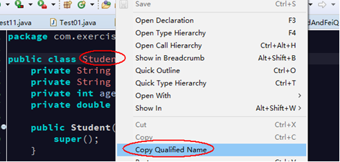
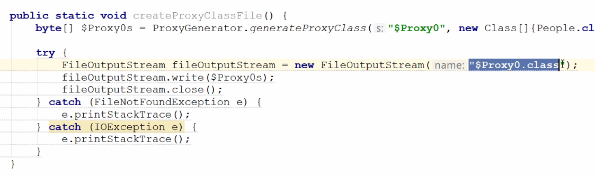
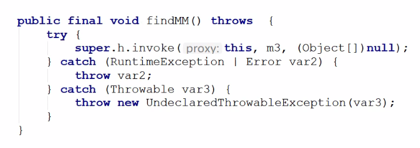

# Java基础 - 类加载器、反射

## 1. 类加载器

类加载器是负责加载类的对象，作用是通过类的全限定名获取该类的 class 字节码文件（二进制字节流），从硬盘加载到内存中，并且在内存中创建一个Class对象。

> Notes: 类加载器本身也是一个类


### 1.1. 类加载器的分类

**主要有以下四种类加载器:**

1. **引导类加载器（Bootstrap ClassLoader）**：`BootStrapClassLoader`，最底层的加载器（由 C 和 C++ 编写，不是 Java 中的类），是虚拟机自身的一部分。负责加载 Java 核心类库。如：`JAVA_HOME\lib\rt.jar`，或者被 `-Xbootclasspath` 参数所指定的路径中并且被虚拟机识别的类库。该类无法被 Java 程序直接引用。
2. **扩展类加载器（Extensions ClassLoader）**：`ExtClassLoader`，由 Java 程序编写，是Java类中的一个内部类。负责加载 JRE 中的扩展库的类。如：`JAVA_HOME\lib\ext`或 `Java.ext.dirs` 系统变量指定的路径中的所有类库。Java 虚拟机的实现会提供一个扩展库目录。该类加载器在此目录里面查找并加载 Java 类。

> Notes: **如果要使用 lib/ext 包中的类，要在 eclipse 中要进行如下设置**：
>
> 在“Project Properties --> Java Build Path”中的指定 JRE 包的访问规则，Edit 规则 Accessible，指定为 `sun/**`，指定可以在 eclipse 中访问 sun 开头的包。
>
> 

3. **应用类加载器（Application ClassLoader）**：`AppClassLoader`，由 Java 程序编写，是一个 Java 内部类。负责加载 CLASSPATH 指定的jar(包括第三方的库)和bin目录下的 Java 类。一般来说，Java 应用的类都是由它来完成加载的。可以通过 `ClassLoader.getSystemClassLoader()` 方法来获取它。一般情况，如果没有自定义类加载器，则默认使用该类加载器。
4. **用户自定义类加载器（User ClassLoader）**：通过继承 `java.lang.ClassLoader` 类的方式实现

### 1.2. 类加载器的加载机制（双亲委托机制）（理解）

对于任意一个类，都需要由加载它的类加载器和这个类本身一同确立在 JVM 中的唯一性，每一个类加载器，都有一个独立的类名称空间。类加载器就是根据指定全限定名称将 class 文件加载到 JVM 内存，然后再转化为 class 对象。

双亲委派模型：如果一个类加载器收到了类加载的请求，它首先不会自己去加载这个类，而是把这个请求委派给父类加载器去完成，每一层的类加载器都是如此，这样所有的加载请求都会被传送到顶层的启动类加载器中，只有当父加载无法完成加载请求（它的搜索范围中没找到所需的类）时，子加载器才会尝试去加载类。


1. 当 AppClassLoader 加载一个 class 时，它首先不会自己去尝试加载这个类，而是把类加载请求委派给父类加载器 ExtClassLoader 去完成
2. 当 ExtClassLoader 加载一个 class 时，它首先也不会自己去尝试加载这个类，而是把类加载请求委派给 BootStrapClassLoader 去完成
3. 如果 BootStrapClassLoader 加载失败（例如在 `$JAVA_HOME/jre/lib` 里未查找到该class），会使用 ExtClassLoader 来尝试加载
4. 若 ExtClassLoader 也加载失败，则会使用 AppClassLoader 来加载，如果 AppClassLoader 也加载失败，则会报出异常 ClassNotFoundException

### 1.3. ClassLoader 类

#### 1.3.1. 获取类加载器对象

通过 Class 对象的 `getClassLoader` 方法可以获得当前类的类加载器对象

```java
public ClassLoader getClassLoader()
```

> Notes: **通过`类名.class.getClassLoader()`获得，如果获得的类加载器对象是 null，则该类是由引导类加载器加载***

#### 1.3.2. ClassLoader 类常用方法

```java
public final ClassLoader getParent()
```

- 获得父加载器对象
- 三种类加载器之间没有子父类关系。只是一种叫法。
- 三种加载器的子父关系（上下级关系）：应用类加载器(AppClassLoader) --> 扩展类加载器(ExtClassLoader) --> 引导类加载器(BootstrapClassLoader)

```java
public URL getResource(String name)
```

- 如果资源文件是在src文件夹下，资源文件路径：不需要加“/”，代表从bin目录查找指定名称的资源文件。
- 返回的URL对象(统一资源定位符)

```java
public InputStream getResourceAsStream(String name)
```

- 如果资源文件是在src文件夹下，资源文件路径：不需要加“/”，代表从bin目录查找指定名称的资源文件。返回资源文件关联的字节输入流对象。

## 2. 类的加载

### 2.1. 类加载的概念

当第一次使用该类时，如果该类的字节码文件(class)还没有加载到内存中，则JVM会将该类的字节文件加载到内存中并在内存中创建一个Class对象(字节码文件对象)。**每一个类只会加载一次，每一个类的Class对象是都是唯一的**(单例)。

> Notes: **静态代码块：当类加载到内存中时会执行该类的静态代码块，而且只会加载一次**

### 2.2. 类加载的时机

1. 创建该类的对象和子类对象
2. 访问类的静态变量，或者为静态变量赋值（**静态常量除外**，因为静态常量在编译时已经存在）
3. 调用类的静态方法
4. 使用反射方式来强制创建某个类或接口对应的 `java.lang.Class` 对象
5. 初始化某个类的子类
6. 直接使用 `java` 命令来执行含有 main 方法的类时

> Notes: Java类的加载是动态的，它并不会一次性将所有类全部加载后再运行，而是保证程序运行的基础类(像是基类)完全加载到 JVM 中，至于其他类，则在需要的时候才加载。此做法就是为了节省内存开销。

### 2.3. 类装载方式

类装载方式分成以下两种：

1. 隐式装载，程序在运行过程中，当遇到通过 `new` 等方式生成对象时，隐式调用类装载器加载对应的类到 JVM 中
2. 显式装载，通过 `Class.forName("com.moon.Foo")` 等方法，显式加载需要的类

### 2.4. 类加载的过程

当程序要使用某个类时，如果该类还未被加载到内存中，则系统会通过以下步骤来实现对这个类进行初始化。

1. **加载**：就是指将 class 文件读入内存，并为之创建一个 Class 对象。任何类被使用时系统都会建立一个 Class 对象
2. **验证**：检查加载的 class 文件的正确性，是否有正确的内部结构，并和其他类协调一致
3. **准备**：负责为类的静态成员分配内存空间，并设置默认初始化值
4. **解析**：虚拟机将类的二进制数据中的常量池中符号引用替换成直接引用的过程。“符号引用”可以理解为一个标示，在直接引用中直接指向内存中的地址
5. **初始化**：对静态变量和静态代码块执行初始化工作

### 2.5. Class 类中两个常用方法

```java
public URL getResource(String name);
```

- 如果资源文件是在**src文件夹**下，资源文件路径:**“/文件名”**，代表从bin目录指定名称的资源文件。
- 如果**资源文件和当前类在同一个文件夹下时，资源文件路径可以省略/**，直接给文件名。
- 返回的URL对象（**统一资源定位符，不能包含中文字符，开发时注意**）
- 注：URL类的成员方法
    - `String getPath();` 获得资源文件的绝对路径字符串。

```java
public InputStream getResourceAsStream(String name);
```

- 如果资源文件是在src文件夹下，资源文件路径:“**/文件名**”，代表从bin目录指定名称的资源文件。
- 如果资源文件和当前类在同一个文件夹下时，资源文件路径可以**省略/**，直接给文件名。
- 返回与资源文件关联的字节输入流对象（**返回的对象：BufferedInputStream**）。

## 3. 反射的概述

### 3.1. 什么是反射

反射是一种机制，利用该机制可以在程序运行过程中对类进行解剖并操作类中所有成员。

因为在 Java 中把一切的东西都抽象成对象，所以类本身也可以抽象成一个对象。类中的构造方法、方法、成员变量等也可以抽象成对象。反射就是通过类对象Class，得到类中有哪些**构造方法Constructor**、**成员方法Method**、**成员变量（字段）Field** 等对象。

JAVA反射机制是在**运行状态**中，对于任意一个类，都能够知道这个类的所有属性和方法；对于任意一个对象，都能够调用它的任意一个方法和属性。

静态编译和动态编译

- **静态编译**：在编译时确定类型，绑定对象
- **动态编译**：运行时确定类型，绑定对象

> Notes: 反射的前提条件是，获得该类Class对象，就是字节码文件对象。

### 3.2. 反射机制优缺点

- 优点：运行期类型的判断，动态加载类，提高代码灵活度。
- 缺点：性能瓶颈：反射相当于一系列解释操作，通知 JVM 要做的事情，性能比直接的java代码要慢很多

### 3.3. 反射在实际开发中的应用

- 开发IDE（集成开发环境），比如:Eclipse
- 框架的学习或框架的开发（Struts, Spring, Hibernate）
- **反射中对象的规律**：有 Declared 的可以得到所有声明的方法，没有 Declared 的只能得到公共的方法
- **伪泛型**：在编译时期的进行限制，但利用反射可以在运行时候进行操作。
- 动态代理设计模式也采用了反射机制

## 4. Class 类

### 4.1. 获取 Class 对象的三种方式

- **方式一: 通过Object类中的`getClass()`方法**

```java
Person p = new Person();
Class c = p.getClass();
```

- **方式二: 通过 `类名.class` 获取到字节码文件对象**
    - 任意数据类型都具备一个class静态属性，**该类要和当前类在同一个项目中**

```java
Class c2 = Person.class;
```

- **方式三: 通过Class类中的静态方法 `forName(String str)`**
    - 将类名作为字符串传递给Class类中的静态方法forName即可。而类名必须全名：“包名.类名”(**在同一个项目下的类全名，不能跨项目的**)

```java
Class c3 = Class.forName("xx.xxx.Person");
```

**注意：第三种和前两种的区别前两种你必须明确Person类型。后面是指定这种类型的字符串即可，这种扩展更强，我不需要知道你的类，我只提供字符串，按照配置文件加载就可以了**

**注：三种方式得到的类对象，是同一个对象**

IDE中获取类全名的方法：右键类名 --> 选择Copy Qualified Name



### 4.2. Class 类常用方法

```java
public String getName();
```

- 得到类的完全限定类名。如：java.util.Date
- > API文档说明: 以 String 的形式返回此 Class 对象所表示的实体（类、接口、数组类、基本类型或 void）名称。

```java
public String getSimpleName();
```

- 得到类名。 如：Date
- > API文档说明: 返回源代码中给出的底层类的简称。如果底层类是匿名的则返回一个空字符串。

```java
public T newInstance()
```

- 通过无参数构造方法创建对象。之前建议创建类时要提供一个无参构造方法，是为使用反射获取一个无参对象。
- **使用此方法获取一个空参构造的对象前提**：
    1. 被反射的类，必须具有空参数构造方法
    2. 构造方法权限必须是 public
- 示例：

```java
Class c = Class.forName(xx.xxx.xxx.类名);    // (xx.xxx.xxx是包全名)
Object obj = c.newInstance();    // 使用Class类方法创建被反射类的对象

// 或使用泛型指定Class的类型：
Class<Student> c = (Class<Student>) Class.forName(xx.Student);
Student s = c.newInstance();
```

> API文档说明: 创建此 Class 对象所表示的类的一个新实例。如同用一个带有一个空参数列表的 new 表达式实例化该类。如果该类尚未初始化，则初始化这个类。

```java
public boolean isAssignableFrom(Class<?> cls)
```

判定此 `Class` 对象所表示的类或接口与方法参数 `Class<?> cls` 所表示的类或接口是否相同，或者是否为 `cls` 的超类或超接口。如果是则返回 true；否则返回 false。如果该 Class 表示一个基本类型，且指定的 Class 参数正是该 Class 对象，则该方法返回 true；否则返回 false。 

### 4.3. 综合示例

```java
public class Demo02 {
	public static void main(String[] args) throws IOException {
		// 获得当前类的Class对象
		InputStream in = Demo02.class.getResourceAsStream("a.txt");
		System.out.println(in);

		// 获得资源文件对饮的URL对象
		URL url = Demo02.class.getResource("/a.txt");
		// System.out.println(url.getPath());

		// 创建字节输入流
		FileInputStream fis = new FileInputStream(url.getPath());
		System.out.println(fis.read());
		// 关闭流
		fis.close();
	}
}
```

## 5. 反射获取构造方法(Constructor 类)

- 在反射机制中，把类中的成员（构造方法、成员方法、成员变量）都封装成了对应的类进行表示。其中，构造方法使用类**Constructor**表示。
- 每一个构造方法都是一个Constructor类的对象
- **可通过Class类中提供的方法获取构造方法**

### 5.1. Class 类方法，返回一个构造方法 Constructor 类型

```java
public Constructor<T> getConstructor(Class<?>... parameterTypes);
```

- 获取public修饰，指定参数类型所对应的构造方法

```java
public Constructor<T> getDeclaredConstructor(Class<?>... parameterTypes);
```

- 获取指定参数类型所对应的构造方法(包含私有的)
- 示例：
    - `Constructor<Student> con = c.getConstructor(xxx.class, xxx.class, xxx.class, xxx.class);`
    - 参数列表是**该类的构造方法对应的参数列表的数据类型.class**，个数也要和需要反射得到的构造方法一致。

### 5.2. Class 类方法，返回多个构造方法 Constructor 类型数组

```java
public Constructor<?>[] getConstructors();
```

- 获取所有的public 修饰的构造方法，返回一个 Constructor 类型数组

```java
public Constructor<?>[] getDeclaredConstructors();
```

- 获取所有的构造方法(包含private修饰)，返回一个 Constructor 类型数组

**注：基本类型与引用类型类对象：在Java 中int.class 和 Integer.class 是2 种不同的类型。所以如果参数类型不匹配，也无法得到相应的构造方法，会出现如下异常：`java.lang.NoSuchMethodException`**

### 5.3. Constructor 类 newInstance 方法

**反射方式获取构造方法后，创建对象使用到 Constructor 类的方法**

```java
public T newInstance(Object... initargs);
```

- 指定构造方法的参数值(0~n)，创建一个 T 对象

### 5.4. AccessibleObject 类 setAccessible 方法

**AccessibleObject 类是 Field、Method 和 Constructor 对象的父类。它提供了将反射的对象标记为在使用时取消默认 Java 语言访问控制检查的能力。**

对于公共成员、默认（打包）访问成员、受保护成员和私有成员，在分别使用 Field、Method 或 Constructor 对象来设置或获取字段、调用方法，或者创建和初始化类的新实例的时候，会执行访问检查。常用方法如下：

```java
public void setAccessible(boolean flag) throws SecurityException
```

- 设置是否取消权限检查（**暴力反射**）
- 参数值为 **true** 则指示反射的对象在使用时应该**取消** Java 语言访问检查。参数值为 **false** 则指示反射的对象应该**实施** Java 语言访问检查。
- 示例：
    - `反射出来的对象(Field、Method 和 Constructor).setAccesible(true);`
    - 调用过这方法的私有对象后面才可以进行使用和修改

5、通过反射方式，获取构造方法(私有)，创建对象

- 获取构造方法，创建对象的步骤如下：
	1. 获取到Class对象;
	2. 获取指定的构造方法;
	3. 暴力访问, 通过setAccessible(boolean flag)方法（如果是私有）
	4. 通过构造方法类Constructor中的方法，创建对象;
- **不推荐访问私有，因为破坏了程序的封装性，安全性**

### 5.5. 案例：反射获取构造方法创建对象(包含私有构造方法)

```java
import java.lang.reflect.Constructor;

/*
 *	通过反射方式，获取构造方法(包含私有构造方法)，创建对象
 */
public class MoonZero {
	public static void main(String[] args) throws Exception {
		// 获取Student的Class对象
		// Class<Student> c = (Class<Student>) Class.forName("com.exercise.Student");
		// 或者直接类名.class;
		Class<Student> c = Student.class;

		// 获取Student的空参构造
		Constructor<Student> con1 = c.getConstructor();
		System.out.println(con1);
		// 创建无参对象
		Student s1 = con1.newInstance();
		System.out.println(s1);
		// 获取Student的有参构造
		Constructor<Student> con2 = c.getConstructor(String.class, String.class, int.class, double.class);
		System.out.println(con2);
		// 创建有参对象
		Student s2 = con2.newInstance("001", "凌月", 23, 90);
		System.out.println(s2);

		// 获取Student的private有参构造方法
		Constructor<Student> con3 = c.getDeclaredConstructor(String.class, String.class, int.class);
		System.out.println(con3);

		// 暴力反射
		con3.setAccessible(true);

		// 创建prviate有参构造方法
		Student s3 = con3.newInstance("002", "傷月", 24);
		System.out.println(s3);
	}
}
```

## 6. 反射获取成员变量（Field 类）

在反射机制中，把类中的成员变量使用类**Field**表示。可通过Class类中提供的方法获取成员变量：

### 6.1. Class 类方法，返回一个成员变量

```java
public Field getField(String name);
```

- 获取指定的 public修饰的变量

```java
public Field getDeclaredField(String name);
```

- 获取指定的任意变量

### 6.2. Class 类方法，返回多个成员变量

```java
public Field[] getFields();
```

- 获取所有public 修饰的成员变量

```java
public Field[] getDeclaredFields();
```

- 获取所有的成员变量(包含private修饰)

### 6.3. Field 类 set/get 方法

**反射方式获取成员变量后，创建对象使用到 Field 类的方法**

```java
public void set(Object obj, Object value)
```

- 给指定对象 Obj 的成员变量赋值为指定的值 value

```java
public Object get(Object obj)
```

- 获得指定对象 obj 的当前成员变量的值

**其他常用方法：**

```java
public String getName()
```

- 返回此 Field 对象表示的字段的名称(**即成员变量的变量名称**)

```java
public Class<?> getType()
```

- 返回一个 Class 对象，它标识了此 Field 对象所表示字段的声明类型。

### 6.4. 其他常用方法

```java
public boolean isAnnotationPresent(Class<? extends Annotation> annotationClass)
```

继承 `java.lang.reflect.AccessibleObject` 类的方法，判断当前字段对象上是否标识某个注解。是则返回 true，否则返回 false

### 6.5. 通过反射，创建对象，获取指定的成员变量，进行赋值与获取值操作

获取成员变量，步骤如下：

1. 获取 Class 对象
2. 获取构造方法
3. 通过构造方法，创建对象
4. 获取指定的成员变量（私有成员变量，通过 `setAccessible(boolean flag)` 方法暴力访问和修改）
5. 通过方法，给指定对象的指定成员变量赋值或者获取值

### 6.6. 案例：通过反射方式，获取成员变量(私有成员变量)，并修改

```java
import java.lang.reflect.Constructor;
import java.lang.reflect.Field;

/*
 *	通过反射方式，获取成员变量(私有成员变量)，并修改
 */
public class MoonZero {
	public static void main(String[] args) throws Exception {
		// 获取Student的Class对象，直接类名.class;
		Class<Student> c = Student.class;
		// 通过反射方式获取Student的public有参构造
		Constructor<Student> con = c.getConstructor(String.class, String.class, int.class, double.class);
		// 使用Constructor类的方法获取一个Student对象
		Student s = con.newInstance("001", "敌法师", 23, 90);
		// 输出Student对象[id=001, name=敌法师, age=23, score=90.0]
		System.out.println(s);

		// 获取public修饰的成员变量
		Field f1 = c.getField("name");
		// [public java.lang.String com.exercise.Student.name]
		System.out.println(f1);
		// 获取成员变量的值[敌法师]
		System.out.println(f1.get(s));
		// 修改成员变量的值
		f1.set(s, "改改");
		// 获取修改后成员变量的值[改改]
		System.out.println(f1.get(s));
		// [id=001, name=改改, age=23, score=90.0]
		System.out.println(s);

		// 获取private修饰的成员变量
		Field f2 = c.getDeclaredField("id");
		// private java.lang.String com.exercise.Student.id
		System.out.println(f2);

		// 强行反射修改成员变量
		f2.setAccessible(true);
		// 获取私有的成员变量[001]
		System.out.println(f2.get(s));
		// 修改私有的成员变量
		f2.set(s, "00x");

		// [id=00x, name=改改, age=23, score=90.0]
		System.out.println(s);

		// 获取该成员变量的名称,返回String类型，[name]
		System.out.println(f1.getName());
		//获取该成员变量的类型，返回Class类型，[class java.lang.String]
		System.out.println(f1.getType());
	}
}
```

## 7. 反射获取成员方法（Method 类）

**在反射机制中，把类中的成员方法使用类Method表示。可通过Class类中提供的方法获取成员方法：**

### 7.1. Class 类返回获取一个方法

```java
public Method getMethod(String name, Class<?>... parameterTypes);
```

- 获取指定参数 public 修饰的方法

```java
public Method getDeclaredMethod(String name, Class<?>... parameterTypes);
```

- 获取任意指定参数的方法，包含私有的
- 参数1: name 要查找的方法名称；
- 参数2: parameterTypes 该方法的参数类型
- 示例：
    - `Method<Student> met = c.getDeclaredMethod("方法名", xxx.class, xxx.class, xxx.class, xxx.class);`
    - 参数列表是**需要获取的方法名;后面是该类的方法对应的参数列表的数据类型.class**，个数也要和需要反射得到的方法一致。如果该方法没有参数，则只写方法名。

### 7.2. Class 类返回获取多个方法

```java
public Method[] getMethods();
```

获取本类与父类（接口）中所有public 修饰的方法（**包括继承的所有方法**）

```java
public Method[] getDeclaredMethods();
```

获取本类中所有的方法(包含私有的，**但不包括继承的方法**)

### 7.3. Method 类 invoke 方法

```java
public Object invoke(Object obj,  Object... args)
```

- 示例

```java
// 调用对象方法。如果方法是无参，则可以不用写
method对象.invoke(该方法所在类对象, 方法的参数值);

// 调用静态方法。
method对象.invoke(null(或该方法的所在的类对象), 方法的参数值);
```

- 执行指定对象obj中，当前Method对象所代表的方法，方法要传入的参数通过args指定。返回值为当前调用的方法的返回值

### 7.4. 通过反射，创建对象，调用指定的方法（包括private）

获取成员方法（包括私有），步骤如下：

1. 获取Class对象
2. 获取构造方法
3. 通过构造方法，创建对象
4. 获取指定的方法
5. 开启暴力访问
6. 执行找到的方法

### 7.5. 案例：通过反射方式，获取成员方法(私有成员变量)，并调用

```java
import java.lang.reflect.Constructor;
import java.lang.reflect.Method;

/*
 *	通过反射方式，获取成员方法(私有成员变量)，并调用
 */
public class MoonZero {
	public static void main(String[] args) throws Exception {
		// 获取Student的Class对象,直接类名.class
		Class<Student> c = Student.class;
		// 通过反射，获取Student公共无参构造方法，直接用Class类的newInstance方法获取
		Student s = c.newInstance();

		// 或者通过Constructor类获取
		Constructor<Student> con = c.getConstructor();
		Student s2 = con.newInstance();

		// 获取公共方法
		Method m1 = c.getMethod("eat");
		// 调用该方法
		m1.invoke(s);

		// 获取私有方法
		Method m2 = c.getDeclaredMethod("sleep");
		// 强制执行
		m2.setAccessible(true);
		// 调用私有方法
		m2.invoke(s);

		// 获取静态方法
		Method m3 = c.getMethod("play");
		m3.invoke(s);
		// 或者
		m3.invoke(null);
	}
}
```

*上面三例使用到的Student类*

```java
public class Student {
	private String id;
	public String name;
	private int age;
	private double score;

	public Student() {
		super();
	}

	public Student(String id, String name, int age, double score) {
		this.id = id;
		this.name = name;
		this.age = age;
		this.score = score;
	}

	@SuppressWarnings("unused")
	private Student(String id, String name, int age) {
		super();
		this.id = id;
		this.name = name;
		this.age = age;
	}

	@Override
	public String toString() {
		return "Student [id=" + id + ", name=" + name + ", age=" + age + ", score=" + score + "]";
	}

	// 私有方法
	@SuppressWarnings("unused")
	private void sleep() {
		System.out.println("正在睡觉");
	}

	// 公共方法
	public void eat() {
		System.out.println("正在吃饭");
	}

	// 静态方法
	public static void play() {
		System.out.println("正在玩耍");
	}
}
```

## 8. 反射获取超类

### 8.1. Class 类获取超类的方法

```java
public Type getGenericSuperclass()
```

上面 `Class` 类对象的方法，用于获取此 `Class` 所表示的实体（类、接口、基本类型或 void）的直接超类的 Type。如果超类是参数化类型（泛型），则返回的 `Type` 对象能准确反映源代码中所使用的实际类型参数。如果以前未曾创建表示超类的参数化类型，则创建这个类型。有关参数化类型创建过程的语义，请参阅 ParameterizedType 声明。

如果此 `Class` 对象是 `Object` 类、接口、基本类型或 void，则返回 null。如果此对象是一个数组类，则返回表示 `Object` 类的 `Class` 对象。 

### 8.2. 反射获取泛型参数示例

假设某个类继承带泛型的类

```java
class StudentDao extends BaseDao<Student> {
}
```

通过该字节码对象的 `getGenericSuperclass` 方法获取其父类，然后判断返回的 `Type` 类型是否为 `ParameterizedType`，再通过 `ParameterizedType` 类的 `getActualTypeArguments` 获取父类中的实际类型参数的 `Type` 对象的数组。

```java
Type type = StudentDao.class.getGenericSuperclass();
System.out.println(type);

if (type instanceof ParameterizedType ) {
    System.out.println(((ParameterizedType)type).getActualTypeArguments()[0]);  // 因为示例只是一个泛型，所以直接获取第一个元素
}
```

## 9. Reflections 反射框架(待整理)


## 10. 反射与Properties案例

### 10.1. 案例1

```java
import java.io.File;
import java.io.FileInputStream;
import java.lang.reflect.Field;
import java.util.Properties;
import java.util.Set;

/*
 *	2.1需求
 *	1)有属性内容如下：
 *	注意：文件放在项目根目录下
 *	student.properties
 *	    id=1
 *	    name=Sandy
 *	    gender=\u7537
 *	    score=100
 *	2)有一个 Student 类的属性：Student(String id, String name, String gender, String score)，
 *	这里将所有的属性设置成了 String 类型。
 *	3)通过 Properties 类读取 student.properties 文件
 *	4)使用反射的方式把属性文件中读取的数据赋值给一个实例化好的 Student 对象，
 *	Student 类中的属性名与student.properties 要对应。
 *	5)重写 Student 的 toString()方法，输出对象的属性值 。
 */
public class MoonZero {
	public static void main(String[] args) throws Exception {
		// 创建配置文件的路径对象
		File file = new File("student.properties");
		// 创建字节输入流对象
		FileInputStream fis = new FileInputStream(file);
		// 创建Properties集合并读取配置文件
		Properties props = new Properties();
		props.load(fis);
		// 关闭流资源
		fis.close();

		String className = "com.exercise.Student";
		// 调用方法获取实例化的对象（第一种方法容易出现异常，使用第二种）
		Student s = (Student) createObject(className, props);
		Student s1 = (Student) createObject1(className, props);
		// 输出结果:Student [id=1, name=Sandy, gender=男, score=100]
		System.out.println(s);
		System.out.println(s1);
	}

	/**
	 * 读取Properties配置文件，使用反射实例化一个Student对象
	 * 这种方法有缺陷，如果以集合的键去获取成员变量对象，如果键不与对象的名字一致，
	 * 则会出现java.lang.NoSuchFieldException 找不到字段的异常
	 * @param className
	 *            需要实例化的对象
	 * @param props
	 *            Properties配置文件
	 * @return 实例化的对象
	 * @throws Exception
	 */
	@SuppressWarnings("rawtypes")
	public static Object createObject(String className, Properties props) throws Exception {
		// 获取类的Class对象
		Class c = Class.forName(className);

		// 获取一个无参的Studnet对象
		Object obj = c.newInstance();

		// 获取Properties集合的键Set集合
		Set<String> set = props.stringPropertyNames();
		// 遍历集合，使用反射给对象赋值
		for (String s : set) {
			// 获取成员变量对象
			Field f = c.getDeclaredField(s);
			// 暴力反射给成员变量赋值
			f.setAccessible(true);
			f.set(obj, props.getProperty(s));
		}
		return obj;
	}

	/**
	 * 读取Properties配置文件，使用反射实例化一个Student对象（第2种）
	 *
	 * @param className
	 *            需要实例化的对象
	 * @param props
	 *            Properties配置文件
	 * @return 实例化的对象
	 * @throws Exception
	 */
	@SuppressWarnings("rawtypes")
	public static Object createObject1(String className, Properties props) throws Exception {
		// 获取类的Class对象
		Class c = Class.forName(className);

		// 获取一个无参的Studnet对象
		Object obj = c.newInstance();

		// 获取成员变量对象数组
		Field[] arr = c.getDeclaredFields();
		// 遍历数组使用反射给成员变量赋值
		for (Field f : arr) {
			// 获取成员变量名称
			String key = f.getName();
			// Properties对应的值
			String value = props.getProperty(key);

			// 暴力反射
			f.setAccessible(true);
			f.set(obj, value);
		}

		return obj;
	}
}
```

# 代理模式

## 1. 代理模式的概述

代理模式的作用：拦截对真实对象的直接访问，并增加一些功能。

## 2. 代理模式的分类(了解)

代理模式分成静态代理和动态代理

区别：**静态代理字节码文件已经生成；动态代理的字节码文件随用随加载**。

### 2.1. 静态代理模式

静态代理模式的特点：

1. 优点：
    - 不需要修改目标对象就实现了目标对象功能的增加
2. 缺点：
    - 一个真实对象必须对应一个代理对象，如果大量使用会导致类的数量急速增长。
    - 如果抽象对象中存在很多方法，则代理对象也要同样实现相应数量的方法。

### 2.2. 动态代理模式

动态代理模式特点：

1. 动态生成代理对象，不用手动编写代理对象
2. 不需要编写目标对象中所有同名的方法

## 3. JDK 动态代理使用

### 3.1. Proxy 类 newProxyInstance 方法

```java
public static Object newProxyInstance(ClassLoader loader, Class<?>[] interfaces, InvocationHandler h)
```

创建代理对象，生成动态代理的方法

- 参数`ClassLoader loader`：类加载器对象，和被代理对象使用相同的类加载器
- 参数`Class<?>[] interfaces`：真实对象所现实的所有接口的class对象数组，即和被代理对象具有相同的行为，实现相同的接口。
- 参数`InvocationHandler h`：回调处理对象，具体的代理操作，`InvocationHandler`是一个接口，需要传入一个实现了此接口的实现类。（**可以使用匿名内部类来现实**）

<font color=red>**回调处理对象注意事项：不要在invoke方法中通过proxy对象调用方法，因为会产生死循环**</font>

<u><font color=purple>**真实对象与代理对象的是实现了共同接口，所以返回的Object代理对象需要转成接口类型**</font></u>

> 引用网络资料的解释：为什么jdk动态代理的对象必须实现一个统一的接口，其实我的理解大致是代理类本身已经 extends 了 TimeHandler,如果传入的是父类，很可能出现这种情况：“public class $Proxy1 extends Proxy extends 传入的父类”；这个明显在 java 中是不允许的，Java 只支持单继承，但是实现接口是完全可以的。

### 3.2. InvocationHandler 接口的核心方法

`InvocationHandler`的`invoke`方法，**在这方法中实现对真实方法的增强或拦截**

> 该方法使用了一个设计模式：策略模式
>
> - 参与者明确
> - 目标明确
> - 中间实现的过程就是策略

```java
public Object invoke(Object proxy, Method method, Object[] args);
```

- 作用：每当通过代理对象调用方法时，都会被该方法拦截。
- 参数`Object proxy`：代理对象本身（不一定每次都用得到）。即方法` newProxyInstance()`方法返回的代理对象，该对象一般<font color=red>**不要在 `invoke` 方法中使用，容易出现递归调用**</font>。
- 参数`Method method`：代理对象调用的方法，被拦截的方法，<font color=red>**真实对象的方法对象**</font>，会进行多次调用，每次调用 method 对象都不同。
- 参数`Object[] args`：**代理对象调用方法时传递的参数，该参数会传递给真实对象的方法**。
- 返回值Object：**一般返回真实对象方法执行后的结果**。

### 3.3. Class 类 getInterfaces 方法

```java
public Class<?>[] getInterfaces()
```

- 作用：返回调用对象的类所有的接口数组。
- 如果此对象表示一个类，则返回值是一个数组，它包含了表示该类所实现的所有接口的对象。

示例（伪代码）

```java
public class Demo implements A, B, C, …… {
}
Class[] arr = Demo.class.getInterfaces();
```

### 3.4. 动态代理模式的开发步骤(案例)

1. 先明确要被代理的功能(方法)是什么
2. 然后将需要被代理的(功能)方法定义的接口中
3. 真实对象实现接口重写方法
4. 创建真实对象，但不通过真实对象直接调用方法
5. 利用 `Proxy` 类创建代理对象
	- 真实对象的类加载器
	- 真实对象现实的所有接口的 `Class` 类型数组
	- 回调处理对象，拦截对代理方法调用
6. 通过代理对象调用相关方法，方法就会被回调处理对象拦截。其实是调用 `InvocationHandler` 接口中的 `invoke()` 方法，值得注意的是，接口中每个方法的调用都会触发 `InvocationHandler.invoke` 方法，可以在拦截的方法中执行相关的判断。

#### 3.4.1. Code Demo 1

> 注：定义了个有参构造方法，传入被代理对象。也可以使用直接使用final修饰被代理的成员变量。

```java
package level01.test04;

import java.lang.reflect.Proxy;

/*
 * 关卡1训练案例4
 * 一、按以下要求编写代码：
 	* 1. 定义一个接口：Person，包含以下抽象方法：work()
 		* 1) 定义一个类 Student，实现 Person 接口，实现 work()方法，打印输出：”我做 Java 项目”；
 	* 2. 定义一个 MyHandler，实现 InvocationHandler 接口，有如下要求：
		 * 1) 定义成员属性--被代理对象：
		 * 2) 定义构造方法，为被代理对象赋值；
		 * 3) 定义一个方法 before()，打印输出：”项目设计”；
		 * 4) 定义一个方法 after()，打印输出：”项目总结”；
		 * 5) 重写 invoke()方法，要求在调用方法前执行 before()方法，在调用方法后执行 after()方法。
	* 3. 定义一个测试类：Test，包含 main()方法。要求用动态代理获取 Student 类的代理对象，并执行 work()方法。
 */
public class Test01_04 {
	public static void main(String[] args) {
		// 创建学生类对象
		Student stu = new Student();

		// 创建MyHandler对象
		MyHandler h = new MyHandler(stu);

		// 创建代理对象
		Person proxy = (Person) Proxy.newProxyInstance(stu.getClass().getClassLoader(),
				stu.getClass().getInterfaces(), h);

		// 使用代理对象调用学生类的方法
		proxy.work();
	}
}


package level01.test04;

import java.lang.reflect.InvocationHandler;
import java.lang.reflect.Method;

// 定义MyHandler实现InvocationHandler接口
public class MyHandler implements InvocationHandler {
	private Object target;

	public MyHandler(Object target) {
		this.target = target;
	}

	// 重写invoke方法
	@Override
	public Object invoke(Object proxy, Method method, Object[] args) throws Throwable {
		before();
		Object obj = method.invoke(target, args);
		after();
		return obj;
	}

	public static void before() {
		System.out.println("项目设计");
	}

	public static void after() {
		System.out.println("项目总结");
	}
}

package level01.test04;

public class Student implements Person{
	@Override
	public void work() {
		System.out.println("我做 Java 项目");
	}
}


package level01.test04;

public interface Person {
	public void work();
}
```

#### 3.4.2. Code Demo 2

或者这样玩，在`InvocationHandler`接口的实现类中直接使用`Proxy`的`newProxyInstance`方法，返回一个代理对象。

```java
package level01.test04;

public class Test01_04 {
	public static void main(String[] args) {
		// 创建学生类对象
		Student stu = new Student();

		// 创建MyHandler对象
		MyHandler h = new MyHandler();

		// 调用MyHandler方法直接获取代理对象
		Person proxy = (Person) h.getProxy(stu);

		// 使用代理对象调用学生类的方法
		proxy.work();
	}
}


import java.lang.reflect.InvocationHandler;
import java.lang.reflect.Method;
import java.lang.reflect.Proxy;

public class MyHandler implements InvocationHandler {
	private Object target;

	public Object getProxy(Object target) {
		this.target = target;
		return Proxy.newProxyInstance(target.getClass().getClassLoader(),
								target.getClass().getInterfaces(), this);
	}

	// 重写invoke方法
	@Override
	public Object invoke(Object proxy, Method method, Object[] args) throws Throwable {
		before();
		Object obj = method.invoke(target, args);
		after();
		return obj;
	}

	public static void before() {
		System.out.println("项目设计");
	}

	public static void after() {
		System.out.println("项目总结");
	}
}
```

**总结这种方式的好处：**

1. Proxy类的代码量被固定下来，不会因为业务的逐渐庞大而庞大；
2. 可以实现AOP编程(面向切面编程)，实际上静态代理也可以实现，总的来说，AOP可以算作是代理模式的一个典型应用；
3. 解耦，通过参数就可以判断真实类，不需要事先实例化，更加灵活多变。

#### 3.4.3. 框架学习阶段时案例

```java
public interface IActor {
	/**
	 * 基本表演
	 */
	void basicAct(float money);

	/**
	 * 精彩表演
	 */
	void wonderfulAct(float money);
}

public class ActorImpl implements IActor {

	@Override
	public void basicAct(float money) {
		System.out.println("拿到 " + money + " 元，开始基本的表演!!");
	}

	@Override
	public void wonderfulAct(float money) {
		System.out.println("拿到 " + money + " 元，开始精彩的表演!!");
	}

}

/**
 * 动态代理测试
 */
public class Client {
	public static void main(String[] args) {
		// 获取接口实现类
		IActor actor = new ActorImpl();

		System.out.println("=============没有使用动态代理模式前=============");
		actor.basicAct(108.89F);
		actor.wonderfulAct(3000.1F);
		System.out.println("=============没有使用动态代理模式后=============");

		// 获取代理
		IActor proxy = (IActor) Proxy.newProxyInstance(ActorImpl.class.getClassLoader(),
				ActorImpl.class.getInterfaces(), new InvocationHandler() {
					// 重写拦截的方法
					@Override
					public Object invoke(Object proxy, Method method, Object[] args) throws Throwable {
						// 获取调用方法的名字
						String mothodName = method.getName();
						// 获取调用方法的参数
						float money = (float) args[0];

						// 开始判断
						if ("basicAct".equals(mothodName)) {
							// 对象调用了basicAct方法
							if (money > 2000) {
								// 满足条件才执行方法
								proxy = method.invoke(actor, money / 2);
							}
						} else if ("wonderfulAct".equals(mothodName)) {
							// 对象调用了wonderfulAct方法
							if (money > 5000) {
								// 满足条件才执行方法
								proxy = method.invoke(actor, money / 2);
							}
						}

						return proxy;
					}
				});

		// 使用代理调用方法
		proxy.basicAct(1003F);
		proxy.wonderfulAct(6234F);
	}
}
```

### 3.5. Proxy 类 newProxyInstance 生成代理对象的实现原理

#### 3.5.1. 模拟 JDK 的动态代理实现示例

定义一个接口

```java
public interface DemoInterface {
    void foo();

    int bar();
}
```

定义用于测试的被代理类

```java
public class DemoTarget implements DemoInterface {
    @Override
    public void foo() {
        System.out.println("被代理类 DemoTarget.foo() 方法执行了...");
    }

    @Override
    public int bar() {
        System.out.println("被代理类 DemoTarget.bar() 方法执行了...");
        return 99;
    }
}
```

**重点：定义模拟 JDK 动态代理生成的代理类 `$Proxy0`。**。

```java
public class $Proxy0 extends Proxy implements DemoInterface {

    static Method foo;
    static Method bar;

    static {
        try {
            // 反射获取被代理类的中方法对象
            foo = DemoTarget.class.getMethod("foo");
            bar = DemoTarget.class.getMethod("bar");
        } catch (NoSuchMethodException e) {
            e.printStackTrace();
            throw new NoSuchMethodError(e.getMessage());
        }
    }

    // 继承的 Proxy 类中，有一个 InvocationHandler 类型的属性，调用父类构造，给属性设值
    public $Proxy0(InvocationHandler h) {
        super(h);
    }

    @Override
    public void foo() {
        try {
            // 方法无参数
            h.invoke(this, foo, new Object[0]);
        } catch (RuntimeException | Error e) {
            throw e;
        } catch (Throwable e) {
            throw new UndeclaredThrowableException(e);
        }
    }

    @Override
    public int bar() {
        try {
            // 获取方法调用的返回值，并返回
            Object result = h.invoke(this, bar, new Object[0]);
            return (int) result;
        } catch (RuntimeException | Error e) {
            throw e;
        } catch (Throwable e) {
            throw new UndeclaredThrowableException(e);
        }
    }
}
```

测试代码

```java
@Test
public void testCustomProxy() {
    // 创建自己实现的代理对象
    DemoInterface demo = new $Proxy0(new InvocationHandler() {
        @Override
        public Object invoke(Object proxy, Method method, Object[] args) throws Throwable {
            // 模拟功能增强
            System.out.println("代理功能增强...");
            // 调用目标的方法，并返回
            return method.invoke(new DemoTarget(), args);
        }
    });

    // 调用接口的方法，由代理来实现
    demo.foo();
    demo.bar();
}
```

测试运行结果

```
代理功能增强...
被代理类 DemoTarget.foo() 方法执行了...
代理功能增强...
被代理类 DemoTarget.bar() 方法执行了...
```

#### 3.5.2. InvocationHandler 接口的 invoke 方法的调用

`Proxy.newProxyInstance(ClassLoader loader, Class<?>[] interfaces, InvocationHandler h)`方法，会生成一个代理对象，此代理对象名称叫`$Proxy0@xxx`。此代理对象会拥有一个属性`h`，该属性就是实现了`InvocationHandler`接口的实例（编写增强逻辑的类）。接口实现`h`有一个属性，就是待增强的类的实例。

通过一个工具方法，获取生成的代理实例的字节码数组，然后通过文件流的方式生成`.class`文件



再通过反编译去查询生成的文件，可以发现，其实在调用待增强的方法时，该方法里就只做了一个事情，就是调用`h`实例中的`invoke`方法。所以就是当通过`Proxy.newProxyInstance()`方法生成的代理对象，执行与待增强类实现的接口方法时，就会调用到`invoke`方法。



#### 3.5.3. newProxyInstance 方法的执行过程

1. 首先会生成一个代理类，通过拼凑字符串的方法生成一个叫`$Proxy0`的类，以`.java`结尾
2. 使用文件流将拼凑好的字符串生成`$Proxy0.java`文件到本地磁盘中
3. 在运行时，将`$Proxy0.java`文件编译成`$Proxy0.class`文件
4. 使用类加载器，将`$Proxy0.class`文件加载到JVM内存中
5. 在内存中执行，并返回代理实例


### 3.6. JDK 动态代理注意事项

- JDK 的代理类是由 JDK 直接生成字节码文件，可以用 arthas 的 jad 工具反编译代理类查看源码
- 代理类会继承 `Proxy` 类，该父类中有一个 `InvocationHandler h` 属性，通过接口回调的方式来实现代理增强的逻辑
- 在代理实现的接口方法中，通过反射调用相应的目标方法
- 代理增强是借助多态来实现，因此<font color=red>**成员变量、静态方法、final 方法均不能通过代理实现**</font>
- 扩展知识：JDK 的动态代理对反射调用目标对象的方法做了优化。
    - 前 16 次都是使用反射调用，性能较低
    - 第 17 次调用会生成代理类，优化为非反射调用
    - 可使用 arthas 的 jad 工具反编译第 17 次调用生成的代理类，查看源码
    - > 注意：运行测试程序时须添加 `--add-opens java.base/java.lang.reflect=ALL-UNNAMED --add-opens java.base/jdk.internal.reflect=ALL-UNNAMED`

## 4. CGlib 动态代理使用

### 4.1. CGlib 基础使用

定义接口与实现类

```java
public interface DemoInterface {
    void foo();
    int bar();
}

public class DemoTarget implements DemoInterface {
    @Override
    public void foo() {
        System.out.println("被代理类 DemoTarget.foo() 方法执行了...");
    }

    @Override
    public int bar() {
        System.out.println("被代理类 DemoTarget.bar() 方法执行了...");
        return 99;
    }
}
```

使用 CGlib 生成动态代理。与 JDK 的动态代理用法十分接近，主要区别有以下两点：

- 增强逻辑的回调是定义在 `net.sf.cglib.proxy.MethodInterceptor` 接口中
- 用于增强的拦截方法形参不一样，分别提供了 `Method` 方法对象与 `MethodProxy` 对象用于进行目标方法的调用
    - `method.invoke` 是与 jdk 动态代理一样，通过反射调用，必须调用到足够次数才会进行优化
    - `methodProxy.invoke` 不通过反射调用，它会正常（间接）调用目标对象的方法（Spring 框架底层采用）
    - `methodProxy.invokeSuper` 也是不通过反射调用，它会正常（间接）调用代理对象的方法，可以省略目标对象

```java
@Test
public void testCglibBasic() {
    // 创建被代理对象
    DemoTarget demoTarget = new DemoTarget();

    // 创建代理
    DemoInterface demoInterface = (DemoInterface) Enhancer.create(DemoTarget.class, new MethodInterceptor() {

        @Override
        public Object intercept(Object proxy, Method method, Object[] args, MethodProxy methodProxy) throws Throwable {
            // 模拟增强逻辑
            System.out.println("CGlib 动态代理的 MethodProxy signature: " + methodProxy.getSignature());
            // 使用反射，调用原始目标方法
            // return method.invoke(demoTarget, args);
            // 内部没有用反射, 需要目标对象，spring 框架采用这种方式
            return methodProxy.invoke(demoTarget, args);
            // 内部没有用反射, 需要代理对象
            // return methodProxy.invokeSuper(proxy, args);
        }
    });

    demoInterface.foo();
    demoInterface.bar();
}
```

> 注意事项：通过 `MethodProxy` 调用目标方法，在 jdk >= 9 的情况下，在调用 `Object` 的方法会有问题，启动程序时需要设置：`--add-opens java.base/java.lang=ALL-UNNAMED`

### 4.2. 模拟 CGlib 代理基础实现

定义用于测试的被代理类

```java
public class Target {

    public void save() {
        System.out.println("被代理类 Target.save() 方法执行...");
    }

    public void save(int i) {
        System.out.println("被代理类 Target.save(int) 方法执行，参数：" + i);
    }

    public void save(long j) {
        System.out.println("被代理类 Target.save(long) 方法执行，参数：" + j);
    }
}
```

CGlib 动态代理是继承被代理类

```java
// CGlib 代理是继承被代理类
public class CglibProxyMock extends Target {

    // 定义用于增强的回调接口的属性
    private MethodInterceptor methodInterceptor;

    // 通过构造函数或者 setter 方法来接收 MethodInterceptor 回调接口
    public CglibProxyMock(MethodInterceptor methodInterceptor) {
        this.methodInterceptor = methodInterceptor;
    }

    // 定义方法反射调用的 Method 属性
    static Method save0;
    static Method save1;
    static Method save2;
    // 定义不使用反射调用的 MethodProxy 属性
    static MethodProxy save0Proxy;
    static MethodProxy save1Proxy;
    static MethodProxy save2Proxy;

    static {
        try {
            save0 = Target.class.getMethod("save");
            save1 = Target.class.getMethod("save", int.class);
            save2 = Target.class.getMethod("save", long.class);
            /*
             * 创建 MethodProxy 对象
             *  参数1：被代理类字节码对象
             *  参数2：代理类字节码对象
             *  参数3：代理方法的返回值与形参的表达式
             *  参数4：增强后的方法名称
             *  参数5：原始方法的名称
             */
            save0Proxy = MethodProxy.create(Target.class, CglibProxyMock.class, "()V", "save", "saveSuper");
            save1Proxy = MethodProxy.create(Target.class, CglibProxyMock.class, "(I)V", "save", "saveSuper");
            save2Proxy = MethodProxy.create(Target.class, CglibProxyMock.class, "(J)V", "save", "saveSuper");
        } catch (NoSuchMethodException e) {
            throw new NoSuchMethodError(e.getMessage());
        }
    }

    // ***** 带原始功能的方法，直接调用父类方法 *****
    public void saveSuper() {
        super.save();
    }

    public void saveSuper(int i) {
        super.save(i);
    }

    public void saveSuper(long j) {
        super.save(j);
    }

    // ***** 带增强功能的方法，通过 MethodInterceptor.intercept 回调方法执行功能增强 *****
    @Override
    public void save() {
        try {
            methodInterceptor.intercept(this, save0, new Object[0], save0Proxy);
        } catch (Throwable e) {
            throw new UndeclaredThrowableException(e);
        }
    }

    @Override
    public void save(int i) {
        try {
            methodInterceptor.intercept(this, save1, new Object[]{i}, save1Proxy);
        } catch (Throwable e) {
            throw new UndeclaredThrowableException(e);
        }
    }

    @Override
    public void save(long j) {
        try {
            methodInterceptor.intercept(this, save2, new Object[]{j}, save2Proxy);
        } catch (Throwable e) {
            throw new UndeclaredThrowableException(e);
        }
    }
}
```

### 4.3. MethodProxy 的实现原理

上面提及 `MethodProxy` 类可以避免反射调用目标方法，原理是当调用 `MethodProxy` 的 `invoke` 或 `invokeSuper` 方法时，会动态生成两个类，都会继承 `net.sf.cglib.reflect.FastClass` 抽象类

- 其中一个类是配合代理对象一起使用，避免反射
- 另外一个类是配合目标对象一起使用，避免反射 (Spring 框架底层使用此方式)

#### 4.3.1. 配合目标对象的 FastClass 实现

当第一次在 `MethodInterceptor` 实现中调用 `methodProxy.invoke(target, args)` 方法，cglib 就动态生成一个类，继承 `net.sf.cglib.reflect.FastClass` 抽象类。在初始创建时就记录了被代理的目标对象中方法与编号的对应关系，其中 `getIndex` 方法用于获取调用的方法的编号，`invoke` 方法则用于根据方法编号通过被代理的目标对象调用相应的方法

模拟实现如下：

```java
/**
 * 模拟 MethodProxy 为避免反射调用目标方法时生成的 FastClass 实现类。
 * 即 methodProxy.invoke(target, args) 方法的实现原理，配置目标对象使用。
 * 注：只抽取两个比较重点的方法实现做测试
 */
class TargetFastClass extends FastClass {
    // FastClass 要求必须要调用其有参构造方法
    public TargetFastClass(Class clazz) {
        super(clazz);
    }

    // 初始化方法相应的签名对象
    Signature s0 = new Signature("save", "()V");
    Signature s1 = new Signature("save", "(I)V");
    Signature s2 = new Signature("save", "(J)V");

    /**
     * 获取目标方法的编号
     *
     * @param signature 被调用的方法签名，包括方法名字、参数返回值
     * @return
     */
    @Override
    public int getIndex(Signature signature) {
        /*
            判断方法签名，返回相应的方法编号。示例假设方法编号如下：
                save()      0
                save(int)   1
                save(long)  2
        */
        if (s0.equals(signature)) {
            return 0;
        } else if (s1.equals(signature)) {
            return 1;
        } else if (s2.equals(signature)) {
            return 2;
        }
        return -1;
    }

    /**
     * 根据方法的编号，正常调用目标对象中的方法
     *
     * @param index  方法的编号
     * @param target 目标对象
     * @param args   被调用的方法的形参
     * @return
     * @throws InvocationTargetException
     */
    @Override
    public Object invoke(int index, Object target, Object[] args) throws InvocationTargetException {
        // 根据方法编号，调用相应的对象中的方法
        if (index == 0) {
            ((Target) target).save();
            return null;
        } else if (index == 1) {
            ((Target) target).save((int) args[0]);
            return null;
        } else if (index == 2) {
            ((Target) target).save((long) args[0]);
            return null;
        } else {
            throw new RuntimeException("无此方法");
        }
    }
    // ...省略其他实现方法
}
```

模拟测试 `methodProxy.invoke(target, args)` 方法，配合目标对象进行方法的调用实现流程

```java
@Test
public void testTargetFastClass() throws InvocationTargetException {
    // MethodProxy.create 方法调用时，就相当于创建了 FastClass 实现类，创建过程就会记录了方法签名信息
    TargetFastClass fastClass = new TargetFastClass(Target.class);
    // 调用时，根据方法签名获取方法的编号
    int index = fastClass.getIndex(new Signature("save", "(I)V"));
    System.out.println(index);
    // 根据方法编号，调用相应目标的方法
    fastClass.invoke(index, new Target(), new Object[]{100});
}
```

> 注：`Target` 是前面定义的用来测试的被代理类

#### 4.3.2. 配合代理对象的 FastClass 实现

当第一次在 `MethodInterceptor` 实现中调用 `methodProxy.invokeSuper(proxy, args)` 方法，cglib 就动态生成一个类，继承 `net.sf.cglib.reflect.FastClass` 抽象类。在初始创建时就记录了cglib 的代理对象中调用原目标方法与编号的对应关系，其中 `getIndex` 方法用于获取调用的方法的编号，`invoke` 方法则用于根据方法编号通过代理对象调用相应原目标的方法

模拟实现如下：

```java
/**
 * 模拟 MethodProxy 为避免反射调用目标方法时生成的 FastClass 实现类。
 * 即 methodProxy.invokeSuper(proxy, args) 方法的实现原理，配置 cglib 代理对象使用。
 * 注：只抽取两个比较重点的方法实现做测试
 */
class ProxyFastClass extends FastClass {
    // FastClass 要求必须要调用其有参构造方法
    public ProxyFastClass(Class clazz) {
        super(clazz);
    }

    // 初始化代理中方法相应的签名对象
    Signature s0 = new Signature("saveSuper", "()V");
    Signature s1 = new Signature("saveSuper", "(I)V");
    Signature s2 = new Signature("saveSuper", "(J)V");

    /**
     * 获取代理中目标方法的编号
     *
     * @param signature 被调用的方法签名，包括方法名字、参数返回值
     * @return
     */
    @Override
    public int getIndex(Signature signature) {
        /*
            判断方法签名，返回相应的方法编号。示例假设代理中调用原目标方法编号如下：
                saveSuper()      0
                saveSuper(int)   1
                saveSuper(long)  2
        */
        if (s0.equals(signature)) {
            return 0;
        } else if (s1.equals(signature)) {
            return 1;
        } else if (s2.equals(signature)) {
            return 2;
        }
        return -1;
    }

    /**
     * 根据方法的编号，调用代理类中定义的目标对象方法
     *
     * @param index 方法的编号
     * @param proxy 代理对象
     * @param args  被调用的方法的形参
     * @return
     * @throws InvocationTargetException
     */
    @Override
    public Object invoke(int index, Object proxy, Object[] args) throws InvocationTargetException {
        // 根据方法编号，调用代理对象中的相应方法
        if (index == 0) {
            ((CglibProxyMock) proxy).saveSuper();
            return null;
        } else if (index == 1) {
            ((CglibProxyMock) proxy).saveSuper((int) args[0]);
            return null;
        } else if (index == 2) {
            ((CglibProxyMock) proxy).saveSuper((long) args[0]);
            return null;
        } else {
            throw new RuntimeException("无此方法");
        }
    }
    // ...省略其他实现方法
}
```

模拟测试 `methodProxy.invokeSuper(proxy, args)` 方法，配合代理对象进行方法的调用实现流程

```java
@Test
public void testProxyFastClass() throws InvocationTargetException {
    // MethodProxy.create 方法调用时，就相当于创建了 FastClass 实现类，创建过程就会记录了方法签名信息
    ProxyFastClass fastClass = new ProxyFastClass(Target.class);
    // 调用时，根据方法签名获取方法的编号
    int index = fastClass.getIndex(new Signature("saveSuper", "(I)V"));
    System.out.println(index);
    // 根据方法编号，调用相应目标的方法
    fastClass.invoke(index, new CglibProxyMock((obj, method, args, proxy) -> proxy.invokeSuper(obj, args)), new Object[]{100});
}
```

> 注：
>
> - <u>*此测试使用 `CglibProxyMock` 是前面自定义的模拟 cglib 代理实现，非 cglib 原生*</u>
> - 上面模拟使用代理对象调用原被代理目标的方法，记得要调用自定义代理中的非增强的方法。**如果调用增强的方法，该方法中又会回调 `MethodInterceptor` 的 `intercept` 方法，就会出现无限的循环调用**

### 4.4. CGlib 与 JDK 动态代理的区别

JDK 的动态代理，当方法被调用到一定的次数后，才会生成不通过反射调用的代理

而 CGlib 在加载时动态生成两个类，分别是使用目标对象与代理对象来调用原方法，从而避免反射，提高性能。但代价是一个代理类会搭配生成两个 `FastClass` 实现类，代理类中还得增加仅调用原目标对象的 `super` 的相关方法。

使用编号处理方法对应关系比较省内存，另外，最初获得方法顺序是不确定的。这个过程没法固定死
